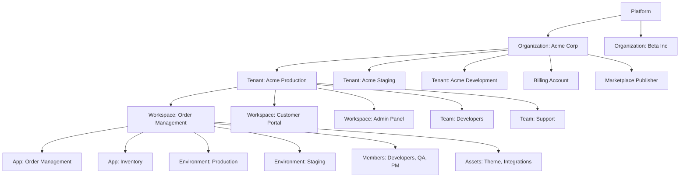
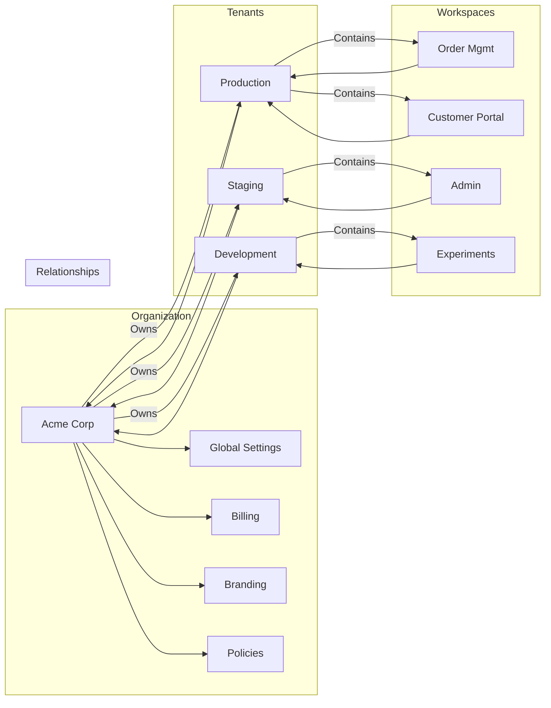
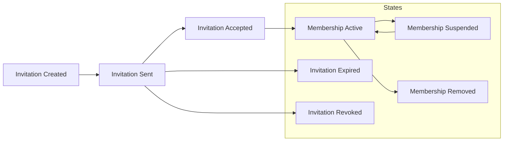
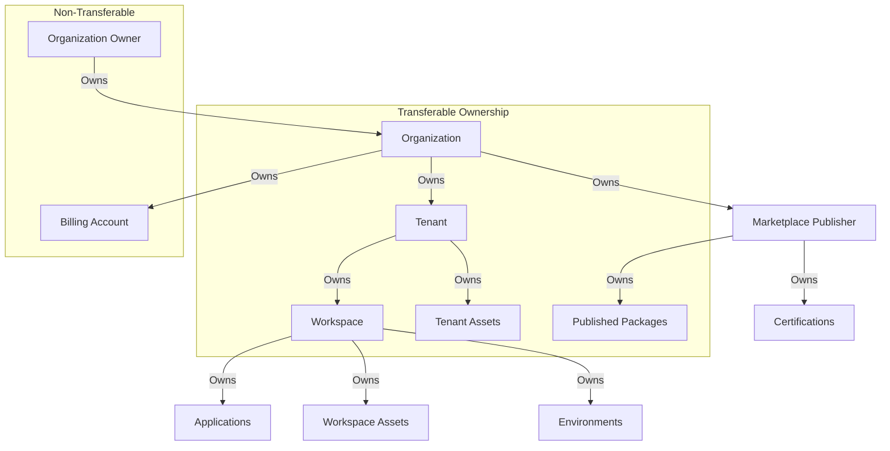
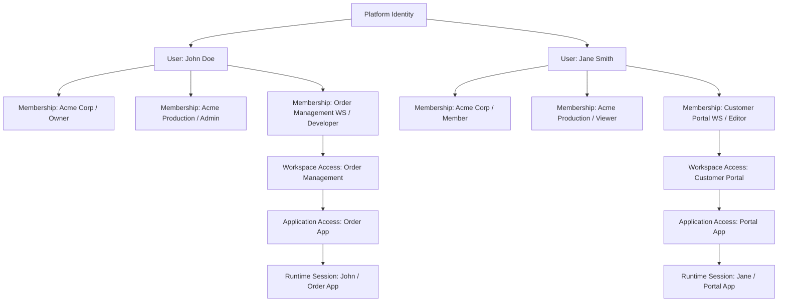
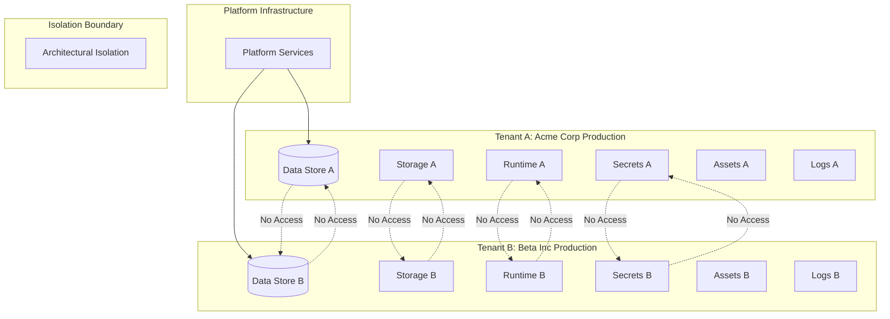
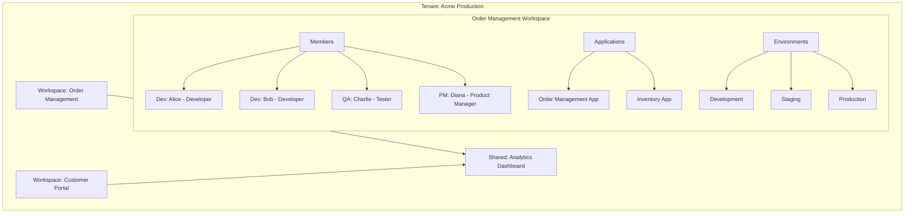
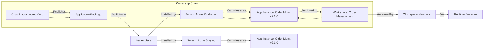
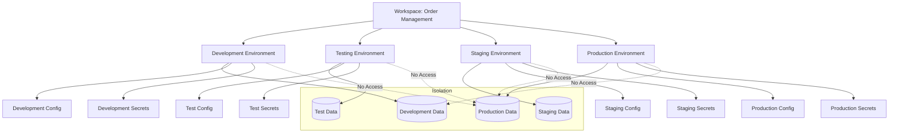
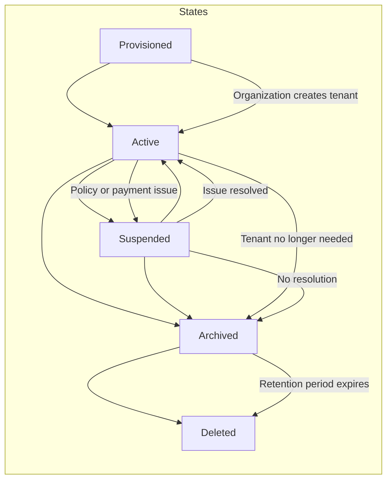

# Workspace & Tenant Model

**KB-043 — Workspace & Tenant Model Specification**

| Metadata | |
|----------|---|
| **Document ID** | KB-043 |
| **Title** | Workspace & Tenant Model |
| **Version** | 0.1.0 |
| **Status** | Drafting |
| **Repository** | KNOWLEDGE-BASE |
| **Suite** | Application Model Architecture |
| **Authors** | Architecture Team |
| **Reviewers** | TBD |
| **Intended Audience** | Platform architects, identity engineers, Runtime engineers, Builder engineers, Marketplace engineers, Backend engineers, Mobile engineers, security engineers, billing engineers, ecosystem partners |
| **Dependencies** | KB-041 Application Architecture Overview, KB-042 Application Manifest Specification |
| **Related Specifications** | Application Architecture Overview (KB-041), Application Manifest Specification (KB-042), Navigation Architecture (KB-044), Marketplace Architecture (KB-032), Runtime Architecture Overview (KB-051) |
| **Last Updated** | 2026-07-10 |

---

### Revision History

| Version | Date | Author | Change |
|---------|------|--------|--------|
| 0.1.0 | 2026-07-10 | AI Architecture Agent | Initial draft |

---

## Executive Summary

DUKADESK is a multi-tenant platform where users authenticate once through the platform and then participate in one or more tenant workspaces. A user may belong to multiple organizations, own multiple businesses, collaborate across workspaces, and access multiple applications without creating separate accounts.

The platform separates identity from membership, membership from authorization, authorization from ownership, and ownership from tenant data. This separation enables secure collaboration while preserving tenant independence.

A user's identity is global — it exists once at the platform level and is shared across every organization, tenant, and workspace they participate in. Membership connects a global identity to a specific organization or workspace. Authorization determines what a member can do within that scope. Ownership establishes who controls resources. Tenant data and runtime execution are isolated by architecture — no tenant can access another tenant's data or runtime state.

This document defines the canonical entities — Platform, Organization, Tenant, Workspace, User, Identity, Membership, Role, Environment, Application, Team, Invitation, and Resource — and the structural, ownership, membership, identity, and isolation relationships between them. It is the foundation for identity, authentication, authorization, the Builder, the Runtime, the Marketplace, billing, collaboration, and every platform service.

---

## 1. Purpose

The Workspace & Tenant Model exists to:

**Establish Tenant Boundaries** — Define the isolation boundaries that separate one tenant's data, runtime, assets, and configuration from another's. Tenant boundaries are the foundation of multi-tenant security and compliance.

**Standardize Ownership** — Define who owns what — which organizations own which tenants, which tenants own which workspaces and applications, which users own which resources. Standardized ownership enables clear accountability and governance.

**Support Collaboration** — Enable users to collaborate across organizational and tenant boundaries without compromising isolation. Collaboration is permission-based, auditable, and revocable.

**Enable Shared Identity** — Allow users to authenticate once and access multiple organizations, tenants, workspaces, and applications without creating separate accounts. Identity is global; membership is scoped.

**Define Membership Relationships** — Establish how users join, participate in, and leave organizations, tenants, and workspaces. Membership is explicit, invite-based, and lifecycle-managed.

**Provide Isolation** — Guarantee that one tenant's data, runtime, and assets are inaccessible to another tenant. Isolation is enforced by architecture — not by policy alone.

**Support Lifecycle Governance** — Define standard lifecycles for organizations, tenants, workspaces, memberships, and environments. Lifecycle governance ensures that resources are created, used, and retired in a controlled manner.

**Enable Future Federation** — Define the model in a way that supports future federation between organizations, cross-platform collaboration, and multi-region deployment.

---

## 2. Scope

### In Scope

The model governs:

| Domain | Elements |
|--------|----------|
| **Organizations** | Identity, ownership, legal entity, business profile, branding, billing ownership, Marketplace ownership, governance |
| **Tenants** | Identity, isolation, metadata, branding, applications, assets, lifecycle, governance |
| **Workspaces** | Purpose, collaboration, separation, application grouping, resource management, operational boundaries, lifecycle |
| **Users** | Global identity, profile, authentication identity, membership relationships, preferences, device associations |
| **Memberships** | Lifecycle, invitations, acceptance, suspension, removal, expiration |
| **Roles** | Structural role definitions (not authorization rules) |
| **Ownership** | Applications, templates, themes, Marketplace assets, integrations, billing accounts, AI assets, domains, environments |
| **Environments** | Development, testing, staging, production — ownership and isolation |
| **Applications** | Relationships to organizations, tenants, workspaces, Marketplace, Runtime |
| **Teams** | Collaborative groupings — developers, designers, administrators, editors, support, finance |
| **Invitations** | Lifecycle, acceptance, expiration |
| **Resources** | Assets, configurations, integrations, and their ownership |

### Out of Scope

The model does not define:

- **Authentication protocols**: How users prove their identity is defined in the Identity & Access Management Suite.
- **Authorization rules**: What members can do within their roles is defined in the authorization model.
- **Runtime execution**: How applications are loaded and rendered is defined in the Runtime Suite.
- **Billing implementation**: How organizations are billed for platform services is defined in the Billing Architecture Suite.
- **Backend APIs**: How the model is exposed through APIs is implementation-specific.

---

## 3. Architectural Principles

### Identity Is Global

A user's identity exists once at the platform level. It is not duplicated across organizations, tenants, or workspaces. Every membership, every role, every permission, and every action traces back to a single global identity.

### Tenants Are Isolated

One tenant cannot access another tenant's data, runtime state, assets, configuration, or secrets. Tenant isolation is enforced by the architecture — data stores are partitioned, runtime instances are separated, asset storage is scoped, and secrets are tenant-specific.

### Membership Is Explicit

No user has access to an organization, tenant, or workspace without an explicit membership. Memberships are created through invitations, grants, or administrative actions. There is no implicit membership — no "everyone in the organization" access without explicit membership records.

### Ownership Is Traceable

Every resource has an owner. Ownership is recorded, auditable, and transferable. Ownership determines who can modify, delete, transfer, or govern a resource. Ownership chains are traceable from the Platform level down to individual resources.

### Collaboration Is Permission-Based

Collaboration across organizational and tenant boundaries is explicitly configured. Every cross-boundary access — viewing a workspace, editing an asset, deploying an application — requires an explicit permission grant. Collaboration is revocable and auditable.

### Isolation Is Enforced by Architecture

Tenant isolation is not a policy that can be accidentally misconfigured. It is enforced by the architecture — data is stored in tenant-partitioned stores, runtime instances run in tenant-scoped containers, and asset references include tenant scope.

### Organizations Own Business Resources

Organizations are the top-level business boundary. Organizations own tenants, billing accounts, Marketplace publisher identities, and platform-level configuration. Tenants never exist outside of an organization.

### Workspaces Organize Collaboration

Workspaces are the unit of collaboration. Users work together within workspaces. Workspaces group applications, assets, and resources for specific purposes — development projects, operational business units, partner collaborations.

### Applications Belong to Tenants

Applications are installed into tenants. A single Marketplace-published application, when installed into multiple tenants, produces multiple tenant-specific application instances. Applications are never owned directly by users — they are owned by tenants.

### Users Never Belong Directly to Applications

Users do not have direct memberships to applications. They have memberships to workspaces or organizations, and through those memberships they access applications. This indirection ensures that application access is governed by workspace membership, not by application-specific user lists.

---

## 4. Canonical Domain Model

### Primary Entities

| Entity | Definition |
|--------|------------|
| **Platform** | The DUKADESK platform itself. Owns all global infrastructure, identity services, the Marketplace, and platform governance. Is the root of all trust. |
| **Organization** | The top-level business boundary. An organization is a legal or operational entity that owns tenants, billing, Marketplace publishers, and platform-level configuration. Examples: Acme Corp, Beta Inc. |
| **Tenant** | The deployable business unit. A tenant is an isolated instance of the platform within an organization. Tenants own workspaces, applications, assets, data, and configuration. Examples: Acme Corp's Production Tenant, Acme Corp's Staging Tenant. |
| **Workspace** | The unit of collaboration. A workspace groups applications, assets, and resources for a specific purpose within a tenant. Users collaborate within workspaces. Examples: Order Management Development, Customer Portal Operations, Analytics Research. |
| **User** | A human participant in the platform. Users have a global identity and may be members of multiple organizations, tenants, and workspaces. |
| **Identity** | The platform-wide representation of a user. Identity includes authentication credentials, profile information, and global preferences. Identity is distinct from membership — you can have an identity without being a member of any organization. |
| **Membership** | The association between a user identity and an organization, tenant, or workspace. Membership includes the assigned role and membership state (active, suspended, pending). |
| **Role** | A structural label that defines a category of membership. Roles are used for authorization but are defined structurally. Examples: Owner, Administrator, Editor, Viewer. |
| **Environment** | A deployment context within a tenant. Environments isolate deployment stages — development, testing, staging, production. Each environment has its own configuration, data, and access controls. |
| **Application** | A DUKADESK application installed into a tenant workspace. Applications are instances of Marketplace-published Application Packages, bound to tenant-specific configuration. |
| **Team** | A named group of members within an organization or tenant. Teams facilitate group-level collaboration and resource sharing. Examples: Development Team, Design Team, Support Team. |
| **Invitation** | A pending membership grant. Invitations are created by administrators and accepted by users to establish membership. Invitations have expiration dates and can be revoked. |
| **Resource** | Any platform asset owned by an organization, tenant, or workspace. Resources include applications, themes, capabilities, components, integrations, assets, configurations, and secrets. |

---

## 5. Platform Hierarchy

### Structural Hierarchy

```
Platform
└── Organization
    ├── Tenant
    │   ├── Workspace
    │   │   ├── Members (Users with Roles)
    │   │   ├── Applications (Instances of Marketplace Packages)
    │   │   ├── Assets (Themes, Components, Resources)
    │   │   └── Environments (Development, Staging, Production)
    │   ├── Teams (Developers, Designers, Administrators)
    │   └── Tenant Settings (Branding, Configuration, Policies)
    ├── Billing (Subscription, Invoices, Payment Methods)
    ├── Marketplace Publisher (Published Assets, Certifications)
    └── Organization Settings (Global Policies, Branding, Identity)
```

### Platform Level

The Platform is the root of the hierarchy. It owns:

- Global identity services — authentication, session management.
- The Marketplace — package storage, certification, distribution.
- Platform infrastructure — runtime hosting, data storage, asset serving.
- Platform governance — global policies, compliance, security standards.
- Platform-level roles — platform administrators, support engineers.

**Responsibilities**: Maintain platform availability, security, and governance. Ensure tenant isolation. Provide identity services. Operate the Marketplace.

### Organization Level

Organizations are the top-level business boundary. Each organization owns:

- Tenants — production, staging, development instances.
- Billing — subscriptions, invoices, payment methods.
- Marketplace publisher identity — published assets, certifications, trust score.
- Organization settings — global branding, policies, identity configuration.
- Organization-level roles — organization owners, administrators, billing managers.

**Responsibilities**: Manage tenant lifecycle. Own billing relationships. Govern organization-level policies. Manage Marketplace publishing identity.

### Tenant Level

Tenants are the deployable business unit. Each tenant owns:

- Workspaces — collaboration groups for development and operations.
- Teams — named groups of members.
- Applications — installed application instances.
- Assets — themes, components, integrations, configurations.
- Environments — deployment contexts with isolated configuration.
- Tenant settings — branding, policies, feature flags.

**Responsibilities**: Isolate business operations. Manage workspace lifecycle. Own tenant-specific applications and assets. Enforce tenant-level governance.

### Workspace Level

Workspaces are the unit of collaboration. Each workspace contains:

- Members — users with workspace-level roles.
- Applications — application instances deployed in the workspace.
- Assets — workspace-scoped resources.
- Environments — deployment contexts.

**Responsibilities**: Organize collaboration. Group applications for specific purposes. Manage workspace-level resources.

---

## 6. Organization Model

### Organization Identity

| Field | Required | Description | Example |
|-------|----------|-------------|---------|
| organizationId | Yes | Globally unique identifier | `org_acme_corp` |
| legalName | Yes | Legal entity name | "Acme Corporation" |
| displayName | Yes | Display name | "Acme Corp" |
| slug | Yes | URL-safe identifier | `acme-corp` |
| taxId | No | Tax or registration identifier | `12-3456789` |
| website | No | Organization website | `https://acme.com` |
| country | No | Country of registration | `US` |

### Ownership

Each organization has one or more **owners** — users who have full control over the organization, its tenants, billing, and Marketplace identity. Ownership is a specific role within the organization's membership model.

**Ownership rights**: Create and delete tenants, manage billing, publish to the Marketplace, transfer ownership, delete the organization.

### Legal Entity

The organization represents a legal or operational entity. Organizations may be:

- **For-profit businesses**: Corporations, LLCs, partnerships.
- **Non-profit organizations**: Charities, foundations.
- **Government entities**: Agencies, departments, municipalities.
- **Educational institutions**: Universities, schools.
- **Sole proprietorships**: Individual business owners.

### Business Profile

Organizations maintain a business profile including:

- Industry classification.
- Company size (employee count).
- Geographic presence.
- Business verification status.

### Branding

Organizations may configure global branding that applies to all tenants:

- Organization logo.
- Organization color scheme.
- Organization favicon.
- Organization email templates.

Tenants may override organization branding with tenant-specific branding.

### Billing Ownership

The organization owns the billing relationship with the platform:

- **Subscription plan**: The organization's platform subscription level.
- **Payment methods**: Credit cards, invoices, purchase orders.
- **Invoices**: Monthly billing statements.
- **Usage tracking**: Resource consumption across all tenants.

### Marketplace Ownership

The organization owns the Marketplace publisher identity:

- **Publisher ID**: The organization's publisher identifier.
- **Published assets**: All capabilities, components, themes, templates published by the organization.
- **Certifications**: Certification records for published assets.
- **Trust score**: Publisher trust indicator.

### Governance

Organizations define governance policies that apply to all tenants:

- **Authentication policy**: Password requirements, MFA requirements, SSO configuration.
- **Membership policy**: Who can create tenants, who can invite members.
- **Compliance policy**: Regulatory requirements that apply to the organization.
- **Data policy**: Data retention, data residency, data export requirements.

---

## 7. Tenant Model

### Tenant Identity

| Field | Required | Description | Example |
|-------|----------|-------------|---------|
| tenantId | Yes | Globally unique identifier | `tnnt_acme_production` |
| organizationId | Yes | Owning organization | `org_acme_corp` |
| displayName | Yes | Display name | "Acme Production" |
| slug | Yes | URL-safe identifier | `acme-prod` |
| type | Yes | Tenant type | `production`, `staging`, `development`, `sandbox` |

### Tenant Isolation

Tenants are isolated at every architectural layer:

| Layer | Isolation Mechanism |
|-------|-------------------|
| **Data** | Tenant-partitioned data stores. Every query includes tenant scope. |
| **Storage** | Tenant-scoped storage namespaces. File paths and object keys include tenant ID. |
| **Assets** | Tenant-scoped asset references. Asset URLs include tenant scope. |
| **Runtime** | Tenant-scoped Runtime instances. Runtime configuration is tenant-specific. |
| **Integrations** | Tenant-specific integration credentials. API keys, tokens, and endpoints are per-tenant. |
| **Secrets** | Tenant-scoped secret storage. Encryption keys are per-tenant. |
| **Analytics** | Tenant-partitioned analytics data. Reports are scoped to tenant. |
| **Logging** | Tenant-tagged log entries. Log queries filter by tenant. |
| **Caching** | Tenant-scoped cache namespaces. Cache keys include tenant ID. |

### Tenant Metadata

Tenants carry metadata for identification and management:

- **Display name**: Human-readable tenant name.
- **Description**: Purpose and scope of the tenant.
- **Type**: Production, staging, development, sandbox.
- **Region**: Geographic region for data residency.
- **Status**: Active, suspended, archived.
- **Created**: Creation timestamp.
- **Updated**: Last modification timestamp.

### Tenant Branding

Tenants may override organization-level branding:

- **Logo**: Tenant-specific logo.
- **Color scheme**: Brand colors for the tenant.
- **Favicon**: Tenant-specific browser tab icon.
- **Email templates**: Tenant-branded email communications.
- **Theme overrides**: Tenant-specific design token overrides.

### Tenant Applications

Tenants own installed application instances:

- Application instances are created by installing Marketplace packages into the tenant.
- Each application instance has tenant-specific configuration.
- Application instances are scoped to workspaces within the tenant.
- Application lifecycle (install, update, remove) is managed at the tenant level.

### Tenant Assets

Tenants own tenant-scoped assets:

- Custom themes developed for the tenant.
- Custom components built for the tenant.
- Integration configurations (API endpoints, authentication).
- Data models and schemas.
- Workflow definitions.

### Tenant Lifecycle

| Stage | Entry | Exit | Ownership |
|-------|-------|------|-----------|
| **Provisioned** | Organization creates tenant | Tenant is configured | Organization owner |
| **Active** | Tenant is configured | Tenant enters maintenance or suspension | Tenant administrator |
| **Suspended** | Policy violation or payment failure | Issue is resolved or tenant is archived | Platform governance |
| **Archived** | Tenant is no longer needed | Data retention period expires | Organization owner |
| **Deleted** | Data retention period expires | Tenant is permanently removed | Platform governance |

### Tenant Governance

Tenants enforce governance policies inherited from the organization plus tenant-specific policies:

- **Membership governance**: Who can be invited to the tenant.
- **Application governance**: Which applications can be installed.
- **Environment governance**: How environments are managed.
- **Data governance**: Data retention, export, and deletion policies.
- **Compliance governance**: Regulatory requirements specific to the tenant.

---

## 8. Workspace Model

### Purpose of Workspaces

Workspaces organize collaboration within a tenant. They serve as the operational context for teams to work on applications, manage resources, and coordinate activities.

### Workspace Functions

**Organize Collaboration** — Workspaces bring together the people, applications, and resources needed for a specific purpose. A workspace for "Order Management Development" includes the development team, the order management application instances, and the related assets and environments.

**Separate Development Activities** — Workspaces separate concerns within a tenant. The "Order Management" workspace is independent of the "Customer Portal" workspace — different members, different applications, different environments.

**Group Applications** — Workspaces group related application instances. A single workspace may contain multiple applications that work together — order management, inventory, and shipping applications running in the same workspace.

**Manage Resources** — Workspaces own workspace-scoped resources — configurations, assets, integrations, secrets. Resources are managed at the workspace level and shared among the workspace's applications.

**Provide Operational Boundaries** — Workspaces define operational boundaries. Development work happens in development workspaces. Production operations happen in production workspaces. Operational policies can be scoped to workspaces.

### Workspace Lifecycle

| Stage | Entry | Exit | Ownership |
|-------|-------|------|-----------|
| **Created** | Tenant administrator creates workspace | Workspace is configured | Tenant administrator |
| **Active** | Workspace is configured | Workspace enters archival | Workspace administrator |
| **Archived** | Workspace is no longer active | Data retention period expires | Tenant administrator |
| **Deleted** | Data retention period expires | Workspace is permanently removed | Tenant governance |

### Workspace Types

| Type | Purpose | Typical Members |
|------|---------|-----------------|
| **Development** | Build and test applications | Developers, designers, QA |
| **Staging** | Pre-production validation | QA engineers, product managers |
| **Production** | Live application operation | Operations team, support |
| **Sandbox** | Experimentation and learning | Individual users, trainees |
| **Collaboration** | Cross-team projects | Members from multiple teams |

---

## 9. User Model

### Global Identity

Every user has a single global identity on the platform:

| Field | Required | Description | Example |
|-------|----------|-------------|---------|
| userId | Yes | Globally unique identifier | `usr_john_doe` |
| email | Yes | Primary email address | `john@acme.com` |
| displayName | Yes | Public display name | "John Doe" |
| avatar | No | Profile avatar URL | `https://.../avatar.png` |
| locale | No | Preferred locale | `en-US` |
| timezone | No | Preferred timezone | `America/New_York` |

### User Profile

The user profile includes:

- **Personal information**: Name, email, avatar.
- **Contact preferences**: Communication preferences, notification settings.
- **Professional information**: Title, department, organization (informational only).

### Authentication Identity

The user's authentication identity is managed by the Identity system:

- **Authentication methods**: Email/password, SSO, OAuth, magic link.
- **MFA configuration**: Multi-factor authentication settings.
- **Session management**: Active sessions, device trust.

### Membership Relationships

A user's memberships define their access to organizations, tenants, and workspaces:

- One user may be a member of multiple organizations.
- Within each organization, a user may be a member of multiple tenants.
- Within each tenant, a user may be a member of multiple workspaces.
- Each membership has a role and a state (active, suspended, pending).

### Personal Preferences

Users may set personal preferences that apply across all their memberships:

- **Theme preference**: Light, dark, system default.
- **Language preference**: UI language.
- **Notification preferences**: Which notifications to receive and how.
- **Accessibility preferences**: Font size, contrast, motion reduction.

### Device Associations

Users may associate devices with their identity:

- Registered devices for push notifications.
- Trusted devices for authentication.
- Device-specific preferences.

---

## 10. Membership Model

### Membership Lifecycle

```
Invitation Created
  ↓
Invitation Sent
  ↓
Invitation Accepted
  ↓
Membership Active
  ↓
Membership Suspended / Membership Expired / Membership Removed
  ↓
Membership Terminated
```

### Invitations

Memberships begin with invitations:

- **Initiator**: An existing member with invitation privileges creates an invitation.
- **Target**: The invitation targets a specific user (by email or user ID).
- **Scope**: The invitation is scoped to an organization, tenant, or workspace.
- **Role**: The invitation specifies the role the user will receive.
- **Expiration**: Invitations expire after a defined period (default 7 days).
- **Revocation**: Invitations may be revoked by the initiator before acceptance.

### Acceptance

When a user accepts an invitation:

1. If the user has no platform identity, one is created.
2. The membership record is created with the specified role.
3. The user gains access to the organization, tenant, or workspace.
4. Notifications are sent to relevant administrators.

### Membership States

| State | Description | Transitions |
|-------|-------------|-------------|
| **Pending** | Invitation sent, not yet accepted | Accept → Active, Expire → Terminated |
| **Active** | Membership is current and valid | Suspend → Suspended, Remove → Terminated |
| **Suspended** | Membership temporarily disabled | Restore → Active, Remove → Terminated |
| **Terminated** | Membership has ended | None (permanent) |

### Suspension

Memberships may be suspended by:

- **Administrative action**: An administrator suspends the member.
- **Policy violation**: Automated policy enforcement suspends the member.
- **Organization action**: The organization's membership policy triggers suspension.

Suspended members retain their membership record but lose access to the scoped resources. Access is restored when the suspension is lifted.

### Removal

Memberships may be removed by:

- **Administrative action**: An administrator removes the member.
- **Self-removal**: The member leaves the organization, tenant, or workspace.
- **Automatic cleanup**: Inactive memberships are removed after a defined period.

Removal is permanent. A new invitation is required to rejoin.

### Expiration

Some memberships have expiration:

- **Temporary memberships**: Contractor access, project-based access, trial access.
- **Automatic expiration**: Membership expires after the defined period.
- **Renewal**: Expired memberships may be renewed by an administrator.

---

## 11. Ownership Model

### Ownership Definitions

| Resource | Owner | Transferable |
|----------|-------|--------------|
| **Organization** | Organization owner(s) | Yes |
| **Tenant** | Owning organization | Yes (to another org) |
| **Workspace** | Tenant (via administrators) | Within tenant |
| **Application** | Tenant (via workspace) | Within tenant |
| **Marketplace Package** | Publishing organization | Yes |
| **Theme** | Tenant or organization | Yes |
| **Custom Component** | Tenant or organization | Yes |
| **Integration** | Tenant or workspace | Within tenant |
| **Billing Account** | Organization | No (organization-bound) |
| **AI Asset** | Tenant or organization | Yes |
| **Domain** | Organization | Yes |
| **Environment** | Workspace | Within workspace |

### Ownership Rules

- Every resource has exactly one owner at each level of the hierarchy.
- Ownership may be transferred through formal transfer processes.
- Ownership transfers are recorded in audit logs.
- Ownership determines who can modify, delete, or govern the resource.
- Ownership chains are traceable — the owner of a workspace is the tenant, the owner of the tenant is the organization, the owner of the organization is the organization owner.

### Transfer of Ownership

Ownership transfers follow a defined process:

1. **Initiation**: Current owner initiates transfer.
2. **Verification**: Transfer is verified by both parties.
3. **Execution**: Ownership record is updated.
4. **Notification**: Relevant parties are notified.
5. **Audit**: Transfer is recorded in audit log.

---

## 12. Team Model

### Purpose of Teams

Teams are named groups of members within an organization or tenant. Teams facilitate group-level collaboration, resource sharing, and permission management.

### Team Examples

| Team | Typical Members | Purpose |
|------|-----------------|---------|
| **Developers** | Software engineers | Build and maintain applications |
| **Designers** | UI/UX designers | Create and manage themes and assets |
| **Administrators** | System admins | Manage organization and tenant settings |
| **Editors** | Content managers | Manage application content and localization |
| **Support** | Customer support | Manage support workflows and knowledge base |
| **Finance** | Accounting staff | Manage billing and subscriptions |

### Team Membership

Teams have their own memberships:

- Users are added to teams by team administrators.
- A user may belong to multiple teams.
- Team membership may grant workspace-level access.
- Team membership may be time-limited.

### Team Relationships

Teams relate to the organizational hierarchy:

- Teams belong to organizations or tenants.
- Teams may be granted access to workspaces.
- Teams may be assigned to applications for management.
- Teams may own resources on behalf of the organization.

---

## 13. Environment Model

### Environment Types

| Type | Purpose | Typical Configuration |
|------|---------|----------------------|
| **Development** | Active development and testing | Connected to dev APIs, mock data |
| **Testing** | QA and integration testing | Connected to test APIs, test data |
| **Staging** | Pre-production validation | Mirrors production configuration |
| **Production** | Live application operation | Connected to production APIs, real data |
| **Sandbox** | Experimentation and learning | Isolated, resettable, no real data |

### Environment Ownership

- Environments belong to workspaces.
- Each workspace may have multiple environments.
- Environments are isolated from each other — development data does not affect production.
- Environment configuration (API endpoints, feature flags, secrets) is environment-specific.

### Environment Isolation

Environments are isolated by:

- **Data**: Each environment has its own data store or data namespace.
- **Configuration**: API endpoints, feature flags, and settings are per-environment.
- **Secrets**: API keys, tokens, and credentials are per-environment.
- **Deployment**: Application deployments are environment-scoped.
- **Access**: Environment access is controlled by workspace roles.

---

## 14. Application Relationships

### Application to Organization

Applications are published by organizations through the Marketplace. The publishing organization owns the application's Marketplace identity — the publisher ID, the application's certification, and the application's distribution.

### Application to Tenant

Applications are installed into tenants. Installation creates a tenant-specific application instance with tenant-specific configuration, branding, and data. A single published application produces one application instance per tenant installation.

### Application to Workspace

Application instances belong to workspaces. Workspaces group related application instances for specific purposes — development, operations, collaboration. Users access applications through workspace membership.

### Application to Marketplace

Applications are distributed through the Marketplace as Application Packages. The Marketplace manages application certification, versioning, discovery, and lifecycle. Tenants install applications from the Marketplace into their workspaces.

### Application to Runtime

The Runtime executes application instances. Each application instance runs within a tenant-scoped Runtime context. The Runtime loads the application's Manifest, resolves dependencies, applies tenant configuration, and renders the application for workspace members.

### Application Ownership

- The **publishing organization** owns the application's Marketplace identity and distribution.
- The **installing tenant** owns the application instance and its configuration.
- The **workspace** owns the application deployment and operational context.
- **Users** never own applications directly — they access applications through workspace memberships.

---

## 15. Identity Relationships

### Identity Flow

```
Global Identity
        ↓
   Membership (Organization / Tenant / Workspace)
        ↓
   Workspace Access
        ↓
   Application Access
        ↓
   Runtime Session
```

### Global Identity

The user's global identity exists at the Platform level. It includes:

- Unique user identifier.
- Authentication credentials.
- Profile information.
- Global preferences.

The global identity does not include membership information — that is stored in the membership model.

### Membership

Memberships connect a global identity to a specific scope:

- **Organization membership**: The user has a role within the organization.
- **Tenant membership**: The user has a role within the tenant.
- **Workspace membership**: The user has a role within the workspace.

Each membership carries a role and a state. A user may have multiple memberships across multiple scopes.

### Workspace Access

Workspace access is determined by workspace membership:

- Users with active workspace memberships can access the workspace.
- Workspace access includes access to the workspace's applications and resources.
- Workspace access is governed by the user's workspace role.

### Application Access

Application access flows from workspace membership:

- Users access applications through workspace membership.
- The Runtime verifies that the user has an active membership in the workspace that owns the application.
- Application-level access control is delegated to the application's permission model (declared in the application's Manifest).

### Runtime Session

When a user accesses an application:

1. The user authenticates (or has an active session).
2. The Runtime resolves the user's identity.
3. The Runtime verifies the user's membership in the workspace.
4. The Runtime loads the application with tenant and workspace context.
5. The Runtime enforces application-level permissions.

---

## 16. Tenant Isolation

### Isolation by Layer

| Layer | Isolation Guarantee |
|-------|---------------------|
| **Data** | No tenant can query, read, or modify another tenant's data. Data stores are partitioned by tenant ID. Cross-tenant queries are architecturally prevented. |
| **Storage** | No tenant can access another tenant's files, assets, or blobs. Storage paths include tenant scope. Access controls enforce tenant boundaries. |
| **Assets** | No tenant can reference another tenant's assets. Asset identifiers include tenant scope. Asset resolution validates tenant ownership. |
| **Runtime** | No tenant can observe or affect another tenant's Runtime execution. Runtime instances are tenant-scoped. Configuration is per-tenant. |
| **Integrations** | No tenant can use another tenant's integration credentials. API keys, tokens, and endpoints are per-tenant. Integration secrets are tenant-scoped. |
| **Secrets** | No tenant can access another tenant's secrets. Secret storage is partitioned by tenant. Encryption keys are per-tenant. |
| **Analytics** | No tenant can view another tenant's analytics data. Analytics data is tagged with tenant ID. Reports are scoped to tenant. |
| **Logging** | No tenant can read another tenant's logs. Log entries include tenant ID. Log access is tenant-scoped. |

### Architectural Enforcement

Tenant isolation is enforced by architecture, not by policy:

- **Data layer**: Database queries include tenant ID in WHERE clauses. Row-level security ensures cross-tenant queries return no results.
- **Storage layer**: Storage prefixes include tenant ID. Access control lists are tenant-scoped.
- **Runtime layer**: Runtime instances are created per-tenant or per-session. Runtime configuration is loaded from tenant-scoped storage.
- **Integration layer**: Integration secrets are stored in tenant-scoped vaults. API calls include tenant context.

### Multi-Tenant vs. Single-Tenant Deployment

The Workspace & Tenant Model supports both deployment models:

- **Multi-tenant**: Multiple tenants share infrastructure. Isolation is enforced by the architecture.
- **Single-tenant**: Each tenant has dedicated infrastructure. Isolation is physical. Single-tenant deployment is an operational choice, not a model difference.

---

## 17. Lifecycle

### Organization Lifecycle

| Stage | Entry | Exit |
|-------|-------|------|
| **Registered** | User creates organization | Organization is configured |
| **Active** | Organization is configured | Organization is suspended or archived |
| **Suspended** | Policy violation or payment failure | Issue is resolved or organization is archived |
| **Archived** | Organization is no longer active | Data retention period expires |
| **Deleted** | Data retention period expires | Organization is permanently removed |

### Tenant Lifecycle

| Stage | Entry | Exit |
|-------|-------|------|
| **Provisioned** | Organization creates tenant | Tenant is configured |
| **Active** | Tenant is configured | Tenant is suspended or archived |
| **Suspended** | Policy violation or payment failure | Issue is resolved or tenant is archived |
| **Archived** | Tenant is no longer needed | Data retention period expires |
| **Deleted** | Data retention period expires | Tenant is permanently removed |

### Workspace Lifecycle

| Stage | Entry | Exit |
|-------|-------|------|
| **Created** | Administrator creates workspace | Workspace is configured |
| **Active** | Workspace is configured | Workspace is archived |
| **Archived** | Workspace is no longer active | Data retention period expires |
| **Deleted** | Data retention period expires | Workspace is permanently removed |

### Membership Lifecycle

| Stage | Entry | Exit |
|-------|-------|------|
| **Pending** | Invitation is sent | Invitation is accepted or expired |
| **Active** | Invitation is accepted | Membership is suspended or removed |
| **Suspended** | Administrative or policy action | Suspension is lifted or membership is removed |
| **Terminated** | Membership is removed | None (permanent) |

### Application Lifecycle

| Stage | Entry | Exit |
|-------|-------|------|
| **Published** | Organization publishes to Marketplace | Application enters deprecation |
| **Installed** | Tenant installs from Marketplace | Application is removed from tenant |
| **Active** | Application is configured and running | Application is archived or updated |
| **Updated** | New version is installed | Application continues running |
| **Removed** | Application is uninstalled | Application instance is deleted |

### Environment Lifecycle

| Stage | Entry | Exit |
|-------|-------|------|
| **Created** | Workspace creates environment | Environment is configured |
| **Active** | Environment is configured | Environment is archived |
| **Archived** | Environment is no longer active | Environment is deleted |
| **Deleted** | Environment is removed | Resources are cleaned up |

### Ownership Lifecycle

| Stage | Entry | Exit |
|-------|-------|------|
| **Assigned** | Resource is created or transferred | Ownership is transferred |
| **Transferred** | Ownership changes to a new owner | Transfer is completed |
| **Revoked** | Ownership is revoked by governance | Resource is re-assigned or deleted |

### Invitation Lifecycle

| Stage | Entry | Exit |
|-------|-------|------|
| **Created** | Administrator creates invitation | Invitation is sent |
| **Sent** | Invitation is delivered to target | Invitation is accepted, revoked, or expired |
| **Accepted** | Target user accepts invitation | Membership is created |
| **Revoked** | Administrator revokes invitation | Invitation is canceled |
| **Expired** | Invitation period ends | Invitation is closed |

---

## 18. Collaboration Model

### Collaboration Patterns

**Intra-Team Collaboration** — Users within the same workspace collaborate on applications, assets, and resources. All members of the workspace have access defined by their roles.

**Cross-Team Collaboration** — Users from different teams within the same tenant collaborate by being added to shared workspaces. Each user retains their team affiliation while gaining workspace access.

**Cross-Tenant Collaboration** — Users from different tenants within the same organization may collaborate through organization-level workspaces or cross-tenant sharing.

**External Collaboration** — Users outside the organization may be invited to specific workspaces as external collaborators with limited roles.

### Invitations

Collaboration begins with invitations:

- Invitations may be scoped to organizations, tenants, or workspaces.
- Invitations specify the target user and the role they will receive.
- Invitations carry expiration dates.
- Invitations may be revoked before acceptance.

### Workspace Sharing

Workspaces support sharing with:

- Individual users (by email or user ID).
- Teams (all members of a team).
- Organization groups (future).
- Partner organizations (future).

### Cross-Team Collaboration

Cross-team collaboration is managed through:

- **Shared workspaces**: Teams share a workspace for joint projects.
- **Role-based access**: Each team member's access is determined by their role.
- **Resource sharing**: Applications, assets, and configurations are shared within the workspace.

### External Collaborators

External collaborators are users who do not belong to the owning organization:

- They have limited roles (typically Viewer or Editor, not Administrator or Owner).
- Their access is time-limited (optional).
- Their activity is audited separately.
- They cannot invite other users.

### Partner Organizations

Partner organizations (future) enable:

- Cross-organization workspaces.
- Shared application development.
- Joint Marketplace publishing.
- Federated identity.

### Read-Only Participants

Read-only participants can view workspace content but cannot modify it:

- Viewers can see applications, assets, and configurations.
- Viewers cannot create, edit, or delete resources.
- Viewers cannot invite other users.

### Future Federation

The collaboration model supports future federation:

- **Cross-platform identity**: Users from other DUKADESK instances.
- **Federated workspaces**: Workspaces that span multiple platform instances.
- **Federated applications**: Applications that access resources from multiple platform instances.

---

## 19. Governance

### Governance Responsibilities

| Role | Responsibilities |
|------|-----------------|
| **Platform** | Global governance — platform policies, compliance standards, security requirements, tenant isolation guarantees, Marketplace governance. |
| **Organization Owner** | Organization governance — membership policies, tenant lifecycle, billing management, Marketplace publishing, organization-level compliance. |
| **Tenant Administrator** | Tenant governance — workspace lifecycle, application installation, tenant-level policies, tenant branding, tenant compliance. |
| **Workspace Administrator** | Workspace governance — membership management, environment lifecycle, workspace-level configuration, workspace compliance. |
| **Organization Administrator** | Delegated organization management — user management, policy enforcement, compliance reporting. |
| **Member** | Personal governance — accepting invitations, maintaining accurate profiles, complying with policies. |

### Policy Inheritance

Policies flow down the hierarchy:

- Platform policies apply to all organizations.
- Organization policies apply to all tenants within the organization.
- Tenant policies apply to all workspaces within the tenant.
- Workspace policies apply to all members and resources within the workspace.

Lower-level policies may be more restrictive than higher-level policies. They may not be less restrictive.

### Audit

Governance requires auditability:

- All membership changes are recorded.
- All ownership changes are recorded.
- All policy changes are recorded.
- All governance actions are recorded.
- Audit logs are immutable and tenant-scoped.

---

## 20. Security Boundaries

### Identity Boundary

The identity boundary separates the platform's identity system from all other systems:

- User identities are managed by the Identity system.
- No other system creates or modifies user identities.
- The Identity system authenticates users and issues session tokens.
- Other systems consume authentication results but do not participate in authentication.

### Tenant Boundary

The tenant boundary separates one tenant from another:

- No tenant can access another tenant's data.
- No tenant can access another tenant's runtime.
- No tenant can access another tenant's configuration.
- The tenant boundary is enforced at every architectural layer.

### Workspace Boundary

The workspace boundary separates workspaces within a tenant:

- Workspaces have their own membership lists.
- Workspaces have their own applications and resources.
- Cross-workspace access requires explicit membership.
- Workspace membership does not imply access to other workspaces.

### Application Boundary

The application boundary separates application instances:

- Application instances are isolated within their workspace.
- Application instances have their own configuration and state.
- Application instances cannot access each other's runtime.
- Application-level permissions are enforced by the Runtime.

### Environment Boundary

The environment boundary separates deployment environments:

- Development environments cannot access production data.
- Production environments cannot be modified from development tools.
- Environment-specific secrets are isolated.
- Environment access is controlled by workspace roles.

### Runtime Boundary

The runtime boundary separates Runtime execution contexts:

- Each Runtime session is scoped to a single user, workspace, and application.
- Runtime sessions cannot access each other's state.
- Runtime configuration is scoped to the tenant and workspace.
- Runtime isolation is enforced by the Runtime architecture.

---

## 21. Observability

### Observable Data

| Scope | Observable Data |
|-------|-----------------|
| **Organizations** | Count, status distribution, tenant count, member count, billing status, creation/archival dates |
| **Tenants** | Count per organization, status distribution, workspace count, application count, member count, creation/archival dates |
| **Memberships** | Count per scope, role distribution, status distribution, invitation acceptance rate, suspension rate |
| **Workspace Activity** | Active workspaces, member activity, application deployment frequency, environment usage |
| **Ownership Changes** | Transfer frequency, transfer volume, common transfer patterns |
| **Invitation Events** | Invitation volume, acceptance rate, expiration rate, revocation rate |
| **Environment Activity** | Deployment frequency, environment count per workspace, environment type distribution |

### Auditing

All governance events are auditable:

- Membership grants, changes, and revocations.
- Ownership transfers.
- Policy changes.
- Tenant and workspace lifecycle events.
- Environment creation and deletion.

---

## 22. Failure Scenarios

### Deleted Organizations

An organization is deleted — accidentally or through governance action.

**Impact**: All tenants, workspaces, applications, and resources within the organization are affected. Members lose access.

**Recovery**: Organizations should have a grace period before permanent deletion. During the grace period, the organization can be restored. After the grace period, the organization and all its resources are permanently removed.

### Orphaned Tenants

A tenant exists but has no active organization owner — the organization was deleted or the owner's membership was revoked.

**Impact**: The tenant cannot be governed — no one can manage members, install applications, or configure settings.

**Recovery**: Platform governance can assign a new organization owner. Orphaned tenants are detected through periodic audits.

### Revoked Ownership

An owner's membership is revoked without transferring ownership.

**Impact**: The resource has no owner. It cannot be governed.

**Recovery**: Platform governance can assign a new owner. Resources with no owner are detected through periodic audits.

### Expired Invitations

Invitations expire before the target user accepts them.

**Impact**: The intended member cannot access the scope. The invitation must be re-sent.

**Recovery**: The administrator can create a new invitation with a longer expiration period.

### Workspace Corruption

A workspace's membership or resource data is corrupted.

**Impact**: Workspace members cannot access resources. Applications may fail to load.

**Recovery**: Workspace state can be restored from the last consistent backup. Workspace corruption is detected through health monitoring.

### Membership Conflicts

A user has conflicting memberships — two memberships with different roles in the same scope.

**Impact**: The Role system receives conflicting inputs. Authorization behavior is undefined.

**Recovery**: Membership conflicts are prevented at the architectural level — each scope has exactly one membership per user. Conflicts are detected and flagged automatically.

### Tenant Migration

A tenant must be migrated from one organization to another.

**Impact**: All tenant resources, data, and configurations must be transferred. Memberships must be updated.

**Recovery**: Tenant migration follows a defined process: prepare, transfer, verify, complete. Data integrity is verified before and after migration.

### Organization Merge

Two organizations merge into one.

**Impact**: Tenants, memberships, billing, and Marketplace assets must be consolidated.

**Recovery**: Organization merge follows a defined process: plan, communicate, execute, verify. Duplicate resources are resolved. Memberships are consolidated.

### Organization Split

One organization splits into two.

**Impact**: Tenants, memberships, billing, and Marketplace assets must be divided.

**Recovery**: Organization split follows a defined process: plan, communicate, execute, verify. Resources are partitioned. New organization identities are created.

---

## 23. Anti-Patterns

### Shared Tenant Data

Storing data from multiple tenants in the same database table without tenant-scoped access controls.

**Why discouraged**: Cross-tenant data access becomes an application-level concern rather than an architectural guarantee. A bug in access control logic can expose one tenant's data to another.

### Shared Runtime State

Allowing Runtime instances from different tenants to share state — in-memory caches, global variables, session stores.

**Why discouraged**: Shared state creates cross-tenant data leakage paths. Runtime state must be tenant-scoped.

### Direct Application Ownership by Users

Assigning application ownership directly to users rather than through tenants and workspaces.

**Why discouraged**: Direct user ownership breaks the membership model. Applications become tied to individuals rather than organizations. Access cannot be governed through workspace memberships.

### Hard-Coded Tenant References

Embedding tenant identifiers in application code, configuration files, or infrastructure scripts.

**Why discouraged**: Hard-coded references prevent tenant portability. Tenant changes require code changes. Tenant references must be resolved at runtime from the execution context.

### Implicit Memberships

Granting access to users based on implicit rules — "everyone in the organization has access," "all developers can deploy to production."

**Why discouraged**: Implicit memberships bypass the explicit membership model. They create invisible access paths that cannot be audited or governed.

### Cross-Tenant Permissions

Granting a user in one tenant permissions to access resources in another tenant.

**Why discouraged**: Cross-tenant permissions violate the tenant isolation model. Access must be mediated through explicit cross-tenant mechanisms (collaboration workspaces, external collaborator roles).

### Mutable Ownership

Allowing ownership to change without audit trails, governance approval, or notification.

**Why discouraged**: Undocumented ownership changes create accountability gaps. Ownership transfers must be recorded, approved, and communicated.

### Environment Leakage

Allowing configuration, data, or secrets to flow between environments — development accessing production databases, staging using production API keys.

**Why discouraged**: Environment leakage defeats the purpose of environment isolation. It introduces production risks from development activities and security vulnerabilities from credential sharing.

### Membership Without Purpose

Creating memberships without a clear purpose — inviting users to workspaces they do not need to access.

**Why discouraged**: Unnecessary memberships increase the attack surface, complicate governance, and create audit noise. Memberships should be created with a clear business purpose and reviewed periodically.

---

## 24. Future Evolution

### Enterprise Hierarchies

Organizations that contain sub-organizations — divisions, subsidiaries, business units — with their own tenants, workspaces, and governance. Enterprise hierarchies enable large organizations to manage platform resources across internal boundaries.

### Multi-Region Tenants

Tenants that span multiple geographic regions — with region-specific data residency, latency optimization, and compliance configuration. Multi-region tenants enable global organizations to serve users worldwide while complying with local regulations.

### Federated Organizations

Organizations that span multiple DUKADESK platform instances — enabling cross-platform collaboration, shared identity, and unified governance across independent platform deployments.

### Government Deployments

Specialized organization types for government agencies with enhanced compliance, audit, security, and data sovereignty requirements. Government deployments include classification levels, clearance requirements, and chain-of-custody tracking.

### Educational Institutions

Organization types for educational institutions with support for student directories, course-based workspaces, academic terms, and compliance with educational data protection regulations.

### White-Label Operators

Organizations that operate the platform on behalf of other organizations — managed service providers, system integrators, franchise operators. White-label operators manage tenants for multiple clients with independent branding and governance.

### Cross-Platform Organizations

Organizations that exist across multiple DUKADESK and partner platforms — enabling users to access resources across platform boundaries with a single identity and unified membership model.

### Marketplace Organizations

Organizations whose primary purpose is publishing to the Marketplace — independent software vendors, component developers, theme designers. Marketplace organizations may have no tenants of their own but maintain publisher identities and certified packages.

### AI-Managed Workspaces

Workspaces that are automatically created, configured, and governed by AI agents — with AI-managed memberships, resource allocation, and lifecycle. AI-managed workspaces adapt to project needs without manual administration.

---

## 25. Cross References

| Document | Relationship |
|----------|--------------|
| **KB-041 — Application Architecture Overview** | Parent document defining the Application Model. Workspaces and tenants are core concepts of the Application Model. |
| **KB-042 — Application Manifest Specification** | Defines the Manifest that runs in tenant workspaces. The Manifest references tenant context for configuration resolution. |
| **KB-044 — Navigation Architecture** | Defines navigation structures that operate within workspace contexts. Workspace switching is a navigation concern. |
| **KB-045 — Screen Model** | Screens render within workspace contexts. Workspace and tenant context affect screen rendering. |
| **KB-032 — Marketplace Architecture** | The Marketplace distributes applications to tenants. Tenant identity is part of the distribution model. |
| **KB-040 — Marketplace Distribution & Lifecycle** | Application installation is scoped to tenants. The installation lifecycle references tenant configuration. |
| **KB-051 — Runtime Architecture Overview** | The Runtime executes applications within tenant and workspace contexts. Tenant isolation is a Runtime concern. |
| **Identity & Access Management Suite** | Defines authentication and authorization that build on the membership model defined here. |
| **Billing Architecture Suite** | Defines billing that builds on the organization model defined here. |

---

## Required Mermaid Diagrams

### Platform Hierarchy



### Organization–Tenant–Workspace Relationships



### Membership Lifecycle



### Ownership Model



### Identity Relationships



### Tenant Isolation Boundaries



### Workspace Collaboration Model



### Application Ownership Flow



### Environment Relationships



### Tenant Lifecycle



---

*This is KB-043, the Workspace & Tenant Model specification of the DUKADESK Engineering Knowledge Base. It defines the canonical multi-tenant architecture of the DUKADESK Platform — the structural relationships between organizations, tenants, workspaces, users, memberships, identities, environments, applications, and ownership. This model is the foundation for identity, authentication, authorization, the Builder, the Runtime, the Marketplace, billing, collaboration, and every platform service.*
