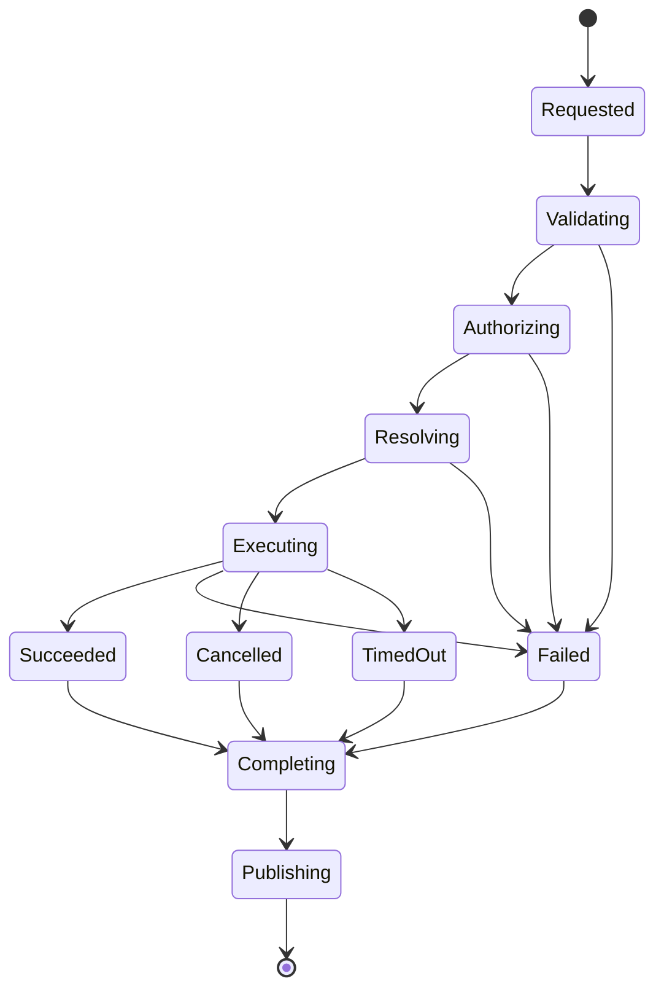
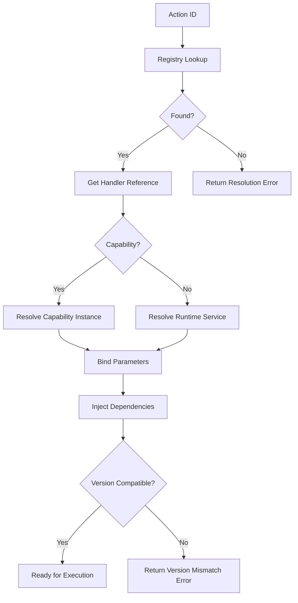

# Specification: Action Engine

**KB-015 — Part III: Engineering Standards**

| Field | Value |
|-------|-------|
| **KB ID** | KB-015 |
| **Title** | Action Engine |
| **Version** | 0.1.0 |
| **Status** | Drafting |
| **Owner** | Architecture |
| **Dependencies** | KB-005 (Glossary), KB-007 (System Architecture), KB-011 (Naming Standards), KB-013 (Component Model), KB-019 (Event Bus) |
| **Related Documents** | Runtime Engine, Capability System, Navigation Engine, State Management, Offline & Synchronization, Manifest Specification, Builder Studio |
| **Review Status** | Pending |
| **Last Updated** | 2026-07-09 |

### Revision History

| Version | Date | Author | Change |
|---------|------|--------|--------|
| 0.1.0 | 2026-07-09 | Architecture | Initial draft |

---

## 1. Purpose

The Action Engine is the **universal execution layer** of DUKADESK. Every behavior triggered by a user, a component, a scheduled task, a system event, a capability, or an external integration flows through the Action Engine.

### Why the Action Engine Exists

- **Separation of concerns**: UI components declare *what* should happen (an action), not *how* it should happen. The Action Engine resolves and executes the how.
- **Declarative behavior**: Actions are defined in configuration, not in code. This enables Builder Studio, Marketplace modules, and AI agents to create workflows without writing runtime code.
- **Centralized orchestration**: Instead of scattering behavior across components, the Action Engine provides a single execution pipeline with consistent validation, authorization, retry, rollback, and observability.
- **Platform-wide consistency**: Every interaction — whether from mobile, web, desktop, or a scheduled job — is processed through the same engine with the same guarantees.

### Why UI Components Must Not Execute Business Logic

- Components become tightly coupled to specific capabilities.
- Testing requires mocking entire services.
- Marketplace components would require security review for every line of code.
- AI-generated components would need to generate business logic, increasing risk.
- Changing business logic would require updating every component that calls it.

The Action Engine eliminates all of these problems. Components dispatch **action IDs** with **parameters**. The Action Engine resolves each action ID to the appropriate capability, validates it, authorizes it, executes it, and returns the result.

---

## 2. Action Engine Philosophy

| # | Principle | Description |
|---|-----------|-------------|
| 1 | **Declarative execution** | Actions describe *what* to do, not *how* to do it. The engine handles resolution, execution, retry, and rollback. |
| 2 | **Separation of concerns** | Components emit events. The Action Engine executes behavior. Capabilities provide business logic. These layers do not cross. |
| 3 | **Capability-driven behavior** | Actions are resolved to capabilities. The Action Engine does not know what a capability does — it only knows how to route to it. |
| 4 | **Event-oriented architecture** | Actions are triggered by events. Action completion produces new events. The Event Bus (KB-019) is the communication backbone. |
| 5 | **Extensible execution** | New action types, capabilities, Marketplace modules, and SDK extensions register actions without modifying the engine. |
| 6 | **Runtime awareness** | The Action Engine has full access to runtime context (tenant, user, session, screen, locale) and injects it into every action execution. |
| 7 | **Security-first** | Every action is validated, authorized, and sanitized before execution. No action executes without passing through the authorization layer. |
| 8 | **Observable execution** | Every action execution produces traces, metrics, and logs. The platform can observe, measure, and debug any action at any time. |
| 9 | **Retryable operations** | The engine supports configurable retry policies with backoff, idempotency keys, and failure escalation. |
| 10 | **Idempotent where appropriate** | Actions should be idempotent where possible so that retries do not produce duplicate side effects. |

---

## 3. What is an Action?

### Formal Definition

An **Action** is a declarative request to perform a specific operation within the platform. It is:

1. **Declared** in configuration (manifest, component props, capability definitions, workflows).
2. **Dispatched** by a component, system process, scheduled task, or external integration.
3. **Routed** through the Action Engine for validation, authorization, resolution, and execution.
4. **Executed** by the resolved capability or runtime service.
5. **Monitored** until completion, failure, or cancellation.

### Action Structure

```typescript
interface Action {
  id: string;                        // Unique action identifier
  type: ActionType;                  // Category (navigation, data, commerce, etc.)
  handler: string;                   // Resolved handler or action ID
  parameters?: Record<string, unknown>;  // Input parameters
  context?: ActionContext;           // Execution context
  options?: ActionOptions;           // Execution options (retry, timeout, etc.)
}
```

### What an Action Is Not

| Misconception | Clarification |
|---------------|---------------|
| A button | A button is a component. It may *dispatch* an action, but it is not an action. |
| A component | Components receive props and render UI. Actions are execution requests. |
| Business logic | Business logic lives in capabilities. Actions *reference* capabilities. |
| An API endpoint | API endpoints are transport mechanisms. Actions are semantic operations. |
| A database query | Queries are implementation details of capabilities. Actions request operations. |
| A navigation route | Navigation is an *action category*. Routes are resolved by the Navigation Engine. |
| An event | Events trigger actions. Actions produce events. They are not the same. |

---

## 4. Action Categories

Every action belongs to a category. Categories determine routing, authorization scope, and execution strategy.

### Navigation

| Action | Description |
|--------|-------------|
| `navigate.openScreen` | Navigate to a screen by ID |
| `navigate.back` | Navigate to the previous screen |
| `navigate.deepLink` | Process a deep link |
| `navigate.openModal` | Open a modal overlay |
| `navigate.closeModal` | Close the current modal |
| `navigate.switchTab` | Switch to a different tab |
| `navigate.switchTenant` | Switch to a different tenant context |

### Data

| Action | Description |
|--------|-------------|
| `data.load` | Load data from a capability |
| `data.refresh` | Refresh current data |
| `data.create` | Create a new entity |
| `data.update` | Update an existing entity |
| `data.delete` | Delete an entity |
| `data.search` | Search across entities |
| `data.filter` | Apply a filter to a dataset |
| `data.sort` | Sort a dataset |
| `data.export` | Export data to a file |
| `data.import` | Import data from a file |

### Commerce

| Action | Description |
|--------|-------------|
| `commerce.addToCart` | Add an item to the cart |
| `commerce.removeFromCart` | Remove an item from the cart |
| `commerce.updateCartItem` | Update cart item quantity or options |
| `commerce.checkout` | Begin checkout process |
| `commerce.applyCoupon` | Apply a coupon code |
| `commerce.removeCoupon` | Remove a coupon code |
| `commerce.cancelOrder` | Cancel an existing order |
| `commerce.trackDelivery` | Track order delivery status |

### Booking

| Action | Description |
|--------|-------------|
| `booking.bookAppointment` | Create a new booking |
| `booking.cancelBooking` | Cancel an existing booking |
| `booking.reschedule` | Change booking date/time |
| `booking.checkAvailability` | Check resource availability |
| `booking.assignResource` | Assign a resource to a booking |

### Forms

| Action | Description |
|--------|-------------|
| `form.submit` | Submit form data |
| `form.validate` | Validate form fields |
| `form.saveDraft` | Save form as draft |
| `form.reset` | Reset form to initial state |
| `form.uploadFile` | Upload a file attachment |

### Authentication

| Action | Description |
|--------|-------------|
| `auth.login` | Authenticate user |
| `auth.logout` | End user session |
| `auth.refreshSession` | Refresh authentication token |
| `auth.verifyOTP` | Verify one-time password |
| `auth.changePassword` | Change user password |
| `auth.requestReset` | Request password reset |

### Notifications

| Action | Description |
|--------|-------------|
| `notification.send` | Send a notification |
| `notification.markRead` | Mark notification as read |
| `notification.subscribe` | Subscribe to a notification topic |
| `notification.unsubscribe` | Unsubscribe from a topic |
| `notification.getPreferences` | Get notification preferences |
| `notification.updatePreferences` | Update notification preferences |

### Device

| Action | Description |
|--------|-------------|
| `device.capturePhoto` | Capture a photo using the camera |
| `device.scanQR` | Scan a QR code |
| `device.getLocation` | Get current GPS location |
| `device.recordAudio` | Record audio |
| `device.connectBluetooth` | Connect to a Bluetooth device |
| `device.readNFC` | Read an NFC tag |
| `device.authenticateBiometric` | Authenticate using biometrics |

### Runtime

| Action | Description |
|--------|-------------|
| `runtime.initialize` | Initialize a capability or service |
| `runtime.sync` | Trigger synchronization |
| `runtime.clearCache` | Clear cached data |
| `runtime.updateManifest` | Update the runtime manifest |
| `runtime.restart` | Restart the runtime or a subsystem |
| `runtime.getStatus` | Get runtime status |

### Integration

| Action | Description |
|--------|-------------|
| `integration.webhook` | Trigger a webhook |
| `integration.apiCall` | Call an external API |
| `integration.processPayment` | Process a payment through a gateway |
| `integration.sendMessage` | Send a chat message |
| `integration.sendEmail` | Send an email |
| `integration.sendSMS` | Send an SMS |
| `integration.sendPush` | Send a push notification |

---

## 5. Action Lifecycle

Every action progresses through a defined lifecycle managed by the Action Engine.

```text
      ┌──────────────────┐
      │ Action Requested │
      └────────┬─────────┘
               │
               ▼
      ┌──────────────────┐
      │   Validation     │
      └────────┬─────────┘
               │
               ▼
      ┌──────────────────┐
      │  Authorization   │
      └────────┬─────────┘
               │
               ▼
      ┌──────────────────┐
      │   Resolution     │
      └────────┬─────────┘
               │
               ▼
      ┌──────────────────┐
      │   Execution      │
      └────────┬─────────┘
               │
         ┌─────┴─────┐
         ▼           ▼
  ┌───────────┐ ┌───────────┐
  │  Success  │ │  Failure  │
  └─────┬─────┘ └─────┬─────┘
        │             │
        └──────┬──────┘
               ▼
      ┌──────────────────┐
      │   Completion     │
      └────────┬─────────┘
               │
               ▼
      ┌──────────────────┐
      │ Event Publication│
      └──────────────────┘
```

### Stage Descriptions

| Stage | Description |
|-------|-------------|
| **Action Requested** | An action is dispatched by a component, system process, scheduled task, or external integration. The engine receives the action ID, parameters, and context. |
| **Validation** | The action is validated: required parameters are present, parameter types are correct, the action exists in the Registry, and the action is in an allowed state. Validation failures return immediately with an error. |
| **Authorization** | The action passes through the authorization layer: the requesting user or system has permission to execute this action, the tenant allows it, capability constraints are satisfied, feature flags are checked, and runtime conditions are evaluated. Authorization failures return a forbidden error. |
| **Resolution** | The action ID is resolved to a concrete handler: a capability method, a runtime service, a workflow, or an integration endpoint. Parameters are bound, dependencies are injected, and the execution context is prepared. |
| **Execution** | The resolved handler executes the action. Execution may be immediate, deferred, scheduled, or queued depending on the execution strategy. The engine monitors execution for success, failure, timeout, or cancellation. |
| **Success / Failure** | The action completes with a result or an error. Success results include data, state updates, or side effects. Failures include error codes, messages, and recovery hints. |
| **Completion** | The engine finalizes the action: resources are released, side effects are committed or rolled back, and the action is recorded in the execution history. |
| **Event Publication** | The engine publishes an action completion event to the Event Bus. Subscribers (State Management, Navigation, Analytics, etc.) react to the event. |

### Lifecycle States



---

## 6. Action Architecture

The Action Engine is composed of logical modules. Each module has a specific responsibility within the execution pipeline.

### Action Dispatcher

| Field | Description |
|-------|-------------|
| **Purpose** | Entry point for all action requests. Receives actions from components, system processes, scheduled tasks, and integrations. |
| **Responsibilities** | Accept action payload, validate basic structure, attach runtime context, enqueue for processing. |
| **Inputs** | `ActionPayload` (action ID, parameters, source, timestamp) |
| **Outputs** | Dispatched action with engine-generated tracking ID |
| **Extension points** | Pre-dispatch hooks, custom dispatchers for non-standard sources |

### Action Registry

| Field | Description |
|-------|-------------|
| **Purpose** | Central catalog of all registered actions. Every action that can be executed must be registered here. |
| **Responsibilities** | Store action definitions, handler mappings, parameter schemas, authorization requirements. |
| **Inputs** | Action registration requests (core, capability, marketplace, SDK) |
| **Outputs** | Action lookup results, handler references, schema validation |
| **Extension points** | Registry plugins, dynamic registration, versioned action definitions |

### Resolver

| Field | Description |
|-------|-------------|
| **Purpose** | Maps action IDs to concrete execution handlers. |
| **Responsibilities** | Capability resolution, handler lookup, parameter binding, dependency injection, version matching. |
| **Inputs** | Action ID, runtime context, parameters |
| **Outputs** | Resolved handler reference with bound parameters |
| **Extension points** | Custom resolvers, fallback resolution chains, capability discovery |

### Validator

| Field | Description |
|-------|-------------|
| **Purpose** | Ensures action requests are structurally and semantically valid before execution. |
| **Responsibilities** | Schema validation, parameter type checking, required field enforcement, constraint validation, cross-field validation. |
| **Inputs** | Action definition, parameter values |
| **Outputs** | Validation result (pass / fail with error details) |
| **Extension points** | Custom validators per action type, capability-specific validation rules |

### Authorization Layer

| Field | Description |
|-------|-------------|
| **Purpose** | Ensures the requesting entity has permission to execute the action. |
| **Responsibilities** | Role validation, permission check, tenant isolation, capability gating, feature flag evaluation, runtime condition evaluation, policy enforcement. |
| **Inputs** | Action definition, runtime context (user, tenant, session, device) |
| **Outputs** | Authorization decision (allow / deny with reason) |
| **Extension points** | Custom authorization providers, policy engines, external authorization services |

### Execution Manager

| Field | Description |
|-------|-------------|
| **Purpose** | Orchestrates action execution according to the configured strategy. |
| **Responsibilities** | Strategy selection (immediate, deferred, queued), handler invocation, result collection, timeout enforcement, cancellation handling. |
| **Inputs** | Resolved handler, bound parameters, execution options |
| **Outputs** | Execution result (success / failure with data) |
| **Extension points** | Custom execution strategies, middleware pipeline, execution hooks |

### Queue Manager

| Field | Description |
|-------|-------------|
| **Purpose** | Manages deferred, scheduled, and background action execution. |
| **Responsibilities** | Queue persistence, priority ordering, schedule management, worker pool management, dead-letter handling. |
| **Inputs** | Queued action requests |
| **Outputs** | Processed actions (success / failure) |
| **Extension points** | Custom queue backends, priority queues, delayed execution |

### Retry Manager

| Field | Description |
|-------|-------------|
| **Purpose** | Handles action retries according to configured policies. |
| **Responsibilities** | Retry policy evaluation, backoff calculation, idempotency key management, exhaustion handling, escalation. |
| **Inputs** | Failed action, retry policy |
| **Outputs** | Retry decision (retry / escalate / fail permanently) |
| **Extension points** | Custom retry policies, circuit breaker integration, dead-letter routing |

### Rollback Manager

| Field | Description |
|-------|-------------|
| **Purpose** | Manages compensatory actions when an action fails after partial execution. |
| **Responsibilities** | Compensating action execution, state restoration, error aggregation, rollback reporting. |
| **Inputs** | Failed action, compensation plan |
| **Outputs** | Rollback result (success / failure with details) |
| **Extension points** | Custom compensation handlers, multi-step rollback, partial rollback support |

### Result Handler

| Field | Description |
|-------|-------------|
| **Purpose** | Processes the result of an action execution and routes it to the appropriate consumer. |
| **Responsibilities** | Result transformation, state binding updates, navigation triggers, event publication, error formatting. |
| **Inputs** | Execution result (success or failure) |
| **Outputs** | State updates, events, navigation commands, user-facing messages |
| **Extension points** | Custom result handlers per action type, result transformation pipelines |

### Diagnostics

| Field | Description |
|-------|-------------|
| **Purpose** | Provides real-time and historical visibility into action execution. |
| **Responsibilities** | Action tracing, execution log, performance metrics, error aggregation, audit trail. |
| **Inputs** | All action lifecycle events |
| **Outputs** | Diagnostic data, traces, metrics, logs |
| **Extension points** | Custom diagnostic collectors, external observability integration |

### Metrics Collector

| Field | Description |
|-------|-------------|
| **Purpose** | Collects and exposes action execution metrics for monitoring and analysis. |
| **Responsibilities** | Execution count, success/failure rates, latency, queue depth, retry count, error distribution. |
| **Inputs** | Action lifecycle events |
| **Outputs** | Metric data points |
| **Extension points** | Custom metric exporters, threshold-based alerting |

---

## 7. Action Registration

Actions must be registered before they can be executed. Registration makes the action available in the Action Registry and defines its contract.

### Registration Sources

| Source | Description | Registration Method |
|--------|-------------|-------------------|
| **Core actions** | Built-in actions provided by the platform runtime (navigation, data, auth, device, runtime). | Registered at platform boot. Immutable at runtime. |
| **Capability actions** | Actions provided by installed capabilities (commerce, booking, orders, etc.). | Registered during capability initialization. Removed on capability uninstall. |
| **Marketplace actions** | Actions distributed through the Marketplace. | Registered on installation, validated against contract, digitally signed. |
| **SDK actions** | Actions built with the DUKADESK SDK. | Registered during SDK initialization. Versioned independently. |
| **Custom enterprise actions** | Tenant-specific actions defined by enterprise customers. | Registered via enterprise configuration. Scoped to tenant. |

### Registration Contract

Every action registration must include:

```typescript
interface ActionRegistration {
  id: string;                    // Fully qualified action ID (e.g., "commerce.addToCart")
  version: string;               // Semantic version
  category: ActionCategory;      // Category for routing and authorization
  handler: string;               // Handler identifier (capability.method or runtime.service)
  description: string;           // Human-readable description
  parameters?: ParameterSchema[]; // Parameter definitions
  returns?: ResultSchema;        // Expected result schema
  authorization?: AuthorizationRequirements;
  execution?: ExecutionOptions;
  retry?: RetryPolicy;
  timeout?: number;              // Default timeout in milliseconds
}
```

### Registration Validation

The Action Registry validates every registration against:

- ID uniqueness (no duplicate action IDs)
- Handler existence (resolved capability or service must be available)
- Schema validity (parameter schemas must be well-formed)
- Authorization completeness (required authorization levels must be defined)
- Version compatibility (action version must be compatible with the runtime version)

---

## 8. Action Resolution

Action resolution is the process of mapping an action ID to a concrete executable handler.

### Resolution Pipeline

1. **Identifier lookup**: The action ID is looked up in the Action Registry.
2. **Capability resolution**: If the handler references a capability, the Capability System resolves the capability instance.
3. **Context evaluation**: Runtime context (tenant, user, session, screen) is evaluated for scoping.
4. **Parameter binding**: Parameters from the action request are bound to the handler's parameter schema.
5. **Dependency resolution**: Handler dependencies (services, repositories, clients) are injected.
6. **Version compatibility**: The action version is checked against the runtime version.

### Resolution Strategy



### Resolution Failures

| Failure | Cause | Recovery |
|---------|-------|----------|
| Action not found | Action ID not registered | Check registration, verify action ID |
| Capability not available | Capability uninstalled or offline | Install capability, wait for availability |
| Version mismatch | Action version incompatible with runtime | Update action or runtime |
| Parameter binding error | Required parameter missing or wrong type | Fix action parameters in configuration |
| Dependency unavailable | Required service not initialized | Initialize dependency, retry |

---

## 9. Action Parameters

Every action defines the parameters it accepts. Parameters are validated before execution.

### Parameter Definition

```typescript
interface ParameterSchema {
  name: string;                  // Parameter name
  type: 'string' | 'number' | 'boolean' | 'object' | 'array' | 'any';
  required: boolean;             // Must be provided
  default?: unknown;             // Default value if not provided
  description: string;           // Human-readable description
  validation?: ValidationRule[]; // Validation constraints
  transform?: string;            // Optional transformation function
}
```

### Required Parameters

Parameters marked as `required: true` must be present in the action request. The Validator rejects actions with missing required parameters with a clear error message indicating which parameter is missing.

### Optional Parameters

Optional parameters may be omitted. If omitted and a default is defined, the default value is used. If no default is defined, the parameter is `undefined` in the handler.

### Runtime Context Injection

The following runtime context values are automatically injected into every action and need not be declared in `parameters`:

| Context Field | Description | Source |
|---------------|-------------|--------|
| `$runtime.tenantId` | Current tenant identifier | Runtime session |
| `$runtime.userId` | Current user identifier | Authentication context |
| `$runtime.sessionId` | Current session identifier | Runtime session |
| `$runtime.screenId` | Current screen identifier | Navigation state |
| `$runtime.screenInstanceId` | Current screen instance | Navigation state |
| `$runtime.locale` | Current user locale | User preferences |
| `$runtime.timestamp` | Action dispatch timestamp | System clock |

### Validation

Parameters are validated against their declared schema:

| Rule | Applies To | Description |
|------|-----------|-------------|
| `required` | All | Value must be non-null and non-undefined |
| `minLength` / `maxLength` | `string` | String length constraints |
| `min` / `max` | `number` | Numeric range constraints |
| `pattern` | `string` | Regex pattern match |
| `enum` | `string`, `number` | Value must be one of a defined set |
| `format` | `string` | Format validation (email, URI, date, uuid, phone) |
| `items` | `array` | Schema for array item validation |
| `properties` | `object` | Schema for object property validation |

### Transformation

Parameters may be transformed before being passed to the handler:

| Transform | Description |
|-----------|-------------|
| `trim` | Trim whitespace from string values |
| `lowercase` | Convert string to lowercase |
| `uppercase` | Convert string to uppercase |
| `sanitize` | Remove dangerous characters |
| `formatDate` | Parse and format date values |
| `resolveReference` | Resolve a reference ID to a full object |

---

## 10. Authorization

Every action passes through the Authorization Layer before execution. The layer evaluates multiple dimensions to determine whether the action is permitted.

### Authorization Dimensions

| Dimension | Description | Source |
|-----------|-------------|--------|
| **Role** | The user's role must be permitted to execute the action | User role assignment |
| **Permission** | The action's required permission must be granted to the user | Permission system |
| **Capability** | The action's capability must be enabled for the tenant | Capability gating |
| **Tenant** | The action must be allowed in the current tenant context | Tenant configuration |
| **Feature flag** | The feature flag controlling this action must be enabled | Feature flag system |
| **Runtime condition** | Runtime conditions (time, location, device state) must be satisfied | Runtime context |
| **Rate limit** | The action must not exceed the configured rate limit | Rate limit configuration |
| **Quota** | The tenant or user must not exceed their usage quota | Quota management |

### Authorization Flow

```typescript
interface AuthorizationDecision {
  allowed: boolean;
  reason?: string;
  enforcement: 'hard' | 'soft';  // hard = reject, soft = warn but allow
  context?: Record<string, unknown>;
}
```

### Policy Enforcement

Authorization policies are defined declaratively and evaluated by the Authorization Layer:

```typescript
interface AuthorizationPolicy {
  action: string;            // Action ID or pattern (supports wildcards)
  roles?: string[];          // Allowed roles
  permissions?: string[];    // Required permissions
  conditions?: Condition[];  // Runtime conditions
  rateLimit?: RateLimit;     // Rate limit configuration
  quota?: QuotaLimit;        // Quota configuration
}
```

### Authorization Failures

When authorization fails:

1. The engine returns a `FORBIDDEN` error with a user-facing message and a diagnostic code.
2. The event `action.authorizationFailed` is published to the Event Bus.
3. The failure is logged with context (user, action, reason, timestamp).
4. For soft enforcement, the action proceeds but the warning is logged and reported.

---

## 11. Execution Strategies

The Action Engine supports multiple execution strategies. The strategy is determined by the action's registration or by the action request's `options.execution` field.

| Strategy | Description | Use Case |
|----------|-------------|----------|
| **Immediate** | Execute synchronously as soon as the action passes validation and authorization. | Most user-facing actions (navigation, form submit, add to cart). |
| **Deferred** | Execute asynchronously with a configurable delay. | Actions that need a brief delay before execution (undo windows, confirmation delays). |
| **Scheduled** | Execute at a specified future time. | Scheduled tasks, delayed notifications, timed workflows. |
| **Background** | Execute in the background without blocking the UI. | Data synchronization, export generation, bulk operations. |
| **Batch** | Execute multiple actions as a batch. | Bulk updates, multi-item operations, synchronized workflows. |
| **Parallel** | Execute multiple independent actions concurrently. | Loading multiple data sources, parallel API calls. |
| **Sequential** | Execute multiple actions one after another. | Multi-step workflows, ordered operations, dependency chains. |
| **Conditional** | Execute an action only if a condition is met. | Conditional navigation, feature-gated actions, context-dependent behavior. |
| **Transactional** | Execute multiple actions as a single unit of work. All succeed or all roll back. | Multi-step business operations, cross-capability workflows. |

### Strategy Selection

The strategy is selected in the following order of precedence:

1. Action request's `options.execution` (highest priority)
2. Action registration's `execution` default
3. Category default (e.g., `data.create` defaults to `immediate`)
4. Engine default (`immediate`)

---

## 12. Error Handling

The Action Engine provides consistent error handling for every action.

### Error Categories

| Category | Example | User Feedback | System Action |
|----------|---------|---------------|---------------|
| **Validation failure** | Missing required parameter | Inline error on form field | Return error, no retry |
| **Authorization failure** | User lacks permission | Toast or alert with error message | Return error, log security event |
| **Missing capability** | Capability not installed | Alert with install prompt | Return error, suggest capability |
| **Network failure** | Request timeout | Retry prompt or offline state | Retry if configured, queue for later |
| **Timeout** | Action exceeded time limit | Error message with retry option | Return timeout error |
| **Service error** | Backend returns 500 | Generic error with support code | Log error, notify operations |
| **Partial failure** | Batch action partially succeeds | Partial success message | Roll back if configured, log details |

### Error Response Structure

```typescript
interface ActionError {
  code: string;                  // Machine-readable error code
  message: string;               // Human-readable error message
  details?: Record<string, unknown>;  // Additional error details
  recovery?: {                   // Recovery hints (optional)
    action?: string;             // Suggested recovery action
    retryable: boolean;          // Whether retry may help
    retryAfter?: number;         // Suggested retry delay in ms
  };
  diagnostics?: {                // Diagnostic info (not user-facing)
    traceId: string;
    handler: string;
    timestamp: number;
    duration: number;
  };
}
```

### Retry Policies

```typescript
interface RetryPolicy {
  maxAttempts: number;            // Maximum retry attempts (default: 3)
  backoff: 'fixed' | 'exponential' | 'linear';
  backoffDelay: number;           // Base delay in milliseconds (default: 1000)
  maxBackoffDelay?: number;       // Maximum delay (default: 60000)
  retryableErrors: string[];      // Error codes that trigger retry
  onExhausted: 'fail' | 'escalate' | 'queue';
  idempotencyKey?: string;        // Key for idempotency tracking
}
```

### Rollback Strategies

For transactional actions, the Rollback Manager executes compensating actions when the primary action fails:

```typescript
interface RollbackPlan {
  compensatingActions: CompensatingAction[];
  rollbackOrder: 'reverse' | 'parallel';
  failureBehavior: 'continue' | 'stop';
}

interface CompensatingAction {
  actionId: string;
  parameters: Record<string, unknown>;
  condition?: string;  // Only execute if condition is met
}
```

---

## 13. Event Integration

The Action Engine publishes events at every stage of the action lifecycle. These events are consumed by the Event Bus (KB-019) and routed to subscribers.

### Published Events

| Event | Trigger | Payload |
|-------|---------|---------|
| `action.started` | Action begins execution | actionId, trackingId, timestamp |
| `action.completed` | Action completes successfully | actionId, trackingId, result, timestamp, duration |
| `action.failed` | Action fails | actionId, trackingId, error, timestamp, duration |
| `action.cancelled` | Action is cancelled | actionId, trackingId, reason, timestamp |
| `action.retrying` | Action is being retried | actionId, trackingId, attempt, maxAttempts, timestamp |
| `action.timedOut` | Action exceeds timeout | actionId, trackingId, timeout, timestamp |

### Event Consumers

| Consumer | Events Consumed | Purpose |
|----------|----------------|---------|
| **State Management** | `action.completed`, `action.failed` | Update application state based on action results |
| **Navigation Engine** | `action.completed` | Navigate to next screen after action completion |
| **Analytics** | `action.started`, `action.completed`, `action.failed` | Track user behavior and action performance |
| **Monitoring** | All events | Health monitoring, alerting, dashboards |
| **Audit** | `action.completed`, `action.failed` | Compliance audit trail |
| **Offline Engine** | `action.failed` (network errors) | Queue action for offline sync |
| **Capabilities** | `action.completed` | React to action results within the capability |

---

## 14. Runtime Integration

The Action Engine integrates with every major runtime subsystem.

### Runtime

| Interaction | Description |
|-------------|-------------|
| **Runtime context injection** | The Runtime provides tenant, user, session, screen, and device context for every action. |
| **Initialization** | The Runtime initializes the Action Engine during platform boot. Core actions are registered at this stage. |
| **Shutdown** | The Runtime signals the Action Engine to drain pending actions and complete in-flight executions during shutdown. |

### Manifest

| Interaction | Description |
|-------------|-------------|
| **Action definitions** | The Manifest defines action bindings for components and screens. The Action Engine reads these definitions at configuration time. |
| **Action configuration** | Actions are configured in the Manifest with parameters, execution options, and authorization requirements. |

### State Management

| Interaction | Description |
|-------------|-------------|
| **State updates** | The Action Engine writes action results to State Management through result handlers. |
| **State reads** | The Action Engine reads state for conditional action execution and parameter resolution. |

### Capability System

| Interaction | Description |
|-------------|-------------|
| **Handler resolution** | The Action Engine resolves action handlers to capability methods. |
| **Capability lifecycle** | Actions are registered and deregistered as capabilities are installed and uninstalled. |
| **Capability context** | The Action Engine provides runtime context to capabilities during action execution. |

### Navigation Engine

| Interaction | Description |
|-------------|-------------|
| **Navigation actions** | The Action Engine dispatches navigation actions to the Navigation Engine. |
| **Post-navigation actions** | The Action Engine may trigger actions after navigation completes (e.g., load data for the new screen). |

### Offline Engine

| Interaction | Description |
|-------------|-------------|
| **Offline queuing** | The Action Engine queues actions that fail due to network errors for later execution by the Offline Engine. |
| **Sync triggers** | The Action Engine triggers synchronization when the device comes online. |

---

## 15. Builder Integration

Builder Studio uses the Action Engine as the execution backend for every interaction defined in builder-created workflows.

### Action Picker

Builder Studio presents a picker of all registered actions. The picker filters by category, capability, and search. When an action is selected, Builder loads its parameter schema.

### Workflow Builder

Builder Studio uses the Action Engine to:

- Define action sequences (sequential, parallel, conditional).
- Configure action parameters through the parameter editor.
- Set execution options (retry, timeout, strategy).
- Define error handling and fallback actions.

### Action Validation

Builder Studio validates actions at design time:

- Required parameters are flagged if missing.
- Parameter types are checked against the schema.
- Authorization requirements are evaluated against the current context.
- Capability availability is verified.

### Parameter Editor

Builder Studio renders a parameter editor for each action based on its parameter schema:

- String parameters: text input
- Number parameters: numeric input
- Boolean parameters: toggle
- Enum parameters: dropdown
- Object parameters: structured editor
- Array parameters: dynamic list editor

### Conditional Actions

Builder Studio supports defining conditions for action execution:

```typescript
{
  "actionId": "commerce.applyCoupon",
  "condition": "$state.cart.items.length > 0 && $state.cart.total > 0",
  "parameters": {
    "couponCode": "$state.cart.couponInput"
  }
}
```

### Preview

Builder Studio provides a preview mode where actions are executed in a sandboxed environment. Preview actions use a separate Action Registry instance and do not affect production state.

### Testing

Builder Studio supports automated testing of action workflows:

- Action sequence execution is recorded and replayable.
- Test data can be injected to verify action behavior.
- Authorization can be bypassed in test mode.
- Action results are captured and compared to expected outputs.

---

## 16. Marketplace Integration

Marketplace actions extend the platform with third-party behavior.

### Custom Actions

Marketplace modules register custom actions during installation. These actions follow the same contract as core actions and are subject to the same validation, authorization, and observability requirements.

### Third-Party Actions

Actions provided by third-party vendors must:

- Pass security review before listing.
- Declare all required permissions.
- Operate within a sandboxed execution context.
- Not access data outside the declared scope.

### Version Compatibility

Marketplace actions declare which runtime versions they support. The Action Engine checks version compatibility during resolution and rejects incompatible actions.

### Digital Signatures

Marketplace actions are digitally signed. The Action Engine verifies the signature during registration and rejects unsigned or tampered actions.

### Licensing

Marketplace actions may be licensed per tenant, per user, or per installation. The Authorization Layer checks license validity before execution.

### Updates

Marketplace action updates are delivered through the Marketplace update channel. The Action Engine supports rolling updates and rollback of action definitions.

---

## 17. Performance

The Action Engine must meet the following performance targets:

| Metric | Target | Notes |
|--------|--------|-------|
| **Dispatch latency** | < 5ms | Time from action request to validated and authorized |
| **Resolution latency** | < 10ms | Time to resolve action to handler (cached) |
| **Execution overhead** | < 2ms | Engine overhead beyond handler execution time |
| **Queue throughput** | 10,000 actions/second | Per runtime instance |
| **Concurrent executions** | 500 | Per runtime instance |
| **Action registry lookup** | < 1ms | Cached action definition lookup |

### Optimization Techniques

| Technique | Description |
|-----------|-------------|
| **Queue optimization** | Priority queues for user-facing actions, background queues for non-blocking actions. |
| **Parallel execution** | Independent actions are executed in parallel when the strategy allows. |
| **Action batching** | Multiple actions targeting the same capability are batched into a single call. |
| **Lazy resolution** | Resolution is deferred until just before execution. Results are cached for repeat actions. |
| **Caching** | Action definitions, resolved handlers, and authorization decisions are cached. |
| **Duplicate suppression** | Identical actions dispatched in rapid succession are deduplicated. |
| **Pre-warming** | Frequently used actions have their handlers pre-resolved and cached at boot. |

---

## 18. Security

The Action Engine enforces security at every stage of the execution pipeline.

| Security Control | Stage | Description |
|-----------------|-------|-------------|
| **Authorization** | Pre-execution | Every action is authorized before execution. No action bypasses authorization. |
| **Input validation** | Pre-execution | All parameters are validated against the declared schema. Injection attacks are prevented. |
| **Parameter sanitization** | Pre-execution | String parameters are sanitized for cross-site scripting and injection. |
| **Audit logging** | All stages | Every action execution is logged with tracking ID, user, tenant, timestamp, and result. |
| **Action integrity** | Registration | Action definitions are verified against their digital signatures. Tampered actions are rejected. |
| **Secure execution** | Execution | Actions execute in a sandboxed context with no access to the file system, network, or other actions' data. |
| **Permission enforcement** | Authorization | The Authorization Layer enforces the principle of least privilege. Actions execute with the minimum required permissions. |
| **Rate limiting** | Dispatch | The engine enforces rate limits per user, per tenant, and per action. |
| **Timeout enforcement** | Execution | Actions that exceed their timeout are terminated. No runaway actions. |
| **Secrets management** | Parameters | Parameters flagged as secrets are masked in logs and diagnostics. |

### Security Violations

| Violation | Response |
|-----------|----------|
| Unauthorized action attempt | Log security event, return FORBIDDEN, notify security monitoring |
| Parameter injection attempt | Log security event, sanitize parameters, return VALIDATION_ERROR |
| Tampered action registration | Reject registration, log security event, notify Marketplace security |
| Rate limit exceeded | Return RATE_LIMITED error, increment violation counter |
| Permission escalation attempt | Log security event, return FORBIDDEN, audit user permissions |

---

## 19. Observability

The Action Engine provides comprehensive observability into every action execution.

### Execution Logs

Every action execution produces a structured log entry:

```typescript
interface ActionLogEntry {
  trackingId: string;
  actionId: string;
  category: string;
  source: string;
  user: { id: string; tenant: string };
  parameters: Record<string, unknown>;
  stages: Array<{
    name: string;
    startedAt: number;
    completedAt: number;
    status: 'success' | 'failure';
    error?: ActionError;
  }>;
  result: unknown;
  totalDuration: number;
  retryAttempt: number;
  timestamp: number;
}
```

### Tracing

The Action Engine supports distributed tracing across the execution pipeline:

- Each action receives a unique `traceId` that propagates through resolver, handler, and downstream calls.
- Traces include timing information for each lifecycle stage.
- Traces are correlated with Runtime, Capability, and Network traces.

### Metrics

| Metric | Type | Description |
|--------|------|-------------|
| `actions.total` | Counter | Total actions dispatched |
| `actions.success` | Counter | Actions completed successfully |
| `actions.failure` | Counter | Actions that failed |
| `actions.latency` | Histogram | Action execution latency by action ID |
| `actions.queueDepth` | Gauge | Current action queue depth |
| `actions.retries` | Counter | Total retry attempts |
| `actions.timeouts` | Counter | Actions that timed out |
| `actions.authorizationDenied` | Counter | Actions denied by authorization |

### Performance Analysis

The metrics collector enables performance analysis:

- Slow action identification (p99, p999 latency).
- Failure rate trends by action, category, and capability.
- Queue depth monitoring for capacity planning.
- Retry rate analysis for reliability engineering.

### Diagnostics

The Diagnostics module provides:

- Real-time view of in-flight actions.
- Action execution replay from logs.
- Error pattern analysis.
- Action dependency graph visualization.
- Integration with external diagnostic tools.

### Failure Analysis

When an action fails, the diagnostics system provides:

- Full execution trace with timing.
- Parameter values (secrets masked).
- Error code and message.
- Handler response (if available).
- Retry history.
- System state at time of failure.

### Action History

The Action Engine maintains a configurable history of executed actions:

```typescript
interface ActionHistoryQuery {
  actionId?: string;
  category?: string;
  userId?: string;
  tenantId?: string;
  status?: 'success' | 'failure' | 'cancelled' | 'timeout';
  fromTimestamp?: number;
  toTimestamp?: number;
  limit?: number;
  offset?: number;
}
```

---

## 20. Anti-Patterns

The following patterns violate the Action Engine architecture and must not be used:

| Anti-Pattern | Why It Violates |
|--------------|-----------------|
| **Business logic in UI** | Components executing business rules instead of dispatching actions. | Creates tight coupling between UI and capabilities. Bypasses validation, authorization, and observability. |
| **Direct API calls from components** | Components calling APIs directly instead of dispatching actions. | Bypasses the entire Action Engine. No validation, authorization, retry, or observability. |
| **Hidden actions** | Actions that execute without going through the Action Dispatcher. | Creates invisible behavior that cannot be monitored, audited, or governed. |
| **Hardcoded workflows** | Workflows defined in code instead of declarative action configurations. | Prevents Builder Studio, Marketplace, and AI agents from creating or modifying workflows. |
| **Circular actions** | Action A triggers Action B which triggers Action A. | Creates infinite execution loops. The engine must detect and break circular chains. |
| **Infinite retries** | Retry policy with no maximum or excessive retry count. | Causes resource exhaustion and cascading failures. All retry policies must have a maximum. |
| **Permission bypass** | Actions that skip the Authorization Layer. | Security vulnerability. Every action must pass through authorization, even system actions. |
| **Unvalidated parameters** | Actions that accept parameters without schema validation. | Security and reliability risk. Every parameter must be validated against a schema. |
| **State mutation in actions** | Actions that directly mutate state instead of returning results for State Management. | Violates unidirectional data flow. Actions should return results, not mutate state. |
| **Long-running synchronous actions** | Actions that block the execution thread for excessive duration. | Blocks the UI and degrades user experience. Long-running actions must use deferred or background strategies. |
| **Action chaining in components** | Components dispatching actions in response to action results. | Creates implicit control flow. Action chaining should be defined declaratively in workflows. |
| **Silent action failures** | Actions that fail without publishing an event or returning an error. | Creates invisible failures. Every action must publish a completion or failure event. |

---

## 21. Future Evolution

The Action Engine is designed to evolve with the platform.

### AI-Generated Workflows

- AI agents will generate action workflows from natural language descriptions.
- Generated workflows must pass the same validation, authorization, and quality checks as hand-authored workflows.
- The engine will support explainable action execution — every action decision can be traced back to its originating prompt.

### Low-Code Automation

- Business users will create action workflows through visual tools.
- The engine will expose action definitions, parameter schemas, and workflows through a low-code API.

### Visual Workflow Orchestration

- The engine will support visual workflow editors that render action flows as node graphs.
- Workflows will be executable at design time for testing and validation.

### Event-Driven Automation

- The engine will support event-to-action mappings — when an event is published, a set of actions is automatically dispatched.
- Event-driven actions will support conditions, delays, and escalation rules.

### Cross-Desk Workflows

- Actions will be able to trigger workflows across multiple Desk instances (e.g., parent company → subsidiary).
- Cross-Desk actions will support tenant-scoped authorization and data isolation.

### Multi-Tenant Orchestration

- The engine will support tenant-scoped action queues and rate limiting.
- Tenant isolation will be enforced at every stage of the pipeline.

### Intelligent Action Recommendations

- The engine will analyze action usage patterns and recommend optimizations.
- Recommendations will include faster execution strategies, caching opportunities, and retry policy adjustments.

---

## 22. Relationship to Other Documents

| Document | Relationship |
|----------|-------------|
| **Runtime Engine** | Initializes and manages the Action Engine lifecycle. Provides runtime context for every action. |
| **Component Model (KB-013)** | Components declare action bindings and dispatch actions through the Action Engine. |
| **Navigation Engine (KB-016)** | Receives navigation actions from the Action Engine. The Action Engine may trigger post-navigation actions. |
| **Theme Engine (KB-017)** | Not directly related. Actions may request theme changes through the configuration capability. |
| **State Management (KB-018)** | Receives action results as state updates. The Action Engine reads state for conditional execution. |
| **Event Bus (KB-019)** | Receives action lifecycle events. Routes events to subscribers (State Management, Navigation, Analytics, etc.). |
| **Offline & Synchronization (KB-020)** | Receives failed actions for offline queuing. Triggers action replay on synchronization. |
| **Capability System** | Provides action handlers. Capabilities register actions during initialization. |
| **Manifest Specification** | Defines action bindings for screens and components. The Action Engine reads manifest action definitions. |
| **Builder Studio** | Uses the Action Engine as the execution backend for builder-created workflows and action configurations. |
| **Marketplace** | Distributes custom actions that register with the Action Engine. Validates and signs action definitions. |

---

**End of KB-015 — Action Engine**
