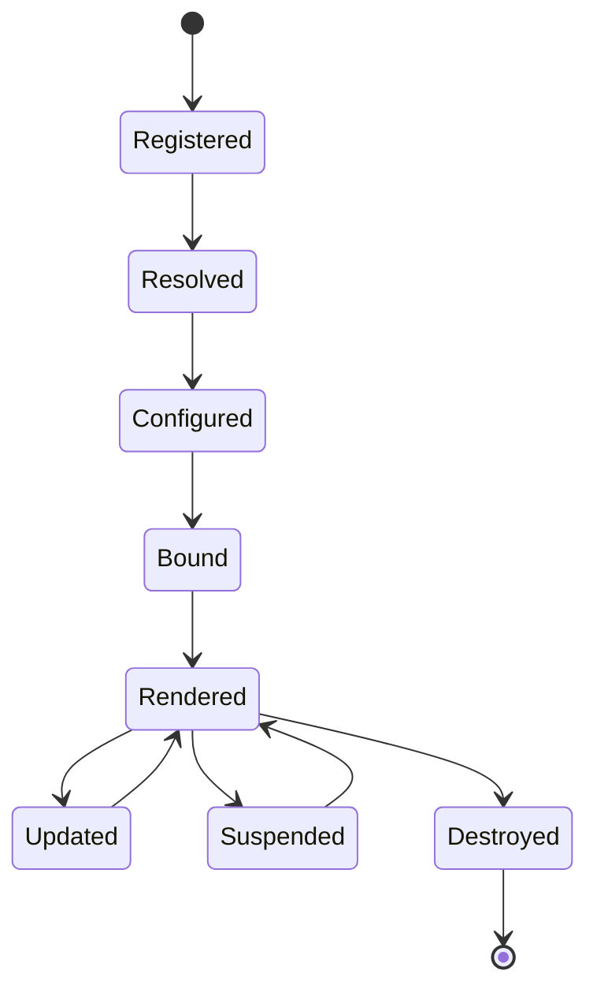
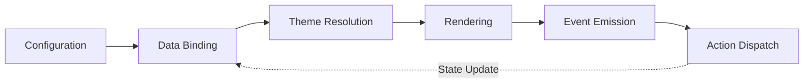
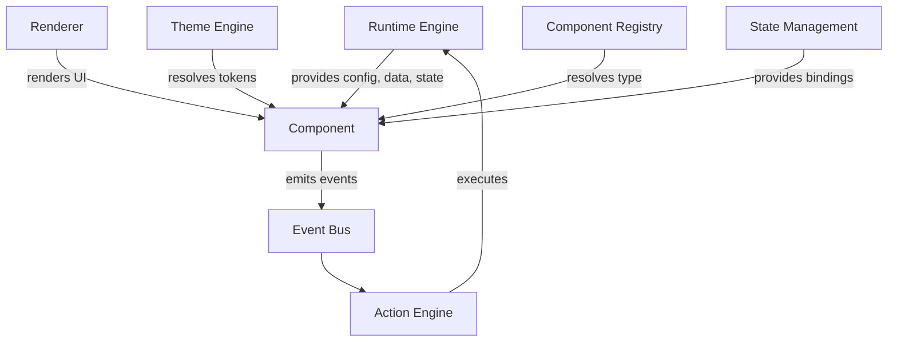
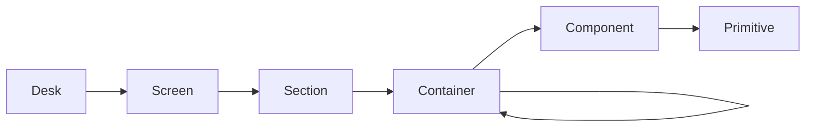
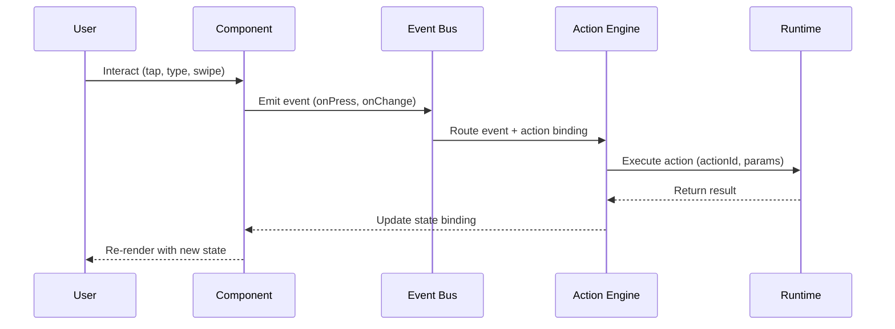

# Specification: Component Model

**KB-013 — Part III: Engineering Standards**

| Field | Value |
|-------|-------|
| **KB ID** | KB-013 |
| **Title** | Component Model |
| **Version** | 0.1.0 |
| **Status** | Drafting |
| **Owner** | Architecture |
| **Dependencies** | KB-005 (Glossary), KB-007 (System Architecture), KB-011 (Naming Standards) |
| **Related Documents** | Runtime Engine, Layout System, Action Engine, Theme Engine, Navigation Engine, State Management, Event Bus, Component Registry |
| **Review Status** | Pending |
| **Last Updated** | 2026-07-09 |

### Revision History

| Version | Date | Author | Change |
|---------|------|--------|--------|
| 0.1.0 | 2026-07-09 | Architecture | Initial draft |

---

## 1. Purpose

The Component Model defines the **universal contract** that every renderable UI component in DUKADESK must obey. It guarantees that any component — whether built by the core team, a capability team, a marketplace vendor, or an AI agent — behaves consistently across all platforms and rendering surfaces.

### Why a Component Model Exists

- **Consistency**: Every component presents the same interface to the Runtime, Renderer, Theme Engine, Action Engine, and Event Bus regardless of implementation language or platform.
- **Interoperability**: The Builder, Runtime, Renderer, and Marketplace all depend on a shared understanding of what a component is and how it behaves.
- **Predictability**: Developers and AI agents can reason about any component without reading its implementation — the contract guarantees the behavior.
- **Extensibility**: New component types, marketplace extensions, and SDK components integrate without modifying the core runtime.

### What the Component Model Enables

- **Builder Studio** can configure any component through a uniform property interface.
- **Runtime Engine** can render any component through a uniform rendering contract.
- **Marketplace** can distribute components that work without platform-specific adaptation.
- **AI agents** can generate components that conform to the contract automatically.
- **SDK authors** can extend the platform without violating architectural boundaries.

---

## 2. Component Philosophy

Every component in DUKADESK follows these philosophical principles:

| # | Principle | Description |
|---|-----------|-------------|
| 1 | **Declarative by default** | Components describe *what* to render, not *how* to render it. All rendering logic is delegated to the Renderer. |
| 2 | **Reusable** | A component must be usable in any context — screen, section, container, or nested within another component — without modification. |
| 3 | **Stateless where possible** | Components should derive state from props and runtime context rather than owning internal state. State ownership belongs to the State Management system (KB-018). |
| 4 | **Composable** | Components must be nestable. A container component can hold any other component without knowing its type. |
| 5 | **Theme-aware** | Every visual aspect of a component is derived from the active theme. Hardcoded colors, fonts, or spacing are forbidden. |
| 6 | **Accessible** | Accessibility is not optional. Every component must meet minimum accessibility requirements by default. |
| 7 | **Observable** | Components emit events and render metrics. The platform must be able to observe component behavior without instrumentation changes. |
| 8 | **Configurable** | Every behavioral and visual aspect of a component is configurable through props. No hardcoded behavior. |
| 9 | **Platform-independent** | The component contract makes no assumptions about rendering technology (React Native, Flutter, Web, SwiftUI, etc.). Platform-specific adaptations happen in the Renderer, not the component. |
| 10 | **Capability-neutral** | Components do not know which capability owns them. The same component used in Orders, Booking, and Commerce behaves identically — only its configuration and data bindings differ. |

---

## 3. Component Definition

### Formal Definition

A **Component** is a reusable presentation element that:

1. Receives **configuration**, **data**, **state**, and **actions** from the Runtime and Renderer.
2. Produces a **user interface** (visual, auditory, or haptic).
3. Emits **events** in response to user interaction.
4. Does **not** own business logic.

### What a Component Must Not Do

| Prohibited Behavior | Why |
|---------------------|-----|
| Execute business rules | Business logic belongs in capability services, not components. |
| Access databases or storage | Data access is the responsibility of the Runtime and State Management. |
| Authenticate users | Authentication is a platform concern, not a component concern. |
| Perform navigation directly | Navigation is handled by the Navigation Engine. Components emit navigation events. |
| Manipulate runtime state directly | State mutations are handled by the Action Engine. Components dispatch actions. |
| Call external APIs | Network calls are managed by the Runtime. Components receive data through bindings. |
| Import platform-specific modules | Platform dependencies break portability. Platform adaptation is the Renderer's responsibility. |
| Own mutable state | State lives in the State Management layer, not in component instances. |

### Contract Enforcement

Any component that violates these prohibitions is **invalid** and must not be registered in the Component Registry. The Registry must reject components that reference platform-specific APIs, global state, or direct service dependencies.

---

## 4. Universal Component Contract

Every component must expose the following structure:

### Required Fields

| Field | Type | Description |
|-------|------|-------------|
| **type** | `string` | Unique component type identifier. Must match the registered name in the Component Registry. |
| **id** | `string` | Unique instance identifier within the current screen context. Used for event routing and diagnostics. |

### Metadata

| Field | Type | Required | Description |
|-------|------|----------|-------------|
| `version` | `string` | Yes | Semantic version of the component definition. |
| `category` | `Category` | Yes | Component category (primitive, container, interactive, navigation, data, commerce, booking, feedback). |
| `platform` | `string[]` | No | Platform compatibility. Omit if platform-agnostic. |
| `capability` | `string` | No | Owning capability identifier. Empty for core components. |
| `description` | `string` | Yes | Human-readable description of the component's purpose. |
| `documentation` | `string` | No | Link or reference to component documentation. |

### Inputs (Props)

| Field | Type | Required | Description |
|-------|------|----------|-------------|
| `props` | `Record<string, PropDefinition>` | Yes | Map of property names to their definitions. Each definition includes type, default, validation rules, and constraints. |
| `required` | `string[]` | Yes | List of property names that must be provided at configuration time. |
| `dynamic` | `string[]` | No | List of property names that support runtime data binding. |

### Outputs (Events)

| Field | Type | Required | Description |
|-------|------|----------|-------------|
| `events` | `Record<string, EventDefinition>` | Yes | Map of event names to their definitions. Each definition includes payload type, trigger condition, and behavior. |

### Configuration

| Field | Type | Required | Description |
|-------|------|----------|-------------|
| `config` | `ComponentConfig` | No | Component-level configuration: default values, constraints, feature flags. |

### Theme Support

| Field | Type | Required | Description |
|-------|------|----------|-------------|
| `themeTokens` | `string[]` | Yes | List of theme tokens the component consumes (e.g., `color.primary`, `spacing.md`, `typography.body`). |
| `themeOverrides` | `Record<string, string>` | No | Component-specific theme token overrides. |

### Accessibility

| Field | Type | Required | Description |
|-------|------|----------|-------------|
| `role` | `string` | Yes | Semantic ARIA role or platform-equivalent role identifier. |
| `label` | `string \| Binding` | Yes | Accessible label. May be a static string or a data binding. |
| `hint` | `string \| Binding` | No | Accessible hint or description. |
| `focusable` | `boolean` | Yes | Whether the component can receive focus. |
| `keyboardActions` | `string[]` | No | List of keyboard interaction patterns (e.g., `enter`, `escape`, `arrow`). |

### State Bindings

| Field | Type | Required | Description |
|-------|------|----------|-------------|
| `state` | `Record<string, StateBinding>` | No | Map of state keys to their bindings. Each binding defines the state path, default value, and update behavior. |

### Action Bindings

| Field | Type | Required | Description |
|-------|------|----------|-------------|
| `actions` | `Record<string, ActionBinding>` | No | Map of action names to their bindings. Each binding defines the action ID, parameters, and runtime context. |

### Validation Rules

| Field | Type | Required | Description |
|-------|------|----------|-------------|
| `validation` | `ValidationRule[]` | No | List of validation rules that apply to the component's props or state. Each rule includes condition, message, and severity. |

### Diagnostics

| Field | Type | Required | Description |
|-------|------|----------|-------------|
| `diagnostics` | `DiagnosticsConfig` | No | Diagnostics configuration for observability and debugging. |

### Documentation

| Field | Type | Required | Description |
|-------|------|----------|-------------|
| `docs` | `ComponentDocs` | No | Inline documentation: usage examples, code snippets, screenshots, links. |

---

## 5. Component Lifecycle

Every component in DUKADESK progresses through a defined lifecycle. The lifecycle is managed by the Runtime Engine and is consistent across all platforms.



```text
      ┌─────────────────┐
      │   Registered    │
      └────────┬────────┘
               │
               ▼
      ┌─────────────────┐
      │    Resolved     │
      └────────┬────────┘
               │
               ▼
      ┌─────────────────┐
      │   Configured    │
      └────────┬────────┘
               │
               ▼
      ┌─────────────────┐
      │     Bound       │
      └────────┬────────┘
               │
               ▼
      ┌─────────────────┐
      │    Rendered     │
      └────────┬────────┘
               │
         ┌─────┴─────┐
         ▼           ▼
  ┌───────────┐ ┌───────────┐
  │  Updated  │ │ Suspended │
  └─────┬─────┘ └─────┬─────┘
        │             │
        └──────┬──────┘
               ▼
      ┌─────────────────┐
      │   Destroyed     │
      └─────────────────┘
```

### Stage Descriptions

| Stage | Entry Condition | Exit Condition | Description |
|-------|----------------|----------------|-------------|
| **Registered** | Component type is added to the Component Registry. | Component is requested by the Runtime. | The component definition is available but not yet instantiated. |
| **Resolved** | Runtime resolves the component type from the Registry. | Component definition is fetched and validated. | The component's type, metadata, and contract are loaded and verified against the Registry. |
| **Configured** | Resolved component receives its configuration. | All required props are provided and validated. | Configuration is merged from manifest, capability defaults, and instance overrides. Validation rules are applied. |
| **Bound** | Configured component receives data, state, and action bindings. | All bindings are resolved and connected. | Runtime context, state paths, and action handlers are linked to the component. |
| **Rendered** | Bound component is called to produce UI. | First paint completes. | The Renderer invokes the component with resolved props, bindings, and theme. |
| **Updated** | Props, bindings, or state change. | Re-render completes. | The component receives new props or state and updates its output. Update may be triggered by user interaction, state changes, or data refresh. |
| **Suspended** | Component is scrolled out of view or explicitly suspended. | Component is scrolled back into view or resumed. | The component is not destroyed but is not actively rendering. Resources may be released. |
| **Destroyed** | Component is removed from the screen tree. | All resources are released. | The component is unmounted, event listeners are removed, and cleanup is performed. |

### Re-render Conditions

A component re-renders when:

- Its props change (new configuration from the Runtime).
- Its data bindings resolve to new values.
- Its state bindings receive updates.
- The active theme changes.
- The locale or text direction changes.
- The component is resumed from Suspended state.

### Cleanup Responsibilities

On destruction, the component must:

- Remove all event listeners.
- Release any allocated resources (images, animations, timers).
- Cancel any pending async operations.
- Emit a `destroyed` event.

---

## 6. Architecture Diagrams

### Component Architecture

The flow from configuration through rendering and event handling:



### Component Contract — System Interactions

How the Component interacts with the Runtime, Renderer, and Engines:



### Component Composition

The nesting hierarchy from the top-level Desk down to individual components:



### Event Flow

User interaction from touch to action execution:



---

## 7. Component Types

Components are categorized by their role in the UI hierarchy. Each category defines behavioral expectations beyond the universal contract.

### Primitive Components

The smallest atomic UI elements. Primitives cannot contain children.

| Component | Description |
|-----------|-------------|
| **Text** | Renders a string of text with optional formatting, localization, and rich text support. |
| **Icon** | Renders an icon from the active icon set. Supports size, color, and rotation. |
| **Image** | Renders an image from a URL or data binding. Supports placeholders, loading states, and error fallbacks. |
| **Divider** | Renders a visual separator line. Supports orientation (horizontal, vertical), color, and thickness. |
| **Spacer** | Renders an invisible spacing element. Fixed or flexible size. |

### Container Components

Components that hold and arrange child components.

| Component | Description |
|-----------|-------------|
| **Row** | Arranges children horizontally. Supports alignment, distribution, and wrapping. |
| **Column** | Arranges children vertically. Supports alignment, distribution, and wrapping. |
| **Grid** | Arranges children in a grid layout. Supports column count, spacing, and responsive breakpoints. |
| **Stack** | Overlays children on top of each other. Supports z-ordering and alignment. |
| **Card** | A themed container with optional header, body, and footer sections. Supports elevation, border radius, and shadow. |
| **Panel** | A collapsible or expandable container. Supports header, toggle, and animation. |

### Interactive Components

Components that accept user input and emit events.

| Component | Description |
|-----------|-------------|
| **Button** | Triggers an action on tap/click. Supports labels, icons, loading state, and variants (primary, secondary, ghost, danger). |
| **TextField** | Accepts text input. Supports validation, formatting, masking, and input types (text, number, email, phone, etc.). |
| **Checkbox** | Binary selection control. Supports checked, unchecked, and indeterminate states. |
| **Switch** | Toggle control. Supports on/off states with optional labels. |
| **Radio** | Single selection within a group. Supports selected, unselected, and disabled states. |
| **Date Picker** | Date and/or time selection. Supports range selection, min/max dates, and format customization. |
| **File Picker** | File selection from device storage. Supports file type filtering and multiple selection. |
| **Signature** | Touch-based signature capture. Supports clear and undo. |
| **QR Scanner** | Camera-based QR code scanning. Supports torch, gallery import, and result callback. |
| **Camera** | Camera capture. Supports photo, video, flash, and front/back toggle. |

### Navigation Components

Components that facilitate navigation between screens or sections.

| Component | Description |
|-----------|-------------|
| **Tabs** | Horizontal tab bar. Supports active tab indicator, scrollable tabs, and badge counts. |
| **Drawer** | Slide-in navigation panel. Supports left/right positioning and programmatic toggle. |
| **Sidebar** | Persistent vertical navigation panel. Supports nested items, icons, and collapse. |
| **Menu** | Dropdown or popover menu. Supports items, dividers, icons, and submenus. |
| **Breadcrumb** | Hierarchical navigation trail. Supports clickable segments and current location indicator. |
| **Stepper** | Step-by-step progress indicator. Supports active, completed, and pending states. |

### Data Components

Components that display structured data.

| Component | Description |
|-----------|-------------|
| **Table** | Tabular data display. Supports columns, sorting, filtering, pagination, and row selection. |
| **List** | Vertical list of items. Supports item templates, pull-to-refresh, infinite scroll, and swipe actions. |
| **Timeline** | Chronological event display. Supports icons, dates, descriptions, and connected lines. |
| **Tree** | Hierarchical data display. Supports expand/collapse, selection, and drag-and-drop. |
| **Chart** | Data visualization. Supports bar, line, pie, area, and scatter chart types. |
| **Statistics** | Numeric data display. Supports labels, values, trends, and comparison indicators. |
| **Metrics** | KPI dashboard component. Supports multiple metric cards with sparklines and delta indicators. |

### Commerce Components

Components specific to commerce capabilities.

| Component | Description |
|-----------|-------------|
| **Product Card** | Product display with image, name, price, and add-to-cart action. |
| **Cart Summary** | Shopping cart line items with quantity controls and totals. |
| **Price** | Price display with currency, comparison price, and discount badge. |
| **Checkout Summary** | Order review with item list, shipping, taxes, and total. |
| **Coupon** | Coupon code input with validation and applied state. |
| **Order Timeline** | Order status tracking with chronological state transitions. |

### Booking Components

Components specific to booking capabilities.

| Component | Description |
|-----------|-------------|
| **Calendar** | Date grid with selection, range support, and availability indicators. |
| **Availability** | Time slot grid with available, limited, and fully booked states. |
| **Time Slot** | Individual time slot with selection state. |
| **Booking Summary** | Booking details review with date, time, duration, and price. |

### Feedback Components

Components that provide system feedback to the user.

| Component | Description |
|-----------|-------------|
| **Toast** | Transient notification. Supports success, error, warning, info variants and auto-dismiss. |
| **Snackbar** | Persistent notification at the bottom of the screen. Supports action button and swipe dismiss. |
| **Alert** | Modal or inline alert. Supports title, message, actions, and severity. |
| **Loader** | Loading indicator. Supports spinner, progress bar, skeleton, and full-screen overlay variants. |
| **Progress** | Task progress display. Supports determinate, indeterminate, and step progress. |
| **Dialog** | Modal dialog. Supports title, content, actions, and dismiss behavior. |

---

## 8. Properties (Props)

All component properties follow a unified definition model.

### Property Definition Structure

```typescript
interface PropDefinition {
  type: 'string' | 'number' | 'boolean' | 'array' | 'object' | 'binding' | 'component' | 'component[]';
  required: boolean;
  default?: unknown;
  description: string;
  validation?: ValidationRule[];
  constraints?: {
    min?: number;
    max?: number;
    pattern?: string;
    enum?: unknown[];
    format?: string;
  };
  dynamic?: boolean;  // Supports runtime data binding
  computed?: boolean; // Value is derived from other props
  conditional?: ConditionalRule; // Prop is only valid under certain conditions
}
```

### Required Properties

Properties marked as `required: true` must be provided at configuration time. The Runtime must validate required props before rendering and reject configuration that omits them.

### Optional Properties

Properties with `required: false` may be omitted. If omitted, the default value is used. If no default is defined, the property is treated as `undefined`.

### Dynamic Properties

Properties marked as `dynamic: true` support runtime data binding. Instead of a static value, the property receives a binding expression that resolves to a value at render time. Dynamic properties are resolved during the **Bound** lifecycle stage.

### Default Values

Every optional property should define a default value. Defaults are defined in the component's configuration and may be overridden at the instance level.

### Validation

Validation rules define constraints on property values:

| Rule | Description |
|------|-------------|
| `required` | Value must be provided (non-null, non-undefined). |
| `minLength` / `maxLength` | String length constraints. |
| `min` / `max` | Numeric range constraints. |
| `pattern` | Regex pattern match for strings. |
| `enum` | Value must be one of a defined set. |
| `format` | Format validation (email, URI, date, etc.). |
| `custom` | Custom validation function reference. |

### Computed Properties

Computed properties derive their value from other properties. They are re-evaluated whenever any dependency changes. Computed properties are marked with `computed: true` and define their dependencies explicitly.

### Conditional Properties

Conditional properties are only valid when a condition is met. If the condition is false, the property is ignored or hidden from configuration. Conditions may reference other property values, runtime context, or capability state.

---

## 9. Events

Components emit events in response to user interaction or lifecycle changes. All events follow a standard model.

### Standard Event Types

| Event | Trigger | Payload |
|-------|---------|---------|
| `onPress` / `onTap` | User taps or clicks the component | `{ componentId, timestamp }` |
| `onChange` | User changes an input value | `{ componentId, value, previousValue, timestamp }` |
| `onSubmit` | User submits a form or input | `{ componentId, values, timestamp }` |
| `onFocus` | Component receives focus | `{ componentId, timestamp }` |
| `onBlur` | Component loses focus | `{ componentId, timestamp }` |
| `onScroll` | User scrolls within the component | `{ componentId, offsetX, offsetY, timestamp }` |
| `onSwipe` | User swipes on the component | `{ componentId, direction, velocity, timestamp }` |
| `onSelect` | User selects an item | `{ componentId, itemId, itemIndex, timestamp }` |
| `onExpand` | User expands a collapsible component | `{ componentId, timestamp }` |
| `onCollapse` | User collapses a component | `{ componentId, timestamp }` |
| `onRefresh` | User triggers a refresh action | `{ componentId, timestamp }` |
| `onError` | Component encounters an error | `{ componentId, error, code, timestamp }` |
| `onLoad` | Component completes loading | `{ componentId, duration, timestamp }` |
| `onDestroy` | Component is about to be destroyed | `{ componentId, reason, timestamp }` |

### Event Payload Structure

```typescript
interface EventPayload {
  componentId: string;
  type: string;
  timestamp: number;
  metadata?: Record<string, unknown>;
}
```

### Event Emission

Events are emitted through the Event Bus (KB-019). Components do not handle events directly — they emit them and the Event Bus routes them to the Action Engine, Analytics, or other registered handlers.

### Custom Events

Components may define custom events beyond the standard set. Custom events must be declared in the component's event definitions and follow the same payload structure.

---

## 10. Action Integration

Components dispatch actions in response to events. Actions are routed through the Action Engine (KB-015) and must never be executed by the component itself.

### Action Binding Structure

```typescript
interface ActionBinding {
  actionId: string;
  parameters?: Record<string, unknown>;
  context?: {
    scope: 'component' | 'screen' | 'global';
    ttl?: number;         // Time-to-live in milliseconds
    retry?: RetryPolicy;
  };
  validation?: {
    requiredParams?: string[];
    condition?: string;   // Expression that must be true for action to fire
  };
}
```

### Action Dispatch Flow

1. User interacts with a component.
2. Component emits an event (e.g., `onPress`).
3. Event Bus routes the event to the Action Engine.
4. Action Engine resolves the action binding: `actionId`, `parameters`, `context`.
5. Action Engine executes the action through the Runtime.
6. Result (success or error) is returned to the component via state bindings.

### Action Payload

```typescript
interface ActionPayload {
  actionId: string;
  componentId: string;
  event: string;
  parameters: Record<string, unknown>;
  runtimeContext: {
    screenId: string;
    tenantId: string;
    userId: string;
    sessionId: string;
  };
  timestamp: number;
}
```

### Action Cancellation

Components may request action cancellation by emitting a `cancel` event with the original action ID. Cancellation is handled by the Action Engine and is not guaranteed — actions already in flight may complete.

---

## 11. Data Binding

Data binding connects component properties to the platform's data and state layers.

### Binding Types

| Type | Description |
|------|-------------|
| **Static** | A literal value provided at configuration time. No runtime resolution needed. |
| **State** | A path into the State Management layer (KB-018). Value updates automatically when state changes. |
| **Runtime Context** | A path into the current runtime context (screen, tenant, user, session, locale, etc.). |
| **Computed** | An expression that derives a value from other bindings or state paths. |

### Binding Expression Syntax

```typescript
// State binding
{ "$state": "orders.current.selectedItem" }

// Runtime context binding
{ "$context": "user.preferences.locale" }

// Computed binding
{ "$computed": "items.length > 0 ? items.filter(i => i.available) : []" }
```

### Visibility Rules

Components may define visibility rules using binding expressions:

```typescript
interface VisibilityRule {
  condition: string;         // Expression that evaluates to boolean
  behavior: 'hidden' | 'collapsed' | 'gone';
  // hidden: still occupies space
  // collapsed: does not occupy space
  // gone: removed from the tree
}
```

### Enable/Disable Rules

Components may define enable/disable rules:

```typescript
interface EnableRule {
  condition: string;         // Expression that evaluates to boolean
  disableBehavior: 'grayed' | 'non-interactive' | 'hidden';
}
```

### Formatting

Data bindings may include formatting directives:

```typescript
interface FormattingDirective {
  type: 'currency' | 'date' | 'number' | 'phone' | 'custom';
  locale?: string;
  options?: Record<string, unknown>;
}
```

### Localization

Text content must support localization. Components receive localized strings through the Runtime Context and must not hardcode user-facing text.

---

## 12. Theme Integration

Every component derives its visual presentation from the active theme (KB-017).

### Theme Token Consumption

Components declare which theme tokens they consume in their `themeTokens` field. The Renderer resolves these tokens at render time.

| Token Category | Examples |
|----------------|----------|
| **Colors** | `color.primary`, `color.background`, `color.text`, `color.error`, `color.success` |
| **Typography** | `typography.h1`, `typography.body`, `typography.caption`, `typography.button` |
| **Spacing** | `spacing.xs`, `spacing.sm`, `spacing.md`, `spacing.lg`, `spacing.xl` |
| **Borders** | `border.radius.sm`, `border.radius.md`, `border.width.thin`, `border.color.default` |
| **Shadows** | `shadow.sm`, `shadow.md`, `shadow.lg` |
| **Icons** | `icon.size.sm`, `icon.size.md`, `icon.size.lg` |

### Theme Overrides

Components may define theme token overrides for specific instances:

```typescript
{
  "themeOverrides": {
    "color.primary": "#FF6600",
    "border.radius.md": "12px"
  }
}
```

### Responsive Sizing

Components must respond to viewport changes. Responsive behavior is configured through breakpoints defined in the theme:

```typescript
interface ResponsiveConfig {
  breakpoints: {
    xs?: ComponentConfig;  // < 480px
    sm?: ComponentConfig;  // 480–768px
    md?: ComponentConfig;  // 768–1024px
    lg?: ComponentConfig;  // 1024–1280px
    xl?: ComponentConfig;  // > 1280px
  };
}
```

### Dark Mode

Components must support dark mode without modification. The theme engine toggles between light and dark token sets. Components consume tokens by name and never reference absolute color values.

### Accessibility Themes

The theme engine supports accessibility themes (high contrast, large text, reduced motion). Components must respect these themes automatically when consuming theme tokens.

---

## 13. Accessibility

Every component must meet the following minimum accessibility requirements:

### Semantic Roles

Every interactive component must declare a semantic role that maps to the platform's accessibility API (ARIA on web, accessibilityRole on mobile).

| Component | Semantic Role |
|-----------|---------------|
| Button | `button` |
| TextField | `textbox` |
| Checkbox | `checkbox` |
| Switch | `switch` |
| Radio | `radio` |
| Tabs | `tablist` (container), `tab` (individual) |
| Table | `table` (container), `row` (rows), `cell` (cells) |
| List | `list` (container), `listitem` (items) |
| Image | `image` |

### Labels

Every interactive component must provide an accessible label:

- **Static label**: Provided directly in the component configuration.
- **Bound label**: Resolved from a data binding or runtime context.
- **Fallback**: If no label is provided, the component must derive one from its content or context.

### Focus Management

- All interactive components must be reachable via keyboard navigation.
- Focus order must follow the visual layout (top-to-bottom, left-to-right).
- Focus indicators must be visible and meet contrast requirements.
- Components must support `onFocus` and `onBlur` events.

### Keyboard Navigation

| Key | Behavior |
|-----|----------|
| `Tab` | Move focus to next interactive element. |
| `Shift+Tab` | Move focus to previous interactive element. |
| `Enter` / `Space` | Activate focused element (button press, toggle switch, etc.). |
| `Escape` | Dismiss modal, popover, or menu. |
| `Arrow keys` | Navigate within a group (tab list, radio group, menu). |

### Screen Reader Support

- All text content must be exposed to screen readers.
- Icons must have accessible labels or be marked as decorative.
- Dynamic content changes must be announced (live regions on web, accessibility announcements on mobile).
- Loading states must be announced.
- Error messages must be associated with their input fields.

### High Contrast

- All text must meet WCAG AA contrast ratios (4.5:1 for normal text, 3:1 for large text).
- Interactive elements must have visible focus indicators.
- Components must not rely solely on color to convey information.
- Icons and UI elements must remain distinguishable in high contrast mode.

### Font Scaling

- Components must support system font scaling (dynamic type on iOS, font scale on Android).
- Layout must not break at increased font sizes.
- Text truncation must be handled gracefully with ellipsis or expand/collapse.

### Reduced Motion

- Components must respect the system's reduced motion preference.
- Animations must be removed or simplified when reduced motion is enabled.
- Parallax, shimmer, and auto-scrolling effects must be disabled.

---

## 14. Error Handling

Components must handle errors gracefully without crashing the screen or the application.

### Error Categories

| Category | Example | Default Behavior |
|----------|---------|------------------|
| **Invalid configuration** | Missing required prop, invalid type, validation failure | Component renders fallback UI with diagnostic message. |
| **Missing bindings** | State path does not exist, action binding is null | Component renders with `undefined` value and logs diagnostic. |
| **Missing theme tokens** | Referenced theme token does not exist | Component uses fallback value from theme base or hardcoded safe default. |
| **Invalid actions** | Action ID not registered, invalid parameters | Action Engine returns error, component displays inline error state. |
| **Invalid properties** | Prop value out of range, invalid enum value | Component validates and falls back to default value. |
| **Rendering failures** | Exception during render, invalid JSX/template | ErrorBoundary catches exception, renders fallback UI, logs error. |

### Graceful Degradation

Components must degrade gracefully when dependencies are missing:

1. **Missing data**: Show skeleton, placeholder, or empty state. Never crash.
2. **Missing theme**: Use platform defaults. Never crash.
3. **Missing action bindings**: Disable interaction. Gray out or show as non-interactive.
4. **Network error**: Show last known state with retry option. Never show blank screen.
5. **Configuration error**: Show inline error with component type and missing field.

### Error Boundary

Every component must be wrapped in an Error Boundary. The Error Boundary:

- Catches rendering exceptions.
- Displays a fallback UI (error card with component type and optional retry).
- Logs the error to the diagnostics system.
- Does not affect sibling or parent components.

---

## 15. Performance Expectations

Components must meet the following performance expectations without relying on platform-specific optimizations.

| Expectation | Description |
|-------------|-------------|
| **Efficient rendering** | Components must render in sub-millisecond time for initial mount. Heavy computation must be deferred. |
| **Minimal updates** | Components must only re-render when their specific props or bindings change. No cascading re-renders. |
| **Lazy initialization** | Components must not perform setup work until they are about to be rendered. Registration must not trigger rendering. |
| **Virtualization support** | List and grid components must support virtualization — only render visible items. |
| **Memoization** | Expensive computations must be memoized and only recomputed when dependencies change. |
| **Resource cleanup** | All allocated resources (timers, listeners, images, animations) must be released on destroy. |
| **Render budget** | Components must complete rendering within the platform's frame budget (16ms for 60fps, 8ms for 120fps). |

---

## 16. Extensibility

The Component Model is designed to be extended without breaking the universal contract.

### Marketplace Components

Third-party components distributed through the Marketplace must:

- Declare their full contract using the Universal Component Contract.
- Not depend on platform-specific APIs.
- Pass the same validation and review process as core components.
- Be sandboxed from other Marketplace components.

### Custom Components

Tenant-specific or capability-specific custom components must:

- Extend the component registry with unique type names.
- Follow the Universal Component Contract.
- Be theme-aware and accessible by default.
- Pass component quality review.

### Capability Components

Components built as part of a capability (Orders, Booking, Commerce, etc.) must:

- Follow the same contract as core components.
- Be registered in the capability's component namespace.
- Be reusable across surfaces (mobile, dashboard, website).

### Enterprise Components

Enterprise-tier components may include:

- Advanced theming (per-enterprise brand overrides).
- Compliance-specific behavior (audit logging, data masking).
- Performance monitoring and reporting.
- Custom validation rules.

### SDK Components

Components built with the DUKADESK SDK must:

- Be compiled to the component contract format.
- Pass contract validation before registration.
- Be versioned independently.

---

## 17. Security

Components must follow security best practices by default.

### Input Validation

- All prop values must be validated against their declared type and constraints.
- String values must be sanitized against injection attacks.
- URIs must be validated against allowed schemes.
- Numeric values must be checked against min/max constraints.

### Safe Rendering

- User-provided content must be rendered safely (no raw HTML execution, no dangerouslySetInnerHTML equivalents).
- Image URIs must be validated before loading.
- Deep links must be validated against allowed schemes.

### Sanitization

- All text content must be sanitized before rendering.
- Data bindings must not allow code injection through binding expressions.
- Error messages must not leak sensitive information.

### Trusted Actions

- Action IDs must be validated against registered actions.
- Action parameters must be validated against the action's parameter schema.
- Actions must respect the user's permission context.

### Permission-Aware Behavior

- Components that require permissions (camera, location, storage) must check permissions before use.
- If a permission is denied, the component must show a helpful message and degrade gracefully.
- Permission requests must be user-initiated, not automatic on render.

### Secure Defaults

- Components must default to the most secure behavior (e.g., input masking for sensitive fields).
- Debug information must not be exposed in production.

---

## 18. Observability

Every component must support the following observability capabilities:

### Render Metrics

| Metric | Description |
|--------|-------------|
| `renderTime` | Time from render start to first paint. |
| `updateTime` | Time from update trigger to re-paint. |
| `mountCount` | Number of times the component was mounted. |
| `updateCount` | Number of times the component was updated. |
| `destroyCount` | Number of times the component was destroyed. |

### Event Metrics

| Metric | Description |
|--------|-------------|
| `eventCount` | Number of events emitted by the component. |
| `eventLatency` | Time from user interaction to event emission. |
| `eventErrors` | Number of events that resulted in errors. |

### Error Reporting

| Field | Description |
|-------|-------------|
| `error` | Error message or code. |
| `componentId` | The component instance that produced the error. |
| `componentType` | The component type. |
| `screenId` | The screen containing the component. |
| `timestamp` | When the error occurred. |
| `context` | Additional diagnostic context (props, state, bindings). |

### Diagnostics

Components may expose a diagnostics panel for development and debugging purposes:

- Current props and their values.
- Current state bindings and resolved values.
- Current action bindings.
- Rendering performance metrics.
- Theme token resolution.
- Error log.

### Component Tracing

The Runtime must support tracing component lifecycle events for debugging:

```
[REGISTERED] Button:order-item @ 12:00:00.000
[RESOLVED]   Button:order-item @ 12:00:00.001
[CONFIGURED] Button:order-item @ 12:00:00.002
[BOUND]      Button:order-item @ 12:00:00.003
[RENDERED]   Button:order-item @ 12:00:00.015
[EVENT]      Button:order-item:onPress @ 12:00:05.000
[UPDATED]    Button:order-item @ 12:00:05.050
```

---

## 19. Component Quality Standards

Every component must meet the following quality standards before it can be registered:

| Standard | Requirement |
|----------|-------------|
| **Reusable** | Component must not depend on a specific screen, capability, or surface context. |
| **Documented** | Component must include documentation covering props, events, usage examples, and theme tokens. |
| **Accessible** | Component must meet all minimum accessibility requirements (Section 12). |
| **Theme-compatible** | Component must consume all visual properties from theme tokens. No hardcoded visual values. |
| **Responsive** | Component must respond to viewport changes and font scaling. |
| **Localizable** | All user-facing text must support localization at the Runtime level. |
| **Tested** | Component must have tests covering: standard render, each prop combination, each event type, error states, accessibility, and responsive behavior. |
| **Observable** | Component must emit render metrics, event metrics, and error reports. |
| **Secure** | Component must validate inputs, sanitize content, and respect permissions. |
| **Performant** | Component must meet rendering budget and not cause layout thrashing. |

---

## 20. Anti-Patterns

The following patterns violate the Component Model and must not be used:

| Anti-Pattern | Why It Violates the Model |
|--------------|---------------------------|
| **Business logic in components** | Components must not execute business rules, validate against services, or make decisions based on domain logic. Business logic belongs in capability services. |
| **Direct service calls** | Components must not call APIs, databases, or services directly. Data access is the Runtime's responsibility. |
| **Hardcoded styling** | Visual properties must come from theme tokens. Hardcoded colors, fonts, and spacing break theming and white-label support. |
| **Platform-specific assumptions** | Components must not import platform-specific modules or assume a specific rendering technology. |
| **Hidden state** | Components must not maintain internal state that affects rendering without going through the State Management layer. |
| **Global dependencies** | Components must not import global singletons, global state, or global event emitters. All dependencies must be injected through the Runtime Context. |
| **Side effects during rendering** | Components must not trigger network calls, state mutations, or asynchronous operations during the render phase. Side effects belong in event handlers and actions. |
| **Direct navigation** | Components must not call navigation functions directly. Navigation events must be emitted and handled by the Navigation Engine. |
| **Tight coupling to screens** | Components must not assume they are rendered within a specific screen or layout context. |
| **Mixing concerns** | A component must not combine multiple responsibilities (e.g., a component that both displays data and handles file uploads). |
| **Silent failures** | Components must not fail silently. Errors must be reported to the diagnostics system and surfaced to the user when appropriate. |
| **Overriding theme globally** | Components must not modify theme tokens globally. Theme overrides must be scoped to the component instance. |

---

## 21. Future Evolution

The Component Model is designed to evolve without breaking existing components.

### AI-Generated Components

The model must support components generated by AI agents:

- AI agents must produce valid component contracts.
- The Registry must validate AI-generated components against the same quality standards.
- AI-generated components must pass accessibility review before registration.

### Adaptive Components

Components that adapt to user behavior and context:

- Components may expose adaptive behaviors through configuration.
- Adaptation logic must live in the Runtime, not in the component.
- Personalization must not compromise accessibility or security.

### Intelligent Layouts

Components that participate in intelligent layout systems:

- Components must expose layout preferences (ideal size, min/max dimensions, flexibility).
- The Layout Engine may rearrange components based on available space and user preferences.

### Dynamic Composition

Components composed at runtime from configuration:

- The Component Registry must support dynamic component resolution.
- Components must be resolvable by type name without compile-time knowledge.

### Cross-Platform Rendering

Components must be renderable on any platform without modification:

- The Renderer abstracts platform-specific rendering.
- Components express only what to render, not how.

### Emerging Interaction Models

The model must support future interaction paradigms:

- **Voice**: Components must emit events that can be triggered by voice commands.
- **AR/VR**: Components must support spatial layout and 3D transformations through the Layout Engine.
- **Wearable**: Components must support compact layouts and limited interaction surfaces.
- **Haptic**: Components must support haptic feedback profiles through the Event Bus.

---

## 22. Relationship to Other Documents

The Component Model is referenced by and constrains the following documents:

| Document | Relationship |
|----------|-------------|
| **Component Registry** | Implements the Registry that stores, validates, and resolves component definitions. |
| **Runtime Engine** | Manages the component lifecycle (resolve, configure, bind, render, update, suspend, destroy). |
| **Renderer Architecture** | Interprets component definitions and produces platform-specific UI. |
| **Layout System (KB-014)** | Arranges components within screens using containers (row, column, grid, stack). |
| **Action Engine (KB-015)** | Receives dispatched actions from components and executes them through the Runtime. |
| **Navigation Engine (KB-016)** | Handles navigation events emitted by navigation components. |
| **Theme Engine (KB-017)** | Resolves theme tokens consumed by components. |
| **State Management (KB-018)** | Provides state bindings that components consume. |
| **Event Bus (KB-019)** | Routes events from components to handlers. |
| **Builder Studio** | Configures component properties through the props interface. |
| **Marketplace** | Distributes third-party components that conform to the Component Contract. |

---

**End of KB-013 — Component Model**
