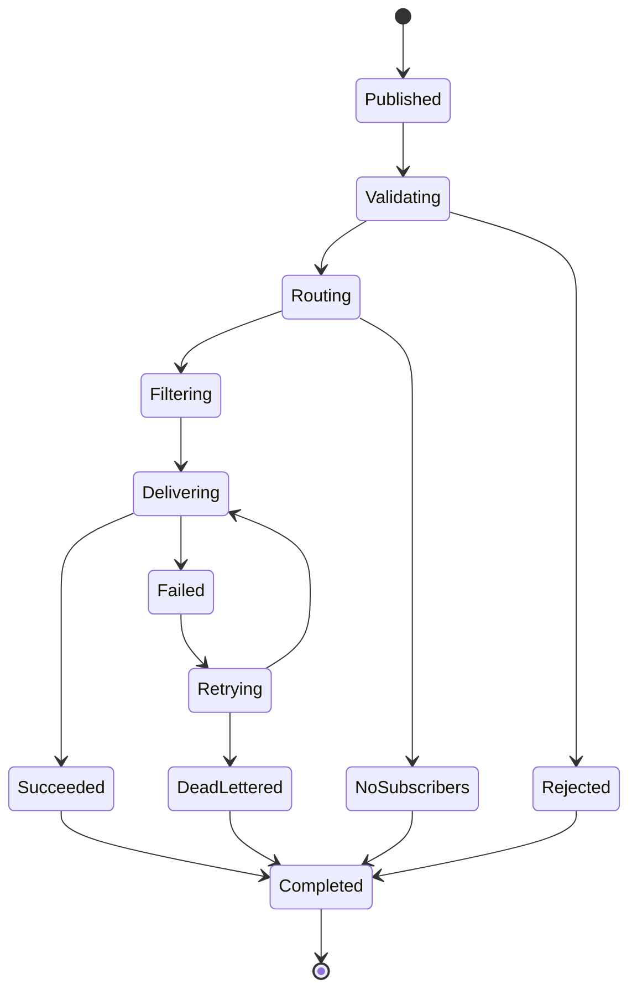
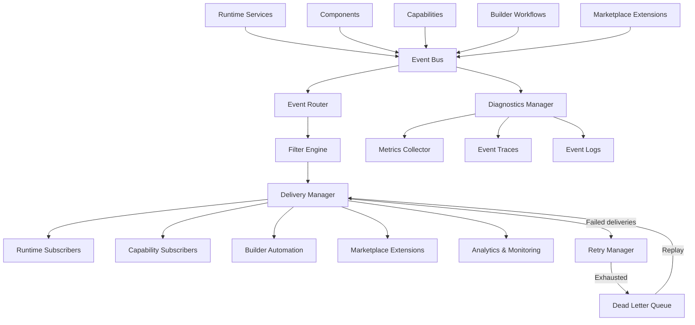
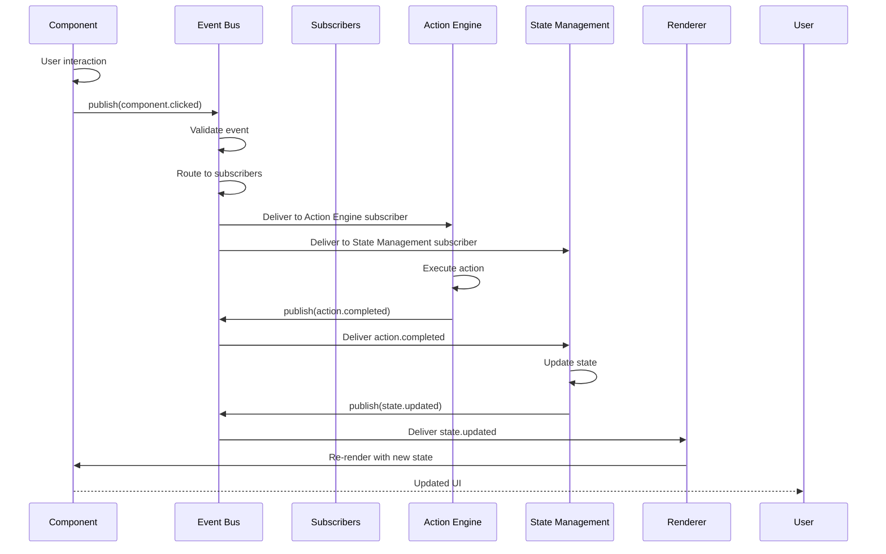
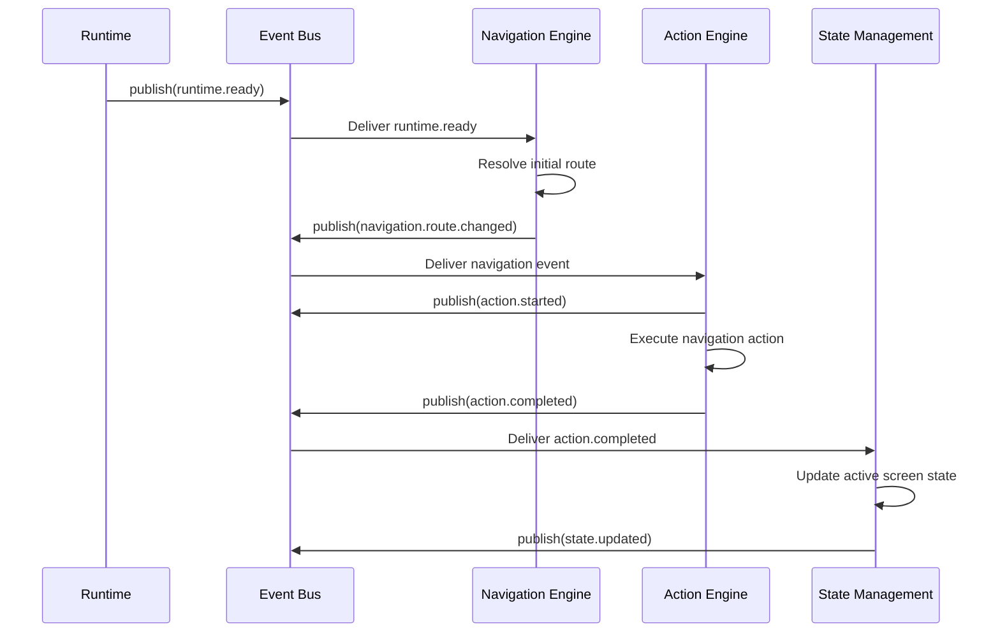
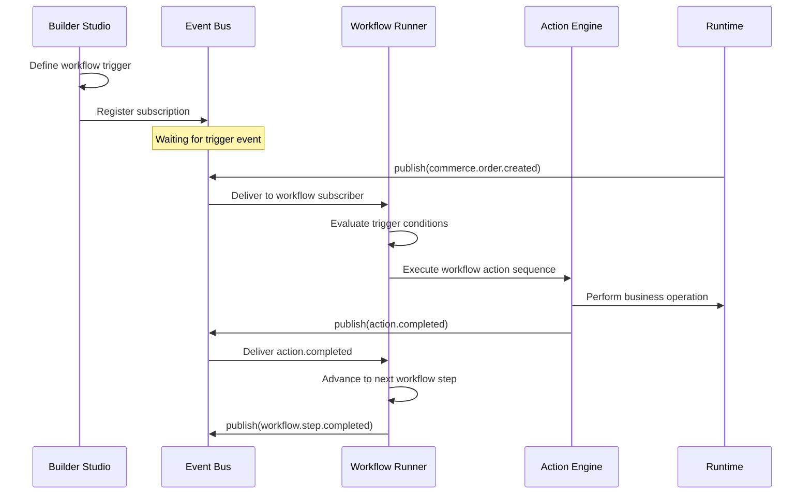

# Specification: Event Bus

**KB-019 — Part III: Engineering Standards**

| Field | Value |
|-------|-------|
| **KB ID** | KB-019 |
| **Title** | Event Bus |
| **Version** | 0.1.0 |
| **Status** | Drafting |
| **Owner** | Architecture |
| **Dependencies** | KB-002 (Glossary), KB-006 (System Architecture), KB-011 (Naming Standards), KB-015 (Action Engine), KB-018 (State Management) |
| **Related Documents** | Runtime Overview, Action Engine, State Management, Navigation Engine, Offline & Synchronization, Capability System, Builder Studio, Marketplace |
| **Review Status** | Pending |
| **Last Updated** | 2026-07-09 |

### Revision History

| Version | Date | Author | Change |
|---------|------|--------|--------|
| 0.1.0 | 2026-07-09 | Architecture | Initial draft |

---

## 1. Purpose

The Event Bus is the **canonical communication mechanism** for asynchronous platform events in DUKADESK. It enables every subsystem — Runtime, Renderer, Navigation, Action Engine, State Management, Theme Engine, Offline Engine, Capabilities, Builder Studio, Marketplace, SDKs, and future AI agents — to communicate through events rather than direct dependencies.

### Why the Event Bus Exists

- **Loose coupling**: Publishers and subscribers have no knowledge of each other. A component emits an event without knowing who (if anyone) will consume it. A subscriber listens for events without knowing who published them.
- **Event-driven architecture**: The platform is built around events, not function calls. Events represent things that have happened. Subscribers react to those events. This makes the system observable, auditable, and extensible.
- **Single communication backbone**: Without an Event Bus, every subsystem would need to wire up its own communication channels. The Event Bus provides a single, consistent mechanism for all async communication.
- **Scalability**: The Event Bus can buffer, prioritize, batch, and route events efficiently. As the platform grows with more capabilities, marketplace extensions, and surfaces, the Event Bus scales without requiring changes to existing publishers or subscribers.

### How the Event Bus Differs from the Action Engine

| Dimension | Event Bus | Action Engine |
|-----------|-----------|---------------|
| **Purpose** | Communication | Execution |
| **Trigger** | Something happened | Do something |
| **Direction** | Publisher → Subscribers | Dispatcher → Handler |
| **Timing** | Asynchronous (fire and forget) | Immediate, deferred, or scheduled |
| **Guarantee** | At-least-once delivery | Configurable (retry, rollback) |
| **Consumers** | Unlimited subscribers | Single handler per action |
| **State impact** | Indirect (subscribers react) | Direct (handler returns result) |

Events and actions work together. Components dispatch actions (do something). The Action Engine executes and publishes events (something happened). Subscribers react to events by dispatching further actions or updating state.

---

## 2. Event Bus Philosophy

| # | Principle | Description |
|---|-----------|-------------|
| 1 | **Loose coupling** | Publishers and subscribers never reference each other directly. An event is published without knowledge of who will receive it. A subscriber registers interest without knowledge of who will publish. |
| 2 | **Publish/Subscribe architecture** | The Event Bus implements the classic pub/sub pattern. Publishers emit events. Subscribers express interest in event types. The bus delivers events to matching subscribers. |
| 3 | **Declarative event contracts** | Every event type has a declared schema. Publishers must conform to the schema. Subscribers can rely on the schema. Events are validated against their contract at publication time. |
| 4 | **Event immutability** | Once published, an event must not be modified. Subscribers receive a read-only view of the event. This ensures consistency and auditability. |
| 5 | **Asynchronous by default** | Event publication is non-blocking. Publishers do not wait for subscribers to process the event. Subscribers process events asynchronously. Synchronous event handling is possible but must be explicitly configured. |
| 6 | **Observable execution** | Every event that flows through the bus is observable. The bus provides traces, metrics, and logs for every published, routed, filtered, delivered, and failed event. |
| 7 | **Scalable communication** | The bus must handle increasing event volumes without degrading performance. Multiple subscribers, high-frequency events, and large payloads must not impact delivery guarantees. |
| 8 | **Capability independence** | Capabilities communicate through events, not through shared interfaces or direct method calls. A capability may publish events, subscribe to events, or both — without depending on other capabilities. |
| 9 | **Platform independence** | The Event Bus contract is platform-agnostic. Events are defined in terms of the canonical event model, not platform-specific messaging APIs. |
| 10 | **Extensible event ecosystem** | New event types can be added without modifying the bus. Marketplace packages, SDKs, and custom enterprise extensions publish and subscribe to events through the same mechanism as core platform services. |

---

## 3. Event Responsibilities

### Event Publication

| Responsibility | Description |
|---------------|-------------|
| Accept events from any publisher | The bus accepts events from Runtime services, Components, Capabilities, Builder workflows, Marketplace extensions, and SDKs. |
| Validate events against their schema | Every published event is validated against its registered schema. Invalid events are rejected with a clear error. |
| Assign event metadata | The bus assigns or enriches: event ID, timestamp, correlation ID (if not provided), and delivery metadata. |
| Enqueue events for routing | Validated events are enqueued for routing and delivery. The queue supports prioritization and back-pressure. |

### Event Subscription

| Responsibility | Description |
|---------------|-------------|
| Maintain subscription registry | The bus maintains a registry of active subscribers, organized by event type, topic, and filter criteria. |
| Support dynamic subscription | Subscribers may register and unregister at runtime. The bus handles subscription changes without interrupting delivery. |
| Filter subscriptions | Subscribers may declare filters that further narrow which events they receive (by tenant, capability, source, metadata). |

### Event Routing

| Responsibility | Description |
|---------------|-------------|
| Match events to subscribers | The Router matches each event to the set of subscribers that have expressed interest in its type and satisfy its filter criteria. |
| Enforce tenant isolation | Events are routed only to subscribers within the same tenant context, unless cross-tenant routing is explicitly configured. |
| Support topic-based routing | Events may be routed by topic hierarchy (e.g., `commerce.order.*` matches `commerce.order.created`, `commerce.order.updated`). |
| Support targeted routing | Events may be routed to a specific subscriber or subscriber group when direct delivery is needed. |

### Event Filtering

| Responsibility | Description |
|---------------|-------------|
| Apply subscriber filters | Before delivery, the bus evaluates each subscriber's filter criteria against the event. Non-matching subscribers are skipped. |
| Filter by tenant | Events are isolated by tenant by default. Subscribers only receive events from their own tenant. |
| Filter by capability | Subscribers may filter events by originating capability. |
| Filter by event metadata | Subscribers may filter by any event metadata field (source, priority, category, custom tags). |

### Event Delivery

| Responsibility | Description |
|---------------|-------------|
| Deliver events to subscribers | The bus delivers each event to all matching subscribers. Delivery may be sequential or parallel depending on configuration. |
| Handle subscriber failures | If a subscriber fails during processing, the bus retries according to the configured retry policy. Repeated failures move the event to the Dead Letter Queue. |
| Enforce delivery ordering | The bus may guarantee FIFO ordering per event type or per correlation ID when configured. |
| Provide delivery guarantees | At-least-once delivery is the default. Exactly-once delivery may be configured for critical event types. |

### Event Prioritization

| Responsibility | Description |
|---------------|-------------|
| Priority queuing | Events are placed in priority queues. High-priority events (user interactions, navigation) are delivered before low-priority events (analytics, diagnostics). |
| Starvation prevention | Lower-priority events are not starved. The bus implements aging or fair scheduling to ensure all events are eventually delivered. |

### Diagnostics

| Responsibility | Description |
|---------------|-------------|
| Event tracing | Every event is traced from publication through delivery. Traces include timing, routing decisions, filtering results, and delivery outcomes. |
| Delivery metrics | The bus collects metrics on publish rate, delivery rate, latency, failure rate, and queue depth. |
| Error reporting | Failed deliveries, validation errors, and routing failures are reported with full context for debugging. |

### What the Event Bus Does Not Do

- It does not execute business logic. Business logic execution is the Action Engine's responsibility.
- It does not store events long-term. Event persistence for replay or audit is handled by dedicated systems.
- It does not replace the Action Engine. Actions are execution requests. Events are notifications that something happened.
- It does not handle synchronous RPC-style communication. Synchronous calls between services use direct integration contracts.

---

## 4. Event Bus Architecture

The Event Bus is composed of logical modules. Each module has a specific responsibility within the event processing pipeline.

### Event Manager

| Field | Description |
|-------|-------------|
| **Purpose** | Central orchestrator for event lifecycle management. |
| **Responsibilities** | Initialize the Event Bus, coordinate module interactions, manage startup/shutdown lifecycle, handle back-pressure. |
| **Inputs** | Event publication requests, subscription requests, lifecycle commands |
| **Outputs** | Processed events, delivery confirmations, lifecycle events |
| **Extension points** | Lifecycle hooks, custom event pipelines, bus-level interceptors |

### Event Registry

| Field | Description |
|-------|-------------|
| **Purpose** | Central catalog of all event types and their schemas. |
| **Responsibilities** | Register event type definitions, validate events against schemas, provide schema lookup, manage event type versioning. |
| **Inputs** | Event type registration requests |
| **Outputs** | Schema validation results, event type lookup |
| **Extension points** | Custom schema validators, dynamic event type registration, backward compatibility checks |

### Publisher

| Field | Description |
|-------|-------------|
| **Purpose** | Entry point for event publication. |
| **Responsibilities** | Accept events from publishers, validate basic structure, assign metadata (ID, timestamp, correlation ID), enqueue for routing. |
| **Inputs** | `EventPayload` from any publisher |
| **Outputs** | Validated and enriched event ready for routing |
| **Extension points** | Pre-publication hooks, custom event enrichments, publication interceptors |

### Subscriber Manager

| Field | Description |
|-------|-------------|
| **Purpose** | Manages event subscriber registration and lifecycle. |
| **Responsibilities** | Register subscribers, manage subscription filters, handle subscribe/unsubscribe lifecycle, track subscriber health. |
| **Inputs** | Subscription requests (event type, handler, filters, options) |
| **Outputs** | Subscription confirmations, subscriber status |
| **Extension points** | Dynamic subscription resolvers, subscription discovery, priority-aware subscriptions |

### Router

| Field | Description |
|-------|-------------|
| **Purpose** | Matches events to subscribers based on event type and routing rules. |
| **Responsibilities** | Topic matching, capability routing, tenant isolation, broadcast and targeted delivery, priority-aware routing. |
| **Inputs** | Validated event, subscriber registry |
| **Outputs** | Matched subscriber list per event |
| **Extension points** | Custom routing strategies, content-based routers, routing rule plugins |

### Filter Engine

| Field | Description |
|-------|-------------|
| **Purpose** | Applies subscriber-defined filters before delivery. |
| **Responsibilities** | Evaluate filter expressions against event metadata and payload, skip non-matching subscribers, log filter decisions at debug level. |
| **Inputs** | Event, subscriber filter criteria |
| **Outputs** | Filtered subscriber list (matching only) |
| **Extension points** | Custom filter predicates, filter expression languages, filter optimization |

### Delivery Manager

| Field | Description |
|-------|-------------|
| **Purpose** | Delivers events to matching subscribers. |
| **Responsibilities** | Manage delivery queues, invoke subscriber handlers, handle delivery failures, enforce ordering guarantees, manage concurrency. |
| **Inputs** | Event, matched subscriber list |
| **Outputs** | Delivery results (success/failure per subscriber) |
| **Extension points** | Custom delivery strategies, delivery interceptors, subscriber wrappers |

### Retry Manager

| Field | Description |
|-------|-------------|
| **Purpose** | Handles event delivery retries according to configured policies. |
| **Responsibilities** | Track delivery attempts, apply backoff strategies, evaluate retry eligibility, escalate to Dead Letter Queue on exhaustion. |
| **Inputs** | Failed delivery attempt |
| **Outputs** | Retry decision (retry / dead letter / skip) |
| **Extension points** | Custom retry policies, circuit breaker integration, retry event hooks |

### Dead Letter Queue (DLQ)

| Field | Description |
|-------|-------------|
| **Purpose** | Stores events that could not be delivered after exhausting retry policies. |
| **Responsibilities** | Accept undeliverable events, store with failure context, provide DLQ inspection and replay, support DLQ monitoring. |
| **Inputs** | Undeliverable event with failure history |
| **Outputs** | Stored event for manual or automated reprocessing |
| **Extension points** | DLQ processors, automated replay rules, DLQ alerting |

### Diagnostics Manager

| Field | Description |
|-------|-------------|
| **Purpose** | Provides real-time and historical visibility into event processing. |
| **Responsibilities** | Event tracing, delivery metrics, error reporting, subscriber health monitoring, bus performance analysis. |
| **Inputs** | All event lifecycle events |
| **Outputs** | Diagnostic data, traces, metrics, logs |
| **Extension points** | Custom diagnostic collectors, external observability integration |

### Metrics Collector

| Field | Description |
|-------|-------------|
| **Purpose** | Collects and exposes event bus performance metrics. |
| **Responsibilities** | Publish rate, delivery rate, latency distribution, failure rate, queue depth, subscriber processing time. |
| **Inputs** | Event lifecycle events |
| **Outputs** | Metric data points |
| **Extension points** | Custom metric exporters, threshold-based alerting, metric aggregation |

---

## 5. Event Model

Every event in DUKADESK follows a canonical structure.

```typescript
interface Event {
  id: string;                          // Unique event identifier (UUID)
  name: string;                        // Human-readable event name
  type: string;                        // Fully qualified event type (e.g., "commerce.order.created")
  source: string;                      // Publisher identifier
  version: string;                     // Event schema version (semantic)
  timestamp: number;                   // Unix milliseconds when the event was published
  correlationId?: string;              // Correlation ID for tracing related events
  causationId?: string;                // ID of the event that caused this event
  tenantId: string;                    // Tenant context
  capabilityId?: string;               // Originating capability
  payload: Record<string, unknown>;    // Event-specific data
  metadata: EventMetadata;             // System metadata
  priority: EventPriority;             // Delivery priority
  security: EventSecurityContext;      // Security context
}
```

### Required Fields

| Field | Description |
|-------|-------------|
| `id` | Universally unique identifier. Generated by the Publisher if not provided. |
| `name` | Human-readable name for debugging and display (e.g., "Order Created"). |
| `type` | Fully qualified event type. Must match a registered event type in the Event Registry. |
| `source` | Identifies the publisher. Format: `{category}.{subsystem}` (e.g., `capability.commerce`, `runtime.engine`, `component.button`). |
| `version` | Semantic version of the event schema. Used for backward compatibility checks. |
| `timestamp` | Time of publication in Unix milliseconds. Set by the Publisher. |
| `tenantId` | Tenant context. Used for tenant isolation during routing. |
| `payload` | Event-specific data. Schema is defined by the event type registration. |

### Optional Fields

| Field | Description |
|-------|-------------|
| `correlationId` | Links related events across subsystems. Should be propagated from originating actions or events. |
| `causationId` | Links an event to its cause (previous event). Enables event chain tracing. |
| `capabilityId` | Identifies the originating capability. Used for capability-scoped routing and filtering. |

### Metadata

```typescript
interface EventMetadata {
  category: EventCategory;             // Primary event category
  tags?: string[];                     // Custom tags for filtering
  ttl?: number;                        // Time-to-live in milliseconds
  size?: number;                       // Payload size estimate
  environment?: string;                 // Environment identifier
  region?: string;                      // Deployment region
}
```

### Priority

```typescript
enum EventPriority {
  CRITICAL = 0,   // Delivered immediately. Bypasses queues.
  HIGH = 1,       // Delivered before normal and low.
  NORMAL = 2,     // Default priority.
  LOW = 3,        // Delivered after all higher-priority events.
}
```

### Security Context

```typescript
interface EventSecurityContext {
  userId?: string;                     // User who triggered the event
  sessionId?: string;                  // Session identifier
  roles?: string[];                    // User roles at time of event
  permissions?: string[];              // Permissions at time of event
  authToken?: string;                  // Authentication token (masked in logs)
  ipAddress?: string;                  // Origin IP (masked in logs)
}
```

---

## 6. Event Categories

### Runtime Events

| Event | Description | Publisher |
|-------|-------------|-----------|
| `runtime.application.started` | Application has started | Runtime |
| `runtime.application.stopped` | Application is stopping | Runtime |
| `runtime.initialized` | Runtime initialization complete | Runtime |
| `runtime.capability.loaded` | A capability has been loaded | Capability System |
| `runtime.capability.unloaded` | A capability has been unloaded | Capability System |
| `runtime.configuration.updated` | Runtime configuration has changed | Runtime |
| `runtime.manifest.updated` | Manifest has been updated | Manifest |
| `runtime.ready` | Platform is ready for user interaction | Runtime |

### Navigation Events

| Event | Description | Publisher |
|-------|-------------|-----------|
| `navigation.route.changed` | Active route has changed | Navigation Engine |
| `navigation.screen.loaded` | A screen has been loaded | Navigation Engine |
| `navigation.screen.closed` | A screen has been closed | Navigation Engine |
| `navigation.modal.opened` | A modal has been opened | Navigation Engine |
| `navigation.modal.closed` | A modal has been closed | Navigation Engine |
| `navigation.deepLink.resolved` | A deep link has been processed | Navigation Engine |
| `navigation.tab.changed` | Active tab has changed | Navigation Engine |

### Component Events

| Event | Description | Publisher |
|-------|-------------|-----------|
| `component.clicked` | A clickable component was clicked | Component |
| `component.tapped` | A tappable component was tapped | Component |
| `component.changed` | An input component value changed | Component |
| `component.focused` | A component received focus | Component |
| `component.blurred` | A component lost focus | Component |
| `component.rendered` | A component completed rendering | Component |
| `component.destroyed` | A component was destroyed | Component |
| `component.error` | A component encountered an error | Component |
| `component.actionDispatched` | A component dispatched an action | Component |

### Action Events

| Event | Description | Publisher |
|-------|-------------|-----------|
| `action.started` | An action has started execution | Action Engine |
| `action.completed` | An action completed successfully | Action Engine |
| `action.failed` | An action failed | Action Engine |
| `action.cancelled` | An action was cancelled | Action Engine |
| `action.retried` | An action was retried | Action Engine |
| `action.timedOut` | An action exceeded its timeout | Action Engine |

### State Events

| Event | Description | Publisher |
|-------|-------------|-----------|
| `state.updated` | A state value was updated | State Management |
| `state.persisted` | State was persisted to storage | State Management |
| `state.restored` | State was restored from storage | State Management |
| `state.synchronized` | State was synchronized with remote | State Management |
| `state.conflict.detected` | A state conflict was detected | State Management |

### Authentication Events

| Event | Description | Publisher |
|-------|-------------|-----------|
| `auth.user.loggedIn` | User logged in successfully | Authentication |
| `auth.user.loggedOut` | User logged out | Authentication |
| `auth.session.refreshed` | User session was refreshed | Authentication |
| `auth.permission.changed` | User permissions changed | Authentication |
| `auth.tenant.switched` | User switched tenant context | Authentication |

### Commerce Events

| Event | Description | Publisher |
|-------|-------------|-----------|
| `commerce.cart.updated` | Cart contents changed | Commerce Capability |
| `commerce.cart.itemAdded` | An item was added to cart | Commerce Capability |
| `commerce.cart.itemRemoved` | An item was removed from cart | Commerce Capability |
| `commerce.order.created` | An order was created | Commerce Capability |
| `commerce.order.statusChanged` | Order status changed | Commerce Capability |
| `commerce.payment.completed` | Payment was processed | Commerce Capability |
| `commerce.payment.failed` | Payment processing failed | Commerce Capability |
| `commerce.refund.issued` | A refund was issued | Commerce Capability |

### Booking Events

| Event | Description | Publisher |
|-------|-------------|-----------|
| `booking.created` | A booking was created | Booking Capability |
| `booking.updated` | Booking details were updated | Booking Capability |
| `booking.cancelled` | A booking was cancelled | Booking Capability |
| `booking.rescheduled` | A booking was rescheduled | Booking Capability |
| `booking.availability.changed` | Resource availability changed | Booking Capability |
| `booking.reminder` | Booking reminder triggered | Booking Capability |

### Integration Events

| Event | Description | Publisher |
|-------|-------------|-----------|
| `integration.webhook.received` | A webhook was received | Integration System |
| `integration.email.sent` | An email was sent | Integration System |
| `integration.sms.delivered` | An SMS was delivered | Integration System |
| `integration.push.delivered` | A push notification was delivered | Integration System |
| `integration.api.response` | An external API response was received | Integration System |

### Device Events

| Event | Description | Publisher |
|-------|-------------|-----------|
| `device.online` | Device came online | Runtime |
| `device.offline` | Device went offline | Runtime |
| `device.orientation.changed` | Device orientation changed | Runtime |
| `device.connectivity.changed` | Network connectivity changed | Runtime |
| `device.storage.low` | Device storage is low | Runtime |

### System Events

| Event | Description | Publisher |
|-------|-------------|-----------|
| `system.error.raised` | A system error occurred | Any subsystem |
| `system.diagnostics.generated` | Diagnostic data is available | Diagnostics |
| `system.metrics.collected` | Metrics data point available | Metrics |
| `system.health.checkCompleted` | A health check completed | Health |
| `system.cache.cleared` | A cache was cleared | Caching |

---

## 7. Event Lifecycle

Every event progresses through a defined lifecycle managed by the Event Bus.

```text
      ┌──────────────────┐
      │ Event Published  │
      └────────┬─────────┘
               │
               ▼
      ┌──────────────────┐
      │   Validation     │
      └────────┬─────────┘
               │
               ▼
      ┌──────────────────┐
      │     Routing      │
      └────────┬─────────┘
               │
               ▼
      ┌──────────────────┐
      │   Filtering      │
      └────────┬─────────┘
               │
               ▼
      ┌──────────────────┐
      │   Delivery       │
      └────────┬─────────┘
               │
         ┌─────┴─────┐
         ▼           ▼
  ┌───────────┐ ┌───────────┐
  │  Success  │ │  Failure  │
  └─────┬─────┘ └─────┬─────┘
        │             │
        └──────┬──────┘
               ▼
      ┌──────────────────┐
      │  Diagnostics     │
      └──────────────────┘
```

### Stage Descriptions

| Stage | Description |
|-------|-------------|
| **Event Published** | A publisher emits an event. The Publisher module receives it, assigns metadata (ID, timestamp), and enriches security context. |
| **Validation** | The event is validated against its registered schema. Required fields are checked. Payload structure is verified. Invalid events are rejected with an error returned to the publisher. |
| **Routing** | The Router matches the event to subscribers based on event type, topic patterns, and routing rules. Tenant isolation is enforced at this stage. |
| **Filtering** | Each matched subscriber's filter criteria is evaluated. Subscribers that do not match are excluded from delivery. |
| **Delivery** | The Delivery Manager sends the event to each matching subscriber. Delivery may be sequential or concurrent. Failed deliveries trigger retry policies. |
| **Success / Failure** | Delivery succeeds or fails per subscriber. Success means the subscriber acknowledged receipt. Failure may trigger retry or Dead Letter Queue escalation. |
| **Diagnostics** | The event lifecycle is recorded: trace, metrics, delivery outcomes, and any errors. |



---

## 8. Event Publication

### Publishers

Any subsystem within the platform can publish events. Publishers are identified by their `source` field.

| Publisher | Example Events | Notes |
|-----------|---------------|-------|
| **Runtime services** | `runtime.initialized`, `runtime.ready` | Core platform lifecycle events |
| **Components** | `component.clicked`, `component.rendered` | UI interaction events |
| **Capabilities** | `commerce.order.created`, `booking.cancelled` | Domain-specific events |
| **Builder workflows** | Custom workflow-triggered events | Defined by workflow configuration |
| **Marketplace extensions** | Extension-specific events | Registered with type prefix |
| **SDKs** | Events from SDK-powered integrations | Follow same contract |

### Publication Flow

1. Publisher creates an event payload conforming to the event type's schema.
2. Publisher calls the Event Bus's `publish()` method with the event payload.
3. The Publisher module validates basic structure and assigns metadata.
4. The event is enqueued for routing and delivery.
5. The publisher receives a confirmation containing the assigned `eventId`.

### Publication Responsibilities

- Publishers must populate all required event fields.
- Publishers must not include sensitive data in event payloads (use references or masked values).
- Publishers must respect the event type's schema version.
- Publishers should populate `correlationId` when the event is part of a chain.

---

## 9. Event Subscription

### Subscribers

Any subsystem can subscribe to events. Subscribers express interest in specific event types or patterns.

| Subscriber | Typical Subscriptions | Purpose |
|------------|----------------------|---------|
| **Runtime services** | `runtime.*`, `system.*` | Platform lifecycle management |
| **Capabilities** | Domain-specific events | React to domain state changes |
| **Components** | `state.*`, `action.*` | Re-render on state or action changes |
| **Builder automation** | Custom workflow events | Trigger automated workflows |
| **SDK listeners** | Application-specific events | Custom integration logic |
| **Analytics** | All events (at LOW priority) | Usage tracking and metrics |
| **Monitoring** | `system.*`, `action.failed`, `event.deadLettered` | Health and alerting |

### Subscription Registration

```typescript
interface Subscription {
  id: string;                          // Unique subscription identifier
  eventType: string;                   // Event type or topic pattern (supports wildcards)
  handler: string | Function;          // Handler identifier or reference
  filters?: SubscriptionFilter[];      // Optional filter criteria
  options?: SubscriptionOptions;       // Delivery options
}
```

### Subscription Filters

```typescript
interface SubscriptionFilter {
  field: string;                       // Field to filter on (e.g., "tenantId", "capabilityId", "metadata.tags")
  operator: 'equals' | 'notEquals' | 'in' | 'notIn' | 'exists' | 'matches';
  value: unknown;                      // Filter value
}
```

### Dynamic Subscriptions

Subscriptions can be registered and unregistered at runtime:

- Capabilities register subscriptions on load and unregister on unload.
- Builder workflows register subscriptions when activated.
- Marketplace extensions register subscriptions on install and unregister on uninstall.
- SDK listeners manage their own subscription lifecycle.

---

## 10. Event Routing

### Routing Rules

The Router determines which subscribers receive each event based on:

1. **Event type match**: The subscriber's event type pattern must match the event's type (exact match or wildcard).
2. **Topic hierarchy**: Events organized by topic support wildcard routing (`commerce.order.*` matches any `commerce.order.` sub-event).
3. **Tenant isolation**: By default, events are delivered only to subscribers within the same tenant.
4. **Capability scope**: Events may be scoped to subscribers within the same capability.

### Topic-Based Routing

```typescript
// Examples of topic patterns

"commerce.order.created"       // Exact match
"commerce.order.*"             // All order sub-events
"commerce.*"                   // All commerce events
"*.created"                    // All creation events (general subscription)
"**"                           // All events (use with caution)
```

### Tenant Isolation

- Every event carries a `tenantId`.
- The Router enforces tenant isolation by default: events are delivered only to subscribers within the same tenant.
- Cross-tenant routing must be explicitly configured and authorized.
- Platform-level events (e.g., `runtime.*`) may be broadcast across tenants.

### Broadcast vs Targeted Delivery

| Mode | Description | Use Case |
|------|-------------|----------|
| **Broadcast** | Delivered to all matching subscribers | State changes, system events |
| **Targeted** | Delivered to a specific subscriber or group | Direct responses, private events |

### Priority Handling

- Events are queued by priority level.
- HIGH and CRITICAL priority events are delivered before NORMAL and LOW.
- Within the same priority, events are delivered in FIFO order (unless ordering guarantees require otherwise).

---

## 11. Event Filtering

### Filter Types

| Filter | Description | Example |
|--------|-------------|---------|
| **Tenant filter** | Only receive events from a specific tenant | `tenantId equals "tenant-123"` |
| **Capability filter** | Only receive events from a specific capability | `capabilityId equals "commerce"` |
| **Source filter** | Only receive events from a specific source | `source matches "capability.commerce.*"` |
| **Priority filter** | Only receive events above a priority threshold | `priority lessThanOrEquals NORMAL` |
| **Metadata filter** | Filter by custom metadata tags | `metadata.tags contains "analytics"` |
| **Payload filter** | Filter by payload content | `payload.status equals "confirmed"` |

### Filter Evaluation

- Filters are evaluated after routing and before delivery.
- Multiple filters are combined with AND logic — all must match for delivery.
- Filter expressions are evaluated in order. Early-exit optimization skips remaining filters on first non-match.
- Filter failures are logged at debug level for diagnostics.

### Performance Considerations

- Filters on indexed fields (`tenantId`, `capabilityId`, `source`, `priority`) are evaluated first.
- Payload filters are evaluated last as they may require deserialization.
- Complex filter expressions should be avoided in high-throughput scenarios.

---

## 12. Runtime Integration

### Runtime

| Interaction | Description |
|-------------|-------------|
| **Initialization** | The Runtime initializes the Event Bus during platform boot. Core event types are registered at this stage. |
| **Lifecycle events** | The Runtime publishes lifecycle events (`runtime.initialized`, `runtime.ready`, `runtime.application.stopped`). |
| **Shutdown** | The Runtime drains the Event Bus during shutdown, allowing in-flight events to complete or be queued for later delivery. |

### Renderer

| Interaction | Description |
|-------------|-------------|
| **Component events** | The Renderer forwards component lifecycle events (`component.rendered`, `component.destroyed`) to the Event Bus. |
| **Re-render triggers** | The Renderer subscribes to state and action events to trigger re-renders when state changes. |

### Navigation Engine

| Interaction | Description |
|-------------|-------------|
| **Navigation events** | The Navigation Engine publishes navigation events (`navigation.route.changed`, `navigation.screen.loaded`). |
| **Navigation triggers** | The Navigation Engine may subscribe to action completion events to navigate after actions succeed. |

### Action Engine

| Interaction | Description |
|-------------|-------------|
| **Action events** | The Action Engine publishes action lifecycle events (`action.started`, `action.completed`, `action.failed`). |
| **Event-driven actions** | The Action Engine may subscribe to events to trigger actions declaratively (event → action mapping). |

### State Management

| Interaction | Description |
|-------------|-------------|
| **State events** | State Management publishes state change events (`state.updated`, `state.synchronized`). |
| **Event-driven state** | State Management subscribes to action completion events to update state based on action results. |

### Offline Engine

| Interaction | Description |
|-------------|-------------|
| **Offline events** | The Offline Engine publishes connectivity events (`device.online`, `device.offline`). |
| **Queued action replay** | The Offline Engine subscribes to `device.online` to trigger queued action replay. |

### Capability System

| Interaction | Description |
|-------------|-------------|
| **Capability events** | Capabilities publish domain-specific events (e.g., `commerce.order.created`). |
| **Cross-capability communication** | Capabilities subscribe to events from other capabilities to react to cross-domain changes. |

---

## 13. Builder Studio Integration

### Event Browser

Builder Studio provides an event browser that:

- Lists all registered event types with their schemas.
- Shows real-time event flow (published events, delivery status).
- Displays event history with filtering and search.
- Provides event detail views (payload, metadata, routing path).

### Event Simulator

Builder Studio provides an event simulator for testing:

- Manually publish events of any registered type.
- Define custom payload values.
- Observe which subscribers receive the event.
- View subscriber processing results (success, failure, timing).

### Workflow Triggers

Builder workflows can be triggered by events:

1. A workflow defines an event trigger (type, filter criteria).
2. When a matching event is published, the Event Bus delivers it to the workflow runner.
3. The workflow runner executes the workflow's action sequence.
4. Workflow completion may publish further events.

### Event Testing

Builder Studio supports event testing in preview mode:

- Test events are published to an isolated Event Bus instance.
- Subscribers in preview mode receive test events without affecting production state.
- Test results are captured and displayed for debugging.

### Live Monitoring

Builder Studio provides live event monitoring:

- Real-time event stream with filtering by type, source, tenant, and priority.
- Delivery metrics per event type and subscriber.
- Subscriber health status (active, degraded, stalled).
- Dead Letter Queue inspection and replay.

### Diagnostics

Builder Studio integrates with the Diagnostics Manager:

- View event traces (full routing path with timing).
- Search events by ID, correlation ID, or type.
- View failed events with error details and retry history.
- Export event data for external analysis.

---

## 14. Marketplace Integration

### Third-Party Event Publishers

Marketplace extensions can publish events:

- Extension events use a namespaced type prefix to avoid conflicts (`marketplace.{extensionId}.{eventName}`).
- Extension events must be registered in the Event Registry before publication.
- Extension events are validated against the same contract as platform events.

### Custom Events

Marketplace extensions can define custom event types:

- Custom event types must be registered with a full schema definition.
- Schema validation applies to custom events at publication time.
- Custom events must not overlap with platform or other extension event namespaces.

### Extension Subscriptions

Marketplace extensions can subscribe to events:

- Subscriptions are registered when the extension is installed.
- Subscriptions are automatically cleaned up when the extension is uninstalled.
- Extensions may subscribe to both platform and other extension events (with tenant isolation).

### Compatibility

- Marketplace events are versioned independently.
- The Event Registry enforces backward compatibility checks when event schemas are updated.
- Breaking changes to event schemas require a new event type version.

### Security Validation

- Marketplace event publishers are validated against the extension's declared permissions.
- An extension may only publish event types it has declared in its manifest.
- An extension may only subscribe to event types it has declared in its manifest.

---

## 15. Reliability

### Delivery Guarantees

| Guarantee | Description | Configuration |
|-----------|-------------|---------------|
| **At-least-once** | Event is delivered at least once. Default for most event types. Subscribers should be idempotent. | Default |
| **At-most-once** | Event is delivered at most once. Suitable for low-priority or high-frequency events where duplicates are unacceptable. | Explicit per subscription |
| **Exactly-once** | Event is delivered exactly once. May require deduplication and transactional processing. Highest overhead. | Explicit per event type |

### Retry Strategies

```typescript
interface RetryPolicy {
  maxAttempts: number;                // Maximum delivery attempts (default: 3)
  backoff: 'fixed' | 'exponential' | 'immediate';
  backoffDelay: number;               // Base delay in milliseconds
  maxBackoffDelay: number;            // Maximum delay (default: 30000)
  retryableErrors: string[];          // Error types that trigger retry
  onExhausted: 'deadLetter' | 'skip' | 'escalate';
}
```

### Duplicate Detection

- Events carry a unique `id`. The bus may use this ID for deduplication.
- Subscribers should implement idempotency — processing the same event twice should have the same effect as processing it once.
- The bus may discard duplicate events within a configurable time window.

### Ordering Guarantees

| Ordering | Description | Configuration |
|----------|-------------|---------------|
| **No ordering** | Events are delivered in any order. Highest throughput. | Default |
| **Per-type FIFO** | Events of the same type are delivered in publication order. | Per event type |
| **Per-correlation FIFO** | Events with the same `correlationId` are delivered in publication order. | Per subscription |
| **Global FIFO** | All events are delivered in publication order. Lowest throughput. | Explicit |

### Dead Letter Queue (DLQ)

- Events that exhaust their retry policy are moved to the DLQ.
- DLQ entries include the full event, failure history (attempts, errors, timestamps), and subscriber context.
- DLQ entries can be inspected, replayed, or discarded through the Diagnostics Manager.
- DLQ alerts can be configured for event types where delivery is critical.

### Idempotency Considerations

- Subscribers should process events idempotently.
- The event `id` can be used as an idempotency key.
- Idempotency windows should be configurable per event type.

---

## 16. Security

### Event Authorization

| Control | Description |
|---------|-------------|
| **Publication authorization** | Only authorized publishers may publish specific event types. Authorization is checked at publication time. |
| **Subscription authorization** | Only authorized subscribers may subscribe to specific event types. Authorization is checked at subscription time. |
| **Routing authorization** | Cross-tenant routing must be explicitly authorized. |
| **Marketplace authorization** | Marketplace extension events and subscriptions are validated against the extension's declared permissions. |

### Tenant Isolation

- Events are isolated by `tenantId` by default.
- The Router enforces tenant isolation — a subscriber in Tenant A does not receive events from Tenant B.
- Platform-level events (e.g., `runtime.*`) may be configured for cross-tenant broadcast.

### Payload Validation

- Event payloads are validated against the registered schema at publication time.
- Payloads containing unexpected fields or invalid types are rejected.
- Payload size limits are enforced to prevent oversized events.

### Sensitive Data Protection

- Event payloads must not contain sensitive data (passwords, tokens, PII, financial instrument details).
- Sensitive data in security context fields (`authToken`, `ipAddress`) is automatically masked in logs and diagnostics.
- The Event Registry should flag event types that may carry sensitive data for additional review.

### Event Integrity

- Events may be digitally signed for integrity verification (configuration-dependent).
- Signature verification ensures the event was not tampered with between publication and delivery.
- Signed events are validated before delivery to subscribers.

### Audit Trails

- All event publications and deliveries are logged for audit purposes.
- Audit logs include: event ID, type, publisher, subscribers, timestamps, and delivery outcome.
- Audit logs are immutable and tamper-evident.

---

## 17. Performance

### Efficient Routing

- The Router maintains an indexed subscriber lookup for O(1) matching by event type.
- Topic-based routing uses a trie structure for efficient wildcard pattern matching.
- Routing results are cached for repeated event types.

### Batch Delivery

- Multiple events bound for the same subscriber may be batched into a single delivery.
- Batch size and interval are configurable per subscriber.
- Batching improves throughput for high-frequency event types.

### Event Buffering

- Events are buffered in memory for fast delivery.
- Buffer overflow triggers back-pressure: publishers are slowed or transient failures are returned.
- Buffer size is configurable with a hard limit to prevent memory exhaustion.

### Prioritization

- Priority queues ensure critical events are not delayed by high-volume low-priority events.
- Within each priority level, FIFO ordering is maintained (unless configuration overrides it).
- Starvation prevention ensures low-priority events are eventually delivered.

### Back-Pressure Handling

When subscriber processing cannot keep up with publication rate:

1. The bus applies back-pressure to publishers (slowing publication rate).
2. Events are buffered up to the configured limit.
3. If the buffer is exhausted, the bus rejects new events with a `BACK_PRESSURE` error.
4. Monitoring alerts when back-pressure thresholds are crossed.

### Subscription Optimization

- Subscribers that cannot keep up may be flagged as degraded.
- Degraded subscribers may have their delivery rate limited or be temporarily suspended.
- Subscriber health is monitored and reported through diagnostics.

---

## 18. Observability

### Event Traces

Every event produces a trace:

```typescript
interface EventTrace {
  eventId: string;
  type: string;
  publishedAt: number;
  validationResult: 'passed' | 'failed';
  routingResult: {
    matchedSubscribers: number;
    filteredSubscribers: number;
    deliveryTargets: number;
  };
  deliveries: Array<{
    subscriberId: string;
    status: 'delivered' | 'failed' | 'retrying' | 'deadLettered';
    attemptCount: number;
    duration: number;
    error?: string;
  }>;
  totalDuration: number;
  completedAt: number;
}
```

### Delivery Metrics

| Metric | Type | Description |
|--------|------|-------------|
| `events.published` | Counter | Total events published |
| `events.delivered` | Counter | Events delivered to at least one subscriber |
| `events.failed` | Counter | Events that failed delivery to all subscribers |
| `events.deadLettered` | Counter | Events moved to Dead Letter Queue |
| `events.latency` | Histogram | Publication-to-delivery latency |
| `events.queueDepth` | Gauge | Current event queue depth |
| `events.backPressure` | Gauge | Back-pressure level (0–100) |

### Subscriber Metrics

| Metric | Type | Description |
|--------|------|-------------|
| `subscribers.total` | Gauge | Total registered subscribers |
| `subscribers.active` | Gauge | Subscribers currently processing events |
| `subscribers.degraded` | Gauge | Subscribers unable to keep up |
| `subscribers.processingTime` | Histogram | Time subscribers take to process events |

### Failure Analytics

- Failure rates grouped by event type, subscriber, and error category.
- DLQ growth rate and top contributors.
- Retry effectiveness (success rate after retry vs dead-letter rate).
- Subscriber timeout and crash frequency.

### Event Timelines

- Visual timeline showing event flow across subsystems.
- Correlation ID–based grouping shows related events as chains.
- Timeline overlays with action, state, and render events for full-context debugging.

### Diagnostics Dashboards

| Dashboard | Description |
|-----------|-------------|
| **Event Overview** | Publication rate, delivery rate, top event types, top subscribers |
| **Event Explorer** | Search and filter events by type, source, tenant, correlation ID |
| **Subscriber Health** | Active, degraded, and stalled subscribers per event type |
| **DLQ Inspector** | Dead Letter Queue entries with replay capability |
| **Event Chains** | Correlation-based event chain visualization |

---

## 19. Anti-Patterns

| Anti-Pattern | Why It Violates the Event Bus |
|--------------|-------------------------------|
| **Direct service calls instead of events** | Subsystems calling each other directly instead of communicating through events. | Creates tight coupling, reduces observability, prevents independent scaling. |
| **Circular event chains** | Event A triggers subscriber that publishes Event B, which triggers subscriber that publishes Event A. | Creates infinite loops. The bus must detect and break circular chains. |
| **Oversized event payloads** | Including large data blobs (files, images, large documents) in event payloads. | Causes memory pressure, slow delivery, and network congestion. Use references instead. |
| **Business logic embedded in events** | Events that contain instructions for subscribers to execute (instead of just state change notifications). | Violates event immutability and the principle that events describe what happened, not what to do. |
| **Event storms** | A single state change producing a cascade of events that overwhelms subscribers. | Causes performance degradation and cascading failures. Implement debouncing, deduplication, and rate limiting. |
| **Unversioned events** | Changing event payload structure without updating the version field. | Breaks subscribers that depend on the old schema. Every schema change must increment the version. |
| **Hidden subscribers** | Subscribers that register without being documented or discoverable. | Creates invisible behavior that is hard to debug. All subscriptions should be observable. |
| **Synchronous event processing** | Publishers waiting for subscriber completion before continuing. | Violates async-by-default principle. Use the Action Engine for synchronous execution patterns. |
| **Events as commands** | Using events to request actions rather than notify of state changes. | Events notify. Actions execute. Mixing them creates confusion about responsibility. |
| **Missing idempotency** | Subscribers that produce side effects without handling duplicate events. | Causes data corruption on retry delivery. All subscribers should be idempotent. |
| **Over-subscription** | Subscribing to `**` (all events) when only a few event types are needed. | Wastes resources, creates unnecessary load, and complicates diagnostics. Subscribe to specific types or patterns. |
| **Silent subscriber failures** | Subscribers that fail without logging or publishing an error event. | Creates invisible failures that undermine reliability. Subscriber failures must be observable. |

---

## 20. Future Evolution

### AI-Generated Events

- AI agents will generate and consume events to coordinate across platform subsystems.
- AI-generated events will follow the same contract and validation as system events.
- The bus will support event-type discovery for AI agents to learn available event types programmatically.

### Intelligent Routing

- The Router will support content-based routing using machine learning models.
- Events may be routed to the "best" subscriber rather than all matching subscribers.
- Intelligent routing will be opt-in and configured per event type.

### Cross-Tenant Automation

- The bus will support cross-tenant event routing with explicit authorization and isolation guarantees.
- Cross-tenant events will be logged separately for compliance and audit purposes.
- Tenant-to-tenant event mappings will be configured through the Manifest.

### Federated Event Buses

- Multiple runtime instances may connect their event buses into a federation.
- Federated events will support cross-instance routing with latency and reliability guarantees.
- Federation will be transparent to publishers and subscribers.

### Distributed Runtimes

- The Event Bus will support runtime instances deployed across regions and data centers.
- Cross-region events will handle network partitions gracefully.
- Event ordering guarantees will be relaxed across regions (eventual consistency).

### Event Sourcing (Future Consideration)

- The Event Bus may serve as the backbone for event sourcing architectures.
- Events will be stored as the primary record of state changes.
- Event sourcing will coexist with the current state management approach.

### Workflow Orchestration

- The Event Bus will integrate with workflow orchestration engines.
- Events will trigger workflow instances, advance workflow states, and signal workflow completion.
- Workflow orchestration will be configured through Builder Studio.

---

## 21. Relationship to Other Documents

| Document | Relationship |
|----------|-------------|
| **Runtime Overview** | Initializes and manages the Event Bus lifecycle. Publishes runtime lifecycle events. |
| **Action Engine (KB-015)** | Publishes action lifecycle events (`action.started`, `action.completed`, `action.failed`). May subscribe to events for event-triggered actions. |
| **State Management (KB-018)** | Publishes state change events (`state.updated`, `state.synchronized`). Subscribes to action events for state updates. |
| **Navigation Engine (KB-016)** | Publishes navigation events. May subscribe to action events for post-navigation behavior. |
| **Theme Engine (KB-017)** | Publishes theme change events (`theme.changed`, `theme.modeChanged`). |
| **Offline & Synchronization (KB-020)** | Publishes connectivity events (`device.online`, `device.offline`). Subscribes to action events for offline queuing. |
| **Component Model (KB-013)** | Components publish interaction and lifecycle events (`component.clicked`, `component.rendered`). |
| **Capability System** | Capabilities publish domain events. Subscribe to cross-capability events. |
| **Builder Studio** | Uses the Event Bus for workflow triggers, event simulation, and live monitoring. |
| **Marketplace** | Extensions publish and subscribe to events through the Event Bus. Event permissions are declared in extension manifests. |
| **Publishing Pipeline (KB-031)** | May subscribe to publication lifecycle events for deployment automation. |

---

## 22. Architecture Diagrams

### Event Bus Architecture



### Event Lifecycle


### Publish–Subscribe Flow



### Runtime Event Flow



### Builder Automation Flow



---

**End of KB-019 — Event Bus**
