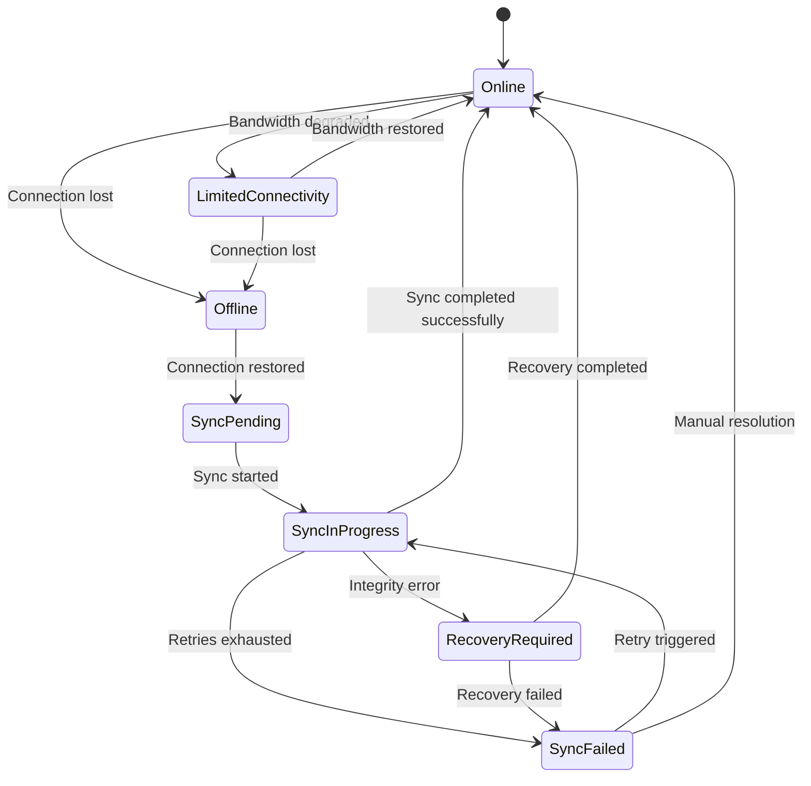
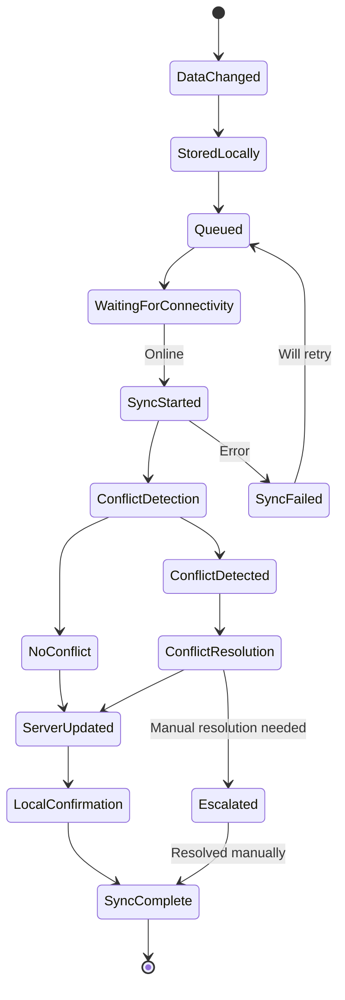
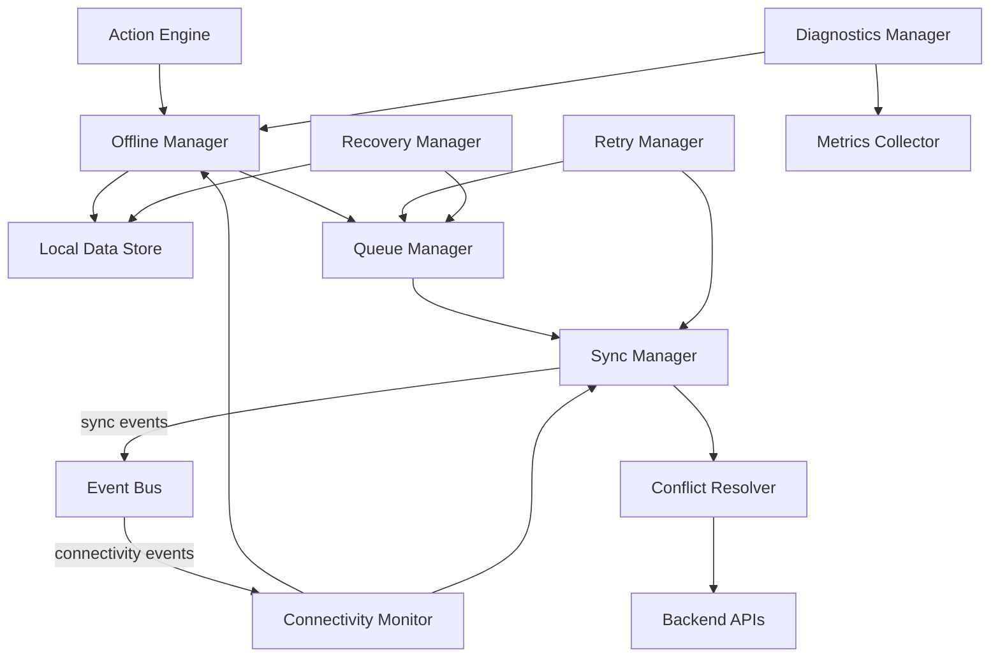
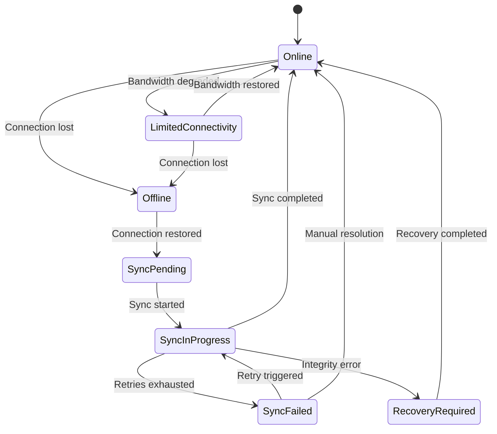
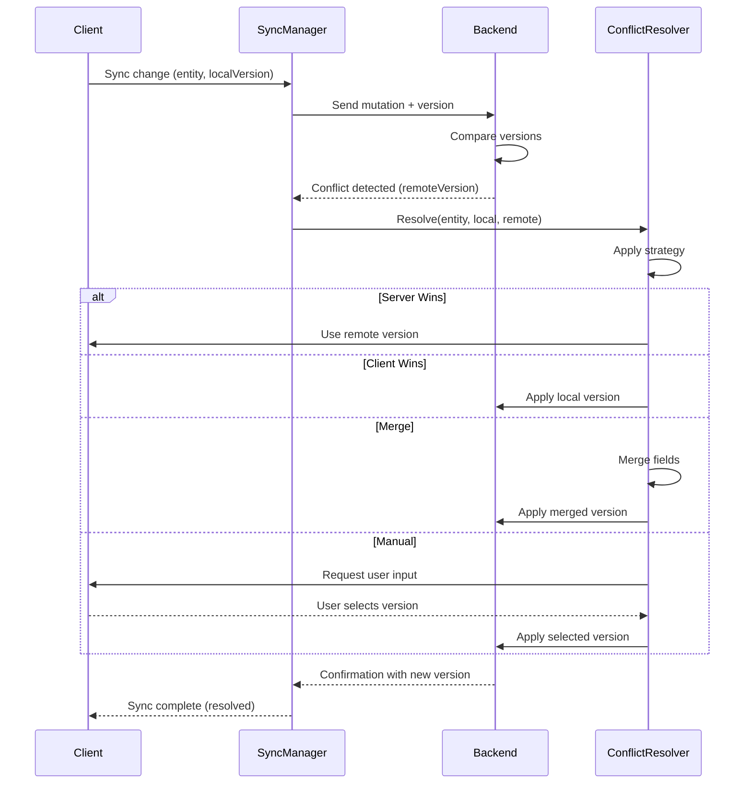
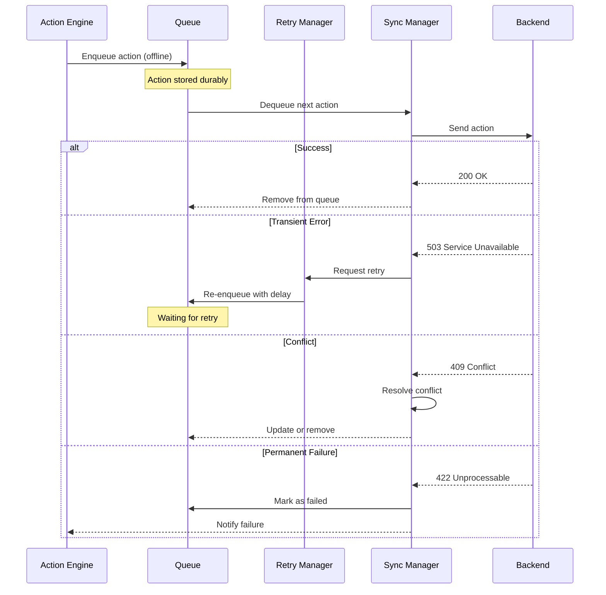

# Specification: Offline & Synchronization

**KB-020 — Part III: Engineering Standards**

| Field | Value |
|-------|-------|
| **KB ID** | KB-020 |
| **Title** | Offline & Synchronization |
| **Version** | 0.1.0 |
| **Status** | Drafting |
| **Owner** | Architecture |
| **Dependencies** | KB-002 (Glossary), KB-006 (System Architecture), KB-015 (Action Engine), KB-018 (State Management), KB-019 (Event Bus) |
| **Related Documents** | Runtime Overview (KB-008), State Management (KB-018), Event Bus (KB-019), Action Engine (KB-015), Capability System (KB-010), Publishing Pipeline (KB-031), Backend Architecture, Builder Studio (KB-022) |
| **Review Status** | Pending |
| **Last Updated** | 2026-07-09 |

### Revision History

| Version | Date | Author | Change |
|---------|------|--------|--------|
| 0.1.0 | 2026-07-09 | Architecture | Initial draft |

---

## 1. Purpose

The Offline & Synchronization subsystem ensures that DUKADESK applications remain fully usable without network connectivity while maintaining data integrity and predictable synchronization behavior once connectivity is restored.

### Why Offline Capability Is a Core Platform Feature

- **Business continuity**: DUKADESK targets businesses operating in regions with unreliable or intermittent connectivity. Offline operation is not a fallback — it is the expected mode in many environments.
- **User experience**: Users should never be blocked by network conditions. Actions taken offline must be queued and synchronized transparently when connectivity returns.
- **Data integrity**: Offline operation must not risk data loss. All user actions, form submissions, and state changes are durably stored locally before any synchronization attempt.
- **Architectural principle**: Offline-first is one of DUKADESK's core architecture decisions (see Current Architecture Decisions in KB-001). Every capability and feature must consider offline behavior from the start.

### Why Synchronization Is Separated from Application Logic

- Application logic (capabilities, components, actions) operates identically regardless of connectivity state.
- The Offline & Synchronization subsystem handles connectivity detection, queue management, conflict resolution, and retry transparently.
- Capabilities declare their synchronization policies declaratively — they do not implement sync logic.

### Why Eventual Consistency Is Preferred

- Blocking users until data is synchronized creates a poor experience in low-connectivity environments.
- Eventual consistency allows users to continue working while synchronization happens in the background.
- Conflict resolution policies ensure that eventual consistency does not mean data corruption.

### Why Synchronization Policies Should Be Configurable

- Different data categories have different consistency requirements (inventory levels need stronger guarantees than product browsing).
- Different capabilities have different conflict resolution preferences.
- Tenant administrators may override default policies for their specific business needs.

---

## 2. Offline Philosophy

| # | Principle | Description |
|---|-----------|-------------|
| 1 | **Offline First** | The platform is designed to work offline from the ground up. Offline is not a degraded mode — it is a first-class operating state. All features must function without connectivity. |
| 2 | **Local Before Remote** | Data is written locally first, before any network call is attempted. The local store is the source of truth until synchronization confirms the remote state. |
| 3 | **Eventual Consistency** | The platform guarantees that all copies of data will eventually be consistent across devices and the server. Users are never blocked waiting for synchronization. |
| 4 | **Predictable Conflict Resolution** | Every conflict has a defined resolution strategy. No conflict is resolved silently or unpredictably. Users and administrators can understand exactly how a conflict was resolved. |
| 5 | **Retry by Policy** | Synchronization retries follow configured policies (backoff, limits, escalation). No action is silently dropped. Every queued item is accounted for until it succeeds or is explicitly cancelled. |
| 6 | **Durable Local Storage** | All locally stored data is durably persisted. Application restart, crash recovery, or device reboot must not lose queued actions or unsynchronized data. |
| 7 | **Transparent Synchronization** | Synchronization happens in the background. Users are informed of sync status but are not required to manage it. The platform handles connectivity changes, retries, and recovery automatically. |
| 8 | **User Awareness** | Users are informed when they are offline, when sync is pending, and when conflicts require their attention. The platform never silently drops data or resolves conflicts without visibility. |
| 9 | **Data Integrity** | Local data must never diverge from remote data in ways that violate business rules. Synchronization preserves referential integrity, uniqueness constraints, and capability-defined invariants. |
| 10 | **Security by Default** | Local data is encrypted. Queued actions are protected. Synchronization uses authenticated and encrypted channels. Tenant isolation is maintained offline and online. |

---

## 3. Responsibilities

### Local Persistence

| Responsibility | Description |
|---------------|-------------|
| Store runtime configuration locally | Feature flags, capability registry, manifest, theme tokens, navigation structure. |
| Store user data locally | Profile, preferences, session information, authentication tokens. |
| Store business data locally | Products, orders, bookings, tasks, customers, messages, forms (capability-specific). |
| Store media locally | Images, documents, videos, offline assets. |
| Store queue data durably | Pending actions, uploads, downloads, retry queue — persisted across restarts. |
| Store sync metadata | Version information, synchronization timestamps, conflict history. |

### Offline Operation

| Responsibility | Description |
|---------------|-------------|
| Maintain full UI functionality offline | All screens, navigation, and components must render without network access. |
| Support data creation offline | Users can create records (orders, bookings, tasks) offline. Actions are queued. |
| Support data reading from local store | All reads resolve from the local data store when offline. |
| Support data modification offline | Edits to locally available data are applied locally and queued for sync. |
| Indicate offline status visually | The UI must clearly indicate when the application is operating offline. |

### Request Queuing

| Responsibility | Description |
|---------------|-------------|
| Queue actions that require connectivity | Create, update, delete, and other mutating actions are queued when offline. |
| Queue uploads and downloads | File uploads, asset downloads, and bulk operations are queued for sync. |
| Preserve queue order within categories | Actions within the same data category are synchronized in creation order. |
| Support queue cancellation | Users may cancel pending queued actions before they are synchronized. |

### Synchronization Scheduling

| Responsibility | Description |
|---------------|-------------|
| Detect connectivity changes | Monitor network status and transitions between connectivity states. |
| Trigger sync on connectivity restored | Automatically begin synchronization when the device transitions from offline to online. |
| Support scheduled sync | Synchronization may be scheduled at configurable intervals. |
| Support background sync | Synchronization may run as a background process. |
| Support manual sync | Users may trigger synchronization manually. |

### Conflict Detection

| Responsibility | Description |
|---------------|-------------|
| Detect version conflicts | Compare local and remote versions to identify conflicting changes. |
| Detect timestamp conflicts | Compare modification timestamps to identify conflicts. |
| Support capability-defined conflict rules | Capabilities may define custom conflict detection logic. |
| Log conflicts for audit | Every detected conflict is logged with full context for audit and debugging. |

### Conflict Resolution

| Responsibility | Description |
|---------------|-------------|
| Apply configured resolution strategy | Conflicts are resolved according to the configured strategy for the data category. |
| Support multiple resolution strategies | Server wins, client wins, merge, manual, capability-defined, user-assisted. |
| Preserve resolution history | Every conflict resolution is recorded for audit and rollback. |

### Retry Management

| Responsibility | Description |
|---------------|-------------|
| Apply retry policy | Failed synchronization attempts are retried according to the configured policy. |
| Escalate on exhaustion | When retry policies are exhausted, the item is escalated for manual review or permanent failure handling. |
| Prevent infinite retries | Every retry policy has a configured maximum. |
| Notify users on persistent failures | Users are informed when synchronization actions persistently fail. |

### Connectivity Monitoring

| Responsibility | Description |
|---------------|-------------|
| Monitor network state | Track online/offline/limited connectivity status. |
| Detect connectivity transitions | Publish events when connectivity state changes. |
| Assess connection quality | Evaluate bandwidth and latency for synchronization strategy decisions. |
| Provide connectivity status to all subsystems | Runtime, Action Engine, and UI can query current connectivity state. |

### Recovery

| Responsibility | Description |
|---------------|-------------|
| Recover queue after restart | All queued items are reloaded from durable storage on application restart. |
| Validate local data integrity | On restart, the local store is validated. Corrupted data is flagged. |
| Resume interrupted synchronization | Partial syncs are resumed from the last successful checkpoint. |
| Handle storage exhaustion | When local storage is full, the system degrades gracefully. |

### Diagnostics

| Responsibility | Description |
|---------------|-------------|
| Sync history | Complete history of synchronization attempts, successes, and failures. |
| Queue inspection | Real-time and historical view of the sync queue. |
| Conflict logs | All detected conflicts with resolution details. |
| Connectivity logs | Connectivity state transitions with timestamps. |

### What the Offline & Synchronization Subsystem Does Not Do

- It does not replace the Action Engine. Actions are dispatched by the Action Engine and intercepted by the Offline subsystem.
- It does not replace State Management. State is managed by the State Management layer. The Offline subsystem persists state locally.
- It does not implement business logic. Conflict resolution policies are configured, not coded.
- It does not handle real-time collaboration. Real-time synchronization is a separate concern.

---

## 4. Offline Architecture

The Offline & Synchronization subsystem is composed of logical modules.

### Offline Manager

| Field | Description |
|-------|-------------|
| **Purpose** | Central orchestrator for offline and synchronization lifecycle. |
| **Responsibilities** | Coordinate module interactions, manage initialization and shutdown, determine overall sync readiness, expose offline status to the platform. |
| **Inputs** | Connectivity state changes, sync requests, capability registrations |
| **Outputs** | Sync commands to modules, offline status to platform |
| **Extension points** | Custom offline policies, environment-specific strategies |

### Connectivity Monitor

| Field | Description |
|-------|-------------|
| **Purpose** | Monitors network connectivity and provides real-time connectivity state. |
| **Responsibilities** | Detect network transitions, assess connection quality, publish connectivity events to the Event Bus, provide connectivity state query to all subsystems. |
| **Inputs** | Platform network status APIs |
| **Outputs** | Connectivity state, connectivity change events |
| **Extension points** | Custom connectivity detectors, connection quality estimators |

### Local Data Store

| Field | Description |
|-------|-------------|
| **Purpose** | Provides durable local persistence for all offline data categories. |
| **Responsibilities** | Store and retrieve data by namespace and key, enforce tenant isolation, support encryption, support schema versioning, handle storage limits. |
| **Inputs** | Read/write requests from Runtime, State Management, Queue Manager |
| **Outputs** | Stored data, read results |
| **Extension points** | Custom storage backends, data migration handlers, encryption providers |

### Queue Manager

| Field | Description |
|-------|-------------|
| **Purpose** | Manages the offline action queue. |
| **Responsibilities** | Enqueue actions for synchronization, preserve queue order, support prioritization, persist queue durably, handle queue cancellation and expiration. |
| **Inputs** | Action dispatches from the Action Engine |
| **Outputs** | Queued actions for synchronization |
| **Extension points** | Custom queue ordering strategies, queue filters, priority overrides |

### Sync Manager

| Field | Description |
|-------|-------------|
| **Purpose** | Orchestrates the synchronization of queued actions and data with the backend. |
| **Responsibilities** | Select synchronization strategy, execute sync operations, manage sync lifecycle, handle partial sync, coordinate with Conflict Resolver. |
| **Inputs** | Queued actions, sync schedule, connectivity state |
| **Outputs** | Sync results (success, conflict, failure) |
| **Extension points** | Custom sync strategies, sync pipeline plugins, protocol adapters |

### Conflict Resolver

| Field | Description |
|-------|-------------|
| **Purpose** | Detects and resolves conflicts between local and remote data. |
| **Responsibilities** | Compare local and remote versions, apply configured resolution strategy, record resolution history, escalate unresolvable conflicts. |
| **Inputs** | Local data, remote data, conflict detection rules |
| **Outputs** | Resolved data, conflict resolution record |
| **Extension points** | Custom conflict detection rules, custom resolution strategies, user-assisted resolution UI |

### Retry Manager

| Field | Description |
|-------|-------------|
| **Purpose** | Manages retry of failed synchronization operations. |
| **Responsibilities** | Apply retry policy (backoff, limits), track retry attempts, escalate on exhaustion, notify on persistent failure. |
| **Inputs** | Failed sync operations |
| **Outputs** | Retry decisions (retry / escalate / fail) |
| **Extension points** | Custom retry policies, circuit breaker integration, failure escalation handlers |

### Recovery Manager

| Field | Description |
|-------|-------------|
| **Purpose** | Manages recovery from application restart, crash, or storage corruption. |
| **Responsibilities** | Reload queue from durable store, validate local data integrity, resume interrupted syncs, handle storage exhaustion. |
| **Inputs** | Application lifecycle events |
| **Outputs** | Recovery status, integrity report |
| **Extension points** | Custom recovery validators, data repair plugins |

### Diagnostics Manager

| Field | Description |
|-------|-------------|
| **Purpose** | Provides visibility into offline and synchronization behavior. |
| **Responsibilities** | Sync history, queue inspection, conflict logs, connectivity logs, performance monitoring. |
| **Inputs** | All offline and sync lifecycle events |
| **Outputs** | Diagnostic data, metrics, logs |
| **Extension points** | Custom diagnostic collectors, external observability integration |

### Metrics Collector

| Field | Description |
|-------|-------------|
| **Purpose** | Collects and exposes offline and synchronization performance metrics. |
| **Responsibilities** | Queue depth, sync latency, conflict rate, retry rate, success/failure rates, connectivity uptime. |
| **Inputs** | Offline and sync lifecycle events |
| **Outputs** | Metric data points |
| **Extension points** | Custom metric exporters, threshold-based alerting |

---

## 5. Offline Data Categories

Data stored locally is organized by category. Each category has configurable synchronization and conflict resolution policies.

### Runtime Data

| Data | Description | Sync Policy | Conflict Resolution |
|------|-------------|-------------|-------------------|
| Configuration | Platform configuration, manifest, runtime settings | Pull on connect | Server wins |
| Feature flags | Feature flag states for capabilities | Pull on connect | Server wins |
| Capability registry | Registered capabilities, versions, availability | Pull on connect | Server wins |
| Navigation metadata | Screen definitions, navigation structure | Pull on connect | Server wins |
| Theme definition | Active theme tokens, brand configuration | Pull on connect | Server wins |

### User Data

| Data | Description | Sync Policy | Conflict Resolution |
|------|-------------|-------------|-------------------|
| Profile | User profile information | Bidirectional | Last writer wins |
| Preferences | User preferences and settings | Bidirectional | Last writer wins |
| Session information | Auth tokens, session state | Refresh on connect | Server wins |

### Business Data

| Data | Description | Sync Policy | Conflict Resolution |
|------|-------------|-------------|-------------------|
| Products | Product catalog, pricing, availability | Pull on connect | Server wins |
| Orders | Customer orders, status, history | Bidirectional | Capability-defined |
| Bookings | Appointments, resources, schedules | Bidirectional | Capability-defined |
| Tasks | Task assignments, status, notes | Bidirectional | Last writer wins |
| Customers | Customer profiles, contact info | Bidirectional | Merge |
| Messages | Communication history | Bidirectional | Timestamp wins |
| Forms | Form submissions, drafts | Send only | Server wins |

### Media

| Data | Description | Sync Policy | Conflict Resolution |
|------|-------------|-------------|-------------------|
| Images | Product images, avatars, documents | Download on demand | N/A (immutable) |
| Documents | PDFs, spreadsheets, reports | Download on demand | N/A (immutable) |
| Videos | Training videos, promotions | Download on demand | N/A (immutable) |
| Offline assets | Bundled theme and capability assets | Preloaded | N/A (immutable) |

### Queue Data

| Data | Description | Sync Policy | Conflict Resolution |
|------|-------------|-------------|-------------------|
| Pending actions | Mutating actions queued while offline | Send | Server wins |
| Pending uploads | File uploads queued while offline | Send | Server wins |
| Pending downloads | File downloads queued while offline | Receive | N/A |
| Retry queue | Failed sync operations pending retry | Send | Server wins |

### System Data

| Data | Description | Sync Policy | Conflict Resolution |
|------|-------------|-------------|-------------------|
| Sync metadata | Last sync timestamps, version vectors | Internal | N/A |
| Version information | Local data version identifiers | Internal | N/A |
| Device registration | Device identity, push tokens | Send on connect | Server wins |
| Diagnostics | Sync history, error logs, performance data | Send on schedule | N/A |

---

## 6. Connectivity States

### Canonical States

```text
                    ┌──────────────────┐
                    │     Online       │
                    └────────┬─────────┘
                             │
              ┌──────────────┼──────────────┐
              ▼              ▼              ▼
    ┌─────────────┐ ┌──────────────┐ ┌────────────┐
    │  Limited    │ │  Offline     │ │ Sync Pending│
    │Connectivity │ │              │ │            │
    └──────┬──────┘ └──────┬───────┘ └──────┬─────┘
           │               │                │
           └───────┬───────┘                │
                   ▼                        ▼
          ┌─────────────────┐    ┌──────────────────┐
          │ Sync In Progress │    │   Sync Failed    │
          └────────┬────────┘    └────────┬─────────┘
                   │                      │
                   └──────────┬───────────┘
                              ▼
                   ┌──────────────────┐
                   │    Recovery      │
                   │    Required      │
                   └──────────────────┘
```

### State Descriptions

| State | Description | Entry Conditions | Exit Conditions |
|-------|-------------|-------------------|-----------------|
| **Online** | Full connectivity. Synchronization can occur in real time. | Network available, quality sufficient | Network unavailable or quality degraded |
| **Limited Connectivity** | Connected but with restrictions (low bandwidth, high latency, metered connection). | Bandwidth below threshold, latency above threshold, or metered network detected | Bandwidth/latency recover, or connection lost |
| **Offline** | No network connectivity. All operations are local. Actions are queued. | Network unavailable | Network restored |
| **Sync Pending** | Connectivity restored but synchronization has not yet started. Queued actions are waiting. | Transition from Offline to Online | Sync begins |
| **Sync In Progress** | Synchronization is actively running. Queued actions are being sent, conflicts are being resolved. | Sync start triggered (automatic or manual) | Sync completes, or sync fails |
| **Sync Failed** | Synchronization encountered errors that could not be resolved automatically. | Retry policy exhausted for one or more items | User intervention, or retry triggered |
| **Recovery Required** | Local data integrity issue detected. Manual recovery or data refresh needed. | Storage corruption, version mismatch, unrecoverable conflict | Recovery process completed |

### State Transitions



### Connectivity Assessment

The Connectivity Monitor evaluates the following dimensions:

| Dimension | Metric | Thresholds |
|-----------|--------|------------|
| **Availability** | Network reachable | Boolean |
| **Bandwidth** | Estimated throughput | Online > 1 Mbps, Limited ≤ 1 Mbps |
| **Latency** | Round-trip time | Online < 500ms, Limited ≥ 500ms |
| **Metered** | User is charged for data | Boolean (user-configurable) |

### Events

| Event | Trigger |
|-------|---------|
| `connectivity.online` | Device transitioned to Online state |
| `connectivity.limited` | Device transitioned to Limited Connectivity state |
| `connectivity.offline` | Device transitioned to Offline state |
| `connectivity.syncPending` | Sync is pending (queue non-empty, online) |
| `connectivity.syncStarted` | Sync process has started |
| `connectivity.syncCompleted` | Sync completed successfully |
| `connectivity.syncFailed` | Sync failed |
| `connectivity.recoveryRequired` | Recovery process needed |

---

## 7. Synchronization Lifecycle

Every data mutation follows a defined synchronization lifecycle.

```text
      ┌──────────────────┐
      │  Data Changed    │
      └────────┬─────────┘
               │
               ▼
      ┌──────────────────┐
      │  Stored Locally  │
      └────────┬─────────┘
               │
               ▼
      ┌──────────────────┐
      │     Queued       │
      └────────┬─────────┘
               │
               ▼
      ┌──────────────────┐
      │  Connectivity    │
      │   Available      │
      └────────┬─────────┘
               │
               ▼
      ┌──────────────────┐
      │ Synchronization  │
      │    Started       │
      └────────┬─────────┘
               │
               ▼
      ┌──────────────────┐
      │   Conflict       │
      │   Detection      │
      └────────┬─────────┘
               │
         ┌─────┴─────┐
         ▼           ▼
  ┌───────────┐ ┌───────────┐
  │  No       │ │ Conflict  │
  │ Conflict  │ │ Detected  │
  └─────┬─────┘ └─────┬─────┘
        │             │
        │             ▼
        │     ┌───────────────┐
        │     │  Conflict     │
        │     │  Resolution   │
        │     └───────┬───────┘
        │             │
        └──────┬──────┘
               ▼
      ┌──────────────────┐
      │  Server Updated  │
      └────────┬─────────┘
               │
               ▼
      ┌──────────────────┐
      │  Local           │
      │  Confirmation    │
      └────────┬─────────┘
               │
               ▼
      ┌──────────────────┐
      │ Synchronization  │
      │   Complete       │
      └──────────────────┘
```

### Stage Descriptions

| Stage | Description |
|-------|-------------|
| **Data Changed** | A mutation occurs (create, update, delete) through an action dispatched to the Action Engine. |
| **Stored Locally** | The mutation is applied to the local data store first. The user sees the change immediately. |
| **Queued** | The mutation is added to the sync queue. Queue entries include the action, parameters, timestamp, and local version identifier. |
| **Connectivity Available** | The Connectivity Monitor detects that the device is online and sync quality is sufficient. |
| **Synchronization Started** | The Sync Manager begins processing the queue. Synchronization strategy is selected based on queue composition and connectivity quality. |
| **Conflict Detection** | Each queued mutation is sent to the backend. The backend checks for conflicts by comparing versions or timestamps. |
| **Conflict Resolution** | If a conflict is detected, the configured resolution strategy is applied. Resolution may be automatic (server wins, client wins, merge) or require user input. |
| **Server Updated** | The resolved mutation is applied on the backend. |
| **Local Confirmation** | The local store is updated with the server's response: confirmed version, resolved values, or rejection with reason. |
| **Synchronization Complete** | The queue entry is removed. A sync completion event is published. |



---

## 8. Synchronization Strategies

The Sync Manager selects a synchronization strategy based on the data category, queue composition, connectivity quality, and configured policies.

| Strategy | Description | Use Case |
|----------|-------------|----------|
| **Immediate** | Synchronize each mutation as it occurs. Used when online. | Default for all actions when connectivity is available. |
| **Scheduled** | Synchronization runs at configurable intervals. Saves battery and bandwidth. | Background sync, non-critical data. |
| **Background** | Synchronization runs as a low-priority background process. | Large data syncs, media uploads, bulk operations. |
| **Manual** | Synchronization is triggered explicitly by the user. | User-initiated sync, "Sync Now" button. |
| **Batch** | Multiple queue entries are batched into a single sync request. | High-frequency mutations in the same category. |
| **Incremental** | Only changes since the last sync are transmitted. | Default for pull-based sync (catalog updates, manifest refresh). |
| **Priority-based** | High-priority actions are synchronized before low-priority ones. | Critical business operations first, analytics last. |
| **Capability-specific** | A capability defines its own sync strategy. | Capabilities with unique consistency requirements. |

### Strategy Selection Rules

1. If the device is online and the queue contains critical actions, use **Immediate**.
2. If the device is on a metered or limited connection, prefer **Scheduled** or **Background**.
3. If the queue exceeds a configurable size threshold, use **Batch**.
4. If the data category declares a **capability-specific** strategy, use that strategy.
5. Default: **Immediate** for mutations, **Scheduled** for reads.

---

## 9. Queue Management

### Queue Entry Structure

```typescript
interface QueueEntry {
  id: string;                      // Unique queue entry identifier
  type: 'mutation' | 'upload' | 'download' | 'bulk';
  actionId: string;                // Originating action ID
  category: DataCategory;          // Data category
  capabilityId: string;            // Originating capability
  priority: SyncPriority;          // Synchronization priority
  payload: Record<string, unknown>;  // Action payload
  localVersion: number;            // Local version at time of queueing
  timestamp: number;               // When the entry was queued
  status: QueueStatus;             // Current queue status
  retryCount: number;              // Current retry attempt count
  maxRetries: number;              // Maximum retry attempts
  expiresAt?: number;              // Queue entry expiration timestamp
}
```

### Queue Ordering

- Within the same priority level, entries are ordered by `timestamp` (FIFO).
- High-priority entries are dequeued before normal and low-priority entries.
- Entries with dependencies on other entries respect dependency ordering.

### Prioritization

```typescript
enum SyncPriority {
  CRITICAL = 0,   // Orders, payments, bookings — sync immediately on connect
  HIGH = 1,       // Customer data, forms — sync early
  NORMAL = 2,     // Preference changes, configuration updates — default
  LOW = 3,        // Analytics, diagnostics, non-critical updates
}
```

### Persistence

- The queue is persisted in the Local Data Store.
- Queue entries survive application restart, crash, and device reboot.
- Queue storage is encrypted and tenant-isolated.

### Retry

- Failed queue entries are retried according to the Retry Manager's policy.
- Retry does not change the entry's position in the queue (order is preserved).
- Entries that exhaust retries are moved to a failed state and flagged for review.

### Cancellation

- Users may cancel queued entries before they are synchronized.
- Cancelled entries are removed from the queue and not synchronized.
- Cancellation of a synchronized entry may trigger a compensating action.

### Duplicate Detection

- The queue is checked for duplicate entries before enqueueing.
- Duplicates are detected by comparing action ID and target entity ID.
- Duplicate entries may be merged or the newer entry may supersede the older one.

### Expiration

- Queue entries may have an expiration time (`expiresAt`).
- Expired entries are removed from the queue without synchronization.
- Expiration is used for time-sensitive actions (e.g., booking confirmations with time limits).

---

## 10. Conflict Detection

Conflicts occur when the same data is modified both locally and remotely between synchronization cycles.

### Detection Methods

| Method | Description | Precision |
|--------|-------------|-----------|
| **Version comparison** | Each entity has a version number. Incremented on every server-side change. Conflict when local version ≠ remote version. | High. Precise ordering. |
| **Timestamp comparison** | Each entity has a `lastModified` timestamp. Conflict when local timestamp and remote timestamp differ within the sync window. | Medium. Subject to clock skew. |
| **Revision identifiers** | Each entity has a unique revision ID. Changed on every mutation. Conflict when local revision ≠ remote revision. | High. Requires revision tracking. |
| **Entity versioning** | Each entity carries a vector clock or version vector. Enables multi-master conflict detection. | Highest. Supports multi-device. |
| **Capability-defined rules** | Capabilities may define custom conflict detection logic based on business rules. | Domain-specific. |

### Detection Flow

1. Synchronization begins. The Sync Manager sends the local mutation with its version identifier.
2. The backend compares the local version identifier against the current remote version.
3. If versions match: no conflict. The mutation is applied and the version is incremented.
4. If versions differ: conflict detected. The Conflict Resolver is invoked.
5. The conflict is logged with full context (local data, remote data, version history).

### Conflict Detection Configuration

```typescript
interface ConflictDetectionConfig {
  method: 'version' | 'timestamp' | 'revision' | 'vectorClock' | 'custom';
  customRules?: string[];          // Capability-defined rule identifiers
  detectionScope: 'entity' | 'collection' | 'tenant';
}
```

---

## 11. Conflict Resolution

When a conflict is detected, the Conflict Resolver applies the configured resolution strategy.

### Resolution Strategies

| Strategy | Description | Use Case |
|----------|-------------|----------|
| **Server Wins** | The remote (server) version replaces the local version. Local changes are discarded or preserved as a separate version. | Configuration, feature flags, product catalog — where the server is the authoritative source. |
| **Client Wins** | The local (client) version replaces the remote version. The server accepts the client's changes. | User preferences, personal notes, local drafts — where the user's intent is authoritative. |
| **Merge** | Local and remote changes are merged. Merge strategy is field-level or collection-level. | Contact information, task details — where both sides may contain valid changes. |
| **Manual Resolution** | The conflict is presented to a user for manual resolution. Synchronization pauses until resolved. | Financial data, critical business records — where automatic resolution could cause data loss. |
| **Capability-defined** | The capability provides its own resolution logic. | Domain-specific conflicts (e.g., booking availability conflicts resolved by resource reallocation). |
| **User-assisted** | The conflict is presented to the user with suggested resolution options. The user selects the preferred outcome. | General-purpose conflict resolution with user visibility. |

### Resolution Configuration

```typescript
interface ConflictResolutionConfig {
  strategy: 'serverWins' | 'clientWins' | 'merge' | 'manual' | 'capabilityDefined' | 'userAssisted';
  mergeRules?: MergeRule[];        // Field-level merge instructions
  manualTimeout?: number;          // Time before unresolved manual conflict escalates
  preserveVersion?: boolean;       // Preserve overwritten version as history
}
```

### Merge Rules

```typescript
interface MergeRule {
  field: string;                   // Field path for merge
  strategy: 'useLocal' | 'useRemote' | 'concatenate' | 'latest' | 'custom';
  customLogic?: string;            // Custom merge function reference
}
```

### Resolution History

Every conflict resolution is recorded:

```typescript
interface ConflictResolutionRecord {
  id: string;
  entityId: string;
  entityType: string;
  localVersion: unknown;
  remoteVersion: unknown;
  resolutionStrategy: string;
  resolvedValue: unknown;
  resolvedAt: number;
  resolvedBy: 'system' | 'user' | 'capability';
  userId?: string;
}
```

---

## 12. Retry Policies

### Policy Definition

```typescript
interface RetryPolicy {
  maxAttempts: number;                // Maximum retry attempts (default: 5)
  backoff: 'fixed' | 'exponential' | 'linear';
  backoffDelay: number;               // Base delay in milliseconds (default: 2000)
  maxBackoffDelay: number;            // Maximum delay (default: 300000 = 5 minutes)
  retryableErrors: string[];          // Error codes that trigger retry
  onExhausted: 'fail' | 'escalate' | 'notify';
  notifyOnRetry: boolean;             // Notify user on each retry (default: false)
  notifyOnFailure: boolean;           // Notify user on permanent failure (default: true)
}
```

### Backoff Strategies

| Strategy | Description | Example |
|----------|-------------|---------|
| **Fixed** | Constant delay between retries | 2s, 2s, 2s, 2s, 2s |
| **Exponential** | Delay doubles with each attempt | 2s, 4s, 8s, 16s, 32s |
| **Linear** | Delay increases linearly | 2s, 4s, 6s, 8s, 10s |

### Retry Flow

1. Synchronization attempt fails with a retryable error code.
2. The Retry Manager evaluates the retry policy.
3. If `attemptCount < maxAttempts`, the entry is re-queued with a delay.
4. The entry is retried after the delay period.
5. If the entry succeeds, it is removed from the retry queue.
6. If all attempts are exhausted, the `onExhausted` action is triggered.

### Permanent Failure

When retries are exhausted:

| Action | Description |
|--------|-------------|
| `fail` | Entry is marked as permanently failed. Removed from queue. User is notified. |
| `escalate` | Entry is escalated to a manual review queue. Administrator is notified. |
| `notify` | Entry remains in the queue. User is notified and may trigger manual retry. |

---

## 13. Runtime Integration

### Runtime

| Interaction | Description |
|-------------|-------------|
| **Initialization** | The Runtime initializes the Offline & Synchronization subsystem during platform boot. The Recovery Manager validates local data integrity. |
| **Lifecycle events** | The Runtime publishes lifecycle events (`device.online`, `device.offline`) that the Connectivity Monitor consumes. |
| **Shutdown** | The Runtime signals the Offline Manager to persist the current queue state during shutdown. |

### Action Engine

| Interaction | Description |
|-------------|-------------|
| **Action interception** | When offline, the Action Engine routes actions to the Offline Queue Manager instead of executing them immediately. |
| **Action queuing** | The Queue Manager receives the action with its full payload, parameters, and runtime context. |
| **Action replay** | On synchronization, the Sync Manager replays queued actions through the backend API. |
| **Action result** | The sync result (success, conflict, failure) is returned to the Action Engine for state management. |

### Event Bus

| Interaction | Description |
|-------------|-------------|
| **Connectivity events** | The Connectivity Monitor publishes events (`connectivity.online`, `connectivity.offline`, etc.) to the Event Bus. |
| **Sync events** | The Sync Manager publishes sync lifecycle events (`sync.started`, `sync.completed`, `sync.failed`, `conflict.detected`). |
| **Subscriber notification** | Subsystems subscribe to connectivity and sync events to adjust behavior (e.g., disable sync-dependent actions when offline). |

### State Management

| Interaction | Description |
|-------------|-------------|
| **Local state** | State Management reads and writes from the Local Data Store when offline. |
| **State synchronization** | On sync completion, State Management updates the local state with the server's confirmed state. |
| **Conflict state** | Conflict resolution results are reflected in the state, with conflicts flagged for user awareness. |

### Navigation Engine

| Interaction | Description |
|-------------|-------------|
| **Offline navigation** | All screens must be navigable offline. The Navigation Engine uses locally stored navigation metadata. |
| **Sync-aware navigation** | Navigation may be adjusted based on sync state (e.g., showing sync status on navigation to data-heavy screens). |

### Capability System

| Interaction | Description |
|-------------|-------------|
| **Capability sync policies** | Capabilities declare their synchronization policies (data categories, conflict resolution, retry) during registration. |
| **Capability data** | Capability data is persisted locally and synchronized according to declared policies. |
| **Capability-defined conflict rules** | Capabilities may provide custom conflict detection and resolution logic. |

### Backend APIs

| Interaction | Description |
|-------------|-------------|
| **Sync API** | The backend exposes synchronization endpoints that accept batch mutations, detect conflicts, and return resolved results. |
| **Version API** | The backend exposes version information for conflict detection. |
| **Pull API** | The backend exposes incremental data pull endpoints for refreshing local data. |

---

## 14. Builder Studio Integration

### Offline Simulation

Builder Studio provides an offline simulation mode:

- Simulates connectivity state transitions (online → offline → online).
- Allows testing of UI behavior when offline.
- Validates that all screens and capabilities function without network access.

### Synchronization Testing

Builder Studio supports synchronization testing:

- Simulates the sync lifecycle: queue → sync → conflict detection → resolution → completion.
- Allows inspection of the sync queue contents and ordering.
- Validates that sync policies are applied correctly.

### Queue Inspection

Builder Studio provides a queue inspector:

- Real-time view of the sync queue.
- Filter by data category, priority, status, and capability.
- Inspect individual queue entry details (payload, version, retry count).
- Cancel or prioritize queue entries manually.

### Conflict Simulation

Builder Studio supports conflict simulation:

- Simulates conflicting changes between local and remote.
- Tests each resolution strategy (server wins, client wins, merge, manual).
- Validates that conflicts are resolved according to configured policies.

### Retry Testing

Builder Studio supports retry testing:

- Simulates sync failures and validates retry behavior.
- Tests backoff strategies (fixed, exponential, linear).
- Validates exhaustion handling (fail, escalate, notify).

### Diagnostics

Builder Studio provides offline and sync diagnostics:

- Connectivity state history with timestamps.
- Sync history with per-entry results.
- Conflict log with resolution records.
- Retry statistics and failure analysis.

---

## 15. Security

### Local Encryption

- All locally stored data is encrypted at rest.
- The encryption key is derived from the device's secure enclave and the user's authentication.
- Queue entries are encrypted before persistence.

### Secure Storage

- Authentication tokens and session information are stored in the platform's secure storage (Keychain, Keystore, Credential Manager).
- Business data is encrypted but stored in the application's sandboxed storage.

### Sensitive Data Handling

- Sensitive data (PII, payment information, credentials) is encrypted with a separate key.
- Sensitive data is not included in sync queue metadata or logs.
- Sync payloads containing sensitive data are transmitted over encrypted channels only.

### Queue Protection

- The sync queue is encrypted at rest.
- Queue access is restricted to the Offline Manager and Sync Manager.
- Queue entries are encrypted before transmission.

### Session Isolation

- Local data is scoped to the current user session.
- When the user logs out, local data is cleared.
- When the user switches tenants, local data is isolated per tenant.

### Tenant Isolation

- Local data is partitioned by tenant.
- Queue entries are tagged with the tenant ID.
- Synchronization enforces tenant isolation — data from Tenant A is never synchronized to Tenant B's backend.

### Secure Synchronization

- All sync communication occurs over authenticated and encrypted channels (HTTPS/WSS with certificate validation).
- Sync requests include authentication tokens validated by the backend.
- Sync payloads are validated and sanitized by the backend before processing.

---

## 16. Performance

### Incremental Sync

- Only data that has changed since the last sync is transmitted.
- The backend tracks per-entity last-modified timestamps.
- Initial sync (full data pull) is performed once; subsequent syncs are incremental.

### Differential Updates

- For data categories with large entities, only the changed fields are transmitted.
- Differential updates reduce bandwidth usage and sync time.

### Compression

- Sync payloads are compressed before transmission.
- Compression is negotiated between client and server.

### Lazy Synchronization

- Non-critical data categories (analytics, diagnostics) are synchronized lazily.
- Lazy sync runs during idle time or on unmetered connections.

### Background Processing

- Synchronization runs as a background process.
- Background sync respects the platform's power management and background execution limits.
- Sync operations are batched to reduce wake-up frequency.

### Queue Optimization

- Adjacent queue entries targeting the same entity are coalesced (only the latest state is synchronized).
- Expired or cancelled entries are purged from the queue before sync begins.

### Battery Awareness

- Synchronization is deferred when battery is low.
- Large sync operations are paused when the device enters low-power mode.
- Connectivity monitoring is optimized for battery efficiency.

---

## 17. Observability

### Synchronization History

Every synchronization cycle produces a history entry:

```typescript
interface SyncHistoryEntry {
  id: string;
  startedAt: number;
  completedAt: number;
  duration: number;
  status: 'success' | 'partial' | 'failed';
  category: DataCategory;
  entriesProcessed: number;
  entriesSucceeded: number;
  entriesFailed: number;
  conflictsDetected: number;
  conflictsResolved: number;
  errors: Array<{ entryId: string; error: string }>;
}
```

### Queue Metrics

| Metric | Type | Description |
|--------|------|-------------|
| `queue.depth` | Gauge | Current queue depth |
| `queue.byPriority` | Gauge | Queue depth by priority level |
| `queue.processingRate` | Gauge | Entries processed per second |
| `queue.waitTime` | Histogram | Time entries spend in the queue before processing |

### Connectivity Logs

| Event | Description |
|-------|-------------|
| `connectivity.stateChanged` | Connectivity state transition with old and new state |
| `connectivity.qualityChanged` | Bandwidth or latency threshold crossed |
| `connectivity.meteredChanged` | Metered connection status changed |

### Conflict Metrics

| Metric | Type | Description |
|--------|------|-------------|
| `conflicts.detected` | Counter | Total conflicts detected |
| `conflicts.resolved` | Counter | Conflicts resolved (by strategy) |
| `conflicts.escalated` | Counter | Conflicts requiring manual resolution |
| `conflicts.resolutionTime` | Histogram | Time to resolve conflicts |

### Retry Statistics

| Metric | Type | Description |
|--------|------|-------------|
| `retry.attempts` | Counter | Total retry attempts |
| `retry.successRate` | Gauge | Percentage of retries that succeed |
| `retry.exhausted` | Counter | Entries that exhausted retry policy |

### Diagnostics

| Diagnostic | Description |
|------------|-------------|
| Queue inspector | Real-time view of queue contents, ordering, and status |
| Sync history | Complete history with per-entry results and timing |
| Conflict log | All detected conflicts with resolution records |
| Connectivity timeline | State transitions with timestamps and quality metrics |
| Storage usage | Local data store size by category |

---

## 18. Anti-Patterns

| Anti-Pattern | Why It Violates the Offline Architecture |
|--------------|------------------------------------------|
| **Blocking the UI while offline** | Preventing user interaction when offline violates Offline First. Every feature must function without connectivity. |
| **Direct network dependency** | Components making direct network calls instead of going through the Action Engine and Offline subsystem. | Bypasses queue, retry, and conflict resolution. Creates tight coupling to network availability. |
| **Infinite retries** | Synchronization actions that retry indefinitely without a configured maximum. | Causes battery drain, data usage, and server load. Every retry policy must have a maximum. |
| **Duplicate synchronization** | The same mutation being synchronized multiple times due to missing deduplication. | Creates duplicate records, violates data integrity. Queue deduplication is mandatory. |
| **Silent conflict resolution** | Conflicts resolved without user awareness or logging. | Users lose data without understanding why. All conflict resolutions must be recorded and visible. |
| **Unsynchronized local mutations** | Local state changes that are not queued for synchronization. | Creates data divergence that is never reconciled. Every local mutation must be queued. |
| **Ignoring connectivity state** | Behaving identically regardless of whether the device is online or offline. | Missed opportunities for immediate sync, poor battery management, unexpected data usage. |
| **Mixing sync concerns with business logic** | Capabilities implementing their own sync logic instead of declaring sync policies. | Duplicates infrastructure, creates inconsistent behavior, prevents centralized observability. |
| **Large sync payloads** | Synchronizing entire datasets when only incremental changes are needed. | Wastes bandwidth and battery. Always prefer incremental and differential sync. |
| **Sync on every change** | Triggering a full sync cycle on every single local mutation. | Battery drain, network congestion. Use batching and coalescing for high-frequency mutations. |
| **Ignoring storage limits** | Allowing local storage to grow without bound. | Causes application crashes and data loss. Storage limits must be enforced with graceful degradation. |

---

## 19. Future Evolution

### Edge Synchronization

- The Offline subsystem will support synchronization through edge computing nodes.
- Edge nodes will act as local sync points for devices in the same physical location.
- Edge sync will reduce latency and bandwidth usage for multi-device deployments.

### Peer-to-Peer Synchronization

- Devices within the same network will synchronize directly without going through the backend.
- P2P sync will be used for local collaboration scenarios (e.g., two tablets in the same restaurant).
- Conflict resolution will be handled by the peer with the authoritative state.

### Multi-Device Collaboration

- Users working across multiple devices will experience seamless synchronization.
- Sync state will be shared across devices — queueing on one device, completion visible on another.
- Device-specific offline data will be reconciled during cross-device sync.

### AI-Assisted Conflict Resolution

- Machine learning models will suggest conflict resolution strategies based on historical patterns.
- AI-suggested resolutions will be presented for user confirmation before application.
- Over time, AI may automatically resolve low-risk conflicts based on learned patterns.

### Distributed Edge Runtimes

- The Offline subsystem will support edge runtime instances that operate independently.
- Edge runtimes will have their own local data stores and sync queues.
- Edge-to-cloud synchronization will follow the same contracts as device-to-cloud.

### Predictive Synchronization

- The platform will predict which data the user is likely to need and pre-synchronize it before it is requested.
- Predictive sync will use usage patterns, schedules, and capability declarations.
- Pre-synced data will be available offline without explicit download.

### Smart Background Scheduling

- The synchronization scheduler will learn optimal sync times based on connectivity patterns, battery state, and user behavior.
- Smart scheduling will minimize disruption while maximizing data freshness.
- Scheduling policies will remain user-overridable.

---

## 20. Relationship to Other Documents

| Document | Relationship |
|----------|-------------|
| **Runtime Overview** | Initializes the Offline & Synchronization subsystem. Provides lifecycle events for connectivity monitoring. |
| **Action Engine (KB-015)** | Actions are intercepted by the Offline subsystem when offline. Queued actions are replayed through the Action Engine on sync. |
| **Event Bus (KB-019)** | Connectivity and sync lifecycle events are published to the Event Bus. Subsystems subscribe to adjust offline behavior. |
| **State Management (KB-018)** | Local state is persisted through the Local Data Store. State is updated on sync completion and conflict resolution. |
| **Navigation Engine (KB-016)** | Navigation metadata is stored locally for offline navigation. Sync state may influence navigation availability. |
| **Component Model (KB-013)** | Components display offline status and sync progress. User-assisted conflict resolution may be rendered through components. |
| **Publishing Pipeline (KB-031)** | Publication deployment must respect offline capabilities. Updates may be queued for offline installation. |
| **Capability System** | Capabilities declare sync policies and conflict resolution strategies. Capability data is persisted and synchronized according to declared policies. |
| **Backend Architecture** | Backend exposes sync APIs, conflict detection, and version management. Sync contracts are defined collaboratively with backend. |
| **Builder Studio** | Provides offline simulation, queue inspection, conflict simulation, and sync testing tools. |

---

## 21. Architecture Diagrams

### Offline Architecture



### Synchronization Lifecycle


### Connectivity State Machine



### Conflict Resolution Flow



### Queue Processing Flow



---

**End of KB-020 — Offline & Synchronization**
