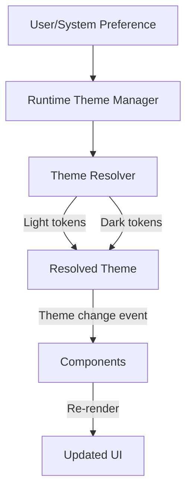
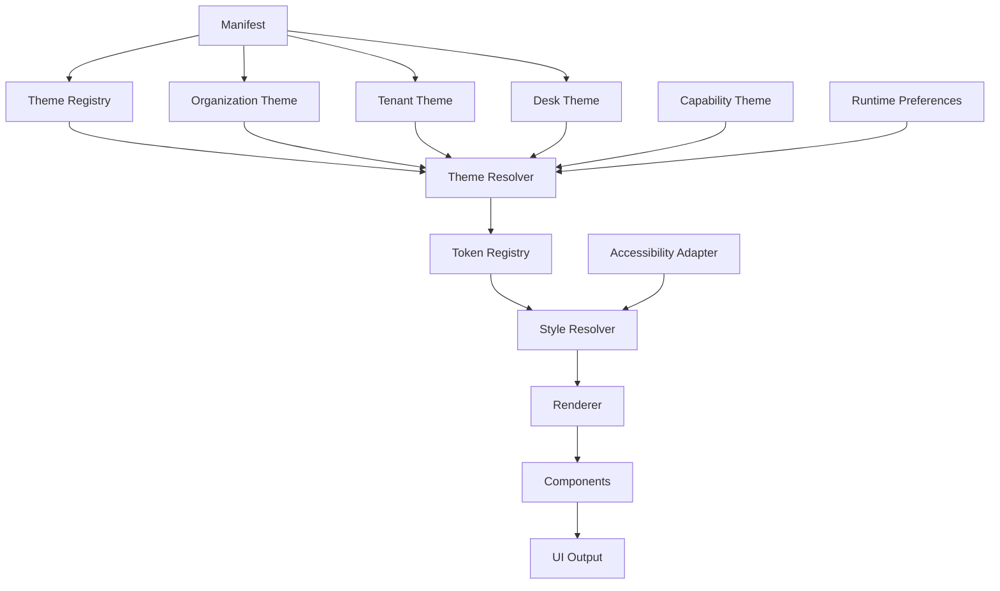
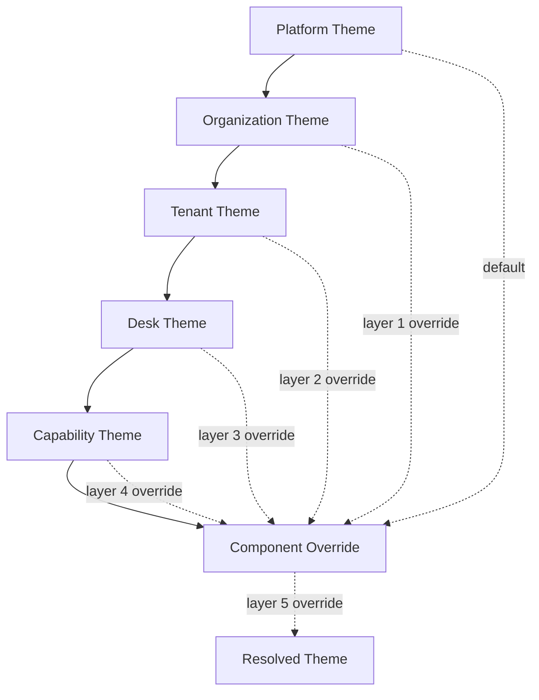
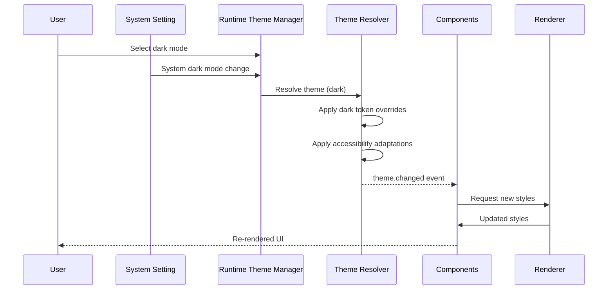
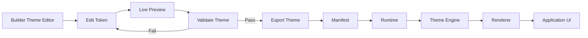
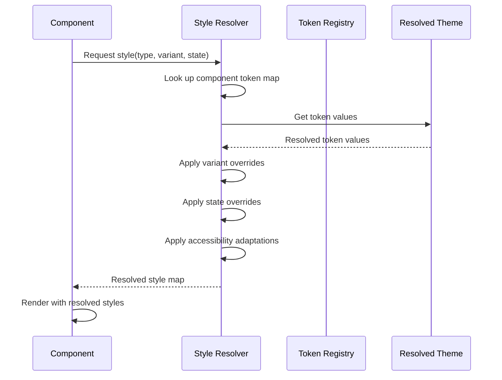

# Specification: Theme Engine

**KB-017 — Part III: Engineering Standards**

| Field | Value |
|-------|-------|
| **KB ID** | KB-017 |
| **Title** | Theme Engine |
| **Version** | 0.1.0 |
| **Status** | Drafting |
| **Owner** | Architecture |
| **Dependencies** | KB-002 (Glossary), KB-006 (System Architecture), KB-011 (Naming Standards), KB-013 (Component Model) |
| **Related Documents** | Renderer Architecture, Layout System, Component Model, Manifest Specification, Builder Studio, Marketplace, Runtime Overview |
| **Review Status** | Pending |
| **Last Updated** | 2026-07-09 |

### Revision History

| Version | Date | Author | Change |
|---------|------|--------|--------|
| 0.1.0 | 2026-07-09 | Architecture | Initial draft |

---

## 1. Purpose

The Theme Engine is the platform subsystem responsible for managing design tokens, visual identity, branding, styling, typography, color systems, spacing, iconography, motion, accessibility preferences, and runtime theme resolution across all DUKADESK client platforms.

### Why the Theme Engine Exists

- **Consistent appearance**: Every component, screen, and surface across every platform derives its visual properties from the same theme definition. Visual inconsistency is eliminated.
- **Separation of appearance from behavior**: Components describe *what* to render. The Theme Engine determines *how it looks*. Changing the appearance of the entire platform requires updating the theme — not individual components.
- **Declarative theming**: Themes are defined declaratively in JSON/manifest. No code changes are needed to rebrand, switch from light to dark mode, or apply an accessibility theme.
- **Brand independence**: The platform ships with a default theme. Every Desk, Tenant, and Organization can override it without modifying platform code. White-label support is built in, not bolted on.
- **Portable across platforms**: A theme defined once works identically on mobile, web, desktop, and future renderers. Platform-specific rendering is handled by the Renderer, not the theme.

### What the Theme Engine Is Not

- It is not a CSS engine or a platform styling framework.
- It is not a design tool — it consumes design output.
- It is not a component — it provides tokens that components consume.
- It is not responsible for layout — that is the Layout System's domain.

---

## 2. Theme Philosophy

| # | Principle | Description |
|---|-----------|-------------|
| 1 | **Design Token First** | Every visual property is defined as a named token. Tokens are the single source of truth for all styling. Components reference tokens by name and never use literal values. |
| 2 | **Declarative styling** | Themes are defined declaratively in structured data. There is no imperative theme code. Theme definitions can be serialized, transmitted, stored, and edited in tools. |
| 3 | **Brand independence** | The platform theme is a baseline. Every brand layer (organization, tenant, desk) overrides only what it needs. Brands never modify the platform core. |
| 4 | **Accessibility by default** | Every theme must include complete accessibility token sets. High contrast, font scaling, and reduced motion are first-class theme properties, not afterthoughts. |
| 5 | **Runtime resolution** | Themes are resolved at runtime. The platform can switch themes, apply overrides, and update tokens without restarting or rebuilding. |
| 6 | **Theme inheritance** | Themes form a hierarchy. Each level inherits from its parent and overrides only the tokens it needs to change. Inheritance is resolved at runtime. |
| 7 | **White-label support** | Every visual aspect of the platform is themeable. Logos, colors, typography, icons, and assets can be replaced per tenant. White-label is a configuration, not a fork. |
| 8 | **Platform independence** | Theme definitions are platform-agnostic. The Renderer maps tokens to platform-specific styling primitives. Components never reference platform APIs. |
| 9 | **Component consistency** | Every component of the same type looks identical by default. A Button in Booking looks the same as a Button in Commerce. Variants are configured through theme overrides, not component differences. |
| 10 | **Future-proof evolution** | The token system is extensible. New token categories can be added without breaking existing themes. Deprecated tokens are flagged but continue to resolve. |

---

## 3. Theme Responsibilities

### Theme Loading

| Responsibility | Description |
|---------------|-------------|
| Load platform default theme | On initialization, the Theme Engine loads the built-in platform theme from the Manifest. |
| Load organization theme | If an organization theme is configured, it is loaded and merged over the platform default. |
| Load tenant theme | If a tenant theme is configured, it is loaded and merged over the organization theme. |
| Load desk theme | If a desk-specific theme is configured, it is loaded and merged over the tenant theme. |
| Load capability themes | Capabilities may ship with their own theme overrides. These are merged over the desk theme. |
| Validate theme integrity | Every loaded theme is validated against the theme schema. Invalid themes are rejected with diagnostic details. |

### Theme Resolution

| Responsibility | Description |
|---------------|-------------|
| Resolve inheritance chain | The full theme is resolved by merging all layers in the correct order (platform → organization → tenant → desk → capability). |
| Resolve token values | Token references within the theme are resolved to concrete values. Token aliases (e.g., `color.primary` → `#FF6600`) are dereferenced. |
| Apply runtime overrides | Runtime preferences (dark mode, high contrast, font scale) are applied as token overrides on top of the resolved theme. |
| Produce resolved style map | The final resolved theme is produced as a flat map of token names to concrete values for efficient lookup. |

### Design Token Management

| Responsibility | Description |
|---------------|-------------|
| Token registration | All design tokens are registered in the Token Registry with their type, default value, and constraints. |
| Token lookup | Components and the Style Resolver look up tokens by name. Lookup is O(1) from the resolved token map. |
| Token validation | Token values are validated against their type (color values must be valid colors, spacing values must be valid units, etc.). |
| Token deprecation | Deprecated tokens are flagged with warnings but continue to resolve to maintain backward compatibility. |

### Theme Inheritance

| Responsibility | Description |
|---------------|-------------|
| Merge strategy | Theme inheritance uses deep merge. Object values are merged recursively. Scalar values are overridden by the child. |
| Conflict resolution | When the same token is defined at multiple levels, the most specific level wins (capability > desk > tenant > organization > platform). |
| Partial overrides | Themes may override individual tokens without providing a complete theme. Missing tokens are inherited from the parent. |
| Inheritance validation | The engine validates that the resolved theme is complete — no required tokens are missing after merge. |

### Brand Customization

| Responsibility | Description |
|---------------|-------------|
| Brand token injection | Brand-specific tokens (logo, colors, typography) are injected at the organization or tenant theme level. |
| Asset branding | Brand assets (logos, icons, splash screens) are resolved from the theme's asset definitions. |
| White-label enforcement | All brand-identifying elements must be themeable. Hardcoded branding is not permitted. |

### Component Styling

| Responsibility | Description |
|---------------|-------------|
| Token consumption | Components consume theme tokens through the Style Resolver. Components never resolve tokens directly. |
| Component variant resolution | Component variants (primary, secondary, ghost, danger) are resolved to token sets by the Style Resolver. |
| State styling | Component states (hovered, pressed, focused, disabled, selected) are resolved from state-specific token overrides. |

### Accessibility Adaptation

| Responsibility | Description |
|---------------|-------------|
| High contrast mode | The engine applies high-contrast token overrides when high contrast is enabled. |
| Font scaling | The engine applies font scale multipliers to typography tokens based on system preferences. |
| Reduced motion | The engine replaces motion tokens with zero-duration or simplified alternatives when reduced motion is enabled. |
| Color blindness | The engine may apply color blindness simulation or adjustment overlays. |

### Runtime Switching

| Responsibility | Description |
|---------------|-------------|
| Light/dark switching | The engine switches between light and dark token sets based on user preference, schedule, or system setting. |
| Live theme updates | Theme changes are applied live without restart. The engine notifies subscribers (components, Renderer) of theme changes. |
| Theme change events | The engine publishes theme change events through the Event Bus. Components re-render in response. |

### What the Theme Engine Does Not Do

- It does not render UI. Rendering is the Renderer's responsibility.
- It does not compute layout positions. Layout is the Layout System's responsibility.
- It does not define component structure. Component structure is defined by the Component Model.
- It does not generate themes. Themes are authored in tools like Builder Studio.
- It does not store user preferences. Preferences are stored by the State Management layer.

---

## 4. Theme Architecture

The Theme Engine is composed of logical modules. Each module has a specific responsibility within the theme resolution and consumption pipeline.

### Theme Manager

| Field | Description |
|-------|-------------|
| **Purpose** | Central orchestrator for theme loading, resolution, and lifecycle management. |
| **Responsibilities** | Initialize the theme system, coordinate module interactions, manage theme lifecycle events. |
| **Inputs** | Theme definitions from Manifest, Builder Studio, capabilities, user preferences |
| **Outputs** | Resolved theme, theme change events |
| **Extension points** | Theme lifecycle hooks, custom theme loaders, theme event subscribers |

### Theme Registry

| Field | Description |
|-------|-------------|
| **Purpose** | Stores all available theme definitions organized by source and priority. |
| **Responsibilities** | Register themes from all sources, maintain priority ordering, provide theme lookup. |
| **Inputs** | Theme registration requests |
| **Outputs** | Theme lookup results |
| **Extension points** | Custom theme sources, dynamic theme registration |

### Token Registry

| Field | Description |
|-------|-------------|
| **Purpose** | Central catalog of all design tokens. Every token that can be consumed must be registered here. |
| **Responsibilities** | Token registration, type enforcement, default value management, deprecation tracking. |
| **Inputs** | Token definitions from theme schemas |
| **Outputs** | Token lookup, validation results |
| **Extension points** | Custom token types, computed tokens, token aliases |

### Theme Resolver

| Field | Description |
|-------|-------------|
| **Purpose** | Resolves the effective theme by merging all inheritance layers and applying runtime overrides. |
| **Responsibilities** | Inheritance chain resolution, deep merge, conflict resolution, runtime override application, accessibility adaptation. |
| **Inputs** | Theme definitions from Theme Registry, runtime preferences |
| **Outputs** | Resolved theme (flat token map) |
| **Extension points** | Custom merge strategies, conditional token resolution, A/B theme testing |

### Style Resolver

| Field | Description |
|-------|-------------|
| **Purpose** | Resolves component-specific styling from the resolved theme. Bridges the gap between tokens and component style requirements. |
| **Responsibilities** | Component token lookup, variant resolution, state styling, responsive token resolution, computed style derivation. |
| **Inputs** | Component style request (component type, variant, state, modifiers) |
| **Outputs** | Resolved style map (concrete values ready for the Renderer) |
| **Extension points** | Custom style resolvers per component type, style computation plugins |

### Brand Manager

| Field | Description |
|-------|-------------|
| **Purpose** | Manages brand-specific theme elements: logos, colors, typography, and assets. |
| **Responsibilities** | Brand token injection, asset path resolution, brand theme validation, white-label enforcement. |
| **Inputs** | Brand configuration from tenant/organization theme |
| **Outputs** | Brand token set, resolved asset paths |
| **Extension points** | Custom brand providers, dynamic brand switching |

### Asset Resolver

| Field | Description |
|-------|-------------|
| **Purpose** | Resolves theme assets (images, icons, fonts, media) from theme definitions. |
| **Responsibilities** | Asset path resolution, asset caching, asset validation, format compatibility checking. |
| **Inputs** | Asset reference from theme (path, URI, package reference) |
| **Outputs** | Resolved asset (loaded image, font, or media) |
| **Extension points** | Custom asset loaders, remote asset resolution, asset transformation pipeline |

### Accessibility Adapter

| Field | Description |
|-------|-------------|
| **Purpose** | Adapts the resolved theme to meet accessibility requirements. |
| **Responsibilities** | High contrast token overrides, font scale application, reduced motion enforcement, color blindness adjustment, focus indicator styling. |
| **Inputs** | Resolved theme, accessibility preferences (system + user) |
| **Outputs** | Adapted theme with accessibility adjustments applied |
| **Extension points** | Custom accessibility adapters, per-component accessibility rules |

### Runtime Theme Manager

| Field | Description |
|-------|-------------|
| **Purpose** | Manages runtime theme state: current theme, pending changes, and theme switching. |
| **Responsibilities** | Track current theme, handle light/dark switching, process live theme updates, notify subscribers of theme changes. |
| **Inputs** | Theme switch requests, runtime preferences |
| **Outputs** | Current theme state, theme change notifications |
| **Extension points** | Scheduled theme switching, animated theme transitions, theme preview mode |

### Diagnostics Manager

| Field | Description |
|-------|-------------|
| **Purpose** | Provides visibility into theme loading, resolution, and consumption. |
| **Responsibilities** | Theme loading logs, token resolution metrics, runtime diagnostics, accessibility diagnostics, performance monitoring. |
| **Inputs** | Theme engine lifecycle events |
| **Outputs** | Diagnostic data, metrics, logs |
| **Extension points** | Custom diagnostic collectors, theme debugging tools |

---

## 5. Theme Model

The canonical structure of a theme definition.

```typescript
interface Theme {
  identity: ThemeIdentity;
  metadata: ThemeMetadata;
  brand: BrandDefinition;
  tokens: TokenCatalog;
  typography: TypographyDefinition;
  colors: ColorDefinition;
  icons: IconDefinition;
  shapes: ShapeDefinition;
  elevation: ElevationDefinition;
  motion: MotionDefinition;
  assets: AssetCatalog;
  components: ComponentOverrides;
  accessibility: AccessibilityDefinition;
  localization: LocalizationPreferences;
}
```

### Identity

```typescript
interface ThemeIdentity {
  id: string;                    // Unique theme identifier
  name: string;                  // Human-readable name
  version: string;               // Semantic version
  description?: string;          // Optional description
  author?: string;               // Theme author
  homepage?: string;             // Theme homepage URL
}
```

### Metadata

```typescript
interface ThemeMetadata {
  source: 'platform' | 'organization' | 'tenant' | 'desk' | 'capability' | 'marketplace';
  layer: number;                 // Inheritance layer (0 = platform, 1 = org, 2 = tenant, etc.)
  compatibility: string[];       // Compatible runtime versions
  tags?: string[];               // Search and categorization tags
  preview?: string;              // Preview image URI
}
```

### Brand

```typescript
interface BrandDefinition {
  name: string;                  // Brand name
  logo?: AssetReference;         // Logo image
  icon?: AssetReference;         // Brand icon (favicon, app icon)
  colors: {                      // Brand color palette
    primary: ColorValue;
    secondary: ColorValue;
    accent?: ColorValue;
  };
  typography?: {                 // Brand font preferences
    fontFamily?: FontFamily;
    headings?: FontFamily;
  };
  assets?: {                     // Brand-specific assets
    splashScreen?: AssetReference;
    emailTemplate?: AssetReference;
    reportTemplate?: AssetReference;
    receiptTemplate?: AssetReference;
    documentTemplate?: AssetReference;
  };
}
```

### Design Tokens

See Section 6 — Design Tokens.

### Typography

```typescript
interface TypographyDefinition {
  families: Record<string, FontFamily>;
  weights: Record<string, FontWeight>;
  sizes: Record<string, FontSize>;
  lineHeights: Record<string, LineHeight>;
  letterSpacings: Record<string, LetterSpacing>;
  headings: {
    h1: TextStyle;
    h2: TextStyle;
    h3: TextStyle;
    h4: TextStyle;
    h5: TextStyle;
    h6: TextStyle;
  };
  body: {
    large: TextStyle;
    medium: TextStyle;
    small: TextStyle;
    caption: TextStyle;
  };
  code: TextStyle;
  overline: TextStyle;
}
```

### Colors

```typescript
interface ColorDefinition {
  primary: ColorScheme;
  secondary: ColorScheme;
  surface: SurfaceColors;
  background: BackgroundColors;
  success: ColorScheme;
  warning: ColorScheme;
  danger: ColorScheme;
  info: ColorScheme;
  disabled: ColorScheme;
  outline: OutlineColors;
  text: TextColors;
  border: BorderColors;
}

interface ColorScheme {
  main: ColorValue;
  light?: ColorValue;
  dark?: ColorValue;
  contrastText: ColorValue;
}
```

### Icons

```typescript
interface IconDefinition {
  size: {
    xs: SizeValue;
    sm: SizeValue;
    md: SizeValue;
    lg: SizeValue;
    xl: SizeValue;
  };
  weight: 'thin' | 'light' | 'regular' | 'bold' | 'filled';
  family: string;                // Icon set family identifier
  status: {                      // Status icon mappings
    success: string;
    warning: string;
    error: string;
    info: string;
    loading: string;
  };
  navigation: {                  // Navigation icon mappings
    back: string;
    forward: string;
    menu: string;
    close: string;
    search: string;
    more: string;
  };
}
```

### Shapes

```typescript
interface ShapeDefinition {
  borderRadius: {
    none: SizeValue;
    sm: SizeValue;
    md: SizeValue;
    lg: SizeValue;
    xl: SizeValue;
    full: SizeValue;
  };
  borderWidth: {
    none: SizeValue;
    thin: SizeValue;
    medium: SizeValue;
    thick: SizeValue;
  };
}
```

### Elevation

```typescript
interface ElevationDefinition {
  shadow: {
    none: ShadowValue;
    sm: ShadowValue;
    md: ShadowValue;
    lg: ShadowValue;
    xl: ShadowValue;
  };
  opacity: {
    disabled: number;
    placeholder: number;
    overlay: number;
    scrim: number;
  };
}
```

### Motion

```typescript
interface MotionDefinition {
  duration: {
    instant: number;
    fast: number;
    normal: number;
    slow: number;
    deliberate: number;
  };
  timing: {
    linear: string;
    easeIn: string;
    easeOut: string;
    easeInOut: string;
    spring: string;
  };
  transitions: Record<string, TransitionDefinition>;
  reduced: ReducedMotionConfig;  // Overrides when reduced motion is enabled
}
```

### Assets

```typescript
interface AssetCatalog {
  images: Record<string, AssetReference>;
  fonts: Record<string, AssetReference>;
  animations: Record<string, AssetReference>;
  sounds: Record<string, AssetReference>;
}

interface AssetReference {
  type: 'builtin' | 'url' | 'package' | 'data';
  uri: string;
  fallback?: string;
  metadata?: Record<string, unknown>;
}
```

### Component Overrides

```typescript
interface ComponentOverrides {
  [componentType: string]: {
    variants?: Record<string, ComponentVariantStyle>;
    states?: Record<string, ComponentStateStyle>;
    tokens?: Record<string, string>;  // Token overrides for this component
  };
}
```

### Accessibility

```typescript
interface AccessibilityDefinition {
  highContrast: {
    enabled: boolean;
    overrides: Record<string, string>;  // Token overrides for high contrast
  };
  fontScale: {
    min: number;
    max: number;
    step: number;
  };
  reducedMotion: ReducedMotionConfig;
  focusIndicator: {
    width: SizeValue;
    color: ColorValue;
    style: 'solid' | 'dashed' | 'outline';
    offset: SizeValue;
  };
  touchTarget: {
    minSize: SizeValue;
    padding: SizeValue;
  };
}
```

### Localization Preferences

```typescript
interface LocalizationPreferences {
  locale: string;
  textDirection: 'ltr' | 'rtl';
  dateFormat: string;
  timeFormat: string;
  numberFormat: NumberFormatConfig;
  currencyFormat: CurrencyFormatConfig;
}
```

---

## 6. Design Tokens

Design tokens are the atomic units of visual design. Every visual property in the platform is controlled by a named token.

### Token Structure

```typescript
interface DesignToken {
  name: string;                  // Fully qualified token name (e.g., "color.primary.main")
  type: TokenType;               // Token data type
  value: TokenValue;             // Token value
  description?: string;          // Human-readable description
  category: TokenCategory;       // Token category
  aliases?: string[];            // Alternative names for backward compatibility
  deprecated?: boolean;          // Whether this token is deprecated
  constraints?: TokenConstraints; // Value constraints
}
```

### Color Tokens

| Token | Type | Description |
|-------|------|-------------|
| `color.primary.main` | `color` | Primary brand color |
| `color.primary.light` | `color` | Lighter variant of primary |
| `color.primary.dark` | `color` | Darker variant of primary |
| `color.primary.contrastText` | `color` | Text color on primary backgrounds |
| `color.secondary.main` | `color` | Secondary brand color |
| `color.secondary.light` | `color` | Lighter variant of secondary |
| `color.secondary.dark` | `color` | Darker variant of secondary |
| `color.secondary.contrastText` | `color` | Text color on secondary backgrounds |
| `color.surface` | `color` | Surface (card, sheet) background |
| `color.surface.variant` | `color` | Alternative surface color |
| `color.surface.inverse` | `color` | Inverse surface color |
| `color.background` | `color` | Main background color |
| `color.background.variant` | `color` | Alternative background |
| `color.success.main` | `color` | Success state color |
| `color.success.light` | `color` | Light success |
| `color.success.dark` | `color` | Dark success |
| `color.warning.main` | `color` | Warning state color |
| `color.warning.light` | `color` | Light warning |
| `color.warning.dark` | `color` | Dark warning |
| `color.danger.main` | `color` | Error/danger state color |
| `color.danger.light` | `color` | Light danger |
| `color.danger.dark` | `color` | Dark danger |
| `color.info.main` | `color` | Information state color |
| `color.info.light` | `color` | Light info |
| `color.info.dark` | `color` | Dark info |
| `color.disabled` | `color` | Disabled element color |
| `color.disabled.text` | `color` | Disabled text color |
| `color.outline` | `color` | Outline/border color |
| `color.outline.variant` | `color` | Subtle outline |
| `color.text.primary` | `color` | Primary text color |
| `color.text.secondary` | `color` | Secondary text color |
| `color.text.disabled` | `color` | Disabled text color |
| `color.text.inverse` | `color` | Text on dark backgrounds |
| `color.text.link` | `color` | Link text color |
| `color.border` | `color` | Default border color |
| `color.border.focus` | `color` | Focus indicator border |
| `color.border.error` | `color` | Error state border |
| `color.border.success` | `color` | Success state border |

### Typography Tokens

| Token | Type | Description |
|-------|------|-------------|
| `typography.family.sans` | `fontFamily` | Primary sans-serif font family |
| `typography.family.serif` | `fontFamily` | Serif font family |
| `typography.family.mono` | `fontFamily` | Monospace font family |
| `typography.family.brand` | `fontFamily` | Brand font family |
| `typography.weight.light` | `number` | Light font weight |
| `typography.weight.regular` | `number` | Regular font weight |
| `typography.weight.medium` | `number` | Medium font weight |
| `typography.weight.semibold` | `number` | Semibold font weight |
| `typography.weight.bold` | `number` | Bold font weight |
| `typography.size.h1` | `fontSize` | Heading 1 size |
| `typography.size.h2` | `fontSize` | Heading 2 size |
| `typography.size.h3` | `fontSize` | Heading 3 size |
| `typography.size.h4` | `fontSize` | Heading 4 size |
| `typography.size.h5` | `fontSize` | Heading 5 size |
| `typography.size.h6` | `fontSize` | Heading 6 size |
| `typography.size.body` | `fontSize` | Body text size |
| `typography.size.caption` | `fontSize` | Caption text size |
| `typography.size.code` | `fontSize` | Code text size |
| `typography.size.overline` | `fontSize` | Overline text size |
| `typography.lineHeight.h1` | `number` | Heading 1 line height |
| `typography.lineHeight.body` | `number` | Body line height |
| `typography.letterSpacing.default` | `number` | Default letter spacing |
| `typography.letterSpacing.headings` | `number` | Heading letter spacing |

### Spacing Tokens

| Token | Type | Description |
|-------|------|-------------|
| `spacing.xs` | `size` | Extra small spacing (4px) |
| `spacing.sm` | `size` | Small spacing (8px) |
| `spacing.md` | `size` | Medium spacing (16px) |
| `spacing.lg` | `size` | Large spacing (24px) |
| `spacing.xl` | `size` | Extra large spacing (32px) |
| `spacing.xxl` | `size` | Double extra large spacing (48px) |
| `spacing.grid` | `size` | Grid base unit |
| `spacing.container.sm` | `size` | Small container max width |
| `spacing.container.md` | `size` | Medium container max width |
| `spacing.container.lg` | `size` | Large container max width |

### Shape Tokens

| Token | Type | Description |
|-------|------|-------------|
| `shape.borderRadius.none` | `size` | No border radius |
| `shape.borderRadius.sm` | `size` | Small border radius |
| `shape.borderRadius.md` | `size` | Medium border radius |
| `shape.borderRadius.lg` | `size` | Large border radius |
| `shape.borderRadius.xl` | `size` | Extra large border radius |
| `shape.borderRadius.full` | `size` | Fully rounded |
| `shape.borderWidth.none` | `size` | No border |
| `shape.borderWidth.thin` | `size` | Thin border (1px) |
| `shape.borderWidth.medium` | `size` | Medium border (2px) |
| `shape.borderWidth.thick` | `size` | Thick border (4px) |

### Elevation Tokens

| Token | Type | Description |
|-------|------|-------------|
| `elevation.shadow.none` | `shadow` | No shadow |
| `elevation.shadow.sm` | `shadow` | Small shadow |
| `elevation.shadow.md` | `shadow` | Medium shadow |
| `elevation.shadow.lg` | `shadow` | Large shadow |
| `elevation.shadow.xl` | `shadow` | Extra large shadow |
| `elevation.opacity.disabled` | `number` | Disabled element opacity |
| `elevation.opacity.placeholder` | `number` | Placeholder text opacity |
| `elevation.opacity.overlay` | `number` | Overlay background opacity |
| `elevation.opacity.scrim` | `number` | Scrim (modal backdrop) opacity |

### Motion Tokens

| Token | Type | Description |
|-------|------|-------------|
| `motion.duration.instant` | `duration` | Instant animation (0ms) |
| `motion.duration.fast` | `duration` | Fast animation (100ms) |
| `motion.duration.normal` | `duration` | Normal animation (250ms) |
| `motion.duration.slow` | `duration` | Slow animation (400ms) |
| `motion.duration.deliberate` | `duration` | Deliberate animation (600ms) |
| `motion.timing.easeInOut` | `timing` | Standard ease-in-out curve |
| `motion.timing.easeIn` | `timing` | Ease-in curve |
| `motion.timing.easeOut` | `timing` | Ease-out curve |
| `motion.timing.spring` | `timing` | Spring animation curve |
| `motion.reduced.duration` | `duration` | Duration override for reduced motion |
| `motion.reduced.timing` | `timing` | Timing override for reduced motion |

### Icon Tokens

| Token | Type | Description |
|-------|------|-------------|
| `icon.size.xs` | `size` | Extra small icon size |
| `icon.size.sm` | `size` | Small icon size |
| `icon.size.md` | `size` | Medium icon size |
| `icon.size.lg` | `size` | Large icon size |
| `icon.size.xl` | `size` | Extra large icon size |
| `icon.weight` | `string` | Default icon weight |
| `icon.family` | `string` | Default icon set |

---

## 7. Theme Inheritance

Themes form a strict hierarchy. Each level inherits from its parent and may override any subset of tokens.

### Inheritance Hierarchy

```text
┌─────────────────────────────────────────────┐
│          Platform Theme (Layer 0)            │
│  The baseline. Ships with the platform.      │
│  Defines every required token.               │
└──────────────────┬──────────────────────────┘
                   │
                   ▼
┌─────────────────────────────────────────────┐
│       Organization Theme (Layer 1)           │
│  Overrides for the entire organization.      │
│  Logo, brand colors, font family.            │
└──────────────────┬──────────────────────────┘
                   │
                   ▼
┌─────────────────────────────────────────────┐
│          Tenant Theme (Layer 2)              │
│  Per-tenant branding and customization.      │
│  White-label definitions live here.          │
└──────────────────┬──────────────────────────┘
                   │
                   ▼
┌─────────────────────────────────────────────┐
│           Desk Theme (Layer 3)               │
│  Desk-specific visual adjustments.           │
│  E.g., "Retail" vs "Hospitality" desks.      │
└──────────────────┬──────────────────────────┘
                   │
                   ▼
┌─────────────────────────────────────────────┐
│       Capability Theme (Layer 4)             │
│  Capability-provided overrides.              │
│  E.g., Booking adds calendar color tokens.   │
└──────────────────┬──────────────────────────┘
                   │
                   ▼
┌─────────────────────────────────────────────┐
│       Component Override (Layer 5)           │
│  Per-component instance overrides.           │
│  Defined in manifest for specific screens.   │
└─────────────────────────────────────────────┘
```

### Merge Strategy

- Inheritance uses **deep recursive merge**.
- Object values (e.g., `colors.primary`) are merged recursively.
- Scalar values (e.g., `colors.primary.main`) are overridden by the child.
- Array values are replaced, not merged.
- Null or undefined values in a child do not override a parent value (use an explicit sentinel to clear).

### Conflict Resolution

When the same token is defined at multiple levels, the **most specific layer wins**:

```
Component Override > Capability > Desk > Tenant > Organization > Platform
```

If a theme at a higher layer is removed (e.g., capability uninstalled), the next lower layer's value is used automatically.

### Partial Overrides

Themes at higher layers (organization, tenant, desk, capability) are **partial by default**. They only specify the tokens they need to override. All unspecified tokens are inherited from the parent.

```typescript
// Tenant theme — only overrides what differs from the platform
{
  "colors": {
    "primary": { "main": "#FF6600" },
    "secondary": { "main": "#0044CC" }
  },
  "typography": {
    "family": { "brand": "CustomFont" }
  }
  // All other tokens inherit from the platform theme
}
```

### Inheritance Validation

The Theme Resolver validates that the resolved theme is complete after merge:

- Every required token must have a value.
- Token values must satisfy type constraints.
- Token aliases must resolve to concrete values.
- Circular token references must be detected and rejected.

---

## 8. Component Styling

Components consume theme tokens through the Style Resolver. They never access the Theme Registry, Token Registry, or Theme Model directly.

### Token Resolution Flow

1. A component requests styling by providing its **type**, **variant**, **state**, and optional **modifiers**.
2. The Style Resolver looks up the component's token map from the resolved theme.
3. Variant-specific overrides are applied (e.g., `Button` variant `danger` uses `color.danger` tokens).
4. State-specific overrides are applied (e.g., `pressed` state may darken the background).
5. Responsive overrides are applied based on the current viewport size.
6. Accessibility overrides are applied (high contrast, font scaling, reduced motion).
7. The resolved style map is returned to the Renderer.

### Component Style Request

```typescript
interface StyleRequest {
  componentType: string;         // e.g., "Button"
  variant?: string;              // e.g., "primary", "secondary", "ghost", "danger"
  state?: ComponentState;        // "default" | "hovered" | "pressed" | "focused" | "disabled" | "selected"
  modifiers?: string[];          // e.g., ["compact", "fullWidth", "iconOnly"]
  responsive?: ResponsiveContext; // Viewport size and breakpoint
}
```

### Style Response

```typescript
interface StyleResponse {
  tokens: Record<string, ResolvedToken>;  // Resolved token values
  styles: Record<string, string>;         // Computed style properties (platform-agnostic)
  classNames?: string[];                  // Optional class/selector references for the Renderer
}
```

### Component Variants

Component variants are defined in the theme's `components` section:

```typescript
{
  "components": {
    "Button": {
      "variants": {
        "primary": {
          "tokens": {
            "background": "color.primary.main",
            "text": "color.primary.contrastText",
            "border": "color.primary.main"
          }
        },
        "secondary": {
          "tokens": {
            "background": "color.secondary.main",
            "text": "color.secondary.contrastText",
            "border": "color.secondary.main"
          }
        },
        "ghost": {
          "tokens": {
            "background": "transparent",
            "text": "color.primary.main",
            "border": "transparent"
          }
        },
        "danger": {
          "tokens": {
            "background": "color.danger.main",
            "text": "color.danger.contrastText",
            "border": "color.danger.main"
          }
        }
      }
    }
  }
}
```

### State Styling

Each variant may define state-specific overrides:

```typescript
"Button": {
  "variants": {
    "primary": {
      "tokens": { /* default styles */ },
      "states": {
        "hovered": {
          "tokens": { "background": "color.primary.dark" }
        },
        "pressed": {
          "tokens": { "background": "color.primary.dark", "opacity": "0.9" }
        },
        "disabled": {
          "tokens": { "background": "color.disabled", "text": "color.disabled.text" }
        },
        "focused": {
          "tokens": { "border": "color.border.focus", "borderWidth": "shape.borderWidth.medium" }
        }
      }
    }
  }
}
```

### Responsive Styling

Components may define responsive overrides per breakpoint:

```typescript
"Card": {
  "responsive": {
    "xs": { "tokens": { "padding": "spacing.sm", "borderRadius": "shape.borderRadius.sm" } },
    "md": { "tokens": { "padding": "spacing.md", "borderRadius": "shape.borderRadius.md" } },
    "lg": { "tokens": { "padding": "spacing.lg", "borderRadius": "shape.borderRadius.lg" } }
  }
}
```

### What Components Must Not Do

- **No hardcoded colors**: Every color value must be a token reference.
- **No hardcoded fonts**: Every font value must be a token reference.
- **No hardcoded spacing**: Every spacing value must be a token reference.
- **No platform-specific styling**: Components must not reference platform styling APIs.
- **No inline styles as architecture**: Inline styles are permitted only for dynamic values that cannot be expressed as tokens.

---

## 9. Branding

The Theme Engine provides comprehensive support for brand customization across all surfaces.

### Brand Elements

| Element | Token | Description |
|---------|-------|-------------|
| Logo | `brand.logo` | Primary brand logo image |
| Icon | `brand.icon` | Brand icon (app icon, favicon) |
| Primary color | `color.primary.main` | Primary brand color |
| Secondary color | `color.secondary.main` | Secondary brand color |
| Font family | `typography.family.brand` | Brand-specific font |
| Splash screen | `brand.splashScreen` | App launch splash screen |
| Email template | `brand.emailTemplate` | Branded email template |
| Report template | `brand.reportTemplate` | Branded report/PDF template |
| Receipt template | `brand.receiptTemplate` | Branded receipt template |
| Document template | `brand.documentTemplate` | Branded document template |

### Brand Theme Structure

```typescript
interface BrandTheme {
  brand: BrandDefinition;
  // Plus any subset of the full Theme model
}
```

### White-Label Compliance

For a theme to be white-label compliant, it must override:

- All brand identifiers (logo, icon, name, colors).
- All text that identifies the platform (rename or remove).
- All asset references (splash, email, docs).
- All default imagery and icons that identify the platform.

The platform must not render any hardcoded brand-identifying elements when white-label mode is active.

---

## 10. Runtime Theme Switching

The Theme Engine supports multiple runtime theme modes and seamless switching between them.

### Modes

| Mode | Description |
|------|-------------|
| **Light** | Default light theme. All tokens resolve to their light values. |
| **Dark** | Dark theme. Tokens resolve to their dark values where defined. |
| **Automatic** | Switches between light and dark based on system preference or schedule. |
| **High contrast** | Higher contrast ratios for accessibility. May be combined with light or dark. |
| **Custom** | User-defined or tenant-defined theme override. |

### Switching Mechanism



### Switching Triggers

| Trigger | Description |
|---------|-------------|
| **User preference** | User selects light, dark, or automatic from settings. |
| **System setting** | System-level appearance changes (OS light/dark mode). |
| **Schedule** | Theme switches at a configured time (e.g., dark after sunset). |
| **Tenant policy** | Tenant enforces a specific mode for all users. |
| **Accessibility requirement** | System accessibility setting triggers high contrast mode. |
| **Runtime event** | An action or capability requests a theme switch. |

### Live Updates

Theme changes are applied **live** — the user does not need to restart or reload:

1. The Runtime Theme Manager receives a theme switch request.
2. The Theme Resolver re-resolves the full theme with the new mode.
3. The new theme is published as a `theme.changed` event on the Event Bus.
4. Active components receive the event and re-render with new token values.
5. The Renderer applies the new styles without full-screen repaint.

### Transition Animation

Theme switches may be animated. The duration is controlled by the `motion.duration.themeSwitch` token. Default is 300ms.

---

## 11. Accessibility

The Theme Engine provides accessibility as a first-class concern. Accessibility is not an overlay — it is integrated into the theme model.

### High Contrast

When high contrast mode is enabled:

- The `accessibility.highContrast` token overrides are applied.
- All text/background contrast ratios are increased.
- Borders and outlines are made more visible.
- Focus indicators are enlarged and brightened.
- Color-only information is supplemented with patterns or icons.

### Font Scaling

When the user increases font size:

- Typography size tokens are multiplied by the user's font scale factor.
- The scale factor range is defined by `accessibility.fontScale.min` and `max`.
- Layout adjusts to accommodate larger text. Components must not truncate text at increased sizes.
- The Theme Engine provides the scaled values; the Layout System handles reflow.

### Reduced Motion

When reduced motion is enabled:

- All animation durations are replaced with `motion.reduced.duration` (default: 0ms).
- Parallax, shimmer, and auto-scrolling effects are disabled.
- Transitions become instant (cross-fade) or are removed entirely.
- The `reducedMotion` preference is published to components through runtime context.

### Color Blindness

The Theme Engine may apply color blindness adjustments:

- Color combinations that are problematic for common color vision deficiencies are detected.
- Alternative token values are applied to ensure distinguishability.
- Icons and patterns supplement color-only indicators.

### Keyboard Focus

- Focus indicators are styled through theme tokens.
- Focus order is defined by the Layout System, not the Theme Engine.
- The Theme Engine provides focus indicator styling (width, color, offset, animation).

### Screen Reader Enhancements

- Theme assets include accessible labels and descriptions.
- Decorative elements are marked as presentational.
- Dynamic theme changes are announced through accessibility APIs.

### Large Touch Targets

- The `accessibility.touchTarget` tokens define minimum touch target sizes.
- Components must meet or exceed these minimums.
- The Theme Engine provides the minimum values; the Layout System enforces them.

---

## 12. Builder Studio Integration

Builder Studio uses the Theme Engine as the backend for its visual theme editing capabilities.

### Theme Editor

Builder Studio provides a visual theme editor that:

- Loads the current resolved theme.
- Renders token values with visual previews (color swatches, font samples, spacing rulers).
- Allows editing of any token value.
- Shows dependency impact (which components are affected by a token change).
- Validates changes in real time.

### Live Preview

Changes made in the Theme Editor are reflected in real time in Builder Studio's preview pane:

1. A token value is edited in the Theme Editor.
2. The change is sent to the Theme Engine as a runtime override.
3. The Theme Engine re-resolves the theme and publishes a `theme.changed` event.
4. The preview pane re-renders with the new token value.

### Token Editing

| Token Type | Editor Control |
|------------|----------------|
| Color | Color picker (hex, RGB, HSL), contrast ratio indicator |
| Font family | Dropdown with preview |
| Font size | Slider with preview text |
| Spacing | Slider or numeric input with ruler visualization |
| Border radius | Slider with shape preview |
| Shadow | Multi-field editor (offset, blur, spread, color) |
| Animation duration | Slider with preview animation |
| Icon size | Slider with icon preview |

### Brand Designer

Builder Studio provides a brand designer workflow:

1. Select a brand element (logo, color, font).
2. Upload or configure the brand asset.
3. Preview the brand across all surfaces (mobile, tablet, desktop).
4. Publish the brand theme to the target environment.

### Export

Themes can be exported from Builder Studio in the standard theme format. Exports include:

- Full theme definition (JSON).
- Asset bundle (images, fonts, icons).
- Validation report.
- Migration guide if tokens were deprecated.

### Import

Themes can be imported into Builder Studio:

- Import a theme file.
- Validate against the current runtime version.
- Preview differences from the current theme.
- Publish to the target environment.

### Theme Templates

Builder Studio provides theme templates for common industries:

| Template | Description |
|----------|-------------|
| Default | Platform baseline theme |
| Retail | Bright colors, bold typography, large imagery |
| Hospitality | Warm colors, elegant typography, spacious layout |
| Healthcare | Clean, accessible, high contrast |
| Finance | Professional, conservative, security-oriented |
| Education | Friendly, colorful, engaging |
| Enterprise | Corporate, functional, efficient |

### White-Label Designer

Builder Studio provides a dedicated white-label workflow:

1. Upload brand logo and icon.
2. Set brand colors.
3. Configure brand typography.
4. Upload branded assets (splash, email, docs).
5. Preview the complete white-label experience across all surfaces.
6. Publish tenant theme.

---

## 13. Runtime Integration

The Theme Engine integrates with every major runtime subsystem.

### Renderer

| Interaction | Description |
|-------------|-------------|
| **Style consumption** | The Renderer consumes resolved component styles from the Style Resolver. |
| **Platform mapping** | The Renderer maps platform-agnostic styles (color tokens, spacing, typography) to platform-specific styling primitives. |
| **Theme change handling** | The Renderer subscribes to theme change events and invalidates rendered output when the theme changes. |

### Layout System

| Interaction | Description |
|-------------|-------------|
| **Spacing tokens** | The Layout System consumes spacing tokens for layout calculations. |
| **Responsive breakpoints** | The Layout System reads responsive breakpoint definitions from the theme. |
| **Grid configuration** | Grid spacing and column definitions are consumed from theme tokens. |

### Component Model

| Interaction | Description |
|-------------|-------------|
| **Style requests** | Components request styling from the Style Resolver by providing type, variant, state, and modifiers. |
| **Token consumption** | Components consume token values through resolved styles, never by direct token lookup. |
| **Theme change subscription** | Components subscribe to theme change events through runtime context and re-render when the theme changes. |

### Runtime

| Interaction | Description |
|-------------|-------------|
| **Initialization** | The Runtime initializes the Theme Engine during platform boot. The platform theme is loaded first. |
| **Context injection** | The Runtime provides theme-related context (current mode, font scale, reduced motion preference) to the Theme Engine. |
| **Configuration** | The Runtime provides tenant, organization, and desk theme configuration to the Theme Engine. |

### Manifest

| Interaction | Description |
|-------------|-------------|
| **Theme references** | The Manifest may reference theme definitions or include inline theme overrides. |
| **Component configurations** | The Manifest defines component configurations that reference theme variants. |

### State Management

| Interaction | Description |
|-------------|-------------|
| **Theme state** | The current theme, mode, and accessibility preferences are stored in State Management. |
| **Persistence** | User theme preferences (light/dark, font scale) are persisted through State Management. |

---

## 14. Marketplace Integration

### Premium Themes

Marketplace-distributed premium themes follow the same contract as platform themes but are sold or licensed separately:

- Premium themes include complete token sets and brand assets.
- They may include custom component variants.
- They are validated against the current runtime version at installation.

### Industry Theme Packs

Industry theme packs provide pre-configured themes for specific verticals:

- Retail, Hospitality, Healthcare, Finance, Education, Enterprise.
- Each pack includes industry-appropriate colors, typography, and imagery.
- Packs may be purchased individually or as bundles.

### Marketplace Distribution

| Feature | Description |
|---------|-------------|
| Theme listing | Themes are listed in the Marketplace with previews, ratings, and compatibility information. |
| Versioning | Themes are versioned. Updates are delivered through the Marketplace update channel. |
| Licensing | Themes may be licensed per tenant, per organization, or per platform installation. |
| Trials | Themes may offer trial periods before purchase. |

### Updates

When a Marketplace theme is updated:

1. The update is downloaded and validated.
2. The old theme is backed up for rollback.
3. The new theme is applied.
4. A `theme.updated` event is published.
5. If validation fails, the engine reverts to the backup and reports the error.

### Compatibility Validation

Marketplace themes are validated against:

- The current runtime version.
- The installed component set (all component variants referenced by the theme must exist).
- The available token set (all tokens referenced by the theme must be registered).
- Asset integrity (all referenced assets must be present and valid).

---

## 15. Performance

### Theme Caching

| Cache | Description | Invalidation |
|-------|-------------|--------------|
| Resolved theme | The full resolved theme is cached after initialization. | Invalidated on theme change, mode switch, or accessibility preference change. |
| Token map | Flat token map for O(1) lookup. | Rebuilt when the resolved theme changes. |
| Component styles | Resolved component styles are cached per (type, variant, state, modifiers). | Invalidated when the resolved theme or any of the component's tokens change. |
| Asset cache | Loaded theme assets (images, fonts) are cached. | Invalidated on asset update or cache size limit. |

### Lazy Loading

- Theme assets (images, fonts) are loaded lazily on first reference.
- Non-critical theme segments (e.g., email templates) are loaded on demand.
- Capability themes are loaded when the capability is initialized.

### Token Resolution Optimization

- Token resolution uses a flat token map for O(1) lookup.
- Token aliases are pre-resolved during the merge phase.
- Token validation occurs at registration time, not at consumption time.

### Asset Caching

- Theme assets are cached with configurable TTL.
- Remote assets are downloaded and cached locally.
- Asset cache uses LRU eviction.

### Incremental Updates

- When a theme is updated, only changed tokens trigger re-resolution.
- Components that consume unchanged tokens are not invalidated.
- Asset updates are incremental (only changed assets are re-downloaded).

### Runtime Switching Efficiency

- Theme mode switching (light/dark) is optimized by pre-resolving both modes.
- Switching between modes is a token map swap, not a full re-resolution.
- Accessibility overrides are applied as token map patches.

---

## 16. Security

### Trusted Theme Packages

- Themes from the Marketplace are digitally signed.
- The Theme Engine verifies the signature before loading.
- Unsigned themes are rejected with a security error.
- Custom/enterprise themes may load without signing if configured to allow it.

### Asset Validation

- All theme assets are validated against allowed types and sizes.
- Remote asset URIs are validated against allowed domains.
- Asset content is scanned for malicious content.

### Manifest Validation

- Theme definitions from the Manifest are validated against the theme schema.
- Invalid manifest themes are rejected with a clear error message.
- Manifest themes must not override security-critical tokens.

### Injection Prevention

- All token values are sanitized before use.
- String token values (font families, asset URIs) are validated against allowlists.
- Computed or dynamic token values are evaluated in a sandbox.

### Runtime Integrity

- The resolved theme is immutable at runtime. Components observe the resolved theme but cannot modify it.
- Theme overrides are scoped to the requesting component and do not affect the global theme.
- Theme change events are authenticated.

---

## 17. Observability

### Theme Loading Logs

| Event | Description |
|-------|-------------|
| `theme.loaded` | A theme was loaded from a source. |
| `theme.merged` | A theme was merged into the inheritance chain. |
| `theme.resolved` | The full theme was resolved. |
| `theme.modeChanged` | The theme mode changed (light/dark/high contrast). |
| `theme.tokenResolved` | A token was resolved (logged at debug level). |
| `theme.validationFailed` | A theme failed validation. |

### Token Resolution Metrics

| Metric | Type | Description |
|--------|------|-------------|
| `theme.tokens.total` | Gauge | Total registered tokens |
| `theme.tokens.resolved` | Counter | Token resolution requests |
| `theme.tokens.miss` | Counter | Token lookup misses (undefined token) |
| `theme.tokens.latency` | Histogram | Token resolution latency |

### Runtime Diagnostics

| Diagnostic | Description |
|------------|-------------|
| Current theme | Current theme identity and mode |
| Inheritance chain | All active theme layers with their sources |
| Token search | Search resolved tokens by pattern |
| Component styling | Preview resolved styles for any component type/variant/state |
| Asset status | Status of all theme assets (loaded, loading, failed) |

### Accessibility Diagnostics

| Diagnostic | Description |
|------------|-------------|
| Contrast ratios | Current contrast ratios for all text/background combinations |
| Font scale | Current font scale factor and affected tokens |
| Motion status | Whether reduced motion is active and which tokens are affected |
| Focus indicator | Current focus indicator styling |
| Touch target sizes | Current minimum touch target size |

### Performance Monitoring

| Metric | Type | Description |
|--------|------|-------------|
| `theme.loadTime` | Histogram | Time to load and resolve a theme |
| `theme.switchTime` | Histogram | Time to switch between modes |
| `theme.mergeTime` | Histogram | Time to merge theme layers |
| `theme.cacheHitRate` | Gauge | Resolved theme cache hit rate |

---

## 18. Anti-Patterns

| Anti-Pattern | Why It Violates the Theme Engine |
|--------------|----------------------------------|
| **Hardcoded colors** | Color values embedded in component code instead of token references. | Breaks theming, white-label, dark mode, and accessibility. Every color must be a token. |
| **Hardcoded fonts** | Font family or size hardcoded in component code. | Breaks brand customization and font scaling. Every font property must be a token. |
| **Platform-specific styling** | Components using platform APIs (CSS, Android XML, iOS UIKit) directly. | Creates platform lock-in, prevents cross-platform consistency. Components must be platform-agnostic. |
| **Component-owned themes** | Components defining their own theme values locally. | Duplicates tokens, creates inconsistency, prevents central theme management. |
| **Inline styling as architecture** | Relying on inline styles for all visual properties instead of using component variants. | Mixes concerns, makes themes hard to audit, prevents variant switching at the theme level. |
| **Duplicate tokens** | Multiple tokens with the same value. | Violates DRY principle, creates maintenance burden. Use token aliases instead. |
| **Brand logic inside components** | Components checking brand identity to change appearance. | Breaks separation of concerns. Branding must be expressed through themes, not component logic. |
| **Theme as global state** | Mutating theme tokens at runtime from components. | Causes unpredictable behavior, breaks inheritance, creates debugging nightmares. Theme must be immutable at the component level. |
| **Incomplete themes** | Themes that omit required tokens. | Causes rendering errors, accessibility failures, and visual inconsistency. Every theme must be validated at load time. |
| **Overrides at wrong layer** | Placing tenant-specific overrides at the platform theme layer. | Violates inheritance hierarchy, creates merge conflicts. Each override must live at the correct inheritance layer. |
| **Missing accessibility tokens** | Theme that does not define high contrast or reduced motion token sets. | Creates inaccessible experiences for users with accessibility needs. All themes must include complete accessibility token sets. |

---

## 19. Future Evolution

### AI-Generated Themes

- AI agents will generate complete themes from brand guidelines, style guides, or natural language descriptions.
- Generated themes will be validated against the theme schema before deployment.
- AI may suggest theme improvements based on accessibility analysis and user engagement data.

### Dynamic Branding

- Themes will support time-based or event-based dynamic branding (seasonal themes, promotional campaigns, special events).
- Dynamic branding will be configured through the Manifest and applied automatically without deployment.

### Seasonal Themes

- Holiday-specific theme variants (e.g., winter holidays, cultural celebrations).
- Seasonal themes will be scheduled through the Runtime Theme Manager.
- Components will adapt to seasonal theme changes automatically.

### Adaptive Accessibility

- The Theme Engine will learn user accessibility preferences over time and apply them proactively.
- Adaptive accessibility will respect user privacy — all learning will be on-device.

### Industry Design Systems

- Pre-built design systems for major industries with complete theme token sets, component variants, and accessibility configurations.
- Industry design systems will be distributed through the Marketplace.

### Regional Branding

- Multi-region organizations will define regional theme overrides (different colors, typography, or assets per region).
- Regional themes will inherit from the organization theme and override region-specific elements.

### Multi-Brand Organizations

- Organizations that operate multiple brands will configure multiple brand themes within a single platform instance.
- Brand themes will be scoped to specific tenant groups or user segments.
- Multi-brand support extends the inheritance hierarchy with an additional brand layer.

---

## 20. Relationship to Other Documents

| Document | Relationship |
|----------|-------------|
| **Renderer Architecture** | Consumes resolved component styles from the Theme Engine. Maps platform-agnostic tokens to platform-specific rendering. |
| **Component Model (KB-013)** | Components request styling from the Style Resolver. Component variants and states are defined in theme component overrides. |
| **Layout System (KB-014)** | Consumes spacing tokens and responsive breakpoints from the theme. |
| **Manifest Specification** | May reference theme definitions or include inline theme overrides. Provides theme configuration per tenant and desk. |
| **Builder Studio** | Provides the visual Theme Editor, Brand Designer, export/import, and theme templates. |
| **Marketplace** | Distributes premium themes, industry packs, and theme updates. Validates theme compatibility. |
| **Runtime Overview** | Initializes the Theme Engine, provides runtime context for theme resolution. |
| **State Management (KB-018)** | Stores current theme, mode, and accessibility preferences. Persists user theme preferences. |
| **Event Bus (KB-019)** | Publishes theme change events (`theme.changed`, `theme.modeChanged`, `theme.updated`). |
| **Action Engine (KB-015)** | May dispatch theme switch actions (e.g., `runtime.switchTheme`, `runtime.setAccessibilityPreference`). |

---

## 21. Architecture Diagrams

### Theme Resolution Pipeline



### Theme Inheritance



### Runtime Theme Switching



### Builder Theme Workflow



### Design Token Resolution



---

**End of KB-017 — Theme Engine**
