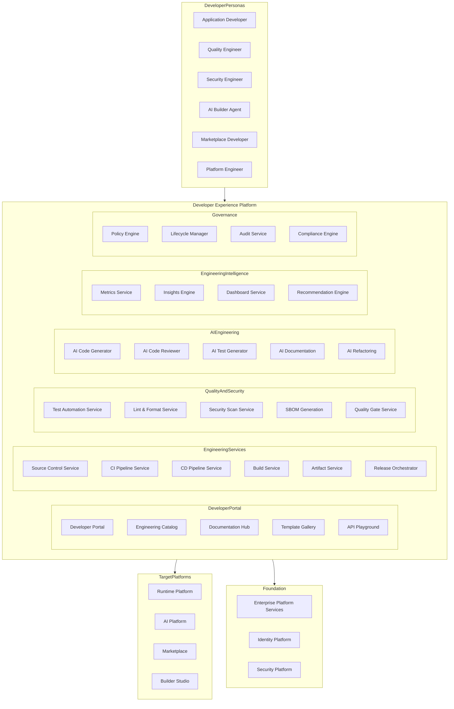
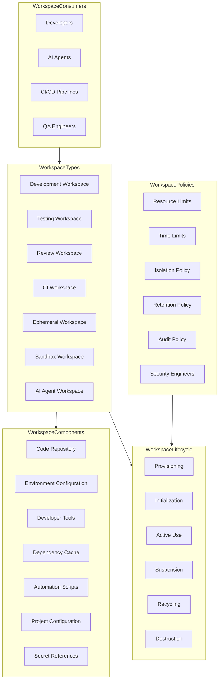
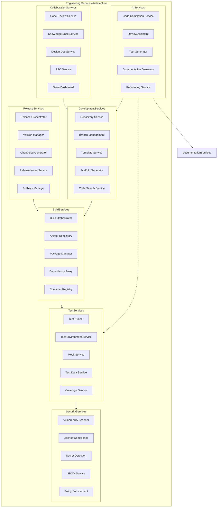
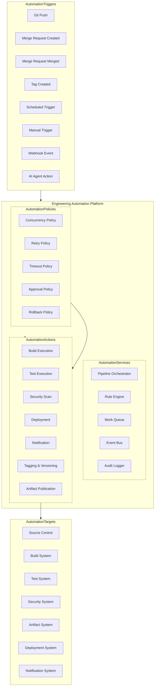
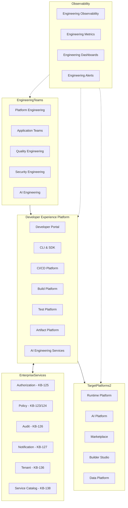

# KB-141 — Developer Experience (DX) Platform Architecture

---

## Metadata

- **Document ID:** KB-141
- **Title:** Developer Experience (DX) Platform Architecture
- **Suite:** Developer Experience (DX) & Engineering Platform Architecture
- **Version:** 1.0
- **Status:** Approved Architecture
- **Classification:** Enterprise Engineering Platform Architecture
- **Date:** 2026-07-12

---

## Executive Summary

The Developer Experience Platform provides a unified engineering ecosystem supporting every phase of software delivery across the DUKADESK ecosystem while abstracting infrastructure complexity, enforcing engineering standards, enabling AI-assisted development, promoting engineering consistency, and maximizing developer productivity.

The platform functions as the enterprise engineering foundation supporting every software product, shared platform capability, Builder Studio module, Marketplace extension, integration, AI capability, and operational service within DUKADESK. All engineering activities, from onboarding through delivery, are governed by this canonical architecture.

---

## Purpose

Define how DUKADESK standardizes and governs engineering activities through a centralized Developer Experience Platform that delivers consistent tooling, governance, automation, security, observability, collaboration, and engineering intelligence.

---

## Scope

### In Scope

- Developer Experience platform architecture
- Engineering platform architecture
- Developer portal integration
- Engineering workspace architecture
- Engineering services
- Development lifecycle integration
- Engineering automation
- Engineering workflows
- Engineering governance
- AI-assisted engineering
- Engineering knowledge management
- Engineering observability
- Engineering analytics
- Developer onboarding architecture
- Engineering standards
- Engineering ecosystem

### Out of Scope

- SDLC processes
- CI/CD implementation
- Source control implementation
- Testing implementation
- Documentation implementation
- Infrastructure implementation

These are covered by dedicated Knowledge Base documents including KB-142 through KB-160 within this suite and KB-107 through KB-140 (Enterprise Platform Services).

---

## Architectural Principles

| # | Principle | Description |
|---|-----------|-------------|
| 1 | Developer-First Architecture | Every engineering capability is designed for developer productivity and satisfaction |
| 2 | Platform Engineering | Engineering capabilities are delivered through a self-service internal developer platform |
| 3 | Self-Service Engineering | Developers access all engineering capabilities through self-service interfaces |
| 4 | Everything as Code | All engineering artifacts, configurations, and environments are defined as code |
| 5 | Automation First | Manual engineering processes are replaced with automated workflows |
| 6 | AI-Assisted Engineering | AI capabilities augment every phase of the engineering lifecycle |
| 7 | DevSecOps by Default | Security is integrated into every engineering stage, not added later |
| 8 | Standardization over Customization | Engineering standards are enforced through platform capabilities |
| 9 | Vendor Independence | No dependency on specific vendor engineering tool implementations |
| 10 | Technology Neutrality | The platform supports any technology stack without bias |
| 11 | Enterprise Scalability | Engineering platform scales across all teams, products, and domains |
| 12 | Security by Design | Engineering platform security is enforced at every layer |
| 13 | Observability by Default | All engineering operations emit metrics, events, and audit trails |

---

## Canonical Definitions

| Term | Definition |
|------|-----------|
| Developer Experience (DX) | The sum of interactions, tools, workflows, and environments a developer encounters while building software |
| Engineering Platform | The integrated set of capabilities enabling software delivery across the enterprise |
| Developer Workspace | A consistent, reproducible engineering context for development activities |
| Engineering Service | A reusable capability provided by the engineering platform |
| Engineering Workflow | A defined sequence of engineering activities from code change to delivery |
| Developer Journey | The complete lifecycle of a developer from onboarding through platform contribution |
| Engineering Automation | Automated execution of engineering workflows, gates, and governance |
| Engineering Portal | The central entry point for developers to access engineering platform capabilities |
| Engineering Standards | Defined conventions for code, architecture, documentation, and delivery |
| Engineering Governance | The policies, processes, and gates governing engineering activities |
| Platform Engineering | The discipline of building and operating the internal developer platform |
| AI Engineering Assistant | An AI capability that augments or automates engineering activities |
| Engineering Catalog | The inventory of engineering capabilities, templates, and assets |
| Developer Environment | A provisioned context for development, testing, or review activities |
| Engineering Capability | A distinct function provided by the engineering platform |
| Developer Productivity | A measure of engineering output relative to effort and time |
| Engineering Intelligence | Insights derived from engineering metrics, workflows, and outcomes |
| Enterprise Engineering Platform | The complete engineering platform serving the entire organization |
| Engineering Lifecycle | The governed progression of engineering activities from idea to operation |
| Developer Self-Service | The ability for developers to provision capabilities without manual intervention |

---

## Developer Experience Platform Architecture

---

## Engineering Capability Model

```mermaid
graph TB
    ECM[Engineering Capability Model] --> DEV_CAP[Development Capabilities]
    ECM --> TST_CAP[Testing Capabilities]
    ECM --> SEC_CAP[Security Capabilities]
    ECM --> DOC_CAP[Documentation Capabilities]
    ECM --> BLD_CAP[Build Capabilities]
    ECM --> DEP_CAP[Deployment Capabilities]
    ECM --> OBS_CAP[Observability Capabilities]
    ECM --> AI_CAP[AI Assistance Capabilities]
    ECM --> COL_CAP[Collaboration Capabilities]
    ECM --> GOV_CAP[Governance Capabilities]
    ECM --> OPS_CAP[Platform Operations]
    ECM --> MKT_CAP[Marketplace Development]
    ECM --> STUDIO_CAP[Builder Studio Development]
    ECM --> FUT_CAP[Future Engineering Domains]

    DEV_CAP --> IDE[IDE Integration]
    DEV_CAP --> CLI[CLI Tooling]
    DEV_CAP --> SDK[SDK Libraries]
    DEV_CAP --> TPL[Project Templates]
    DEV_CAP --> SCAFF[Service Scaffolds]

    TST_CAP --> UNIT[Unit Testing]
    TST_CAP --> INT[Integration Testing]
    TST_CAP --> E2E[End-to-End Testing]
    TST_CAP --> PERF[Performance Testing]
    TST_CAP --> SEC_T[Security Testing]

    SEC_CAP --> SAST[Static Analysis]
    SEC_CAP --> DAST[Dynamic Analysis]
    SEC_CAP --> SCA[Software Composition Analysis]
    SEC_CAP --> SECRET[Secret Scanning]

    BLD_CAP --> COMPILE[Compilation]
    BLD_CAP --> PKG[Packaging]
    BLD_CAP --> CONT[Containerization]
    BLD_CAP --> SIGN[Code Signing]

    AI_CAP --> CODE_GEN[Code Generation]
    AI_CAP --> CODE_REV[Code Review]
    AI_CAP --> TST_GEN[Test Generation]
    AI_CAP --> DOC_GEN[Documentation]
    AI_CAP --> REFAC[Refactoring]
    AI_CAP --> IMPACT[Impact Analysis]
```

---

## Developer Journey

```mermaid
graph LR
    subgraph Onboard[Onboarding]
        O1[Developer Registration]
        O2[Access Provisioning]
        O3[Workspace Setup]
        O4[SDK Installation]
        O5[Onboarding Guide]
    end

    subgraph Discover[Discover]
        D1[Engineering Catalog]
        D2[Template Library]
        D3[Documentation Hub]
        D4[API Playground]
        D5[Community Projects]
    end

    subgraph Develop[Develop]
        DV1[Project Initialization]
        DV2[Local Development]
        DV3[AI-Assisted Coding]
        DV4[Local Testing]
        DV5[Code Commit]
    end

    subgraph Collaborate[Collaborate]
        C1[Merge Request]
        C2[AI Code Review]
        C3[Peer Review]
        C4[Automated Checks]
        C5[Approval Gate]
    end

    subgraph Deliver[Deliver]
        DL1[CI Pipeline]
        DL2[Build & Test]
        DL3[Security Scan]
        DL4[Artifact Publishing]
        DL5[Release Approval]
    end

    subgraph Operate[Operate]
        OP1[Deployment]
        OP2[Monitoring]
        OP3[Incident Response]
        OP4[Performance Analysis]
        OP5[Feedback Loop]
    end

    Onboard --> Discover
    Discover --> Develop
    Develop --> Collaborate
    Collaborate --> Deliver
    Deliver --> Operate
    Operate -.-> Develop
```

---

## Engineering Workspace Architecture

---

## Engineering Services Architecture

---

## Engineering Automation Architecture

---

## Enterprise Engineering Operating Model

---

## Governance Architecture

```mermaid
graph TB
    subgraph GovernanceBody[Engineering Governance Architecture]

        subgraph StrategicGovernance
            EAB[Enterprise Architecture Board]
            EGC[Engineering Governance Council]
            PLT_STD[Platform Standards Board]
        end

        subgraph EngineeringStandards
            CODE[Code Standards]
            ARCH[Architecture Standards]
            API2[API Standards]
            TST_STD[Test Standards]
            DOC_STD[Documentation Standards]
            REL_STD[Release Standards]
        end

        subgraph QualityGovernance
            QLT_G[Quality Gates]
            CVR_G[Coverage Gates]
            PRF_G[Performance Gates]
            SEC_G[Security Gates]
            LIC_G[License Gates]
        end

        subgraph AIGovernance
            AI_SAFE[AI Safety Review]
            AI_QUAL[AI Output Quality]
            AI_PROV[AI Code Provenance]
            AI_ETHICS[AI Ethics Review]
        end

        subgraph SecurityAndCompliance
            SEC2[Security Compliance]
            CMP2[Regulatory Compliance]
            AUD2[Engineering Audit]
            LEG[Legal Review]
        end

        subgraph Enforcement
            PLY[Policy Engine]
            QLT_GATE[Automated Quality Gates]
            VIO[Violation Manager]
            RPT[Reporting Engine]
            CORR[Corrective Actions]
        end

        subgraph Policies
            REPO[Repository Policy]
            BRANCH[Branch Policy]
            CI_POL[CI Pipeline Policy]
            CD_POL[CD Pipeline Policy]
            SEC_POL[Security Policy]
            REV_POL[Review Policy]
            VERSION[Versioning Policy]
        end
    end

    StrategicGovernance --> EngineeringStandards
    EngineeringStandards --> QualityGovernance
    EngineeringStandards --> AIGovernance
    SecurityAndCompliance --> QualityGovernance
    QualityGovernance --> Enforcement
    Policies --> Enforcement
    Enforcement --> VIO
    Enforcement --> CORR
```

---

## Engineering Ecosystem

```mermaid
graph TB
    subgraph EngineeringEcosystem[Engineering Ecosystem]

        subgraph EngineeringRoles
            APP_DEV2[Application Developer]
            PLT_ENG2[Platform Engineer]
            QA_ENG2[QA Engineer]
            SEC_ENG2[Security Engineer]
            AI_ENG2[AI Engineer]
            MKT_DEV2[Marketplace Developer]
            STUDIO_DEV[Builder Studio Developer]
        end

        subgraph PlatformCapabilities
            SRC_CTL[Source Control]
            CI_CD2[CI/CD Pipelines]
            BLD_SYS3[Build System]
            ART_REG[Artifact Registry]
            TST_PLT[Test Platform]
            SEC_PLT2[Security Platform]
            AI_PLT3[AI Engineering Platform]
            DOC_PLT[Documentation Platform]
        end

        subgraph DeveloperTools
            IDE_INT[IDE Integration]
            CLI_TOOL[CLI Tools]
            SDK_LIB[SDK Libraries]
            TPL_LIB[Template Library]
            PLUGIN[Plugin System]
            SCAFF2[Scaffolding Tools]
        end

        subgraph EngineeringData
            MET_STORE[Metrics Store]
            LOG_STORE[Build Logs]
            TST_RES[Test Results]
            SEC_DATA[Security Data]
            ART_DATA[Artifact Metadata]
            FEED[Developer Feedback]
        end

        subgraph EngineeringGovernance
            POL_ENF[Policy Enforcement]
            QLT_GATES[Quality Gates]
            SEC_GATES[Security Gates]
            AUD_TRAIL[Audit Trail]
            COMP_ENF[Compliance Enforcement]
        end

        subgraph EngineeringIntelligence2
            VELOCITY[Velocity Metrics]
            QUALITY[Quality Metrics]
            PROD2[Productivity Metrics]
            SEC_POSTURE[Security Posture]
            ADOPTION[Platform Adoption]
        end
    end

    EngineeringRoles --> PlatformCapabilities
    PlatformCapabilities --> DeveloperTools
    PlatformCapabilities --> EngineeringData
    EngineeringGovernance -.-> PlatformCapabilities
    EngineeringGovernance -.-> EngineeringRoles
    EngineeringIntelligence2 -.-> PlatformCapabilities
    EngineeringIntelligence2 -.-> EngineeringData
    DeveloperTools --> EngineeringData
```

---

## Developer Experience Platform Reference Model

```mermaid
graph TB
    subgraph ReferenceModel[Developer Experience Platform Reference Model]

        subgraph CapabilityDomains
            CD1[Development</br>Source Control, Branching,</br>Environments, SDKs]
            CD2[Build & Release</br>CI/CD, Artifacts,</br>Versioning, Packaging]
            CD3[Quality</br>Testing, Linting,</br>Coverage, Reviews]
            CD4[Security</br>Scanning, SBOM,</br>Policy, Compliance]
            CD5[AI Assistance</br>Code Gen, Review,</br>Testing, Refactoring]
            CD6[Collaboration</br>Reviews, Knowledge,</br>RFCs, Community]
            CD7[Observability</br>Metrics, Insights,</br>Dashboards, Alerts]
            CD8[Governance</br>Policies, Gates,</br>Audit, Enforcement]
        end

        subgraph IntegrationPatterns
            IP1[Git Events - Push, Merge, Tag]
            IP2[API - RESTful Service Interfaces]
            IP3[Webhooks - Event Notifications]
            IP4[Streams - Real-Time Events]
            IP5[CLI - Command Line Integration]
            IP6[IDE - Editor Plugin Protocol]
        end

        subgraph QualityAttributes
            QA1[Multi-Tenant Isolation]
            QA2[Horizontal Scalability]
            QA3[High Availability]
            QA4[Self-Service]
            QA5[Observability]
            QA6[Security by Design]
            QA7[AI Readiness]
            QA8[Vendor Independence]
        end

        subgraph GovernanceModel
            GM1[Engineering Standards]
            GM2[Automated Gates]
            GM3[Policy Enforcement]
            GM4[Audit & Compliance]
            GM5[AI Governance]
            GM6[Continuous Improvement]
        end
    end

    CapabilityDomains --> IntegrationPatterns
    IntegrationPatterns --> QualityAttributes
    QualityAttributes --> GovernanceModel
```

---

## Governance

| Domain | Governance Focus |
|--------|-----------------|
| Engineering Standards | Code, architecture, API, test, documentation, and release standards are enforced |
| Platform Governance | The DX Platform is governed as an enterprise engineering capability |
| Architecture Governance | Architecture reviews and technology standards are enforced |
| AI Governance | AI-assisted engineering follows safety, provenance, and review policies |
| Security Governance | Security scanning, dependency analysis, and supply chain trust are enforced |
| Compliance Governance | Engineering compliance with regulatory requirements is enforced |
| Developer Governance | Developer access, permissions, and workspace policies are enforced |
| Quality Governance | Quality gates, test coverage, and review standards are enforced |
| Knowledge Governance | Engineering knowledge, standards, and reusable assets are governed |
| Enterprise Governance | The Enterprise Architecture board governs DX platform evolution and standards |

### Governance Enforcement Points

| Enforcement Point | Mechanism |
|-------------------|-----------|
| Repository Creation | Policy validation, naming conventions, branch protection enforcement |
| Merge Request | Automated checks, required reviews, quality gates, security scans |
| Build Execution | Build policies, dependency validation, license compliance |
| Release Creation | Version policy enforcement, approval gates, SBOM generation |
| Security Scan | Vulnerability threshold enforcement, blocking on critical findings |
| AI Code Generation | Output validation, provenance capture, human review requirement |

---

## Responsibilities

| Role | Responsibilities |
|------|-----------------|
| Enterprise Architecture Board | Governs DX platform architecture, standards, and evolution |
| Platform Engineering | Develops, operates, and maintains the Developer Experience Platform |
| Developer Experience Team | Defines developer workflows, tools, and standards; champions developer satisfaction |
| Engineering Leadership | Defines engineering goals, productivity targets, and strategic direction |
| Product Engineering | Follows engineering standards; uses platform capabilities; provides continuous feedback |
| Security | Defines DevSecOps standards; audits engineering security practices; enforces policies |
| Compliance | Defines engineering compliance requirements; audits engineering governance |
| AI Governance Board | Governs AI-assisted engineering capabilities; approves AI safety standards |
| QA Leadership | Defines quality standards; operates quality gates; monitors quality metrics |
| Operations | Defines operational standards; integrates runtime platform with engineering platform |
| Developers | Follows engineering standards; uses platform self-service; contributes to platform improvement |
| AI Builder Agents | Operates within AI engineering governance; generates code with provenance |

---

## Security

| Security Control | Description |
|------------------|-------------|
| Identity-Aware Engineering | All engineering platform access is authenticated and identity-aware |
| Least Privilege | Developer permissions follow least privilege; elevated access requires approval |
| Zero Trust | All engineering service interactions are authenticated and authorized |
| Secure Engineering Workspaces | Workspaces are isolated, ephemeral, and destroyed after use |
| Secure Engineering Services | All engineering services communicate over authenticated channels |
| Policy Enforcement | Engineering policies are enforced through automated platform gates |
| Auditability | All engineering operations are recorded in immutable audit log |
| Provenance | Every artifact has a verifiable provenance chain from source to deployment |
| Software Supply Chain Trust | All dependencies, builds, and artifacts are cryptographically verified |
| Engineering Isolation | Teams, projects, and tenants are isolated within the engineering platform |

### Security Zones

| Zone | Description |
|------|-------------|
| Public | Public engineering documentation and templates accessible without authentication |
| Authenticated | Engineering portal and catalog requiring developer authentication |
| Internal | Internal project repositories requiring authorized access |
| Confidential | Sensitive engineering data with classification-based restrictions |
| Restricted | Security-critical engineering systems with elevated controls |
| AI | AI engineering services with additional safety and governance controls |

---

## Privacy

| Privacy Control | Description |
|----------------|-------------|
| Developer Privacy | Developer activity data is collected transparently with opt-in for personal metrics |
| Repository Privacy | Repository access is governed by repository classification and team membership |
| Sensitive Engineering Information | Secrets, credentials, and security findings are classified and restricted |
| Regulatory Compliance | Engineering data handling complies with GDPR, CCPA, and regional regulations |
| Cross-Border Governance | Engineering data respects data residency requirements |
| Data Minimization | Only required engineering data is collected, stored, and processed |
| Retention Governance | Engineering data is retained per policy and purged when expired |
| Privacy Assurance | Regular privacy reviews for engineering platform capabilities |

### Data Classification

| Classification | Examples | Access Restrictions |
|---------------|----------|-------------------|
| Public | Documentation, templates, public projects | No authentication required |
| Internal | Internal repositories, build logs, test results | Authenticated developers |
| Confidential | Architecture documents, security scan results | Authorized team members |
| Restricted | Secrets, credentials, vulnerability reports | Explicit approval required |
| Regulated | Compliance evidence, audit trails | Audited access with strict controls |

---

## Performance

| Consideration | Requirement |
|---------------|-------------|
| Enterprise-Scale Engineering | Platform supports thousands of developers and millions of engineering operations daily |
| Global Engineering Teams | Platform operates across globally distributed engineering teams |
| Elastic Engineering Platforms | Engineering services scale horizontally with developer demand |
| High Availability | 99.99% uptime for critical engineering services |
| Operational Resilience | Graceful degradation under load with circuit breakers |
| Efficient Engineering Workflows | Developer interactions respond within sub-second latency |
| Multi-Region Readiness | Engineering platform operates across global regions |
| Engineering Scalability | Platform capacity grows automatically with engineering team growth |

### Performance Optimization

| Optimization | Description |
|--------------|-------------|
| Build Caching | Remote build caching to accelerate repeated builds across developers |
| Dependency Mirroring | Local dependency mirrors to reduce network latency |
| Parallel Execution | Parallel test and build execution across available resources |
| Incremental Builds | Only changed components are rebuilt |
| Workspace Pre-Warming | Frequently used workspace configurations are pre-provisioned |
| CDN for Artifacts | Artifacts distributed through content delivery network |

---

## Observability

| Observable Dimension | Metrics | Purpose |
|---------------------|---------|---------|
| Developer Productivity | Lead time, deployment frequency, PR cycle time | Measuring engineering delivery speed |
| Engineering Health | Build success rate, test pass rate, code coverage | Monitoring engineering process health |
| Platform Health | Platform availability, service latency, error rates | Detecting platform degradation |
| Engineering Workflow Metrics | PR volume, review turnaround, merge frequency | Understanding workflow efficiency |
| Governance Dashboards | Policy violations, gate failures, compliance status | Monitoring engineering governance |
| Operational Reporting | Daily engineering activity, resource utilization | Operational platform management |
| Executive Reporting | Portfolio velocity, quality trends, productivity metrics | Strategic engineering intelligence |
| Engineering Insights | Bottleneck detection, optimization recommendations | Identifying engineering improvements |
| Platform Analytics | Feature adoption, template usage, self-service metrics | Understanding platform utilization |
| Engineering Intelligence | Cross-team trends, productivity patterns, quality correlations | Enterprise engineering analysis |

### Observability Events

| Event Type | Trigger | Consumer |
|------------|---------|----------|
| DeveloperOnboarded | New developer registered | Engineering dashboard, access service |
| ProjectInitialized | New project created | Template service, repository service |
| BuildCompleted | Build pipeline finished | Notification service, metrics store |
| MergeRequestCreated | PR submitted | Review service, CI pipeline |
| SecurityVulnerabilityFound | Vulnerability detected | Security team, remediation tracking |
| ReleaseCreated | Release artifact published | Deployment service, changelog service |
| GateViolation | Quality gate failed | Developer notification, governance dashboard |
| AIEngineeringAction | AI generated or modified code | AI governance, provenance log |

---

## Failure Scenarios

| # | Scenario | Architectural Response |
|---|----------|----------------------|
| 1 | Workspace Failures | Workspace recreation from declarative configuration; fallback to clean workspace |
| 2 | Engineering Service Failures | Circuit breakers isolate failing service; fallback to degraded mode with cached state |
| 3 | Governance Failures | Policy engine degrades to deny-all; manual override with audit trail |
| 4 | Automation Failures | Pipeline retry with backoff; notification to developer; incident escalation |
| 5 | Platform Fragmentation | Platform reconciliation service detects fragmentation; corrective actions applied |
| 6 | Knowledge Fragmentation | Knowledge graph reconciliation; orphan detection with manual review |
| 7 | AI Engineering Failures | AI output validation gates block erroneous output; human review required |
| 8 | Policy Violations | Policy enforcement point blocks violating operation; violation recorded with audit |
| 9 | Platform Outages | Multi-region failover; cached static fallback for developer portal |
| 10 | Developer Onboarding Failures | Onboarding workflow with retry; manual escalation path for persistent failures |
| 11 | Recovery Failures | Journal-based recovery with replay; cross-service consistency verification |
| 12 | Cross-Team Inconsistencies | Engineering standards enforcement with automated detection and remediation |

---

## Anti-Patterns

| # | Anti-Pattern | Description | Prohibited Because |
|---|-------------|-------------|-------------------|
| 1 | Team-Specific Engineering Platforms | Each team maintaining its own engineering toolchain | Fragments developer experience, increases maintenance, reduces consistency |
| 2 | Manual Engineering Workflows | Engineering processes executed manually without automation | Introduces errors, inconsistency, security gaps, delays |
| 3 | Independent Developer Tooling | Developers choosing ungoverned tools outside the platform | Creates security risks, support burden, knowledge fragmentation |
| 4 | Engineering Without Governance | Engineering activities without policy enforcement | Creates quality risks, security gaps, compliance violations |
| 5 | AI-Assisted Development Without Oversight | AI-generated code accepted without review | Introduces quality issues, security vulnerabilities, provenance gaps |
| 6 | Hardcoded Engineering Standards | Standards enforced through documentation rather than automation | Creates inconsistency, enforcement gaps, audit failures |
| 7 | Duplicate Engineering Services | Multiple services providing the same engineering capability | Wastes resources, fragments experience, increases complexity |
| 8 | Knowledge Silos | Engineering knowledge captured outside the platform | Reduces reuse, creates duplication, increases onboarding time |
| 9 | Platform Bypass | Teams circumventing platform capabilities for custom workflows | Creates governance gaps, security risks, support burden |
| 10 | Inconsistent Engineering Experiences | Varying engineering workflows across teams and domains | Reduces developer mobility, increases cognitive load |

---

## Future Evolution

| # | Evolution Path | Description |
|---|---------------|-------------|
| 1 | Autonomous Engineering Platforms | The DX Platform self-governs, self-heals, and self-optimizes without human intervention |
| 2 | AI-Native Software Engineering | AI agents autonomously design, develop, test, and deploy software |
| 3 | Self-Healing Engineering Environments | Environments automatically detect and recover from failures |
| 4 | Intelligent Engineering Assistants | AI assistants that understand full engineering context and provide proactive guidance |
| 5 | Federated Engineering Ecosystems | Cross-enterprise engineering collaboration and platform federation |
| 6 | Predictive Engineering Optimization | ML-driven prediction of build failures, defects, and delivery delays |
| 7 | Engineering Digital Twins | Digital twin representations of engineering processes for simulation |
| 8 | Enterprise Engineering Intelligence | AI-driven insights into engineering health, productivity, and optimization |

---

## Cross References

| Document ID | Title | Relationship |
|-------------|-------|-------------|
| KB-107 | Enterprise Platform Services Overview Architecture | Foundational reference for platform services consumed by DX platform |
| KB-116 | AI Platform Architecture | Defines AI platform capabilities consumed by AI engineering services |
| KB-117 | AI Agent Framework Architecture | Defines AI agent framework for AI Builder Agent integration |
| KB-121 | AI Safety & Governance Architecture | Defines AI governance applied to AI-assisted engineering |
| KB-123 | Enterprise Policy Framework Architecture | Foundational reference for policy-driven engineering governance |
| KB-126 | Audit & Compliance Architecture | Defines audit integration for engineering operations |
| KB-127 | Notification & Communication Architecture | Defines notification integration for engineering events |
| KB-138 | Enterprise Service Catalog Architecture | Defines service registration for DX platform capabilities |
| KB-139 | Enterprise Capability Model Architecture | Defines capability model integration for engineering capabilities |
| KB-142 | Software Development Lifecycle Architecture | Defines SDLC governed by the DX Platform |
| KB-143 | Source Control & Repository Architecture | Defines source control managed by the DX Platform |
| KB-144 | Branching & Release Strategy Architecture | Defines branching governed by the DX Platform |
| KB-145 | Build & Artifact Management Architecture | Defines build services provided by the DX Platform |
| KB-146 | CI/CD Pipeline Architecture | Defines CI/CD pipelines operated by the DX Platform |
| KB-147 | DevSecOps Architecture | Defines security integration within the DX Platform |
| KB-148 | Test Strategy & Quality Engineering Architecture | Defines quality services provided by the DX Platform |
| KB-149 | Development Environment Architecture | Defines workspaces provisioned by the DX Platform |
| KB-150 | API Development Standards Architecture | Defines API standards enforced by the DX Platform |
| KB-151 | SDK & Developer Toolkit Architecture | Defines SDKs distributed through the DX Platform |
| KB-152 | Plugin & Extension Development Architecture | Defines plugin development supported by the DX Platform |
| KB-153 | Developer Portal Architecture | Defines the portal entry point into the DX Platform |
| KB-154 | Documentation Platform Architecture | Defines documentation hosted on the DX Platform |
| KB-155 | Engineering Observability Architecture | Defines observability integrated with the DX Platform |
| KB-156 | Engineering Metrics & Productivity Architecture | Defines metrics collected by the DX Platform |
| KB-157 | InnerSource & Code Reuse Architecture | Defines InnerSource practices enabled by the DX Platform |
| KB-158 | Engineering Governance Architecture | Defines governance enforced by the DX Platform |
| KB-159 | AI-Assisted Software Engineering Architecture | Defines AI capabilities embedded in the DX Platform |
| KB-160 | Developer Experience Reference Architecture | Comprehensive reference for the complete DX suite |

---

## Critical DUKADESK Architectural Rule

**All engineering activities within DUKADESK shall be conducted through the centralized Developer Experience Platform. No application, product team, Builder Studio module, Marketplace extension, AI Builder Agent, integration, or platform service shall establish independent engineering environments, workflows, standards, or governance outside the canonical Developer Experience Platform architecture, ensuring enterprise-wide consistency, security, automation, observability, AI readiness, and engineering excellence.**
