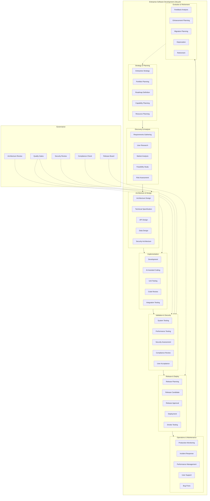
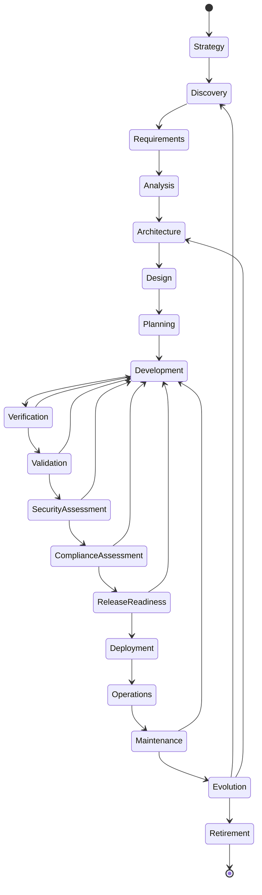
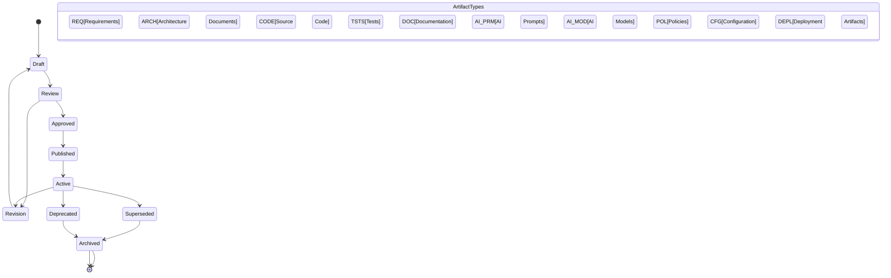
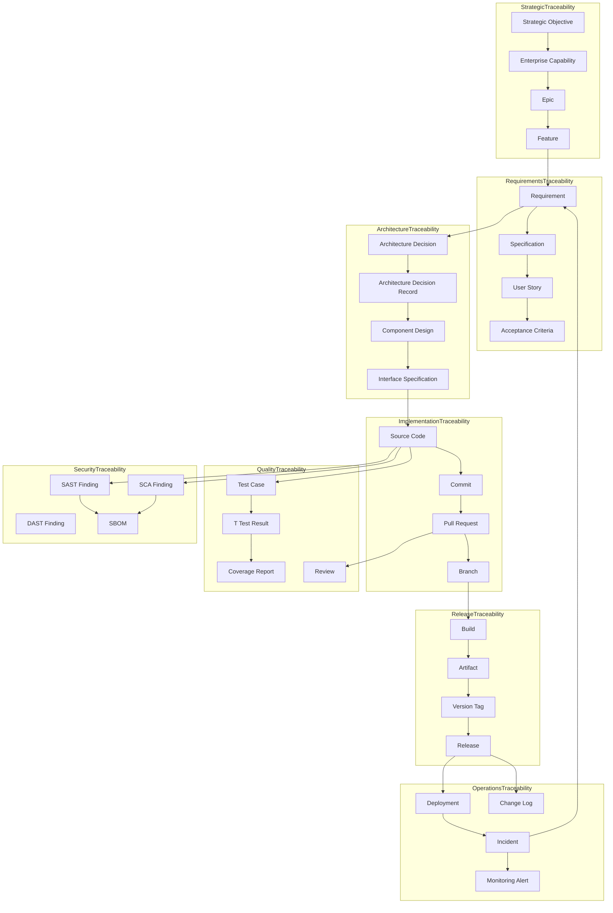
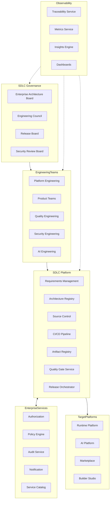
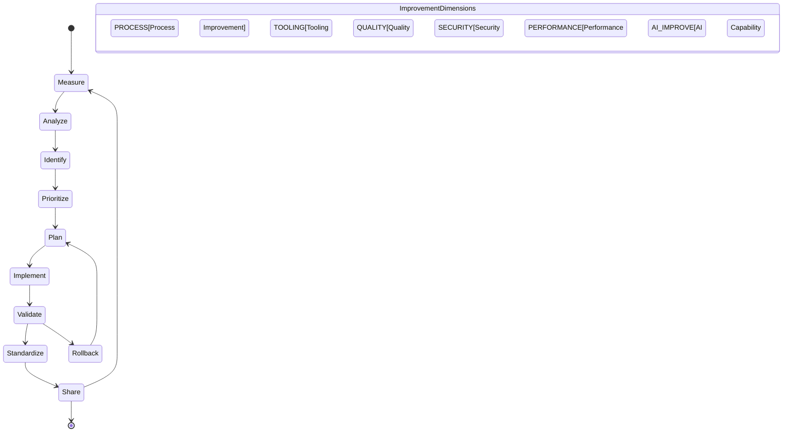

# KB-142 — Software Development Lifecycle (SDLC) Architecture

---

## Metadata

- **Document ID:** KB-142
- **Title:** Software Development Lifecycle (SDLC) Architecture
- **Suite:** Developer Experience (DX) & Engineering Platform Architecture
- **Version:** 1.0
- **Status:** Approved Architecture
- **Classification:** Enterprise Software Engineering Architecture
- **Date:** 2026-07-12

---

## Executive Summary

The Enterprise Software Development Lifecycle (SDLC) provides a standardized enterprise lifecycle governing every software change across the DUKADESK ecosystem, regardless of technology stack, development methodology, team structure, deployment model, or product domain.

The architecture ensures consistent governance, traceability, quality, security, compliance, automation, AI-assisted engineering, and continuous improvement throughout the entire lifecycle of software from strategic planning through retirement.

---

## Purpose

Define how DUKADESK governs the complete lifecycle of software from strategic planning through retirement while ensuring architectural integrity, engineering quality, operational resilience, regulatory compliance, and enterprise scalability.

---

## Scope

### In Scope

- Enterprise SDLC architecture
- Software lifecycle model
- Requirements lifecycle
- Architecture lifecycle
- Development lifecycle
- Quality lifecycle
- Security lifecycle
- Release lifecycle
- Operations lifecycle
- Maintenance lifecycle
- Change lifecycle
- Knowledge lifecycle
- AI-assisted lifecycle
- Governance lifecycle
- Continuous improvement lifecycle

### Out of Scope

- Source control implementation
- CI/CD implementation
- Test implementation
- Build implementation
- Infrastructure implementation
- Release tooling implementation

These are covered by dedicated Knowledge Base documents including KB-143 through KB-149 within this suite.

---

## Architectural Principles

| # | Principle | Description |
|---|-----------|-------------|
| 1 | Architecture Before Implementation | Architecture is defined and reviewed before development begins |
| 2 | Secure by Design | Security is integrated into every lifecycle phase, not added later |
| 3 | Quality by Default | Quality is built into every engineering artifact from inception |
| 4 | Shift-Left Engineering | Validation, testing, and security activities are performed as early as possible |
| 5 | Automation First | Manual lifecycle processes are replaced with automated workflows |
| 6 | Everything Traceable | Every engineering artifact is traceable to requirements, decisions, and changes |
| 7 | Continuous Validation | Engineering artifacts are validated continuously throughout the lifecycle |
| 8 | AI-Assisted Engineering | AI capabilities augment every phase of the lifecycle |
| 9 | Continuous Improvement | The SDLC itself evolves through feedback and retrospective analysis |
| 10 | Vendor Independence | The SDLC is independent of vendor-specific methodologies |
| 11 | Technology Neutrality | The lifecycle supports any technology stack without bias |
| 12 | Enterprise Scalability | The SDLC scales across all teams, products, domains, and methodologies |
| 13 | Observability by Default | All lifecycle phases emit metrics, events, and audit trails |

---

## Canonical Definitions

| Term | Definition |
|------|-----------|
| Software Development Lifecycle | The governed progression of software from conception through retirement |
| Lifecycle Phase | A distinct stage in the software lifecycle with defined inputs, outputs, and gates |
| Requirement | A documented capability or condition that software must satisfy |
| Change | A modification to any software artifact within the lifecycle |
| Architecture Decision | A documented architectural choice with rationale and alternatives |
| Development Activity | An engineering action that produces or modifies software artifacts |
| Quality Gate | A mandatory checkpoint enforcing quality, security, and compliance criteria |
| Release Candidate | A versioned software artifact ready for validation before release |
| Deployment Readiness | The state of a release meeting all criteria for production deployment |
| Engineering Artifact | Any output produced during the software lifecycle |
| Lifecycle Governance | The policies, gates, and oversight applied to lifecycle phases |
| Traceability | The documented relationships between requirements, artifacts, and decisions |
| Validation | Confirmation that software meets stakeholder requirements |
| Verification | Confirmation that software meets specified design and standards |
| Technical Debt | The implied cost of rework caused by choosing an easy solution now instead of a better approach |
| Continuous Improvement | The ongoing effort to improve the SDLC based on feedback and metrics |
| Engineering Review | A structured evaluation of engineering artifacts against defined criteria |
| Software Evolution | The ongoing modification of software in response to changing requirements |
| Software Retirement | The governed decommissioning of software at end of life |
| Enterprise SDLC | The canonical lifecycle governing all software across the enterprise |

---

## Enterprise SDLC Architecture

---

## Software Lifecycle Phases

---

## Engineering Artifact Lifecycle

---

## End-to-End Traceability Model

---

## Quality Gate Architecture

```mermaid
graph TB
    subgraph QualityGate[Quality Gate Architecture]

        subgraph Phases[Gate Phases]
            GATE1[Gate 1 - Architecture Review]
            GATE2[Gate 2 - Development Complete]
            GATE3[Gate 3 - Validation Complete]
            GATE4[Gate 4 - Security Approved]
            GATE5[Gate 5 - Release Ready]
            GATE6[Gate 6 - Deployment Verified]
        end

        subgraph Criteria[Gate Criteria]
            C1[Architecture Compliance]
            C2[Code Quality Standards]
            C3[Test Coverage Minimum]
            C4[Test Pass Rate 100%]
            C5[Zero Critical Vulnerabilities]
            C6[License Compliance]
            C7[Performance Thresholds]
            C8[Documentation Complete]
            C9[Change Log Updated]
            C10[Release Notes Approved]
        end

        subgraph Automation[Automated Checks]
            A1[Lint & Format Check]
            A2[Build Verification]
            A3[Unit Test Suite]
            A4[Integration Test Suite]
            A5[SAST Scan]
            A6[SCA Scan]
            A7[Secret Detection]
            A8[SBOM Generation]
        end

        subgraph Review[Manual Reviews]
            R1[Architecture Review]
            R2[Code Review]
            R3[Security Review]
            R4[Compliance Review]
            R5[Release Review]
        end

        subgraph Outcomes[Gate Outcomes]
            O1[Pass - Proceed]
            O2[Pass with Waiver]
            O3[Fail - Rework Required]
            O4[Fail - Escalated]
            O5[Blocked - Security Issue]
        end

        Phases --> Criteria
        Criteria --> Automation
        Criteria --> Review
        Automation --> Outcomes
        Review --> Outcomes
    end
```

---

## AI-Assisted SDLC Model

```mermaid
graph TB
    subgraph AISDLC[AI-Assisted SDLC Model]

        subgraph Planning
            AI_P1[AI Requirement Analysis]
            AI_P2[AI Effort Estimation]
            AI_P3[AI Risk Assessment]
            AI_P4[AI Sprint Planning]
        end

        subgraph Architecture
            AI_A1[AI Architecture Suggestion]
            AI_A2[AI Pattern Recommendation]
            AI_A3[AI Dependency Analysis]
            AI_A4[AI Impact Analysis]
            AI_A5[AI API Design]
        end

        subgraph Development
            AI_D1[AI Code Generation]
            AI_D2[AI Code Completion]
            AI_D3[AI Refactoring]
            AI_D4[AI Test Generation]
            AI_D5[AI Documentation Generation]
        end

        subgraph Review
            AI_R1[AI Code Review]
            AI_R2[AI Vulnerability Detection]
            AI_R3[AI Code Smell Detection]
            AI_R4[AI Performance Review]
        end

        subgraph Quality
            AI_Q1[AI Test Selection]
            AI_Q2[AI Flaky Test Detection]
            AI_Q3[AI Coverage Analysis]
            AI_Q4[AI Defect Prediction]
        end

        subgraph Release
            AI_RL1[AI Release Risk Scoring]
            AI_RL2[AI Rollback Prediction]
            AI_RL3[AI Deployment Optimization]
            AI_RL4[AI Release Notes Generation]
        end

        subgraph Operations
            AI_O1[AI Incident Triage]
            AI_O2[AI Root Cause Analysis]
            AI_O3[AI Anomaly Detection]
            AI_O4[AI Performance Optimization]
        end

        subgraph Governance
            AI_G1[AI Provenance Capture]
            AI_G2[AI Output Validation]
            AI_G3[AI Compliance Check]
            AI_G4[AI Quality Gate Assessment]
        end
    end

    Planning --> Architecture
    Architecture --> Development
    Development --> Review
    Review --> Quality
    Quality --> Release
    Release --> Operations
    Governance -.-> Development
    Governance -.-> Review
    Governance -.-> Quality
    Governance -.-> Release
```

---

## Enterprise SDLC Operating Model

---

## SDLC Governance Architecture

```mermaid
graph TB
    subgraph SDLCGovernanceArchitecture[SDLC Governance Architecture]

        subgraph StrategicLayer
            EAB2[Enterprise Architecture Board]
            EXE[Executive Oversight]
            PORT[Portfolio Governance]
            CAP[Capability Governance]
        end

        subgraph LifecycleGovernance
            ARCH_G[Architecture Governance]
            REQ_G[Requirements Governance]
            DEV_G[Development Governance]
            TST_G[Test Governance]
            SEC_G[Security Governance]
            REL_G[Release Governance]
        end

        subgraph PhaseGates
            PG1[Architecture Gate]
            PG2[Development Gate]
            PG3[Validation Gate]
            PG4[Security Gate]
            PG5[Release Gate]
            PG6[Operations Gate]
        end

        subgraph Enforcement
            PLY[Policy Engine]
            QLT_G2[Quality Gate Service]
            AUD[Audit Service]
            VIO[Violation Manager]
            COR[Corrective Actions]
        end

        subgraph Policies
            ARCH_P[Architecture Policy]
            QUAL_P[Quality Policy]
            SEC_P[Security Policy]
            COMP_P[Compliance Policy]
            REL_P[Release Policy]
            CHANGE_P[Change Policy]
        end
    end

    StrategicLayer --> LifecycleGovernance
    LifecycleGovernance --> PhaseGates
    Policies --> Enforcement
    PhaseGates --> Enforcement
    Enforcement --> VIO
    Enforcement --> COR
```

---

## Continuous Improvement Lifecycle

---

## Enterprise SDLC Reference Model

```mermaid
graph TB
    subgraph ReferenceModel[Enterprise SDLC Reference Model]

        subgraph LifecycleDomains
            LD1[Strategy & Portfolio</br>Enterprise strategy,</br>capability planning]
            LD2[Discovery & Analysis</br>Requirements, research,</br>feasibility]
            LD3[Architecture & Design</br>Solution architecture,</br>specifications]
            LD4[Development</br>Coding, AI assistance,</br>unit testing]
            LD5[Validation & Security</br>System testing, security,</br>compliance]
            LD6[Release & Deploy</br>Release management,</br>deployment]
            LD7[Operations & Maintenance</br>Monitoring, incidents,</br>fixes]
            LD8[Evolution & Retirement</br>Enhancements,</br>deprecation]
        end

        subgraph CrossCuttingConcerns
            CC1[Traceability - End-to-end artifact relationships]
            CC2[Quality Gates - Automated and manual checkpoints]
            CC3[Security - Integrated security validation]
            CC4[Compliance - Regulatory compliance verification]
            CC5[AI Assistance - AI-augmented lifecycle activities]
            CC6[Governance - Policy enforcement and oversight]
        end

        subgraph EngineeringArtifacts
            EA1[Requirements Specifications]
            EA2[Architecture Decision Records]
            EA3[Source Code]
            EA4[Test Cases & Suites]
            EA5[Security Reports]
            EA6[Release Artifacts]
            EA7[Operations Runbooks]
        end

        subgraph GovernanceModel
            GM1[Phase Gates]
            GM2[Quality Thresholds]
            GM3[Security Criteria]
            GM4[Compliance Checks]
            GM5[Release Authorization]
        end
    end

    LifecycleDomains --> CrossCuttingConcerns
    CrossCuttingConcerns --> EngineeringArtifacts
    EngineeringArtifacts --> GovernanceModel
```

---

## Governance

| Domain | Governance Focus |
|--------|-----------------|
| SDLC Governance | The entire lifecycle is governed through defined phases, gates, and policies |
| Architecture Governance | Architecture decisions are reviewed, approved, and tracked through ADRs |
| Engineering Governance | Development follows defined standards, reviews, and quality thresholds |
| Security Governance | Security validation is mandatory at every lifecycle phase |
| Compliance Governance | Compliance verification is integrated into lifecycle gates |
| AI Governance | AI-assisted activities follow provenance, validation, and review policies |
| Release Governance | Releases follow defined approval gates and rollback procedures |
| Quality Governance | Quality gates enforce coverage, pass rates, and performance thresholds |
| Change Governance | All changes follow a governed change management process |
| Enterprise Governance | The Enterprise Architecture board governs SDLC evolution and standards |

### Quality Gates

| Gate | Phase | Criteria |
|------|-------|----------|
| Gate 1 - Architecture Review | Architecture | Architecture compliance, ADR approval, technology standards |
| Gate 2 - Development Complete | Development | Code quality, unit test pass, lint pass, review approval |
| Gate 3 - Validation Complete | Validation | Integration test pass, performance thresholds, coverage minimum |
| Gate 4 - Security Approved | Security | Zero critical vulnerabilities, SAST/DAST pass, SCA pass, SBOM generated |
| Gate 5 - Release Ready | Release | Release approval, change log complete, rollback plan, deployment approval |
| Gate 6 - Deployment Verified | Operations | Smoke test pass, monitoring active, incident response ready |

---

## Responsibilities

| Role | Responsibilities |
|------|-----------------|
| Enterprise Architecture Board | Governs SDLC architecture, phase definitions, and gate criteria |
| Engineering Leadership | Ensures SDLC compliance across engineering teams; drives continuous improvement |
| Platform Engineering | Builds and operates SDLC automation, quality gates, and traceability services |
| Product Teams | Follows the enterprise SDLC; produces required artifacts; meets gate criteria |
| Developer Experience Team | Defines SDLC tooling and workflows; champions developer productivity |
| Security | Defines security validation criteria; operates security gates; audits compliance |
| Compliance | Defines compliance validation criteria; operates compliance gates |
| AI Governance Board | Defines AI-assisted SDLC governance; approves AI safety standards |
| Quality Engineering | Defines quality criteria; operates test automation and quality gates |
| Operations | Defines operational readiness criteria; validates deployment readiness |
| Release Management | Governs release process; manages release board; approves releases |

---

## Security

| Security Control | Description |
|------------------|-------------|
| Secure SDLC | Security is integrated into every phase from architecture through retirement |
| Security Validation | SAST, DAST, SCA, and secret scanning are mandatory gates |
| Zero Trust Engineering | All lifecycle artifacts and transitions are authenticated and authorized |
| Secure Change Management | All changes follow governed process with security review |
| Policy Enforcement | Security policies are enforced through automated lifecycle gates |
| Software Integrity | All artifacts are cryptographically signed and verified |
| Supply Chain Trust | Dependencies are verified for integrity and license compliance |
| Auditability | All lifecycle events are recorded in immutable audit trail |
| Provenance | Every artifact has a verifiable provenance chain |
| Compliance Assurance | Security compliance is verified at every gate |

---

## Privacy

| Privacy Control | Description |
|----------------|-------------|
| Privacy-by-Design | Privacy considerations are integrated into architecture and design phases |
| Sensitive Engineering Artifacts | Artifacts containing sensitive information are classified and restricted |
| Regulatory Compliance | Lifecycle data handling complies with GDPR, CCPA, and regional regulations |
| Data Minimization | Only required lifecycle data is collected, stored, and processed |
| Cross-Border Governance | Lifecycle data respects data residency requirements |
| Retention Governance | Engineering artifacts are retained per policy and purged when expired |
| Privacy Assurance | Regular privacy reviews for SDLC platform capabilities |
| Confidential Development Assets | Pre-release software and designs are classified as confidential |

---

## Performance

| Consideration | Requirement |
|---------------|-------------|
| Enterprise-Scale Software Delivery | SDLC supports thousands of concurrent lifecycle progressions |
| Parallel Engineering Workflows | Multiple lifecycle instances execute in parallel across teams |
| Elastic Engineering Operations | Lifecycle automation scales horizontally with demand |
| High Availability | 99.99% uptime for critical SDLC platform services |
| Engineering Resilience | Lifecycle state is preserved across platform failures |
| Efficient Lifecycle Progression | Gate evaluations complete within defined latency targets |
| Multi-Region Engineering | SDLC platform operates across global engineering regions |
| Continuous Delivery Readiness | Lifecycle supports continuous delivery without bottleneck gates |

---

## Observability

| Observable Dimension | Metrics | Purpose |
|---------------------|---------|---------|
| SDLC Health | Phase completion rate, gate pass rate, cycle time per phase | Monitoring lifecycle health |
| Engineering Flow | Lead time, deployment frequency, time-to-value | Measuring delivery flow efficiency |
| Quality Metrics | Defect escape rate, test pass rate, coverage trends | Tracking engineering quality |
| Governance Dashboards | Gate violations, policy breaches, compliance status | Monitoring lifecycle governance |
| Lifecycle Analytics | Phase duration trends, bottleneck identification | Identifying lifecycle improvements |
| Operational Reporting | Daily lifecycle activity, artifact production, team velocity | Operational SDLC management |
| Executive Reporting | Portfolio delivery health, quality trends, investment ROI | Strategic lifecycle intelligence |
| Continuous Improvement Metrics | Improvement velocity, retrospective action completion | Tracking SDLC evolution |
| Engineering Intelligence | Cross-team patterns, productivity correlations, optimization insights | Enterprise engineering analysis |
| Release Analytics | Release frequency, rollback rate, deployment success rate | Monitoring release quality |

### Observability Events

| Event Type | Trigger | Consumer |
|------------|---------|----------|
| PhaseStarted | Lifecycle phase initiated | Traceability service, metrics store |
| PhaseCompleted | Lifecycle phase completed | Gate service, notification service |
| GatePassed | Quality gate passed | Traceability service, metrics store |
| GateFailed | Quality gate failed | Engineering team, governance dashboard |
| ArtifactPublished | Engineering artifact published | Registry service, traceability service |
| TraceabilityBroken | Traceability link missing | Governance dashboard, quality service |
| ReleaseApproved | Release authorized | Deployment service, notification service |
| AILifecycleAction | AI-assisted lifecycle activity | AI governance, provenance log |

---

## Failure Scenarios

| # | Scenario | Architectural Response |
|---|----------|----------------------|
| 1 | Broken Traceability | Traceability reconciliation service detects gaps; automated remediation with notification |
| 2 | Quality Gate Failures | Gate failure blocks progression; notification to engineering team; escalation on timeout |
| 3 | Governance Bypass | Policy engine detects unauthorized progression; violation recorded with audit trail |
| 4 | Security Validation Failures | Build blocked until security issues resolved; automated ticket creation; security team notification |
| 5 | Compliance Failures | Release blocked; compliance team notification; remediation tracking |
| 6 | Release Failures | Automated rollback; incident creation; release board notification |
| 7 | Documentation Gaps | Documentation validation at gates; automated documentation generation suggestions |
| 8 | Architecture Drift | Architecture compliance scanning; drift detection with notification; architecture review trigger |
| 9 | Technical Debt Accumulation | Technical debt tracking with automated reporting; debt reduction goals in planning |
| 10 | AI-Assisted Engineering Failures | AI output validation gates block erroneous output; human review required; AI governance escalation |
| 11 | Recovery Failures | Journal-based phase state recovery; cross-service consistency verification |
| 12 | Lifecycle Inconsistencies | Lifecycle state machine validation; automated state correction with audit |

---

## Anti-Patterns

| # | Anti-Pattern | Description | Prohibited Because |
|---|-------------|-------------|-------------------|
| 1 | Coding Before Architecture Approval | Implementation begins without approved architecture | Creates architecture drift, rework, integration issues |
| 2 | Manual Lifecycle Governance | Lifecycle progression managed through manual processes | Introduces inconsistency, gate bypass, audit failures |
| 3 | Release Without Validation | Software deployed without passing quality and security gates | Introduces production defects, security vulnerabilities |
| 4 | Security as a Final Step | Security assessment performed only at the end of the lifecycle | Misses early vulnerabilities, increases remediation cost |
| 5 | Missing Traceability | Requirements, decisions, and artifacts not linked | Prevents impact analysis, audit readiness, knowledge preservation |
| 6 | Architecture Bypass | Development proceeds without architecture review | Creates technical debt, integration failures, standard violations |
| 7 | Uncontrolled Technical Debt | Technical debt accumulated without tracking or remediation | Reduces velocity, increases maintenance cost, degrades quality |
| 8 | AI-Generated Code Without Governance | AI-generated code accepted without validation or provenance | Introduces quality issues, license violations, security risks |
| 9 | Independent SDLC Processes | Teams defining custom lifecycle phases outside enterprise SDLC | Breaks traceability, governance, and enterprise consistency |
| 10 | Incomplete Engineering Documentation | Engineering artifacts not produced at each lifecycle phase | Reduces maintainability, increases onboarding time, creates knowledge loss |

---

## Future Evolution

| # | Evolution Path | Description |
|---|---------------|-------------|
| 1 | Autonomous SDLC Orchestration | The SDLC self-orchestrates, self-governs, and self-optimizes without human intervention |
| 2 | AI-Driven Lifecycle Governance | AI agents autonomously govern lifecycle progression, gate evaluation, and compliance |
| 3 | Predictive Engineering Quality | ML-driven prediction of quality outcomes, defect introduction, and gate failures |
| 4 | Self-Validating Engineering Pipelines | Pipelines that automatically detect and correct quality and security issues |
| 5 | Intelligent Release Governance | AI-assisted release risk scoring, rollback prediction, and deployment optimization |
| 6 | Federated Software Engineering | Cross-enterprise lifecycle coordination across organizational boundaries |
| 7 | Continuous Architectural Intelligence | Real-time architecture compliance monitoring and drift detection |
| 8 | Enterprise Software Digital Twins | Digital twin representations of software lifecycle states for simulation |

---

## Cross References

| Document ID | Title | Relationship |
|-------------|-------|-------------|
| KB-141 | Developer Experience Platform Architecture | Foundational DX platform that hosts SDLC services |
| KB-143 | Source Control & Repository Architecture | Defines source control management within SDLC phases |
| KB-144 | Branching & Release Strategy Architecture | Defines branching model integrated with SDLC release phase |
| KB-145 | Build & Artifact Management Architecture | Defines build and artifact management within SDLC |
| KB-146 | CI/CD Pipeline Architecture | Defines CI/CD automation implementing SDLC gates |
| KB-147 | DevSecOps Architecture | Defines security integration across SDLC phases |
| KB-148 | Test Strategy & Quality Engineering Architecture | Defines test automation within SDLC validation phases |
| KB-149 | Development Environment Architecture | Defines development environments provisioned during SDLC |
| KB-150 | API Development Standards Architecture | Defines API design standards applied in SDLC architecture phase |
| KB-151 | SDK & Developer Toolkit Architecture | Defines toolkits used throughout SDLC |
| KB-152 | Plugin & Extension Development Architecture | Defines plugin development lifecycle within SDLC |
| KB-153 | Developer Portal Architecture | Defines developer portal accessing SDLC capabilities |
| KB-154 | Documentation Platform Architecture | Defines documentation artifacts within SDLC |
| KB-155 | Engineering Observability Architecture | Defines observability integrated with SDLC metrics |
| KB-156 | Engineering Metrics & Productivity Architecture | Defines metrics collected across SDLC phases |
| KB-157 | InnerSource & Code Reuse Architecture | Defines InnerSource practices within SDLC |
| KB-158 | Engineering Governance Architecture | Defines governance enforced across SDLC |
| KB-159 | AI-Assisted Software Engineering Architecture | Defines AI capabilities embedded in SDLC phases |
| KB-160 | Developer Experience Reference Architecture | Comprehensive reference for the DX suite |

---

## Critical DUKADESK Architectural Rule

**Every software artifact within DUKADESK shall progress exclusively through the canonical Enterprise Software Development Lifecycle. No application, Builder Studio module, Marketplace extension, AI Builder Agent, integration, platform service, or engineering team shall define or operate an independent software lifecycle outside the enterprise SDLC architecture, ensuring complete traceability, governance, security, quality, compliance, architectural integrity, and continuous evolution across the DUKADESK ecosystem.**
