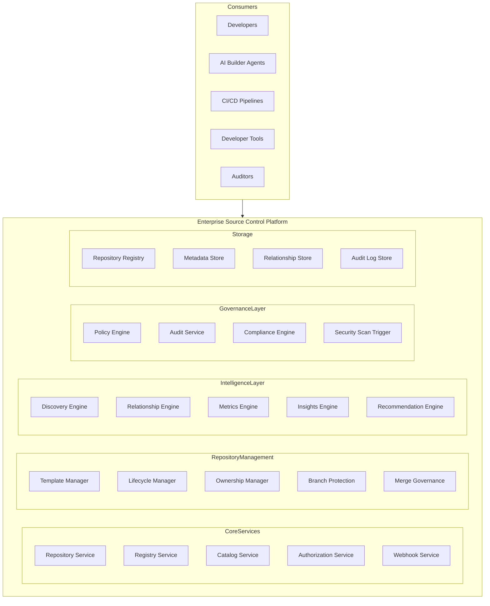
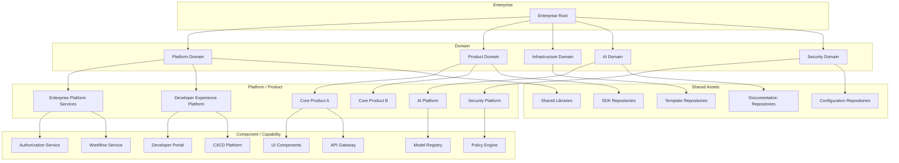
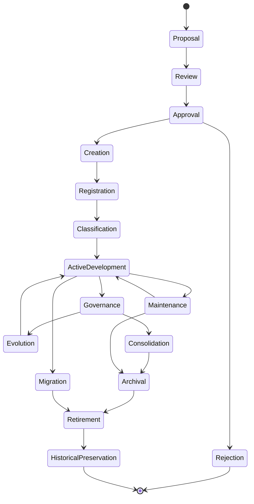
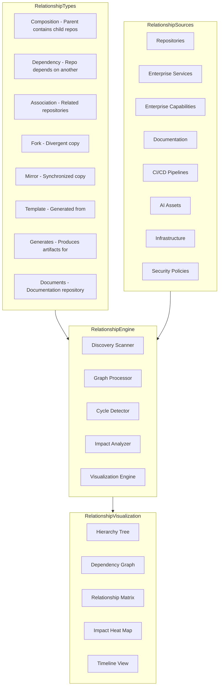
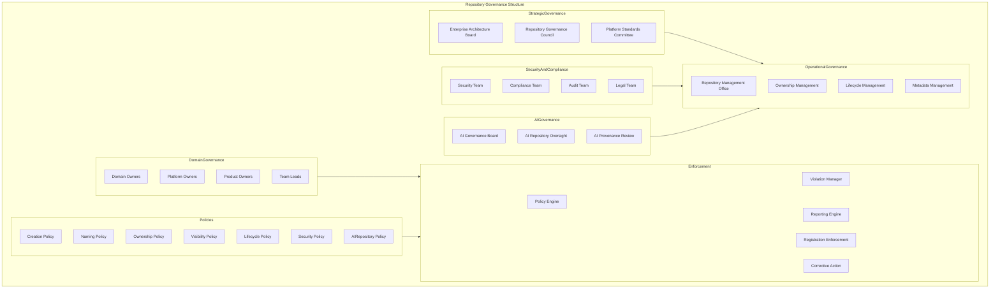
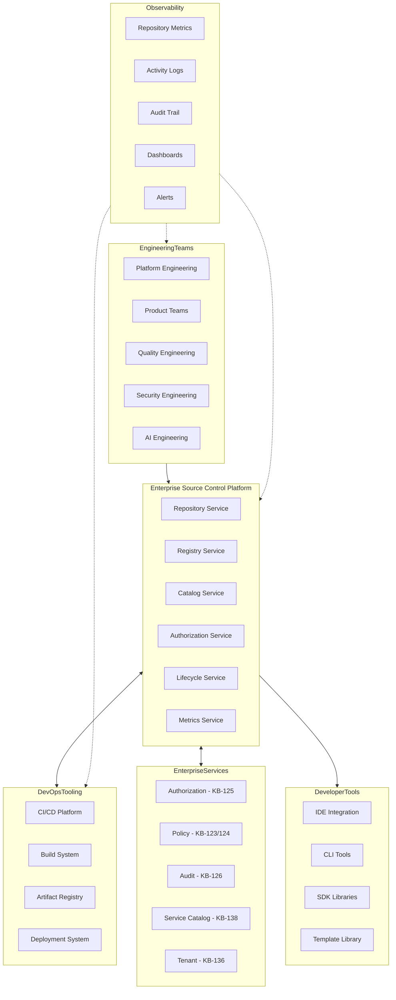
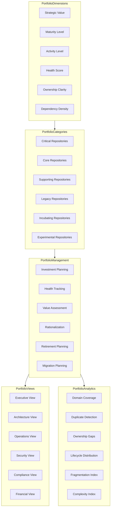

# KB-143 — Source Control & Repository Architecture

---

## Metadata

- **Document ID:** KB-143
- **Title:** Source Control & Repository Architecture
- **Suite:** Developer Experience (DX) & Engineering Platform Architecture
- **Version:** 1.0
- **Status:** Approved Architecture
- **Classification:** Enterprise Engineering Governance Architecture
- **Date:** 2026-07-12

---

## Executive Summary

The Enterprise Source Control Platform provides centralized governance for every engineering repository across the DUKADESK ecosystem, ensuring traceability, version integrity, collaboration, security, compliance, ownership, AI readiness, and long-term maintainability.

Repositories are treated as governed enterprise assets rather than isolated code storage locations. All engineering artifacts, from source code to AI assets, are organized, versioned, governed, secured, and managed through this canonical architecture.

---

## Purpose

Define how DUKADESK consistently organizes, governs, secures, versions, and manages repositories while enabling enterprise-scale collaboration, automation, AI-assisted engineering, and software lifecycle governance.

---

## Scope

### In Scope

- Enterprise repository architecture
- Source control architecture
- Repository taxonomy
- Repository ownership
- Repository hierarchy
- Repository lifecycle
- Repository governance
- Repository metadata
- Repository discoverability
- Repository relationships
- Repository security
- Repository analytics
- Repository observability
- AI repository governance
- Engineering artifact governance

### Out of Scope

- Branching strategies
- CI/CD implementation
- Build systems
- Deployment implementation
- Code review implementation
- Repository platform implementation

These are covered by dedicated Knowledge Base documents including KB-144 through KB-148 within this suite.

---

## Architectural Principles

| # | Principle | Description |
|---|-----------|-------------|
| 1 | Repository as an Enterprise Asset | Every repository is a governed enterprise asset with defined ownership and lifecycle |
| 2 | Single Source of Truth | Each engineering artifact has one authoritative repository location |
| 3 | Version-First Architecture | All repository content is versioned with complete history |
| 4 | Governance by Default | Repository creation, organization, and lifecycle are governed by enterprise policies |
| 5 | Security by Design | Repository access enforces authorization at every level |
| 6 | Traceability by Design | All repository artifacts are traceable to requirements, changes, and decisions |
| 7 | Automation First | Repository operations are automated through platform capabilities |
| 8 | AI-Ready Repositories | Repository metadata and structure support AI reasoning and autonomous operations |
| 9 | Vendor Independence | No dependency on specific source control vendor implementations |
| 10 | Technology Neutrality | Repository architecture supports any technology stack without bias |
| 11 | Enterprise Scalability | Repository governance scales across all teams, products, and domains |
| 12 | Observability by Default | All repository operations emit metrics, events, and audit trails |

---

## Canonical Definitions

| Term | Definition |
|------|-----------|
| Repository | A governed container for version-controlled engineering artifacts |
| Source Control | The versioned management of changes to engineering artifacts |
| Repository Registry | The canonical inventory of all enterprise repositories |
| Repository Catalog | A searchable index of repositories with metadata and relationships |
| Repository Owner | The entity accountable for a repository's governance and lifecycle |
| Repository Metadata | Structured data describing repository properties, governance, and context |
| Repository Classification | The assignment of a repository to a category within the enterprise taxonomy |
| Repository Lifecycle | The governed state progression of a repository from proposal to retirement |
| Repository Governance | The policies, roles, and processes governing enterprise repositories |
| Engineering Artifact | Any file or asset stored within a repository |
| Repository Dependency | A relationship where one repository relies on content from another |
| Repository Portfolio | The complete collection of enterprise repositories |
| Repository Template | A standardized repository structure for consistent project initialization |
| Repository Policy | A rule governing repository creation, organization, access, or lifecycle |
| Repository Visibility | The access level of a repository: public, internal, or private |
| Repository Relationship | A defined connection between two or more repositories |
| Monorepository | A single repository containing multiple projects or components |
| Multi-Repository | A strategy using multiple repositories for independent components |
| Enterprise Repository | Any repository governed by the enterprise source control architecture |
| Repository Provenance | The documented history of a repository's creation, ownership, and evolution |

---

## Enterprise Source Control Platform

---

## Repository Taxonomy

```mermaid
graph TB
    RT[Repository Taxonomy] --> PLT[Platform Repositories]
    RT --> PRD[Product Repositories]
    RT --> LIB[Shared Libraries]
    RT --> INF[Infrastructure Repositories]
    RT --> CFG[Configuration Repositories]
    RT --> DOC[Documentation Repositories]
    RT --> AI[AI Asset Repositories]
    RT --> BLD[Builder Studio Repositories]
    RT --> MKT[Marketplace Repositories]
    RT --> SDK[SDK Repositories]
    RT --> INT[Integration Repositories]
    RT --> SEC[Security Repositories]
    RT --> OPS[Operational Repositories]
    RT --> FUT[Future Repository Domains]

    PLT --> EPS[Enterprise Platform Services]
    PLT --> DX[Developer Experience Platform]
    PLT --> OBS[Observability Platform]

    PRD --> CORE[Core Products]
    PRD --> MOD[Modules]
    PRD --> FEAT[Features]

    LIB --> STD[Standard Libraries]
    LIB --> UTIL[Utilities]
    LIB --> COMM[Common Components]

    INF --> TF[Terraform Configurations]
    INF --> K8S[Kubernetes Manifests]
    INF --> IMG[Container Images]

    CFG --> ENV[Environment Config]
    CFG --> APP[Application Config]
    CFG --> SECRET[Secret Definitions]

    AI --> MODEL[AI Model Repositories]
    AI --> PROMPT[Prompt Repositories]
    AI --> TRAIN[Training Data Repositories]
    AI --> EVAL[Evaluation Repositories]

    SDK --> CLIENT[Client SDKs]
    SDK --> API[API SDKs]
    SDK --> TEST[Test SDKs]

    SEC --> POL[Policy Repositories]
    SEC --> SCAN[Scan Configurations]
    SEC --> COMP[Compliance Definitions]
```

---

## Repository Hierarchy

---

## Repository Lifecycle

---

## Repository Metadata Model

```mermaid
graph TB
    subgraph MetadataCategories
        IDEN[Identification Metadata]
        OWN[Ownership Metadata]
        TAX[Taxonomy Metadata]
        LIF[Lifecycle Metadata]
        GOV[Governance Metadata]
        TECH[Technical Metadata]
        REL[Relationship Metadata]
        AI_READY[AI Readiness Metadata]
        COMP[Compliance Metadata]
    end

    subgraph Identification
        ID[Repository ID]
        NAME[Repository Name]
        DESC[Description]
        URL[Remote URL]
        CREATED[Created Date]
        LANG[Primary Language]
    end

    subgraph Ownership
        OWNER[Repository Owner]
        STEWARD[Repository Steward]
        DOMAIN[Business Domain]
        TEAM[Owning Team]
        CONTACT[Contact Information]
    end

    subgraph Taxonomy
        TYPE[Repository Type]
        CATEGORY[Taxonomy Category]
        VISIBILITY[Public/Internal/Private]
        ARCHIVE[Archived Flag]
    end

    subgraph Lifecycle
        STATE[Current State]
        PHASE[Lifecycle Phase]
        CREATED2[Creation Date]
        LAST_ACTIVE[Last Active Date]
        ARCHIVE_DATE[Archival Date]
    end

    subgraph Governance
        POLICIES[Applied Policies]
        BRANCH_PROT[Branch Protection]
        REVIEW_REQ[Review Requirements]
        APPROVAL_COUNT[Required Approvals]
    end

    subgraph Technical
        SIZE[Repository Size]
        BRANCH_COUNT[Branch Count]
        CONTRIBUTORS[Contributor Count]
        COMMIT_COUNT[Commit Count]
        PACKAGES[Published Packages]
    end

    subgraph Relationships
        PARENT[Parent Repository]
        CHILDREN[Child Repositories]
        DEPENDS[Depends On]
        DEPENDED_BY[Depended By]
        RELATED[Related Repositories]
    end

    MetadataCategories --> Identification
    MetadataCategories --> Ownership
    MetadataCategories --> Taxonomy
    MetadataCategories --> Lifecycle
    MetadataCategories --> Governance
    MetadataCategories --> Technical
    MetadataCategories --> Relationships
    MetadataCategories --> AI_READY
    MetadataCategories --> COMP
```

---

## Repository Relationship Architecture

---

## Repository Governance Structure

---

## Enterprise Source Control Operating Model

---

## Repository Portfolio Architecture

---

## Enterprise Repository Reference Model

```mermaid
graph TB
    subgraph ReferenceModel[Enterprise Repository Reference Model]

        subgraph RepositoryDomains
            RD1[Platform Repositories</br>Core platform services,</br>shared infrastructure]
            RD2[Product Repositories</br>Customer-facing products,</br>application modules]
            RD3[AI Repositories</br>Models, prompts, training</br>data, evaluations]
            RD4[Infrastructure Repositories</br>Infrastructure as code,</br>environment configs]
            RD5[Shared Libraries</br>Reusable code, SDKs,</br>common components]
            RD6[Security Repositories</br>Policies, compliance,</br>scan configurations]
            RD7[Documentation Repositories</br>Technical docs, guides,</br>architecture records]
            RD8[Operational Repositories</br>Runbooks, monitoring,</br>incident management]
        end

        subgraph GovernanceStandards
            GS1[Naming Conventions]
            GS2[Ownership Requirements]
            GS3[Branch Protection Rules]
            GS4[Visibility Classification]
            GS5[Lifecycle Enforcement]
            GS6[Metadata Completeness]
            GS7[Security Scanning]
        end

        subgraph IntegrationPatterns
            IP1[Webhook - Event Notifications]
            IP2[API - Programmatic Access]
            IP3[CLI - Command Line Operations]
            IP4[IDE - Editor Integration]
            IP5[CI/CD - Pipeline Triggers]
        end

        subgraph QualityAttributes
            QA1[Single Source of Truth]
            QA2[Complete History]
            QA3[Accessible & Discoverable]
            QA4[Policies Enforced]
            QA5[AIAssisted Engineering Ready]
            QA6[Audited & Compliant]
        end
    end

    RepositoryDomains --> GovernanceStandards
    GovernanceStandards --> IntegrationPatterns
    IntegrationPatterns --> QualityAttributes
```

---

## Governance

| Domain | Governance Focus |
|--------|-----------------|
| Repository Ownership | Every repository has a designated owner accountable for its governance and lifecycle |
| Metadata Governance | Repository metadata schemas are defined, versioned, and enforced enterprise-wide |
| Security Governance | Repository access and operations are governed by the Authorization Architecture |
| Compliance Governance | Repository content complies with regulatory requirements and license policies |
| AI Governance | AI asset repositories follow AI governance board oversight and provenance standards |
| Lifecycle Governance | All repositories follow the governed lifecycle; state transitions require authorization |
| Architecture Governance | Repository structure and organization comply with enterprise architecture standards |
| Engineering Governance | Repository standards, templates, and policies are enforced across all teams |
| Documentation Governance | Documentation repositories follow content standards and lifecycle governance |
| Enterprise Governance | The Enterprise Architecture board governs repository platform evolution and standards |

### Governance Enforcement Points

| Enforcement Point | Mechanism |
|-------------------|-----------|
| Repository Creation | Naming validation, ownership assignment, template enforcement, classification requirement |
| Repository Registration | Metadata validation, registry entry creation, policy binding |
| Repository Access | Authorization check, visibility enforcement, branch protection |
| Repository Archival | Data retention verification, metadata freeze, owner notification |
| Repository Retirement | Migration plan validation, consumer notification, historical preservation |
| Repository Audit | Periodic compliance scanning, ownership verification, metadata completeness check |

---

## Responsibilities

| Role | Responsibilities |
|------|-----------------|
| Enterprise Architecture Board | Governs repository architecture, standards, and platform evolution |
| Platform Engineering | Develops, operates, and maintains the Enterprise Source Control Platform |
| Developer Experience Team | Defines repository templates, standards, and workflows; champions developer productivity |
| Repository Owners | Manage specific repository lifecycle, metadata, governance, and access |
| Product Engineering | Follows repository standards; maintains repository metadata; ensures governance compliance |
| Security | Defines repository security policies; audits repository access; enforces security scanning |
| Compliance | Defines repository compliance requirements; audits license and regulatory compliance |
| AI Governance Board | Governs AI asset repositories; approves AI provenance and transparency standards |
| Quality Engineering | Defines repository quality standards; monitors metadata completeness |
| Operations | Manages repository platform operations, availability, and performance |

---

## Security

| Security Control | Description |
|------------------|-------------|
| Repository Authorization | Read, write, administer permissions per repository with role-based access |
| Identity-Aware Access | All repository access is authenticated and identity-aware |
| Least Privilege | Repository permissions follow least privilege; elevated access requires approval |
| Zero Trust | All repository operations authenticated and authorized regardless of network origin |
| Repository Integrity | Cryptographic verification of repository content and history |
| Policy Enforcement | Repository policies enforced through automated platform gates |
| Auditability | All repository operations recorded in immutable audit log |
| Provenance | Full provenance tracking from repository creation through retirement |
| Secure Collaboration | Cross-repository access follows governed authorization paths |
| Supply Chain Trust | Repository content integrity verified through signed commits and tags |

### Security Zones

| Zone | Description |
|------|-------------|
| Public | Public repositories accessible without authentication |
| Internal | Internal repositories accessible to authenticated developers |
| Confidential | Confidential repositories with role-based access restrictions |
| Restricted | Highly sensitive repositories requiring explicit approval |
| AI | AI asset repositories with provenance and governance controls |
| Security | Security policy repositories with elevated access controls |

---

## Privacy

| Privacy Control | Description |
|----------------|-------------|
| Sensitive Repositories | Repositories containing sensitive information are classified and access-restricted |
| Intellectual Property Protection | Source code and proprietary assets are protected through repository classification |
| Regulatory Compliance | Repository data handling complies with GDPR, CCPA, and regional regulations |
| Data Minimization | Only required repository metadata is collected and processed |
| Cross-Border Governance | Repository data respects data residency requirements |
| Retention Governance | Repository content is retained per policy and purged when expired |
| Privacy Assurance | Regular privacy reviews for repository platform capabilities |
| Confidential Engineering Assets | Pre-release code and designs stored in confidential repositories |

---

## Performance

| Consideration | Requirement |
|---------------|-------------|
| Enterprise-Scale Repository Portfolios | Support for thousands of repositories across all domains |
| High-Volume Engineering Collaboration | Thousands of concurrent clones, pushes, and pulls globally |
| Elastic Scalability | Repository services scale horizontally with demand |
| High Availability | 99.99% uptime for core repository services |
| Operational Resilience | Graceful degradation under load with replication failover |
| Efficient Repository Discovery | Repository catalog queries return within milliseconds |
| Multi-Region Readiness | Repository services operate across global regions |
| Repository Optimization | Clone and fetch operations optimized for speed |

### Performance Optimization

| Optimization | Description |
|--------------|-------------|
| Shallow Clones | Fetch only recent history for CI/CD and ephemeral environments |
| Partial Clones | Fetch only required directory paths for large repositories |
| Repository Caching | Frequently accessed repository data cached at edge locations |
| Bundle Downloads | Packed repository bundles for efficient initial clones |
| Write Optimization | Optimized push paths with asynchronous replication |
| Read Replicas | Read-only repository replicas for distributed teams |

---

## Observability

| Observable Dimension | Metrics | Purpose |
|---------------------|---------|---------|
| Repository Health | Active repositories, lifecycle distribution, health scores | Monitoring repository portfolio health |
| Repository Activity | Commit frequency, contributor count, branch activity | Understanding repository engagement |
| Governance Dashboards | Policy violations, ownership gaps, metadata completeness | Monitoring repository governance |
| Portfolio Analytics | Domain coverage, duplicate detection, fragmentation index | Portfolio optimization insights |
| Operational Reporting | Daily repository activity, storage growth, team distribution | Operational repository management |
| Executive Reporting | Portfolio health, migration progress, rationalization candidates | Strategic repository intelligence |
| Repository Growth | Repository creation rate, size trends, fork count | Tracking portfolio expansion |
| Engineering Insights | Cross-repository patterns, dependency clusters, collaboration networks | Identifying engineering improvements |
| Compliance Monitoring | License compliance, security scan coverage, audit findings | Ensuring regulatory adherence |
| Repository Intelligence | Repository quality scores, contribution trends, optimization recommendations | Enterprise repository analysis |

### Observability Events

| Event Type | Trigger | Consumer |
|------------|---------|----------|
| RepositoryCreated | New repository registered | Catalog service, governance dashboard |
| RepositoryArchived | Repository moved to archival | Lifecycle service, notification service |
| RepositoryRetired | Repository permanently retired | Registry service, audit service |
| OwnershipChanged | Repository owner updated | Governance dashboard, notification service |
| SecurityViolation | Repository security policy breached | Security team, violation manager |
| ComplianceViolation | Repository compliance issue detected | Compliance team, governance dashboard |
| MetadataUpdated | Repository metadata modified | Catalog service, relationship engine |
| GovernanceViolation | Repository governance policy breached | Governance dashboard, violation manager |

---

## Failure Scenarios

| # | Scenario | Architectural Response |
|---|----------|----------------------|
| 1 | Duplicate Repositories | Deduplication engine with name and purpose hashing; registry uniqueness enforcement |
| 2 | Repository Ownership Loss | Ownership validation at registration; automated escalation for unowned repositories |
| 3 | Metadata Inconsistencies | Metadata validation schema; consistency checks with automated remediation |
| 4 | Governance Bypass | Policy enforcement point blocks violating operation; violation recorded with audit trail |
| 5 | Unauthorized Access | Authorization enforced at every repository operation; violation logged with alert |
| 6 | Repository Fragmentation | Fragmentation detection with consolidation recommendations; domain reconciliation |
| 7 | Broken Repository Relationships | Relationship graph integrity checks; automated repair with notification |
| 8 | Portfolio Drift | Portfolio reconciliation service; drift detection with corrective recommendations |
| 9 | Recovery Failures | Journal-based recovery with replay capability; cross-service consistency verification |
| 10 | Security Violations | Security policy violation triggers automated containment; security team escalation |
| 11 | Compliance Failures | Compliance violation blocks repository operations; compliance team notification |
| 12 | Repository Abandonment | Abandonment detection with automated owner notification; escalation to domain owner |

---

## Anti-Patterns

| # | Anti-Pattern | Description | Prohibited Because |
|---|-------------|-------------|-------------------|
| 1 | Personal Repositories for Enterprise Code | Enterprise code stored in personal or ungoverned repositories | Creates security risks, ownership ambiguity, governance gaps |
| 2 | Hidden Repositories | Repositories not registered in the enterprise repository registry | Prevents discovery, governance, and enterprise visibility |
| 3 | Duplicate Repositories | Same code or capability stored in multiple repositories | Creates inconsistency, reconciliation burden, version confusion |
| 4 | Missing Ownership | Repositories without clearly defined owners | Prevents accountability, lifecycle management, and governance |
| 5 | Repository Creation Outside Governance | Repositories created without policy enforcement | Bypasses naming, classification, security, and lifecycle standards |
| 6 | Hardcoded Repository Structures | Repository structures enforced through documentation instead of templates | Creates inconsistency, manual overhead, compliance gaps |
| 7 | Repository Silos | Repositories operating without cross-repository awareness | Prevents dependency visibility, reuse, and portfolio optimization |
| 8 | AI Assets Outside Governance | AI model and prompt repositories without provenance tracking | Breaks AI governance, transparency, and audit requirements |
| 9 | Metadata-Free Repositories | Repositories without complete metadata | Prevents discovery, governance enforcement, and AI reasoning |
| 10 | Independent Repository Standards | Teams defining custom repository structures outside enterprise standards | Creates fragmentation, increases cognitive load, reduces consistency |

---

## Future Evolution

| # | Evolution Path | Description |
|---|---------------|-------------|
| 1 | AI-Managed Repositories | AI agents that autonomously manage repository creation, organization, and governance |
| 2 | Semantic Repository Intelligence | ML-driven repository understanding based on code content and relationships |
| 3 | Autonomous Repository Governance | Self-governing repositories that apply policies based on content and metadata |
| 4 | Intelligent Engineering Knowledge Graphs | Knowledge graphs connecting repositories, services, capabilities, and documentation |
| 5 | Federated Repository Ecosystems | Repository federation across DUKADESK and partner ecosystems |
| 6 | Predictive Repository Optimization | ML-driven recommendation for repository consolidation, splitting, and cleanup |
| 7 | Cross-Platform Repository Federation | Federated repository management across different platforms and providers |
| 8 | Enterprise Engineering Intelligence | AI-driven insights into repository health, contribution patterns, and optimization |

---

## Cross References

| Document ID | Title | Relationship |
|-------------|-------|-------------|
| KB-141 | Developer Experience Platform Architecture | Foundational DX platform that hosts source control services |
| KB-142 | Software Development Lifecycle Architecture | Defines SDLC phases that consume source control capabilities |
| KB-144 | Branching & Release Strategy Architecture | Defines branching model applied to repositories |
| KB-145 | Build & Artifact Management Architecture | Defines build integration with repository content |
| KB-146 | CI/CD Pipeline Architecture | Defines CI/CD pipeline triggers from repository events |
| KB-147 | DevSecOps Architecture | Defines security scanning integrated with repository operations |
| KB-148 | Test Strategy & Quality Engineering Architecture | Defines test automation triggered by repository events |
| KB-149 | Development Environment Architecture | Defines development environments provisioned from repositories |
| KB-150 | API Development Standards Architecture | Defines API standards stored in API documentation repositories |
| KB-151 | SDK & Developer Toolkit Architecture | Defines SDK source code managed in repositories |
| KB-152 | Plugin & Extension Development Architecture | Defines plugin development repository structure |
| KB-153 | Developer Portal Architecture | Defines developer portal accessing repository catalog |
| KB-154 | Documentation Platform Architecture | Defines documentation repositories and content standards |
| KB-155 | Engineering Observability Architecture | Defines observability integrated with repository metrics |
| KB-156 | Engineering Metrics & Productivity Architecture | Defines metrics collected from repository activity |
| KB-157 | InnerSource & Code Reuse Architecture | Defines InnerSource practices enabled by repository discovery |
| KB-158 | Engineering Governance Architecture | Defines governance enforced on repository operations |
| KB-159 | AI-Assisted Software Engineering Architecture | Defines AI capabilities consuming repository content |
| KB-160 | Developer Experience Reference Architecture | Comprehensive reference for the DX suite |

---

## Critical DUKADESK Architectural Rule

**All engineering repositories within DUKADESK shall be governed exclusively through the canonical Enterprise Source Control & Repository Architecture. No application, Builder Studio module, Marketplace extension, AI Builder Agent, engineering team, platform service, or operational domain shall establish independent repository governance, organization, lifecycle, or ownership models outside the enterprise architecture, ensuring consistent traceability, security, compliance, discoverability, AI readiness, and long-term engineering sustainability.**
