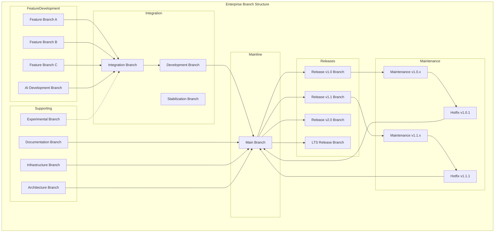
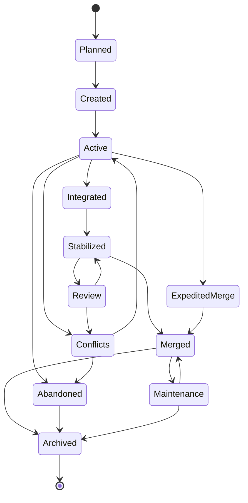
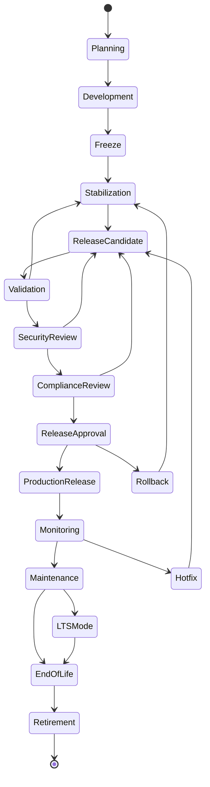
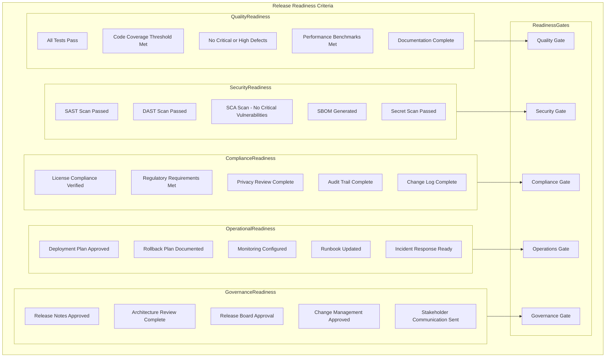
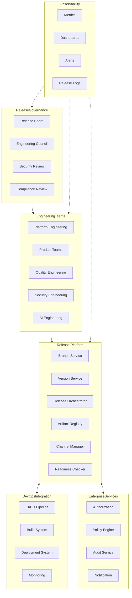
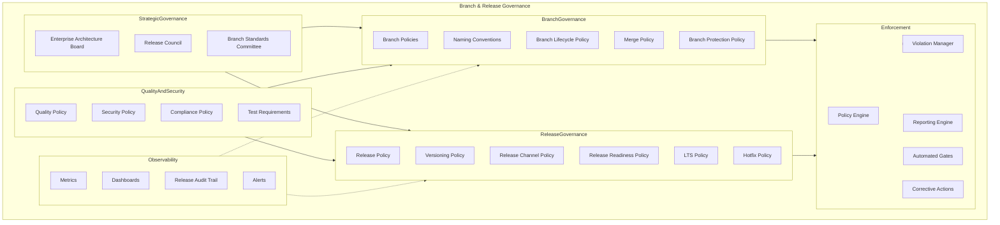
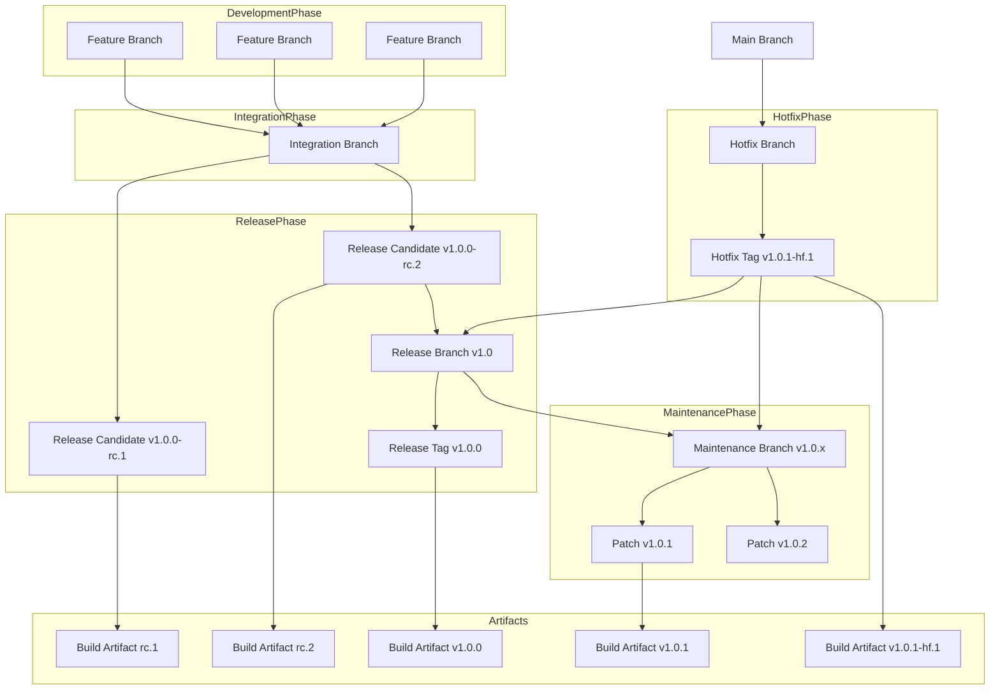

# KB-144 — Branching & Release Strategy Architecture

---

## Metadata

- **Document ID:** KB-144
- **Title:** Branching & Release Strategy Architecture
- **Suite:** Developer Experience (DX) & Engineering Platform Architecture
- **Version:** 1.0
- **Status:** Approved Architecture
- **Classification:** Enterprise Software Delivery Architecture
- **Date:** 2026-07-12

---

## Executive Summary

The Enterprise Branching & Release Strategy Architecture provides standardized governance for software evolution across the DUKADESK ecosystem, ensuring consistent development workflows, controlled integration, release integrity, version governance, traceability, quality assurance, rollback readiness, and long-term product maintainability.

The strategy is independent of specific source control technologies while supporting continuous delivery, AI-assisted engineering, enterprise governance, and multi-team collaboration across all engineering domains.

---

## Purpose

Define how DUKADESK standardizes branching models, release governance, version evolution, maintenance strategies, and release lifecycle management across every engineering domain.

---

## Scope

### In Scope

- Enterprise branching architecture
- Branch taxonomy
- Branch lifecycle
- Release architecture
- Release taxonomy
- Version governance
- Release lifecycle
- Release channels
- Integration governance
- Merge governance
- Hotfix governance
- Patch governance
- Long-term support strategy
- Release observability
- Release governance
- AI-assisted release planning

### Out of Scope

- Source control implementation
- CI/CD implementation
- Deployment implementation
- Build implementation
- Repository implementation
- Version control tooling implementation

These are covered by dedicated Knowledge Base documents including KB-143, KB-145, and KB-146 within this suite.

---

## Architectural Principles

| # | Principle | Description |
|---|-----------|-------------|
| 1 | Release Integrity | Every release is immutable, versioned, and cryptographically verifiable |
| 2 | Controlled Software Evolution | Software evolves through governed branches with defined lifecycle and policies |
| 3 | Branches as Governed Assets | Branches are governed enterprise assets with ownership and lifecycle |
| 4 | Continuous Integration Readiness | Branching model supports frequent integration and continuous validation |
| 5 | Predictable Releases | Releases follow a predictable cadence with defined readiness criteria |
| 6 | Automation First | Branch and release operations are automated through platform capabilities |
| 7 | Traceability by Default | All branches, merges, and releases are traceable to requirements and changes |
| 8 | Secure Software Delivery | Branch and release operations enforce security policies at every stage |
| 9 | AI-Assisted Engineering | AI capabilities augment branch management and release planning |
| 10 | Vendor Independence | The architecture is independent of specific source control vendors |
| 11 | Technology Neutrality | Supports any technology stack without bias |
| 12 | Enterprise Scalability | Scales across all teams, products, domains, and methodologies |
| 13 | Observability by Default | All branch and release operations emit metrics, events, and audit trails |

---

## Canonical Definitions

| Term | Definition |
|------|-----------|
| Branch | A parallel version of repository content used for development, integration, or release |
| Branch Strategy | The governed approach to creating, managing, and merging branches |
| Branch Lifecycle | The state progression of a branch from creation through archival |
| Release | A versioned software artifact approved for distribution or deployment |
| Release Train | A cadence-based release schedule coordinating multiple products or components |
| Release Candidate | A versioned artifact undergoing validation before release approval |
| Release Channel | A distribution pathway targeting specific environments, audiences, or purposes |
| Version | A semantic identifier denoting the state of software at a point in time |
| Semantic Version | A version format of major.minor.patch with pre-release and build metadata |
| Integration Branch | A branch where features are combined for validation |
| Maintenance Branch | A branch supporting past releases with patches and hotfixes |
| Feature Branch | A short-lived branch for developing a specific feature or change |
| Hotfix | An expedited change addressing a critical production issue |
| Patch | A maintenance update containing bug fixes or minor improvements |
| Long-Term Support (LTS) | A release with extended maintenance and support duration |
| Merge Strategy | The governed approach to combining changes from different branches |
| Release Governance | The policies, gates, and approvals governing release progression |
| Deployment Readiness | The state of a release meeting all criteria for production deployment |
| Software Baseline | A snapshot of software at a defined point, used as a reference |
| Enterprise Release | A release governed by the enterprise release architecture |

---

## Enterprise Branching Architecture

---

## Branch Taxonomy

```mermaid
graph TB
    BT[Branch Taxonomy] --> MAIN2[Main Branch]
    BT --> INTEG2[Integration Branches]
    BT --> FEAT[Feature Branches]
    BT --> REL[Release Branches]
    BT --> MAINT[Maintenance Branches]
    BT --> HOT[Hotfix Branches]
    BT --> EXP2[Experimental Branches]
    BT --> AI_DEV[AI Development Branches]
    BT --> INFRA[Infrastructure Branches]
    BT --> DOC2[Documentation Branches]
    BT --> FUT2[Future Branch Categories]

    MAIN2 --> TRUNK[Trunk - Primary Development Line]

    INTEG2 --> DEV2[Development Integration]
    INTEG2 --> STAB2[Stabilization Integration]
    INTEG2 --> CROSS[Cross-Component Integration]

    FEAT --> STD_F[Standard Feature]
    FEAT --> SPIKE[Technical Spike]
    FEAT --> BUG[Bug Fix]
    FEAT --> IMPROVE[Improvement]

    REL --> STD_REL[Standard Release]
    REL --> LTS2[LTS Release]
    REL --> PREVIEW[Preview Release]

    MAINT --> PATCH[Patch Maintenance]
    MAINT --> SEC_UPD[Security Update]
    MAINT --> LTS_MAINT[LTS Maintenance]

    HOT --> CRIT[Critical Hotfix]
    HOT --> URGENT[Urgent Security Fix]
    HOT --> BLKR[Blocker Resolution]

    AI_DEV --> AI_TRN[AI Model Training]
    AI_DEV --> AI_PROMPT[Prompt Development]
    AI_DEV --> AI_EVAL[AI Evaluation]
```

---

## Branch Lifecycle

---

## Enterprise Release Lifecycle

---

## Version Governance Model

```mermaid
graph TB
    subgraph Versioning[Semantic Versioning Model]

        subgraph VersionComponents
            MAJOR[Major - Breaking Changes]
            MINOR[Minor - New Features]
            PATCH[Patch - Bug Fixes]
            PRE_REL[Pre-Release - Alpha, Beta, RC]
            BUILD[Build Metadata]
        end

        subgraph VersionRules
            BREAKING[Breaking change increments MAJOR]
            FEATURE[New feature increments MINOR]
            FIX[Backward-compatible fix increments PATCH]
            RESET[MINOR resets to 0 on MAJOR change]
            PATCH_RESET[PATCH resets to 0 on MINOR change]
        end

        subgraph VersionStates
            DEV_STATE[Development - 0.x or pre-release]
            ALPHA[Alpha - Early testing]
            BETA[Beta - Feature complete]
            RC[Release Candidate - Final validation]
            STABLE[Stable - Production release]
            LTS_V[LTS - Long-term support]
            EOL[End of Life - No further releases]
        end

        subgraph VersionMetadata
            COMMIT[Git Commit SHA]
            DATE[Build Date]
            TIMESTAMP[Build Timestamp]
            PROFILE[Build Profile]
            CI_BUILD[CI Build Number]
            SIGNATURE[Release Signature]
        end

        subgraph VersionBoundaries
            API_COMP[API Compatibility Boundary]
            DEP_COMP[Binary Compatibility Boundary]
            DATA_COMP[Data Compatibility Boundary]
        end
    end

    VersionComponents --> VersionRules
    VersionRules --> VersionStates
    VersionStates --> VersionMetadata
    VersionMetadata --> VersionBoundaries
```

---

## Release Readiness Architecture

---

## Enterprise Release Operating Model

---

## Branch & Release Governance Architecture

---

## Branch & Release Relationship Model

---

## Enterprise Release Reference Architecture

```mermaid
graph TB
    subgraph ReferenceModel[Enterprise Release Reference Model]

        subgraph ReleaseDomains
            RD1[Major Releases</br>New major versions with</br>breaking changes]
            RD2[Minor Releases</br>New features,</br>backward compatible]
            RD3[Patch Releases</br>Bug fixes, security</br>updates]
            RD4[Hotfix Releases</br>Critical production</br>issue fixes]
            RD5[LTS Releases</br>Extended support</br>and maintenance]
            RD6[Preview Releases</br>Alpha, Beta, RC</br>for validation]
            RD7[Internal Releases</br>Development and</br>testing releases]
            RD8[Emergency Releases</br>Urgent security or</br>stability fixes]
        end

        subgraph ReleaseChannels
            CH1[Nightly - Daily builds]
            CH2[Dev - Development environment]
            CH3[Test - Testing environment]
            CH4[Staging - Pre-production]
            CH5[Beta - External preview]
            CH6[Stable - Production releases]
            CH7[LTS Channel - Long-term support]
        end

        subgraph ReleasePolicies
            RP1[Version Bumping Rules]
            RP2[Release Cadence]
            RP3[Approval Requirements]
            RP4[Rollback Procedures]
            RP5[Notification Requirements]
            RP6[Documentation Requirements]
        end

        subgraph QualityAttributes
            QA1[Immutable Releases]
            QA2[Traceable Artifacts]
            QA3[Verifiable Integrity]
            QA4[Automated Validation]
            QA5[Governance Enforced]
            QA6[Rollback Ready]
        end
    end

    ReleaseDomains --> ReleaseChannels
    ReleaseChannels --> ReleasePolicies
    ReleasePolicies --> QualityAttributes
```

---

## Governance

| Domain | Governance Focus |
|--------|-----------------|
| Branch Governance | Branches follow defined naming, lifecycle, protection, and merge policies |
| Release Governance | Releases follow defined lifecycle, readiness criteria, and approval gates |
| Version Governance | Versions follow semantic versioning rules with compatibility boundaries |
| Quality Governance | Release readiness requires passing all quality gates |
| Security Governance | Release readiness requires passing all security gates |
| Compliance Governance | Release readiness requires passing all compliance gates |
| AI Governance | AI-assisted branch and release operations follow governance policies |
| Architecture Governance | Branch and release structures comply with enterprise architecture standards |
| Change Governance | All branches and releases follow the governed change management process |
| Enterprise Governance | The Enterprise Architecture board governs branching and release strategy evolution |

### Branch Protection Policies

| Policy | Description |
|--------|-------------|
| Main Branch Protection | Direct commits prohibited; requires pull request with approvals and passing checks |
| Release Branch Protection | Restricted write access; requires release board approval for changes |
| Maintenance Branch Protection | Restricted write access; requires change approval |
| Hotfix Branch Protection | Requires security review and emergency approval |
| Feature Branch Policy | Short-lived; must be based on main or integration branch |

### Release Readiness Gates

| Gate | Criteria |
|------|----------|
| Quality Gate | All tests pass, coverage threshold met, no critical defects |
| Security Gate | SAST/DAST/SCA passed, SBOM generated, secrets scanned |
| Compliance Gate | License compliance, regulatory requirements, privacy review |
| Operations Gate | Deployment plan, rollback plan, monitoring configured |
| Governance Gate | Release notes, architecture review, release board approval |

---

## Responsibilities

| Role | Responsibilities |
|------|-----------------|
| Enterprise Architecture Board | Governs branching and release architecture, standards, and evolution |
| Engineering Leadership | Ensures branching and release compliance; drives release strategy improvements |
| Platform Engineering | Develops and operates branching and release automation services |
| Release Management | Governs release lifecycle, release board, and release readiness gates |
| Product Teams | Follows branching strategy; prepares releases; meets readiness criteria |
| Developer Experience Team | Defines branching and release tooling; champions developer workflows |
| Security | Defines security readiness criteria; operates security gates |
| Compliance | Defines compliance readiness criteria; operates compliance gates |
| Quality Engineering | Defines quality readiness criteria; operates quality gates |
| Operations | Defines operational readiness criteria; validates deployment readiness |
| AI Governance Board | Governs AI-assisted branching and release operations |

---

## Security

| Security Control | Description |
|------------------|-------------|
| Secure Branch Management | Branch creation and protection enforce access control policies |
| Secure Release Governance | Release progression requires authorized approval at every gate |
| Least Privilege | Branch and release operations follow least privilege access |
| Zero Trust | All branch and release operations authenticated and authorized |
| Release Integrity | Release artifacts are cryptographically signed and verified |
| Software Provenance | Every release has a verifiable provenance chain from commit to artifact |
| Policy Enforcement | Branch and release policies enforced through automated gates |
| Auditability | All branch and release operations recorded in immutable audit log |
| Supply Chain Trust | Release dependencies verified for integrity and compliance |
| Release Authorization | Production releases require authorized approval with audit trail |

---

## Privacy

| Privacy Control | Description |
|----------------|-------------|
| Confidential Releases | Pre-release and sensitive release information is classified and access-restricted |
| Sensitive Engineering Information | Release metadata containing sensitive information is protected |
| Regulatory Compliance | Release data handling complies with GDPR, CCPA, and regional regulations |
| Data Minimization | Only required release metadata is collected and processed |
| Cross-Border Governance | Release data respects data residency requirements |
| Retention Governance | Release artifacts are retained per policy and purged when expired |
| Privacy Assurance | Regular privacy reviews for release platform capabilities |

---

## Performance

| Consideration | Requirement |
|---------------|-------------|
| Enterprise-Scale Release Operations | Platform supports thousands of releases across all products and domains |
| Parallel Development Streams | Multiple release trains operate concurrently without interference |
| High-Volume Engineering | Branch operations support thousands of developers globally |
| Elastic Scalability | Release platform services scale horizontally with demand |
| High Availability | 99.99% uptime for critical branch and release services |
| Operational Resilience | Graceful degradation under load with circuit breakers |
| Multi-Region Engineering | Branch and release operations available across global regions |
| Efficient Release Coordination | Release orchestration completes within defined timeframes |

---

## Observability

| Observable Dimension | Metrics | Purpose |
|---------------------|---------|---------|
| Branch Health | Active branches, branch age, merge frequency | Monitoring branch portfolio health |
| Release Health | Release frequency, success rate, rollback rate | Tracking release quality |
| Version Analytics | Version distribution, adoption rate, upgrade velocity | Understanding version evolution |
| Governance Dashboards | Gate pass/fail rates, policy violations, approval times | Monitoring release governance |
| Operational Reporting | Daily branch and release activity, team distribution | Operational release management |
| Executive Reporting | Release cadence, quality trends, delivery velocity | Strategic release intelligence |
| Release Quality Metrics | Defect escape rate, hotfix frequency, incident correlation | Measuring release quality |
| Release Cadence Analytics | Time between releases, release predictability | Tracking delivery rhythm |
| Engineering Insights | Branch patterns, merge conflict trends, release bottlenecks | Identifying engineering improvements |
| Enterprise Delivery Intelligence | Cross-team release patterns, dependency coordination, optimization | Enterprise delivery analysis |

### Observability Events

| Event Type | Trigger | Consumer |
|------------|---------|----------|
| BranchCreated | New branch created | Branch service, metrics store |
| BranchMerged | Branch merged to target | CI/CD pipeline, notification service |
| ReleaseCandidateCreated | Release candidate built | Validation pipeline, release board |
| ReleaseApproved | Release authorized for production | Deployment service, notification service |
| ReleaseDeployed | Release deployed to production | Monitoring service, metrics store |
| ReleaseRolledBack | Release reverted | Incident response, release board |
| HotfixInitiated | Emergency hotfix started | Security team, release board |
| GateFailed | Release readiness gate failed | Engineering team, governance dashboard |

---

## Failure Scenarios

| # | Scenario | Architectural Response |
|---|----------|----------------------|
| 1 | Merge Conflicts | Automated conflict detection with notification; guided conflict resolution workflow |
| 2 | Release Failures | Automated rollback to previous release; incident creation; release board notification |
| 3 | Version Conflicts | Version validation at release creation; conflict detection with resolution guidance |
| 4 | Hotfix Failures | Hotfix rolled back; incident escalated; root cause analysis initiated |
| 5 | Branch Divergence | Branch sync workflow; divergence detection with automated reconciliation |
| 6 | Governance Bypass | Policy enforcement point blocks unauthorized operation; violation recorded with audit |
| 7 | Unauthorized Releases | Authorization enforced at every release operation; violation logged with alert |
| 8 | Rollback Failures | Rollback retry with alternative strategy; manual escalation if automated rollback fails |
| 9 | Release Fragmentation | Release coordination service detects fragmentation; consolidation recommendations |
| 10 | Compliance Failures | Compliance violation blocks release; compliance team notification; remediation tracking |
| 11 | Recovery Failures | Journal-based release state recovery; cross-service consistency verification |
| 12 | Branch Abandonment | Abandonment detection with automated notification; branch lifecycle enforcement |

---

## Anti-Patterns

| # | Anti-Pattern | Description | Prohibited Because |
|---|-------------|-------------|-------------------|
| 1 | Uncontrolled Branching | Branches created without governance, naming standards, or lifecycle policies | Creates branch explosion, confusion, governance gaps |
| 2 | Direct Production Commits | Changes committed directly to main or production branches without review | Bypasses quality gates, security checks, audit trail |
| 3 | Long-Lived Unmanaged Branches | Branches existing for extended periods without integration | Increases merge complexity, integration risk, divergence |
| 4 | Releases Without Governance | Software released without passing readiness gates | Introduces production defects, security vulnerabilities |
| 5 | Versioning Inconsistencies | Version numbers applied inconsistently across releases | Breaks dependency resolution, compatibility tracking, communication |
| 6 | Branch Ownership Ambiguity | Branches without clearly defined owners or purpose | Prevents cleanup, lifecycle management, auditability |
| 7 | Manual Release Approvals Outside Governance | Releases approved through informal channels | Bypasses audit trail, readiness verification, governance |
| 8 | Independent Release Strategies | Teams defining custom release processes outside enterprise standards | Fragments release coordination, increases integration risk |
| 9 | Hotfixes Bypassing Governance | Emergency fixes applied without following governance process | Creates security gaps, quality risks, audit failures |
| 10 | Release Documentation Gaps | Releases without release notes, changelogs, or deployment plans | Reduces maintainability, complicates operations, creates knowledge loss |

---

## Future Evolution

| # | Evolution Path | Description |
|---|---------------|-------------|
| 1 | AI-Assisted Release Orchestration | AI agents that autonomously manage release planning, coordination, and execution |
| 2 | Autonomous Branch Governance | Self-governing branches that apply lifecycle and protection policies automatically |
| 3 | Predictive Release Intelligence | ML-driven prediction of release quality, risk, and rollback probability |
| 4 | Intelligent Merge Optimization | AI-assisted merge conflict resolution and integration optimization |
| 5 | Federated Engineering Ecosystems | Cross-enterprise release coordination across organizational boundaries |
| 6 | Adaptive Release Planning | Release plans that adapt based on engineering velocity and quality metrics |
| 7 | Enterprise Software Evolution Intelligence | AI-driven insights into software evolution patterns and optimization |
| 8 | Self-Governing Release Pipelines | Release pipelines that autonomously govern readiness and approval gates |

---

## Cross References

| Document ID | Title | Relationship |
|-------------|-------|-------------|
| KB-141 | Developer Experience Platform Architecture | Foundational DX platform that hosts branching and release services |
| KB-142 | Software Development Lifecycle Architecture | Defines SDLC phases that include branching and release stages |
| KB-143 | Source Control & Repository Architecture | Defines repository structure that branching operates within |
| KB-145 | Build & Artifact Management Architecture | Defines build artifacts produced from release branches |
| KB-146 | CI/CD Pipeline Architecture | Defines CI/CD automation that implements release pipelines |
| KB-147 | DevSecOps Architecture | Defines security integration within branch and release operations |
| KB-148 | Test Strategy & Quality Engineering Architecture | Defines test automation executed during release validation |
| KB-149 | Development Environment Architecture | Defines environments receiving releases through channels |
| KB-150 | API Development Standards Architecture | Defines API versioning aligned with release versioning |
| KB-151 | SDK & Developer Toolkit Architecture | Defines SDK versioning aligned with release strategy |
| KB-152 | Plugin & Extension Development Architecture | Defines plugin release lifecycle within enterprise strategy |
| KB-153 | Developer Portal Architecture | Defines developer portal displaying release information |
| KB-154 | Documentation Platform Architecture | Defines release documentation standards |
| KB-155 | Engineering Observability Architecture | Defines observability integrated with release metrics |
| KB-156 | Engineering Metrics & Productivity Architecture | Defines release-related engineering metrics |
| KB-157 | InnerSource & Code Reuse Architecture | Defines InnerSource branching practices |
| KB-158 | Engineering Governance Architecture | Defines governance enforced on branch and release operations |
| KB-159 | AI-Assisted Software Engineering Architecture | Defines AI capabilities for release planning and branch management |
| KB-160 | Developer Experience Reference Architecture | Comprehensive reference for the DX suite |

---

## Critical DUKADESK Architectural Rule

**All software branches, versions, and releases within DUKADESK shall be governed exclusively through the canonical Enterprise Branching & Release Strategy Architecture. No application, Builder Studio module, Marketplace extension, AI Builder Agent, engineering team, platform service, or operational domain shall establish independent branching models, release processes, or version governance outside the enterprise architecture, ensuring consistent software evolution, traceability, quality, security, compliance, rollback readiness, and enterprise-wide delivery integrity.**
