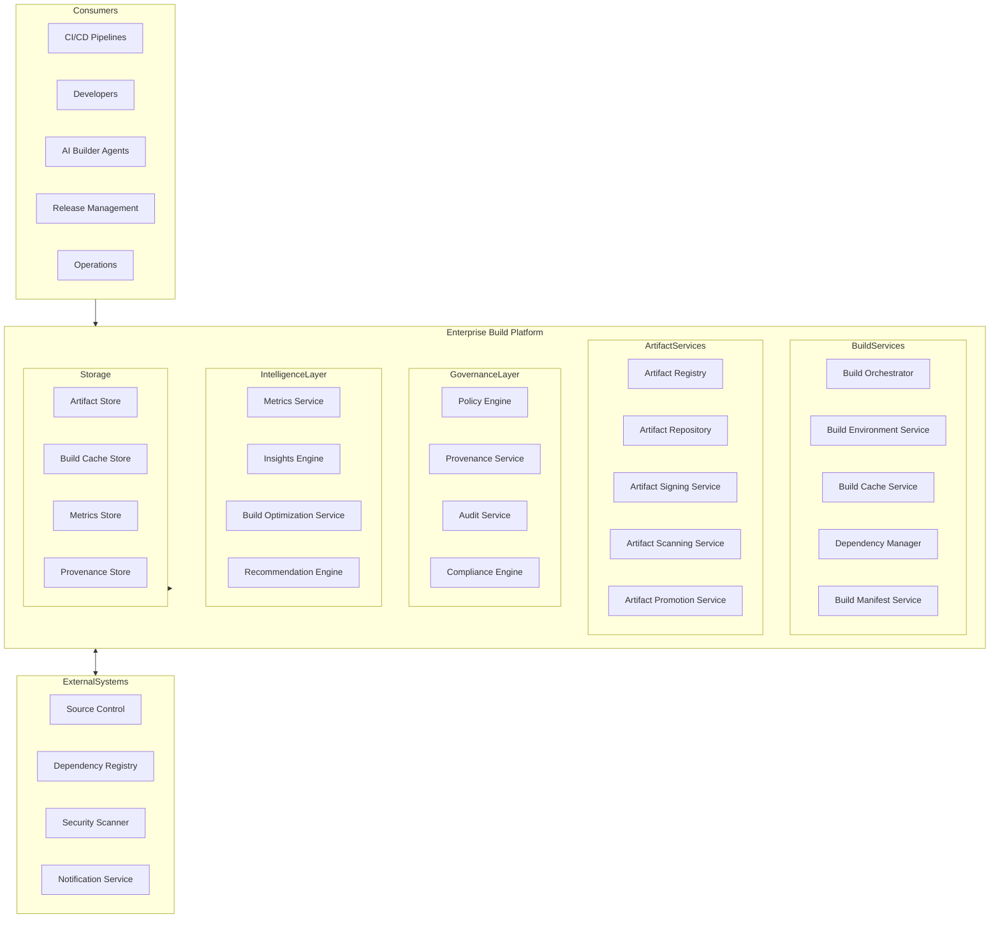
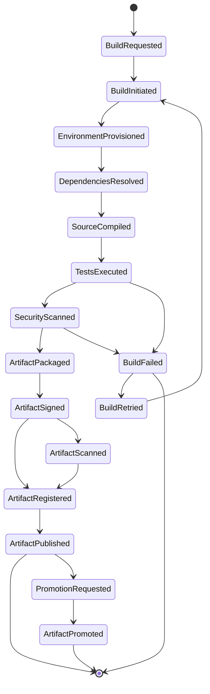
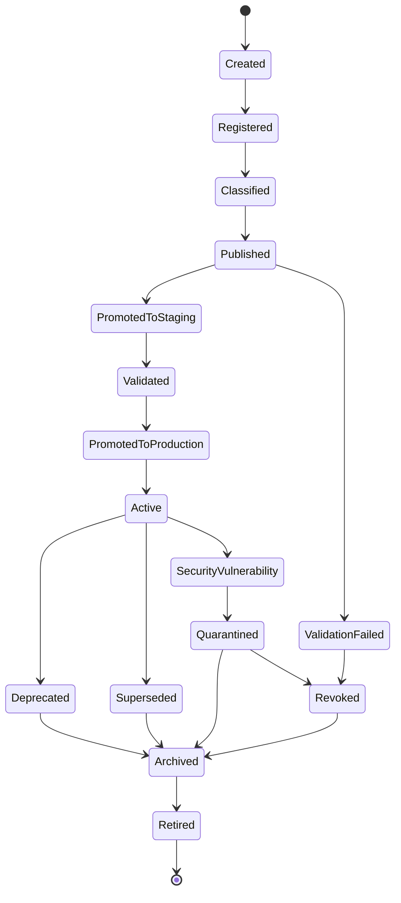
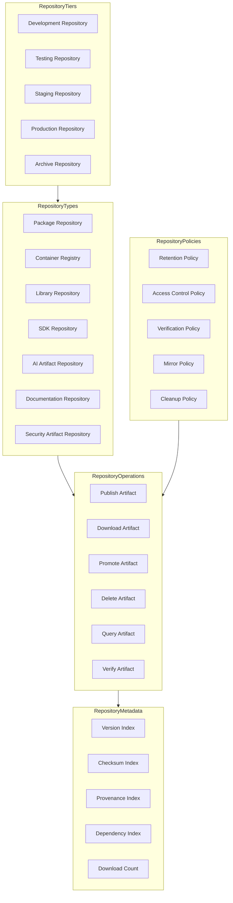
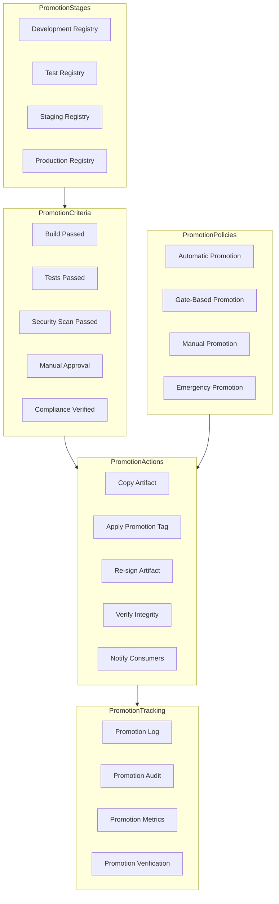
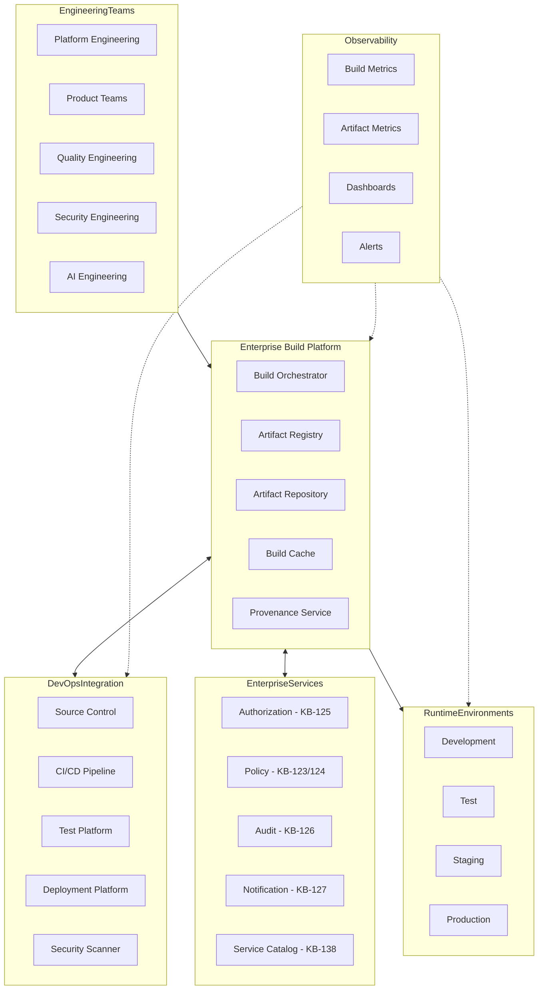
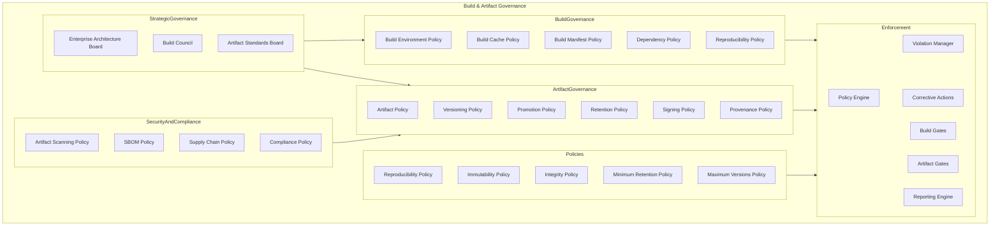
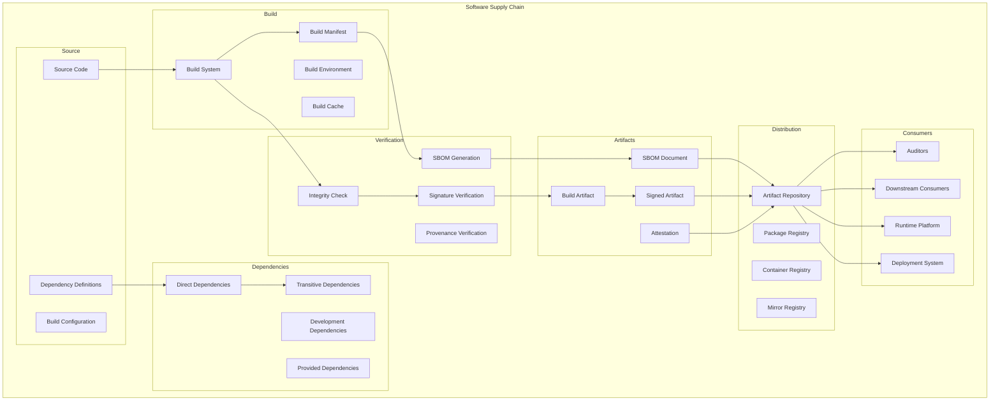

# KB-145 — Build & Artifact Management Architecture

---

## Metadata

- **Document ID:** KB-145
- **Title:** Build & Artifact Management Architecture
- **Suite:** Developer Experience (DX) & Engineering Platform Architecture
- **Version:** 1.0
- **Status:** Approved Architecture
- **Classification:** Enterprise Software Delivery Architecture
- **Date:** 2026-07-12

---

## Executive Summary

The Enterprise Build & Artifact Management Platform provides centralized governance for software build outputs and engineering artifacts across the DUKADESK ecosystem, ensuring reproducibility, traceability, integrity, security, version consistency, policy enforcement, and lifecycle management across every engineering domain.

Artifacts are treated as governed enterprise assets rather than transient build outputs. All build execution, artifact creation, storage, promotion, distribution, and retirement are governed by this canonical architecture.

---

## Purpose

Define how DUKADESK standardizes build orchestration and artifact lifecycle management while enabling secure software delivery, engineering automation, AI-assisted engineering, enterprise governance, and long-term artifact traceability.

---

## Scope

### In Scope

- Enterprise build architecture
- Build lifecycle
- Artifact taxonomy
- Artifact registry
- Artifact repository architecture
- Artifact metadata
- Artifact versioning
- Artifact promotion
- Artifact distribution
- Artifact provenance
- Artifact retention
- Artifact governance
- Artifact observability
- AI artifact governance
- Build intelligence

### Out of Scope

- CI/CD implementation
- Deployment implementation
- Container runtime implementation
- Repository implementation
- Infrastructure implementation
- Package manager implementation

These are covered by dedicated Knowledge Base documents including KB-146 (CI/CD Pipeline Architecture), KB-147 (DevSecOps Architecture), and KB-148 (Test Strategy & Quality Engineering Architecture) within this suite.

---

## Architectural Principles

| # | Principle | Description |
|---|-----------|-------------|
| 1 | Reproducible Builds | Builds produce identical outputs given identical inputs and environments |
| 2 | Immutable Artifacts | Published artifacts are never modified; changes produce new versions |
| 3 | Artifact as an Enterprise Asset | Every artifact is a governed enterprise asset with defined lifecycle |
| 4 | Build Once, Promote Many | Artifacts are built once and promoted through environments without modification |
| 5 | Traceability by Default | All artifacts are traceable to source code, build configuration, and environment |
| 6 | Secure Software Supply Chain | Artifacts are cryptographically signed and verified throughout their lifecycle |
| 7 | Automation First | Build and artifact operations are automated through platform capabilities |
| 8 | AI-Assisted Engineering | AI capabilities augment build optimization and artifact management |
| 9 | Vendor Independence | No dependency on specific build or artifact management vendor implementations |
| 10 | Technology Neutrality | The architecture supports any technology stack without bias |
| 11 | Enterprise Scalability | Build and artifact platform scales across all teams, products, and domains |
| 12 | Observability by Default | All build and artifact operations emit metrics, events, and audit trails |

---

## Canonical Definitions

| Term | Definition |
|------|-----------|
| Build | The automated process of transforming source code and dependencies into deployable artifacts |
| Build Pipeline | A defined sequence of build stages from source checkout to artifact publication |
| Build Artifact | A versioned, immutable output of a build process |
| Artifact Repository | A managed storage system for versioned artifacts |
| Artifact Registry | The canonical inventory of all enterprise artifacts |
| Artifact Catalog | A searchable index of artifacts with metadata and relationships |
| Artifact Metadata | Structured data describing artifact properties, provenance, and governance |
| Artifact Version | A semantic identifier denoting the artifact's release state |
| Artifact Promotion | The governed movement of an artifact between lifecycle stages |
| Artifact Provenance | The verifiable chain of artifact creation from source to binary |
| Artifact Integrity | Cryptographic assurance that an artifact has not been modified |
| Artifact Lifecycle | The governed state progression of an artifact from creation to retirement |
| Build Manifest | A declarative specification of build inputs, outputs, and configuration |
| Build Environment | A consistent, reproducible context for build execution |
| Software Package | A distributable unit of software containing code, dependencies, and metadata |
| Release Artifact | An artifact approved for deployment to production |
| Immutable Artifact | An artifact that cannot be modified after publication |
| Artifact Governance | The policies, roles, and processes governing enterprise artifacts |
| Enterprise Artifact | Any artifact governed by the enterprise build and artifact architecture |
| Build Provenance | The documented history of a build including inputs, environment, and outputs |

---

## Enterprise Build Platform Architecture

---

## Artifact Taxonomy

```mermaid
graph TB
    AT[Artifact Taxonomy] --> APP_PKG[Application Packages]
    AT --> LIB[Libraries]
    AT --> SDK[SDKs]
    AT --> CONT[Container Images]
    AT --> INFRA[Infrastructure Artifacts]
    AT --> CFG[Configuration Bundles]
    AT --> AI_MODEL[AI Models]
    AT --> AI_PROMPT[AI Prompts]
    AT --> DOC_PKG[Documentation Packages]
    AT --> BLD_ASSET[Builder Studio Assets]
    AT --> MKT_PKG[Marketplace Packages]
    AT --> DEP_PKG[Deployment Packages]
    AT --> SEC_ART[Security Artifacts]
    AT --> CMP_ART[Compliance Artifacts]
    AT --> FUT_ART[Future Artifact Domains]

    APP_PKG --> JAR[JAR/WAR Packages]
    APP_PKG --> NPM[NPM Packages]
    APP_PKG --> PYPI[Python Packages]
    APP_PKG --> BINARY[Native Binaries]

    LIB --> STDLIB[Standard Libraries]
    LIB --> FRAMEWORK[Frameworks]
    LIB --> UTIL[Utility Libraries]

    CONT --> APP_IMG[Application Images]
    CONT --> BASE_IMG[Base Images]
    CONT --> INFRA_IMG[Infrastructure Images]

    AI_MODEL --> PT_MODEL[Pre-trained Models]
    AI_MODEL --> FT_MODEL[Fine-tuned Models]
    AI_MODEL --> ENSEMBLE[Ensemble Models]

    INFRA --> TF_PKG[Terraform Packages]
    INFRA --> K8S_MAN[Kubernetes Manifests]
    INFRA --> HELM[Helm Charts]

    SEC_ART --> SBOM[SBOM Documents]
    SEC_ART --> SCAN_RPT[Scan Reports]
    SEC_ART --> SIG[Signed Attestations]
```

---

## Build Lifecycle

---

## Artifact Lifecycle

---

## Artifact Repository Architecture

---

## Artifact Promotion Architecture

---

## Enterprise Build Operating Model

---

## Build & Artifact Governance Architecture

---

## Software Supply Chain Architecture

---

## Enterprise Build & Artifact Reference Model

```mermaid
graph TB
    subgraph ReferenceModel[Enterprise Build & Artifact Reference Model]

        subgraph BuildDomains
            BD1[Application Builds</br>Services, APIs,</br>microservices]
            BD2[Library Builds</br>Shared libraries,</br>SDKs, frameworks]
            BD3[Container Builds</br>Application and</br>base images]
            BD4[Infrastructure Builds</br>Terraform, Helm,</br>Kubernetes]
            BD5[AI Artifact Builds</br>Models, prompts,</br>training outputs]
            BD6[Documentation Builds</br>Technical docs,</br>API references]
            BD7[Security Artifacts</br>SBOMs, scan reports,</br>attestations]
            BD8[Marketplace Builds</br>Extensions, plugins,</br>packages]
        end

        subgraph BuildStandards
            BS1[Reproducible Builds]
            BS2[Immutable Artifacts]
            BS3[Cryptographic Signing]
            BS4[Provenance Capture]
            BS5[SBOM Generation]
            BS6[Version Compliance]
            BS7[Policy Enforcement]
        end

        subgraph IntegrationPatterns
            IP1[CI/CD - Pipeline Integration]
            IP2[API - Artifact Management]
            IP3[CLI - Build Operations]
            IP4[Webhook - Build Events]
            IP5[IDE - Build Integration]
        end

        subgraph QualityAttributes
            QA1[Reproducible]
            QA2[Immutable]
            QA3[Verifiable]
            QA4[Traceable]
            QA5[Governed]
            QA6[Secure]
        end
    end

    BuildDomains --> BuildStandards
    BuildStandards --> IntegrationPatterns
    IntegrationPatterns --> QualityAttributes
```

---

## Governance

| Domain | Governance Focus |
|--------|-----------------|
| Build Governance | Builds follow defined environments, manifests, cache, and reproducibility policies |
| Artifact Governance | Artifacts follow defined lifecycle, promotion, retention, immutability, and integrity policies |
| Metadata Governance | Artifact metadata schemas are defined, versioned, and enforced enterprise-wide |
| Security Governance | Build environments and artifacts follow security scanning and supply chain policies |
| Compliance Governance | Artifact handling complies with regulatory requirements and license policies |
| AI Governance | AI artifacts follow provenance, versioning, and governance policies |
| Lifecycle Governance | All artifacts follow the governed lifecycle; state transitions require authorization |
| Version Governance | Artifact versions follow semantic versioning with compatibility boundaries |
| Quality Governance | Build outputs must pass quality gates before publication |
| Enterprise Governance | The Enterprise Architecture board governs build and artifact platform evolution |

### Governance Enforcement Points

| Enforcement Point | Mechanism |
|-------------------|-----------|
| Build Initiation | Build manifest validation, dependency policy check, environment approval |
| Artifact Publication | Integrity verification, signature requirement, SBOM completeness check |
| Artifact Promotion | Promotion criteria validation, gate approval, provenance verification |
| Artifact Archival | Retention policy enforcement, consumer notification, metadata freeze |
| Artifact Retirement | Migration plan validation, consumer notification, integrity verification |
| Supply Chain Verification | Dependency integrity check, license compliance, vulnerability scan |

---

## Responsibilities

| Role | Responsibilities |
|------|-----------------|
| Enterprise Architecture Board | Governs build and artifact architecture, standards, and platform evolution |
| Platform Engineering | Develops, operates, and maintains the Enterprise Build Platform |
| Developer Experience Team | Defines build templates, artifact standards, and developer workflows |
| Build Engineering | Operates build infrastructure, optimizes build performance, manages build environments |
| Product Teams | Follows build standards; produces governed artifacts; meets quality gates |
| Security | Defines build and artifact security policies; operates artifact scanning |
| Compliance | Defines artifact compliance requirements; audits license and regulatory compliance |
| AI Governance Board | Governs AI artifact standards; approves AI artifact provenance requirements |
| Release Management | Governs artifact promotion across lifecycle stages; approves production promotions |
| Operations | Manages artifact repository operations, availability, and retention |

---

## Security

| Security Control | Description |
|------------------|-------------|
| Secure Build Environments | Build environments are isolated, ephemeral, and destroyed after use |
| Artifact Integrity | All artifacts are cryptographically checksummed and verified |
| Artifact Signing | Release artifacts are digitally signed with enterprise signing keys |
| Software Provenance | Every artifact has a verifiable provenance chain from source to binary |
| Least Privilege | Build and artifact operations follow least privilege access |
| Zero Trust | All build and artifact operations authenticated and authorized |
| Policy Enforcement | Build and artifact policies enforced through automated gates |
| Auditability | All build and artifact operations recorded in immutable audit log |
| Supply Chain Security | Dependencies verified for integrity, license compliance, and vulnerabilities |
| Artifact Authorization | Artifact read, write, promote, and delete permissions governed by role |

### Security Zones

| Zone | Description |
|------|-------------|
| Development | Development repository with team-level access |
| Testing | Test repository with automated system access |
| Staging | Staging repository with release management access |
| Production | Production repository with restricted, audited access |
| Security | Security artifact repository with elevated controls |
| Archive | Archive repository with read-only access |

---

## Privacy

| Privacy Control | Description |
|----------------|-------------|
| Sensitive Build Metadata | Build metadata containing sensitive information is classified and restricted |
| Intellectual Property Protection | Artifacts containing proprietary code are access-restricted |
| Regulatory Compliance | Build and artifact data handling complies with GDPR, CCPA, and regional regulations |
| Data Minimization | Only required build and artifact metadata is collected and processed |
| Cross-Border Governance | Artifact data respects data residency requirements |
| Retention Governance | Artifacts are retained per policy and purged when expired |
| Privacy Assurance | Regular privacy reviews for build and artifact platform capabilities |

---

## Performance

| Consideration | Requirement |
|---------------|-------------|
| Enterprise-Scale Build Operations | Platform supports millions of builds across all products and domains |
| High-Volume Artifact Generation | Thousands of artifacts produced and stored daily |
| Elastic Scalability | Build and artifact services scale horizontally with demand |
| High Availability | 99.99% uptime for critical build and artifact services |
| Operational Resilience | Graceful degradation under load with build queue backpressure |
| Efficient Artifact Retrieval | Artifact downloads complete within defined latency targets |
| Multi-Region Readiness | Build and artifact services operate across global regions |
| Artifact Optimization | Artifact storage optimized through deduplication and compression |

### Performance Optimization

| Optimization | Description |
|--------------|-------------|
| Remote Build Caching | Build outputs cached and shared across developers and CI/CD |
| Dependency Mirroring | External dependencies mirrored locally to reduce network latency |
| Parallel Build Execution | Build stages executed in parallel where dependencies allow |
| Incremental Builds | Only changed components rebuilt for efficient iteration |
| Artifact Deduplication | Storage optimized through content-addressable artifact storage |
| CDN Distribution | Frequently accessed artifacts distributed through content delivery network |

---

## Observability

| Observable Dimension | Metrics | Purpose |
|---------------------|---------|---------|
| Build Health | Build success rate, build duration, queue depth | Monitoring build platform health |
| Artifact Health | Artifact count, storage growth, integrity check pass rate | Tracking artifact repository health |
| Build Analytics | Build frequency, failure causes, optimization opportunities | Understanding build patterns |
| Artifact Analytics | Promotion velocity, version distribution, consumption patterns | Tracking artifact lifecycle |
| Governance Dashboards | Policy violations, signing compliance, SBOM coverage | Monitoring artifact governance |
| Operational Reporting | Daily build activity, storage utilization, team distribution | Operational build management |
| Executive Reporting | Build efficiency trends, artifact portfolio health, supply chain risk | Strategic build intelligence |
| Supply Chain Intelligence | Dependency vulnerability trends, license compliance rates | Understanding supply chain health |
| Engineering Insights | Build bottlenecks, cache efficiency, optimization impact | Identifying build improvements |
| Artifact Lifecycle Metrics | Promotion times, archival rates, retirement velocity | Tracking artifact lifecycle efficiency |

### Observability Events

| Event Type | Trigger | Consumer |
|------------|---------|----------|
| BuildStarted | Build execution initiated | Metrics store, dashboard service |
| BuildCompleted | Build finished successfully | Artifact registry, notification service |
| BuildFailed | Build execution failed | Engineering team, notification service |
| ArtifactPublished | Artifact added to repository | Promotion service, SBOM service |
| ArtifactPromoted | Artifact moved to next stage | Release management, notification service |
| ArtifactSigned | Artifact cryptographically signed | Provenance service, audit service |
| ArtifactScanned | Security scan completed | Security team, compliance dashboard |
| SupplyChainViolation | Dependency or integrity violation detected | Security team, violation manager |

---

## Failure Scenarios

| # | Scenario | Architectural Response |
|---|----------|----------------------|
| 1 | Build Failures | Automated retry with backoff; notification to developer; escalation on repeated failure |
| 2 | Artifact Corruption | Checksum verification detects corruption; automated rebuild; artifact quarantine |
| 3 | Duplicate Artifacts | Deduplication engine with content hashing; registry uniqueness enforcement |
| 4 | Promotion Failures | Promotion retry with rollback capability; notification to release management |
| 5 | Version Inconsistencies | Version validation at publication; conflict detection with resolution guidance |
| 6 | Registry Corruption | Checksum verification with automated repair; failover to replica registry |
| 7 | Missing Provenance | Provenance validation at publication; build blocked if provenance incomplete |
| 8 | Unauthorized Artifact Publication | Authorization enforced at publication; violation logged with audit trail |
| 9 | Governance Bypass | Policy enforcement point blocks unauthorized operation; violation recorded |
| 10 | Recovery Failures | Journal-based recovery with replay; cross-service consistency verification |
| 11 | Supply Chain Compromise | Compromised dependency detected; build blocked; security team notified |
| 12 | Artifact Orphaning | Orphan detection service identifies artifacts without consumers; operations notification |

---

## Anti-Patterns

| # | Anti-Pattern | Description | Prohibited Because |
|---|-------------|-------------|-------------------|
| 1 | Non-Reproducible Builds | Builds producing different outputs from identical inputs | Breaks traceability, debugging, compliance, security verification |
| 2 | Mutable Production Artifacts | Production artifacts modified after publication | Breaks immutability, traceability, rollback reliability |
| 3 | Build Outputs Outside Governance | Build artifacts stored outside the enterprise artifact platform | Bypasses security scanning, provenance tracking, lifecycle governance |
| 4 | Duplicate Artifact Repositories | Multiple independent storage locations for the same artifact type | Fragments artifact visibility, creates inconsistency, governance gaps |
| 5 | Missing Artifact Metadata | Artifacts published without complete metadata | Prevents discovery, governance enforcement, AI reasoning |
| 6 | Manual Artifact Promotion | Artifacts promoted through manual processes | Introduces errors, bypasses gates, reduces auditability |
| 7 | Unsigned Release Artifacts | Production artifacts without cryptographic signatures | Prevents integrity verification, supply chain trust |
| 8 | Artifact Lifecycle Bypass | Artifacts promoted or retired outside governed lifecycle | Breaks audit trail, retention compliance, consumption contracts |
| 9 | Hidden Engineering Artifacts | Artifacts not registered in the enterprise artifact registry | Prevents discovery, governance, enterprise visibility |
| 10 | Independent Artifact Management | Teams managing artifacts outside enterprise platform | Creates security risks, governance gaps, supply chain blind spots |

---

## Future Evolution

| # | Evolution Path | Description |
|---|---------------|-------------|
| 1 | AI-Assisted Build Optimization | AI agents that autonomously optimize build configurations, caching, and execution |
| 2 | Autonomous Artifact Governance | Self-governing artifacts that apply lifecycle policies based on metadata |
| 3 | Intelligent Software Supply Chains | ML-driven supply chain risk prediction, vulnerability prioritization, and remediation |
| 4 | Semantic Artifact Discovery | ML-driven artifact discovery based on semantic content and usage patterns |
| 5 | Federated Artifact Ecosystems | Artifact federation across DUKADESK and partner ecosystems |
| 6 | Predictive Build Intelligence | ML-driven prediction of build failures, duration, and resource requirements |
| 7 | Self-Validating Artifacts | Artifacts with embedded validation that self-verify integrity and compliance |
| 8 | Enterprise Engineering Intelligence | AI-driven insights into build efficiency, artifact quality, and supply chain health |

---

## Cross References

| Document ID | Title | Relationship |
|-------------|-------|-------------|
| KB-141 | Developer Experience Platform Architecture | Foundational DX platform that hosts build and artifact services |
| KB-142 | Software Development Lifecycle Architecture | Defines SDLC phases that include build and artifact stages |
| KB-143 | Source Control & Repository Architecture | Defines source repositories that feed build processes |
| KB-144 | Branching & Release Strategy Architecture | Defines release branches that trigger build and artifact promotion |
| KB-146 | CI/CD Pipeline Architecture | Defines CI/CD automation that orchestrates build execution |
| KB-147 | DevSecOps Architecture | Defines security integration within build and artifact operations |
| KB-148 | Test Strategy & Quality Engineering Architecture | Defines test execution integrated with build lifecycle |
| KB-149 | Development Environment Architecture | Defines development environments for local builds |
| KB-150 | API Development Standards Architecture | Defines API packaging standards for build artifacts |
| KB-151 | SDK & Developer Toolkit Architecture | Defines SDK packaging and distribution as artifacts |
| KB-152 | Plugin & Extension Development Architecture | Defines plugin packaging as governed artifacts |
| KB-153 | Developer Portal Architecture | Defines developer portal accessing artifact catalog |
| KB-154 | Documentation Platform Architecture | Defines documentation build artifacts |
| KB-155 | Engineering Observability Architecture | Defines observability integrated with build metrics |
| KB-156 | Engineering Metrics & Productivity Architecture | Defines build-related engineering metrics |
| KB-157 | InnerSource & Code Reuse Architecture | Defines shared library artifacts for InnerSource |
| KB-158 | Engineering Governance Architecture | Defines governance enforced on build and artifact operations |
| KB-159 | AI-Assisted Software Engineering Architecture | Defines AI capabilities for build optimization |
| KB-160 | Developer Experience Reference Architecture | Comprehensive reference for the DX suite |

---

## Critical DUKADESK Architectural Rule

**All software builds and engineering artifacts within DUKADESK shall be produced, governed, versioned, promoted, stored, and distributed exclusively through the canonical Enterprise Build & Artifact Management Architecture. No application, Builder Studio module, Marketplace extension, AI Builder Agent, engineering team, platform service, or operational domain shall implement independent build or artifact lifecycle mechanisms outside the enterprise architecture, ensuring reproducibility, integrity, provenance, security, traceability, compliance, and enterprise-wide software supply chain governance.**
