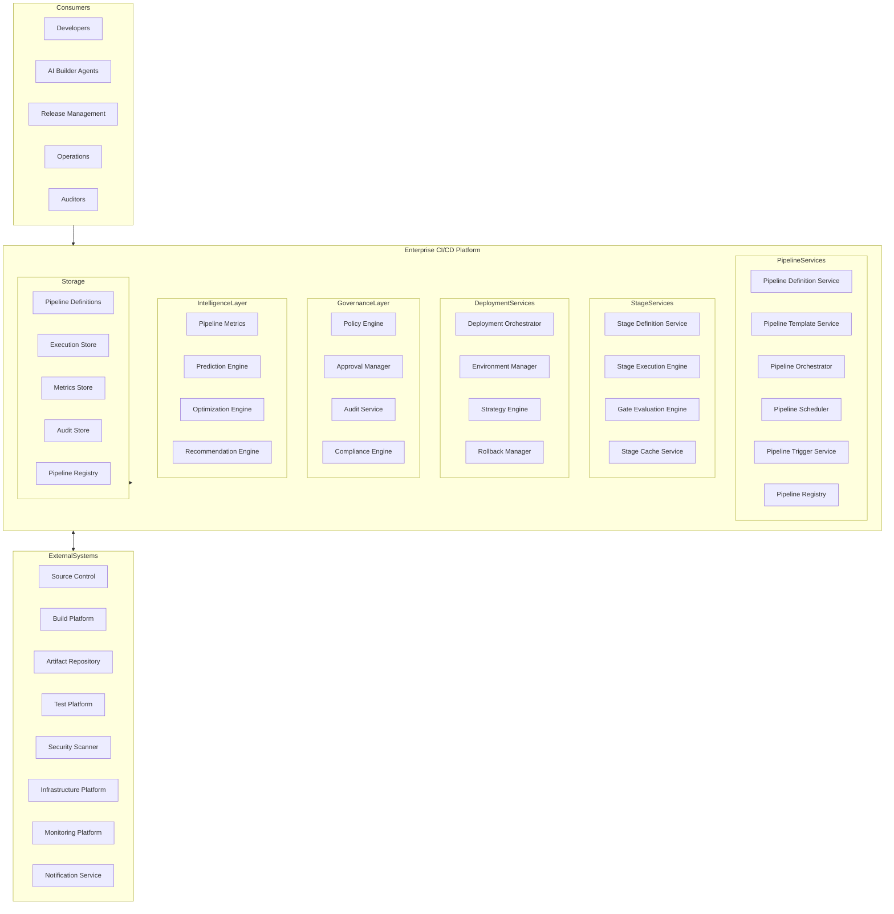
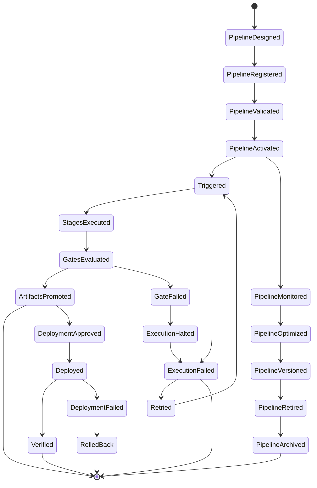
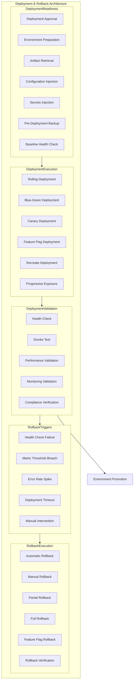
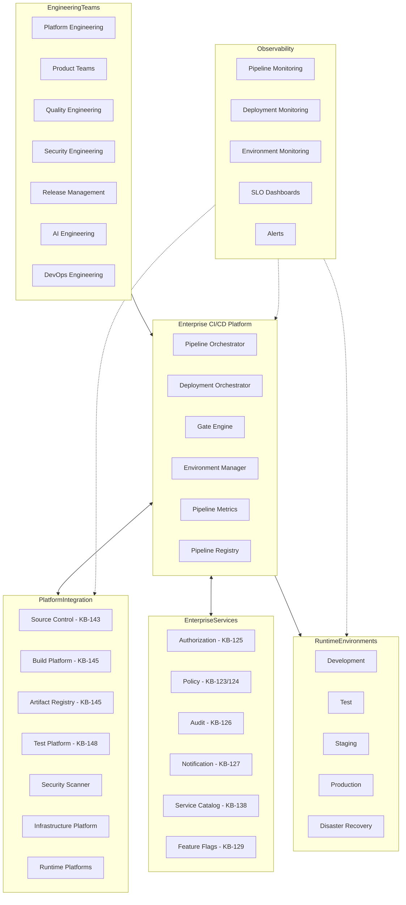

# KB-146 — CI/CD Pipeline Architecture

---

## Metadata

- **Document ID:** KB-146
- **Title:** CI/CD Pipeline Architecture
- **Suite:** Developer Experience (DX) & Engineering Platform Architecture
- **Version:** 1.0
- **Status:** Approved Architecture
- **Classification:** Enterprise Software Delivery Architecture
- **Date:** 2026-07-12

---

## Executive Summary

The Enterprise CI/CD Pipeline Platform provides the canonical automation backbone for continuous integration and continuous delivery across the DUKADESK ecosystem, governing every code-to-production path through standardized pipeline definitions, consistent stage execution, automated quality gates, controlled deployment orchestration, enterprise-wide observability, and AI-assisted pipeline intelligence.

CI/CD pipelines are treated as governed enterprise assets rather than team-managed automation scripts. All pipeline definitions, execution, artifact promotion, environment deployment, release orchestration, and pipeline governance are defined by this canonical architecture.

---

## Purpose

Define how DUKADESK standardizes and governs CI/CD pipeline automation across all engineering teams, products, platform services, and operational domains while enabling secure software delivery, engineering velocity, AI-assisted deployment intelligence, enterprise governance, and end-to-end pipeline traceability.

---

## Scope

### In Scope

- Enterprise CI architecture
- Enterprise CD architecture
- Pipeline architecture
- Pipeline taxonomy
- Pipeline lifecycle
- Pipeline orchestration
- Pipeline governance
- Pipeline templates
- Pipeline metadata
- Pipeline policies
- Pipeline observability
- Pipeline intelligence
- Deployment orchestration
- Rollback architecture
- AI-assisted pipeline management

### Out of Scope

- CI/CD platform implementation
- Deployment tooling implementation
- Infrastructure implementation
- Source control implementation
- Build implementation
- Runtime orchestration implementation

These are covered by dedicated Knowledge Base documents including KB-145 (Build & Artifact Management Architecture), KB-143 (Source Control & Repository Architecture), KB-148 (Test Strategy & Quality Engineering Architecture), KB-147 (DevSecOps Architecture), and KB-149 (Development Environment Architecture) within this suite.

---

## Architectural Principles

| # | Principle | Description |
|---|-----------|-------------|
| 1 | Pipeline as Code | Pipelines are defined declaratively, versioned in source control, and treated as governed assets |
| 2 | Automation First | All pipeline operations from trigger to deployment are fully automated |
| 3 | Continuous Validation | Every code change is validated through automated build, test, and security stages |
| 4 | Continuous Security | Security scanning and compliance checks are embedded in every pipeline stage |
| 5 | Immutable Delivery | Artifacts are built once and promoted immutably through environments |
| 6 | Policy-Driven Pipelines | Pipeline execution is governed by automated policy enforcement at every stage |
| 7 | Build Once, Deploy Many | Artifacts are built once and promoted through environments without modification |
| 8 | AI-Assisted Engineering | AI capabilities augment pipeline optimization, failure prediction, and deployment decisions |
| 9 | Vendor Independence | No dependency on specific CI/CD vendor implementations |
| 10 | Technology Neutrality | The architecture supports any technology stack without bias |
| 11 | Enterprise Scalability | CI/CD platform scales across all teams, products, domains, and environments |
| 12 | Observability by Default | All pipeline executions emit metrics, logs, traces, and events for enterprise visibility |

---

## Canonical Definitions

| Term | Definition |
|------|-----------|
| Continuous Integration (CI) | The automated practice of integrating, building, and testing code changes frequently |
| Continuous Delivery (CD) | The automated practice of ensuring software is always in a releasable state |
| Continuous Deployment | The automated practice of deploying every validated change to production |
| Pipeline | An automated sequence of stages from code commit to production deployment |
| Pipeline Stage | A logical phase in a pipeline with defined inputs, execution, gates, and outputs |
| Pipeline Template | A reusable pipeline definition parameterized for team or product customization |
| Pipeline Policy | A governance rule that constrains pipeline definition, execution, or promotion |
| Pipeline Registry | The canonical inventory of all enterprise pipelines with metadata and versioning |
| Deployment Pipeline | A pipeline responsible for deploying artifacts to target environments |
| Promotion Pipeline | A pipeline responsible for promoting artifacts between lifecycle stages |
| Validation Pipeline | A pipeline focused on automated quality and compliance validation |
| Rollback | The automated process of reverting a deployment to a previous known-good state |
| Release Gate | An automated checkpoint that validates release criteria before production promotion |
| Pipeline Orchestration | The coordination of pipeline execution across systems, stages, and environments |
| Pipeline Governance | The policies, roles, and processes governing enterprise pipelines |
| Pipeline Metadata | Structured data describing pipeline properties, provenance, and governance |
| Pipeline Observability | Metrics, logs, traces, and events emitted by pipeline execution |
| Enterprise Pipeline | Any pipeline governed by the enterprise CI/CD pipeline architecture |
| Deployment Readiness | The state of an artifact and environment being prepared for deployment |
| Software Delivery Workflow | The end-to-end automated workflow from code commit to production operation |

---

## Enterprise CI/CD Platform Architecture

---

## Pipeline Taxonomy

```mermaid
graph TB
    PT[Pipeline Taxonomy] --> BUILD_P[Build Pipelines]
    PT --> VALID_P[Validation Pipelines]
    PT --> TEST_P[Test Pipelines]
    PT --> SEC_P[Security Pipelines]
    PT --> COMP_P[Compliance Pipelines]
    PT --> PACK_P[Packaging Pipelines]
    PT --> REL_P[Release Pipelines]
    PT --> DEP_P[Deployment Pipelines]
    PT --> INFRA_P[Infrastructure Pipelines]
    PT --> DOC_P[Documentation Pipelines]
    PT --> AI_MODEL_P[AI Model Pipelines]
    PT --> AI_PROMPT_P[AI Prompt Pipelines]
    PT --> MKT_P[Marketplace Pipelines]
    PT --> BLD_STUDIO_P[Builder Studio Pipelines]
    PT --> FUTURE_P[Future Pipeline Domains]

    BUILD_P --> APP_BUILD[Application Build Pipelines]
    BUILD_P --> LIB_BUILD[Library Build Pipelines]
    BUILD_P --> CONT_BUILD[Container Build Pipelines]

    VALID_P --> CODE_VALID[Code Validation Pipelines]
    VALID_P --> STATIC_ANALYSIS[Static Analysis Pipelines]

    TEST_P --> UNIT_TEST[Unit Test Pipelines]
    TEST_P --> INTEGRATION[Integration Test Pipelines]
    TEST_P --> E2E[End-to-End Test Pipelines]
    TEST_P --> PERF_TEST[Performance Test Pipelines]

    SEC_P --> SCAN_PIP[Vulnerability Scan Pipelines]
    SEC_P --> SBOM_PIP[SBOM Generation Pipelines]
    SEC_P --> AUDIT_PIP[Security Audit Pipelines]

    DEP_P --> ROLLING_DEP[Rolling Deployment Pipelines]
    DEP_P --> BLUE_GREEN[Blue-Green Deployment Pipelines]
    DEP_P --> CANARY[Canary Deployment Pipelines]
    DEP_P --> FEATURE_FLAG[Feature Flag Pipelines]

    AI_MODEL_P --> TRAIN_PIP[Model Training Pipelines]
    AI_MODEL_P --> EVAL_PIP[Model Evaluation Pipelines]
    AI_MODEL_P --> DEPLOY_PIP[Model Deployment Pipelines]
```

---

## Pipeline Lifecycle

---

## End-to-End Software Delivery Pipeline

```mermaid
graph TB
    subgraph Development
        CODE_COMMIT[Code Commit]
        CODE_REVIEW[Code Review]
        BRANCH_MERGE[Branch Merge]
    end

    subgraph ContinuousIntegration
        CI_TRIGGER[CI Triggered]
        CI_CHECKOUT[Source Checkout]
        CI_BUILD[Build Execution]
        CI_UNIT[Unit Tests]
        CI_STATIC[Static Analysis]
        CI_SCAN[Security Scan]
        CI_PACKAGE[Package Artifact]
        CI_PUBLISH[Publish to Registry]
    end

    subgraph ContinuousDelivery
        CD_PROMOTE[Promote to Staging]
        CD_DEPLOY_STG[Deploy to Staging]
        CD_INTEGRATION[Integration Tests]
        CD_PERF[Performance Validation]
        CD_APPROVAL[Release Approval]
    end

    subgraph ContinuousDeployment
        CDEP_DEPLOY[Deploy to Production]
        CDEP_SMOKE[Smoke Tests]
        CDEP_HEALTH[Health Verification]
        CDEP_MONITOR[Monitoring Validation]
    end

    subgraph Rollback
        RB_DETECT[Failure Detection]
        RB_TRIGGER[Rollback Triggered]
        RB_EXECUTE[Rollback Execution]
        RB_VERIFY[Rollback Verification]
    end

    CODE_COMMIT --> CODE_REVIEW
    CODE_REVIEW --> BRANCH_MERGE
    BRANCH_MERGE --> CI_TRIGGER
    CI_TRIGGER --> CI_CHECKOUT
    CI_CHECKOUT --> CI_BUILD
    CI_BUILD --> CI_UNIT
    CI_UNIT --> CI_STATIC
    CI_STATIC --> CI_SCAN
    CI_SCAN --> CI_PACKAGE
    CI_PACKAGE --> CI_PUBLISH
    CI_PUBLISH --> CD_PROMOTE
    CD_PROMOTE --> CD_DEPLOY_STG
    CD_DEPLOY_STG --> CD_INTEGRATION
    CD_INTEGRATION --> CD_PERF
    CD_PERF --> CD_APPROVAL
    CD_APPROVAL --> CDEP_DEPLOY
    CDEP_DEPLOY --> CDEP_SMOKE
    CDEP_SMOKE --> CDEP_HEALTH
    CDEP_HEALTH --> CDEP_MONITOR
    CDEP_MONITOR --> RB_DETECT
    RB_DETECT --> RB_TRIGGER
    RB_TRIGGER --> RB_EXECUTE
    RB_EXECUTE --> RB_VERIFY
```

---

## Pipeline Orchestration Architecture

```mermaid
graph TB
    subgraph PipelineOrchestrator[Pipeline Orchestrator]

        subgraph TriggerCoordination
            SRC_TRIG[Source Control Trigger]
            SCHED_TRIG[Scheduled Trigger]
            MAN_TRIG[Manual Trigger]
            WEB_TRIG[Webhook Trigger]
            DOWN_TRIG[Downstream Trigger]
        end

        subgraph StageCoordination
            STAGE_SEQ[Stage Sequencing]
            PARALLEL_EXEC[Parallel Execution]
            COND_BRANCH[Conditional Branching]
            STAGE_RETRY[Stage Retry Logic]
        end

        subgraph SystemIntegration
            SRC_CTL2[Source Control]
            BLD_SYS[Build System]
            TST_SYS[Test System]
            SEC_SYS[Security System]
            ART_SYS[Artifact Repository]
            REL_SYS[Release Management]
            DEP_ENV[Deployment Environments]
            RUNTIME_PLT[Runtime Platforms]
            AI_SVC[AI Services]
            GOV_PLT[Governance Platform]
        end

        subgraph DataFlow
            ART_IN[Artifact Input]
            CONFIG_IN[Configuration Input]
            SECRET_IN[Secret Injection]
            MET_OUT[Metrics Output]
            LOG_OUT[Log Output]
            EVENT_OUT[Event Output]
        end

        subgraph OrchestrationGovernance
            EXEC_POL[Execution Policy]
            DEP_POL[Deployment Policy]
            PROMO_POL[Promotion Policy]
            RETRY_POL[Retry Policy]
        end
    end

    TriggerCoordination --> StageCoordination
    StageCoordination --> SystemIntegration
    SystemIntegration --> DataFlow
    OrchestrationGovernance --> StageCoordination
    OrchestrationGovernance --> SystemIntegration
```

---

## Deployment & Rollback Architecture

---

## Enterprise Delivery Operating Model

---

## Governance Architecture

```mermaid
graph TB
    subgraph GovernanceArchitecture[Pipeline Governance Architecture]

        subgraph StrategicGovernance
            EAB[Enterprise Architecture Board]
            PIPE_COUNCIL[Pipeline Council]
            RELEASE_BOARD[Release Board]
            PLATFORM_TEAM[Platform Engineering Team]
        end

        subgraph PipelineGovernance
            PIPE_DEF_GOV[Pipeline Definition Policy]
            PIPE_TMP_GOV[Pipeline Template Policy]
            PIPE_EXEC_GOV[Pipeline Execution Policy]
            PIPE_GATE_GOV[Pipeline Gate Policy]
            PIPE_RET_GOV[Pipeline Retention Policy]
        end

        subgraph DeploymentGovernance
            DEP_STRAT[Deployment Strategy Policy]
            ENV_PROMO[Environment Promotion Policy]
            ROLLBACK_POL[Rollback Policy]
            APPROVAL_POL[Approval Policy]
            RELEASE_POL[Release Policy]
        end

        subgraph SecurityAndCompliance
            SEC_POL[Pipeline Security Policy]
            SECRET_POL[Secrets Management Policy]
            SCAN_POL[Pipeline Scanning Policy]
            COMP_POL[Pipeline Compliance Policy]
            AUDIT_POL[Audit Policy]
        end

        subgraph ChangeGovernance
            CHANGE_MGMT[Change Management]
            CAB[Change Advisory Board]
            CHANGE_WIN[Change Windows]
            EMERGENCY_CHG[Emergency Change Process]
        end

        subgraph Enforcement
            PIPE_ENG[Pipeline Policy Engine]
            GATE_ENF[Gate Enforcement]
            DEP_GATES[Deployment Gates]
            VIO_ENG[Violation Engine]
            COR_ACT[Corrective Actions]
        end

        subgraph Policies
            MIN_COV[Minimum Test Coverage]
            MAX_DUR[Maximum Pipeline Duration]
            MIN_GATES[Minimum Gate Pass Rate]
            DEP_WIN[Deployment Window]
            ENV_REST[Environment Restrictions]
            APPROVAL_REQ[Approval Requirements]
        end
    end

    StrategicGovernance --> PipelineGovernance
    StrategicGovernance --> DeploymentGovernance
    SecurityAndCompliance --> DeploymentGovernance
    ChangeGovernance --> DeploymentGovernance
    PipelineGovernance --> Enforcement
    DeploymentGovernance --> Enforcement
    Policies --> Enforcement
```

---

## Pipeline Dependency Model

```mermaid
graph TB
    subgraph PipelineDependencies[Pipeline Dependency Model]

        subgraph UpstreamPipelines
            LIB_PIPE[Library Pipeline]
            SDK_PIPE[SDK Pipeline]
            BASE_IMG_PIPE[Base Image Pipeline]
            INFRA_MOD_PIPE[Infrastructure Module Pipeline]
            SEC_POL_PIPE[Security Policy Pipeline]
        end

        subgraph MidstreamPipelines
            APP_PIPE[Application Pipeline]
            API_PIPE[API Pipeline]
            MICRO_PIPE[Microservice Pipeline]
            UI_PIPE[UI Component Pipeline]
            AI_MODEL_PIPE2[AI Model Pipeline]
        end

        subgraph DownstreamPipelines
            INTEG_PIPE[Integration Pipeline]
            E2E_PIPE[End-to-End Test Pipeline]
            RELEASE_PIPE[Release Pipeline]
            DOC_PIPE[Documentation Pipeline]
        end

        subgraph DeploymentPipelines
            STG_DEP_PIPE[Staging Deployment Pipeline]
            PROD_DEP_PIPE[Production Deployment Pipeline]
            DR_DEP_PIPE[Disaster Recovery Pipeline]
            CANARY_DEP_PIPE[Canary Deployment Pipeline]
        end

        subgraph DependencyTypes
            DT_ARTIFACT[Artifact Dependency]
            DT_VERSION[Version Dependency]
            DT_CONFIG[Configuration Dependency]
            DT_TRIGGER[Trigger Dependency]
            DT_APPROVAL[Approval Dependency]
        end
    end

    UpstreamPipelines --> MidstreamPipelines
    MidstreamPipelines --> DownstreamPipelines
    DownstreamPipelines --> DeploymentPipelines
    DependencyTypes -.-> UpstreamPipelines
    DependencyTypes -.-> MidstreamPipelines
    DependencyTypes -.-> DownstreamPipelines
```

---

## Enterprise CI/CD Reference Architecture

```mermaid
graph TB
    subgraph ReferenceModel[Enterprise CI/CD Reference Architecture]

        subgraph PipelineDomains
            PD1[Application Pipelines</br>Services, APIs,</br>microservices]
            PD2[Library Pipelines</br>Shared libraries,</br>SDKs, frameworks]
            PD3[Container Pipelines</br>Image build,</br>scan, publish]
            PD4[Infrastructure Pipelines</br>Terraform, Helm,</br>Kubernetes]
            PD5[AI Asset Pipelines</br>Models, prompts,</br>training outputs]
            PD6[Data Pipelines</br>ETL, analytics,</br>data processing]
            PD7[Security Pipelines</br>Scanning, SBOM,</br>compliance]
            PD8[Documentation Pipelines</br>Technical docs,</br>API references]
            PD9[Marketplace Pipelines</br>Extensions, plugins,</br>packages]
            PD10[Builder Studio Pipelines</br>Low-code, no-code,</br>builder assets]
        end

        subgraph PipelineStandards
            PS1[Declarative Definitions]
            PS2[Consistent Stage Contracts]
            PS3[Automated Quality Gates]
            PS4[Immutable Pipelines]
            PS5[Traceability by Default]
            PS6[Secrets Management]
            PS7[Policy Enforcement]
            PS8[Observability by Default]
        end

        subgraph IntegrationPatterns
            IP1[SCM - Source Trigger]
            IP2[Artifact - Promotion Trigger]
            IP3[Webhook - External Event]
            IP4[API - Pipeline Management]
            IP5[CLI - Pipeline Operations]
            IP6[IDE - Pipeline Integration]
        end

        subgraph QualityAttributes
            QA1[Reliable]
            QA2[Repeatable]
            QA3[Verifiable]
            QA4[Traceable]
            QA5[Governed]
            QA6[Secure]
            QA7[Observable]
            QA8[Scalable]
        end
    end

    PipelineDomains --> PipelineStandards
    PipelineStandards --> IntegrationPatterns
    IntegrationPatterns --> QualityAttributes
```

---

## Pipeline Registry

The Pipeline Registry is the canonical inventory of all enterprise pipelines. Every pipeline within DUKADESK shall be registered in the Pipeline Registry before activation.

| Registry Property | Description |
|-------------------|-------------|
| Pipeline ID | Unique identifier assigned at registration |
| Pipeline Name | Human-readable pipeline name |
| Pipeline Type | Classification per Pipeline Taxonomy |
| Owner | Engineering team responsible for the pipeline |
| Version | Semantic version of the pipeline definition |
| Status | Current pipeline lifecycle state |
| Definition Location | Source control path to pipeline definition |
| Template | Pipeline template used (if applicable) |
| Triggers | Configured trigger types |
| Target Environments | Environments targeted by the pipeline |
| Quality Gates | Gates enforced during pipeline execution |
| Dependencies | Upstream and downstream pipeline dependencies |
| Metadata | Custom metadata key-value pairs |
| Audit Trail | Immutable history of pipeline changes |

---

## Governance

| Domain | Governance Focus |
|--------|-----------------|
| Pipeline Governance | Pipeline definitions follow standardized declarative format with mandatory metadata |
| Release Governance | Production releases follow defined approval, scheduling, and communication policies |
| Security Governance | Pipelines enforce secrets management, least privilege, and zero trust execution |
| Compliance Governance | Pipeline execution complies with regulatory requirements and audit standards |
| AI Governance | AI-assisted pipeline operations follow AI governance policies |
| Deployment Governance | Deployments follow defined strategies, environment promotion rules, and rollback policies |
| Architecture Governance | Pipeline architecture changes require architecture board approval |
| Change Governance | Pipeline modifications follow change management processes |
| Operational Governance | Pipeline platform operations follow enterprise operational standards |
| Enterprise Governance | The Enterprise Architecture board governs CI/CD platform evolution |

### Governance Enforcement Points

| Enforcement Point | Mechanism |
|-------------------|-----------|
| Pipeline Registration | Definition validation, template compliance, metadata completeness check |
| Pipeline Activation | Security scan, cost estimation, resource allocation approval |
| Stage Execution | Input validation, environment verification, secret injection |
| Gate Evaluation | Automated criteria validation, approval workflow, policy enforcement |
| Artifact Promotion | Integrity verification, provenance check, environment authorization |
| Environment Deployment | Deployment window validation, strategy compliance, rollback readiness |
| Production Release | Change advisory board approval, release window validation, communication plan |

---

## Responsibilities

| Role | Responsibilities |
|------|-----------------|
| Enterprise Architecture Board | Governs CI/CD pipeline architecture, standards, and platform evolution |
| Platform Engineering | Develops, operates, and maintains the Enterprise CI/CD Platform |
| Developer Experience Team | Defines pipeline templates, standards, and developer workflows |
| DevOps Engineering | Operates pipeline infrastructure, optimizes execution, manages pipeline environments |
| Product Teams | Defines team pipelines using approved templates; meets quality gates |
| Release Management | Governs environment promotions; approves production deployments |
| Security | Defines pipeline security policies; operates pipeline security scanning |
| Compliance | Defines pipeline compliance requirements; audits pipeline execution |
| Quality Engineering | Defines test gates, performance validation criteria, and quality standards |
| Operations | Manages pipeline platform operations, availability, and capacity |
| AI Governance Board | Governs AI-assisted pipeline operations; approves AI-driven deployment decisions |

---

## Security

| Security Control | Description |
|------------------|-------------|
| Secure Pipelines | Pipeline definitions are scanned for security misconfiguration |
| Identity-Aware Automation | All pipeline operations are authenticated and authorized per identity |
| Least Privilege Execution | Pipeline workers execute with minimum required permissions |
| Zero Trust Execution | Every pipeline operation is authenticated, authorized, and verified |
| Pipeline Integrity | Pipeline definitions are cryptographically signed and verified |
| Policy Enforcement | Pipeline governance policies are enforced through automated gates |
| Software Provenance | Every pipeline execution has a verifiable provenance chain |
| Auditability | All pipeline operations are recorded in immutable audit log |
| Supply Chain Security | Pipeline dependencies are verified for integrity and vulnerabilities |
| Secure Deployment Authorization | Production deployments require multi-party authorization |

### Security Zones

| Zone | Description |
|------|-------------|
| Development | Development pipelines with team-level execution and artifact access |
| Testing | Test pipelines with automated execution and restricted environment access |
| Staging | Staging pipelines with release management approval and controlled access |
| Production | Production pipelines with restricted, audited execution and approval gates |
| Security | Security pipelines with elevated scanning and compliance enforcement |
| Recovery | Disaster recovery pipelines with emergency execution protocols |

---

## Privacy

| Privacy Control | Description |
|----------------|-------------|
| Sensitive Pipeline Metadata | Pipeline metadata containing sensitive information is classified and restricted |
| Confidential Deployment Information | Deployment configuration containing sensitive data is access-restricted |
| Regulatory Compliance | Pipeline data handling complies with GDPR, CCPA, and regional regulations |
| Data Minimization | Only required pipeline execution data is collected and retained |
| Cross-Border Governance | Pipeline execution respects data residency requirements |
| Retention Governance | Pipeline execution logs and artifacts are retained per policy and purged when expired |
| Privacy Assurance | Regular privacy reviews for CI/CD platform capabilities |
| Secure Operational Records | Pipeline audit records are encrypted and access-restricted |

---

## Performance

| Consideration | Requirement |
|---------------|-------------|
| Enterprise-Scale Delivery | Platform supports millions of pipeline executions across all teams and products |
| High-Volume Pipeline Execution | Thousands of concurrent pipeline executions across distributed worker pools |
| Elastic Scalability | Pipeline execution capacity scales horizontally with demand |
| High Availability | 99.99% uptime for critical pipeline orchestration and deployment services |
| Operational Resilience | Graceful degradation under load with execution queue backpressure |
| Efficient Orchestration | Pipeline execution completes within defined duration targets |
| Multi-Region Readiness | Pipeline execution operates across global regions with local worker pools |
| Continuous Delivery Optimization | Pipeline execution optimized through caching, parallelization, and incremental execution |

### Performance Optimization

| Optimization | Description |
|--------------|-------------|
| Pipeline Caching | Stage outputs cached and reused across pipeline executions |
| Parallel Stage Execution | Independent stages executed in parallel for reduced pipeline duration |
| Incremental Pipeline Execution | Only changed components trigger relevant pipeline stages |
| Worker Auto-Scaling | Worker pool scales dynamically based on pipeline queue depth |
| Dependency Pre-fetching | Pipeline dependencies pre-fetched and cached for execution speed |
| Pipeline Skipping | Irrelevant stages skipped based on change analysis and policy evaluation |

---

## Observability

| Observable Dimension | Metrics | Purpose |
|---------------------|---------|---------|
| Pipeline Health | Pipeline success rate, duration, queue depth | Monitoring CI/CD platform health |
| Delivery Health | Deployment success rate, duration, rollback frequency | Tracking delivery reliability |
| Deployment Analytics | Deployment velocity, environment distribution, strategy adoption | Tracking deployment patterns |
| Governance Dashboards | Gate pass rates, policy violations, approval times | Monitoring pipeline governance |
| Operational Reporting | Daily pipeline activity, worker utilization, team distribution | Operational pipeline management |
| Executive Reporting | Pipeline efficiency trends, deployment reliability, release velocity | Strategic pipeline intelligence |
| Delivery Performance Metrics | Pipeline duration compliance, deployment frequency, lead time | Measuring delivery performance |
| Pipeline Intelligence | Failure pattern analysis, optimization impact, bottleneck identification | Pipeline improvement insights |
| Deployment Success Metrics | Deployment success rate, rollback rate, recovery time | Measuring deployment reliability |
| Enterprise Engineering Insights | Cross-team pipeline metrics, platform adoption, engineering productivity | Strategic engineering intelligence |

### Observability Events

| Event Type | Trigger | Consumer |
|------------|---------|----------|
| PipelineTriggered | Pipeline execution initiated | Metrics store, notification service |
| StageStarted | Stage execution initiated | Metrics store, trace service |
| StageCompleted | Stage execution completed | Gate evaluation, metrics store |
| GateEvaluated | Quality gate assessment completed | Pipeline orchestrator, notification service |
| DeploymentStarted | Deployment execution initiated | Environment manager, monitoring service |
| DeploymentCompleted | Deployment execution completed | Verification service, notification service |
| DeploymentFailed | Deployment execution failed | Rollback manager, notification service |
| ApprovalRequested | Manual approval gate activated | Approval manager, notification service |
| PipelineFailed | Pipeline execution failed | Engineering team, notification service |

---

## Failure Scenarios

| # | Scenario | Architectural Response |
|---|----------|----------------------|
| 1 | Pipeline Failures | Automated retry with backoff; notification to developer; escalation on repeated failure |
| 2 | Deployment Failures | Automated rollback to previous version; environment verification; notification to operations |
| 3 | Rollback Failures | Escalated rollback with manual intervention; environment quarantine if rollback fails |
| 4 | Pipeline Corruption | Pipeline definition validation failure; template version rollback; notification to platform team |
| 5 | Governance Bypass | Policy enforcement point blocks unauthorized operation; violation recorded with audit trail |
| 6 | Security Validation Failures | Pipeline blocked; security team notified; artifact quarantined; vulnerability report generated |
| 7 | Pipeline Template Inconsistencies | Template validation at registration; inconsistency reported; template version rollback |
| 8 | Unauthorized Deployments | Authorization enforced at deployment; violation logged with audit trail; security team notified |
| 9 | Orchestration Failures | Pipeline orchestrator failover; execution state recovered from journal; notification to platform team |
| 10 | Recovery Failures | Journal-based recovery with replay; cross-service consistency verification; manual recovery escalation |
| 11 | Operational Disruptions | Pipeline queued with priority; auto-scaling triggered; notification to platform team; capacity management |
| 12 | Pipeline Abandonment | Orphan detection service identifies inactive pipelines; owner notification; lifecycle enforcement |

---

## Anti-Patterns

| # | Anti-Pattern | Description | Prohibited Because |
|---|-------------|-------------|-------------------|
| 1 | Manual Production Deployments | Deployments executed through manual procedures outside CI/CD | Introduces errors, bypasses gates, reduces auditability, creates security risk |
| 2 | Pipeline Logic Outside Governance | Pipeline logic embedded in scripts outside declarative definitions | Breaks visibility, governance, reusability, auditability |
| 3 | Environment-Specific Pipelines | Pipelines with environment-specific logic in stage definitions | Reduces pipeline portability, complicates environment promotion |
| 4 | Hardcoded Deployment Processes | Deployment steps hardcoded rather than using platform deployment services | Prevents rollback automation, strategy flexibility, auditability |
| 5 | Security Checks After Deployment | Security scanning performed after production deployment | Allows vulnerable software into production, creates remediation liability |
| 6 | Duplicate Pipeline Definitions | Multiple independent pipeline definitions for similar workflows | Fragments pipeline visibility, creates inconsistency, governance gaps |
| 7 | Pipeline Ownership Ambiguity | Pipelines without clearly defined owners and maintenance responsibilities | Leads to pipeline abandonment, security gaps, compliance violations |
| 8 | Release Without Rollback Strategy | Production releases without defined and tested rollback plan | Creates production downtime risk, recovery delays, customer impact |
| 9 | Independent Delivery Processes | Teams creating and operating delivery workflows outside enterprise platform | Creates security risks, governance gaps, compliance blind spots |
| 10 | Hidden Automation Workflows | Pipeline execution not registered or observable in the enterprise platform | Prevents discovery, governance, enterprise visibility |

---

## Future Evolution

| # | Evolution Path | Description |
|---|---------------|-------------|
| 1 | Autonomous Software Delivery | AI agents that autonomously manage software delivery from commit to production |
| 2 | AI-Driven Pipeline Optimization | AI that autonomously optimizes pipeline configurations, caching, and execution order |
| 3 | Predictive Deployment Intelligence | ML-driven prediction of deployment failures, rollback probability, and release risk scoring |
| 4 | Self-Healing Delivery Pipelines | Pipelines that automatically detect and recover from failures without manual intervention |
| 5 | Federated Engineering Ecosystems | Pipeline federation across DUKADESK and partner ecosystems with shared execution |
| 6 | Intelligent Release Orchestration | AI-driven release coordination across multiple services, environments, and dependencies |
| 7 | Adaptive Software Delivery | Pipelines that adapt execution dynamically based on change risk, environment conditions, and business context |
| 8 | Enterprise Delivery Intelligence | AI-driven insights into delivery efficiency, deployment reliability, and release velocity across the enterprise |

---

## Cross References

| Document ID | Title | Relationship |
|-------------|-------|-------------|
| KB-141 | Developer Experience Platform Architecture | Foundational DX platform that hosts CI/CD services |
| KB-142 | Software Development Lifecycle Architecture | Defines SDLC phases that trigger CI/CD pipeline execution |
| KB-143 | Source Control & Repository Architecture | Defines source repositories that trigger pipeline execution |
| KB-144 | Branching & Release Strategy Architecture | Defines branching triggers for CI/CD pipeline execution |
| KB-145 | Build & Artifact Management Architecture | Defines build execution and artifact management consumed by pipelines |
| KB-147 | DevSecOps Architecture | Defines security integration within pipeline execution |
| KB-148 | Test Strategy & Quality Engineering Architecture | Defines test execution integrated with pipeline stages |
| KB-155 | Engineering Observability Architecture | Defines pipeline observability and monitoring |
| KB-158 | Engineering Governance Architecture | Defines governance enforced on pipeline operations |
| KB-160 | Developer Experience Reference Architecture | Comprehensive reference for the DX suite |

---

## Critical DUKADESK Architectural Rule

**All continuous integration, continuous delivery, and deployment automation within DUKADESK shall be orchestrated, executed, governed, and observed exclusively through the canonical Enterprise CI/CD Pipeline Architecture. No application, Builder Studio module, Marketplace extension, AI Builder Agent, engineering team, platform service, or operational domain shall implement independent delivery pipelines or deployment workflows outside the enterprise architecture, ensuring secure, automated, policy-driven, traceable, observable, resilient, and enterprise-wide software delivery.**

(End of file - total 1021 lines)
