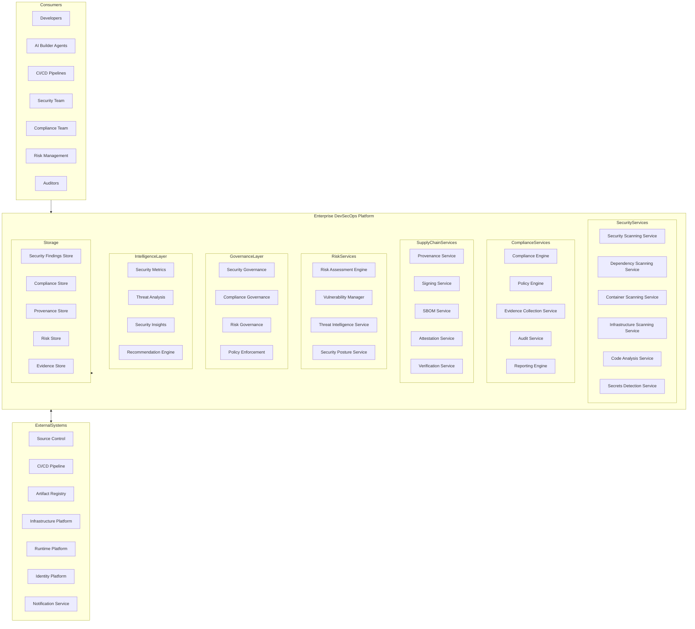
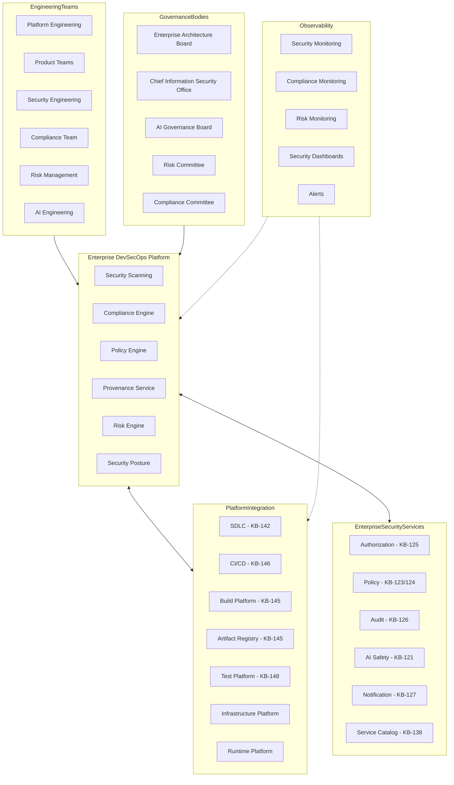
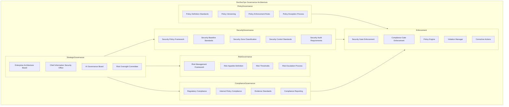

# KB-147 — DevSecOps Architecture

---

## Metadata

- **Document ID:** KB-147
- **Title:** DevSecOps Architecture
- **Suite:** Developer Experience (DX) & Engineering Platform Architecture
- **Version:** 1.0
- **Status:** Approved Architecture
- **Classification:** Enterprise Security Engineering Architecture
- **Date:** 2026-07-12

---

## Executive Summary

The Enterprise DevSecOps Platform embeds security, compliance, governance, risk management, software supply chain assurance, and policy enforcement into every phase of the software engineering lifecycle across the DUKADESK ecosystem. Security operates as a continuous architectural capability rather than a post-development activity, governing every engineering workflow, infrastructure component, AI system, Builder Studio module, Marketplace extension, Runtime Platform service, Enterprise Platform Service, and operational environment.

Security, compliance, governance, and risk management are treated as cross-cutting enterprise platform capabilities rather than team-level responsibilities. All engineering activities are continuously validated, assured, and governed by this canonical architecture.

---

## Purpose

Define how DUKADESK continuously integrates security, compliance, governance, trust, and operational assurance into engineering workflows while maintaining enterprise scalability, automation, AI readiness, and software delivery velocity.

---

## Scope

### In Scope

- Enterprise DevSecOps architecture
- Secure SDLC integration
- Security pipeline architecture
- Compliance automation
- Security governance
- Risk management integration
- Software supply chain security
- Artifact trust architecture
- Infrastructure security integration
- AI security integration
- Security observability
- Continuous assurance
- Policy enforcement
- Engineering security intelligence
- Security lifecycle governance

### Out of Scope

- SOC operations
- Runtime security implementation
- Identity platform implementation
- Security tooling implementation
- Infrastructure implementation
- Incident response implementation

These are addressed by dedicated Knowledge Base documents including KB-121 (AI Safety & Governance Architecture), KB-123 (Enterprise Policy Framework Architecture), KB-125 (Authorization Architecture), and KB-126 (Audit & Compliance Architecture).

---

## Architectural Principles

| # | Principle | Description |
|---|-----------|-------------|
| 1 | Security by Design | Security requirements are defined during architecture and design, never retrofitted after implementation |
| 2 | Zero Trust | Every engineering operation, identity, artifact, and environment is continuously verified and never implicitly trusted |
| 3 | Shift-Left Security | Security validation is performed as early as possible in the engineering lifecycle |
| 4 | Continuous Assurance | Security, compliance, and governance are continuously validated throughout every engineering phase |
| 5 | Policy as Code | Security and compliance policies are defined declaratively, versioned, and enforced through automated gates |
| 6 | Automation First | All security validation, compliance checks, and policy enforcement are fully automated |
| 7 | Defense in Depth | Multiple independent security controls protect every engineering stage, artifact, and environment |
| 8 | Secure Software Supply Chain | Every artifact has verified provenance, integrity, and trust throughout its lifecycle |
| 9 | AI-Assisted Security | AI capabilities augment threat detection, vulnerability analysis, and security intelligence |
| 10 | Vendor Independence | No dependency on specific security vendor implementations |
| 11 | Technology Neutrality | The architecture supports any technology stack without bias |
| 12 | Enterprise Scalability | DevSecOps platform scales across all teams, products, domains, and environments |

---

## Canonical Definitions

| Term | Definition |
|------|-----------|
| DevSecOps | The continuous integration of security, compliance, governance, and risk management into every phase of software engineering |
| Secure SDLC | A software development lifecycle where security is embedded as a continuous capability in every phase |
| Security Pipeline | An automated pipeline performing continuous security validation across engineering workflows |
| Security Gate | An automated checkpoint enforcing security criteria before stage promotion |
| Compliance Gate | An automated checkpoint enforcing regulatory and policy compliance criteria |
| Software Supply Chain | The end-to-end chain of components, dependencies, build processes, and distribution channels for software artifacts |
| Artifact Trust | Cryptographic assurance that an artifact has verified provenance, integrity, and authorized distribution |
| Continuous Assurance | The ongoing automated validation that engineering activities meet security, compliance, and governance requirements |
| Policy Enforcement | The automated application of governance policies through gates, validators, and authorization controls |
| Security Validation | The automated assessment of engineering artifacts and activities against security requirements |
| Risk Assessment | The automated evaluation of security risk based on vulnerability, threat, and impact analysis |
| Vulnerability | A security weakness that could be exploited to compromise confidentiality, integrity, or availability |
| Security Posture | The overall security state of an engineering domain, artifact, or environment at a point in time |
| Security Baseline | The minimum security requirements that every engineering domain must meet |
| Security Provenance | The verifiable chain of security validations applied to an artifact throughout its lifecycle |
| Compliance Evidence | Verifiable records demonstrating compliance with regulatory and policy requirements |
| Enterprise Security Platform | The canonical platform governing all engineering security within DUKADESK |
| Engineering Security Intelligence | AI-driven insights into security posture, threat patterns, and risk trends across engineering domains |
| Security Governance | The policies, roles, and processes governing enterprise engineering security |
| DevSecOps Lifecycle | The complete lifecycle from security planning through continuous assurance and evolution |

---

## Enterprise DevSecOps Platform

---

## Secure SDLC Integration

```mermaid
graph TB
    subgraph SecureSDLC[Secure SDLC Integration]

        subgraph Requirements
            REQ_SEC[Security Requirements]
            REQ_COMP[Compliance Requirements]
            REQ_RISK[Risk Requirements]
            REQ_THREAT[Threat Modeling]
        end

        subgraph Architecture
            ARCH_SEC[Security Architecture Review]
            ARCH_TRUST[Trust Boundary Analysis]
            ARCH_DESIGN[Secure Design Review]
            ARCH_DATA[Data Classification]
        end

        subgraph Development
            DEV_SECURE[Secure Coding Standards]
            DEV_STATIC[Static Analysis]
            DEV_SECRET[Secrets Scanning]
            DEV_DEP[Secure Dependencies]
        end

        subgraph Build
            BLD_SCAN[Build Security Scan]
            BLD_SBOM[SBOM Generation]
            BLD_SIGN[Artifact Signing]
            BLD_PROV[Provenance Capture]
        end

        subgraph Test
            TST_SAST[SAST]
            TST_DAST[DAST]
            TST_SCA[Software Composition Analysis]
            TST_PENET[Automated Penetration Testing]
        end

        subgraph Release
            REL_GATE[Release Security Gate]
            REL_APPROVE[Security Approval]
            REL_COMP[Compliance Attestation]
            REL_AUTH[Release Authorization]
        end

        subgraph Deploy
            DEP_SECURE[Secure Deployment]
            DEP_CONFIG[Configuration Validation]
            DEP_SECRET[Secrets Injection]
            DEP_VERIFY[Deployment Verification]
        end

        subgraph Operate
            OPS_MONITOR[Continuous Monitoring]
            OPS_SCAN[Runtime Scanning]
            OPS_ASSESS[Security Assessment]
            OPS_REMEDIATE[Remediation]
        end

        subgraph Maintain
            MNT_PATCH[Patch Management]
            MNT_UPDATE[Dependency Updates]
            MNT_REVIEW[Security Review]
            MNT_RETIRE[Secure Retirement]
        end
    end

    Requirements --> Architecture
    Architecture --> Development
    Development --> Build
    Build --> Test
    Test --> Release
    Release --> Deploy
    Deploy --> Operate
    Operate --> Maintain
    Maintain --> Requirements
```

---

## Security Pipeline Architecture

```mermaid
graph TB
    subgraph SecurityPipeline[Security Pipeline Architecture]

        subgraph TriggerSources
            TRIG_COMMIT[Code Commit]
            TRIG_PR[Pull Request]
            TRIG_BUILD[Build Complete]
            TRIG_DEPLOY[Pre-Deployment]
            TRIG_SCHED[Scheduled Scan]
            TRIG_AI[AI Detection Trigger]
        end

        subgraph SecurityStages
            STAGE_SAST[SAST - Static Analysis]
            STAGE_SCA[SCA - Composition Analysis]
            STAGE_SECRET[Secrets Detection]
            STAGE_CONT[Container Scan]
            STAGE_INFRA[Infrastructure Scan]
            STAGE_API[API Security Scan]
            STAGE_AI[AI Asset Security Scan]
        end

        subgraph SecurityGates
            GATE_CRITICAL[Critical Blocking Gate]
            GATE_HIGH[High Severity Gate]
            GATE_BASELINE[Baseline Compliance Gate]
            GATE_LICENSE[License Compliance Gate]
            GATE_SBOM[SBOM Completeness Gate]
        end

        subgraph SecurityActions
            ACTION_BLOCK[Block Pipeline]
            ACTION_WARN[Generate Warning]
            ACTION_NOTIFY[Notify Security Team]
            ACTION_TICKET[Create Remediation Ticket]
            ACTION_QUARANTINE[Quarantine Artifact]
        end

        subgraph SecurityEvidence
            EVID_REPORT[Scan Report]
            EVID_SBOM[SBOM Document]
            EVID_ATTEST[Security Attestation]
            EVID_COMPLIANCE[Compliance Evidence]
        end
    end

    TriggerSources --> SecurityStages
    SecurityStages --> SecurityGates
    SecurityGates --> SecurityActions
    SecurityActions --> SecurityEvidence
```

---

## Software Supply Chain Trust Model

```mermaid
graph TB
    subgraph SupplyChainTrust[Software Supply Chain Trust Model]

        subgraph SourceTrust
            SRC_ID[Developer Identity]
            SRC_SIGN[Commit Signing]
            SRC_AUTH[Source Authorization]
            SRC_REVIEW[Code Review Attestation]
        end

        subgraph DependencyTrust
            DEP_VERIFY[Dependency Integrity]
            DEP_LICENSE[License Compliance]
            DEP_VULN[Vulnerability Check]
            DEP_PROV[Dependency Provenance]
        end

        subgraph BuildTrust
            BLD_INTEG[Build Integrity]
            BLD_REPRO[Build Reproducibility]
            BLD_ENV[Build Environment Trust]
            BLD_LOG[Build Audit Log]
        end

        subgraph ArtifactTrust
            ART_SIGN[Artifact Signing]
            ART_SBOM[SBOM Attachment]
            ART_ATTEST[Build Attestation]
            ART_PROV[Provenance Chain]
        end

        subgraph DistributionTrust
            DIST_VERIFY[Distribution Integrity]
            DIST_AUTH[Access Authorization]
            DIST_CHAIN[Chain of Custody]
            DIST_AUDIT[Distribution Audit]
        end

        subgraph DeploymentTrust
            DEP_POLICY[Deployment Policy]
            DEP_VERIFY2[Deployment Verification]
            DEP_RUNTIME[Runtime Integrity]
            DEP_MONITOR[Runtime Monitoring]
        end

        subgraph TrustVerification
            VER_SIGN[Signature Verification]
            VER_SBOM[SBOM Validation]
            VER_PROV[Provenance Verification]
            VER_CONSENT[Policy Consent]
        end
    end

    SourceTrust --> DependencyTrust
    DependencyTrust --> BuildTrust
    BuildTrust --> ArtifactTrust
    ArtifactTrust --> DistributionTrust
    DistributionTrust --> DeploymentTrust
    TrustVerification -.-> SourceTrust
    TrustVerification -.-> DependencyTrust
    TrustVerification -.-> ArtifactTrust
    TrustVerification -.-> DeploymentTrust
```

---

## Continuous Compliance Architecture

```mermaid
graph TB
    subgraph ContinuousCompliance[Continuous Compliance Architecture]

        subgraph ComplianceDomains
            REG_GDPR[GDPR Compliance]
            REG_CCPA[CCPA Compliance]
            REG_SOC2[SOC 2 Compliance]
            REG_HIPAA[HIPAA Compliance]
            REG_PCI[PCI DSS Compliance]
            REG_INTERNAL[Internal Policy Compliance]
            REG_LICENSE[License Compliance]
            REG_INDUSTRY[Industry Standards Compliance]
        end

        subgraph ComplianceValidation
            VAL_POLICY[Policy Validation]
            VAL_CONFIG[Configuration Validation]
            VAL_CODE[Code Compliance]
            VAL_DEP[Dependency Compliance]
            VAL_ARTIFACT[Artifact Compliance]
            VAL_DEPLOY[Deployment Compliance]
        end

        subgraph ComplianceEvidence
            EVID_AUTO[Automated Evidence]
            EVID_MANUAL[Manual Evidence]
            EVID_ATTEST[Attestation Evidence]
            EVID_LOG[Audit Log Evidence]
            EVID_REPORT[Compliance Report]
        end

        subgraph ComplianceGates
            GATE_PRE[Pre-Release Compliance Gate]
            GATE_DEPLOY[Pre-Deployment Compliance Gate]
            GATE_PERIODIC[Periodic Compliance Gate]
            GATE_CHANGE[Change Compliance Gate]
        end

        subgraph ComplianceActions
            ACT_PASS[Compliance Pass]
            ACT_FAIL[Compliance Fail]
            ACT_WAIVE[Compliance Waiver]
            ACT_REMEDIATE[Remediation Required]
            ACT_ESCALATE[Escalation]
        end

        subgraph ComplianceIntelligence
            CI_POSTURE[Compliance Posture]
            CI_TREND[Compliance Trends]
            CI_GAP[Compliance Gap Analysis]
            CI_RISK[Compliance Risk]
        end
    end

    ComplianceDomains --> ComplianceValidation
    ComplianceValidation --> ComplianceGates
    ComplianceGates --> ComplianceActions
    ComplianceActions --> ComplianceEvidence
    ComplianceEvidence --> ComplianceIntelligence
```

---

## Engineering Risk Architecture

```mermaid
graph TB
    subgraph EngineeringRisk[Engineering Risk Architecture]

        subgraph RiskDomains
            RD_VULN[Vulnerability Risk]
            RD_DEP[Dependency Risk]
            RD_SUPPLY[Supply Chain Risk]
            RD_AI[AI Security Risk]
            RD_CONFIG[Configuration Risk]
            RD_SECRET[Secrets Exposure Risk]
            RD_COMPLIANCE[Compliance Risk]
            RD_OPERATIONAL[Operational Risk]
        end

        subgraph RiskAssessment
            RA_IDENTIFY[Risk Identification]
            RA_ANALYSIS[Risk Analysis]
            RA_EVALUATE[Risk Evaluation]
            RA_SCORE[Risk Scoring]
            RA_PRIORITIZE[Risk Prioritization]
        end

        subgraph RiskMitigation
            RM_AVOID[Risk Avoidance]
            RM_REDUCE[Risk Reduction]
            RM_TRANSFER[Risk Transfer]
            RM_ACCEPT[Risk Acceptance]
            RM_REMEDIATE[Remediation Planning]
        end

        subgraph RiskMonitoring
            RM_CONTINUOUS[Continuous Risk Monitoring]
            RM_TRACK[Risk Tracking]
            RM_REPORT[Risk Reporting]
            RM_THREAT[Threat Intelligence Integration]
        end

        subgraph RiskGovernance
            RG_POLICY[Risk Policy]
            RG_TOLERANCE[Risk Tolerance]
            RG_THRESHOLD[Risk Thresholds]
            RG_APPROVAL[Risk Acceptance Approval]
            RG_OVERSIGHT[Risk Oversight]
        end

        subgraph RiskIntelligence
            RI_TREND[Risk Trend Analysis]
            RI_PREDICT[Predictive Risk Modeling]
            RI_INSIGHT[Risk Insights]
            RI_DASHBOARD[Risk Dashboard]
        end
    end

    RiskDomains --> RiskAssessment
    RiskAssessment --> RiskMitigation
    RiskMitigation --> RiskMonitoring
    RiskGovernance --> RiskAssessment
    RiskGovernance --> RiskMitigation
    RiskMonitoring --> RiskIntelligence
```

---

## Enterprise DevSecOps Operating Model

---

## Governance Architecture

---

## Security Intelligence Model

```mermaid
graph TB
    subgraph SecurityIntelligence[Engineering Security Intelligence Model]

        subgraph DataSources
            DS_SCAN[Security Scans]
            DS_COMP[Compliance Checks]
            DS_VULN[Vulnerability Database]
            DS_THREAT[Threat Intelligence Feeds]
            DS_EVENT[Security Events]
            DS_INCIDENT[Incident Reports]
        end

        subgraph AnalysisEngines
            AE_VULN[Vulnerability Analysis]
            AE_THREAT[Threat Pattern Analysis]
            AE_TREND[Trend Analysis]
            AE_PREDICT[Predictive Analysis]
            AE_BEHAVIOR[Behavioral Analysis]
        end

        subgraph IntelligenceOutputs
            IO_POSTURE[Security Posture Assessment]
            IO_RISK_SCORE[Risk Score]
            IO_THREAT_LAND[Threat Landscape]
            IO_TREND_REPORT[Trend Report]
            IO_PREDICTION[Predictive Insights]
        end

        subgraph IntelligenceActions
            IA_ALERT[Security Alert]
            IA_RECOMMEND[Remediation Recommendation]
            IA_AUTO_REMEDIATE[Automated Remediation]
            IA_NOTIFY[Stakeholder Notification]
            IA_ESCALATE[Escalation]
        end

        subgraph IntelligenceConsumers
            IC_SEC_TEAM[Security Team]
            IC_ENG_TEAM[Engineering Teams]
            IC_EXEC[Executives]
            IC_AI_AGT[AI Builder Agents]
            IC_AUTO[Automated Systems]
        end

        subgraph FeedbackLoop
            FL_COLLECT[Collect Feedback]
            FL_ADJUST[Adjust Models]
            FL_IMPROVE[Continuous Improvement]
        end
    end

    DataSources --> AnalysisEngines
    AnalysisEngines --> IntelligenceOutputs
    IntelligenceOutputs --> IntelligenceActions
    IntelligenceActions --> IntelligenceConsumers
    IntelligenceConsumers --> FeedbackLoop
    FeedbackLoop --> AnalysisEngines
```

---

## Enterprise DevSecOps Reference Architecture

```mermaid
graph TB
    subgraph ReferenceModel[Enterprise DevSecOps Reference Architecture]

        subgraph SecurityDomains
            SD1[Code Security</br>SAST, secrets,</br>code review]
            SD2[Dependency Security</br>SCA, licenses,</br>provenance]
            SD3[Build Security</br>Integrity, signing,</br>SBOM]
            SD4[Container Security</br>Image scan,</br>runtime validation]
            SD5[Infrastructure Security</br>IaC scan,</br>compliance]
            SD6[API Security</br>API scan,</br>authentication]
            SD7[AI Asset Security</br>Model validation,</br>prompt security]
            SD8[Artifact Security</br>Signing, attestation,</br>distribution]
        end

        subgraph SecurityStandards
            SS1[Secure by Design]
            SS2[Zero Trust]
            SS3[Shift-Left]
            SS4[Continuous Assurance]
            SS5[Policy as Code]
            SS6[Defense in Depth]
            SS7[Least Privilege]
        end

        subgraph IntegrationPatterns
            IP1[SDLC - Embedded Security]
            IP2[CI/CD - Security Pipeline]
            IP3[Artifact - Trust Chain]
            IP4[Infrastructure - Compliance Scan]
            IP5[Runtime - Continuous Monitoring]
            IP6[AI - Security Validation]
        end

        subgraph QualityAttributes
            QA1[Trusted]
            QA2[Compliant]
            QA3[Resilient]
            QA4[Verifiable]
            QA5[Governed]
            QA6[Observable]
        end
    end

    SecurityDomains --> SecurityStandards
    SecurityStandards --> IntegrationPatterns
    IntegrationPatterns --> QualityAttributes
```

---

## Governance

| Domain | Governance Focus |
|--------|-----------------|
| Security Governance | Engineering security policies, baselines, zone classification, and control standards |
| Compliance Governance | Regulatory compliance, internal policy compliance, evidence standards, and reporting |
| Risk Governance | Risk management framework, risk appetite, thresholds, and escalation processes |
| Architecture Governance | DevSecOps architecture changes require architecture board approval |
| DevSecOps Governance | Security integration standards, pipeline security requirements, and tooling governance |
| AI Governance | AI artifact security validation, AI-generated code security, and AI safety governance |
| Supply Chain Governance | Software supply chain security standards, provenance requirements, and trust verification |
| Operational Governance | Continuous security monitoring, vulnerability management, and security operations |
| Policy Governance | Policy definition, versioning, enforcement, and exception management |
| Enterprise Governance | The Enterprise Architecture board and CISO govern DevSecOps platform evolution |

### Governance Enforcement Points

| Enforcement Point | Mechanism |
|-------------------|-----------|
| Code Commit | Pre-commit hooks, commit signing validation, secret scanning |
| Pull Request | SAST, SCA, license compliance, code review requirements |
| Build Execution | Build security scan, SBOM generation, provenance capture |
| Artifact Publication | Artifact signing, integrity verification, SBOM completeness |
| Release Promotion | Security gate evaluation, compliance attestation, release authorization |
| Environment Deployment | Configuration validation, secrets injection, deployment verification |
| Production Release | Multi-party security approval, compliance certification, risk acceptance |
| Continuous Operation | Runtime scanning, security monitoring, periodic compliance assessment |

---

## Responsibilities

| Role | Responsibilities |
|------|-----------------|
| Enterprise Architecture Board | Governs DevSecOps architecture, standards, and platform evolution |
| Chief Information Security Office | Defines security strategy, policies, and enterprise security standards |
| Platform Engineering | Develops, operates, and maintains the Enterprise DevSecOps Platform |
| Security Engineering | Defines security scanning, validation, and threat detection capabilities |
| Developer Experience Team | Defines secure development standards, security tooling integration, and developer security workflows |
| Product Engineering | Follows secure development practices; remediates security findings; meets security gates |
| Compliance | Defines compliance requirements, evidence standards, and audit procedures |
| Risk Management | Operates engineering risk assessment, vulnerability management, and risk governance |
| AI Governance Board | Governs AI asset security, AI-generated code validation, and AI safety standards |
| Operations | Manages security scanning infrastructure, vulnerability remediation, and security monitoring |
| Quality Engineering | Defines security test criteria, validates security gates, and audits security compliance |

---

## Security

| Security Control | Description |
|------------------|-------------|
| Zero Trust Engineering | Every engineering operation, identity, artifact, and environment is continuously verified |
| Secure Engineering Identities | Developer identities are authenticated, authorized, and audited for all engineering operations |
| Software Provenance | Every engineering artifact has a verifiable provenance chain from source to deployment |
| Artifact Trust | All artifacts are cryptographically signed, attested, and verified throughout their lifecycle |
| Continuous Verification | Security validation is performed continuously across every engineering phase |
| Least Privilege | Engineering operations follow least privilege access with just-in-time authorization |
| Security Policy Enforcement | Security policies are enforced through automated gates at every engineering stage |
| Auditability | All engineering security operations are recorded in immutable audit log |
| Trust Boundaries | Engineering environments, artifacts, and workflows are segmented by trust boundaries |
| Secure Engineering Collaboration | Cross-team engineering collaboration follows secure identity and authorization protocols |

### Security Zones

| Zone | Description |
|------|-------------|
| Development | Development environment with team-level security validation |
| Testing | Test environment with automated security scanning and compliance checks |
| Staging | Staging environment with full security gate suite and release authorization |
| Production | Production environment with restricted access and continuous security monitoring |
| Security | Security environment with elevated controls for security scanning and analysis |
| AI Engineering | AI engineering environment with AI-specific security validation and safety gates |

---

## Privacy

| Privacy Control | Description |
|----------------|-------------|
| Sensitive Engineering Assets | Engineering data containing sensitive information is classified and access-restricted |
| Security Evidence | Security findings and compliance evidence are stored with confidentiality controls |
| Compliance Records | Compliance records are retained per regulatory requirements with access controls |
| Regulatory Governance | Engineering data handling complies with GDPR, CCPA, and regional regulations |
| Cross-Border Governance | Security and compliance data respects data residency requirements |
| Data Minimization | Only required security and compliance data is collected and processed |
| Retention Governance | Security findings and compliance evidence are retained per policy and purged when expired |
| Privacy Assurance | Regular privacy reviews for DevSecOps platform capabilities |

---

## Performance

| Consideration | Requirement |
|---------------|-------------|
| Enterprise-Scale Security Validation | Platform supports millions of security validations across all engineering activities |
| High-Volume Engineering Security | Thousands of concurrent security scans across distributed engineering workflows |
| Continuous Security Scanning | Security scanning operates continuously without blocking engineering velocity |
| Elastic Scalability | Security scanning capacity scales horizontally with engineering demand |
| High Availability | 99.99% uptime for critical security scanning and compliance validation services |
| Operational Resilience | Graceful degradation under load with scan queue backpressure |
| Efficient Policy Evaluation | Policy evaluation completes within defined latency targets |
| Global Engineering Readiness | DevSecOps services operate across global regions with local security validation |

### Performance Optimization

| Optimization | Description |
|--------------|-------------|
| Incremental Scanning | Only changed components are rescanned for efficient security validation |
| Scan Caching | Security scan results are cached and reused across engineering workflows |
| Parallel Security Validation | Independent security scans execute in parallel for reduced pipeline duration |
| Policy Pre-Evaluation | Security policies are pre-evaluated against known artifact metadata |
| Risk-Based Scan Prioritization | High-risk changes trigger comprehensive scanning; low-risk changes use optimized scanning |
| Scan Worker Auto-Scaling | Security scan worker pool scales dynamically based on scan queue depth |

---

## Observability

| Observable Dimension | Metrics | Purpose |
|---------------------|---------|---------|
| Security Posture | Security scan pass rate, vulnerability count, severity distribution | Monitoring enterprise security posture |
| Engineering Risk | Risk score, vulnerability density, remediation velocity | Tracking engineering risk profile |
| Compliance Health | Compliance pass rate, evidence coverage, audit readiness | Monitoring compliance status |
| Governance Dashboards | Policy violation rate, exception count, gate pass rate | Monitoring governance effectiveness |
| Operational Reporting | Daily scan activity, finding distribution, team remediation | Operational security management |
| Executive Reporting | Security posture trends, risk exposure, compliance status | Strategic security intelligence |
| Security Intelligence | Threat patterns, vulnerability trends, predictive risk indicators | Security intelligence insights |
| Engineering Insights | Security finding density, remediation time, security debt | Engineering security improvement |
| Supply Chain Health | Dependency vulnerability rate, provenance completeness, SBOM coverage | Supply chain security monitoring |
| Continuous Assurance Metrics | Assurance pass rate, validation coverage, risk acceptance rate | Continuous assurance effectiveness |

### Observability Events

| Event Type | Trigger | Consumer |
|------------|---------|----------|
| SecurityScanStarted | Security validation initiated | Metrics store, scan service |
| SecurityScanCompleted | Security validation completed | Security posture service, notification service |
| VulnerabilityDetected | New vulnerability identified | Vulnerability manager, notification service |
| SecurityGateFailed | Security gate evaluation failed | Pipeline orchestrator, security team |
| ComplianceViolation | Compliance check violated | Compliance engine, notification service |
| RiskThresholdBreached | Risk score exceeds defined threshold | Risk engine, risk committee |
| SupplyChainTrustFailed | Artifact trust verification failed | Artifact registry, security team |
| PolicyViolation | Policy enforcement point triggered | Policy engine, audit service |

---

## Failure Scenarios

| # | Scenario | Architectural Response |
|---|----------|----------------------|
| 1 | Security Gate Failures | Pipeline blocked at gate; security team notified; automated remediation suggested |
| 2 | Supply Chain Compromise | Compromised dependency detected; build blocked; artifact quarantined; security team notified |
| 3 | Compliance Failures | Pipeline blocked; compliance team notified; evidence collection triggered |
| 4 | Policy Conflicts | Conflict resolution engine evaluates precedence; violation recorded; policy team notified |
| 5 | Artifact Trust Failures | Artifact blocked from promotion; provenance verification triggered; security team notified |
| 6 | Governance Bypass | Policy enforcement point blocks unauthorized operation; violation recorded with audit trail |
| 7 | AI Security Failures | AI artifact blocked; AI safety team notified; AI governance board escalated |
| 8 | Vulnerability Management Failures | Vulnerability database unavailable; cached scan results used; notification to security team |
| 9 | Continuous Assurance Failures | Assurance engine failover; cached posture used; notification to platform team |
| 10 | Recovery Failures | Journal-based recovery with replay; cross-service consistency verification |
| 11 | Security Metadata Corruption | Metadata integrity check triggered; backup restored; security team notified |
| 12 | Unauthorized Engineering Activities | Authorization enforcement blocks operation; violation logged; security team notified |

---

## Anti-Patterns

| # | Anti-Pattern | Description | Prohibited Because |
|---|-------------|-------------|-------------------|
| 1 | Security After Deployment | Security validation performed after production deployment | Allows vulnerable software into production; creates remediation liability; violates shift-left |
| 2 | Manual Security Approvals | Security approvals executed through manual processes outside automated gates | Introduces delays, bypasses traceability, reduces auditability |
| 3 | Unsigned Release Artifacts | Production artifacts without cryptographic signatures | Prevents integrity verification; breaks software supply chain trust |
| 4 | Independent Security Processes | Teams performing security validation outside enterprise platform | Creates security gaps; reduces visibility; bypasses governance |
| 5 | Security Without Governance | Security operations without defined policies, baselines, or oversight | Leads to inconsistent security; creates compliance gaps |
| 6 | Hidden Vulnerabilities | Vulnerabilities discovered but not tracked or remediated through enterprise system | Creates unmanaged risk; prevents compliance; violates governance |
| 7 | Unverified Dependencies | Dependencies consumed without integrity, license, or vulnerability verification | Introduces supply chain risk; creates compliance liability |
| 8 | AI-Generated Artifacts Without Validation | AI-generated code or artifacts deployed without security review | Introduces unknown security risks; bypasses security governance |
| 9 | Policy Bypass | Engineering teams circumventing security policies for delivery speed | Creates security vulnerabilities; violates compliance; increases risk |
| 10 | Compliance Without Traceability | Compliance evidence collected without verifiable provenance | Invalidates audit evidence; creates compliance risk |

---

## Future Evolution

| # | Evolution Path | Description |
|---|---------------|-------------|
| 1 | Autonomous DevSecOps | AI agents that autonomously manage security validation, compliance verification, and risk remediation |
| 2 | AI-Driven Security Governance | AI that autonomously enforces security policies and adapts controls based on threat landscape |
| 3 | Predictive Vulnerability Intelligence | ML-driven prediction of vulnerability exploitation, impact assessment, and remediation prioritization |
| 4 | Self-Healing Engineering Pipelines | Pipelines that automatically detect and remediate security findings without manual intervention |
| 5 | Intelligent Policy Enforcement | AI-driven policy adaptation based on risk context, engineering velocity, and threat intelligence |
| 6 | Adaptive Software Supply Chains | Supply chains that dynamically adjust trust levels based on real-time threat intelligence |
| 7 | Federated Security Ecosystems | Security federation across DUKADESK and partner ecosystems with shared threat intelligence |
| 8 | Enterprise Cyber Resilience Intelligence | AI-driven insights into engineering cyber resilience, security posture trends, and risk evolution |

---

## Cross References

| Document ID | Title | Relationship |
|-------------|-------|-------------|
| KB-121 | AI Safety & Governance Architecture | Defines AI safety policies governing AI-assisted engineering security |
| KB-123 | Enterprise Policy Framework Architecture | Defines policy framework consumed by DevSecOps policy enforcement |
| KB-125 | Authorization Architecture | Defines authorization services consumed by DevSecOps security controls |
| KB-126 | Audit & Compliance Architecture | Defines audit and compliance services integrated with DevSecOps |
| KB-141 | Developer Experience Platform Architecture | Foundational DX platform that hosts DevSecOps services |
| KB-142 | Software Development Lifecycle Architecture | Defines SDLC phases into which security is embedded |
| KB-145 | Build & Artifact Management Architecture | Defines build and artifact lifecycle governed by DevSecOps |
| KB-146 | CI/CD Pipeline Architecture | Defines CI/CD pipelines with embedded security gates |
| KB-148 | Test Strategy & Quality Engineering Architecture | Defines test integration with security validation |
| KB-160 | Developer Experience Reference Architecture | Comprehensive reference for the DX suite |

---

## Critical DUKADESK Architectural Rule

**All software engineering, infrastructure engineering, AI engineering, Builder Studio development, Marketplace extensions, Runtime Platform services, Enterprise Platform Services, and operational engineering within DUKADESK shall be governed by the canonical Enterprise DevSecOps Architecture. Security, compliance, risk management, policy enforcement, and software supply chain assurance shall be embedded into every engineering lifecycle stage and shall never operate as independent or post-development activities, ensuring continuous trust, resilience, governance, traceability, and enterprise-wide security by design.**

(End of file - total 1058 lines)
