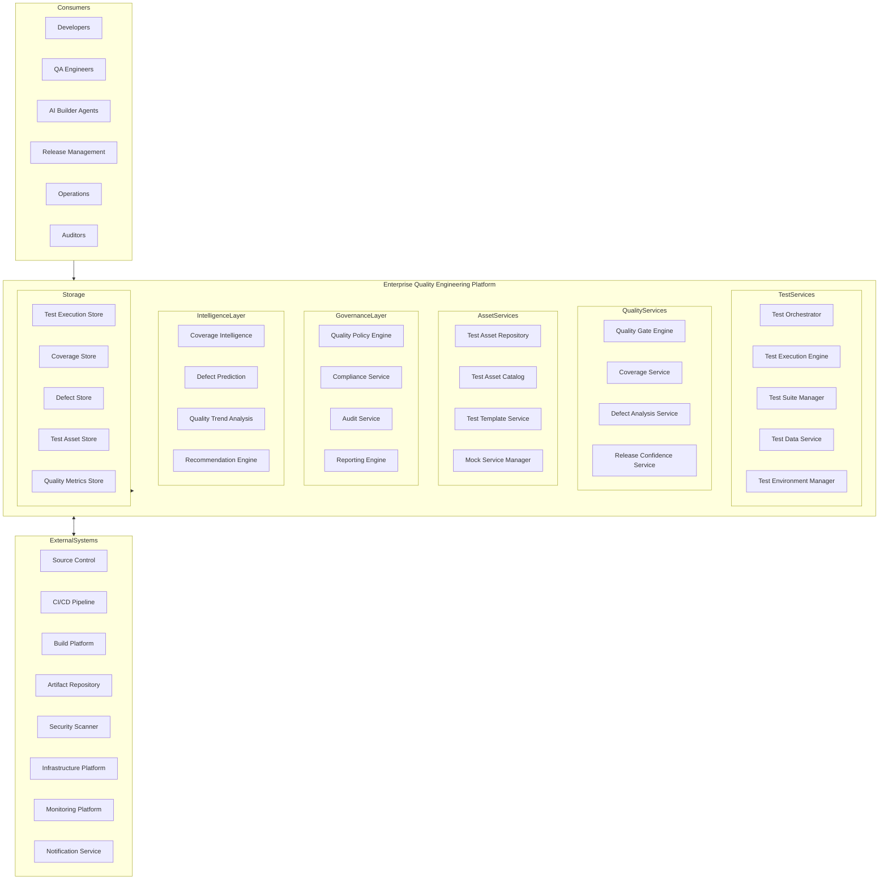
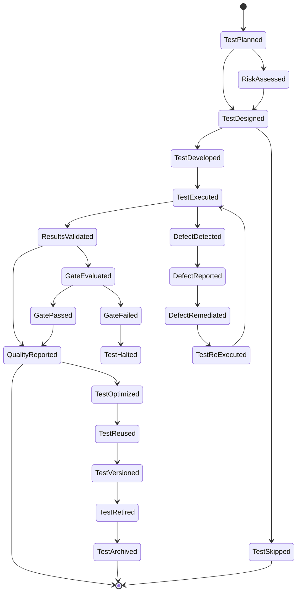
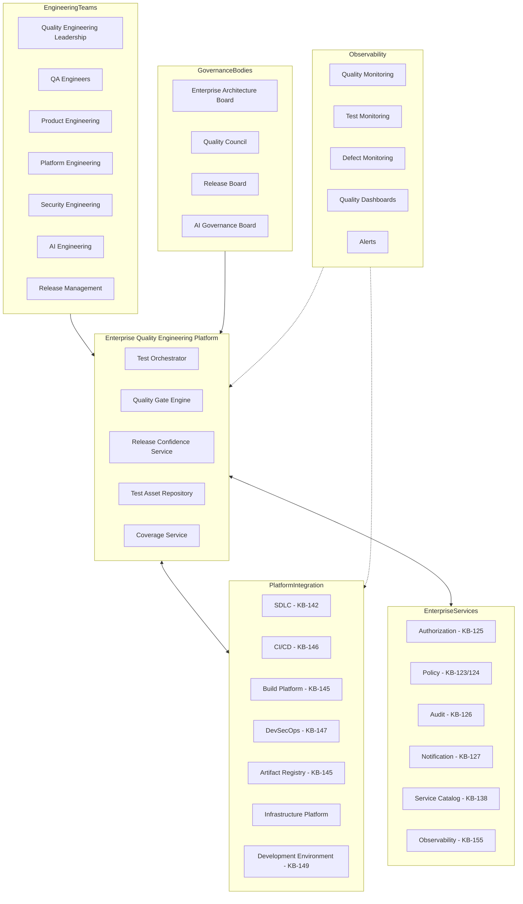

# KB-148 — Test Strategy & Quality Engineering Architecture

---

## Metadata

- **Document ID:** KB-148
- **Title:** Test Strategy & Quality Engineering Architecture
- **Suite:** Developer Experience (DX) & Engineering Platform Architecture
- **Version:** 1.0
- **Status:** Approved Architecture
- **Classification:** Enterprise Quality Engineering Architecture
- **Date:** 2026-07-12

---

## Executive Summary

The Enterprise Quality Engineering Platform provides a comprehensive, policy-driven, AI-ready quality framework governing all verification, validation, and quality assurance activities across the DUKADESK ecosystem. Quality is engineered throughout the entire software lifecycle rather than validated only before release, ensuring functional correctness, reliability, security, performance, usability, interoperability, resilience, and operational excellence across every engineering domain.

Quality assets, test environments, validation policies, release confidence criteria, and quality intelligence are treated as governed enterprise capabilities rather than team-level activities. All quality engineering is governed by this canonical architecture.

---

## Purpose

Define how DUKADESK standardizes enterprise quality engineering by integrating verification, validation, quality governance, continuous testing, release confidence, observability, and engineering intelligence throughout the complete software lifecycle.

---

## Scope

### In Scope

- Enterprise quality engineering architecture
- Enterprise test strategy
- Test governance
- Test lifecycle
- Test taxonomy
- Test asset architecture
- Test data architecture
- Test environments
- Quality gates
- Continuous testing
- AI-assisted testing
- Test observability
- Test analytics
- Engineering quality intelligence
- Release quality governance

### Out of Scope

- Test framework implementation
- Automation tooling implementation
- CI/CD implementation
- Runtime monitoring implementation
- Infrastructure implementation
- Defect management implementation

These are covered by dedicated Knowledge Base documents including KB-146 (CI/CD Pipeline Architecture), KB-147 (DevSecOps Architecture), KB-155 (Engineering Observability Architecture), and KB-156 (Engineering Metrics & Productivity Architecture) within this suite.

---

## Architectural Principles

| # | Principle | Description |
|---|-----------|-------------|
| 1 | Quality by Design | Quality requirements are defined during architecture and design, not retrofitted before release |
| 2 | Shift-Left Quality | Quality validation is performed as early as possible in the engineering lifecycle |
| 3 | Continuous Testing | Testing is executed continuously throughout the lifecycle, not only before release |
| 4 | Risk-Based Validation | Testing scope and depth are prioritized based on risk, impact, and change context |
| 5 | Test Automation First | All repeatable testing is automated; manual testing is reserved for exploratory validation |
| 6 | Reusable Quality Assets | Test cases, datasets, environments, and validation rules are governed reusable enterprise assets |
| 7 | Traceability by Default | All test execution is traceable to requirements, code changes, and quality gates |
| 8 | AI-Assisted Quality Engineering | AI capabilities augment test generation, coverage analysis, defect prediction, and quality intelligence |
| 9 | Vendor Independence | No dependency on specific test vendor implementations |
| 10 | Technology Neutrality | The architecture supports any technology stack without bias |
| 11 | Enterprise Scalability | Quality engineering platform scales across all teams, products, domains, and environments |
| 12 | Observability by Default | All test execution emits metrics, logs, traces, and events for enterprise quality visibility |

---

## Canonical Definitions

| Term | Definition |
|------|-----------|
| Quality Engineering | The continuous practice of engineering quality throughout the software lifecycle |
| Test Strategy | The enterprise approach to verification, validation, and quality assurance across all domains |
| Test Lifecycle | The complete lifecycle from test planning through execution, reporting, and retirement |
| Test Asset | A governed, reusable quality artifact including test cases, suites, datasets, and environments |
| Test Suite | A collection of related test cases organized for execution and reporting |
| Test Environment | A standardized, isolated, and reproducible context for test execution |
| Test Data | Data used for test execution with defined governance, privacy, and lifecycle controls |
| Test Coverage | The measured extent to which code, requirements, or risk areas are exercised by tests |
| Quality Gate | An automated checkpoint validating quality criteria before stage promotion |
| Verification | Confirmation that engineering outputs meet specified requirements |
| Validation | Confirmation that engineering outputs meet stakeholder needs and intended use |
| Test Intelligence | AI-driven insights into test effectiveness, coverage gaps, and quality trends |
| Continuous Testing | Automated testing executed continuously throughout the engineering lifecycle |
| Quality Baseline | The minimum quality requirements that every engineering domain must meet |
| Release Confidence | The measured certainty that a release meets quality, security, and compliance criteria |
| Defect Prevention | The practice of preventing defects through quality by design rather than detection |
| Enterprise Quality Platform | The canonical platform governing all quality engineering within DUKADESK |
| Quality Governance | The policies, roles, and processes governing enterprise quality engineering |
| Test Observability | Metrics, logs, traces, and events emitted by test execution and quality validation |
| Engineering Quality Intelligence | AI-driven insights into quality posture, defect trends, and engineering excellence |

---

## Enterprise Quality Engineering Platform



---

## Test Taxonomy

```mermaid
graph TB
    TT[Test Taxonomy] --> UNIT[Unit Testing]
    TT --> COMP[Component Testing]
    TT --> INTEG[Integration Testing]
    TT --> API_TEST[API Testing]
    TT --> CONTRACT[Contract Testing]
    TT --> SYSTEM[System Testing]
    TT --> FUNC[Functional Testing]
    TT --> E2E[End-to-End Testing]
    TT --> UAT[User Acceptance Testing]
    TT --> REGRESSION[Regression Testing]
    TT --> SMOKE[Smoke Testing]
    TT --> PERFORMANCE[Performance Testing]
    TT --> SEC_TEST[Security Testing]
    TT --> ACCESS[Accessibility Testing]
    TT --> AI_TEST[AI Validation Testing]
    TT --> INFRA_TEST[Infrastructure Testing]
    TT --> MKT_TEST[Marketplace Validation]
    TT --> FUTURE[Future Testing Domains]

    PERFORMANCE --> LOAD[Load Testing]
    PERFORMANCE --> STRESS[Stress Testing]
    PERFORMANCE --> SCALABILITY[Scalability Testing]
    PERFORMANCE --> RELIABILITY[Reliability Testing]
    PERFORMANCE --> RESILIENCE[Resilience Testing]
    PERFORMANCE --> CHAOS[Chaos Testing]

    AI_TEST --> AI_MODEL[AI Model Validation]
    AI_TEST --> AI_PROMPT[AI Prompt Testing]
    AI_TEST --> AI_GEN[AI-Generated Code Validation]
    AI_TEST --> AI_SAFETY[AI Safety Testing]

    INFRA_TEST --> IAAC[Infrastructure as Code Testing]
    INFRA_TEST --> CONFIG[Configuration Testing]
    INFRA_TEST --> CONT[Container Testing]

    UNIT --> WHITE_BOX[White-Box Tests]
    COMP --> INTRA_SVC[Intra-Service Tests]
    INTEG --> INTER_SVC[Inter-Service Tests]
    API_TEST --> REST[REST API Tests]
    API_TEST --> GRAPHQL[GraphQL API Tests]
    API_TEST --> GATEWAY[Gateway Tests]
    E2E --> UI[UI Tests]
    E2E --> WORKFLOW[Workflow Tests]
```



---

## Test Lifecycle



---

## Test Asset Architecture

```mermaid
graph TB
    subgraph TestAssetArchitecture[Test Asset Architecture]

        subgraph AssetTypes
            AT_SUITE[Test Suites]
            AT_CASE[Test Cases]
            AT_SCENARIO[Test Scenarios]
            AT_DATASET[Test Datasets]
            AT_ENV[Test Environments]
            AT_MOCK[Mock Services]
            AT_STUB[Stubs & Simulators]
            AT_FIXTURE[Test Fixtures]
            AT_TEMPLATE[Test Templates]
            AT_VALIDATION[Validation Rules]
        end

        subgraph AssetGovernance
            AG_VERSION[Version Control]
            AG_METADATA[Asset Metadata]
            AG_OWNERSHIP[Asset Ownership]
            AG_CLASSIFY[Asset Classification]
            AG_REVIEW[Asset Review]
            AG_DEPRECATE[Asset Deprecation]
        end

        subgraph AssetLifecycle
            AL_CREATE[Create]
            AL_REGISTER[Register]
            AL_VALIDATE[Validate]
            AL_PUBLISH[Publish]
            AL_VERSION[Version]
            AL_DEPLOY[Deploy to Environments]
            AL_RETIRE[Retire]
            AL_ARCHIVE[Archive]
        end

        subgraph AssetRelationships
            AR_REQ[Traced to Requirements]
            AR_CODE[Traced to Code]
            AR_DEFECT[Traced to Defects]
            AR_RISK[Traced to Risk]
            AR_GATE[Associated Gates]
        end

        subgraph AssetQuality
            AQ_COVERAGE[Coverage Metrics]
            AQ_EFFECTIVENESS[Effectiveness Metrics]
            AQ_MAINTENANCE[Maintenance History]
            AQ_REUSE[Reuse Count]
            AQ_FLAKE[Flakiness Score]
        end
    end

    AssetTypes --> AssetGovernance
    AssetGovernance --> AssetLifecycle
    AssetLifecycle --> AssetRelationships
    AssetRelationships --> AssetQuality
```



---

## Test Environment Architecture

```mermaid
graph TB
    subgraph TestEnvironmentArchitecture[Test Environment Architecture]

        subgraph EnvironmentTypes
            ET_DEV[Development Environment]
            ET_UNIT[Unit Test Environment]
            ET_INTEG[Integration Test Environment]
            ET_PERF[Performance Test Environment]
            ET_SEC[Security Test Environment]
            ET_STAGING[Staging Environment]
            ET_UAT[UAT Environment]
            ET_CHAOS[Chaos Engineering Environment]
            ET_AI[AI Test Environment]
            ET_SANDBOX[Sandbox Environment]
        end

        subgraph EnvironmentPolicies
            EP_ISOLATION[Environment Isolation]
            EP_STANDARD[Environment Standardization]
            EP_REPRO[Environment Reproducibility]
            EP_CLEANUP[Environment Cleanup]
            EP_BOOKING[Environment Booking]
        end

        subgraph EnvironmentProvisioning
            EP_TEMPLATE[Environment Template]
            EP_AUTO[Automated Provisioning]
            EP_CONFIG[Configuration Injection]
            EP_DATA[Test Data Seeding]
            EP_TEARDOWN[Automated Teardown]
        end

        subgraph EnvironmentObservability
            EO_HEALTH[Environment Health]
            EO_USAGE[Environment Usage]
            EO_AVAIL[Environment Availability]
            EO_COST[Environment Cost]
        end

        subgraph EnvironmentSecurity
            ES_ACCESS[Access Control]
            ES_ISOLATION[Network Isolation]
            ES_DATA[Data Protection]
            ES_SECRET[Secrets Injection]
        end
    end

    EnvironmentTypes --> EnvironmentPolicies
    EnvironmentPolicies --> EnvironmentProvisioning
    EnvironmentProvisioning --> EnvironmentObservability
    EnvironmentSecurity --> EnvironmentTypes
    EnvironmentSecurity --> EnvironmentProvisioning
```



---

## Release Quality Architecture

```mermaid
graph TB
    subgraph ReleaseQualityArchitecture[Release Quality Architecture]

        subgraph QualityGates
            GATE_CODE[Code Quality Gate]
            GATE_UNIT[Unit Test Gate]
            GATE_INTEG[Integration Test Gate]
            GATE_PERF[Performance Gate]
            GATE_SEC[Security Gate]
            GATE_COMPLIANCE[Compliance Gate]
            GATE_APPROVAL[Manual Approval Gate]
            GATE_RELEASE[Release Readiness Gate]
        end

        subgraph QualityCriteria
            QC_COVERAGE[Coverage Threshold]
            QC_PASS_RATE[Test Pass Rate]
            QC_PERF[Performance Benchmarks]
            QC_SEC[Security Baseline]
            QC_DEFECT[Defect Density]
            QC_REGRESSION[Regression Impact]
            QC_RISK[Risk Score]
        end

        subgraph ReleaseConfidence
            RC_SCORE[Confidence Score]
            RC_LEVEL[Confidence Level]
            RC_RISK[Release Risk Assessment]
            RC_RECOMMENDATION[Release Recommendation]
        end

        subgraph QualityEvidence
            QE_REPORT[Test Execution Report]
            QE_COVERAGE[Coverage Report]
            QE_SEC[Security Report]
            QE_PERF2[Performance Report]
            QE_COMPLIANCE[Compliance Attestation]
            QE_SIGN[Quality Sign-Off]
        end

        subgraph ReleaseDecision
            RD_APPROVED[Approved]
            RD_REJECTED[Rejected]
            RD_CONDITIONAL[Conditional Approval]
            RD_ROLLBACK[Rollback Required]
        end
    end

    QualityGates --> QualityCriteria
    QualityCriteria --> ReleaseConfidence
    ReleaseConfidence --> QualityEvidence
    QualityEvidence --> ReleaseDecision
```



---

## Enterprise Quality Operating Model



---

## Governance Architecture

```mermaid
graph TB
    subgraph QualityGovernance[Quality Governance Architecture]

        subgraph StrategicGovernance
            EAB2[Enterprise Architecture Board]
            QUAL_COUNCIL2[Quality Council]
            RELEASE_BOARD3[Release Board]
            PLATFORM_TEAM[Platform Engineering Team]
        end

        subgraph TestGovernance
            TEST_POLICY[Test Strategy Policy]
            TEST_STANDARD[Testing Standards]
            TEST_COVERAGE[Coverage Policy]
            TEST_DATA_GOV[Test Data Governance]
            TEST_ENV_GOV[Test Environment Governance]
        end

        subgraph QualityGovernance
            QUAL_BASELINE[Quality Baseline Standards]
            QUAL_GATE_POL[Quality Gate Policy]
            QUAL_METRIC[Quality Metrics Standards]
            DEFECT_POL[Defect Management Policy]
        end

        subgraph ReleaseGovernance
            REL_CRITERIA[Release Criteria Policy]
            REL_CONFIDENCE[Release Confidence Standards]
            REL_APPROVAL[Release Approval Policy]
            REL_ROLLBACK[Release Rollback Policy]
        end

        subgraph AIRelatedGovernance
            AI_TEST_POL[AI Test Validation Policy]
            AI_QUALITY[AI Quality Standards]
            AI_CONFIDENCE[AI Release Confidence]
        end

        subgraph Enforcement
            QUAL_ENG[Quality Policy Engine]
            GATE_ENF[Gate Enforcement]
            COVERAGE_ENF[Coverage Enforcement]
            VIO_ENG[Violation Engine]
            COR_ACT[Corrective Actions]
        end

        subgraph Policies
            MIN_COV[Minimum Code Coverage]
            MAX_FAIL[Maximum Failure Rate]
            MIN_PASS[Minimum Pass Rate]
            PERF_BENCH[Performance Benchmarks]
            FLAKE_LIMIT[Flakiness Limit]
        end
    end

    StrategicGovernance --> TestGovernance
    StrategicGovernance --> QualityGovernance
    StrategicGovernance --> ReleaseGovernance
    AIRelatedGovernance --> QualityGovernance
    TestGovernance --> Enforcement
    QualityGovernance --> Enforcement
    ReleaseGovernance --> Enforcement
    Policies --> Enforcement
```

---

## Continuous Testing Architecture

```mermaid
graph TB
    subgraph ContinuousTesting[Continuous Testing Architecture]

        subgraph TriggerEvents
            TRIG_COMMIT[Code Commit]
            TRIG_PR[Pull Request]
            TRIG_BUILD[Build Complete]
            TRIG_DEPLOY[Pre-Deployment]
            TRIG_SCHED[Scheduled Test]
            TRIG_MONITOR[Monitoring Alert]
            TRIG_AI[AI Quality Trigger]
        end

        subgraph TestSelection
            TS_CHANGE[Change-Based Selection]
            TS_RISK[Risk-Based Selection]
            TS_IMPACT[Impact Analysis]
            TS_HISTORY[Historical Selection]
            TS_SMART[AI-Assisted Selection]
        end

        subgraph TestExecution
            TE_PARALLEL[Parallel Execution]
            TE_DISTRIBUTED[Distributed Execution]
            TE_ORDERED[Ordered Execution]
            TE_RETRY[Flaky Test Retry]
            TE_QUARANTINE[Test Quarantine]
        end

        subgraph QualityValidation
            QV_GATE[Quality Gate Evaluation]
            QV_COVERAGE[Coverage Validation]
            QV_REGRESSION[Regression Analysis]
            QV_TREND[Quality Trend Analysis]
        end

        subgraph FeedbackLoops
            FB_DEVELOPER[Developer Feedback]
            FB_CI_CD[CI/CD Feedback]
            FB_DASHBOARD[Dashboard Update]
            FB_AI[AI Model Feedback]
            FB_RELEASE[Release Readiness]
        end

        subgraph Optimization
            OPT_SPEED[Test Speed Optimization]
            OPT_FLAKE[Flakiness Reduction]
            OPT_COVERAGE[Coverage Optimization]
            OPT_EFFICIENCY[Test Efficiency]
        end
    end

    TriggerEvents --> TestSelection
    TestSelection --> TestExecution
    TestExecution --> QualityValidation
    QualityValidation --> FeedbackLoops
    FeedbackLoops --> Optimization
    Optimization --> TestSelection
```



---

## Enterprise Quality Engineering Reference Model

```mermaid
graph TB
    subgraph ReferenceModel[Enterprise Quality Engineering Reference Model]

        subgraph QualityDomains
            QD1[Functional Quality</br>Correctness,</br>completeness]
            QD2[Reliability Quality</br>Availability,</br>resilience]
            QD3[Performance Quality</br>Speed, scalability,</br>efficiency]
            QD4[Security Quality</br>Vulnerability,</br>compliance]
            QD5[AI Quality</br>Model accuracy,</br>safety, fairness]
            QD6[User Experience Quality</br>Usability,</br>accessibility]
            QD7[Integration Quality</br>Interoperability,</br>contracts]
            QD8[Operational Quality</br>Observability,</br>manageability]
        end

        subgraph QualityStandards
            QS1[Quality by Design]
            QS2[Shift-Left Testing]
            QS3[Risk-Based Validation]
            QS4[Continuous Testing]
            QS5[Reusable Assets]
            QS6[Traceability]
            QS7[Automation First]
        end

        subgraph IntegrationPatterns
            IP1[SDLC - Embedded Quality]
            IP2[CI/CD - Automated Testing]
            IP3[DevSecOps - Security Validation]
            IP4[Artifact - Quality Attestation]
            IP5[Release - Quality Gate]
            IP6[AI - Test Generation]
        end

        subgraph QualityAttributes
            QA1[Measurable]
            QA2[Verifiable]
            QA3[Governed]
            QA4[Traceable]
            QA5[Automated]
            QA6[Observable]
        end
    end

    QualityDomains --> QualityStandards
    QualityStandards --> IntegrationPatterns
    IntegrationPatterns --> QualityAttributes
```



---

## Governance

| Domain | Governance Focus |
|--------|-----------------|
| Test Governance | Test strategy policy, testing standards, coverage requirements, test data governance |
| Quality Governance | Quality baseline standards, gate policies, metrics standards, defect management |
| Architecture Governance | Quality engineering architecture changes require architecture board approval |
| Security Governance | Test environment security, test data protection, secure testing practices |
| Compliance Governance | Testing compliance with regulatory requirements and audit standards |
| AI Governance | AI test validation policies, AI quality standards, AI release confidence |
| Release Governance | Release criteria policies, confidence standards, approval and rollback policies |
| Engineering Governance | Quality integration standards across all engineering domains |
| Operational Governance | Test platform operations, environment availability, test capacity management |
| Enterprise Governance | The Enterprise Architecture board and Quality Council govern platform evolution |

### Governance Enforcement Points

| Enforcement Point | Mechanism |
|-------------------|-----------|
| Test Asset Registration | Asset validation, metadata completeness, classification check |
| Test Environment Provisioning | Environment template compliance, isolation verification, cleanup policy |
| Test Execution | Authentication, authorization, environment selection, test data validation |
| Quality Gate Evaluation | Automated criteria validation, coverage check, pass rate verification |
| Release Confidence Assessment | Multi-gate evaluation, risk assessment, confidence scoring |
| Production Release Approval | Quality council authorization, compliance attestation, release sign-off |
| AI Test Validation | AI model validation gate, prompt safety check, bias assessment |

---

## Responsibilities

| Role | Responsibilities |
|------|-----------------|
| Enterprise Architecture Board | Governs quality engineering architecture, standards, and platform evolution |
| Quality Engineering Leadership | Defines enterprise test strategy, quality standards, and engineering quality policies |
| Platform Engineering | Develops, operates, and maintains the Enterprise Quality Engineering Platform |
| Product Engineering | Follows quality standards; develops tests; meets quality gates |
| Developer Experience Team | Defines test templates, quality tools, and developer quality workflows |
| Security | Defines security testing requirements; operates security validation |
| Compliance | Defines compliance testing requirements; audits quality evidence |
| AI Governance Board | Governs AI test validation, AI quality standards, and AI release confidence |
| Release Management | Governs release quality gates, confidence assessment, and release authorization |
| Operations | Manages test platform operations, environment availability, and test capacity |
| QA Engineers | Creates and maintains test assets; executes validation; reports quality status |

---

## Security

| Security Control | Description |
|------------------|-------------|
| Secure Testing | Test execution follows least privilege, zero trust, and secrets management |
| Protected Test Environments | Test environments are isolated, access-controlled, and regularly cleaned |
| Test Data Security | Test data is anonymized, classified, and governed per data protection policies |
| Identity-Aware Testing | All test operations are authenticated and authorized per identity |
| Least Privilege | Test environments and data are accessed with minimum required permissions |
| Zero Trust | Every test operation is authenticated, authorized, and verified |
| Policy Enforcement | Quality policies are enforced through automated gates and validators |
| Auditability | All test execution and quality validation is recorded in immutable audit log |
| Test Artifact Integrity | Test assets and quality evidence are cryptographically verified |
| Secure Quality Governance | Quality gates, confidence scores, and release decisions are tamper-proof |

### Security Zones

| Zone | Description |
|------|-------------|
| Development | Development test environments with team-level access |
| Testing | Shared test environments with automated access controls |
| Performance | Performance test environments with isolated infrastructure |
| Security | Security test environments with elevated controls |
| Staging | Staging environments with restricted quality gate access |
| Production | Production-adjacent test environments with audited access |

---

## Privacy

| Privacy Control | Description |
|----------------|-------------|
| Test Data Privacy | Test data is anonymized, masked, or synthetic to protect personal information |
| Sensitive Engineering Information | Quality findings containing sensitive data are classified and access-restricted |
| Regulatory Compliance | Test data handling complies with GDPR, CCPA, and regional regulations |
| Data Minimization | Only required test execution data is collected and processed |
| Cross-Border Governance | Test execution and quality data respects data residency requirements |
| Retention Governance | Test execution logs and quality evidence are retained per policy and purged when expired |
| Privacy Assurance | Regular privacy reviews for quality engineering platform capabilities |
| Confidential Validation Assets | Test assets containing business logic or intellectual property are access-restricted |

---

## Performance

| Consideration | Requirement |
|---------------|-------------|
| Enterprise-Scale Testing | Platform supports millions of test executions across all engineering domains |
| High-Volume Validation | Thousands of concurrent test executions across distributed workers |
| Parallel Execution | Test suites execute in parallel across optimized worker pools |
| Elastic Scalability | Test execution capacity scales horizontally with engineering demand |
| High Availability | 99.99% uptime for critical test orchestration and quality gate services |
| Operational Resilience | Graceful degradation under load with test queue backpressure |
| Efficient Quality Validation | Test execution completes within defined duration targets |
| Multi-Region Engineering Readiness | Quality services operate across global regions with distributed test execution |

### Performance Optimization

| Optimization | Description |
|--------------|-------------|
| Parallel Test Execution | Independent test suites execute in parallel across distributed workers |
| Test Impact Analysis | Only impacted tests are executed based on change analysis |
| Flaky Test Management | Flaky tests are automatically quarantined and reported |
| Test Suite Prioritization | Test suites are prioritized based on risk, coverage, and execution history |
| Distributed Execution | Tests execute across distributed worker pools for geographic optimization |
| Result Caching | Test results are cached and reused across identical test executions |

---

## Observability

| Observable Dimension | Metrics | Purpose |
|---------------------|---------|---------|
| Test Health | Test pass rate, execution duration, flakiness rate | Monitoring test platform health |
| Quality Health | Quality gate pass rate, defect density, coverage trends | Tracking overall quality posture |
| Coverage Analytics | Code coverage, requirement coverage, risk coverage | Understanding quality coverage |
| Governance Dashboards | Policy violation rate, gate failure rate, quality exception count | Monitoring quality governance |
| Operational Reporting | Daily test activity, environment utilization, team distribution | Operational quality management |
| Executive Reporting | Quality trends, release confidence, engineering excellence | Strategic quality intelligence |
| Release Confidence Metrics | Confidence score, gate pass rate, risk assessment | Release quality measurement |
| Defect Analytics | Defect density, discovery rate, remediation velocity | Defect trend analysis |
| Engineering Quality Intelligence | Quality debt, improvement velocity, domain quality scores | Engineering quality insights |
| Continuous Quality Metrics | Quality trend lines, improvement rates, regression prevention | Continuous quality monitoring |

### Observability Events

| Event Type | Trigger | Consumer |
|------------|---------|----------|
| TestSuiteStarted | Test suite execution initiated | Metrics store, orchestration service |
| TestSuiteCompleted | Test suite execution completed | Quality gate engine, reporting service |
| TestFailed | Individual test execution failed | Defect analysis, notification service |
| QualityGateEvaluated | Quality gate assessment completed | Release confidence service, pipeline orchestrator |
| QualityGateFailed | Quality gate evaluation failed | Engineering team, notification service |
| CoverageThresholdBreached | Coverage drops below defined threshold | Quality governance, notification service |
| FlakyTestDetected | Test identified as flaky | Test quarantine service, QA team |
| ReleaseConfidenceAssessed | Release confidence evaluation completed | Release board, release management |

---

## Failure Scenarios

| # | Scenario | Architectural Response |
|---|----------|----------------------|
| 1 | Incomplete Coverage | Coverage gate blocks promotion; coverage gap analysis triggered; development team notified |
| 2 | Test Environment Failures | Environment health check triggered; automatic failover to alternate environment |
| 3 | Quality Gate Failures | Pipeline blocked at gate; quality team notified; automated root cause analysis triggered |
| 4 | False Positives | Test result overridden with justification; false positive rate monitored; test improved |
| 5 | False Negatives | Missed defect detected downstream; test gap analysis triggered; test suite updated |
| 6 | AI-Generated Validation Failures | AI test results flagged for human review; AI model retraining triggered |
| 7 | Governance Bypass | Policy enforcement point blocks unauthorized operation; violation recorded with audit trail |
| 8 | Test Data Corruption | Test data integrity check triggered; last known good data restored; data pipeline analyzed |
| 9 | Release Quality Failures | Release blocked; quality evidence reviewed; remediation plan created |
| 10 | Recovery Failures | Journal-based recovery with replay; cross-service consistency verification |
| 11 | Missing Traceability | Traceability validation at quality gate; gap analysis triggered; requirement linkage enforced |
| 12 | Quality Regression | Regression detection triggered; automated bisection; regression root cause identified |

---

## Anti-Patterns

| # | Anti-Pattern | Description | Prohibited Because |
|---|-------------|-------------|-------------------|
| 1 | Testing Only Before Release | Quality validation performed only at end of lifecycle | Delays defect discovery; increases remediation cost; violates shift-left |
| 2 | Manual Quality Governance | Quality decisions made through manual processes without automated gates | Introduces inconsistency, delays, and auditability gaps |
| 3 | Shared Uncontrolled Test Environments | Test environments shared across teams without isolation policies | Creates test interference, data corruption, and unreliable results |
| 4 | Missing Traceability | Tests executed without traceability to requirements or code changes | Prevents coverage analysis, impact assessment, and audit compliance |
| 5 | Quality Without Measurable Coverage | Quality validated without defined coverage metrics or thresholds | Creates false confidence; prevents measurable quality improvement |
| 6 | AI-Generated Tests Without Validation | AI-generated test cases deployed without human review | Introduces incorrect, incomplete, or biased test validation |
| 7 | Independent Quality Standards | Teams defining quality standards outside enterprise policies | Creates inconsistent quality; prevents enterprise visibility |
| 8 | Production Testing Without Governance | Validation executed in production environments without authorization | Creates security risk, data integrity issues, and operational incidents |
| 9 | Duplicate Testing Assets | Redundant test cases, suites, or environments across teams | Wastes resources; creates maintenance burden; fragments quality visibility |
| 10 | Release Without Quality Evidence | Releases approved without complete quality evidence | Creates release risk; prevents audit compliance; erodes trust |

---

## Future Evolution

| # | Evolution Path | Description |
|---|---------------|-------------|
| 1 | Autonomous Quality Engineering | AI agents that autonomously generate, execute, and validate tests across all domains |
| 2 | AI-Driven Defect Prediction | ML-driven prediction of defect introduction, severity, and remediation priority |
| 3 | Self-Optimizing Test Strategies | AI that continuously optimizes test selection, prioritization, and execution based on risk |
| 4 | Intelligent Quality Governance | AI-driven quality policy adaptation based on project risk, team velocity, and domain context |
| 5 | Predictive Release Confidence | ML-driven release confidence prediction integrating quality, security, and operational data |
| 6 | Federated Quality Ecosystems | Quality federation across DUKADESK and partner ecosystems with shared validation |
| 7 | Continuous Engineering Intelligence | AI-driven insights into engineering quality trends, improvement opportunities, and excellence gaps |
| 8 | Enterprise Quality Digital Twins | Digital twin models that simulate quality outcomes based on engineering changes |

---

## Cross References

| Document ID | Title | Relationship |
|-------------|-------|-------------|
| KB-141 | Developer Experience Platform Architecture | Foundational DX platform that hosts quality engineering services |
| KB-142 | Software Development Lifecycle Architecture | Defines SDLC phases into which quality engineering is embedded |
| KB-145 | Build & Artifact Management Architecture | Defines build and artifact lifecycle validated by quality gates |
| KB-146 | CI/CD Pipeline Architecture | Defines CI/CD pipelines with embedded quality gates |
| KB-147 | DevSecOps Architecture | Defines security testing integrated with quality validation |
| KB-149 | Development Environment Architecture | Defines development environments used for test execution |
| KB-155 | Engineering Observability Architecture | Defines observability integrated with quality metrics |
| KB-156 | Engineering Metrics & Productivity Architecture | Defines quality-related engineering metrics |
| KB-158 | Engineering Governance Architecture | Defines governance enforced on quality operations |
| KB-160 | Developer Experience Reference Architecture | Comprehensive reference for the DX suite |

---

## Critical DUKADESK Architectural Rule

**All verification, validation, quality assurance, and release confidence activities within DUKADESK shall be governed exclusively through the canonical Enterprise Test Strategy & Quality Engineering Architecture. No application, Builder Studio module, Marketplace extension, AI Builder Agent, engineering team, platform service, or operational domain shall establish independent testing strategies, quality standards, validation processes, or release quality criteria outside the enterprise architecture, ensuring measurable quality, traceability, governance, security, AI readiness, and continuous engineering excellence across the DUKADESK ecosystem.**

(End of file - total 1077 lines)
