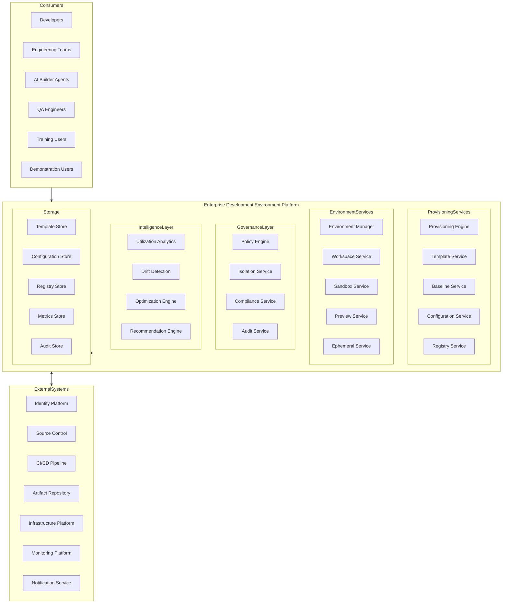
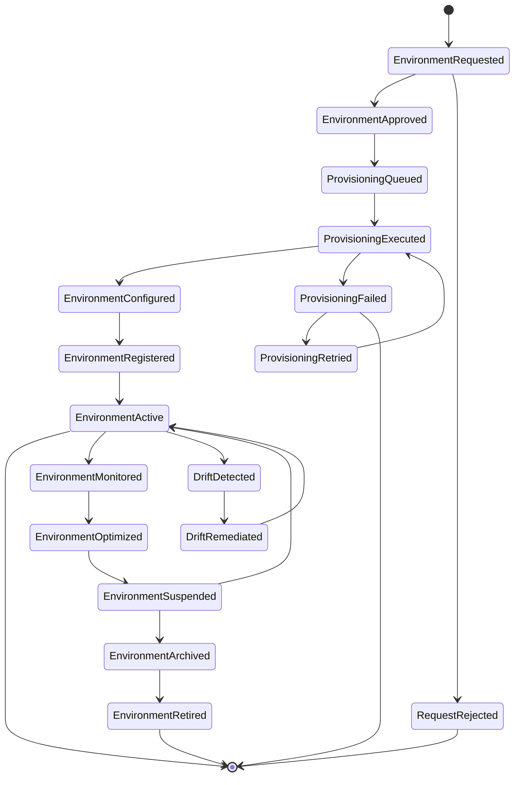
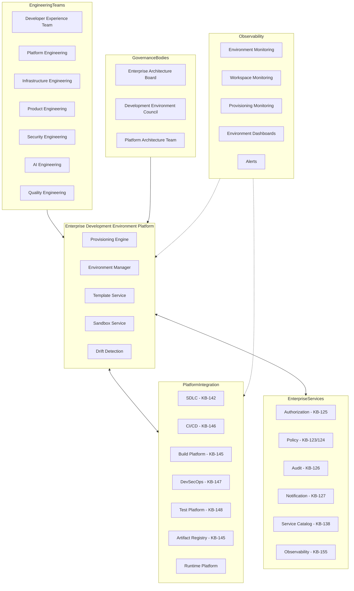

# KB-149 — Development Environment Architecture

---

## Metadata

- **Document ID:** KB-149
- **Title:** Development Environment Architecture
- **Suite:** Developer Experience (DX) & Engineering Platform Architecture
- **Version:** 1.0
- **Status:** Approved Architecture
- **Classification:** Enterprise Engineering Environment Architecture
- **Date:** 2026-07-12

---

## Executive Summary

The Enterprise Development Environment Platform provides standardized, secure, reproducible, isolated, policy-governed, observable, and AI-ready engineering environments supporting every phase of software engineering across the DUKADESK ecosystem. Development, testing, staging, demonstration, training, sandbox, preview, validation, and engineering workspaces are governed as enterprise capabilities rather than individually managed workspaces.

All engineering environments follow consistent lifecycle, configuration, isolation, and governance models defined by this canonical architecture.

---

## Purpose

Define how DUKADESK standardizes engineering environments across every product, platform, engineering team, AI Builder Agent, Builder Studio module, Marketplace extension, Runtime Platform service, Enterprise Platform Service, and future engineering capability.

---

## Scope

### In Scope

- Enterprise development environment architecture
- Environment taxonomy
- Workspace architecture
- Environment lifecycle
- Environment provisioning
- Environment governance
- Environment isolation
- Environment standardization
- Environment observability
- Environment policies
- AI engineering environments
- Sandbox architecture
- Preview environments
- Environment intelligence
- Engineering workspace governance

### Out of Scope

- Infrastructure implementation
- CI/CD implementation
- Container orchestration implementation
- Cloud implementation
- IDE implementation
- Device management implementation

These are covered by dedicated Knowledge Base documents including KB-146 (CI/CD Pipeline Architecture), KB-148 (Test Strategy & Quality Engineering Architecture), and KB-155 (Engineering Observability Architecture) within this suite.

---

## Architectural Principles

| # | Principle | Description |
|---|-----------|-------------|
| 1 | Environment as Code | Engineering environments are defined declaratively, versioned, and provisioned automatically |
| 2 | Standardization First | All environments follow enterprise-defined templates, baselines, and configuration standards |
| 3 | Self-Service Engineering | Environments are provisioned on demand through automated self-service workflows |
| 4 | Isolation by Default | Every engineering workspace is isolated from other workspaces and environments |
| 5 | Reproducibility | Environments produce identical engineering contexts given identical definitions |
| 6 | Security by Design | Environment provisioning and operation follow least privilege and zero trust |
| 7 | Automation First | All environment operations from provisioning to retirement are fully automated |
| 8 | AI-Ready Environments | Environments support AI Builder Agents, AI development, and AI-assisted engineering |
| 9 | Vendor Independence | No dependency on specific environment vendor implementations |
| 10 | Technology Neutrality | The architecture supports any technology stack without bias |
| 11 | Enterprise Scalability | Environment platform scales across all teams, products, domains, and regions |
| 12 | Observability by Default | All environment operations emit metrics, logs, traces, and events |

---

## Canonical Definitions

| Term | Definition |
|------|-----------|
| Development Environment | A standardized, isolated context for software engineering activities |
| Engineering Workspace | A provisioned environment instance assigned to an engineer, team, or AI agent |
| Sandbox Environment | An isolated, disposable environment for experimentation and learning |
| Preview Environment | An ephemeral environment for validating changes before production deployment |
| Shared Environment | An environment shared across multiple engineers or teams with defined boundaries |
| Dedicated Environment | An environment assigned to a single engineer, AI agent, or workload |
| Environment Template | A declarative specification defining environment configuration and policies |
| Environment Baseline | The minimum configuration and security standards every environment must meet |
| Environment Configuration | The set of parameters defining an environment's software, tools, and settings |
| Environment Lifecycle | The governed progression of an environment from request through retirement |
| Environment Registry | The canonical inventory of all enterprise engineering environments |
| Environment Catalog | A searchable index of environment templates and configurations |
| Workspace Provisioning | The automated process of creating and configuring engineering workspaces |
| Environment Isolation | The separation of environments through security, network, and data boundaries |
| Engineering Sandbox | A governed, disposable environment for engineering exploration and validation |
| Environment Governance | The policies, roles, and processes governing enterprise environments |
| Environment Drift | The divergence of an environment from its defined baseline configuration |
| Enterprise Engineering Environment | Any environment governed by the enterprise development environment architecture |
| Ephemeral Environment | A short-lived environment that is automatically destroyed after use |
| Persistent Environment | A long-lived environment maintained across engineering sessions |

---

## Enterprise Development Environment Platform

---

## Environment Taxonomy

```mermaid
graph TB
    ET[Environment Taxonomy] --> LOCAL_DEV[Local Development]
    ET --> PERSONAL_WS[Personal Workspace]
    ET --> SHARED_DEV[Shared Development]
    ET --> TEAM_DEV[Team Development]
    ET --> INTEG_ENV[Integration]
    ET --> TEST_ENV[Testing]
    ET --> QA_ENV[QA]
    ET --> UAT_ENV[UAT]
    ET --> STAGING_ENV[Staging]
    ET --> PREVIEW_ENV[Preview]
    ET --> DEMO_ENV[Demonstration]
    ET --> SANDBOX_ENV[Sandbox]
    ET --> AI_DEV_ENV[AI Development]
    ET --> STUDIO_ENV[Builder Studio Development]
    ET --> MKT_VALID_ENV[Marketplace Validation]
    ET --> DOC_ENV[Documentation]
    ET --> TRAINING_ENV[Training]
    ET --> EXPERIMENTAL[Experimental]
    ET --> DR_ENV[Disaster Recovery Validation]
    ET --> FUTURE_ENV[Future Environment Domains]

    LOCAL_DEV --> MACHINE[Local Machine]
    LOCAL_DEV --> CONTAINER[Local Container]

    INTEG_ENV --> CI_INTEG[CI Integration]
    INTEG_ENV --> SVC_INTEG[Service Integration]

    PREVIEW_ENV --> PR_PREVIEW[PR Preview]
    PREVIEW_ENV --> BRANCH_PREVIEW[Branch Preview]
    PREVIEW_ENV --> RELEASE_PREVIEW[Release Preview]

    SANDBOX_ENV --> EXP_SANDBOX[Exploration Sandbox]
    SANDBOX_ENV --> LEARN_SANDBOX[Learning Sandbox]
    SANDBOX_ENV --> PROTOTYPE_SANDBOX[Prototype Sandbox]

    AI_DEV_ENV --> MODEL_DEV[Model Development]
    AI_DEV_ENV --> PROMPT_DEV[Prompt Development]
    AI_DEV_ENV --> TRAIN_ENV[Training Environment]
```

---

## Environment Lifecycle

---

## Engineering Workspace Architecture

---

## Environment Standardization Model

```mermaid
graph TB
    subgraph StandardizationModel[Environment Standardization Model]

        subgraph TemplateStandards
            TS_BASE[Base Environment Template]
            TS_LANG[Language-Specific Templates]
            TS_FRAMEWORK[Framework-Specific Templates]
            TS_DOMAIN[Domain-Specific Templates]
            TS_ROLE[Role-Specific Templates]
            TS_AI[AI Environment Templates]
        end

        subgraph BaselineStandards
            BS_OS[Operating System Baseline]
            BS_SEC[Security Baseline]
            BS_TOOLS[Engineering Tools Baseline]
            BS_NETWORK[Network Configuration Baseline]
            BS_STORAGE[Storage Configuration Baseline]
            BS_MONITORING[Monitoring Baseline]
        end

        subgraph ConfigurationStandards
            CS_VERSION[Version Pinning]
            CS_SECRET[Secrets Injection Standards]
            CS_ENV_VAR[Environment Variable Standards]
            CS_NETWORK[Network Configuration Standards]
            CS_STORAGE[Storage Standards]
        end

        subgraph GovernanceControls
            GC_APPROVAL[Template Approval]
            GC_VERSION[Template Versioning]
            GC_COMPLIANCE[Baseline Compliance]
            GC_DRIFT[Drift Detection]
            GC_REMEDIATION[Automated Remediation]
        end

        subgraph StandardizationIntelligence
            SI_COMPLIANCE[Compliance Rates]
            SI_DRIFT[Drift Trends]
            SI_OPTIMIZATION[Optimization Opportunities]
        end
    end

    TemplateStandards --> BaselineStandards
    BaselineStandards --> ConfigurationStandards
    ConfigurationStandards --> GovernanceControls
    GovernanceControls --> StandardizationIntelligence
```

---

## Environment Isolation Architecture

```mermaid
graph TB
    subgraph IsolationArchitecture[Environment Isolation Architecture]

        subgraph IsolationLevels
            IL_TENANT[Tenant-Level Isolation]
            IL_WORKLOAD[Workload-Level Isolation]
            IL_ENVIRON[Environment-Level Isolation]
            IL_USER[User-Level Isolation]
            IL_PROCESS[Process-Level Isolation]
        end

        subgraph IsolationBoundaries
            IB_NETWORK[Network Isolation]
            IB_DATA[Data Isolation]
            IB_STORAGE[Storage Isolation]
            IB_IDENTITY[Identity Isolation]
            IB_SECRET[Secrets Isolation]
            IB_COMPUTE[Compute Isolation]
        end

        subgraph IsolationPolicies
            IP_TENANT_SEP[Tenant Separation Policy]
            IP_ENV_SEP[Environment Separation Policy]
            IP_CROSS_ACCESS[Cross-Environment Access Policy]
            IP_DATA_FLOW[Data Flow Policy]
            IP_NETWORK_SEG[Network Segmentation Policy]
        end

        subgraph SecurityBoundaries
            SB_TRUST[Trust Boundary]
            SB_PERIMETER[Perimeter Security]
            SB_EAST_WEST[East-West Security]
            SB_DATA[Data Boundary]
            SB_COMPLIANCE[Compliance Boundary]
        end

        subgraph IsolationObservability
            IO_VIOLATION[Isolation Violation Detection]
            IO_MONITORING[Isolation Monitoring]
            IO_AUDIT[Isolation Audit]
        end
    end

    IsolationLevels --> IsolationBoundaries
    IsolationBoundaries --> IsolationPolicies
    IsolationPolicies --> SecurityBoundaries
    SecurityBoundaries --> IsolationObservability
```

---

## Enterprise Development Environment Operating Model

---

## Governance Architecture

```mermaid
graph TB
    subgraph GovernanceArchitecture[Environment Governance Architecture]

        subgraph StrategicGovernance
            EAB2[Enterprise Architecture Board]
            DEV_ENV_COUNCIL2[Development Environment Council]
            PLATFORM_TEAM[Platform Engineering Team]
        end

        subgraph EnvironmentGovernance
            ENV_POLICY[Environment Policy Framework]
            TEMPLATE_GOV[Template Governance]
            BASELINE_GOV[Baseline Governance]
            LIFECYCLE_GOV[Lifecycle Governance]
            REGISTRY_GOV[Registry Governance]
        end

        subgraph SecurityGovernance
            SEC_ISOLATION[Isolation Policy]
            SEC_ACCESS[Access Control Policy]
            SEC_CREDENTIAL[Credential Management Policy]
            SEC_NETWORK[Network Security Policy]
        end

        subgraph ConfigurationGovernance
            CFG_VERSION[Configuration Versioning]
            CFG_DRIFT[Drift Detection Policy]
            CFG_REMEDIATION[Remediation Policy]
            CFG_AUDIT[Configuration Audit]
        end

        subgraph ComplianceGovernance
            COMP_STANDARD[Environment Standards]
            COMP_EVIDENCE[Compliance Evidence]
            COMP_REPORT[Compliance Reporting]
        end

        subgraph Enforcement
            ENF_PROV[Provisioning Enforcement]
            ENF_BASELINE[Baseline Enforcement]
            ENF_DRIFT[Drift Remediation]
            ENF_ISOLATION[Isolation Enforcement]
            ENF_LIFECYCLE[Lifecycle Enforcement]
        end
    end

    StrategicGovernance --> EnvironmentGovernance
    StrategicGovernance --> SecurityGovernance
    EnvironmentGovernance --> ConfigurationGovernance
    SecurityGovernance --> ConfigurationGovernance
    ConfigurationGovernance --> ComplianceGovernance
    EnvironmentGovernance --> Enforcement
    SecurityGovernance --> Enforcement
    ComplianceGovernance --> Enforcement
```

---

## Environment Intelligence Architecture

```mermaid
graph TB
    subgraph EnvironmentIntelligence[Environment Intelligence Architecture]

        subgraph DataSources
            DS_PROV[Provisioning Logs]
            DS_USAGE[Usage Metrics]
            DS_HEALTH[Environment Health]
            DS_DRIFT[Drift Reports]
            DS_COST[Cost Data]
            DS_PERF[Performance Metrics]
            DS_USER_FEEDBACK[User Feedback]
        end

        subgraph AnalysisEngines
            AE_UTIL[Utilization Analysis]
            AE_DRIFT[Drift Pattern Analysis]
            AE_COST[Cost Optimization Analysis]
            AE_PERF[Performance Analysis]
            AE_PREDICT[Predictive Analysis]
        end

        subgraph IntelligenceOutputs
            IO_UTIL_REPORT[Utilization Report]
            IO_OPT_REC[Optimization Recommendations]
            IO_DRIFT_TREND[Drift Trends]
            IO_COST_INSIGHT[Cost Insights]
            IO_CAPACITY[Capacity Planning]
        end

        subgraph IntelligenceActions
            IA_AUTO_OPT[Automated Optimization]
            IA_DRIFT_REMEDIATE[Automated Drift Remediation]
            IA_REC_PROV[Provisioning Recommendations]
            IA_ALERT[Environment Alerts]
            IA_NOTIFY2[Stakeholder Notification]
        end

        subgraph IntelligenceConsumers
            IC_PLATFORM[Platform Team]
            IC_ENG[Engineering Teams]
            IC_EXEC[Executives]
            IC_AI[AI Systems]
        end

        subgraph FeedbackLoop
            FL_COLLECT2[Collect Feedback]
            FL_ADJUST2[Adjust Models]
            FL_IMPROVE2[Continuous Improvement]
        end
    end

    DataSources --> AnalysisEngines
    AnalysisEngines --> IntelligenceOutputs
    IntelligenceOutputs --> IntelligenceActions
    IntelligenceActions --> IntelligenceConsumers
    IntelligenceConsumers --> FeedbackLoop
    FeedbackLoop --> AnalysisEngines
```

---

## Enterprise Development Environment Reference Model

```mermaid
graph TB
    subgraph ReferenceModel[Enterprise Development Environment Reference Model]

        subgraph EnvironmentDomains
            ED1[Local Development</br>Personal workspaces,</br>local tooling]
            ED2[Shared Development</br>Team environments,</br>collaboration]
            ED3[Integration Testing</br>CI integration,</br>service test]
            ED4[Preview Environments</br>PR preview,</br>branch preview]
            ED5[Sandbox Environments</br>Exploration,</br>prototyping]
            ED6[AI Engineering</br>Model dev,</br>prompt engineering]
            ED7[Marketplace Validation</br>Extension testing,</br>package validation]
            ED8[Training & Demo</br>Learning,</br>demonstration]
        end

        subgraph EnvironmentStandards
            ES1[Environment as Code]
            ES2[Standardized Templates]
            ES3[Consistent Baselines]
            ES4[Automated Provisioning]
            ES5[Isolation by Default]
            ES6[Self-Service]
            ES7[Observability]
        end

        subgraph IntegrationPatterns
            IP1[SDLC - Environment Provisioning]
            IP2[CI/CD - Ephemeral Environments]
            IP3[DevSecOps - Security Validation]
            IP4[Artifact - Environment Configuration]
            IP5[Portal - Self-Service Catalog]
            IP6[AI - Workspace Provisioning]
        end

        subgraph QualityAttributes
            QA1[Reproducible]
            QA2[Isolated]
            QA3[Governed]
            QA4[Observable]
            QA5[Efficient]
            QA6[Secure]
        end
    end

    EnvironmentDomains --> EnvironmentStandards
    EnvironmentStandards --> IntegrationPatterns
    IntegrationPatterns --> QualityAttributes
```

---

## Governance

| Domain | Governance Focus |
|--------|-----------------|
| Environment Governance | Environment policies, template governance, baseline standards, lifecycle controls |
| Security Governance | Isolation policies, access controls, credential management, network security |
| Configuration Governance | Configuration versioning, drift detection, remediation policies, configuration audit |
| Compliance Governance | Environment standards compliance, evidence collection, compliance reporting |
| AI Governance | AI engineering environment standards, AI workspace governance |
| Lifecycle Governance | Environment request, approval, provisioning, suspension, retirement policies |
| Engineering Governance | Environment standards across all engineering domains |
| Operational Governance | Environment platform operations, capacity management, environment monitoring |
| Platform Governance | Environment platform evolution and architecture governance |
| Enterprise Governance | The Enterprise Architecture board governs environment platform evolution |

### Governance Enforcement Points

| Enforcement Point | Mechanism |
|-------------------|-----------|
| Environment Request | Authorization check, resource approval, template selection validation |
| Environment Provisioning | Template compliance, baseline validation, configuration verification |
| Environment Activation | Security scan, isolation verification, policy enforcement |
| Environment Monitoring | Continuous baseline compliance, drift detection, utilization tracking |
| Environment Suspension | Idle timeout policy, resource reclamation, state preservation |
| Environment Retirement | Data retention policy, cleanup verification, registry update |

---

## Responsibilities

| Role | Responsibilities |
|------|-----------------|
| Enterprise Architecture Board | Governs environment architecture, standards, and platform evolution |
| Platform Engineering | Develops, operates, and maintains the Enterprise Development Environment Platform |
| Developer Experience Team | Defines environment templates, workspace standards, and developer provisioning workflows |
| Infrastructure Engineering | Operates environment infrastructure, manages capacity, ensures environment availability |
| Product Engineering | Uses enterprise environments; provides feedback on environment quality and usability |
| Security | Defines environment security policies; validates environment isolation and access controls |
| Compliance | Defines environment compliance requirements; audits environment governance |
| AI Governance Board | Governs AI engineering environment standards and AI workspace governance |
| Operations | Manages environment platform operations, capacity, and lifecycle enforcement |
| Engineering Leadership | Ensures team compliance with environment standards; champions environment best practices |

---

## Security

| Security Control | Description |
|------------------|-------------|
| Zero Trust Environments | Every environment access is authenticated, authorized, and verified |
| Secure Engineering Workspaces | Workspaces follow hardened configurations with least privilege access |
| Identity-Aware Environments | Environment access is tied to verified engineering identities |
| Least Privilege | Workspaces provisioned with minimum required permissions and tooling |
| Environment Isolation | Environments are isolated through network, data, and compute boundaries |
| Policy Enforcement | Environment policies are enforced through automated provisioning and monitoring |
| Auditability | All environment operations are recorded in immutable audit log |
| Environment Integrity | Environment configurations are cryptographically verified against baselines |
| Secure Provisioning | Provisioning follows secure supply chain practices for tools and dependencies |
| Engineering Trust Boundaries | Environments are segmented by trust zones with defined security controls |

### Security Zones

| Zone | Description |
|------|-------------|
| Development | Development environments with team-level isolation and access |
| Testing | Testing environments with automated access controls and data isolation |
| Preview | Preview environments with ephemeral isolation and restricted network access |
| Sandbox | Sandbox environments with limited privileges and automatic cleanup |
| AI Development | AI development environments with AI-specific security controls |
| Marketplace Validation | Marketplace environments with elevated validation controls |

---

## Privacy

| Privacy Control | Description |
|----------------|-------------|
| Sensitive Engineering Environments | Environment configurations containing sensitive data are classified and access-restricted |
| Test Data Privacy | Test data in environments follows data protection and anonymization policies |
| Regulatory Compliance | Environment data handling complies with GDPR, CCPA, and regional regulations |
| Data Minimization | Only required tools and data are provisioned in engineering environments |
| Cross-Border Governance | Environment provisioning respects data residency requirements |
| Retention Governance | Environment data and configurations are retained per policy and purged when expired |
| Privacy Assurance | Regular privacy reviews for environment platform capabilities |
| Confidential Engineering Assets | Workspace configurations and engineering data are access-restricted |

---

## Performance

| Consideration | Requirement |
|---------------|-------------|
| Enterprise-Scale Engineering Environments | Platform supports thousands of concurrent environments across all teams |
| Elastic Provisioning | Environments provision in seconds with automated scaling |
| High Availability | 99.99% uptime for critical environment provisioning and registry services |
| Operational Resilience | Graceful degradation under load with provisioning queue backpressure |
| Efficient Environment Startup | Workspaces are ready for engineering use within defined startup targets |
| Global Engineering Readiness | Environments provision across global regions with local optimization |
| Multi-Region Support | Environment templates and baselines support multi-region deployment |
| Engineering Productivity Optimization | Environment provisioning and startup minimize engineering wait time |

### Performance Optimization

| Optimization | Description |
|--------------|-------------|
| Template Caching | Environment templates are cached for fast provisioning |
| Pre-Warmed Environments | Frequently used environment types are pre-warmed for instant provisioning |
| Parallel Provisioning | Environment components provision in parallel for reduced startup time |
| Incremental Configuration | Environment configuration applies incrementally using cached base images |
| Idle Environment Reclamation | Idle environments are automatically suspended to reclaim resources |
| Capacity Pre-Allocation | Environment capacity is pre-allocated based on usage patterns |

---

## Observability

| Observable Dimension | Metrics | Purpose |
|---------------------|---------|---------|
| Environment Health | Provisioning success rate, environment availability, drift compliance rate | Monitoring environment platform health |
| Workspace Health | Workspace count, active usage, suspension rate | Tracking workspace utilization |
| Provisioning Analytics | Provisioning time, template distribution, approval time | Understanding provisioning patterns |
| Governance Dashboards | Baseline compliance rate, drift detection rate, policy violation count | Monitoring environment governance |
| Operational Reporting | Daily provisioning activity, environment utilization, team distribution | Operational environment management |
| Executive Reporting | Environment efficiency trends, cost optimization, platform adoption | Strategic environment intelligence |
| Environment Utilization | Active environments, idle ratio, resource consumption | Resource efficiency tracking |
| Engineering Productivity Insights | Provision wait time, workspace startup time, environment quality score | Engineering productivity measurement |
| Environment Lifecycle Analytics | Environment age distribution, lifecycle stage distribution, retirement rate | Lifecycle efficiency tracking |
| Platform Intelligence | Provisioning trends, capacity forecasting, optimization recommendations | Platform improvement insights |

### Observability Events

| Event Type | Trigger | Consumer |
|------------|---------|----------|
| EnvironmentRequested | New environment request submitted | Approval service, provisioning queue |
| EnvironmentProvisioned | Environment provisioning completed | Registry service, notification service |
| EnvironmentActivated | Environment activated for engineering use | Workspace service, metrics store |
| DriftDetected | Configuration drift identified | Drift remediation service, platform team |
| EnvironmentSuspended | Environment suspended due to inactivity | Resource manager, registry service |
| EnvironmentRetired | Environment retired and cleaned up | Registry service, audit service |
| WorkspaceCreated | New workspace provisioned for engineer | Workspace service, metrics store |
| ProvisioningFailed | Environment provisioning failed | Platform team, notification service |

---

## Failure Scenarios

| # | Scenario | Architectural Response |
|---|----------|----------------------|
| 1 | Environment Drift | Drift detection triggers automated remediation; deviation reported and baseline restored |
| 2 | Configuration Inconsistencies | Configuration validation at provisioning; inconsistency reported; template corrected |
| 3 | Provisioning Failures | Automated retry with backoff; notification to engineer; escalation on repeated failure |
| 4 | Workspace Corruption | Workspace health check detects corruption; automated workspace rebuild triggered |
| 5 | Governance Bypass | Policy enforcement point blocks unauthorized operation; violation recorded with audit trail |
| 6 | Security Isolation Failures | Isolation boundary violation detected; environment quarantined; security team notified |
| 7 | Environment Abandonment | Orphan detection service identifies unused environments; suspension and archival triggered |
| 8 | Template Inconsistencies | Template validation at registration; inconsistency reported; template version rollback |
| 9 | AI Environment Failures | AI workspace health check; automated environment rebuild; AI engineering team notified |
| 10 | Recovery Failures | Journal-based recovery with replay; cross-service consistency verification |
| 11 | Resource Exhaustion | Capacity monitoring detects exhaustion; provisioning queued; capacity scaling triggered |
| 12 | Unauthorized Environment Creation | Authorization enforcement blocks creation; violation logged; platform team notified |

---

## Anti-Patterns

| # | Anti-Pattern | Description | Prohibited Because |
|---|-------------|-------------|-------------------|
| 1 | Individually Managed Environments | Engineers manually configuring and managing their own environments | Breaks standardization, reproducibility, security, governance |
| 2 | Manual Environment Provisioning | Environments provisioned through manual processes without automation | Introduces errors, inconsistencies, security gaps, delays |
| 3 | Environment Configuration Drift | Environments diverging from defined baselines without detection or remediation | Creates inconsistency, security vulnerabilities, reproducibility failures |
| 4 | Shared Production Credentials | Production credentials shared with development environments | Creates critical security vulnerability, credential exposure risk |
| 5 | Uncontrolled Sandbox Environments | Sandbox environments without governance, isolation, or cleanup policies | Creates security gaps, resource waste, data leakage risk |
| 6 | Hardcoded Environment Configurations | Environment configuration embedded in code rather than managed through platform | Prevents standardization, drift detection, governance enforcement |
| 7 | Environment Creation Outside Governance | Teams provisioning environments outside enterprise platform | Creates security risks, governance gaps, compliance blind spots |
| 8 | Long-Lived Unmanaged Workspaces | Workspaces maintained indefinitely without lifecycle enforcement | Wastes resources, increases security risk, creates maintenance burden |
| 9 | Independent Engineering Standards | Teams defining environment standards outside enterprise policies | Creates inconsistent environments, prevents enterprise visibility |
| 10 | Environment Duplication | Redundant environment configurations across teams | Wastes effort, creates maintenance burden, fragments governance |

---

## Future Evolution

| # | Evolution Path | Description |
|---|---------------|-------------|
| 1 | Autonomous Engineering Environments | AI agents that autonomously provision, configure, and manage engineering environments |
| 2 | AI-Generated Development Workspaces | AI that generates optimized workspace configurations based on engineering context |
| 3 | Self-Healing Environments | Environments that automatically detect and remediate drift, corruption, and misconfiguration |
| 4 | Predictive Environment Optimization | ML-driven prediction of environment requirements, usage patterns, and optimization opportunities |
| 5 | Federated Engineering Ecosystems | Environment federation across DUKADESK and partner ecosystems |
| 6 | Intelligent Provisioning | AI-driven provisioning that anticipates engineering needs and pre-provisions environments |
| 7 | Engineering Digital Twins | Digital twin models simulating environment configurations for optimization |
| 8 | Enterprise Engineering Intelligence | AI-driven insights into environment utilization, engineering productivity, and platform efficiency |

---

## Cross References

| Document ID | Title | Relationship |
|-------------|-------|-------------|
| KB-141 | Developer Experience Platform Architecture | Foundational DX platform that hosts development environment services |
| KB-142 | Software Development Lifecycle Architecture | Defines SDLC phases requiring development environments |
| KB-145 | Build & Artifact Management Architecture | Defines build environments integrated with dev environment platform |
| KB-146 | CI/CD Pipeline Architecture | Defines CI/CD pipelines consuming ephemeral environments |
| KB-147 | DevSecOps Architecture | Defines security integration for environment isolation and compliance |
| KB-148 | Test Strategy & Quality Engineering Architecture | Defines test environments provisioned through dev environment platform |
| KB-155 | Engineering Observability Architecture | Defines observability integrated with environment metrics |
| KB-158 | Engineering Governance Architecture | Defines governance enforced on environment operations |
| KB-160 | Developer Experience Reference Architecture | Comprehensive reference for the DX suite |

---

## Critical DUKADESK Architectural Rule

**All engineering environments within DUKADESK shall be provisioned, governed, secured, standardized, and managed exclusively through the canonical Enterprise Development Environment Architecture. No application, Builder Studio module, Marketplace extension, AI Builder Agent, engineering team, platform service, or operational domain shall establish independent engineering environments, workspace standards, provisioning mechanisms, or governance models outside the enterprise architecture, ensuring reproducibility, security, isolation, observability, AI readiness, and enterprise-wide engineering consistency.**

(End of file - total 1044 lines)
