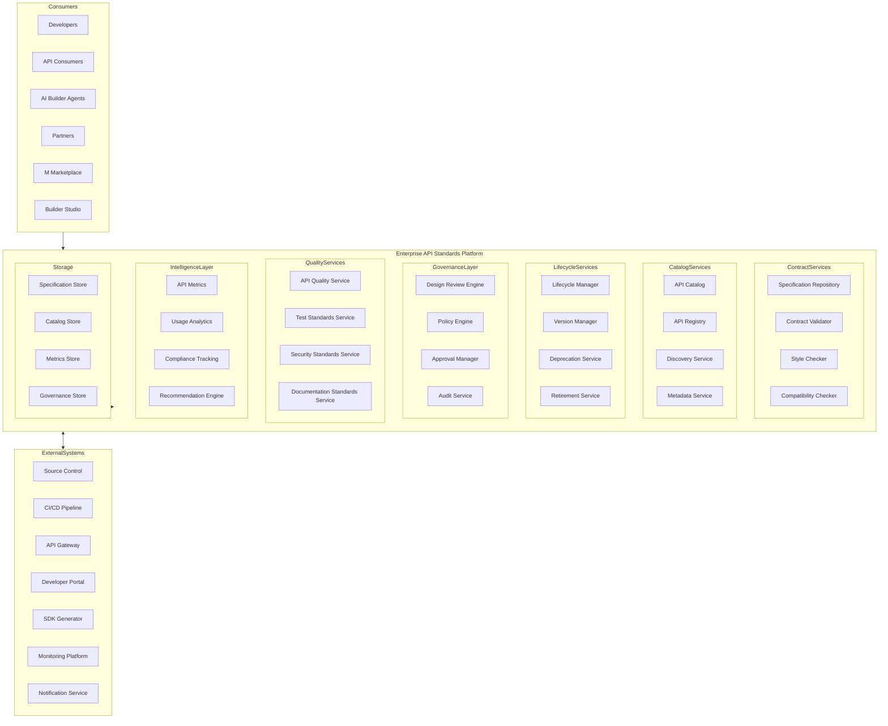
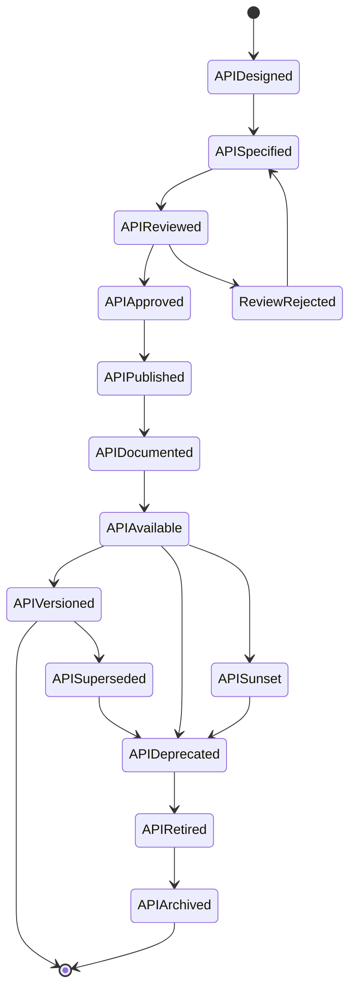
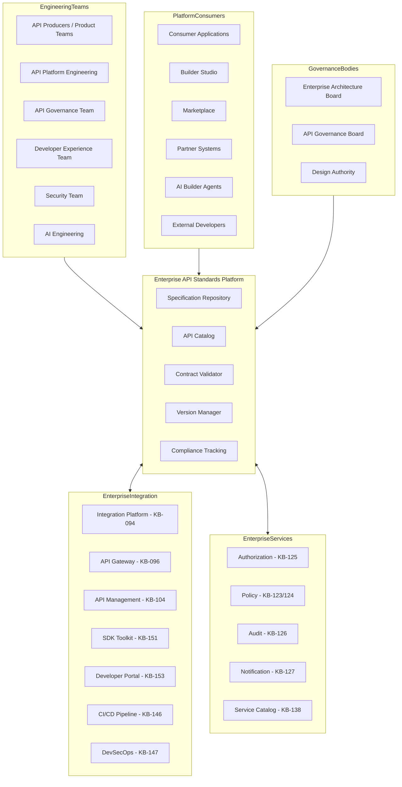

# KB-150 — API Development Standards Architecture

---

## Metadata

- **Document ID:** KB-150
- **Title:** API Development Standards Architecture
- **Suite:** Developer Experience (DX) & Engineering Platform Architecture
- **Version:** 1.0
- **Status:** Approved Architecture
- **Classification:** Enterprise API Engineering Architecture
- **Date:** 2026-07-12

---

## Executive Summary

The Enterprise API Development Standards provide a unified architectural framework governing how APIs are designed, documented, versioned, secured, validated, evolved, and consumed across the DUKADESK ecosystem. All internal, public, partner, Marketplace, Builder Studio, AI, platform, event, and administrative APIs are governed as enterprise products with defined contracts, consistent design patterns, standardized lifecycles, and enterprise-wide governance.

APIs are treated as governed enterprise products rather than implementation artifacts. Every API follows the canonical standards defined by this architecture.

---

## Purpose

Define how DUKADESK standardizes API engineering across all platform domains while enabling secure integrations, reusable services, AI-assisted development, enterprise governance, and ecosystem interoperability.

---

## Scope

### In Scope

- Enterprise API standards
- API design architecture
- API taxonomy
- API specification governance
- API lifecycle
- API versioning architecture
- API consistency standards
- API documentation standards
- API discoverability
- API quality standards
- API testing standards
- API security standards
- API governance
- API observability
- AI-ready API design

### Out of Scope

- API Gateway implementation
- API runtime implementation
- Integration implementation
- SDK implementation
- Identity implementation
- Infrastructure implementation

These are covered by dedicated Knowledge Base documents including KB-094 (Integration Platform Architecture), KB-096 (API Gateway Architecture), KB-104 (API Management Architecture), and KB-151 (SDK & Developer Toolkit Architecture) within or related to this suite.

---

## Architectural Principles

| # | Principle | Description |
|---|-----------|-------------|
| 1 | API-First Architecture | APIs are designed before implementation; the interface contract is the authoritative artifact |
| 2 | Contract-First Design | Every API is defined by a machine-validable contract before development begins |
| 3 | Consumer-Centric Design | APIs are designed for consumer needs with consistent, intuitive, and predictable interfaces |
| 4 | Consistency by Default | All APIs follow enterprise-wide naming, structure, error, and behavior conventions |
| 5 | Discoverability by Design | Every API is cataloged, searchable, and self-describing through standardized metadata |
| 6 | Secure by Design | Security requirements are defined in the API contract and enforced at every interface boundary |
| 7 | Backward Compatibility | API evolution preserves backward compatibility within a major version |
| 8 | Reuse over Duplication | API capabilities are reused across consumers rather than duplicated with variations |
| 9 | AI-Ready Interfaces | APIs are designed with machine-readable contracts, semantic metadata, and structured responses |
| 10 | Vendor Independence | No dependency on specific API vendor implementations |
| 11 | Technology Neutrality | The architecture supports any protocol, format, or technology stack without bias |
| 12 | Enterprise Scalability | API standards scale across all teams, products, domains, and ecosystems |
| 13 | Observability by Default | Every API emits standardized metrics, logs, traces, and events |

---

## Canonical Definitions

| Term | Definition |
|------|-----------|
| API | A governed, versioned, and documented interface enabling programmatic interaction between systems |
| API Contract | A machine-validable specification defining API behavior, structure, and constraints |
| API Specification | A formal description of API operations, data models, and interaction patterns |
| API Product | An API managed as a governed enterprise product with defined lifecycle, ownership, and consumers |
| API Consumer | A system, service, or application that consumes an API |
| API Producer | A team or service that develops, publishes, and maintains an API |
| API Lifecycle | The governed progression of an API from proposal through specification to retirement |
| API Catalog | A searchable inventory of all enterprise APIs with metadata, documentation, and status |
| API Registry | The canonical inventory of all enterprise API contracts with versioning and governance |
| API Taxonomy | A classification hierarchy organizing APIs by domain, type, and consumer category |
| API Version | A semantic identifier denoting the API's interface state and compatibility boundary |
| API Deprecation | The governed notification and transition process for retiring an API version |
| API Compatibility | The degree to which an API version can replace another without breaking consumers |
| API Governance | The policies, roles, and processes governing enterprise API design and evolution |
| API Style Guide | A set of conventions governing API naming, structure, error handling, and documentation |
| API Standard | A mandatory pattern, format, or convention all enterprise APIs must follow |
| Enterprise API | Any API governed by the enterprise API development standards |
| Service Contract | A formal agreement between API producer and consumer defining behavior, SLA, and obligations |
| Interface Evolution | The governed process of changing an API while managing consumer impact |
| API Discoverability | The ability for consumers to find, understand, and evaluate APIs through the enterprise catalog |

---

## Enterprise API Standards Platform

---

## API Taxonomy

```mermaid
graph TB
    API_TAX[API Taxonomy] --> INTERNAL_API[Internal APIs]
    API_TAX --> PUBLIC_API[Public APIs]
    API_TAX --> PARTNER_API[Partner APIs]
    API_TAX --> ADMIN_API[Administrative APIs]
    API_TAX --> STUDIO_API[Builder Studio APIs]
    API_TAX --> MKT_API[Marketplace APIs]
    API_TAX --> AI_API[AI APIs]
    API_TAX --> DATA_API[Data APIs]
    API_TAX --> INTEG_API[Integration APIs]
    API_TAX --> EVENT_API[Event APIs]
    API_TAX --> WORKFLOW_API[Workflow APIs]
    API_TAX --> SEC_API[Security APIs]
    API_TAX --> OPS_API[Operational APIs]
    API_TAX --> PLATFORM_API[Platform APIs]
    API_TAX --> FUTURE_API[Future API Domains]

    INTERNAL_API --> SVC_API[Service APIs]
    INTERNAL_API --> MICRO_API[Microservice APIs]
    INTERNAL_API --> LIB_API[Library APIs]

    PUBLIC_API --> OPEN_API[Open APIs]
    PUBLIC_API --> BILLING_API[Billing APIs]
    PUBLIC_API --> SUBSCRIPTION[Subscription APIs]

    AI_API --> LLM_API[LLM APIs]
    AI_API --> MODEL_API[Model Serving APIs]
    AI_API --> PROMPT_API[Prompt Management APIs]
    AI_API --> EMBEDDING_API[Embedding APIs]

    EVENT_API --> DOMAIN_EVENT[Domain Event APIs]
    EVENT_API --> STREAM_EVENT[Stream Event APIs]
    EVENT_API --> NOTIF_EVENT[Notification Event APIs]

    WORKFLOW_API --> ORC_API[Orchestration APIs]
    WORKFLOW_API --> TASK_API[Task APIs]
    WORKFLOW_API --> APPROVAL_API[Approval APIs]
```

---

## API Lifecycle

---

## API Contract Architecture

```mermaid
graph TB
    subgraph APIContractArchitecture[API Contract Architecture]

        subgraph ContractLayers
            CL_INTERFACE[Interface Layer</br>Operations, endpoints,</br>methods]
            CL_DATA[Data Layer</br>Schemas, types,</br>formats]
            CL_BEHAVIOR[Behavior Layer</br>Semantics, workflows,</br>state transitions]
            CL_POLICY[Policy Layer</br>Rate limits, quotas,</br>authorization]
            CL_QUALITY[Quality Layer</br>SLA, latency,</br>availability]
            CL_OBSERV[Observability Layer</br>Metrics, logging,</br>tracing]
        end

        subgraph ContractStandards
            CS_OPENAPI[OpenAPI Specification]
            CS_GRAPHQL[GraphQL Schema]
            CS_GRPC[gRPC Proto Definition]
            CS_ASYNC[AsyncAPI Specification]
            CS_EVENT[Event Schema]
        end

        subgraph ContractValidation
            CV_STRUCTURE[Structure Validation]
            CV_SEMANTIC[Semantic Validation]
            CV_COMPAT[Compatibility Validation]
            CV_STYLE[Style Compliance]
            CV_SEC[Security Requirements]
        end

        subgraph ContractLifecycle
            CL_CREATE[Create]
            CL_VERSION[Version]
            CL_REVIEW[Review]
            CL_APPROVE[Approve]
            CL_PUBLISH[Publish]
            CL_DEPRECATE[Deprecate]
            CL_RETIRE[Retire]
        end

        subgraph ContractMetadata
            CM_OWNER[Owner]
            CM_VERSION[Version]
            CM_DOMAIN[Domain]
            CM_CONSUMERS[Consumers]
            CM_SLA[SLA]
            CM_STATUS[Status]
        end
    end

    ContractLayers --> ContractStandards
    ContractStandards --> ContractValidation
    ContractValidation --> ContractLifecycle
    ContractLifecycle --> ContractMetadata
```

---

## API Governance Model

```mermaid
graph TB
    subgraph APIGovernance[API Governance Model]

        subgraph GovernanceBodies
            EAB[Enterprise Architecture Board]
            API_GOV_BOARD[API Governance Board]
            DESIGN_AUTHORITY[Design Authority]
            PLATFORM_TEAM[Platform Engineering]
        end

        subgraph DesignStandards
            DS_NAMING[Naming Conventions]
            DS_STRUCTURE[Endpoint Structure]
            DS_DATA[Data Model Standards]
            DS_ERROR[Error Model Standards]
            DS_VERSION[Versioning Standards]
            DS_DOC[Documentation Standards]
            DS_SEC[Security Standards]
        end

        subgraph ReviewProcess
            RP_DESIGN[Design Review]
            RP_SPEC[Specification Review]
            RP_SECURITY[Security Review]
            RP_COMPAT[Compatibility Review]
            RP_CONSUMER[Consumer Impact Review]
        end

        subgraph ApprovalGates
            AG_REGISTRATION[API Registration Gate]
            AG_PUBLICATION[API Publication Gate]
            AG_VERSION[Version Release Gate]
            AG_DEPRECATION[Deprecation Gate]
            AG_RETIREMENT[Retirement Gate]
        end

        subgraph ComplianceEnforcement
            CE_AUTO[Automated Contract Validation]
            CE_STYLE[Style Compliance Check]
            CE_COMPAT[Compatibility Check]
            CE_POLICY[Policy Enforcement]
            CE_REPORT[Compliance Reporting]
        end
    end

    GovernanceBodies --> DesignStandards
    DesignStandards --> ReviewProcess
    ReviewProcess --> ApprovalGates
    ApprovalGates --> ComplianceEnforcement
```

---

## API Discoverability Architecture

```mermaid
graph TB
    subgraph APIDiscoverability[API Discoverability Architecture]

        subgraph DiscoverySources
            DS_API_CATALOG[API Catalog]
            DS_API_REGISTRY[API Registry]
            DS_DEV_PORTAL[Developer Portal]
            DS_MARKETPLACE[Marketplace]
            DS_BUILDER_STUDIO[Builder Studio]
        end

        subgraph MetadataManagement
            MM_BASIC[Basic Metadata</br>Name, description,</br>owner, domain]
            MM_TECHNICAL[Technical Metadata</br>Protocol, format,</br>endpoints]
            MM_BUSINESS[Business Metadata</br>Capability, category,</br>use case]
            MM_QUALITY[Quality Metadata</br>SLA, latency,</br>availability]
            MM_GOVERNANCE[Governance Metadata</br>Status, version,</br>compliance]
        end

        subgraph SearchCapabilities
            SC_FULLTEXT[Full-Text Search]
            SC_SEMANTIC[Semantic Search]
            SC_TAG[Tag-Based Search]
            SC_CATEGORY[Category Browsing]
            SC_AI[AI-Assisted Discovery]
        end

        subgraph ConsumptionSupport
            CS_DOCS[Interactive Documentation]
            CS_SDK[SDK Download]
            CS_CODE_SAMPLES[Code Samples]
            CS_TEST_CONSOLE[Test Console]
            CS_CONTRACT_DOWNLOAD[Contract Download]
        end

        subgraph Analytics
            AN_POPULARITY[Popularity Metrics]
            AN_USAGE[Usage Analytics]
            AN_ADOPTION[Adoption Trends]
            AN_CONSUMERS[Consumer Mapping]
        end
    end

    DiscoverySources --> MetadataManagement
    MetadataManagement --> SearchCapabilities
    SearchCapabilities --> ConsumptionSupport
    ConsumptionSupport --> Analytics
```

---

## Enterprise API Operating Model

---

## Governance Architecture

```mermaid
graph TB
    subgraph GovernanceArchitecture[API Standards Governance Architecture]

        subgraph StrategicGovernance
            EAB3[Enterprise Architecture Board]
            API_GOV_BOARD3[API Governance Board]
            DESIGN_AUTH[Design Authority]
            PLATFORM_ARCH[Platform Architecture Team]
        end

        subgraph DesignGovernance
            DG_STANDARDS[Design Standards]
            DG_STYLE[Style Guide]
            DG_NAMING[Naming Conventions]
            DG_DATA[Data Model Standards]
            DG_ERROR[Error Standards]
        end

        subgraph LifecycleGovernance
            LG_VERSION[Versioning Policy]
            LG_COMPAT[Compatibility Policy]
            LG_DEPRECATION[Deprecation Policy]
            LG_RETIREMENT[Retirement Policy]
            LG_SUNSET[Sunset Policy]
        end

        subgraph QualityGovernance
            QG_SPEC[Specification Quality]
            QG_DOC[Documentation Quality]
            QG_TEST[Testing Standards]
            QG_SEC[Security Standards]
            QG_PERF[Performance Standards]
        end

        subgraph ComplianceGovernance
            CG_AUTO[Automated Compliance]
            CG_REVIEW[Manual Review]
            CG_EXCEPTION[Exception Process]
            CG_REPORT[Compliance Reporting]
        end

        subgraph Enforcement
            ENF_AUTO[Automated Validators]
            ENF_GATES[Governance Gates]
            ENF_POLICY[Policy Engine]
            ENF_VIOLATION[Violation Manager]
            ENF_CORRECTIVE[Corrective Actions]
        end
    end

    StrategicGovernance --> DesignGovernance
    StrategicGovernance --> LifecycleGovernance
    StrategicGovernance --> QualityGovernance
    QualityGovernance --> ComplianceGovernance
    DesignGovernance --> Enforcement
    LifecycleGovernance --> Enforcement
    ComplianceGovernance --> Enforcement
```

---

## API Portfolio Architecture

```mermaid
graph TB
    subgraph APIPortfolio[API Portfolio Architecture]

        subgraph PortfolioDomains
            PD_PLATFORM[Platform APIs]
            PD_BUSINESS[Business APIs]
            PD_DATA[Data APIs]
            PD_AI[AI APIs]
            PD_INTEG[Integration APIs]
            PD_ADMIN[Administrative APIs]
            PD_PARTNER[Partner APIs]
            PD_PUBLIC[Public APIs]
        end

        subgraph PortfolioMetrics
            PM_COUNT[API Count]
            PM_VERSION[Version Distribution]
            PM_ADOPTION[Adoption Rate]
            PM_QUALITY[Quality Score]
            PM_COMPLIANCE[Compliance Rate]
            PM_LIFECYCLE[Lifecycle Distribution]
        end

        subgraph PortfolioManagement
            PM_CATALOG[Catalog Management]
            PM_LIFECYCLE2[Lifecycle Management]
            PM_DEPENDENCY[Dependency Mapping]
            PM_CONSUMER[Consumer Management]
            PM_REPORTING[Reporting]
        end

        subgraph PortfolioOptimization
            PO_CONSOLIDATE[Consolidation]
            PO_STANDARDIZE[Standardization]
            PO_RATIONALIZE[Rationalization]
            PO_SUNSET[Sunset Planning]
        end

        subgraph PortfolioIntelligence
            PI_TREND[Adoption Trends]
            PI_HEALTH[Portfolio Health]
            PI_GAP[Capability Gaps]
            PI_RISK[Risk Assessment]
        end
    end

    PortfolioDomains --> PortfolioMetrics
    PortfolioMetrics --> PortfolioManagement
    PortfolioManagement --> PortfolioOptimization
    PortfolioOptimization --> PortfolioIntelligence
```

---

## Enterprise API Standards Reference Model

```mermaid
graph TB
    subgraph ReferenceModel[Enterprise API Standards Reference Model]

        subgraph APIStandardsDomains
            SD1[REST APIs</br>OpenAPI, HTTP,</br>JSON]
            SD2[GraphQL APIs</br>Schema, queries,</br>mutations]
            SD3[gRPC APIs</br>Protobuf, streams,</br>bidirectional]
            SD4[Event APIs</br>AsyncAPI, events,</br>webhooks]
            SD5[AI APIs</br>LLM, embeddings,</br>model serving]
            SD6[Streaming APIs</br>Server-sent,</br>WebSocket]
            SD7[Batch APIs</br>Asynchronous,</br>job-based]
            SD8[Hypermedia APIs</br>HATEOAS,</br>discoverable]
        end

        subgraph StandardsLayers
            SL_CONTRACT[Contract Standards]
            SL_DESIGN[Design Standards]
            SL_DOC[Documentation Standards]
            SL_SECURITY[Security Standards]
            SL_QUALITY[Quality Standards]
            SL_OBSERV[Observability Standards]
            SL_GOVERNANCE[Governance Standards]
        end

        subgraph IntegrationPatterns
            IP1[SDLC - API Design Phase]
            IP2[CI/CD - Contract Validation]
            IP3[DevSecOps - Security Scanning]
            IP4[Gateway - Policy Enforcement]
            IP5[Portal - API Discovery]
            IP6[AI - Contract Generation]
        end

        subgraph QualityAttributes
            QA1[Consistent]
            QA2[Discoverable]
            QA3[Secure]
            QA4[Compatible]
            QA5[Governed]
            QA6[Observable]
            QA7[Reusable]
        end
    end

    APIStandardsDomains --> StandardsLayers
    StandardsLayers --> IntegrationPatterns
    IntegrationPatterns --> QualityAttributes
```

---

## Governance

| Domain | Governance Focus |
|--------|-----------------|
| API Governance | API design standards, contract compliance, style guide enforcement, lifecycle policies |
| Architecture Governance | API architecture decisions require architecture board approval |
| Design Governance | Naming conventions, endpoint structure, data model standards, error model standards |
| Security Governance | API security requirements, authentication standards, authorization models |
| Compliance Governance | API compliance with regulatory requirements and industry standards |
| AI Governance | AI API design standards, LLM contract conventions, AI safety requirements |
| Documentation Governance | API documentation standards, completeness requirements, version alignment |
| Lifecycle Governance | Versioning, deprecation, sunset, and retirement policies and procedures |
| Operational Governance | API monitoring, SLA compliance, consumer communication standards |
| Enterprise Governance | The Enterprise Architecture board and API Governance board govern standards evolution |

### Governance Enforcement Points

| Enforcement Point | Mechanism |
|-------------------|-----------|
| API Specification Creation | Contract validation, style compliance, naming convention check |
| API Design Review | Architecture review, security review, consumer impact assessment |
| API Publication | Specification completeness, documentation requirement, contract signature |
| API Version Release | Compatibility validation, version policy compliance, deprecation notification |
| API Deprecation | Consumer notification, sunset timeline validation, migration plan review |
| API Retirement | Consumer migration verification, archive policy compliance, notification completion |

---

## Responsibilities

| Role | Responsibilities |
|------|-----------------|
| Enterprise Architecture Board | Governs API standards architecture, policies, and platform evolution |
| API Governance Board | Defines API standards, reviews API designs, approves standards exceptions |
| Design Authority | Maintains API style guide, reviews design consistency, advises on API architecture |
| Platform Engineering | Develops, operates, and maintains the API Standards Platform |
| API Producers | Designs APIs per enterprise standards; maintains specifications; manages lifecycle |
| Developer Experience Team | Defines API tooling, templates, and developer workflows |
| Security | Defines API security standards; reviews API security architecture |
| Compliance | Defines API compliance requirements; audits API governance compliance |
| AI Governance Board | Governs AI API standards, LLM interface conventions, and AI safety requirements |
| Documentation Team | Maintains API documentation standards; reviews documentation completeness |
| Operations | Manages API catalog, registry, and platform operations |

---

## Security

| Security Control | Description |
|------------------|-------------|
| Secure API Design | Security requirements are defined in API contracts and enforced at design time |
| Identity-Aware APIs | Every API operation authenticates and authorizes consumer identity |
| Least Privilege | API operations expose minimum required data and functionality |
| Zero Trust | Every API call is authenticated, authorized, and verified regardless of source |
| Policy Enforcement | API security policies are enforced through contract validation and gateway policies |
| API Trust Boundaries | APIs are segmented by trust zones with defined security controls |
| Auditability | All API lifecycle operations are recorded in immutable audit log |
| Provenance | Every API version has verifiable provenance from specification through publication |
| Consumer Authorization | API consumers are authenticated and authorized per defined access models |
| Secure Interface Governance | API security reviews are mandatory before publication |

### Security Zones

| Zone | Description |
|------|-------------|
| Internal | Internal APIs accessible within the enterprise network |
| Partner | Partner APIs with authenticated partner access controls |
| Public | Public APIs with rate-limited, authenticated consumer access |
| Administrative | Administrative APIs with elevated authorization controls |
| AI | AI APIs with specific AI safety and governance controls |
| Marketplace | Marketplace APIs with publisher and consumer authorization |

---

## Privacy

| Privacy Control | Description |
|----------------|-------------|
| Sensitive API Metadata | API metadata containing sensitive information is classified and access-restricted |
| Privacy-by-Design | API data models incorporate privacy requirements at design time |
| Regulatory Compliance | API data handling complies with GDPR, CCPA, and regional regulations |
| Data Minimization | API responses include only required data; sensitive data requires explicit consent |
| Cross-Border Governance | API data flows respect data residency requirements |
| Retention Governance | API metadata and specifications are retained per policy and purged when expired |
| Confidential Interface Definitions | API specifications containing business logic or trade secrets are access-restricted |
| Privacy Assurance | Regular privacy reviews for API standards and catalog capabilities |

---

## Performance

| Consideration | Requirement |
|---------------|-------------|
| Enterprise-Scale API Ecosystems | Standards support millions of API operations across the entire portfolio |
| High-Volume API Portfolios | Standards govern thousands of API versions across all domains |
| Elastic Scalability | API standards platform scales horizontally with portfolio growth |
| High Availability | 99.99% uptime for critical API catalog and registry services |
| Operational Resilience | Graceful degradation under load with catalog query backpressure |
| Efficient API Discovery | API catalog searches complete within defined latency targets |
| Multi-Region Readiness | API catalog and registry operate across global regions |
| API Evolution Optimization | API lifecycle operations complete efficiently across the portfolio |

### Performance Optimization

| Optimization | Description |
|--------------|-------------|
| Contract Caching | API contracts are cached for efficient validation and discovery |
| Catalog Indexing | API catalog is indexed for fast full-text and semantic search |
| Automated Validation | Contract validation is automated and executed in parallel pipelines |
| Portfolio Analytics Caching | API portfolio metrics are pre-computed for efficient dashboard rendering |
| Specification Optimization | API specifications are optimized for machine readability and validation speed |
| Dependency Graph Pre-computation | API dependency maps are pre-computed for lifecycle impact analysis |

---

## Observability

| Observable Dimension | Metrics | Purpose |
|---------------------|---------|---------|
| API Portfolio Health | API count, version distribution, lifecycle distribution | Monitoring API portfolio health |
| API Quality Metrics | Specification compliance rate, documentation score, security pass rate | Tracking API quality |
| Governance Dashboards | Design review pass rate, compliance rate, exception count | Monitoring API governance |
| Operational Reporting | Daily API activity, publication rate, deprecation rate | Operational API management |
| Executive Reporting | Portfolio trends, adoption metrics, compliance status | Strategic API intelligence |
| API Adoption Analytics | Consumer count, usage growth, version adoption rate | Understanding API adoption |
| API Lifecycle Metrics | Time to publication, version velocity, deprecation completion rate | Lifecycle efficiency tracking |
| Enterprise API Intelligence | API portfolio health index, governance score, quality trends | Strategic API engineering insights |
| Consumer Insights | Consumer distribution, usage patterns, satisfaction metrics | API consumer experience tracking |
| API Standards Compliance | Compliance rate by domain, violation trends, remediation velocity | Standards adherence monitoring |

### Observability Events

| Event Type | Trigger | Consumer |
|------------|---------|----------|
| APISpecificationCreated | New API specification registered | API registry, governance service |
| APIDesignReviewStarted | API design review initiated | Design authority, review service |
| APIPublished | API version published to catalog | API catalog, notification service |
| APIVersionReleased | New API version released | Version manager, consumer notification |
| APIDeprecated | API version marked deprecated | Consumer notification, retirement service |
| APIRetired | API version retired and archived | Archive service, catalog service |
| APIViolationDetected | API governance violation identified | Governance engine, audit service |
| APIComplianceFailed | API compliance check failed | Compliance service, API producer |

---

## Failure Scenarios

| # | Scenario | Architectural Response |
|---|----------|----------------------|
| 1 | Breaking Interface Changes | Compatibility gate blocks publication; impact analysis triggered; consumer notification |
| 2 | Contract Inconsistencies | Contract validation failure reported; specification corrected; re-validation triggered |
| 3 | Duplicate APIs | Duplicate detection at registration; consolidation recommendation generated |
| 4 | Governance Bypass | Policy enforcement point blocks unauthorized operation; violation recorded with audit trail |
| 5 | Documentation Gaps | Documentation completeness check at publication gate; gaps reported; publication blocked |
| 6 | API Fragmentation | Portfolio analysis detects fragmentation; rationalization recommendation generated |
| 7 | Version Conflicts | Version conflict detection at publication; resolution guidance provided; governance escalated |
| 8 | Unauthorized Publication | Authorization enforcement at publication gate; violation logged; security team notified |
| 9 | API Abandonment | Orphan detection service identifies deprecated APIs without migration paths; governance escalated |
| 10 | Recovery Failures | Journal-based recovery with replay; cross-service consistency verification |
| 11 | Standards Violations | Automated validation detects violation; violation recorded; corrective action triggered |
| 12 | Compatibility Failures | Compatibility validation failure; consumer impact assessment; version rollback or migration plan |

---

## Anti-Patterns

| # | Anti-Pattern | Description | Prohibited Because |
|---|-------------|-------------|-------------------|
| 1 | API-First Without Contracts | APIs designed and implemented without machine-validable contracts | Breaks consistency, discoverability, governance, AI readiness |
| 2 | Duplicate APIs | Multiple APIs providing overlapping functionality with different interfaces | Fragments consumption, creates maintenance burden, confuses consumers |
| 3 | Breaking Changes Without Governance | API changes that break consumers without version management | Destroys consumer trust, creates integration failures, increases support cost |
| 4 | Inconsistent Naming Standards | APIs using different naming conventions for similar operations | Increases cognitive load, prevents automated consumption, harms discoverability |
| 5 | Hidden APIs | APIs published without catalog registration | Prevents discovery, governance, reuse, enterprise visibility |
| 6 | Missing Documentation | APIs published without complete consumer documentation | Prevents adoption, increases support burden, reduces usability |
| 7 | Independent API Standards | Teams defining API standards outside enterprise policies | Creates inconsistent ecosystem, prevents interoperability, governance gaps |
| 8 | API Version Proliferation | Excessive API versions maintained simultaneously | Increases maintenance burden, fragments consumer base, complicates lifecycle |
| 9 | Consumer-Specific APIs | APIs designed for a single consumer with no reuse consideration | Wastes engineering resources, creates duplication, increases portfolio complexity |
| 10 | Implementation-Driven Interfaces | API interfaces reflecting internal implementation rather than consumer needs | Reduces usability, creates coupling, complicates evolution |

---

## Future Evolution

| # | Evolution Path | Description |
|---|---------------|-------------|
| 1 | AI-Generated API Contracts | AI agents that automatically generate API contracts from natural language requirements |
| 2 | Semantic API Discovery | ML-driven API discovery based on semantic intent, use case matching, and capability inference |
| 3 | Autonomous API Governance | AI-driven governance that automatically validates, approves, and enforces API standards |
| 4 | Intelligent Interface Evolution | AI that recommends compatible API changes, migration paths, and version strategies |
| 5 | Federated API Ecosystems | API standard federation across DUKADESK and partner ecosystems |
| 6 | Adaptive API Standards | Standards that dynamically adapt based on consumer patterns, technology evolution, and domain context |
| 7 | Enterprise API Intelligence | AI-driven insights into API portfolio health, consumer behavior, and improvement opportunities |
| 8 | Self-Governing API Portfolios | API portfolios that autonomously manage lifecycle, compliance, and optimization |

---

## Cross References

| Document ID | Title | Relationship |
|-------------|-------|-------------|
| KB-094 | Integration Platform Architecture | Defines integration platform consuming enterprise APIs |
| KB-096 | API Gateway Architecture | Defines gateway enforcing API contracts and policies |
| KB-104 | API Management Architecture | Defines API management platform for runtime governance |
| KB-141 | Developer Experience Platform Architecture | Foundational DX platform that hosts API standards services |
| KB-142 | Software Development Lifecycle Architecture | Defines SDLC phases for API design and development |
| KB-146 | CI/CD Pipeline Architecture | Defines CI/CD pipelines with API contract validation |
| KB-147 | DevSecOps Architecture | Defines security integration for API security validation |
| KB-151 | SDK & Developer Toolkit Architecture | Defines SDK generation consuming API contracts |
| KB-153 | Developer Portal Architecture | Defines developer portal for API discovery and consumption |
| KB-160 | Developer Experience Reference Architecture | Comprehensive reference for the DX suite |

---

## Critical DUKADESK Architectural Rule

**All APIs within DUKADESK shall be designed, governed, documented, versioned, secured, and evolved exclusively through the canonical Enterprise API Development Standards Architecture. No application, Builder Studio module, Marketplace extension, AI Builder Agent, platform service, integration, or engineering team shall establish independent API standards, interface contracts, lifecycle models, or governance processes outside the enterprise architecture, ensuring consistency, interoperability, discoverability, security, AI readiness, and long-term architectural integrity across the DUKADESK ecosystem.**

(End of file - total 1040 lines)
