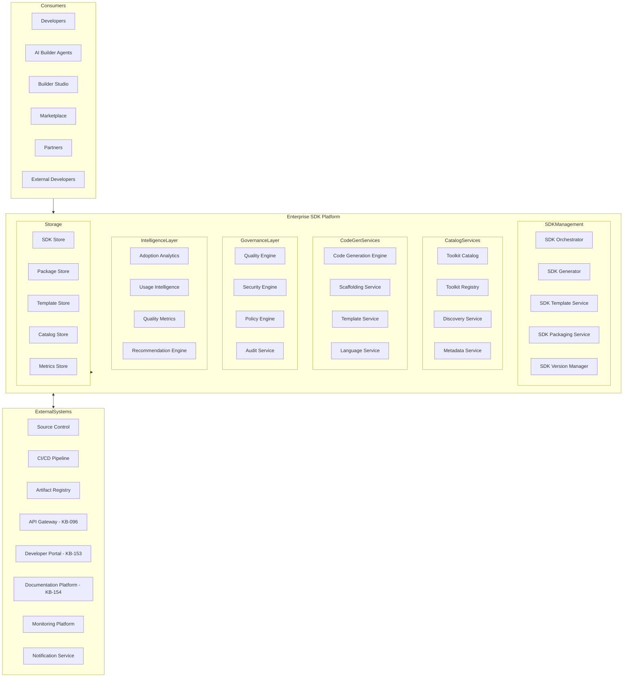
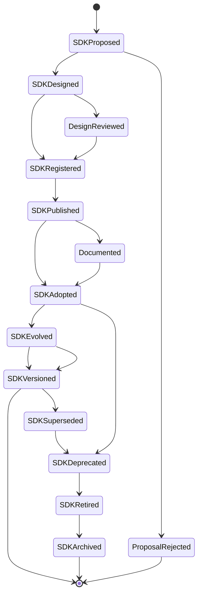
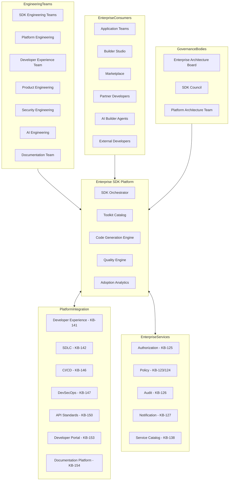
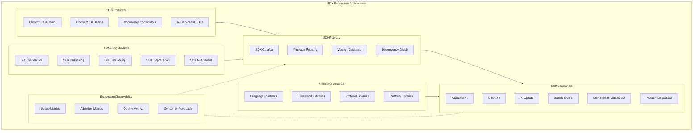

# KB-151 — SDK & Developer Toolkit Architecture

---

## Metadata

- **Document ID:** KB-151
- **Title:** SDK & Developer Toolkit Architecture
- **Suite:** Developer Experience (DX) & Engineering Platform Architecture
- **Version:** 1.0
- **Status:** Approved Architecture
- **Classification:** Enterprise Developer Platform Architecture
- **Date:** 2026-07-12

---

## Executive Summary

The Enterprise SDK & Developer Toolkit Platform provides standardized, governed, discoverable, versioned, secure, reusable, AI-ready developer assets that accelerate engineering productivity across the DUKADESK ecosystem. Client SDKs, backend SDKs, AI SDKs, CLI toolkits, code generators, project templates, automation utilities, and all engineering productivity assets are managed as governed enterprise platform products rather than project-specific utilities.

All developer toolkits follow consistent lifecycle, versioning, governance, and distribution models defined by this canonical architecture.

---

## Purpose

Define how DUKADESK standardizes SDKs, developer libraries, engineering utilities, automation tools, templates, generators, and productivity assets across the complete engineering ecosystem.

---

## Scope

### In Scope

- Enterprise SDK architecture
- Developer toolkit architecture
- SDK taxonomy
- Toolkit lifecycle
- SDK governance
- Toolkit governance
- SDK versioning
- Code generation architecture
- CLI architecture
- Developer templates
- Developer automation assets
- AI-assisted developer tools
- SDK observability
- SDK intelligence
- Toolkit catalog

### Out of Scope

- Programming language implementation
- IDE implementation
- API runtime implementation
- Repository implementation
- CI/CD implementation
- Infrastructure implementation

These are addressed by dedicated Knowledge Base documents including KB-146 (CI/CD Pipeline Architecture), KB-150 (API Development Standards Architecture), and KB-153 (Developer Portal Architecture) within this suite.

---

## Architectural Principles

| # | Principle | Description |
|---|-----------|-------------|
| 1 | Developer-First Experience | Developer toolkits are designed for intuitive, productive, and delightful engineering experiences |
| 2 | Reuse Before Creation | Developer assets are reused across the enterprise before new toolkits are created |
| 3 | Standardization by Default | All SDKs and toolkits follow enterprise-defined patterns, conventions, and quality standards |
| 4 | Consistency Across Toolchains | Every SDK and toolkit provides consistent interfaces, behaviors, and documentation |
| 5 | Secure Developer Tooling | Developer assets are cryptographically signed, verified, and distributed securely |
| 6 | Discoverability by Design | Every toolkit is registered, cataloged, and searchable through the enterprise catalog |
| 7 | Automation First | Developer toolkits automate common engineering tasks for maximum productivity |
| 8 | AI-Assisted Engineering | SDKs and toolkits are designed for AI-assisted development and AI agent consumption |
| 9 | Vendor Independence | No dependency on specific vendor SDK platforms or ecosystems |
| 10 | Technology Neutrality | The architecture supports any programming language and technology stack |
| 11 | Enterprise Scalability | SDK platform scales across all teams, products, domains, and ecosystems |
| 12 | Observability by Default | All toolkit operations emit metrics, logs, traces, and events |

---

## Canonical Definitions

| Term | Definition |
|------|-----------|
| SDK | A governed, versioned, and documented software development kit enabling integration with DUKADESK services |
| Developer Toolkit | Any governed developer asset that accelerates engineering productivity |
| Developer Library | A reusable code library providing standardized access to platform capabilities |
| Client Library | An SDK targeting client-side applications for consuming platform APIs |
| CLI | A command-line interface tool for interacting with platform services and automation |
| Code Generator | An automated tool that generates source code from specifications, contracts, or templates |
| Scaffold Template | A starter template providing project structure, configuration, and conventions |
| Development Template | A reusable project template with pre-configured tooling and standards |
| Toolkit Registry | The canonical inventory of all enterprise SDKs and developer toolkits |
| Toolkit Catalog | A searchable index of developer assets with metadata, documentation, and versioning |
| SDK Lifecycle | The governed progression of an SDK from proposal through retirement |
| Toolkit Version | A semantic identifier denoting the toolkit's interface and compatibility state |
| Toolkit Governance | The policies, roles, and processes governing enterprise developer toolkits |
| Toolkit Package | A distributable unit containing SDK code, documentation, and metadata |
| Developer Asset | Any governed artifact that accelerates software engineering |
| Engineering Utility | A reusable tool or script that automates common engineering tasks |
| Automation Toolkit | A collection of automation assets for build, test, deployment, and operations |
| Enterprise SDK | Any SDK governed by the enterprise SDK & developer toolkit architecture |
| AI Development Toolkit | A toolkit designed for AI-assisted development and AI agent integration |
| Developer Productivity Platform | The canonical platform governing all developer toolkits and productivity assets |

---

## Enterprise SDK Platform

---

## SDK Taxonomy

```mermaid
graph TB
    SDK_TAX[SDK Taxonomy] --> CLIENT_SDK[Client SDKs]
    SDK_TAX --> BACKEND_SDK[Backend SDKs]
    SDK_TAX --> MOBILE_SDK[Mobile SDKs]
    SDK_TAX --> WEB_SDK[Web SDKs]
    SDK_TAX --> AI_SDK[AI SDKs]
    SDK_TAX --> STUDIO_SDK[Builder Studio SDKs]
    SDK_TAX --> MKT_SDK[Marketplace SDKs]
    SDK_TAX --> INTEG_SDK[Integration SDKs]
    SDK_TAX --> CLI_TOOLS[CLI Toolkits]
    SDK_TAX --> AUTO_TOOLS[Automation Toolkits]
    SDK_TAX --> CODE_GEN[Code Generators]
    SDK_TAX --> PROJECT_TMPL[Project Templates]
    SDK_TAX --> STARTER_KITS[Starter Kits]
    SDK_TAX --> TEST_TOOLS[Testing Toolkits]
    SDK_TAX --> DOC_TOOLS[Documentation Toolkits]
    SDK_TAX --> FUTURE_ASSETS[Future Developer Assets]

    CLIENT_SDK --> REST_CLIENT[REST Client SDKs]
    CLIENT_SDK --> GRAPHQL_CLIENT[GraphQL Client SDKs]
    CLIENT_SDK --> GRPC_CLIENT[gRPC Client SDKs]

    AI_SDK --> LLM_SDK[LLM SDKs]
    AI_SDK --> EMBEDDING_SDK[Embedding SDKs]
    AI_SDK --> AGENT_SDK[AI Agent SDKs]
    AI_SDK --> PROMPT_SDK[Prompt Management SDKs]

    CLI_TOOLS --> PLATFORM_CLI[Platform CLI]
    CLI_TOOLS --> ADMIN_CLI[Admin CLI]
    CLI_TOOLS --> DEVOPS_CLI[DevOps CLI]
    CLI_TOOLS --> AI_CLI[AI CLI]

    CODE_GEN --> API_GEN[API Client Generators]
    CODE_GEN --> MODEL_GEN[Model Generators]
    CODE_GEN --> SCAFFOLD_GEN[Project Scaffold Generators]
    CODE_GEN --> CONTRACT_GEN[Contract Generators]

    PROJECT_TMPL --> SERVICE_TMPL[Service Templates]
    PROJECT_TMPL --> LIB_TMPL[Library Templates]
    PROJECT_TMPL --> UI_TMPL[UI Component Templates]
    PROJECT_TMPL --> AI_TMPL[AI Project Templates]
```

---

## SDK Lifecycle

---

## Toolkit Catalog Architecture

```mermaid
graph TB
    subgraph ToolkitCatalogArchitecture[Toolkit Catalog Architecture]

        subgraph CatalogStructure
            CS_HIERARCHY[Hierarchy & Classification]
            CS_METADATA[Metadata Schema]
            CS_TAGGING[Tagging System]
            CS_RELATIONSHIPS[Relationship Mapping]
            CS_VERSIONS[Version Tracking]
        end

        subgraph CatalogManagement
            CM_REGISTRATION[Registration Workflow]
            CM_APPROVAL[Approval Workflow]
            CM_PUBLICATION[Publication Workflow]
            CM_UPDATE[Update Workflow]
            CM_DEPRECATION[Deprecation Workflow]
            CM_RETIREMENT[Retirement Workflow]
        end

        subgraph CatalogMetadata
            CM_BASIC[Basic Metadata</br>Name, owner,</br>domain, language]
            CM_TECHNICAL[Technical Metadata</br>Version, platform,</br>dependencies]
            CM_QUALITY[Quality Metadata</br>Coverage, lint,</br>security score]
            CM_ADOPTION[Adoption Metadata</br>Downloads, consumers,</br>usage stats]
            CM_GOVERNANCE[Governance Metadata</br>Status, compliance,</br>lifecycle stage]
        end

        subgraph SearchAndDiscovery
            SD_SEARCH[Full-Text Search]
            SD_FILTER[Advanced Filtering]
            SD_RECOMMEND[Recommendations]
            SD_SEMANTIC[Semantic Discovery]
            SD_AI[AI-Assisted Discovery]
        end

        subgraph CatalogConsumers
            CC_DEVELOPER[Developers]
            CC_AI[AI Agents]
            CC_PORTAL[Developer Portal]
            CC_CI_CD[CI/CD Pipelines]
            CC_PLATFORM[Platform Services]
        end
    end

    CatalogStructure --> CatalogManagement
    CatalogManagement --> CatalogMetadata
    CatalogMetadata --> SearchAndDiscovery
    SearchAndDiscovery --> CatalogConsumers
```

---

## Code Generation Architecture

```mermaid
graph TB
    subgraph CodeGenerationArchitecture[Code Generation Architecture]

        subgraph InputSources
            IS_API_SPEC[API Specifications]
            IS_DATA_MODEL[Data Models]
            IS_CONTRACT[Service Contracts]
            IS_SCHEMA[Schema Definitions]
            IS_TEMPLATE[Project Templates]
            IS_NL[Natural Language Description]
            IS_AI[AI-Generated Specifications]
        end

        subgraph GenerationEngines
            GE_API[API Client Generator]
            GE_SERVER[Server Stub Generator]
            GE_MODEL[Model Generator]
            GE_DB[Database Generator]
            GE_CONFIG[Configuration Generator]
            GE_TEST[Test Generator]
            GE_DOC[Documentation Generator]
            GE_AI[AI-Powered Generator]
        end

        subgraph OutputArtifacts
            OA_CLIENT[Client Libraries]
            OA_SERVER[Server Implementations]
            OA_MODELS[Data Models]
            OA_TESTS[Test Suites]
            OA_CONFIG[Configuration Files]
            OA_DOCS[API Documentation]
            OA_DEPLOY[Deployment Manifests]
        end

        subgraph GenerationControls
            GC_STYLE[Style Enforcement]
            GC_STANDARD[Standard Compliance]
            GC_CUSTOM[Customization Points]
            GC_VERSION[Version Alignment]
            GC_QUALITY[Quality Validation]
        end

        subgraph GenerationObservability
            GO_METRICS[Generation Metrics]
            GO_QUALITY[Output Quality]
            GO_COVERAGE[Generation Coverage]
            GO_FEEDBACK[Developer Feedback]
        end
    end

    InputSources --> GenerationEngines
    GenerationEngines --> OutputArtifacts
    GenerationControls --> GenerationEngines
    GenerationEngines --> GenerationObservability
```

---

## Developer Productivity Architecture

```mermaid
graph TB
    subgraph DeveloperProductivityArchitecture[Developer Productivity Architecture]

        subgraph ProductivityFoundations
            PF_SDK[Enterprise SDKs]
            PF_CLI[CLI Tooling]
            PF_TEMPLATES[Project Templates]
            PF_GENERATORS[Code Generators]
            PF_AUTO[Automation Scripts]
            PF_DOCS[Developer Documentation]
        end

        subgraph ProductivityCapabilities
            PC_ONBOARD[Rapid Onboarding]
            PC_SCAFFOLD[Project Scaffolding]
            PC_INTEGRATE[Service Integration]
            PC_BUILD[Build Automation]
            PC_TEST[Test Automation]
            PC_DEPLOY[Deployment Automation]
            PC_DEBUG[Debugging Tooling]
            PC_MONITOR[Observability Tooling]
        end

        subgraph AIProductivity
            AI_ASSIST[AI Coding Assistant]
            AI_GEN[AI Code Generation]
            AI_REVIEW[AI Code Review]
            AI_REFACTOR[AI Refactoring]
            AI_TEST_GEN[AI Test Generation]
            AI_DOC_GEN[AI Doc Generation]
        end

        subgraph ProductivityMetrics
            PM_TIME[Time to First Commit]
            PM_INTEGRATION[Integration Velocity]
            PM_BUILD[Build Speed]
            PM_TEST[Test Execution Time]
            PM_ONBOARD[Onboarding Time]
            PM_SATISFACTION[Developer Satisfaction]
        end

        subgraph ProductivityGovernance
            PG_STANDARDS[Toolkit Standards]
            PG_QUALITY[Quality Gates]
            PG_COMPLIANCE[Compliance Checks]
            PG_FEEDBACK[Feedback Loops]
        end
    end

    ProductivityFoundations --> ProductivityCapabilities
    ProductivityCapabilities --> AIProductivity
    AIProductivity --> ProductivityMetrics
    ProductivityGovernance --> ProductivityFoundations
    ProductivityGovernance --> ProductivityCapabilities
```

---

## Enterprise Developer Toolkit Operating Model

---

## Governance Architecture

```mermaid
graph TB
    subgraph GovernanceArchitecture[SDK & Toolkit Governance Architecture]

        subgraph StrategicGovernance
            EAB2[Enterprise Architecture Board]
            SDK_COUNCIL2[SDK Council]
            DEV_EXP_GOV[Developer Experience Governance]
        end

        subgraph SDKGovernance
            SDK_DESIGN[SDK Design Standards]
            SDK_INTERFACE[Interface Consistency Standards]
            SDK_VERSION[SDK Versioning Policy]
            SDK_QUALITY[SDK Quality Standards]
            SDK_COMPAT[Backward Compatibility Policy]
        end

        subgraph ToolkitGovernance
            TK_CATALOG[Catalog Registration Policy]
            TK_LIFECYCLE[Lifecycle Management Policy]
            TK_PUBLICATION[Publication Policy]
            TK_DEPRECATION[Deprecation Policy]
        end

        subgraph CodeGenGovernance
            CG_TEMPLATE[Template Standards]
            CG_OUTPUT[Output Quality Standards]
            CG_CUSTOMIZATION[Customization Policy]
            CG_AI_GEN[AI Generation Standards]
        end

        subgraph SecurityAndCompliance
            SEC_SIGNING[Package Signing Policy]
            SEC_SCAN[Security Scanning Policy]
            SEC_DISTRIBUTION[Secure Distribution Policy]
            COMP_LICENSE[License Compliance Policy]
        end

        subgraph Enforcement
            ENF_AUTO[Automated Quality Gates]
            ENF_REVIEW[Design Review]
            ENF_CATALOG[Catalog Enforcement]
            ENF_VERSION[Version Enforcement]
            ENF_COMPLIANCE[Compliance Enforcement]
        end
    end

    StrategicGovernance --> SDKGovernance
    StrategicGovernance --> ToolkitGovernance
    StrategicGovernance --> CodeGenGovernance
    SecurityAndCompliance --> ToolkitGovernance
    SDKGovernance --> Enforcement
    ToolkitGovernance --> Enforcement
    CodeGenGovernance --> Enforcement
```

---

## SDK Ecosystem Architecture

---

## Enterprise SDK & Toolkit Reference Model

```mermaid
graph TB
    subgraph ReferenceModel[Enterprise SDK & Toolkit Reference Model]

        subgraph ToolkitDomains
            TD1[Platform SDKs</br>Core services,</br>platform APIs]
            TD2[AISDKs</br>LLM, agents,</br>embeddings]
            TD3[Integration SDKs</br>Enterprise services,</br>integrations]
            TD4[Marketplace SDKs</br>Extensions,</br>plugins, packages]
            TD5[Builder Studio SDKs</br>Low-code, no-code,</br>builder assets]
            TD6[CLI Toolkits</br>Platform automation,</br>administration]
            TD7[Code Generators</br>API clients,</br>scaffolding]
            TD8[Testing Toolkits</br>Test frameworks,</br>quality utilities]
        end

        subgraph ToolkitStandards
            TS1[Consistent Interfaces]
            TS2[Versioned Contracts]
            TS3[Secure Distribution]
            TS4[Comprehensive Documentation]
            TS5[Backward Compatibility]
            TS6[AI Readiness]
            TS7[Discoverability]
        end

        subgraph IntegrationPatterns
            IP1[SDLC - SDK Integration Phase]
            IP2[CI/CD - SDK Build & Publish]
            IP3[DevSecOps - SDK Security Scan]
            IP4[Portal - SDK Discovery]
            IP5[API - SDK Generation]
            IP6[AI - SDK Consumption]
        end

        subgraph QualityAttributes
            QA1[Consistent]
            QA2[Discoverable]
            QA3[Secure]
            QA4[Compatible]
            QA5[Governed]
            QA6[Observable]
            QA7[Productive]
        end
    end

    ToolkitDomains --> ToolkitStandards
    ToolkitStandards --> IntegrationPatterns
    IntegrationPatterns --> QualityAttributes
```

---

## Governance

| Domain | Governance Focus |
|--------|-----------------|
| SDK Governance | SDK design standards, interface consistency, versioning policy, quality standards |
| Toolkit Governance | Catalog registration, lifecycle management, publication policy, deprecation policy |
| Architecture Governance | SDK architecture decisions require architecture board approval |
| Security Governance | Package signing, security scanning, secure distribution, vulnerability management |
| Compliance Governance | License compliance, regulatory compliance, open source governance |
| AI Governance | AI-generated SDK standards, AI toolkit design, AI-assisted development governance |
| Code Generation Governance | Template standards, output quality, customization policy, AI generation standards |
| Documentation Governance | SDK documentation standards, completeness requirements, version alignment |
| Lifecycle Governance | Proposal, design, publication, adoption, deprecation, retirement policies |
| Enterprise Governance | The Enterprise Architecture board and SDK Council govern toolkit evolution |

### Governance Enforcement Points

| Enforcement Point | Mechanism |
|-------------------|-----------|
| SDK Registration | Design validation, standard compliance, metadata completeness |
| SDK Publication | Quality gate evaluation, security scan, documentation completeness |
| SDK Version Release | Compatibility validation, version policy compliance, consumer notification |
| Code Generator Output | Style compliance, standard enforcement, quality validation |
| Template Registration | Template standards compliance, metadata completeness, review approval |
| SDK Deprecation | Consumer notification, migration plan validation, sunset timeline compliance |

---

## Responsibilities

| Role | Responsibilities |
|------|-----------------|
| Enterprise Architecture Board | Governs SDK architecture, standards, and platform evolution |
| Platform Engineering | Develops, operates, and maintains the Enterprise SDK Platform |
| Developer Experience Team | Defines SDK standards, tooling, and developer productivity workflows |
| SDK Engineering Teams | Develops, maintains, and governs enterprise SDKs and toolkits |
| Product Engineering | Uses enterprise SDKs; provides feedback on SDK quality and usability |
| Security | Defines SDK security policies; validates SDK package integrity and provenance |
| Compliance | Defines SDK compliance requirements; audits license and regulatory compliance |
| AI Governance Board | Governs AI-generated SDK standards and AI toolkit governance |
| Documentation Team | Maintains SDK documentation standards; reviews documentation completeness |
| Operations | Manages SDK platform operations, catalog availability, and package distribution |

---

## Security

| Security Control | Description |
|------------------|-------------|
| Secure SDK Design | SDKs follow secure coding standards and are validated through security gates |
| Trusted Toolkit Distribution | All packages are cryptographically signed and distributed through trusted registries |
| Identity-Aware Tooling | Developer tooling authenticates and authorizes consumer identity |
| Least Privilege | SDKs and toolkits request minimum required permissions and access |
| Zero Trust | Every SDK operation and consumption is authenticated and verified |
| Policy Enforcement | SDK governance policies are enforced through automated gates |
| Auditability | All SDK lifecycle operations are recorded in immutable audit log |
| Package Integrity | SDK packages are checksummed, signed, and verified before consumption |
| Provenance | Every SDK version has verifiable provenance from source to package |
| Secure Developer Asset Governance | SDK publication, distribution, and retirement follow security policies |

### Security Zones

| Zone | Description |
|------|-------------|
| Internal SDKs | Internal SDKs with enterprise-wide authenticated access |
| Partner SDKs | Partner SDKs with authenticated partner distribution controls |
| Public SDKs | Public SDKs with anonymous or authenticated public access |
| AI SDKs | AI SDKs with AI-specific safety and governance controls |
| Marketplace SDKs | Marketplace SDKs with publisher and consumer authorization |

---

## Privacy

| Privacy Control | Description |
|----------------|-------------|
| Sensitive Toolkit Metadata | Toolkit metadata containing sensitive information is classified and access-restricted |
| Privacy-by-Design | SDKs incorporate privacy requirements in their design and data handling |
| Regulatory Compliance | SDK data handling complies with GDPR, CCPA, and regional regulations |
| Data Minimization | SDKs request and process minimum required data |
| Cross-Border Governance | SDK distribution respects data residency requirements |
| Retention Governance | SDK metadata and packages are retained per policy and purged when expired |
| Confidential Engineering Assets | SDK source code and design documents are access-restricted |
| Privacy Assurance | Regular privacy reviews for SDK platform capabilities |

---

## Performance

| Consideration | Requirement |
|---------------|-------------|
| Enterprise-Scale SDK Ecosystems | Platform supports thousands of SDKs and toolkits across all domains |
| High-Volume Toolkit Catalogs | Catalog serves millions of discovery and download requests |
| Elastic Scalability | SDK generation and packaging scale horizontally with demand |
| High Availability | 99.99% uptime for critical SDK catalog and registry services |
| Operational Resilience | Graceful degradation under load with catalog query backpressure |
| Efficient Developer Discovery | SDK catalog searches complete within defined latency targets |
| Multi-Region Readiness | SDK distribution operates across global regions with local mirrors |
| Developer Productivity Optimization | SDK generation and packaging complete within defined time targets |

### Performance Optimization

| Optimization | Description |
|--------------|-------------|
| SDK Generation Caching | Generated SDKs are cached for efficient reuse |
| Package Distribution Optimization | SDK packages are optimized for download size and installation speed |
| Catalog Indexing | Toolkit catalog is indexed for fast full-text and semantic search |
| Pre-Generated SDKs | Common SDK variants are pre-generated for instant availability |
| Lazy Generation | SDKs are generated on demand with optimized incremental generation |
| Global Package Mirrors | SDK packages are mirrored across global distribution points |

---

## Observability

| Observable Dimension | Metrics | Purpose |
|---------------------|---------|---------|
| SDK Health | SDK build success rate, quality score, security pass rate | Monitoring SDK platform health |
| Toolkit Adoption | Download count, active consumers, version distribution | Tracking toolkit adoption |
| Governance Dashboards | Compliance rate, review pass rate, exception count | Monitoring toolkit governance |
| Operational Reporting | Daily publication activity, catalog queries, team distribution | Operational toolkit management |
| Executive Reporting | Adoption trends, quality trends, developer satisfaction | Strategic toolkit intelligence |
| Developer Experience Analytics | Time to first integration, onboarding success rate, toolkit satisfaction | Developer experience measurement |
| SDK Lifecycle Metrics | Time to publication, version velocity, deprecation completion | Lifecycle efficiency tracking |
| Toolkit Intelligence | Usage patterns, integration frequency, popular toolkits | Toolkit improvement insights |
| Productivity Metrics | Code generation time, scaffolding time, integration time | Developer productivity measurement |
| Standards Compliance | Compliance rate by domain, violation trends, remediation velocity | Standards adherence monitoring |

### Observability Events

| Event Type | Trigger | Consumer |
|------------|---------|----------|
| SDKRegistered | New SDK registered in catalog | Catalog service, governance service |
| SDKPublished | SDK version published to registry | Package registry, notification service |
| SDKGenerated | SDK code generated from specification | SDK orchestrator, quality service |
| SDKDownloaded | SDK package downloaded by consumer | Adoption analytics, metrics store |
| SDKDeprecated | SDK version marked deprecated | Consumer notification, retirement service |
| SDKRetired | SDK version retired and archived | Archive service, catalog service |
| TemplateUsed | Project template used for scaffolding | Template analytics, metrics store |
| GeneratorExecuted | Code generator executed | Generation metrics, quality service |

---

## Failure Scenarios

| # | Scenario | Architectural Response |
|---|----------|----------------------|
| 1 | SDK Incompatibility | Compatibility gate blocks publication; consumer impact analysis triggered; migration plan generated |
| 2 | Version Conflicts | Version conflict detection at publication; resolution guidance provided; governance escalated |
| 3 | Duplicate SDKs | Duplicate detection at registration; consolidation recommendation generated |
| 4 | Governance Bypass | Policy enforcement point blocks unauthorized operation; violation recorded with audit trail |
| 5 | Broken Generators | Generator validation failure; template version rollback; engineering team notified |
| 6 | Toolkit Abandonment | Orphan detection identifies deprecated toolkits without migration paths; governance escalated |
| 7 | Documentation Gaps | Documentation completeness check at publication; gaps reported; publication blocked |
| 8 | Unauthorized Publication | Authorization enforcement at publication gate; violation logged; security team notified |
| 9 | Catalog Inconsistencies | Catalog integrity check triggered; metadata reconciliation; notification to platform team |
| 10 | Recovery Failures | Journal-based recovery with replay; cross-service consistency verification |
| 11 | Package Corruption | Package integrity verification detects corruption; automated rebuild; package quarantined |
| 12 | AI-Generated Toolkit Failures | AI-generated toolkit validation gate; quality issues reported; AI model retraining triggered |

---

## Anti-Patterns

| # | Anti-Pattern | Description | Prohibited Because |
|---|-------------|-------------|-------------------|
| 1 | Project-Specific SDKs | SDKs created for a single project without enterprise reuse consideration | Wastes engineering resources; creates fragmentation; prevents consistency |
| 2 | Duplicate Libraries | Multiple libraries providing overlapping functionality with different interfaces | Fragments consumption; creates maintenance burden; confuses developers |
| 3 | Unversioned Toolkits | Toolkits distributed without semantic versions or version tracking | Prevents dependency management, compatibility assessment, lifecycle governance |
| 4 | Hidden Developer Assets | Toolkits used internally without catalog registration | Prevents discovery, reuse, governance, enterprise visibility |
| 5 | Independent Toolkit Governance | Teams governing toolkits outside enterprise policies | Creates inconsistent experiences, security gaps, governance violations |
| 6 | Manual Scaffolding | Project setup performed manually without templates or generators | Introduces errors, inconsistencies, slows onboarding, prevents standardization |
| 7 | Inconsistent Developer Experiences | Different SDKs providing inconsistent APIs, patterns, or documentation | Increases cognitive load; reduces productivity; harms developer satisfaction |
| 8 | Unverified Code Generators | Generators producing code without quality validation | Produces inconsistent, insecure, or non-compliant code |
| 9 | Toolkit Proliferation | Excessive toolkits maintained without consolidation or retirement | Increases maintenance burden; fragments developer mindshare; complicates discovery |
| 10 | Missing Lifecycle Governance | Toolkits without defined lifecycle, ownership, or retirement criteria | Leads to toolkit abandonment, security gaps, maintenance debt |

---

## Future Evolution

| # | Evolution Path | Description |
|---|---------------|-------------|
| 1 | Autonomous SDK Generation | AI agents that autonomously generate, test, and publish SDKs from API specifications |
| 2 | AI-Generated Developer Toolkits | AI that generates custom developer toolkits based on engineering context and preferences |
| 3 | Semantic Developer Discovery | ML-driven toolkit discovery based on developer intent, project context, and usage patterns |
| 4 | Self-Evolving SDKs | SDKs that automatically adapt to API changes and deprecation schedules |
| 5 | Intelligent Engineering Assistants | AI-powered assistants that recommend, configure, and integrate developer toolkits |
| 6 | Federated Toolkit Ecosystems | Toolkit federation across DUKADESK and partner ecosystems |
| 7 | Enterprise Developer Intelligence | AI-driven insights into developer productivity, toolkit effectiveness, and engineering acceleration |
| 8 | Adaptive Engineering Platforms | Platforms that dynamically adapt toolkits based on developer behavior and project needs |

---

## Cross References

| Document ID | Title | Relationship |
|-------------|-------|-------------|
| KB-141 | Developer Experience Platform Architecture | Foundational DX platform that hosts SDK services |
| KB-142 | Software Development Lifecycle Architecture | Defines SDLC phases that consume SDKs and toolkits |
| KB-146 | CI/CD Pipeline Architecture | Defines CI/CD pipelines for SDK build, test, and publish |
| KB-147 | DevSecOps Architecture | Defines security integration for SDK security validation |
| KB-150 | API Development Standards Architecture | Defines API contracts from which SDKs are generated |
| KB-152 | Documentation Platform Architecture | Defines documentation platform for SDK documentation |
| KB-153 | Developer Portal Architecture | Defines developer portal for SDK discovery and consumption |
| KB-158 | Engineering Governance Architecture | Defines governance enforced on SDK operations |
| KB-159 | AI-Assisted Software Engineering Architecture | Defines AI capabilities for SDK generation |
| KB-160 | Developer Experience Reference Architecture | Comprehensive reference for the DX suite |

---

## Critical DUKADESK Architectural Rule

**All SDKs, developer toolkits, client libraries, code generators, templates, automation utilities, and engineering productivity assets within DUKADESK shall be designed, governed, versioned, secured, published, and evolved exclusively through the canonical Enterprise SDK & Developer Toolkit Architecture. No application, Builder Studio module, Marketplace extension, AI Builder Agent, engineering team, or platform service shall create or maintain independent developer tooling ecosystems outside the enterprise architecture, ensuring consistency, interoperability, security, discoverability, AI readiness, and enterprise-wide developer productivity.**

(End of file - total 1075 lines)
