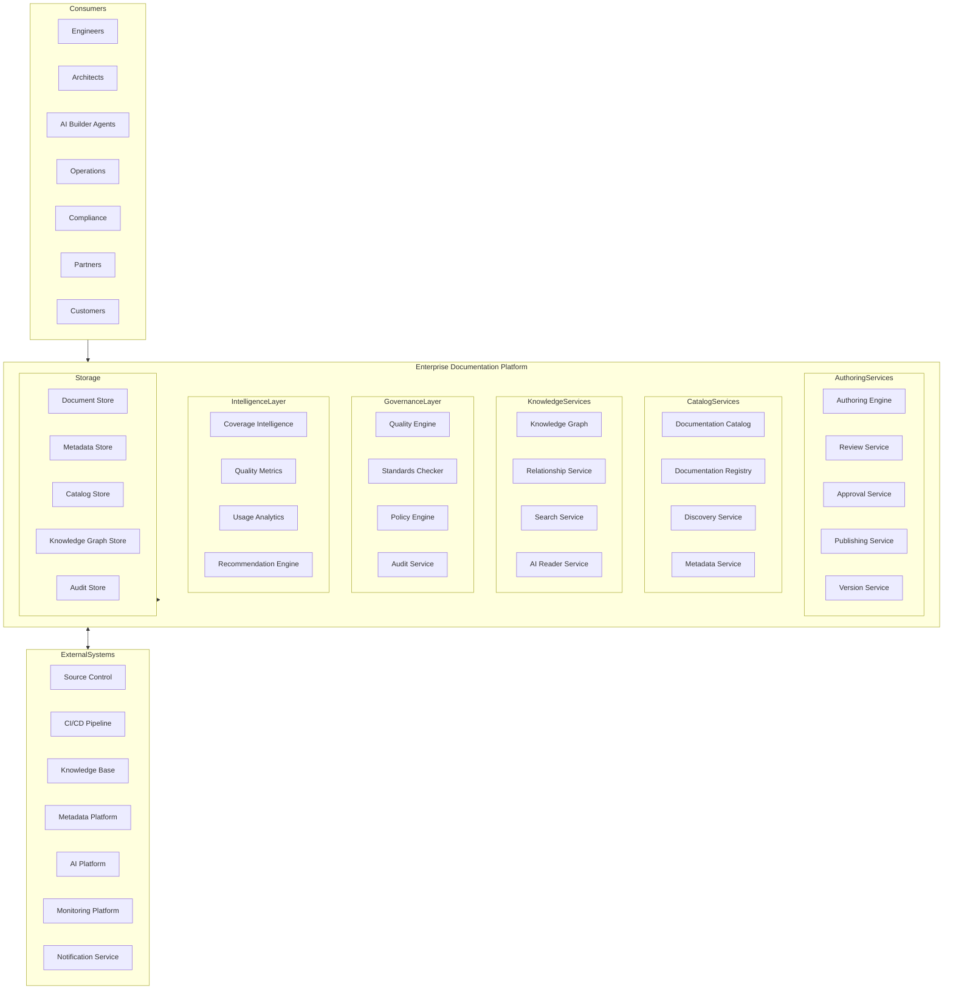
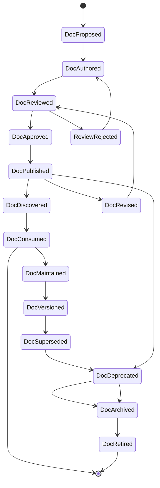
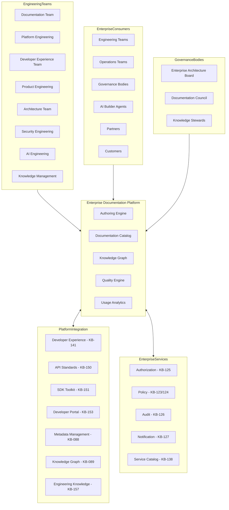

# KB-152 — Documentation Platform Architecture

---

## Metadata

- **Document ID:** KB-152
- **Title:** Documentation Platform Architecture
- **Suite:** Developer Experience (DX) & Engineering Platform Architecture
- **Version:** 1.0
- **Status:** Approved Architecture
- **Classification:** Enterprise Documentation & Knowledge Architecture
- **Date:** 2026-07-12

---

## Executive Summary

The Enterprise Documentation Platform provides standardized, governed, versioned, searchable, AI-ready, secure, traceable, and reusable documentation supporting engineering, operations, architecture, integrations, governance, compliance, and enterprise knowledge preservation across the DUKADESK ecosystem. Documentation is treated as governed enterprise knowledge assets rather than project deliverables, ensuring a single source of truth, enterprise-wide traceability, and long-term organizational memory.

All documentation assets follow consistent lifecycle, metadata, quality, and governance models defined by this canonical architecture.

---

## Purpose

Define how DUKADESK standardizes documentation architecture across all engineering, operational, governance, and platform domains while enabling knowledge reuse, enterprise consistency, AI consumption, and long-term organizational memory.

---

## Scope

### In Scope

- Enterprise documentation architecture
- Documentation taxonomy
- Documentation lifecycle
- Documentation governance
- Documentation quality
- Documentation standards
- Documentation metadata
- Knowledge organization
- AI-readable documentation
- Documentation discoverability
- Documentation observability
- Documentation intelligence
- Documentation retention
- Enterprise knowledge architecture

### Out of Scope

- Documentation tooling implementation
- Content management implementation
- Wiki implementation
- Repository implementation
- Search engine implementation
- AI implementation

These are covered by dedicated Knowledge Base documents including KB-088 (Metadata Management Architecture), KB-089 (Knowledge Graph Architecture), and KB-157 (Engineering Knowledge Management Architecture).

---

## Architectural Principles

| # | Principle | Description |
|---|-----------|-------------|
| 1 | Documentation as Code | Documentation is authored in machine-readable formats, versioned, and governed through automated pipelines |
| 2 | Knowledge as an Enterprise Asset | Every documentation asset is a governed enterprise knowledge asset with defined lifecycle and ownership |
| 3 | Single Source of Truth | Every knowledge domain has one canonical documentation source, with all other references derived from it |
| 4 | Discoverability by Design | Every documentation asset is cataloged, searchable, and navigable through the enterprise knowledge platform |
| 5 | Traceability by Default | All documentation is traceable to architecture, code, requirements, and governance policies |
| 6 | AI-Readable Documentation | Documentation is authored in structured, machine-parsable formats with semantic metadata |
| 7 | Reuse Before Duplication | Documentation content is reused across assets before new content is created |
| 8 | Governance First | Documentation follows defined lifecycle, quality, and compliance policies enforced through automated gates |
| 9 | Vendor Independence | No dependency on specific documentation vendor platforms |
| 10 | Technology Neutrality | The architecture supports any documentation format and toolchain without bias |
| 11 | Enterprise Scalability | Documentation platform scales across all teams, products, domains, and ecosystems |
| 12 | Observability by Default | All documentation operations emit metrics, logs, traces, and events |

---

## Canonical Definitions

| Term | Definition |
|------|-----------|
| Documentation Asset | A governed, versioned, and cataloged documentation artifact with defined metadata and lifecycle |
| Knowledge Asset | Any documentation artifact that represents governed enterprise knowledge |
| Documentation Platform | The canonical platform governing all enterprise documentation and knowledge assets |
| Documentation Catalog | A searchable index of all enterprise documentation assets with metadata and relationships |
| Documentation Registry | The canonical inventory of enterprise documentation assets with versioning and governance |
| Documentation Lifecycle | The governed progression of a documentation asset from proposal through retirement |
| Documentation Metadata | Structured data describing documentation properties, relationships, and governance |
| Documentation Taxonomy | A classification hierarchy organizing documentation by domain, type, and audience |
| Documentation Standard | A mandatory format, structure, or convention all enterprise documentation must follow |
| Knowledge Organization | The systematic classification and interlinking of enterprise knowledge assets |
| AI-Readable Documentation | Documentation authored in structured formats consumable by AI systems |
| Documentation Governance | The policies, roles, and processes governing enterprise documentation assets |
| Knowledge Graph | A structured representation of enterprise knowledge assets and their relationships |
| Documentation Version | A semantic identifier denoting the documentation state and compatibility |
| Documentation Traceability | The ability to trace documentation to source architecture, code, and requirements |
| Enterprise Documentation | Any documentation asset governed by the enterprise documentation platform |
| Canonical Documentation | The authoritative documentation source for a given knowledge domain |
| Documentation Intelligence | AI-driven insights into documentation quality, coverage, and knowledge gaps |
| Documentation Quality | The measured completeness, consistency, accuracy, and readability of documentation |
| Enterprise Knowledge Base | The comprehensive collection of governed enterprise knowledge assets |

---

## Enterprise Documentation Platform

---

## Documentation Taxonomy

```mermaid
graph TB
    DT[Documentation Taxonomy] --> ARCH_DOC[Architecture Documentation]
    DT --> KB_DOC[Knowledge Base Documents]
    DT --> API_DOC[API Documentation]
    DT --> SDK_DOC[SDK Documentation]
    DT --> PROD_DOC[Product Documentation]
    DT --> OPS_DOC[Operational Documentation]
    DT --> SEC_DOC[Security Documentation]
    DT --> COMP_DOC[Compliance Documentation]
    DT --> INFRA_DOC[Infrastructure Documentation]
    DT --> AI_DOC[AI Documentation]
    DT --> STUDIO_DOC[Builder Studio Documentation]
    DT --> MKT_DOC[Marketplace Documentation]
    DT --> USER_DOC[User Documentation]
    DT --> ADMIN_DOC[Administrator Documentation]
    DT --> TRAINING_DOC[Training Documentation]
    DT --> RUNBOOKS[Runbooks]
    DT --> PLAYBOOKS[Playbooks]
    DT --> POLICIES[Policies]
    DT --> STANDARDS[Standards]
    DT --> REF_GUIDES[Reference Guides]
    DT --> FUTURE_DOC[Future Documentation Domains]

    ARCH_DOC --> KB_ARCH[KB Architecture Docs]
    ARCH_DOC --> DIAGRAMS[Architecture Diagrams]
    ARCH_DOC --> DECISIONS[Architecture Decisions]

    API_DOC --> SPEC_API[API Specifications]
    API_DOC --> REF_API[API Reference]
    API_DOC --> TUTORIAL_API[API Tutorials]

    OPS_DOC --> DEPLOY_GUIDE[Deployment Guides]
    OPS_DOC --> MONITOR_GUIDE[Monitoring Guides]
    OPS_DOC --> INCIDENT_GUIDE[Incident Response Guides]

    AI_DOC --> MODEL_CARDS[Model Cards]
    AI_DOC --> PROMPT_GUIDE[Prompt Guides]
    AI_DOC --> SAFETY_DOC[AI Safety Documentation]
```

---

## Documentation Lifecycle

---

## Documentation Registry Architecture

```mermaid
graph TB
    subgraph DocRegistryArchitecture[Documentation Registry Architecture]

        subgraph RegistryStructure
            RS_HIERARCHY[Hierarchy & Classification]
            RS_METADATA[Metadata Schema]
            RS_RELATIONSHIPS[Relationship Mapping]
            RS_VERSIONS[Version Tracking]
            RS_STATUS[Lifecycle Status Tracking]
        end

        subgraph RegistrationWorkflow
            RW_AUTHOR[Author Submission]
            RW_VALIDATE[Automated Validation]
            RW_REVIEW[Peer Review]
            RW_APPROVE[Governance Approval]
            RW_PUBLISH[Publication]
            RW_INDEX[Catalog Indexing]
        end

        subgraph RegistryMetadata
            RM_BASIC[Basic Metadata</br>Title, owner,</br>domain, audience]
            RM_TECHNICAL[Technical Metadata</br>Format, version,</br>dependencies]
            RM_RELATIONS[Relationship Metadata</br>Parent, child,</br>references]
            RM_GOVERNANCE[Governance Metadata</br>Status, compliance,</br>lifecycle stage]
            RM_AI[AI Metadata</br>AI readability,</br>semantic tags]
        end

        subgraph RegistryGovernance
            RG_OWNERSHIP[Ownership Policy]
            RG_ACCESS[Access Control]
            RG_VERSION[Version Policy]
            RG_RETENTION[Retention Policy]
            RG_COMPLIANCE[Compliance Policy]
        end

        subgraph RegistryObservability
            RO_COVERAGE[Coverage Metrics]
            RO_HEALTH[Registry Health]
            RO_AUDIT[Audit Trail]
            RO_USAGE[Usage Metrics]
        end
    end

    RegistryStructure --> RegistrationWorkflow
    RegistrationWorkflow --> RegistryMetadata
    RegistryMetadata --> RegistryGovernance
    RegistryGovernance --> RegistryObservability
```

---

## Documentation Metadata Architecture

```mermaid
graph TB
    subgraph DocMetadataArchitecture[Documentation Metadata Architecture]

        subgraph MetadataDomains
            MD_ID[Identity Metadata</br>ID, title,</br>type, domain]
            MD_OWNERSHIP[Ownership Metadata</br>Author, owner,</br>steward, team]
            MD_LIFECYCLE[Lifecycle Metadata</br>Status, version,</br>published date]
            MD_RELATIONS[Relationship Metadata</br>Parent, child,</br>references, dependencies]
            MD_CLASSIFICATION[Classification Metadata</br>Audience, sensitivity,</br>security level]
            MD_QUALITY[Quality Metadata</br>Completeness, accuracy,</br>review status]
            MD_COMPLIANCE[Compliance Metadata</br>Regulations, policies,</br>standards]
            MD_AI[AI Metadata</br>AI readability,</br>semantic embedding]
        end

        subgraph MetadataStandards
            MS_SCHEMA[Metadata Schema Standard]
            MS_FORMAT[Metadata Format Standard]
            MS_NAMING[Naming Convention]
            MS_REQUIRED[Required Fields]
            MS_OPTIONAL[Optional Fields]
        end

        subgraph MetadataLifecycle
            ML_CREATE[Create]
            ML_VALIDATE[Validate]
            ML_STORE[Store]
            ML_UPDATE[Update]
            ML_VERSION[Version]
            ML_RETIRE[Retire]
        end

        subgraph MetadataGovernance
            MG_SCHEMA[Schema Governance]
            MG_QUALITY[Metadata Quality]
            MG_COMPLIANCE[Metadata Compliance]
            MG_AUDIT[Metadata Audit]
        end
    end

    MetadataDomains --> MetadataStandards
    MetadataStandards --> MetadataLifecycle
    MetadataLifecycle --> MetadataGovernance
```

---

## Documentation Quality Architecture

```mermaid
graph TB
    subgraph DocQualityArchitecture[Documentation Quality Architecture]

        subgraph QualityDimensions
            QD_COMPLETE[Completeness]
            QD_CONSISTENT[Consistency]
            QD_ACCURATE[Accuracy]
            QD_CURRENT[Currency / Timeliness]
            QD_READABLE[Readability]
            QD_ACCESSIBLE[Accessibility]
            QD_TRACEABLE[Traceability]
            QD_AI_READY[AI Readability]
        end

        subgraph QualityStandards
            QS_FORMAT[Format Standards]
            QS_STRUCTURE[Structure Standards]
            QS_STYLE[Style Standards]
            QS_TERMINOLOGY[Terminology Standards]
            QS_EXAMPLES[Example Standards]
        end

        subgraph QualityValidation
            QV_AUTO[Automated Validation]
            QV_REVIEW[Peer Review]
            QV_TECH[Technical Review]
            QV_AI[AI Readability Review]
            QV_COMPLIANCE[Compliance Review]
        end

        subgraph QualityGates
            QG_AUTHOR[Authoring Gate]
            QG_REVIEW[Review Gate]
            QG_PUBLISH[Publication Gate]
            QG_PERIODIC[Periodic Review Gate]
        end

        subgraph QualityMetrics
            QM_SCORE[Quality Score]
            QM_COVERAGE[Coverage Rate]
            QM_STALENESS[Staleness Index]
            QM_REVIEW_COUNT[Review Frequency]
            QM_CONSUMER_SAT[Consumer Satisfaction]
        end

        subgraph QualityImprovement
            QI_GAP_ANALYSIS[Gap Analysis]
            QI_ISSUE_TRACKING[Issue Tracking]
            QI_REMEDIATION[Remediation Planning]
            QI_CONTINUOUS[Continuous Improvement]
        end
    end

    QualityDimensions --> QualityStandards
    QualityStandards --> QualityValidation
    QualityValidation --> QualityGates
    QualityGates --> QualityMetrics
    QualityMetrics --> QualityImprovement
```

---

## Enterprise Documentation Operating Model

---

## Governance Architecture

```mermaid
graph TB
    subgraph GovernanceArchitecture[Documentation Governance Architecture]

        subgraph StrategicGovernance
            EAB2[Enterprise Architecture Board]
            DOC_COUNCIL2[Documentation Council]
            KNOW_STEWARDS2[Knowledge Stewards]
        end

        subgraph DocumentationGovernance
            DOC_STANDARD[Documentation Standards]
            DOC_LIFECYCLE[Lifecycle Policies]
            DOC_OWNERSHIP[Ownership Policies]
            DOC_CLASSIFY[Classification Policies]
            DOC_VERSION[Versioning Policies]
        end

        subgraph QualityGovernance
            QG_STANDARDS[Quality Standards]
            QG_METRICS[Quality Metrics]
            QG_REVIEW[Review Requirements]
            QG_APPROVAL[Approval Requirements]
        end

        subgraph SecurityAndCompliance
            SC_ACCESS[Access Control Policy]
            SC_CLASSIFY[Sensitivity Classification]
            SC_RETENTION[Retention Policy]
            SC_AUDIT[Audit Policy]
            SC_REGULATORY[Regulatory Compliance]
        end

        subgraph KnowledgeGovernance
            KG_ORGANIZATION[Knowledge Organization Policy]
            KG_GRAPH[Knowledge Graph Standards]
            KG_RELATIONSHIPS[Relationship Standards]
            KG_AI[AI Readability Standards]
        end

        subgraph Enforcement
            ENF_AUTO[Automated Quality Gates]
            ENF_STANDARD[Standards Enforcement]
            ENF_LIFECYCLE[Lifecycle Enforcement]
            ENF_COMPLIANCE[Compliance Enforcement]
            ENF_AUDIT[Audit Trail]
        end
    end

    StrategicGovernance --> DocumentationGovernance
    StrategicGovernance --> QualityGovernance
    StrategicGovernance --> KnowledgeGovernance
    SecurityAndCompliance --> DocumentationGovernance
    DocumentationGovernance --> Enforcement
    QualityGovernance --> Enforcement
    KnowledgeGovernance --> Enforcement
```

---

## Enterprise Knowledge Architecture

```mermaid
graph TB
    subgraph EnterpriseKnowledgeArchitecture[Enterprise Knowledge Architecture]

        subgraph KnowledgeSources
            KS_ARCH[Architecture Documents]
            KS_API[API Specifications]
            KS_SDK[SDK Documentation]
            KS_KB[Knowledge Base Articles]
            KS_RUNBOOKS[Runbooks & Playbooks]
            KS_DECISIONS[Architecture Decisions]
            KS_POLICIES[Policies & Standards]
            KS_TRAINING[Training Materials]
        end

        subgraph KnowledgeOrganization
            KO_TAXONOMY[Knowledge Taxonomy]
            KO_TAG[Tagging System]
            KO_GRAPH[Knowledge Graph]
            KO_RELATIONS[Relationship Mapping]
            KO_SEMANTIC[Semantic Indexing]
        end

        subgraph KnowledgeAccess
            KA_SEARCH[Enterprise Search]
            KA_BROWSE[Hierarchical Browse]
            KA_RECOMMEND[Recommendations]
            KA_AI_QUERY[AI-Powered Query]
            KA_API[Programmatic Access]
        end

        subgraph KnowledgeGovernance
            KG_LIFECYCLE[Knowledge Lifecycle]
            KG_OWNERSHIP[Knowledge Ownership]
            KG_QUALITY[Knowledge Quality]
            KG_RETENTION[Knowledge Retention]
        end

        subgraph KnowledgeIntelligence
            KI_COVERAGE[Knowledge Coverage]
            KI_GAPS[Knowledge Gap Analysis]
            KI_USAGE[Knowledge Usage Patterns]
            KI_TRENDS[Knowledge Trends]
        end
    end

    KnowledgeSources --> KnowledgeOrganization
    KnowledgeOrganization --> KnowledgeAccess
    KnowledgeGovernance --> KnowledgeSources
    KnowledgeGovernance --> KnowledgeOrganization
    KnowledgeAccess --> KnowledgeIntelligence
```

---

## Documentation Platform Reference Architecture

```mermaid
graph TB
    subgraph ReferenceModel[Documentation Platform Reference Architecture]

        subgraph DocumentationDomains
            DD1[Technical Documentation</br>Architecture, APIs,</br>SDKs, guides]
            DD2[Operational Documentation</br>Runbooks, playbooks,</br>incident guides]
            DD3[Governance Documentation</br>Policies, standards,</br>compliance]
            DD4[Knowledge Base</br>KB articles,</br>best practices]
            DD5[AIDocumentation</br>Model cards,</br>safety guides]
            DD6[Product Documentation</br>User guides,</br>admin guides]
            DD7[Training Documentation</br>Tutorials,</br>learning paths]
            DD8[Reference Documentation</br>Specifications,</br>glossaries]
        end

        subgraph DocumentationStandards
            DS1[Documentation as Code]
            DS2[Structured Metadata]
            DS3[Single Source of Truth]
            DS4[AI Readability]
            DS5[Quality Gates]
            DS6[Versioned Lifecycle]
            DS7[Discoverability]
        end

        subgraph IntegrationPatterns
            IP1[SDLC - Documentation Phase]
            IP2[CI/CD - Doc Generation]
            IP3[API - Doc from Spec]
            IP4[SDK - Doc from Code]
            IP5[AI - Doc Consumption]
            IP6[Portal - Doc Discovery]
        end

        subgraph QualityAttributes
            QA1[Complete]
            QA2[Accurate]
            QA3[Consistent]
            QA4[Discoverable]
            QA5[Governed]
            QA6[AI-Readable]
        end
    end

    DocumentationDomains --> DocumentationStandards
    DocumentationStandards --> IntegrationPatterns
    IntegrationPatterns --> QualityAttributes
```

---

## Governance

| Domain | Governance Focus |
|--------|-----------------|
| Documentation Governance | Documentation standards, lifecycle policies, ownership, classification, versioning |
| Knowledge Governance | Knowledge organization policy, knowledge graph standards, relationship mapping, AI readability |
| Architecture Governance | Documentation architecture decisions require architecture board approval |
| Security Governance | Access control, sensitivity classification, retention policy, audit requirements |
| Compliance Governance | Regulatory compliance, policy compliance, evidence documentation |
| AI Governance | AI-readable documentation standards, AI-generated documentation governance |
| Metadata Governance | Metadata schema standards, quality, compliance, audit |
| Lifecycle Governance | Authoring, review, approval, publication, maintenance, deprecation, retirement |
| Quality Governance | Quality standards, metrics, review requirements, approval gates |
| Enterprise Governance | The Enterprise Architecture board and Documentation Council govern platform evolution |

### Governance Enforcement Points

| Enforcement Point | Mechanism |
|-------------------|-----------|
| Document Authoring | Template compliance, format validation, metadata completeness |
| Document Review | Peer review, technical review, quality assessment |
| Document Publication | Quality gate evaluation, standard compliance, AI readability check |
| Document Revision | Version policy compliance, change tracking, review requirement |
| Document Deprecation | Consumer notification, replacement reference, sunset timeline |
| Document Retirement | Archive policy compliance, metadata preservation, knowledge graph update |

---

## Responsibilities

| Role | Responsibilities |
|------|-----------------|
| Enterprise Architecture Board | Governs documentation architecture, standards, and platform evolution |
| Documentation Team | Develops, maintains, and governs enterprise documentation assets |
| Platform Engineering | Develops, operates, and maintains the Enterprise Documentation Platform |
| Developer Experience Team | Defines documentation tooling, templates, and developer documentation workflows |
| Product Engineering | Authors and maintains product documentation per enterprise standards |
| Architecture Team | Authors and maintains architecture documentation per enterprise standards |
| Security | Defines documentation security policies; validates documentation classification |
| Compliance | Defines documentation compliance requirements; audits documentation governance |
| AI Governance Board | Governs AI-readable documentation standards and AI-generated documentation |
| Knowledge Management | Manages enterprise knowledge organization, knowledge graph, and knowledge governance |
| Operations | Manages documentation platform operations, catalog availability, and search performance |

---

## Security

| Security Control | Description |
|------------------|-------------|
| Secure Documentation Access | Documentation access is authenticated and authorized per sensitivity classification |
| Identity-Aware Documentation | Documentation access and operations are tied to verified engineering identities |
| Least Privilege | Documentation access follows minimum required permissions |
| Zero Trust | Every documentation access is authenticated, authorized, and verified |
| Policy Enforcement | Documentation governance policies are enforced through automated gates |
| Documentation Integrity | Documentation assets are cryptographically checksummed and verified |
| Auditability | All documentation lifecycle operations are recorded in immutable audit log |
| Knowledge Protection | Sensitive knowledge assets are classified and access-restricted |
| Provenance | Every documentation version has verifiable provenance from author to publication |
| Secure Publication | Documentation publication follows authenticated and authorized workflows |

### Security Zones

| Zone | Description |
|------|-------------|
| Public Documentation | Public-facing documentation accessible without authentication |
| Internal Documentation | Enterprise documentation accessible to authenticated employees |
| Restricted Documentation | Sensitive documentation with role-based access controls |
| Confidential Documentation | Highly sensitive documentation with explicit authorization requirements |
| AI Documentation | AI-specific documentation with AI safety and governance controls |

---

## Privacy

| Privacy Control | Description |
|----------------|-------------|
| Sensitive Documentation | Documentation containing sensitive information is classified and access-restricted |
| Confidential Engineering Knowledge | Engineering knowledge assets containing intellectual property are access-restricted |
| Regulatory Compliance | Documentation handling complies with GDPR, CCPA, and regional regulations |
| Data Minimization | Only required documentation metadata is collected and processed |
| Cross-Border Governance | Documentation access respects data residency requirements |
| Retention Governance | Documentation assets are retained per policy and purged when expired |
| Privacy Assurance | Regular privacy reviews for documentation platform capabilities |
| Protected Knowledge Assets | Knowledge assets containing personal or regulated data are governed per privacy policies |

---

## Performance

| Consideration | Requirement |
|---------------|-------------|
| Enterprise-Scale Documentation Ecosystems | Platform supports millions of documentation assets across all domains |
| High-Volume Documentation Assets | Catalog serves millions of search and discovery requests |
| Elastic Scalability | Documentation platform scales horizontally with knowledge growth |
| High Availability | 99.99% uptime for critical documentation catalog and registry services |
| Operational Resilience | Graceful degradation under load with catalog query backpressure |
| Efficient Knowledge Discovery | Documentation searches complete within defined latency targets |
| Multi-Region Readiness | Documentation platform operates across global regions |
| Documentation Optimization | Documentation assets are optimized for efficient storage and retrieval |

### Performance Optimization

| Optimization | Description |
|--------------|-------------|
| Catalog Indexing | Documentation catalog is indexed for fast full-text and semantic search |
| Content Caching | Frequently accessed documentation is cached for fast retrieval |
| Search Optimization | Search indexes are optimized for relevance and response time |
| Asset Compression | Documentation assets are compressed for efficient storage and transfer |
| Knowledge Graph Pre-computation | Knowledge graph relationships are pre-computed for efficient traversal |
| Lazy Rendering | Documentation content is rendered on demand with optimized delivery |

---

## Observability

| Observable Dimension | Metrics | Purpose |
|---------------------|---------|---------|
| Documentation Health | Publication rate, review compliance, staleness index | Monitoring documentation platform health |
| Documentation Quality | Quality score, completeness rate, accuracy rating | Tracking documentation quality |
| Governance Dashboards | Compliance rate, lifecycle compliance, review pass rate | Monitoring documentation governance |
| Operational Reporting | Daily publication activity, catalog queries, team distribution | Operational documentation management |
| Executive Reporting | Knowledge coverage trends, quality trends, platform adoption | Strategic documentation intelligence |
| Knowledge Utilization | Document views, search volume, consumer feedback | Understanding knowledge utilization |
| Documentation Lifecycle Metrics | Time to publication, revision frequency, deprecation rate | Lifecycle efficiency tracking |
| Search Analytics | Search volume, top queries, search success rate | Search effectiveness tracking |
| Documentation Intelligence | Coverage gaps, knowledge trends, improvement opportunities | Documentation improvement insights |
| Enterprise Knowledge Insights | Knowledge graph growth, relationship density, domain coverage | Enterprise knowledge intelligence |

### Observability Events

| Event Type | Trigger | Consumer |
|------------|---------|----------|
| DocumentAuthored | New document created | Authoring service, review service |
| DocumentPublished | Document published to catalog | Documentation catalog, notification service |
| DocumentReviewed | Document review completed | Quality service, author notification |
| DocumentVersioned | Document version released | Version service, catalog service |
| DocumentDeprecated | Document marked deprecated | Notification service, knowledge graph |
| DocumentRetired | Document retired and archived | Archive service, catalog service |
| QualityGateFailed | Documentation quality gate failed | Quality engine, author notification |
| KnowledgeGraphUpdated | Knowledge graph relationship updated | Graph service, discovery service |

---

## Failure Scenarios

| # | Scenario | Architectural Response |
|---|----------|----------------------|
| 1 | Documentation Drift | Drift detection identifies divergence from source; notification to owner; remediation triggered |
| 2 | Duplicate Documentation | Duplicate detection at registration; consolidation recommendation generated |
| 3 | Knowledge Fragmentation | Knowledge graph analysis identifies fragmentation; consolidation recommended |
| 4 | Governance Bypass | Policy enforcement point blocks unauthorized operation; violation recorded with audit trail |
| 5 | Missing Ownership | Orphan detection identifies documents without owners; stewardship assignment triggered |
| 6 | Broken Traceability | Traceability validation at quality gate; gap analysis triggered; remediation required |
| 7 | Stale Documentation | Staleness detection triggers review notification; automated expiry if not updated |
| 8 | Unauthorized Publication | Authorization enforcement at publication gate; violation logged; security team notified |
| 9 | Metadata Inconsistencies | Metadata validation failure; schema compliance check; metadata correction |
| 10 | Recovery Failures | Journal-based recovery with replay; cross-service consistency verification |
| 11 | AI Knowledge Degradation | AI readability validation detects degradation; format migration recommended |
| 12 | Documentation Abandonment | Orphan detection identifies deprecated documents without replacements; governance escalated |

---

## Anti-Patterns

| # | Anti-Pattern | Description | Prohibited Because |
|---|-------------|-------------|-------------------|
| 1 | Multiple Sources of Truth | Knowledge domains documented in multiple inconsistent sources | Creates confusion, erodes trust, prevents traceability |
| 2 | Project-Specific Documentation Standards | Teams using non-standard documentation formats and conventions | Fragments knowledge, prevents reuse, harms discoverability |
| 3 | Missing Documentation Ownership | Documents without assigned owners or stewards | Leads to abandonment, staleness, accountability gaps |
| 4 | Documentation Without Governance | Documents created outside lifecycle and quality policies | Creates inconsistent quality, compliance gaps, knowledge debt |
| 5 | Duplicate Documentation | Multiple documents covering the same knowledge domain | Fragments knowledge, wastes effort, creates maintenance burden |
| 6 | Hidden Knowledge | Documentation not registered in the enterprise catalog | Prevents discovery, governance, reuse, enterprise visibility |
| 7 | Manual Documentation Lifecycle | Documentation lifecycle managed through manual processes | Introduces delays, inconsistencies, auditability gaps |
| 8 | Unstructured Documentation | Documentation without defined structure, metadata, or organization | Prevents automated discovery, AI consumption, governance enforcement |
| 9 | Documentation Disconnected from Architecture | Documentation not traceable to architecture decisions or code | Prevents impact analysis, reduces relevance, erodes trust |
| 10 | AI-Unreadable Documentation | Documentation in formats not consumable by AI systems | Prevents AI-assisted engineering, knowledge retrieval, automation |

---

## Future Evolution

| # | Evolution Path | Description |
|---|---------------|-------------|
| 1 | AI-Generated Documentation | AI agents that autonomously generate documentation from architecture, code, and specifications |
| 2 | Autonomous Documentation Governance | AI that automatically validates, reviews, and enforces documentation standards |
| 3 | Semantic Knowledge Discovery | ML-driven knowledge discovery based on semantic content, context, and relationships |
| 4 | Intelligent Documentation Assistants | AI-powered assistants that help authors create, maintain, and improve documentation |
| 5 | Self-Maintaining Documentation | Documentation that automatically updates when source architecture, code, or APIs change |
| 6 | Federated Enterprise Knowledge | Knowledge federation across DUKADESK and partner ecosystems |
| 7 | Enterprise Knowledge Intelligence | AI-driven insights into knowledge coverage, gaps, quality trends, and improvement opportunities |
| 8 | Adaptive Documentation Ecosystems | Documentation platforms that dynamically adapt based on consumer needs and AI consumption patterns |

---

## Cross References

| Document ID | Title | Relationship |
|-------------|-------|-------------|
| KB-088 | Metadata Management Architecture | Defines metadata standards consumed by documentation platform |
| KB-089 | Knowledge Graph Architecture | Defines knowledge graph services integrated with documentation |
| KB-141 | Developer Experience Platform Architecture | Foundational DX platform that hosts documentation services |
| KB-150 | API Development Standards Architecture | Defines API specifications that generate API documentation |
| KB-151 | SDK & Developer Toolkit Architecture | Defines SDK documentation standards and generation |
| KB-153 | Developer Portal Architecture | Defines developer portal for documentation discovery |
| KB-157 | Engineering Knowledge Management Architecture | Defines knowledge management integrated with documentation |
| KB-158 | Engineering Governance Architecture | Defines governance enforced on documentation operations |
| KB-159 | AI-Assisted Software Engineering Architecture | Defines AI capabilities for documentation generation |
| KB-160 | Developer Experience Reference Architecture | Comprehensive reference for the DX suite |

---

## Critical DUKADESK Architectural Rule

**All documentation, architectural specifications, engineering knowledge, operational guidance, API references, SDK documentation, governance artifacts, and enterprise knowledge assets within DUKADESK shall be created, governed, versioned, classified, secured, and maintained exclusively through the canonical Enterprise Documentation Platform Architecture. No application, Builder Studio module, Marketplace extension, AI Builder Agent, engineering team, or platform service shall maintain independent documentation standards or knowledge repositories outside the enterprise architecture, ensuring a single source of truth, enterprise-wide traceability, AI readiness, consistency, and long-term organizational knowledge preservation.**

(End of file - total 1069 lines)
