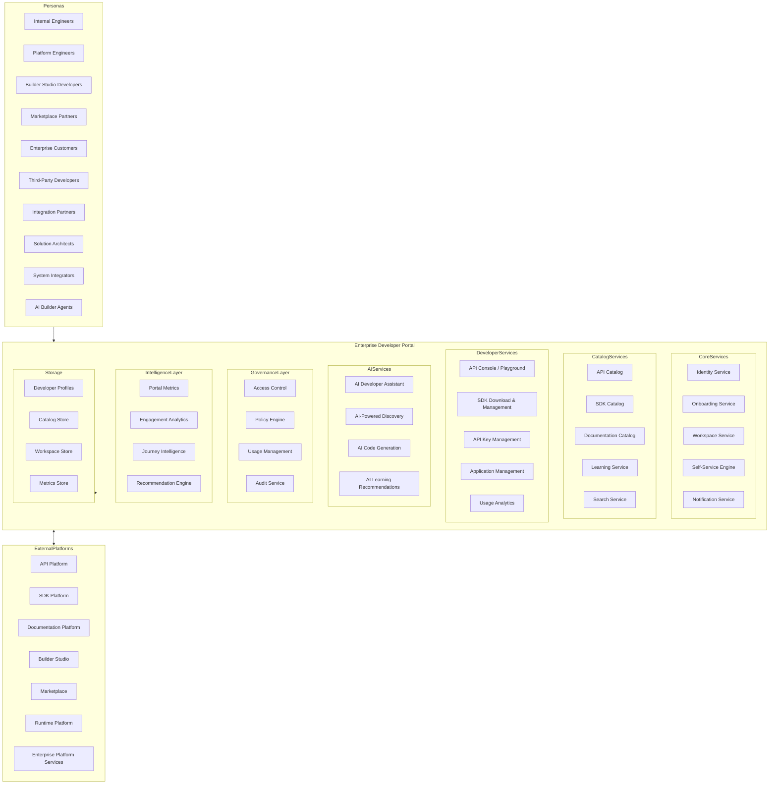
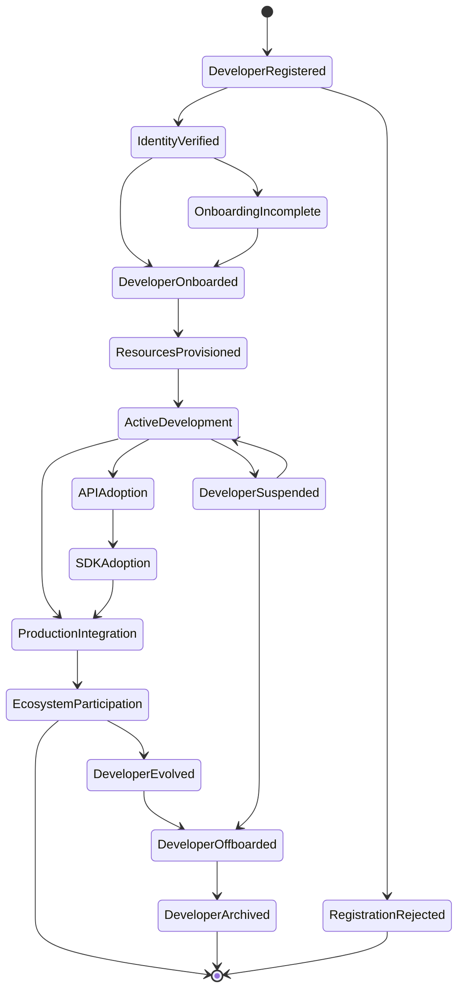
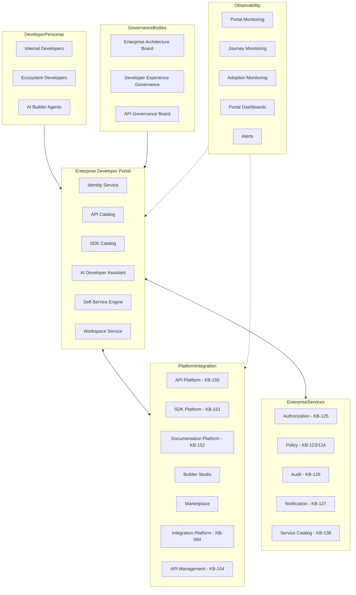

# KB-153 — Developer Portal Architecture

---

## Metadata

- **Document ID:** KB-153
- **Title:** Developer Portal Architecture
- **Suite:** Developer Experience (DX) & Engineering Platform Architecture
- **Version:** 1.0
- **Status:** Approved Architecture
- **Classification:** Enterprise Developer Experience Architecture
- **Date:** 2026-07-12

---

## Executive Summary

The Enterprise Developer Portal provides a centralized, secure, discoverable, AI-ready, self-service platform serving every developer persona across the DUKADESK ecosystem. Internal engineers, Builder Studio creators, Marketplace partners, enterprise customers, third-party developers, system integrators, and AI Builder Agents interact with DUKADESK through a single governed entry point for API discovery, SDK distribution, documentation access, engineering self-service, developer identity integration, and AI-assisted development services.

The Developer Portal functions as the authoritative entry point for all developer interactions with DUKADESK.

---

## Purpose

Define how DUKADESK standardizes the developer experience by providing a unified enterprise portal integrating documentation, SDKs, APIs, tools, learning resources, governance, and developer services.

---

## Scope

### In Scope

- Enterprise Developer Portal architecture
- Developer personas
- Portal capabilities
- Self-service architecture
- Developer onboarding
- API discovery
- SDK distribution
- Documentation integration
- Learning architecture
- Developer workspaces
- Portal governance
- AI-assisted developer services
- Portal observability
- Developer engagement
- Developer ecosystem architecture

### Out of Scope

- Identity implementation
- API Gateway implementation
- SDK implementation
- Documentation implementation
- Marketplace implementation
- Builder Studio implementation

These are covered by dedicated Knowledge Base documents including KB-150 (API Development Standards Architecture), KB-151 (SDK & Developer Toolkit Architecture), and KB-152 (Documentation Platform Architecture) within this suite.

---

## Architectural Principles

| # | Principle | Description |
|---|-----------|-------------|
| 1 | Developer-First Experience | Every portal capability is designed for developer productivity, satisfaction, and success |
| 2 | Self-Service by Default | Developers provision resources, access tools, and manage integrations through self-service |
| 3 | Single Developer Entry Point | The Developer Portal is the sole authoritative entry point for all developer interactions |
| 4 | Discoverability by Design | Every API, SDK, document, and resource is discoverable through the portal catalog |
| 5 | Secure by Design | Developer identities, access, and resources are governed through enterprise security policies |
| 6 | AI-Assisted Development | AI capabilities augment discovery, learning, integration, and engineering productivity |
| 7 | Reuse Before Duplication | Portal content and capabilities are reused before new resources are created |
| 8 | Consistent Developer Journeys | All developer journeys follow standardized, governed, and observable workflows |
| 9 | Vendor Independence | No dependency on specific portal vendor platforms |
| 10 | Technology Neutrality | The architecture supports any technology stack without bias |
| 11 | Enterprise Scalability | Developer Portal scales across all personas, teams, products, and ecosystems |
| 12 | Observability by Default | All portal operations emit metrics, logs, traces, and events |

---

## Canonical Definitions

| Term | Definition |
|------|-----------|
| Developer Portal | The centralized enterprise platform providing all developer interactions with DUKADESK |
| Developer Workspace | A personalized portal environment for managing developer resources and integrations |
| Developer Journey | The end-to-end experience from registration through production integration and ecosystem participation |
| Developer Persona | A classification of developer type with defined capabilities, access, and journey patterns |
| Self-Service | The capability for developers to independently provision resources and manage integrations |
| API Catalog | The searchable inventory of enterprise APIs accessible through the portal |
| SDK Catalog | The searchable inventory of enterprise SDKs and developer toolkits |
| Learning Path | A structured sequence of educational resources for developer skill development |
| Developer Identity | The enterprise identity governing developer access, authorization, and personalization |
| Developer Onboarding | The governed process of registering, verifying, and provisioning developers into the ecosystem |
| Developer Organization | A group of developers with shared access, resources, and governance policies |
| Portal Governance | The policies, roles, and processes governing the Developer Portal |
| Portal Service | A capability exposed through the Developer Portal |
| Developer Ecosystem | The complete network of developers, partners, and consumers interacting through the portal |
| Enterprise Developer Platform | The canonical platform governing all developer experiences within DUKADESK |
| AI Developer Assistant | An AI-powered capability providing intelligent support within the Developer Portal |
| Developer Catalog | The comprehensive index of all developer resources available through the portal |
| Developer Experience | The overall quality of developer interactions with the DUKADESK platform |
| Developer Community | The social and collaborative layer connecting developers within the ecosystem |

---

## Enterprise Developer Portal Platform

---

## Developer Persona Architecture

```mermaid
graph TB
    subgraph DeveloperPersonas[Developer Persona Architecture]

        subgraph InternalPersonas
            IP_INT_ENG[Internal Engineer]
            IP_PLAT_ENG[Platform Engineer]
            IP_QA_ENG[QA Engineer]
            IP_SEC_ENG[Security Engineer]
            IP_ARCH[Architect]
            IP_DEVOPS[DevOps Engineer]
        end

        subgraph EcosystemPersonas
            EP_STUDIO[Builder Studio Developer]
            EP_PARTNER[Marketplace Partner]
            EP_CUSTOMER[Enterprise Customer]
            EP_THIRD_PARTY[Third-Party Developer]
            EP_INTEGRATOR[Integration Partner]
            EP_SOL_ARCH[Solution Architect]
            EP_SYS_INTEG[System Integrator]
        end

        subgraph AIPersonas
            AP_AI_AGENT[AI Builder Agent]
            AP_AI_INTEG[AI Integration Developer]
            AP_AI_CONSUMER[AI Service Consumer]
        end

        subgraph PersonaAttributes
            PA_SCOPE[Access Scope]
            PA_CAPABILITIES[Available Capabilities]
            PA_RESOURCES[Provisioned Resources]
            PA_GOVERNANCE[Governance Policies]
            PA_JOURNEY[Onboarding Journey]
        end

        subgraph PersonaLifecycle
            PL_REGISTER[Registration]
            PL_VERIFY[Identity Verification]
            PL_PROVISION[Resource Provisioning]
            PL_ACTIVE[Active Engagement]
            PL_UPDATE[Profile Updates]
            PL_OFFBOARD[Offboarding]
        end
    end

    InternalPersonas --> PersonaAttributes
    EcosystemPersonas --> PersonaAttributes
    AIPersonas --> PersonaAttributes
    PersonaAttributes --> PersonaLifecycle
```

---

## Developer Journey Lifecycle

---

## Portal Capability Architecture

```mermaid
graph TB
    subgraph PortalCapabilities[Portal Capability Architecture]

        subgraph OnboardingCapabilities
            OC_REG[Developer Registration]
            OC_ID[Identity Verification]
            OC_PROFILE[Profile Management]
            OC_ORG[Organization Management]
            OC_TEAM[Team Management]
        end

        subgraph DiscoveryCapabilities
            DC_API_SEARCH[API Search]
            DC_SDK_SEARCH[SDK Search]
            DC_DOC_SEARCH[Documentation Search]
            DC_LEARNING[Learning Resources]
            DC_RECOMMEND[Recommendations]
        end

        subgraph DevelopmentCapabilities
            DC_API_CONSOLE[API Console / Playground]
            DC_CODE_GEN[Code Generation]
            DC_SDK_DOWNLOAD[SDK Download]
            DC_SAMPLE[Sample Applications]
            DC_TUTORIAL[Tutorials]
        end

        subgraph ManagementCapabilities
            MC_KEYS[API Key Management]
            MC_APPS[Application Management]
            MC_SUBS[Subscription Management]
            MC_QUOTA[Usage & Quota Management]
            MC_ANALYTICS[Usage Analytics]
        end

        subgraph EcosystemCapabilities
            EC_FORUM[Developer Forum]
            EC_BLOG[Developer Blog]
            EC_CHANGELOG[Changelog / Release Notes]
            EC_STATUS[Platform Status]
            EC_SUPPORT[Developer Support]
        end

        subgraph AICapabilities
            AC_ASSISTANT[AI Assistant]
            AC_DISCOVERY[AI Discovery]
            AC_CODE_HELP[AI Code Help]
            AC_LEARNING[AI Learning Paths]
        end
    end

    OnboardingCapabilities --> DiscoveryCapabilities
    DiscoveryCapabilities --> DevelopmentCapabilities
    DevelopmentCapabilities --> ManagementCapabilities
    ManagementCapabilities --> EcosystemCapabilities
    AICapabilities -.-> DiscoveryCapabilities
    AICapabilities -.-> DevelopmentCapabilities
    AICapabilities -.-> EcosystemCapabilities
```

---

## Developer Workspace Architecture

```mermaid
graph TB
    subgraph WorkspaceArchitecture[Developer Workspace Architecture]

        subgraph WorkspaceComponents
            WC_PROFILE[Developer Profile]
            WC_ORGANIZATION[Organization Context]
            WC_APPS[Registered Applications]
            WC_KEYS[API Keys & Credentials]
            WC_SUBSCRIPTIONS[Active Subscriptions]
            WC_DASHBOARD[Usage Dashboard]
            WC_RECENT[Recent Activity]
            WC_BOOKMARKS[Bookmarked Resources]
        end

        subgraph WorkspaceCapabilities
            WC_API_MGMT[API Management]
            WC_SDK_MGMT[SDK Management]
            WC_APP_MGMT[Application Management]
            WC_KEY_MGMT[Key & Credential Management]
            WC_MONITOR[Usage Monitoring]
            WC_BILLING[Billing & Invoicing]
            WC_SUPPORT[Support & Tickets]
        end

        subgraph WorkspaceSettings
            WS_NOTIFICATION[Notification Preferences]
            WS_INTEGRATION[Integration Settings]
            WS_SECURITY[Security Settings]
            WS_TEAM[Team Settings]
            WS_API[API Preferences]
        end

        subgraph WorkspaceIntelligence
            WI_USAGE[Usage Insights]
            WI_RECOMMEND[Personalized Recommendations]
            WI_ALERTS[Intelligent Alerts]
            WI_TRENDS[Usage Trends]
        end
    end

    WorkspaceComponents --> WorkspaceCapabilities
    WorkspaceCapabilities --> WorkspaceSettings
    WorkspaceSettings --> WorkspaceIntelligence
```

---

## AI-Assisted Developer Services Architecture

```mermaid
graph TB
    subgraph AIDeveloperServices[AI-Assisted Developer Services Architecture]

        subgraph AICapabilities
            AI_CHAT[AI Developer Chat Assistant]
            AI_SEARCH[AI-Powered Search]
            AI_CODE[AI Code Generation]
            AI_DOC[AI Documentation Summarization]
            AI_LEARN[AI Learning Recommendations]
            AI_DEBUG[AI Debugging Assistance]
            AI_INTEGRATE[AI Integration Guidance]
            AI_BEST_PRACTICE[AI Best Practice Recommendations]
        end

        subgraph AIDataSources
            ADS_API_SPEC[API Specifications]
            ADS_SDK_CODE[SDK Code & Examples]
            ADS_DOCS[Documentation Corpus]
            ADS_KB[Knowledge Base]
            ADS_LEARNING[Learning Resources]
            ADS_COMMUNITY[Community Discussions]
            ADS_USAGE[Usage Patterns]
        end

        subgraph AIInteractionModels
            AIM_CHAT[Conversational Chat]
            AIM_QUERY[Natural Language Query]
            AIM_CONTEXT[Context-Aware Assistance]
            AIM_PROACTIVE[Proactive Suggestions]
            AIM_EMBEDDED[Embedded Help]
        end

        subgraph AIGovernance
            AIG_ACCURACY[Accuracy Validation]
            AIG_SAFETY[AI Safety Controls]
            AIG_PRIVACY[Privacy Protection]
            AIG_FEEDBACK[Feedback Loop]
            AIG_IMPROVEMENT[Continuous Improvement]
        end

        subgraph AIIntelligence
            AII_EFFECTIVENESS[Assistance Effectiveness]
            AII_SATISFACTION[Developer Satisfaction]
            AII_ADOPTION[AI Feature Adoption]
            AII_IMPACT[Productivity Impact]
        end
    end

    AICapabilities --> AIInteractionModels
    AIDataSources --> AICapabilities
    AIInteractionModels --> AIGovernance
    AIGovernance --> AIIntelligence
```

---

## Enterprise Developer Ecosystem Operating Model

---

## Governance Architecture

```mermaid
graph TB
    subgraph GovernanceArchitecture[Developer Portal Governance Architecture]

        subgraph StrategicGovernance
            EAB2[Enterprise Architecture Board]
            DEV_EXP_GOV2[Developer Experience Governance]
            PORTAL_OWNER[Portal Owner / Steward]
        end

        subgraph DeveloperGovernance
            DG_IDENTITY[Developer Identity Policy]
            DG_ONBOARD[Onboarding Policy]
            DG_ACCESS[Access Control Policy]
            DG_ORG[Organization Management Policy]
            DG_OFFBOARD[Offboarding Policy]
        end

        subgraph PortalGovernance
            PG_CAPABILITY[Capability Lifecycle Policy]
            PG_CONTENT[Content Governance Policy]
            PG_QUALITY[Portal Quality Standards]
            PG_USAGE[Usage & Quota Policy]
        end

        subgraph EcosystemGovernance
            EG_PARTNER[Partner Access Policy]
            EG_MARKETPLACE[Marketplace Integration Policy]
            EG_THIRD_PARTY[Third-Party Access Policy]
            EG_AI[AI Agent Access Policy]
        end

        subgraph SecurityAndCompliance
            SC_AUTH[Authentication Policy]
            SC_AUTHZ[Authorization Policy]
            SC_DATA[Data Protection Policy]
            SC_AUDIT[Audit Policy]
            SC_COMPLIANCE[Regulatory Compliance]
        end

        subgraph Enforcement
            ENF_ACCESS[Access Enforcement]
            ENF_ONBOARD[Onboarding Gates]
            ENF_QUOTA[Quota Enforcement]
            ENF_COMPLIANCE[Compliance Enforcement]
            ENF_AUDIT[Audit Trail]
        end
    end

    StrategicGovernance --> DeveloperGovernance
    StrategicGovernance --> PortalGovernance
    StrategicGovernance --> EcosystemGovernance
    SecurityAndCompliance --> DeveloperGovernance
    SecurityAndCompliance --> PortalGovernance
    DeveloperGovernance --> Enforcement
    PortalGovernance --> Enforcement
    EcosystemGovernance --> Enforcement
```

---

## Developer Engagement Architecture

```mermaid
graph TB
    subgraph DeveloperEngagement[Developer Engagement Architecture]

        subgraph EngagementPhases
            EP_AWARE[Awareness]
            EP_EVALUATE[Evaluation]
            EP_ADOPT[Adoption]
            EP_INTEGRATE[Integration]
            EP_PRODUCE[Production]
            EP_ADVOCATE[Advocacy]
        end

        subgraph EngagementChannels
            EC_PORTAL[Developer Portal]
            EC_NEWSLETTER[Newsletter]
            EC_BLOG2[Developer Blog]
            EC_FORUM2[Community Forum]
            EC_EVENTS[Events & Webinars]
            EC_SOCIAL[Social Media]
            EC_SUPPORT2[Support Channel]
        end

        subgraph EngagementMetrics
            EM_REGISTRATION[Registration Rate]
            EM_ONBOARDING[Onboarding Completion]
            EM_ADOPTION[API / SDK Adoption]
            EM_INTEGRATION[Integration Success]
            EM_ACTIVITY[Developer Activity]
            EM_SATISFACTION[Developer Satisfaction]
            EM_RETENTION[Developer Retention]
            EM_ADVOCACY[Net Promoter Score]
        end

        subgraph EngagementLifecycle
            EL_ACQUIRE[Acquire]
            EL_ACTIVATE[Activate]
            EL_RETAIN[Retain]
            EL_GROW[Grow]
            EL_ADVOCATE[Advocate]
        end

        subgraph EngagementIntelligence
            EI_SEGMENT[Developer Segmentation]
            EI_BEHAVIOR[Behavior Analysis]
            EI_CHURN[Churn Prediction]
            EI_OPPORTUNITY[Growth Opportunities]
        end
    end

    EngagementPhases --> EngagementChannels
    EngagementChannels --> EngagementMetrics
    EngagementMetrics --> EngagementLifecycle
    EngagementLifecycle --> EngagementIntelligence
```

---

## Enterprise Developer Portal Reference Architecture

```mermaid
graph TB
    subgraph ReferenceModel[Enterprise Developer Portal Reference Architecture]

        subgraph PortalDomains
            PD1[Developer Onboarding</br>Registration, identity,</br>provisioning]
            PD2[API Discovery</br>Catalog, search,</br>console]
            PD3[SDK Distribution</br>Catalog, download,</br>generation]
            PD4[Documentation Access</br>Search, browsing,</br>AI summaries]
            PD5[Learning & Training</br>Tutorials, paths,</br>workshops]
            PD6[Developer Workspace</br>Resources, keys,</br>monitoring]
            PD7[Community & Support</br>Forums, tickets,</br>knowledge base]
            PD8[AIAssisted Development</br>Assistant, code gen,</br>recommendations]
        end

        subgraph PortalStandards
            PS1[Self-Service by Default]
            PS2[Consistent UX]
            PS3[Single Sign-On]
            PS4[Role-Based Access]
            PS5[Unified Search]
            PS6[AI Readiness]
            PS7[Governance Enforcement]
        end

        subgraph IntegrationPatterns
            IP1[API - Portal Integration]
            IP2[SDK - Portal Distribution]
            IP3[Doc - Portal Rendering]
            IP4[Identity - Portal SSO]
            IP5[AI - Portal Assistance]
            IP6[Analytics - Portal Metrics]
        end

        subgraph QualityAttributes
            QA1[Unified]
            QA2[Discoverable]
            QA3[Self-Service]
            QA4[Secure]
            QA5[Governed]
            QA6[AI-Enabled]
        end
    end

    PortalDomains --> PortalStandards
    PortalStandards --> IntegrationPatterns
    IntegrationPatterns --> QualityAttributes
```

---

## Governance

| Domain | Governance Focus |
|--------|-----------------|
| Developer Governance | Developer identity, onboarding, access control, organization management, offboarding |
| Portal Governance | Capability lifecycle, content governance, quality standards, usage and quota policy |
| Ecosystem Governance | Partner access, Marketplace integration, third-party access, AI agent access |
| API Governance | API catalog governance, API access policies, API usage management |
| SDK Governance | SDK catalog governance, SDK distribution policies, SDK version access |
| Documentation Governance | Documentation catalog governance, content standards, version alignment |
| AI Governance | AI assistant governance, AI safety controls, AI-generated content governance |
| Security Governance | Authentication, authorization, data protection, audit, compliance |
| Operational Governance | Portal operations, availability, performance, capacity management |
| Enterprise Governance | The Enterprise Architecture board governs Developer Portal evolution |

### Governance Enforcement Points

| Enforcement Point | Mechanism |
|-------------------|-----------|
| Developer Registration | Identity verification, organization validation, persona assignment |
| Developer Onboarding | Onboarding checklist completion, capability activation, resource provisioning |
| API Access | Authentication, authorization, key issuance, quota assignment |
| SDK Download | Identity verification, license acceptance, version compliance |
| Portal Capability Publication | Capability review, quality validation, catalog registration |
| AI Assistant Usage | AI safety validation, accuracy monitoring, feedback collection |

---

## Responsibilities

| Role | Responsibilities |
|------|-----------------|
| Enterprise Architecture Board | Governs Developer Portal architecture, standards, and platform evolution |
| Developer Experience Team | Owns the Developer Portal; defines developer journeys, capabilities, and experience standards |
| Platform Engineering | Develops, operates, and maintains the Enterprise Developer Portal |
| Documentation Team | Maintains documentation integrated with the portal |
| API Governance Board | Governs API catalog entries and API discovery standards |
| Security | Defines portal security policies; validates developer identity and access controls |
| Compliance | Defines portal compliance requirements; audits developer governance |
| AI Governance Board | Governs AI-assisted developer services and AI safety within the portal |
| Customer Success | Manages developer engagement, satisfaction, and ecosystem growth |
| Operations | Manages portal platform operations, availability, and performance |

---

## Security

| Security Control | Description |
|------------------|-------------|
| Secure Developer Identities | Developer identities are verified, authenticated, and governed through enterprise identity platform |
| Zero Trust | Every portal access is authenticated, authorized, and verified |
| Least Privilege | Developers access only resources and capabilities permitted for their persona |
| Secure Onboarding | Developer registration and onboarding follow secure identity verification workflows |
| Policy Enforcement | Portal governance policies are enforced through automated access controls |
| Developer Authorization | Developer access to APIs, SDKs, and resources is authorized per persona and organization |
| Auditability | All developer portal operations are recorded in immutable audit log |
| Workspace Protection | Developer workspaces are isolated and access-controlled |
| Developer Asset Protection | API keys, credentials, and developer data are encrypted and access-restricted |
| Trust Boundaries | Portal capabilities are segmented by trust zones with defined security controls |

### Security Zones

| Zone | Description |
|------|-------------|
| Public Portal | Public-facing portal pages accessible without authentication |
| Authenticated Portal | Portal capabilities accessible to authenticated developers |
| Internal Portal | Portal capabilities accessible to internal DUKADESK employees |
| Partner Portal | Portal capabilities accessible to verified partners |
| Admin Portal | Portal administration capabilities with elevated access |

---

## Privacy

| Privacy Control | Description |
|----------------|-------------|
| Developer Profile Protection | Developer personal information is classified and access-restricted |
| Organizational Privacy | Organization-level data is isolated and governed per enterprise policies |
| Regulatory Compliance | Developer data handling complies with GDPR, CCPA, and regional regulations |
| Data Minimization | Only required developer data is collected and processed |
| Cross-Border Governance | Developer data respects data residency requirements |
| Retention Governance | Developer profiles and activity data are retained per policy and purged when expired |
| Privacy Assurance | Regular privacy reviews for Developer Portal capabilities |
| Secure Developer Metadata | Developer metadata and usage patterns are access-restricted |

---

## Performance

| Consideration | Requirement |
|---------------|-------------|
| Enterprise-Scale Developer Ecosystems | Portal serves millions of developers across all personas |
| High-Volume Onboarding | Portal supports thousands of concurrent developer registrations and onboarding workflows |
| Elastic Scalability | Portal capacity scales horizontally with developer demand |
| High Availability | 99.99% uptime for critical portal services |
| Operational Resilience | Graceful degradation under load with portal query backpressure |
| Efficient Resource Discovery | Portal searches complete within defined latency targets |
| Multi-Region Readiness | Portal operates across global regions with localized experiences |
| Developer Productivity Optimization | Portal interactions complete within defined response time targets |

### Performance Optimization

| Optimization | Description |
|--------------|-------------|
| Content Caching | Portal content and catalog entries are cached for fast delivery |
| Search Indexing | Portal search indexes are optimized for relevance and response time |
| CDN Distribution | Static portal content is distributed through content delivery network |
| Personalized Caching | Developer-specific portal views are cached per session |
| Lazy Loading | Portal capabilities load progressively for fast initial rendering |
| API Response Optimization | Portal API responses are optimized for reduced payload size |

---

## Observability

| Observable Dimension | Metrics | Purpose |
|---------------------|---------|---------|
| Portal Health | Portal availability, response time, error rate | Monitoring portal platform health |
| Developer Adoption | Registration rate, onboarding completion, active developers | Tracking developer ecosystem growth |
| Portal Analytics | Page views, search volume, feature usage | Understanding portal usage patterns |
| Governance Dashboards | Access violation rate, policy compliance, audit trail completeness | Monitoring portal governance |
| Operational Reporting | Daily portal activity, capability usage, persona distribution | Operational portal management |
| Executive Reporting | Developer ecosystem growth, satisfaction trends, platform adoption | Strategic portal intelligence |
| Developer Journey Metrics | Time to onboard, time to first API call, integration success rate | Journey effectiveness measurement |
| Portal Intelligence | Developer behavior patterns, popular resources, friction points | Portal improvement insights |
| Ecosystem Analytics | Partner activity, third-party adoption, community engagement | Ecosystem health tracking |
| Developer Experience Metrics | Developer satisfaction score, net promoter score, support request volume | Developer experience measurement |

### Observability Events

| Event Type | Trigger | Consumer |
|------------|---------|----------|
| DeveloperRegistered | New developer registration completed | Identity service, onboarding service |
| DeveloperOnboarded | Developer onboarding completed | Workspace service, notification service |
| APIDiscovered | Developer searched or browsed API catalog | Search analytics, recommendation engine |
| SDKDownloaded | SDK package downloaded by developer | Adoption analytics, metrics store |
| APIKeyCreated | New API key generated | Key management, audit service |
| AIAssistantUsed | AI assistant interaction completed | AI analytics, quality service |
| SupportTicketCreated | Developer support ticket submitted | Support service, engagement analytics |
| DeveloperOffboarded | Developer offboarding completed | Identity service, archive service |

---

## Failure Scenarios

| # | Scenario | Architectural Response |
|---|----------|----------------------|
| 1 | Onboarding Failures | Onboarding workflow retry with backoff; notification to developer; escalation on repeated failure |
| 2 | Portal Availability Failures | Active-active failover to alternate region; notification to platform team |
| 3 | Broken Developer Journeys | Journey orchestration detects failure; fallback to previous step; notification to developer |
| 4 | Documentation Inconsistencies | Documentation catalog sync with documentation platform; staleness flag displayed |
| 5 | SDK Discovery Failures | SDK catalog failover to cached index; notification to platform team |
| 6 | API Catalog Failures | API catalog failover to cached entries; notification to platform team |
| 7 | Governance Bypass | Policy enforcement point blocks unauthorized operation; violation recorded |
| 8 | Identity Synchronization Failures | Identity cache used during sync outage; notification to platform team |
| 9 | AI Assistance Failures | AI assistant fallback to static help content; notification to AI platform team |
| 10 | Recovery Failures | Journal-based recovery with replay; cross-service consistency verification |
| 11 | Developer Abandonment | Abandonment detection triggers re-engagement workflow; notification to developer experience team |
| 12 | Resource Provisioning Failures | Provisioning retry with backoff; notification to developer; escalation on repeated failure |

---

## Anti-Patterns

| # | Anti-Pattern | Description | Prohibited Because |
|---|-------------|-------------|-------------------|
| 1 | Multiple Developer Portals | Multiple independent portals serving different developer groups | Fragments developer experience, prevents unified governance, creates confusion |
| 2 | Project-Specific Onboarding | Teams implementing custom onboarding outside the enterprise portal | Creates inconsistent experiences, security gaps, governance violations |
| 3 | Hidden APIs | APIs available without catalog registration in the Developer Portal | Prevents discovery, governance, reuse, enterprise visibility |
| 4 | Duplicate Documentation | Documentation published outside the portal's documentation catalog | Fragments knowledge, confuses developers, prevents traceability |
| 5 | Fragmented Developer Journeys | Disconnected experiences across different portal capabilities | Reduces productivity, creates friction, prevents journey observability |
| 6 | Manual Developer Provisioning | Developer resources provisioned through manual processes | Introduces delays, errors, security gaps, auditability issues |
| 7 | Independent SDK Catalogs | SDKs distributed through channels other than the portal SDK catalog | Prevents governance, version tracking, adoption analytics |
| 8 | Inconsistent Developer Experiences | Different persona experiences with inconsistent UX, navigation, and workflows | Increases cognitive load, reduces satisfaction, prevents standardization |
| 9 | Portal Capabilities Outside Governance | Portal features deployed without governance review or lifecycle management | Creates quality issues, security risks, governance violations |
| 10 | Unstructured Developer Resources | Resources organized without taxonomy, metadata, or search optimization | Prevents discoverability, AI consumption, governance enforcement |

---

## Future Evolution

| # | Evolution Path | Description |
|---|---------------|-------------|
| 1 | Autonomous Developer Onboarding | AI agents that autonomously onboard developers, provision resources, and configure workspaces |
| 2 | AI-Powered Developer Assistants | Advanced AI assistants that provide contextual development guidance throughout the developer journey |
| 3 | Semantic Platform Discovery | ML-driven discovery of APIs, SDKs, and resources based on natural language intent |
| 4 | Intelligent Engineering Copilots | AI copilots integrated into the portal that assist with integration, debugging, and optimization |
| 5 | Federated Developer Ecosystems | Portal federation across DUKADESK and partner ecosystems |
| 6 | Adaptive Learning Journeys | Personalized learning paths that dynamically adapt to developer skill and progress |
| 7 | Enterprise Developer Intelligence | AI-driven insights into developer productivity, satisfaction, and ecosystem health |
| 8 | Self-Evolving Developer Platforms | Portals that autonomously optimize capabilities based on developer behavior and feedback |

---

## Cross References

| Document ID | Title | Relationship |
|-------------|-------|-------------|
| KB-094 | Integration Platform Architecture | Defines integration platform accessible through portal |
| KB-104 | API Management Architecture | Defines API management integrated with portal API catalog |
| KB-141 | Developer Experience Platform Architecture | Foundational DX platform that hosts the Developer Portal |
| KB-150 | API Development Standards Architecture | Defines API standards for portal API catalog |
| KB-151 | SDK & Developer Toolkit Architecture | Defines SDK catalog integrated with portal |
| KB-152 | Documentation Platform Architecture | Defines documentation catalog integrated with portal |
| KB-154 | Developer Onboarding & Enablement Architecture | Defines onboarding workflows executed through portal |
| KB-157 | Engineering Knowledge Management Architecture | Defines knowledge assets accessible through portal |
| KB-159 | AI-Assisted Software Engineering Architecture | Defines AI capabilities consumed by portal AI assistant |
| KB-160 | Developer Experience Reference Architecture | Comprehensive reference for the DX suite |

---

## Critical DUKADESK Architectural Rule

**All developer interactions with the DUKADESK ecosystem shall occur through the canonical Enterprise Developer Portal Architecture. No application, Builder Studio module, Marketplace extension, platform service, AI Builder Agent, or engineering team shall establish independent developer portals, onboarding experiences, SDK distribution channels, API discovery mechanisms, documentation access points, or developer self-service capabilities outside the enterprise architecture, ensuring a unified, secure, discoverable, AI-ready, and enterprise-governed developer experience across the entire DUKADESK platform.**

(End of file - total 1088 lines)
