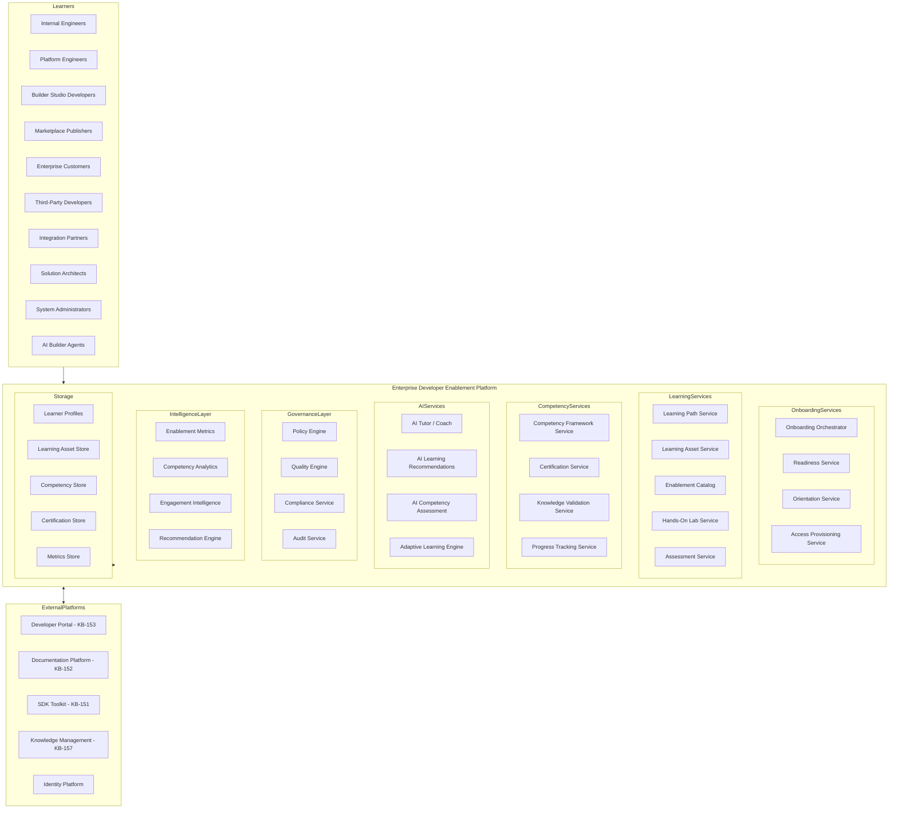
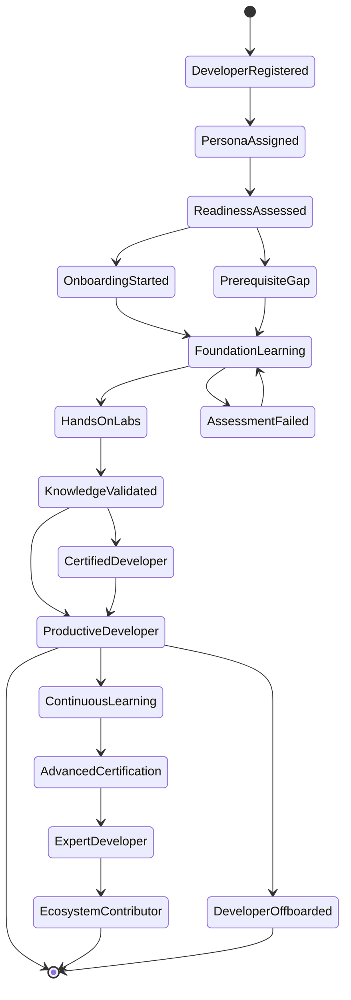
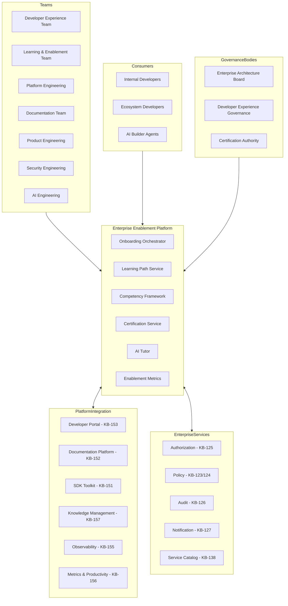

# KB-154 — Developer Onboarding & Enablement Architecture

---

## Metadata

- **Document ID:** KB-154
- **Title:** Developer Onboarding & Enablement Architecture
- **Suite:** Developer Experience (DX) & Engineering Platform Architecture
- **Version:** 1.0
- **Status:** Approved Architecture
- **Classification:** Enterprise Developer Enablement Architecture
- **Date:** 2026-07-12

---

## Executive Summary

The Enterprise Developer Enablement Platform provides structured, measurable, AI-assisted onboarding and continuous learning experiences that enable every developer persona across the DUKADESK ecosystem to become productive quickly while maintaining enterprise standards, governance, security, architectural consistency, and long-term engineering excellence. Internal engineers, Builder Studio creators, Marketplace publishers, enterprise customers, third-party developers, integration partners, and AI Builder Agents follow governed learning paths, competency models, and certification programs.

Developer enablement is treated as an enterprise capability rather than an ad hoc training activity.

---

## Purpose

Define how DUKADESK standardizes developer onboarding, learning, certification, enablement, productivity acceleration, and engineering readiness across the entire platform ecosystem.

---

## Scope

### In Scope

- Developer onboarding architecture
- Enablement architecture
- Learning architecture
- Certification architecture
- Developer readiness
- Onboarding lifecycle
- Learning pathways
- Role-based enablement
- AI-assisted learning
- Developer competency model
- Knowledge validation
- Developer productivity acceleration
- Enablement governance
- Enablement analytics
- Continuous developer education

### Out of Scope

- HR onboarding
- Identity implementation
- LMS implementation
- Documentation implementation
- Developer Portal implementation
- SDK implementation

These are covered by dedicated Knowledge Base documents including KB-152 (Documentation Platform Architecture), KB-153 (Developer Portal Architecture), and KB-157 (Engineering Knowledge Management Architecture).

---

## Architectural Principles

| # | Principle | Description |
|---|-----------|-------------|
| 1 | Developer-First Enablement | Every enablement experience is designed for developer success and productivity |
| 2 | Learn by Architecture | Learning is structured around enterprise architecture domains and capabilities |
| 3 | Self-Service Learning | Developers access learning resources, paths, and assessments through self-service |
| 4 | Role-Based Onboarding | Onboarding and learning paths are tailored to developer persona and role |
| 5 | Continuous Education | Learning is a continuous journey rather than a one-time onboarding event |
| 6 | AI-Assisted Learning | AI augments personalized learning, competency assessment, and knowledge discovery |
| 7 | Measurable Competency | Competency is measured through defined frameworks, assessments, and certifications |
| 8 | Knowledge Reuse | Learning assets are reused across personas, programs, and domains |
| 9 | Vendor Independence | No dependency on specific learning platform vendors |
| 10 | Technology Neutrality | The architecture supports any technology stack without bias |
| 11 | Enterprise Scalability | Enablement platform scales across all personas, teams, and ecosystems |
| 12 | Observability by Default | All enablement activities emit metrics, logs, traces, and events |

---

## Canonical Definitions

| Term | Definition |
|------|-----------|
| Developer Onboarding | The governed process of enabling a developer to become productive within the DUKADESK ecosystem |
| Developer Enablement | The continuous capability of providing developers with knowledge, skills, and resources for success |
| Learning Path | A structured sequence of learning assets aligned to a developer role and competency level |
| Competency Framework | A defined model of knowledge, skills, and proficiency levels for engineering roles |
| Certification | A governed credential validating developer competency against enterprise standards |
| Developer Readiness | The state of a developer having the required knowledge and access to perform their role |
| Developer Journey | The end-to-end experience from initial registration through ongoing ecosystem participation |
| Enablement Program | A structured program of learning, assessment, and certification for a developer persona |
| Learning Asset | A governed educational resource including tutorials, labs, documentation, and assessments |
| Enablement Catalog | A searchable index of all enterprise learning assets and programs |
| Competency Assessment | A governed evaluation of developer knowledge against defined competency criteria |
| Role-Based Learning | Learning paths tailored to specific developer roles and responsibilities |
| Knowledge Validation | The automated verification of developer knowledge through assessments and practical exercises |
| AI Learning Assistant | An AI-powered capability providing personalized learning guidance and support |
| Developer Productivity | The measured effectiveness of developers in delivering engineering outcomes |
| Enterprise Enablement Platform | The canonical platform governing all developer onboarding and enablement |
| Engineering Competency | The demonstrated knowledge and skill level of an engineer in defined domains |
| Developer Certification | A formal credential indicating mastery of DUKADESK platform capabilities |
| Continuous Learning | The ongoing practice of acquiring and updating knowledge throughout the developer lifecycle |
| Enablement Governance | The policies, roles, and processes governing enterprise developer enablement |

---

## Enterprise Developer Enablement Platform

---

## Developer Persona Enablement Model

```mermaid
graph TB
    subgraph PersonaEnablement[Developer Persona Enablement Model]

        subgraph InternalPersonas
            IP_NEW[New Internal Engineer]
            IP_PLATFORM[Platform Engineer]
            IP_QA[QA Engineer]
            IP_SEC[Security Engineer]
            IP_DEVOPS[DevOps Engineer]
            IP_ARCH[Solution Architect]
        end

        subgraph EcosystemPersonas
            EP_STUDIO[Builder Studio Developer]
            EP_MARKETPLACE[Marketplace Publisher]
            EP_CUSTOMER[Enterprise Customer Developer]
            EP_THIRD_PARTY[Third-Party Developer]
            EP_INTEGRATOR[Integration Partner]
            EP_SYS_ADMIN[System Administrator]
        end

        subgraph AIPersonas
            AP_AI_DEV[AI Integration Developer]
            AP_AI_AGENT[AI Builder Agent Developer]
            AP_AI_CONSUMER[AI Service Consumer]
        end

        subgraph EnablementPrograms
            EP_ONBOARD[Onboarding Program]
            EP_FOUNDATION[Foundation Learning Path]
            EP_ADVANCED[Advanced Learning Path]
            EP_EXPERT[Expert Learning Path]
            EP_CERT[Certification Program]
            EP_CONTINUOUS[Continuous Education Program]
        end

        subgraph PersonaAttributes
            PA_PREREQ[Prerequisite Knowledge]
            PA_LEARNING_PATH[Assigned Learning Path]
            PA_COMP_LEVEL[Target Competency Level]
            PA_CERT_REQ[Required Certifications]
            PA_ENABLEMENT_TIME[Expected Time to Productivity]
        end
    end

    InternalPersonas --> EnablementPrograms
    EcosystemPersonas --> EnablementPrograms
    AIPersonas --> EnablementPrograms
    EnablementPrograms --> PersonaAttributes
```

---

## Developer Onboarding Lifecycle

---

## Learning Path Architecture

```mermaid
graph TB
    subgraph LearningPathArchitecture[Learning Path Architecture]

        subgraph LearningPathStructure
            LPS_FOUNDATION[Foundation Path</br>Platform basics,</br>core concepts]
            LPS_ROLE[Role Path</br>Role-specific skills,</br>domain knowledge]
            LPS_ADVANCED[Advanced Path</br>Deep expertise,</br>specialization]
            LPS_EXPERT[Expert Path</br>Architecture,</br>innovation]
            LPS_CERT[Certification Path</br>Exam preparation,</br>validation]
        end

        subgraph LearningAssetTypes
            LAT_DOC[Documentation]
            LAT_TUTORIAL[Tutorial / Guide]
            LAT_LAB[Hands-On Lab]
            LAT_VIDEO[Video Course]
            LAT_WORKSHOP[Workshop]
            LAT_REFERENCE[Reference Architecture]
            LAT_CODE_SAMPLE[Code Sample]
            LAT_PROJECT[Guided Project]
            LAT_ASSESSMENT[Knowledge Assessment]
        end

        subgraph LearningPathGovernance
            LPG_OWNERSHIP[Path Ownership]
            LPG_VERSION[Path Versioning]
            LPG_REVIEW[Periodic Review]
            LPG_CURRENCY[Content Currency]
            LPG_QUALITY[Quality Standards]
        end

        subgraph LearningPathPersonalization
            LPP_ROLE[Role-Based Tailoring]
            LPP_LEVEL[Level-Based Adaptation]
            LPP_PACE[Self-Paced Progression]
            LPP_PREREQ[Prerequisite Mapping]
            LPP_AI[AI Recommendations]
        end

        subgraph LearningPathObservability
            LPO_COMPLETION[Completion Rate]
            LPO_TIME[Time to Complete]
            LPO_ASSESS[Assessment Scores]
            LPO_SATISFACTION[Learner Satisfaction]
            LPO_IMPACT[Productivity Impact]
        end
    end

    LearningPathStructure --> LearningAssetTypes
    LearningAssetTypes --> LearningPathGovernance
    LearningPathGovernance --> LearningPathPersonalization
    LearningPathPersonalization --> LearningPathObservability
```

---

## Competency & Certification Architecture

```mermaid
graph TB
    subgraph CompetencyArchitecture[Competency & Certification Architecture]

        subgraph CompetencyFramework
            CF_LEVELS[Competency Levels</br>Foundation, Proficient,</br>Advanced, Expert]
            CF_DIMENSIONS[Competency Dimensions</br>Knowledge, Skills,</br>Experience, Behavior]
            CF_DOMAINS[Competency Domains</br>Platform, API, SDK,</br>Security, Architecture]
        end

        subgraph CompetencyAssessment
            CA_SELF[Self-Assessment]
            CA_QUIZ[Knowledge Quiz]
            CA_PRACTICAL[Practical Exercise]
            CA_PROJECT[Project Evaluation]
            CA_PEER[Peer Review]
            CA_AI[AI-Assisted Assessment]
        end

        subgraph CertificationProgram
            CP_LEVELS[Certification Levels</br>Foundation, Professional,</br>Expert, Master]
            CP_REQUIREMENTS[Certification Requirements</br>Prerequisites, exams,</br>practical projects]
            CP_VALIDITY[Certification Validity</br>Duration, renewal,</br>continuing education]
            CP_BADGES[Digital Badges</br>Verifiable credentials,</br>sharable achievements]
        end

        subgraph CompetencyValidation
            CV_AUTO[Automated Validation]
            CV_MANUAL[Manual Review]
            CV_CONTINUOUS[Continuous Validation]
            CV_RENEWAL[Periodic Renewal]
        end

        subgraph CompetencyIntelligence
            CI_GAP[Competency Gap Analysis]
            CI_TREND[Competency Trends]
            CI_WORKFORCE[Workforce Competency]
            CI_RECOMMEND[Development Recommendations]
        end
    end

    CompetencyFramework --> CompetencyAssessment
    CompetencyAssessment --> CertificationProgram
    CertificationProgram --> CompetencyValidation
    CompetencyValidation --> CompetencyIntelligence
```

---

## AI-Assisted Enablement Architecture

```mermaid
graph TB
    subgraph AIEnablement[AI-Assisted Enablement Architecture]

        subgraph AICapabilities
            AI_CHAT[AI Learning Tutor]
            AI_RECOMMEND2[AI Learning Recommendations]
            AI_ADAPT2[Adaptive Learning Engine]
            AI_ASSESS2[AI Competency Assessment]
            AI_COACH[AI Coaching Assistant]
            AI_SEARCH2[AI Knowledge Discovery]
            AI_MENTOR[AI Mentor / Guide]
            AI_FEEDBACK[AI Feedback & Improvement]
        end

        subgraph AIDataSources
            ADS_LEARNER[Learner Profile & History]
            ADS_ASSETS[Learning Asset Corpus]
            ADS_COMPETENCY[Competency Framework]
            ADS_PERFORMANCE[Performance Data]
            ADS_CERTIFICATION[Certification Records]
            ADS_PREREQ[Prerequisite Knowledge]
        end

        subgraph AIInteractionModels
            AIM_CHAT2[Conversational Tutoring]
            AIM_GUIDED[Guided Learning Paths]
            AIM_ADAPTIVE[Dynamic Level Adjustment]
            AIM_PROACTIVE2[Proactive Learning Suggestions]
            AIM_ASSESS[Automated Assessment]
        end

        subgraph AIGovernance
            AIG_ACCURACY2[Learning Accuracy]
            AIG_FAIRNESS[Assessment Fairness]
            AIG_PRIVACY2[Learner Privacy]
            AIG_FEEDBACK2[Feedback Integration]
            AIG_IMPROVEMENT2[Continuous Improvement]
        end

        subgraph AIIntelligence
            AII_EFFECTIVENESS[Learning Effectiveness]
            AII_ENGAGEMENT[Learner Engagement]
            AII_COMP_GROWTH[Competency Growth]
            AII_PRODUCTIVITY[Productivity Impact]
        end
    end

    AICapabilities --> AIInteractionModels
    AIDataSources --> AICapabilities
    AIInteractionModels --> AIGovernance
    AIGovernance --> AIIntelligence
```

---

## Enterprise Enablement Operating Model

---

## Governance Architecture

```mermaid
graph TB
    subgraph GovernanceArchitecture[Enablement Governance Architecture]

        subgraph StrategicGovernance
            EAB2[Enterprise Architecture Board]
            DEV_EXP_GOV2[Developer Experience Governance]
            CERT_AUTHORITY2[Certification Authority]
        end

        subgraph EnablementGovernance
            EG_ONBOARD[Onboarding Policy]
            EG_LEARNING[Learning Standards]
            EG_PATH[Learning Path Governance]
            EG_ASSET[Learning Asset Governance]
            EG_CATALOG[Enablement Catalog Governance]
        end

        subgraph CompetencyGovernance
            CG_FRAMEWORK[Competency Framework Standards]
            CG_ASSESS[Assessment Standards]
            CG_PROCTOR[Assessment Integrity]
            CG_RENEWAL[Competency Renewal Policy]
        end

        subgraph CertificationGovernance
            CP_STANDARDS[Certification Standards]
            CP_EXAM[Exam Integrity]
            CP_CREDENTIAL[Credential Management]
            CP_MAINTENANCE[Certification Maintenance]
        end

        subgraph SecurityAndCompliance
            SC_LEARNER[Learner Data Protection]
            SC_ASSESS[Assessment Security]
            SC_CERT[Certification Integrity]
            SC_AUDIT2[Audit Policy]
            SC_COMPLIANCE2[Regulatory Compliance]
        end

        subgraph Enforcement
            ENF_ONBOARD2[Onboarding Gates]
            ENF_COMPETENCY[Competency Gates]
            ENF_CERT[Certification Gates]
            ENF_RENEWAL[Renewal Enforcement]
            ENF_COMPLIANCE2[Compliance Enforcement]
        end
    end

    StrategicGovernance --> EnablementGovernance
    StrategicGovernance --> CompetencyGovernance
    StrategicGovernance --> CertificationGovernance
    SecurityAndCompliance --> EnablementGovernance
    SecurityAndCompliance --> CompetencyGovernance
    EnablementGovernance --> Enforcement
    CompetencyGovernance --> Enforcement
    CertificationGovernance --> Enforcement
```

---

## Continuous Learning Architecture

```mermaid
graph TB
    subgraph ContinuousLearning[Continuous Learning Architecture]

        subgraph LearningPhases
            LP_ONBOARD[Onboarding Phase]
            LP_FOUNDATION[Foundation Phase]
            LP_INTERMEDIATE[Intermediate Phase]
            LP_ADVANCED[Advanced Phase]
            LP_EXPERT[Expert Phase]
            LP_MAINTAIN[Maintenance Phase]
        end

        subgraph LearningTriggers
            LT_ROLE[Role Change]
            LT_PRODUCT[New Product / Feature]
            LT_PLATFORM[Platform Update]
            LT_CERT[Certification Renewal]
            LT_GAP[Competency Gap Detected]
            LT_SCHED[Schedule-Based Learning]
            LT_AI[AI-Identified Opportunity]
        end

        subgraph LearningModalities
            LM_SELF[Self-Paced]
            LM_GUIDED[Instructor-Guided]
            LM_HANDS_ON[Hands-On Lab]
            LM_PROJECT[Project-Based]
            LM_PEER[Peer Learning]
            LM_COACHING[Coaching / Mentoring]
            LM_AI_TUTOR[AI Tutoring]
        end

        subgraph LearningObservability
            LO_PROGRESS[Learning Progress]
            LO_COMPLETION[Completion Rate]
            LO_TIME[Time Investment]
            LO_IMPACT2[Performance Impact]
            LO_ENGAGEMENT[Engagement Score]
        end

        subgraph LearningGovernance
            LG_CURRENCY[Content Currency]
            LG_REVIEW[Periodic Review]
            LG_FEEDBACK[Learner Feedback]
            LG_IMPROVEMENT[Continuous Improvement]
        end
    end

    LearningPhases --> LearningTriggers
    LearningTriggers --> LearningModalities
    LearningModalities --> LearningObservability
    LearningObservability --> LearningGovernance
    LearningGovernance --> LearningPhases
```

---

## Enterprise Developer Enablement Reference Architecture

```mermaid
graph TB
    subgraph ReferenceModel[Enterprise Developer Enablement Reference Architecture]

        subgraph EnablementDomains
            ED1[Developer Onboarding</br>Registration, orientation,</br>readiness]
            ED2[Role-Based Learning</br>Persona paths,</br>role skills]
            ED3[Hands-On Labs</br>Practical exercises,</br>guided projects]
            ED4[Competency Management</br>Frameworks, assessments,</br>gap analysis]
            ED5[Certification</br>Credentials, badges,</br>validation]
            ED6[Continuous Education</br>Updates, renewal,</br>advanced learning]
            ED7[AIAssisted Learning</br>Tutoring, recommendations,</br>adaptation]
            ED8[Community Learning</br>Peer learning,</br>knowledge sharing]
        end

        subgraph EnablementStandards
            ES1[Structured Learning Paths]
            ES2[Measurable Competency]
            ES3[Role-Based Progression]
            ES4[Self-Service Learning]
            ES5[AIAssisted Enablement]
            ES6[Governed Certification]
            ES7[Continuous Improvement]
        end

        subgraph IntegrationPatterns
            IP1[Portal - Enablement Entry]
            IP2[Documentation - Learning Assets]
            IP3[SDK - Hands-On Integration]
            IP4[Observability - Learning Impact]
            IP5[AI - Learning Assistance]
            IP6[Knowledge - Reference Material]
        end

        subgraph QualityAttributes
            QA1[Structured]
            QA2[Measurable]
            QA3[Personalized]
            QA4[Governed]
            QA5[AI-Enabled]
            QA6[Impactful]
        end
    end

    EnablementDomains --> EnablementStandards
    EnablementStandards --> IntegrationPatterns
    IntegrationPatterns --> QualityAttributes
```

---

## Governance

| Domain | Governance Focus |
|--------|-----------------|
| Enablement Governance | Onboarding policy, learning standards, path governance, asset governance, catalog governance |
| Competency Governance | Competency framework standards, assessment standards, integrity, renewal policy |
| Certification Governance | Certification standards, exam integrity, credential management, maintenance |
| AI Governance | AI learning assistant governance, assessment fairness, adaptive learning standards |
| Security Governance | Learner data protection, assessment security, certification integrity |
| Compliance Governance | Regulatory compliance, audit requirements, learner privacy |
| Learning Governance | Content currency, periodic review, quality standards, learner feedback |
| Operational Governance | Enablement platform operations, catalog availability, learning delivery |
| Knowledge Governance | Learning asset classification, knowledge reuse, content lifecycle |
| Enterprise Governance | The Enterprise Architecture board governs enablement platform evolution |

### Governance Enforcement Points

| Enforcement Point | Mechanism |
|-------------------|-----------|
| Developer Onboarding | Prerequisite validation, readiness assessment, access provisioning gate |
| Learning Path Enrollment | Prerequisite check, role validation, path assignment |
| Competency Assessment | Assessment integrity verification, automated scoring, peer review |
| Certification Award | Exam validation, practical assessment, authority approval |
| Certification Renewal | Continuing education verification, recertification exam, expiration enforcement |
| Learning Asset Publication | Quality review, standards compliance, catalog registration |

---

## Responsibilities

| Role | Responsibilities |
|------|-----------------|
| Enterprise Architecture Board | Governs enablement architecture, standards, and platform evolution |
| Developer Experience Team | Defines developer enablement strategy, onboarding journeys, and learning standards |
| Learning & Enablement Team | Develops learning assets, manages enablement programs, operates learning platform |
| Platform Engineering | Develops, operates, and maintains the Enterprise Enablement Platform |
| Documentation Team | Creates and maintains learning documentation and reference materials |
| Security | Defines enablement security policies; protects learner data and assessment integrity |
| Compliance | Defines enablement compliance requirements; audits certification governance |
| AI Governance Board | Governs AI-assisted learning, adaptive learning, and AI assessment standards |
| Product Engineering | Contributes expertise to learning assets; validates learning content accuracy |
| Operations | Manages enablement platform operations, content delivery, and learner support |

---

## Security

| Security Control | Description |
|------------------|-------------|
| Secure Onboarding | Developer onboarding follows secure identity verification and access provisioning |
| Identity-Aware Enablement | Learning and certification are tied to verified developer identities |
| Least Privilege | Learners access only learning resources and assessments appropriate for their role |
| Zero Trust | Every enablement operation is authenticated, authorized, and verified |
| Policy Enforcement | Enablement governance policies are enforced through automated gates |
| Competency Integrity | Competency records and certifications are cryptographically verified |
| Assessment Integrity | Assessments are secured against impersonation, cheating, and tampering |
| Auditability | All enablement operations are recorded in immutable audit log |
| Certification Trust | Certifications are verifiable through the enterprise certification authority |
| Learning Asset Protection | Learning assets are protected against unauthorized modification or distribution |

### Security Zones

| Zone | Description |
|------|-------------|
| Public Learning | Public-facing learning assets accessible without authentication |
| Authenticated Learning | Learning assets accessible to authenticated developers |
| Internal Learning | Internal learning assets accessible to DUKADESK employees |
| Certification | Certification assessments and credentials with elevated security |
| AI Learning | AI-assisted learning capabilities with AI safety controls |

---

## Privacy

| Privacy Control | Description |
|----------------|-------------|
| Learner Privacy | Learner personal information and learning progress are classified and access-restricted |
| Competency Records | Competency and certification records are governed per privacy policies |
| Regulatory Compliance | Learner data handling complies with GDPR, CCPA, and regional regulations |
| Data Minimization | Only required learner data is collected and processed |
| Cross-Border Governance | Learner data respects data residency requirements |
| Retention Governance | Learner profiles and learning records are retained per policy and purged when expired |
| Privacy Assurance | Regular privacy reviews for enablement platform capabilities |
| Secure Learning Analytics | Learning analytics data is aggregated and anonymized |

---

## Performance

| Consideration | Requirement |
|---------------|-------------|
| Enterprise-Scale Onboarding | Platform supports thousands of concurrent developer onboarding workflows |
| High-Volume Learning | Platform serves millions of learning asset deliveries across all personas |
| Elastic Scalability | Enablement platform scales horizontally with learner demand |
| High Availability | 99.99% uptime for critical onboarding and certification services |
| Operational Resilience | Graceful degradation under load with learning queue backpressure |
| Efficient Content Delivery | Learning assets deliver within defined latency targets |
| Multi-Region Readiness | Enablement platform operates across global regions |
| Developer Productivity Optimization | Onboarding and learning minimize time to developer productivity |

### Performance Optimization

| Optimization | Description |
|--------------|-------------|
| Content Caching | Learning assets are cached for fast delivery |
| CDN Distribution | Learning content is distributed through content delivery network |
| Pre-Processing | Assessments and certifications are pre-processed for efficient validation |
| Lazy Loading | Learning content loads progressively for fast initial access |
| Progress Caching | Learner progress is cached for responsive progress tracking |
| Parallel Assessment | Assessments execute in parallel for efficient certification workflows |

---

## Observability

| Observable Dimension | Metrics | Purpose |
|---------------------|---------|---------|
| Enablement Health | Onboarding success rate, learning completion rate, certification pass rate | Monitoring enablement platform health |
| Learning Progress | Path completion, time to complete, assessment scores | Tracking learner progress |
| Competency Analytics | Competency levels, gap identification, growth trends | Understanding competency maturity |
| Governance Dashboards | Policy compliance, certification integrity, audit trail completeness | Monitoring enablement governance |
| Operational Reporting | Daily onboarding activity, learning delivery, certification volume | Operational enablement management |
| Executive Reporting | Developer readiness trends, competency growth, certification adoption | Strategic enablement intelligence |
| Certification Metrics | Certification rate, renewal rate, credential distribution | Certification program effectiveness |
| Productivity Analytics | Time to productivity, learning impact, skill application rate | Developer productivity measurement |
| Developer Success Metrics | Onboarding satisfaction, learning satisfaction, certification value | Developer success tracking |
| Enterprise Enablement Intelligence | Enablement effectiveness, skill coverage, improvement opportunities | Enterprise enablement insights |

### Observability Events

| Event Type | Trigger | Consumer |
|------------|---------|----------|
| OnboardingStarted | Developer onboarding initiated | Onboarding orchestrator, readiness service |
| OnboardingCompleted | Developer onboarding completed | Workspace service, notification service |
| LearningPathEnrolled | Developer enrolled in learning path | Path service, progress tracking |
| AssessmentCompleted | Competency assessment completed | Competency service, certification service |
| CertificationAwarded | Certification credential awarded | Certification service, badge service |
| CertificationExpired | Certification validity period expired | Renewal service, learner notification |
| LearningGapDetected | Competency gap identified by AI | AI assessment, learning recommendation |
| AIAssistanceUsed | AI learning assistant interaction | AI analytics, quality service |

---

## Failure Scenarios

| # | Scenario | Architectural Response |
|---|----------|----------------------|
| 1 | Incomplete Onboarding | Onboarding workflow retry; notification to developer; escalation to enablement team |
| 2 | Broken Learning Paths | Path validation detects inconsistency; path owner notified; temporary alternative provided |
| 3 | Certification Failures | Certification retry with cooldown; remediation guidance; escalation to certification authority |
| 4 | Knowledge Gaps | Gap detection triggers learning recommendation; personalized path generated |
| 5 | Governance Bypass | Policy enforcement blocks unauthorized operation; violation recorded |
| 6 | AI Recommendation Failures | AI fallback to standard learning path; notification to AI platform team |
| 7 | Learning Asset Inconsistencies | Asset validation at publication; inconsistency reported; asset owner notified |
| 8 | Competency Drift | Competency re-evaluation triggered; gap analysis; learning recommendation generated |
| 9 | Progress Synchronization Failures | Progress cache used during sync outage; notification to platform team |
| 10 | Recovery Failures | Journal-based recovery with replay; cross-service consistency verification |
| 11 | Low Adoption | Adoption analytics triggers engagement campaign; enablement team notified |
| 12 | Assessment Integrity Failures | Assessment flagged for integrity violation; manual review triggered; certification authority notified |

---

## Anti-Patterns

| # | Anti-Pattern | Description | Prohibited Because |
|---|-------------|-------------|-------------------|
| 1 | Unstructured Onboarding | Developers onboarded without defined learning paths or readiness criteria | Creates inconsistent readiness, knowledge gaps, governance violations |
| 2 | Project-Specific Training | Training created for individual projects without enterprise reuse | Wastes effort, fragments knowledge, prevents reuse |
| 3 | Manual Competency Tracking | Developer competencies tracked through manual processes | Introduces errors, delays, auditability gaps |
| 4 | Independent Certification Programs | Teams creating certification programs outside enterprise framework | Creates inconsistent standards, undermines credential value |
| 5 | Hidden Learning Resources | Learning assets not registered in enterprise enablement catalog | Prevents discovery, reuse, governance, enterprise visibility |
| 6 | Duplicate Learning Assets | Multiple learning assets covering the same content | Wastes effort, creates maintenance burden, fragments learning |
| 7 | Inconsistent Onboarding Experiences | Different personas receiving inconsistent onboarding quality and depth | Creates inequity, readiness gaps, governance issues |
| 8 | AI-Generated Learning Without Governance | AI-generated learning content without quality validation | Produces inaccurate, inconsistent, or non-compliant learning |
| 9 | Missing Competency Validation | Developers progressing without demonstrated competency | Creates skill gaps, quality issues, governance violations |
| 10 | Enablement Without Measurable Outcomes | Enablement programs without defined metrics or impact assessment | Prevents effectiveness measurement, improvement, accountability |

---

## Future Evolution

| # | Evolution Path | Description |
|---|---------------|-------------|
| 1 | Autonomous Onboarding | AI agents that autonomously onboard developers and configure personalized learning environments |
| 2 | AI Mentors | Advanced AI mentors providing continuous, personalized coaching throughout the developer journey |
| 3 | Adaptive Learning Ecosystems | Learning platforms that dynamically adapt content, pace, and modality to individual learners |
| 4 | Intelligent Competency Mapping | AI-driven mapping of developer skills to competency frameworks with gap analysis |
| 5 | Predictive Developer Success | ML-driven prediction of developer success and personalized intervention recommendations |
| 6 | Federated Learning Platforms | Learning federation across DUKADESK and partner ecosystems |
| 7 | Enterprise Engineering Intelligence | AI-driven insights into workforce competency, learning effectiveness, and skill coverage |
| 8 | Self-Evolving Enablement Platforms | Enablement platforms that autonomously optimize content and paths based on learner outcomes |

---

## Cross References

| Document ID | Title | Relationship |
|-------------|-------|-------------|
| KB-141 | Developer Experience Platform Architecture | Foundational DX platform that hosts enablement services |
| KB-151 | SDK & Developer Toolkit Architecture | Defines SDKs used in hands-on learning labs |
| KB-152 | Documentation Platform Architecture | Defines documentation assets consumed by learning paths |
| KB-153 | Developer Portal Architecture | Defines portal through which enablement is delivered |
| KB-155 | Engineering Observability Architecture | Defines observability for enablement metrics |
| KB-156 | Engineering Metrics & Productivity Architecture | Defines productivity metrics for enablement impact |
| KB-157 | Engineering Knowledge Management Architecture | Defines knowledge assets integrated with learning |
| KB-158 | Engineering Governance Architecture | Defines governance enforced on enablement operations |
| KB-159 | AI-Assisted Software Engineering Architecture | Defines AI capabilities for learning assistance |
| KB-160 | Developer Experience Reference Architecture | Comprehensive reference for the DX suite |

---

## Critical DUKADESK Architectural Rule

**All developer onboarding, learning, certification, competency management, and continuous enablement within DUKADESK shall be governed exclusively through the canonical Enterprise Developer Onboarding & Enablement Architecture. No application, Builder Studio module, Marketplace extension, platform service, AI Builder Agent, engineering team, or organizational unit shall establish independent onboarding processes, learning frameworks, certification models, or developer enablement programs outside the enterprise architecture, ensuring consistent engineering readiness, measurable competency, governance, AI readiness, and enterprise-wide developer excellence.**

(End of file - total 1074 lines)
