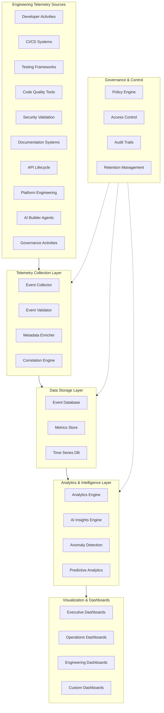
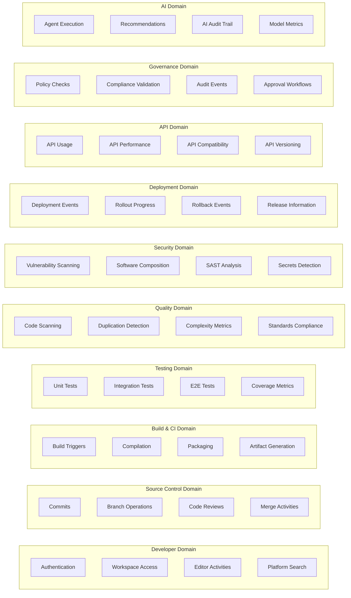
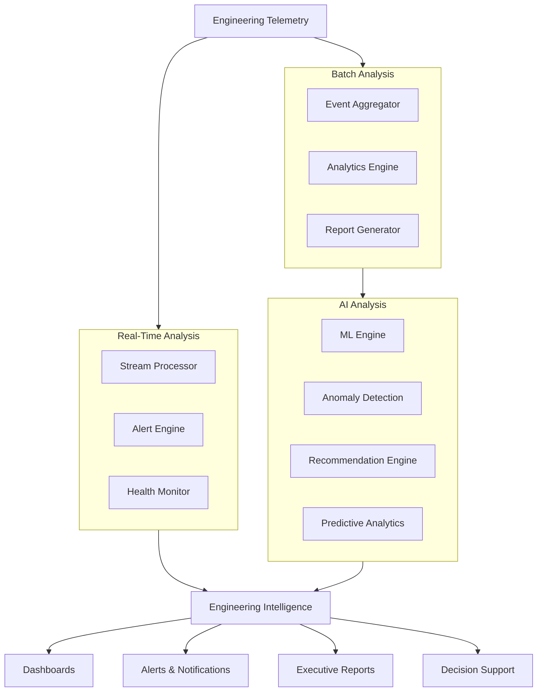
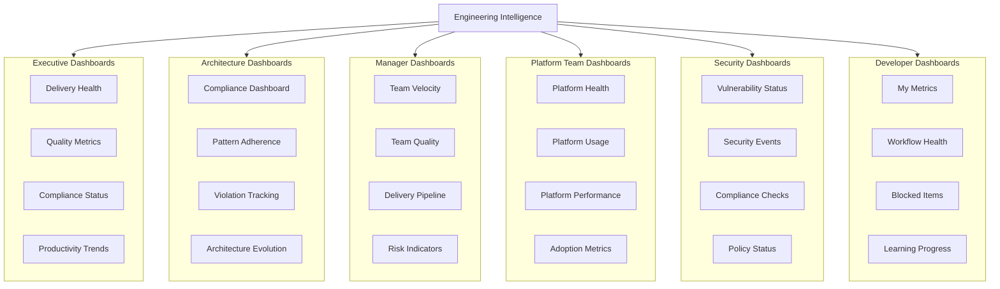
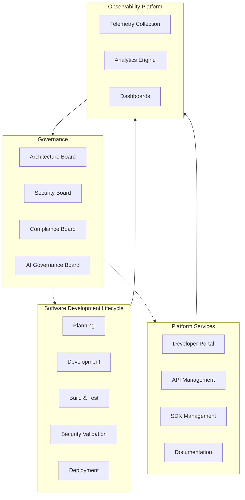
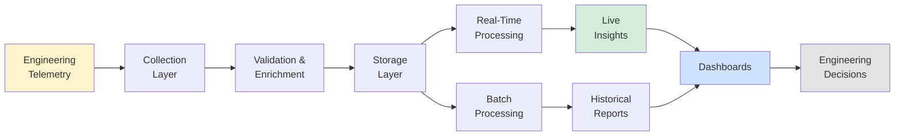
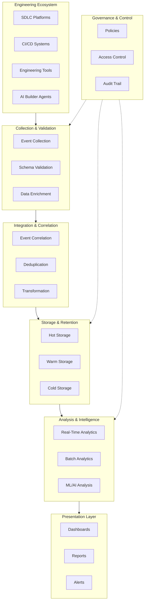

# KB-155 Engineering Observability Architecture

## Metadata

* **Document ID:** KB-155
* **Title:** Engineering Observability Architecture
* **Suite:** Developer Experience (DX) & Engineering Platform Architecture
* **Version:** 1.0
* **Status:** Approved Architecture
* **Classification:** Enterprise Engineering Intelligence Architecture

---

## Executive Summary

The Enterprise Engineering Observability Platform shall provide a unified, AI-ready, policy-governed architecture for collecting and correlating engineering telemetry across the complete software lifecycle, enabling proactive engineering intelligence, continuous optimization, governance visibility, operational excellence, and data-driven architectural decision-making.

Engineering observability shall extend beyond infrastructure monitoring to encompass every engineering activity across the enterprise. The canonical observability architecture governs how DUKADESK collects, analyzes, visualizes, and acts upon engineering signals to drive continuous improvement and operational excellence.

---

## Purpose

Define how DUKADESK standardizes engineering telemetry, analytics, visibility, and operational intelligence across engineering platforms, processes, developer workflows, AI Builder Agents, governance activities, and software delivery pipelines.

---

## Scope

### Include

* Engineering observability architecture
* Engineering telemetry standards
* Engineering event architecture
* Developer activity observability
* Software delivery observability
* Engineering workflow observability
* Architectural compliance observability
* Engineering dashboards
* AI engineering intelligence
* Engineering analytics
* Governance observability
* Operational visibility
* Enterprise engineering intelligence
* Observability governance

### Exclude

* Runtime application observability
* Infrastructure monitoring implementation
* Business intelligence implementation
* Security monitoring implementation
* Logging platform implementation
* APM implementation

These are covered by dedicated Knowledge Base documents.

---

## Architectural Principles

1. **Observability by Design** — Engineering observability shall be designed into every platform, process, and system rather than added retroactively.

2. **Engineering Telemetry First** — Every engineering activity shall generate telemetry; telemetry collection is a first-class requirement, not an afterthought.

3. **Correlation Over Isolation** — Engineering signals shall be collected with correlation identifiers enabling cross-domain analysis and unified visibility.

4. **Measurable Engineering** — Engineering health, productivity, and compliance shall be measured through standardized metrics accessible to all stakeholders.

5. **AI-Assisted Engineering Intelligence** — AI shall analyze engineering telemetry to provide recommendations, anomaly detection, and predictive insights.

6. **Governance Visibility** — Every governance-relevant activity shall generate observable signals enabling continuous compliance verification and audit trails.

7. **Privacy-Aware Telemetry** — Telemetry collection shall respect developer privacy while maintaining enterprise visibility and compliance requirements.

8. **Enterprise Standardization** — All engineering telemetry shall conform to enterprise standards ensuring consistency, interoperability, and unified intelligence.

9. **Vendor Independence** — Observability architecture shall remain vendor-agnostic, supporting multiple backends and tools through standardized interfaces.

10. **Technology Neutrality** — Observability standards shall be technology-agnostic, supporting diverse languages, frameworks, and platforms.

11. **Enterprise Scalability** — Observability infrastructure shall scale elastically to support high-volume telemetry from enterprise-scale engineering operations.

12. **Continuous Improvement** — Engineering observability shall support iterative optimization of processes, platforms, and developer experiences.

---

## Canonical Definitions

* **Engineering Observability** — The capability to understand, monitor, measure, and optimize engineering processes, workflows, activities, and outcomes through standardized telemetry collection and analysis.

* **Engineering Telemetry** — Standardized data signals generated by engineering platforms, tools, processes, and workflows, including events, metrics, logs, and traces.

* **Engineering Event** — A discrete, observable occurrence during the engineering lifecycle with standardized metadata, correlation identifiers, and governance attributes.

* **Developer Telemetry** — Signals generated by developer activities including authentication, workspace access, code editing, documentation access, and tool usage.

* **Workflow Telemetry** — Signals generated by engineering workflows including CI/CD execution, testing, code review, deployment, and governance activities.

* **Engineering Intelligence** — Analyzed, correlated, and actionable insights derived from engineering telemetry enabling strategic and operational decision-making.

* **Engineering Dashboard** — Standardized visualization of engineering telemetry and intelligence tailored to specific stakeholder roles and responsibilities.

* **Delivery Health** — The aggregate measure of software delivery pipeline efficiency, quality, speed, stability, and compliance derived from workflow telemetry.

* **Engineering Signal** — Individual data points or metrics generated by engineering systems; the atomic unit of observability.

* **Engineering Metrics** — Quantitative measures derived from engineering signals measuring productivity, quality, velocity, compliance, and operational health.

* **Engineering Correlation** — Linking related engineering events across multiple systems and domains to understand end-to-end workflows and causal relationships.

* **Architecture Compliance** — Measurement of adherence to enterprise architecture standards, patterns, and governance policies through observable signals.

* **Engineering Visibility** — The state of having comprehensive, real-time, and historical understanding of engineering processes, activities, and outcomes.

* **Productivity Intelligence** — Analyzed telemetry providing insights into developer productivity, engineering efficiency, and workforce effectiveness.

* **Observability Governance** — Enterprise policies, standards, and controls governing telemetry collection, retention, access, and usage.

* **Engineering Analytics** — The discipline of analyzing engineering telemetry to derive insights, identify patterns, and support decision-making.

* **Operational Engineering Health** — Real-time assessment of engineering platform stability, performance, availability, and operational readiness.

* **Enterprise Engineering Platform** — The integrated collection of platforms, tools, and services supporting the complete engineering lifecycle.

* **Engineering Traceability** — The capability to trace engineering activities, decisions, and artifacts through their complete lifecycle for audit and compliance purposes.

* **AI Engineering Insights** — Intelligent analysis and recommendations derived from engineering telemetry using machine learning and artificial intelligence.

---

## Architecture

### Enterprise Engineering Observability Platform

The canonical observability platform integrates telemetry collection, event correlation, analytics processing, dashboard visualization, and governance controls into a unified enterprise capability.

### Engineering Telemetry Architecture

Standardized telemetry domains spanning the complete engineering lifecycle:

### Engineering Event Architecture

Standardized event model governing all engineering telemetry:

```mermaid
graph TD
    event["Engineering Event"]
    
    event --> core["Core Metadata"]
    event --> semantic["Semantic Metadata"]
    event --> correlation["Correlation Metadata"]
    event --> governance["Governance Metadata"]
    
    core --> event_id["Event ID"]
    core --> timestamp["Timestamp"]
    core --> source["Source System"]
    core --> event_type["Event Type"]
    core --> actor["Actor Identity"]
    
    semantic --> domain["Engineering Domain"]
    semantic --> activity["Activity Type"]
    semantic --> entity["Entity Type"]
    semantic --> context["Activity Context"]
    
    correlation --> trace_id["Trace ID"]
    correlation --> parent_id["Parent Event ID"]
    correlation --> user_id["User ID"]
    correlation --> org_id["Organization ID"]
    
    governance --> access_policy["Access Policy"]
    governance --> retention["Retention Policy"]
    governance --> classification["Data Classification"]
    governance --> audit_req["Audit Requirements"]
```

### Engineering Intelligence Architecture

Analysis and insight generation framework:

### Dashboard Architecture

Governance of role-specific engineering visualization:

### AI-Assisted Engineering Insights

Governance of machine learning applied to engineering telemetry:

```mermaid
graph LR
    telemetry["Engineering<br/>Telemetry"]
    
    subgraph ai_models["AI Models"]
        anomaly["Anomaly Detection<br/>Model"]
        performance["Performance<br/>Prediction"]
        quality["Quality<br/>Forecast"]
        productivity["Productivity<br/>Intelligence"]
        compliance["Compliance<br/>Analysis"]
    end
    
    subgraph insights["Insights Generation"]
        detect["Anomaly Detection"]
        predict["Predictive Alerts"]
        recommend["Recommendations"]
        optimize["Optimization Guidance"]
    end
    
    subgraph governance_ai["AI Governance"]
        model_quality["Model Quality Check"]
        bias_detect["Bias Detection"]
        audit_trail["Audit Trail"]
        human_review["Human Review"]
    end
    
    telemetry --> ai_models
    ai_models --> insights
    insights --> governance_ai
    governance_ai --> actions["Actionable Insights"]
    
    style anomaly fill:#e1f5ff
    style performance fill:#e1f5ff
    style quality fill:#e1f5ff
    style productivity fill:#e1f5ff
    style compliance fill:#e1f5ff
```

### Enterprise Engineering Observability Operating Model

Integration across engineering ecosystem:

### Governance Architecture

Policy framework governing observability:

```mermaid
graph TD
    enterprise["Enterprise Observability<br/>Governance"]
    
    enterprise --> telemetry_gov["Telemetry Governance"]
    enterprise --> data_gov["Data Governance"]
    enterprise --> access_gov["Access Governance"]
    enterprise --> retention_gov["Retention Governance"]
    enterprise --> ai_gov["AI Governance"]
    enterprise --> security_gov["Security Governance"]
    
    telemetry_gov --> standards["Telemetry Standards"]
    telemetry_gov --> collection_policy["Collection Policy"]
    telemetry_gov --> quality_standards["Quality Standards"]
    
    data_gov --> classification["Data Classification"]
    data_gov --> handling["Handling Policy"]
    data_gov --> lineage["Data Lineage"]
    
    access_gov --> rbac["Role-Based Access"]
    access_gov --> audit_access["Audit Access"]
    access_gov --> sensitive_data["Sensitive Data Protection"]
    
    retention_gov --> retention_rules["Retention Rules"]
    retention_gov --> archival["Archival Policy"]
    retention_gov --> deletion["Deletion Policy"]
    
    ai_gov --> model_governance["Model Governance"]
    ai_gov --> recommendation_governance["Recommendation Governance"]
    ai_gov --> bias_governance["Bias Governance"]
    
    security_gov --> encryption["Encryption Policy"]
    security_gov --> integrity["Integrity Checks"]
    security_gov --> provenance["Provenance Tracking"]
```

### Engineering Analytics Architecture

End-to-end analytics pipeline from telemetry through insights:

### Enterprise Engineering Observability Reference Architecture

Complete integration of all observability components:

---

## Lifecycle

### Signal Generation
Engineering systems and tools generate standardized signals containing core metadata, semantic information, correlation identifiers, and governance attributes.

### Collection
Signals are collected through standardized collection mechanisms respecting enterprise policies, privacy requirements, and performance constraints.

### Validation
All signals are validated against schema, governance policies, and data quality standards before acceptance into the platform.

### Correlation
Signals are correlated using correlation identifiers enabling cross-domain analysis and end-to-end workflow visibility.

### Analysis
Correlated signals are analyzed through real-time and batch processing, generating metrics, insights, and alerts.

### Visualization
Analyzed data is presented through role-specific dashboards, reports, and notifications enabling stakeholders to understand engineering health and make decisions.

### Governance
All observability activities are subject to governance policies including access control, retention, classification, and audit trail maintenance.

### Optimization
Insights from observability drive continuous optimization of processes, tools, and platforms improving engineering effectiveness.

### Retention
Telemetry is retained according to retention policies considering operational needs, regulatory requirements, and storage costs.

### Archival
Long-term retention of observability data in archival storage for historical analysis and compliance purposes.

### Historical Preservation
Historical observability data is preserved enabling trend analysis, comparative analysis, and long-term engineering intelligence.

### Continuous Improvement
Observability platform itself is continuously improved based on usage patterns, analytics quality, and stakeholder feedback.

---

## Governance

### Observability Governance
Enterprise policies governing how engineering telemetry is collected, processed, stored, accessed, and utilized; defining roles, responsibilities, and decision authorities.

### Telemetry Governance
Standards governing telemetry format, metadata, correlation, classification, and quality ensuring consistency and interoperability.

### Engineering Governance
Integration of observability governance with enterprise engineering governance boards and architectural decision authorities.

### Security Governance
Policies ensuring telemetry collection respects security requirements including authentication, authorization, encryption, and secure transmission.

### Compliance Governance
Policies ensuring observability architecture meets regulatory compliance requirements including audit trails, retention, and data protection.

### AI Governance
Policies governing AI/ML applications to telemetry including model governance, recommendation governance, and bias mitigation.

### Data Governance
Policies governing data classification, handling, retention, and deletion within the observability platform.

### Lifecycle Governance
Policies governing the complete lifecycle of observability data from generation through archival and deletion.

### Operational Governance
Policies governing observability platform operations including availability, performance, reliability, and disaster recovery.

### Enterprise Governance
Integration with enterprise-wide governance frameworks ensuring observability architecture aligns with enterprise standards and objectives.

---

## Responsibilities

### Enterprise Architecture Board
* Approves observability standards and architecture
* Defines strategic observability requirements
* Reviews architectural compliance through observability dashboards
* Approves changes to observability architecture

### Platform Engineering
* Implements observability infrastructure
* Manages telemetry collection systems
* Maintains analytics platforms
* Ensures scalability and reliability of observability platform

### Developer Experience Team
* Defines developer-focused observability requirements
* Creates developer-focused dashboards
* Ensures developer privacy in telemetry collection
* Supports developer adoption of observability practices

### Engineering Leadership
* Defines engineering health metrics
* Reviews observability dashboards
* Makes engineering decisions based on intelligence
* Drives continuous improvement using observability insights

### Security
* Governs security aspects of telemetry collection
* Reviews security-related analytics
* Ensures data protection in observability platform
* Manages access to sensitive engineering data

### Compliance
* Defines compliance-related observability requirements
* Reviews compliance dashboards
* Ensures regulatory compliance
* Manages audit trails and data retention

### AI Governance Board
* Governs AI/ML models applied to telemetry
* Reviews model quality and bias
* Approves new AI-assisted insights
* Manages AI recommendation governance

### Operations
* Operates observability platform infrastructure
* Manages alerts and incident response
* Monitors platform health
* Maintains observability platform SLAs

### Product Engineering
* Generates product delivery observability
* Contributes to product quality metrics
* Participates in delivery health dashboards
* Uses observability to guide product decisions

### Data Governance Team
* Defines data classification for telemetry
* Governs data retention policies
* Manages data access controls
* Oversees data deletion and archival

---

## Security

### Secure Telemetry
All engineering telemetry shall be collected, transmitted, stored, and accessed using encrypted channels and secure protocols preventing unauthorized access or modification.

### Identity-Aware Observability
Observability systems shall maintain identity context for all signals enabling audit trails, accountability, and access control decisions.

### Least Privilege
Access to engineering telemetry shall be governed by least privilege principles granting access only to required data for specific roles and responsibilities.

### Zero Trust
Observability platform shall implement zero trust security assuming no implicit trust, requiring explicit authentication and authorization for all access.

### Policy Enforcement
Enterprise security policies shall be automatically enforced within telemetry collection and analysis including blocked domains, prohibited patterns, and security standards.

### Auditability
All access to engineering telemetry, all telemetry modifications, and all sensitive operations shall be logged creating audit trails enabling compliance verification.

### Telemetry Integrity
Engineering telemetry shall be protected against tampering through integrity checks, digital signatures, and secure storage ensuring reliability of observability data.

### Provenance
All engineering signals shall maintain provenance information enabling tracing to source, actor, and time of generation supporting accountability and compliance.

### Secure Analytics
Analytics processing of engineering telemetry shall be performed in secure environments with appropriate access controls and audit trails.

### Trust Boundaries
Observability architecture shall implement clear trust boundaries between systems, networks, and data classifications with appropriate security controls at boundaries.

---

## Privacy

### Developer Privacy
Engineering observability shall be designed to minimize collection of personally identifiable information respecting developer privacy while maintaining enterprise visibility.

### Telemetry Minimization
Observability shall collect only telemetry necessary for stated purposes avoiding over-collection of engineering data.

### Regulatory Compliance
Observability architecture shall comply with applicable data protection regulations including GDPR, CCPA, and other cross-border requirements.

### Sensitive Engineering Metadata
Sensitive engineering metadata including algorithms, security approaches, and proprietary techniques shall be protected from unauthorized disclosure.

### Cross-Border Governance
Observability architecture shall respect cross-border data governance requirements including data residency and transfer restrictions.

### Retention Governance
Observability data shall be retained only for required periods with automatic deletion after retention periods expire.

### Privacy Assurance
Privacy controls shall be regularly audited and validated ensuring observability architecture maintains privacy commitments.

### Confidential Engineering Analytics
Highly confidential engineering analytics shall be restricted to authorized stakeholders with appropriate access controls and audit trails.

---

## Performance

### Enterprise-Scale Telemetry
Observability infrastructure shall support collection and processing of telemetry from enterprise-scale engineering operations generating millions of events daily.

### High-Volume Engineering Events
Observability platform shall elastically scale to handle high-volume event streams without degradation of collection, processing, or query performance.

### Elastic Scalability
Observability infrastructure shall automatically scale to accommodate peak telemetry volumes without manual intervention.

### High Availability
Observability platform shall maintain high availability with minimal downtime supporting continuous engineering operations.

### Operational Resilience
Observability platform shall remain operational during infrastructure degradation with graceful degradation rather than failure.

### Efficient Analytics
Analytics processing shall efficiently analyze large telemetry datasets enabling rapid generation of insights and dashboards.

### Multi-Region Readiness
Observability architecture shall support multi-region deployment enabling geographic distribution and local latency optimization.

### Engineering Intelligence Optimization
Observability platform shall continuously optimize analytics performance enabling real-time and near-real-time insight generation.

---

## Observability

### Platform Health
The observability platform itself shall be observable with metrics indicating collection health, processing latency, storage performance, and query performance.

### Telemetry Quality
Metrics shall measure telemetry quality including completeness, accuracy, timeliness, and conformance to standards.

### Dashboard Quality
Dashboard performance and usage shall be monitored ensuring dashboards remain responsive and provide valuable insights.

### Analytics Health
Analytics engines shall be monitored for processing correctness, performance, and reliability ensuring trust in generated insights.

### Governance Dashboards
Governance activities shall be observable through dashboards showing policy compliance, access patterns, and audit trail metrics.

### Executive Reporting
Executive-level reporting shall provide business-relevant metrics summarizing engineering health, delivery performance, and strategic trends.

### Engineering KPIs
Key performance indicators shall be defined and measured across engineering domains including velocity, quality, compliance, and security.

### AI Recommendation Quality
AI-assisted recommendations shall be monitored for accuracy, timeliness, and relevance to engineering decisions.

### Engineering Maturity Metrics
Engineering maturity shall be measured across dimensions including process maturity, capability maturity, and architectural maturity.

### Continuous Improvement Metrics
Metrics shall track improvement in engineering processes, platform performance, and developer experience over time.

---

## Failure Scenarios

### Missing Telemetry
When telemetry collection fails, observability platform shall alert stakeholders while attempting recovery; missing telemetry shall be logged for post-mortem analysis.

### Event Correlation Failures
When correlation of related events fails, events shall remain independently queryable while correlation metadata indicates failed correlation.

### Dashboard Inconsistencies
When dashboard data becomes inconsistent due to processing delays or failures, dashboards shall indicate data freshness and potential inconsistencies.

### Governance Bypass
When governance policies are bypassed, telemetry collection shall continue with audit trails capturing the bypass for investigation.

### Data Quality Degradation
When data quality degrades, quality metrics shall alert stakeholders enabling investigation and remediation before decisions are made on degraded data.

### AI Insight Failures
When AI models fail to generate insights, alternative insights shall be provided while model performance is investigated.

### Engineering Blind Spots
When observability fails to cover engineering activities, telemetry gaps shall be detected and reported enabling coverage expansion.

### Metric Inconsistencies
When metrics become inconsistent across systems, reconciliation processes shall identify sources of inconsistency and converge on authoritative values.

### Signal Duplication
When signals are duplicated, deduplication mechanisms shall identify and eliminate duplicate events.

### Recovery Failures
When observability platform fails to recover, alternative observability mechanisms shall remain available for critical operations.

### Missing Traceability
When trace information is lost, events shall remain queryable by other attributes enabling partial reconstruction of workflows.

### Analytics Latency
When analytics processing experiences excessive latency, near-real-time analytics shall be deprioritized to maintain operational analytics performance.

---

## Anti-patterns

### Siloed Telemetry
Multiple independent telemetry systems collecting engineering data without correlation or integration shall not be established; all telemetry shall flow through canonical observability platform.

### Manual Engineering Reporting
Manual compilation of engineering reports from multiple systems shall not replace automated observability dashboards and insights.

### Inconsistent Metrics
Engineering metrics shall not vary across systems or reports; all metrics shall be derived from canonical observability platform ensuring consistency.

### Independent Dashboards
Independent engineering dashboards created outside enterprise observability governance shall not be established; all dashboards shall conform to canonical architecture.

### Missing Event Correlation
Engineering events shall not be collected without correlation identifiers preventing cross-domain analysis and end-to-end visibility.

### Hidden Engineering Workflows
Engineering workflows shall not operate outside observability governance; all significant workflows shall generate observable signals.

### AI Recommendations Without Governance
AI-assisted recommendations shall not be provided without governance oversight, model governance, or human review checkpoints.

### Duplicate Telemetry Collection
Multiple systems shall not independently collect the same telemetry; collection shall be centralized through canonical mechanisms.

### Missing Engineering Visibility
Engineering domains shall not operate with no observability; all significant engineering domains shall have established telemetry and observability.

### Observability Without Actionability
Telemetry collection shall not proceed without actionability; all collected telemetry shall support decisions or continuous improvement.

---

## Future Evolution

### Autonomous Engineering Intelligence
AI shall autonomously analyze engineering telemetry providing real-time insights, recommendations, and actions without human intervention for routine scenarios.

### AI-Driven Engineering Optimization
AI systems shall continuously optimize engineering processes, tools, and platforms based on observability data driving autonomous engineering excellence.

### Predictive Delivery Analytics
Observability shall predict software delivery outcomes enabling proactive identification and resolution of issues before they impact delivery.

### Engineering Digital Twins
Virtual models of engineering processes and pipelines shall be created using observability data enabling simulation and optimization.

### Self-Optimizing Engineering Platforms
Engineering platforms shall use observability data to continuously self-optimize performance, reliability, and developer experience.

### Federated Engineering Intelligence
Engineering intelligence shall be federated across distributed teams and regions while maintaining central governance and consistency.

### Adaptive Engineering Observability
Observability collection and analysis shall adapt to evolving engineering practices and emerging needs ensuring continuous relevance.

### Enterprise Engineering Cognition
Observability platform shall develop emergent cognitive capabilities enabling holistic understanding of enterprise engineering health and optimization.

---

## Cross References

* KB-090 Analytics & Business Intelligence Architecture
* KB-091 Reporting Architecture
* KB-141 Developer Experience Platform Architecture
* KB-146 CI/CD Pipeline Architecture
* KB-147 DevSecOps Architecture
* KB-148 Test Strategy & Quality Engineering Architecture
* KB-154 Developer Onboarding & Enablement Architecture
* KB-156 Engineering Metrics & Productivity Architecture
* KB-158 Engineering Governance Architecture
* KB-160 Developer Experience Reference Architecture

---

## Mermaid Diagram Requirements

The document includes 10 required Mermaid diagrams:

1. **Enterprise Engineering Observability Platform** — Overall architecture showing telemetry sources, collection, storage, analytics, visualization, and governance
2. **Engineering Telemetry Architecture** — Telemetry domains spanning developer activities, source control, CI/CD, testing, quality, security, deployment, APIs, and governance
3. **Engineering Event Flow** — Event lifecycle from generation through validation, correlation, analysis, and insight
4. **Engineering Intelligence Architecture** — Real-time analysis, batch analysis, and AI analysis generating insights and intelligence
5. **Dashboard Architecture** — Role-specific dashboards for executives, architects, managers, platforms, security, and developers
6. **AI-Assisted Engineering Insights** — AI models and governance generating anomaly detection, predictions, and recommendations
7. **Enterprise Engineering Observability Operating Model** — Integration with SDLC, platform services, governance, and observability platform
8. **Governance Architecture** — Policy framework covering telemetry, data, access, retention, AI, and security governance
9. **Engineering Analytics Architecture** — Analysis pipeline from telemetry through real-time and batch processing to dashboards and reports
10. **Enterprise Engineering Observability Reference Architecture** — Complete reference architecture integrating all components

---

## Acceptance Criteria

The document shall:

* Define the canonical Engineering Observability Architecture for DUKADESK
* Govern engineering telemetry standards, collection, analysis, and visualization
* Treat engineering observability as an enterprise capability enabling governance, optimization, and intelligence
* Support enterprise-scale engineering operations with millions of daily events
* Enable AI-assisted engineering intelligence while maintaining governance
* Support all stakeholder roles including executives, architects, managers, platform teams, security, compliance, and developers
* Include all 10 required Mermaid diagrams
* Cross-reference 10 related KB documents
* Contain only architectural guidance with no implementation details

---

## Completion Instructions

Upon completion:

1. Mark **KB-155** as **Completed**
2. Update the **Progress Registry**
3. Cross-reference all related specifications
4. Queue **KB-156 – Engineering Metrics & Productivity Architecture** as the next builder assignment

---

## Critical DUKADESK Architectural Rule

**All engineering telemetry, workflow visibility, productivity analytics, software delivery insights, architectural compliance measurements, and engineering intelligence within DUKADESK shall be governed exclusively through the canonical Enterprise Engineering Observability Architecture. No application, Builder Studio module, Marketplace extension, AI Builder Agent, engineering team, platform service, or organizational unit shall establish independent engineering observability models, telemetry standards, analytics frameworks, or reporting mechanisms outside the enterprise architecture, ensuring enterprise-wide visibility, governance, AI readiness, traceability, and continuous engineering excellence.**
