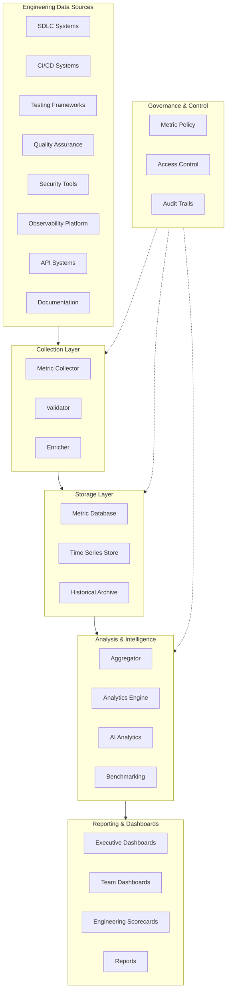
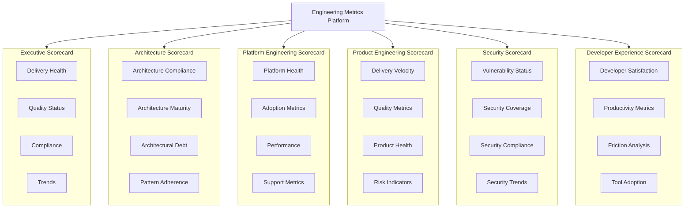
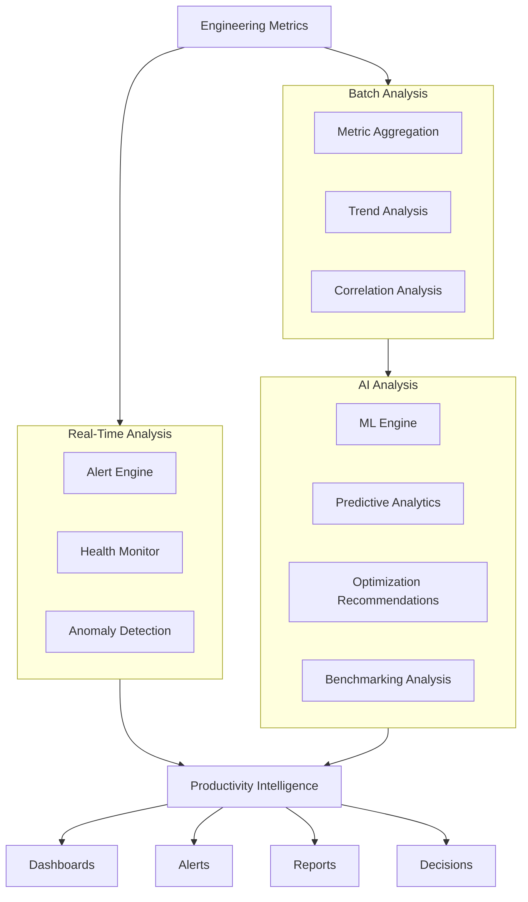
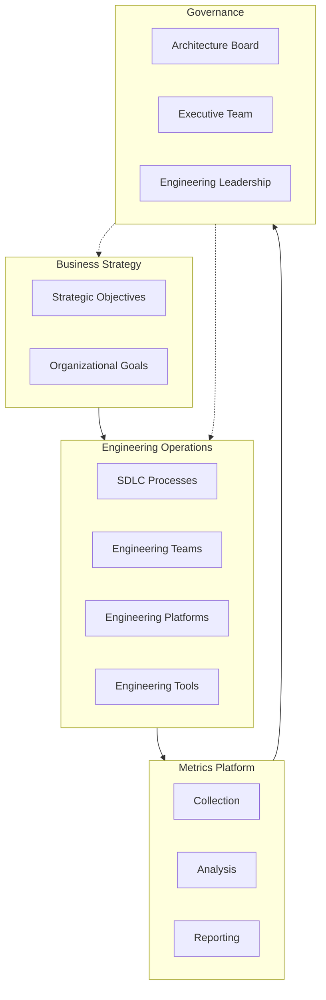
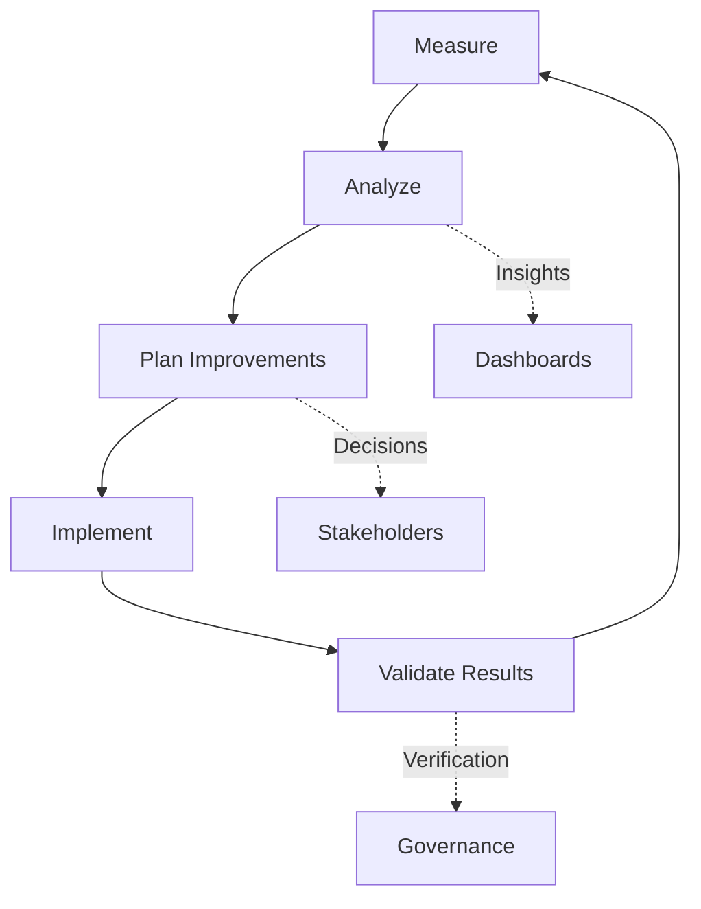
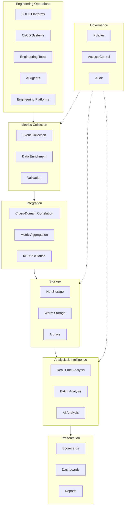

# KB-156 Engineering Metrics & Productivity Architecture

## Metadata

* **Document ID:** KB-156
* **Title:** Engineering Metrics & Productivity Architecture
* **Suite:** Developer Experience (DX) & Engineering Platform Architecture
* **Version:** 1.0
* **Status:** Approved Architecture
* **Classification:** Enterprise Engineering Performance Architecture

---

## Executive Summary

The Enterprise Engineering Metrics Platform shall provide standardized, governed, AI-ready metrics that objectively measure engineering effectiveness, software delivery performance, architectural quality, operational excellence, platform health, developer experience, and organizational engineering maturity.

The platform shall emphasize continuous improvement, value delivery, and system performance over individual developer surveillance. Metrics shall support organizational learning, evidence-based decisions, and proactive optimization.

---

## Purpose

Define how DUKADESK standardizes engineering metrics, productivity measurements, maturity assessments, performance indicators, and engineering intelligence while preserving developer trust, architectural integrity, and enterprise governance.

---

## Scope

### Include

* Enterprise engineering metrics
* Productivity architecture
* Engineering KPIs
* Delivery metrics
* Quality metrics
* Engineering maturity
* Developer experience metrics
* Platform performance metrics
* AI-assisted analytics
* Engineering scorecards
* Executive reporting
* Governance metrics
* Continuous improvement metrics
* Engineering benchmarking

### Exclude

* Employee performance management
* HR evaluations
* Compensation systems
* Business KPI implementation
* Runtime monitoring implementation
* BI platform implementation

These are covered by dedicated Knowledge Base documents.

---

## Architectural Principles

1. **Metrics for Improvement, Not Surveillance** — Metrics shall support system optimization and organizational learning, never individual surveillance or punitive evaluation.

2. **Outcome-Focused Measurement** — Metrics shall measure outcomes, value delivery, and system performance rather than activity levels or individual effort.

3. **Standardized Enterprise Metrics** — All engineering metrics shall conform to enterprise standards ensuring consistency, comparability, and reliability.

4. **Transparent Measurement** — Measurement methodologies, metric definitions, and metric calculations shall be transparent enabling stakeholders to understand what is measured and why.

5. **Actionable Intelligence** — Metrics shall be designed to generate actionable insights enabling continuous improvement; metrics without actionability shall not be collected.

6. **AI-Assisted Optimization** — AI shall analyze engineering metrics to identify optimization opportunities, anomalies, and improvement recommendations.

7. **Governance by Evidence** — Engineering governance decisions shall be informed by objective metrics preventing subjective interpretation and bias.

8. **Continuous Improvement** — Metrics shall drive continuous improvement of engineering processes, platforms, tooling, and organizational capabilities.

9. **Vendor Independence** — Engineering metrics architecture shall remain vendor-agnostic supporting multiple measurement tools and platforms.

10. **Technology Neutrality** — Metrics standards shall be technology-neutral supporting diverse languages, frameworks, and platforms.

11. **Enterprise Scalability** — Metrics infrastructure shall scale elastically supporting enterprise-scale engineering operations.

12. **Privacy by Design** — Metrics collection shall be designed to protect developer privacy while maintaining enterprise visibility and governance.

---

## Canonical Definitions

* **Engineering Metric** — Quantifiable measurement of engineering systems, processes, or outcomes used to assess performance and guide improvement.

* **KPI (Key Performance Indicator)** — Critical metric linked to organizational objectives enabling measurement of strategic success.

* **Productivity** — The effectiveness of engineering effort in producing value, delivering features, and maintaining quality.

* **Delivery Performance** — The capability of engineering teams to deliver software on schedule, on budget, and with planned quality.

* **Engineering Maturity** — The organizational capability to consistently execute engineering activities with quality, efficiency, and governance compliance.

* **Quality Indicator** — Metric measuring software quality including defect rates, test coverage, code health, and technical debt.

* **Operational Effectiveness** — The efficiency of engineering platforms, processes, and tooling in supporting engineering activities.

* **Productivity Intelligence** — Analyzed metrics providing insights into engineering efficiency, bottlenecks, and improvement opportunities.

* **Engineering Scorecard** — Role-specific dashboard presenting standardized metrics and KPIs for stakeholder decision-making.

* **Delivery Health** — Aggregate measure of software delivery pipeline performance including velocity, quality, stability, and compliance.

* **Benchmark** — Reference point for performance comparison enabling assessment of relative performance.

* **Baseline** — Initial measurement of performance used as reference for tracking improvement.

* **Metric Governance** — Policies and controls governing metric definition, collection, validation, and usage.

* **Engineering Effectiveness** — The degree to which engineering organizations achieve their objectives with appropriate resource consumption.

* **Continuous Improvement** — Organizational practice of systematically measuring performance and implementing improvements.

* **Developer Experience Metric** — Measurement of developer satisfaction, productivity, tooling effectiveness, and workflow efficiency.

* **Enterprise Engineering Performance** — Aggregate organizational measurement of engineering capability, delivery performance, and quality.

* **AI Productivity Insight** — Intelligent analysis of engineering metrics generating recommendations and optimization opportunities.

* **Leading Indicator** — Metric predicting future outcomes enabling proactive intervention.

* **Lagging Indicator** — Metric measuring historical outcomes providing retrospective performance assessment.

---

## Architecture

### Enterprise Engineering Metrics Platform

The canonical metrics platform integrates collection, validation, analysis, reporting, and governance into a unified enterprise capability:

### Engineering Metrics Taxonomy

Standardized metric categories spanning the complete engineering domain:

```mermaid
graph TB
    metrics["Engineering Metrics"]
    
    metrics --> delivery["Delivery Metrics"]
    metrics --> quality["Quality Metrics"]
    metrics --> reliability["Reliability Metrics"]
    metrics --> security["Security Metrics"]
    metrics --> devsecops["DevSecOps Metrics"]
    metrics --> cicd["CI/CD Metrics"]
    metrics --> test["Test Metrics"]
    metrics --> api["API Metrics"]
    metrics --> doc["Documentation Metrics"]
    metrics --> sdk["SDK Adoption Metrics"]
    metrics --> platform["Platform Engineering Metrics"]
    metrics --> devex["Developer Experience Metrics"]
    metrics --> ai["AI Engineering Metrics"]
    metrics --> governance["Governance Metrics"]
    metrics --> operational["Operational Metrics"]
    metrics --> business["Business Alignment Metrics"]
    metrics --> sustainability["Sustainability Metrics"]
    
    delivery --> velocity["Delivery Velocity"]
    delivery --> lead_time["Lead Time"]
    delivery --> cycle_time["Cycle Time"]
    
    quality --> defects["Defect Density"]
    quality --> coverage["Code Coverage"]
    quality --> debt["Technical Debt"]
    
    reliability --> mtbf["Mean Time Between Failures"]
    reliability --> mttr["Mean Time To Recovery"]
    reliability --> availability["Availability"]
    
    security --> vuln["Vulnerability Density"]
    security --> scan_coverage["Security Scan Coverage"]
    security --> compliance["Compliance Score"]
    
    test --> automation["Test Automation %"]
    test --> speed["Test Execution Speed"]
    test --> results["Test Pass Rate"]
    
    devex --> satisfaction["Developer Satisfaction"]
    devex --> onboarding["Onboarding Time"]
    devex --> friction["Friction Points"]
```

### Engineering Scorecard Architecture

Standardized scorecards for key stakeholder roles:

### Engineering Maturity Model

Maturity progression across engineering dimensions:

```mermaid
graph LR
    subgraph level1["Level 1: Initial"]
        init_process["Ad Hoc Processes"]
        init_tools["Minimal Tooling"]
        init_metrics["No Metrics"]
    end
    
    subgraph level2["Level 2: Managed"]
        managed_process["Defined Processes"]
        managed_tools["Standard Tools"]
        managed_metrics["Basic Metrics"]
    end
    
    subgraph level3["Level 3: Standardized"]
        std_process["Standardized Processes"]
        std_tools["Integrated Tools"]
        std_metrics["Comprehensive Metrics"]
    end
    
    subgraph level4["Level 4: Measured"]
        measured_process["Optimized Processes"]
        measured_tools["Advanced Automation"]
        measured_metrics["Intelligent Analytics"]
    end
    
    subgraph level5["Level 5: Optimized"]
        opt_process["Self-Optimizing"]
        opt_tools["AI-Driven Tools"]
        opt_metrics["Predictive Intelligence"]
    end
    
    level1 --> level2 --> level3 --> level4 --> level5
    
    style level1 fill:#ffcccc
    style level2 fill:#ffe6cc
    style level3 fill:#ffffcc
    style level4 fill:#e6ffcc
    style level5 fill:#ccffcc
```

### Productivity Intelligence Architecture

Analysis framework for engineering efficiency and optimization:

### AI-Assisted Engineering Optimization

Governance of AI-driven productivity improvements:

```mermaid
graph LR
    metrics["Engineering Metrics"]
    
    subgraph ai_models["AI Models"]
        efficiency_model["Efficiency Model"]
        bottleneck_model["Bottleneck Detection"]
        maturity_model["Maturity Assessment"]
        prediction_model["Predictive Model"]
    end
    
    subgraph recommendations["Recommendations"]
        process_rec["Process Recommendations"]
        tooling_rec["Tooling Improvements"]
        investment_rec["Investment Guidance"]
        optimization_rec["Optimization Opportunities"]
    end
    
    subgraph governance_ai["AI Governance"]
        model_quality["Model Quality Check"]
        bias_detect["Bias Detection"]
        human_review["Human Review"]
        approval["Approval Gate"]
    end
    
    metrics --> ai_models
    ai_models --> recommendations
    recommendations --> governance_ai
    governance_ai --> actions["Actionable Improvements"]
    
    style efficiency_model fill:#e1f5ff
    style bottleneck_model fill:#e1f5ff
    style maturity_model fill:#e1f5ff
    style prediction_model fill:#e1f5ff
```

### Enterprise Engineering Performance Operating Model

Integration across engineering and business ecosystem:

### Governance Architecture

Policy framework governing metrics:

```mermaid
graph TD
    enterprise["Enterprise Metrics<br/>Governance"]
    
    enterprise --> metric_gov["Metric Governance"]
    enterprise --> kpi_gov["KPI Governance"]
    enterprise --> productivity_gov["Productivity Governance"]
    enterprise --> data_gov["Data Governance"]
    enterprise --> ai_gov["AI Governance"]
    enterprise --> security_gov["Security Governance"]
    
    metric_gov --> definitions["Metric Definitions"]
    metric_gov --> standards["Collection Standards"]
    metric_gov --> quality["Quality Standards"]
    
    kpi_gov --> kpi_def["KPI Definition"]
    kpi_gov --> kpi_alignment["Goal Alignment"]
    kpi_gov --> kpi_validation["Validation"]
    
    productivity_gov --> ethical["Ethical Guidelines"]
    productivity_gov --> privacy["Privacy Controls"]
    productivity_gov --> improvement["Improvement Focus"]
    
    data_gov --> classification["Classification"]
    data_gov --> retention["Retention Policy"]
    data_gov --> access["Access Control"]
    
    ai_gov --> model_gov["Model Governance"]
    ai_gov --> bias_gov["Bias Governance"]
    ai_gov --> recommendation_gov["Recommendation Governance"]
    
    security_gov --> encryption["Encryption"]
    security_gov --> integrity["Integrity Checks"]
    security_gov --> audit_trail["Audit Trail"]
```

### Continuous Improvement Lifecycle

Iterative improvement driven by metrics:

### Enterprise Engineering Metrics Reference Architecture

Complete integration of all metrics components:

---

## Lifecycle

### Metric Definition
Engineering metrics are defined through a governance process identifying what to measure, why, and how to calculate the metric.

### Governance Approval
Metrics are reviewed and approved by enterprise governance boards ensuring alignment with organizational objectives and ethical standards.

### Collection
Metrics are collected from engineering systems through standardized collection mechanisms respecting data governance policies.

### Validation
Collected metric data is validated against schema and quality standards ensuring reliability and consistency.

### Aggregation
Individual metrics are aggregated into composite metrics, KPIs, and scorecards for stakeholder reporting.

### Analysis
Metrics are analyzed to identify trends, anomalies, bottlenecks, and improvement opportunities.

### Reporting
Analyzed metrics are presented through dashboards, scorecards, and reports tailored to stakeholder roles.

### Continuous Improvement
Metrics drive continuous improvement of engineering processes, platforms, and organizational capabilities.

### Evolution
Metrics are evolved in response to changing business objectives, technological advances, and organizational learning.

### Retirement
Metrics that no longer serve a purpose are retired through a controlled process.

### Historical Preservation
Historical metric data is preserved enabling trend analysis and long-term performance assessment.

### Benchmarking
Metrics are compared across teams and organizations enabling identification of best practices and improvement targets.

---

## Governance

### Metric Governance
Enterprise policies governing metric definition, collection, validation, calculation, retention, and usage ensuring consistency and reliability.

### KPI Governance
Policies governing key performance indicator definition, alignment with organizational objectives, and measurement integrity.

### Productivity Governance
Policies ensuring productivity metrics support continuous improvement rather than individual surveillance, preserving developer trust.

### Data Governance
Policies governing metric data classification, retention, access, deletion, and usage compliance.

### AI Governance
Policies governing AI/ML applications to metrics including model governance, recommendation governance, and bias mitigation.

### Security Governance
Policies ensuring secure metric collection, transmission, storage, access, and analysis.

### Compliance Governance
Policies ensuring metrics compliance with regulatory requirements and organizational standards.

### Lifecycle Governance
Policies governing the complete lifecycle of metrics from definition through retirement and archival.

### Operational Governance
Policies governing metrics platform operations including availability, performance, reliability, and disaster recovery.

### Enterprise Governance
Integration with enterprise-wide governance frameworks ensuring metrics align with organizational strategy and values.

---

## Responsibilities

### Enterprise Architecture Board
* Approves engineering metrics standards and architecture
* Reviews architectural compliance metrics
* Defines strategic metric requirements
* Approves changes to metrics architecture

### Engineering Leadership
* Defines team and organizational metrics
* Uses metrics to guide engineering decisions
* Drives continuous improvement based on metrics
* Establishes team-level improvement initiatives

### Platform Engineering
* Implements metrics collection infrastructure
* Maintains metrics platforms and dashboards
* Ensures scalability and reliability
* Supports metrics adoption across engineering

### Developer Experience Team
* Defines developer experience metrics
* Creates dashboards for developers
* Ensures metrics support productivity
* Monitors metrics adoption

### Security
* Governs security metrics
* Reviews security-related analytics
* Ensures data protection in metrics systems
* Manages access to sensitive metrics

### Compliance
* Defines compliance-related metrics
* Reviews compliance analytics
* Ensures regulatory compliance of metrics
* Manages audit requirements

### AI Governance Board
* Governs AI/ML models applied to metrics
* Reviews model quality and bias
* Approves new AI-assisted metrics
* Manages AI recommendation governance

### Operations
* Operates metrics platform infrastructure
* Manages alerts and incident response
* Monitors platform health
* Maintains metrics platform SLAs

### Data Governance Team
* Defines data classification for metrics
* Governs data retention policies
* Manages data access controls
* Oversees data deletion and archival

### Executive Leadership
* Defines strategic objectives and KPIs
* Reviews executive scorecards
* Makes strategic decisions based on metrics
* Sponsors continuous improvement initiatives

---

## Security

### Secure Metric Collection
All metric collection shall use encrypted channels and secure protocols preventing unauthorized access or modification.

### Identity-Aware Analytics
Metrics systems shall maintain identity context for all measurements enabling audit trails and accountability.

### Least Privilege
Access to engineering metrics shall be governed by least privilege principles granting access only to required metrics.

### Zero Trust
Metrics platform shall implement zero trust security requiring explicit authentication and authorization for all access.

### Policy Enforcement
Enterprise security policies shall be enforced within metric collection and analysis including access controls and data protection.

### Metric Integrity
Metrics shall be protected against tampering through integrity checks and secure storage ensuring reliability of performance data.

### Auditability
All access to metrics and all metric modifications shall be logged creating audit trails enabling compliance verification.

### Provenance
All metrics shall maintain provenance information enabling tracing to source systems and calculation methodology.

### Secure Reporting
Metrics reporting shall be performed through secure channels with appropriate access controls.

### Trust Boundaries
Metrics architecture shall implement clear trust boundaries with appropriate security controls at boundaries.

---

## Privacy

### Developer Privacy
Metrics collection shall be designed to respect developer privacy, avoiding collection of personally identifying information or surveillance data.

### Ethical Productivity Analytics
Metrics shall measure system and team performance, not individual activities, preserving ethical treatment of engineers.

### Regulatory Compliance
Metrics architecture shall comply with applicable data protection regulations including GDPR, CCPA, and cross-border requirements.

### Data Minimization
Metrics collection shall gather only data necessary for stated purposes avoiding over-collection.

### Cross-Border Governance
Metrics architecture shall respect cross-border data governance including data residency and transfer restrictions.

### Retention Governance
Metrics data shall be retained only for required periods with automatic deletion after retention expires.

### Privacy Assurance
Privacy controls shall be regularly audited and validated ensuring metrics architecture maintains privacy commitments.

### Protected Engineering Insights
Sensitive engineering insights shall be restricted to authorized stakeholders with appropriate access controls.

---

## Performance

### Enterprise-Scale Metric Collection
Metrics infrastructure shall support collection from enterprise-scale engineering operations.

### High-Volume Analytics
Metrics platform shall elastically scale to handle high-volume metric computation without degradation.

### Elastic Scalability
Metrics infrastructure shall automatically scale to accommodate peak metric loads.

### High Availability
Metrics platform shall maintain high availability supporting continuous engineering operations.

### Operational Resilience
Metrics platform shall remain operational during infrastructure degradation with graceful degradation.

### Efficient Reporting
Metrics analytics shall efficiently compute and report metrics enabling rapid dashboard generation.

### Multi-Region Readiness
Metrics architecture shall support multi-region deployment enabling geographic distribution.

### Continuous Optimization
Metrics platform shall continuously optimize performance enabling real-time insight generation.

---

## Observability

### Metric Quality
Metrics platform shall measure metric quality including completeness, accuracy, consistency, and timeliness.

### KPI Health
KPI calculation and reporting shall be monitored ensuring KPI reliability and correctness.

### Governance Dashboards
Governance activities shall be observable through dashboards showing compliance and audit metrics.

### Executive Reporting
Executive-level reporting shall provide business-relevant metrics summarizing engineering performance.

### Engineering Maturity Dashboards
Engineering maturity shall be observable through dashboards showing capability progression.

### Productivity Analytics
Productivity metrics shall be monitored ensuring they support improvement rather than harm.

### Trend Analysis
Long-term trends shall be analyzed identifying improvements, regressions, and strategic directions.

### AI Recommendation Quality
AI-assisted recommendations shall be monitored for accuracy, relevance, and effectiveness.

### Continuous Improvement Tracking
Continuous improvement initiatives shall be tracked measuring impact on metrics.

### Enterprise Engineering Intelligence
Aggregate enterprise-level intelligence shall be derived from metrics enabling strategic decision-making.

---

## Failure Scenarios

### Metric Inconsistencies
When metrics become inconsistent across systems, reconciliation shall identify and resolve inconsistencies.

### Misleading KPIs
When KPIs become misleading or misaligned with objectives, reviews shall identify and correct the issues.

### Governance Bypass
When governance policies are bypassed, audit trails shall capture the bypass enabling investigation.

### Poor Data Quality
When metric data quality degrades, quality alerts shall notify stakeholders enabling remediation.

### AI Recommendation Failures
When AI-assisted recommendations fail, alternative insights shall be provided while models are investigated.

### Productivity Misinterpretation
When metrics are misinterpreted causing harm, governance shall intervene correcting the interpretation.

### Missing Benchmarks
When benchmarks become unavailable, alternative baselines shall be used for comparison.

### Reporting Inconsistencies
When reports become inconsistent, reconciliation processes shall identify and resolve inconsistencies.

### Privacy Violations
When privacy violations occur, incident response procedures shall be activated limiting exposure.

### Recovery Failures
When metrics platform fails to recover, alternative metrics mechanisms shall remain available.

### Scorecard Drift
When scorecards drift from governance policies, realignment processes shall restore alignment.

### Missing Engineering Visibility
When metric coverage gaps emerge, expansion processes shall close gaps restoring visibility.

---

## Anti-patterns

### Individual Developer Surveillance
Metrics shall not monitor individual developer activities enabling surveillance; metrics shall measure team and system performance.

### Vanity Metrics
Metrics that appear positive but provide no actionable insight shall not be collected or reported.

### Metrics Without Governance
Metrics shall not be created without governance oversight; all metrics must align with organizational objectives.

### Duplicate KPIs
Independent systems shall not define duplicate KPIs; all KPIs shall conform to enterprise standards.

### Conflicting Scorecards
Multiple independent scorecards presenting conflicting information shall not be maintained; scorecards shall derive from canonical metrics.

### Manual Metric Calculations
Manual metric calculations shall not replace automated metric computation which is prone to error and inconsistency.

### Hidden Engineering Data
Engineering performance data shall not be hidden; authorized stakeholders shall have access to relevant metrics.

### AI-Generated Metrics Without Validation
AI-generated metrics shall not be reported without validation ensuring accuracy and relevance.

### Metric Overload
Excessive metrics shall not be collected creating information overload; metrics shall be curated for actionability.

### Metrics Disconnected From Outcomes
Metrics shall not be collected if disconnected from organizational objectives or improvement outcomes.

---

## Future Evolution

### Autonomous Engineering Optimization
AI shall autonomously optimize engineering processes based on metrics enabling continuous improvement without human intervention.

### AI-Driven Engineering Maturity Assessments
AI shall assess engineering maturity across dimensions providing comprehensive capability analysis.

### Predictive Productivity Intelligence
Metrics shall predict future productivity challenges enabling proactive interventions.

### Engineering Digital Twins
Virtual models of engineering operations shall be created using metrics enabling simulation and optimization.

### Adaptive Enterprise Scorecards
Scorecards shall adapt to changing objectives and evolving metrics ensuring continuous relevance.

### Federated Engineering Benchmarking
Engineering metrics shall be compared across federated organizations enabling peer learning.

### Enterprise Engineering Cognition
Metrics platform shall develop emergent cognitive capabilities enabling holistic organizational understanding.

### Self-Improving Engineering Organizations
Organizations shall use metrics to autonomously improve engineering processes and capabilities.

---

## Cross References

* KB-090 Analytics & Business Intelligence Architecture
* KB-091 Reporting Architecture
* KB-141 Developer Experience Platform Architecture
* KB-147 DevSecOps Architecture
* KB-148 Test Strategy & Quality Engineering Architecture
* KB-155 Engineering Observability Architecture
* KB-157 Engineering Knowledge Management Architecture
* KB-158 Engineering Governance Architecture
* KB-159 AI-Assisted Software Engineering Architecture
* KB-160 Developer Experience Reference Architecture

---

## Mermaid Diagram Requirements

The document includes 10 required Mermaid diagrams:

1. **Enterprise Engineering Metrics Platform** — Architecture showing collection, storage, analysis, visualization, and governance
2. **Engineering Metrics Taxonomy** — Metric categories spanning delivery, quality, reliability, security, DevSecOps, CI/CD, testing, APIs, documentation, SDKs, platform, developer experience, AI, governance, operations, business, and sustainability
3. **Engineering Scorecard Architecture** — Role-specific scorecards for executives, architects, platform teams, product engineers, security, and developers
4. **Engineering Maturity Model** — Five-level maturity progression from initial through optimized
5. **Productivity Intelligence Architecture** — Real-time, batch, and AI analysis generating insights
6. **AI-Assisted Engineering Optimization** — ML models generating recommendations with governance oversight
7. **Enterprise Engineering Performance Operating Model** — Integration with business strategy and engineering operations
8. **Governance Architecture** — Policy framework across 10 governance domains
9. **Continuous Improvement Lifecycle** — Iterative measurement, analysis, planning, implementation, and validation
10. **Enterprise Engineering Metrics Reference Architecture** — Complete integration from operations through analysis to visualization

---

## Acceptance Criteria

The document shall:

* Define the canonical Engineering Metrics & Productivity Architecture
* Govern engineering metrics, scorecards, productivity intelligence, maturity assessment, and continuous improvement
* Emphasize organizational learning and system optimization over individual surveillance
* Support enterprise-scale, AI-ready, vendor-independent engineering management
* Include all 10 required Mermaid diagrams
* Cross-reference 10 related KB documents
* Contain no implementation guidance

---

## Completion Instructions

Upon completion:

1. Mark **KB-156** as **Completed**
2. Update the **Progress Registry**
3. Cross-reference all related specifications
4. Queue **KB-157 – Engineering Knowledge Management Architecture** as the next builder assignment

---

## Critical DUKADESK Architectural Rule

**All engineering metrics, productivity measurements, maturity assessments, performance indicators, scorecards, and engineering intelligence within DUKADESK shall be defined, governed, measured, and evolved exclusively through the canonical Enterprise Engineering Metrics & Productivity Architecture. No application, Builder Studio module, Marketplace extension, AI Builder Agent, engineering team, platform service, or organizational unit shall establish independent engineering metrics, KPI frameworks, productivity models, or performance reporting outside the enterprise architecture, ensuring objective measurement, governance, AI readiness, continuous improvement, developer trust, and enterprise-wide engineering excellence.**
