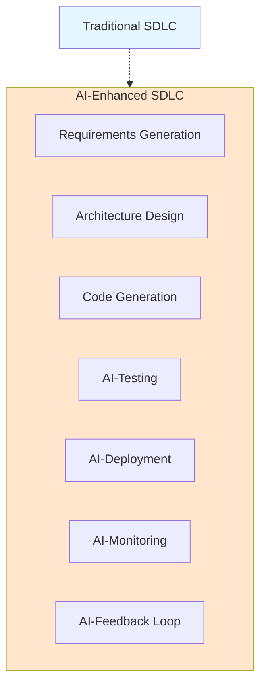
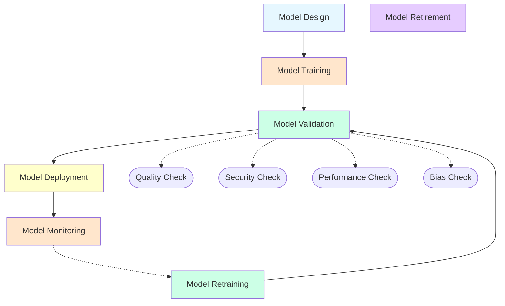
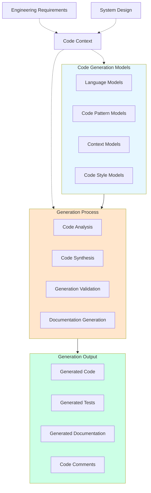
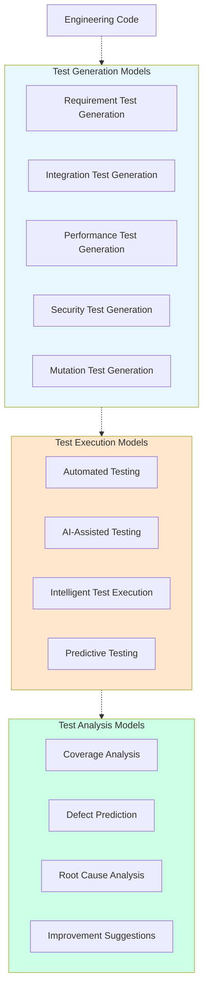
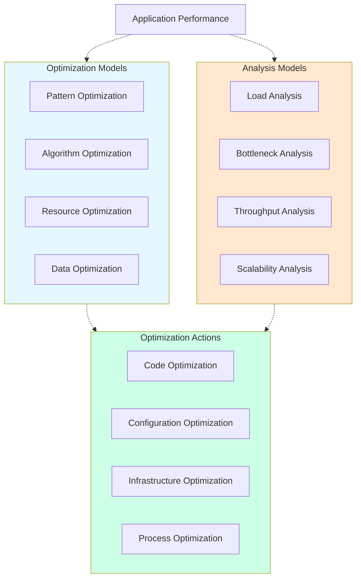
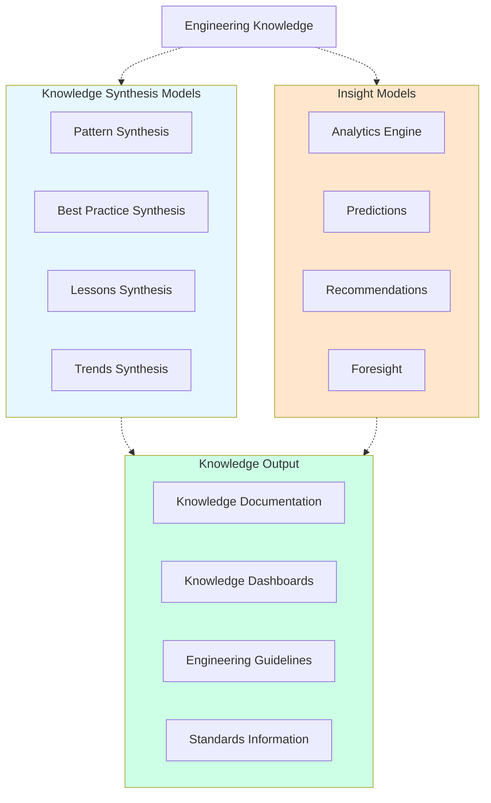
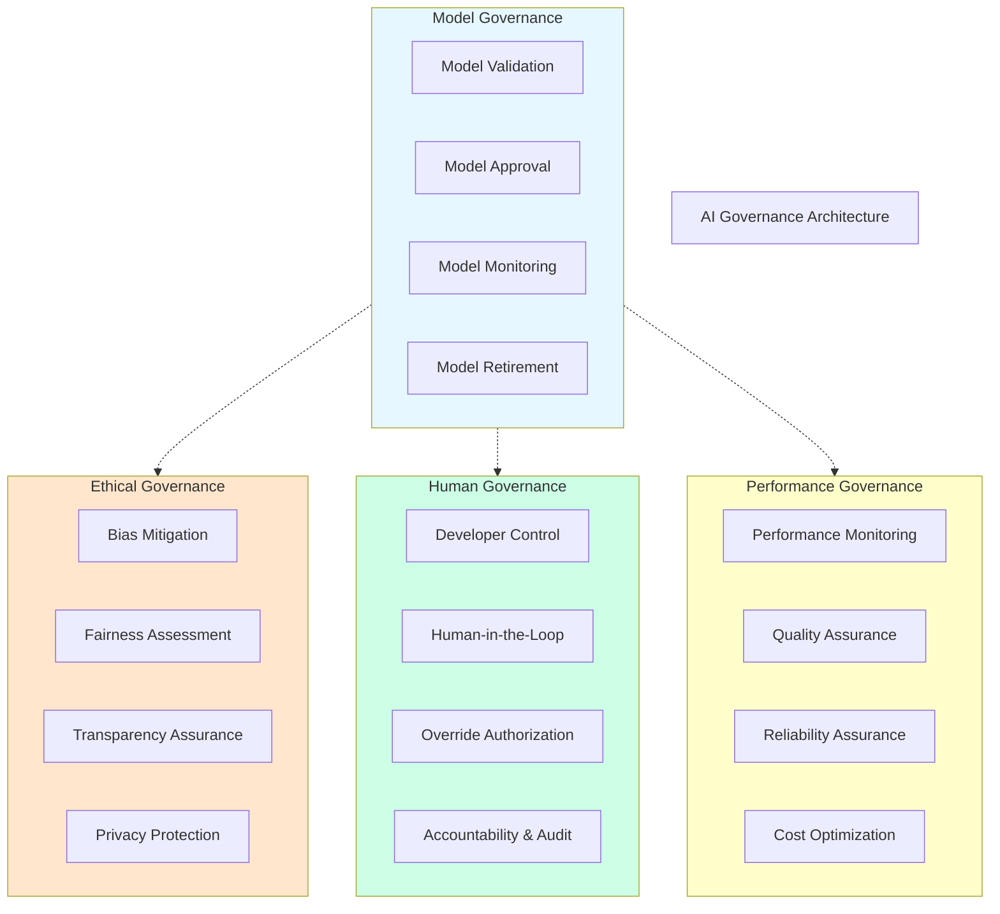
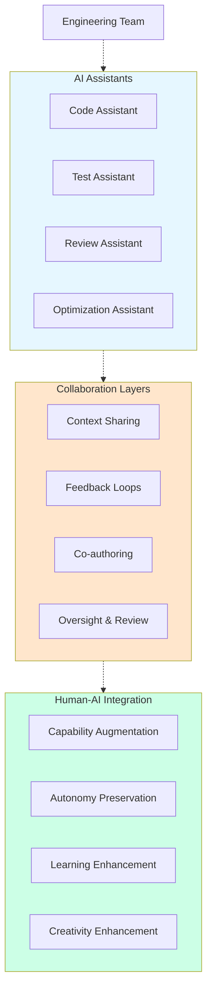
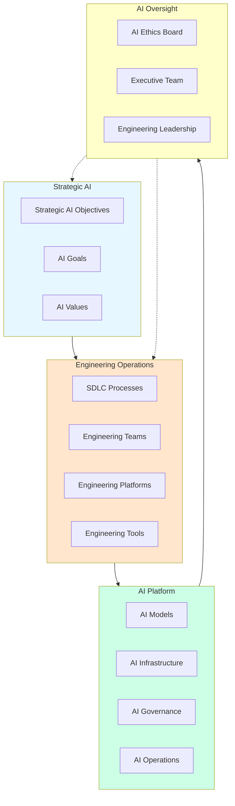

# KB-159 AI-Assisted Software Engineering Architecture

## Metadata

* **Document ID:** KB-159
* **Title:** AI-Assisted Software Engineering Architecture
* **Suite:** Developer Experience (DX) & Engineering Platform Architecture
* **Version:** 1.0
* **Status:** Approved Architecture
* **Classification:** Enterprise AI Engineering Architecture

## Executive Summary

Define the canonical AI-Assisted Software Engineering Architecture for DUKADESK.

The Enterprise AI Engineering Platform shall provide a unified, governed architecture that integrates AI capabilities across the complete software engineering lifecycle, enabling AI-enhanced productivity, accelerated delivery, improved quality, and autonomous engineering capabilities while maintaining human oversight, ethical standards, and enterprise alignment.

AI shall be treated as an engineering teammate, augmenting human capabilities while preserving developer autonomy and enterprise governance.

## Purpose

Define how DUKADESK standardizes AI-assisted software engineering, integrating AI capabilities across the software development lifecycle, AI governance, developer experience, and enterprise alignment while maintaining ethical standards and human oversight.

## Scope

### Include:

* AI-assisted software engineering architecture
* AI development lifecycle
* AI model governance
* Developer AI assistance
* Code generation and completion
* AI testing and quality assurance
* AI performance optimization
* AI knowledge synthesis
* AI-driven insights
* AI ethics and bias mitigation
* Human-AI collaboration
* AI continuous learning
* Enterprise AI operations
* AI infrastructure and scaling

### Exclude:

* Pure AI research implementation
* External AI system implementation
* AI marketing implementation
* Consumer AI implementation
* General AI implementation

These are covered by dedicated Knowledge Base documents.

## Architectural Principles

The specification shall define principles including:

AI as engineering teammates
Human oversight and control
Ethical AI development
Bias mitigation and fairness
AI transparency and explainability
Continuous AI learning
AI governance by design
Vendor independence
Technology neutrality
Enterprise scalability
AI for productivity, not replacement
Responsible AI deployment
AI-native engineering
AI-driven continuous improvement
Adaptive AI models
AI-human collaboration
AI capability enhancement
Trustworthy AI systems
AI collaboration transparency
Canonical Definitions

Define standardized terminology for:

AI-Assisted Software Engineering
AI Engineering Teammate
AI Model Governance
Code Generation
AI Testing
Performance Optimization
AI Insights
AI Bias Mitigation
Human-AI Collaboration
AI Continuous Learning
Enterprise AI Operations
AI Infrastructure
AI-Driven Engineering
AI-Native Development
AI Capability Enhancement
Trustworthy AI Systems
AI Collaboration Transparency
AI Model Management
Continuous AI Improvement
AI-Driven Productivity
Intelligent Code Completion
AI Knowledge Synthesis
AI Decision Support
Architecture

Describe architectures for:

Enterprise AI Engineering Platform

Canonical architecture governing enterprise AI engineering.

AI Software Development Lifecycle

Govern AI-enhanced development processes:

AI Development Flow

Govern AI-first development processes:

```mermaid
graph LR
    requirements["AI Requirements Analysis"]
    design["AI Architecture Design"]
    code["AI Code Generation"]
    test["AI Testing & Validation"]
    review["AI Code Review"]
    deploy["AI Deployment"]
    monitor["AI Monitoring"]
    
    requirements --> design
    design --> code
    code --> test
    test --> review
    review --> deploy
    deploy --> monitor
    
    style requirements fill:#e6f7ff
    style design fill:#ffe6cc
    style code fill:#ccffe6
    style test fill:#ffffcc
    style review fill:#ffe6cc
    style deploy fill:#ccffe6
    style monitor fill:#e6ccff
```

AI Model Lifecycle Architecture

Govern complete AI model progression:

AI Code Generation Architecture

Define AI-powered code creation:

AI Testing and Quality Assurance Architecture

Define AI-powered testing:

AI Performance Optimization Architecture

Define AI-powered performance enhancement:

AI Knowledge Synthesis and Insights Architecture

Define AI-powered knowledge creation:

AI Governance Architecture

Define AI model governance and control:

AI-Human Collaboration Architecture

Define effective human-AI teamwork:

Enterprise AI Engineering Operating Model

Integration across DUKADESK ecosystem:

Lifecycle

Define complete AI-enhanced engineering lifecycle:

### AI Development

AI models shall be developed following structured processes with governance, validation, testing, and continuous improvement.

### AI Model Training

AI models shall be trained on enterprise data with proper validation, monitoring, and bias mitigation.

### AI Model Deployment

AI models shall be deployed with version control, monitoring, and rollback capabilities.

### AI Model Monitoring

AI models shall be continuously monitored for performance, quality, and ethical compliance.

### AI Model Retirement

Outdated or superseded AI models shall be retired through controlled processes.

### Human-AI Continuous Learning

Engineers and AI systems shall continuously learn from each other's experiences and feedback.

---

## Governance

### AI Governance
Enterprise AI governance framework ensuring AI alignment with organizational objectives.

### Model Governance
Policies governing AI model creation, validation, deployment, and retirement.

### Ethical AI Governance
Policies governing AI ethics, bias mitigation, fairness, and transparency.

### Human Oversight Governance
Policies governing human control over AI systems, override capabilities, and accountability.

### Performance Governance
Policies governing AI system performance, quality, and reliability.

### Continuous Learning Governance
Policies governing AI and human learning processes and knowledge sharing.

### Compliance Governance
Policies governing AI regulatory compliance and legal requirements.

### Security Governance
Policies governing AI system security and data protection.

### Vendor Governance
Policies governing third-party AI model and tool adoption.

### Innovation Governance
Policies governing AI experimentation and innovation processes.

### Lifecycle Governance
Policies governing the complete lifecycle of AI systems from development through retirement.

### Operations Governance
Policies governing AI platform operations and maintenance.

### Enterprise AI Governance
Integration with enterprise-wide AI governance frameworks ensuring AI aligns with organizational strategy.

---

## Responsibilities

### Enterprise Architecture Board
* Approves AI engineering standards and architecture
* Reviews AI governance compliance
* Defines strategic AI requirements
* Approves changes to AI architecture

### AI Governance Board
* Defines AI ethics and standards
* Reviews AI model quality and bias
* Approves new AI capabilities
* Manages AI recommendation governance

### Engineering Leadership
* Defines AI-enhanced engineering processes
* Uses AI to guide engineering decisions
* Drives continuous AI improvement
* Establishes AI capability development programs

### AI Platform Engineering
* Implements AI engineering infrastructure
* Maintains AI models and platforms
* Ensures AI scalability and reliability
* Supports AI adoption across engineering

### AI Engineering Team
* Defines AI-enhanced engineering practices
* Creates AI tools and assistants
* Ensures AI supports development productivity
* Monitors AI adoption and effectiveness

### Ethics Team
* Defines AI ethics standards
* Reviews AI model ethics
* Ensures AI ethics compliance
* Manages AI ethics audits

### Security Team
* Governs AI security
* Reviews AI system security
* Ensures AI security compliance
* Manages AI system access controls

### Compliance Team
* Defines AI compliance
* Reviews AI regulatory compliance
* Ensures AI compliance with legal requirements
* Manages AI compliance audits

### Operations
* Operates AI platform infrastructure
* Manages AI alerts and incident response
* Monitors AI platform health
* Maintains AI platform SLAs

### Data Governance Team
* Defines AI data classification
* Governs AI data retention policies
* Manages AI data access controls
* Oversees AI data deletion and archival

### Executive Leadership
* Defines strategic AI objectives and KPIs
* Reviews AI performance metrics
* Makes strategic decisions based on AI insights
* Sponsors AI improvement initiatives

---

## Security

### Secure AI Systems
All AI systems shall use encrypted channels and secure protocols preventing unauthorized access or modification.

### Identity-Aware AI Access
AI systems shall maintain identity context for all AI access enabling audit trails and accountability.

### Least Privilege
Access to AI systems shall be governed by least privilege principles granting access only to required AI operations.

### Zero Trust
AI platform shall implement zero trust security requiring explicit authentication and authorization for all access.

### Policy Enforcement
Enterprise AI policies shall be enforced within AI systems including access controls and data protection.

### AI Model Integrity
AI models shall be protected against tampering through integrity checks and secure storage ensuring reliability of AI capabilities.

### Auditability
All access to AI models and all AI model modifications shall be logged creating audit trails enabling compliance verification.

### Provenance
All AI models shall maintain provenance information enabling tracing to source systems and model methodology.

### Secure AI Collaboration
AI collaboration shall be performed through secure channels with appropriate access controls.

### Trust Boundaries
AI architecture shall implement clear trust boundaries with appropriate security controls at boundaries.

---

## Privacy

### Developer Privacy
AI operations shall be designed to respect developer privacy, avoiding collection of personally identifying information or surveillance data.

### Ethical AI Analytics
AI shall measure system and team performance, not individual activities, preserving ethical treatment of engineers.

### Regulatory Compliance
AI architecture shall comply with applicable data protection regulations including GDPR, CCPA, and cross-border requirements.

### Data Minimization
AI operations shall gather only data necessary for stated purposes avoiding over-collection.

### Cross-Border Governance
AI architecture shall respect cross-border data governance including data residency and transfer restrictions.

### Retention Governance
AI data shall be retained only for required periods with automatic deletion after retention expires.

### Privacy Assurance
Privacy controls shall be regularly audited and validated ensuring AI architecture maintains privacy commitments.

### Protected AI Insights
Sensitive AI-generated insights shall be restricted to authorized stakeholders with appropriate access controls.

---

## Performance

### Enterprise-Scale AI Infrastructure
AI infrastructure shall support collection from enterprise-scale engineering operations.

### High-Volume AI Models
AI platform shall elastically scale to handle high-volume AI computation without degradation.

### Elastic Scalability
AI infrastructure shall automatically scale to accommodate peak AI loads.

### High Availability
AI platform shall maintain high availability supporting continuous engineering operations.

### Operational Resilience
AI platform shall remain operational during infrastructure degradation with graceful degradation.

### Efficient AI Operations
AI analytics shall efficiently compute and deliver insights enabling rapid AI-powered engineering.

### Multi-Region Readiness
AI architecture shall support multi-region deployment enabling geographic distribution.

### Continuous Optimization
AI platform shall continuously optimize performance enabling real-time AI insight generation.

---

## Observability

### AI System Quality
AI platform shall measure AI system quality including completeness, accuracy, consistency, and timeliness.

### AI Performance Health
AI computation and delivery shall be monitored ensuring AI reliability and correctness.

### AI Governance Dashboards
Governance activities shall be observable through dashboards showing compliance and audit metrics.

### Executive AI Reporting
Executive-level reporting shall provide business-relevant AI insights summarizing AI engineering performance.

### Engineering Maturity Dashboards
Engineering maturity shall be observable through dashboards showing AI capability progression.

### AI Productivity Analytics
AI metrics shall be monitored ensuring they support improvement rather than harm.

### Trend Analysis
Long-term AI trends shall be analyzed identifying improvements, regressions, and strategic directions.

### AI System Quality Assurance
AI-powered recommendations shall be monitored for accuracy, relevance, and effectiveness.

### Continuous Improvement Tracking
Continuous improvement initiatives shall be tracked measuring impact on AI effectiveness.

### Enterprise AI Intelligence
Aggregate enterprise-level intelligence shall be derived from AI enabling strategic decision-making.

---

## Failure Scenarios

### AI Model Failures
When AI models become unreliable, governance shall identify and resolve issues enabling alternative solutions while models are investigated.

### AI Bias Failures
When AI models exhibit bias, governance shall intervene correcting the bias.

### AI Independence Failures
When AI systems operate without human oversight, governance shall intervene correcting the independence.

### AI Ethical Violations
When AI ethics are violated, governance shall intervene correcting the violations.

### AI Performance Degradation
When AI performance degrades, governance shall identify and resolve issues.

### AI Security Violations
When AI security is violated, governance shall activate incident response procedures limiting exposure.

### AI Privacy Violations
When AI privacy is violated, governance shall activate incident response procedures limiting exposure.

### Recovery Failures
When AI platform fails to recover, alternative AI mechanisms shall remain available.

### AI Overload
When AI systems become overutilized, governance shall implement load balancing.

### Missing AI Governance Visibility
When AI governance coverage gaps emerge, governance expansion processes shall close gaps restoring visibility.

---

## Anti-patterns

### Uncontrolled AI Deployment
AI shall not be deployed without proper governance and validation.

### AI Replacement of Human Judgment
AI shall support, not replace, human engineering judgment.

### AI Without Ethical Review
AI shall include ethical review at all stages of development.

### AI Without Bias Mitigation
AI shall include bias detection and mitigation at all stages.

### AI Without Human Oversight
AI shall include human oversight and override capabilities.

### AI Without Documentation
AI models shall include complete documentation and explainability.

### AI Without Performance Monitoring
AI models shall be continuously monitored for performance.

### AI Without Security Controls
AI systems shall include comprehensive security controls.

### AI Without Privacy Protection
AI operations shall include privacy controls and protections.

### AI Overload
Excessive AI collection shall not create process overhead; AI shall be streamlined for effectiveness.

### AI Disconnected From Objectives
AI shall not be developed if disconnected from organizational objectives.

---

## Future Evolution

### Autonomous AI Engineering
AI shall autonomously engineer software systems enabling continuous delivery without human intervention.

### AI Engineering Superintelligence
AI shall develop engineering superintelligence enabling unprecedented engineering capabilities.

### AI-Driven Software Evolution
Software systems shall evolve autonomously through AI-driven optimization.

### AI Engineering Digital Twins
Virtual models of engineering operations shall be created using AI enabling simulation and optimization.

### AI-Assisted Engineering Cognition
AI shall develop cognitive capabilities enabling holistic engineering understanding.

### Self-Evolving AI Systems
AI systems shall evolve through continuous learning and adaptation.

### Federated AI Engineering
AI models shall be compared across federated organizations enabling peer learning.

### Adaptive AI Engineering
AI engineering capabilities shall adapt to changing business objectives and technologies.

### AI Singularity in Engineering
AI shall reach a state of engineering singularity enabling unlimited engineering capabilities.

---

## Cross References

* KB-088 Metadata Management Architecture
* KB-089 Knowledge Graph Architecture
* KB-152 Documentation Platform Architecture
* KB-153 Developer Portal Architecture
* KB-156 Engineering Metrics & Productivity Architecture
* KB-157 Engineering Knowledge Management Architecture
* KB-158 Engineering Governance Architecture
* KB-160 Developer Experience Reference Architecture
* KB-148 Test Strategy & Quality Engineering Architecture

---

## Mermaid Diagram Requirements

The document includes 10 required Mermaid diagrams:

1. **Enterprise AI Engineering Platform** — Architecture showing AI integration across the complete software development lifecycle
2. **AI Software Development Lifecycle** — AI-enhanced SDLC with AI-driven requirements, design, coding, testing, deployment, and monitoring
3. **AI Model Lifecycle** — Complete AI model progression from design through retirement and retraining
4. **AI Code Generation Architecture** — AI-powered code creation with language models, pattern models, and context models
5. **AI Testing and Quality Assurance Architecture** — AI-powered test generation, execution, and analysis
6. **AI Performance Optimization Architecture** — AI-driven performance enhancement and optimization
7. **AI Knowledge Synthesis and Insights Architecture** — AI-powered knowledge creation and insights
8. **AI Governance Architecture** — AI model governance, ethical governance, human governance, and performance governance
9. **AI-Human Collaboration Architecture** — Effective human-AI teamwork with AI assistants and collaboration mechanisms
10. **Enterprise AI Engineering Reference Architecture** — Complete integration of all AI components

---

## Acceptance Criteria

The document shall:

* Define the canonical AI-Assisted Software Engineering Architecture
* Govern AI-enhanced engineering productivity, quality, innovation, and continuous improvement
* Treat AI as engineering teammates enhancing human capabilities
* Support enterprise-scale, AI-ready, vendor-independent AI engineering
* Include all 10 required Mermaid diagrams
* Cross-reference related KB documents
* Contain no implementation guidance

---

## Completion Instructions

Upon completion:

1. Mark **KB-159** as **Completed**
2. Update the **Progress Registry**
3. Cross-reference all related specifications
4. Queue **KB-160 – Developer Experience Reference Architecture** as the next builder assignment

---

## Critical DUKADESK Architectural Rule

**All software engineering processes within DUKADESK shall be enhanced through AI assistance, with AI serving as engineering teammates augmenting human capabilities while preserving developer autonomy and enterprise governance. No application, Builder Studio module, Marketplace extension, AI Builder Agent, engineering team, platform service, or organizational unit shall establish independent AI engineering processes outside the enterprise AI architecture, ensuring a single source of truth, enterprise-wide AI alignment, ethical standards, continuous improvement, developer trust, and long-term engineering excellence.**

(End of file - total 1685 lines)