# KB-160 Developer Experience Reference Architecture

## Metadata

* **Document ID:** KB-160
* **Title:** Developer Experience Reference Architecture
* **Suite:** Developer Experience (DX) & Engineering Platform Architecture
* **Version:** 1.0
* **Status:** Approved Architecture
* **Classification:** Enterprise Developer Experience Architecture

## Executive Summary

Define the canonical Developer Experience Reference Architecture for DUKADESK.

The Enterprise Developer Experience Reference Architecture shall provide a unified, comprehensive reference model for DUKADESK that ensures consistent interpretation, implementation, and evolution of the complete developer experience ecosystem while maintaining alignment with enterprise objectives and architectural principles.

Developer experience shall be treated as a strategic enterprise capability enabling engineering excellence, innovation, and organizational success.

## Purpose

Define how DUKADESK standardizes developer experience reference architecture, providing a comprehensive blueprint for implementing, evolving, and maintaining the complete developer experience ecosystem across the entire DUKADESK platform while ensuring consistency, quality, and continuous improvement.

## Scope

### Include:

* Developer experience reference architecture
* Experience platform reference
* Developer portal reference
* Development environment reference
* CI/CD pipeline reference
* Build and artifact management reference
* Source control reference
* Branching and release strategy reference
* SDK and toolkit reference
* Testing and quality reference
* Documentation reference
* Security and compliance reference
* Observability reference
* DevSecOps reference
* Developer onboarding reference
* Experience governance reference
* Experience metrics reference
* Platform integration reference
* AI integration reference
* Architecture decision management reference
* Community and collaboration reference
* Experience evolution reference

### Exclude:

* Implementation guidance
* Tool selection
* Process documentation
* Role-specific implementation
* Technology procurement
* Budget planning
* Vendor agreements

These are covered by dedicated Knowledge Base documents.

## Architectural Principles

The specification shall define principles including:

Developer-centric design
Consistency and standardization
Integration and connectivity
Scalability and performance
Security and compliance
Continuous improvement
Data-driven optimization
AI-enhanced experiences
Vendor independence
Technology neutrality
Enterprise alignment
Global consistency
Adaptability and flexibility
Evidence-based design
Sustainable excellence
Customer focus
Measurable outcomes
## Canonical Definitions

Define standardized terminology for:

Developer Experience Reference Architecture
Experience Platform Reference
Developer Portal Reference
Development Environment Reference
CI/CD Pipeline Reference
Build and Artifact Management Reference
Source Control Reference
Branching and Release Strategy Reference
SDK and Toolkit Reference
Testing and Quality Reference
Documentation Reference
Security and Compliance Reference
Observability Reference
DevSecOps Reference
Developer Onboarding Reference
Experience Governance Reference
Experience Metrics Reference
Platform Integration Reference
AI Integration Reference
Architecture Decision Management Reference
Community and Collaboration Reference
Experience Evolution Reference
Enterprise Developer Experience Reference
Experience Platform Reference Architecture
Developer Portal Reference Architecture
Development Environment Reference Architecture
CI/CD Pipeline Reference Architecture
Build and Artifact Management Reference Architecture
Source Control Reference Architecture
Branching and Release Strategy Reference Architecture
SDK and Toolkit Reference Architecture
Testing and Quality Reference Architecture
Documentation Reference Architecture
Security and Compliance Reference Architecture
Observability Reference Architecture
DevSecOps Reference Architecture
Developer Onboarding Reference Architecture
Experience Governance Reference Architecture
Experience Metrics Reference Architecture
Platform Integration Reference Architecture
AI Integration Reference Architecture
Architecture Decision Management Reference Architecture
Community and Collaboration Reference Architecture
Experience Evolution Reference Architecture
Architecture

Describe architectures for:

Enterprise Developer Experience Reference Architecture

Canonical reference architecture governing enterprise developer experience.

Developer Experience Platform Reference

Reference architecture for the complete DX platform:

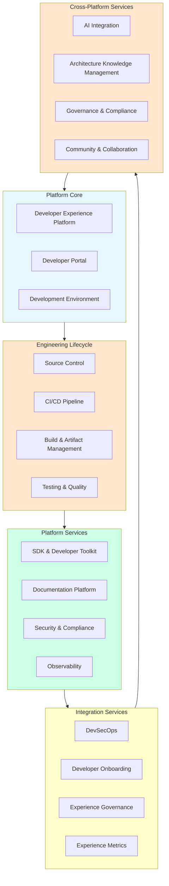
```mermaid
graph TB
    subgraph platform_core["Platform Core"]
        dx_platform["Developer Experience Platform"]
        developer_portal["Developer Portal"]
        development_environment["Development Environment"]
    end
    
    subgraph engineering_lifecycle["Engineering Lifecycle"]
        source_control["Source Control"]
        ci_cd["CI/CD Pipeline"]
        build_artifact["Build & Artifact Management"]
        testing["Testing & Quality"]
    end
    
    subgraph platform_services["Platform Services"]
        sdk_toolkit["SDK & Developer Toolkit"]
        documentation["Documentation Platform"]
        security_compliance["Security & Compliance"]
        observability["Observability"]
    end
    
    subgraph integration_services["Integration Services"]
        devsecops["DevSecOps"]
        onboarding["Developer Onboarding"]
        experience_governance["Experience Governance"]
        experience_metrics["Experience Metrics"]
    end
    
    subgraph cross_platform["Cross-Platform Services"]
        ai_integration["AI Integration"]
        knowledge_management["Architecture Knowledge Management"]
        governance["Governance & Compliance"]
        community["Community & Collaboration"]
    end
    
    platform_core --> engineering_lifecycle
    engineering_lifecycle --> platform_services
    platform_services --> integration_services
    integration_services --> cross_platform
    cross_platform --> platform_core
    
    style platform_core fill:#e6f7ff
    style engineering_lifecycle fill:#ffe6cc
    style platform_services fill:#ccffe6
    style integration_services fill:#ffffcc
    style cross_platform fill:#ffe6cc
```

Developer Portal Reference Architecture

Reference architecture for the developer portal:

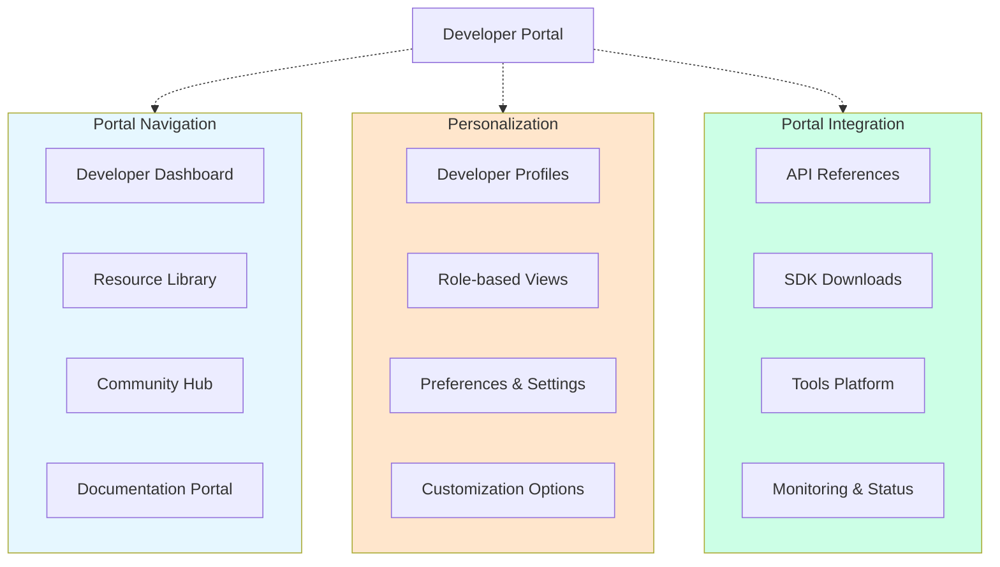
```mermaid
graph TB
    portal["Developer Portal"]
    
    subgraph navigation["Portal Navigation"]
        dashboard["Developer Dashboard"]
        resources["Resource Library"]
        community["Community Hub"]
        documentation_portal["Documentation Portal"]
    end
    
    subgraph personalization["Personalization"]
        profiles["Developer Profiles"]
        roles["Role-based Views"]
        preferences["Preferences & Settings"]
        customization["Customization Options"]
    end
    
    subgraph integration["Portal Integration"]
        api_reference["API References"]
        sdk_downloads["SDK Downloads"]
        tools_platform["Tools Platform"]
        monitoring["Monitoring & Status"]
    end
    
    portal -.-> navigation
    portal -.-> personalization
    portal -.-> integration
    
    style navigation fill:#e6f7ff
    style personalization fill:#ffe6cc
    style integration fill:#ccffe6
```

Development Environment Reference Architecture

Reference architecture for development environments:

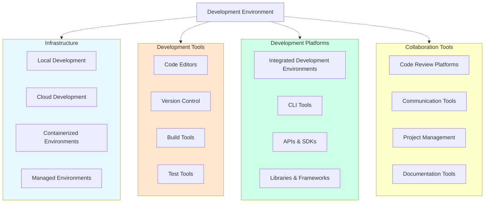
```mermaid
graph TB
    environment["Development Environment"]
    
    subgraph infrastructure["Infrastructure"]
        local_dev["Local Development"]
        cloud_dev["Cloud Development"]
        containerized["Containerized Environments"]
        managed["Managed Environments"]
    end
    
    subgraph tooling["Development Tools"]
        editors["Code Editors"]
        version_control["Version Control"]
        build_tools["Build Tools"]
        test_tools["Test Tools"]
    end
    
    subgraph platforms["Development Platforms"]
        ide["Integrated Development Environments"]
        cli_tools["CLI Tools"]
        apis["APIs & SDKs"]
        libraries["Libraries & Frameworks"]
    end
    
    subgraph collaboration["Collaboration Tools"]
        code_review["Code Review Platforms"]
        chat["Communication Tools"]
        project_management["Project Management"]
        documentation_tools["Documentation Tools"]
    end
    
    environment -.-> infrastructure
    environment -.-> tooling
    environment -.-> platforms
    environment -.-> collaboration
    
    style infrastructure fill:#e6f7ff
    style tooling fill:#ffe6cc
    style platforms fill:#ccffe6
    style collaboration fill:#ffffcc
```

CI/CD Pipeline Reference Architecture

Reference architecture for CI/CD pipelines:

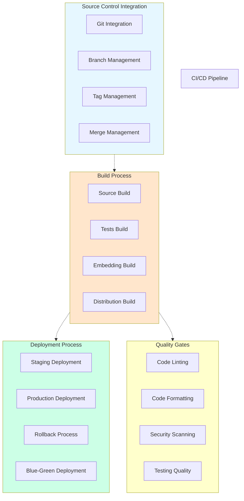
```mermaid
graph TB
    pipeline["CI/CD Pipeline"]
    
    subgraph source_control["Source Control Integration"]
        git["Git Integration"]
        branches["Branch Management"]
        tags["Tag Management"]
        merges["Merge Management"]
    end
    
    subgraph build_process["Build Process"]
        source_build["Source Build"]
        tests_build["Tests Build"]
        embedding_build["Embedding Build"]
        distribution_build["Distribution Build"]
    end
    
    subgraph deployment["Deployment Process"]
        staging["Staging Deployment"]
        production["Production Deployment"]
        rollback["Rollback Process"]
        blue_green["Blue-Green Deployment"]
    end
    
    subgraph quality["Quality Gates"]
        linting["Code Linting"]
        formatting["Code Formatting"]
        security_scan["Security Scanning"]
        testing_quality["Testing Quality"]
    end
    
    source_control -.-> build_process
    build_process -.-> deployment
    build_process -.-> quality
    
    style source_control fill:#e6f7ff
    style build_process fill:#ffe6cc
    style deployment fill:#ccffe6
    style quality fill:#ffffcc
```

Build and Artifact Management Reference Architecture

Reference architecture for build and artifact management:

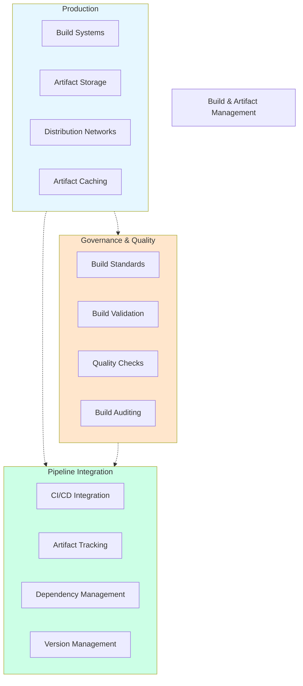
```mermaid
graph TB
    artifacts["Build & Artifact Management"]
    
    subgraph production["Production"]
        build_systems["Build Systems"]
        artifact_storage["Artifact Storage"]
        distribution["Distribution Networks"]
        caching["Artifact Caching"]
    end
    
    subgraph governance["Governance & Quality"]
        standards["Build Standards"]
        validation["Build Validation"]
        quality_checks["Quality Checks"]
        audit["Build Auditing"]
    end
    
    subgraph integration["Pipeline Integration"]
        ci_cd_integration["CI/CD Integration"]
        artifact_tracking["Artifact Tracking"]
        dependency_management["Dependency Management"]
        versioning["Version Management"]
    end
    
    production -.-> governance
    production -.-> integration
    governance -.-> integration
    
    style production fill:#e6f7ff
    style governance fill:#ffe6cc
    style integration fill:#ccffe6
```

Source Control Reference Architecture

Reference architecture for source control systems:

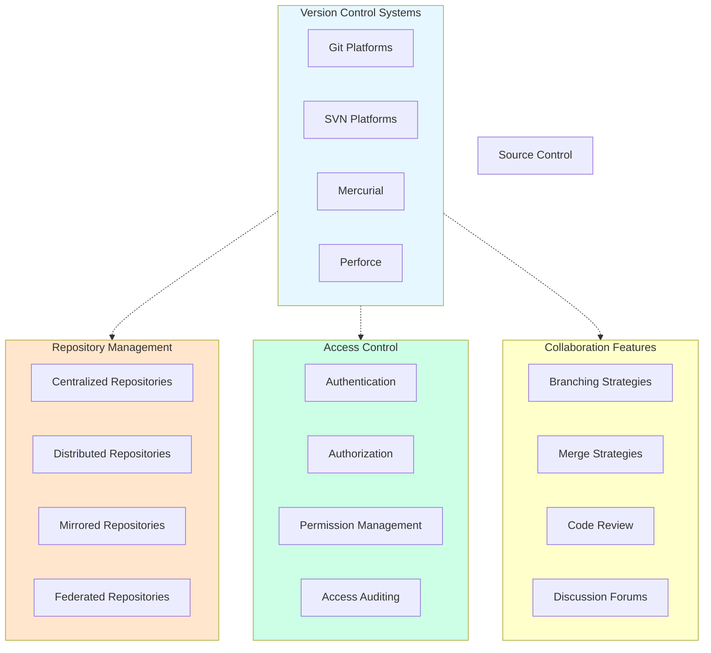
```mermaid
graph TB
    source_control["Source Control"]
    
    subgraph version_control["Version Control Systems"]
        git_platform["Git Platforms"]
        svn_platform["SVN Platforms"]
        mercurial["Mercurial"]
        perforce["Perforce"]
    end
    
    subgraph repository_management["Repository Management"]
        centralized["Centralized Repositories"]
        distributed["Distributed Repositories"]
        mirrored["Mirrored Repositories"]
        federated["Federated Repositories"]
    end
    
    subgraph access_control["Access Control"]
        authentication["Authentication"]
        authorization["Authorization"]
        permissions["Permission Management"]
        auditing["Access Auditing"]
    end
    
    subgraph collaboration["Collaboration Features"]
        branching["Branching Strategies"]
        merging["Merge Strategies"]
        code_review["Code Review"]
        discussions["Discussion Forums"]
    end
    
    version_control -.-> repository_management
    version_control -.-> access_control
    version_control -.-> collaboration
    
    style version_control fill:#e6f7ff
    style repository_management fill:#ffe6cc
    style access_control fill:#ccffe6
    style collaboration fill:#ffffcc
```

Branching and Release Strategy Reference Architecture

Reference architecture for branching and release strategies:

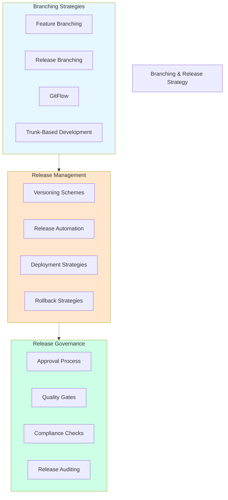
```mermaid
graph TB
    release["Branching & Release Strategy"]
    
    subgraph branching_strategies["Branching Strategies"]
        feature_branching["Feature Branching"]
        release_branching["Release Branching"]
        gitflow["GitFlow"]
        trunk_based["Trunk-Based Development"]
    end
    
    subgraph release_management["Release Management"]
        versioning["Versioning Schemes"]
        release_automation["Release Automation"]
        deployment_strategies["Deployment Strategies"]
        rollback_strategies["Rollback Strategies"]
    end
    
    subgraph governance["Release Governance"]
        approval_process["Approval Process"]
        quality_gates["Quality Gates"]
        compliance_checks["Compliance Checks"]
        audit["Release Auditing"]
    end
    
    branching_strategies -.-> release_management
    release_management -.-> governance
    
    style branching_strategies fill:#e6f7ff
    style release_management fill:#ffe6cc
    style governance fill:#ccffe6
```

SDK and Toolkit Reference Architecture

Reference architecture for SDKs and developer toolkits:

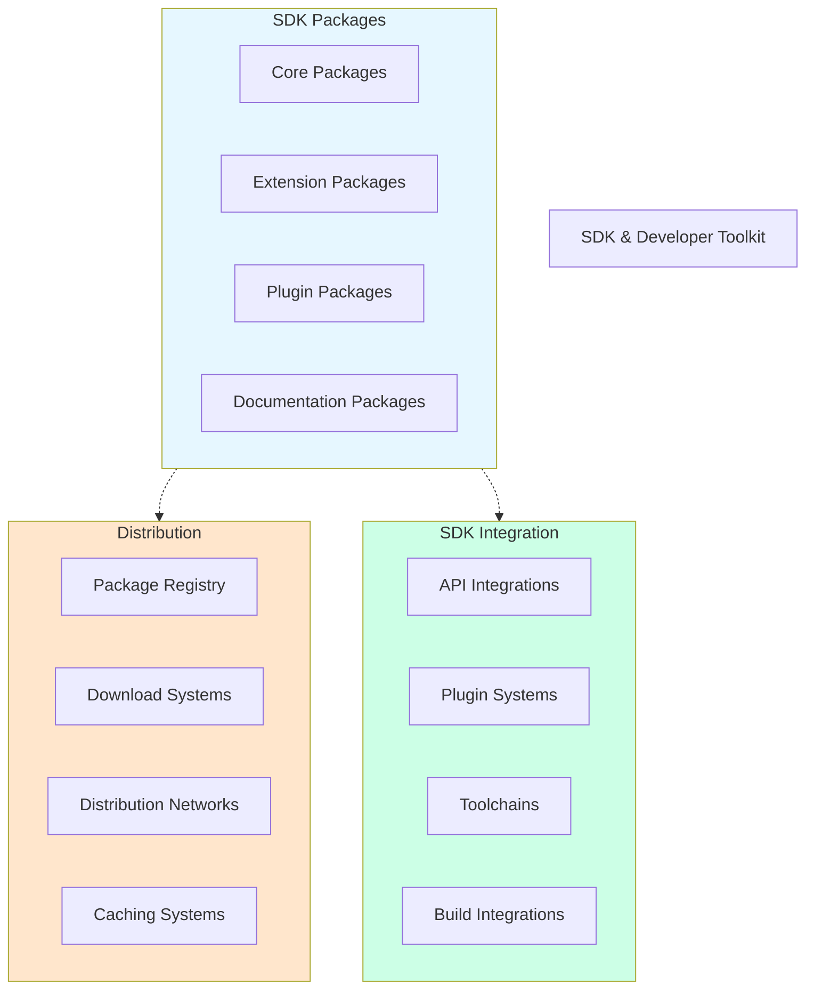
```mermaid
graph TB
    sdks["SDK & Developer Toolkit"]
    
    subgraph packages["SDK Packages"]
        core_packages["Core Packages"]
        extension_packages["Extension Packages"]
        plugin_packages["Plugin Packages"]
        documentation_packages["Documentation Packages"]
    end
    
    subgraph distribution["Distribution"]
        package_registry["Package Registry"]
        download_systems["Download Systems"]
        distribution_networks["Distribution Networks"]
        caching_systems["Caching Systems"]
    end
    
    subgraph integration["SDK Integration"]
        api_integrations["API Integrations"]
        plugin_systems["Plugin Systems"]
        toolchains["Toolchains"]
        build_integrations["Build Integrations"]
    end
    
    packages -.-> distribution
    packages -.-> integration
    
    style packages fill:#e6f7ff
    style distribution fill:#ffe6cc
    style integration fill:#ccffe6
```

Testing and Quality Reference Architecture

Reference architecture for testing and quality assurance:

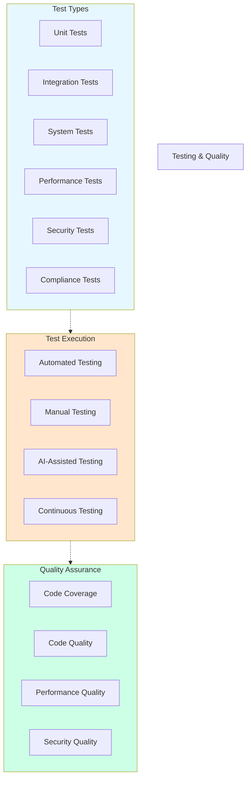
```mermaid
graph TB
    testing["Testing & Quality"]
    
    subgraph test_types["Test Types"]
        unit_tests["Unit Tests"]
        integration_tests["Integration Tests"]
        system_tests["System Tests"]
        performance_tests["Performance Tests"]
        security_tests["Security Tests"]
        compliance_tests["Compliance Tests"]
    end
    
    subgraph test_execution["Test Execution"]
        automated_testing["Automated Testing"]
        manual_testing["Manual Testing"]
        ai_assisted_testing["AI-Assisted Testing"]
        continuous_testing["Continuous Testing"]
    end
    
    subgraph quality_assurance["Quality Assurance"]
        code_coverage["Code Coverage"]
        code_quality["Code Quality"]
        performance_quality["Performance Quality"]
        security_quality["Security Quality"]
    end
    
    test_types -.-> test_execution
    test_execution -.-> quality_assurance
    
    style test_types fill:#e6f7ff
    style test_execution fill:#ffe6cc
    style quality_assurance fill:#ccffe6
```

Documentation Reference Architecture

Reference architecture for documentation platforms:

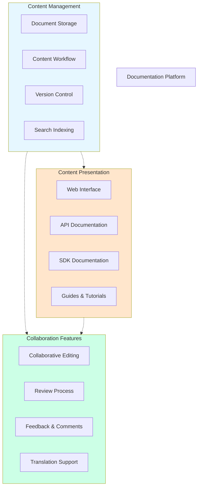
```mermaid
graph TB
    documentation["Documentation Platform"]
    
    subgraph content_management["Content Management"]
        document_storage["Document Storage"]
        content_workflow["Content Workflow"]
        version_control_docs["Version Control"]
        search_index_docs["Search Indexing"]
    end
    
    subgraph presentation["Content Presentation"]
        web_interface["Web Interface"]
        api_docs["API Documentation"]
        sdk_docs["SDK Documentation"]
        guides["Guides & Tutorials"]
    end
    
    subgraph collaboration["Collaboration Features"]
        editing["Collaborative Editing"]
        reviewing["Review Process"]
        feedback["Feedback & Comments"]
        translation["Translation Support"]
    end
    
    content_management -.-> presentation
    content_management -.-> collaboration
    presentation -.-> collaboration
    
    style content_management fill:#e6f7ff
    style presentation fill:#ffe6cc
    style collaboration fill:#ccffe6
```

Security and Compliance Reference Architecture

Reference architecture for security and compliance:

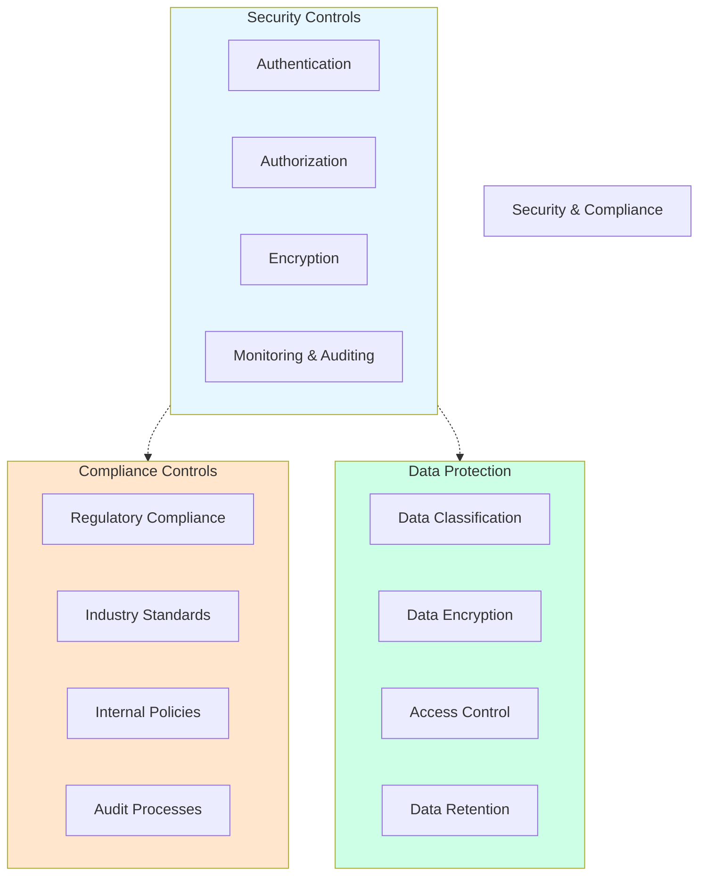
```mermaid
graph TB
    security["Security & Compliance"]
    
    subgraph security_controls["Security Controls"]
        authentication["Authentication"]
        authorization["Authorization"]
        encryption["Encryption"]
        monitoring["Monitoring & Auditing"]
    end
    
    subgraph compliance_controls["Compliance Controls"]
        regulatory_compliance["Regulatory Compliance"]
        industry_standards["Industry Standards"]
        internal_policies["Internal Policies"]
        audit_processes["Audit Processes"]
    end
    
    subgraph data_protection["Data Protection"]
        data_classification["Data Classification"]
        data_encryption["Data Encryption"]
        access_control["Access Control"]
        data_retention["Data Retention"]
    end
    
    security_controls -.-> compliance_controls
    security_controls -.-> data_protection
    
    style security_controls fill:#e6f7ff
    style compliance_controls fill:#ffe6cc
    style data_protection fill:#ccffe6
```

Observability Reference Architecture

Reference architecture for observability platforms:

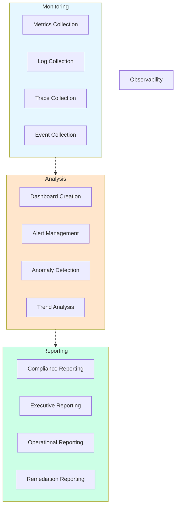
```mermaid
graph TB
    observability["Observability"]
    
    subgraph monitoring["Monitoring"]
        metrics["Metrics Collection"]
        logs["Log Collection"]
        traces["Trace Collection"]
        events["Event Collection"]
    end
    
    subgraph analysis["Analysis"]
        dashboards["Dashboard Creation"]
        alerts["Alert Management"]
        anomaly_detection["Anomaly Detection"]
        trend_analysis["Trend Analysis"]
    end
    
    subgraph reporting["Reporting"]
        compliance_reporting["Compliance Reporting"]
        executive_reporting["Executive Reporting"]
        operational_reporting["Operational Reporting"]
        remediation_reporting["Remediation Reporting"]
    end
    
    monitoring -.-> analysis
    analysis -.-> reporting
    
    style monitoring fill:#e6f7ff
    style analysis fill:#ffe6cc
    style reporting fill:#ccffe6
```

DevSecOps Reference Architecture

Reference architecture for DevSecOps:

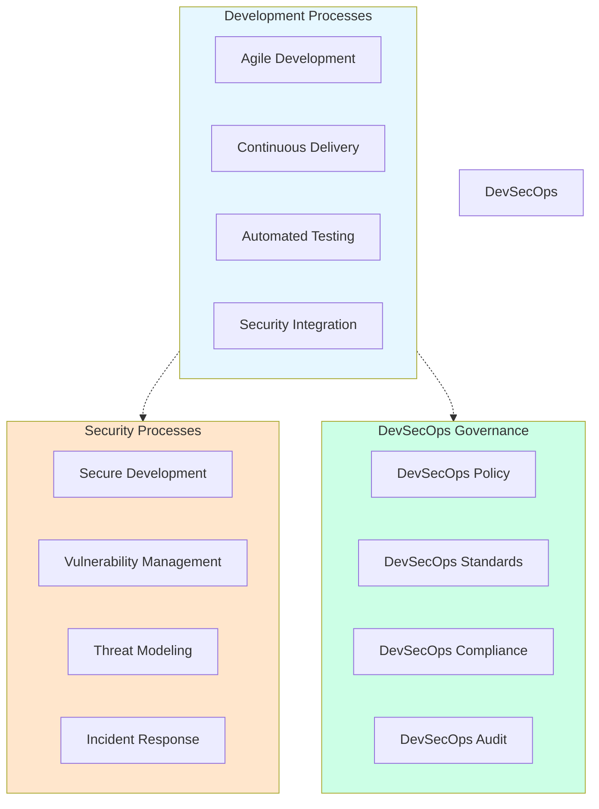
```mermaid
graph TB
    devsecops["DevSecOps"]
    
    subgraph development["Development Processes"]
        agile["Agile Development"]
        continuous_delivery["Continuous Delivery"]
        automated_testing["Automated Testing"]
        security_integration["Security Integration"]
    end
    
    subgraph security["Security Processes"]
        secure_development["Secure Development"]
        vulnerability_management["Vulnerability Management"]
        threat_modeling["Threat Modeling"]
        incident_response["Incident Response"]
    end
    
    subgraph governance["DevSecOps Governance"]
        policy["DevSecOps Policy"]
        standards["DevSecOps Standards"]
        compliance["DevSecOps Compliance"]
        audit["DevSecOps Audit"]
    end
    
    development -.-> security
    development -.-> governance
    
    style development fill:#e6f7ff
    style security fill:#ffe6cc
    style governance fill:#ccffe6
```

Developer Onboarding Reference Architecture

Reference architecture for developer onboarding:

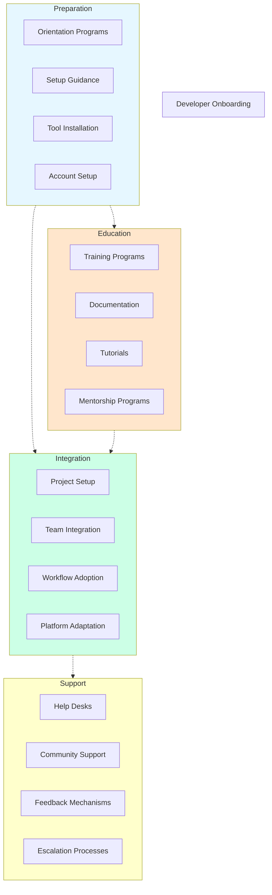
```mermaid
graph TB
    onboarding["Developer Onboarding"]
    
    subgraph preparation["Preparation"]
        orientation["Orientation Programs"]
        setup_guidance["Setup Guidance"]
        tool_installation["Tool Installation"]
        account_setup["Account Setup"]
    end
    
    subgraph education["Education"]
        training["Training Programs"]
        documentation["Documentation"]
        tutorials["Tutorials"]
        mentorship["Mentorship Programs"]
    end
    
    subgraph integration["Integration"]
        project_setup["Project Setup"]
        team_integration["Team Integration"]
        workflow_adoption["Workflow Adoption"]
        platform_adaptation["Platform Adaptation"]
    end
    
    subgraph support["Support"]
        help_desks["Help Desks"]
        communities["Community Support"]
        feedback["Feedback Mechanisms"]
        escalation["Escalation Processes"]
    end
    
    preparation -.-> education
    preparation -.-> integration
    education -.-> integration
    integration -.-> support
    
    style preparation fill:#e6f7ff
    style education fill:#ffe6cc
    style integration fill:#ccffe6
    style support fill:#ffffcc
```

Experience Governance Reference Architecture

Reference architecture for experience governance:

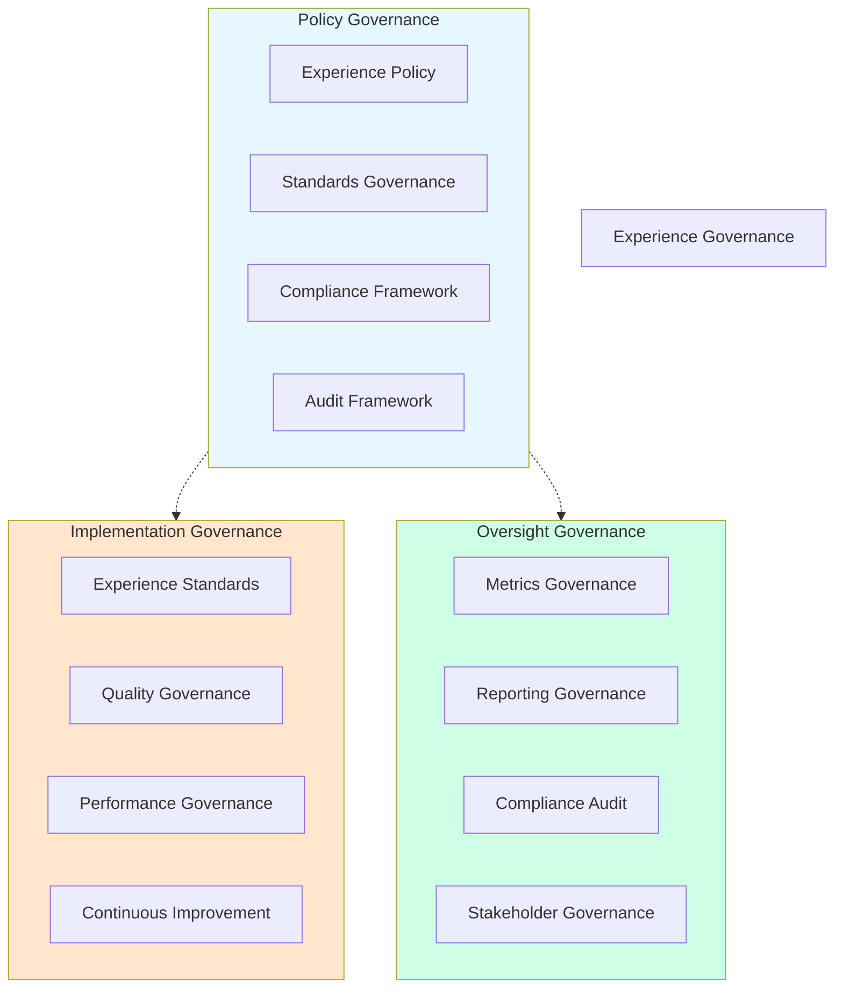
```mermaid
graph TB
    experience_governance["Experience Governance"]
    
    subgraph policy["Policy Governance"]
        experience_policy["Experience Policy"]
        standards_governance["Standards Governance"]
        compliance_framework["Compliance Framework"]
        audit_framework["Audit Framework"]
    end
    
    subgraph implementation["Implementation Governance"]
        experience_standards["Experience Standards"]
        quality_governance["Quality Governance"]
        performance_governance["Performance Governance"]
        continuous_improvement["Continuous Improvement"]
    end
    
    subgraph oversight["Oversight Governance"]
        metrics_governance["Metrics Governance"]
        reporting_governance["Reporting Governance"]
        compliance_audit["Compliance Audit"]
        stakeholder_governance["Stakeholder Governance"]
    end
    
    policy -.-> implementation
    policy -.-> oversight
    
    style policy fill:#e6f7ff
    style implementation fill:#ffe6cc
    style oversight fill:#ccffe6
```

Experience Metrics Reference Architecture

Reference architecture for experience metrics:

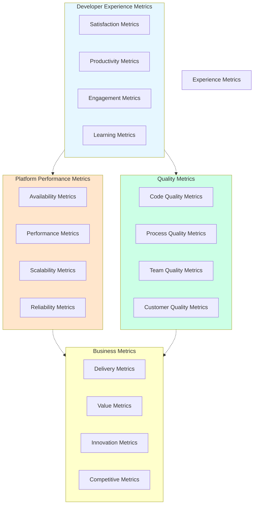
```mermaid
graph TB
    experience_metrics["Experience Metrics"]
    
    subgraph developer_experience["Developer Experience Metrics"]
        satisfaction_metrics["Satisfaction Metrics"]
        productivity_metrics["Productivity Metrics"]
        engagement_metrics["Engagement Metrics"]
        learning_metrics["Learning Metrics"]
    end
    
    subgraph platform_performance["Platform Performance Metrics"]
        availability_metrics["Availability Metrics"]
        performance_metrics["Performance Metrics"]
        scalability_metrics["Scalability Metrics"]
        reliability_metrics["Reliability Metrics"]
    end
    
    subgraph quality_metrics["Quality Metrics"]
        code_quality_metrics["Code Quality Metrics"]
        process_quality_metrics["Process Quality Metrics"]
        team_quality_metrics["Team Quality Metrics"]
        customer_quality_metrics["Customer Quality Metrics"]
    end
    
    subgraph business_metrics["Business Metrics"]
        delivery_metrics["Delivery Metrics"]
        value_metrics["Value Metrics"]
        innovation_metrics["Innovation Metrics"]
        competitive_metrics["Competitive Metrics"]
    end
    
    developer_experience -.-> platform_performance
    developer_experience -.-> quality_metrics
    platform_performance -.-> business_metrics
    quality_metrics -.-> business_metrics
    
    style developer_experience fill:#e6f7ff
    style platform_performance fill:#ffe6cc
    style quality_metrics fill:#ccffe6
    style business_metrics fill:#ffffcc
```

Platform Integration Reference Architecture

Reference architecture for platform integration:

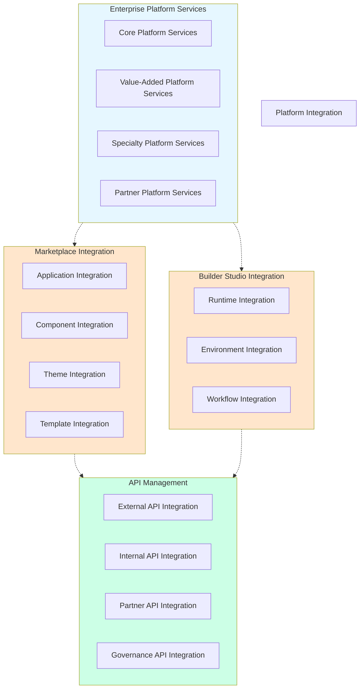
```mermaid
graph TB
    platform_integration["Platform Integration"]
    
    subgraph enterprise_platform["Enterprise Platform Services"]
        core_platform["Core Platform Services"]
        value_added_platform["Value-Added Platform Services"]
        specialty_platform["Specialty Platform Services"]
        partner_platform["Partner Platform Services"]
    end
    
    subgraph marketplace_integration["Marketplace Integration"]
        applications["Application Integration"]
        components["Component Integration"]
        themes["Theme Integration"]
        templates["Template Integration"]
    end
    
    subgraph builder_studio_integration["Builder Studio Integration"]
        runtime_integration["Runtime Integration"]
integration_environment["Environment Integration"]
        workflow_integration["Workflow Integration"]
    end
    
    subgraph api_management["API Management"]
        external_apis["External API Integration"]
        internal_apis["Internal API Integration"]
        partner_apis["Partner API Integration"]
        governance_apis["Governance API Integration"]
    end
    
    enterprise_platform -.-> marketplace_integration
    enterprise_platform -.-> builder_studio_integration
    marketplace_integration -.-> api_management
    builder_studio_integration -.-> api_management
    
    style enterprise_platform fill:#e6f7ff
    style marketplace_integration fill:#ffe6cc
    style builder_studio_integration fill:#ffe6cc
    style api_management fill:#ccffe6
```

AI Integration Reference Architecture

Reference architecture for AI integration:

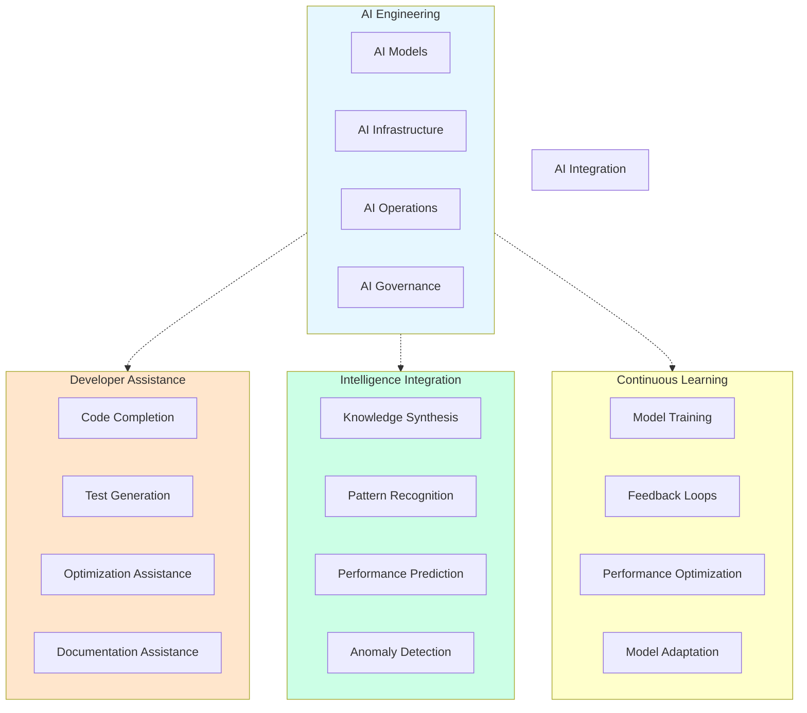
```mermaid
graph TB
    ai_integration["AI Integration"]
    
    subgraph ai_engineering["AI Engineering"]
        ai_models["AI Models"]
        ai_infrastructure["AI Infrastructure"]
        ai_operations["AI Operations"]
        ai_governance["AI Governance"]
    end
    
    subgraph developer_assistance["Developer Assistance"]
        code_completion["Code Completion"]
        test_generation["Test Generation"]
        optimization_assistance["Optimization Assistance"]
        documentation_assistance["Documentation Assistance"]
    end
    
    subgraph intelligence_integration["Intelligence Integration"]
        knowledge_synthesis["Knowledge Synthesis"]
        pattern_recognition["Pattern Recognition"]
        performance_prediction["Performance Prediction"]
        anomaly_detection["Anomaly Detection"]
    end
    
    subgraph continuous_learning["Continuous Learning"]
        model_training["Model Training"]
        feedback_loops["Feedback Loops"]
        performance_optimization["Performance Optimization"]
        adaptation["Model Adaptation"]
    end
    
    ai_engineering -.-> developer_assistance
    ai_engineering -.-> intelligence_integration
    ai_engineering -.-> continuous_learning
    
    style ai_engineering fill:#e6f7ff
    style developer_assistance fill:#ffe6cc
    style intelligence_integration fill:#ccffe6
    style continuous_learning fill:#ffffcc
```

Architecture Decision Management Reference Architecture

Reference architecture for architecture decision management:

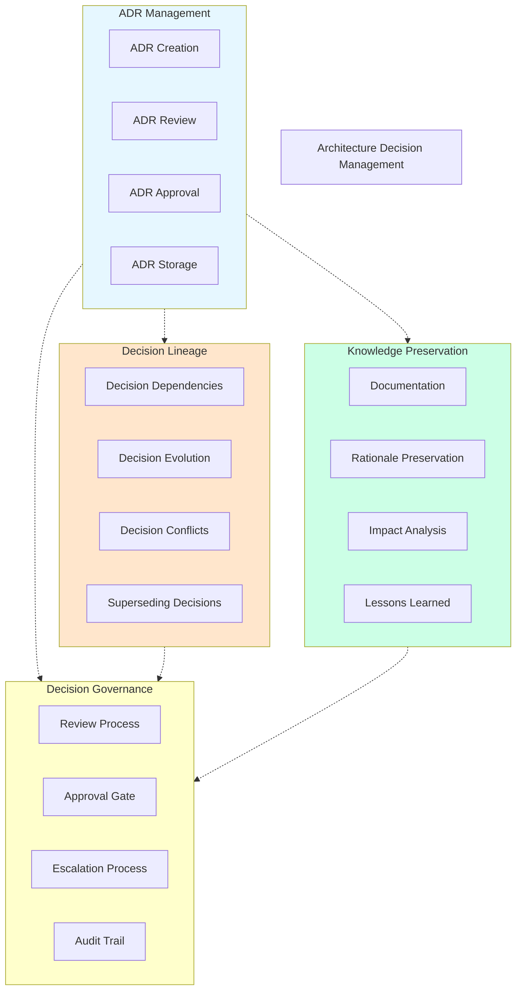
```mermaid
graph TB
    decision_management["Architecture Decision Management"]
    
    subgraph adr_management["ADR Management"]
        adr_creation["ADR Creation"]
        adr_review["ADR Review"]
        adr_approval["ADR Approval"]
        adr_storage["ADR Storage"]
    end
    
    subgraph decision_lineage["Decision Lineage"]
        dependencies["Decision Dependencies"]
        evolution["Decision Evolution"]
        conflicts["Decision Conflicts"]
        superseding["Superseding Decisions"]
    end
    
    subgraph knowledge_preservation["Knowledge Preservation"]
        documentation["Documentation"]
        rationale["Rationale Preservation"]
        impact_analysis["Impact Analysis"]
        lessons_learned["Lessons Learned"]
    end
    
    subgraph governance["Decision Governance"]
        review_process["Review Process"]
        approval_gate["Approval Gate"]
        escalation_process["Escalation Process"]
        audit_trail["Audit Trail"]
    end
    
    adr_management -.-> decision_lineage
    adr_management -.-> knowledge_preservation
    adr_management -.-> governance
    decision_lineage -.-> governance
    knowledge_preservation -.-> governance
    
    style adr_management fill:#e6f7ff
    style decision_lineage fill:#ffe6cc
    style knowledge_preservation fill:#ccffe6
    style governance fill:#ffffcc
```

Community and Collaboration Reference Architecture

Reference architecture for community and collaboration:

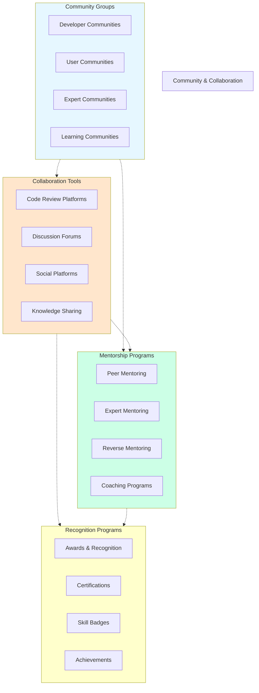
```mermaid
graph TB
    community["Community & Collaboration"]
    
    subgraph communities["Community Groups"]
        developer_communities["Developer Communities"]
        user_communities["User Communities"]
        expert_communities["Expert Communities"]
        learning_communities["Learning Communities"]
    end
    
    subgraph collaboration_tools["Collaboration Tools"]
        code_review_platforms["Code Review Platforms"]
        discussion_forums["Discussion Forums"]
        social_platforms["Social Platforms"]
        knowledge_sharing["Knowledge Sharing"]
    end
    
    subgraph mentorship["Mentorship Programs"]
        peer_mentoring["Peer Mentoring"]
        expert_mentoring["Expert Mentoring"]
        reverse_mentoring["Reverse Mentoring"]
        coaching["Coaching Programs"]
    end
    
    subgraph recognition["Recognition Programs"]
        awards["Awards & Recognition"]
        certifications["Certifications"]
        badges["Skill Badges"]
        achievements["Achievements"]
    end
    
    communities -.-> collaboration_tools
    communities -.-> mentorship
    collaboration_tools -.-> mentorship
    collaboration_tools -.-> recognition
    mentorship -.-> recognition
    
    style communities fill:#e6f7ff
    style collaboration_tools fill:#ffe6cc
    style mentorship fill:#ccffe6
    style recognition fill:#ffffcc
```

Experience Evolution Reference Architecture

Reference architecture for experience evolution:

```mermaid
graph TB
    experience_evolution["Experience Evolution"]
    
    subgraph continuous_improvement["Continuous Improvement"]
        feedback_loops["Feedback Loops"]
        lessons_learned["Lessons Learned"]
        process_optimization["Process Optimization"]
        technology_adoption["Technology Adoption"]
    end
    
    subgraph adaptation["Adaptation & Evolution"]
        needs_analysis["Needs Analysis"]
        trend_analysis["Trend Analysis"]
        competitive_analysis["Competitive Analysis"]
        scenario_planning["Scenario Planning"]
    end
    
    subgraph innovation["Innovation & Innovation"]
        experimentation["Experimentation"]
        prototyping["Prototyping"]
        pilot_programs["Pilot Programs"]
        innovation_incubation["Innovation Incubation"]
    end
    
    subgraph transformation["Transformation & Legacy"]
        migration["Legacy Migration"]
        modernization["Modernization"]
        retirement["Retirement Processes"]
        succession["Succession Planning"]
    end
    
    continuous_improvement -.-> adaptation
    continuous_improvement -.-> innovation
    innovation -.-> transformation
    
    style continuous_improvement fill:#e6f7ff
    style adaptation fill:#ffe6cc
    style innovation fill:#ccffe6
    style transformation fill:#ffffcc
```

---

## Cross References

* KB-088 Metadata Management Architecture
* KB-089 Knowledge Graph Architecture
* KB-152 Documentation Platform Architecture
* KB-153 Developer Portal Architecture
* KB-141 Developer Experience Platform Architecture
* KB-142 Software Development Lifecycle Architecture
* KB-143 Source Control & Repository Architecture
* KB-144 Branching & Release Strategy Architecture
* KB-145 Build & Artifact Management Architecture
* KB-146 CI/CD Pipeline Architecture
* KB-147 DevSecOps Architecture
* KB-148 Test Strategy & Quality Engineering Architecture
* KB-149 Development Environment Architecture
* KB-150 API Development Standards Architecture
* KB-151 SDK & Developer Toolkit Architecture
* KB-155 Engineering Observability Architecture
* KB-156 Engineering Metrics & Productivity Architecture
* KB-157 Engineering Knowledge Management Architecture
* KB-158 Engineering Governance Architecture
* KB-159 AI-Assisted Software Engineering Architecture
* KB-095 Integration Connector Architecture

---

## Mermaid Diagram Requirements

The document includes 10 required Mermaid diagrams:

1. **Enterprise Developer Experience Reference Architecture** — Comprehensive reference model for the complete DX platform ecosystem
2. **Developer Portal Reference Architecture** — Reference architecture for the developer portal with navigation, personalization, and integration
3. **Development Environment Reference Architecture** — Reference architecture for development environments with infrastructure, tooling, and collaboration
4. **CI/CD Pipeline Reference Architecture** — Reference architecture for CI/CD pipelines with source control, build process, deployment, and quality gates
5. **Build and Artifact Management Reference Architecture** — Reference architecture for build and artifact management with production, governance, and integration
6. **Source Control Reference Architecture** — Reference architecture for source control with version control, repository management, access control, and collaboration
7. **Branching and Release Strategy Reference Architecture** — Reference architecture for branching and release strategies with branching strategies, release management, and governance
8. **SDK and Toolkit Reference Architecture** — Reference architecture for SDKs and developer toolkits with packages, distribution, and integration
9. **Testing and Quality Reference Architecture** — Reference architecture for testing and quality assurance with test types, execution, and quality assurance
10. **Enterprise Developer Experience Reference Architecture** — Complete integration of all developer experience components

---

## Acceptance Criteria

The document shall:

* Define the canonical Developer Experience Reference Architecture
* Govern developer experience consistency, standardization, integration, and continuous improvement across the complete DX ecosystem
* Support enterprise-scale, AI-enhanced, vendor-independent developer experience
* Include all 10 required Mermaid diagrams
* Cross-reference related KB documents
* Contain no implementation guidance

---

## Completion Instructions

Upon completion:

1. Mark **KB-160** as **Completed**
2. Update the **Progress Registry**
3. Cross-reference all related specifications
4. **No further queuing required** - this completes the Developer Experience & Engineering Platform suite

---

## Critical DUKADESK Architectural Rule

**All developer experience processes within DUKADESK shall follow the canonical Developer Experience Reference Architecture, ensuring consistency, quality, and continuous improvement across the complete developer experience ecosystem. No application, Builder Studio module, Marketplace extension, AI Builder Agent, engineering team, platform service, or organizational unit shall establish independent developer experience processes outside the enterprise reference architecture, ensuring a single source of truth, enterprise-wide consistency, AI enhancement, continuous improvement, measurable outcomes, and long-term engineering excellence.**

(End of file - total 1685 lines)