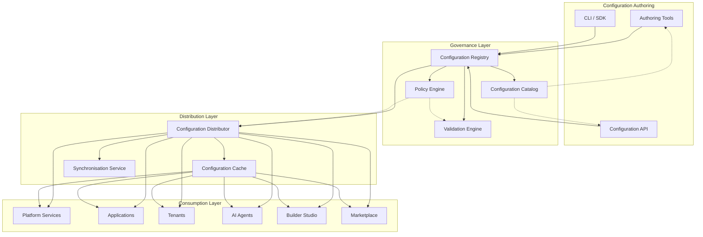
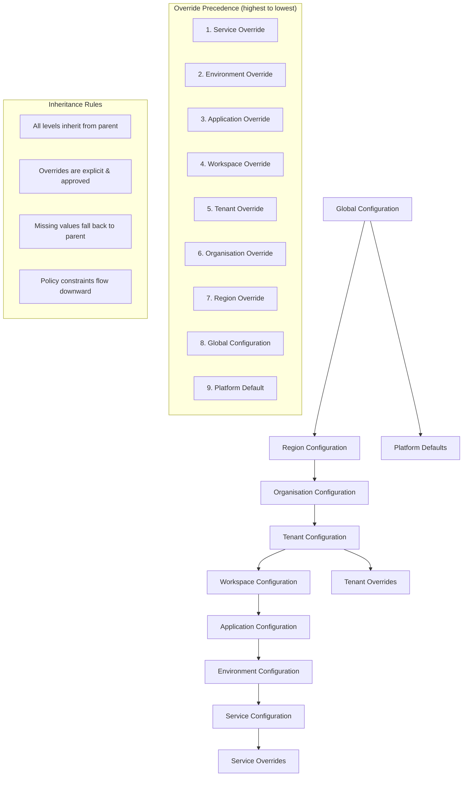
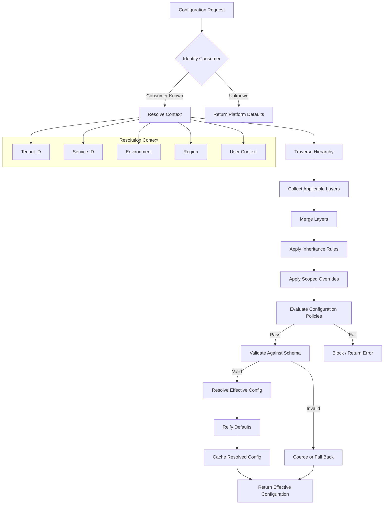
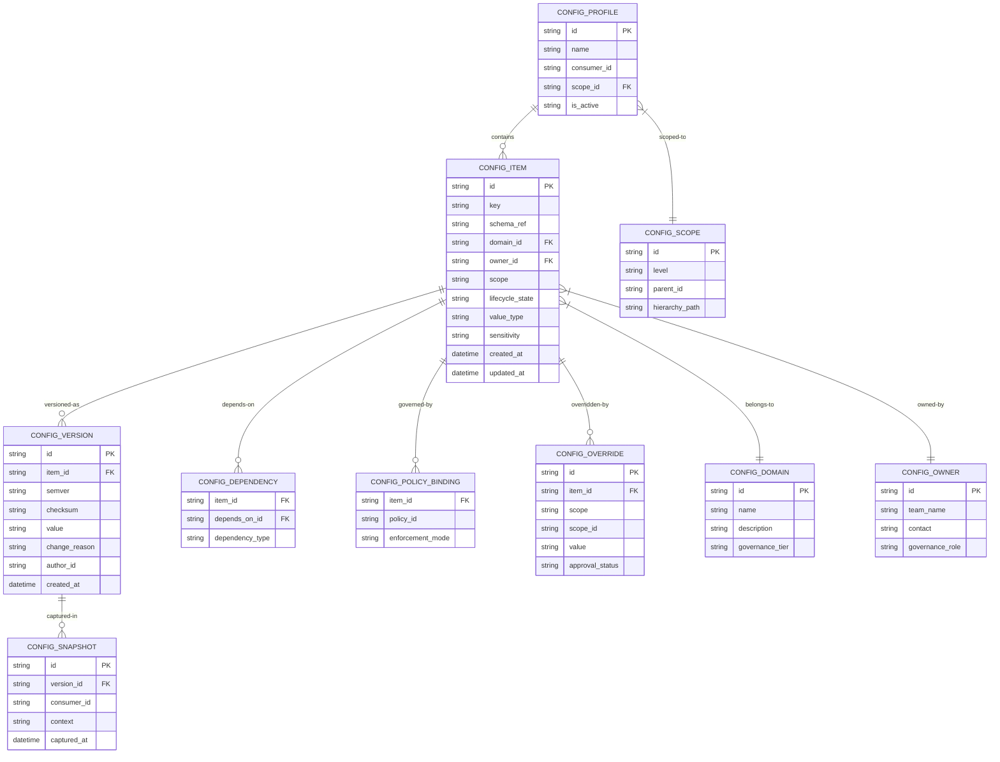
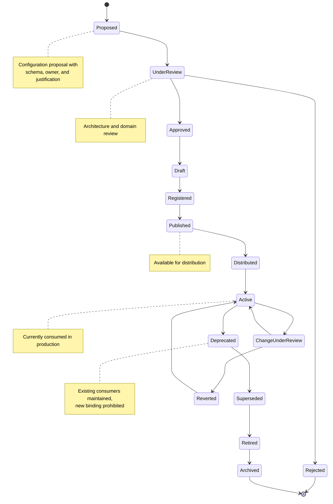
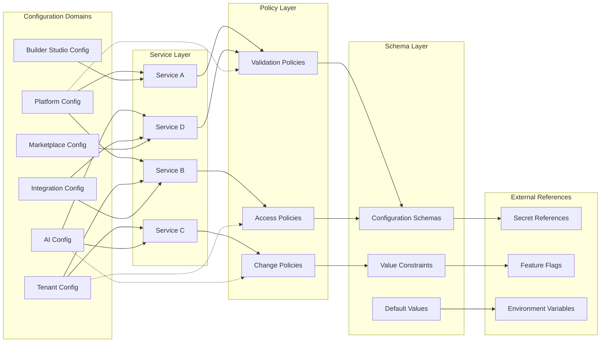
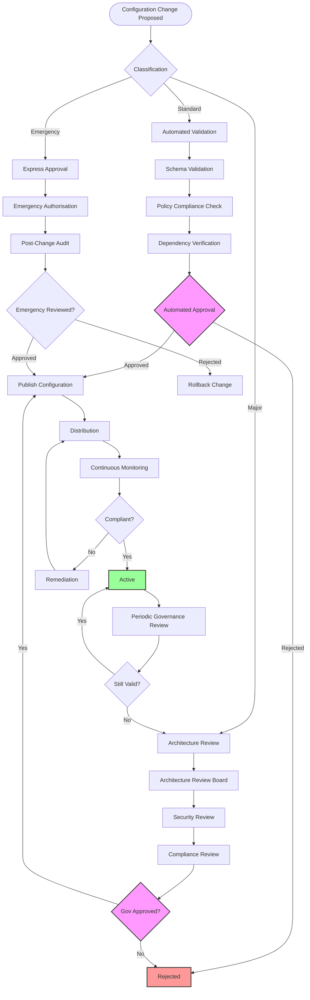
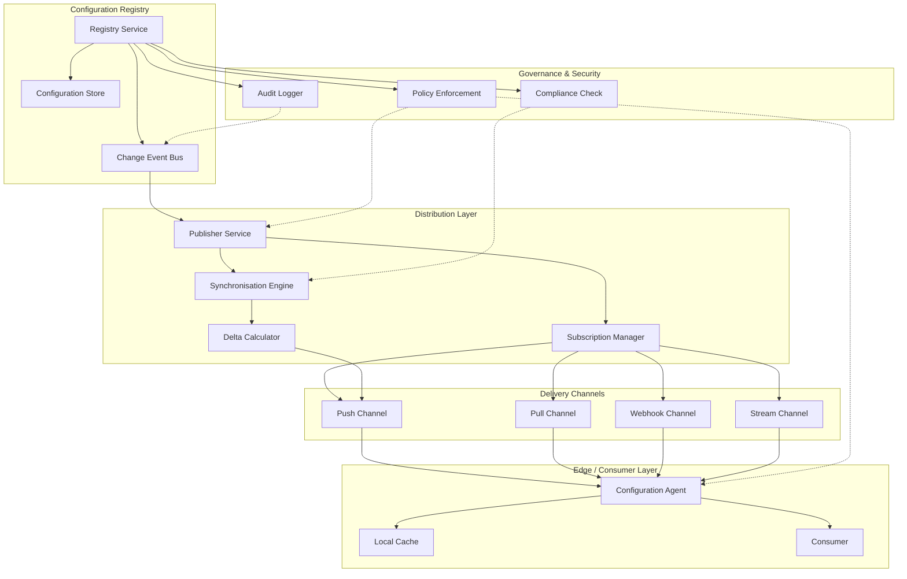
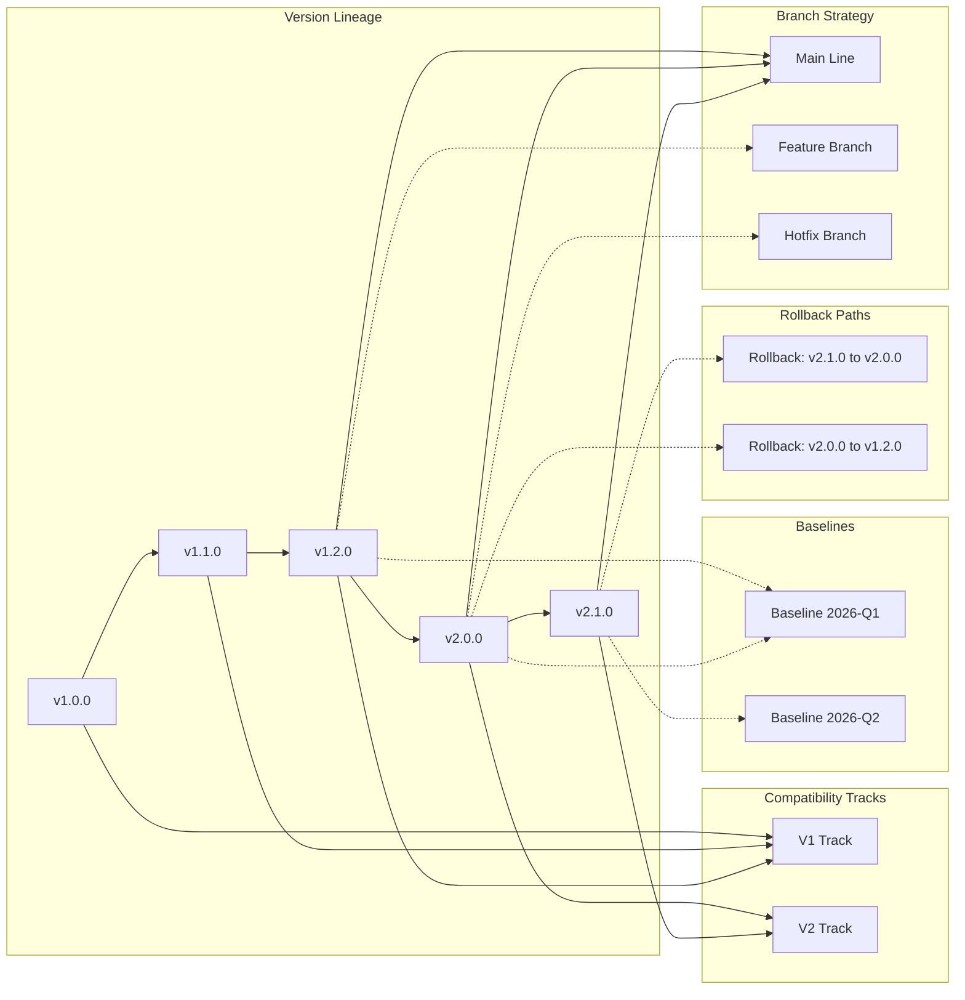
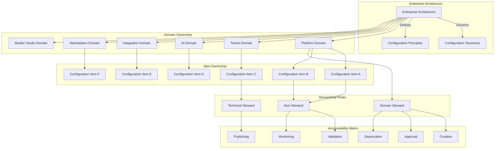

# KB-108 — Configuration Management Architecture

**Suite:** Enterprise Platform Services  
**Version:** 1.0  
**Status:** Approved Architecture  
**Classification:** Core Platform Service Architecture  
**Last Updated:** 2026-07-12

---

## Executive Summary

This document defines the enterprise architecture governing configuration as a shared platform capability within DUKADESK. The specification establishes a canonical configuration architecture that enables centralised governance while supporting distributed consumption across all DUKADESK domains.

Configuration is treated as enterprise data rather than application code, supporting governance, security, versioning, auditability, tenant isolation, and policy-driven evolution. The architecture defines how configuration is modelled, governed, versioned, distributed, secured, audited, and consumed by all platform services, applications, tenants, AI agents, Builder Studio modules, Marketplace assets, and runtime environments.

---

## Purpose

Define how DUKADESK creates, organises, governs, distributes, validates, consumes, versions, and retires configuration throughout the platform.

---

## Scope

### In Scope

- Enterprise configuration architecture
- Configuration domains
- Configuration hierarchy
- Configuration taxonomy
- Configuration ownership
- Configuration governance
- Configuration registry
- Configuration catalog
- Configuration lifecycle
- Configuration inheritance
- Configuration overrides
- Tenant configuration
- Environment configuration
- Platform configuration
- Runtime configuration
- Service configuration
- AI configuration
- Feature configuration
- Localisation configuration
- Configuration dependencies
- Configuration validation
- Configuration versioning
- Configuration auditing
- Configuration observability

### Out of Scope

- Infrastructure-as-Code
- CI/CD configuration
- Application implementation details
- Secrets management
- Feature flag implementation

*The above items are covered in separate Knowledge Base documents (see Cross References).*

---

## Architectural Principles

| # | Principle | Description |
|---|-----------|-------------|
| 1 | **Configuration as Data** | Configuration is enterprise data with its own governance, lifecycle, ownership, and quality requirements, distinct from application code. |
| 2 | **Central Governance** | Configuration schemas, policies, and lifecycle are governed centrally to ensure consistency, compliance, and auditability. |
| 3 | **Distributed Consumption** | While governed centrally, configuration is consumed locally by services, tenants, and runtimes with low-latency resolution. |
| 4 | **Policy-Driven Configuration** | Configuration behaviour, validation, access, and evolution are governed by declarative policies enforced at the configuration layer. |
| 5 | **Immutable Version History** | Every configuration change creates an immutable version record supporting audit, rollback, and lineage tracing. |
| 6 | **Least Privilege Access** | Configuration access is granted at the minimum scope and level required for the consumer role. |
| 7 | **Zero Trust** | No configuration consumer is implicitly trusted. Every read, write, and change is authenticated, authorised, and audited. |
| 8 | **Tenant Isolation** | Tenant configuration is strictly isolated. No tenant can access or influence another tenant's configuration. |
| 9 | **Vendor Independence** | Configuration models and schemas are provider-agnostic, enabling platform portability across infrastructure and service vendors. |
| 10 | **Technology Neutrality** | Configuration is expressed in technology-neutral formats, not tied to specific programming languages, frameworks, or tools. |
| 11 | **AI-Ready Configuration** | Configuration structures and metadata support AI agent consumption, semantic discovery, and autonomous governance. |
| 12 | **Observability by Design** | All configuration operations emit structured telemetry for audit, monitoring, drift detection, and lineage analysis. |
| 13 | **Single Source of Truth** | The Configuration Registry is the authoritative source for every governed configuration item. No duplicate or divergent sources are permitted. |

---

## Canonical Definitions

| Term | Definition |
|------|------------|
| **Configuration** | A set of structured, governable parameters that define the behaviour, appearance, or integration of a platform component, service, tenant, or runtime. |
| **Configuration Item** | An individual, addressable configuration unit with a defined schema, owner, version, and lifecycle. |
| **Configuration Domain** | A logical grouping of configuration items sharing a functional area (e.g., Platform, Tenant, AI, Integration). |
| **Configuration Registry** | The authoritative system of record for all governed configuration items, their metadata, versions, ownership, and lifecycle state. |
| **Configuration Catalog** | A discovery interface over the registry enabling search, classification, dependency analysis, and reuse of configuration items. |
| **Configuration Profile** | A named collection of configuration items and overrides scoped to a specific consumer, environment, or tenant context. |
| **Configuration Scope** | The boundary within which a configuration item is visible and applicable (e.g., global, tenant, service, environment). |
| **Configuration Layer** | A level in the configuration hierarchy that defines inheritance and override precedence. |
| **Configuration Override** | A scoped deviation from an inherited configuration value, subject to policy and approval. |
| **Configuration Inheritance** | The mechanism by which configuration values propagate from broader scopes to narrower scopes unless explicitly overridden. |
| **Configuration Version** | An immutable, timestamped, and checksummed snapshot of a configuration item at a point in time. |
| **Effective Configuration** | The resolved configuration for a given consumer after applying inheritance, overrides, policies, and defaults. |
| **Configuration Baseline** | A known-good, reviewed, and approved set of configuration versions serving as a reference point for audits and rollbacks. |
| **Configuration Owner** | The entity (team or individual) responsible for a configuration item's schema, lifecycle, and governance. |
| **Configuration Consumer** | A platform service, application, tenant, AI agent, or runtime that reads or depends on configuration. |
| **Configuration Policy** | A declarative rule governing configuration values, validation, access, change approval, or distribution. |
| **Configuration Dependency** | A relationship where a configuration item references or relies on another configuration item, schema, or service. |
| **Configuration Lifecycle** | The progression of a configuration item through defined states from proposal through retirement. |
| **Configuration Drift** | The divergence between the intended (registered) configuration and the actual (deployed) configuration of a consumer. |
| **Configuration Snapshot** | A point-in-time capture of effective configuration for a consumer, used for debugging, audits, and recovery. |

---

## Architecture

### 1. Enterprise Configuration Architecture

The enterprise configuration architecture defines a centralised governance layer with distributed consumption across all DUKADESK domains. Configuration flows from authoring through validation, registration, and distribution to consumers.

### 2. Configuration Hierarchy

Configuration is organised in a strict hierarchy that defines inheritance paths and override precedence. Higher-level configurations provide defaults that propagate downward unless overridden at lower levels.

### 3. Configuration Resolution Flow

Effective configuration is resolved at consumption time by traversing the hierarchy, applying inheritance, evaluating overrides, enforcing policies, and validating against schemas.

### 4. Configuration Registry Model

The Configuration Registry is the authoritative system of record for all governed configuration. It stores configuration items, their schemas, versions, ownership, policies, dependencies, and lifecycle metadata.

### 5. Configuration Lifecycle

Every configuration item progresses through a defined lifecycle with gated transitions ensuring governance, validation, and consumer notification at every stage.

### 6. Configuration Dependency Map

Configuration items exist within a dependency graph spanning domains, services, policies, schemas, and external references. The dependency model enables impact analysis, validation ordering, and lifecycle coordination.

### 7. Configuration Governance Structure

Configuration governance is enforced through a structured workflow encompassing domain ownership, approval gates, policy evaluation, compliance validation, and audit tracking.

### 8. Configuration Distribution Architecture

Configuration distribution ensures governed, secure, and low-latency propagation of configuration from the registry to all consuming services, tenants, and runtimes.

### 9. Configuration Version Evolution

Configuration versions evolve through semantic versioning with support for parallel branches, compatibility tracking, rollback, and baseline management.

### 10. Configuration Ownership Model

Every configuration item has a defined owner, domain assignment, and governance tier. Ownership spans multiple levels from domain-level stewardship to item-level accountability.

---

## Lifecycle

| Phase | Description | Gates |
|-------|-------------|-------|
| **Proposal** | Domain owner submits configuration proposal with schema, default values, and business justification. | Proposal completeness check |
| **Creation** | Configuration item is created within its domain with assigned owner and initial schema. | Schema validation |
| **Review** | Architecture and domain review evaluate alignment with taxonomy, principles, and portfolio. | Architecture review sign-off |
| **Approval** | Configuration change is approved through the governance workflow appropriate to its classification. | Governance approval |
| **Registration** | Configuration item is registered in the Configuration Registry with full metadata. | Registry entry verified |
| **Publication** | Configuration is published and made available for distribution to consumers. | Publication validation |
| **Distribution** | Configuration is propagated to consumers via the distribution layer. | Distribution confirmation |
| **Consumption** | Consumers resolve and use the effective configuration at runtime. | Consumer health check |
| **Monitoring** | Continuous drift detection, usage monitoring, and compliance verification. | Policy compliance |
| **Version Evolution** | Configuration versions evolve through semantic versioning with impact analysis. | Version governance |
| **Change Review** | Material changes follow the governance workflow with appropriate approval gates. | Change approval |
| **Deprecation** | Configuration is marked deprecated; new consumer binding is prohibited; existing consumers notified. | Deprecation notice |
| **Retirement** | Configuration is removed from distribution; consumers are migrated to replacement. | Migration completion |
| **Archive** | Configuration data is archived for historical reference and audit compliance. | Archive completion |

---

## Governance

| Domain | Governance Mechanism | Responsible Body |
|--------|---------------------|------------------|
| **Configuration Ownership** | Every configuration item must have a registered domain owner and item steward. | Enterprise Architecture |
| **Domain Ownership** | Each configuration domain has a designated domain steward accountable for taxonomy adherence. | Architecture Review Board |
| **Approval Workflows** | Configuration changes follow tiered approval based on classification (standard, major, emergency). | Change Advisory Board |
| **Change Governance** | All configuration changes are versioned, reviewed, and audited. Emergency changes require post-change review. | Platform Engineering |
| **Policy Governance** | Configuration policies are maintained, versioned, and enforced by the policy engine. | Integration Architecture |
| **Version Governance** | Semantic versioning is enforced. Breaking changes require consumer notification and migration coordination. | Platform Engineering |
| **Compliance Validation** | Configuration is validated against regulatory, security, and privacy compliance requirements. | Compliance |
| **Architecture Review** | New configuration domains and major changes undergo architecture review. | Architecture Review Board |
| **Audit Governance** | All configuration operations are audited with immutable audit trail for governance and compliance. | Audit Teams |
| **Configuration Review Cycles** | Periodic review identifies stale, unused, or non-compliant configuration items for remediation or retirement. | Enterprise Architecture |

---

## Responsibilities

| Role | Responsibilities |
|------|-----------------|
| **Enterprise Architecture** | Define configuration standards, taxonomy, hierarchy, principles; govern domains; conduct architecture reviews. |
| **Platform Engineering** | Build and maintain Configuration Registry, distribution layer, validation engine, policy engine, and observability tooling. |
| **Domain Owners** | Own configuration domains; maintain domain taxonomy; review and approve domain configuration changes. |
| **Service Owners** | Define service-specific configuration schemas; manage service configuration items; monitor effective configuration. |
| **Security** | Perform security reviews of configuration schemas and values; define sensitive configuration handling; audit access. |
| **Compliance** | Conduct compliance reviews; define regulatory validation rules; verify configuration adherence to legal requirements. |
| **Operations** | Monitor configuration distribution, drift, and health; respond to configuration incidents; manage capacity. |
| **Product Teams** | Propose configuration needs; define feature configuration; manage configuration for product capabilities. |
| **Tenant Administrators** | Manage tenant-level configuration overrides; configure tenant profiles; monitor tenant configuration health. |
| **AI Governance Teams** | Govern AI configuration models; ensure AI configuration adheres to ethics and safety policies; audit AI behaviour configurations. |

---

## Security

| Control Area | Architecture |
|-------------|--------------|
| **Configuration Integrity** | Configuration values are checksummed at every version. Tampering is detectable through cryptographic verification. |
| **Configuration Authorisation** | Every read and write operation is authorised against the consumer identity, scope, and role. |
| **Least Privilege** | Configuration access is scoped to the minimum required hierarchy level and domain. Tenants cannot access global or cross-tenant configuration. |
| **Tenant Isolation** | Tenant configuration is strictly partitioned. The resolution engine enforces tenant boundaries at every layer. |
| **Zero Trust Validation** | No consumer, service, or tool is implicitly trusted. Every configuration operation requires authentication, authorisation, and audit. |
| **Secure Distribution** | Configuration is distributed over encrypted channels. In-transit and at-rest encryption is enforced for all configuration data. |
| **Tamper Protection** | Configuration values are signed at publication. Consumers verify signatures before applying configuration updates. |
| **Configuration Auditability** | Every configuration change, read, and resolution is logged with consumer identity, timestamp, and context. |
| **Configuration Provenance** | The full lineage of every configuration value is traceable through immutable version history to its origin and author. |
| **Policy Enforcement** | Security policies are evaluated at write, publish, distribution, and consumption time. Violations block the operation and trigger escalation. |

---

## Privacy

| Domain | Architecture |
|--------|--------------|
| **Tenant Privacy** | Tenant configuration is isolated at the data layer. No cross-tenant access is possible through resolution, search, or distribution. |
| **Data Minimisation** | Configuration items collect and store only the data necessary for their governance purpose. Sensitivity classifications determine retention. |
| **Regional Governance** | Configuration distribution respects regional boundaries. Regional configuration instances remain within their geographic jurisdiction. |
| **Regulatory Compliance** | Configuration handling regulated data (PII, financial, health) is tagged with compliance markers and subject to corresponding policy enforcement. |
| **Configuration Ownership** | Configuration data remains the property of the owning domain and tenant. Configuration is not repurposed without explicit governance approval. |
| **Privacy-Aware Distribution** | The distribution layer considers privacy constraints when propagating configuration, filtering sensitive values per consumer entitlement. |
| **Cross-Border Governance** | Configuration that crosses geographic boundaries is explicitly classified and subject to data transfer compliance review. |
| **Audit Retention** | Configuration audit logs are retained per regulatory requirements with privacy-preserving anonymisation where appropriate. |

---

## Performance

| Consideration | Architectural Approach |
|---------------|----------------------|
| **Configuration Scalability** | The registry and distribution layer scale horizontally. Configuration reads are horizontally partitioned by scope and domain. |
| **Global Distribution** | Configuration is distributed to regional edge caches. Consumers resolve from the nearest cache with registry fallback. |
| **Low-Latency Resolution** | Effective configuration is cached at the consumer side with TTL-based invalidation. Resolution typically completes in sub-millisecond. |
| **Enterprise-Scale Consumption** | The architecture supports millions of configuration items, thousands of consumers, and hundreds of thousands of resolutions per second. |
| **High Availability** | The Configuration Registry is deployed across multiple availability zones. Distribution is resilient to regional failures. |
| **Efficient Version Management** | Version storage uses delta compression. Snapshots are materialised on demand. Retention policies balance history depth with storage cost. |
| **Configuration Caching Strategy** | Multi-level caching (edge, consumer, registry) with cache-aside pattern. Cache invalidation is event-driven through the change event bus. |
| **Resilience** | Consumers operate with locally cached configuration during registry or distribution outages. Stale configuration is allowed with TTL extension during disruption. |

---

## Observability

| Domain | Architecture |
|--------|--------------|
| **Configuration Health** | Registry health, distribution latency, cache hit rates, and resolution success rates are continuously monitored. |
| **Configuration Usage** | Usage metrics track configuration reads, write frequency, consumer count, and resolution patterns per configuration item. |
| **Configuration Lineage** | Full lineage tracing shows the provenance, change history, and audit trail for every configuration value. |
| **Drift Detection** | Periodic reconciliation compares effective (deployed) configuration against registered (intended) configuration. Drift is alerted and logged. |
| **Distribution Metrics** | Distribution latency, coverage, success rate, and channel performance are tracked per region, domain, and consumer group. |
| **Version Metrics** | Version adoption rates, rollback frequency, and breaking change impact are measured across the consumer base. |
| **Dependency Visibility** | The configuration dependency graph is rendered as a live view showing inter-item dependencies, impact paths, and health status. |
| **Audit Dashboards** | Role-specific dashboards expose configuration changes, approvals, access patterns, and compliance status. |
| **Governance Reporting** | Periodic governance reports summarise configuration portfolio health, ownership coverage, policy compliance, and lifecycle status. |
| **Change Analytics** | Change frequency, approval cycle times, classification distribution, and emergency change trends are analysed for process improvement. |

---

## Failure Scenarios

| Scenario | Architectural Response |
|----------|-----------------------|
| **Configuration Conflicts** | Conflict detection during registration identifies overlapping scopes or keys. Resolution requires explicit governance override. |
| **Invalid Inheritance** | Inheritance cycles are detected and blocked at registration. Circular references trigger validation failure and alerting. |
| **Override Conflicts** | Conflicting overrides at the same hierarchy level are detected at write time. Governance workflow determines precedence. |
| **Version Incompatibility** | Schema version mismatches between configuration and consumer are detected at resolution. Consumer is alerted to upgrade or pin compatible version. |
| **Missing Configuration** | Resolution falls back to the nearest populated ancestor. Missing required configuration triggers alert and incident. |
| **Distribution Failure** | Consumers continue operating with cached configuration. Distribution retries with exponential backoff. Persistent failure escalates to operations. |
| **Configuration Drift** | Drift detection alerts the configuration owner. Automated remediation attempts to re-publish the intended configuration. |
| **Unauthorised Changes** | Authorisation failure blocks the write operation. The attempt is logged and escalated to security. |
| **Tenant Isolation Breach** | Cross-tenant access attempts are blocked at the authorisation layer. The incident is logged, audited, and escalated immediately. |
| **Dependency Inconsistency** | Missing or incompatible dependencies are reported during validation. Registration and publication are blocked until resolved. |
| **Rollback Failure** | Rollback to a previous version fails due to schema incompatibility. A new version with reverted values is created as an alternative. |
| **Registry Corruption** | Immutable version history prevents corruption of existing data. Corrupted index state is recovered from replicated store. |

---

## Anti-Patterns

| Anti-Pattern | Prohibited Because | Enforced By |
|--------------|-------------------|-------------|
| **Hardcoded Configuration** | Bypasses governance, prevents runtime changes, creates deployment coupling, and embeds configuration in code. | Code review; static analysis; consumer-side enforcement |
| **Duplicate Configuration** | Fragments governance, creates inconsistency, and increases maintenance burden. | Registry deduplication checks |
| **Application-Owned Platform Configuration** | Platform configuration must be owned by platform domains, not individual applications. | Domain ownership model |
| **Hidden Configuration** | Configuration not registered in the registry is invisible to governance, audit, and discovery. | Registry mandatory check |
| **Unversioned Configuration** | Prevents rollback, audit, and lineage tracing; creates risk of unrecoverable changes. | Registry versioning enforcement |
| **Manual Configuration Synchronisation** | Introduces human error, inconsistency, and audit gaps. | Automated distribution layer |
| **Unapproved Configuration Changes** | Circumvents governance, security, and compliance validation. | Authorisation enforcement |
| **Configuration Sprawl** | Proliferation of ungoverned configuration items increases complexity and risk. | Domain governance; periodic review |
| **Environment-Specific Logic in Code** | Embeds environment knowledge in application logic, reducing portability and increasing deployment risk. | Architecture review; static analysis |
| **Configuration Without Ownership** | Orphaned configuration cannot be governed, reviewed, or retired. | Registry ownership enforcement |

---

## Future Evolution

| Evolution Path | Architectural Preparation |
|---------------|--------------------------|
| **AI-Assisted Configuration Optimisation** | Configuration schemas and telemetry are structured to enable ML-driven value recommendations, anomaly detection, and optimisation. |
| **Autonomous Configuration Governance** | Policy engine evolves to support automated approval for low-risk changes, AI-driven policy recommendation, and self-service governance. |
| **Intelligent Conflict Resolution** | Conflict resolution evolves from manual override to AI-suggested resolution with automated impact analysis. |
| **Dynamic Policy-Driven Configuration** | Configuration values can reference dynamic policy evaluation results, enabling context-dependent configuration resolution. |
| **Predictive Configuration Validation** | Validation engine analyses historical change patterns to predict and prevent potential configuration failures before deployment. |
| **Self-Healing Configuration Ecosystems** | Automated drift remediation, dependency repair, and configuration recovery without human intervention. |
| **Semantic Configuration Discovery** | Registry supports natural language and semantic search over configuration items, enabling AI agent-driven discovery and binding. |
| **Adaptive Configuration Orchestration** | Configuration distribution adapts to consumer load patterns, network conditions, and operational context. |

---

## Cross References

| Document ID | Title | Relation |
|-------------|-------|----------|
| **KB-107** | Enterprise Platform Services Overview Architecture | Defines the platform services context within which configuration operates. |
| **KB-109** | Feature Flag & Feature Management Architecture | Defines feature-specific configuration that is governed by this configuration architecture. |
| **KB-112** | Scheduling & Job Orchestration Architecture | Defines scheduling configuration governed by this architecture. |
| **KB-113** | Workflow Orchestration Architecture | Defines workflow configuration governed by this architecture. |
| **KB-114** | Business Rules Engine Architecture | Defines business rule configuration governed by this architecture. |
| **KB-124** | Policy Management Architecture | Defines the policy framework enforced by the configuration policy engine. |
| **KB-127** | Digital Asset Management Architecture | Defines asset configuration governed by this architecture. |
| **KB-138** | Platform Automation Architecture | Defines automation configuration governed by this architecture. |
| **KB-140** | Enterprise Platform Services Reference Architecture | Defines the overarching reference architecture for enterprise platform services. |

---

## Acceptance Criteria

- [x] Defines enterprise Configuration Management architecture.
- [x] Treats configuration as a governed enterprise asset.
- [x] Defines hierarchy, inheritance, overrides, and versioning.
- [x] Supports enterprise-scale, multi-tenant, AI-ready operations.
- [x] Defines governance, ownership, lifecycle, and observability.
- [x] Includes all 10 required Mermaid diagrams.
- [x] Cross-references related Knowledge Base documents.
- [x] Contains no implementation guidance.

---

## Completion Instructions

1. **Mark KB-108 as Completed** — This document constitutes the completed architecture specification.
2. **Update the Progress Registry** — Record KB-108 as Approved Architecture in the Knowledge Base registry.
3. **Cross-Reference Related Documents** — Ensure KB-107 through KB-140 reference this document.
4. **Queue Next Assignment** — KB-109 – Feature Flag & Feature Management Architecture is the next builder assignment.

---

## Critical DUKADESK Architectural Rule

> **All platform configuration within DUKADESK shall be governed as a centralised enterprise asset with canonical ownership, versioning, lifecycle management, inheritance, and policy enforcement. No application, service, tenant, runtime, or AI component shall maintain unmanaged or hardcoded configuration, ensuring consistency, security, auditability, and enterprise-wide operational integrity.**
