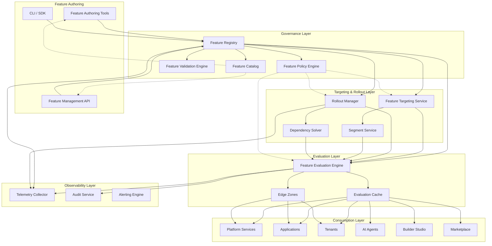
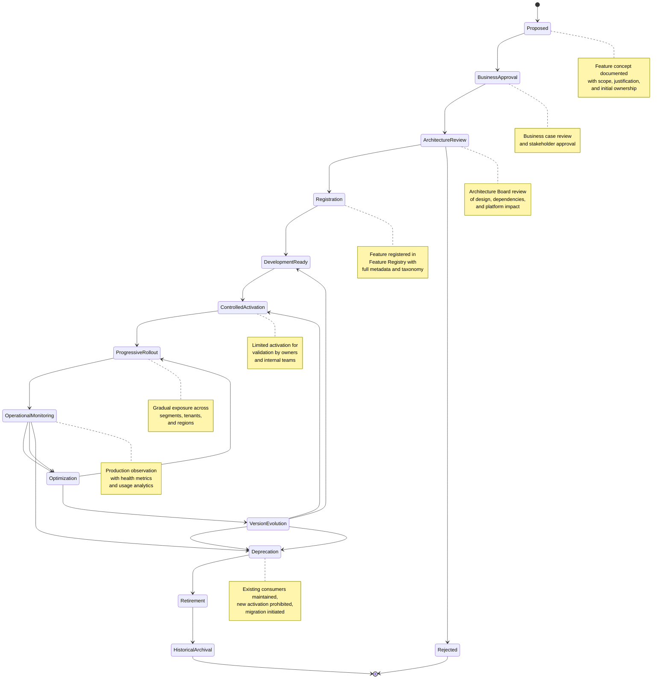
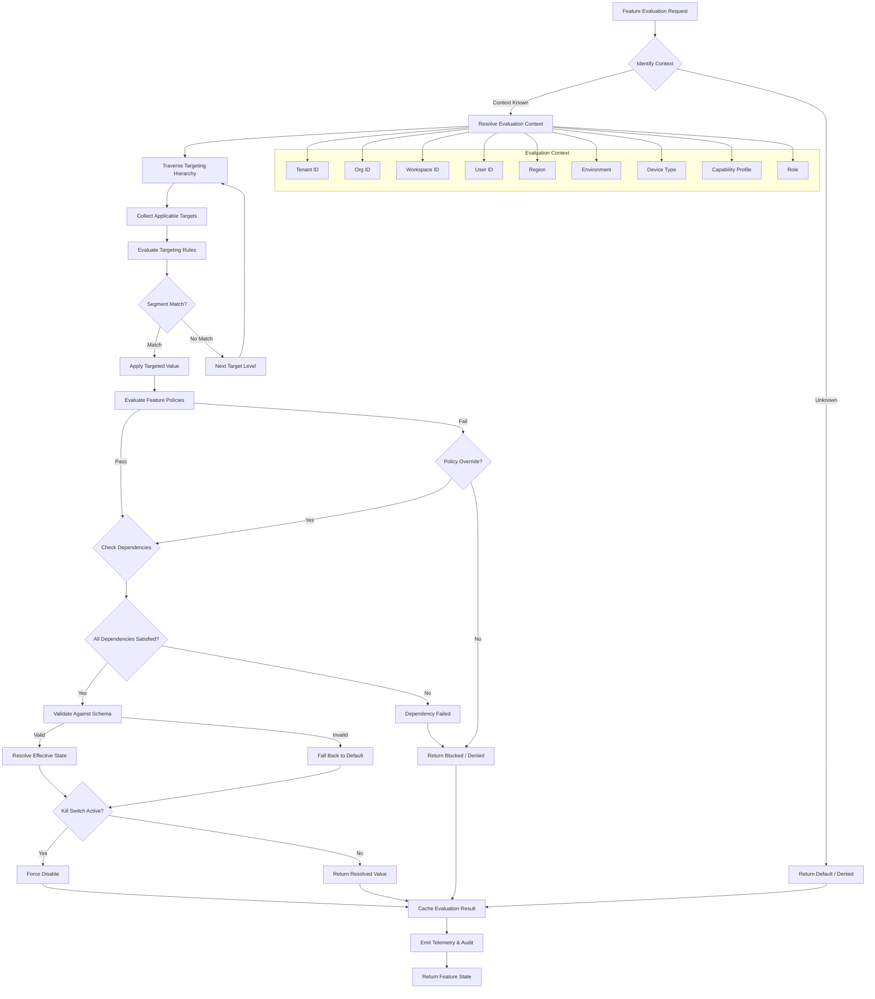
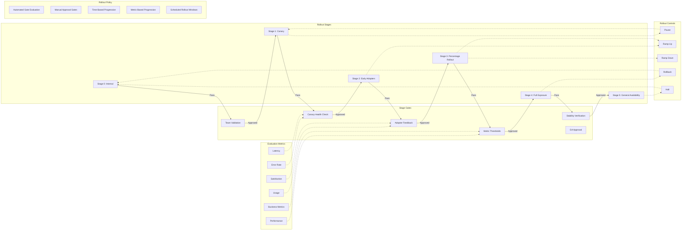
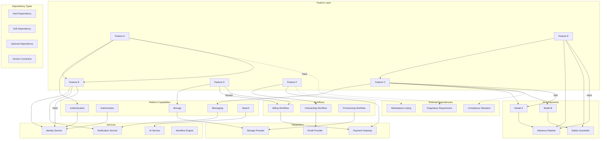
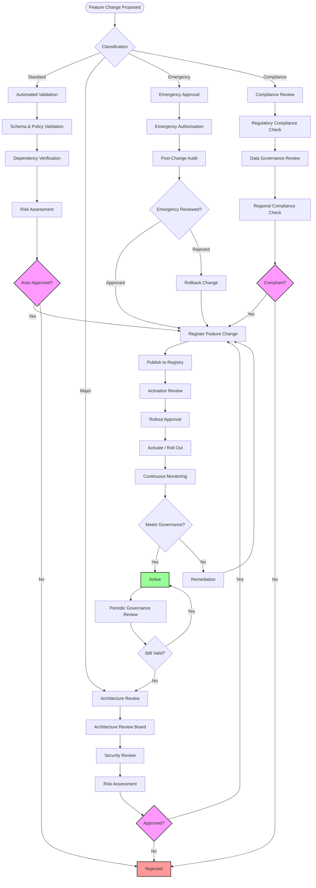
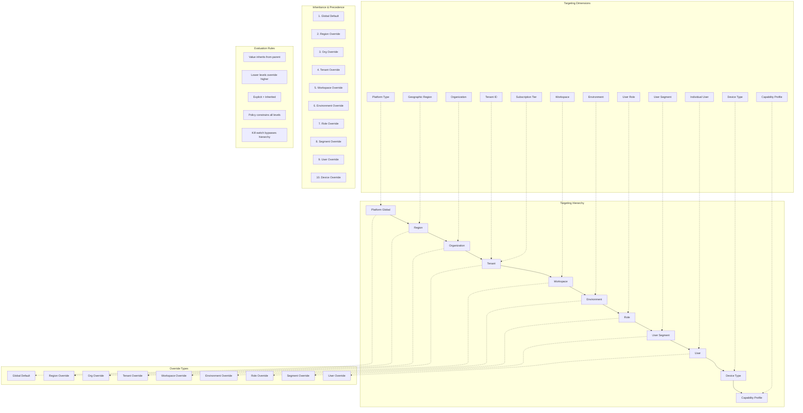
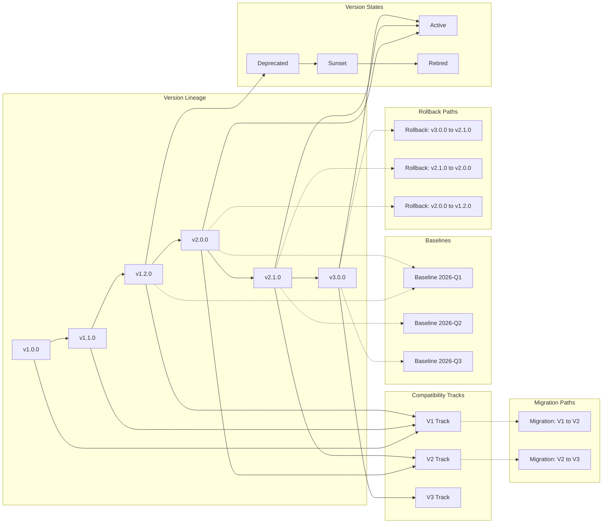

# KB-109 — Feature Flag & Feature Management Architecture

**Suite:** Enterprise Platform Services  
**Version:** 1.0  
**Status:** Approved Architecture  
**Classification:** Core Platform Service Architecture  
**Last Updated:** 2026-07-12

---

## Executive Summary

This document defines the enterprise architecture governing feature management as a shared platform capability within DUKADESK. The specification establishes a canonical architecture for controlling the availability, visibility, rollout, governance, and retirement of platform capabilities without coupling feature control to applications or deployment mechanisms.

Feature management shall support progressive delivery, tenant-specific enablement, AI-driven capabilities, operational controls, experimentation, and enterprise governance while remaining vendor and technology independent.

---

## Purpose

Define how DUKADESK manages the lifecycle of features from proposal through retirement, enabling controlled activation, governance, experimentation, and operational flexibility across the platform.

---

## Scope

### In Scope

- Feature management architecture
- Feature flag architecture
- Feature registry
- Feature catalog
- Feature taxonomy
- Feature ownership
- Feature lifecycle
- Feature governance
- Feature rollout strategy
- Progressive delivery
- Feature targeting
- Tenant feature management
- Organization feature management
- User segment targeting
- Regional enablement
- Environment enablement
- AI feature control
- Operational feature controls
- Kill switches
- Feature dependencies
- Feature version compatibility
- Feature auditing
- Feature observability

### Out of Scope

- Deployment pipelines
- CI/CD implementation
- Runtime implementation
- Business rules implementation
- Experimentation implementation details

*The above items are covered in separate Knowledge Base documents (see Cross References).*

---

## Architectural Principles

| # | Principle | Description |
|---|-----------|-------------|
| 1 | **Features as Governed Assets** | Every feature is a governed enterprise asset with defined ownership, lifecycle, policies, and audit trail from proposal through retirement. |
| 2 | **Decoupled Deployment and Release** | Feature activation, rollout, and retirement are independent of deployment cycles. Features can be released without deployment and deployed without release. |
| 3 | **Progressive Delivery** | Features are exposed incrementally to controlled audiences, enabling safe validation, rollback, and measured expansion. |
| 4 | **Policy-Driven Activation** | Feature state is determined by declarative policies evaluated against context, hierarchy, and targeting rules — not by application logic. |
| 5 | **Zero Trust** | No consumer, service, or tenant is implicitly trusted. Every feature state evaluation is authenticated, authorised, and audited. |
| 6 | **Tenant Isolation** | Feature enablement and targeting are strictly isolated per tenant. No tenant can observe or influence another tenant's feature state. |
| 7 | **Vendor Independence** | Feature models, policies, and evaluations are provider-agnostic, enabling platform portability across infrastructure and service vendors. |
| 8 | **Technology Neutrality** | Feature definitions, targeting rules, and policies are expressed in technology-neutral formats, not tied to specific languages, frameworks, or tools. |
| 9 | **AI-Ready Feature Governance** | Feature structures, metadata, and evaluation outputs support AI agent consumption, semantic discovery, and autonomous governance supervision. |
| 10 | **Observability by Design** | All feature evaluations, state changes, rollout progress, and targeting decisions emit structured telemetry for governance, audit, and operational insight. |
| 11 | **Auditability by Default** | Every feature state transition, targeting decision, rollout change, and policy evaluation is recorded in an immutable audit trail. |
| 12 | **Enterprise Scalability** | The architecture supports millions of features, thousands of tenants, billions of evaluations per day, and global distribution with sub-millisecond resolution latency. |

---

## Canonical Definitions

| Term | Definition |
|------|------------|
| **Feature** | A distinct, governable platform capability with defined behaviour, ownership, lifecycle, and visibility that can be independently activated, targeted, and rolled out. |
| **Feature Flag** | A named, typed, and versioned control point that determines whether a feature is enabled or disabled for a given evaluation context. |
| **Feature Toggle** | Synonymous with Feature Flag; a mechanism for switching feature behaviour without code changes or deployment. |
| **Feature Registry** | The authoritative system of record for all governed features, their flags, metadata, ownership, lifecycle state, dependencies, and version history. |
| **Feature Catalog** | A discovery and classification interface over the Feature Registry enabling search, taxonomy browsing, dependency analysis, ownership lookup, and reuse assessment. |
| **Feature Policy** | A declarative rule governing feature activation, targeting constraints, rollout pace, approval requirements, or retirement conditions. |
| **Feature Target** | A specific scope (e.g., tenant, organization, user segment, region, environment) to which a feature flag value applies. |
| **Feature Rollout** | The progressive activation of a feature across a defined population, governed by a rollout plan with stages, gates, and metrics. |
| **Feature Segment** | A named grouping of evaluation contexts (users, tenants, devices) used for targeted feature enablement. |
| **Feature Dependency** | A relationship where a feature relies on another feature, platform capability, service, AI component, workflow, or integration being in a specific state. |
| **Feature Lifecycle** | The progression of a feature through defined states from proposal through retirement and archival. |
| **Feature Owner** | The entity (team or individual) accountable for a feature's definition, governance, lifecycle decisions, and operational health. |
| **Feature Consumer** | A platform service, application, tenant, AI agent, Builder Studio module, or Marketplace asset that evaluates feature state to determine behaviour. |
| **Feature Visibility** | The scope at which a feature is discoverable in the Feature Catalog and evaluable by consumers. |
| **Kill Switch** | A feature flag variant that immediately disables a feature across all scopes, bypassing normal rollout and targeting policies, used for emergency deactivation. |
| **Progressive Delivery** | The practice of gradually exposing features to increasing audiences, measuring impact at each stage, and adjusting rollout based on observed behaviour. |
| **Feature Variant** | An alternative behaviour or treatment associated with a feature flag, enabling A/B testing, experimentation, and staged rollouts. |
| **Feature State** | The resolved boolean or multivariate value of a feature flag for a given evaluation context after applying policies, targeting, and hierarchy. |
| **Feature Baseline** | A known-good, reviewed, and approved feature flag configuration serving as a reference point for rollbacks, audits, and compliance verification. |
| **Effective Feature Configuration** | The resolved set of feature flag values for a given consumer context after applying inheritance, overrides, policies, targeting rules, and defaults. |

---

## Architecture

### 1. Enterprise Feature Management Architecture

The enterprise feature management architecture defines a centralised governance layer with distributed, low-latency feature evaluation across all DUKADESK domains. Feature definitions flow from authoring through registration, policy binding, targeting, and evaluation.

### 2. Feature Taxonomy

Features are classified according to a canonical taxonomy that governs their visibility, governance tier, lifecycle, and policy requirements.

```mermaid
graph TB
    ROOT[Feature Taxonomy]

    ROOT --> PLAT[Platform Features]
    ROOT --> APP[Application Features]
    ROOT --> TNT[Tenant Features]
    ROOT --> MKT[Marketplace Features]
    ROOT --> BS[Builder Studio Features]
    ROOT --> AI[AI Features]
    ROOT --> ADM[Administrative Features]
    ROOT --> OPS[Operational Features]
    ROOT --> EXP[Experimental Features]
    ROOT --> COMP[Compliance Features]

    PLAT --> PLAT_CORE[Core Platform]
    PLAT --> PLAT_INFRA[Infrastructure]
    PLAT --> PLAT_SEC[Security]

    APP --> APP_FUNC[Functional]
    APP --> APP_UX[User Experience]
    APP --> APP_INT[Integration]

    TNT --> TNT_CFG[Configuration]
    TNT --> TNT_BRAND[Branding]
    TNT --> TNT_POL[Policy]

    MKT --> MKT_EXT[Extensions]
    MKT --> MKT_CONN[Connectors]
    MKT --> MKT_TPL[Templates]

    BS --> BS_WIDGET[Widgets]
    BS --> BS_FLOW[Flows]
    BS --> BS_DS[Data Sources]

    AI --> AI_MODEL[Model]
    AI --> AI_CAP[Capability]
    AI --> AI_SAFETY[Safety]

    ADM --> ADM_USER[User Admin]
    ADM --> ADM_BILL[Billing]
    ADM --> ADM_AUDIT[Audit]

    OPS --> OPS_MONITOR[Monitoring]
    OPS --> OPS_ALERT[Alerting]
    OPS --> OPS_KILL[Kill Switches]

    EXP --> EXP_A_B[A/B Test]
    EXP --> EXP_BETA[Beta]
    EXP --> EXP_EARLY[Early Access]

    COMP --> COMP_REG[Regulatory]
    COMP --> COMP_DATA[Data Governance]
    COMP --> COMP_REGION[Regional]

    subgraph "Taxonomy Attributes"
        ATTR_DOM[Domain]
        ATTR_TIER[Governance Tier]
        ATTR_VIS[Visibility Scope]
        ATTR_LIFE[Lifecycle State]
    end

    ROOT -.-> ATTR_DOM
    ROOT -.-> ATTR_TIER
    ROOT -.-> ATTR_VIS
    ROOT -.-> ATTR_LIFE
```

### 3. Feature Lifecycle

Every feature progresses through a defined lifecycle with gated transitions ensuring governance, validation, and consumer notification at every stage.

### 4. Feature Resolution Flow

Effective feature state is determined at evaluation time by traversing the targeting hierarchy, applying policies, resolving dependencies, and aggregating overrides.

### 5. Progressive Rollout Model

Progressive rollout governs the gradual exposure of features across targeted populations with gated stages, metric-based progression, and automated rollback capabilities.

### 6. Feature Dependency Map

Features exist within a dependency graph spanning platform capabilities, services, AI components, workflows, integrations, and other features.

### 7. Feature Governance Structure

Feature governance is enforced through a structured workflow encompassing ownership, approval gates, policy evaluation, compliance validation, risk assessment, and audit tracking.

### 8. Feature Targeting Hierarchy

Feature enablement is governed by a strict targeting hierarchy that determines which consumers see which feature state, with inheritance, overrides, and policy enforcement at every level.

### 9. Feature Version Evolution

Feature definitions, flags, and policies evolve through semantic versioning with support for parallel tracks, compatibility management, baseline anchoring, and graceful migration.

### 10. Feature Portfolio Architecture

The Feature Portfolio provides enterprise-wide visibility into the complete feature inventory, enabling portfolio governance, lifecycle management, risk analysis, and strategic planning.

```mermaid
graph TB
    subgraph "Feature Registry"
        REG[Registry Core]
        STORE[Feature Store]
        EVT[Feature Change Events]
    end

    subgraph "Feature Catalog"
        CAT[Catalog Service]
        SEARCH[Search & Discovery]
        CLASS[Classification Engine]
        REL[Relationship Mapper]
    end

    subgraph "Portfolio Views"
        V_TAX[Taxonomy View]
        V_LIFE[Lifecycle View]
        V_OWN[Ownership View]
        V_DEP[Dependency View]
        V_RISK[Risk View]
        V_GA[Governance View]
    end

    subgraph "Analytics & Insights"
        AN_ADOPT[Adoption Analytics]
        AN_HEALTH[Health Scoring]
        AN_COVERAGE[Coverage Analysis]
        AN_TECH_DEBT[Tech Debt Analysis]
    end

    subgraph "Governance Dashboard"
        GD_OWNER[Ownership Gaps]
        GD_ORPHAN[Orphaned Features]
        GD_STALE[Stale Features]
        GD_VIOLATION[Policy Violations]
        GD_AUDIT[Audit Trail]
    end

    subgraph "Reporting Engine"
        RP_EXEC[Executive Reports]
        RP_COMP[Compliance Reports]
        RP_ARCH[Architecture Reports]
        RP_TREND[Trend Analysis]
    end

    REG --> STORE
    REG --> EVT

    REG --> CAT
    CAT --> SEARCH
    CAT --> CLASS
    CAT --> REL

    REG --> V_TAX
    REG --> V_LIFE
    REG --> V_OWN
    REG --> V_DEP
    REG --> V_RISK
    REG --> V_GA

    REG --> AN_ADOPT
    REG --> AN_HEALTH
    REG --> AN_COVERAGE
    REG --> AN_TECH_DEBT

    REG --> GD_OWNER
    REG --> GD_ORPHAN
    REG --> GD_STALE
    REG --> GD_VIOLATION
    REG --> GD_AUDIT

    AN_ADOPT --> RP_EXEC
    AN_HEALTH --> RP_ARCH
    AN_COVERAGE --> RP_TREND
    GD_VIOLATION --> RP_COMP
    GD_ORPHAN --> RP_ARCH

    V_RISK --> RP_EXEC
    V_LIFE --> RP_ARCH
    V_GA --> RP_COMP

    EVT -.-> AN_ADOPT
    EVT -.-> GD_AUDIT
    REL -.-> V_DEP
    CLASS -.-> V_TAX
```

---

## Lifecycle

| Phase | Description | Gates |
|-------|-------------|-------|
| **Proposal** | Feature concept documented with scope, business justification, initial ownership, and taxonomy classification. | Proposal completeness check |
| **Business Approval** | Business case review by product management and stakeholders. | Business stakeholder sign-off |
| **Architecture Review** | Architecture Board review of design, platform impact, dependencies, and alignment with architectural principles. | Architecture review sign-off |
| **Registration** | Feature registered in Feature Registry with full metadata, taxonomy, ownership, and initial targeting rules. | Registry entry verified |
| **Development Readiness** | Feature definition is complete, flags are defined, and evaluation paths are established for development consumption. | Readiness validation |
| **Controlled Activation** | Limited activation for validation by feature owners, internal teams, and trusted testers. | Activation approval |
| **Progressive Rollout** | Gradual exposure across segments, tenants, regions, and environments with gated progression. | Rollout stage approval |
| **Operational Monitoring** | Production observation with health metrics, usage analytics, adoption tracking, and impact assessment. | Health criteria met |
| **Optimization** | Feature refinement based on operational data, feedback, and performance analysis. | Optimization approval |
| **Version Evolution** | Feature definition evolves through semantic versioning with migration coordination for breaking changes. | Version governance |
| **Deprecation** | Feature marked deprecated; new activation prohibited; existing consumers notified with migration timeline. | Deprecation notice |
| **Retirement** | Feature removed from evaluation; consumers migrated to replacement. | Migration completion |
| **Historical Archival** | Feature data archived for historical reference, audit compliance, and governance analysis. | Archive completion |

---

## Governance

| Domain | Governance Mechanism | Responsible Body |
|--------|---------------------|------------------|
| **Feature Ownership** | Every feature must have a registered owner with defined accountability for lifecycle and governance. | Enterprise Architecture |
| **Rollout Approvals** | Rollout progression through stages requires approval based on classification (standard, major, emergency, compliance). | Change Advisory Board |
| **Policy Governance** | Feature policies are maintained, versioned, and enforced by the Feature Policy Engine. | Policy Management |
| **Architecture Governance** | New features and major changes undergo Architecture Review Board evaluation for platform alignment. | Architecture Review Board |
| **Lifecycle Governance** | Feature lifecycle transitions are gated with validation at each stage. Non-compliant transitions are blocked. | Enterprise Architecture |
| **Risk Assessment** | Each feature is evaluated for operational, security, privacy, and compliance risk at registration and each lifecycle stage. | Security & Compliance |
| **Compliance Review** | Features handling regulated data or operating in regulated regions undergo compliance validation. | Compliance |
| **Change Management** | All feature state changes, targeting modifications, and rollout adjustments are versioned, reviewed, and audited. | Platform Engineering |
| **Version Governance** | Semantic versioning enforced. Breaking changes require consumer notification, migration coordination, and coexistence planning. | Platform Engineering |
| **Portfolio Governance** | Periodic portfolio reviews identify orphaned, stale, underutilised, or non-compliant features for remediation or retirement. | Enterprise Architecture |

---

## Responsibilities

| Role | Responsibilities |
|------|-----------------|
| **Enterprise Architecture** | Define feature taxonomy, architectural principles, governance standards; conduct architecture reviews; govern feature portfolio. |
| **Product Management** | Propose features; define business justification; approve business cases; prioritise feature portfolio; define rollout criteria. |
| **Platform Engineering** | Build and maintain Feature Registry, Evaluation Engine, Targeting Service, Rollout Manager, and observability tooling. |
| **Security** | Perform security reviews of feature definitions and targeting rules; define secure activation boundaries; audit feature access. |
| **Compliance** | Conduct compliance reviews; define regulatory validation rules; verify feature adherence to legal and regulatory requirements. |
| **Operations** | Monitor feature health, rollout progress, and kill switch status; respond to feature incidents; manage operational feature toggles. |
| **Domain Owners** | Own features within their domain; maintain domain taxonomy; review and approve domain feature changes; manage feature lifecycle. |
| **Tenant Administrators** | Manage tenant-level feature overrides; configure tenant feature profiles; monitor tenant feature health and adoption. |
| **AI Governance Teams** | Govern AI feature definitions and activation; ensure AI features adhere to ethics and safety policies; audit AI feature behaviour. |
| **Audit Teams** | Verify feature audit trail integrity; conduct periodic governance audits; validate compliance with feature governance policies. |

---

## Security

| Control Area | Architecture |
|-------------|--------------|
| **Secure Feature Activation** | Feature activation requires authenticated authorisation. Activation attempts are logged and audited. Kill switches bypass normal authorisation but require elevated credentials. |
| **Authorization Boundaries** | Feature write operations are scoped to domain owners. Feature evaluation is authorised per consumer context. Cross-domain feature access requires explicit policy. |
| **Tenant Isolation** | Feature targeting and evaluation are strictly partitioned per tenant. No tenant can observe or influence another tenant's feature state. |
| **Policy Enforcement** | Feature policies are evaluated at write, activation, rollout, and evaluation time. Violations block the operation and trigger escalation. |
| **Kill Switch Governance** | Kill switches require emergency authorisation with multi-party approval. Every kill switch activation and deactivation is immutably logged with context. |
| **Operational Safeguards** | Rollout pace is governed by policies that prevent unsafe exposure rates. Automated rollback triggers on metric degradation. |
| **Least Privilege** | Feature access is scoped to the minimum required hierarchy level and domain. Consumers cannot access feature definitions outside their scope. |
| **Zero Trust** | No consumer, service, or tool is implicitly trusted. Every feature state evaluation requires authentication, authorisation, and audit. |
| **Audit Integrity** | Feature audit logs are immutable and cryptographically verifiable. Log tampering is detectable through chain verification. |
| **Configuration Protection** | Feature definitions, targeting rules, and policies are encrypted at rest and in transit. Sensitive feature metadata is access-controlled. |

---

## Privacy

| Domain | Architecture |
|--------|--------------|
| **Tenant Privacy** | Feature targeting and evaluation data are isolated per tenant. No cross-tenant feature data access is possible through evaluation, search, or reporting. |
| **Data Minimisation** | Feature evaluation collects and stores only the context data necessary for targeting. Sensitivity classifications determine retention and anonymisation. |
| **Regional Governance** | Feature state evaluation respects regional boundaries. Feature data remains within its geographic jurisdiction. |
| **Regulatory Compliance** | Features operating in regulated contexts (PII, financial, health) are tagged with compliance markers and subject to corresponding policy enforcement. |
| **Privacy-Aware Feature Targeting** | Targeting rules avoid using sensitive attributes without explicit governance approval. Consent-aware activation is enforced for features affecting personal data. |
| **Consent-Aware Activation** | Features that process personal data respect user consent state. Activation is blocked or modified based on consent status. |
| **Audit Retention** | Feature audit logs are retained per regulatory requirements with privacy-preserving anonymisation where appropriate. |
| **Cross-Border Governance** | Feature data crossing geographic boundaries is explicitly classified and subject to data transfer compliance review. |

---

## Performance

| Consideration | Architectural Approach |
|---------------|----------------------|
| **Low-Latency Feature Evaluation** | Feature state is evaluated at the edge with cached targeting rules. Evaluation completes in sub-millisecond for standard cases. |
| **Global Scalability** | Feature evaluation is distributed across regional edge zones. Evaluation requests resolve from the nearest zone with registry fallback. |
| **Enterprise-Scale Targeting** | The architecture supports millions of feature flags, thousands of targeting segments, and billions of evaluations per day. |
| **High Availability** | The Feature Registry and Evaluation Engine are deployed across multiple availability zones. Evaluation is resilient to regional failures. |
| **Efficient Dependency Evaluation** | Feature dependency graphs are pre-resolved and cached. Dependency state changes trigger targeted cache invalidation rather than full recomputation. |
| **Rollout Scalability** | Rollout state is distributed via change data capture. Rollout progression scales independently of evaluation traffic. |
| **Version Compatibility** | Version resolution uses pre-computed compatibility matrices. Incompatible version combinations are detected at evaluation time with graceful fallback. |
| **Operational Resilience** | Consumers operate with locally cached feature state during registry or evaluation engine outages. Stale state is allowed with TTL extension during disruption. |

---

## Observability

| Domain | Architecture |
|--------|--------------|
| **Feature Adoption** | Adoption metrics track feature activation rates, consumer count, evaluation volume, and usage patterns per feature, segment, and tenant. |
| **Rollout Progress** | Rollout dashboards show current stage, exposure percentage, segment coverage, gate status, and progression velocity per feature. |
| **Feature Health** | Health metrics monitor evaluation success rates, latency percentiles, error rates, cache hit ratios, and dependency status. |
| **Activation Metrics** | Activation events, targeting decisions, policy evaluations, and kill switch activations are tracked with full context. |
| **Dependency Visibility** | The feature dependency graph is rendered as a live view showing inter-feature dependencies, impact paths, and health status. |
| **Usage Analytics** | Usage patterns, adoption trends, segment penetration, and geographic distribution are analysed for portfolio optimisation. |
| **Governance Reporting** | Periodic governance reports summarise feature portfolio health, ownership coverage, lifecycle distribution, policy compliance, and risk status. |
| **Audit Dashboards** | Role-specific dashboards expose feature changes, approvals, targeting modifications, rollout adjustments, and access patterns. |
| **Rollback Analytics** | Rollback frequency, causes, impact scope, and recovery time are tracked and analysed for process improvement. |
| **Operational Insights** | Anomaly detection on feature evaluation patterns identifies potential misconfigurations, targeting conflicts, and abuse. |

---

## Failure Scenarios

| Scenario | Architectural Response |
|----------|-----------------------|
| **Incorrect Rollout** | Rollout is paused automatically if gate metrics breach thresholds. Rollback to previous stage or baseline is executed with full audit trail. |
| **Targeting Conflicts** | Conflicting targeting rules at the same hierarchy level are detected at registration. Resolution requires explicit governance override with conflict documentation. |
| **Feature Dependency Failures** | Dependency solver detects unsatisfied dependencies at evaluation time. Feature returns disabled state with dependency failure telemetry. |
| **Failed Rollback** | Rollback to a previous version fails due to schema incompatibility. A new version with reverted values is created as an alternative rollback path. |
| **Policy Violations** | Policy evaluation blocks the violating operation (write, activation, rollout). The violation is logged, audited, and escalated to the policy owner. |
| **Unauthorized Activation** | Authorisation failure blocks the activation attempt. The attempt is logged and escalated to security with full context. |
| **Configuration Inconsistency** | Drift detection identifies divergence between registry state and evaluated state. Automated remediation re-publishes the intended configuration. |
| **Kill Switch Failure** | Redundant kill switch channels ensure activation. Kill switch state is replicated across independent evaluation paths. Failure triggers immediate incident response. |
| **Version Incompatibility** | Version resolution detects incompatibility between feature version and consumer capability. Consumer is alerted to upgrade or pinned to compatible version track. |
| **Feature Orphaning** | Periodic portfolio scanning identifies features without active owners. Orphaned features are escalated for ownership assignment or retirement. |
| **Tenant Isolation Breach** | Cross-tenant feature data access attempts are blocked at the evaluation layer. The incident is logged, audited, and escalated immediately. |
| **Registry Inconsistency** | Immutable version history prevents corruption. Inconsistent registry state is detected through continuous reconciliation and recovered from replicated store. |

---

## Anti-Patterns

| Anti-Pattern | Prohibited Because | Enforced By |
|--------------|-------------------|-------------|
| **Hardcoded Feature Logic** | Bypasses governance, prevents runtime changes, creates deployment coupling, and embeds feature control in application code. | Code review; static analysis; consumer-side enforcement |
| **Deployment-Dependent Releases** | Couples feature release to deployment cycles, preventing independent activation, rollback, and progressive delivery. | Architecture review; rollout policy |
| **Hidden Feature Flags** | Flags not registered in the Feature Registry are invisible to governance, audit, and discovery. | Registry mandatory check |
| **Duplicate Feature Definitions** | Fragments governance creates inconsistency, and increases maintenance burden. | Registry deduplication checks |
| **Missing Ownership** | Orphaned features cannot be governed, reviewed, or retired. | Registry ownership enforcement |
| **Permanent Feature Flags Without Review** | Flags intended as temporary that persist indefinitely accumulate technical debt and governance risk. | Lifecycle enforcement; periodic review |
| **Application-Owned Feature Governance** | Feature governance must be platform-managed, not owned by individual applications. | Domain ownership model |
| **Manual Rollout Processes** | Introduces human error, inconsistency, and audit gaps. | Automated rollout manager |
| **Untracked Feature Dependencies** | Hidden dependencies create silent failures during activation, rollback, and retirement. | Dependency registration enforcement |
| **Unapproved Feature Activation** | Circumvents governance, security, and compliance validation. | Authorisation enforcement |

---

## Future Evolution

| Evolution Path | Architectural Preparation |
|---------------|--------------------------|
| **AI-Assisted Rollout Optimization** | Feature telemetry and rollout metrics are structured to enable ML-driven pace recommendations, gate optimisation, and anomaly detection. |
| **Autonomous Feature Governance** | Policy engine evolves to support automated approval for low-risk features, AI-driven policy recommendation, and self-service governance. |
| **Predictive Rollout Analysis** | Historical rollout data and feature metrics enable predictive modelling of rollout outcomes, risk assessment, and optimal targeting. |
| **Intelligent Dependency Management** | Dependency graphs support automated impact analysis, conflict detection, and migration path recommendation for dependent features. |
| **Adaptive Feature Targeting** | Targeting rules evolve based on observed consumer behaviour, enabling dynamic segment membership and context-aware activation. |
| **Semantic Feature Discovery** | Registry supports natural language and semantic search over feature definitions, enabling AI agent-driven feature discovery and binding. |
| **Self-Governing Feature Ecosystems** | Features autonomously manage their lifecycle state based on policy, usage patterns, and compliance requirements without human intervention. |
| **Autonomous Operational Control** | Kill switches, rollbacks, and remediation actions are triggered autonomously based on policy-defined conditions with human oversight for high-impact actions. |

---

## Cross References

| Document ID | Title | Relation |
|-------------|-------|----------|
| **KB-107** | Enterprise Platform Services Overview Architecture | Defines the platform services context within which feature management operates. |
| **KB-108** | Configuration Management Architecture | Defines configuration governance that underpins feature flag definitions and policies. |
| **KB-113** | Workflow Orchestration Architecture | Defines workflows that may be gated or influenced by feature flags. |
| **KB-114** | Business Rules Engine Architecture | Defines business rules that may reference feature state for conditional logic. |
| **KB-116** | AI Platform Architecture | Defines AI capabilities that are governed by feature management for controlled activation and rollout. |
| **KB-121** | AI Safety & Governance Architecture | Defines AI safety policies enforced by feature management for AI feature activation. |
| **KB-124** | Policy Management Architecture | Defines the policy framework enforced by the Feature Policy Engine. |
| **KB-133** | Experimentation Platform Architecture | Defines experimentation capabilities that consume feature flags for A/B testing and variant evaluation. |
| **KB-138** | Platform Automation Architecture | Defines automation capabilities that manage feature rollout and governance operations. |
| **KB-140** | Enterprise Platform Services Reference Architecture | Defines the overarching reference architecture for enterprise platform services. |

---

## Acceptance Criteria

- [x] Defines enterprise Feature Flag & Feature Management architecture.
- [x] Separates feature management from deployment mechanisms.
- [x] Supports progressive delivery and controlled rollout.
- [x] Defines governance, ownership, lifecycle, targeting, and dependency management.
- [x] Supports enterprise-scale, multi-tenant, AI-ready operations.
- [x] Includes all 10 required Mermaid diagrams.
- [x] Cross-references related Knowledge Base documents.
- [x] Contains no implementation guidance.

---

## Completion Instructions

1. **Mark KB-109 as Completed** — This document constitutes the completed architecture specification.
2. **Update the Progress Registry** — Record KB-109 as Approved Architecture in the Knowledge Base registry.
3. **Cross-Reference Related Documents** — Ensure KB-107 through KB-140 reference this document.
4. **Queue Next Assignment** — KB-110 – Notification Platform Architecture is the next builder assignment.

---

## Critical DUKADESK Architectural Rule

> **Every feature within DUKADESK shall be governed as an enterprise platform asset with centralized lifecycle management, policy-driven activation, controlled rollout, and auditable ownership. No application, service, tenant, or AI component shall independently control feature availability outside the canonical Feature Management architecture, ensuring consistent, secure, scalable, and reversible platform evolution.**

(End of file — total lines may exceed display)
