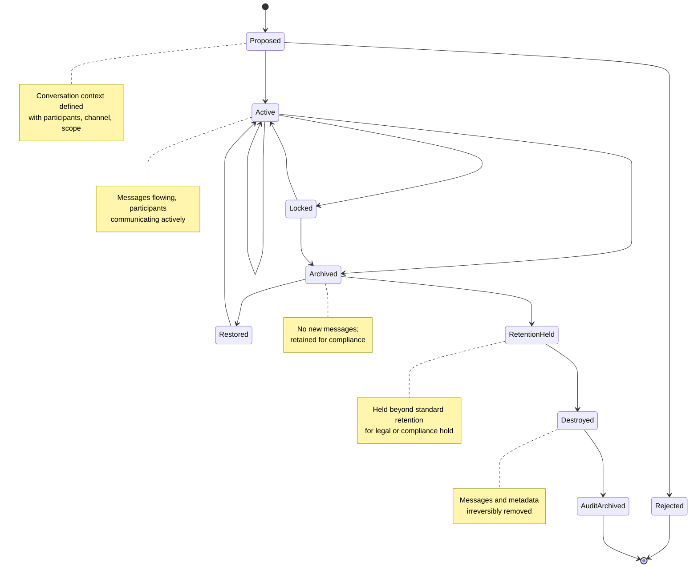
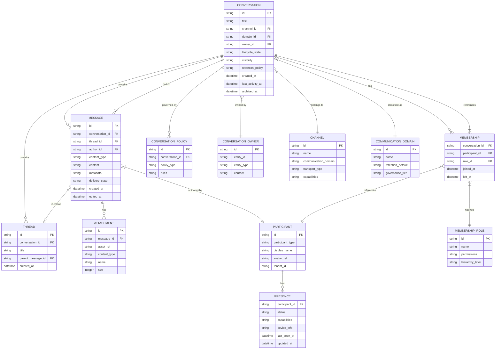
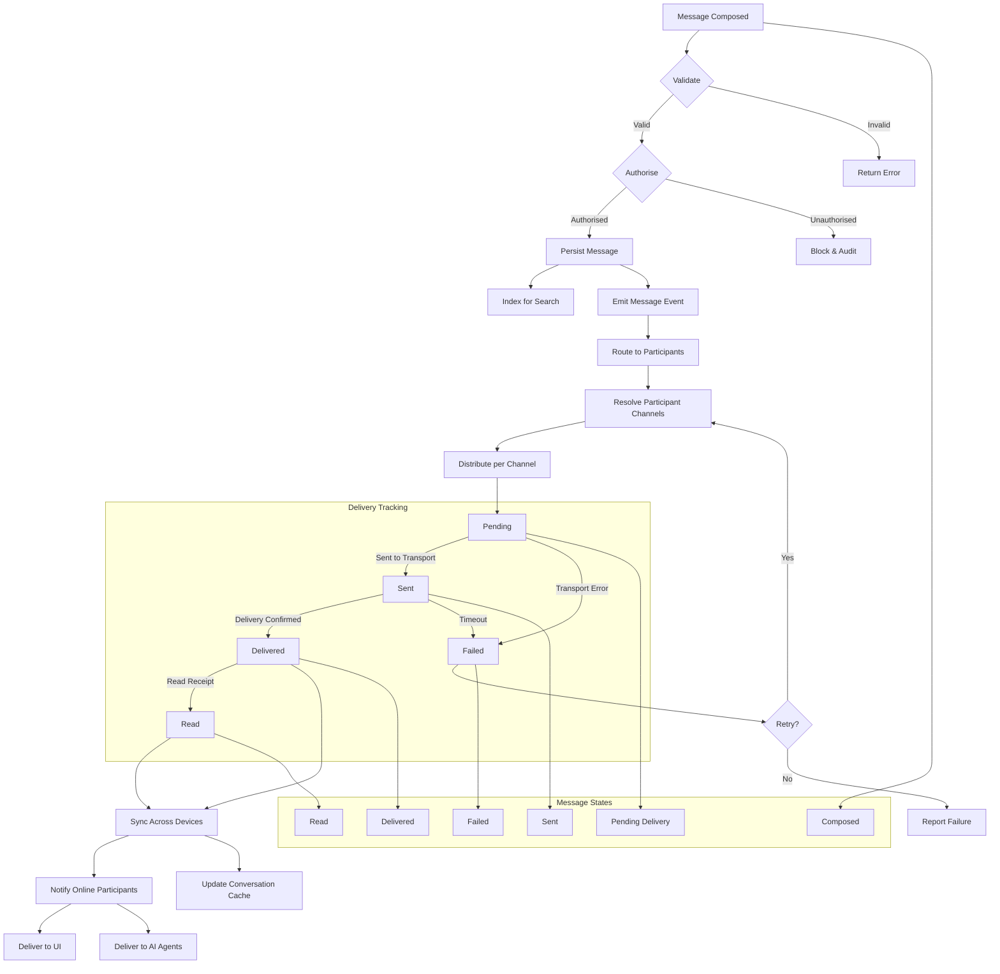
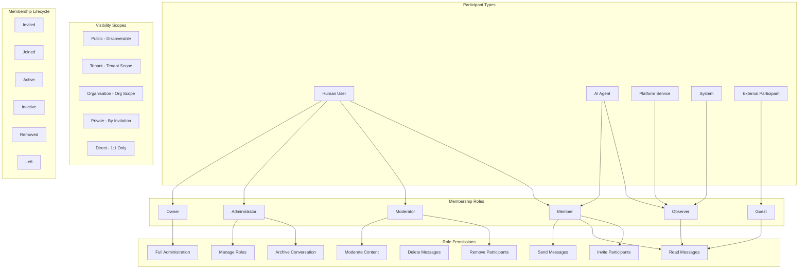
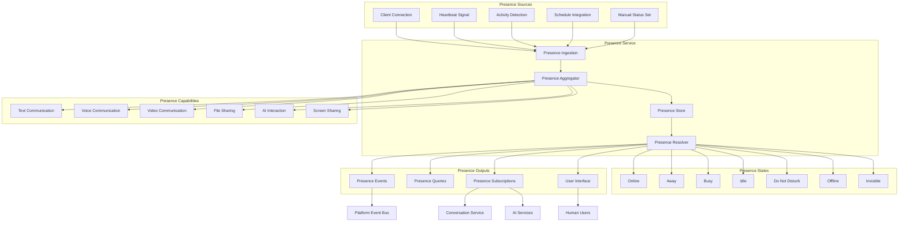
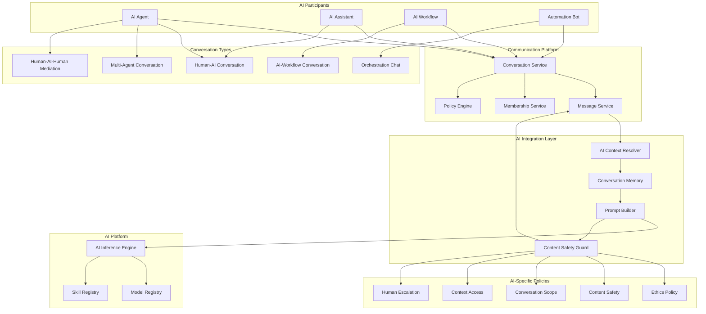
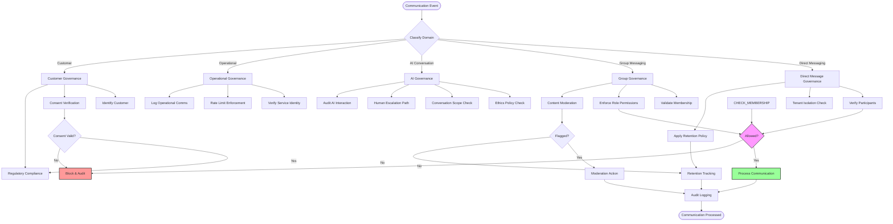
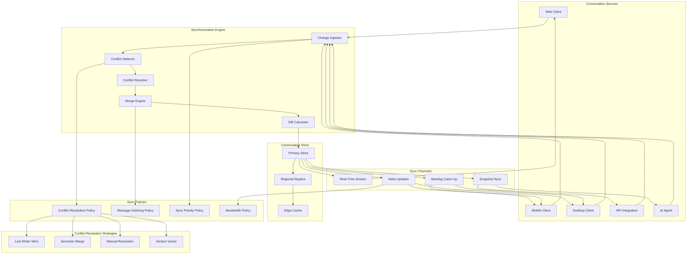

# KB-111 — Messaging & Communication Platform Architecture

**Suite:** Enterprise Platform Services  
**Version:** 1.0  
**Status:** Approved Architecture  
**Classification:** Core Platform Service Architecture  
**Last Updated:** 2026-07-12

---

## Executive Summary

This document defines the enterprise architecture governing messaging and communication as a shared platform capability within DUKADESK. The Messaging & Communication Platform provides a unified communication architecture supporting person-to-person, person-to-group, AI-to-human, service-to-user, service-to-service (human-facing), tenant, organisational, and cross-platform communication while remaining vendor, protocol, and technology independent.

The architecture separates communication semantics from transport mechanisms and supports future communication technologies without architectural changes.

---

## Purpose

Define how DUKADESK models, governs, secures, orchestrates, stores, routes, and manages conversations and communications across the enterprise platform.

---

## Scope

### In Scope

- Enterprise messaging architecture
- Communication architecture
- Conversation architecture
- Conversation registry
- Communication taxonomy
- Conversation lifecycle
- Communication governance
- Messaging policies
- Conversation participants
- Communication channels
- Conversation threads
- Message lifecycle
- Attachments
- Rich messages
- AI conversations
- Collaboration messaging
- Organisation messaging
- Tenant messaging
- Presence architecture
- Delivery states
- Read states
- Message synchronisation
- Communication auditing
- Communication observability

Logical communication types:

- Direct messaging
- Group messaging
- Team communication
- AI conversations
- Administrative communication
- Operational communication
- Customer communication
- Marketplace communication
- Builder Studio collaboration
- System-assisted communication

### Out of Scope

- Notification delivery
- Email infrastructure
- SMS infrastructure
- Chat provider implementation
- Media storage implementation
- Real-time transport implementation

*The above items are covered in separate Knowledge Base documents (see Cross References).*

---

## Architectural Principles

| # | Principle | Description |
|---|-----------|-------------|
| 1 | **Conversations as Enterprise Assets** | Conversations are governed enterprise resources with ownership, lifecycle, retention, and compliance obligations. |
| 2 | **Communication Independent of Transport** | Communication semantics are defined independently of the underlying transport protocol, enabling transparent provider substitution. |
| 3 | **Multi-Tenant Isolation** | Tenant conversations are strictly isolated. No cross-tenant communication occurs without explicit governance. |
| 4 | **Event-Driven Communication** | Communication events drive message distribution, presence updates, synchronisation, and integration with platform services. |
| 5 | **Vendor Independence** | Communication models and channels are provider-agnostic, supporting any messaging backend without consumer impact. |
| 6 | **Technology Neutrality** | Communication contracts are expressed in technology-neutral formats decoupled from specific frameworks or protocols. |
| 7 | **AI-Native Communication** | AI agents, assistants, and workflows are first-class conversation participants with the same governance, privacy, and lifecycle models as human users. |
| 8 | **Privacy by Design** | Communication privacy controls are intrinsic to the architecture, covering data minimisation, retention, consent, and isolation. |
| 9 | **Security by Design** | Security controls are embedded at every layer — authentication, authorisation, encryption, audit, and integrity verification. |
| 10 | **Zero Trust** | No participant, device, service, or network is implicitly trusted. Every communication operation is authenticated, authorised, and audited. |
| 11 | **High Availability** | The communication platform is resilient to regional, provider, and infrastructure failures without message loss. |
| 12 | **Observability by Design** | All communication operations emit structured telemetry for audit, monitoring, analytics, and compliance. |

---

## Canonical Definitions

| Term | Definition |
|------|------------|
| **Conversation** | A governed, persistent communication context containing a sequence of messages exchanged among a defined set of participants within a specific scope. |
| **Message** | An individual unit of communication within a conversation, containing content, metadata, sender identity, timestamp, and delivery state. |
| **Participant** | An entity (human user, AI agent, service, or system) that is a member of a conversation with defined roles and permissions. |
| **Channel** | A logical communication pathway that maps to a conversation type, scope, and set of delivery characteristics independent of transport. |
| **Thread** | A hierarchical grouping of messages within a conversation, enabling topic-specific sub-conversations. |
| **Conversation Context** | The metadata and state surrounding a conversation, including scope, participants, policies, channel binding, and lifecycle status. |
| **Conversation Policy** | A declarative rule governing conversation creation, membership, retention, moderation, visibility, or compliance. |
| **Communication Session** | A bounded, authenticated connection between a participant and the communication platform for sending and receiving messages. |
| **Presence** | A participant's communication availability state (online, away, busy, offline) and capabilities within the platform. |
| **Message State** | The lifecycle stage of a message from composition through delivery to archival. |
| **Delivery State** | The status of message transmission to each participant: pending, delivered, failed, or rejected. |
| **Read State** | The acknowledgment status indicating whether a recipient has viewed a message. |
| **Attachment** | A file, image, or binary payload associated with a message, governed by the Digital Asset Management architecture. |
| **Rich Message** | A message containing structured content, interactive elements, embedded media, or action suggestions. |
| **Conversation Owner** | The entity responsible for a conversation's lifecycle, governance, membership, and compliance. |
| **Conversation Membership** | The set of participants in a conversation, each with assigned roles and permissions. |
| **Communication Event** | A platform event emitted for communication activities, consumed by workflows, analytics, notifications, and integrations. |
| **Conversation Lifecycle** | The progression of a conversation through defined states from creation through disposal. |
| **Conversation Registry** | The authoritative inventory of all governed conversations, their metadata, participants, and lifecycle state. |
| **Communication Domain** | A logical grouping of conversations sharing a business context, governance model, and retention policy. |

---

## Architecture

### 1. Enterprise Messaging Platform Architecture

The Messaging & Communication Platform provides a centralised communication layer that decouples participants, conversations, and messages from transport technologies, providing unified governance, security, and observability.

```mermaid
graph TB
    subgraph "Participants"
        HU[Human Users]
        AI[AI Agents]
        SVC[Platform Services]
        EXT[External Systems]
    end

    subgraph "Communication Platform"
        subgraph "API Layer"
            API[Conversation API]
            MSG[Message API]
            MEM[Membership API]
            PRES[Presence API]
            ADMIN[Admin API]
        end

        subgraph "Core Services"
            CONV[Conversation Service]
            MSG_SVC[Message Service]
            MEM_SVC[Membership Service]
            PRES_SVC[Presence Service]
            CHAN[Channel Manager]
        end

        subgraph "Registry & Governance"
            REG[Conversation Registry]
            POL[Policy Engine]
            AUD[Audit Service]
        end

        subgraph "Integration"
            EVT[Event Bus]
            SYNC[Synchronisation Engine]
            CACHE[Conversation Cache]
        end
    end

    subgraph "Transport Layer"
        WS[WebSocket]
        HTTP[HTTP / SSE]
        PUB[Publish-Subscribe]
    end

    subgraph "Communication Domains"
        D_MSG[Direct Messaging]
        D_GRP[Group Messaging]
        D_AI[AI Conversations]
        D_ADM[Administrative]
        D_OP[Operational]
        D_CUST[Customer]
        D_MKT[Marketplace]
        D_BS[Builder Studio]
    end

    HU --> API
    AI --> API
    SVC --> API
    EXT --> API

    API --> CONV
    API --> MSG_SVC
    API --> MEM_SVC
    API --> PRES_SVC
    API --> CHAN

    CONV --> REG
    MSG_SVC --> REG
    MEM_SVC --> REG
    PRES_SVC --> REG

    REG --> POL
    REG --> AUD

    CONV --> EVT
    MSG_SVC --> EVT
    MEM_SVC --> EVT
    PRES_SVC --> EVT

    CHAN --> WS
    CHAN --> HTTP
    CHAN --> PUB

    SYNC --> WS
    SYNC --> HTTP
    SYNC --> PUB

    CACHE --> CONV
    CACHE --> MSG_SVC

    REG -.-> D_MSG
    REG -.-> D_GRP
    REG -.-> D_AI
    REG -.-> D_ADM
    REG -.-> D_OP
    REG -.-> D_CUST
    REG -.-> D_MKT
    REG -.-> D_BS
```

### 2. Conversation Lifecycle

Every conversation progresses through a defined lifecycle with gated transitions governing creation, activity, archival, retention, and disposal.

### 3. Conversation Domain Model

The conversation domain model defines the relationships among conversations, messages, participants, channels, threads, attachments, and policies.

### 4. Message Flow Architecture

Messages flow from composition through routing, delivery, synchronisation, and state tracking across all participants and devices.

### 5. Participant & Membership Model

Participants join conversations through membership with defined roles, permissions, and visibility scopes. The membership model governs who can communicate, moderate, and administer conversations.

### 6. Presence Architecture

Presence provides real-time awareness of participant availability, capabilities, and communication readiness across the platform.

### 7. AI Communication Architecture

AI agents are first-class communication participants with defined roles, context access, conversation memory, policy constraints, and integration with the AI platform.

### 8. Communication Governance Structure

Communication governance enforces policies across conversation creation, membership, content, retention, compliance, and audit.

### 9. Conversation Synchronisation Model

Conversations are synchronised across devices, sessions, services, and AI agents through an event-driven synchronisation engine that ensures consistency and convergence.

### 10. Enterprise Communication Ecosystem

The enterprise communication ecosystem encompasses all communication domains, their relationships, integration points, and governance boundaries.

```mermaid
graph TB
    subgraph "Communication Ecosystem"
        subgraph "Person-to-Person"
            DM[Direct Messaging]
            GRP[Group Messaging]
            TEAM[Team Communication]
        end

        subgraph "AI-Mediated"
            AI_H[Human-AI Conversation]
            AI_AGENT[Multi-Agent]
            AI_WF[AI-Workflow]
        end

        subgraph "Organisational"
            ORG[Organisation Messaging]
            ADMIN[Administrative Comms]
            ANNOUNCE[Announcements]
        end

        subgraph "Platform"
            OP[Operational Comms]
            SVC[Service-to-User]
            SYS[System Notifications]
        end

        subgraph "External"
            CUST[Customer Communication]
            MKT[Marketplace Comms]
            PARTNER[Partner Comms]
        end
    end

    subgraph "Platform Integration"
        NOTIF[Notification Platform]
        WF[Workflow Engine]
        AI_PLAT[AI Platform]
        COLLAB[Builder Studio]
        BILL[Billing & Invoicing]
    end

    subgraph "Governance Boundaries"
        GB_TENANT[Tenant Boundary]
        GB_REGION[Regional Boundary]
        GB_COMPLIANCE[Compliance Boundary]
        GB_RETENTION[Retention Boundary]
    end

    DM --> NOTIF
    GRP --> NOTIF
    TEAM --> COLLAB
    TEAM --> WF

    AI_H --> AI_PLAT
    AI_AGENT --> AI_PLAT
    AI_WF --> WF

    ORG --> ADMIN
    ADMIN --> NOTIF
    ANNOUNCE --> NOTIF

    OP --> SVC
    OP --> WF

    CUST --> NOTIF
    CUST --> BILL
    MKT --> NOTIF
    PARTNER --> NOTIF

    DM -.-> GB_TENANT
    GRP -.-> GB_TENANT
    ORG -.-> GB_TENANT
    CUST -.-> GB_COMPLIANCE
    ANNOUNCE -.-> GB_REGION

    GB_TENANT -.-> GB_RETENTION
    GB_COMPLIANCE -.-> GB_RETENTION
```

---

## Lifecycle

| Phase | Description | Gates |
|-------|-------------|-------|
| **Conversation Creation** | Conversation context is defined with channel, domain, initial participants, and governance policies. | Creation policy validation |
| **Membership Establishment** | Participants are invited or added with assigned roles. Membership policies are evaluated. | Membership policy verification |
| **Message Composition** | Participants compose and submit messages with optional attachments and rich content. | Content validation |
| **Routing** | Messages are routed through the platform to intended recipients based on channel and delivery policies. | Routing policy evaluation |
| **Delivery** | Messages are delivered to participant sessions and devices via configured transport channels. | Delivery confirmation |
| **Synchronisation** | Conversation state is synchronised across all participant devices, sessions, and services. | Sync convergence check |
| **Read Acknowledgement** | Delivery and read states are tracked and propagated to participants. | State consistency |
| **Archiving** | Conversations are archived according to retention policy. No new messages accepted. | Retention policy compliance |
| **Retention** | Archived conversations are retained for the configured duration, subject to legal holds. | Hold verification |
| **Restoration** | Archived conversations may be restored for legal, compliance, or operational requirements. | Restoration authorisation |
| **Deprecation** | Conversation domain or channel is deprecated; new conversations are redirected. | Deprecation notice |
| **Disposal** | Conversations are irreversibly destroyed after retention period, subject to legal hold. | Disposal authorisation |

---

## Governance

| Domain | Governance Mechanism | Responsible Body |
|--------|---------------------|------------------|
| **Conversation Ownership** | Every conversation must have a designated owner with lifecycle accountability. | Enterprise Architecture |
| **Membership Governance** | Membership changes are governed by role-based policies and domain-specific rules. | Platform Engineering |
| **Retention Governance** | Retention policies are defined per communication domain and enforced at conversation lifecycle level. | Compliance |
| **Communication Policies** | Policies govern content, membership, rate limits, moderation, and compliance per domain. | Integration Architecture |
| **Moderation Governance** | Content moderation policies govern acceptable use, flagging, escalation, and enforcement actions. | Security / Operations |
| **Compliance Governance** | Communication domains handling regulated content undergo compliance validation. | Compliance |
| **Lifecycle Governance** | Conversation lifecycle transitions are gated, audited, and subject to policy enforcement. | Platform Engineering |
| **Privacy Governance** | Privacy controls are enforced per domain with data minimisation, consent, and isolation guarantees. | Privacy / Compliance |
| **Audit Governance** | All communication operations are audited with immutable records for compliance and investigation. | Audit Teams |
| **Version Governance** | Conversation schema, policies, and channel configurations follow versioned governance. | Enterprise Architecture |

---

## Responsibilities

| Role | Responsibilities |
|------|-----------------|
| **Enterprise Architecture** | Define communication standards, taxonomy, governance model; conduct architecture reviews; maintain domain model. |
| **Platform Engineering** | Build and maintain communication platform services, synchronisation engine, presence service, and integration layer. |
| **Collaboration Services** | Own collaboration features, team communication, Builder Studio integration, and collaboration governance. |
| **Product Teams** | Define product-specific communication requirements; integrate product features with the communication platform. |
| **Security** | Perform security reviews; define authentication, authorisation, and encryption standards; audit communication access. |
| **Compliance** | Conduct compliance reviews; define retention and data handling policies; enforce regulatory requirements. |
| **Operations** | Monitor platform health, message delivery, synchronisation quality; respond to incidents; manage capacity. |
| **Tenant Administrators** | Configure tenant-level communication policies; manage tenant conversation governance; monitor tenant communication. |
| **AI Governance Teams** | Govern AI participant behaviour; enforce ethics and safety policies; audit AI conversation interactions. |
| **Audit Teams** | Review communication audit logs; verify compliance; assess conversation governance adherence. |

---

## Security

| Control Area | Architecture |
|-------------|--------------|
| **Conversation Authorisation** | Every conversation operation is authorised against participant identity, membership role, and conversation policies. |
| **Identity Validation** | All participants (human, AI, service) are authenticated before any communication operation. |
| **Membership Control** | Membership changes are governed by role-based permissions and domain policies. Unauthorised membership is blocked. |
| **Secure Message Exchange** | Messages are encrypted in transit and at rest. End-to-end encryption is supported for confidential conversations. |
| **Tenant Isolation** | Tenant conversations are strictly partitioned. Cross-tenant communication requires explicit policy approval. |
| **Zero Trust** | No participant, device, service, or network is implicitly trusted. Every operation is authenticated, authorised, and audited. |
| **End-to-End Communication Integrity** | Message integrity is verifiable through checksums and signing. Tampering is detectable at delivery. |
| **Confidential Conversations** | Confidential conversation channels enforce end-to-end encryption, restricted membership, and elevated audit. |
| **Auditability** | Every communication operation is logged with participant identity, timestamp, operation type, and outcome. |
| **Least Privilege** | Participants are granted the minimum role and permissions required for their communication needs. |

---

## Privacy

| Domain | Architecture |
|--------|--------------|
| **Participant Privacy** | Participant identities, presence, and communication patterns are protected. Presence data is scoped to authorised viewers. |
| **Tenant Isolation** | Tenant conversations are isolated at the data layer. No cross-tenant visibility or search is possible. |
| **Regulatory Compliance** | Communication domains handling regulated data (PII, financial, health) enforce compliance policies at every layer. |
| **Data Minimisation** | Only necessary participant and message metadata is retained. Content retention follows domain-specific policies. |
| **Regional Communication Governance** | Communication data residency respects regional boundaries. Regional conversation instances remain within jurisdiction. |
| **Data Residency** | Conversation storage, archive, and backup are geographically constrained per tenant and domain policies. |
| **Retention Policies** | Retention policies are defined per communication domain. Legal holds override automated disposal. |
| **Consent-Aware Communication** | Communication with external participants (customers, partners) requires consent verification before message delivery. |

---

## Performance

| Consideration | Architectural Approach |
|---------------|----------------------|
| **High-Volume Messaging** | The platform scales horizontally across message ingestion, processing, and delivery. Throughput is partitioned by conversation and channel. |
| **Global Scalability** | Regional deployment with local conversation stores ensures low-latency access. Cross-region synchronisation is asynchronous. |
| **Real-Time Responsiveness** | Messages are delivered via persistent connections (WebSocket, SSE) with sub-second delivery latency for online participants. |
| **Synchronisation Efficiency** | Delta-based synchronisation minimises bandwidth. Snapshot synchronisation is used for new devices or reconnection after extended offline. |
| **Conversation Indexing** | Conversations and messages are indexed for full-text search with support for filters, participants, date ranges, and content types. |
| **High Availability** | The communication platform is deployed across multiple availability zones. Message durability is guaranteed during regional failover. |
| **Storage Scalability** | Conversation and message storage scales horizontally. Historical conversations are tiered to cost-optimised storage with indexed retrieval. |
| **Operational Resilience** | Message buffering and retry mechanisms ensure no message loss during transient failures. Dead-letter queues capture undeliverable messages. |

---

## Observability

| Domain | Architecture |
|--------|--------------|
| **Conversation Metrics** | Active conversations, messages per conversation, participant count, and conversation duration are tracked per domain. |
| **Delivery Analytics** | Delivery success rates, latency percentiles, delivery state distributions, and failure reasons are monitored across channels. |
| **Message Throughput** | Messages per second, peak throughput, and throughput by domain and channel are measured for capacity planning. |
| **Synchronisation Health** | Sync latency, convergence time, conflict rates, and resolution outcomes are tracked per participant population. |
| **Communication Quality** | Message loss rate, delivery jitter, presence accuracy, and end-to-end latency are measured as quality indicators. |
| **Operational Dashboards** | Role-specific dashboards expose platform health, domain activity, delivery performance, and incident status. |
| **Governance Reporting** | Governance reports summarise conversation inventory, retention compliance, membership audits, and policy enforcement. |
| **SLA Monitoring** | Delivery latency SLAs, availability SLAs, and synchronisation SLAs are monitored per domain and operational tier. |
| **Audit Reporting** | Immutable audit trails support investigation, compliance reporting, and forensic analysis. |
| **Platform Communication Insights** | Cross-domain analytics reveal communication patterns, collaboration trends, and platform utilisation. |

---

## Failure Scenarios

| Scenario | Architectural Response |
|----------|-----------------------|
| **Delivery Interruption** | Messages are buffered at the platform and delivered when the participant reconnects. Delivery state is preserved. |
| **Synchronisation Failure** | Conflict detection identifies divergent conversation states. Automated or manual resolution restores consistency. |
| **Conversation Corruption** | Immutable message history prevents corruption. Corrupted state is recoverable from replicated store. |
| **Membership Inconsistency** | Membership state is reconciled through the conversation registry. Discrepancies trigger audit and automated correction. |
| **Attachment Unavailability** | Attachments are referenced by asset identifier. Unavailable attachments return a placeholder with retry capability. |
| **Presence Failures** | Presence degrades gracefully to last-known state. Stale presence is cleared after timeout. |
| **Cross-Tenant Communication Attempts** | Cross-tenant access is blocked at the authorisation layer. The attempt is logged and escalated. |
| **Unauthorised Participation** | Unauthorised membership or message operations are blocked. The event is audited and escalated. |
| **Regional Communication Outage** | Regional failover routes conversations to an alternate region. Data residency constraints are evaluated during failover. |
| **AI Communication Failure** | AI participant errors return a graceful error to human participants. Conversation context is preserved for retry. |
| **Retention Policy Conflicts** | Conflicting retention policies (e.g., legal hold vs. automated disposal) are resolved in favour of retention. |
| **Conversation Recovery** | Deleted or corrupted conversations are recoverable from snapshot backups within the retention window. |

---

## Anti-Patterns

| Anti-Pattern | Prohibited Because | Enforced By |
|--------------|-------------------|-------------|
| **Application-Owned Messaging Systems** | Duplicates platform capabilities, bypasses governance, fragments communication history, and creates security gaps. | Architecture review; platform policy |
| **Hardcoded Communication Channels** | Couples applications to specific transport technologies, prevents channel evolution, and bypasses governance. | Code review; static analysis |
| **Unmanaged Conversation Storage** | Conversations outside the platform are invisible to governance, retention, audit, and compliance. | Platform enforcement |
| **Direct Transport Coupling** | Ties communication semantics to specific transport protocols, preventing provider substitution. | Architecture review; abstraction layer |
| **Missing Conversation Ownership** | Orphaned conversations cannot be governed, retained, or disposed of in compliance with policy. | Registry ownership enforcement |
| **Cross-Tenant Conversations Without Governance** | Unauthorised cross-tenant communication violates isolation and privacy requirements. | Authorisation enforcement |
| **Untracked Communication History** | Communication without audit trail creates compliance and investigation risks. | Audit enforcement |
| **Duplicate Messaging Capabilities** | Multiple messaging systems fragment communication, increase complexity, and create inconsistent user experience. | Platform consolidation policy |
| **Missing Auditability** | Communication without audit is non-compliant with regulatory and governance requirements. | Mandatory audit logging |
| **Uncontrolled AI Conversations** | AI participants without governance, ethics policies, or human escalation create safety and compliance risks. | AI governance enforcement |

---

## Future Evolution

| Evolution Path | Architectural Preparation |
|---------------|--------------------------|
| **AI-Mediated Conversations** | AI participants are first-class citizens with defined roles, context access, and governance. Architecture supports AI-facilitated human conversations. |
| **Autonomous Collaboration** | AI agents autonomously create and manage conversation spaces for collaboration, project tracking, and coordination. |
| **Semantic Conversation Indexing** | Conversations are indexed by semantic content, enabling AI-powered search, summarisation, and knowledge retrieval. |
| **Real-Time Language Translation** | The message architecture supports language metadata enabling real-time translation services within conversations. |
| **Intelligent Conversation Summarisation** | Conversation history is automatically summarised for catch-up, reporting, and knowledge capture. |
| **Context-Aware Communication** | Conversations are contextually aware of participant activity, platform context, and workflow state for relevant communication. |
| **Multi-Modal Communication** | The architecture supports evolving communication modalities including voice, video, and collaborative whiteboarding within the conversation model. |
| **Digital Workspace Collaboration** | Conversations integrate seamlessly with documents, tasks, workflows, and analytics within the digital workspace. |
| **Autonomous Enterprise Assistants** | AI assistants autonomously manage communication workflows, schedule coordination, and information routing across conversations. |

---

## Cross References

| Document ID | Title | Relation |
|-------------|-------|----------|
| **KB-077** | Event & Messaging Architecture | Defines the underlying event and message transport infrastructure. |
| **KB-090** | Analytics & Business Intelligence Architecture | Defines analytics consumption of communication data. |
| **KB-091** | Reporting Architecture | Defines reporting on communication metrics. |
| **KB-107** | Enterprise Platform Services Overview Architecture | Defines the platform services context for communication. |
| **KB-110** | Notification Platform Architecture | Defines notification delivery complementary to conversation messaging. |
| **KB-112** | Scheduling & Job Orchestration Architecture | Defines scheduling of communication events and jobs. |
| **KB-113** | Workflow Orchestration Architecture | Defines workflow integration with conversations. |
| **KB-114** | Business Rules Engine Architecture | Defines business rules governing communication policies. |
| **KB-116** | AI Platform Architecture | Defines the AI platform context for AI communication participants. |
| **KB-120** | AI Context & Memory Architecture | Defines conversation memory and context for AI participants. |
| **KB-124** | Policy Management Architecture | Defines the policy framework enforced by the communication platform. |
| **KB-127** | Digital Asset Management Architecture | Defines attachment storage and management for messages. |
| **KB-128** | Localisation & Internationalization Architecture | Defines localisation for multi-language communication. |
| **KB-140** | Enterprise Platform Services Reference Architecture | Defines the overarching reference architecture for enterprise platform services. |

---

## Acceptance Criteria

- [x] Defines enterprise Messaging & Communication Platform architecture.
- [x] Separates communication semantics from transport mechanisms.
- [x] Supports multi-tenant, AI-native, enterprise communication.
- [x] Defines conversations, messaging, presence, governance, lifecycle, and synchronisation.
- [x] Includes all 10 required Mermaid diagrams.
- [x] Cross-references related Knowledge Base documents.
- [x] Contains no implementation guidance.

---

## Completion Instructions

1. **Mark KB-111 as Completed** — This document constitutes the completed architecture specification.
2. **Update the Progress Registry** — Record KB-111 as Approved Architecture in the Knowledge Base registry.
3. **Cross-Reference Related Documents** — Ensure KB-077 through KB-140 reference this document.
4. **Queue Next Assignment** — KB-112 – Scheduling & Job Orchestration Architecture is the next builder assignment.

---

## Critical DUKADESK Architectural Rule

> **All conversational and messaging capabilities within DUKADESK shall be provided exclusively through the centralised Messaging & Communication Platform. Conversations, participants, communication policies, lifecycle, synchronisation, and governance shall be managed independently of transport technologies, applications, tenants, or AI components, ensuring secure, consistent, auditable, and enterprise-scale communication across the platform.**
