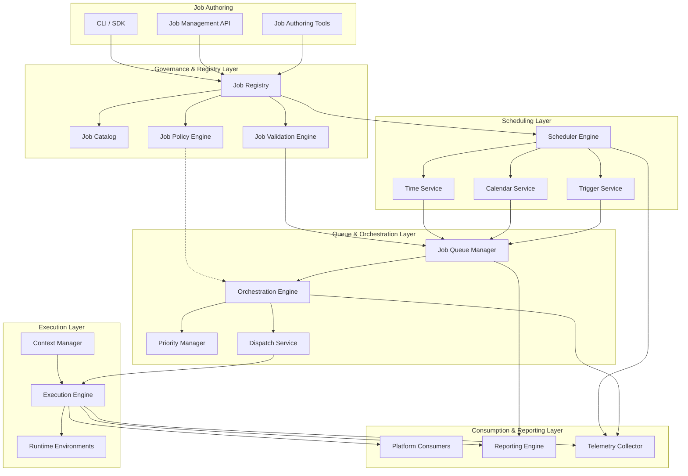
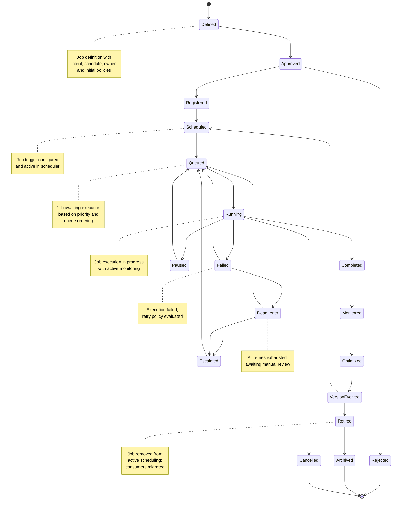
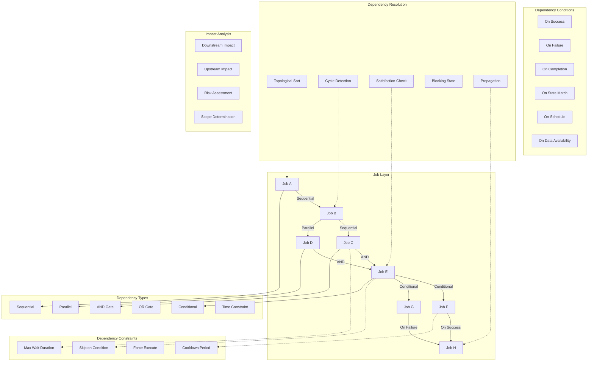
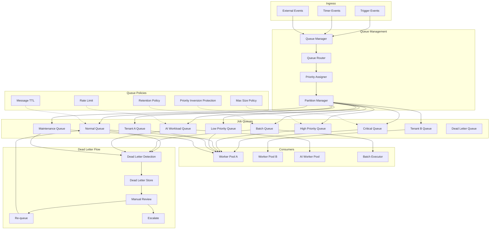
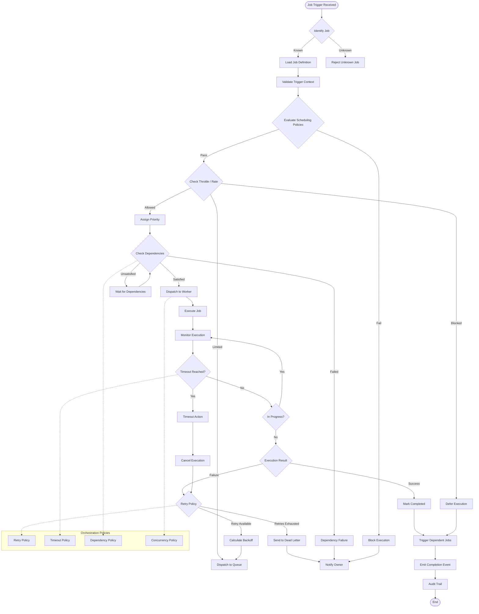
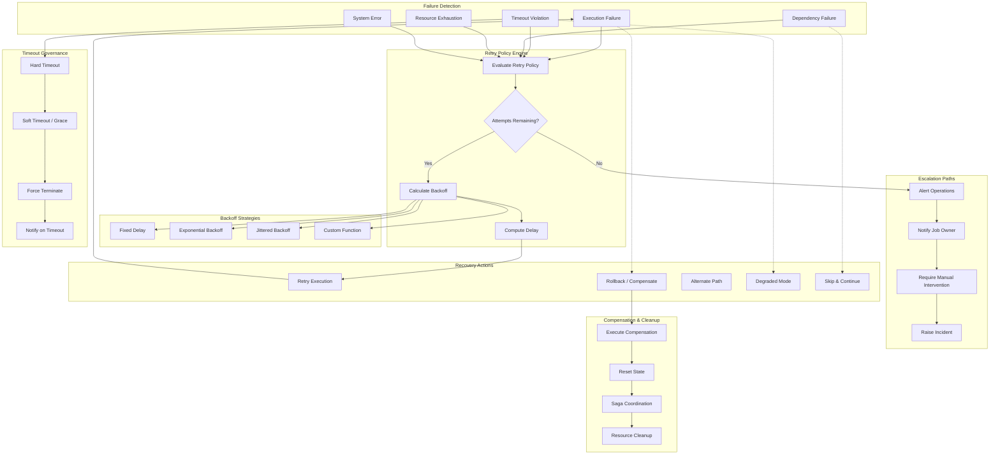
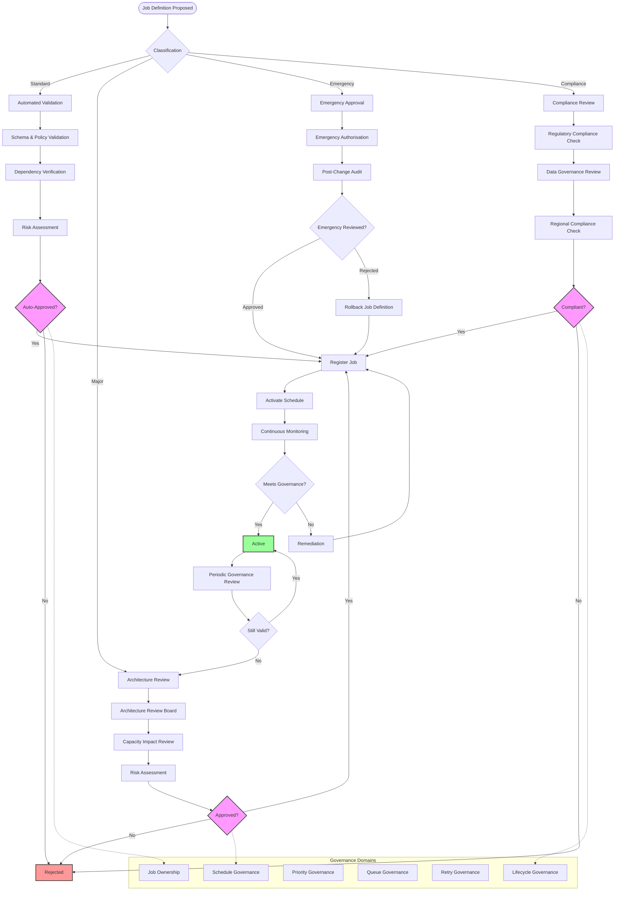

# KB-112 — Scheduling & Job Orchestration Architecture

**Suite:** Enterprise Platform Services  
**Version:** 1.0  
**Status:** Approved Architecture  
**Classification:** Core Platform Service Architecture  
**Last Updated:** 2026-07-12

---

## Executive Summary

This document defines the enterprise architecture governing scheduling and job orchestration as a shared platform capability within DUKADESK. The Scheduling & Job Orchestration Platform shall provide a unified, policy-driven architecture for planning, coordinating, executing, monitoring, retrying, prioritizing, and governing all scheduled and asynchronous workloads across the DUKADESK ecosystem.

The architecture shall separate job intent from execution technology while supporting enterprise-scale, distributed, multi-tenant, AI-enabled workloads.

---

## Purpose

Define how DUKADESK schedules, orchestrates, governs, monitors, prioritizes, and evolves all recurring, delayed, background, and asynchronous work throughout the enterprise platform.

---

## Scope

### In Scope

- Enterprise scheduling architecture
- Job orchestration architecture
- Job registry
- Job catalog
- Job lifecycle
- Scheduling policies
- Recurring schedules
- One-time schedules
- Event-triggered jobs
- Time-triggered jobs
- Background processing
- Batch processing
- Distributed jobs
- Long-running jobs
- Job dependencies
- Job priorities
- Queue governance
- Retry architecture
- Timeout governance
- Dead-letter architecture
- Job ownership
- Job auditing
- Job observability
- AI workload scheduling
- Tenant workload isolation

### Out of Scope

- Workflow implementation
- Infrastructure schedulers
- CI/CD pipelines
- Operating system schedulers
- Container orchestration implementation

*The above items are covered in separate Knowledge Base documents (see Cross References).*

---

## Architectural Principles

| # | Principle | Description |
|---|-----------|-------------|
| 1 | **Scheduling as a Platform Capability** | Scheduling and orchestration are provided as a shared platform service, not embedded in individual applications or services. |
| 2 | **Intent Before Execution** | Jobs are defined by their intent, schedule, and policies — decoupled from the execution technology, runtime, and infrastructure. |
| 3 | **Policy-Driven Orchestration** | Job execution, prioritization, retry, timeout, and resource allocation are governed by declarative policies, not hardcoded logic. |
| 4 | **Distributed Execution Readiness** | Jobs are designed for distributed execution across regions, clusters, and availability zones without location affinity. |
| 5 | **Vendor Independence** | Job definitions, schedules, and orchestration models are provider-agnostic, ensuring portability across infrastructure vendors. |
| 6 | **Technology Neutrality** | Jobs are expressed in technology-neutral formats, not tied to specific programming languages, frameworks, or runtime environments. |
| 7 | **Event-Driven Coordination** | Job triggers, state transitions, and inter-job coordination are event-driven, enabling reactive and decoupled orchestration. |
| 8 | **Multi-Tenant Isolation** | Tenant workloads are strictly isolated in scheduling, execution, queuing, and monitoring. No tenant can observe or impact another tenant's jobs. |
| 9 | **Zero Trust** | No job or scheduler is implicitly trusted. Every scheduling, execution, and state transition is authenticated, authorised, and audited. |
| 10 | **High Availability** | The scheduling and orchestration platform is resilient to component failures, regional outages, and load spikes with no single point of failure. |
| 11 | **AI-Ready Scheduling** | Scheduling models and metadata support AI agent workload management, autonomous orchestration, and intelligent resource allocation. |
| 12 | **Observability by Design** | Every job state transition, scheduling decision, execution attempt, retry, and failure emits structured telemetry for governance and operations. |
| 13 | **Resilience by Default** | Jobs are designed with retry policies, timeout governance, dead-letter handling, and recovery mechanisms as mandatory architectural requirements. |

---

## Canonical Definitions

| Term | Definition |
|------|------------|
| **Job** | A discrete unit of scheduled or asynchronous work with a defined intent, schedule, execution logic, policies, and lifecycle. |
| **Scheduled Job** | A job triggered by a time-based schedule (one-time, recurring, calendar-based, or cron expression). |
| **Orchestrated Job** | A job whose execution is coordinated relative to other jobs, dependencies, resources, or external events. |
| **Job Registry** | The authoritative system of record for all governed jobs, their schedules, metadata, ownership, lifecycle state, and version history. |
| **Job Catalog** | A discovery and classification interface over the Job Registry enabling search, taxonomy browsing, dependency analysis, and reuse assessment. |
| **Job Schedule** | A declarative specification of when a job should be triggered, including time expressions, calendars, recurrence rules, and constraints. |
| **Trigger** | An event or condition that initiates job execution, including time-based, event-based, dependency-based, conditional, and manual triggers. |
| **Schedule Policy** | A declarative rule governing schedule validation, trigger authorization, execution windows, concurrency limits, and scheduling constraints. |
| **Job Dependency** | A relationship where a job's execution depends on the state, outcome, or completion of another job, schedule, or external condition. |
| **Job Queue** | A logical container that orders, prioritizes, and governs the execution of jobs awaiting processing. |
| **Job Priority** | The relative importance of a job within a queue, determining execution order, resource allocation, and preemption behaviour. |
| **Job Execution** | A single runtime instance of a job, with its own state, context, duration, and result. |
| **Job State** | The current phase of a job or job execution within its lifecycle (e.g., Scheduled, Queued, Running, Completed, Failed, Retrying). |
| **Retry Policy** | A declarative policy governing the number, frequency, backoff strategy, and conditions under which a failed job execution is retried. |
| **Timeout Policy** | A declarative policy governing maximum execution duration, grace periods, and escalation actions when a job exceeds its time limit. |
| **Dead Letter Queue** | A holding queue for jobs that have exhausted all retry attempts and require manual intervention, escalation, or compensation. |
| **Job Owner** | The entity (team or individual) accountable for a job's definition, schedule, policies, lifecycle, and operational health. |
| **Job Context** | The runtime information, parameters, and environmental bindings provided to a job execution instance. |
| **Job Lifecycle** | The progression of a job through defined states from definition through retirement and archival. |
| **Job Orchestration** | The coordination of job execution sequencing, dependency resolution, concurrency management, and state governance across multiple jobs. |

---

## Architecture

### 1. Enterprise Scheduling Architecture

The enterprise scheduling architecture defines a centralised scheduling and orchestration layer with distributed execution across all DUKADESK domains. Job definitions flow from authoring through registration, scheduling, queueing, orchestration, and execution.

### 2. Job Lifecycle

Every job progresses through a defined lifecycle with gated transitions ensuring governance, validation, and operational integrity at every stage.

### 3. Scheduling Model

The scheduling model governs how, when, and under what conditions jobs are triggered, supporting multiple scheduling strategies with policy-driven constraints.

```mermaid
graph TB
    subgraph "Schedule Types"
        ST_TIME[Time-Based]
        ST_EVENT[Event-Driven]
        ST_CALENDAR[Calendar-Based]
        ST_DEPENDENCY[Dependency-Based]
        ST_CONDITIONAL[Conditional]
        ST_MANUAL[Manual]
        ST_DYNAMIC[Dynamic]
    end

    subgraph "Time-Based Schedules"
        TS_CRON[Cron Expression]
        TS_INTERVAL[Fixed Interval]
        TS_ONCE[One-Time]
        TS_RECUR[Recurring]
        TS_WINDOW[Time Window]
    end

    subgraph "Event-Driven Triggers"
        ET_MESSAGE[Message Received]
        ET_STATE[State Change]
        ET_DATA[Data Availability]
        ET_ALERT[Alert Fired]
        ET_WEBHOOK[Webhook Received]
    end

    subgraph "Calendar Constraints"
        CAL_BUSINESS[Business Calendar]
        CAL_FISCAL[Fiscal Calendar]
        CAL_REGION[Regional Calendar]
        CAL_BLACKOUT[Blackout Periods]
        CAL_HOLIDAY[Holiday Calendar]
    end

    subgraph "Scheduling Policies"
        SP_WINDOW[Execution Window]
        SP_CONCUR[Concurrency Limit]
        SP_RATE[Rate Limiting]
        SP_AUTH[Schedule Authorization]
        SP_OVERLAP[Overlap Prevention]
    end

    subgraph "Resolution Flow"
        RF_INPUT[Schedule Request]
        RF_VALIDATE[Validate Schedule]
        RF_POLICY[Evaluate Policies]
        RF_CAL[Check Calendar]
        RF_CONFIRM[Confirm Trigger Time]
        RF_REGISTER[Register in Scheduler]
    end

    ST_TIME --> TS_CRON
    ST_TIME --> TS_INTERVAL
    ST_TIME --> TS_ONCE
    ST_TIME --> TS_RECUR
    ST_TIME --> TS_WINDOW

    ST_EVENT --> ET_MESSAGE
    ST_EVENT --> ET_STATE
    ST_EVENT --> ET_DATA
    ST_EVENT --> ET_ALERT
    ST_EVENT --> ET_WEBHOOK

    ST_CALENDAR --> CAL_BUSINESS
    ST_CALENDAR --> CAL_FISCAL
    ST_CALENDAR --> CAL_REGION
    ST_CALENDAR --> CAL_BLACKOUT
    ST_CALENDAR --> CAL_HOLIDAY

    ST_DEPENDENCY --> JOB_DEP[Job Dependency Graph]
    ST_CONDITIONAL --> COND_EVAL[Condition Evaluation]
    ST_MANUAL --> MANUAL_REQ[Manual Request]
    ST_DYNAMIC --> DYN_POLICY[Policy-Driven Scheduling]

    TS_CRON --> RF_INPUT
    ET_MESSAGE --> RF_INPUT
    CAL_BUSINESS --> RF_CAL
    SP_WINDOW --> RF_POLICY

    RF_INPUT --> RF_VALIDATE
    RF_VALIDATE --> RF_POLICY
    RF_POLICY --> RF_CAL
    RF_CAL --> RF_CONFIRM
    RF_CONFIRM --> RF_REGISTER

    RF_POLICY -.-> SP_WINDOW
    RF_POLICY -.-> SP_CONCUR
    RF_POLICY -.-> SP_RATE
```

### 4. Job Dependency Graph

Jobs exist within a dependency graph that defines execution ordering, prerequisite relationships, concurrency constraints, and impact propagation.

### 5. Queue Architecture

Job queues provide logical isolation, prioritization, ordering, and governance for workloads awaiting execution.

### 6. Job Orchestration Flow

Job orchestration coordinates the end-to-end lifecycle of job execution, from trigger receipt through completion, with policy enforcement and state governance at every step.

### 7. Retry & Recovery Architecture

The retry and recovery architecture governs how failed jobs are re-attempted, escalated, and recovered, with policy-driven backoff, timeout handling, and compensation strategies.

### 8. Governance Structure

Job governance is enforced through a structured workflow encompassing ownership, policy evaluation, approval gates, compliance validation, and operational oversight.

### 9. AI Scheduling Architecture

The AI scheduling architecture governs the lifecycle, prioritization, resource allocation, and governance of AI-related workloads including inference, training, agent tasks, and autonomous operations.

```mermaid
graph TB
    subgraph "AI Job Types"
        AI_INF[AI Inference Jobs]
        AI_TRAIN[AI Training Jobs]
        AI_AGENT[AI Agent Tasks]
        AI_EVAL[AI Evaluation Jobs]
        AI_BATCH[AI Batch Processing]
        AI_AUTO[Autonomous Operations]
    end

    subgraph "AI Scheduling Policies"
        AI_PRIO[AI Priority Model]
        AI_RESOURCE[Resource Allocation Policy]
        AI_ISOLATION[Model Isolation Policy]
        AI_SAFETY[Safety Gate Policy]
        AI_ETHICS[Ethics Compliance Policy]
    end

    subgraph "AI Workload Queues"
        AI_REALTIME[Real-Time Queue]
        AI_STANDARD[Standard Queue]
        AI_BATCH_AI[Batch Queue]
        AI_TRAINING[Training Queue]
        AI_AGENT_QUEUE[Agent Queue]
        AI_BACKGROUND[Background Queue]
    end

    subgraph "Resource Governance"
        RG_GPU[GPU Allocation]
        RG_MEM[Memory Allocation]
        RG_COMPUTE[Compute Allocation]
        RG_CONCUR[Concurrency Limits]
        RG_PREEMPT[Preemption Policy]
    end

    subgraph "Safety & Governance"
        SG_GUARD[Safety Guardrails]
        SG_AUDIT[AI Audit Trail]
        SG_BIAS[Bias Detection]
        SG_HALLUCINATION[Hallucination Check]
        SG_HUMAN[Human-in-the-Loop]
    end

    subgraph "Monitoring & Optimization"
        MO_PERF[Performance Monitoring]
        MO_COST[Cost Tracking]
        MO_QUALITY[Quality Metrics]
        MO_DRIFT[Model Drift Detection]
        MO_OPTIM[Runtime Optimization]
    end

    AI_INF --> AI_PRIO
    AI_TRAIN --> AI_PRIO
    AI_AGENT --> AI_PRIO
    AI_EVAL --> AI_PRIO
    AI_BATCH --> AI_PRIO
    AI_AUTO --> AI_PRIO

    AI_PRIO --> AI_REALTIME
    AI_PRIO --> AI_STANDARD
    AI_PRIO --> AI_BATCH_AI
    AI_PRIO --> AI_TRAINING
    AI_PRIO --> AI_AGENT_QUEUE
    AI_PRIO --> AI_BACKGROUND

    AI_REALTIME --> RG_GPU
    AI_STANDARD --> RG_COMPUTE
    AI_TRAINING --> RG_GPU
    AI_AGENT_QUEUE --> RG_MEM

    RG_GPU --> SG_GUARD
    RG_COMPUTE --> SG_GUARD
    RG_MEM --> SG_GUARD

    SG_GUARD --> SG_AUDIT
    SG_GUARD --> SG_BIAS
    SG_GUARD --> SG_HALLUCINATION
    SG_GUARD --> SG_HUMAN

    AI_INF --> MO_PERF
    AI_TRAIN --> MO_COST
    AI_EVAL --> MO_QUALITY
    AI_AGENT --> MO_DRIFT

    MO_PERF --> MO_OPTIM
    MO_COST --> MO_OPTIM
    MO_QUALITY --> MO_OPTIM

    AI_AUTO --> SG_HUMAN

    subgraph "Tenant AI Isolation"
        TI_MODEL[Model Isolation]
        TI_DATA[Data Isolation]
        TI_QUEUE[Queue Isolation]
        TI_MONITOR[Monitoring Isolation]
    end

    AI_INF -.-> TI_MODEL
    AI_TRAIN -.-> TI_DATA
    AI_AGENT -.-> TI_QUEUE
    AI_EVAL -.-> TI_MONITOR
```

### 10. Enterprise Workload Ecosystem

The enterprise workload ecosystem provides a holistic view of all scheduled and orchestrated work across DUKADESK, enabling portfolio governance, capacity planning, and strategic workload management.

```mermaid
graph TB
    subgraph "Workload Domains"
        WD_PLATFORM[Platform Workloads]
        WD_TENANT[Tenant Workloads]
        WD_OPERATIONAL[Operational Workloads]
        WD_ADMIN[Administrative Workloads]
        WD_BUSINESS[Business Workloads]
        WD_AI_ECO[AI Workloads]
        WD_INTEGRATION[Integration Workloads]
        WD_MAINTENANCE[Maintenance Workloads]
        WD_ANALYTICS[Analytics Workloads]
        WD_COMPLIANCE[Compliance Workloads]
        WD_MARKETPLACE[Marketplace Workloads]
        WD_STUDIO[Builder Studio Workloads]
    end

    subgraph "Workload Characteristics"
        WC_DURATION[Duration Profile]
        WC_FREQUENCY[Frequency Profile]
        WC_RESOURCE[Resource Profile]
        WC_CRITICALITY[Criticality Level]
        WC_ISOLATION[Isolation Requirement]
    end

    subgraph "Capacity Planning"
        CP_DEMAND[Demand Forecasting]
        CP_CAPACITY[Capacity Modeling]
        CP_ALLOCATION[Resource Allocation]
        CP_RESERVATION[Reserved Capacity]
        CP_BURST[Burst Handling]
    end

    subgraph "Portfolio Management"
        PM_INVENTORY[Workload Inventory]
        PM_LIFECYCLE[Lifecycle Distribution]
        PM_OWNERSHIP[Ownership Matrix]
        PM_HEALTH[Health Dashboard]
        PM_COST[Cost Analytics]
    end

    subgraph "Governance Reporting"
        GR_COMPLIANCE[Compliance Status]
        GR_SLA[SLA Adherence]
        GR_EFFICIENCY[Efficiency Metrics]
        GR_RISK[Risk Register]
        GR_TREND[Trend Analysis]
    end

    WD_PLATFORM --> WC_DURATION
    WD_TENANT --> WC_FREQUENCY
    WD_OPERATIONAL --> WC_RESOURCE
    WD_ADMIN --> WC_CRITICALITY
    WD_AI_ECO --> WC_RESOURCE
    WD_COMPLIANCE --> WC_ISOLATION

    WC_DURATION --> CP_DEMAND
    WC_FREQUENCY --> CP_DEMAND
    WC_RESOURCE --> CP_CAPACITY
    WC_CRITICALITY --> CP_RESERVATION

    CP_DEMAND --> CP_ALLOCATION
    CP_CAPACITY --> CP_ALLOCATION
    CP_RESERVATION --> CP_ALLOCATION
    CP_BURST --> CP_ALLOCATION

    WD_PLATFORM --> PM_INVENTORY
    WD_TENANT --> PM_INVENTORY
    WD_AI_ECO --> PM_LIFECYCLE
    WD_MAINTENANCE --> PM_HEALTH
    WD_BUSINESS --> PM_COST

    PM_INVENTORY --> GR_COMPLIANCE
    PM_HEALTH --> GR_SLA
    PM_COST --> GR_EFFICIENCY
    PM_LIFECYCLE --> GR_RISK

    PM_INVENTORY --> GR_TREND
    CP_ALLOCATION --> GR_EFFICIENCY

    subgraph "Workload Optimization"
        WO_SCHEDULE[Schedule Optimization]
        WO_RESOURCE[Resource Optimization]
        WO_COST[Cost Optimization]
        WO_PERF[Performance Optimization]
    end

    GR_EFFICIENCY --> WO_SCHEDULE
    GR_EFFICIENCY --> WO_RESOURCE
    GR_COST --> WO_COST
    GR_SLA --> WO_PERF
```

---

## Lifecycle

| Phase | Description | Gates |
|-------|-------------|-------|
| **Definition** | Job is defined with intent, schedule type, execution logic reference, owner, and initial policies. | Definition completeness check |
| **Approval** | Job definition undergoes review for architectural alignment, policy compliance, and resource impact. | Stakeholder approval |
| **Registration** | Job is registered in the Job Registry with full metadata, taxonomy classification, and ownership assignment. | Registry entry verified |
| **Scheduling** | Job schedule is configured, validated against policies, and activated in the scheduler engine. | Schedule validation |
| **Queueing** | Triggered jobs enter the appropriate queue based on priority, tenant, type, and governance rules. | Queue assignment |
| **Orchestration** | Dependencies are resolved, concurrency is managed, and execution is dispatched to the appropriate runtime. | Dependency satisfaction |
| **Execution** | Job runtime instance executes with monitored progress, resource tracking, and state management. | Execution start |
| **Monitoring** | Live monitoring of execution progress, health, resource consumption, and SLA adherence. | Health criteria |
| **Retry** | Failed executions are retried according to retry policy with calculated backoff and escalation. | Retry policy evaluation |
| **Recovery** | Compensation actions, rollback, or alternate paths are executed for unrecoverable failures. | Recovery completion |
| **Completion** | Job execution completes successfully. Completion events trigger dependent jobs. | Result verification |
| **Audit** | Full execution record is committed to the audit trail with context, metrics, and state transitions. | Audit completeness |
| **Optimization** | Job definition, schedule, and policies are refined based on execution history and operational data. | Optimization review |
| **Version Evolution** | Job definition evolves through versioning with compatibility tracking and migration coordination. | Version governance |
| **Retirement** | Job is removed from active scheduling; existing executions allowed to complete; consumers notified. | Retirement approval |
| **Archive** | Job metadata, execution history, and audit records are archived for governance and compliance. | Archive completion |

---

## Governance

| Domain | Governance Mechanism | Responsible Body |
|--------|---------------------|------------------|
| **Job Ownership** | Every job must have a registered owner accountable for definition, policies, lifecycle, and operational health. | Enterprise Architecture |
| **Schedule Governance** | Schedule definitions are validated against scheduling policies, calendar constraints, and execution windows. | Platform Engineering |
| **Priority Governance** | Priority assignments follow enterprise priority model. Priority escalation requires governance approval. | Operations |
| **Queue Governance** | Queue configurations, capacity limits, and routing rules are governed to prevent resource starvation. | Platform Engineering |
| **Retry Governance** | Retry policies are constrained to prevent infinite loops, resource exhaustion, and cascade failures. | Platform Engineering |
| **Lifecycle Governance** | Lifecycle transitions are gated with validation. Unauthorized transitions are blocked and audited. | Enterprise Architecture |
| **Compliance Governance** | Jobs processing regulated data or operating in regulated regions undergo compliance validation. | Compliance |
| **Architecture Review** | New job categories, major scheduling changes, and cross-domain jobs require architecture review. | Architecture Review Board |
| **Operational Governance** | Execution windows, concurrency limits, and resource allocations are governed by operational policies. | Operations |
| **Audit Governance** | All job operations, state transitions, and scheduling changes are audited with immutable trail. | Audit Teams |

---

## Responsibilities

| Role | Responsibilities |
|------|-----------------|
| **Enterprise Architecture** | Define job taxonomy, scheduling principles, governance standards; conduct architecture reviews; govern workload portfolio. |
| **Platform Engineering** | Build and maintain Job Registry, Scheduler Engine, Orchestration Engine, Queue Manager, and observability tooling. |
| **Operations** | Monitor job health, queue depth, retry rates, and dead-letter accumulation; respond to job incidents; manage capacity. |
| **Product Teams** | Define job requirements; specify schedules, policies, and dependencies; manage job lifecycle for product capabilities. |
| **Security** | Perform security reviews of job definitions and execution contexts; define secure scheduling boundaries; audit job access. |
| **Compliance** | Conduct compliance reviews; define regulatory validation rules; verify job adherence to legal and regulatory requirements. |
| **AI Governance Teams** | Govern AI job definitions and scheduling; ensure AI workloads adhere to ethics, safety, and resource governance policies. |
| **Domain Owners** | Own jobs within their domain; maintain domain job taxonomy; review and approve domain job changes. |
| **Tenant Administrators** | Manage tenant-level job schedules and overrides; configure tenant workload profiles; monitor tenant job health. |
| **Audit Teams** | Verify job audit trail integrity; conduct periodic governance audits; validate compliance with scheduling governance policies. |

---

## Security

| Control Area | Architecture |
|-------------|--------------|
| **Job Authorization** | Every job definition, schedule modification, and execution is authenticated and authorised against the caller identity and scope. |
| **Secure Execution Context** | Jobs execute in isolated contexts with scoped credentials, resource limits, and network policies. No job can access resources outside its authorization boundary. |
| **Tenant Isolation** | Tenant jobs execute in strictly isolated queues, runtimes, and data paths. Cross-tenant job interaction is architecturally prevented. |
| **Policy Enforcement** | Scheduling, execution, retry, and timeout policies are evaluated at every lifecycle transition. Violations block the operation and trigger escalation. |
| **Least Privilege** | Job execution credentials are scoped to the minimum required permissions. Jobs cannot escalate privileges or access unauthorised resources. |
| **Zero Trust** | No job, scheduler, or execution runtime is implicitly trusted. Every operation requires authentication, authorisation, and audit. |
| **Secure Scheduling** | Schedule definitions are validated against injection attacks. Trigger sources are authenticated. Calendar constraints prevent out-of-window execution. |
| **Execution Integrity** | Job execution results are checksummed and verifiable. Tampered results are detected through cryptographic verification. |
| **Auditability** | Every job state transition, execution attempt, retry, and failure is recorded in an immutable audit trail. |
| **Operational Safeguards** | Kill switches can disable job execution at the queue, domain, or global level. Emergency halt bypasses normal scheduling for critical incidents. |

---

## Privacy

| Domain | Architecture |
|--------|--------------|
| **Tenant Isolation** | Tenant job definitions, execution data, and results are strictly isolated. No cross-tenant access is possible through scheduling, execution, or reporting. |
| **Data Minimization** | Job contexts carry only the data necessary for execution. Sensitivity classifications determine retention, encryption, and anonymisation requirements. |
| **Regulatory Compliance** | Jobs processing regulated data are tagged with compliance markers and subject to corresponding scheduling, execution, and retention policies. |
| **Regional Scheduling Constraints** | Job scheduling respects regional data residency requirements. Jobs processing region-specific data execute within their geographic jurisdiction. |
| **Cross-Border Governance** | Job data crossing geographic boundaries is explicitly classified and subject to data transfer compliance review. |
| **Retention Policies** | Job execution logs, results, and audit records are retained per regulatory requirements with privacy-preserving anonymisation where appropriate. |
| **Privacy-Aware Orchestration** | Orchestration flows avoid routing job data through regions with incompatible privacy regimes. Consent-aware execution is enforced for jobs affecting personal data. |
| **Audit Retention** | Audit records are retained per regulatory requirements with appropriate privacy protections applied to sensitive fields. |

---

## Performance

| Consideration | Architectural Approach |
|---------------|----------------------|
| **Massive Scheduling Scale** | The scheduler scales horizontally across partitions. Scheduling decisions are distributed across scheduler instances with no central bottleneck. |
| **Distributed Orchestration** | Orchestration state is distributed via event-driven coordination. No single orchestrator manages all jobs; orchestration is decomposed by domain and partition. |
| **Queue Scalability** | Job queues are partitioned by tenant, priority, and type. Queue throughput scales linearly with partition count. |
| **High Availability** | The scheduling and orchestration platform is deployed across multiple availability zones. Scheduler failover is automatic with no state loss. |
| **Low-Latency Scheduling** | Time-based triggers are evaluated at sub-second precision. Event-based triggers are processed with near-real-time latency. |
| **Resource Optimization** | Execution is dispatched to runtimes based on resource availability, capability matching, and load balancing policies. |
| **Global Operations** | Scheduling, queueing, and execution span global regions. Jobs execute in the nearest capable runtime with regional data affinity. |
| **Workload Balancing** | Executing workers are auto-scaled based on queue depth, job profile, and resource demand. Burst capacity handles peak workloads. |

---

## Observability

| Domain | Architecture |
|--------|--------------|
| **Job Metrics** | Execution duration, success rate, failure rate, retry count, and queue wait time are tracked per job, domain, and tenant. |
| **Queue Health** | Queue depth, throughput, latency, consumer lag, and dead-letter rate are continuously monitored with alerting on threshold breaches. |
| **Scheduling Analytics** | Schedule adherence, trigger latency, calendar conflict rate, and scheduling efficiency are analysed for optimisation. |
| **Retry Analytics** | Retry frequency, backoff effectiveness, retry exhaustion rate, and escalation patterns are tracked for policy refinement. |
| **Execution Dashboards** | Role-specific dashboards show live execution status, queue state, worker utilisation, and system health. |
| **Dependency Visibility** | Job dependency graphs are rendered as live views showing satisfaction state, blocking chains, and impact propagation. |
| **SLA Monitoring** | Job completion SLAs are monitored per criticality tier. SLA breaches trigger escalation and incident response. |
| **Governance Reporting** | Periodic reports summarise workload portfolio health, ownership coverage, lifecycle distribution, and policy compliance. |
| **Audit Dashboards** | Audit trail views expose job state transitions, scheduling changes, execution history, and access patterns. |
| **Operational Insights** | Anomaly detection on job execution patterns identifies potential misconfigurations, dependency deadlocks, and resource contention. |

---

## Failure Scenarios

| Scenario | Architectural Response |
|----------|-----------------------|
| **Queue Overflow** | Queue capacity limits prevent overflow. Excess jobs are rejected with backpressure signalling. Overflow alert triggers capacity scaling. |
| **Scheduler Outage** | Scheduler instances operate in active-active configuration. Outage triggers automatic failover with no schedule loss. Missed triggers are reconciled on recovery. |
| **Retry Exhaustion** | Jobs exhausting retry attempts are moved to the Dead Letter Queue. Owner is notified. Manual review determines disposition (requeue, compensate, or discard). |
| **Dead-Letter Accumulation** | Dead-letter queue depth is monitored. Accumulation triggers review workflow. Automated cleanup policies prevent unbounded growth. |
| **Dependency Deadlocks** | Cycle detection prevents circular dependencies at registration. Runtime deadlocks are detected through timeout mechanisms with escalation. |
| **Execution Timeout** | Timeout policy enforcement terminates execution. Compensation actions execute. Owner is notified with execution context. |
| **Duplicate Execution** | Idempotency keys prevent duplicate execution. At-least-once semantics with deduplication guards ensure single execution per trigger. |
| **Orchestration Failure** | Orchestration state is persisted. Failure recovery resumes from the last known consistent state. Compensation reverses partially completed sequences. |
| **Tenant Isolation Breach** | Cross-tenant job access is blocked at the queue, execution, and data layers. Breach attempt is logged, audited, and escalated immediately. |
| **AI Workload Starvation** | Resource governance policies prevent AI workloads from starving other job classes. Fair scheduling ensures balanced resource allocation. |
| **Regional Scheduling Outage** | Regional scheduler failure triggers cross-region failover. Jobs are re-scheduled in alternate region with data residency compliance verification. |
| **Recovery Failure** | Recovery actions that fail trigger escalation to operations. Manual intervention path with full context is provided for complex recovery scenarios. |

---

## Anti-Patterns

| Anti-Pattern | Prohibited Because | Enforced By |
|--------------|-------------------|-------------|
| **Application-Owned Schedulers** | Fragments scheduling governance, creates inconsistency, bypasses platform policies, and prevents enterprise visibility. | Architecture review; registry enforcement |
| **Hardcoded Schedules** | Embeds scheduling logic in application code, preventing policy-driven modification, audit, and governance. | Code review; static analysis |
| **Manual Retry Logic** | Bypasses retry policy governance, creates inconsistent retry behaviour, and prevents observability. | Consumer-side enforcement |
| **Duplicate Schedulers** | Multiple schedulers for the same job create conflicts, duplicate executions, and governance gaps. | Registry deduplication checks |
| **Untracked Background Jobs** | Jobs not registered in the Job Registry are invisible to governance, audit, and capacity planning. | Registry mandatory check |
| **Hidden Dependencies** | Untracked job dependencies create silent failures during execution, retirement, and dependency changes. | Dependency registration enforcement |
| **Infinite Retry Loops** | Unbounded retries cause resource exhaustion, cascade failures, and operational incidents. | Retry policy enforcement |
| **Missing Ownership** | Orphaned jobs cannot be governed, reviewed, or retired. | Registry ownership enforcement |
| **Unmanaged Queues** | Queues without governance, capacity limits, or monitoring cause resource starvation and operational incidents. | Queue governance enforcement |
| **Direct Infrastructure Coupling** | Bypasses platform orchestration, prevents portability, and couples jobs to specific infrastructure. | Architecture review |

---

## Future Evolution

| Evolution Path | Architectural Preparation |
|---------------|--------------------------|
| **AI-Driven Scheduling Optimization** | Job telemetry and execution metrics are structured to enable ML-driven schedule recommendations, resource optimisation, and anomaly detection. |
| **Autonomous Workload Orchestration** | Orchestration engine evolves to support automated dependency resolution, self-tuning concurrency, and policy-driven autonomous coordination. |
| **Predictive Capacity Planning** | Historical workload data enables predictive modelling of demand, capacity requirements, and resource allocation for future scheduling. |
| **Self-Healing Orchestration** | Automated detection and remediation of orchestration failures, dependency deadlocks, and resource contention without human intervention. |
| **Intent-Based Scheduling** | Jobs are defined by business intent rather than explicit schedules. The scheduler autonomously determines optimal timing and conditions. |
| **Intelligent Dependency Resolution** | Dependency graphs support automated impact analysis, conflict detection, and optimal execution ordering for complex job networks. |
| **Autonomous Job Optimization** | Jobs self-optimise their schedules, retry policies, and resource profiles based on observed execution patterns and outcomes. |
| **Dynamic Enterprise Workload Management** | Workload prioritisation and resource allocation adapt dynamically to enterprise conditions, business priorities, and operational context. |

---

## Cross References

| Document ID | Title | Relation |
|-------------|-------|----------|
| **KB-077** | Event & Messaging Architecture | Defines the event infrastructure that enables event-driven job triggers and state coordination. |
| **KB-083** | Data Synchronization Architecture | Defines data synchronisation jobs governed by this scheduling architecture. |
| **KB-107** | Enterprise Platform Services Overview Architecture | Defines the platform services context within which scheduling and orchestration operate. |
| **KB-108** | Configuration Management Architecture | Defines configuration governance that underpins job definitions, schedules, and policies. |
| **KB-109** | Feature Flag & Feature Management Architecture | Defines feature management that may gate or influence job scheduling and execution. |
| **KB-110** | Notification Platform Architecture | Defines notifications that may trigger jobs or be triggered by job state changes. |
| **KB-111** | Messaging & Communication Platform Architecture | Defines messaging infrastructure used for job coordination and event distribution. |
| **KB-113** | Workflow Orchestration Architecture | Defines workflow orchestration as a related but distinct orchestration capability. |
| **KB-114** | Business Rules Engine Architecture | Defines business rules that may determine conditional job scheduling and dependency evaluation. |
| **KB-116** | AI Platform Architecture | Defines AI capabilities scheduled and orchestrated through this architecture. |
| **KB-122** | AI Decision Intelligence Architecture | Defines AI decision models that may determine dynamic scheduling and prioritisation. |
| **KB-124** | Policy Management Architecture | Defines the policy framework enforced by the schedule and orchestration policy engines. |
| **KB-138** | Platform Automation Architecture | Defines automation capabilities that manage scheduling and orchestration operations. |
| **KB-140** | Enterprise Platform Services Reference Architecture | Defines the overarching reference architecture for enterprise platform services. |

---

## Acceptance Criteria

- [x] Defines enterprise Scheduling & Job Orchestration architecture.
- [x] Separates scheduling intent from execution mechanisms.
- [x] Supports enterprise-scale, distributed, multi-tenant workloads.
- [x] Defines governance, lifecycle, dependencies, queues, retries, and observability.
- [x] Supports AI-ready orchestration.
- [x] Includes all 10 required Mermaid diagrams.
- [x] Cross-references related Knowledge Base documents.
- [x] Contains no implementation guidance.

---

## Completion Instructions

1. **Mark KB-112 as Completed** — This document constitutes the completed architecture specification.
2. **Update the Progress Registry** — Record KB-112 as Approved Architecture in the Knowledge Base registry.
3. **Cross-Reference Related Documents** — Ensure KB-077 through KB-140 reference this document.
4. **Queue Next Assignment** — KB-113 – Workflow Orchestration Architecture is the next builder assignment.

---

## Critical DUKADESK Architectural Rule

> **All scheduled, background, recurring, and asynchronous work within DUKADESK shall be governed exclusively through the centralized Scheduling & Job Orchestration Platform. No application, service, tenant, runtime, or AI component shall independently implement scheduling or orchestration mechanisms outside the canonical platform architecture, ensuring consistent governance, resilience, scalability, auditability, and enterprise-wide operational integrity.**

(End of file — total lines may exceed display)
