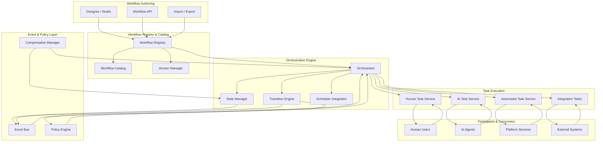
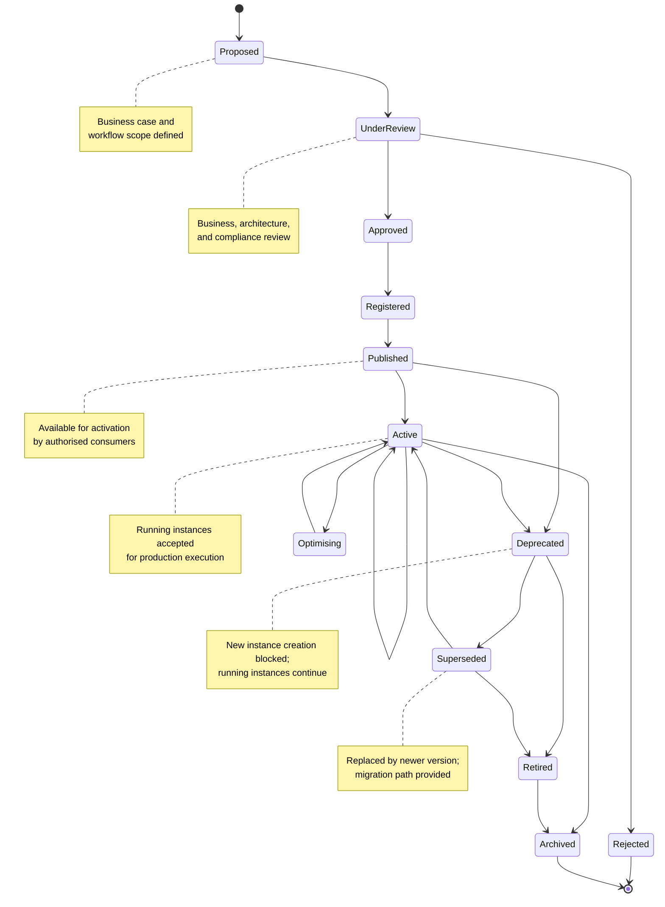
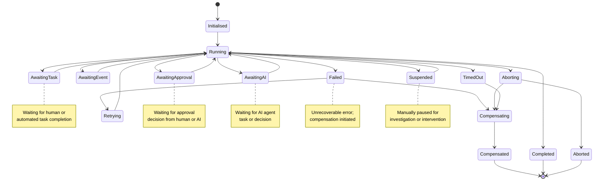
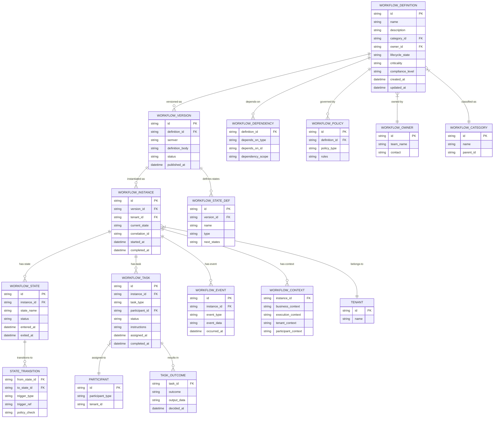
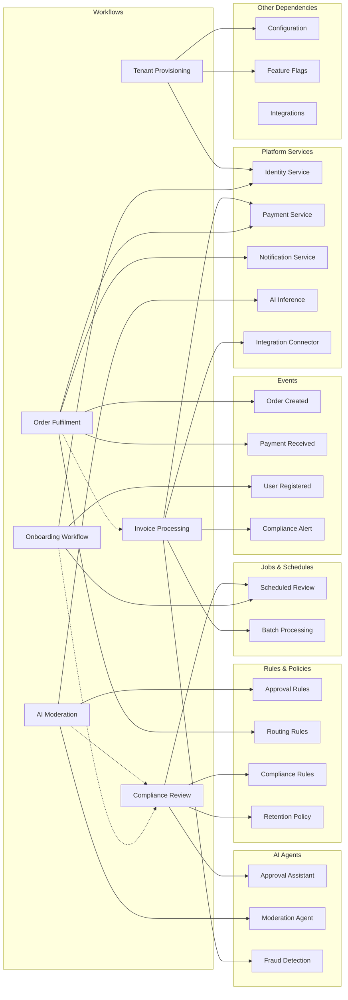
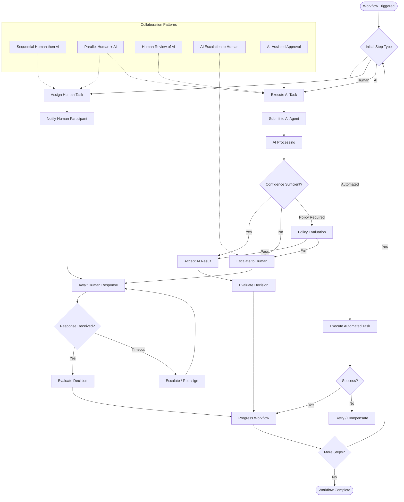
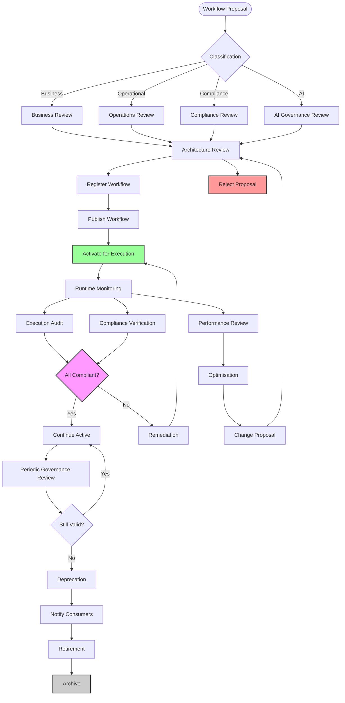
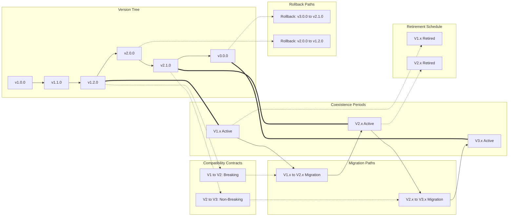
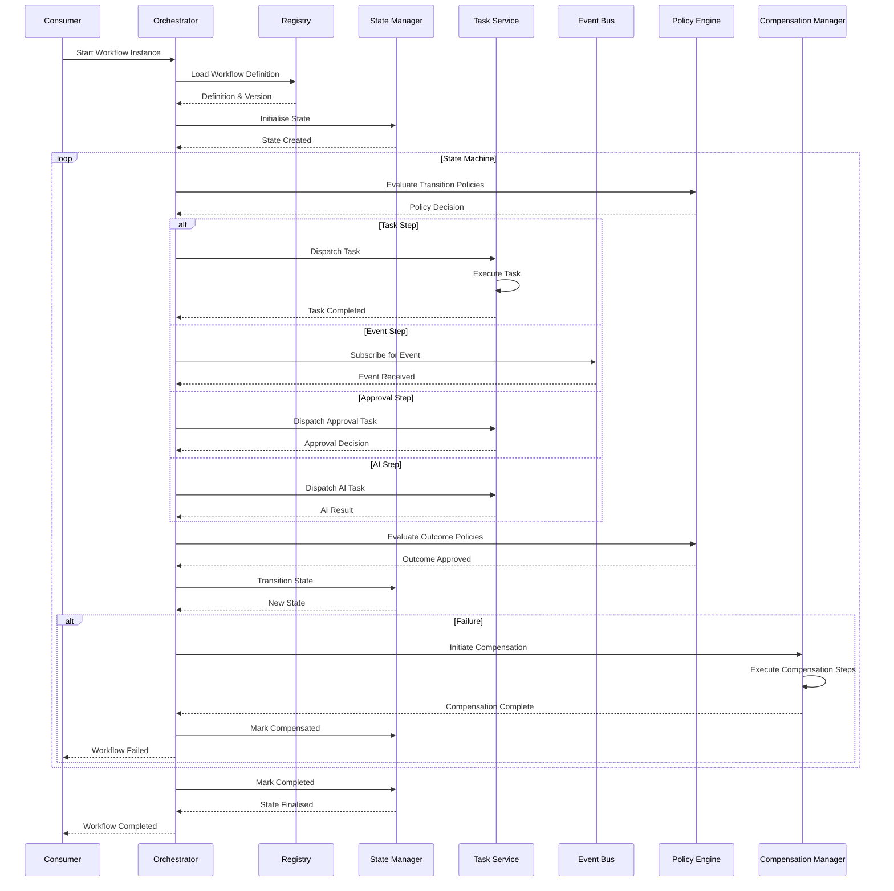

# KB-113 — Workflow Orchestration Architecture

**Suite:** Enterprise Platform Services  
**Version:** 1.0  
**Status:** Approved Architecture  
**Classification:** Core Platform Service Architecture  
**Last Updated:** 2026-07-12

---

## Executive Summary

This document defines the enterprise architecture governing workflow orchestration as a shared platform capability within DUKADESK. The Workflow Orchestration Platform provides a unified architecture for coordinating business processes spanning people, applications, AI agents, services, tenants, integrations, and external organisations.

The architecture separates workflow definition from execution technology while supporting long-running, distributed, event-driven, and policy-governed enterprise workflows.

---

## Purpose

Define how DUKADESK models, governs, executes, monitors, optimises, and retires workflows consistently across the enterprise platform.

---

## Scope

### In Scope

- Enterprise workflow architecture
- Workflow registry
- Workflow catalog
- Workflow taxonomy
- Workflow lifecycle
- Workflow governance
- Workflow definitions
- Workflow orchestration
- Human tasks
- Automated tasks
- AI tasks
- Approval workflows
- Long-running workflows
- Distributed workflows
- Event-driven workflows
- State management
- Workflow transitions
- Workflow dependencies
- Workflow compensation
- Exception handling
- Workflow versioning
- Workflow auditing
- Workflow observability
- Workflow optimisation

### Out of Scope

- Job scheduling implementation
- Business rule implementation
- Low-level service orchestration
- Process implementation logic
- BPM tooling implementation

*The above items are covered in separate Knowledge Base documents (see Cross References).*

---

## Architectural Principles

| # | Principle | Description |
|---|-----------|-------------|
| 1 | **Workflow as a Platform Capability** | Workflow orchestration is a shared platform service, not an application-level concern. All enterprise processes use the canonical platform. |
| 2 | **Separation of Process and Execution** | Workflow definitions are authored independently of the execution engine, enabling portability and technology evolution. |
| 3 | **Business-Driven Orchestration** | Workflows are modelled from business intent, not technical implementation. Process logic reflects business semantics. |
| 4 | **Event-Driven Coordination** | Workflow progression is driven by platform events enabling reactive, loosely-coupled, and scalable orchestration. |
| 5 | **Human and AI Collaboration** | Workflows support human tasks, AI tasks, and hybrid collaboration with consistent governance and audit. |
| 6 | **Policy-Driven Execution** | Workflow behaviour, permissions, retention, and compliance are governed by declarative policies. |
| 7 | **Vendor Independence** | Workflow definitions and execution are provider-agnostic, supporting any orchestration backend without definition changes. |
| 8 | **Technology Neutrality** | Workflow models are expressed in technology-neutral formats decoupled from specific frameworks or runtime environments. |
| 9 | **Multi-Tenant Isolation** | Tenant workflows are strictly isolated. Cross-tenant workflow coordination requires explicit governance. |
| 10 | **Zero Trust** | No workflow participant, service, or system is implicitly trusted. Every state transition is authenticated, authorised, and audited. |
| 11 | **Resilience by Design** | Workflows are resilient to participant, service, infrastructure, and provider failures through compensation, retry, and recovery mechanisms. |
| 12 | **Observability by Default** | All workflow operations emit structured telemetry for monitoring, audit, optimisation, and compliance. |

---

## Canonical Definitions

| Term | Definition |
|------|------------|
| **Workflow** | A governed, versioned orchestration of tasks, decisions, and state transitions that coordinates participants and services to achieve a defined business outcome. |
| **Workflow Definition** | The authored specification of a workflow including states, transitions, tasks, decisions, policies, and compensation logic, stored in the registry. |
| **Workflow Instance** | A running execution of a workflow definition with its own state, context, history, and participant assignments. |
| **Workflow Registry** | The authoritative system of record for all governed workflow definitions, their metadata, versions, and lifecycle state. |
| **Workflow Catalog** | A discovery interface over the registry enabling search, classification, reuse, dependency analysis, and governance reporting. |
| **Workflow State** | The current position of a workflow instance within its defined state machine, capturing progression, wait conditions, and completion status. |
| **Workflow Step** | A named phase or stage within a workflow representing a logical unit of progression. |
| **Workflow Transition** | A governed movement between workflow states triggered by task completion, event reception, policy evaluation, or temporal conditions. |
| **Workflow Task** | A unit of work assigned to a participant (human, AI, service, or system) within a workflow step. |
| **Human Task** | A workflow task requiring human judgement, input, approval, or action. |
| **Automated Task** | A workflow task executed by a platform service or integration without human intervention. |
| **AI Task** | A workflow task executed by an AI agent or model under defined governance, safety, and escalation policies. |
| **Approval** | A specialised human or AI task that grants or denies authorisation for a workflow to proceed through a gated transition. |
| **Workflow Context** | The aggregated data, metadata, and state associated with a workflow instance, including business context, participant context, and execution history. |
| **Workflow Owner** | The entity responsible for a workflow definition's lifecycle, governance, business alignment, and optimisation. |
| **Workflow Policy** | A declarative rule governing workflow execution, access, retention, compliance, or participant behaviour. |
| **Workflow Dependency** | A relationship between a workflow and another platform asset (service, event, job, rule, policy, AI agent, or integration) required for execution. |
| **Workflow Compensation** | A defined set of actions that reverse or mitigate the effects of a completed workflow step when subsequent steps fail or the workflow is aborted. |
| **Workflow Lifecycle** | The progression of a workflow definition through defined states from proposal through retirement. |
| **Workflow Version** | A semantically versioned iteration of a workflow definition supporting coexistence, migration, and rollback. |

---

## Architecture

### 1. Enterprise Workflow Architecture

The Workflow Orchestration Platform provides a centralised orchestration layer that decouples workflow definitions from execution, enabling consistent governance, observability, and resilience across all enterprise processes.

### 2. Workflow Lifecycle

Every workflow definition progresses through a defined lifecycle with gated transitions ensuring governance, validation, and portfolio management.

### 3. Workflow State Machine

Each workflow instance executes within a defined state machine that governs progression, task assignment, event handling, error recovery, and compensation.

### 4. Workflow Context Model

The workflow context model defines the relationships among workflow definitions, instances, states, tasks, participants, events, policies, and compensation actions.

### 5. Workflow Dependency Graph

Workflows exist within a dependency graph that spans services, events, jobs, rules, policies, AI agents, integrations, and other workflows.

### 6. Human–AI Collaboration Workflow

The platform supports hybrid workflows where human tasks, AI tasks, and automated tasks coordinate under unified governance, escalation policies, and audit.

### 7. Workflow Governance Structure

Workflow governance enforces oversight across definition, execution, compliance, security, and portfolio management through a structured review and approval framework.

### 8. Workflow Version Evolution

Workflow versions evolve through semantic versioning with support for parallel coexistence, consumer migration, compatibility contracts, and rollback.

### 9. Workflow Orchestration Sequence

The orchestration sequence governs how workflow instances progress through states, dispatch tasks, handle events, evaluate policies, and manage compensation.

### 10. Enterprise Workflow Ecosystem

The enterprise workflow ecosystem encompasses all workflow domains, their relationships, integration points, participant types, and governance boundaries.

```mermaid
graph TB
    subgraph "Workflow Ecosystem"
        subgraph "Business Workflows"
            BW_ORD[Order Fulfilment]
            BW_INV[Invoice Processing]
            BW_ONB[Customer Onboarding]
            BW_CRM[CRM Processes]
            BW_ERP[ERP Processes]
        end

        subgraph "Operational Workflows"
            OW_PROV[Tenant Provisioning]
            OW_CONFIG[Configuration Management]
            OW_MONITOR[Incident Response]
            OW_BACKUP[Backup & Recovery]
        end

        subgraph "Administrative Workflows"
            AW_APP[Approval Workflows]
            AW_REV[Periodic Review]
            AW_AUD[Audit Processing]
            AW_COMP[Compliance Reporting]
        end

        subgraph "AI Workflows"
            AI_MOD[AI Moderation]
            AI_DEC[AI Decision Making]
            AI_ESC[AI Escalation]
            AI_OPT[AI Optimisation]
        end

        subgraph "Cross-Domain Workflows"
            CD_MP[Marketplace Processes]
            CD_BS[Builder Studio Workflows]
            CD_INT[Integration Orchestration]
            CD_PART[Partner Processes]
        end
    end

    subgraph "Platform Integration"
        SCHED[Scheduling Service]
        NOTIF[Notification Platform]
        MSG[Messaging Platform]
        RULES[Business Rules Engine]
        POLICY[Policy Engine]
        AI_PLAT[AI Platform]
        CONFIG[Configuration Management]
    end

    subgraph "Participants"
        P_HUMAN[Human Users]
        P_AI[AI Agents]
        P_SVC[Services]
        P_EXT[External Systems]
        P_TENANT[Tenants]
    end

    BW_ORD --> NOTIF
    BW_ORD --> RULES
    BW_ORD --> MSG
    BW_INV --> SCHED
    BW_INV --> POLICY
    BW_ONB --> CONFIG
    BW_ONB --> NOTIF

    OW_PROV --> CONFIG
    OW_PROV --> SCHED
    OW_MONITOR --> NOTIF
    OW_MONITOR --> MSG

    AW_APP --> RULES
    AW_APP --> POLICY
    AW_AUD --> SCHED

    AI_MOD --> AI_PLAT
    AI_DEC --> AI_PLAT
    AI_DEC --> RULES
    AI_ESC --> MSG
    AI_OPT --> SCHED

    CD_MP --> NOTIF
    CD_MP --> POLICY
    CD_BS --> CONFIG
    CD_INT --> POLICY
    CD_PART --> NOTIF
    CD_PART --> MSG

    BW_ORD --> P_HUMAN
    BW_ORD --> P_SVC
    BW_INV --> P_AI
    AW_APP --> P_HUMAN
    AW_APP --> P_AI
    AI_MOD --> P_AI
    AI_ESC --> P_HUMAN
    OW_PROV --> P_TENANT
    CD_PART --> P_EXT
```

---

## Lifecycle

| Phase | Description | Gates |
|-------|-------------|-------|
| **Proposal** | Business owner submits workflow proposal with business case, scope, and high-level process definition. | Business case validation |
| **Business Review** | Business stakeholders review alignment with business objectives, process efficiency, and domain ownership. | Business sign-off |
| **Architecture Review** | Enterprise Architecture evaluates technical alignment, dependency impact, taxonomy fit, and governance requirements. | Architecture sign-off |
| **Registration** | Workflow definition is registered in the Workflow Registry with metadata, ownership, and classification. | Registry entry verified |
| **Publication** | Workflow is published as an available version for authorised consumers to instantiate. | Publication validation |
| **Activation** | Workflow is activated for production execution. Running instances are accepted and orchestrated. | Activation approval |
| **Execution** | Workflow instances are created, orchestrated, monitored, and completed according to the definition. | Instance lifecycle |
| **Monitoring** | Continuous monitoring of workflow health, performance, compliance, and optimisation opportunities. | Operational review |
| **Optimisation** | Workflow is analysed for efficiency, bottleneck identification, and improvement opportunities. | Optimisation review |
| **Version Evolution** | Workflow versions evolve through semantic versioning with coexistence and migration support. | Version governance |
| **Deprecation** | Workflow version is marked deprecated; new instance creation is blocked; existing instances continue. | Deprecation notice |
| **Retirement** | Workflow version is retired; all remaining instances are either completed, migrated, or aborted. | Retirement approval |
| **Historical Archival** | Workflow metadata and audit history are archived for compliance and reference. | Archive completion |

---

## Governance

| Domain | Governance Mechanism | Responsible Body |
|--------|---------------------|------------------|
| **Workflow Ownership** | Every workflow definition must have a registered business owner and technical steward. | Enterprise Architecture |
| **Business Governance** | Workflow business alignment, value realisation, and process fitness are reviewed periodically. | Business Owners |
| **Architecture Governance** | Workflow definitions undergo architecture review for platform alignment, dependency fit, and taxonomy compliance. | Architecture Review Board |
| **Compliance Governance** | Workflows handling regulated processes undergo compliance review and periodic revalidation. | Compliance |
| **Security Governance** | Workflow security controls, participant validation, and data handling are reviewed per risk classification. | Security |
| **Lifecycle Governance** | Lifecycle transitions are gated and audited. Stale or orphaned workflows are escalated for remediation. | Platform Engineering |
| **Version Governance** | Version changes follow semantic versioning with consumer notification, coexistence periods, and migration plans. | Platform Engineering |
| **Operational Governance** | Runtime SLAs, incident response, capacity management, and performance optimisation are governed per operational tier. | Operations |
| **Audit Governance** | All workflow operations are audited with immutable records for compliance and investigation. | Audit Teams |
| **Portfolio Governance** | Portfolio-level review identifies redundant, overlapping, or obsolete workflow definitions for consolidation. | Enterprise Architecture |

---

## Responsibilities

| Role | Responsibilities |
|------|-----------------|
| **Enterprise Architecture** | Define workflow standards, taxonomy, governance model; conduct architecture reviews; maintain portfolio. |
| **Business Owners** | Own workflow business intent, value definition, process accuracy, and stakeholder alignment. |
| **Platform Engineering** | Build and maintain Workflow Orchestration Platform, registry, state management, task dispatch, and compensation engine. |
| **Product Teams** | Define product workflow requirements; integrate product capabilities with the orchestration platform. |
| **Operations** | Monitor workflow execution health, performance, and compliance; respond to incidents; manage capacity. |
| **Security** | Perform security reviews; define workflow authorisation and authentication standards; audit execution access. |
| **Compliance** | Conduct compliance reviews; define workflow retention and audit policies; enforce regulatory requirements. |
| **AI Governance Teams** | Govern AI task behaviour; enforce ethics and safety policies; audit AI workflow interactions and escalation paths. |
| **Tenant Administrators** | Manage tenant-specific workflow activation, configuration, and monitoring within tenant scope. |
| **Audit Teams** | Review workflow audit logs; verify governance compliance; assess workflow execution integrity. |

---

## Security

| Control Area | Architecture |
|-------------|--------------|
| **Workflow Authorisation** | Every workflow operation (start, transition, task completion, approval) is authorised against participant identity and role. |
| **Participant Validation** | All workflow participants (human, AI, service) are authenticated before task assignment or state transition. |
| **Secure State Transitions** | State transitions are cryptographically verifiable. Transition history is immutable. |
| **Zero Trust** | No workflow participant, service, or system is implicitly trusted. Every operation is authenticated, authorised, and audited. |
| **Tenant Isolation** | Tenant workflow instances are strictly partitioned. Cross-tenant workflow coordination requires explicit governance. |
| **Policy Enforcement** | Security policies are evaluated at every state transition, task dispatch, and compensation action. |
| **Secure Approvals** | Approval tasks require cryptographic verification of the decision. Approval records are non-repudiable. |
| **Auditability** | Every workflow event, state transition, task outcome, and policy evaluation is logged with full context. |
| **Workflow Integrity** | Workflow definitions are versioned and checksummed. Runtime integrity is verifiable against the registered definition. |
| **Least Privilege** | Participants are granted the minimum permissions required for their workflow role. Service accounts are scoped per workflow. |

---

## Privacy

| Domain | Architecture |
|--------|--------------|
| **Tenant Privacy** | Tenant workflow data, context, and execution history are strictly isolated. No cross-tenant visibility is possible. |
| **Participant Privacy** | Participant identity and task assignments are protected. Workflow context is scoped to authorised roles. |
| **Data Minimisation** | Workflow context captures only data necessary for execution. Retention policies govern context lifecycle. |
| **Regulatory Compliance** | Workflows handling regulated data enforce compliance policies at definition and execution layers. |
| **Regional Governance** | Workflow execution respects regional boundaries. Regional workflow instances remain within jurisdiction. |
| **Cross-Border Workflows** | Workflows executing across geographic regions are explicitly classified and subject to data transfer compliance. |
| **Retention Policies** | Workflow execution history, audit logs, and context are retained per domain-specific policies with legal hold override. |
| **Privacy-Aware Workflow Execution** | Workflow context is filtered per participant entitlement. Sensitive data is masked or excluded from non-privileged participants. |

---

## Performance

| Consideration | Architectural Approach |
|---------------|----------------------|
| **Enterprise-Scale Orchestration** | The orchestration engine scales horizontally. Workflow instances are partitioned by tenant and domain. |
| **Long-Running Workflows** | Workflow state is persisted durably. Suspended and awaiting workflows are materialised on demand. |
| **Distributed Execution** | Workflow orchestration spans regions with state replication. Cross-region coordination is asynchronous. |
| **High Availability** | The orchestration engine is deployed across availability zones. Workflow state is replicated for durability. |
| **Workflow Scalability** | The platform supports hundreds of thousands of concurrent workflow instances. Throughput scales with engine capacity. |
| **State Persistence Efficiency** | State storage uses event sourcing for durability and audit. Snapshots are materialised for recovery efficiency. |
| **Multi-Region Execution** | Regional workflow engines operate independently with asynchronous state synchronisation for cross-region workflows. |
| **Operational Resilience** | Workflow instances survive engine restarts, regional failovers, and infrastructure failures through persisted state recovery. |

---

## Observability

| Domain | Architecture |
|--------|--------------|
| **Workflow Health** | Engine health, instance throughput, state transition latency, and error rates are continuously monitored. |
| **Workflow Metrics** | Active instances, completion rates, failure rates, average duration, and task distribution are tracked per workflow version. |
| **State Transition Analytics** | Transition durations, bottleneck states, wait times, and transition failure rates are analysed for optimisation. |
| **SLA Monitoring** | Workflow duration SLAs, task completion SLAs, and approval response SLAs are monitored per operational tier. |
| **Dependency Visibility** | The dependency graph is rendered as a live view showing workflow dependencies, health status, and impact paths. |
| **Operational Dashboards** | Role-specific dashboards expose orchestration health, instance status, queue depths, and incident status. |
| **Governance Reporting** | Governance reports summarise workflow portfolio, version adoption, compliance status, and lifecycle distribution. |
| **Audit Reporting** | Immutable audit trails support investigation, compliance reporting, and forensic analysis of workflow execution. |
| **Optimisation Metrics** | Cycle times, rework rates, approval delays, and automation rates are tracked for continuous improvement. |
| **AI Workflow Analytics** | AI task accuracy, escalation rates, human intervention frequency, and AI confidence distributions are monitored. |

---

## Failure Scenarios

| Scenario | Architectural Response |
|----------|-----------------------|
| **Workflow Deadlock** | Deadlock detection identifies circular waiting conditions. Automatic escalation triggers intervention or compensation. |
| **Failed Transitions** | Transition failure triggers retry with configurable policy. Persistent failure escalates to compensation. |
| **Human Approval Timeout** | Approval timeout triggers escalation to alternate approver or supervisory role. Escalation chain is configurable. |
| **AI Task Failure** | AI task failure triggers retry with degraded confidence threshold. Repeated failure escalates to human intervention. |
| **State Corruption** | Immutable state history prevents corruption. Corrupted instance state is recoverable from event-sourced log. |
| **Dependency Failure** | Workflow pauses on dependency unavailability. Dependency health is pre-checked where possible. Timeout triggers compensation. |
| **Compensation Failure** | Compensation failure triggers manual escalation. Compensation steps are idempotent and retryable. |
| **Orchestration Interruption** | Engine interruption pauses in-flight instances. Instances resume from persisted state upon engine recovery. |
| **Cross-Tenant Policy Violation** | Cross-tenant coordination attempts are blocked at the authorisation layer. Violations are logged and escalated. |
| **Version Incompatibility** | Incompatible version binding is detected at instance creation. Consumer is notified and migration path is provided. |
| **Recovery Failure** | Instance recovery from persisted state fails. The instance is flagged for manual investigation with full context preserved. |
| **Regional Outage** | Regional engine failover routes new instances to alternate region. In-flight instances resume from replicated state. |

---

## Anti-Patterns

| Anti-Pattern | Prohibited Because | Enforced By |
|--------------|-------------------|-------------|
| **Hardcoded Workflows** | Embeds process logic in application code, preventing governance, versioning, and observability. | Code review; static analysis |
| **Application-Owned Workflow Engines** | Fragments orchestration, duplicates governance, and creates inconsistent process execution. | Architecture review; platform policy |
| **Manual State Tracking** | Creates audit gaps, introduces human error, and prevents automated recovery. | Platform enforcement |
| **Hidden Workflow Logic** | Workflow logic outside the registry is invisible to governance, audit, and dependency analysis. | Registry mandatory check |
| **Unmanaged Approvals** | Approvals without governance lack non-repudiation, audit trail, and escalation paths. | Authorisation enforcement |
| **Missing Ownership** | Orphaned workflows cannot be governed, optimised, or retired. | Registry ownership enforcement |
| **Duplicate Workflow Definitions** | Fragments governance, creates inconsistency, and increases maintenance burden. | Registry deduplication checks |
| **Untracked Dependencies** | Missing dependency awareness leads to unexpected failures during service or version changes. | Dependency validation |
| **Non-Auditable Workflow Execution** | Workflow execution without audit violates compliance and governance requirements. | Mandatory audit logging |
| **Workflow-Specific Business Logic in Infrastructure** | Couples business processes to infrastructure, preventing portability and technology evolution. | Architecture review |

---

## Future Evolution

| Evolution Path | Architectural Preparation |
|---------------|--------------------------|
| **AI-Generated Workflows** | Workflow definitions are structured to enable automated generation from business intent descriptions using LLMs. |
| **Autonomous Business Orchestration** | AI agents autonomously create, execute, and optimise workflows based on business objectives and policy constraints. |
| **Intelligent Workflow Optimisation** | ML-driven analysis identifies optimisation opportunities, predicts bottlenecks, and recommends process improvements. |
| **Adaptive Process Orchestration** | Workflows dynamically adapt to context, load, participant availability, and policy changes without definition changes. |
| **Self-Healing Workflows** | Automated detection and recovery from failures, deadlocks, and policy violations without human intervention. |
| **Semantic Workflow Discovery** | Registry supports semantic search over workflow capabilities, enabling autonomous discovery by AI agents and services. |
| **Digital Workforce Coordination** | AI agents autonomously coordinate with human workers, each other, and external systems through governed workflows. |
| **Autonomous Enterprise Operations** | End-to-end business processes are autonomously orchestrated with human oversight by exception only. |

---

## Cross References

| Document ID | Title | Relation |
|-------------|-------|----------|
| **KB-077** | Event & Messaging Architecture | Defines the event infrastructure driving event-driven workflow transitions. |
| **KB-083** | Data Synchronization Architecture | Defines synchronisation dependencies for cross-region workflow state. |
| **KB-107** | Enterprise Platform Services Overview Architecture | Defines the platform services context for workflow orchestration. |
| **KB-108** | Configuration Management Architecture | Defines configuration governing workflow behaviour and policies. |
| **KB-109** | Feature Flag & Feature Management Architecture | Defines feature flags controlling workflow activation and routing. |
| **KB-110** | Notification Platform Architecture | Defines notification delivery for human task assignment and approval requests. |
| **KB-111** | Messaging & Communication Platform Architecture | Defines conversation and messaging integration for collaborative workflows. |
| **KB-112** | Scheduling & Job Orchestration Architecture | Defines scheduling for time-based workflow triggers and batch processing. |
| **KB-114** | Business Rules Engine Architecture | Defines business rule evaluation for workflow decisions and routing. |
| **KB-116** | AI Platform Architecture | Defines AI platform integration for AI tasks within workflows. |
| **KB-117** | AI Agent Framework Architecture | Defines AI agent participation in human-AI collaborative workflows. |
| **KB-121** | AI Safety & Governance Architecture | Defines safety policies governing AI task execution within workflows. |
| **KB-122** | AI Decision Intelligence Architecture | Defines AI decision-making used in workflow approval and routing steps. |
| **KB-124** | Policy Management Architecture | Defines the policy framework enforced during workflow execution. |
| **KB-138** | Platform Automation Architecture | Defines automation patterns enabled by workflow orchestration. |
| **KB-140** | Enterprise Platform Services Reference Architecture | Defines the overarching reference architecture for enterprise platform services. |

---

## Acceptance Criteria

- [x] Defines enterprise Workflow Orchestration architecture.
- [x] Separates workflow definition from execution technology.
- [x] Supports human, AI, service, and hybrid workflows.
- [x] Defines governance, lifecycle, state management, dependencies, and versioning.
- [x] Supports enterprise-scale, distributed, multi-tenant orchestration.
- [x] Includes all 10 required Mermaid diagrams.
- [x] Cross-references related Knowledge Base documents.
- [x] Contains no implementation guidance.

---

## Completion Instructions

1. **Mark KB-113 as Completed** — This document constitutes the completed architecture specification.
2. **Update the Progress Registry** — Record KB-113 as Approved Architecture in the Knowledge Base registry.
3. **Cross-Reference Related Documents** — Ensure KB-077 through KB-140 reference this document.
4. **Queue Next Assignment** — KB-114 – Business Rules Engine Architecture is the next builder assignment.

---

## Critical DUKADESK Architectural Rule

> **All business and operational processes within DUKADESK shall be orchestrated through the centralised Workflow Orchestration Platform. No application, service, tenant, or AI component shall independently implement enterprise workflow logic outside the canonical workflow architecture, ensuring consistent governance, security, auditability, resilience, and scalable cross-platform process execution.**
