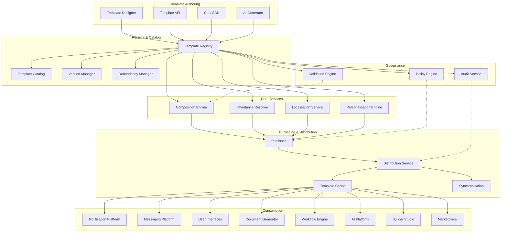
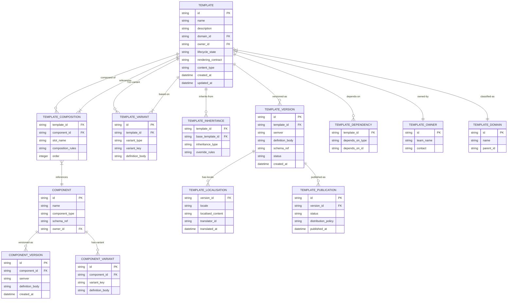
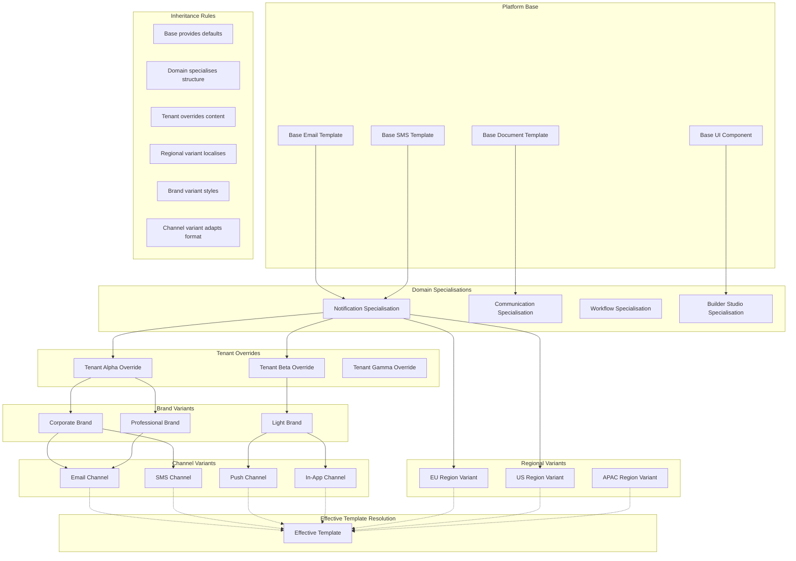
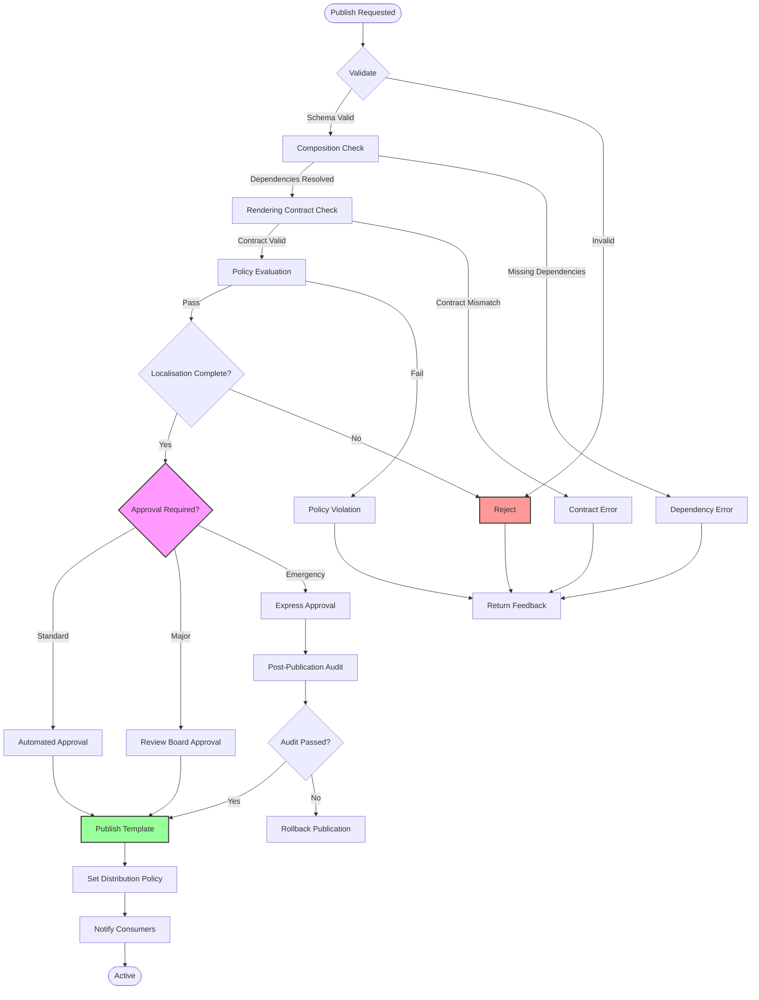
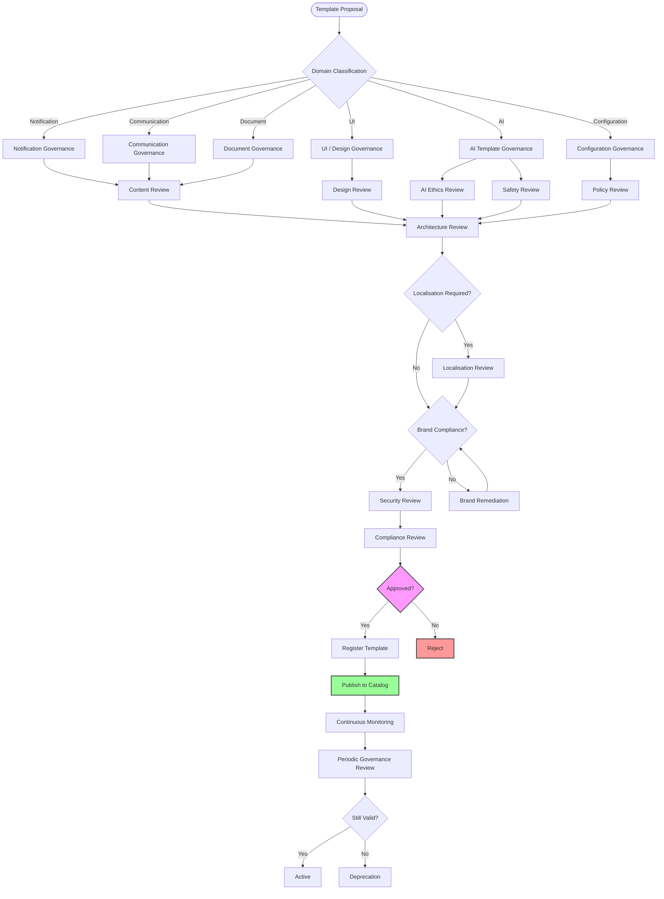
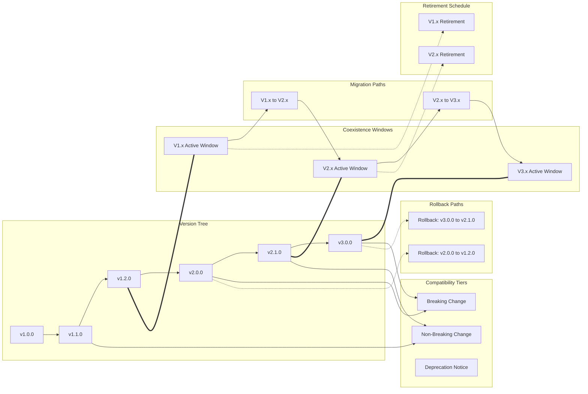
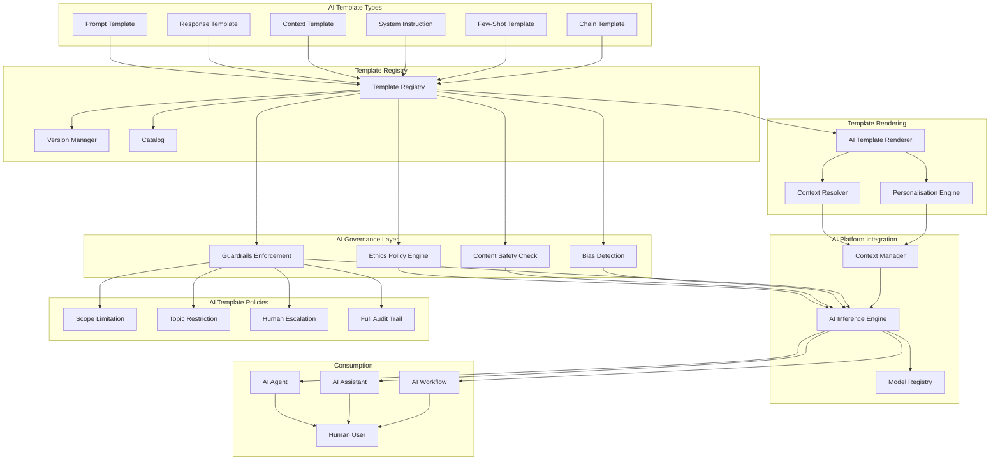

# KB-115 — Template Management Architecture

**Suite:** Enterprise Platform Services  
**Version:** 1.0  
**Status:** Approved Architecture  
**Classification:** Core Platform Service Architecture  
**Last Updated:** 2026-07-12

---

## Executive Summary

This document defines the enterprise architecture governing templates as a shared platform capability within DUKADESK. The Template Management Platform provides a centralised architecture for creating, organising, governing, versioning, composing, publishing, and consuming reusable templates across the DUKADESK ecosystem.

Templates are treated as governed enterprise assets independent of applications, channels, rendering technologies, or storage mechanisms, ensuring consistency, reuse, localisation, personalisation, AI readiness, and lifecycle governance.

---

## Purpose

Define how DUKADESK manages reusable templates throughout their lifecycle while enabling enterprise-wide consistency, governance, discoverability, extensibility, and controlled evolution.

---

## Scope

### In Scope

- Enterprise template architecture
- Template registry
- Template catalog
- Template taxonomy
- Template lifecycle
- Template governance
- Template ownership
- Template composition
- Template inheritance
- Template versioning
- Template localisation
- Template personalisation
- Template metadata
- Template dependencies
- Template publishing
- Template distribution
- Template rendering contracts
- Template validation
- Template auditing
- Template observability
- AI-assisted templates

Supported template domains:

- Notification templates
- Communication templates
- Document templates
- Report templates
- UI templates
- Email templates
- SMS templates
- Workflow templates
- Builder Studio templates
- Marketplace templates
- AI prompt templates
- Configuration templates
- Policy templates
- Future platform templates

### Out of Scope

- Rendering engine implementation
- UI implementation
- Document generation implementation
- Email provider implementation
- Prompt execution implementation

*The above items are covered in separate Knowledge Base documents (see Cross References).*

---

## Architectural Principles

| # | Principle | Description |
|---|-----------|-------------|
| 1 | **Templates as Enterprise Assets** | Templates are governed enterprise resources with ownership, lifecycle, versioning, and compliance obligations. |
| 2 | **Separation of Content from Presentation** | Template content, structure, and presentation concerns are separated, enabling channel-independent reuse. |
| 3 | **Centralised Governance** | Template schemas, policies, taxonomy, and lifecycle are governed centrally to ensure consistency and compliance. |
| 4 | **Reuse by Default** | Templates are designed for reuse. New templates are composed from existing components before new creation. |
| 5 | **Composition over Duplication** | Templates are assembled from reusable components, fragments, and shared sections rather than duplicated. |
| 6 | **Vendor Independence** | Template definitions are provider-agnostic, supporting any rendering or delivery backend without definition changes. |
| 7 | **Technology Neutrality** | Templates are expressed in technology-neutral formats decoupled from specific frameworks or rendering engines. |
| 8 | **Multi-Tenant Isolation** | Tenant template variants, overrides, and localisations are strictly isolated. |
| 9 | **AI-Ready Architecture** | Template structures and metadata support AI generation, discovery, optimisation, and autonomous composition. |
| 10 | **Zero Trust** | No template consumer, publisher, or component is implicitly trusted. Every operation is authenticated, authorised, and audited. |
| 11 | **Localisation by Design** | Localisation is intrinsic to the template model. Every template supports multi-locale content from inception. |
| 12 | **Versioning by Default** | Every template change creates an immutable version supporting audit, rollback, and lineage. |
| 13 | **Observability by Design** | All template operations emit structured telemetry for audit, monitoring, usage analytics, and governance. |

---

## Canonical Definitions

| Term | Definition |
|------|------------|
| **Template** | A governed, versioned, reusable asset containing structured content, layout, and metadata designed for composition and rendering across one or more channels. |
| **Template Registry** | The authoritative system of record for all governed templates, their metadata, versions, dependencies, and lifecycle state. |
| **Template Catalog** | A discovery interface over the registry enabling search, classification, reuse analysis, dependency tracking, and governance reporting. |
| **Template Definition** | The authored specification of a template including content structure, composition rules, rendering contract, and metadata. |
| **Template Instance** | A rendered or materialised output produced from a template combined with context data for a specific use case. |
| **Template Component** | A reusable, governable sub-unit of a template (header, footer, section, card, button) that can be composed into larger templates. |
| **Template Composition** | The assembly of a template from one or more components, fragments, or sub-templates through defined composition rules. |
| **Template Inheritance** | A mechanism by which a specialised template derives structure and content from a base template while allowing overrides. |
| **Template Variant** | A derivative of a template modified for a specific channel, brand, region, tenant, or use case while maintaining inheritance from the base. |
| **Template Version** | An immutable, timestamped snapshot of a template definition supporting audit, rollback, and lineage tracing. |
| **Template Owner** | The entity responsible for a template's lifecycle, governance, content accuracy, and optimisation. |
| **Template Metadata** | Structured information about a template including identity, domain, owner, version, locale, dependencies, and governance attributes. |
| **Template Dependency** | A relationship between a template and another platform asset (component, asset, schema, policy, or configuration) required for composition or rendering. |
| **Template Context** | The structured data provided to a template at rendering time to populate dynamic content while maintaining separation of content and presentation. |
| **Template Rendering Contract** | The formal specification defining the input context schema, output format, capabilities, and constraints of a template independently of the rendering engine. |
| **Template Lifecycle** | The progression of a template through defined states from proposal through archival. |
| **Template Publication** | The act of making a template version available for consumption with associated distribution policies. |
| **Template Localisation** | The adaptation of template content for a specific locale, including translation, formatting, and cultural adaptation. |
| **Template Personalisation** | The dynamic adaptation of template content based on recipient identity, preferences, behaviour, or context. |
| **Effective Template** | The resolved template after applying inheritance, composition, localisation, personalisation, and variant selection. |

---

## Architecture

### 1. Enterprise Template Management Architecture

The Template Management Platform provides a centralised capability for authoring, governing, composing, publishing, and distributing templates across all DUKADESK domains.



### 2. Template Lifecycle

Every template progresses through a defined lifecycle with gated transitions ensuring governance, validation, and portfolio management.

```mermaid
stateDiagram-v2
    [*] --> Proposed
    Proposed --> UnderReview
    UnderReview --> Approved
    UnderReview --> Rejected
    Rejected --> [*]

    Approved --> Draft
    Draft --> Registered
    Registered --> Published

    Published --> Active
    Published --> Deprecated

    Active --> Active
    Active --> Optimising
    Active --> Deprecated
    Active --> Archived

    Optimising --> Active

    Deprecated --> Superseded
    Deprecated --> Retired

    Superseded --> Active
    Superseded --> Retired

    Retired --> Archived
    Archived --> [*]

    note right of Proposed
        Template scope, domain,
        and justification defined
    end note

    note right of UnderReview
        Content, design, architecture,
        and compliance review
    end note

    note right of Published
        Available for consumption
        with defined distribution
    end note

    note right of Active
        Currently consumed
        in production scenarios
    end note

    note right of Deprecated
        New consumption prohibited;
        existing consumers notified
    end note

    note right of Suerseded
        Replaced by newer version;
        migration path provided
    end note
```

### 3. Template Taxonomy

Templates are classified by domain, purpose, channel, and governance tier, enabling consistent discovery, routing, and policy enforcement.

```mermaid
graph TD
    Root[Template Domains]

    Root --> NOTIF[Notification]
    NOTIF --> NOTIF_EMAIL[Email]
    NOTIF --> NOTIF_SMS[SMS]
    NOTIF --> NOTIF_PUSH[Push]
    NOTIF --> NOTIF_INAPP[In-App]

    Root --> COMM[Communication]
    COMM --> COMM_MSG[Message]
    COMM --> COMM_CHAT[Chat]
    COMM --> COMM_ANNOUNCE[Announcement]

    Root --> DOC[Document]
    DOC --> DOC_INV[Invoice]
    DOC --> DOC_REPORT[Report]
    DOC --> DOC_CONTRACT[Contract]
    DOC --> DOC_STATEMENT[Statement]

    Root --> UI[User Interface]
    UI --> UI_PAGE[Page Layout]
    UI --> UI_CARD[Card]
    UI --> UI_DASHBOARD[Dashboard]
    UI --> UI_FORM[Form]

    Root --> WF[Workflow]
    WF --> WF_APPROVAL[Approval]
    WF --> WF_TASK[Task]
    WF --> WF_NOTIF[Workflow Notification]

    Root --> BS[Builder Studio]
    BS --> BS_MODULE[Module]
    BS --> BS_BLOCK[Block]
    BS --> BS_LAYOUT[Layout]

    Root --> MKT[Marketplace]
    MKT --> MKT_LISTING[Listing]
    MKT --> MKT_EMAIL[Market Email]
    MKT --> MKT_PAGE[Landing Page]

    Root --> AI[AI]
    AI --> AI_PROMPT[Prompt]
    AI --> AI_RESPONSE[Response]
    AI --> AI_CONTEXT[Context]
    AI --> AI_SYSTEM[System Instruction]

    Root --> CONFIG[Configuration]
    CONFIG --> CONFIG_POLICY[Policy]
    CONFIG --> CONFIG_RULE[Rule]
    CONFIG --> CONFIG_SCHEMA[Schema]

    Root --> COMP[Component]
    COMP --> COMP_HEADER[Header]
    COMP --> COMP_FOOTER[Footer]
    COMP --> COMP_SECTION[Section]
    COMP --> COMP_WIDGET[Widget]
```



### 4. Template Composition Model

The template composition model defines how templates are assembled from components, fragments, sub-templates, and dynamic content with defined contracts and governance.



### 5. Template Inheritance Hierarchy

Templates support a multi-level inheritance model enabling platform base templates, domain-specific specialisations, tenant overrides, and channel or brand variants.



### 6. Template Publishing Flow

Template publishing follows a governed workflow ensuring validation, approval, distribution policy assignment, and consumer notification.



### 7. Template Governance Structure

Template governance enforces oversight across content, design, architecture, localisation, brand, compliance, and lifecycle through a structured review framework.



### 8. Template Version Evolution

Template versions evolve through semantic versioning with support for parallel coexistence, backward compatibility, migration paths, and retirement schedules.



### 9. AI Template Architecture

The AI template architecture governs prompt templates, response templates, context templates, and system instruction templates used by AI agents, with defined governance for safety, ethics, and versioning.



### 10. Enterprise Template Ecosystem

The enterprise template ecosystem encompasses all template domains, their relationships, integration points, and governance boundaries.

```mermaid
graph TB
    subgraph "Template Ecosystem"
        subgraph "Content Templates"
            NT[Notification Templates]
            CT[Communication Templates]
            DT[Document Templates]
            RT[Report Templates]
        end

        subgraph "Interface Templates"
            UIT[UI Templates]
            BST[Builder Studio Templates]
            MKT[Marketplace Templates]
        end

        subgraph "Process Templates"
            WFT[Workflow Templates]
            POLT[Policy Templates]
            CFT[Configuration Templates]
        end

        subgraph "AI Templates"
            APT[Prompt Templates]
            ART[Response Templates]
            ACT[Context Templates]
            SIT[System Instruction Templates]
        end

        subgraph "Shared Components"
            HEADER[Header Component]
            FOOTER[Footer Component]
            SECTION[Section Component]
            WIDGET[Widget Component]
        end
    end

    subgraph "Platform Integration"
        NOTIF[Notification Platform]
        MSG[Messaging Platform]
        WF[Workflow Engine]
        AI_PLAT[AI Platform]
        UI_SYS[UI System]
        DOC_GEN[Document Generation]
        BS[Builder Studio]
        MKT_PLAT[Marketplace Platform]
    end

    subgraph "Governance Boundaries"
        GB_CONTENT[Content Governance]
        GB_BRAND[Brand Governance]
        GB_LOCALE[Localisation Governance]
        GB_COMPLIANCE[Compliance Governance]
        GB_AI[AI Governance]
    end

    NT --> NOTIF
    CT --> MSG
    DT --> DOC_GEN
    RT --> DOC_GEN
    UIT --> UI_SYS
    BST --> BS
    MKT --> MKT_PLAT
    WFT --> WF
    APT --> AI_PLAT
    ART --> AI_PLAT
    ACT --> AI_PLAT
    SIT --> AI_PLAT

    HEADER --> NT
    HEADER --> CT
    HEADER --> DT
    HEADER --> UIT
    FOOTER --> NT
    FOOTER --> CT
    FOOTER --> DT
    SECTION --> NT
    SECTION --> CT
    SECTION --> DT
    WIDGET --> UIT
    WIDGET --> BST

    NT -.-> GB_CONTENT
    CT -.-> GB_CONTENT
    DT -.-> GB_CONTENT
    RT -.-> GB_CONTENT
    UIT -.-> GB_BRAND
    BST -.-> GB_BRAND
    MKT -.-> GB_BRAND
    NT -.-> GB_LOCALE
    CT -.-> GB_LOCALE
    DT -.-> GB_LOCALE
    APT -.-> GB_AI
    ART -.-> GB_AI
    SIT -.-> GB_AI
    WFT -.-> GB_COMPLIANCE
    POLT -.-> GB_COMPLIANCE
```



---

## Lifecycle

| Phase | Description | Gates |
|-------|-------------|-------|
| **Proposal** | Template scope, domain, purpose, and target consumers are defined with business justification. | Scope validation |
| **Design** | Template structure, components, rendering contract, and localisation requirements are authored. | Design review |
| **Review** | Content, design, architecture, localisation, and compliance reviews are conducted. | Review sign-off |
| **Approval** | Template is approved through the governance workflow appropriate to its domain and classification. | Governance approval |
| **Registration** | Template is registered in the Template Registry with full metadata and ownership. | Registry entry verified |
| **Publication** | Template version is published with distribution policy and made available for consumption. | Publication validation |
| **Consumption** | Templates are discovered, composed, and rendered by consuming services and platforms. | Consumption metrics |
| **Monitoring** | Usage, performance, localisation coverage, and compliance are continuously monitored. | Operational review |
| **Optimisation** | Templates are analysed for reuse, efficiency, localisation gaps, and improvement opportunities. | Optimisation review |
| **Version Evolution** | Template versions evolve through semantic versioning with coexistence and migration support. | Version governance |
| **Deprecation** | Template version is deprecated; new consumption is blocked; existing consumers are notified with migration path. | Deprecation notice |
| **Retirement** | Template version is retired; all references are migrated or removed; version is archived. | Retirement approval |
| **Historical Archival** | Template metadata and version history are archived for compliance and reference. | Archive completion |

---

## Governance

| Domain | Governance Mechanism | Responsible Body |
|--------|---------------------|------------------|
| **Template Ownership** | Every template must have a registered owner with accountability for content, lifecycle, and quality. | Enterprise Architecture |
| **Content Governance** | Template content accuracy, consistency, and brand alignment are reviewed per domain. | Content Owners / Design Systems |
| **Architecture Governance** | Template structure, composition, dependencies, and rendering contracts undergo architecture review. | Architecture Review Board |
| **Localisation Governance** | Localisation completeness, quality, and locale coverage are governed per template domain. | Localisation Teams |
| **Brand Governance** | Template brand compliance, visual consistency, and design language adherence are enforced. | Design Systems / Brand |
| **Lifecycle Governance** | Lifecycle transitions are gated and audited. Stale or unused templates are escalated. | Platform Engineering |
| **Version Governance** | Version changes follow semantic versioning with consumer notification for breaking changes. | Platform Engineering |
| **Compliance Governance** | Templates handling regulated content undergo compliance review and periodic revalidation. | Compliance |
| **Audit Governance** | All template operations are audited with immutable records for governance and investigation. | Audit Teams |
| **Change Management** | Template changes follow classification-based change management with appropriate approval gates. | Change Advisory Board |

---

## Responsibilities

| Role | Responsibilities |
|------|-----------------|
| **Enterprise Architecture** | Define template standards, taxonomy, governance model; conduct architecture reviews; maintain portfolio. |
| **Platform Engineering** | Build and maintain Template Management Platform, registry, composition engine, publishing pipeline, and distribution layer. |
| **Product Teams** | Define template requirements for product capabilities; integrate product rendering with template platform. |
| **Design Systems** | Own UI and communication template design standards, component libraries, brand compliance, and visual governance. |
| **Content Owners** | Own template content accuracy, messaging consistency, and content lifecycle within their domain. |
| **Localisation Teams** | Manage template localisation workflows, locale coverage, translation quality, and regional adaptation. |
| **Security** | Perform security reviews; define template access controls, integrity verification, and audit standards. |
| **Compliance** | Conduct compliance reviews for regulated template domains; define retention and data handling policies. |
| **AI Governance Teams** | Govern AI template safety, ethics, bias detection, and escalation policies for prompt and response templates. |
| **Tenant Administrators** | Manage tenant-specific template overrides, localisation, and variant configuration within tenant scope. |

---

## Security

| Control Area | Architecture |
|-------------|--------------|
| **Template Authorisation** | Every template operation (create, read, update, publish, delete) is authorised against identity and role. |
| **Secure Publication** | Template publication requires authorisation, content validation, and policy enforcement. Published templates are signed. |
| **Tenant Isolation** | Tenant template variants, localisations, and overrides are strictly partitioned. |
| **Content Integrity** | Template definitions are checksummed at every version. Tampering is detectable through cryptographic verification. |
| **Policy Enforcement** | Security policies are evaluated at publication, distribution, and consumption. Policy violations block the operation. |
| **Zero Trust** | No template consumer, publisher, or component is implicitly trusted. Every operation is authenticated, authorised, and audited. |
| **Least Privilege** | Template access is scoped to the minimum domain, tenant, and role required. |
| **Auditability** | Every template operation is logged with identity, timestamp, operation type, and outcome. |
| **Provenance** | Full lineage of every template version is traceable to its author, approvals, and change history. |
| **Tamper Resistance** | Template definitions are immutable once published. Modifications create new versions. |

---

## Privacy

| Domain | Architecture |
|--------|--------------|
| **Data Minimisation** | Templates define only the structure and presentation of content. Personal data is supplied at rendering time through context. |
| **Tenant Privacy** | Tenant-specific template content and localisations are isolated. No cross-tenant template visibility. |
| **Regulatory Compliance** | Templates handling regulated communication enforce compliance policies at definition and rendering layers. |
| **Regional Governance** | Template localisation and variant distribution respect regional boundaries and data residency requirements. |
| **Privacy-Aware Personalisation** | Personalisation context is scoped to the minimum data required. Sensitive data is masked in audit logs. |
| **Cross-Border Governance** | Templates distributed across geographic regions are classified for cross-border data flow compliance. |
| **Retention Policies** | Template versions and localisation content are retained per domain-specific policies. |
| **Audit Retention** | Template audit logs are retained per regulatory requirements with appropriate privacy safeguards. |

---

## Performance

| Consideration | Architectural Approach |
|---------------|----------------------|
| **Enterprise-Scale Template Retrieval** | Template registry and catalog scale horizontally. Lookups are cached and partitioned by domain and tenant. |
| **Global Distribution** | Templates are distributed to regional edge caches. Consumers resolve from the nearest cache with registry fallback. |
| **Version Resolution** | Version resolution uses semantic versioning with optimised lookup for pinned, latest, and range-based queries. |
| **Composition Efficiency** | Composition engine resolves components and inheritance lazily with aggressive caching of resolved templates. |
| **High Availability** | Template registry and composition services are deployed across availability zones with read replicas. |
| **Localisation Scalability** | Localisation content is indexed by locale and version. Bulk localisation updates are supported without service interruption. |
| **Rendering Independence** | Template resolution is decoupled from rendering. Templates are resolved in sub-millisecond time independently of rendering latency. |
| **Operational Resilience** | Consumers operate with cached template definitions during registry or distribution outages. |

---

## Observability

| Domain | Architecture |
|--------|--------------|
| **Template Usage Metrics** | Consumption counts, consumer distribution, rendering frequency, and channel breakdown are tracked per template version. |
| **Publication Analytics** | Publication frequency, approval cycle times, classification distribution, and publication success rates are measured. |
| **Version Analytics** | Version adoption rates, rollback frequency, migration progress, and version lifecycle distribution are tracked. |
| **Localisation Metrics** | Locale coverage, translation completion rates, localisation lag, and locale-specific usage are monitored. |
| **Dependency Visibility** | The template dependency graph is rendered as a live view showing template-component relationships, impact paths, and health. |
| **Governance Dashboards** | Role-specific dashboards expose template portfolio health, ownership coverage, lifecycle distribution, and compliance status. |
| **Audit Reporting** | Immutable audit trails support investigation, compliance reporting, and change history analysis. |
| **SLA Monitoring** | Template resolution latency, publication SLA compliance, and distribution coverage SLAs are monitored per tier. |
| **Consumption Analytics** | Top templates, trending templates, unused templates, and reuse ratios are analysed for portfolio optimisation. |
| **AI Template Insights** | AI prompt template effectiveness, safety policy invocation rates, escalation frequency, and personalisation impact are tracked. |

---

## Failure Scenarios

| Scenario | Architectural Response |
|----------|-----------------------|
| **Broken Template Inheritance** | Inheritance chain validation at publication detects broken references. Resolution falls back to base template with alert. |
| **Missing Template Dependencies** | Dependency check fails at publication. Missing dependencies are reported; publication is blocked until resolved. |
| **Invalid Composition** | Composition validation detects slot mismatches, contract violations, or circular references. Error is reported to author. |
| **Version Incompatibility** | Consumer requests an incompatible template version. Version negotiation returns compatible alternatives or error. |
| **Unauthorised Publication** | Publication authorisation failure blocks the operation. The attempt is logged and escalated. |
| **Localisation Inconsistencies** | Incomplete localisation is detected at publication. Warning is issued; publication proceeds with fallback locale. |
| **Template Corruption** | Immutable version history prevents corruption of published templates. Corrupted draft state is recoverable. |
| **Tenant Isolation Breach** | Cross-tenant template access is blocked at the authorisation layer. Violation is logged and escalated. |
| **Context Incompatibility** | Rendering context does not match the template contract. Validation at consumption returns a schema mismatch error. |
| **Rendering Contract Mismatch** | Template contract evolves incompatibly. Consumer is notified and migration path is provided. |
| **Recovery Failure** | Template state recovery from store fails. Instance is flagged for manual investigation with context preserved. |
| **Registry Inconsistency** | Registry index inconsistency is detected through periodic reconciliation. Automated repair restores consistency. |

---

## Anti-Patterns

| Anti-Pattern | Prohibited Because | Enforced By |
|--------------|-------------------|-------------|
| **Application-Owned Templates** | Duplicates platform capability, bypasses governance, and fragments template inventory. | Architecture review; platform policy |
| **Duplicate Templates** | Fragments governance, creates inconsistency, and increases maintenance burden. | Registry deduplication checks |
| **Hardcoded Presentation Logic** | Embeds presentation in application code, preventing reuse, localisation, and channel flexibility. | Code review; static analysis |
| **Missing Ownership** | Orphaned templates cannot be governed, reviewed, or retired. | Registry ownership enforcement |
| **Hidden Template Repositories** | Templates outside the registry are invisible to governance, discovery, and audit. | Registry mandatory check |
| **Unversioned Templates** | Prevents rollback, audit, and lineage tracing; creates risk of unrecoverable changes. | Registry versioning enforcement |
| **Direct Rendering Dependencies** | Couples templates to specific rendering engines, preventing channel and technology evolution. | Architecture review |
| **Manual Template Synchronisation** | Introduces human error, inconsistency, and audit gaps. | Automated distribution layer |
| **Embedded Business Logic** | Templates must not contain business logic. Logic belongs in workflows, rules, and services. | Architecture review; validation |
| **Untracked Localisation Variants** | Untracked variants bypass governance, create inconsistency, and increase maintenance burden. | Registry enforcement |

---

## Future Evolution

| Evolution Path | Architectural Preparation |
|---------------|--------------------------|
| **AI-Generated Templates** | Template schemas and metadata are structured to enable automated generation from natural language descriptions using LLMs. |
| **Semantic Template Discovery** | Registry supports natural language and semantic search over template capabilities, enabling AI-driven discovery. |
| **Autonomous Template Optimisation** | ML-driven analysis identifies optimisation opportunities, recommends A/B testing, and automates template improvements. |
| **Adaptive Personalisation** | Templates dynamically adapt content, structure, and channel based on real-time consumer context and behaviour. |
| **Self-Governing Template Ecosystems** | Automated governance enforcement, policy recommendation, and compliance verification for template lifecycles. |
| **Intelligent Template Composition** | AI-assisted composition recommends components, layouts, and variants based on intent and past performance. |
| **Knowledge Graph-Driven Template Relationships** | Template metadata, dependencies, and usage patterns are modelled in the enterprise knowledge graph for intelligent reasoning. |
| **Cross-Platform Template Federation** | Templates are shareable across platform boundaries with federated governance, discovery, and synchronisation. |

---

## Cross References

| Document ID | Title | Relation |
|-------------|-------|----------|
| **KB-088** | Metadata Management Architecture | Defines metadata standards for template classification and discovery. |
| **KB-089** | Knowledge Graph Architecture | Defines knowledge graph integration for semantic template relationships. |
| **KB-107** | Enterprise Platform Services Overview Architecture | Defines the platform services context for template management. |
| **KB-110** | Notification Platform Architecture | Defines notification template consumption and rendering. |
| **KB-111** | Messaging & Communication Platform Architecture | Defines communication template consumption and rendering. |
| **KB-113** | Workflow Orchestration Architecture | Defines workflow template consumption and task templates. |
| **KB-116** | AI Platform Architecture | Defines AI platform integration for prompt and response templates. |
| **KB-117** | AI Agent Framework Architecture | Defines AI agent consumption of prompt and context templates. |
| **KB-119** | Prompt Management Architecture | Defines prompt template governance and versioning. |
| **KB-124** | Policy Management Architecture | Defines the policy framework enforced during template publication. |
| **KB-127** | Digital Asset Management Architecture | Defines asset references within templates. |
| **KB-128** | Localisation & Internationalization Architecture | Defines localisation frameworks for multi-locale templates. |
| **KB-140** | Enterprise Platform Services Reference Architecture | Defines the overarching reference architecture for enterprise platform services. |

---

## Acceptance Criteria

- [x] Defines enterprise Template Management architecture.
- [x] Treats templates as governed enterprise assets.
- [x] Defines governance, lifecycle, composition, inheritance, localisation, personalisation, and versioning.
- [x] Supports enterprise-scale, multi-tenant, AI-ready operations.
- [x] Includes all 10 required Mermaid diagrams.
- [x] Cross-references related Knowledge Base documents.
- [x] Contains no implementation guidance.

---

## Completion Instructions

1. **Mark KB-115 as Completed** — This document constitutes the completed architecture specification.
2. **Update the Progress Registry** — Record KB-115 as Approved Architecture in the Knowledge Base registry.
3. **Mark the Platform Core Services subsection of the Enterprise Platform Services suite as Completed.**
4. **Queue Next Assignment** — KB-116 – AI Platform Architecture is the next builder assignment.

---

## Critical DUKADESK Architectural Rule

> **Every reusable template within DUKADESK shall be governed as a centralised enterprise asset with canonical ownership, composition, inheritance, versioning, localisation, personalisation, and lifecycle management. No application, service, tenant, workflow, Builder Studio module, Marketplace asset, or AI component shall maintain unmanaged template definitions outside the Enterprise Template Management Platform, ensuring consistency, reuse, governance, and long-term platform evolution.**
