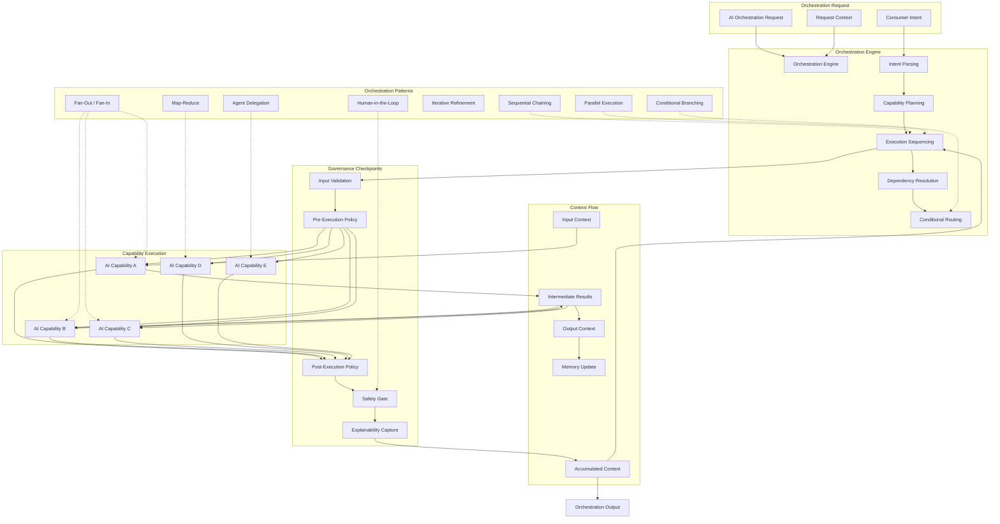
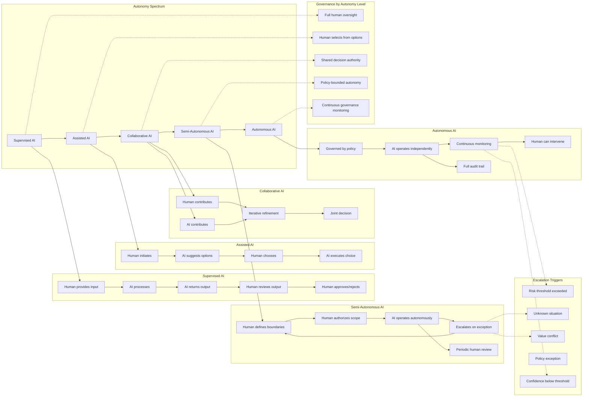
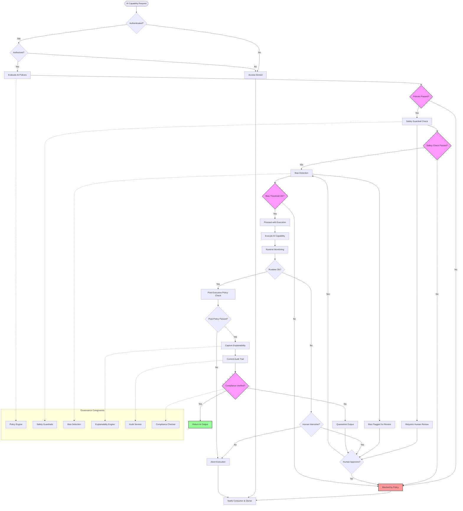
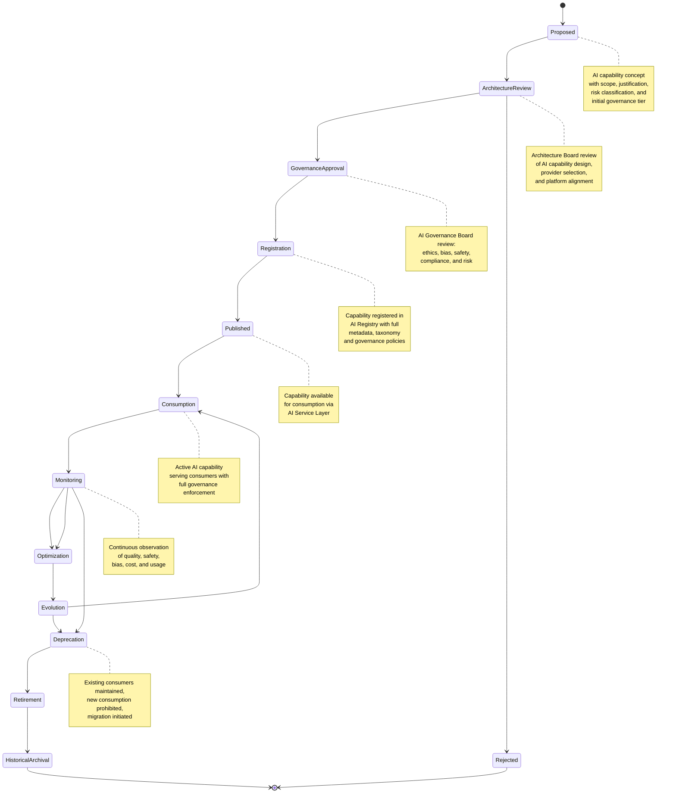

# KB-116 — AI Platform Architecture

**Suite:** Enterprise Platform Services  
**Version:** 1.0  
**Status:** Approved Architecture  
**Classification:** Foundational AI Platform Architecture  
**Last Updated:** 2026-07-12

---

## Executive Summary

This document defines the enterprise AI architecture governing every artificial intelligence capability across DUKADESK. The AI Platform shall function as a centralized enterprise capability that enables intelligent automation, reasoning, decision support, natural language interaction, content generation, knowledge utilization, predictive intelligence, and AI-assisted platform operations while remaining independent of specific AI vendors, models, frameworks, or deployment technologies.

The architecture shall ensure AI operates as a governed enterprise platform service rather than an application-level feature.

---

## Purpose

Define the enterprise-wide architecture for integrating, governing, orchestrating, securing, monitoring, and evolving AI capabilities consistently across the DUKADESK ecosystem.

---

## Scope

### In Scope

- Enterprise AI platform architecture
- AI capability model
- AI service taxonomy
- AI platform governance
- AI orchestration
- AI capability registry
- AI service catalog
- AI lifecycle
- AI workload architecture
- AI interaction architecture
- AI reasoning architecture
- AI context architecture
- AI integration architecture
- AI security architecture
- AI observability
- AI policy enforcement
- AI scalability
- AI extensibility
- Human-AI collaboration
- Multi-agent architecture
- AI platform evolution

### Out of Scope

- AI agent implementation
- AI model implementation
- Prompt implementation
- Memory implementation
- AI safety implementation
- AI decision implementation

*The above items are covered by KB-117 through KB-122 (see Cross References).*

---

## Architectural Principles

| # | Principle | Description |
|---|-----------|-------------|
| 1 | **AI as an Enterprise Platform Capability** | AI is a centralized, governed platform capability, not an application-level feature. Every AI interaction flows through the Enterprise AI Platform. |
| 2 | **Vendor Independence** | AI capabilities are abstracted from underlying AI providers. No vendor lock-in exists at the architectural level; providers are interchangeable. |
| 3 | **Model Independence** | AI services are defined independently of specific AI models. Models can be substituted, upgraded, or deprecated without affecting consuming services. |
| 4 | **Technology Neutrality** | AI capability definitions, interactions, and orchestrations are expressed in technology-neutral formats, not tied to specific frameworks or runtimes. |
| 5 | **AI Governance by Default** | Every AI capability has governance embedded at the architectural level — no AI interaction occurs outside governance boundaries. |
| 6 | **Human Oversight** | AI operates under human governance. Autonomous operation is bounded by policy. Critical decisions require human-in-the-loop validation. |
| 7 | **Explainability** | Every AI decision, recommendation, and action must be explainable to the appropriate level for its risk classification. |
| 8 | **Responsible AI** | AI capabilities adhere to ethical principles, fairness standards, bias detection, and responsible use policies at the architectural level. |
| 9 | **Security by Design** | Security is embedded in every AI interaction layer — authentication, authorization, tenant isolation, injection prevention, and output validation. |
| 10 | **Privacy by Design** | AI interactions minimize data collection, respect tenant boundaries, enforce data residency, and support consent-aware processing. |
| 11 | **Zero Trust** | No AI service, provider, or consumer is implicitly trusted. Every interaction is authenticated, authorized, and audited. |
| 12 | **Multi-Tenant Isolation** | AI capabilities, contexts, and data are strictly isolated per tenant. No cross-tenant AI interaction or data leakage is architecturally possible. |
| 13 | **Composability** | AI capabilities are composable — they can be combined, sequenced, and orchestrated to create higher-order intelligence without modification. |
| 14 | **Observability by Design** | Every AI interaction, decision, and state transition emits structured telemetry for governance, audit, explainability, and operational monitoring. |
| 15 | **AI Interoperability** | AI capabilities expose standardized interfaces enabling uniform consumption by all platform consumers regardless of implementation. |

---

## Canonical Definitions

| Term | Definition |
|------|------------|
| **Artificial Intelligence** | A platform capability that simulates human cognitive functions including reasoning, learning, perception, generation, decision-making, and natural language understanding. |
| **AI Platform** | The centralized enterprise architecture layer that governs, orchestrates, secures, monitors, and provides AI capabilities across the DUKADESK ecosystem. |
| **AI Capability** | A governed, reusable, and composable AI function registered in the AI Registry with defined interfaces, policies, and lifecycle. |
| **AI Service** | A runtime instance of an AI capability exposed through a standardized interface with defined SLAs, scaling, and governance. |
| **AI Registry** | The authoritative system of record for all governed AI capabilities, their metadata, providers, models, policies, and lifecycle state. |
| **AI Catalog** | A discovery and classification interface over the AI Registry enabling search, taxonomy browsing, capability assessment, and reuse analysis. |
| **AI Orchestration** | The coordinated execution of multiple AI capabilities, workflows, agents, and business rules to achieve a defined intelligence outcome. |
| **AI Context** | The session-level information, conversation history, user intent, tenant configuration, and environmental state maintained during an AI interaction. |
| **AI Interaction** | A single exchange between an AI consumer and an AI capability, encompassing input, processing, and output within governance boundaries. |
| **AI Workflow** | A sequenced set of AI and non-AI steps coordinated to produce a defined outcome, potentially spanning multiple capabilities and services. |
| **AI Reasoning** | The cognitive process by which an AI capability analyzes information, draws conclusions, makes decisions, or generates responses. |
| **AI Provider** | An external or internal entity that supplies AI model inference, training, or cognitive services consumed through the provider abstraction layer. |
| **AI Consumer** | A platform service, application, tenant, AI agent, Builder Studio module, or Marketplace asset that invokes AI capabilities. |
| **AI Governance** | The framework of policies, controls, audits, and oversight mechanisms governing AI capability definition, operation, and evolution. |
| **AI Lifecycle** | The progression of an AI capability through defined states from proposal through retirement. |
| **AI Workload** | A unit of AI processing demand characterized by capability type, resource requirements, latency sensitivity, and governance tier. |
| **Human-in-the-Loop** | A governance pattern requiring human review, approval, or override for AI operations above a defined risk or impact threshold. |
| **Autonomous AI** | AI operation mode where the AI capability executes within defined policy boundaries without per-action human intervention. |
| **AI Ecosystem** | The complete set of AI capabilities, services, providers, consumers, governance mechanisms, and tooling operating within the AI Platform. |
| **Enterprise Intelligence** | The aggregate intelligence capability of the DUKADESK AI Platform encompassing all AI services, knowledge, reasoning, and automation. |

---

## Architecture

### 1. Enterprise AI Platform Architecture

The Enterprise AI Platform provides centralized governance, orchestration, and delivery of all AI capabilities across DUKADESK. All AI interactions flow through the platform layers from consumption to inference.

```mermaid
graph TB
    subgraph "Consumption Layer"
        PSVC[Platform Services]
        APP[Applications]
        TNT[Tenants]
        AI_AGENTS[AI Agents]
        BS[Builder Studio]
        MKT[Marketplace]
        WF[Workflows]
    end

    subgraph "Experience Layer"
        EXP_CHAT[Chat Interface]
        EXP_API[AI API Gateway]
        EXP_SDK[AI SDK]
        EXP_STREAM[Streaming Interface]
    end

    subgraph "AI Service Layer"
        CAP_REASON[Reasoning Services]
        CAP_GEN[Generation Services]
        CAP_CLASS[Classification Services]
        CAP_PRED[Prediction Services]
        CAP_REC[Recommendation Services]
        CAP_KNOW[Knowledge Services]
        CAP_AUTOM[Automation Services]
        CAP_DEC[Decision Services]
    end

    subgraph "Orchestration Layer"
        AI_ORCH[AI Orchestrator]
        AGENT_ORCH[Agent Orchestrator]
        WF_ORCH[Workflow Integration]
        CTX_MGR[Context Manager]
    end

    subgraph "Governance Layer"
        GOV_POL[Policy Engine]
        GOV_SAFETY[Safety Guardrails]
        GOV_BIAS[Bias Detection]
        GOV_EXPLAIN[Explainability Engine]
        GOV_AUDIT[AI Audit Engine]
    end

    subgraph "Context & Knowledge Layer"
        KNOW_GRAPH[Knowledge Graph]
        DOC_STORE[Document Store]
        MEMORY[Memory Store]
        SESSION[Session Context]
        TNT_CFG[Tenant Configuration]
    end

    subgraph "Provider Abstraction Layer"
        PROV_GW[Provider Gateway]
        PROV_ROUTER[Provider Router]
        PROV_FALLBACK[Failover Manager]
        PROV_COST[Cost Optimizer]
    end

    subgraph "AI Providers"
        P_OPENAI[OpenAI]
        P_ANTHROPIC[Anthropic]
        P_AWS[AWS Bedrock]
        P_AZURE[Azure AI]
        P_GCP[GCP Vertex]
        P_OPENSOURCE[Open Source]
        P_CUSTOM[Custom Models]
    end

    subgraph "Observability Layer"
        OBS_METRICS[Metrics]
        OBS_TRACING[Tracing]
        OBS_LOGGING[Logging]
        OBS_COST[Cost Analytics]
        OBS_GOV[Governance Dashboard]
    end

    PSVC --> EXP_API
    APP --> EXP_API
    TNT --> EXP_CHAT
    TNT --> EXP_API
    AI_AGENTS --> EXP_API
    BS --> EXP_SDK
    MKT --> EXP_SDK
    WF --> EXP_API

    EXP_CHAT --> CAP_GEN
    EXP_API --> CAP_REASON
    EXP_SDK --> CAP_CLASS
    EXP_STREAM --> CAP_GEN

    CAP_REASON --> AI_ORCH
    CAP_GEN --> AI_ORCH
    CAP_CLASS --> AI_ORCH
    CAP_PRED --> AI_ORCH
    CAP_REC --> AI_ORCH
    CAP_KNOW --> AI_ORCH
    CAP_AUTOM --> AI_ORCH
    CAP_DEC --> AI_ORCH

    AI_ORCH --> AGENT_ORCH
    AI_ORCH --> WF_ORCH
    AI_ORCH --> CTX_MGR

    AI_ORCH --> GOV_POL
    GOV_POL --> GOV_SAFETY
    GOV_SAFETY --> GOV_BIAS
    GOV_BIAS --> GOV_EXPLAIN
    GOV_EXPLAIN --> GOV_AUDIT

    CTX_MGR --> KNOW_GRAPH
    CTX_MGR --> DOC_STORE
    CTX_MGR --> MEMORY
    CTX_MGR --> SESSION
    CTX_MGR --> TNT_CFG

    AI_ORCH --> PROV_GW
    PROV_GW --> PROV_ROUTER
    PROV_ROUTER --> PROV_FALLBACK
    PROV_ROUTER --> PROV_COST

    PROV_ROUTER --> P_OPENAI
    PROV_ROUTER --> P_ANTHROPIC
    PROV_ROUTER --> P_AWS
    PROV_ROUTER --> P_AZURE
    PROV_ROUTER --> P_GCP
    PROV_ROUTER --> P_OPENSOURCE
    PROV_ROUTER --> P_CUSTOM

    AI_ORCH --> OBS_METRICS
    GOV_AUDIT --> OBS_LOGGING
    PROV_COST --> OBS_COST
    GOV_SAFETY --> OBS_GOV

    OBS_METRICS --> OBS_GOV
    OBS_TRACING --> OBS_GOV
```

### 2. AI Capability Taxonomy

AI capabilities are classified according to a canonical taxonomy that governs their visibility, governance tier, provider requirements, and lifecycle.

```mermaid
graph TB
    ROOT[AI Capability Taxonomy]

    ROOT --> REASON[Reasoning]
    ROOT --> CONV[Conversation]
    ROOT --> GENERATION[Generation]
    ROOT --> CLASS[Classification]
    ROOT --> PREDICTION[Prediction]
    ROOT --> RECOMMEND[Recommendation]
    ROOT --> AUTOMATION[Automation]
    ROOT --> KNOWLEDGE[Knowledge]
    ROOT --> ANALYTICS[Analytics]
    ROOT --> DECISION[Decision Support]
    ROOT --> VISION[Vision]
    ROOT --> SPEECH[Speech]
    ROOT --> MULTIMODAL[Multi-Modal]
    ROOT --> AGENTIC[Agentic AI]
    ROOT --> FUTURE[Future AI]

    REASON --> REASON_LLM[LLM Reasoning]
    REASON --> REASON_CHAIN[Chain-of-Thought]
    REASON --> REASON_LOGICAL[Logical Reasoning]
    REASON --> REASON_MATH[Mathematical Reasoning]
    REASON --> REASON_CAUSAL[Causal Reasoning]

    CONV --> CONV_CHAT[Chat / Dialogue]
    CONV --> CONV_QA[Question Answering]
    CONV --> CONV_SUMMARIZE[Summarization]
    CONV --> CONV_TRANSLATE[Translation]
    CONV --> CONV_SENTIMENT[Sentiment Analysis]

    GENERATION --> GEN_TEXT[Text Generation]
    GENERATION --> GEN_CODE[Code Generation]
    GENERATION --> GEN_IMAGE[Image Generation]
    GENERATION --> GEN_AUDIO[Audio Generation]
    GENERATION --> GEN_VIDEO[Video Generation]
    GENERATION --> GEN_CONTENT[Content Generation]

    CLASS --> CLASS_TEXT[Text Classification]
    CLASS --> CLASS_INTENT[Intent Classification]
    CLASS --> CLASS_ENTITY[Named Entity Recognition]
    CLASS --> CLASS_TOPIC[Topic Classification]
    CLASS --> CLASS_CONTENT[Content Moderation]

    PREDICTION --> PRED_TS[Time Series]
    PREDICTION --> PRED_BEHAVIOR[Behavioral]
    PREDICTION --> PRED_ANOMALY[Anomaly Detection]
    PREDICTION --> PRED_TREND[Trend Analysis]

    RECOMMEND --> REC_PERSONAL[Personalization]
    RECOMMEND --> REC_CONTENT[Content Recommendation]
    RECOMMEND --> REC_ACTION[Action Recommendation]
    RECOMMEND --> REC_WORKFLOW[Workflow Recommendation]

    AUTOMATION --> AUTO_WORKFLOW[Workflow Automation]
    AUTOMATION --> AUTO_PROCESS[Process Automation]
    AUTOMATION --> AUTO_DECISION[Decision Automation]
    AUTOMATION --> AUTO_ROUTING[Intelligent Routing]

    KNOWLEDGE --> K_GRAPH[Knowledge Graph Query]
    KNOWLEDGE --> K_RAG[RAG / Retrieval]
    KNOWLEDGE --> K_SEMANTIC[Semantic Search]
    KNOWLEDGE --> K_DISCOVERY[Knowledge Discovery]

    ANALYTICS --> A_INSIGHT[Insight Generation]
    ANALYTICS --> A_PATTERN[Pattern Detection]
    ANALYTICS --> A_CORRELATION[Correlation Analysis]
    ANALYTICS --> A_NARRATIVE[Narrative Generation]

    DECISION --> D_CLASSIFY[Decision Classification]
    DECISION --> D_RANK[Decision Ranking]
    DECISION --> D_OPTIMIZE[Decision Optimization]
    DECISION --> D_POLICY[Policy-Based Decision]

    VISION --> V_OBJECT[Object Detection]
    VISION --> V_FACE[Face Recognition]
    VISION --> V_OCR[OCR / Document]
    VISION --> V_SCENE[Scene Understanding]

    SPEECH --> S_TTS[Text-to-Speech]
    SPEECH --> S_STT[Speech-to-Text]
    SPEECH --> S_SPEAKER[Speaker Identification]

    MULTIMODAL --> MM_TEXT_IMAGE[Text + Image]
    MULTIMODAL --> MM_TEXT_AUDIO[Text + Audio]
    MULTIMODAL --> MM_TEXT_VIDEO[Text + Video]
    MULTIMODAL --> MM_DOCUMENT[Document Understanding]

    AGENTIC --> AG_SINGLE[Single Agent]
    AGENTIC --> AG_MULTI[Multi-Agent]
    AGENTIC --> AG_ORCH[Agent Orchestration]
    AGENTIC --> AG_AUTONOMOUS[Autonomous Agents]

    FUTURE --> F_COGNITIVE[Cognitive Architecture]
    FUTURE --> F_REASONING[Advanced Reasoning]
    FUTURE --> F_EMBODIED[Embodied AI]
    FUTURE --> F_COLLAB[Collaborative AI]

    subgraph "Taxonomy Attributes"
        ATTR_GOV[Governance Tier]
        ATTR_PROV[Provider Category]
        ATTR_LIFE[Lifecycle State]
        ATTR_RISK[Risk Classification]
        ATTR_COST[Cost Tier]
    end

    ROOT -.-> ATTR_GOV
    ROOT -.-> ATTR_PROV
    ROOT -.-> ATTR_LIFE
    ROOT -.-> ATTR_RISK
    ROOT -.-> ATTR_COST
```

### 3. AI Platform Layered Architecture

The AI Platform is organized into logical layers that separate concerns, enforce governance boundaries, and enable independent evolution of each layer.

```mermaid
graph TB
    subgraph "Experience Layer"
        EXP[AI Experience Layer]
        EXP_INTERFACES[Interfaces: Chat, API, SDK, Streaming]
        EXP_AUTH[Authentication & Authorization]
        EXP_TELEM[Interaction Telemetry]
    end

    subgraph "AI Service Layer"
        SVC[AI Service Layer]
        SVC_REGISTRY[Service Registry]
        SVC_DISCOVERY[Service Discovery]
        SVC_ROUTING[Service Routing]
        SVC_VERSION[Version Management]
    end

    subgraph "Orchestration Layer"
        ORCH[AI Orchestration Layer]
        ORCH_SEQ[Sequencing]
        ORCH_COND[Conditional Routing]
        ORCH_PAR[Parallel Execution]
        ORCH_AGENT[Agent Coordination]
        ORCH_WF[Workflow Integration]
    end

    subgraph "Governance Layer"
        GOV[AI Governance Layer]
        GOV_POLICY[Policy Enforcement]
        GOV_SAFETY[Safety Guardrails]
        GOV_BIAS[Bias Detection]
        GOV_EXPLAIN[Explainability]
        GOV_AUDIT[Audit Trail]
        GOV_COMPLIANCE[Compliance Checking]
    end

    subgraph "Context & Knowledge Layer"
        CTX[Context & Knowledge Layer]
        CTX_SESSION[Session Context]
        CTX_MEMORY[Memory Management]
        CTX_KNOWLEDGE[Knowledge Retrieval]
        CTX_TENANT[Tenant Configuration]
        CTX_USER[User Profile & Preferences]
    end

    subgraph "Provider Abstraction Layer"
        PA[Provider Abstraction Layer]
        PA_GATEWAY[Provider Gateway]
        PA_ROUTER[Intelligent Router]
        PA_FALLBACK[Failover & Retry]
        PA_COST[Cost Optimization]
        PA_CACHE[Response Caching]
    end

    subgraph "AI Provider Layer"
        PROV[AI Provider Layer]
        PROV_EXTERNAL[External Providers]
        PROV_INTERNAL[Internal Models]
        PROV_DEDICATED[Dedicated Deployments]
    end

    subgraph "Observability Layer"
        OBS[Observability Layer]
        OBS_METRICS[AI Metrics]
        OBS_TRACES[Distributed Tracing]
        OBS_LOGS[Audit Logs]
        OBS_COST[Cost Analytics]
        OBS_GOV[Governance Dashboard]
        OBS_ALERTS[Alerting]
    end

    EXP --> SVC
    EXP_AUTH --> SVC
    EXP_TELEM --> OBS

    SVC --> ORCH
    SVC_REGISTRY --> SVC_DISCOVERY
    SVC_DISCOVERY --> SVC_ROUTING
    SVC_VERSION --> SVC_ROUTING

    ORCH --> GOV
    ORCH_SEQ --> GOV_POLICY
    ORCH_AGENT --> GOV_SAFETY

    GOV --> CTX
    GOV_POLICY --> CTX_TENANT
    GOV_SAFETY --> CTX_USER

    CTX --> PA
    CTX_MEMORY --> PA
    CTX_KNOWLEDGE --> PA

    PA --> PROV
    PA_GATEWAY --> PA_ROUTER
    PA_ROUTER --> PA_FALLBACK
    PA_ROUTER --> PA_COST
    PA_COST --> PA_CACHE
    PA_CACHE --> PROV

    OBS --> EXP
    OBS --> SVC
    OBS --> ORCH
    OBS --> GOV
    OBS --> CTX
    OBS --> PA
    OBS --> PROV

    subgraph "Layer Responsibilities"
        L_EXP[Consumer interaction, auth, rate limiting]
        L_SVC[Capability exposure, versioning, discovery]
        L_ORCH[Coordination, sequencing, agent mgmt]
        L_GOV[Policy, safety, bias, explainability]
        L_CTX[State, memory, knowledge, configuration]
        L_PA[Provider abstraction, routing, failover]
        L_PROV[Model inference, training, hosting]
        L_OBS[Telemetry, cost, governance visibility]
    end

    EXP -.-> L_EXP
    SVC -.-> L_SVC
    ORCH -.-> L_ORCH
    GOV -.-> L_GOV
    CTX -.-> L_CTX
    PA -.-> L_PA
    PROV -.-> L_PROV
    OBS -.-> L_OBS
```

### 4. AI Orchestration Model

AI orchestration governs the coordinated execution of AI capabilities, agent interactions, workflow integration, and context management across the AI Platform.

### 5. Human–AI Collaboration Model

The Human–AI Collaboration Model defines the spectrum of autonomy from fully supervised to autonomous AI, with governance boundaries at each level.

### 6. AI Governance Structure

AI governance is enforced through a structured framework spanning policy enforcement, safety guardrails, bias detection, explainability, audit, and compliance at every stage of AI interaction.

### 7. AI Lifecycle

Every AI capability progresses through a defined lifecycle with gated transitions ensuring governance, validation, and consumer notification at every stage.

### 8. AI Integration Architecture

The AI Integration Architecture defines standardized interaction patterns between the AI Platform and all DUKADESK platform services, domains, and consumers.

```mermaid
graph TB
    subgraph "AI Platform"
        API_GW[AI API Gateway]
        AI_SVC[AI Services]
        AI_ORCH[AI Orchestrator]
        AI_GOV[AI Governance]
    end

    subgraph "Platform Services"
        PS_ID[Identity Platform]
        PS_CONFIG[Configuration Mgmt]
        PS_FEATURE[Feature Management]
        PS_SCHED[Scheduling & Jobs]
        PS_WF[Workflow Orchestration]
        PS_RULES[Business Rules Engine]
        PS_NOTIFY[Notification Platform]
        PS_MSG[Messaging Platform]
    end

    subgraph "Data Platform"
        DP_QUERY[Data Query]
        DP_ANALYTICS[Analytics & BI]
        DP_KG[Knowledge Graph]
        DP_SEARCH[Search & Indexing]
        DP_STORE[Storage Layer]
    end

    subgraph "Integration Platform"
        IP_GW[API Gateway]
        IP_WEBHOOK[Webhooks]
        IP_CONN[Connectors]
        IP_FED[Data Federation]
    end

    subgraph "Runtime Platform"
        RP_APPS[Applications]
        RP_BS[Builder Studio]
        RP_MKT[Marketplace]
        RP_AGENTS[AI Agents]
    end

    subgraph "Identity & Security"
        ID_AUTH[Authentication]
        ID_AUTHZ[Authorization]
        ID_TENANT[Tenant Isolation]
        ID_AUDIT[Audit Service]
    end

    subgraph "Integration Patterns"
        IP_SYNC[Synchronous API]
        IP_ASYNC[Asynchronous / Event]
        IP_STREAM[Streaming]
        IP_BATCH[Batch Processing]
        IP_WEBHOOK_PAT[Webhook Callback]
    end

    API_GW --> PS_ID
    API_GW --> PS_CONFIG
    API_GW --> PS_FEATURE
    AI_SVC --> PS_NOTIFY
    AI_SVC --> PS_MSG

    AI_ORCH --> PS_WF
    AI_ORCH --> PS_RULES
    AI_ORCH --> PS_SCHED

    AI_SVC --> DP_QUERY
    AI_SVC --> DP_KG
    AI_SVC --> DP_SEARCH
    AI_SVC --> DP_STORE
    AI_SVC --> DP_ANALYTICS

    AI_SVC --> IP_GW
    AI_SVC --> IP_FED

    API_GW --> RP_APPS
    API_GW --> RP_BS
    API_GW --> RP_MKT
    AI_ORCH --> RP_AGENTS

    API_GW --> ID_AUTH
    API_GW --> ID_AUTHZ
    AI_SVC --> ID_TENANT
    AI_GOV --> ID_AUDIT

    IP_SYNC -.-> API_GW
    IP_ASYNC -.-> PS_MSG
    IP_STREAM -.-> AI_SVC
    IP_BATCH -.-> DP_STORE
    IP_WEBHOOK_PAT -.-> IP_WEBHOOK

    subgraph "Integration Contracts"
        C_OPENAPI[OpenAPI Specification]
        C_ASYNCAPI[AsyncAPI Specification]
        C_PROTO[Protocol Buffers]
        C_EVENT[CloudEvents]
    end

    API_GW -.-> C_OPENAPI
    PS_MSG -.-> C_ASYNCAPI
    PS_MSG -.-> C_EVENT
```

### 9. Enterprise AI Ecosystem

The Enterprise AI Ecosystem provides a holistic view of all AI capabilities, providers, consumers, governance mechanisms, and operational infrastructure operating within the DUKADESK AI Platform.

```mermaid
graph TB
    subgraph "AI Governance & Oversight"
        GOV_BOARD[AI Governance Board]
        GOV_POLICY[AI Policy Framework]
        GOV_ETHICS[AI Ethics Committee]
        GOV_COMPLIANCE[AI Compliance]
        GOV_RISK[AI Risk Management]
    end

    subgraph "AI Platform Operations"
        OPS_MONITOR[AI Operations]
        OPS_COST[Cost Management]
        OPS_CAPACITY[Capacity Planning]
        OPS_INCIDENT[AI Incident Response]
        OPS_OPTIMIZATION[Performance Optimization]
    end

    subgraph "AI Capability Portfolio"
        PORT_REASON[Reasoning Services]
        PORT_GEN[Generation Services]
        PORT_CLASS[Classification Services]
        PORT_PRED[Prediction Services]
        PORT_REC[Recommendation Services]
        PORT_KNOW[Knowledge Services]
        PORT_AUTOM[Automation Services]
        PORT_DEC[Decision Services]
        PORT_VISION[Vision Services]
        PORT_SPEECH[Speech Services]
        PORT_AGENT[Agent Services]
    end

    subgraph "AI Providers"
        PROV_EXT[External AI Providers]
        PROV_INT[Internal AI Models]
        PROV_DED[Customer Dedicated]
        PROV_COMM[Community Models]
    end

    subgraph "AI Consumers"
        CONS_PLATFORM[Platform Services]
        CONS_TENANT[Tenants]
        CONS_APP[Applications]
        CONS_BS[Builder Studio]
        CONS_MKT[Marketplace]
        CONS_WF[Workflows]
        CONS_AGENT[AI Agents]
    end

    subgraph "AI Data & Knowledge"
        DATA_GRAPH[Knowledge Graph]
        DATA_DOC[Document Store]
        DATA_VECTOR[Vector Database]
        DATA_TRAINING[Training Data]
        DATA_FEEDBACK[Feedback & Evaluation]
    end

    subgraph "AI Tooling & Development"
        TOOL_STUDIO[AI Studio]
        TOOL_PROMPT[Prompt Management]
        TOOL_EVAL[Evaluation Tools]
        TOOL_MONITOR[Monitoring Tools]
        TOOL_DEBUG[Debugging Tools]
    end

    GOV_BOARD --> GOV_POLICY
    GOV_POLICY --> GOV_ETHICS
    GOV_POLICY --> GOV_COMPLIANCE
    GOV_POLICY --> GOV_RISK

    GOV_POLICY --> PORT_REASON
    GOV_POLICY --> PORT_GEN
    GOV_POLICY --> PORT_AGENT

    PORT_REASON --> PROV_EXT
    PORT_GEN --> PROV_EXT
    PORT_GEN --> PROV_INT
    PORT_VISION --> PROV_EXT
    PORT_SPEECH --> PROV_EXT
    PORT_AGENT --> PROV_INT
    PORT_AGENT --> PROV_EXT

    CONS_PLATFORM --> PORT_REASON
    CONS_TENANT --> PORT_GEN
    CONS_APP --> PORT_CLASS
    CONS_BS --> PORT_GEN
    CONS_MKT --> PORT_KNOW
    CONS_WF --> PORT_AUTOM
    CONS_AGENT --> PORT_AGENT

    PORT_REASON --> DATA_GRAPH
    PORT_GEN --> DATA_DOC
    PORT_KNOW --> DATA_VECTOR
    PORT_KNOW --> DATA_GRAPH
    PORT_CLASS --> DATA_TRAINING

    OPS_MONITOR --> PORT_REASON
    OPS_MONITOR --> PORT_GEN
    OPS_COST --> PROV_EXT
    OPS_CAPACITY --> PROV_INT
    OPS_INCIDENT --> GOV_RISK

    TOOL_STUDIO --> PORT_GEN
    TOOL_PROMPT --> PORT_GEN
    TOOL_EVAL --> PORT_CLASS
    TOOL_MONITOR --> OPS_MONITOR

    CONS_AGENT --> DATA_FEEDBACK
    DATA_FEEDBACK --> TOOL_EVAL
    TOOL_EVAL --> PORT_REASON

    GOV_BOARD -.-> OPS_INCIDENT
    GOV_ETHICS -.-> CONS_TENANT
    GOV_COMPLIANCE -.-> DATA_TRAINING
```

### 10. AI Platform Reference Architecture

The AI Platform Reference Architecture provides a consolidated view of all architectural layers, components, interactions, and governance boundaries defining the DUKADESK AI Platform.

```mermaid
graph TB
    subgraph "Consumption"
        C1[Web & Mobile Apps]
        C2[Platform Services]
        C3[Builder Studio]
        C4[Marketplace]
        C5[AI Agents]
        C6[Workflows]
        C7[External Systems]
    end

    subgraph "Experience"
        E1[AI Chat Interface]
        E2[REST API Gateway]
        E3[Streaming Interface]
        E4[AI SDK / Client Libraries]
    end

    subgraph "AI Services"
        S1[Reasoning]
        S2[Generation]
        S3[Classification]
        S4[Prediction]
        S5[Recommendation]
        S6[Knowledge]
        S7[Automation]
        S8[Decision]
        S9[Vision]
        S10[Speech]
        S11[Agentic]
    end

    subgraph "Orchestration"
        O1[Intent Engine]
        O2[Capability Planner]
        O3[Execution Sequencer]
        O4[Agent Coordinator]
        O5[Workflow Bridge]
        O6[Context Manager]
        O7[Memory Manager]
    end

    subgraph "Governance"
        G1[Policy Engine]
        G2[Safety Guardrails]
        G3[Bias Detector]
        G4[Explainability Engine]
        G5[Audit Service]
        G6[Compliance Checker]
        G7[Risk Evaluator]
    end

    subgraph "Context & Knowledge"
        K1[Knowledge Graph]
        K2[Vector Store]
        K3[Document Store]
        K4[Session Context]
        K5[Memory Store]
        K6[Tenant Config]
        K7[User Profile]
    end

    subgraph "Provider Abstraction"
        P1[Provider Gateway]
        P2[Intelligent Router]
        P3[Failover Manager]
        P4[Cache Layer]
        P5[Cost Optimizer]
        P6[Rate Limiter]
    end

    subgraph "AI Providers"
        R1[OpenAI]
        R2[Anthropic]
        R3[AWS Bedrock]
        R4[Azure AI]
        R5[GCP Vertex]
        R6[Open Source]
        R7[Custom Models]
        R8[Dedicated Deployments]
    end

    subgraph "Observability"
        M1[Metrics]
        M2[Tracing]
        M3[Logging]
        M4[Cost Analytics]
        M5[Governance Dashboard]
        M6[Alerting]
        M7[Explainability Viewer]
    end

    C1 --> E1
    C2 --> E2
    C3 --> E4
    C4 --> E4
    C5 --> E2
    C6 --> E2
    C7 --> E2

    E1 --> S1
    E1 --> S2
    E2 --> S1
    E2 --> S3
    E2 --> S4
    E3 --> S2
    E4 --> S1
    E4 --> S2
    E4 --> S5

    S1 --> O1
    S2 --> O1
    S3 --> O1
    S11 --> O4

    O1 --> O2
    O2 --> O3
    O3 --> O5
    O4 --> O5
    O3 --> O6
    O6 --> O7

    O1 --> G1
    O3 --> G2
    G2 --> G3
    G3 --> G4
    G4 --> G5
    G5 --> G6
    G6 --> G7

    O6 --> K1
    O6 --> K2
    O6 --> K3
    O7 --> K4
    O7 --> K5
    O6 --> K6
    O6 --> K7

    O3 --> P1
    P1 --> P2
    P2 --> P3
    P3 --> P4
    P2 --> P5
    P5 --> P6

    P2 --> R1
    P2 --> R2
    P2 --> R3
    P2 --> R4
    P2 --> R5
    P2 --> R6
    P2 --> R7
    P4 --> R8

    G5 --> M3
    P5 --> M4
    G4 --> M7
    O1 --> M1
    O3 --> M2

    M1 --> M5
    M2 --> M5
    M3 --> M5
    M4 --> M5

    M5 --> M6

    subgraph "Platform Integration Points"
        INT_ID[Identity Platform]
        INT_CFG[Configuration Mgmt]
        INT_FEATURE[Feature Management]
        INT_SCHED[Scheduling]
        INT_WF[Workflow Engine]
        INT_RULES[Business Rules]
        INT_DATA[Data Platform]
        INT_MSG[Messaging]
    end

    G1 --> INT_ID
    G1 --> INT_CFG
    G1 --> INT_FEATURE
    O5 --> INT_WF
    O5 --> INT_RULES
    O5 --> INT_SCHED
    S6 --> INT_DATA
    O6 --> INT_MSG
```

---

## Lifecycle

| Phase | Description | Gates |
|-------|-------------|-------|
| **Capability Proposal** | AI capability concept documented with scope, business justification, risk classification, and initial governance tier. | Proposal completeness check |
| **Architecture Review** | Architecture Board evaluation of AI capability design, provider selection, platform alignment, and integration impact. | Architecture review sign-off |
| **Governance Approval** | AI Governance Board review covering ethics, bias, safety, compliance, risk, and responsible AI criteria. | AI Governance Board approval |
| **Registration** | Capability registered in AI Registry with full metadata, taxonomy classification, governance policies, and provider bindings. | Registry entry verified |
| **Publication** | AI capability is published and made available for consumption through the AI Service Layer. | Publication validation |
| **Consumption** | Active AI capability serving consumers with full governance enforcement, monitoring, and telemetry. | Consumption readiness |
| **Monitoring** | Continuous observation of quality, safety, bias, cost, usage patterns, and performance metrics. | Health criteria met |
| **Optimization** | Capability refinement based on operational data, feedback, cost analysis, and performance evaluation. | Optimization approval |
| **Evolution** | Capability version evolution through provider updates, model upgrades, policy changes, or feature enhancements. | Version governance |
| **Deprecation** | Capability marked deprecated; new consumption prohibited; existing consumers notified with migration timeline. | Deprecation notice |
| **Retirement** | Capability removed from AI Service Layer; consumers migrated to replacement. | Migration completion |
| **Historical Archival** | Capability metadata, audit records, and performance data archived for governance and compliance. | Archive completion |

---

## Governance

| Domain | Governance Mechanism | Responsible Body |
|--------|---------------------|------------------|
| **AI Ownership** | Every AI capability must have a registered owner accountable for definition, policies, lifecycle, and operational health. | Enterprise Architecture |
| **Capability Governance** | AI capability definitions, provider selections, and model choices are governed to ensure consistency, quality, and alignment. | AI Governance Board |
| **Architecture Governance** | New AI capabilities and major changes undergo Architecture Review Board evaluation for platform alignment. | Architecture Review Board |
| **Responsible AI Governance** | AI capabilities adhere to ethical principles, fairness standards, bias thresholds, and responsible use policies. | AI Ethics Committee |
| **Compliance Governance** | AI capabilities handling regulated data or operating in regulated domains undergo compliance validation. | Compliance |
| **Security Governance** | AI capability security posture, provider security, and data protection are reviewed and certified. | Security |
| **Lifecycle Governance** | Lifecycle transitions are gated with validation. Non-compliant transitions are blocked and audited. | Enterprise Architecture |
| **Version Governance** | Capability version changes follow defined governance. Breaking changes require consumer notification and migration planning. | Platform Engineering |
| **Risk Governance** | AI risk classification determines governance tier, required safety measures, and human oversight level. | AI Risk Management |
| **Enterprise AI Portfolio Governance** | Periodic portfolio reviews identify underutilized, high-cost, or non-compliant capabilities for optimization or retirement. | Enterprise Architecture |

---

## Responsibilities

| Role | Responsibilities |
|------|-----------------|
| **Enterprise Architecture** | Define AI taxonomy, architectural principles, governance standards; conduct architecture reviews; govern AI portfolio. |
| **AI Platform Team** | Build and maintain AI Platform layers including orchestration, provider abstraction, governance, and observability. |
| **Platform Engineering** | Integrate AI Platform with platform services; manage AI service infrastructure; support AI capability deployment. |
| **Product Teams** | Propose AI capabilities; define capability requirements; manage capability lifecycle for product domains. |
| **AI Governance Board** | Oversee AI governance framework; approve AI capabilities; review AI incidents; ensure responsible AI practices. |
| **Security** | Perform security reviews of AI capabilities, providers, and data flows; define AI security policies; audit AI access. |
| **Compliance** | Conduct compliance reviews; define AI regulatory validation rules; verify AI capability adherence to legal requirements. |
| **Operations** | Monitor AI platform health, capability performance, provider availability, and cost; respond to AI incidents. |
| **Data Governance** | Govern AI training data, context data, and feedback data; ensure data quality, privacy, and compliance. |
| **Tenant Administrators** | Manage tenant-level AI capability enablement; configure AI governance policies; monitor tenant AI usage and cost. |

---

## Security

| Control Area | Architecture |
|-------------|--------------|
| **AI Authorization** | Every AI capability invocation is authenticated and authorised against the consumer identity, scope, and tenant. |
| **Identity-Aware AI** | AI interactions carry consumer identity context enabling tenant isolation, audit, and personalized governance enforcement. |
| **Secure AI Interactions** | AI inputs are validated against injection attacks (prompt injection, jailbreaking). AI outputs are scanned for sensitive content. |
| **Tenant Isolation** | AI capabilities, contexts, memory, and knowledge are strictly partitioned per tenant. No cross-tenant AI data access is possible. |
| **Zero Trust** | No AI service, provider, or consumer is implicitly trusted. Every interaction is authenticated, authorised, and audited. |
| **AI Policy Enforcement** | Security policies are evaluated at every AI interaction stage — input, processing, output. Violations block the operation. |
| **Secure Orchestration** | Orchestration flows maintain security context across capability boundaries. Credentials and sensitive data are never exposed between capabilities. |
| **Auditability** | Every AI interaction, decision, and state transition is recorded in an immutable audit trail with full provenance. |
| **AI Provenance** | Every AI output is traceable to the capability, model, provider, and context that produced it. |
| **Least Privilege** | AI capabilities execute with minimum required permissions. No capability can access resources outside its authorization boundary. |

---

## Privacy

| Domain | Architecture |
|--------|--------------|
| **Data Minimization** | AI interactions collect and retain only the data necessary for the capability. Sensitivity classifications determine handling and retention. |
| **Privacy-Preserving AI** | AI processing supports anonymization, aggregation, and differential privacy techniques for sensitive data. |
| **Tenant Privacy** | AI tenant data is strictly isolated. No cross-tenant AI interaction, context sharing, or data leakage is architecturally possible. |
| **Regional Compliance** | AI processing respects regional data residency requirements. Data remains within its geographic jurisdiction. |
| **Regulatory Governance** | AI capabilities handling regulated data are tagged with compliance markers and subject to corresponding policies. |
| **Cross-Border Controls** | AI data crossing geographic boundaries is explicitly classified and subject to data transfer compliance review. |
| **Consent-Aware AI** | AI capabilities respect user consent state. Processing of personal data is blocked or modified based on consent status. |
| **Audit Retention** | AI audit logs are retained per regulatory requirements with privacy-preserving anonymisation where appropriate. |

---

## Performance

| Consideration | Architectural Approach |
|---------------|----------------------|
| **Enterprise-Scale AI** | The AI Platform scales horizontally across capability instances, provider endpoints, and geographic regions. |
| **Elastic AI Workloads** | AI capability execution scales elastically based on demand. Provider abstraction enables seamless capacity expansion. |
| **High Availability** | AI Platform components are deployed across multiple availability zones. Provider failover ensures continuity during provider outages. |
| **Distributed AI Orchestration** | Orchestration state is distributed. Orchestration decisions are made locally with global coordination for cross-capability workflows. |
| **AI Workload Optimization** | Capability execution is optimized for latency, cost, and quality through intelligent provider routing and caching. |
| **Resource Governance** | AI workloads are classified by criticality and resource requirements. Resource allocation policies prevent tenant or capability starvation. |
| **Multi-Region Readiness** | AI Platform operates across global regions. Capability execution affinity respects data residency and latency requirements. |
| **Operational Resilience** | Consumers operate with cached capability state during AI Platform or provider outages. Degraded mode supports critical operations. |

---

## Observability

| Domain | Architecture |
|--------|--------------|
| **AI Health** | AI Platform component health, capability availability, provider status, and governance system health are continuously monitored. |
| **AI Utilization** | Capability invocation rates, consumer patterns, tenant usage, and provider utilization are tracked per capability. |
| **AI Performance Metrics** | End-to-end latency, provider latency, throughput, cache hit rates, and error rates are measured per capability and provider. |
| **AI Workload Analytics** | Workload patterns, peak demand, cost distribution, and efficiency metrics are analysed for capacity planning and optimization. |
| **Governance Dashboards** | Role-specific dashboards expose policy compliance, safety gate status, bias detection metrics, and audit trail health. |
| **Explainability Reporting** | AI decisions and outputs include structured explainability data. Explainability reports are available for audit and governance review. |
| **SLA Monitoring** | AI capability SLAs (latency, availability, throughput) are monitored per tier. SLA breaches trigger escalation. |
| **Cost Visibility** | Cost per capability, provider, tenant, consumer, and interaction is tracked for chargeback and optimization. |
| **Risk Monitoring** | AI risk indicators, safety violations, bias flags, and policy breaches are continuously monitored with alerting. |
| **Enterprise AI Insights** | Aggregate AI platform analytics provide enterprise-wide visibility into AI adoption, value, cost, and governance posture. |

---

## Failure Scenarios

| Scenario | Architectural Response |
|----------|-----------------------|
| **AI Service Failure** | AI capability failure triggers automatic failover to alternative provider or model. Consumer receives degraded but functional response. |
| **AI Provider Failure** | Provider abstraction layer detects provider outage and routes to fallback provider. No consumer-visible interruption for multi-provider capabilities. |
| **AI Orchestration Failure** | Orchestration state is persisted. Failure recovery resumes from the last known consistent state. Compensation reverses partial executions. |
| **AI Governance Failure** | Governance component failure triggers safe-mode operation — all AI interactions are blocked until governance is restored. |
| **AI Dependency Failure** | Dependency detection at capability planning. Unsatisfied dependencies cause graceful degradation with clear error context. |
| **AI Policy Violations** | Policy evaluation blocks violating AI interaction. Violation is logged, audited, and escalated to policy owner with full context. |
| **AI Context Loss** | Session context persistence ensures recovery from context loss. Context is reconstructed from checkpoints. |
| **Cross-Tenant Exposure** | Cross-tenant data access attempts are blocked at the governance and data layers. Incident is logged and escalated immediately. |
| **AI Capability Degradation** | Degradation detection triggers automatic scaling, provider rotation, or capability isolation. Consumers receive degraded-mode response. |
| **Regional AI Outages** | Regional AI Platform failure triggers cross-region failover. Capability execution continues in alternate region with data residency verification. |
| **Explainability Failures** | Explainability capture failure does not block AI execution but triggers alert. Explainability is reconstructed from audit trail where possible. |
| **Recovery Failures** | Recovery actions that fail trigger escalation to AI Platform operations. Manual intervention path with full context is provided. |

---

## Anti-Patterns

| Anti-Pattern | Prohibited Because | Enforced By |
|--------------|-------------------|-------------|
| **Application-Owned AI** | Fragments AI governance, bypasses platform policies, creates vendor lock-in, and prevents enterprise visibility. | Architecture review; AI Registry enforcement |
| **Hardcoded AI Integrations** | Couples applications to specific AI providers or models, preventing substitution, upgrade, and governance. | Code review; static analysis |
| **Vendor Lock-In** | Direct provider coupling prevents competition, creates dependency risk, and limits architectural flexibility. | Provider abstraction enforcement |
| **Unmanaged AI Services** | AI capabilities not registered in AI Registry are invisible to governance, audit, and portfolio management. | Registry mandatory check |
| **Hidden AI Dependencies** | Untracked AI dependencies create silent failures during provider changes, capability retirement, and upgrades. | Dependency registration enforcement |
| **AI Without Governance** | AI capabilities operating outside governance boundaries create legal, ethical, and operational risk. | Governance enforcement at every layer |
| **AI Without Observability** | AI interactions without telemetry prevent audit, cost tracking, quality monitoring, and incident response. | Observability mandatory check |
| **Duplicate AI Capabilities** | Proliferates maintenance burden, fragments governance, and creates inconsistent consumer experiences. | Registry deduplication checks |
| **AI Bypassing Enterprise Policies** | Circumvents security, compliance, and responsible AI controls. | Policy enforcement at all layers |
| **AI Operating Outside Human Governance Boundaries** | Unbounded autonomous AI creates unacceptable risk. Human oversight is architectural, not optional. | Autonomy level governance enforcement |

---

## Future Evolution

| Evolution Path | Architectural Preparation |
|---------------|--------------------------|
| **Autonomous Enterprise Platforms** | AI Platform architecture supports progressive autonomy evolution from supervised to autonomous operations within governed boundaries. |
| **Federated AI Ecosystems** | Provider abstraction and multi-region architecture prepare for federated AI across organizational and geographic boundaries. |
| **Agentic Enterprise Intelligence** | Agent coordination architecture and multi-agent patterns prepare for autonomous AI agent ecosystems operating within governance. |
| **Distributed AI Collaboration** | Event-driven orchestration and context sharing prepare for AI capabilities collaborating across platform boundaries. |
| **Adaptive AI Orchestration** | Orchestration engine evolves to support dynamic capability discovery, intent-based planning, and self-optimizing execution. |
| **AI-Native Enterprise Operations** | AI Platform integration with all platform services prepares for AI-native operations where AI is embedded in every platform capability. |
| **Intelligent Platform Optimization** | AI Platform observability and telemetry enable AI-driven optimization of the platform itself — self-healing, self-tuning infrastructure. |
| **Future Cognitive Architectures** | Extensible capability taxonomy and provider abstraction prepare for emerging AI paradigms including embodied AI, cognitive architectures, and artificial general intelligence. |

---

## Cross References

| Document ID | Title | Relation |
|-------------|-------|----------|
| **KB-089** | Knowledge Graph Architecture | Defines the knowledge graph consumed by AI capabilities for knowledge retrieval and reasoning. |
| **KB-090** | Analytics & Business Intelligence Architecture | Defines analytics capabilities that may be enhanced by AI and that provide data for AI optimization. |
| **KB-107** | Enterprise Platform Services Overview Architecture | Defines the platform services context within which the AI Platform operates. |
| **KB-113** | Workflow Orchestration Architecture | Defines workflow orchestration integrated with AI orchestration for intelligent automation. |
| **KB-114** | Business Rules Engine Architecture | Defines business rules evaluated by AI orchestration for policy-driven decisions. |
| **KB-117** | AI Agent Framework Architecture | Defines the AI agent framework that operates within this AI Platform architecture. |
| **KB-118** | AI Model Management Architecture | Defines model management governed by this AI Platform architecture. |
| **KB-119** | Prompt Management Architecture | Defines prompt management capabilities operating within this AI Platform. |
| **KB-120** | AI Context & Memory Architecture | Defines context and memory capabilities used by this AI Platform. |
| **KB-121** | AI Safety & Governance Architecture | Defines AI safety and governance mechanisms enforced by this AI Platform. |
| **KB-122** | AI Decision Intelligence Architecture | Defines AI decision intelligence capabilities operating within this AI Platform. |
| **KB-138** | Platform Automation Architecture | Defines automation capabilities that may invoke AI and that automate AI Platform operations. |
| **KB-140** | Enterprise Platform Services Reference Architecture | Defines the overarching reference architecture for enterprise platform services. |

---

## Acceptance Criteria

- [x] Establishes the canonical AI Platform Architecture for DUKADESK.
- [x] Serves as the parent architecture for KB-117 through KB-122.
- [x] Defines AI platform layers, governance, orchestration, capability taxonomy, lifecycle, and enterprise integration.
- [x] Supports enterprise-scale, multi-tenant, vendor-independent, AI-native operations.
- [x] Includes all 10 required Mermaid diagrams.
- [x] Cross-references related Knowledge Base documents.
- [x] Contains no implementation guidance.

---

## Completion Instructions

1. **Mark KB-116 as Completed** — This document constitutes the completed architecture specification.
2. **Update the Progress Registry** — Record KB-116 as Approved Architecture in the Knowledge Base registry.
3. **Mark the AI Platform Services subsection of the Enterprise Platform Services suite as Active.**
4. **Queue Next Assignment** — KB-117 – AI Agent Framework Architecture is the next builder assignment.

---

## Critical DUKADESK Architectural Rule

> **All artificial intelligence capabilities within DUKADESK shall operate exclusively through the governed Enterprise AI Platform. No application, tenant, service, Builder Studio module, Marketplace asset, workflow, or runtime component shall integrate AI independently of the platform architecture, ensuring consistent governance, security, explainability, interoperability, scalability, and long-term enterprise evolution.**

(End of file — total lines may exceed display)
