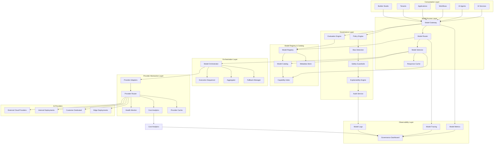
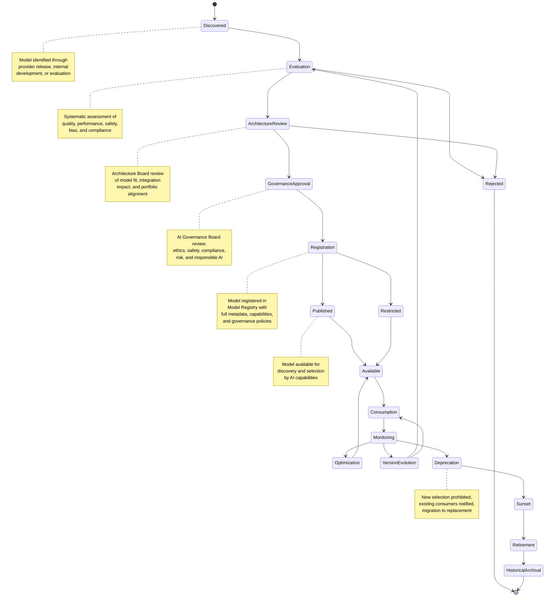
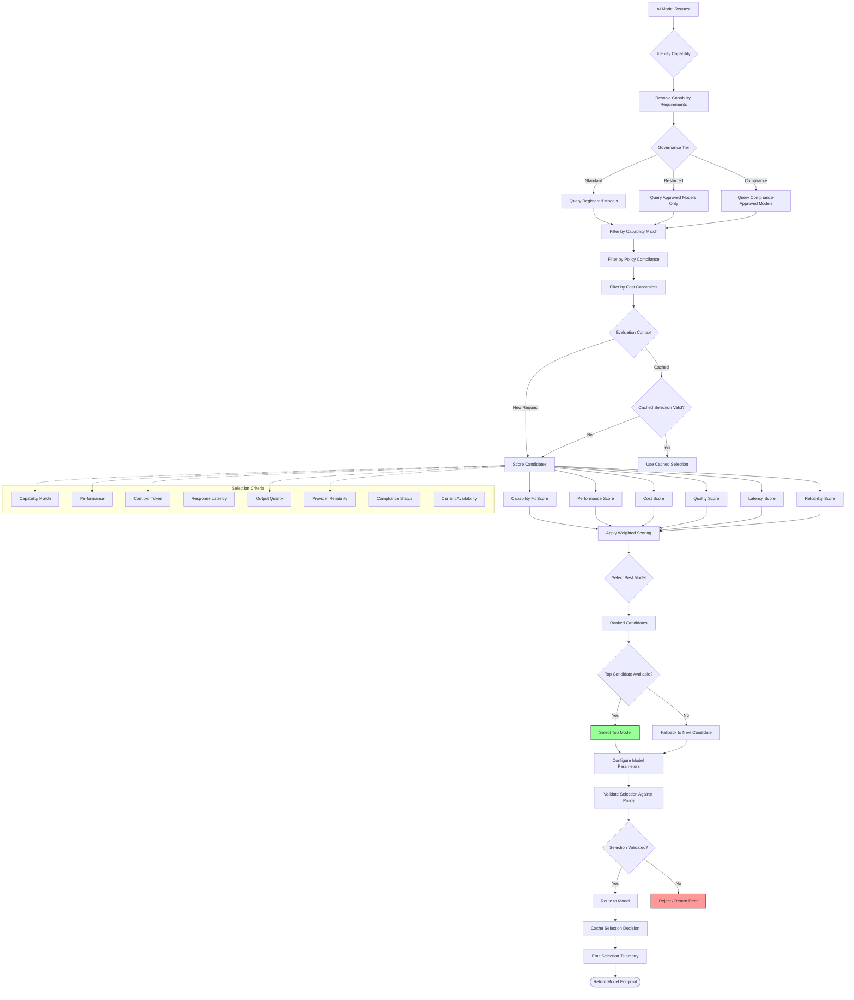
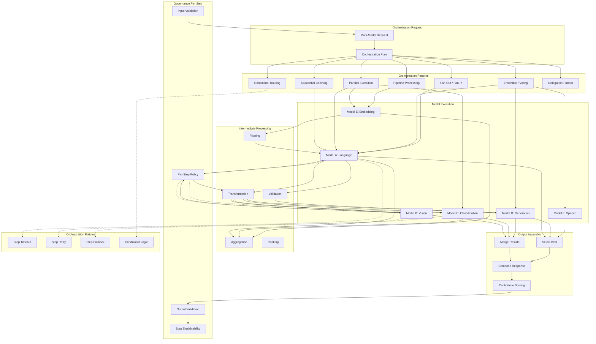
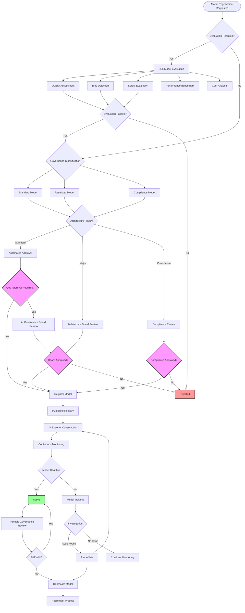
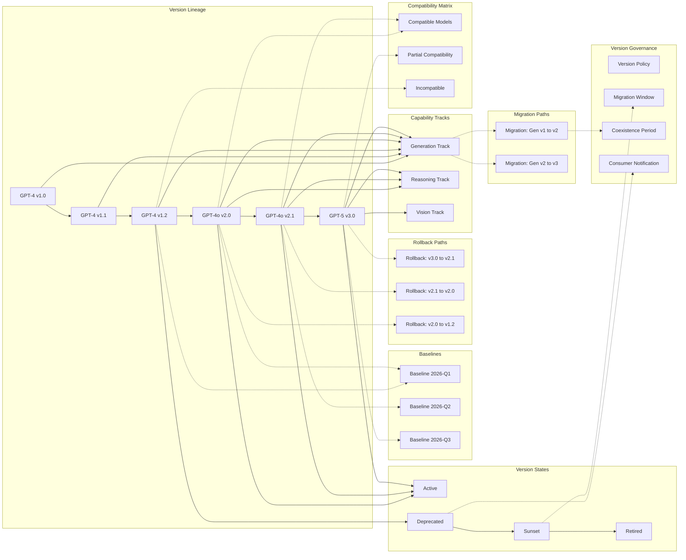

# KB-118 — AI Model Management Architecture

**Suite:** Enterprise Platform Services  
**Version:** 1.0  
**Status:** Approved Architecture  
**Classification:** Core AI Platform Architecture  
**Last Updated:** 2026-07-12

---

## Executive Summary

This document defines the enterprise architecture governing AI models as managed enterprise assets within DUKADESK. The AI Model Management Platform shall provide a centralized architecture for registering, cataloging, governing, evaluating, selecting, orchestrating, monitoring, versioning, and retiring AI models used across the DUKADESK ecosystem.

The architecture shall abstract model providers and execution technologies, enabling vendor-independent, multi-model, AI-native enterprise capabilities.

---

## Purpose

Define how DUKADESK governs the complete lifecycle of AI models while ensuring interoperability, explainability, compliance, portability, resilience, and long-term enterprise sustainability.

---

## Scope

### In Scope

- Enterprise AI model architecture
- Model registry
- Model catalog
- Model taxonomy
- Model lifecycle
- Model governance
- Model selection
- Model routing
- Model capabilities
- Model metadata
- Model versioning
- Model evaluation
- Model benchmarking
- Model compatibility
- Model orchestration
- Multi-model architecture
- Provider abstraction
- Model observability
- Model auditing
- Model retirement

### Out of Scope

- AI provider implementation
- AI inference implementation
- Prompt implementation
- Agent implementation
- AI memory implementation
- Training infrastructure implementation

*The above items are covered by separate Knowledge Base documents (see Cross References).*

---

## Architectural Principles

| # | Principle | Description |
|---|-----------|-------------|
| 1 | **Models as Enterprise Assets** | Every AI model is a governed enterprise asset with defined ownership, lifecycle, policies, and audit trail from discovery through retirement. |
| 2 | **Vendor Independence** | Model definitions are abstracted from underlying providers. No architectural dependency exists on any specific model vendor. |
| 3 | **Provider Abstraction** | A canonical provider abstraction layer decouples AI capabilities from model execution technologies, enabling seamless substitution. |
| 4 | **Model Interoperability** | Models expose standardized capability interfaces enabling uniform consumption and interchangeability at the capability level. |
| 5 | **Multi-Model Architecture** | Multiple models coexist and are orchestrated within the platform. No single model is the sole provider of any enterprise AI capability. |
| 6 | **Explainability by Design** | Every model interaction includes explainability metadata. Model decisions are traceable to the specific model version and configuration. |
| 7 | **Responsible AI** | Models are evaluated for bias, safety, and ethical compliance before registration. Ongoing monitoring ensures continued adherence. |
| 8 | **Security by Design** | Model access, invocation, and data flows are secured at every layer. Models are isolated from direct consumer access. |
| 9 | **Zero Trust** | No model, provider, or consumer is implicitly trusted. Every model interaction is authenticated, authorised, and audited. |
| 10 | **Multi-Tenant Isolation** | Model interactions are strictly partitioned per tenant. No cross-tenant model data or context leakage is architecturally possible. |
| 11 | **Lifecycle Governance** | Models progress through gated lifecycle stages. Governance is enforced at every transition. |
| 12 | **Observability by Default** | Every model evaluation, selection decision, routing action, and performance metric emits structured telemetry. |
| 13 | **Future Model Portability** | The architecture anticipates new model paradigms, providers, and deployment models without fundamental structural changes. |

---

## Canonical Definitions

| Term | Definition |
|------|------------|
| **AI Model** | A mathematical and computational artifact that provides AI capabilities through inference, trained on data and exposed through a standardized interface. |
| **Foundation Model** | A large-scale AI model trained on broad data that serves as a base for multiple downstream capabilities through fine-tuning, prompting, or orchestration. |
| **Specialized Model** | An AI model optimized for a specific capability, domain, task, or modality with focused training and constrained scope. |
| **Multi-Modal Model** | An AI model capable of processing and generating across multiple data modalities including text, image, audio, and video. |
| **Model Registry** | The authoritative system of record for all governed AI models, their metadata, versions, capabilities, providers, and lifecycle state. |
| **Model Catalog** | A discovery and classification interface over the Model Registry enabling search, taxonomy browsing, capability assessment, and evaluation comparison. |
| **Model Capability** | A specific cognitive function provided by a model (e.g., generation, reasoning, classification, vision) with defined quality and performance characteristics. |
| **Model Provider** | An entity that supplies, hosts, or serves AI models for inference, including external vendors and internal deployment platforms. |
| **Model Routing** | The dynamic selection and direction of AI requests to the appropriate model based on capability, policy, cost, performance, and availability. |
| **Model Selection** | The architectural process of identifying, evaluating, and choosing a model for a given capability based on defined criteria. |
| **Model Version** | A specific snapshot of an AI model identified by a version identifier, with defined capabilities, compatibility, and lifecycle state. |
| **Model Evaluation** | The systematic assessment of a model's quality, performance, safety, bias, and compliance against defined criteria. |
| **Model Benchmark** | A standardized test or suite used to measure and compare model performance across defined dimensions. |
| **Model Metadata** | Structured information describing a model's identity, provenance, capabilities, limitations, governance, and operational characteristics. |
| **Model Governance** | The framework of policies, controls, evaluations, and oversight mechanisms governing model definition, selection, usage, and evolution. |
| **Model Lifecycle** | The progression of a model through defined states from discovery through retirement within the enterprise platform. |
| **Model Compatibility** | The degree to which a model can substitute for another model at the capability interface level without consumer impact. |
| **Model Portfolio** | The complete collection of AI models registered, governed, and available within the enterprise AI model ecosystem. |
| **Model Consumer** | A platform service, AI service, agent, workflow, application, or tenant that invokes a model through the Model Management Platform. |
| **Model Provenance** | The traceable lineage of a model including origin, training data, evaluation results, modifications, and governance approvals. |

---

## Architecture

### 1. Enterprise AI Model Management Architecture

The Enterprise AI Model Management Platform provides centralized governance, discovery, selection, routing, orchestration, and monitoring of all AI models across DUKADESK.

### 2. AI Model Taxonomy

AI models are classified according to a canonical taxonomy that governs their registration, capability mapping, governance tier, and lifecycle.

```mermaid
graph TB
    ROOT[AI Model Taxonomy]

    ROOT --> LM[Language Models]
    ROOT --> VISION[Vision Models]
    ROOT --> SPEECH[Speech Models]
    ROOT --> AUDIO[Audio Models]
    ROOT --> MM[Multi-Modal Models]
    ROOT --> EMBED[Embedding Models]
    ROOT --> CLASS[Classification Models]
    ROOT --> REC[Recommendation Models]
    ROOT --> PRED[Predictive Models]
    ROOT --> DEC[Decision Models]
    ROOT --> SPEC[Specialized Enterprise]
    ROOT --> FUTURE[Future Categories]

    LM --> LM_LLM[Large Language]
    LM --> LM_SLM[Small Language]
    LM --> LM_CODE[Code Models]
    LM --> LM_INSTRUCT[Instruction-Tuned]
    LM --> LM_CHAT[Chat Models]

    VISION --> V_OBJECT[Object Detection]
    VISION --> V_OCR[OCR / Document]
    VISION --> V_SCENE[Scene Understanding]
    VISION --> V_FACE[Face / Biometric]
    VISION --> V_VIDEO[Video Understanding]

    SPEECH --> S_STT[Speech-to-Text]
    SPEECH --> S_TTS[Text-to-Speech]
    SPEECH --> S_SPEAKER[Speaker ID]
    SPEECH --> S_LANG[Language ID]

    AUDIO --> A_CLASS[Audio Classification]
    AUDIO --> A_SEP[Audio Separation]
    AUDIO --> A_GEN[Audio Generation]
    AUDIO --> A_MUSIC[Music Generation]

    MM --> MM_TI[Text + Image]
    MM --> MM_TA[Text + Audio]
    MM --> MM_TV[Text + Video]
    MM --> MM_DOC[Document Understanding]

    EMBED --> E_TEXT[Text Embeddings]
    EMBED --> E_IMAGE[Image Embeddings]
    EMBED --> E_CODE[Code Embeddings]
    EMBED --> E_MULTI[Multi-Modal Embeddings]

    CLASS --> C_TEXT[Text Classification]
    CLASS --> C_INTENT[Intent Classification]
    CLASS --> C_ENT[Named Entity Recognition]
    CLASS --> C_SENT[Sentiment Analysis]
    CLASS --> C_TOPIC[Topic Classification]

    REC --> R_CONTENT[Content Recommendation]
    REC --> R_PERSONAL[Personalization]
    REC --> R_ACTION[Action Recommendation]
    REC --> R_SEARCH[Search Ranking]

    PRED --> P_TS[Time Series]
    PRED --> P_BEHAVIOR[Behavioral]
    PRED --> P_ANOMALY[Anomaly Detection]
    PRED --> P_TREND[Trend Analysis]

    DEC --> D_CLASSIFY[Decision Classification]
    DEC --> D_RANK[Decision Ranking]
    DEC --> D_OPT[Decision Optimization]
    DEC --> D_POLICY[Policy-Based Decision]

    SPEC --> S_DOMAIN[Domain-Specific]
    SPEC --> S_REG[Regulatory Models]
    SPEC --> S_CUSTOM[Enterprise Fine-Tuned]

    subgraph "Taxonomy Dimensions"
        D_MODALITY[Modality]
        D_TASK[Task Type]
        D_SIZE[Model Size Class]
        D_SOURCE[Source / Provenance]
        D_GOV[Governance Tier]
    end

    ROOT -.-> D_MODALITY
    ROOT -.-> D_TASK
    ROOT -.-> D_SIZE
    ROOT -.-> D_SOURCE
    ROOT -.-> D_GOV

    LM --> LM_OPEN[Open Weights]
    LM --> LM_CLOSED[Closed Source]
    LM --> LM_FINE[Fine-Tuned Variants]
```

### 3. AI Model Lifecycle

Every AI model progresses through a defined lifecycle with gated transitions ensuring governance, evaluation, and consumer notification at every stage.

### 4. Model Selection Architecture

Model selection determines the optimal model for a given AI request based on capability requirements, governance policies, cost constraints, performance targets, and availability.

### 5. Multi-Model Orchestration

Multi-model orchestration coordinates the use of multiple AI models within a single AI workflow, enabling composition of diverse model capabilities.

### 6. Provider Abstraction Layer

The Provider Abstraction Layer decouples enterprise AI capabilities from underlying model vendors, enabling seamless provider substitution, multi-provider routing, and vendor-independent operations.

```mermaid
graph TB
    subgraph "AI Platform Services"
        AI_SVC[AI Services]
        AI_ORCH[AI Orchestrator]
        AGENT[AI Agents]
    end

    subgraph "Provider Abstraction Layer"
        PAL_GW[Provider Gateway]
        PAL_ADAPTER[Adapter Registry]
        PAL_ROUTER[Intelligent Router]
        PAL_FALLBACK[Failover Manager]
        PAL_CACHE[Response Cache]
        PAL_COST[Cost Manager]
        PAL_HEALTH[Health Monitor]
        PAL_THROTTLE[Rate Limiter]
    end

    subgraph "Provider Adapters"
        ADPT_OPENAI[OpenAI Adapter]
        ADPT_ANTHROPIC[Anthropic Adapter]
        ADPT_AWS[AWS Bedrock Adapter]
        ADPT_AZURE[Azure AI Adapter]
        ADPT_GCP[GCP Vertex Adapter]
        ADPT_OSS[Open Source Adapter]
        ADPT_CUSTOM[Custom Adapter]
        ADPT_INTERNAL[Internal Adapter]
    end

    subgraph "Provider Capability Mapping"
        CAP_MAP[Capability Map]
        CAP_GEN[Generation]
        CAP_REASON[Reasoning]
        CAP_CLASS[Classification]
        CAP_EMBED[Embedding]
        CAP_VISION[Vision]
        CAP_SPEECH[Speech]
    end

    subgraph "Provider Governance"
        PG_AUTH[Provider Authentication]
        PG_COMPLIANCE[Compliance Check]
        PG_CONTRACT[Contract Enforcement]
        PG_SLA[SLA Monitoring]
    end

    subgraph "Provider Pool"
        POOL_PRI[Primary Providers]
        POOL_SEC[Secondary Providers]
        POOL_FALLBACK[Fallback Providers]
        POOL_INTERNAL[Internal Deployments]
    end

    AI_SVC --> PAL_GW
    AI_ORCH --> PAL_GW
    AGENT --> PAL_GW

    PAL_GW --> PAL_ADAPTER
    PAL_ADAPTER --> PAL_ROUTER
    PAL_ROUTER --> PAL_FALLBACK
    PAL_ROUTER --> PAL_CACHE
    PAL_ROUTER --> PAL_COST
    PAL_ROUTER --> PAL_HEALTH
    PAL_ROUTER --> PAL_THROTTLE

    PAL_ADAPTER --> ADPT_OPENAI
    PAL_ADAPTER --> ADPT_ANTHROPIC
    PAL_ADAPTER --> ADPT_AWS
    PAL_ADAPTER --> ADPT_AZURE
    PAL_ADAPTER --> ADPT_GCP
    PAL_ADAPTER --> ADPT_OSS
    PAL_ADAPTER --> ADPT_CUSTOM
    PAL_ADAPTER --> ADPT_INTERNAL

    CAP_MAP --> ADPT_OPENAI
    CAP_MAP --> ADPT_ANTHROPIC
    CAP_MAP --> ADPT_AWS
    CAP_MAP --> ADPT_INTERNAL

    CAP_GEN --> CAP_MAP
    CAP_REASON --> CAP_MAP
    CAP_CLASS --> CAP_MAP
    CAP_EMBED --> CAP_MAP
    CAP_VISION --> CAP_MAP
    CAP_SPEECH --> CAP_MAP

    PAL_ROUTER --> PG_AUTH
    PAL_FALLBACK --> PG_COMPLIANCE
    PAL_COST --> PG_CONTRACT
    PAL_HEALTH --> PG_SLA

    POOL_PRI --> ADPT_OPENAI
    POOL_PRI --> ADPT_ANTHROPIC
    POOL_SEC --> ADPT_AWS
    POOL_SEC --> ADPT_AZURE
    POOL_FALLBACK --> ADPT_GCP
    POOL_FALLBACK --> ADPT_OSS
    POOL_INTERNAL --> ADPT_INTERNAL
    POOL_INTERNAL --> ADPT_CUSTOM

    PAL_FALLBACK --> POOL_PRI
    PAL_FALLBACK --> POOL_SEC
    PAL_FALLBACK --> POOL_FALLBACK
    PAL_FALLBACK --> POOL_INTERNAL

    subgraph "Abstraction Contracts"
        CT_REQ[Standardized Request Format]
        CT_RESP[Standardized Response Format]
        CT_ERROR[Standardized Error Schema]
        CT_META[Standardized Metadata]
    end

    PAL_ADAPTER -.-> CT_REQ
    PAL_ADAPTER -.-> CT_RESP
    PAL_ADAPTER -.-> CT_ERROR
    PAL_ADAPTER -.-> CT_META
```

### 7. Model Governance Structure

Model governance is enforced through a structured framework spanning model evaluation, policy enforcement, compliance validation, risk assessment, and audit tracking.

### 8. Model Portfolio Architecture

The Model Portfolio provides enterprise-wide visibility into the complete model inventory, enabling portfolio governance, lifecycle management, risk analysis, and strategic planning.

```mermaid
graph TB
    subgraph "Model Registry"
        REG[Registry Core]
        STORE[Model Store]
        EVT[Model Change Events]
    end

    subgraph "Model Catalog"
        CAT[Catalog Service]
        SEARCH[Search & Discovery]
        CLASS[Classification Engine]
        REL[Relationship Mapper]
    end

    subgraph "Portfolio Views"
        V_TAX[Taxonomy View]
        V_LIFE[Lifecycle View]
        V_CAP[Capability View]
        V_PROV[Provider View]
        V_COST[Cost View]
        V_RISK[Risk View]
        V_GOV[Governance View]
    end

    subgraph "Analytics & Insights"
        AN_UTIL[Utilization Analytics]
        AN_PERF[Performance Analytics]
        AN_QUAL[Quality Analytics]
        AN_COST_AN[Cost Analytics]
        AN_COVERAGE[Coverage Analysis]
    end

    subgraph "Portfolio Governance"
        PG_OWNER[Ownership Gaps]
        PG_ORPHAN[Orphaned Models]
        PG_STALE[Stale Models]
        PG_DUP[Duplicate Detection]
        PG_COMPLIANCE[Compliance Status]
    end

    subgraph "Reporting"
        RP_EXEC[Executive Reports]
        RP_COMP[Compliance Reports]
        RP_ARCH[Architecture Reports]
        RP_COST[Cost Reports]
        RP_TREND[Trend Analysis]
    end

    REG --> STORE
    REG --> EVT

    REG --> CAT
    CAT --> SEARCH
    CAT --> CLASS
    CAT --> REL

    REG --> V_TAX
    REG --> V_LIFE
    REG --> V_CAP
    REG --> V_PROV
    REG --> V_COST
    REG --> V_RISK
    REG --> V_GOV

    REG --> AN_UTIL
    REG --> AN_PERF
    REG --> AN_QUAL
    REG --> AN_COST_AN
    REG --> AN_COVERAGE

    REG --> PG_OWNER
    REG --> PG_ORPHAN
    REG --> PG_STALE
    REG --> PG_DUP
    REG --> PG_COMPLIANCE

    AN_UTIL --> RP_EXEC
    AN_PERF --> RP_ARCH
    AN_QUAL --> RP_TREND
    AN_COST_AN --> RP_COST
    PG_COMPLIANCE --> RP_COMP
    PG_STALE --> RP_ARCH

    V_RISK --> RP_EXEC
    V_LIFE --> RP_ARCH
    V_GOV --> RP_COMP
    V_COST --> RP_COST

    EVT -.-> AN_UTIL
    EVT -.-> PG_COMPLIANCE
    REL -.-> V_CAP
    CLASS -.-> V_TAX

    subgraph "Portfolio Dimensions"
        PD_SIZE[Model Count]
        PD_PROV[Provider Diversity]
        PD_CAP[Capability Coverage]
        PD_COST[Total Cost]
        PD_RISK[Risk Distribution]
        PD_LIFE[Lifecycle Distribution]
    end

    RP_EXEC -.-> PD_SIZE
    RP_EXEC -.-> PD_COST
    RP_ARCH -.-> PD_CAP
    RP_COMP -.-> PD_RISK
```

### 9. AI Model Ecosystem

The AI Model Ecosystem provides a holistic view of all AI models, providers, consumers, evaluation data, and governance components operating within the DUKADESK Model Management Platform.

```mermaid
graph TB
    subgraph "Model Governance"
        GOV_BOARD[AI Governance Board]
        EVAL_BENCH[Evaluation Benchmarks]
        POL_FRAMEWORK[Policy Framework]
        COMPLIANCE[Compliance Checks]
    end

    subgraph "Model Registry & Catalog"
        REG_CORE[Model Registry]
        CAT_DISCOVERY[Catalog & Discovery]
        CAP_INDEX[Capability Index]
        META_STORE[Metadata Store]
    end

    subgraph "Model Providers"
        PROV_OPENAI[OpenAI]
        PROV_ANTHROPIC[Anthropic]
        PROV_AWS[AWS Bedrock]
        PROV_AZURE[Azure AI]
        PROV_GCP[GCP Vertex]
        PROV_OSS[Open Source]
        PROV_CUSTOM[Custom Models]
        PROV_INTERNAL[Internal Deployments]
    end

    subgraph "Model Portfolio"
        M_LLM[Large Language Models]
        M_VISION[Vision Models]
        M_SPEECH[Speech Models]
        M_EMBED[Embedding Models]
        M_CLASS[Classification Models]
        M_REC[Recommendation Models]
        M_SPECIAL[Specialized Models]
    end

    subgraph "Model Consumers"
        C_AI_SVC[AI Services]
        C_AGENTS[AI Agents]
        C_WORKFLOWS[Workflows]
        C_APPS[Applications]
        C_TENANTS[Tenants]
        C_BS[Builder Studio]
    end

    subgraph "Evaluation & Feedback"
        EVAL_RUNS[Evaluation Runs]
        BENCH_MARKS[Benchmark Results]
        FEEDBACK[Consumer Feedback]
        QUAL_METRICS[Quality Metrics]
    end

    subgraph "Observability & Operations"
        OPS_MONITOR[Model Monitoring]
        OPS_COST[Cost Management]
        OPS_PERF[Performance Tracking]
        OPS_INCIDENT[Incident Response]
    end

    GOV_BOARD --> POL_FRAMEWORK
    POL_FRAMEWORK --> REG_CORE
    EVAL_BENCH --> REG_CORE
    COMPLIANCE --> REG_CORE

    REG_CORE --> CAT_DISCOVERY
    REG_CORE --> CAP_INDEX
    REG_CORE --> META_STORE

    PROV_OPENAI --> M_LLM
    PROV_ANTHROPIC --> M_LLM
    PROV_AWS --> M_LLM
    PROV_AWS --> M_VISION
    PROV_AZURE --> M_LLM
    PROV_AZURE --> M_SPEECH
    PROV_GCP --> M_VISION
    PROV_GCP --> M_EMBED
    PROV_OSS --> M_LLM
    PROV_OSS --> M_EMBED
    PROV_CUSTOM --> M_SPECIAL
    PROV_INTERNAL --> M_SPECIAL

    M_LLM --> CAP_INDEX
    M_VISION --> CAP_INDEX
    M_SPEECH --> CAP_INDEX
    M_EMBED --> CAP_INDEX
    M_CLASS --> CAP_INDEX
    M_REC --> CAP_INDEX
    M_SPECIAL --> CAP_INDEX

    C_AI_SVC --> M_LLM
    C_AI_SVC --> M_EMBED
    C_AGENTS --> M_LLM
    C_WORKFLOWS --> M_CLASS
    C_WORKFLOWS --> M_REC
    C_APPS --> M_VISION
    C_TENANTS --> M_LLM
    C_BS --> M_GEN[Generation Models]

    C_AI_SVC --> FEEDBACK
    C_AGENTS --> FEEDBACK
    C_TENANTS --> FEEDBACK

    FEEDBACK --> EVAL_RUNS
    EVAL_RUNS --> BENCH_MARKS
    BENCH_MARKS --> QUAL_METRICS

    QUAL_METRICS --> REG_CORE
    QUAL_METRICS --> OPS_MONITOR

    OPS_MONITOR --> OPS_INCIDENT
    OPS_COST --> PROV_OPENAI
    OPS_COST --> PROV_ANTHROPIC
    OPS_PERF --> M_LLM
    OPS_PERF --> M_VISION

    M_LLM --> OPS_MONITOR
    M_VISION --> OPS_MONITOR
    M_SPECIAL --> OPS_MONITOR

    GOV_BOARD -.-> OPS_INCIDENT
    POL_FRAMEWORK -.-> C_AI_SVC
    COMPLIANCE -.-> M_SPECIAL
```

### 10. Model Version Evolution

Model versions evolve through semantic versioning with support for parallel tracks, compatibility management, baseline anchoring, and graceful migration.

---

## Lifecycle

| Phase | Description | Gates |
|-------|-------------|-------|
| **Discovery** | Model identified through provider release, internal development, or evaluation program. | Discovery assessment |
| **Evaluation** | Systematic assessment of quality, performance, safety, bias, compliance, and cost against enterprise criteria. | Evaluation completion |
| **Architecture Review** | Architecture Board evaluation of model fit, integration impact, capability alignment, and portfolio positioning. | Architecture review sign-off |
| **Governance Approval** | AI Governance Board review covering ethics, safety, compliance, risk, and responsible AI criteria. | AI Governance Board approval |
| **Registration** | Model registered in Model Registry with full metadata, capabilities, governance policies, and provider bindings. | Registry entry verified |
| **Publication** | Model published and made available for discovery and selection by AI capabilities and consumers. | Publication validation |
| **Consumption** | Active model serving AI requests through the Model Selection and Routing architecture. | Consumption readiness |
| **Monitoring** | Continuous observation of quality, performance, safety, bias, cost, and utilization metrics. | Health criteria met |
| **Optimization** | Model configuration, routing, and cost optimization based on operational data. | Optimization review |
| **Version Evolution** | Model version upgrades with compatibility assessment, migration planning, and coexistence management. | Version governance |
| **Deprecation** | Model marked deprecated; new selection prohibited; existing consumers notified with migration timeline. | Deprecation notice |
| **Sunset** | Model removed from active routing; only existing consumers served during migration window. | Sunset approval |
| **Retirement** | Model fully removed from platform. All consumers migrated. Provider bindings deactivated. | Migration completion |
| **Historical Archival** | Model metadata, evaluation data, audit records, and performance history archived for governance. | Archive completion |

---

## Governance

| Domain | Governance Mechanism | Responsible Body |
|--------|---------------------|------------------|
| **Model Ownership** | Every model must have a registered owner accountable for lifecycle, governance, and operational health. | Enterprise Architecture |
| **Portfolio Governance** | Model portfolio is governed for diversity, cost, risk, capability coverage, and strategic alignment. | AI Governance Board |
| **Responsible AI Governance** | Models are evaluated for bias, safety, fairness, and ethical compliance at registration and periodically. | AI Ethics Committee |
| **Security Governance** | Model provider security posture, data protection, and access controls are reviewed and certified. | Security |
| **Compliance Governance** | Models processing regulated data or operating in regulated domains undergo compliance validation. | Compliance |
| **Lifecycle Governance** | Lifecycle transitions are gated with validation. Non-compliant transitions are blocked and audited. | Enterprise Architecture |
| **Version Governance** | Version changes follow defined governance. Breaking changes require consumer notification and migration planning. | AI Platform Team |
| **Risk Governance** | Model risk classification determines governance tier, evaluation depth, and monitoring requirements. | AI Risk Management |
| **Architecture Governance** | New model categories and major provider integrations require Architecture Board review. | Architecture Review Board |
| **Enterprise AI Governance** | AI capabilities consuming models are governed to ensure consistent model management across the platform. | AI Governance Board |

---

## Responsibilities

| Role | Responsibilities |
|------|-----------------|
| **Enterprise Architecture** | Define model taxonomy, architectural principles, governance standards; conduct architecture reviews; govern model portfolio. |
| **AI Platform Team** | Build and maintain Model Registry, Provider Abstraction Layer, Model Router, Evaluation Engine, and observability tooling. |
| **AI Governance Board** | Oversee model governance framework; approve model registrations; review model incidents; ensure responsible AI practices. |
| **Data Governance** | Govern model evaluation data, training data provenance, and feedback data quality; ensure data privacy compliance. |
| **Platform Engineering** | Integrate Model Management Platform with AI Platform and enterprise services; manage model infrastructure. |
| **Product Teams** | Propose model requirements; participate in model evaluation; manage model lifecycle for product capabilities. |
| **Security** | Perform security reviews of models, providers, and data flows; define model access policies; audit model usage. |
| **Compliance** | Conduct compliance reviews; define AI model regulatory validation rules; verify model adherence to legal requirements. |
| **Operations** | Monitor model health, provider availability, performance, and cost; respond to model incidents; manage model capacity. |
| **Tenant Administrators** | Manage tenant-level model selection policies; configure model access controls; monitor tenant model usage and cost. |

---

## Security

| Control Area | Architecture |
|-------------|--------------|
| **Secure Model Access** | Every model invocation is authenticated and authorised against the consumer identity, scope, and tenant. |
| **Model Authorization** | Model access is governed by policies defining which consumers, capabilities, and tenants may invoke which models. |
| **Provider Trust** | AI providers are vetted and certified before integration. Provider security posture is continuously monitored. |
| **Model Integrity** | Model responses are verified for integrity. Tampering is detectable through cryptographic verification where supported. |
| **Least Privilege** | Model execution credentials are scoped to minimum required permissions. Models cannot access resources outside their authorization boundary. |
| **Zero Trust** | No model, provider, or consumer is implicitly trusted. Every interaction requires authentication, authorisation, and audit. |
| **Tenant Isolation** | Model interactions are strictly partitioned per tenant. No cross-tenant model data or context is architecturally possible. |
| **Auditability** | Every model selection, invocation, and response is recorded in an immutable audit trail with full provenance. |
| **Provenance Verification** | Every model output is traceable to the specific model version, configuration, and provider that produced it. |
| **Secure Orchestration** | Multi-model orchestration maintains security context across model boundaries. Sensitive data is never exposed between models. |

---

## Privacy

| Domain | Architecture |
|--------|--------------|
| **Privacy-Preserving AI** | Model interactions support data minimization, request anonymization, and output filtering for sensitive data. |
| **Data Minimization** | Model requests carry only the data necessary for inference. Sensitivity classifications determine handling and retention. |
| **Tenant Isolation** | Model tenant data is strictly isolated. No cross-tenant model data or context sharing is architecturally possible. |
| **Regulatory Compliance** | Models processing regulated data are tagged with compliance markers and subject to corresponding policies. |
| **Consent-Aware Processing** | Model interactions respect user consent state. Processing of personal data is blocked or modified based on consent. |
| **Regional Governance** | Model requests respect regional data residency requirements. Data remains within its geographic jurisdiction. |
| **Cross-Border Controls** | Model data crossing geographic boundaries is explicitly classified and subject to data transfer compliance review. |
| **Audit Retention** | Model audit logs are retained per regulatory requirements with privacy-preserving anonymisation where appropriate. |

---

## Performance

| Consideration | Architectural Approach |
|---------------|----------------------|
| **Enterprise-Scale Inference** | Model execution scales horizontally across provider endpoints, internal deployments, and geographic regions. |
| **Multi-Model Orchestration** | Orchestration overhead is minimized through parallel execution, streaming, and efficient context passing between models. |
| **Elastic Scalability** | Model capacity scales elastically based on demand. Provider abstraction enables seamless capacity expansion across providers. |
| **High Availability** | Model Management Platform components are deployed across multiple availability zones. Provider failover ensures continuity. |
| **Intelligent Model Routing** | Model selection optimizes for latency, cost, and quality through intelligent routing with caching and predictive pre-fetching. |
| **Cost Optimization** | Model routing considers cost per token, provider pricing models, and caching strategies to minimize enterprise AI cost. |
| **Multi-Region Readiness** | Model execution supports global regions with data residency affinity. Regional provider endpoints are prioritized locally. |
| **Operational Resilience** | Consumers operate with cached model selection state during Model Management Platform or provider outages. |

---

## Observability

| Domain | Architecture |
|--------|--------------|
| **Model Utilization** | Invocation rates, token consumption, consumer patterns, and tenant usage are tracked per model and version. |
| **Performance Analytics** | End-to-end latency, provider latency, throughput, token generation rate, and error rates are measured per model. |
| **Model Health** | Provider availability, error rates, response quality, and degradation signals are continuously monitored per model. |
| **Quality Metrics** | Output quality scores, human feedback ratings, evaluation benchmark results, and regression detection are tracked per model version. |
| **Governance Dashboards** | Role-specific dashboards expose model compliance status, policy adherence, bias metrics, and audit trail health. |
| **Explainability Reporting** | Model outputs include structured explainability data. Explainability reports are available for audit and governance review. |
| **SLA Monitoring** | Model SLAs (latency, availability, throughput) are monitored per tier. SLA breaches trigger escalation. |
| **Cost Visibility** | Cost per model, provider, tenant, consumer, and capability is tracked for chargeback and optimization. |
| **Risk Monitoring** | Model risk indicators, safety violations, bias flags, and policy breaches are continuously monitored with alerting. |
| **Enterprise AI Insights** | Aggregate model analytics provide enterprise-wide visibility into model adoption, performance, cost, and governance posture. |

---

## Failure Scenarios

| Scenario | Architectural Response |
|----------|-----------------------|
| **Model Degradation** | Degradation detection triggers automatic routing to alternative model. Degraded model is quarantined for evaluation. |
| **Provider Outage** | Provider abstraction layer detects outage and routes to fallback provider. No consumer-visible interruption for multi-provider capabilities. |
| **Model Incompatibility** | Version compatibility check at selection time. Incompatible combinations trigger fallback to compatible model version. |
| **Incorrect Model Selection** | Selection validation at routing confirms model choice against policy. Invalid selection is rejected and re-evaluated. |
| **Governance Violations** | Policy evaluation blocks violating model invocation. Violation is logged, audited, and escalated with full context. |
| **Unauthorized Model Usage** | Authorization failure blocks invocation. Attempt is logged and escalated to security with full context. |
| **Model Version Conflicts** | Version conflict detection during orchestration. Conflicting versions trigger fallback to agreed compatible version. |
| **Cross-Tenant Exposure** | Cross-tenant model data access attempts are blocked at the governance layer. Incident is logged and escalated immediately. |
| **Explainability Failures** | Explainability capture failure does not block model invocation but triggers alert. Explainability reconstructed from audit trail. |
| **Performance Degradation** | Performance monitoring detects degradation. Automatic routing diverts traffic to higher-performance model or provider. |
| **Portfolio Inconsistency** | Periodic reconciliation detects registry inconsistencies. Automated remediation re-publishes correct state from authoritative source. |
| **Recovery Failure** | Recovery actions that fail trigger escalation to AI Platform operations. Manual intervention path with full context is provided. |

---

## Anti-Patterns

| Anti-Pattern | Prohibited Because | Enforced By |
|--------------|-------------------|-------------|
| **Vendor-Locked AI Architectures** | Creates dependency risk, prevents provider substitution, and limits architectural flexibility. | Provider abstraction enforcement |
| **Hardcoded Model Selection** | Prevents policy-driven routing, cost optimization, and provider failover. | Model selection policy enforcement |
| **Unregistered Models** | Models not in the Model Registry are invisible to governance, audit, and portfolio management. | Registry mandatory check |
| **Shadow AI Models** | Unofficial model integrations bypass governance, security, and compliance controls. | Provider abstraction enforcement |
| **Duplicate Enterprise Models** | Fragments governance, creates inconsistency, and increases maintenance burden. | Registry deduplication checks |
| **Models Without Governance** | Models operating outside governance create legal, ethical, and operational risk. | Governance enforcement at every layer |
| **Models Without Observability** | Model usage without telemetry prevents audit, cost tracking, and quality monitoring. | Observability mandatory check |
| **Direct Provider Coupling** | Bypasses provider abstraction, prevents failover, and creates vendor lock-in. | Architecture review; consumer-side enforcement |
| **AI Services Bypassing Model Governance** | Circumvents model selection policies, compliance checks, and cost controls. | Policy enforcement at all layers |
| **Model Usage Outside Approved Policies** | Model used for capabilities beyond its approved scope creates quality, safety, and compliance risk. | Capability-based access control |

---

## Future Evolution

| Evolution Path | Architectural Preparation |
|---------------|--------------------------|
| **Autonomous Model Optimization** | Model telemetry and performance data enable ML-driven model selection optimization, routing improvement, and cost reduction. |
| **Dynamic Model Composition** | Multi-model orchestration patterns prepare for runtime composition of models into novel capability chains. |
| **Federated Enterprise AI** | Provider abstraction and multi-region architecture prepare for federated model access across organizational boundaries. |
| **Self-Managing Model Portfolios** | Portfolio analytics evolve to automated model lifecycle management — discovery, evaluation, promotion, and retirement. |
| **Intelligent Provider Selection** | Model routing evolves to support predictive provider selection based on real-time performance, cost, and availability data. |
| **Cross-Platform Model Federation** | Standardized model interfaces enable model sharing and discovery across federated DUKADESK instances. |
| **Adaptive Enterprise Intelligence** | Model portfolios dynamically adapt to enterprise needs, automatically onboarding and retiring models based on demand. |
| **Future Cognitive Model Ecosystems** | Extensible taxonomy and provider abstraction prepare for emerging model paradigms including neuromorphic, quantum, and cognitive architectures. |

---

## Cross References

| Document ID | Title | Relation |
|-------------|-------|----------|
| **KB-089** | Knowledge Graph Architecture | Defines knowledge structures consumed by AI models for retrieval-augmented generation. |
| **KB-107** | Enterprise Platform Services Overview Architecture | Defines the platform services context within which Model Management operates. |
| **KB-116** | AI Platform Architecture | Parent architecture defining the overall AI Platform within which Model Management is a core capability. |
| **KB-117** | AI Agent Framework Architecture | Defines AI agents that consume models through the Model Management Platform. |
| **KB-119** | Prompt Management Architecture | Defines prompt management that governs how models are instructed and configured. |
| **KB-120** | AI Context & Memory Architecture | Defines context and memory capabilities that augment model interactions. |
| **KB-121** | AI Safety & Governance Architecture | Defines safety and governance mechanisms enforced during model selection and invocation. |
| **KB-122** | AI Decision Intelligence Architecture | Defines decision intelligence capabilities that depend on model selection and orchestration. |
| **KB-124** | Policy Management Architecture | Defines the policy framework enforced by Model Governance. |
| **KB-138** | Platform Automation Architecture | Defines automation capabilities that manage model operations and lifecycle. |
| **KB-140** | Enterprise Platform Services Reference Architecture | Defines the overarching reference architecture for enterprise platform services. |

---

## Acceptance Criteria

- [x] Defines enterprise AI Model Management architecture.
- [x] Treats AI models as governed enterprise assets.
- [x] Defines model taxonomy, lifecycle, governance, provider abstraction, orchestration, and versioning.
- [x] Supports enterprise-scale, vendor-independent, multi-model, AI-native operations.
- [x] Includes all 10 required Mermaid diagrams.
- [x] Cross-references related Knowledge Base documents.
- [x] Contains no implementation guidance.

---

## Completion Instructions

1. **Mark KB-118 as Completed** — This document constitutes the completed architecture specification.
2. **Update the Progress Registry** — Record KB-118 as Approved Architecture in the Knowledge Base registry.
3. **Cross-Reference Related Documents** — Ensure KB-116 through KB-122 reference this document.
4. **Queue Next Assignment** — KB-119 – Prompt Management Architecture is the next builder assignment.

---

## Critical DUKADESK Architectural Rule

> **Every AI model used within DUKADESK shall be managed as a governed enterprise asset through the centralized AI Model Management Platform. No application, service, workflow, tenant, or AI agent shall directly depend upon or embed unmanaged model integrations, ensuring provider independence, explainability, portability, governance, security, and long-term enterprise sustainability.**

(End of file — total lines may exceed display)
