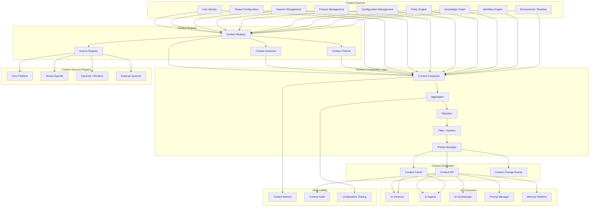
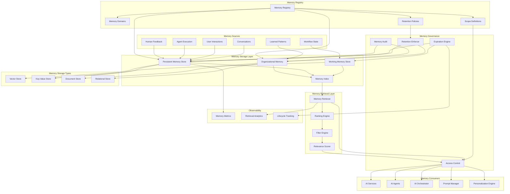
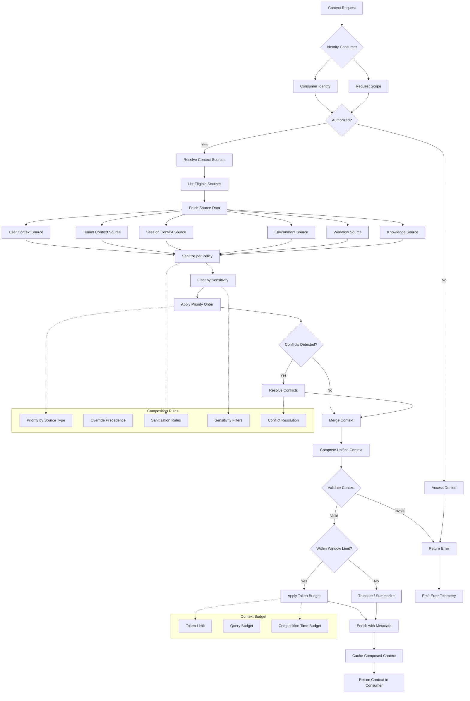
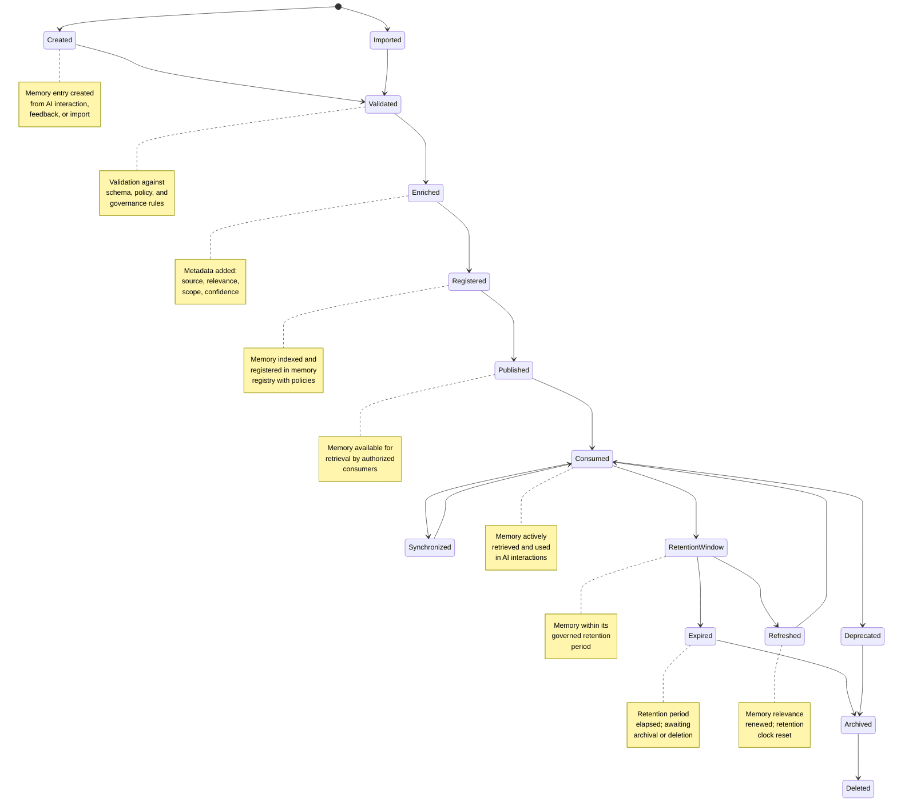
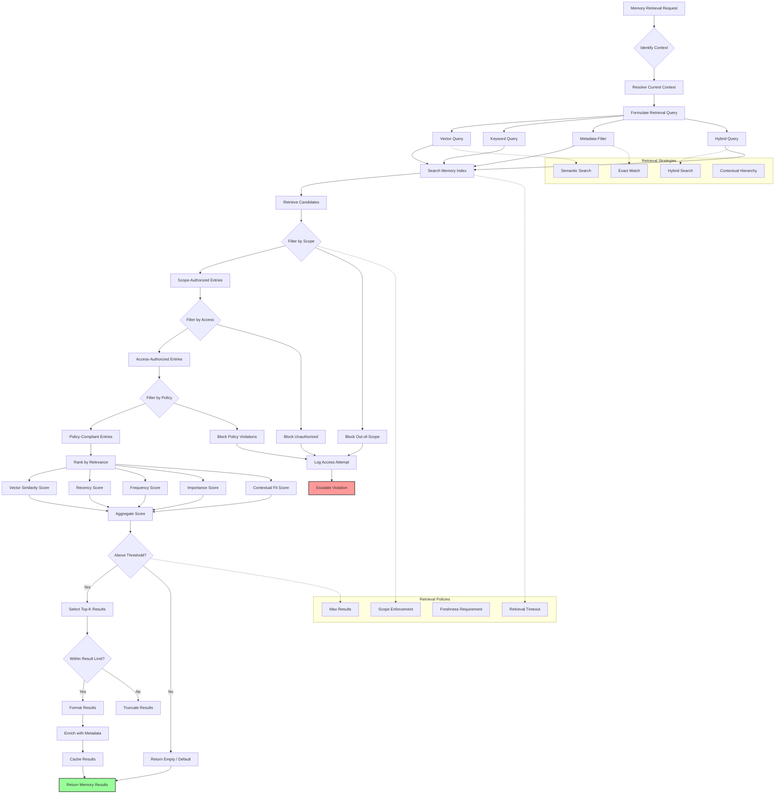
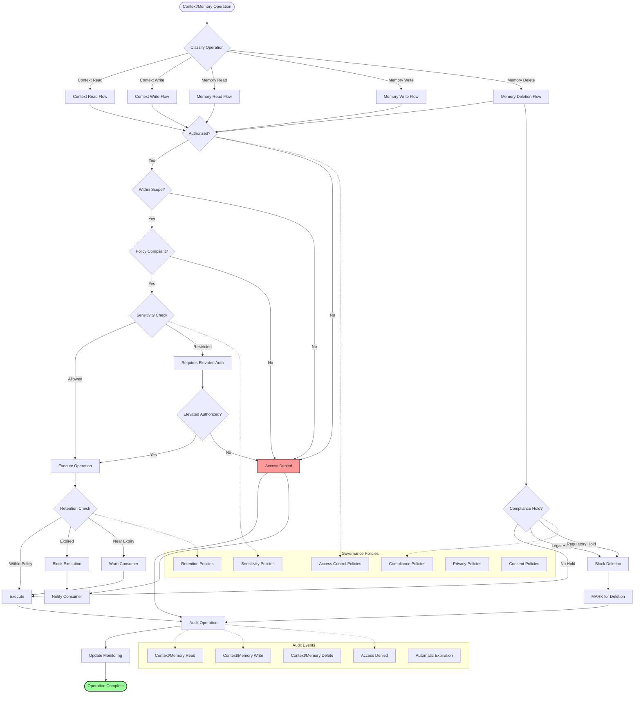

# KB-120 — AI Context & Memory Architecture

**Suite:** Enterprise Platform Services  
**Version:** 1.0  
**Status:** Approved Architecture  
**Classification:** Core AI Platform Architecture  
**Last Updated:** 2026-07-12

---

## Executive Summary

This document defines the enterprise architecture governing AI context and memory as foundational platform capabilities within DUKADESK. The AI Context & Memory Platform shall provide a centralized architecture for managing the information AI systems require to reason consistently, preserve continuity, personalize interactions, retrieve enterprise knowledge, and coordinate intelligently across users, tenants, applications, workflows, and agents.

The architecture shall distinguish between transient context, persistent memory, enterprise knowledge, and governed organizational intelligence while ensuring privacy, explainability, security, and lifecycle governance.

---

## Purpose

Define how DUKADESK models, governs, secures, evolves, and manages AI context and memory to support consistent, personalized, explainable, and enterprise-scale AI capabilities.

---

## Scope

### In Scope

- Enterprise AI context architecture
- Enterprise AI memory architecture
- Context taxonomy
- Memory taxonomy
- Context registry
- Memory registry
- Context lifecycle
- Memory lifecycle
- Context governance
- Memory governance
- Conversational context
- Operational context
- User context
- Tenant context
- Workflow context
- Agent context
- Enterprise knowledge context
- Memory retrieval architecture
- Memory retention architecture
- Memory expiration architecture
- Memory auditing
- Memory observability
- Personalization architecture

### Out of Scope

- Knowledge Graph implementation
- Database implementation
- Vector storage implementation
- AI model implementation
- Prompt implementation
- Agent implementation

*The above items are covered by separate Knowledge Base documents (see Cross References).*

---

## Architectural Principles

| # | Principle | Description |
|---|-----------|-------------|
| 1 | **Context as a Governed Enterprise Asset** | Context definitions, schemas, and policies are governed enterprise assets with defined ownership, lifecycle, and audit. |
| 2 | **Memory as an Enterprise Capability** | AI memory is a centralized platform capability, not an application-level feature. All memory operations flow through the platform. |
| 3 | **Separation of Context and Memory** | Transient context (session, conversation) is architecturally distinct from persistent memory (user, organizational). Each has independent governance, lifecycle, and storage. |
| 4 | **Separation of Memory and Knowledge** | Enterprise knowledge (KB, Knowledge Graph) is distinct from AI memory. Memory captures AI-specific state; knowledge represents canonical enterprise information. |
| 5 | **Privacy by Design** | Context and memory minimize data collection, enforce tenant isolation, respect consent, and support data subject rights including right to deletion. |
| 6 | **Explainability** | Every memory retrieval and context composition decision is traceable and explainable to the appropriate governance level. |
| 7 | **Least Privilege** | Context and memory access is scoped to the minimum required level. No consumer accesses data beyond its authorization boundary. |
| 8 | **Zero Trust** | No context or memory operation is implicitly trusted. Every read, write, and retrieval is authenticated, authorised, and audited. |
| 9 | **Multi-Tenant Isolation** | Context and memory are strictly partitioned per tenant. No cross-tenant data sharing or leakage is architecturally possible. |
| 10 | **Context Portability** | Context definitions are portable across AI capabilities, providers, and models. No context dependency on specific AI technologies. |
| 11 | **Vendor Independence** | Memory storage, retrieval, and indexing are abstracted from underlying technologies. No vendor lock-in at the architectural level. |
| 12 | **Technology Neutrality** | Context schemas and memory models are expressed in technology-neutral formats, not tied to specific databases or frameworks. |
| 13 | **Lifecycle Governance** | Context and memory progress through gated lifecycle stages. Governance is enforced at every transition including expiration and deletion. |
| 14 | **Observability by Default** | Every context composition, memory retrieval, and lifecycle transition emits structured telemetry for governance and operations. |

---

## Canonical Definitions

| Term | Definition |
|------|------------|
| **Context** | Transient information that defines the current state, environment, and circumstances of an AI interaction, comprising session, user, tenant, workflow, and operational data. |
| **Memory** | Persistent information retained across AI interactions, comprising user preferences, conversation history, learned patterns, and organizational knowledge specific to AI operations. |
| **Context Registry** | The authoritative system of record for all governed context definitions, their schemas, sources, ownership, and policies. |
| **Memory Registry** | The authoritative system of record for all governed memory domains, their retention policies, access controls, and lifecycle state. |
| **Session Context** | Transient information scoped to a single AI interaction session, including current conversation state, intermediate results, and request parameters. |
| **Conversation Context** | Information spanning a multi-turn conversation, including message history, user intent, resolved entities, and conversation state. |
| **Operational Context** | Environment and execution information including platform state, feature flags, tenant configuration, and runtime conditions. |
| **Enterprise Context** | Organizational information including policies, compliance requirements, business rules, and enterprise configuration relevant to AI interactions. |
| **User Context** | Information about the current user including identity, role, preferences, permissions, and personalization profile. |
| **Tenant Context** | Information about the current tenant including configuration, branding, feature enablement, and tenant-specific policies. |
| **Agent Context** | Information maintained by or about an AI agent including agent state, goals, tool availability, and execution history. |
| **Memory Scope** | The boundary within which memory is visible and accessible (e.g., user, session, tenant, organization, global). |
| **Working Memory** | Short-term memory holding information relevant to the current interaction, cleared after session completion or timeout. |
| **Persistent Memory** | Long-term memory retaining information across sessions and interactions, governed by retention policies. |
| **Shared Memory** | Memory accessible to multiple consumers within the same scope, enabling coordination and consistent intelligence. |
| **Organizational Memory** | Enterprise-wide memory containing learned patterns, best practices, and institutional knowledge relevant to AI operations. |
| **Memory Retrieval** | The architectural process of identifying, ranking, and returning relevant memory entries based on current context and query. |
| **Memory Lifecycle** | The progression of memory entries through defined states from creation through expiration and deletion. |
| **Context Window** | The bounded set of context information provided to an AI model for a single interaction, subject to model-specific limits. |
| **Knowledge Context** | Contextual information sourced from enterprise knowledge systems including Knowledge Graphs, document stores, and structured data. |

---

## Architecture

### 1. Enterprise AI Context Architecture

The Enterprise AI Context Architecture provides centralized governance, composition, and distribution of contextual information to all AI capabilities across DUKADESK.

### 2. Enterprise AI Memory Architecture

The Enterprise AI Memory Architecture provides centralized governance, storage, retrieval, and lifecycle management of all AI memory across DUKADESK.

### 3. Context Taxonomy

Context is classified according to a canonical taxonomy that governs its source, volatility, sensitivity, and composition rules.

```mermaid
graph TB
    ROOT[Context Taxonomy]

    ROOT --> USER[User Context]
    ROOT --> TENANT[Tenant Context]
    ROOT --> CONV[Conversation Context]
    ROOT --> WORKFLOW[Workflow Context]
    ROOT --> SESSION[Session Context]
    ROOT --> AGENT[Agent Context]
    ROOT --> BUSINESS[Business Context]
    ROOT --> OP[Operational Context]
    ROOT --> ENV[Environmental Context]
    ROOT --> KNOWLEDGE[Knowledge Context]
    ROOT --> SEC[Security Context]
    ROOT --> COMP[Compliance Context]
    ROOT --> AI_EXEC[AI Execution Context]
    ROOT --> FUTURE[Future Context Types]

    USER --> USER_ID[Identity & Profile]
    USER --> USER_ROLE[Role & Permissions]
    USER --> USER_PREF[Preferences]
    USER --> USER_HIST[Interaction History]
    USER --> USER_CONSENT[Consent State]
    USER --> USER_LOCALE[Locale & Region]

    TENANT --> TNT_CFG[Tenant Configuration]
    TENANT --> TNT_BRAND[Branding]
    TENANT --> TNT_POL[Tenant Policies]
    TENANT --> TNT_FEATURE[Feature Enablement]
    TENANT --> TNT_SUB[Subscription Tier]

    CONV --> CONV_HIST[Message History]
    CONV --> CONV_INTENT[Current Intent]
    CONV --> CONV_ENTITIES[Resolved Entities]
    CONV --> CONV_STATE[Conversation State]
    CONV --> CONV_GOALS[Active Goals]

    WORKFLOW --> WF_STATE[Workflow State]
    WORKFLOW --> WF_STEP[Current Step]
    WORKFLOW --> WF_DATA[Intermediate Data]
    WORKFLOW --> WF_RESULT[Previous Results]

    SESSION --> SESS_ID[Session Identity]
    SESSION --> SESS_TIMING[Timing & Expiry]
    SESSION --> SESS_INPUT[Current Input]
    SESSION --> SESS_INTER[Intermediate Results]

    AGENT --> AG_ID[Agent Identity]
    AGENT --> AG_STATE[Agent State]
    AGENT --> AG_TOOLS[Available Tools]
    AGENT --> AG_GOALS[Active Goals]
    AGENT --> AG_HIST[Execution History]

    BUSINESS --> BUS_PROC[Business Process]
    BUSINESS --> BUS_RULES[Business Rules]
    BUSINESS --> BUS_PRIO[Business Priorities]
    BUSINESS --> BUS_SLA[SLA Targets]

    OP --> OP_TIME[Time / Date]
    OP --> OP_REGION[Region / Locale]
    OP --> OP_ENV[Environment]
    OP --> OP_LOAD[System Load]

    ENV --> ENV_PLATFORM[Platform State]
    ENV --> ENV_SERVICES[Service Status]
    ENV --> ENV_FEATURES[Feature Flags]
    ENV --> ENV_CONFIG[Runtime Config]

    KNOWLEDGE --> K_DOMAIN[Domain Knowledge]
    KNOWLEDGE --> K_ORG[Organizational Knowledge]
    KNOWLEDGE --> K_POLICY[Policy References]
    KNOWLEDGE --> K_GRAPH[Knowledge Graph]

    SEC --> SEC_AUTH[Authentication State]
    SEC --> SEC_AUTHZ[Authorization Scope]
    SEC --> SEC_LEVEL[Security Level]

    COMP --> COMP_REG[Regulatory Context]
    COMP --> COMP_DATA[Data Classification]
    COMP --> COMP_CONSENT[Consent Status]

    AI_EXEC --> AI_MODEL[Selected Model]
    AI_EXEC --> AI_PROVIDER[Provider Context]
    AI_EXEC --> AI_PARAMS[Model Parameters]
    AI_EXEC --> AI_LIMITS[Context Window]

    subgraph "Context Attributes"
        ATTR_SOURCE[Source Type]
        ATTR_VOLATILITY[Volatility]
        ATTR_SENSITIVITY[Sensitivity Level]
        ATTR_PRIORITY[Composition Priority]
    end

    ROOT -.-> ATTR_SOURCE
    ROOT -.-> ATTR_VOLATILITY
    ROOT -.-> ATTR_SENSITIVITY
    ROOT -.-> ATTR_PRIORITY
```

### 4. Memory Taxonomy

Memory is classified according to a canonical taxonomy that governs its scope, persistence, access, and lifecycle.

```mermaid
graph TB
    ROOT[Memory Taxonomy]

    ROOT --> WM[Working Memory]
    ROOT --> EPISODIC[Episodic Memory]
    ROOT --> SEMANTIC[Semantic Memory]
    ROOT --> PROC[Procedural Memory]
    ROOT --> ORG[Organizational Memory]
    ROOT --> SHARED[Shared Memory]
    ROOT --> TNT[Tenant Memory]
    ROOT --> USER_MEM[User Memory]
    ROOT --> WF[Workflow Memory]
    ROOT --> AGENT_MEM[Agent Memory]
    ROOT --> PLATFORM[Platform Memory]
    ROOT --> HIST[Historical Memory]

    WM --> WM_SESSION[Session Working]
    WM --> WM_CONV[Conversation Working]
    WM --> WM_STEP[Step Working]
    WM --> WM_CACHE[Computation Cache]

    EPISODIC --> EP_USER[User Episodes]
    EPISODIC --> EP_CONV[Conversation Episodes]
    EPISODIC --> EP_INTERACTION[Interaction Episodes]
    EPISODIC --> EP_DECISION[Decision Episodes]

    SEMANTIC --> SEM_FACT[Factual Knowledge]
    SEMANTIC --> SEM_PREF[User Preferences]
    SEMANTIC --> SEM_PATTERN[Learned Patterns]
    SEMANTIC --> SEM_REL[Relationships]

    PROC --> PROC_TASK[Task Procedures]
    PROC --> PROC_WORKFLOW[Workflow Procedures]
    PROC --> PROC_GUIDE[Guides & Templates]
    PROC --> PROC_BEST[Best Practices]

    ORG --> ORG_POLICY[Policy Memory]
    ORG --> ORG_KNOW[Institutional Knowledge]
    ORG --> ORG_DOMAIN[Domain Expertise]
    ORG --> ORG_LESSONS[Lessons Learned]

    SHARED --> SH_AGENT[Agent Shared]
    SHARED --> SH_TEAM[Team Shared]
    SHARED --> SH_DEPT[Department Shared]

    TNT --> TNT_CFG_MEM[Configuration Memory]
    TNT --> TNT_PREF[Tenant Preferences]
    TNT --> TNT_PATTERN[Tenant Patterns]

    USER_MEM --> UM_PREF[User Preferences]
    USER_MEM --> UM_HIST[User History]
    USER_MEM --> UM_CONTACTS[User Contacts]
    USER_MEM --> UM_SETTINGS[User Settings]

    WF --> WF_STATE_MEM[Workflow State]
    WF --> WF_RESULT[Workflow Results]
    WF --> WF_HIST[Workflow History]

    AGENT_MEM --> AG_STATE_MEM[Agent State]
    AGENT_MEM --> AG_LEARNED[Agent Learned]
    AGENT_MEM --> AG_STRATEGY[Agent Strategies]

    PLATFORM --> PLAT_LEARNED[Platform Learned]
    PLATFORM --> PLAT_PATTERNS[Platform Patterns]
    PLATFORM --> PLAT_OPTIMIZATION[Optimization Data]

    HIST --> HIST_ARCHIVED[Archived Memory]
    HIST --> HIST_AUDIT[Audit Memory]
    HIST --> HIST_COMPLIANCE[Compliance Records]

    subgraph "Memory Dimensions"
        D_SCOPE[Scope: User / Tenant / Global]
        D_PERSISTENCE[Persistence: Transient / Persistent]
        D_ACCESS[Access: Private / Shared / Public]
        D_VOLATILITY[Volatility: Ephemeral / Long-Lived]
        D_GOV[Governance Tier]
    end

    ROOT -.-> D_SCOPE
    ROOT -.-> D_PERSISTENCE
    ROOT -.-> D_ACCESS
    ROOT -.-> D_VOLATILITY
    ROOT -.-> D_GOV
```

### 5. Context Composition Model

Context composition aggregates information from multiple sources, applies governance filters, resolves conflicts, and produces a unified context for AI consumption.

### 6. Memory Lifecycle

Memory entries progress through a defined lifecycle with gated transitions ensuring governance, retention compliance, and consumer notification at every stage.

### 7. Memory Retrieval Architecture

Memory retrieval identifies, ranks, filters, and returns relevant memory entries based on current context, query, and governance policies.

### 8. Context & Memory Governance

Context and memory governance is enforced through a structured framework spanning policy enforcement, access control, retention management, privacy compliance, and audit tracking.

### 9. Enterprise Cognitive Architecture

The Enterprise Cognitive Architecture integrates context, memory, knowledge, and AI capabilities into a unified cognitive layer for the DUKADESK platform.

```mermaid
graph TB
    subgraph "Cognitive Layer"
        CTX_MGR[Context Manager]
        MEM_MGR[Memory Manager]
        KNOW_MGR[Knowledge Manager]
        REASON[Reasoning Engine]
        DECIDE[Decision Engine]
        LEARN[Learning Engine]
    end

    subgraph "Context Sources"
        CS_USER[User Context]
        CS_TENANT[Tenant Context]
        CS_WORKFLOW[Workflow Context]
        CS_ENV[Environment Context]
        CS_SESSION[Session Context]
    end

    subgraph "Memory Stores"
        MS_WORKING[Working Memory]
        MS_EPISODIC[Episodic Memory]
        MS_SEMANTIC[Semantic Memory]
        MS_PROC[Procedural Memory]
        MS_ORG[Organizational Memory]
    end

    subgraph "Enterprise Knowledge"
        EK_KG[Knowledge Graph]
        EK_DOCS[Document Store]
        EK_POLICIES[Policy Store]
        EK_WIKI[Enterprise Wiki]
    end

    subgraph "AI Capabilities"
        AI_REASON[AI Reasoning]
        AI_GEN[AI Generation]
        AI_CLASS[AI Classification]
        AI_PRED[AI Prediction]
        AI_REC[AI Recommendation]
    end

    subgraph "Cognitive Processes"
        CP_ATTN[Attention Mechanism]
        CP_RET[Retrieval Process]
        CP_REASON[Reasoning Process]
        CP_DECIDE[Decision Process]
        CP_LEARN[Learning Process]
    end

    subgraph "Governance & Control"
        GC_POLICY[Cognitive Policies]
        GC_PRIVACY[Privacy Controls]
        GC_EXPLAIN[Explainability]
        GC_AUDIT[Cognitive Audit]
    end

    CS_USER --> CTX_MGR
    CS_TENANT --> CTX_MGR
    CS_WORKFLOW --> CTX_MGR
    CS_ENV --> CTX_MGR
    CS_SESSION --> CTX_MGR

    CTX_MGR --> CP_ATTN
    MEM_MGR --> CP_RET
    KNOW_MGR --> CP_RET

    CP_ATTN --> CP_REASON
    CP_RET --> CP_REASON
    CP_REASON --> CP_DECIDE
    CP_DECIDE --> CP_LEARN

    CP_LEARN --> MEM_MGR
    CP_LEARN --> MS_SEMANTIC
    CP_LEARN --> MS_PROC

    MS_WORKING --> MEM_MGR
    MS_EPISODIC --> MEM_MGR
    MS_SEMANTIC --> MEM_MGR
    MS_PROC --> MEM_MGR
    MS_ORG --> MEM_MGR

    EK_KG --> KNOW_MGR
    EK_DOCS --> KNOW_MGR
    EK_POLICIES --> KNOW_MGR
    EK_WIKI --> KNOW_MGR

    AI_REASON --> CP_REASON
    AI_GEN --> CP_DECIDE
    AI_CLASS --> CP_ATTN
    AI_PRED --> CP_DECIDE
    AI_REC --> CP_DECIDE

    CTX_MGR --> GC_POLICY
    MEM_MGR --> GC_PRIVACY
    KNOW_MGR --> GC_POLICY
    CP_REASON --> GC_EXPLAIN
    CP_DECIDE --> GC_EXPLAIN

    GC_POLICY --> CP_ATTN
    GC_PRIVACY --> MEM_MGR
    GC_AUDIT --> CTX_MGR
    GC_AUDIT --> MEM_MGR
    GC_AUDIT --> KNOW_MGR

    CP_REASON --> AI_REASON
    CP_DECIDE --> AI_GEN

    subgraph "Cognitive Feedback Loops"
        FL_USER[User Feedback]
        FL_OUTCOME[Outcome Feedback]
        FL_SYSTEM[System Feedback]
    end

    FL_USER --> CP_LEARN
    FL_OUTCOME --> CP_LEARN
    FL_SYSTEM --> CP_LEARN
```

### 10. AI Context & Memory Ecosystem

The AI Context & Memory Ecosystem provides a holistic view of all context sources, memory stores, consumers, governance components, and operational infrastructure.

```mermaid
graph TB
    subgraph "Context & Memory Platform"
        CTX_REG[Context Registry]
        MEM_REG[Memory Registry]
        CTX_COMP[Context Composer]
        MEM_RET[Memory Retriever]
        MEM_LIFE[Memory Lifecycle Manager]
    end

    subgraph "Platform Services Integration"
        PS_ID[Identity Platform]
        PS_TENANT[Tenant Management]
        PS_FEATURE[Feature Management]
        PS_CONFIG[Configuration Management]
        PS_POLICY[Policy Management]
        PS_WORKFLOW[Workflow Engine]
        PS_SCHED[Scheduling Platform]
        PS_AUDIT[Audit Service]
    end

    subgraph "AI Platform Integration"
        AI_SVC[AI Services]
        AI_AGENTS[AI Agents]
        AI_ORCH[AI Orchestrator]
        PROMPT[Prompt Manager]
        MODELS[Model Management]
        DECISION[Decision Intelligence]
    end

    subgraph "Memory & Context Stores"
        STORE_VEC[Vector Store]
        STORE_KV[Key-Value Store]
        STORE_DOC[Document Store]
        STORE_REL[Relational Store]
        STORE_GRAPH[Graph Store]
        STORE_CACHE[Cache Layer]
    end

    subgraph "Governance"
        GOV_ACCESS[Access Control]
        GOV_RETENTION[Retention Governance]
        GOV_PRIVACY[Privacy Enforcement]
        GOV_CONSENT[Consent Management]
        GOV_AUDIT[Audit & Compliance]
        GOV_EXPLAIN[Explainability]
    end

    subgraph "Observability"
        OBS_CTX[Context Analytics]
        OBS_MEM[Memory Analytics]
        OBS_RETRIEVAL[Retrieval Analytics]
        OBS_PERF[Performance Metrics]
        OBS_COST[Cost Analytics]
        OBS_DASH[Governance Dashboard]
    end

    CTX_REG --> PS_ID
    CTX_REG --> PS_TENANT
    CTX_REG --> PS_FEATURE
    CTX_REG --> PS_CONFIG

    MEM_REG --> PS_POLICY
    MEM_REG --> PS_AUDIT

    CTX_COMP --> CTX_REG
    CTX_COMP --> PS_ID
    CTX_COMP --> PS_TENANT
    CTX_COMP --> PS_WORKFLOW

    MEM_RET --> MEM_REG
    MEM_RET --> AI_SVC
    MEM_RET --> AI_AGENTS
    MEM_RET --> PROMPT

    MEM_LIFE --> MEM_REG
    MEM_LIFE --> GOV_RETENTION

    AI_SVC --> CTX_COMP
    AI_SVC --> MEM_RET
    AI_AGENTS --> CTX_COMP
    AI_AGENTS --> MEM_RET
    AI_ORCH --> CTX_COMP
    AI_ORCH --> MEM_RET
    PROMPT --> CTX_COMP
    DECISION --> MEM_RET

    CTX_COMP --> STORE_CACHE
    MEM_RET --> STORE_VEC
    MEM_RET --> STORE_KV
    MEM_LIFE --> STORE_VEC
    MEM_LIFE --> STORE_KV
    MEM_LIFE --> STORE_DOC
    MEM_LIFE --> STORE_REL

    GOV_ACCESS --> CTX_COMP
    GOV_ACCESS --> MEM_RET
    GOV_RETENTION --> MEM_LIFE
    GOV_PRIVACY --> CTX_COMP
    GOV_PRIVACY --> MEM_RET
    GOV_CONSENT --> CTX_COMP
    GOV_AUDIT --> CTX_REG
    GOV_AUDIT --> MEM_REG
    GOV_EXPLAIN --> CTX_COMP
    GOV_EXPLAIN --> MEM_RET

    CTX_COMP --> OBS_CTX
    MEM_RET --> OBS_RETRIEVAL
    MEM_LIFE --> OBS_MEM
    STORE_VEC --> OBS_PERF
    STORE_KV --> OBS_PERF

    OBS_CTX --> OBS_DASH
    OBS_MEM --> OBS_DASH
    OBS_RETRIEVAL --> OBS_DASH
    OBS_PERF --> OBS_DASH

    subgraph "External Consumers"
        EXT_BS[Builder Studio]
        EXT_MKT[Marketplace]
        EXT_APPS[Applications]
        EXT_WF[Workflows]
    end

    EXT_BS --> CTX_COMP
    EXT_MKT --> AI_SVC
    EXT_APPS --> CTX_COMP
    EXT_WF --> PS_WORKFLOW
    PS_WORKFLOW --> CTX_COMP
```

---

## Lifecycle

| Phase | Description | Gates |
|-------|-------------|-------|
| **Creation** | Context schema or memory entry is created from a source interaction, import, or system event. | Creation validation |
| **Registration** | Context definition or memory domain is registered in the appropriate registry with full metadata and policies. | Registry entry verified |
| **Validation** | Context or memory is validated against schema, policy, and governance rules. | Validation completion |
| **Publication** | Context or memory is made available for consumption by authorized AI capabilities. | Publication validation |
| **Consumption** | Context is composed or memory is retrieved for AI interactions. | Authorization check |
| **Synchronization** | Memory is synchronized across stores and caches for consistency and availability. | Sync verification |
| **Monitoring** | Continuous observation of usage, performance, quality, and policy compliance. | Health criteria met |
| **Optimization** | Context composition or memory retrieval is refined based on operational data. | Optimization review |
| **Retention** | Memory is retained within its governed retention window. Periodic refresh may reset retention clock. | Retention policy compliance |
| **Expiration** | Memory retention period elapsed. Entry is flagged for archival or deletion. | Expiration validation |
| **Archival** | Memory is archived for compliance, audit, or historical reference. | Archive completion |
| **Deletion** | Memory is permanently deleted in accordance with governance policies and legal obligations. | Deletion verification |

---

## Governance

| Domain | Governance Mechanism | Responsible Body |
|--------|---------------------|------------------|
| **Context Ownership** | Every context definition must have a registered owner accountable for schema, sources, and policies. | Enterprise Architecture |
| **Memory Ownership** | Every memory domain must have a registered owner accountable for scope, retention, and lifecycle. | Enterprise Architecture |
| **Privacy Governance** | Context and memory processing adheres to privacy policies, consent status, and data minimization requirements. | Privacy Office |
| **Responsible AI Governance** | Memory content is monitored for bias, harmful patterns, and responsible AI compliance. | AI Governance Board |
| **Security Governance** | Context and memory access controls, encryption, and isolation are reviewed and certified. | Security |
| **Lifecycle Governance** | Context and memory lifecycle transitions are gated with validation. Non-compliant transitions are blocked and audited. | Enterprise Architecture |
| **Compliance Governance** | Context and memory handling regulated data undergo compliance validation. Legal holds override retention policies. | Compliance |
| **Architecture Governance** | New context types and memory domains require Architecture Board review for platform alignment. | Architecture Review Board |
| **Retention Governance** | Retention policies are governed to balance utility, cost, privacy, and regulatory requirements. | Data Governance |
| **Enterprise AI Governance** | AI capabilities consuming context and memory are governed to ensure consistent management across the platform. | AI Governance Board |

---

## Responsibilities

| Role | Responsibilities |
|------|-----------------|
| **Enterprise Architecture** | Define context and memory taxonomy, architectural principles, governance standards; conduct architecture reviews. |
| **AI Platform Team** | Build and maintain Context Registry, Memory Registry, Context Composer, Memory Retriever, and lifecycle management. |
| **AI Governance Board** | Oversee context and memory governance framework; review context/memory incidents; ensure responsible AI practices. |
| **Data Governance** | Govern memory retention policies, data quality, privacy compliance, and data subject rights (including right to deletion). |
| **Platform Engineering** | Integrate Context & Memory Platform with AI Platform, Identity, and enterprise services; manage infrastructure. |
| **Product Teams** | Define context requirements; specify memory domains; manage context/memory lifecycle for product capabilities. |
| **Security** | Perform security reviews of context sources and memory stores; define access control policies; audit usage. |
| **Compliance** | Conduct compliance reviews; define regulatory validation rules; verify context/memory adherence to legal requirements. |
| **Operations** | Monitor context composition health, memory retrieval performance, and storage utilization; respond to incidents. |
| **Tenant Administrators** | Manage tenant-level memory retention policies; configure context sources; monitor tenant context/memory usage. |

---

## Security

| Control Area | Architecture |
|-------------|--------------|
| **Context Authorization** | Every context read and composition is authenticated and authorised against the consumer identity, scope, and tenant. |
| **Memory Authorization** | Every memory read, write, and delete is authenticated and authorised against the consumer identity, memory scope, and policy. |
| **Tenant Isolation** | Context and memory are strictly partitioned per tenant. No cross-tenant data access is architecturally possible. |
| **Identity-Aware Retrieval** | Memory retrieval considers consumer identity, role, and authorization scope. Retrieval results are filtered by policy. |
| **Least Privilege** | Context and memory access is scoped to the minimum required level. No consumer accesses data beyond its authorization boundary. |
| **Zero Trust** | No context or memory operation is implicitly trusted. Every operation is authenticated, authorised, and audited. |
| **Policy Enforcement** | Context composition and memory retrieval policies are evaluated at every operation. Violations block the operation and trigger escalation. |
| **Secure Synchronization** | Context and memory synchronization uses encrypted channels. Data in transit and at rest is encrypted. |
| **Auditability** | Every context composition, memory retrieval, and lifecycle transition is recorded in an immutable audit trail. |
| **Provenance** | Every memory entry is traceable to its source, creation context, and modification history. |

---

## Privacy

| Domain | Architecture |
|--------|--------------|
| **Privacy-Preserving Personalization** | Personalization uses aggregated and anonymized memory where possible. Individual-level memory is access-controlled and consent-gated. |
| **Data Minimization** | Context and memory capture only the data necessary for AI functionality. Sensitivity classifications determine handling and retention. |
| **Consent-Aware Memory** | Memory operations respect user consent state. Personal data storage and retrieval is blocked or modified based on consent. |
| **Regulatory Compliance** | Context and memory handling regulated data are tagged with compliance markers and subject to corresponding policies. |
| **Regional Governance** | Context and memory storage and processing respect regional data residency requirements. |
| **Cross-Border Controls** | Context and memory data crossing geographic boundaries is explicitly classified and subject to data transfer compliance review. |
| **Right to Deletion** | Memory entries are deletable upon consumer or data subject request, subject to legal hold and compliance obligations. |
| **Audit Retention** | Context and memory audit logs are retained per regulatory requirements with privacy-preserving anonymisation where appropriate. |

---

## Performance

| Consideration | Architectural Approach |
|---------------|----------------------|
| **Enterprise-Scale Retrieval** | Memory retrieval scales horizontally across indexed stores. Retrieval latency is sub-millisecond for indexed queries. |
| **Context Composition Efficiency** | Context composition is optimized through caching, pre-computation, and incremental updates. Composition time is bounded by policy. |
| **Memory Lookup Optimization** | Memory stores use multi-level indexing (vector, keyword, metadata) with tiered caching for frequently accessed entries. |
| **Global Distribution** | Context and memory stores are distributed across regions with read replicas for low-latency local access. |
| **High Availability** | Context and Memory Platform components are deployed across multiple availability zones. Store replication ensures durability. |
| **Elastic Scalability** | Memory storage and retrieval scale elastically based on demand. Store partitions are automatically rebalanced. |
| **Operational Resilience** | Consumers operate with cached context and memory during platform outages. Stale context is allowed with TTL extension during disruption. |
| **Multi-Region Readiness** | Context and memory storage supports global regions with data residency affinity. Regional store synchronization respects latency and consistency requirements. |

---

## Observability

| Domain | Architecture |
|--------|--------------|
| **Context Utilization** | Context composition frequency, source usage patterns, cache hit rates, and composition latency are tracked per consumer. |
| **Memory Utilization** | Memory entry count, retrieval frequency, storage volume, and growth trends are tracked per domain and tenant. |
| **Retrieval Analytics** | Retrieval latency, result count, relevance scores, cache hit rates, and empty result rates are measured per query type. |
| **Personalization Analytics** | Personalization effectiveness, memory contribution to response quality, and user satisfaction metrics are tracked. |
| **Governance Dashboards** | Role-specific dashboards expose policy compliance, retention status, privacy metrics, and audit trail health. |
| **Explainability Reporting** | Context composition and memory retrieval decisions include structured explainability data for audit and governance. |
| **SLA Monitoring** | Context composition and memory retrieval SLAs (latency, availability, throughput) are monitored per tier. |
| **Privacy Metrics** | Consent compliance rates, deletion request fulfillment, and data minimization adherence are tracked for privacy governance. |
| **Audit Reporting** | Context and memory audit trails are queryable for compliance reviews, incident investigations, and governance audits. |
| **Enterprise AI Insights** | Aggregate context and memory analytics provide enterprise-wide visibility into AI knowledge continuity and personalization effectiveness. |

---

## Failure Scenarios

| Scenario | Architectural Response |
|----------|-----------------------|
| **Missing Context** | Context composition detects missing required sources. Graceful degradation returns available context with clear indication of gaps. |
| **Context Inconsistency** | Inconsistency detection during composition triggers re-resolution from authoritative sources. Stale cache is invalidated. |
| **Memory Corruption** | Memory store corruption is detected through checksum verification. Corrupted entries are isolated, and recovery is initiated from replicas. |
| **Retrieval Failure** | Retrieval failure triggers fallback to degraded mode — return cached results or empty result set with error context. |
| **Unauthorized Retrieval** | Authorization failure blocks retrieval. Attempt is logged and escalated to security with full context. |
| **Cross-Tenant Exposure** | Cross-tenant memory access attempts are blocked at the governance layer. Incident is logged and escalated immediately. |
| **Memory Synchronization Failure** | Synchronization failure triggers retry with backoff. Persistent failure alerts operations. Inconsistency is resolved from authoritative source. |
| **Privacy Violations** | Privacy policy evaluation blocks violating operation. Violation is logged, audited, and escalated to privacy office. |
| **Governance Violations** | Policy evaluation blocks violating operation. Violation is logged, audited, and escalated with full context. |
| **Retention Policy Conflicts** | Conflicting retention policies are resolved by applying the most restrictive policy. Conflict is logged for governance review. |
| **Explainability Failures** | Explainability capture failure does not block operation but triggers alert. Explainability reconstructed from audit trail where possible. |
| **Recovery Failure** | Recovery actions that fail trigger escalation to platform operations. Manual intervention path with full context is provided. |

---

## Anti-Patterns

| Anti-Pattern | Prohibited Because | Enforced By |
|--------------|-------------------|-------------|
| **Application-Owned AI Memory** | Fragments memory governance, creates data silos, bypasses retention policies, and prevents enterprise visibility. | Architecture review; Memory Registry enforcement |
| **Hardcoded Conversational State** | Couples AI state management to specific applications, preventing portability and governance. | Code review; static analysis |
| **Shared Memory Across Tenants** | Violates tenant isolation, creates data leakage risk, and breaches privacy architecture. | Tenant isolation enforcement |
| **Hidden Memory Repositories** | Memory stores not registered in the Memory Registry bypass governance, retention, and audit. | Registry mandatory check |
| **Unlimited Memory Retention** | Unbounded retention creates privacy risk, storage cost, and compliance exposure. | Retention policy enforcement |
| **AI-Specific Data Silos** | AI platforms maintaining independent memory stores fragment enterprise knowledge and prevent consistent personalization. | Architecture review |
| **Memory Without Governance** | Memory operating outside governance creates legal, ethical, and operational risk. | Governance enforcement at every layer |
| **Context Coupled to AI Providers** | Context structures tied to specific AI models prevent provider substitution and reduce portability. | Provider abstraction enforcement |
| **Unregistered Memory Domains** | Memory domains without registration bypass lifecycle governance and retention management. | Registry mandatory check |
| **Retrieval Outside Policy Enforcement** | Memory retrieval without policy checks enables unauthorized data access and privacy violations. | Policy enforcement at retrieval layer |

---

## Future Evolution

| Evolution Path | Architectural Preparation |
|---------------|--------------------------|
| **Cognitive Enterprise Memory** | Memory architecture evolves toward unified cognitive memory integrating episodic, semantic, and procedural memory with enterprise knowledge. |
| **Federated Organizational Intelligence** | Multi-tenant memory isolation and shared organizational memory prepare for federated intelligence across organizational boundaries. |
| **Adaptive Contextual Reasoning** | Context composition evolves to support dynamic reasoning about context relevance, automatically selecting and weighting sources. |
| **Semantic Memory Evolution** | Semantic memory structures evolve to support automated knowledge discovery, relationship inference, and pattern learning. |
| **Knowledge Graph Integration** | Memory and knowledge graph integration deepens to enable seamless retrieval across AI memory and canonical enterprise knowledge. |
| **Autonomous Memory Optimization** | Memory lifecycle management evolves to automated retention optimization, relevance-based pruning, and intelligent archival. |
| **Cross-Agent Shared Intelligence** | Shared memory patterns prepare for AI agents sharing learned knowledge within governed boundaries. |
| **Enterprise Cognitive Ecosystems** | Context and memory architecture prepares for full enterprise cognitive ecosystems where all platform components participate in a unified intelligence layer. |

---

## Cross References

| Document ID | Title | Relation |
|-------------|-------|----------|
| **KB-089** | Knowledge Graph Architecture | Defines enterprise knowledge structures that provide knowledge context to AI interactions. |
| **KB-093** | Data Archival & Historical Intelligence Architecture | Defines archival patterns applicable to memory lifecycle and historical intelligence. |
| **KB-107** | Enterprise Platform Services Overview Architecture | Defines the platform services context within which Context & Memory operates. |
| **KB-116** | AI Platform Architecture | Parent architecture defining the overall AI Platform with Context & Memory as a core capability. |
| **KB-117** | AI Agent Framework Architecture | Defines AI agents that consume and produce context and memory through this platform. |
| **KB-118** | AI Model Management Architecture | Defines models that consume context and memory for informed AI interactions. |
| **KB-119** | Prompt Management Architecture | Defines prompt construction that consumes composed context and retrieved memory. |
| **KB-121** | AI Safety & Governance Architecture | Defines safety and governance mechanisms enforced during context and memory operations. |
| **KB-122** | AI Decision Intelligence Architecture | Defines decision intelligence capabilities that depend on context and memory for informed decisions. |
| **KB-128** | Localization & Internationalization Architecture | Defines locale and regional context structures consumed by the Context Platform. |
| **KB-140** | Enterprise Platform Services Reference Architecture | Defines the overarching reference architecture for enterprise platform services. |

---

## Acceptance Criteria

- [x] Defines enterprise AI Context & Memory architecture.
- [x] Treats context and memory as governed enterprise assets.
- [x] Clearly distinguishes context, memory, and enterprise knowledge.
- [x] Defines governance, lifecycle, personalization, retrieval, retention, and observability.
- [x] Supports enterprise-scale, multi-tenant, vendor-independent AI operations.
- [x] Includes all 10 required Mermaid diagrams.
- [x] Cross-references related Knowledge Base documents.
- [x] Contains no implementation guidance.

---

## Completion Instructions

1. **Mark KB-120 as Completed** — This document constitutes the completed architecture specification.
2. **Update the Progress Registry** — Record KB-120 as Approved Architecture in the Knowledge Base registry.
3. **Cross-Reference Related Documents** — Ensure KB-116 through KB-122 reference this document.
4. **Queue Next Assignment** — KB-121 – AI Safety & Governance Architecture is the next builder assignment.

---

## Critical DUKADESK Architectural Rule

> **All AI context and memory within DUKADESK shall be governed through the centralized AI Context & Memory Platform. No application, AI agent, workflow, tenant, or service shall independently manage persistent AI memory or contextual knowledge outside the canonical enterprise architecture, ensuring privacy, consistency, explainability, security, lifecycle governance, and enterprise-wide knowledge continuity.**

(End of file — total lines may exceed display)
