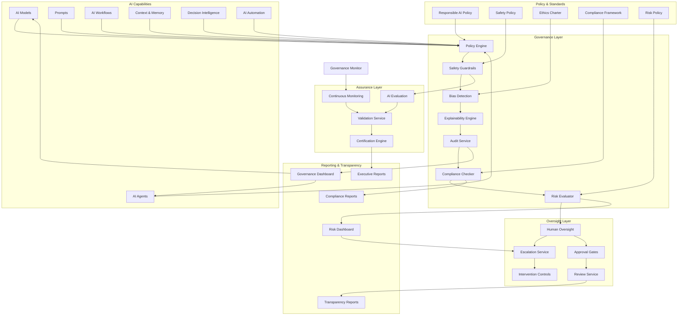
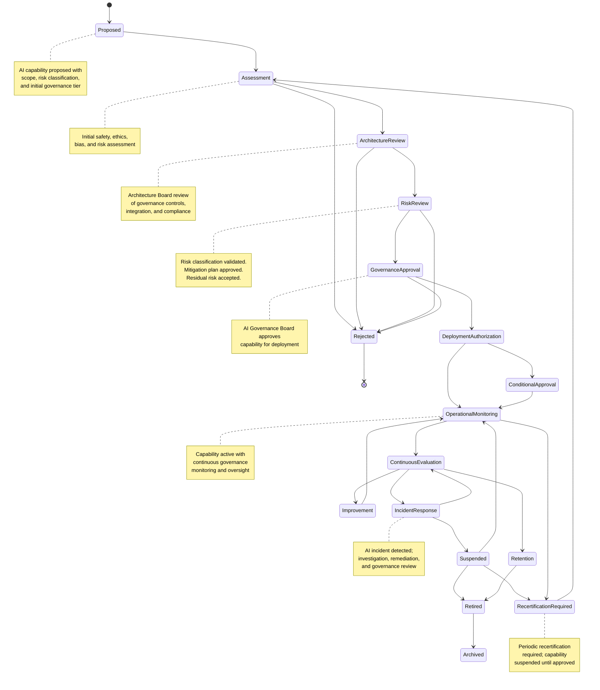
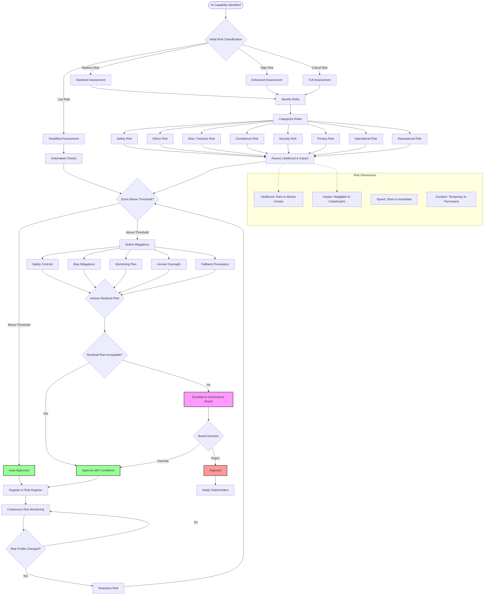
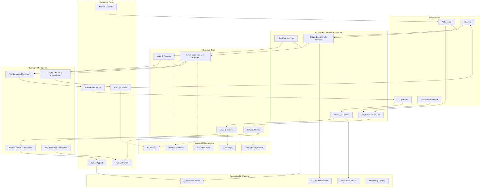
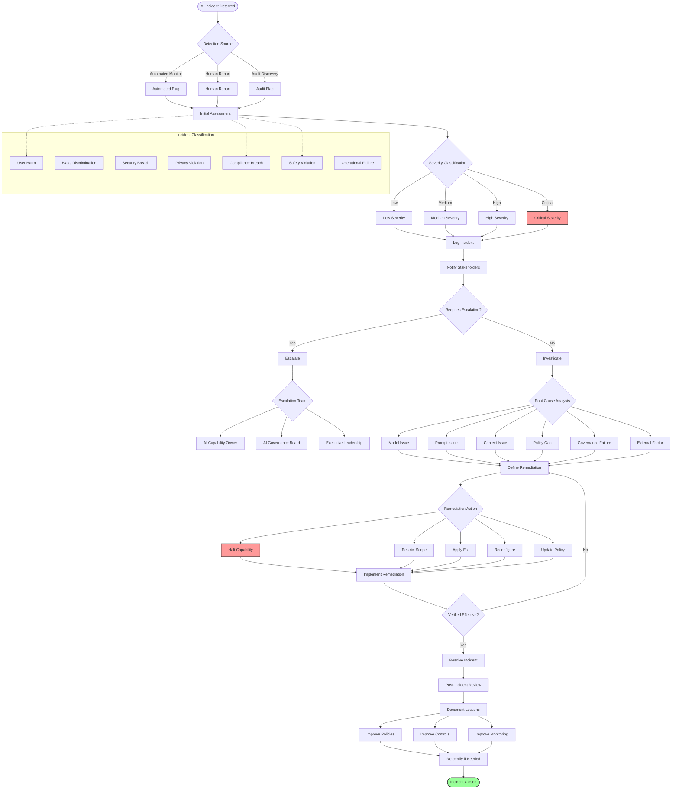
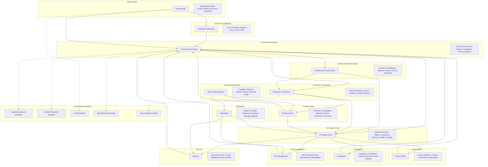
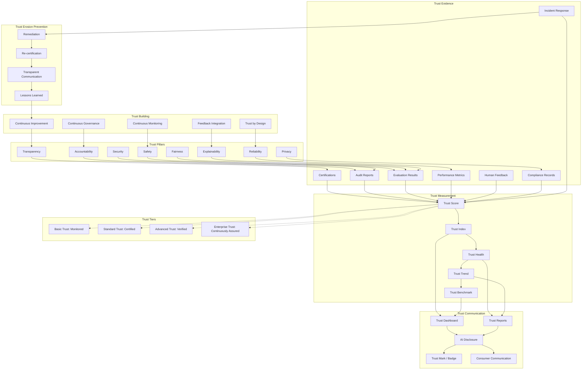

# KB-121 — AI Safety & Governance Architecture

**Suite:** Enterprise Platform Services  
**Version:** 1.0  
**Status:** Approved Architecture  
**Classification:** Enterprise AI Governance Architecture  
**Last Updated:** 2026-07-12

---

## Executive Summary

This document defines the enterprise architecture governing responsible AI across DUKADESK. The AI Safety & Governance Platform shall provide centralized governance for all AI capabilities, ensuring that AI systems operate safely, ethically, transparently, securely, and in compliance with enterprise policies, regulatory obligations, and organizational values.

The architecture shall establish governance controls across AI models, agents, prompts, workflows, context, decision systems, automation, and future intelligent capabilities.

---

## Purpose

Define how DUKADESK governs the safe, ethical, explainable, accountable, compliant, and secure use of AI throughout the enterprise platform.

---

## Scope

### In Scope

- Enterprise AI governance architecture
- Responsible AI framework
- AI safety architecture
- AI governance lifecycle
- AI policy governance
- AI risk management
- AI oversight
- Human oversight
- AI explainability
- AI transparency
- AI accountability
- AI audit architecture
- AI compliance
- AI ethics
- AI monitoring
- AI approval governance
- AI operational governance
- AI incident governance
- AI assurance architecture
- AI maturity governance

### Out of Scope

- AI implementation
- Model implementation
- Prompt implementation
- Agent implementation
- Security infrastructure implementation
- Regulatory implementation details

*The above items are covered by separate Knowledge Base documents (see Cross References).*

---

## Architectural Principles

| # | Principle | Description |
|---|-----------|-------------|
| 1 | **Responsible AI by Design** | Safety, ethics, fairness, and transparency are embedded in the architectural foundation of every AI capability, not added as an afterthought. |
| 2 | **Human Accountability** | Every AI capability has a named human accountable for its operation, outcomes, and governance. AI does not hold accountability. |
| 3 | **Human Oversight** | AI operates under human governance. Autonomous operation is bounded by policy. Critical decisions require human-in-the-loop validation. |
| 4 | **Explainability by Default** | Every AI decision, recommendation, and action produces an explanation appropriate to its risk classification and consumer need. |
| 5 | **Transparency** | AI involvement in platform operations, decisions, and interactions is disclosed to consumers at the appropriate level. |
| 6 | **Risk-Based Governance** | AI capabilities are governed proportionally to their risk classification. Higher-risk AI receives stricter controls and deeper oversight. |
| 7 | **Privacy by Design** | AI governance respects tenant boundaries, enforces data minimization, and supports consent-aware processing. |
| 8 | **Security by Design** | Governance controls are secured against tampering, bypass, and escalation. Governance itself is governed. |
| 9 | **Zero Trust** | No AI capability, provider, or consumer is implicitly trusted. Every AI operation is authenticated, authorised, and governed. |
| 10 | **Least Privilege** | AI capabilities execute with minimum required permissions. Governance boundaries prevent scope expansion. |
| 11 | **Vendor Independence** | Governance models, policies, and controls are provider-agnostic. AI governance applies equally regardless of underlying provider. |
| 12 | **Technology Neutrality** | Governance definitions and controls are expressed in technology-neutral formats, not tied to specific AI frameworks. |
| 13 | **Enterprise-Wide Consistency** | A single governance framework applies to all AI capabilities across the enterprise. No AI operates under different governance rules. |
| 14 | **Continuous Governance** | Governance is continuous, not point-in-time. AI capabilities are monitored, evaluated, and re-certified throughout their lifecycle. |

---

## Canonical Definitions

| Term | Definition |
|------|------------|
| **Responsible AI** | The practice of designing, developing, deploying, and governing AI systems that are ethical, fair, transparent, accountable, and aligned with human values and enterprise principles. |
| **AI Governance** | The framework of policies, controls, processes, oversight mechanisms, and accountabilities governing AI capability definition, operation, and evolution across the enterprise. |
| **AI Safety** | The architectural and operational measures ensuring AI systems operate within defined boundaries, do not cause harm, and can be reliably controlled and deactivated. |
| **AI Risk** | The potential for an AI capability to produce unintended, harmful, non-compliant, or otherwise undesirable outcomes, classified by likelihood and impact. |
| **AI Oversight** | The structured monitoring, review, and intervention mechanisms ensuring AI operates within governed boundaries and organizational values. |
| **Human Oversight** | Architectural controls ensuring humans retain meaningful authority over AI operations, including approval, intervention, escalation, and override capabilities. |
| **AI Accountability** | The unambiguous assignment of responsibility for AI capability outcomes to a named human or team, with defined escalation and remediation obligations. |
| **AI Transparency** | The disclosure of AI involvement, capability limitations, decision rationale, confidence levels, and governance status to consumers and stakeholders. |
| **AI Explainability** | The architectural capability to produce human-understandable explanations of AI decisions, recommendations, and actions at the appropriate level of detail. |
| **AI Assurance** | The systematic validation, verification, monitoring, and auditing activities providing confidence that AI capabilities operate safely, correctly, and within governance boundaries. |
| **AI Incident** | An event where an AI capability produces an outcome that violates policy, causes harm, breaches compliance, or operates outside its governed boundaries. |
| **AI Compliance** | Adherence of AI capabilities to enterprise policies, regulatory requirements, contractual obligations, and governance standards. |
| **AI Ethics** | The principles and values governing the ethical design, deployment, and operation of AI systems within DUKADESK. |
| **AI Policy** | A declarative rule governing AI capability behavior, constraints, approvals, oversight requirements, or operational boundaries. |
| **AI Control** | An architectural mechanism enforcing governance requirements, including safety guardrails, policy enforcement points, approval gates, and oversight checkpoints. |
| **AI Approval** | The formal authorization required for an AI capability to progress through lifecycle stages or perform defined operations. |
| **AI Monitoring** | The continuous observation, measurement, and analysis of AI capability behavior, performance, safety, and compliance. |
| **AI Trust** | The confidence that an AI capability operates reliably, safely, ethically, and within governed boundaries, earned through continuous assurance. |
| **AI Maturity** | The evolutionary stage of AI governance capability within the enterprise, from ad-hoc to optimized. |
| **AI Governance Lifecycle** | The progression of an AI capability through governed states from proposal through retirement, with defined controls at each stage. |

---

## Architecture

### 1. Enterprise AI Governance Architecture

The Enterprise AI Governance Architecture provides centralized governance, oversight, and control for all AI capabilities across DUKADESK.

### 2. AI Governance Domains

AI governance is organized into domains that collectively provide comprehensive coverage across strategy, risk, compliance, ethics, security, operations, and assurance.

```mermaid
graph TB
    ROOT[AI Governance Domains]

    ROOT --> STRATEGY[Strategy & Leadership]
    ROOT --> RISK[Risk Management]
    ROOT --> COMPLIANCE[Compliance]
    ROOT --> ETHICS[Ethics & Values]
    ROOT --> SEC_GOV[Security]
    ROOT --> PRIVACY[Privacy]
    ROOT --> OPS[Operations]
    ROOT --> MONITOR[Monitoring & Observability]
    ROOT --> ASSURANCE[Assurance]
    ROOT --> ARCH[Architecture]
    ROOT --> LIFECYCLE[Lifecycle]
    ROOT --> HUMAN_OV[Human Oversight]

    STRATEGY --> S_POLICY[AI Policy Framework]
    STRATEGY --> S_PRINCIPLES[AI Principles]
    STRATEGY --> S_CHARTER[AI Governance Charter]
    STRATEGY --> S_BOARD[AI Governance Board]
    STRATEGY --> S_MATURITY[Maturity Model]

    RISK --> R_IDENTIFY[Risk Identification]
    RISK --> R_CLASSIFY[Risk Classification]
    RISK --> R_ASSESS[Risk Assessment]
    RISK --> R_MITIGATE[Risk Mitigation]
    RISK --> R_RESIDUAL[Residual Risk]
    RISK --> R_REVIEW[Continuous Review]

    COMPLIANCE --> C_REGS[Regulatory Compliance]
    COMPLIANCE --> C_CONTRACTS[Contractual Compliance]
    COMPLIANCE --> C_POLICY[Policy Compliance]
    COMPLIANCE --> C_STANDARDS[Standards Compliance]
    COMPLIANCE --> C_REPORTING[Compliance Reporting]

    ETHICS --> E_FAIRNESS[Fairness]
    ETHICS --> E_BIAS[Bias Prevention]
    ETHICS --> E_TRANSPARENCY[Transparency]
    ETHICS --> E_ACCOUNTABILITY[Accountability]
    ETHICS --> E_INCLUSIVITY[Inclusivity]
    ETHICS --> E_SUSTAINABILITY[Sustainability]

    SEC_GOV --> SG_ACCESS[Access Control]
    SEC_GOV --> SG_PROV[Provider Security]
    SEC_GOV --> SG_DATA[Data Security]
    SEC_GOV --> SG_MODEL[Model Security]
    SEC_GOV --> SG_INFRA[Infrastructure Security]

    PRIVACY --> P_AI[Privacy-Preserving AI]
    PRIVACY --> P_MINIMIZE[Data Minimization]
    PRIVACY --> P_CONSENT[Consent Governance]
    PRIVACY --> P_REGION[Regional Compliance]
    PRIVACY --> P_DELETION[Right to Deletion]

    OPS --> O_APPROVAL[Approval Workflows]
    OPS --> O_INCIDENT[Incident Response]
    OPS --> O_CHANGE[Change Management]
    OPS --> O_CAPACITY[Capacity Governance]
    OPS --> O_COST[Cost Governance]

    MONITOR --> M_HEALTH[AI Health]
    MONITOR --> M_PERF[Performance]
    MONITOR --> M_SAFETY[Safety Metrics]
    MONITOR --> M_BIAS[Bias Metrics]
    MONITOR --> M_USAGE[Usage Analytics]

    ASSURANCE --> A_EVAL[Evaluation]
    ASSURANCE --> A_AUDIT[Audit]
    ASSURANCE --> A_CERTIFY[Certification]
    ASSURANCE --> A_VALIDATE[Validation]
    ASSURANCE --> A_IMPROVE[Continuous Improvement]

    ARCH --> A_STANDARDS[Governance Standards]
    ARCH --> A_PATTERNS[Governance Patterns]
    ARCH --> A_CONTROLS[Control Architecture]
    ARCH --> A_INTEGRATION[Platform Integration]

    LIFECYCLE --> L_PROPOSE[Proposal]
    LIFECYCLE --> L_APPROVE[Approval]
    LIFECYCLE --> L_OPERATE[Operations]
    LIFECYCLE --> L_RETIRE[Retirement]

    HUMAN_OV --> H_APPROVAL[Human Approval]
    HUMAN_OV --> H_INTERVENTION[Intervention]
    HUMAN_OV --> H_ESCALATION[Escalation]
    HUMAN_OV --> H_REVIEW[Periodic Review]
    HUMAN_OV --> H_ACCOUNTABILITY[Accountability]

    subgraph "Domain Interactions"
        DI_RISK_COMP[Risk informs Compliance]
        DI_ETHICS_POL[Ethics informs Policy]
        DI_SEC_PRIV[Security & Privacy overlap]
        DI_ASSUR_MONITOR[Assurance consumes Monitoring]
        DI_HUMAN_RISK[Oversight triggered by Risk]
    end

    RISK -.-> COMPLIANCE
    ETHICS -.-> STRATEGY
    SEC_GOV -.-> PRIVACY
    ASSURANCE -.-> MONITOR
    HUMAN_OV -.-> RISK
```

### 3. AI Governance Lifecycle

Every AI capability progresses through a governed lifecycle with gated transitions ensuring safety, compliance, and oversight at every stage.

### 4. AI Risk Management Architecture

AI risk management governs the systematic identification, classification, assessment, mitigation, and monitoring of risks across all AI capabilities.

### 5. Human Oversight Model

Human oversight provides architectural controls ensuring humans retain meaningful authority over AI operations, with defined escalation paths and intervention capabilities.

### 6. AI Assurance Architecture

AI assurance provides systematic validation, monitoring, evaluation, and auditing to ensure AI capabilities operate safely, correctly, and within governance boundaries.

```mermaid
graph TB
    subgraph "Assurance Pillars"
        AP_VALIDATION[Validation]
        AP_MONITORING[Monitoring]
        AP_EVALUATION[Evaluation]
        AP_AUDITING[Auditing]
        AP_CERTIFICATION[Certification]
    end

    subgraph "Validation"
        V_INPUT[Input Validation]
        V_OUTPUT[Output Validation]
        V_POLICY[Policy Validation]
        V_BOUNDARY[Boundary Validation]
        V_CONSTRAINT[Constraint Validation]
    end

    subgraph "Monitoring"
        M_REALTIME[Real-Time Monitoring]
        M_BEHAVIOR[Behavioral Monitoring]
        M_DRIFT[Drift Detection]
        M_ANOMALY[Anomaly Detection]
        M_PERF[Performance Monitoring]
    end

    subgraph "Evaluation"
        E_QUALITY[Quality Evaluation]
        E_SAFETY[Safety Evaluation]
        E_BIAS[Bias Evaluation]
        E_ROBUST[Robustness Evaluation]
        E_COMPLIANCE[Compliance Evaluation]
    end

    subgraph "Auditing"
        A_OPERATIONAL[Operational Audit]
        A_GOVERNANCE[Governance Audit]
        A_COMPLIANCE[Compliance Audit]
        A_TECHNICAL[Technical Audit]
        A_THIRD_PARTY[Third-Party Audit]
    end

    subgraph "Certification"
        C_BASELINE[Baseline Certification]
        C_PERIODIC[Periodic Recertification]
        C_INCIDENT[Post-Incident Certification]
        C_UPGRADE[Upgrade Certification]
    end

    subgraph "Assurance Evidence"
        EVI_LOGS[AI Interaction Logs]
        EVI_METRICS[Performance Metrics]
        EVI_EVALS[Evaluation Results]
        EVI_AUDITS[Audit Reports]
        EVI_FEEDBACK[Human Feedback]
    end

    subgraph "Assurance Reporting"
        R_HEALTH[AI Health Report]
        R_COMPLIANCE[Compliance Report]
        R_RISK[Risk Report]
        R_TRUST[Trust Score]
        R_EXEC[Executive Summary]
    end

    AP_VALIDATION --> V_INPUT
    AP_VALIDATION --> V_OUTPUT
    AP_VALIDATION --> V_POLICY
    AP_VALIDATION --> V_BOUNDARY
    AP_VALIDATION --> V_CONSTRAINT

    AP_MONITORING --> M_REALTIME
    AP_MONITORING --> M_BEHAVIOR
    AP_MONITORING --> M_DRIFT
    AP_MONITORING --> M_ANOMALY
    AP_MONITORING --> M_PERF

    AP_EVALUATION --> E_QUALITY
    AP_EVALUATION --> E_SAFETY
    AP_EVALUATION --> E_BIAS
    AP_EVALUATION --> E_ROBUST
    AP_EVALUATION --> E_COMPLIANCE

    AP_AUDITING --> A_OPERATIONAL
    AP_AUDITING --> A_GOVERNANCE
    AP_AUDITING --> A_COMPLIANCE
    AP_AUDITING --> A_TECHNICAL
    AP_AUDITING --> A_THIRD_PARTY

    AP_CERTIFICATION --> C_BASELINE
    AP_CERTIFICATION --> C_PERIODIC
    AP_CERTIFICATION --> C_INCIDENT
    AP_CERTIFICATION --> C_UPGRADE

    V_POLICY --> EVI_LOGS
    M_REALTIME --> EVI_METRICS
    E_SAFETY --> EVI_EVALS
    A_OPERATIONAL --> EVI_AUDITS
    C_PERIODIC --> EVI_FEEDBACK

    EVI_LOGS --> R_HEALTH
    EVI_METRICS --> R_HEALTH
    EVI_EVALS --> R_RISK
    EVI_AUDITS --> R_COMPLIANCE
    EVI_FEEDBACK --> R_TRUST

    R_HEALTH --> R_EXEC
    R_RISK --> R_EXEC
    R_COMPLIANCE --> R_EXEC
    R_TRUST --> R_EXEC

    subgraph "Assurance Cadence"
        AC_CONTINUOUS[Continuous]
        AC_DAILY[Daily]
        AC_WEEKLY[Weekly]
        AC_MONTHLY[Monthly]
        AC_QUARTERLY[Quarterly]
        AC_ANNUAL[Annual]
    end

    M_REALTIME -.-> AC_CONTINUOUS
    M_DRIFT -.-> AC_DAILY
    E_QUALITY -.-> AC_WEEKLY
    A_OPERATIONAL -.-> AC_MONTHLY
    C_PERIODIC -.-> AC_QUARTERLY
    A_THIRD_PARTY -.-> AC_ANNUAL
```

### 7. AI Incident Governance Flow

AI incident governance governs the detection, reporting, classification, escalation, investigation, remediation, and post-incident review of AI safety events.

### 8. Governance Operating Model

The Governance Operating Model defines the interactions, responsibilities, and workflows among all governance stakeholders.

### 9. Enterprise AI Trust Architecture

The Enterprise AI Trust Architecture provides the foundational framework for establishing, measuring, maintaining, and demonstrating trust in AI capabilities across DUKADESK.

### 10. AI Governance Ecosystem

The AI Governance Ecosystem provides a holistic view of all governance components, stakeholders, AI capabilities, and operational infrastructure.

```mermaid
graph TB
    subgraph "Governance Bodies"
        GB_EXEC[Executive Leadership]
        GB_AIGB[AI Governance Board]
        GB_ARB[Architecture Review Board]
        GB_ETHICS[AI Ethics Committee]
    end

    subgraph "Governance Framework"
        GF_POLICY[AI Policy Framework]
        GF_STANDARDS[AI Standards]
        GF_CONTROLS[Control Framework]
        GF_MATURITY[Maturity Model]
    end

    subgraph "Governance Operations"
        GO_APPROVAL[Approval Workflows]
        GO_MONITOR[Governance Monitoring]
        GO_REVIEW[Periodic Reviews]
        GO_AUDIT[Audit Engine]
        GO_REPORT[Reporting Engine]
    end

    subgraph "Governance Controls"
        GC_SAFETY[Safety Guardrails]
        GC_BIAS[Bias Detection]
        GC_EXPLAIN[Explainability]
        GC_POLICY[Policy Enforcement]
        GC_ACCESS[Access Control]
        GC_KILL[Kill Switch]
    end

    subgraph "AI Capabilities"
        AC_MODELS[AI Models]
        AC_AGENTS[AI Agents]
        AC_PROMPTS[Prompts]
        AC_WORKFLOWS[AI Workflows]
        AC_CONTEXT[Context & Memory]
        AC_DECISIONS[Decision Intelligence]
        AC_AUTOMATION[AI Automation]
    end

    subgraph "Assurance Infrastructure"
        AI_EVAL[Evaluation Platform]
        AI_MONITOR[Monitoring Platform]
        AI_AUDIT[Audit Platform]
        AI_CERT[Certification Platform]
    end

    subgraph "Governance Data"
        GD_RISK[Risk Register]
        GD_INCIDENT[Incident Registry]
        GD_COMPLIANCE[Compliance Registry]
        GD_AI_CATALOG[AI Capability Catalog]
        GD_AUDIT_TRAIL[Audit Trail]
    end

    subgraph "External Interfaces"
        EI_REGULATOR[Regulatory Bodies]
        EI_AUDITOR[External Auditors]
        EI_CERTIFIER[Certification Bodies]
        EI_CONSUMER[AI Consumers]
    end

    GB_EXEC --> GF_POLICY
    GB_AIGB --> GF_POLICY
    GB_AIGB --> GF_STANDARDS
    GB_ARB --> GF_STANDARDS
    GB_ETHICS --> GF_CONTROLS

    GF_POLICY --> GO_APPROVAL
    GF_STANDARDS --> GO_REVIEW
    GF_CONTROLS --> GC_SAFETY
    GF_CONTROLS --> GC_BIAS
    GF_CONTROLS --> GC_POLICY

    GO_APPROVAL --> AC_MODELS
    GO_APPROVAL --> AC_AGENTS
    GO_APPROVAL --> AC_DECISIONS

    GO_MONITOR --> AC_MODELS
    GO_MONITOR --> AC_AGENTS
    GO_MONITOR --> AC_WORKFLOWS

    GC_SAFETY --> AC_MODELS
    GC_SAFETY --> AC_PROMPTS
    GC_BIAS --> AC_MODELS
    GC_BIAS --> AC_DECISIONS
    GC_POLICY --> AC_MODELS
    GC_POLICY --> AC_AGENTS
    GC_KILL --> AC_MODELS
    GC_KILL --> AC_AUTOMATION

    GC_EXPLAIN --> AC_MODELS
    GC_EXPLAIN --> AC_DECISIONS
    GC_EXPLAIN --> AC_AGENTS

    AC_MODELS --> AI_EVAL
    AC_AGENTS --> AI_MONITOR
    AC_DECISIONS --> AI_AUDIT
    AC_WORKFLOWS --> AI_MONITOR

    AI_EVAL --> GD_RISK
    AI_MONITOR --> GD_INCIDENT
    AI_AUDIT --> GD_AUDIT_TRAIL
    AI_CERT --> GD_COMPLIANCE

    GF_POLICY --> GD_AI_CATALOG
    GD_AI_CATALOG --> AC_MODELS
    GD_AI_CATALOG --> AC_AGENTS

    GD_RISK --> GB_AIGB
    GD_INCIDENT --> GB_AIGB
    GD_COMPLIANCE --> GB_EXEC
    GD_AUDIT_TRAIL --> EI_AUDITOR

    GB_EXEC --> EI_REGULATOR
    GB_AIGB --> EI_CERTIFIER
    EI_CONSUMER --> GC_EXPLAIN
    EI_CONSUMER --> GO_REPORT
```

---

## Lifecycle

| Phase | Description | Gates |
|-------|-------------|-------|
| **Proposal** | AI capability proposed with scope, risk classification, governance tier, and initial oversight requirements. | Proposal completeness check |
| **Assessment** | Initial safety, ethics, bias, privacy, and risk assessment conducted against capability scope. | Assessment completion |
| **Architecture Review** | Architecture Board review of governance controls, platform integration, and compliance alignment. | Architecture review sign-off |
| **Risk Review** | Risk classification validated. Mitigation plan approved. Residual risk accepted at appropriate authority level. | Risk acceptance sign-off |
| **Governance Approval** | AI Governance Board approves capability for deployment with defined oversight tier and conditions. | AI Governance Board approval |
| **Deployment Authorization** | Operational authorization granted. Capability deployed with governance controls active. | Deployment readiness verification |
| **Operational Monitoring** | Capability active with continuous governance monitoring, oversight, and telemetry. | Health criteria met |
| **Continuous Evaluation** | Ongoing evaluation of safety, quality, bias, compliance, and risk posture. | Evaluation cadence met |
| **Incident Response** | AI incident detected and governed through defined incident response workflow. | Incident resolution |
| **Improvement** | Capability refined based on monitoring data, evaluation results, and incident lessons. | Improvement validation |
| **Re-certification** | Periodic recertification required. Capability re-assessed against current governance standards. | Re-certification approval |
| **Retention** | Capability retained in governed state with continued monitoring and periodic review. | Retention policy compliance |
| **Retirement** | Capability decommissioned. Governance controls removed after verification. | Retirement authorization |
| **Archival** | Capability records, audit logs, and evaluation data archived for governance and compliance. | Archive completion |

---

## Governance

| Domain | Governance Mechanism | Responsible Body |
|--------|---------------------|------------------|
| **AI Ownership** | Every AI capability has a named owner accountable for its operation, outcomes, and governance compliance. | Enterprise Architecture |
| **Enterprise AI Governance Board** | Central governance body overseeing AI policy, risk appetite, capability approvals, and incident governance. | AI Governance Board |
| **Responsible AI Governance** | AI capabilities adhere to ethical principles, fairness standards, bias thresholds, and responsible use policies. | AI Ethics Committee |
| **Architecture Governance** | AI capability architecture, controls, and integration are reviewed for governance standard compliance. | Architecture Review Board |
| **Compliance Governance** | AI capabilities handling regulated data or operating in regulated domains undergo compliance validation. | Compliance |
| **Security Governance** | AI security posture, provider security, access controls, and governance control integrity are reviewed. | Security |
| **Privacy Governance** | AI processing of personal data is governed by privacy policies, consent status, and data minimization requirements. | Privacy Office |
| **Risk Governance** | AI risk classification, assessment, mitigation, and residual risk acceptance are governed by risk policy. | Risk Management |
| **Lifecycle Governance** | Governance lifecycle transitions are gated. Non-compliant transitions are blocked and audited. | Enterprise Architecture |
| **Audit Governance** | Independent audit of AI governance effectiveness, control integrity, and compliance posture. | Internal Audit |

---

## Responsibilities

| Role | Responsibilities |
|------|-----------------|
| **Executive Leadership** | Set AI principles and risk appetite; approve AI governance policy; own enterprise AI risk; champion responsible AI. |
| **Enterprise Architecture** | Define AI governance standards, patterns, and controls; conduct architecture reviews; govern AI portfolio alignment. |
| **AI Governance Board** | Oversee AI governance framework; approve AI capability registrations; review AI incidents; ensure responsible AI practices. |
| **AI Platform Team** | Build and maintain governance infrastructure including safety guardrails, policy engine, explainability engine, and audit service. |
| **Security** | Perform security reviews of AI capabilities; define AI security policies; audit AI access; verify governance control integrity. |
| **Compliance** | Conduct compliance reviews; define AI regulatory validation rules; verify AI capability adherence to legal requirements. |
| **Privacy Office** | Privacy impact assessments; consent governance; data subject rights fulfillment; privacy-aware AI oversight. |
| **Risk Management** | Maintain AI risk framework; conduct risk assessments; manage risk register; report risk posture to governance board. |
| **Product Teams** | Propose AI capabilities; implement governance requirements; manage capability lifecycle; participate in governance reviews. |
| **Operations** | Monitor AI health and safety metrics; respond to AI incidents; maintain operational governance controls. |
| **Internal Audit** | Conduct independent audits of AI governance; test control effectiveness; provide assurance reporting to executive leadership. |
| **Tenant Administrators** | Configure tenant-level AI governance policies; monitor tenant AI compliance; manage tenant AI risk exceptions. |

---

## Security

| Control Area | Architecture |
|-------------|--------------|
| **Secure AI Operations** | Governance controls themselves are secured against tampering, bypass, privilege escalation, and unauthorized modification. |
| **Policy Enforcement** | Governance policies are enforced at runtime through immutable policy evaluation points. Policies cannot be bypassed by AI capabilities. |
| **Identity-Aware Governance** | Governance decisions consider consumer identity, role, tenant, and authorization scope. Governance is personalized per consumer. |
| **Least Privilege** | Governance controls operate with minimum required permissions. No governance component has unnecessary system access. |
| **Zero Trust** | No AI capability, governance component, or consumer is implicitly trusted. Every operation is authenticated, authorised, and audited. |
| **Tenant Isolation** | Governance enforcement is strictly partitioned per tenant. Cross-tenant governance data access is architecturally prevented. |
| **Secure Governance Controls** | Safety guardrails, bias detectors, and kill switches are independently verified and tamper-resistant. |
| **Auditability** | Every governance decision, policy evaluation, and control activation is recorded in an immutable audit trail. |
| **AI Provenance** | Every AI output and governance action is traceable to the AI capability, policy version, and governance control that produced it. |
| **Trust Verification** | Governance control integrity is continuously verified. Tampered controls trigger immediate incident response and capability suspension. |

---

## Privacy

| Domain | Architecture |
|--------|--------------|
| **Privacy-Preserving AI** | AI governance respects privacy by design. Governance monitoring uses aggregated and anonymized metrics where possible. |
| **Data Minimization** | Governance processes collect and retain only the data necessary for oversight. Sensitivity classifications determine handling and retention. |
| **Consent Governance** | AI capabilities respect user consent state. Governance controls enforce consent-based processing restrictions. |
| **Regulatory Compliance** | AI governance adapts to regulatory requirements across jurisdictions. Compliance controls are configurable per region. |
| **Cross-Border Governance** | AI governance data crossing geographic boundaries is classified and subject to data transfer compliance. |
| **Regional Controls** | Governance policies, oversight tiers, and controls are configurable per region to accommodate local regulatory requirements. |
| **Right to Deletion** | Governance retains only data necessary for compliance and audit. Data subject deletion requests are fulfilled within regulatory constraints. |
| **Audit Retention** | Governance audit logs are retained per regulatory requirements with privacy-preserving anonymisation where appropriate. |

---

## Performance

| Consideration | Architectural Approach |
|---------------|----------------------|
| **Enterprise-Scale Governance** | Governance controls scale horizontally across AI capabilities, providers, and regions. Policy evaluation adds minimal latency to AI interactions. |
| **Global Policy Enforcement** | Governance policies are distributed to edge evaluation points. Policy evaluation occurs locally with global coordination for cross-region capabilities. |
| **Governance Scalability** | Governance operations scale independently of AI capability scale. Governance throughput is not a bottleneck for AI operations. |
| **Continuous Monitoring** | Monitoring infrastructure processes governance telemetry streams at enterprise scale with sub-minute alerting latency. |
| **High Availability** | Governance platform components are deployed across multiple availability zones. Governance failures trigger safe-mode — all AI capabilities are blocked until governance is restored. |
| **Operational Resilience** | Governance controls operate with local caching during platform outages. Degraded governance mode applies stricter default policies until full governance is restored. |
| **Distributed Governance** | Governance decisions are made at the point of AI interaction with minimal coordination overhead. Cross-capability governance decisions use asynchronous coordination. |
| **Multi-Region Readiness** | Governance policies are configurable per region while maintaining enterprise-wide minimum standards. Regional governance instances operate autonomously during connectivity loss. |

---

## Observability

| Domain | Architecture |
|--------|--------------|
| **AI Governance Metrics** | Governance coverage, policy evaluation counts, approval cycle times, and control activation rates are tracked across all AI capabilities. |
| **Risk Dashboards** | Risk posture, risk distribution, residual risk acceptance, and risk trend are visualized per capability, domain, and enterprise. |
| **Safety Dashboards** | Safety guardrail activations, safety violations, near-misses, and safety trend are monitored in real-time. |
| **Incident Dashboards** | Incident volume, severity distribution, mean time to detect, mean time to resolve, and incident trend are tracked. |
| **Compliance Reporting** | Compliance status per capability, regulatory coverage, compliance gaps, and remediation progress are reported. |
| **Explainability Reporting** | Explainability coverage, explanation quality scores, and consumer satisfaction with explanations are measured. |
| **Operational Health** | Governance platform availability, policy evaluation latency, control health, and governance pipeline status are monitored. |
| **Audit Reporting** | Audit trail completeness, control test results, governance findings, and remediation status are reported. |
| **Executive Reporting** | Enterprise AI governance health, risk posture, compliance status, trust index, and strategic recommendations are reported to leadership. |
| **Enterprise AI Insights** | Aggregate governance analytics provide enterprise-wide visibility into AI safety, trust maturity, and governance effectiveness. |

---

## Failure Scenarios

| Scenario | Architectural Response |
|----------|-----------------------|
| **Governance Failure** | Governance component failure triggers safe-mode operation — all AI capabilities are blocked until governance is restored. Critical capabilities may operate under stricter default policies. |
| **Policy Violation** | Policy evaluation blocks violating AI operation. Violation is logged, audited, and escalated to capability owner and governance board. |
| **Unauthorized AI Behavior** | Behavioral monitoring detects out-of-policy AI behavior. Capability is automatically suspended. Incident response workflow is triggered. |
| **Human Oversight Failure** | Oversight checkpoint timeout or unavailability triggers escalation to next oversight tier. If no human available, capability is suspended. |
| **Explainability Failure** | Explainability capture failure does not block AI operation for low-risk capabilities. For high-risk capabilities, operation is blocked until explainability is restored. |
| **Compliance Breach** | Compliance monitoring detects regulatory violation. Capability is immediately suspended. Incident response and regulatory notification are triggered. |
| **Risk Escalation Failure** | Risk escalation timeout triggers automatic escalation to next governance tier. If all tiers exhausted, capability is suspended pending executive decision. |
| **Incident Response Failure** | Incident response workflow timeout triggers escalation to executive leadership. Manual intervention path with full context is provided. |
| **Cross-Tenant Exposure** | Cross-tenant governance data access is blocked at the data layer. Incident is logged, audited, and escalated immediately. |
| **Governance Drift** | Drift detection identifies divergence between intended and actual governance controls. Automated remediation re-applies intended controls. Drift is logged and reported. |
| **Trust Degradation** | Trust score degradation below threshold triggers automatic governance review. Capability may be suspended if trust score continues to decline. |
| **Recovery Failure** | Recovery actions that fail trigger escalation to governance operations. Manual intervention path with full context and executive notification is provided. |

---

## Anti-Patterns

| Anti-Pattern | Prohibited Because | Enforced By |
|--------------|-------------------|-------------|
| **Unsupervised Enterprise AI** | AI operating without human oversight creates unacceptable risk for critical decisions and actions. | Human oversight tier enforcement |
| **AI Without Governance** | AI capabilities operating outside governance create legal, ethical, and operational risk. | Governance enforcement at every layer |
| **AI Without Human Accountability** | AI without a named accountable human prevents ownership and remediation of issues. | AI Registry ownership enforcement |
| **AI Operating Outside Policy** | Circumvents enterprise AI principles, safety requirements, and compliance obligations. | Policy enforcement at runtime |
| **Hidden AI Systems** | Undisclosed AI capabilities prevent governance, audit, and transparency. | AI Registry mandatory check |
| **Shadow AI** | Unofficial AI integrations bypass governance, security, and compliance controls. | Provider abstraction enforcement |
| **Unregistered AI Capabilities** | AI capabilities not in the AI Registry are invisible to governance, audit, and risk management. | Registry mandatory check |
| **Explainability Omission** | AI decisions without explanations prevent audit, trust, and regulatory compliance. | Explainability enforcement per risk tier |
| **Governance Bypass** | Mechanisms allowing AI capabilities to operate without governance control evaluation. | Architectural prevention at every layer |
| **AI Without Auditability** | AI interactions without audit trails prevent incident investigation and compliance verification. | Audit enforcement at every interaction |

---

## Future Evolution

| Evolution Path | Architectural Preparation |
|---------------|--------------------------|
| **Autonomous Governance Assistance** | Governance telemetry and control data enable AI-assisted governance — automated policy recommendations, risk flagging, and control optimization. |
| **AI-Assisted Compliance** | Governance data structures support AI-driven compliance monitoring, regulatory change detection, and automated compliance reporting. |
| **Adaptive Governance** | Governance policies and controls evolve dynamically based on risk posture, incident patterns, and operational context within defined boundaries. |
| **Federated Governance** | Governance architecture supports federated AI governance across organizational boundaries, enabling consistent oversight in multi-party AI ecosystems. |
| **Cross-Platform AI Assurance** | Standardized governance interfaces enable AI assurance across federated DUKADESK instances and external AI platform integrations. |
| **Predictive Risk Governance** | Risk monitoring evolves from reactive to predictive — anticipating risk events before they materialize based on pattern analysis. |
| **Intelligent Governance Automation** | Routine governance operations (assessments, reviews, reporting) are automated through intelligent workflows with human oversight at key decision points. |
| **Enterprise AI Trust Ecosystems** | Trust architecture evolves to support verifiable trust across the enterprise AI ecosystem, enabling automated trust-based capability selection and consumer confidence. |

---

## Cross References

| Document ID | Title | Relation |
|-------------|-------|----------|
| **KB-086** | Data Privacy & Compliance Architecture | Defines data privacy and compliance frameworks enforced by AI governance. |
| **KB-107** | Enterprise Platform Services Overview Architecture | Defines the platform services context within which AI governance operates. |
| **KB-116** | AI Platform Architecture | Parent architecture defining the overall AI Platform governed by this safety and governance framework. |
| **KB-117** | AI Agent Framework Architecture | Defines AI agents that are subject to the governance controls defined in this architecture. |
| **KB-118** | AI Model Management Architecture | Defines models governed by the safety and governance controls in this architecture. |
| **KB-119** | Prompt Management Architecture | Defines prompts governed by the safety and governance controls in this architecture. |
| **KB-120** | AI Context & Memory Architecture | Defines context and memory governed by the privacy and governance controls in this architecture. |
| **KB-122** | AI Decision Intelligence Architecture | Defines decision intelligence capabilities governed by this safety and governance framework. |
| **KB-124** | Policy Management Architecture | Defines the enterprise policy framework within which AI governance policies operate. |
| **KB-130** | Risk Management Architecture | Defines the enterprise risk management framework within which AI risk management operates. |
| **KB-140** | Enterprise Platform Services Reference Architecture | Defines the overarching reference architecture for enterprise platform services. |

---

## Acceptance Criteria

- [x] Defines enterprise AI Safety & Governance architecture.
- [x] Governs all AI capabilities across DUKADESK.
- [x] Defines governance, oversight, explainability, transparency, assurance, accountability, and risk management.
- [x] Supports enterprise-scale, multi-tenant, vendor-independent AI governance.
- [x] Includes all 10 required Mermaid diagrams.
- [x] Cross-references related Knowledge Base documents.
- [x] Contains no implementation guidance.

---

## Completion Instructions

1. **Mark KB-121 as Completed** — This document constitutes the completed architecture specification.
2. **Update the Progress Registry** — Record KB-121 as Approved Architecture in the Knowledge Base registry.
3. **Cross-Reference Related Documents** — Ensure KB-116 through KB-122 reference this document.
4. **Queue Next Assignment** — KB-122 – AI Decision Intelligence Architecture is the next builder assignment.

---

## Critical DUKADESK Architectural Rule

> **Every AI capability operating within DUKADESK shall be subject to centralized AI Safety & Governance. No AI model, agent, workflow, prompt, automation, application, or tenant shall operate outside the enterprise governance framework, ensuring responsible AI, human accountability, explainability, transparency, security, compliance, and continuous trust across the entire platform.**

(End of file — total lines may exceed display)
