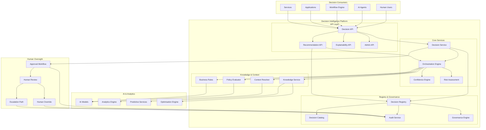
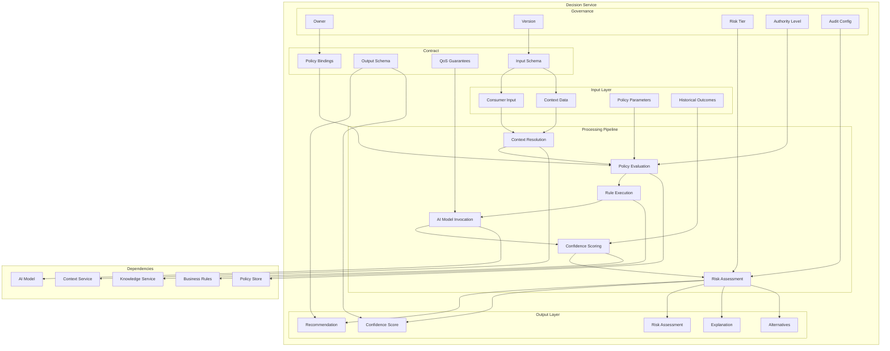
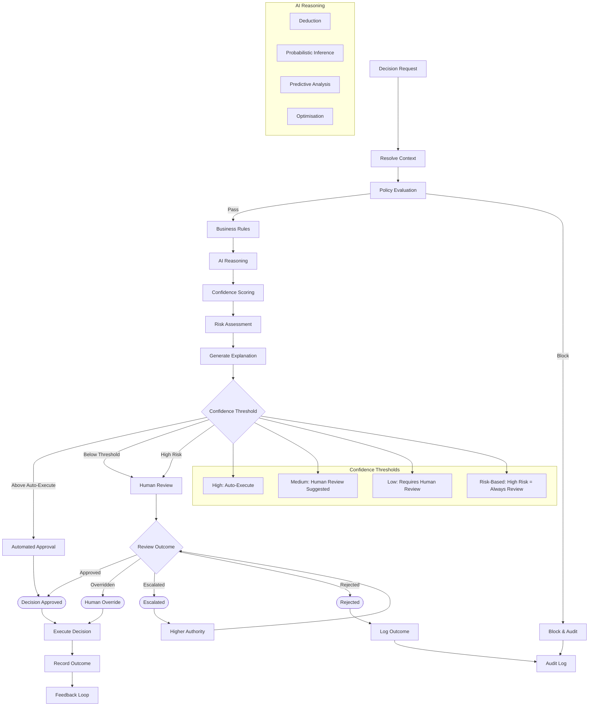
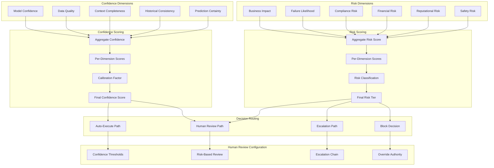
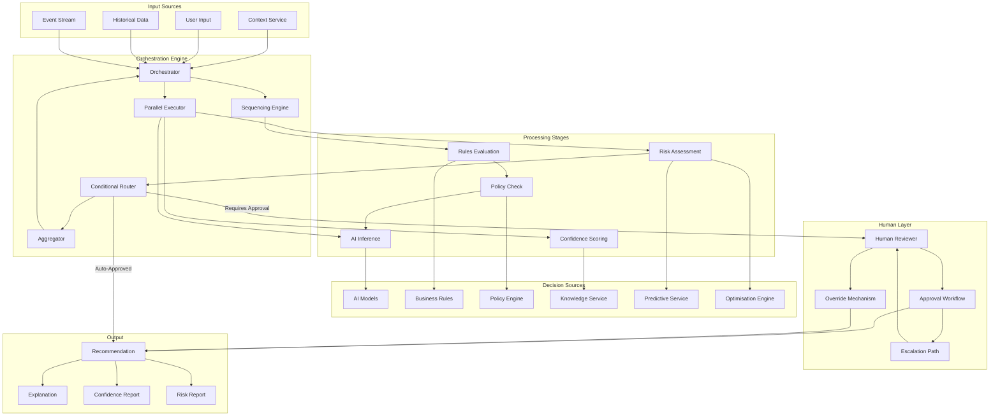
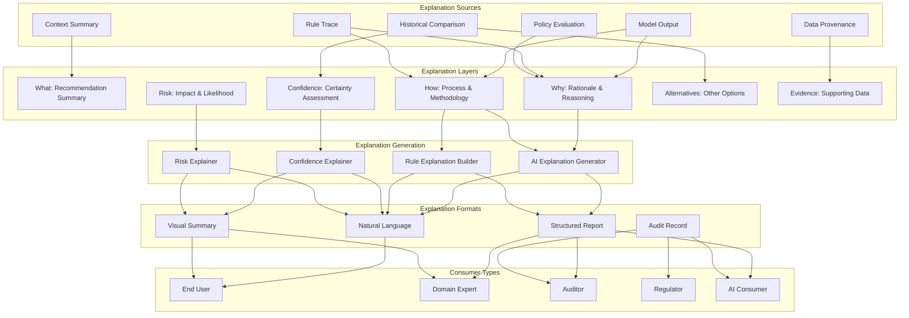
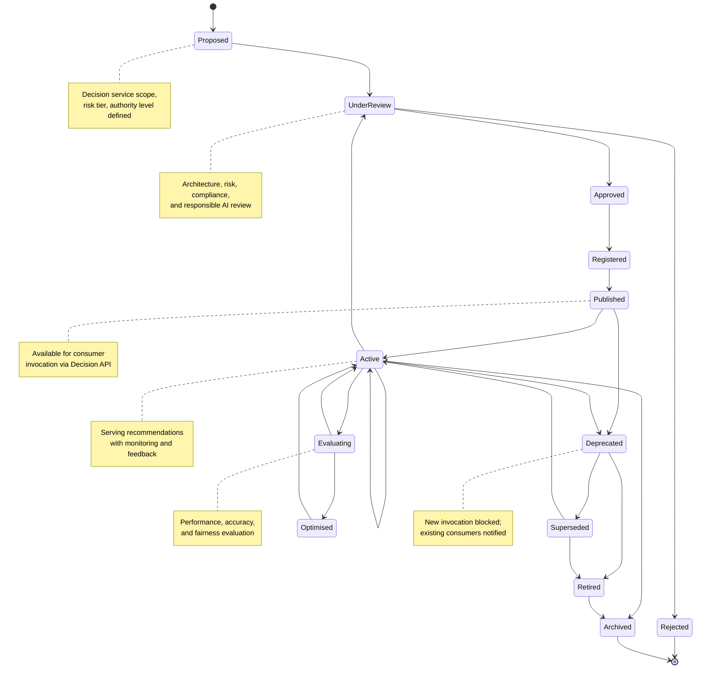
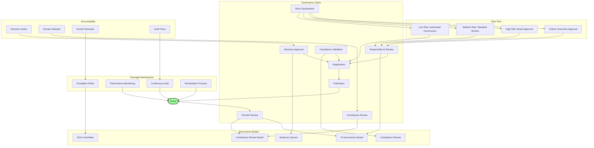

# KB-122 — AI Decision Intelligence Architecture

**Suite:** Enterprise Platform Services  
**Version:** 1.0  
**Status:** Approved Architecture  
**Classification:** Core AI Platform Architecture  
**Last Updated:** 2026-07-12

---

## Executive Summary

This document defines the enterprise architecture governing AI-assisted decision intelligence within DUKADESK. The AI Decision Intelligence Platform provides a centralised architecture for producing explainable, governed, risk-aware, context-aware, policy-compliant recommendations and decision support across the DUKADESK ecosystem.

The platform augments human decision-making while ensuring that enterprise policies, business rules, governance controls, and human oversight remain authoritative.

---

## Purpose

Define how DUKADESK governs AI-assisted decision intelligence throughout the enterprise while ensuring explainability, accountability, transparency, consistency, compliance, and responsible AI.

---

## Scope

### In Scope

- Enterprise decision intelligence architecture
- Decision services
- Decision registry
- Decision catalog
- Decision taxonomy
- Decision lifecycle
- Decision governance
- Recommendation architecture
- Decision support architecture
- Predictive intelligence
- Optimisation architecture
- Confidence scoring
- Explainability architecture
- Human approval architecture
- Decision auditing
- Decision observability
- Decision orchestration
- Decision policies
- Decision risk management
- Decision evolution

### Out of Scope

- Business Rules implementation
- AI model implementation
- Workflow implementation
- Analytics implementation
- Machine learning implementation
- Policy engine implementation

*The above items are covered in separate Knowledge Base documents (see Cross References).*

---

## Architectural Principles

| # | Principle | Description |
|---|-----------|-------------|
| 1 | **Human Authority over Enterprise Decisions** | AI provides recommendations and decision support. Human authority remains final for all enterprise decisions. |
| 2 | **AI Augments, Not Replaces, Governance** | AI decision intelligence operates within the enterprise governance framework. Governance is never bypassed. |
| 3 | **Explainability by Default** | Every recommendation and decision is accompanied by an explanation comprehensible to its human consumer. |
| 4 | **Confidence-Aware Decisions** | Recommendations carry explicit confidence scores. Decision routing, escalation, and override policies are confidence-aware. |
| 5 | **Policy-First Decision Architecture** | Enterprise policies are authoritative. AI recommendations are evaluated against policies before presentation. |
| 6 | **Deterministic Rules Before Probabilistic Reasoning** | Business rules and policies are evaluated before AI recommendations. Deterministic constraints are never overridden by AI. |
| 7 | **Vendor Independence** | Decision intelligence contracts and services are provider-agnostic, enabling transparent technology evolution. |
| 8 | **Technology Neutrality** | Decision models are expressed in technology-neutral formats decoupled from inference engines or analytics platforms. |
| 9 | **Zero Trust** | No decision service, model, consumer, or data source is implicitly trusted. Every operation is authenticated, authorised, and audited. |
| 10 | **Multi-Tenant Isolation** | Tenant decision contexts, recommendations, and outcomes are strictly isolated. |
| 11 | **Responsible AI** | Decision intelligence adheres to ethics, fairness, bias, and safety policies. Discriminatory or unsafe recommendations are blocked. |
| 12 | **Observability by Design** | All decision operations emit structured telemetry for audit, quality monitoring, governance, and optimisation. |
| 13 | **Lifecycle Governance** | Decision services progress through gated lifecycle transitions with governance review at each stage. |

---

## Canonical Definitions

| Term | Definition |
|------|------------|
| **Decision Intelligence** | A governed enterprise capability that produces explainable, confidence-scored, policy-compliant recommendations and decision support by combining AI models, business rules, policies, context, and knowledge. |
| **Decision Service** | A registered, versioned enterprise service that encapsulates a decision intelligence capability with defined inputs, outputs, confidence model, and governance policies. |
| **Decision Registry** | The authoritative system of record for all governed decision services, their metadata, versions, policies, and lifecycle state. |
| **Decision Catalog** | A discovery interface over the registry enabling search, capability matching, governance review, and portfolio analysis. |
| **Recommendation** | An AI-generated suggestion for a course of action, accompanied by confidence score, rationale, alternatives, and supporting evidence. |
| **Decision Context** | The aggregated data, metadata, and state relevant to a decision, including consumer identity, business context, tenant scope, and historical outcomes. |
| **Decision Confidence** | A quantitative and qualitative assessment of the certainty and reliability of a recommendation, expressed as a score and supporting rationale. |
| **Decision Risk** | The potential impact, likelihood, and severity of adverse outcomes associated with a recommendation or decision. |
| **Decision Policy** | A declarative rule governing recommendation generation, confidence thresholds, escalation criteria, human approval requirements, and compliance constraints. |
| **Decision Governance** | The framework of policies, reviews, approvals, and audits governing decision service lifecycle, recommendations, and outcomes. |
| **Decision Approval** | A human or authorised AI action that confirms or overrides a recommendation before execution. |
| **Decision Outcome** | The recorded result of a decision including the action taken, recommendation followed or overridden, confidence, and business impact. |
| **Decision Audit** | An immutable record of the decision process including inputs, recommendations, confidence, policies evaluated, approvals, and outcomes. |
| **Decision Explainability** | The capability to produce human-comprehensible explanations of how and why a recommendation was generated. |
| **Predictive Decision** | A decision service that forecasts future states or events to inform current decision-making. |
| **Optimisation** | A decision service that identifies optimal choices among alternatives subject to defined constraints and objectives. |
| **Human Override** | An authorised human action that overrides an AI recommendation, recorded with rationale and audit trail. |
| **Decision Lifecycle** | The progression of a decision service through defined states from proposal through retirement. |
| **Decision Consumer** | A user, AI agent, workflow, service, or application that invokes a decision service. |
| **Decision Producer** | The AI model, rules, policies, and context sources that generate a recommendation. |

---

## Architecture

### 1. Enterprise AI Decision Intelligence Architecture

The AI Decision Intelligence Platform provides a centralised capability for generating explainable, governed, confidence-aware recommendations across all enterprise domains.

### 2. Decision Taxonomy

Decision services are classified by domain, authority level, risk tier, and automation type, enabling consistent governance, routing, and policy enforcement.

```mermaid
graph TD
    Root[Decision Intelligence Taxonomy]

    Root --> STRAT[Strategic Decisions]
    STRAT --> STRAT_INV[Investment Decisions]
    STRAT --> STRAT_MKT[Market Expansion]
    STRAT --> STRAT_PROD[Product Strategy]
    STRAT --> STRAT_PART[Partner Strategy]

    Root --> TACT[Tactical Decisions]
    TACT --> TACT_PRC[Pricing Decisions]
    TACT --> TACT_INV[Inventory Optimisation]
    TACT --> TACT_WF[Workflow Optimisation]
    TACT --> TACT_RES[Resource Allocation]

    Root --> OPER[Operational Decisions]
    OPER --> OPER_AUTH[Authorisation]
    OPER --> OPER_APP[Approval Routing]
    OPER --> OPER_ESC[Escalation Decisions]
    OPER --> OPER_PRIO[Priority Assignment]

    Root --> ADMIN[Administrative Decisions]
    ADMIN --> ADMIN_TEN[Tenant Configuration]
    ADMIN --> ADMIN_COMP[Compliance Decisions]
    ADMIN --> ADMIN_AUD[Audit Prioritisation]

    Root --> FIN[Financial Decisions]
    FIN --> FIN_CR[Credit Decisions]
    FIN --> FIN_FRD[Fraud Detection]
    FIN --> FIN_COL[Collection Decisions]
    FIN --> FIN_BUD[Budget Optimisation]

    Root --> COMPL[Compliance Decisions]
    COMPL --> COMPL_REG[Regulatory Decisions]
    COMPL --> COMPL_POL[Policy Decisions]
    COMPL --> COMPL_RISK[Risk Classification]

    Root --> SEC[Security Decisions]
    SEC --> SEC_ACC[Access Decisions]
    SEC --> SEC_THRT[Threat Response]
    SEC --> SEC_INC[Incent Prioritisation]

    Root --> CX[Customer Experience]
    CX --> CX_REC[Product Recommendations]
    CX --> CX_SUPP[Support Routing]
    CX --> CX_PERS[Personalisation]

    Root --> AI_OPS[AI Operations]
    AI_OPS --> AI_OPS_MOD[Model Selection]
    AI_OPS --> AI_OPS_PRO[Prompt Selection]
    AI_OPS --> AI_OPS_COS[Cost Optimisation]

    Root --> PRED[Predictive Intelligence]
    PRED --> PRED_DEM[Demand Forecasting]
    PRED --> PRED_CHURN[Churn Prediction]
    PRED --> PRED_TREND[Trend Analysis]

    Root --> OPTI[Optimisation]
    OPTI --> OPTI_SCH[Schedule Optimisation]
    OPTI --> OPTI_ROUTE[Routing Optimisation]
    OPTI --> OPTI_ALLOC[Allocation Optimisation]

    Root --> FUT[Future Decision Domains]
```

### 3. Decision Service Architecture

Each decision service is a governed, versioned enterprise service with defined inputs, outputs, confidence model, risk assessment, explainability, and governance policies.

### 4. Recommendation Flow

Recommendations flow through a governed pipeline from request through context resolution, policy evaluation, AI reasoning, confidence scoring, risk assessment, explainability, and approval.

### 5. Confidence & Risk Model

Confidence and risk are evaluated across multiple dimensions, producing composite scores that determine recommendation routing, approval requirements, and escalation policies.

### 6. Decision Orchestration Architecture

Decision orchestration coordinates AI models, business rules, policies, context, knowledge, and human oversight within a unified, governed decision pipeline.

### 7. Explainability Architecture

Every recommendation is accompanied by a multi-layered explanation covering the what, why, how, confidence, risk, alternatives, and supporting evidence.

### 8. Decision Lifecycle

Every decision service progresses through a defined lifecycle with gated transitions ensuring governance, validation, and risk assessment.

### 9. Enterprise Decision Intelligence Ecosystem

The enterprise decision intelligence ecosystem encompasses all decision domains, their relationships, integration points, governance boundaries, and consumer touchpoints.

```mermaid
graph TB
    subgraph "Decision Intelligence Ecosystem"
        subgraph "Strategic Decisions"
            DS_INV[Investment Intelligence]
            DS_MKT[Market Intelligence]
            DS_PROD[Product Intelligence]
        end

        subgraph "Operational Decisions"
            DS_AUTH[Authorisation Decisions]
            DS_APP[Approval Intelligence]
            DS_ESC[Escalation Decisions]
            DS_PRIO[Priority Intelligence]
        end

        subgraph "Financial Decisions"
            DS_CR[Credit Intelligence]
            DS_FRD[Fraud Intelligence]
            DS_BUD[Budget Optimisation]
        end

        subgraph "Compliance & Risk"
            DS_COMP[Compliance Intelligence]
            DS_RISK[Risk Intelligence]
            DS_AUD[Audit Intelligence]
        end

        subgraph "AI Decisions"
            DS_MODEL[Model Selection]
            DS_PROMPT[Prompt Intelligence]
            DS_COST[Cost Optimisation]
        end

        subgraph "Customer Decisions"
            DS_REC[Recommendation Engine]
            DS_SUPP[Support Intelligence]
            DS_PERS[Personalisation]
        end
    end

    subgraph "Platform Integration"
        AI_PLAT[AI Platform]
        RULES[Business Rules Engine]
        POLICY[Policy Engine]
        WORKFLOW[Workflow Orchestration]
        KNOW[Knowledge Service]
        ANALYTICS[Analytics Platform]
    end

    subgraph "Governance Boundaries"
        GB_HUMAN[Human Authority Boundary]
        GB_AUTO[Automation Boundary]
        GB_RISK[Risk Tier Boundary]
        GB_COMPLY[Compliance Boundary]
        GB_AI[Responsible AI Boundary]
    end

    DS_INV --> KNOW
    DS_INV --> ANALYTICS
    DS_MKT --> ANALYTICS
    DS_PROD --> KNOW
    DS_AUTH --> POLICY
    DS_AUTH --> RULES
    DS_APP --> WORKFLOW
    DS_ESC --> WORKFLOW
    DS_CR --> AI_PLAT
    DS_CR --> POLICY
    DS_FRD --> AI_PLAT
    DS_FRD --> ANALYTICS
    DS_MODEL --> AI_PLAT
    DS_MODEL --> POLICY
    DS_PROMPT --> AI_PLAT
    DS_REC --> AI_PLAT
    DS_REC --> KNOW

    DS_CR --> GB_HUMAN
    DS_APP --> GB_HUMAN
    DS_ESC --> GB_HUMAN
    DS_AUTH --> GB_AUTO
    DS_REC --> GB_AUTO
    DS_FRD --> GB_AI
    DS_COMP --> GB_COMPLY
    DS_RISK --> GB_RISK
```

### 10. Governance Operating Model

The governance operating model defines how decision intelligence is governed across the enterprise with clear accountability, risk tiers, approval chains, and oversight mechanisms.

---

## Lifecycle

| Phase | Description | Gates |
|-------|-------------|-------|
| **Proposal** | Decision service scope, risk tier, authority level, and business case are defined. | Scope validation |
| **Architecture Review** | Enterprise Architecture evaluates taxonomy fit, dependency impact, governance alignment, and risk classification. | Architecture sign-off |
| **Governance Approval** | Risk-classified approval process. Low risk: automated. Medium: standard review. High: AI Governance Board. Critical: executive approval. | Governance approval |
| **Registration** | Decision service is registered in the Decision Registry with full metadata, risk tier, and governance records. | Registry entry verified |
| **Publication** | Decision service is published and made available for consumer invocation. | Publication validation |
| **Consumption** | Consumers invoke the decision service. Recommendations are generated with confidence, risk, and explainability. | Operational metrics |
| **Monitoring** | Continuous monitoring of recommendation quality, confidence accuracy, risk alignment, and governance compliance. | Operational review |
| **Evaluation** | Periodic evaluation of decision service performance, fairness, bias, and business impact. | Evaluation completion |
| **Optimisation** | Decision service is optimised based on evaluation feedback, outcome analysis, and evolving business requirements. | Optimisation approval |
| **Version Evolution** | Decision service versions evolve through semantic versioning with impact analysis for confidence and risk models. | Version governance |
| **Deprecation** | Decision service version is deprecated; new consumer binding is blocked; existing consumers are notified with migration path. | Deprecation notice |
| **Retirement** | Decision service is retired; all consumer references are migrated; service is decommissioned. | Retirement approval |
| **Historical Archival** | Decision service metadata, evaluation results, and governance records are archived for compliance and reference. | Archive completion |

---

## Governance

| Domain | Governance Mechanism | Responsible Body |
|--------|---------------------|------------------|
| **Decision Ownership** | Every decision service must have a registered business owner and technical steward. | Enterprise Architecture |
| **Recommendation Governance** | Recommendations are governed by confidence thresholds, risk tiers, and human approval requirements. | AI Governance Board |
| **Risk Governance** | Decision services are classified by risk tier. High and critical risk services require enhanced governance. | Risk Committee |
| **Compliance Governance** | Decision services in regulated domains undergo compliance review and periodic revalidation. | Compliance |
| **Responsible AI Governance** | Decision services adhere to ethics, fairness, bias, and safety policies evaluated at registration and periodically. | AI Governance Board |
| **Architecture Governance** | Decision taxonomy fit, dependency alignment, and platform integration are reviewed. | Architecture Review Board |
| **Lifecycle Governance** | Lifecycle transitions are gated and audited. Stale or non-compliant services are escalated. | Platform Engineering |
| **Version Governance** | Version changes follow semantic versioning with consumer notification for confidence or risk model changes. | AI Platform Team |
| **Audit Governance** | All decision operations are audited with immutable records for governance and investigation. | Audit Teams |
| **Enterprise AI Governance** | Cross-cutting AI governance framework coordinates decision, model, prompt, and safety governance. | AI Governance Board |

---

## Responsibilities

| Role | Responsibilities |
|------|-----------------|
| **Enterprise Architecture** | Define decision taxonomy, governance framework, service contracts; conduct architecture reviews; maintain portfolio. |
| **AI Platform Team** | Build and maintain Decision Intelligence Platform, registry, orchestration engine, confidence engine, and explainability service. |
| **AI Governance Board** | Govern responsible AI for decision intelligence; review high-risk decision services; define ethics and fairness policies. |
| **Business Owners** | Own decision service business intent, outcome accountability, and domain-specific governance requirements. |
| **Platform Engineering** | Maintain platform integration between decision intelligence and other enterprise platform services. |
| **Security** | Perform security reviews; define decision authorisation, data handling, and audit standards. |
| **Compliance** | Conduct compliance reviews for regulated decision domains; define retention and regulatory policies. |
| **Risk Management** | Define risk classification framework; oversee risk tier assignment; monitor decision risk indicators. |
| **Operations** | Monitor decision service health, recommendation quality, and confidence accuracy; respond to incidents. |
| **Tenant Administrators** | Manage tenant-specific decision policies, confidence thresholds, and human review configurations. |

---

## Security

| Control Area | Architecture |
|-------------|--------------|
| **Decision Authorisation** | Every decision service invocation is authorised against consumer identity, tenant context, and risk tier. |
| **Policy Enforcement** | Decision policies are evaluated before recommendation generation. Policy violations block the request and trigger escalation. |
| **Tenant Isolation** | Tenant decision contexts, recommendations, and outcomes are strictly partitioned. Cross-tenant visibility is prohibited. |
| **Secure Recommendations** | Recommendations are transmitted over encrypted channels. Recommendation integrity is verifiable. |
| **Identity-Aware Decisions** | Decision context includes consumer identity for authorisation, audit, and personalisation. |
| **Least Privilege** | Consumers are granted access only to decision services matching their authorised risk tier and domain. |
| **Zero Trust** | No decision service, consumer, or data source is implicitly trusted. Every operation is authenticated, authorised, and audited. |
| **Auditability** | Every decision operation is logged with consumer identity, context, recommendation, confidence, approval, and outcome. |
| **Provenance** | Full lineage of every recommendation is traceable to its input data, models, rules, policies, and approvals. |
| **Trust Verification** | Decision service provenance and integrity are verifiable through the registry. |

---

## Privacy

| Domain | Architecture |
|--------|--------------|
| **Privacy-Preserving Recommendations** | Personal data used in decision context is minimised. Sensitive data is anonymised or filtered before processing. |
| **Data Minimisation** | Decision context captures only data necessary for the recommendation. Retention follows policy. |
| **Consent-Aware Decision Support** | Decision services involving personal data require consent verification before processing. |
| **Regulatory Compliance** | Decision services in regulated domains enforce data handling, retention, and reporting policies. |
| **Cross-Border Governance** | Decision services operating across geographic regions are classified for cross-border data flow compliance. |
| **Regional Restrictions** | Decision routing respects regional data residency. Regional decision service instances are used where available. |
| **Retention Policies** | Decision inputs, recommendations, and outcomes are retained per domain-specific policies. |
| **Audit Retention** | Decision audit logs are retained per regulatory requirements with privacy safeguards. |

---

## Performance

| Consideration | Architectural Approach |
|---------------|----------------------|
| **Enterprise-Scale Decision Services** | Decision services scale horizontally. Invocations are partitioned by tenant and decision domain. |
| **Low-Latency Recommendations** | Context resolution and policy evaluation are optimised for sub-second response. AI inference latency is managed through model selection and caching. |
| **High Availability** | Decision services are deployed across availability zones. Critical decisions have redundant recommendation paths. |
| **Elastic Scalability** | Decision service capacity scales with demand. Model selection and provider routing adapt to load. |
| **Global Distribution** | Regional decision service instances provide low-latency access. Cross-region context synchronisation is asynchronous. |
| **Operational Resilience** | Decision service failures trigger fallback to deterministic rules or graceful degradation. |
| **Multi-Region Readiness** | Decision routing supports regional affinity. Context and knowledge are resolved from the nearest region. |
| **Efficient Orchestration** | Orchestration engine minimises overhead through parallel execution, caching, and lazy context resolution. |

---

## Observability

| Domain | Architecture |
|--------|--------------|
| **Recommendation Metrics** | Invocation count, recommendation distribution, confidence distribution, and approval rates are tracked per service. |
| **Decision Quality Metrics** | Outcome accuracy, recommendation acceptance rate, human override rate, and business impact are measured. |
| **Confidence Analytics** | Confidence score calibration, overconfidence rate, underconfidence rate, and confidence drift are monitored. |
| **Governance Dashboards** | Role-specific dashboards expose decision portfolio health, risk distribution, compliance status, and governance actions. |
| **Explainability Reporting** | Explanation quality, consumer satisfaction, and explanation coverage are tracked. |
| **Risk Dashboards** | Risk tier distribution, escalation rates, policy violation trends, and risk indicator alerts are monitored. |
| **SLA Monitoring** | Recommendation latency SLAs, availability SLAs, and quality SLAs are monitored per decision service tier. |
| **Audit Reporting** | Immutable audit trails support investigation, compliance reporting, and forensic analysis. |
| **Executive Reporting** | Executive dashboards summarise decision intelligence business impact, cost, and strategic value. |
| **Enterprise AI Insights** | Cross-service analytics reveal usage patterns, optimisation opportunities, and emerging decision intelligence trends. |

---

## Failure Scenarios

| Scenario | Architectural Response |
|----------|-----------------------|
| **Low-Confidence Recommendations** | Low confidence triggers human review path. Thresholds are configurable per decision service and risk tier. |
| **Conflicting Recommendations** | Orchestration engine detects conflicting outputs from parallel sources. Conflict resolution policy selects authoritative source or escalates. |
| **Policy Conflicts** | Policy evaluation identifies conflicting policies. Conflict resolution follows policy hierarchy. Unresolvable conflicts block the decision and escalate. |
| **Business Rule Conflicts** | Rule evaluation detects conflicting rule outcomes. Rule priority and conflict resolution policies determine the authoritative result. |
| **Human Approval Failure** | Approval timeout or unavailability triggers escalation chain. Configurable fallback rules apply. |
| **Decision Inconsistency** | Historical consistency check flags anomalous recommendations. Inconsistency is logged and alerted for investigation. |
| **Explainability Failure** | Explanation generation fails. Recommendation is still delivered with degraded explanation. Failure is logged. |
| **Governance Violations** | Policy enforcement blocks the decision request. Violation is logged, audited, and escalated. |
| **Cross-Tenant Exposure** | Cross-tenant decision context access is blocked. Violation is logged and escalated immediately. |
| **Risk Escalation Failure** | Escalation path fails. Decision is blocked and incident is triggered for manual intervention. |
| **Decision Drift** | Monitoring detects drift in recommendation patterns, confidence calibration, or outcome distribution. Drift triggers re-evaluation. |
| **Recovery Failure** | Decision service state recovery fails. Service is flagged for manual investigation with context preserved. |

---

## Anti-Patterns

| Anti-Pattern | Prohibited Because | Enforced By |
|--------------|-------------------|-------------|
| **Autonomous Enterprise Decisions Without Governance** | Bypasses human authority, risk assessment, and compliance validation. | Governance enforcement; risk classification |
| **Hidden AI Recommendations** | Recommendations without transparency violate explainability and trust requirements. | Explainability mandatory check |
| **AI Bypassing Business Rules** | Probabilistic AI overriding deterministic rules creates unpredictability and compliance risk. | Architecture review; policy enforcement |
| **Decisions Without Confidence Scoring** | Recommendations without confidence prevent informed human judgement and risk assessment. | Confidence engine enforcement |
| **Recommendations Without Explainability** | Unexplained recommendations violate responsible AI principles and regulatory requirements. | Explainability mandatory check |
| **Hardcoded AI Decisions** | Embeds decision logic in application code, preventing governance, audit, and evolution. | Code review; architecture review |
| **Application-Owned Decision Engines** | Fragments decision governance, duplicates capabilities, and creates inconsistency. | Platform policy |
| **Shadow Recommendation Systems** | Unregistered decision services bypass governance, risk classification, and audit. | Registry mandatory check |
| **AI Replacing Human Governance** | AI must augment, not replace, human authority over enterprise decisions. | Governance framework |
| **Unregistered Decision Services** | Services outside the registry are invisible to governance, portfolio management, and audit. | Registry enforcement |

---

## Future Evolution

| Evolution Path | Architectural Preparation |
|---------------|--------------------------|
| **Autonomous Decision Advisors** | Decision services evolve to proactively surface recommendations based on context without explicit invocation. |
| **Federated Decision Ecosystems** | Decision intelligence spans enterprise boundaries with federated governance, context sharing, and collaborative recommendations. |
| **Predictive Enterprise Optimisation** | Decision services continuously optimise enterprise operations through predictive and prescriptive analytics. |
| **Adaptive Recommendation Engines** | Recommendation engines dynamically adapt confidence thresholds, models, and policies based on outcome feedback. |
| **Cognitive Enterprise Decision Platforms** | Decision intelligence evolves towards autonomous reasoning, self-correction, and continuous learning within governance constraints. |
| **Knowledge-Driven Decision Intelligence** | Deep integration with the enterprise knowledge graph enables contextually rich, knowledge-grounded recommendations. |
| **Cross-Agent Collaborative Reasoning** | Multiple AI agents collaborate through decision services to produce consensus recommendations with confidence aggregation. |
| **Self-Improving Enterprise Intelligence** | Decision services continuously improve through automated evaluation, feedback loops, and policy refinement. |

---

## Cross References

| Document ID | Title | Relation |
|-------------|-------|----------|
| **KB-089** | Knowledge Graph Architecture | Defines knowledge graph integration for context-rich decision intelligence. |
| **KB-090** | Analytics & Business Intelligence Architecture | Defines analytics consumption of decision outcomes for reporting. |
| **KB-091** | Reporting Architecture | Defines reporting on decision intelligence metrics and outcomes. |
| **KB-107** | Enterprise Platform Services Overview Architecture | Defines the platform services context for decision intelligence. |
| **KB-113** | Workflow Orchestration Architecture | Defines workflow integration for human approval and decision execution. |
| **KB-114** | Business Rules Engine Architecture | Defines deterministic rule evaluation within decision orchestration. |
| **KB-116** | AI Platform Architecture | Defines the AI platform context for AI-driven decision intelligence. |
| **KB-117** | AI Agent Framework Architecture | Defines AI agent consumption of decision services. |
| **KB-118** | AI Model Management Architecture | Defines model management for AI models used in decision reasoning. |
| **KB-119** | Prompt Management Architecture | Defines prompt templates for AI models used in decision intelligence. |
| **KB-120** | AI Context & Memory Architecture | Defines context and memory services for decision context resolution. |
| **KB-121** | AI Safety & Governance Architecture | Defines the safety and governance framework for responsible decision AI. |
| **KB-124** | Policy Management Architecture | Defines the policy framework enforced during decision evaluation. |
| **KB-140** | Enterprise Platform Services Reference Architecture | Defines the overarching reference architecture for enterprise platform services. |

---

## Acceptance Criteria

- [x] Defines enterprise AI Decision Intelligence architecture.
- [x] Treats decision intelligence as a governed enterprise capability.
- [x] Defines governance, confidence scoring, explainability, recommendations, orchestration, lifecycle, and observability.
- [x] Supports enterprise-scale, multi-tenant, vendor-independent AI operations.
- [x] Includes all 10 required Mermaid diagrams.
- [x] Cross-references related Knowledge Base documents.
- [x] Contains no implementation guidance.

---

## Completion Instructions

1. **Mark KB-122 as Completed** — This document constitutes the completed architecture specification.
2. **Update the Progress Registry** — Record KB-122 as Approved Architecture in the Knowledge Base registry.
3. **Mark the AI Platform Services subsection of the Enterprise Platform Services suite as Completed.**
4. **Queue Next Assignment** — KB-123 – Enterprise Policy Framework Architecture is the next builder assignment.

---

## Critical DUKADESK Architectural Rule

> **All AI-assisted recommendations and decision support within DUKADESK shall operate exclusively through the governed Enterprise AI Decision Intelligence Platform. AI shall augment—but never supersede—the authoritative enterprise policies, business rules, governance controls, and human oversight that govern organisational decisions, ensuring explainability, accountability, transparency, risk awareness, and enterprise-wide trust.**
