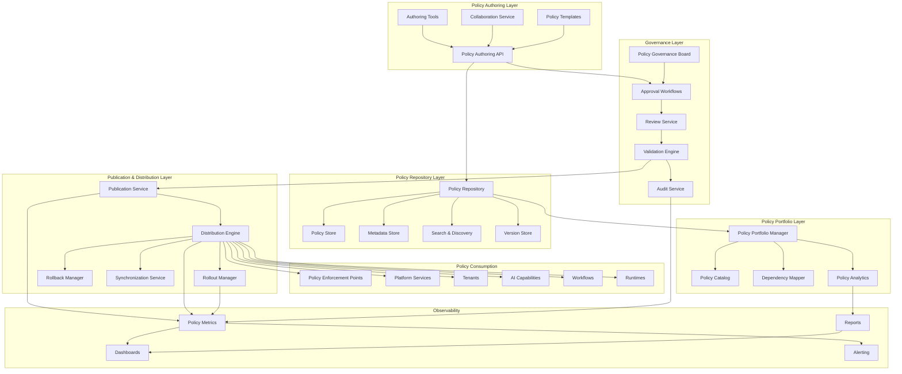
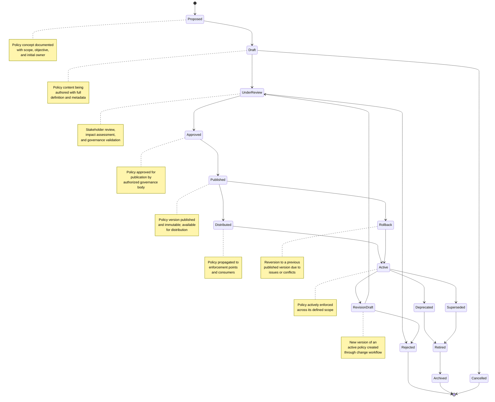
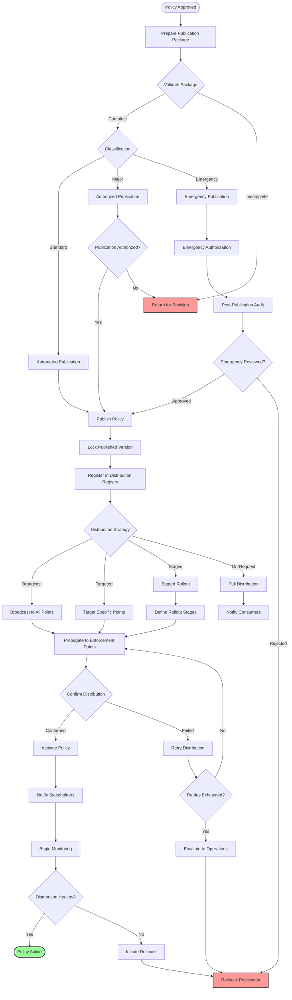
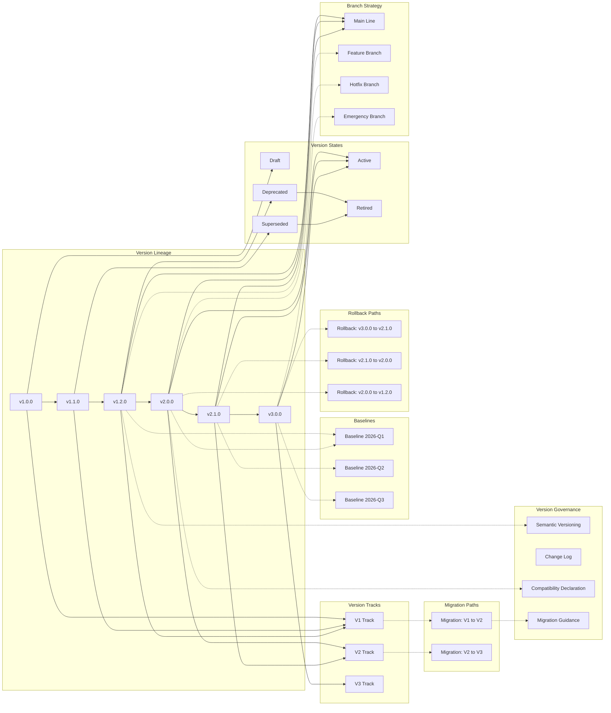
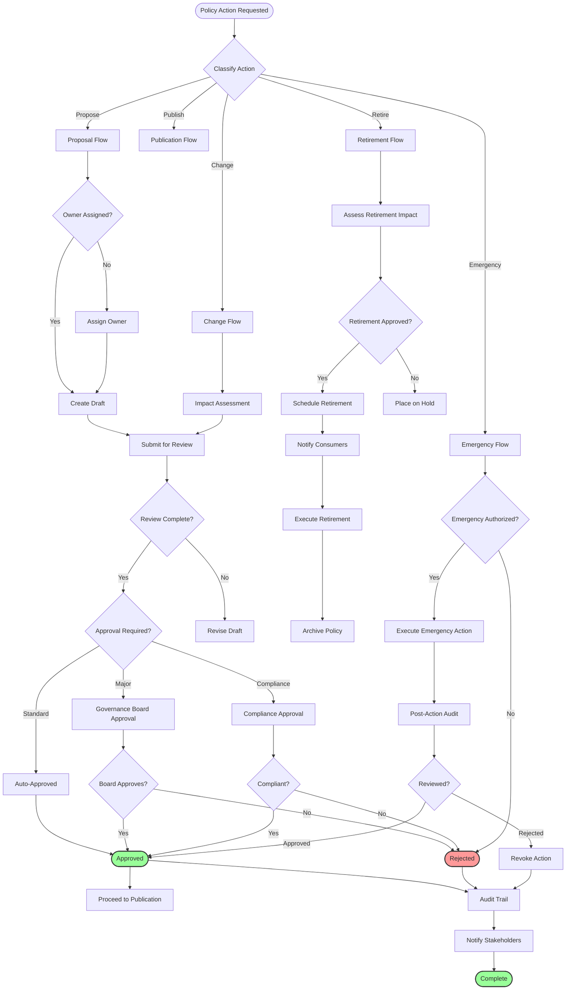
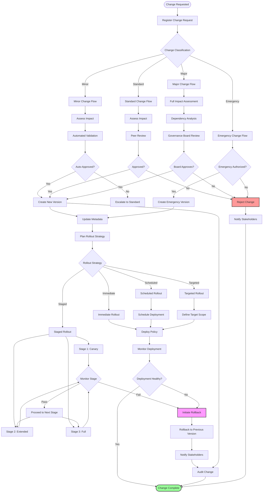
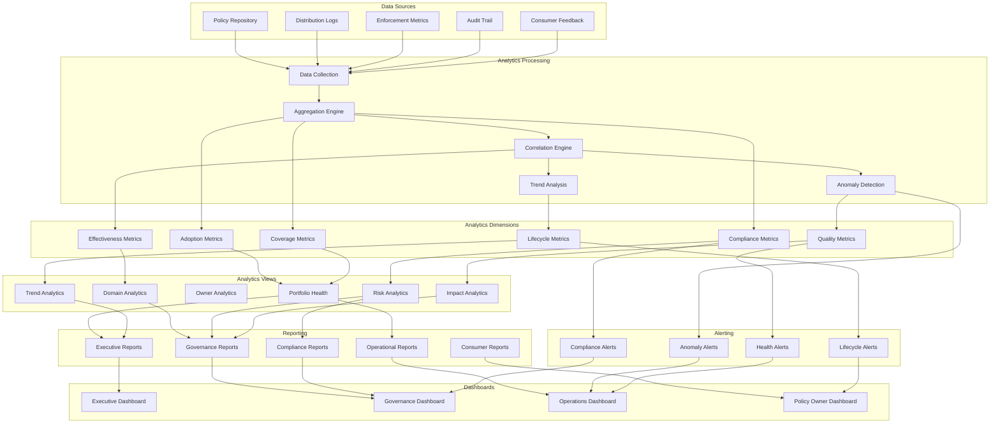

# KB-124 — Policy Management Architecture

**Suite:** Enterprise Platform Services  
**Version:** 1.0  
**Status:** Approved Architecture  
**Classification:** Enterprise Governance Architecture  
**Last Updated:** 2026-07-12

---

## Executive Summary

This document defines the enterprise architecture governing the operational lifecycle of enterprise policies across DUKADESK. The Policy Management Platform shall provide centralized capabilities for authoring, reviewing, approving, publishing, distributing, enforcing, monitoring, auditing, versioning, and retiring enterprise policies across all DUKADESK services.

The architecture shall separate policy definition from policy management and policy enforcement, ensuring governance, traceability, portability, and enterprise-wide consistency.

---

## Purpose

Define how DUKADESK operationally manages enterprise policies throughout their complete lifecycle while maintaining governance, auditability, consistency, and enterprise scalability.

---

## Scope

### In Scope

- Policy management architecture
- Policy authoring lifecycle
- Policy repository architecture
- Policy publication
- Policy distribution
- Policy approval workflows
- Policy version management
- Policy dependency management
- Policy rollout governance
- Policy rollback governance
- Policy monitoring
- Policy auditing
- Policy change governance
- Policy ownership
- Policy retirement
- Policy archival
- Enterprise policy portfolio management
- Policy analytics

### Out of Scope

- Policy engine implementation
- Business rule implementation
- Authorization implementation
- Compliance implementation
- Security implementation
- Runtime enforcement implementation

*The above items are covered by dedicated Knowledge Base documents.*

---

## Architectural Principles

| # | Principle | Description |
|---|-----------|-------------|
| 1 | **Centralized Policy Management** | All enterprise policies are managed through a single, centralized Policy Management Platform. No distributed or application-owned policy management is permitted. |
| 2 | **Separation of Definition, Management, and Enforcement** | Policy definition (framework), policy management (lifecycle), and policy enforcement (runtime) are architecturally distinct layers with independent governance. |
| 3 | **Governance-First Lifecycle** | Every policy lifecycle transition is governed. Policies cannot progress through lifecycle stages without appropriate authorization. |
| 4 | **Version-First Architecture** | Every policy change creates a new version. Policies are never modified in place. Version history is immutable and auditable. |
| 5 | **Policy Traceability** | Every policy is traceable from its origin through every lifecycle transition to its current state and enforcement scope. |
| 6 | **Auditability by Default** | Every policy operation — creation, modification, approval, publication, distribution, enforcement — is recorded in an immutable audit trail. |
| 7 | **Policy Immutability After Publication** | Published policies are immutable. Changes require a new version through the full governance lifecycle. |
| 8 | **Controlled Change Management** | Policy changes follow defined workflows with appropriate approval gates based on risk classification and impact scope. |
| 9 | **Vendor Independence** | Policy management models, workflows, and metadata are provider-agnostic, ensuring portability across policy engine implementations. |
| 10 | **Technology Neutrality** | Policy definitions, lifecycle states, and distribution formats are expressed in technology-neutral formats. |
| 11 | **Multi-Tenant Governance** | Policy management respects tenant boundaries. Tenant-specific policy variants are isolated and independently governed. |
| 12 | **Zero Trust** | No policy operation is implicitly trusted. Every action is authenticated, authorised, and audited. |
| 13 | **Enterprise Observability** | Policy lifecycle, distribution, enforcement, and compliance emit structured telemetry for enterprise governance visibility. |

---

## Canonical Definitions

| Term | Definition |
|------|------------|
| **Policy Management** | The operational lifecycle governing how enterprise policies are authored, reviewed, approved, published, distributed, versioned, monitored, and retired. |
| **Policy Repository** | The authoritative, versioned, and governed storage system for all enterprise policy definitions, metadata, and lifecycle history. |
| **Policy Publication** | The governed process of making an approved policy version available for distribution and enforcement. |
| **Policy Distribution** | The secure propagation of published policies from the repository to enforcing services, runtimes, and consumers. |
| **Policy Approval** | The formal authorization required for a policy to progress through lifecycle stages, particularly publication. |
| **Policy Draft** | A policy version under development, not yet approved for publication. Drafts are mutable and visible only to authors and reviewers. |
| **Published Policy** | An immutable policy version that has completed the governance lifecycle and is available for distribution and enforcement. |
| **Policy Rollout** | The controlled, staged deployment of a new or updated policy across enforcement points, consumers, and tenants. |
| **Policy Rollback** | The governed reversion to a previous published policy version due to issues, conflicts, or governance decisions. |
| **Policy Retirement** | The removal of a policy from active use after it is no longer required, superseded, or obsolete. |
| **Policy Archive** | The long-term, immutable storage of retired or historical policy versions for governance, audit, and compliance purposes. |
| **Policy Ownership** | The assignment of accountability for a policy's lifecycle, governance, quality, and operational health to a named entity. |
| **Policy Review** | A structured evaluation of a policy draft for quality, consistency, impact, and governance compliance before approval. |
| **Policy Change** | Any modification to a policy's definition, metadata, scope, or enforcement level, governed through the change management lifecycle. |
| **Policy Revision** | A new version of a policy created to implement a change, with full version history maintained. |
| **Policy Portfolio** | The complete collection of all enterprise policies managed within the Policy Management Platform. |
| **Policy Lifecycle** | The progression of a policy through defined states from proposal through archival, with governance at every transition. |
| **Policy Governance** | The framework of controls, approvals, workflows, and oversight mechanisms governing policy lifecycle operations. |
| **Policy Monitoring** | The continuous observation of policy distribution health, enforcement compliance, usage patterns, and lifecycle status. |
| **Policy Analytics** | The measurement, analysis, and reporting of policy portfolio health, adoption, effectiveness, and governance compliance. |

---

## Architecture

### 1. Enterprise Policy Management Architecture

The Enterprise Policy Management Platform provides centralized capabilities for the complete operational lifecycle of enterprise policies.

### 2. Policy Repository Architecture

The Policy Repository is the authoritative, versioned, and governed storage system for all enterprise policies.

```mermaid
graph TB
    subgraph "Policy Repository Core"
        REPO_CORE[Repository Core]
        REPO_API[Repository API]
        REPO_GW[Repository Gateway]
    end

    subgraph "Storage Layer"
        STORE_DEF[Policy Definition Store]
        STORE_META[Metadata Store]
        STORE_VERSION[Version Store]
        STORE_ATTACH[Attachment Store]
    end

    subgraph "Index & Discovery"
        INDEX_SEARCH[Search Index]
        INDEX_CAPABILITY[Capability Index]
        INDEX_SCOPE[Scope Index]
        INDEX_DEPENDENCY[Dependency Index]
    end

    subgraph "Organization Structure"
        ORG_CATEGORY[Category Hierarchy]
        ORG_DOMAIN[Policy Domain]
        ORG_NAMESPACE[Namespace]
        ORG_TAG[Tag Taxonomy]
    end

    subgraph "Lifecycle State"
        LS_DRAFT[Draft]
        LS_REVIEW[Under Review]
        LS_APPROVED[Approved]
        LS_PUBLISHED[Published]
        LS_DEPRECATED[Deprecated]
        LS_RETIRED[Retired]
        LS_ARCHIVED[Archived]
    end

    subgraph "Policy Metadata"
        META_ID[Policy ID]
        META_TITLE[Title / Name]
        META_OWNER[Policy Owner]
        META_DOMAIN[Domain]
        META_VERSION[Version]
        META_STATUS[Lifecycle State]
        META_CLASS[Classification]
        META_RISK[Risk Tier]
        META_EFFECTIVE[Effective Date]
        META_EXPIRY[Expiry / Sunset]
        META_APPROVED[Approved By]
        META_APPROVED_DATE[Approval Date]
        META_CHANGE[Change Summary]
        META_DEPENDENCIES[Dependencies]
        META_SCOPE[Enforcement Scope]
    end

    subgraph "Access Control"
        ACL_READ[Read Permissions]
        ACL_WRITE[Write Permissions]
        ACL_APPROVE[Approval Permissions]
        ACL_PUBLISH[Publication Permissions]
        ACL_RETIRE[Retirement Permissions]
    end

    REPO_CORE --> REPO_API
    REPO_API --> REPO_GW

    REPO_CORE --> STORE_DEF
    REPO_CORE --> STORE_META
    REPO_CORE --> STORE_VERSION
    REPO_CORE --> STORE_ATTACH

    REPO_CORE --> INDEX_SEARCH
    REPO_CORE --> INDEX_CAPABILITY
    REPO_CORE --> INDEX_SCOPE
    REPO_CORE --> INDEX_DEPENDENCY

    REPO_CORE --> ORG_CATEGORY
    ORG_CATEGORY --> ORG_DOMAIN
    ORG_DOMAIN --> ORG_NAMESPACE
    ORG_NAMESPACE --> ORG_TAG

    REPO_CORE --> LS_DRAFT
    LS_DRAFT --> LS_REVIEW
    LS_REVIEW --> LS_APPROVED
    LS_APPROVED --> LS_PUBLISHED
    LS_PUBLISHED --> LS_DEPRECATED
    LS_DEPRECATED --> LS_RETIRED
    LS_RETIRED --> LS_ARCHIVED

    STORE_META --> META_ID
    STORE_META --> META_TITLE
    STORE_META --> META_OWNER
    STORE_META --> META_VERSION
    STORE_META --> META_STATUS
    STORE_META --> META_CLASS
    STORE_META --> META_EFFECTIVE
    STORE_META --> META_DEPENDENCIES
    STORE_META --> META_SCOPE

    REPO_CORE --> ACL_READ
    REPO_CORE --> ACL_WRITE
    REPO_CORE --> ACL_APPROVE
    REPO_CORE --> ACL_PUBLISH
    REPO_CORE --> ACL_RETIRE
```

### 3. Policy Lifecycle

Every policy progresses through a defined lifecycle with gated transitions ensuring governance, validation, and stakeholder notification at every stage.

### 4. Policy Publication & Distribution Flow

Policy publication and distribution governs the controlled release of approved policies to enforcement points and consumers.

### 5. Policy Version Management

Policy versions evolve through semantic versioning with support for parallel tracks, compatibility management, baseline anchoring, rollback, and graceful migration.

### 6. Policy Governance Structure

Policy governance is enforced through a structured framework spanning ownership, approval workflows, validation, compliance, and audit.

### 7. Policy Portfolio Architecture

The Policy Portfolio provides enterprise-wide visibility into the complete policy inventory, enabling portfolio governance, lifecycle management, risk analysis, and strategic planning.

```mermaid
graph TB
    subgraph "Policy Repository"
        REPO[Repository Core]
        STORE[Policy Store]
        EVT[Policy Change Events]
    end

    subgraph "Policy Catalog"
        CAT[Catalog Service]
        SEARCH[Search & Discovery]
        CLASS[Classification Engine]
        REL[Relationship Mapper]
    end

    subgraph "Portfolio Views"
        V_TAX[Taxonomy View]
        V_LIFE[Lifecycle View]
        V_OWN[Ownership View]
        V_DEP[Dependency View]
        V_RISK[Risk View]
        V_GOV[Governance View]
        V_COMPLIANCE[Compliance View]
    end

    subgraph "Analytics & Insights"
        AN_ADOPT[Adoption Analytics]
        AN_COVERAGE[Coverage Analysis]
        AN_IMPACT[Impact Analysis]
        AN_GAP[Gap Analysis]
        AN_HEALTH[Health Scoring]
    end

    subgraph "Portfolio Governance"
        PG_OWNER[Ownership Gaps]
        PG_ORPHAN[Orphaned Policies]
        PG_STALE[Stale Policies]
        PG_CONFLICT[Conflict Detection]
        PG_DUP[Duplicate Detection]
        PG_COMPLIANCE[Compliance Status]
    end

    subgraph "Reporting"
        RP_EXEC[Executive Reports]
        RP_COMP[Compliance Reports]
        RP_ARCH[Architecture Reports]
        RP_RISK[Risk Reports]
        RP_TREND[Trend Analysis]
    end

    REPO --> STORE
    REPO --> EVT

    REPO --> CAT
    CAT --> SEARCH
    CAT --> CLASS
    CAT --> REL

    REPO --> V_TAX
    REPO --> V_LIFE
    REPO --> V_OWN
    REPO --> V_DEP
    REPO --> V_RISK
    REPO --> V_GOV
    REPO --> V_COMPLIANCE

    REPO --> AN_ADOPT
    REPO --> AN_COVERAGE
    REPO --> AN_IMPACT
    REPO --> AN_GAP
    REPO --> AN_HEALTH

    REPO --> PG_OWNER
    REPO --> PG_ORPHAN
    REPO --> PG_STALE
    REPO --> PG_CONFLICT
    REPO --> PG_DUP
    REPO --> PG_COMPLIANCE

    AN_ADOPT --> RP_EXEC
    AN_HEALTH --> RP_ARCH
    AN_COVERAGE --> RP_TREND
    AN_GAP --> RP_ARCH
    PG_COMPLIANCE --> RP_COMP
    PG_CONFLICT --> RP_RISK
    PG_STALE --> RP_ARCH

    V_RISK --> RP_RISK
    V_LIFE --> RP_ARCH
    V_GOV --> RP_COMP
    V_COMPLIANCE --> RP_COMP

    EVT -.-> AN_ADOPT
    EVT -.-> PG_COMPLIANCE
    REL -.-> V_DEP
    CLASS -.-> V_TAX

    subgraph "Portfolio Dimensions"
        PD_COUNT[Policy Count]
        PD_DOMAIN[Domain Distribution]
        PD_LIFECYCLE[Lifecycle Distribution]
        PD_OWNER[Ownership Coverage]
        PD_RISK[Risk Distribution]
        PD_COMPLIANCE[Compliance Rate]
    end

    RP_EXEC -.-> PD_COUNT
    RP_EXEC -.-> PD_RISK
    RP_ARCH -.-> PD_DOMAIN
    RP_COMP -.-> PD_COMPLIANCE
```

### 8. Policy Change Management Workflow

Policy change management governs the controlled modification, approval, rollout, and rollback of enterprise policies.

### 9. Policy Analytics Architecture

Policy analytics provides enterprise-wide measurement, analysis, and reporting of policy portfolio health, adoption, effectiveness, and governance compliance.

### 10. Enterprise Policy Management Ecosystem

The Enterprise Policy Management Ecosystem provides a holistic view of all policy management components, stakeholders, consumers, and operational infrastructure.

```mermaid
graph TB
    subgraph "Policy Management Platform"
        PM_REPO[Policy Repository]
        PM_AUTHOR[Authoring Service]
        PM_GOV[Governance Service]
        PM_PUB[Publication Service]
        PM_DIST[Distribution Service]
        PM_PORTFOLIO[Portfolio Manager]
        PM_ANALYTICS[Analytics Engine]
    end

    subgraph "Policy Consumers"
        PC_ENFORCE[Enforcement Points]
        PC_SERVICES[Platform Services]
        PC_TENANTS[Tenants]
        PC_AI[AI Capabilities]
        PC_WORKFLOWS[Workflows]
        PC_RUNTIMES[Runtimes]
        PC_MARKET[Marketplace]
        PC_STUDIO[Builder Studio]
    end

    subgraph "Policy Stakeholders"
        PS_OWNER[Policy Owners]
        PS_REVIEWER[Reviewers]
        PS_APPROVER[Approvers]
        PS_AUDITOR[Auditors]
        PS_CONSUMER[Policy Consumers]
        PS_GOV_BOARD[Governance Board]
    end

    subgraph "Enterprise Integration"
        EI_IDENTITY[Identity Platform]
        EI_CONFIG[Configuration Mgmt]
        EI_AUDIT[Audit Service]
        EI_WORKFLOW[Workflow Engine]
        EI_NOTIFY[Notification Platform]
        EI_RULES[Business Rules Engine]
    end

    subgraph "External Governance"
        EG_REGULATORY[Regulatory Bodies]
        EG_STANDARDS[Industry Standards]
        EG_COMPLIANCE[Compliance Frameworks]
    end

    subgraph "Observability"
        OBS_METRICS[Policy Metrics]
        OBS_DASH[Dashboards]
        OBS_ALERTS[Alerting]
        OBS_REPORTS[Reports]
    end

    PM_AUTHOR --> PM_REPO
    PM_REPO --> PM_GOV
    PM_GOV --> PM_PUB
    PM_PUB --> PM_DIST
    PM_REPO --> PM_PORTFOLIO
    PM_PORTFOLIO --> PM_ANALYTICS

    PM_DIST --> PC_ENFORCE
    PM_DIST --> PC_SERVICES
    PM_DIST --> PC_TENANTS
    PM_DIST --> PC_AI
    PM_DIST --> PC_WORKFLOWS
    PM_DIST --> PC_RUNTIMES
    PM_DIST --> PC_MARKET
    PM_DIST --> PC_STUDIO

    PS_OWNER --> PM_AUTHOR
    PS_REVIEWER --> PM_GOV
    PS_APPROVER --> PM_GOV
    PS_AUDITOR --> PM_REPO
    PS_GOV_BOARD --> PM_GOV

    PC_ENFORCE --> EI_IDENTITY
    PC_SERVICES --> EI_CONFIG
    PC_TENANTS --> EI_IDENTITY
    PM_GOV --> EI_WORKFLOW
    PM_DIST --> EI_NOTIFY
    PC_ENFORCE --> EI_RULES

    PM_AUDIT[Audit Integration] --> EI_AUDIT
    PM_GOV --> EI_AUDIT
    PM_PUB --> EI_NOTIFY

    EG_REGULATORY --> PM_GOV
    EG_STANDARDS --> PM_REPO
    EG_COMPLIANCE --> PM_GOV

    PM_DIST --> OBS_METRICS
    PM_GOV --> OBS_METRICS
    PM_PUB --> OBS_METRICS
    PM_ANALYTICS --> OBS_METRICS

    OBS_METRICS --> OBS_DASH
    OBS_METRICS --> OBS_ALERTS
    OBS_METRICS --> OBS_REPORTS

    OBS_DASH --> PS_GOV_BOARD
    OBS_REPORTS --> PS_AUDITOR
    OBS_REPORTS --> EG_REGULATORY

    subgraph "Policy Types Managed"
        PT_SECURITY[Security Policies]
        PT_COMPLIANCE[Compliance Policies]
        PT_PRIVACY[Privacy Policies]
        PT_AI[AI Governance Policies]
        PT_OPERATIONAL[Operational Policies]
        PT_ACCESS[Access Policies]
        PT_INTEGRATION[Integration Policies]
        PT_TENANT[Tenant Policies]
    end

    PM_REPO --> PT_SECURITY
    PM_REPO --> PT_COMPLIANCE
    PM_REPO --> PT_PRIVACY
    PM_REPO --> PT_AI
    PM_REPO --> PT_OPERATIONAL
    PM_REPO --> PT_ACCESS
    PM_REPO --> PT_INTEGRATION
    PM_REPO --> PT_TENANT
```

---

## Lifecycle

| Phase | Description | Gates |
|-------|-------------|-------|
| **Proposal** | Policy concept documented with scope, objective, business justification, and initial ownership. | Proposal completeness check |
| **Draft** | Policy content authored with full definition, metadata, classification, and enforcement scope. | Draft completeness check |
| **Review** | Stakeholder review evaluating quality, impact, consistency, and governance alignment. | Review completion sign-off |
| **Approval** | Formal authorization by appropriate governance body based on classification and risk tier. | Governance approval |
| **Publication** | Policy version locked, published, and made immutable. Available for distribution. | Publication validation |
| **Distribution** | Policy propagated to enforcement points, services, tenants, and consumers via defined distribution strategy. | Distribution confirmation |
| **Enforcement Authorization** | Policy activated and enforced across its defined scope. Consumers bound to policy rules. | Authorization verification |
| **Monitoring** | Continuous observation of policy distribution health, enforcement compliance, and operational impact. | Health criteria met |
| **Revision** | New version created through change management workflow to modify an active policy. | Change approval |
| **Version Evolution** | Policy evolves through semantic versioning with compatibility management and migration planning. | Version governance |
| **Deprecation** | Policy marked deprecated; new enforcement binding prohibited; existing consumers notified. | Deprecation notice |
| **Retirement** | Policy removed from active enforcement. Consumers migrated to replacement. Enforcement points deactivated. | Retirement authorization |
| **Archival** | Policy metadata, versions, audit records, and enforcement history archived for governance and compliance. | Archive completion |

---

## Governance

| Domain | Governance Mechanism | Responsible Body |
|--------|---------------------|------------------|
| **Policy Ownership** | Every policy must have a registered owner accountable for definition, lifecycle, and governance compliance. | Enterprise Architecture |
| **Publication Governance** | Policy publication requires approval based on classification. Published policies are immutable. | Policy Governance Board |
| **Change Governance** | Policy changes follow defined workflows with approval gates based on impact classification. | Change Advisory Board |
| **Lifecycle Governance** | Lifecycle transitions are gated with validation. Non-compliant transitions are blocked and audited. | Enterprise Architecture |
| **Compliance Governance** | Policies subject to regulatory requirements undergo compliance validation before publication. | Compliance |
| **Security Governance** | Policy management platform security posture, access controls, and integrity are reviewed and certified. | Security |
| **AI Governance** | Policies governing AI capabilities are reviewed by the AI Governance Board for responsible AI alignment. | AI Governance Board |
| **Architecture Governance** | New policy categories and major policy management changes require Architecture Board review. | Architecture Review Board |
| **Audit Governance** | Policy management operations are subject to independent audit for governance effectiveness. | Internal Audit |
| **Enterprise Governance** | Policy portfolio governance ensures alignment with enterprise strategy, risk appetite, and regulatory obligations. | Policy Governance Board |

---

## Responsibilities

| Role | Responsibilities |
|------|-----------------|
| **Executive Leadership** | Set enterprise policy governance tone; approve policy governance framework; own enterprise policy risk. |
| **Enterprise Architecture** | Define policy management standards, repository organization, lifecycle model, and governance patterns. |
| **Policy Governance Board** | Oversee policy management framework; approve major policy publications; review policy incidents; govern policy portfolio. |
| **Platform Engineering** | Build and maintain Policy Repository, Publication Service, Distribution Engine, and portfolio tooling. |
| **Security** | Secure policy management platform; define policy access controls; audit policy management operations; verify policy integrity. |
| **Compliance** | Conduct compliance reviews of policies; define regulatory validation rules; verify policy regulatory alignment. |
| **AI Governance Board** | Review and approve policies governing AI capabilities; ensure AI policy alignment with responsible AI principles. |
| **Product Teams** | Author and maintain policies within their domain; participate in policy reviews; manage policy lifecycle for product capabilities. |
| **Operations** | Monitor policy distribution health, enforcement compliance, and lifecycle status; respond to policy incidents. |
| **Tenant Administrators** | Review tenant-applicable policies; configure tenant policy overrides within governance boundaries; monitor tenant policy compliance. |

---

## Security

| Control Area | Architecture |
|-------------|--------------|
| **Secure Authoring** | Policy authoring is authenticated and authorised. Only authorized policy owners can create or modify policy drafts. |
| **Secure Publication** | Publication requires multi-party authorization. Published policies are cryptographically signed to verify integrity. |
| **Policy Integrity** | Published policies are immutable. Tampering is detectable through cryptographic verification. |
| **Policy Authorization** | Every policy operation (read, write, approve, publish, retire) is authorised against the actor identity and role. |
| **Tamper Protection** | Policy versions are checksummed and signed at publication. Distribution validates signatures before application. |
| **Tenant Isolation** | Tenant-specific policy variants are isolated in the repository. No cross-tenant policy access is architecturally possible. |
| **Least Privilege** | Policy access is scoped to the minimum required level for each role. No actor has unnecessary policy management permissions. |
| **Zero Trust** | No policy operation is implicitly trusted. Every action is authenticated, authorised, and audited. |
| **Provenance** | Every policy version is traceable to its author, approver, and lifecycle history. |
| **Auditability** | Every policy operation is recorded in an immutable audit trail with actor identity, timestamp, and context. |

---

## Privacy

| Domain | Architecture |
|--------|--------------|
| **Privacy-Aware Policy Management** | Policy definitions minimize references to personal data. Privacy policies are managed with enhanced access controls. |
| **Consent Governance** | Policies governing consent processing are managed with full lifecycle audit and regulatory alignment. |
| **Regulatory Alignment** | Policy management supports regulatory requirements including right to deletion, data minimization, and purpose limitation. |
| **Regional Governance** | Policy management supports region-specific policy variants while maintaining enterprise-wide minimum standards. |
| **Cross-Border Compliance** | Policy data crossing geographic boundaries is classified and subject to data transfer compliance review. |
| **Data Minimization** | Policy management stores only metadata necessary for governance. Policy content is governed by retention policies. |
| **Audit Retention** | Policy audit logs are retained per regulatory requirements with privacy-preserving anonymisation where appropriate. |
| **Privacy Assurance** | Policy management platform undergoes periodic privacy impact assessments. |

---

## Performance

| Consideration | Architectural Approach |
|---------------|----------------------|
| **Enterprise-Scale Policy Repositories** | The policy repository scales horizontally across policy domains, namespaces, and version histories. Repository throughput scales linearly. |
| **Global Policy Distribution** | Policy distribution operates across global regions with edge caching for low-latency policy access. |
| **High Availability** | Policy Management Platform components are deployed across multiple availability zones. Repository data is replicated for durability. |
| **Elastic Scalability** | Policy authoring, review, and publication scale elastically based on demand. Distribution scales with consumer count. |
| **Multi-Region Readiness** | Policy management and distribution support global regions with regional policy variants and data residency affinity. |
| **Operational Resilience** | Consumers operate with locally cached policy state during platform outages. Cached policies remain enforceable with TTL-based refresh. |
| **Efficient Policy Synchronization** | Policy distribution uses delta updates and event-driven synchronization for efficient propagation of changes. |
| **Governance Scalability** | Governance workflows scale through automated approval for standard changes, reserving human review for major and compliance changes. |

---

## Observability

| Domain | Architecture |
|--------|--------------|
| **Policy Lifecycle Dashboards** | Lifecycle distribution, transition velocity, and bottleneck identification are visualized per domain and portfolio. |
| **Publication Analytics** | Publication frequency, approval cycle times, classification distribution, and publication health are tracked. |
| **Version Analytics** | Version count per policy, version churn rate, rollback frequency, and version track distribution are measured. |
| **Compliance Metrics** | Policy compliance rates, enforcement coverage, violation trends, and remediation progress are monitored. |
| **Governance Dashboards** | Role-specific dashboards expose policy ownership coverage, lifecycle status, approval bottlenecks, and audit trail health. |
| **Audit Reporting** | Policy audit trails are queryable for compliance reviews, incident investigations, and governance oversight. |
| **Distribution Health** | Distribution latency, coverage percentage, synchronization status, and consumer acknowledgment rates are tracked. |
| **SLA Monitoring** | Policy publication, distribution, and governance workflow SLAs are monitored per tier. Breaches trigger escalation. |
| **Executive Reporting** | Enterprise policy portfolio health, governance effectiveness, risk posture, and strategic recommendations are reported to leadership. |
| **Enterprise Governance Insights** | Aggregate policy analytics provide enterprise-wide visibility into policy adoption, effectiveness, and governance maturity. |

---

## Failure Scenarios

| Scenario | Architectural Response |
|----------|-----------------------|
| **Publication Failures** | Publication failure triggers retry with backoff. Persistent failure alerts operations. Publication is queued for manual intervention. |
| **Distribution Failures** | Distribution failure triggers targeted retry for affected enforcement points. Failed distribution is logged and escalated. |
| **Version Conflicts** | Version conflict detection at publication. Conflicting versions are blocked. Conflict resolution requires governance workflow. |
| **Rollback Failures** | Rollback to previous version fails due to incompatibility. New version with reverted content is created as alternative rollback path. |
| **Unauthorized Modifications** | Authorization failure blocks write operation. Attempt is logged, audited, and escalated to security. |
| **Repository Corruption** | Immutable version history prevents corruption of existing data. Corrupted index is recovered from replicated store. |
| **Governance Failures** | Governance component failure blocks all policy lifecycle transitions until governance is restored. Critical emergency changes use bypass workflow with full audit. |
| **Policy Synchronization Failures** | Synchronization failure triggers retry. Persistent inconsistency is detected through reconciliation and corrected from authoritative repository. |
| **Audit Failures** | Audit service failure does not block policy operations. Audit records are queued for asynchronous processing. Audit integrity is verified on recovery. |
| **Compliance Violations** | Compliance validation failure blocks publication. Violation is logged, audited, and escalated with full context. |
| **Cross-Tenant Leakage** | Cross-tenant policy access is blocked at the repository and distribution layers. Incident is logged and escalated immediately. |
| **Recovery Failure** | Recovery actions that fail trigger escalation to platform operations. Manual intervention path with full context is provided. |

---

## Anti-Patterns

| Anti-Pattern | Prohibited Because | Enforced By |
|--------------|-------------------|-------------|
| **Manual Policy Distribution** | Introduces human error, inconsistency, timing delays, and audit gaps. | Automated distribution enforcement |
| **Hardcoded Policy Repositories** | Couples policy management to specific storage technologies, preventing portability and evolution. | Repository abstraction enforcement |
| **Unapproved Policy Publication** | Circumvents governance, security, and compliance validation. | Publication authorization enforcement |
| **Unversioned Policies** | Prevents rollback, audit, impact analysis, and lifecycle governance. | Version-first architecture enforcement |
| **Duplicate Repositories** | Fragments policy governance, creates inconsistency, and prevents enterprise visibility. | Centralized repository enforcement |
| **Application-Owned Policy Management** | Bypasses centralized governance, creates policy silos, and prevents portfolio management. | Architecture review; platform enforcement |
| **Hidden Policy Lifecycle** | Policy lifecycle transitions without governance visibility prevent oversight and audit. | Lifecycle governance enforcement |
| **Direct Runtime Policy Editing** | Bypasses governance lifecycle, creates untracked changes, and breaks immutability. | Repository as single source of truth |
| **Policy Management Outside Governance** | Policy management operations bypassing governance controls create legal and operational risk. | Governance enforcement at every layer |
| **Untracked Policy Changes** | Policy modifications without audit trail prevent incident investigation and compliance verification. | Audit enforcement at every operation |

---

## Future Evolution

| Evolution Path | Architectural Preparation |
|---------------|--------------------------|
| **AI-Assisted Policy Authoring** | Policy metadata and content structures support AI-assisted drafting, impact analysis, and consistency checking. |
| **Autonomous Policy Validation** | Validation engine evolves to support automated policy quality checks, conflict detection, and compliance verification. |
| **Federated Policy Ecosystems** | Repository and distribution architecture prepare for federated policy management across organizational boundaries. |
| **Semantic Policy Management** | Policy metadata and classification support semantic search, automated categorization, and intelligent policy discovery. |
| **Intelligent Policy Lifecycle Optimization** | Policy analytics evolve to provide intelligent recommendations for lifecycle transitions, deprecation timing, and portfolio optimization. |
| **Cross-Platform Governance Federation** | Standardized policy interfaces enable policy sharing and synchronization across federated DUKADESK instances. |
| **Adaptive Enterprise Policy Portfolios** | Policy portfolios dynamically adapt to regulatory changes, risk posture shifts, and business evolution. |
| **Enterprise Governance Intelligence** | Policy management analytics provide enterprise-wide governance intelligence, risk insights, and strategic recommendations. |

---

## Cross References

| Document ID | Title | Relation |
|-------------|-------|----------|
| **KB-098** | Integration Policy Architecture | Defines integration-specific policies managed by this Policy Management Platform. |
| **KB-107** | Enterprise Platform Services Overview Architecture | Defines the platform services context within which Policy Management operates. |
| **KB-114** | Business Rules Engine Architecture | Defines business rules that may reference policies managed by this platform. |
| **KB-123** | Enterprise Policy Framework Architecture | Defines the policy framework and taxonomy that this operational management platform serves. |
| **KB-125** | Authorization Architecture | Defines authorization policies managed through this Policy Management Platform. |
| **KB-126** | Audit & Compliance Architecture | Defines audit and compliance frameworks consumed by policy governance and audit. |
| **KB-130** | Risk Management Architecture | Defines risk management framework that informs policy risk classification. |
| **KB-140** | Enterprise Platform Services Reference Architecture | Defines the overarching reference architecture for enterprise platform services. |

---

## Acceptance Criteria

- [x] Defines enterprise Policy Management architecture.
- [x] Separates policy definition, management, and enforcement.
- [x] Defines repositories, lifecycle, publication, distribution, governance, analytics, and version management.
- [x] Supports enterprise-scale, multi-tenant, vendor-independent governance.
- [x] Includes all 10 required Mermaid diagrams.
- [x] Cross-references related Knowledge Base documents.
- [x] Contains no implementation guidance.

---

## Completion Instructions

1. **Mark KB-124 as Completed** — This document constitutes the completed architecture specification.
2. **Update the Progress Registry** — Record KB-124 as Approved Architecture in the Knowledge Base registry.
3. **Cross-Reference Related Documents** — Ensure KB-123 through KB-126 reference this document.
4. **Queue Next Assignment** — KB-125 – Authorization Architecture is the next builder assignment.

---

## Critical DUKADESK Architectural Rule

> **All enterprise policies within DUKADESK shall be managed exclusively through the centralized Policy Management Platform. No application, service, workflow, AI capability, tenant, or runtime component shall independently author, publish, modify, distribute, or retire enterprise policies outside the governed policy lifecycle, ensuring enterprise-wide consistency, traceability, auditability, security, and controlled governance.**

(End of file — total lines may exceed display)
