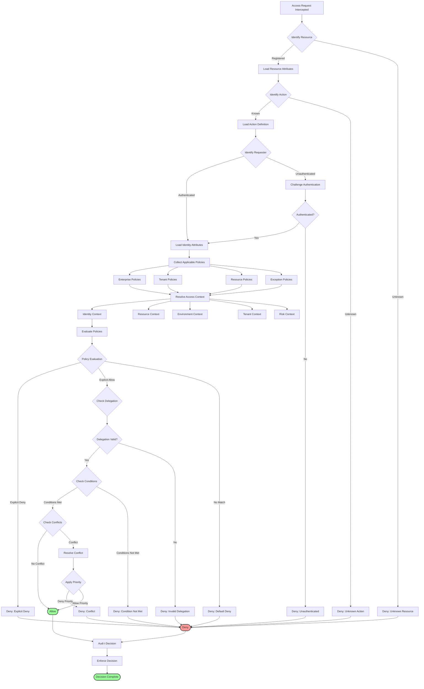
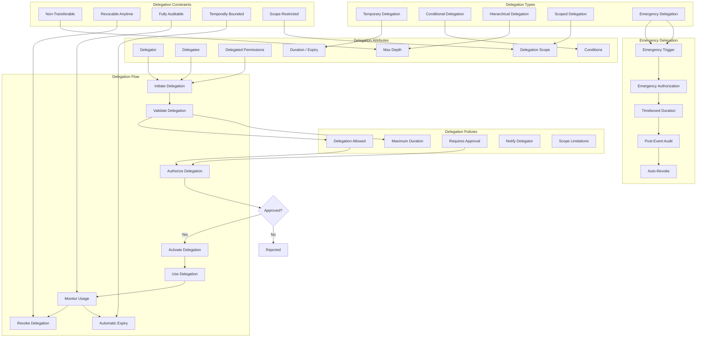
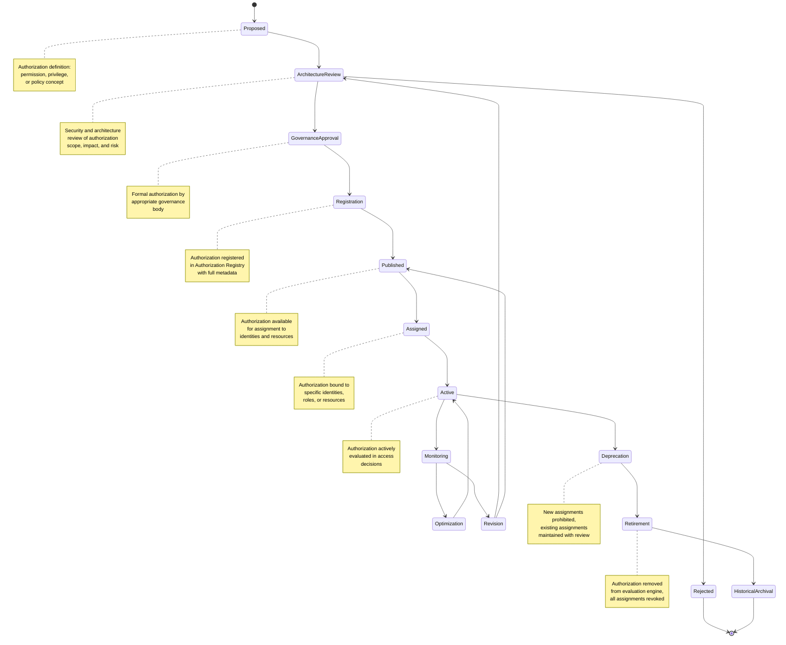
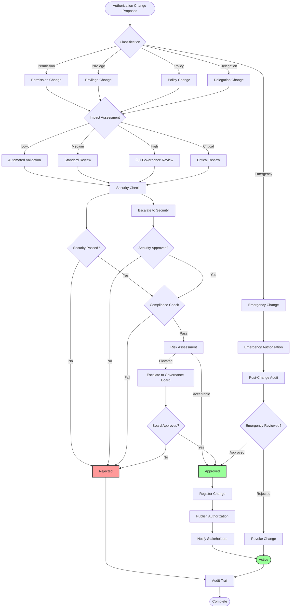
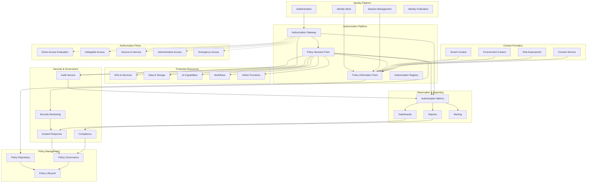

# KB-125 — Authorization Architecture

**Suite:** Enterprise Platform Services  
**Version:** 1.0  
**Status:** Approved Architecture  
**Classification:** Enterprise Security Architecture  
**Last Updated:** 2026-07-12

---

## Executive Summary

This document defines the enterprise architecture governing authorization across DUKADESK. The Enterprise Authorization Platform shall provide centralized authorization capabilities for evaluating access requests to all enterprise resources while ensuring security, governance, tenant isolation, Zero Trust, least privilege, policy compliance, auditability, and enterprise scalability.

Authentication verifies identity. Authorization governs what authenticated identities are permitted to do.

---

## Purpose

Define how DUKADESK governs authorization consistently across every enterprise capability while separating authorization from authentication, identity management, business logic, and application implementations.

---

## Scope

### In Scope

- Enterprise authorization architecture
- Authorization model
- Authorization services
- Permission architecture
- Privilege architecture
- Access policy architecture
- Resource authorization
- Delegated authorization
- Context-aware authorization
- Fine-grained authorization
- Authorization lifecycle
- Authorization governance
- Authorization auditing
- Authorization observability
- Authorization analytics
- Multi-tenant authorization
- Enterprise authorization federation
- Authorization evolution

### Out of Scope

- Authentication implementation
- Identity management implementation
- Policy engine implementation
- Business rules implementation
- Encryption implementation
- Runtime security implementation

*The above items are covered by dedicated Knowledge Base documents.*

---

## Architectural Principles

| # | Principle | Description |
|---|-----------|-------------|
| 1 | **Authorization by Default** | Every resource access requires explicit authorization. No implicit or inherited access is granted without explicit policy evaluation. |
| 2 | **Zero Trust** | No identity, service, or component is implicitly trusted. Every access request is authenticated, authorized, and audited regardless of origin. |
| 3 | **Least Privilege** | Every identity operates with the minimum permissions required for its function. No identity has unnecessary or excessive privileges. |
| 4 | **Deny by Default** | Access is denied unless explicitly granted by a governed policy. Absence of a granting policy results in denial. |
| 5 | **Policy-Driven Authorization** | All authorization decisions are governed by declarative policies. Authorization logic is never embedded in application code. |
| 6 | **Separation of Authentication and Authorization** | Authentication (verifying identity) and authorization (governing access) are architecturally distinct services with independent governance. |
| 7 | **Context-Aware Authorization** | Authorization decisions consider the full access context including identity, resource, action, environment, tenant, and risk posture. |
| 8 | **Multi-Tenant Isolation** | Authorization boundaries are strictly enforced per tenant. No cross-tenant access is granted without explicit policy. |
| 9 | **Vendor Independence** | Authorization models, policies, and evaluation are provider-agnostic, ensuring portability across authorization implementations. |
| 10 | **Technology Neutrality** | Authorization definitions and policies are expressed in technology-neutral formats. |
| 11 | **Auditability** | Every authorization decision is recorded in an immutable audit trail with full context for security review and compliance. |
| 12 | **Observability by Default** | Every authorization evaluation emits structured telemetry for security monitoring, governance, and operational insight. |
| 13 | **Enterprise Governance** | Authorization definitions, policies, and assignments are governed enterprise assets with defined lifecycle and ownership. |

---

## Canonical Definitions

| Term | Definition |
|------|------------|
| **Authorization** | The process of determining whether an authenticated identity is permitted to perform a specific action on a specific resource under specific conditions. |
| **Permission** | A declared allowance for an identity to perform a specific action on a specific resource or resource type. |
| **Privilege** | A higher-level authorization that grants permissions across multiple resources, actions, or contexts. |
| **Access Policy** | A declarative rule defining the conditions under which access to a resource is granted or denied. |
| **Protected Resource** | Any enterprise resource (data, API, service, capability, asset) that requires authorization for access. |
| **Authorization Decision** | The outcome of an authorization evaluation — Allow, Deny, or Defer (requiring additional evaluation). |
| **Access Request** | A structured request containing identity, action, resource, and context for authorization evaluation. |
| **Access Context** | The situational information surrounding an access request, including identity attributes, resource properties, environment, and governance factors. |
| **Authorization Scope** | The defined boundary within which a permission or privilege is applicable (e.g., tenant, organization, workspace). |
| **Authorization Boundary** | The architectural limit beyond which authorization is independently governed (e.g., tenant boundary, domain boundary). |
| **Delegated Authorization** | The temporary or conditional transfer of authorization authority from one identity to another within governed constraints. |
| **Fine-Grained Authorization** | Authorization that considers detailed attributes of the identity, resource, action, and context rather than broad role-based assignments. |
| **Authorization Governance** | The framework of policies, controls, reviews, and oversight mechanisms governing authorization definitions and decisions. |
| **Authorization Lifecycle** | The progression of an authorization definition through states from proposal through retirement. |
| **Authorization Registry** | The authoritative system of record for all governed authorization definitions, policies, and assignments. |
| **Authorization Portfolio** | The complete collection of authorization policies, permissions, and privileges managed within the enterprise. |
| **Least Privilege** | The principle that no identity has permissions beyond the minimum necessary for its legitimate functions. |
| **Deny by Default** | The principle that access is denied unless explicitly granted by an applicable policy. |
| **Access Evaluation** | The architectural process of collecting policies, resolving context, and rendering an authorization decision. |
| **Authorization Audit** | The immutable record of every authorization decision, policy change, and permission assignment. |

---

## Architecture

### 1. Enterprise Authorization Architecture

The Enterprise Authorization Platform provides centralized, policy-driven, context-aware authorization decisions for every resource access across DUKADESK.

```mermaid
graph TB
    subgraph "Access Request"
        AR_ID[Identity]
        AR_ACTION[Action]
        AR_RESOURCE[Resource]
        AR_CONTEXT[Context]
    end

    subgraph "Authorization Gateway"
        AG[Authorization Gateway]
        AG_AUTHN[Authentication Verification]
        AG_PIP[Policy Information Point]
        AG_PDP[Policy Decision Point]
        AG_PEP[Policy Enforcement Point]
    end

    subgraph "Policy Sources"
        PS_REPO[Policy Repository]
        PS_ENTERPRISE[Enterprise Policies]
        PS_TENANT[Tenant Policies]
        PS_DOMAIN[Domain Policies]
        PS_EXCEPTION[Exception Policies]
    end

    subgraph "Context Sources"
        CS_IDENTITY[Identity Attributes]
        CS_RESOURCE[Resource Attributes]
        CS_ENV[Environment Context]
        CS_TENANT[Tenant Context]
        CS_RISK[Risk Context]
        CS_CONSENT[Consent Status]
    end

    subgraph "Decision Evaluation"
        DE_POLICY[Policy Evaluator]
        DE_HIERARCHY[Hierarchy Resolver]
        DE_DELEGATION[Delegation Check]
        DE_OVERRIDE[Override Evaluator]
    end

    subgraph "Decision Output"
        DO_ALLOW[Allow]
        DO_DENY[Deny]
        DO_DEFER[Defer / Challenge]
        DO_CONDITIONAL[Conditional Allow]
    end

    subgraph "Audit & Observability"
        AO_AUDIT[Authorization Audit]
        AO_METRICS[Authorization Metrics]
        AO_ALERTS[Anomaly Alerts]
    end

    AR_ID --> AG
    AR_ACTION --> AG
    AR_RESOURCE --> AG
    AR_CONTEXT --> AG

    AG --> AG_AUTHN
    AG_AUTHN --> AG_PIP
    AG_PIP --> AG_PDP
    AG_PDP --> AG_PEP

    AG_PIP --> PS_REPO
    PS_REPO --> PS_ENTERPRISE
    PS_REPO --> PS_TENANT
    PS_REPO --> PS_DOMAIN
    PS_REPO --> PS_EXCEPTION

    AG_PIP --> CS_IDENTITY
    AG_PIP --> CS_RESOURCE
    AG_PIP --> CS_ENV
    AG_PIP --> CS_TENANT
    AG_PIP --> CS_RISK
    AG_PIP --> CS_CONSENT

    AG_PDP --> DE_POLICY
    DE_POLICY --> DE_HIERARCHY
    DE_HIERARCHY --> DE_DELEGATION
    DE_DELEGATION --> DE_OVERRIDE

    DE_POLICY --> DO_ALLOW
    DE_POLICY --> DO_DENY
    DE_POLICY --> DO_DEFER
    DE_POLICY --> DO_CONDITIONAL

    DE_OVERRIDE --> DO_ALLOW
    DE_OVERRIDE --> DO_DENY

    AG_PDP --> AO_AUDIT
    AG_PDP --> AO_METRICS

    AO_METRICS --> AO_ALERTS

    AG_PEP --> DO_ALLOW
    AG_PEP --> DO_DENY
    AG_PEP --> DO_DEFER

    subgraph "Authorization Pipeline"
        AP_COLLECT[Collect Policies]
        AP_RESOLVE[Resolve Context]
        AP_EVALUATE[Evaluate Rules]
        AP_COMBINE[Combine Decisions]
        AP_ENFORCE[Enforce Decision]
    end

    AG_PIP -.-> AP_COLLECT
    AG_PIP -.-> AP_RESOLVE
    AG_PDP -.-> AP_EVALUATE
    AG_PDP -.-> AP_COMBINE
    AG_PEP -.-> AP_ENFORCE
```

### 2. Authorization Domains

Authorization is organized into domains that collectively cover every resource and capability across DUKADESK.

```mermaid
graph TB
    ROOT[Authorization Domains]

    ROOT --> PLATFORM[Platform Authorization]
    ROOT --> TENANT[Tenant Authorization]
    ROOT --> APP[Application Authorization]
    ROOT --> STUDIO[Builder Studio Authorization]
    ROOT --> MARKET[Marketplace Authorization]
    ROOT --> RUNTIME[Runtime Authorization]
    ROOT --> AI_PLATFORM[AI Platform Authorization]
    ROOT --> INTEGRATION[Integration Authorization]
    ROOT --> DATA[Data Platform Authorization]
    ROOT --> ADMIN[Administrative Authorization]
    ROOT --> OPS[Operational Authorization]
    ROOT --> ENTERPRISE[Enterprise Services Authorization]

    PLATFORM --> P_SVC[Service Authorization]
    PLATFORM --> P_API[API Authorization]
    PLATFORM --> P_CONFIG[Configuration Authorization]
    PLATFORM --> P_FEATURE[Feature Authorization]

    TENANT --> T_SCOPE[Tenant Scope]
    TENANT --> T_RESOURCE[Tenant Resources]
    TENANT --> T_USER[Tenant User Authorization]
    TENANT --> T_ADMIN[Tenant Admin Authorization]

    APP --> A_FUNC[Functional Authorization]
    APP --> A_DATA[Application Data]
    APP --> A_ACTION[Application Actions]

    STUDIO --> BS_COMP[Component Authorization]
    STUDIO --> BS_TEMPLATE[Template Authorization]
    STUDIO --> BS_PUBLISH[Publish Authorization]
    STUDIO --> BS_ASSET[Asset Authorization]

    MARKET --> M_LIST[Listing Authorization]
    MARKET --> M_INSTALL[Install Authorization]
    MARKET --> M_PUBLISH[Publish Authorization]
    MARKET --> M_ACCESS[Access Authorization]

    RUNTIME --> R_DEPLOY[Deploy Authorization]
    RUNTIME --> R_EXECUTE[Execute Authorization]
    RUNTIME --> R_SCALE[Scale Authorization]

    AI_PLATFORM --> AI_MODEL[Model Authorization]
    AI_PLATFORM --> AI_AGENT[Agent Authorization]
    AI_PLATFORM --> AI_PROMPT[Prompt Authorization]
    AI_PLATFORM --> AI_DECISION[Decision Authorization]

    INTEGRATION --> I_CONN[Connector Authorization]
    INTEGRATION --> I_WEBHOOK[Webhook Authorization]
    INTEGRATION --> I_DATA[Data Flow Authorization]

    DATA --> D_READ[Data Read]
    DATA --> D_WRITE[Data Write]
    DATA --> D_DELETE[Data Delete]
    DATA --> D_ADMIN[Data Admin]

    ADMIN --> A_USER[User Admin]
    ADMIN --> A_BILL[Billing Admin]
    ADMIN --> A_AUDIT[Audit Admin]

    OPS --> O_MONITOR[Monitoring Access]
    OPS --> O_INCIDENT[Incident Access]
    OPS --> O_MAINT[Maintenance Access]

    ENTERPRISE --> E_WF[Workflow Authorization]
    ENTERPRISE --> E_SCHED[Schedule Authorization]
    ENTERPRISE --> E_NOTIFY[Notification Authorization]
    ENTERPRISE --> E_REPORT[Report Authorization]

    subgraph "Authorization Dimensions"
        D_PERM[Permission Type]
        D_POLICY[Policy Source]
        D_SCOPE[Authorization Scope]
        D_EFFECT[Effect: Allow / Deny]
        D_CONDITION[Conditions]
    end

    ROOT -.-> D_PERM
    ROOT -.-> D_POLICY
    ROOT -.-> D_SCOPE
    ROOT -.-> D_EFFECT
```

### 3. Authorization Decision Flow

Every access request flows through a structured authorization pipeline from collection through enforcement.

### 4. Protected Resource Architecture

Every enterprise resource that requires authorization is modeled with a standardized resource definition, classification, ownership, and protection requirements.

```mermaid
graph TB
    subgraph "Resource Categories"
        RC_DATA[Data Resources]
        RC_API[API Resources]
        RC_SERVICE[Service Resources]
        RC_WORKFLOW[Workflows]
        RC_AI[AI Capabilities]
        RC_FILE[Files & Documents]
        RC_TEMPLATE[Templates]
        RC_MARKET[Marketplace Assets]
        RC_CONFIG[Configuration]
        RC_ADMIN[Administrative Functions]
        RC_OPS[Platform Operations]
        RC_IDENTITY[Identity Resources]
    end

    subgraph "Resource Attributes"
        RA_ID[Resource ID]
        RA_TYPE[Resource Type]
        RA_OWNER[Resource Owner]
        RA_TENANT[Tenant Scope]
        RA_CLASS[Classification]
        RA_SENSITIVITY[Sensitivity]
        RA_PARENT[Parent Resource]
        RA_POLICIES[Applicable Policies]
    end

    subgraph "Authorization Requirements"
        AR_AUTH[Authentication Required]
        AR_ACTION[Permitted Actions]
        AR_SCOPE[Authorization Scope]
        AR_CONDITIONS[Access Conditions]
        AR_AUDIT[Audit Level]
        AR_APPROVAL[Approval Required]
    end

    subgraph "Resource Hierarchy"
        RH_ROOT[Platform Root]
        RH_TENANT[Tenant Scope]
        RH_ORG[Organization]
        RH_WS[Workspace]
        RH_APP[Application]
        RH_ENV[Environment]
        RH_ITEM[Resource Item]
    end

    subgraph "Protection Levels"
        PL_PUBLIC[Public: No Authorization]
        PL_INTERNAL[Internal: Platform Auth]
        PL_SENSITIVE[Sensitive: + Context]
        PL_CONFIDENTIAL[Confidential: + Approval]
        PL_RESTRICTED[Restricted: Strict Governance]
        PL_REGULATORY[Regulatory: Compliance Enforced]
    end

    RC_DATA --> RA_TYPE
    RC_API --> RA_TYPE
    RC_SERVICE --> RA_TYPE
    RC_WORKFLOW --> RA_TYPE
    RC_AI --> RA_TYPE
    RC_FILE --> RA_TYPE
    RC_TEMPLATE --> RA_TYPE
    RC_MARKET --> RA_TYPE

    RA_ID --> RA_TYPE
    RA_OWNER --> RA_POLICIES
    RA_CLASS --> RA_SENSITIVITY
    RA_TENANT --> AR_SCOPE

    RA_SENSITIVITY --> PL_INTERNAL
    RA_SENSITIVITY --> PL_SENSITIVE
    RA_SENSITIVITY --> PL_CONFIDENTIAL
    RA_SENSITIVITY --> PL_RESTRICTED
    RA_SENSITIVITY --> PL_REGULATORY

    AR_AUTH --> AR_ACTION
    AR_ACTION --> AR_SCOPE
    AR_SCOPE --> AR_CONDITIONS
    AR_CONDITIONS --> AR_AUDIT
    AR_CONDITIONS --> AR_APPROVAL

    RH_ROOT --> RH_TENANT
    RH_TENANT --> RH_ORG
    RH_ORG --> RH_WS
    RH_WS --> RH_APP
    RH_APP --> RH_ENV
    RH_ENV --> RH_ITEM

    RA_PARENT --> RH_ROOT
    RA_PARENT --> RH_TENANT

    subgraph "Action Taxonomy"
        AT_CREATE[Create]
        AT_READ[Read]
        AT_UPDATE[Update]
        AT_DELETE[Delete]
        AT_EXECUTE[Execute]
        AT_ADMIN[Administer]
        AT_DELEGATE[Delegate]
        AT_PUBLISH[Publish]
    end

    AR_ACTION --> AT_CREATE
    AR_ACTION --> AT_READ
    AR_ACTION --> AT_UPDATE
    AR_ACTION --> AT_DELETE
    AR_ACTION --> AT_EXECUTE
    AR_ACTION --> AT_ADMIN
    AR_ACTION --> AT_DELEGATE
    AR_ACTION --> AT_PUBLISH
```

### 5. Delegated Authorization Model

Delegated authorization governs the temporary, conditional, or hierarchical transfer of authorization authority within governed constraints.

### 6. Authorization Lifecycle

Every authorization definition progresses through a defined lifecycle with gated transitions ensuring governance and security at every stage.

### 7. Authorization Governance Structure

Authorization governance is enforced through a structured framework spanning ownership, policy compliance, security review, and audit.

### 8. Enterprise Authorization Operating Model

The Authorization Operating Model defines how authorization services interact with identity, policy, security, audit, and protected resources.

### 9. Authorization Ecosystem

The Authorization Ecosystem provides a holistic view of all authorization components, stakeholders, and enterprise integrations.

```mermaid
graph TB
    subgraph "Authorization Platform"
        AZ_GW[Authorization Gateway]
        AZ_PDP[Policy Decision Point]
        AZ_PIP[Policy Information Point]
        AZ_REG[Authorization Registry]
        AZ_CAT[Authorization Catalog]
    end

    subgraph "Identity & Access"
        ID_AUTH[Authentication Service]
        ID_STORE[Identity Store]
        ID_ROLE[Role Management]
        ID_GROUP[Group Management]
    end

    subgraph "Policy Sources"
        PS_ENT[Enterprise Policies]
        PS_TENANT[Tenant Policies]
        PS_RES[Resource Policies]
        PS_EXCEPTION[Exception Policies]
        PS_DELEGATION[Delegation Policies]
    end

    subgraph "Protected Resources"
        PR_SVC[Platform Services]
        PR_APP[Applications]
        PR_TENANT[Tenant Resources]
        PR_AI[AI Capabilities]
        PR_DATA[Data Resources]
        PR_WF[Workflows]
        PR_MARKET[Marketplace]
        PR_STUDIO[Builder Studio]
    end

    subgraph "Governance & Security"
        GS_GOV[Authorization Governance]
        GS_SEC[Security Team]
        GS_COMP[Compliance]
        GS_AUDIT[Audit Service]
        GS_RISK[Risk Management]
    end

    subgraph "Observability"
        OBS_METRICS[Authorization Metrics]
        OBS_DASH[Dashboards]
        OBS_ALERTS[Alerting]
        OBS_REPORTS[Reports]
    end

    subgraph "Stakeholders"
        SH_OWNER[Policy Owners]
        SH_ADMIN[Security Admins]
        SH_TENANT[Tenant Admins]
        SH_AUDITOR[Auditors]
        SH_CONSUMER[Resource Consumers]
    end

    AZ_GW --> AZ_PDP
    AZ_PDP --> AZ_PIP
    AZ_PIP --> AZ_REG
    AZ_REG --> AZ_CAT

    ID_AUTH --> AZ_GW
    ID_STORE --> AZ_PIP
    ID_ROLE --> AZ_PIP
    ID_GROUP --> AZ_PIP

    PS_ENT --> AZ_PIP
    PS_TENANT --> AZ_PIP
    PS_RES --> AZ_PIP
    PS_EXCEPTION --> AZ_PIP
    PS_DELEGATION --> AZ_PIP

    AZ_PDP --> PR_SVC
    AZ_PDP --> PR_APP
    AZ_PDP --> PR_TENANT
    AZ_PDP --> PR_AI
    AZ_PDP --> PR_DATA
    AZ_PDP --> PR_WF
    AZ_PDP --> PR_MARKET
    AZ_PDP --> PR_STUDIO

    GS_GOV --> PS_ENT
    GS_SEC --> PS_EXCEPTION
    GS_COMP --> PS_ENT
    GS_AUDIT --> AZ_PDP
    GS_RISK --> AZ_PIP

    AZ_PDP --> OBS_METRICS
    AZ_GW --> OBS_METRICS
    OBS_METRICS --> OBS_DASH
    OBS_METRICS --> OBS_ALERTS
    OBS_METRICS --> OBS_REPORTS

    SH_OWNER --> PS_ENT
    SH_ADMIN --> GS_GOV
    SH_TENANT --> PS_TENANT
    SH_AUDITOR --> GS_AUDIT
    SH_CONSUMER --> PR_SVC

    OBS_DASH --> SH_ADMIN
    OBS_REPORTS --> SH_AUDITOR
    OBS_REPORTS --> GS_COMP
    OBS_ALERTS --> GS_SEC

    subgraph "Authorization Patterns"
        PAT_RBAC[Role-Based Access Control]
        PAT_ABAC[Attribute-Based Access Control]
        PAT_RGBAC[Resource-Based Access Control]
        PAT_PBAC[Policy-Based Access Control]
        PAT_HYBRID[Hybrid: RBAC + ABAC]
    end

    AZ_PDP -.-> PAT_RBAC
    AZ_PDP -.-> PAT_ABAC
    AZ_PDP -.-> PAT_HYBRID
```

### 10. Authorization Portfolio Architecture

The Authorization Portfolio provides enterprise-wide visibility into all authorization definitions, policies, assignments, and governance status.

```mermaid
graph TB
    subgraph "Authorization Registry"
        REG[Registry Core]
        STORE[Authorization Store]
        EVT[Authorization Change Events]
    end

    subgraph "Authorization Catalog"
        CAT[Catalog Service]
        SEARCH[Search & Discovery]
        CLASS[Classification Engine]
        REL[Relationship Mapper]
    end

    subgraph "Portfolio Views"
        V_PERM[Permission View]
        V_PRIV[Privilege View]
        V_POLICY[Policy View]
        V_ASSIGN[Assignment View]
        V_DOMAIN[Domain View]
        V_RISK[Risk View]
        V_GOV[Governance View]
    end

    subgraph "Analytics & Insights"
        AN_UTIL[Utilization Analytics]
        AN_COVERAGE[Coverage Analysis]
        AN_GAP[Gap Analysis]
        AN_EXCESS[Excessive Privilege]
        AN_ANOMALY[Anomaly Detection]
    end

    subgraph "Portfolio Governance"
        PG_OWNER[Ownership Gaps]
        PG_ORPHAN[Orphaned Permissions]
        PG_STALE[Stale Permissions]
        PG_CONFLICT[Policy Conflicts]
        PG_COMPLIANCE[Compliance Status]
        PG_REVIEW[Review Cadence]
    end

    subgraph "Reporting"
        RP_EXEC[Executive Reports]
        RP_SEC[Security Reports]
        RP_COMP[Compliance Reports]
        RP_ARCH[Architecture Reports]
        RP_TREND[Trend Analysis]
    end

    REG --> STORE
    REG --> EVT

    REG --> CAT
    CAT --> SEARCH
    CAT --> CLASS
    CAT --> REL

    REG --> V_PERM
    REG --> V_PRIV
    REG --> V_POLICY
    REG --> V_ASSIGN
    REG --> V_DOMAIN
    REG --> V_RISK
    REG --> V_GOV

    REG --> AN_UTIL
    REG --> AN_COVERAGE
    REG --> AN_GAP
    REG --> AN_EXCESS
    REG --> AN_ANOMALY

    REG --> PG_OWNER
    REG --> PG_ORPHAN
    REG --> PG_STALE
    REG --> PG_CONFLICT
    REG --> PG_COMPLIANCE
    REG --> PG_REVIEW

    AN_UTIL --> RP_EXEC
    AN_COVERAGE --> RP_ARCH
    AN_GAP --> RP_ARCH
    AN_EXCESS --> RP_SEC
    AN_ANOMALY --> RP_SEC
    PG_COMPLIANCE --> RP_COMP
    PG_CONFLICT --> RP_ARCH
    PG_STALE --> RP_SEC

    V_RISK --> RP_SEC
    V_GOV --> RP_COMP

    EVT -.-> AN_ANOMALY
    EVT -.-> PG_CONFLICT
    REL -.-> V_PERM
    CLASS -.-> V_DOMAIN

    subgraph "Portfolio Dimensions"
        PD_COUNT[Permission Count]
        PD_POLICIES[Policy Count]
        PD_ASSIGN[Assignment Count]
        PD_COVERAGE[Coverage Rate]
        PD_EXCESS[Excessive Privilege]
        PD_COMPLIANCE[Compliance Rate]
    end

    RP_EXEC -.-> PD_COUNT
    RP_EXEC -.-> PD_COVERAGE
    RP_SEC -.-> PD_EXCESS
    RP_COMP -.-> PD_COMPLIANCE
```

---

## Lifecycle

| Phase | Description | Gates |
|-------|-------------|-------|
| **Proposal** | Authorization concept documented with scope, effect, target resources, and business justification. | Proposal completeness check |
| **Architecture Review** | Security and architecture evaluation of authorization scope, risk, and alignment with principles. | Architecture review sign-off |
| **Governance Approval** | Formal authorization by appropriate governance body based on risk classification. | Governance approval |
| **Registration** | Authorization registered in Authorization Registry with full metadata, policies, and scope. | Registry entry verified |
| **Publication** | Authorization published and made available for assignment to identities and resources. | Publication validation |
| **Assignment** | Authorization bound to specific identities, roles, groups, or resources. | Assignment verification |
| **Consumption** | Authorization actively evaluated in access decisions across the platform. | Consumption readiness |
| **Monitoring** | Continuous observation of authorization usage, effectiveness, and compliance. | Health criteria met |
| **Optimization** | Authorization refined based on usage patterns, security analysis, and governance review. | Optimization approval |
| **Revision** | Authorization modified through change management workflow. | Change approval |
| **Deprecation** | Authorization marked deprecated; new assignments prohibited; existing assignments maintained. | Deprecation notice |
| **Retirement** | Authorization removed from evaluation engine; all assignments revoked; consumers notified. | Retirement authorization |
| **Historical Archival** | Authorization metadata and audit records archived for governance and compliance. | Archive completion |

---

## Governance

| Domain | Governance Mechanism | Responsible Body |
|--------|---------------------|------------------|
| **Authorization Ownership** | Every authorization definition has a registered owner accountable for scope, policy compliance, and lifecycle. | Enterprise Architecture |
| **Permission Governance** | Permissions are governed to prevent excessive privilege, scope creep, and unauthorized combinations. | Security |
| **Privilege Governance** | Elevated privileges require enhanced governance, time-boxed assignments, and periodic review. | Security |
| **Security Governance** | Authorization definitions, policies, and assignments undergo security review. | Security |
| **Compliance Governance** | Authorizations in regulated domains undergo compliance validation. | Compliance |
| **Architecture Governance** | New authorization domains and major changes require Architecture Board review. | Architecture Review Board |
| **Lifecycle Governance** | Lifecycle transitions are gated with validation. Non-compliant transitions are blocked and audited. | Enterprise Architecture |
| **Audit Governance** | Authorization operations are subject to independent audit for effectiveness and compliance. | Internal Audit |
| **Risk Governance** | Authorization risk classification determines governance depth, review frequency, and approval requirements. | Risk Management |
| **Enterprise Governance** | Authorization portfolio governance ensures alignment with enterprise security posture and risk appetite. | Policy Governance Board |

---

## Responsibilities

| Role | Responsibilities |
|------|-----------------|
| **Enterprise Architecture** | Define authorization model, domains, principles, and governance standards; conduct architecture reviews. |
| **Security** | Define authorization security policies; perform security reviews; monitor for excessive privilege and anomalies. |
| **Identity Management** | Provide identity attributes and authentication context for authorization decisions; manage role and group definitions. |
| **Platform Engineering** | Build and maintain Authorization Gateway, PDP, PIP, Registry, and observability tooling. |
| **Policy Governance Board** | Govern authorization policies; approve high-risk authorization changes; review authorization incidents. |
| **Compliance** | Conduct compliance reviews of authorization definitions; verify regulatory alignment of access controls. |
| **AI Governance Board** | Review authorization models for AI capabilities; ensure AI access control aligns with responsible AI principles. |
| **Product Teams** | Define resource authorization requirements; manage authorization lifecycle for product capabilities. |
| **Operations** | Monitor authorization health, decision latency, and anomaly alerts; respond to authorization incidents. |
| **Tenant Administrators** | Manage tenant-level authorization policies; assign tenant permissions; monitor tenant access patterns. |

---

## Security

| Control Area | Architecture |
|-------------|--------------|
| **Least Privilege** | Every identity operates with minimum permissions. Authorization definitions are reviewed for excessive privilege. |
| **Deny by Default** | All access is denied unless explicitly granted by a governed policy. Absence of policy results in denial. |
| **Zero Trust** | No identity, service, or component is implicitly trusted. Every access request is authorized regardless of origin. |
| **Identity-Aware Authorization** | Authorization decisions consider full identity context including authentication strength, session state, and risk factors. |
| **Secure Delegation** | Delegated authorization is time-bounded, non-transferable, fully auditable, and revocable at any time. |
| **Tenant Isolation** | Authorization boundaries are strictly enforced per tenant. Cross-tenant access requires explicit policy. |
| **Policy Enforcement** | Authorization policies are evaluated at runtime. Policies cannot be bypassed by any consumer. |
| **Auditability** | Every authorization decision is recorded with identity, resource, action, context, and decision. |
| **Provenance** | Every authorization definition is traceable to its owner, approver, and lifecycle history. |
| **Authorization Integrity** | Authorization policies and definitions are cryptographically signed. Tampering is detectable and alerted. |

---

## Privacy

| Domain | Architecture |
|--------|--------------|
| **Privacy-Aware Authorization** | Authorization decisions minimize exposure of personal data in access context. Privacy policies govern access to personal data. |
| **Consent-Aware Resource Access** | Authorization policies consider consent status when governing access to personal data resources. |
| **Data Minimization** | Authorization context collects only data necessary for decision-making. Sensitivity classifications determine retention. |
| **Regulatory Compliance** | Authorizations in regulated domains are tagged with compliance markers and subject to regulatory policies. |
| **Regional Governance** | Authorization policies support region-specific access controls while maintaining enterprise minimum standards. |
| **Cross-Border Restrictions** | Authorization policies enforce cross-border data access restrictions. |
| **Audit Retention** | Authorization audit logs are retained per regulatory requirements with privacy-preserving anonymisation where appropriate. |
| **Privacy Assurance** | Authorization platform undergoes periodic privacy impact assessments. |

---

## Performance

| Consideration | Architectural Approach |
|---------------|----------------------|
| **Low-Latency Authorization** | Authorization decisions target sub-millisecond evaluation for standard requests through cached policy resolution. |
| **Enterprise-Scale Evaluation** | Authorization platform scales horizontally across decision points. Throughput scales linearly with capacity. |
| **High Availability** | Authorization Platform components are deployed across multiple availability zones. Decision points operate in active-active configuration. |
| **Elastic Scalability** | Authorization evaluation scales elastically with access request volume. Burst capacity handles peak loads. |
| **Multi-Region Readiness** | Authorization decisions are evaluated at regional edge points with local policy caching for low-latency global access. |
| **Operational Resilience** | Consumers operate with cached authorization decisions during platform outages. Cached decisions respect TTL and revocation. |
| **Distributed Authorization** | Authorization decisions are made at the point of access with minimal coordination overhead. Cross-domain decisions use asynchronous evaluation. |
| **Efficient Policy Resolution** | Policies are indexed and pre-compiled for efficient evaluation. Policy changes trigger targeted cache invalidation. |

---

## Observability

| Domain | Architecture |
|--------|--------------|
| **Authorization Metrics** | Decision volume, allow/deny ratio, latency percentiles, policy evaluation counts, and cache hit rates are tracked. |
| **Permission Analytics** | Permission usage frequency, unused permissions, excessive privilege indicators, and permission drift are analyzed. |
| **Access Dashboards** | Role-specific dashboards expose access patterns, denied request analysis, anomaly detection, and security posture. |
| **Governance Reporting** | Authorization governance reports summarize ownership coverage, review cadence, compliance status, and policy health. |
| **Audit Reporting** | Authorization audit trails are queryable for security investigations, compliance reviews, and incident analysis. |
| **Security Dashboards** | Security-specific views highlight denied access attempts, privilege escalation attempts, anomalous patterns, and policy violations. |
| **Policy Utilization** | Policy utilization rates, policy conflict detection, and policy effectiveness metrics are measured. |
| **SLA Monitoring** | Authorization decision SLAs (latency, availability, throughput) are monitored per tier. Breaches trigger escalation. |
| **Executive Reporting** | Enterprise authorization health, security posture, risk indicators, and strategic recommendations are reported to leadership. |
| **Enterprise Security Insights** | Aggregate authorization analytics provide enterprise-wide visibility into access governance effectiveness. |

---

## Failure Scenarios

| Scenario | Architectural Response |
|----------|-----------------------|
| **Authorization Failures** | Authorization service failure triggers deny-by-default behavior. All access is denied until authorization is restored. |
| **Permission Conflicts** | Conflict detection at policy evaluation. Priority-based resolution with explicit deny taking precedence over allow. |
| **Unauthorized Access** | Authorization denial at enforcement point. Attempt is logged, audited, and escalated to security. |
| **Delegation Failures** | Delegation validation failure results in denied access. Delegator and delegatee are notified. Audit trail captures failure. |
| **Cross-Tenant Access** | Cross-tenant access attempt denied at authorization boundary. Incident is logged and escalated immediately. |
| **Policy Inconsistencies** | Inconsistency detection triggers policy review. Most restrictive policy is applied during investigation. |
| **Authorization Service Outage** | Deny-by-default behavior activates. Emergency bypass workflow requires multi-party authorization. Full audit of bypass actions. |
| **Governance Violations** | Governance validation failure blocks authorization change. Violation is logged, audited, and escalated. |
| **Audit Failures** | Audit service failure does not block authorization decisions. Audit records are queued for asynchronous processing. |
| **Security Breaches** | Anomalous authorization patterns trigger automatic policy lockdown. Incident response workflow is activated. |
| **Privilege Escalation** | Escalation attempt is detected and blocked. Attempt is logged, audited, and escalated to security with full context. |
| **Recovery Failure** | Recovery actions that fail trigger escalation to security operations. Manual intervention path with full context is provided. |

---

## Anti-Patterns

| Anti-Pattern | Prohibited Because | Enforced By |
|--------------|-------------------|-------------|
| **Hardcoded Permissions** | Embeds authorization logic in application code, preventing governance, audit, and policy-driven changes. | Code review; architecture enforcement |
| **Application-Owned Authorization** | Fragments authorization governance, creates inconsistency, and prevents enterprise visibility. | Centralized authorization enforcement |
| **Shared Administrator Privileges** | Violates least privilege, prevents accountability, and creates security risk. | Privilege governance enforcement |
| **Hidden Authorization Logic** | Undisclosed authorization rules bypass governance, audit, and security review. | Authorization Registry enforcement |
| **Authorization Without Governance** | Permissions operating without governance create security and compliance risk. | Governance enforcement at every layer |
| **Manual Permission Management** | Introduces human error, inconsistency, and audit gaps. | Automated authorization platform |
| **Implicit Authorization** | Authorization granted without explicit policy evaluation bypasses governance and audit. | Deny-by-default enforcement |
| **Cross-Tenant Privilege Inheritance** | Violates tenant isolation and creates cross-tenant access risk. | Tenant boundary enforcement |
| **Authorization Bypass** | Mechanisms allowing access without authorization evaluation violate Zero Trust. | Architectural prevention at every layer |
| **Default Allow Behavior** | Allowing access when no policy matches contradicts deny-by-default principle. | Default deny enforcement |

---

## Future Evolution

| Evolution Path | Architectural Preparation |
|---------------|--------------------------|
| **Adaptive Authorization** | Authorization policies evolve to dynamically adjust based on risk context, user behavior, and environmental conditions. |
| **AI-Assisted Authorization Governance** | Authorization analytics enable AI-driven excessive privilege detection, policy recommendations, and anomaly identification. |
| **Risk-Aware Authorization** | Authorization decisions incorporate real-time risk assessment, adjusting access based on threat posture. |
| **Federated Authorization Ecosystems** | Authorization architecture supports federated access control across organizational boundaries and external platforms. |
| **Dynamic Privilege Optimization** | Privileges are dynamically adjusted based on actual usage patterns, automatically revoking unused permissions. |
| **Cross-Platform Authorization Federation** | Standardized authorization interfaces enable consistent access control across federated DUKADESK instances. |
| **Autonomous Authorization Recommendations** | Authorization analytics provide autonomous recommendations for permission optimization and policy improvement. |
| **Enterprise Security Intelligence** | Authorization data feeds enterprise security intelligence for proactive threat detection and response. |

---

## Cross References

| Document ID | Title | Relation |
|-------------|-------|----------|
| **KB-005** | Identity & Access Management Architecture | Defines identity management that provides authentication context for authorization decisions. |
| **KB-086** | Data Privacy & Compliance Architecture | Defines data privacy policies enforced by authorization controls. |
| **KB-098** | Integration Policy Architecture | Defines integration policies that govern authorization for integration resources. |
| **KB-099** | Secrets & Credential Management Architecture | Defines credential management for authorization service identity verification. |
| **KB-107** | Enterprise Platform Services Overview Architecture | Defines the platform services context within which Authorization operates. |
| **KB-123** | Enterprise Policy Framework Architecture | Defines the policy framework within which authorization policies are defined. |
| **KB-124** | Policy Management Architecture | Defines the policy lifecycle management used for authorization policies. |
| **KB-126** | Audit & Compliance Architecture | Defines audit and compliance frameworks consumed by authorization audit. |
| **KB-130** | Risk Management Architecture | Defines risk management framework informing authorization risk assessment. |
| **KB-140** | Enterprise Platform Services Reference Architecture | Defines the overarching reference architecture for enterprise platform services. |

---

## Acceptance Criteria

- [x] Defines the canonical Enterprise Authorization architecture.
- [x] Separates authorization from authentication and implementation.
- [x] Defines permissions, privileges, governance, delegation, lifecycle, observability, and enterprise authorization services.
- [x] Supports enterprise-scale, multi-tenant, Zero Trust, vendor-independent authorization.
- [x] Includes all 10 required Mermaid diagrams.
- [x] Cross-references related Knowledge Base documents.
- [x] Contains no implementation guidance.

---

## Completion Instructions

1. **Mark KB-125 as Completed** — This document constitutes the completed architecture specification.
2. **Update the Progress Registry** — Record KB-125 as Approved Architecture in the Knowledge Base registry.
3. **Cross-Reference Related Documents** — Ensure KB-123 through KB-126 reference this document.
4. **Queue Next Assignment** — KB-126 – Audit & Compliance Architecture is the next builder assignment.

---

## Critical DUKADESK Architectural Rule

> **Every access request within DUKADESK shall be evaluated exclusively through the centralized Enterprise Authorization Platform using governed policies, verified identities, contextual information, and least-privilege principles. No application, service, workflow, AI capability, integration, tenant, or runtime component shall implement independent authorization logic outside the canonical enterprise authorization architecture, ensuring consistent, secure, auditable, and policy-driven access control across the platform.**

(End of file — total lines may exceed display)
