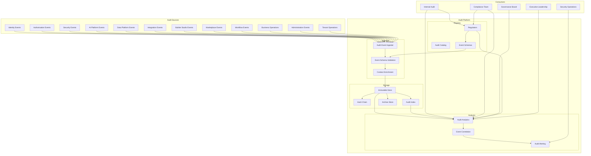
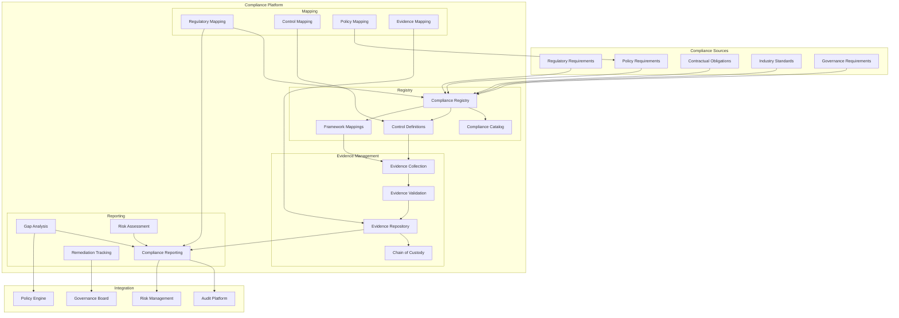
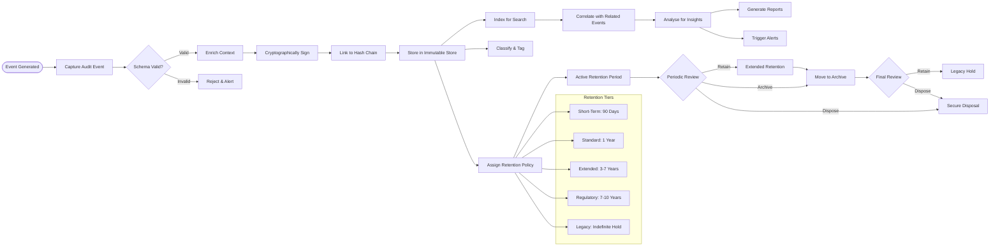
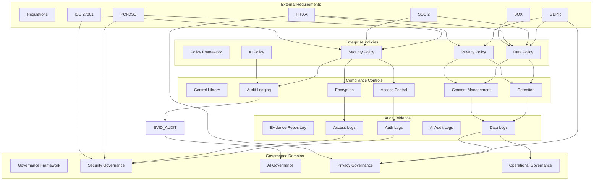
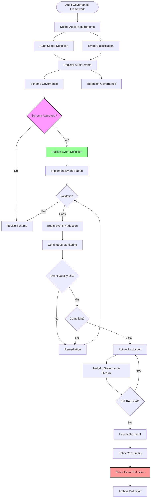
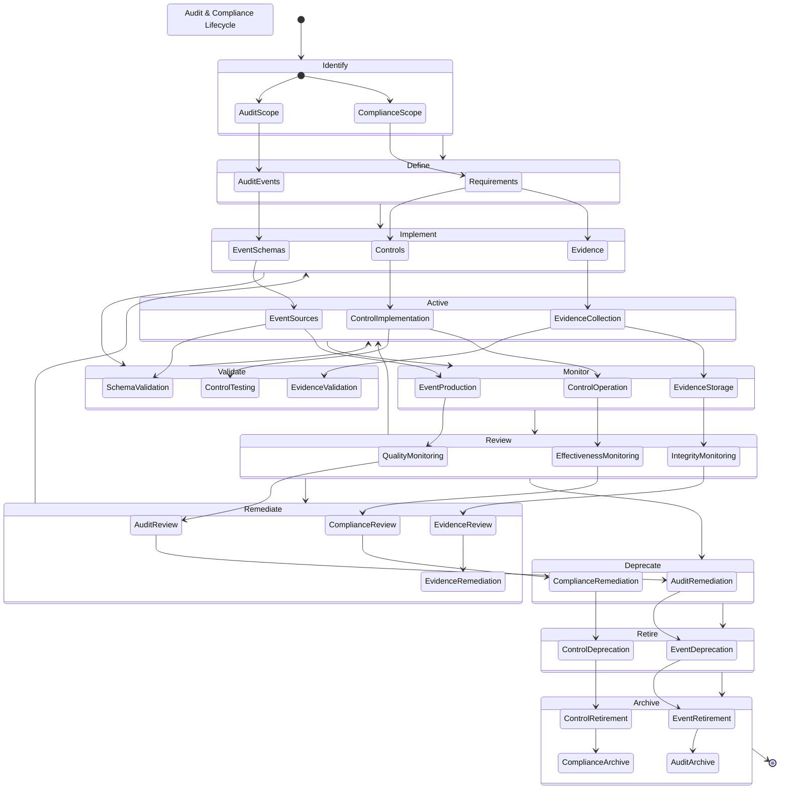
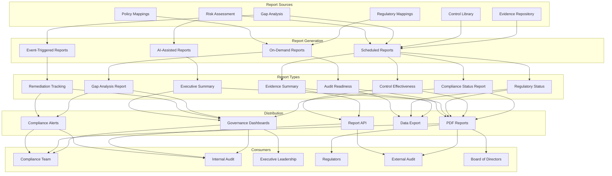

# KB-126 — Audit & Compliance Architecture

**Suite:** Enterprise Platform Services  
**Version:** 1.0  
**Status:** Approved Architecture  
**Classification:** Enterprise Governance & Security Architecture  
**Last Updated:** 2026-07-12

---

## Executive Summary

This document defines the enterprise architecture governing auditability and compliance across DUKADESK. The Enterprise Audit & Compliance Platform provides centralised capabilities for recording, preserving, analysing, governing, and reporting enterprise activities while demonstrating compliance with internal governance, contractual obligations, regulatory requirements, industry standards, and organisational policies.

Auditability is treated as an inherent architectural capability rather than an application-specific feature.

---

## Purpose

Define how DUKADESK ensures comprehensive auditability, governance transparency, compliance assurance, regulatory readiness, and enterprise accountability across every platform capability.

---

## Scope

### In Scope

- Enterprise audit architecture
- Compliance architecture
- Audit event architecture
- Audit registry
- Audit taxonomy
- Compliance registry
- Evidence management
- Audit lifecycle
- Compliance lifecycle
- Regulatory mapping
- Compliance governance
- Audit governance
- Audit reporting
- Compliance reporting
- Audit analytics
- Compliance analytics
- Retention governance
- Chain of custody
- Enterprise accountability
- Audit evolution

### Out of Scope

- Logging implementation
- Monitoring implementation
- SIEM implementation
- Regulatory implementation specifics
- Security infrastructure implementation
- Data storage implementation

*The above items are addressed by dedicated Knowledge Base documents (see Cross References).*

---

## Architectural Principles

| # | Principle | Description |
|---|-----------|-------------|
| 1 | **Audit by Design** | Auditability is an inherent property of every platform capability, not a retrofitted feature. |
| 2 | **Compliance by Design** | Compliance controls are embedded in platform architecture from inception, not applied after deployment. |
| 3 | **Immutable Audit Records** | Audit records are write-once, immutable, and tamper-evident. No modification or deletion is permitted. |
| 4 | **Evidence Integrity** | Compliance evidence is cryptographically verifiable. Integrity is maintained throughout the evidence lifecycle. |
| 5 | **Traceability** | Every audit event is traceable to its source, context, identity, and causal chain across the enterprise. |
| 6 | **Accountability** | Every significant activity is attributable to a specific identity with defined accountability. |
| 7 | **Non-Repudiation** | Audit records provide cryptographic non-repudiation for actions, approvals, and governance decisions. |
| 8 | **Separation of Duties** | Audit and compliance functions are independent from the activities they record. No conflict of interest. |
| 9 | **Zero Trust** | No component, identity, or system is trusted to produce correct audit records without verification. |
| 10 | **Privacy by Design** | Audit and compliance capabilities respect privacy requirements, data minimisation, and consent. |
| 11 | **Vendor Independence** | Audit and compliance models are provider-agnostic, supporting any storage or analysis backend. |
| 12 | **Technology Neutrality** | Audit schemas and compliance frameworks are expressed in technology-neutral formats. |
| 13 | **Lifecycle Governance** | Audit records and compliance evidence progress through governed lifecycles with retention and disposal policies. |

---

## Canonical Definitions

| Term | Definition |
|------|------------|
| **Audit** | The systematic recording, preservation, and analysis of enterprise activities for governance, security, compliance, and accountability purposes. |
| **Audit Event** | A structured, timestamped, immutable record of a specific enterprise activity with defined schema, source, identity, and context. |
| **Audit Trail** | A chronologically ordered, cryptographically linked sequence of audit events providing a tamper-evident history of activities. |
| **Audit Registry** | The authoritative system of record for audit event definitions, schemas, sources, and governance policies. |
| **Compliance** | The state of conforming to internal policies, contractual obligations, regulatory requirements, and industry standards. |
| **Compliance Control** | A defined measure, policy, or procedure implemented to achieve a specific compliance objective. |
| **Compliance Evidence** | A verifiable record demonstrating the implementation and effectiveness of a compliance control. |
| **Regulatory Requirement** | An externally mandated obligation from laws, regulations, or standards that the enterprise must satisfy. |
| **Audit Scope** | The defined boundary of activities, systems, domains, and time periods subject to audit. |
| **Compliance Scope** | The defined set of requirements, controls, and obligations applicable to a specific domain or activity. |
| **Audit Record** | A single immutable entry within an audit trail, comprising an audit event with full metadata. |
| **Chain of Custody** | The documented, verifiable history of audit evidence custody from creation through preservation and analysis. |
| **Non-Repudiation** | The assurance that an actor cannot deny having performed an action, supported by cryptographic proof. |
| **Compliance Mapping** | The documented relationship between enterprise controls, policies, standards, regulations, and evidence. |
| **Audit Lifecycle** | The progression of audit data from event generation through registration, preservation, analysis, and disposal. |
| **Compliance Lifecycle** | The progression of compliance obligations from identification through implementation, evidence, and review. |
| **Audit Governance** | The framework of policies, standards, and reviews governing enterprise audit operations. |
| **Compliance Governance** | The framework of policies, standards, and reviews governing enterprise compliance operations. |
| **Evidence Repository** | The secured, governed storage system for compliance evidence with integrity, retention, and access controls. |
| **Accountability** | The obligation of an identified entity to answer for their actions, decisions, and outcomes within the enterprise. |

---

## Architecture

### 1. Enterprise Audit Architecture

The Enterprise Audit Platform provides a centralised, immutable, tamper-evident capability for recording, preserving, and analysing enterprise audit events across all platform domains.

### 2. Enterprise Compliance Architecture

The Enterprise Compliance Platform provides a centralised capability for managing compliance obligations, controls, evidence, and reporting across all regulatory and governance frameworks.

### 3. Audit Taxonomy

Audit events are classified by domain, severity, sensitivity, and regulatory relevance, enabling consistent governance, retention, and analysis.

```mermaid
graph TD
    Root[Audit Event Taxonomy]

    Root --> ID[Identity & Access]
    ID --> ID_AUTHN[Authentication Events]
    ID --> ID_AUTHZ[Authorisation Events]
    ID --> ID_PROV[Provisioning]
    ID --> ID_DEPROV[Deprovisioning]
    ID --> ID_MFA[MFA Events]
    ID --> ID_CRED[Credential Events]

    Root --> SEC[Security]
    SEC --> SEC_THRT[Threat Detection]
    SEC --> SEC_INC[Incident Response]
    SEC --> SEC_POL[Policy Violations]
    SEC --> SEC_VULN[Vulnerability]
    SEC --> SEC_NET[Network Events]

    Root --> AI[AI Platform]
    AI --> AI_MODEL[Model Invocations]
    AI --> AI_SAFETY[Safety Violations]
    AI --> AI_BIAS[Bias Detection]
    AI --> AI_GOV[Governance Events]
    AI --> AI_ESC[Escalation Events]

    Root --> DATA[Data Platform]
    DATA --> DATA_ACCESS[Data Access]
    DATA --> DATA_EXPORT[Data Export]
    DATA --> DATA_MOD[Data Modification]
    DATA --> DATA_SHARE[Data Sharing]
    DATA --> DATA_RET[Retention Events]

    Root --> INT[Integration Platform]
    INT --> INT_CONN[Connector Events]
    INT --> INT_XFER[Data Transfer]
    INT --> INT_FAIL[Integration Failures]

    Root --> ADMIN[Administration]
    ADMIN --> ADMIN_CONF[Configuration Changes]
    ADMIN --> ADMIN_POL[Policy Changes]
    ADMIN --> ADMIN_ROLE[Role Changes]
    ADMIN --> ADMIN_TEN[Tenant Changes]

    Root --> WF[Workflow]
    WF --> WF_EXEC[Workflow Execution]
    WF --> WF_APPROVAL[Approval Actions]
    WF --> WF_OVERRIDE[Human Override]
    WF --> WF_FAIL[Workflow Failures]

    Root --> BIZ[Business Operations]
    BIZ --> BIZ_FIN[Financial Events]
    BIZ --> BIZ_ORD[Order Events]
    BIZ --> BIZ_CUST[Customer Events]

    Root --> BS[Builder Studio]
    BS --> BS_PUB[Publication Events]
    BS --> BS_MOD[Module Events]
    BS --> BS_ASSET[Asset Events]

    Root --> MKT[Marketplace]
    MKT --> MKT_LIST[Listing Events]
    MKT --> MKT_TXN[Transaction Events]
    MKT --> MKT_REV[Review Events]

    Root --> TENANT[Tenant Operations]
    TENANT --> TENANT_CFG[Configuration]
    TENANT --> TENANT_BILL[Billing]
    TENANT --> TENANT_USR[User Management]
```

### 4. Audit Evidence Lifecycle

Audit evidence progresses through a defined lifecycle from event generation through registration, validation, preservation, analysis, retention, and eventual disposal.

### 5. Compliance Mapping Architecture

Compliance mapping establishes the relationships between regulatory requirements, enterprise policies, compliance controls, audit evidence, and governance domains.

### 6. Enterprise Accountability Model

Accountability is structured hierarchically across the enterprise with clear ownership, responsibility, and auditability for every significant activity.

```mermaid
graph TB
    subgraph "Accountability Hierarchy"
        EXEC[Executive Leadership]
        EXEC --> OVERSIGHT[Oversight Accountability]

        OVERSIGHT --> GOV_BOARD[Governance Board]
        OVERSIGHT --> AUDIT_COM[Audit Committee]
        OVERSIGHT --> RISK_COM[Risk Committee]

        GOV_BOARD --> CISO[Chief Information Security Officer]
        GOV_BOARD --> CPO[Chief Privacy Officer]
        GOV_BOARD --> CAO[Chief AI Officer]

        CISO --> SEC_ARCH[Security Architecture]
        CISO --> SEC_OPS[Security Operations]
        CISO --> COMP_SEC[Security Compliance]

        CPO --> PRIV_ARCH[Privacy Architecture]
        CPO --> PRIV_OPS[Privacy Operations]
        CPO --> DATA_GOV[Data Governance]

        CAO --> AI_ARCH[AI Architecture]
        CAO --> AI_GOV[AI Governance]
        CAO --> AI_ETHICS[AI Ethics]
    end

    subgraph "Domain Accountability"
        DOMAIN_OWNER[Domain Owners]
        DOMAIN_OWNER --> PLAT_ENG[Platform Engineering]
        DOMAIN_OWNER --> PROD_TEAMS[Product Teams]
        DOMAIN_OWNER --> TENANT_ADMIN[Tenant Administrators]
    end

    subgraph "Activity Accountability"
        ACT_OWNER[Activity Owners]
        ACT_OWNER --> SYS_ID[System Identity]
        ACT_OWNER --> USER_ID[User Identity]
        ACT_OWNER --> AI_ID[AI Agent Identity]
        ACT_OWNER --> SVC_ID[Service Identity]
    end

    subgraph "Accountability Mechanisms"
        AM_AUDIT[Audit Trail]
        AM_ATTEST[Attestation]
        AM_CERT[Certification]
        AM_REVIEW[Periodic Review]
        AM_ESCALATION[Escalation Paths]
    end

    EXEC --> AM_ATTEST
    GOV_BOARD --> AM_REVIEW
    DOMAIN_OWNER --> AM_CERT
    ACT_OWNER --> AM_AUDIT

    AM_ESCALATION --> EXEC
    AM_ESCALATION --> GOV_BOARD
```

### 7. Audit Governance Structure

Audit governance enforces oversight across audit event definitions, schema governance, retention policies, access controls, and audit operations.

### 8. Audit & Compliance Lifecycle

The combined audit and compliance lifecycle governs audit events, compliance evidence, obligations, and controls through a unified progression.

### 9. Enterprise Audit Ecosystem

The enterprise audit ecosystem encompasses all audit domains, their relationships, integration points, governance boundaries, and consumer touchpoints.

```mermaid
graph TB
    subgraph "Audit Ecosystem"
        subgraph "Security Audit"
            SEC_AUTH[Authentication Audit]
            SEC_AUTHZ[Authorisation Audit]
            SEC_THREAT[Threat Audit]
            SEC_INC[Incident Audit]
        end

        subgraph "AI Audit"
            AI_MODEL[Model Audit]
            AI_SAFETY[Safety Audit]
            AI_BIAS[Bias Audit]
            AI_GOV[Governance Audit]
        end

        subgraph "Data Audit"
            DATA_ACC[Data Access Audit]
            DATA_EXP[Data Export Audit]
            DATA_MOD[Data Modification Audit]
            DATA_RET[Retention Audit]
        end

        subgraph "Operational Audit"
            OP_CFG[Configuration Audit]
            OP_DEPLOY[Deployment Audit]
            OP_PERF[Performance Audit]
            OP_BILL[Billing Audit]
        end

        subgraph "Business Audit"
            BIZ_FIN[Financial Audit]
            BIZ_ORD[Order Audit]
            BIZ_CUST[Customer Audit]
            BIZ_PART[Partner Audit]
        end

        subgraph "Compliance Audit"
            COMP_REG[Regulatory Audit]
            COMP_POL[Policy Audit]
            COMP_CTRL[Control Audit]
            COMP_EVID[Evidence Audit]
        end
    end

    subgraph "Platform Integration"
        ID[Identity Platform]
        AI_PLAT[AI Platform]
        DATA_PLAT[Data Platform]
        INT_PLAT[Integration Platform]
        BIZ_PLAT[Business Platform]
    end

    subgraph "Consumers"
        INT_AUDIT[Internal Audit]
        EXT_AUDIT[External Audit]
        REG[Regulators]
        COMP[Compliance Team]
        SEC_OPS[Security Operations]
        EXEC[Executive]
    end

    subgraph "Governance"
        GOV_AUDIT[Audit Governance]
        GOV_RET[Retention Governance]
        GOV_ACC[Access Governance]
    end

    SEC_AUTH --> ID
    SEC_AUTHZ --> ID
    AI_MODEL --> AI_PLAT
    AI_SAFETY --> AI_PLAT
    DATA_ACC --> DATA_PLAT
    DATA_EXP --> DATA_PLAT
    OP_CFG --> INT_PLAT
    BIZ_FIN --> BIZ_PLAT
    COMP_REG --> BIZ_PLAT

    SEC_AUTH --> GOV_AUDIT
    SEC_AUTHZ --> GOV_AUDIT
    AI_MODEL --> GOV_AUDIT
    DATA_ACC --> GOV_AUDIT
    COMP_REG --> GOV_AUDIT

    GOV_AUDIT --> GOV_RET
    GOV_AUDIT --> GOV_ACC

    GOV_AUDIT --> INT_AUDIT
    GOV_AUDIT --> EXT_AUDIT
    GOV_AUDIT --> REG
    GOV_AUDIT --> COMP
    GOV_AUDIT --> SEC_OPS
    GOV_AUDIT --> EXEC
```

### 10. Compliance Reporting Architecture

Compliance reporting provides role-specific views and reports demonstrating compliance status, evidence, gaps, and remediation across all regulatory frameworks.

---

## Lifecycle

| Phase | Description | Gates |
|-------|-------------|-------|
| **Event Generation** | Audit event is produced by a source system with defined schema, identity, and context. | Schema compliance |
| **Registration** | Audit event schema is registered in the Audit Registry with governance and retention policies. | Registry entry verified |
| **Validation** | Event schema, integrity, and context are validated before storage. | Schema validation |
| **Preservation** | Event is stored in the immutable audit store with cryptographic chain linkage. | Chain integrity verified |
| **Correlation** | Events are correlated across sources, identities, and time periods for analysis. | Correlation quality |
| **Analysis** | Audit data is analysed for insights, anomalies, patterns, and governance indicators. | Analysis completion |
| **Reporting** | Audit and compliance reports are generated for defined audiences and time periods. | Report validation |
| **Review** | Periodic review of audit event quality, compliance coverage, and retention compliance. | Review sign-off |
| **Retention** | Events are retained per classification-based retention policy with legal hold override. | Retention compliance |
| **Archival** | Events are moved to long-term archive with indexed retrieval for compliance and investigation. | Archive verification |
| **Disposal** | Events are securely disposed after retention period, subject to legal and regulatory holds. | Disposal authorisation |
| **Historical Preservation** | Select events are preserved indefinitely for historical, legal, or research purposes. | Preservation authorisation |

---

## Governance

| Domain | Governance Mechanism | Responsible Body |
|--------|---------------------|------------------|
| **Audit Ownership** | Every audit event definition must have a registered source owner and schema steward. | Enterprise Architecture |
| **Compliance Ownership** | Every compliance obligation, control, and evidence type has a defined owner. | Compliance Office |
| **Regulatory Governance** | Regulatory requirements are mapped, tracked, and reviewed for changes and impact. | Compliance Office |
| **Architecture Governance** | Audit event schemas, compliance mappings, and evidence models undergo architecture review. | Architecture Review Board |
| **Security Governance** | Audit integrity, chain of custody, and access controls meet security standards. | Security |
| **AI Governance** | AI platform audit events and compliance evidence adhere to responsible AI framework. | AI Governance Board |
| **Privacy Governance** | Audit and compliance operations respect privacy requirements, consent, and data minimisation. | Privacy Office |
| **Lifecycle Governance** | Lifecycle transitions for audit events and compliance evidence are gated and audited. | Platform Engineering |
| **Evidence Governance** | Compliance evidence integrity, chain of custody, and access are governed. | Compliance Office |
| **Enterprise Governance** | Cross-cutting governance framework coordinates audit, compliance, risk, and policy governance. | Governance Board |

---

## Responsibilities

| Role | Responsibilities |
|------|-----------------|
| **Executive Leadership** | Ultimate accountability for enterprise auditability and compliance; approve audit and compliance strategy. |
| **Enterprise Architecture** | Define audit and compliance architecture, taxonomy, standards; conduct architecture reviews; maintain registry. |
| **Internal Audit** | Define audit scope, conduct audit reviews, verify compliance, report findings, track remediation. |
| **Compliance Office** | Own compliance framework, regulatory mapping, evidence management, compliance reporting, and gap analysis. |
| **Security** | Define security audit requirements, monitor security events, ensure audit integrity and chain of custody. |
| **Privacy Office** | Define privacy audit requirements, ensure privacy-aware auditing, govern consent and data minimisation. |
| **AI Governance Board** | Define AI audit requirements, govern AI safety and ethics evidence, review AI compliance. |
| **Platform Engineering** | Build and maintain Audit Platform, Compliance Platform, evidence repository, and reporting infrastructure. |
| **Product Teams** | Implement audit event production per registered schemas; maintain compliance evidence for product domains. |
| **Operations** | Monitor audit platform health, ensure event throughput, manage retention and archival, respond to incidents. |
| **Tenant Administrators** | Manage tenant-scoped audit access, tenant compliance reporting, and tenant evidence collection. |

---

## Security

| Control Area | Architecture |
|-------------|--------------|
| **Audit Integrity** | Audit records are immutable, cryptographically signed, and hash-chained. Tampering is detectable. |
| **Evidence Integrity** | Compliance evidence is cryptographically verifiable. Chain of custody is maintained throughout the evidence lifecycle. |
| **Non-Repudiation** | Audit records provide cryptographic proof of origin. Signatures are verifiable independently. |
| **Secure Retention** | Audit storage is encrypted at rest and in transit. Access is governed by least privilege. |
| **Tenant Isolation** | Tenant audit data and compliance evidence are strictly partitioned. Cross-tenant access is prohibited. |
| **Zero Trust** | No audit source, consumer, or storage component is implicitly trusted. Every operation is authenticated, authorised, and audited. |
| **Least Privilege** | Audit and compliance data access is scoped to minimum required roles and domains. |
| **Chain of Custody** | Every access, transfer, and copy of audit evidence is recorded with identity, timestamp, and purpose. |
| **Auditability of Audit** | The audit platform itself produces audit events for all administrative and governance operations. |
| **Provenance** | Every audit event is traceable to its source identity, system, and causal chain. |

---

## Privacy

| Domain | Architecture |
|--------|--------------|
| **Privacy-Aware Auditing** | Audit events minimise personal data. Where required, data is anonymised, pseudonymised, or governed by consent. |
| **Data Minimisation** | Audit events capture only data necessary for governance, security, and compliance purposes. |
| **Consent Governance** | Audit events involving personal data respect consent preferences. Withdrawal of consent is recorded. |
| **Regulatory Compliance** | Audit and compliance operations adhere to GDPR, CCPA, and applicable privacy regulations. |
| **Cross-Border Governance** | Audit data crossing geographic boundaries is classified and subject to data transfer compliance. |
| **Regional Restrictions** | Audit storage and processing respect regional data residency requirements. |
| **Right to Deletion** | Audit retention policies accommodate right to deletion where legally permissible, with legal hold override. |
| **Audit Retention Governance** | Retention policies balance compliance requirements with privacy obligations. Legal holds are explicitly governed. |

---

## Performance

| Consideration | Architectural Approach |
|---------------|----------------------|
| **Enterprise-Scale Auditing** | Audit ingestion scales horizontally. Events are partitioned by source, domain, and tenant. |
| **Global Audit Event Processing** | Regional audit ingestion endpoints provide low-latency capture. Events are replicated to central stores asynchronously. |
| **High Availability** | Audit platform is deployed across availability zones. Event ingestion is resilient to regional failures. |
| **Elastic Scalability** | Audit ingestion capacity scales with enterprise activity. Burst handling uses buffer queues. |
| **Operational Resilience** | Event ingestion buffers during upstream failures. Events are replayed from buffer upon recovery. |
| **Multi-Region Readiness** | Regional audit stores support low-latency queries. Cross-region correlation uses asynchronous replication. |
| **Efficient Evidence Retrieval** | Evidence repository is indexed for efficient search. Archive retrieval uses tiered storage with defined SLAs. |
| **Long-Term Archival** | Archive storage uses cost-optimised tiers with indexed retrieval. Retention automation ensures policy compliance. |

---

## Observability

| Domain | Architecture |
|--------|--------------|
| **Audit Health** | Ingestion rates, event validation success rates, storage utilisation, and chain integrity are monitored. |
| **Compliance Metrics** | Control effectiveness, evidence coverage, remediation progress, and compliance status are tracked. |
| **Governance Dashboards** | Role-specific dashboards expose audit coverage, compliance status, retention compliance, and governance metrics. |
| **Executive Reporting** | Executive dashboards summarise enterprise auditability, compliance posture, risk indicators, and governance health. |
| **Regulatory Reporting** | Regulatory-specific reports demonstrate compliance with applicable frameworks and standards. |
| **Evidence Analytics** | Evidence completeness, timeliness, and integrity are analysed for compliance assurance. |
| **SLA Monitoring** | Audit event ingestion SLAs, retrieval SLAs, and reporting SLAs are monitored per tier. |
| **Operational Analytics** | Event volume trends, storage growth, retention compliance, and archive efficiency are tracked. |
| **Risk Dashboards** | Compliance risk indicators, audit gaps, evidence deficiencies, and control failures are surfaced. |
| **Enterprise Governance Insights** | Cross-domain analytics reveal governance trends, emerging risks, and improvement opportunities. |

---

## Failure Scenarios

| Scenario | Architectural Response |
|----------|-----------------------|
| **Missing Audit Events** | Detection of missing expected events triggers alert. Source system is investigated. Event replay is initiated where possible. |
| **Evidence Corruption** | Cryptographic integrity check detects corruption. Evidence is restored from redundant copy. Incident is escalated. |
| **Compliance Mapping Failures** | Mapping validation detects broken or missing relationships. Alert triggers compliance review and remediation. |
| **Audit Gaps** | Coverage analysis identifies domains or activities without audit coverage. Governance workflow initiates remediation. |
| **Regulatory Reporting Failures** | Report generation failure triggers alert. Manual report compilation is initiated. Root cause is investigated. |
| **Unauthorised Audit Modification** | Modification attempt is blocked by immutability enforcement. Violation is logged and escalated. |
| **Chain of Custody Violations** | Unauthorised evidence access or transfer is detected. Violation is logged, audited, and escalated. |
| **Cross-Tenant Exposure** | Cross-tenant audit data access is blocked. Violation is logged and escalated immediately. |
| **Governance Failures** | Governance process failure is detected through monitoring. Manual escalation and remediation are initiated. |
| **Retention Failures** | Retention policy execution fails. Events are preserved beyond their retention period until resolution. |
| **Recovery Failures** | Audit store recovery fails. Redundant replica is promoted. Failed instance is investigated. |
| **Compliance Drift** | Continuous monitoring detects drift between actual and required compliance state. Drift triggers remediation workflow. |

---

## Anti-Patterns

| Anti-Pattern | Prohibited Because | Enforced By |
|--------------|-------------------|-------------|
| **Application-Owned Audit Trails** | Fragments auditability, prevents enterprise correlation, and creates integrity gaps. | Platform enforcement |
| **Mutable Audit Records** | Violates non-repudiation, integrity, and regulatory requirements. | Immutable storage enforcement |
| **Missing Compliance Evidence** | Creates compliance gaps, regulatory risk, and audit findings. | Evidence collection enforcement |
| **Manual Evidence Collection** | Introduces human error, inconsistency, and integrity risks. | Automated evidence platform |
| **Hidden Audit Repositories** | Audit data outside the enterprise platform is invisible to governance and investigation. | Registry mandatory check |
| **Duplicate Audit Systems** | Fragments audit trail, creates correlation gaps, and increases cost. | Platform consolidation policy |
| **Audit Without Governance** | Ungoverned audit lacks retention, access control, and integrity guarantees. | Governance enforcement |
| **Compliance Without Traceability** | Compliance claims without traceable evidence are non-verifiable. | Evidence traceability enforcement |
| **Audit Outside Enterprise Standards** | Non-standard audit schemas prevent correlation and enterprise analysis. | Schema governance |
| **Selective Auditing** | Omitting certain activities from audit creates blind spots and governance risk. | Audit scope governance |

---

## Future Evolution

| Evolution Path | Architectural Preparation |
|---------------|--------------------------|
| **AI-Assisted Compliance** | AI models analyse compliance evidence, identify gaps, and recommend remediation actions within governed policies. |
| **Continuous Compliance Assurance** | Compliance monitoring shifts from periodic review to continuous, real-time assurance through automated evidence collection and analysis. |
| **Autonomous Audit Analysis** | AI-driven audit analysis identifies anomalies, patterns, and risks across the entire audit corpus. |
| **Federated Audit Ecosystems** | Audit events are shareable across enterprise boundaries with federated governance, correlation, and investigation. |
| **Predictive Compliance Monitoring** | ML models predict compliance risks before they materialise, enabling proactive remediation. |
| **Semantic Evidence Discovery** | Compliance evidence is semantically indexed for natural language discovery and correlation. |
| **Enterprise Governance Intelligence** | Cross-domain governance analytics provide enterprise-wide visibility, trend analysis, and strategic insights. |
| **Cross-Platform Audit Federation** | Audit events from partner and customer platforms are federated with governed access and correlation. |

---

## Cross References

| Document ID | Title | Relation |
|-------------|-------|----------|
| **KB-081** | Backup & Disaster Recovery Architecture | Defines backup and recovery for audit and compliance data. |
| **KB-086** | Data Privacy & Compliance Architecture | Defines privacy compliance framework complementary to this architecture. |
| **KB-091** | Reporting Architecture | Defines reporting infrastructure for audit and compliance reports. |
| **KB-107** | Enterprise Platform Services Overview Architecture | Defines the platform services context for audit and compliance. |
| **KB-121** | AI Safety & Governance Architecture | Defines AI governance evidence captured by this audit architecture. |
| **KB-123** | Enterprise Policy Framework Architecture | Defines the policy framework that compliance controls implement. |
| **KB-124** | Policy Management Architecture | Defines policy management for audit and compliance policies. |
| **KB-125** | Authorization Architecture | Defines authorisation events captured by this audit architecture. |
| **KB-130** | Risk Management Architecture | Defines risk management complementary to compliance governance. |
| **KB-140** | Enterprise Platform Services Reference Architecture | Defines the overarching reference architecture for enterprise platform services. |

---

## Acceptance Criteria

- [x] Defines the canonical Enterprise Audit & Compliance architecture.
- [x] Treats auditability and compliance as enterprise platform capabilities.
- [x] Defines governance, evidence management, traceability, lifecycle, reporting, and observability.
- [x] Supports enterprise-scale, multi-tenant, vendor-independent governance.
- [x] Includes all 10 required Mermaid diagrams.
- [x] Cross-references related Knowledge Base documents.
- [x] Contains no implementation guidance.

---

## Completion Instructions

1. **Mark KB-126 as Completed** — This document constitutes the completed architecture specification.
2. **Update the Progress Registry** — Record KB-126 as Approved Architecture in the Knowledge Base registry.
3. **Cross-Reference Related Documents** — Ensure KB-081 through KB-140 reference this document.
4. **Queue Next Assignment** — KB-127 – Digital Asset Management Architecture is the next builder assignment.

---

## Critical DUKADESK Architectural Rule

> **Every significant activity performed within DUKADESK shall produce governed, traceable, auditable enterprise records managed through the centralised Audit & Compliance Platform. No application, service, workflow, AI capability, integration, tenant, or runtime component shall maintain independent audit or compliance mechanisms outside the canonical enterprise architecture, ensuring enterprise-wide accountability, transparency, regulatory readiness, evidence integrity, and long-term governance.**
