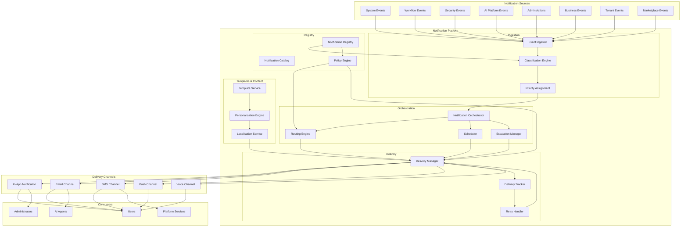
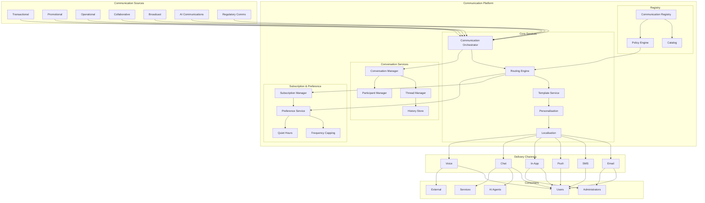
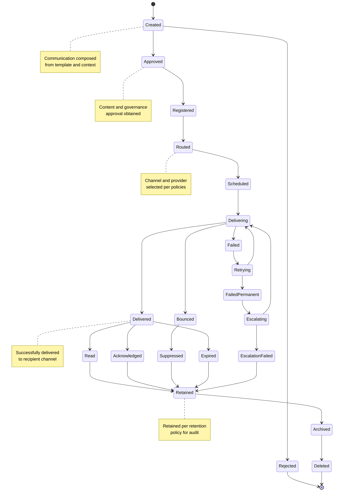
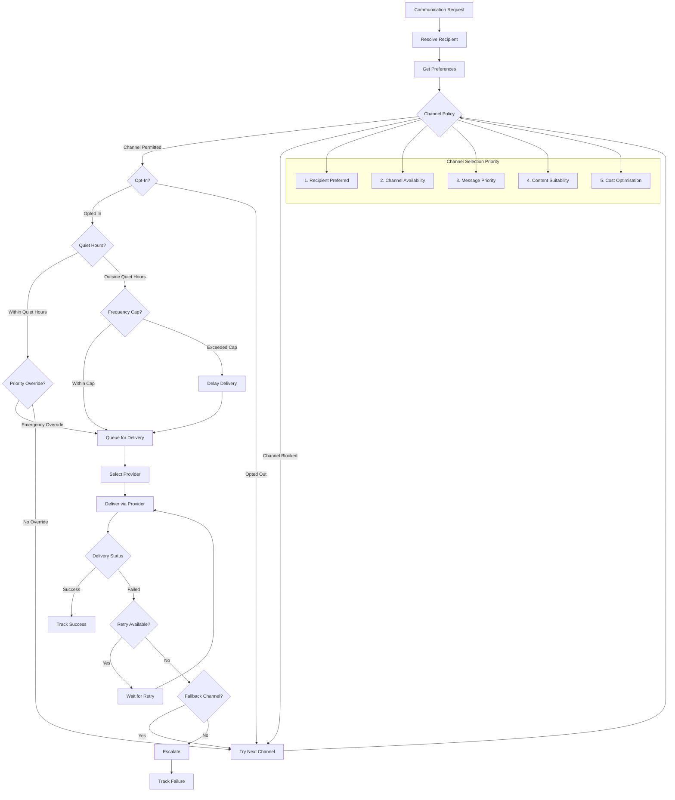
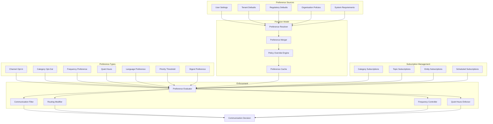
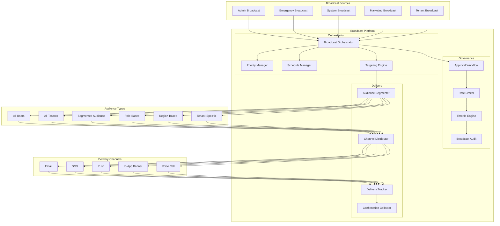
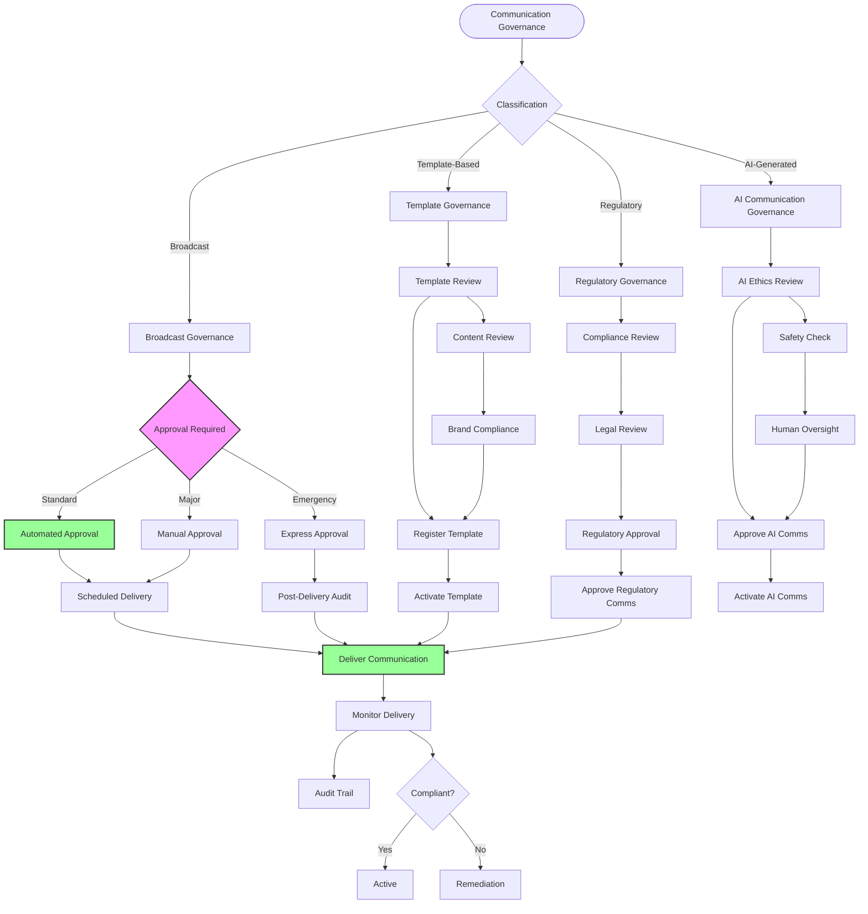
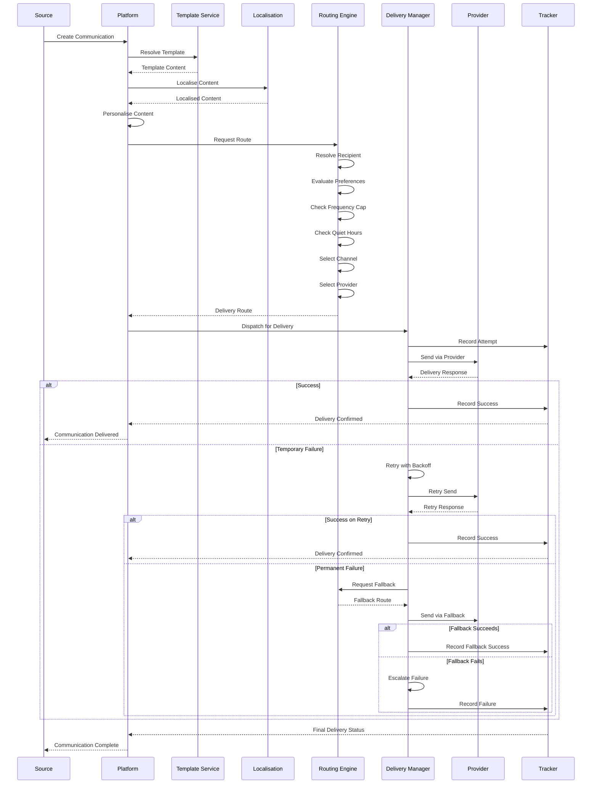

# KB-127 — Notification & Communication Architecture

**Suite:** Enterprise Platform Services  
**Version:** 1.0  
**Status:** Approved Architecture  
**Classification:** Enterprise Communication Services Architecture  
**Last Updated:** 2026-07-12

---

## Executive Summary

This document defines the enterprise architecture governing all notifications and communications across DUKADESK. The Enterprise Notification & Communication Platform provides centralised capabilities for producing, routing, governing, delivering, tracking, and auditing communications across users, tenants, administrators, AI systems, workflows, applications, and enterprise services.

Communication exists as a reusable enterprise platform capability independent of applications, integrations, delivery providers, or messaging technologies.

---

## Purpose

Define how DUKADESK standardises enterprise communications while ensuring consistency, reliability, governance, personalisation, security, auditability, and scalability.

---

## Scope

### In Scope

- Enterprise notification architecture
- Enterprise communication architecture
- Notification taxonomy
- Communication taxonomy
- Notification registry
- Communication templates
- Delivery channels
- Subscription management
- Preference management
- Routing architecture
- Delivery lifecycle
- Communication governance
- Notification auditing
- Delivery observability
- Localisation support
- AI-generated communications
- Broadcast architecture
- Conversation architecture
- Escalation communications
- Enterprise messaging lifecycle

### Out of Scope

- Email provider implementation
- SMS implementation
- Push notification implementation
- Chat implementation
- Voice implementation
- Infrastructure implementation

*These are covered by dedicated Knowledge Base documents or provider integrations (see Cross References).*

---

## Architectural Principles

| # | Principle | Description |
|---|-----------|-------------|
| 1 | **Communication as a Platform Service** | Communication is a shared platform capability, not an application-level concern. All enterprise communications use the canonical platform. |
| 2 | **Channel Independence** | Communication content is authored independently of delivery channels. Channels are selected at routing time. |
| 3 | **Provider Independence** | Delivery providers are abstracted behind a provider-neutral layer, enabling transparent substitution. |
| 4 | **Template-Driven Communications** | Communications are produced from governed templates, ensuring consistency, localisation, and governance. |
| 5 | **Personalisation by Design** | Communications support recipient-specific personalisation of content, channel, timing, and language. |
| 6 | **User Preference Awareness** | Communications respect recipient communication preferences, channel opt-ins, frequency caps, and quiet hours. |
| 7 | **Event-Driven Communication** | Communications are triggered by platform events, enabling reactive, loosely-coupled delivery. |
| 8 | **Security by Design** | Security controls are intrinsic to communication content, routing, delivery, and audit. |
| 9 | **Privacy by Design** | Communications respect consent, data minimisation, and regulatory privacy requirements. |
| 10 | **Multi-Tenant Isolation** | Tenant communications, preferences, and templates are strictly isolated. |
| 11 | **Observability by Default** | All communication operations emit structured telemetry for delivery tracking, audit, and analytics. |
| 12 | **Lifecycle Governance** | Communications progress through governed lifecycles with approval, routing, delivery, and retention policies. |
| 13 | **Enterprise Consistency** | Every communication adheres to enterprise brand, tone, and compliance standards through governed templates. |

---

## Canonical Definitions

| Term | Definition |
|------|------------|
| **Notification** | A concise, action-oriented communication informing a recipient about a specific event, state change, or required action. |
| **Communication** | A structured, governed exchange of information directed at one or more recipients through defined channels. |
| **Message** | An individual unit of communication content with defined structure, metadata, and delivery characteristics. |
| **Announcement** | A one-to-many communication directed at a defined audience for informational, operational, or governance purposes. |
| **Broadcast** | A high-priority communication sent to a large audience with minimal latency, subject to governance and rate limiting. |
| **Alert** | A time-sensitive notification requiring recipient attention, often with escalation paths for non-response. |
| **Reminder** | A scheduled notification prompting recipient action before a deadline or event. |
| **Subscription** | A recipient-managed opt-in to receive specific categories or types of communications. |
| **Communication Template** | A governed, versioned, localised template defining communication content, structure, and channel adaptations. |
| **Notification Channel** | A logical delivery mechanism (in-app, email, SMS, push, voice) abstracted from provider implementation. |
| **Delivery Route** | The resolved path from communication creation through channel selection, provider binding, and recipient delivery. |
| **Delivery Policy** | A declarative rule governing channel selection, priority, retry, fallback, rate limiting, and escalation. |
| **Communication Preference** | A recipient-defined setting controlling channel opt-in, frequency, quiet hours, and language. |
| **Conversation** | A persistent, multi-message communication between two or more participants within a defined context. |
| **Delivery Status** | The state of a communication along its delivery lifecycle: pending, sent, delivered, read, failed, bounced. |
| **Communication Lifecycle** | The progression of a communication from creation through approval, routing, delivery, and retention. |
| **Notification Registry** | The authoritative inventory of governed notification types, their schemas, templates, and policies. |
| **Message Priority** | A classification (low, normal, high, urgent, emergency) determining routing, delivery, and escalation behaviour. |
| **Escalation** | The process of re-routing or re-attempting communication through alternative channels or recipients after non-delivery or non-response. |
| **Delivery Outcome** | The final recorded result of a communication attempt including status, channel, timestamps, and error information. |

---

## Architecture

### 1. Enterprise Notification Platform Architecture

The Enterprise Notification Platform provides a centralised capability for producing, routing, governing, delivering, and tracking notifications across all enterprise domains.

### 2. Enterprise Communication Platform Architecture

The Enterprise Communication Platform extends notifications to support richer, multi-message, interactive, and persistent communication scenarios.

### 3. Notification Taxonomy

Notifications are classified by domain, priority, urgency, and audience, enabling consistent governance, routing, and preference management.

```mermaid
graph TD
    Root[Notification Taxonomy]

    Root --> SYS[System Notifications]
    SYS --> SYS_OUT[Outage Alerts]
    SYS --> SYS_MAINT[Maintenance Notices]
    SYS --> SYS_UPGRADE[Upgrade Notifications]
    SYS --> SYS_PERF[Performance Alerts]

    Root --> OPER[Operational]
    OPER --> OPER_DEPLOY[Deployment Events]
    OPER --> OPER_MONITOR[Monitor Alerts]
    OPER --> OPER_BACKUP[Backup Status]
    OPER --> OPER_CONFIG[Config Changes]

    Root --> ADMIN[Administrative]
    ADMIN --> ADMIN_APPROVAL[Approval Requests]
    ADMIN --> ADMIN_TENANT[Tenant Events]
    ADMIN --> ADMIN_BILL[Billing Alerts]
    ADMIN --> ADMIN_USER[User Management]

    Root --> SEC[Security]
    SEC --> SEC_AUTH[Auth Events]
    SEC --> SEC_THREAT[Threat Detected]
    SEC --> SEC_POLICY[Policy Violation]
    SEC --> SEC_ACCESS[Access Alerts]

    Root --> COMP[Compliance]
    COMP --> COMP_REMIND[Reminder]
    COMP --> COMP_DEADLINE[Deadline Alerts]
    COMP --> COMP_REVIEW[Review Required]

    Root --> WF[Workflow]
    WF --> WF_ASSIGN[Task Assigned]
    WF --> WF_APPROVAL[Approval Needed]
    WF --> WF_COMPLETE[Workflow Complete]
    WF --> WF_FAILURE[Workflow Failure]

    Root --> MKT[Marketplace]
    MKT --> MKT_LIST[Listing Events]
    MKT --> MKT_ORDER[Order Events]
    MKT --> MKT_REVIEW[Review Events]

    Root --> BS[Builder Studio]
    BS --> BS_PUB[Publication Events]
    BS --> BS_COLLAB[Collaboration Invites]
    BS --> BS_VERSION[Version Events]

    Root --> AI[AI Platform]
    AI --> AI_ESCALATION[Escalation]
    AI --> AI_SAFETY[Safety Alert]
    AI --> AI_COMPLETE[Task Complete]
    AI --> AI_ACTION[Action Required]

    Root --> BIZ[Business]
    BIZ --> BIZ_INVOICE[Invoice]
    BIZ --> BIZ_STATUS[Status Update]
    BIZ --> BIZ_OFFER[Offer]
    BIZ --> BIZ_ANNOUNCE[Announcement]

    Root --> USER[User]
    USER --> USER_MENTION[Mention]
    USER --> USER_MESSAGE[Message]
    USER --> USER_FRIEND[Friend Request]
    USER --> USER_FOLLOW[Follow Event]

    Root --> TENANT[Tenant]
    TENANT --> TENANT_LIMIT[Limit Alerts]
    TENANT --> TENANT_CONFIG[Config Alerts]
    TENANT --> TENANT_ROLE[Role Events]

    Root --> EMERGENCY[Emergency]
    EMERGENCY --> EMERG_CRIT[Critical Alert]
    EMERGENCY --> EMERG_BROADCAST[Broadcast]
    EMERGENCY --> EMERG_EVAC[Evacuation Notice]
```

### 4. Communication Lifecycle

Every communication progresses through a defined lifecycle from creation through approval, routing, delivery, and retention.

### 5. Communication Routing Architecture

Communication routing evaluates recipient identity, preferences, channel availability, priority, policies, and context to select the optimal delivery path.

### 6. Subscription & Preference Model

The subscription and preference model enables recipients to control which communications they receive, through which channels, at what frequency, and during which hours.

### 7. Broadcast Architecture

Broadcast communications support enterprise-wide, targeted, and emergency announcements with priority routing, rate limiting, and delivery confirmation.

### 8. Communication Governance Structure

Communication governance enforces oversight across content, templates, channels, delivery, privacy, and compliance through a structured review framework.

### 9. Enterprise Communication Ecosystem

The enterprise communication ecosystem encompasses all communication domains, their relationships, integration points, and governance boundaries.

```mermaid
graph TB
    subgraph "Communication Ecosystem"
        subgraph "Transactional"
            TX_ORDER[Order Confirmations]
            TX_INV[Invoice Communications]
            TX_RECEIPT[Receipts]
            TX_STATUS[Status Updates]
        end

        subgraph "Operational"
            OP_ALERT[Operational Alerts]
            OP_MAINT[Maintenance Notices]
            OP_INCIDENT[Incident Comms]
            OP_DEPLOY[Deployment Notices]
        end

        subgraph "Administrative"
            AD_APPROVAL[Approval Requests]
            AD_TENANT[Tenant Comms]
            AD_BILL[Billing Comms]
            AD_COMPLIANCE[Compliance Comms]
        end

        subgraph "Collaborative"
            COL_CHAT[Chat Messages]
            COL_COMMENT[Comments]
            COL_REVIEW[Review Invites]
            COL_MENTION[Mentions]
        end

        subgraph "AI Generated"
            AI_RESP[AI Responses]
            AI_SUMM[AI Summaries]
            AI_REC[AI Recommendations]
            AI_ESC[AI Escalations]
        end

        subgraph "Broadcast"
            BRD_ALL[Enterprise-Wide]
            BRD_TENANT[Tenant Broadcasts]
            BRD_EMERG[Emergency Broadcasts]
            BRD_SEGMENT[Segmented Campaigns]
        end
    end

    subgraph "Platform Integration"
        TMPL[Template Management]
        WF[Workflow Engine]
        AI_PLAT[AI Platform]
        PREF[Preference Service]
        AUDIT[Audit Platform]
        LOC[Localisation Service]
    end

    subgraph "Governance Boundaries"
        GB_CONTENT[Content Governance]
        GB_PRIVACY[Privacy Governance]
        GB_REG[Regulatory Governance]
        GB_FREQ[Frequency Governance]
        GB_CHANNEL[Channel Governance]
    end

    TX_ORDER --> TMPL
    TX_INV --> TMPL
    TX_INV --> WF
    OP_ALERT --> AUDIT
    OP_INCIDENT --> AUDIT
    AD_APPROVAL --> WF
    AI_RESP --> AI_PLAT
    AI_REC --> AI_PLAT
    COL_CHAT --> LOC
    BRD_ALL --> TMPL
    BRD_ALL --> PREF
    BRD_TENANT --> PREF

    TX_ORDER -.-> GB_CONTENT
    TX_ORDER -.-> GB_PRIVACY
    OP_ALERT -.-> GB_FREQ
    AD_APPROVAL -.-> GB_CHANNEL
    AI_RESP -.-> GB_CONTENT
    AI_RESP -.-> GB_PRIVACY
    BRD_ALL -.-> GB_FREQ
    BRD_ALL -.-> GB_CHANNEL
    BRD_EMERG -.-> GB_REG
```

### 10. Communication Delivery Flow

The communication delivery flow governs the end-to-end process from communication creation through preference evaluation, channel selection, provider delivery, status tracking, and escalation.

---

## Lifecycle

| Phase | Description | Gates |
|-------|-------------|-------|
| **Creation** | Communication is composed from template, context, recipient, and channel parameters. | Schema validation |
| **Approval** | Content, governance, brand, and compliance approval is obtained based on classification. | Approval sign-off |
| **Registration** | Communication is registered in the platform with tracking identifier and metadata. | Registry entry verified |
| **Publication** | Communication is published and queued for routing and delivery. | Publication validation |
| **Routing** | Recipient is resolved, preferences are evaluated, channel and provider are selected. | Route resolution |
| **Delivery** | Communication is transmitted via selected provider to recipient channel. | Transmission confirmation |
| **Confirmation** | Delivery status is recorded: delivered, read, acknowledged, bounced, or failed. | Status recorded |
| **Monitoring** | Delivery metrics, engagement, and outcomes are monitored for quality and compliance. | Operational review |
| **Escalation** | Failed communications are retried, fallback channels are attempted, or escalation paths are triggered. | Escalation resolution |
| **Retention** | Communication records are retained per policy for audit, compliance, and investigation. | Retention compliance |
| **Archival** | Communication records are moved to long-term archive with indexed retrieval. | Archive verification |
| **Deletion** | Communication records are securely deleted after retention period, subject to legal hold. | Deletion authorisation |

---

## Governance

| Domain | Governance Mechanism | Responsible Body |
|--------|---------------------|------------------|
| **Communication Ownership** | Every communication type must have a registered owner accountable for content, quality, and compliance. | Enterprise Architecture |
| **Template Governance** | Communication templates undergo content, brand, and compliance review before activation. | Communication Services Team |
| **Content Governance** | Communication content adheres to enterprise tone, brand guidelines, and compliance requirements. | Content Owners |
| **Privacy Governance** | Communications respect recipient consent, preferences, and data minimisation requirements. | Privacy Office |
| **Security Governance** | Communications are delivered securely. Sensitive content is protected. | Security |
| **Compliance Governance** | Regulatory communications undergo compliance and legal review before delivery. | Compliance |
| **Lifecycle Governance** | Communication lifecycle transitions are gated and audited. | Platform Engineering |
| **Delivery Governance** | Delivery policies, retry strategies, and escalation paths are governed per communication type. | Operations |
| **AI Communication Governance** | AI-generated communications undergo ethics, safety, and human oversight review. | AI Governance Board |
| **Enterprise Governance** | Cross-cutting governance framework coordinates notification, communication, and template governance. | Governance Board |

---

## Responsibilities

| Role | Responsibilities |
|------|-----------------|
| **Enterprise Architecture** | Define communication architecture, taxonomy, standards; conduct architecture reviews; maintain registry. |
| **Platform Engineering** | Build and maintain Notification & Communication Platform, routing engine, delivery management, and tracking infrastructure. |
| **Communication Services Team** | Own communication templates, content standards, delivery policies, and communication quality. |
| **Security** | Define secure delivery requirements, communication authorisation, and content protection standards. |
| **Compliance** | Define regulatory communication requirements, consent governance, and compliance reporting. |
| **AI Governance Board** | Govern AI-generated communications; enforce ethics, safety, and human oversight policies. |
| **Product Teams** | Define product communication requirements; integrate product events with the communication platform. |
| **Operations** | Monitor delivery health, manage provider relationships, respond to delivery incidents, manage capacity. |
| **Customer Experience** | Define communication personalisation standards, user preference models, and engagement metrics. |
| **Tenant Administrators** | Manage tenant-level communication preferences, template overrides, and compliance configurations. |

---

## Security

| Control Area | Architecture |
|-------------|--------------|
| **Secure Delivery** | Communications are delivered over encrypted channels. Sensitive content is encrypted end-to-end where required. |
| **Identity-Aware Messaging** | Communications are addressed to verified recipient identities. Impersonation is prevented. |
| **Tenant Isolation** | Tenant communications, preferences, and templates are strictly partitioned. Cross-tenant delivery is governed. |
| **Communication Authorisation** | Every communication operation is authorised against sender identity, recipient scope, and content classification. |
| **Least Privilege** | Senders are authorised only for communication types and audiences within their scope. |
| **Zero Trust** | No communication source, provider, or recipient is implicitly trusted. Every operation is authenticated, authorised, and audited. |
| **Auditability** | Every communication operation is logged with sender, recipient, channel, status, and timestamps. |
| **Message Integrity** | Communication content integrity is verifiable. Tampering is detectable. |
| **Provenance** | Every communication is traceable to its source event, template, and approval chain. |
| **Policy Enforcement** | Security policies are evaluated at creation, routing, delivery, and every lifecycle transition. |

---

## Privacy

| Domain | Architecture |
|--------|--------------|
| **Communication Consent** | Communications honour recipient consent preferences. Unsolicited communications are governed by policy. |
| **Preference Enforcement** | Recipient channel opt-in, category opt-out, frequency caps, and quiet hours are enforced at routing time. |
| **Privacy-Preserving Communications** | Personal data in communications is minimised. Sensitive data is masked or excluded where appropriate. |
| **Data Minimisation** | Communication content captures only data necessary for the purpose. Retention follows policy. |
| **Regulatory Compliance** | Communications adhere to GDPR, CAN-SPAM, TCPA, and applicable privacy regulations. |
| **Regional Restrictions** | Communication routing respects regional data residency. Regional channel providers are preferred. |
| **Cross-Border Governance** | Communications crossing geographic boundaries are classified for data transfer compliance. |
| **Retention Policies** | Communication records are retained per domain-specific policies with legal hold override. |

---

## Performance

| Consideration | Architectural Approach |
|---------------|----------------------|
| **Enterprise-Scale Messaging** | Communication ingestion, routing, and delivery scale horizontally. Throughput is partitioned by priority and channel. |
| **High-Volume Broadcasts** | Broadcast distribution uses fan-out with parallel delivery. Rate limiting protects providers and recipients. |
| **Elastic Scalability** | Platform capacity scales with communication volume. Provider pooling distributes load. |
| **Global Distribution** | Regional communication ingestion and delivery endpoints provide low-latency processing. |
| **High Availability** | Communication platform is deployed across availability zones. Delivery queues are resilient to failures. |
| **Operational Resilience** | Failed deliveries are retried with exponential backoff. Fallback channels maintain communication reliability. |
| **Multi-Region Readiness** | Regional delivery routing optimises latency and regulatory compliance. |
| **Efficient Routing** | Preference resolution and channel selection are cached and optimised for sub-millisecond routing decisions. |

---

## Observability

| Domain | Architecture |
|--------|--------------|
| **Delivery Metrics** | Delivery success rates, latency per channel, bounce rates, and channel distribution are tracked. |
| **Communication Analytics** | Volume trends, recipient engagement, read rates, and response rates are measured per communication type. |
| **Routing Analytics** | Channel selection distribution, fallback frequency, and routing optimisation opportunities are analysed. |
| **Template Analytics** | Template usage rates, localisation coverage, and personalisation effectiveness are tracked. |
| **Governance Dashboards** | Role-specific dashboards expose communication compliance, approval cycle times, and policy enforcement. |
| **SLA Monitoring** | Delivery latency SLAs, availability SLAs, and broadcast completion SLAs are monitored per tier. |
| **Operational Reporting** | Provider performance, queue depths, retry rates, and escalation volumes are reported. |
| **Executive Reporting** | Executive dashboards summarise communication volume, engagement, cost, and compliance posture. |
| **Delivery Health** | Provider health, channel availability, and delivery infrastructure status are continuously monitored. |
| **Enterprise Communication Insights** | Cross-domain analytics reveal communication patterns, optimisation opportunities, and emerging trends. |

---

## Failure Scenarios

| Scenario | Architectural Response |
|----------|-----------------------|
| **Delivery Failures** | Failed delivery triggers retry with exponential backoff. Persistent failure triggers fallback channel or escalation. |
| **Routing Failures** | Routing engine failure falls back to default route. Concurrent routing instances provide redundancy. |
| **Duplicate Communications** | Idempotency keys prevent duplicate delivery. Detection of duplicates triggers deduplication and alert. |
| **Preference Violations** | Preference enforcement at routing time prevents violations. Violation attempts are logged and audited. |
| **Cross-Tenant Delivery** | Cross-tenant delivery is blocked at the authorisation layer. Violation is logged and escalated. |
| **Template Inconsistencies** | Template validation at creation detects inconsistencies. Invalid templates block communication creation. |
| **Broadcast Failures** | Partial broadcast failures are retried. Segment-level delivery tracking enables targeted retry. |
| **Escalation Failures** | Escalation path failure triggers administrative alert. Manual intervention is initiated. |
| **Governance Violations** | Policy enforcement blocks non-compliant communications. Violation is logged, audited, and escalated. |
| **Provider Outages** | Provider unavailability triggers automatic failover to alternative provider for the same channel. |
| **Recovery Failures** | Platform state recovery fails. Queued communications are preserved. Manual investigation is initiated. |
| **Communication Storms** | Rate limiting and throttling prevent communication storms. Excess communications are queued or suppressed. |

---

## Anti-Patterns

| Anti-Pattern | Prohibited Because | Enforced By |
|--------------|-------------------|-------------|
| **Application-Owned Messaging** | Duplicates platform capability, bypasses governance, and fragments communication history. | Architecture review; platform policy |
| **Hardcoded Notification Content** | Prevents localisation, personalisation, template reuse, and governance. | Code review; template enforcement |
| **Provider-Specific Communication Logic** | Creates provider lock-in and prevents transparent substitution. | Architecture review; abstraction layer |
| **Duplicate Communication Platforms** | Fragments communication history, preferences, and governance. | Platform consolidation policy |
| **Communications Bypassing Preferences** | Violates recipient consent, regulatory requirements, and trust. | Preference enforcement |
| **Unregistered Templates** | Templates outside the registry are invisible to governance, localisation, and audit. | Registry mandatory check |
| **Hidden Communication Channels** | Unregistered channels bypass governance, rate limiting, and audit. | Platform enforcement |
| **Communication Without Governance** | Ungoverned communications lack approval, compliance, and audit. | Governance enforcement |
| **Manual Broadcast Management** | Introduces human error, inconsistent targeting, and audit gaps. | Automated broadcast platform |
| **Direct Application-to-User Messaging** | Bypasses preference enforcement, audit, and delivery governance. | API gateway enforcement |

---

## Future Evolution

| Evolution Path | Architectural Preparation |
|---------------|--------------------------|
| **AI-Generated Enterprise Communications** | AI generates personalised, context-aware communications from templates and user context under governance oversight. |
| **Adaptive Communication Orchestration** | Communication routing dynamically adapts channel, timing, and content based on real-time recipient context and engagement history. |
| **Semantic Audience Targeting** | Audience segmentation uses semantic understanding of recipient roles, preferences, and behaviour patterns. |
| **Federated Communication Ecosystems** | Communications span enterprise boundaries with federated preference enforcement and audit. |
| **Autonomous Delivery Optimisation** | ML-driven optimisation of channel selection, timing, and content for maximum engagement and compliance. |
| **Intelligent Engagement Analytics** | Deep analytics on recipient engagement, sentiment, and communication effectiveness drive continuous improvement. |
| **Cross-Platform Communication Federation** | Communications are deliverable across platform boundaries with governed routing and audit. |
| **Enterprise Communication Intelligence** | Enterprise-wide communication intelligence provides strategic insights, trend analysis, and optimisation recommendations. |

---

## Cross References

| Document ID | Title | Relation |
|-------------|-------|----------|
| **KB-084** | Data Import & Export Architecture | Defines data integration for communication platforms. |
| **KB-091** | Reporting Architecture | Defines reporting infrastructure for communication analytics. |
| **KB-107** | Enterprise Platform Services Overview Architecture | Defines the platform services context for communication. |
| **KB-115** | Template Management Architecture | Defines the template architecture for communication templates. |
| **KB-116** | AI Platform Architecture | Defines AI platform integration for AI-generated communications. |
| **KB-119** | Prompt Management Architecture | Defines prompt templates for AI communication generation. |
| **KB-123** | Enterprise Policy Framework Architecture | Defines policies governing communication behaviour. |
| **KB-124** | Policy Management Architecture | Defines policy enforcement for communication governance. |
| **KB-126** | Audit & Compliance Architecture | Defines audit framework for communication records. |
| **KB-128** | Localization & Internationalization Architecture | Defines localisation for multi-language communications. |
| **KB-140** | Enterprise Platform Services Reference Architecture | Defines the overarching reference architecture for enterprise platform services. |

---

## Acceptance Criteria

- [x] Defines the canonical Enterprise Notification & Communication architecture.
- [x] Treats communication as a centralised enterprise platform capability.
- [x] Defines templates, routing, governance, lifecycle, subscriptions, preferences, delivery, and observability.
- [x] Supports enterprise-scale, multi-tenant, vendor-independent communication services.
- [x] Includes all 10 required Mermaid diagrams.
- [x] Cross-references related Knowledge Base documents.
- [x] Contains no implementation guidance.

---

## Completion Instructions

1. **Mark KB-127 as Completed** — This document constitutes the completed architecture specification.
2. **Update the Progress Registry** — Record KB-127 as Approved Architecture in the Knowledge Base registry.
3. **Cross-Reference Related Documents** — Ensure KB-084 through KB-140 reference this document.
4. **Queue Next Assignment** — KB-128 – Localization & Internationalization Architecture is the next builder assignment.

---

## Critical DUKADESK Architectural Rule

> **All notifications and communications within DUKADESK shall be orchestrated exclusively through the centralised Enterprise Notification & Communication Platform. No application, service, workflow, AI capability, integration, tenant, or runtime component shall communicate directly with users outside the governed communication architecture, ensuring consistent delivery, personalisation, security, privacy, auditability, and enterprise-wide communication governance.**
