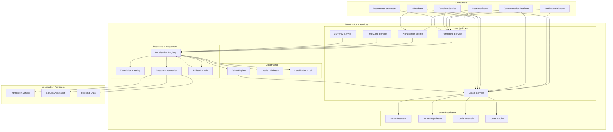
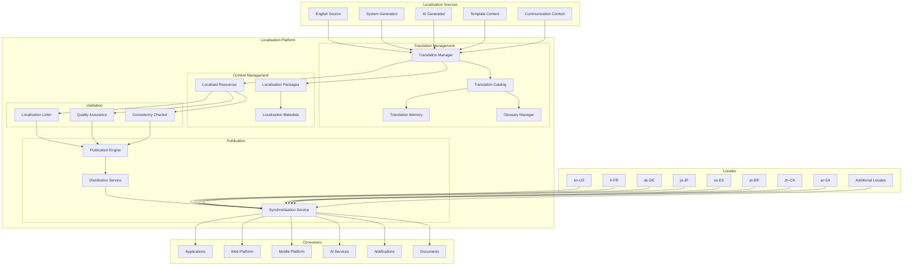
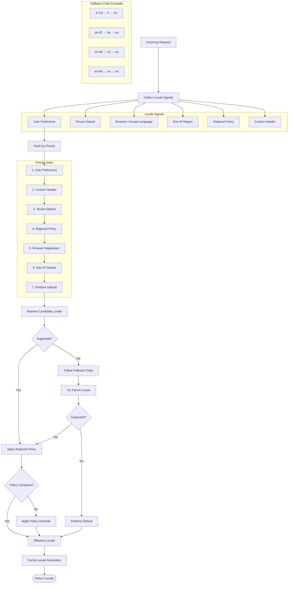
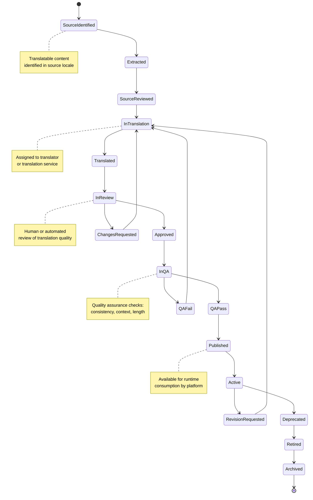
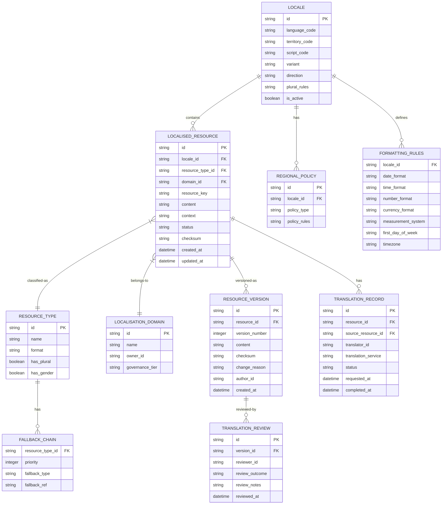
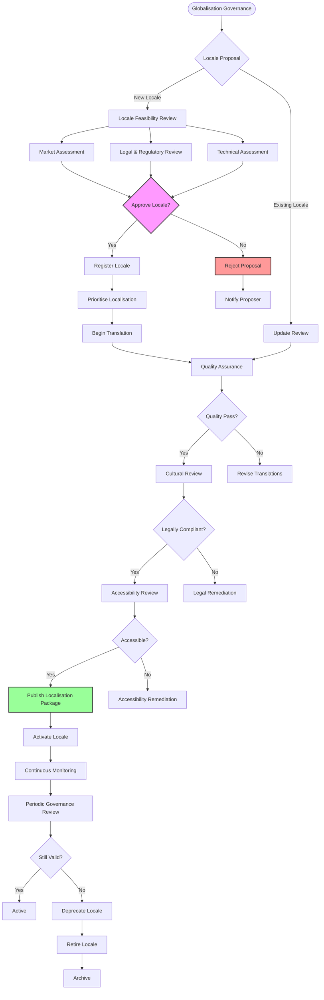
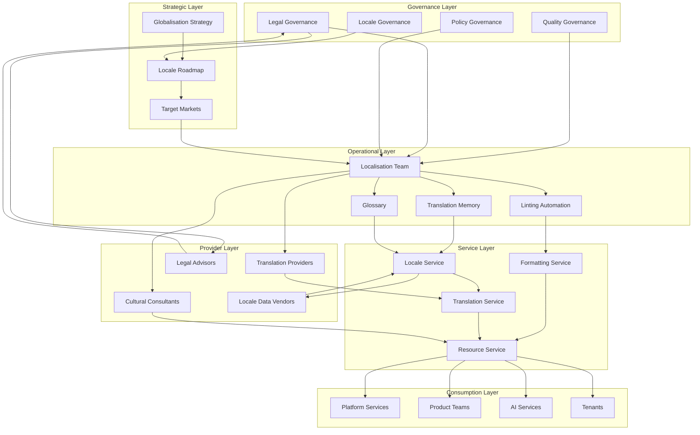

# KB-128 — Localization & Internationalization Architecture

**Suite:** Enterprise Platform Services  
**Version:** 1.0  
**Status:** Approved Architecture  
**Classification:** Enterprise Globalization Architecture  
**Last Updated:** 2026-07-12

---

## Executive Summary

This document defines the enterprise architecture governing globalisation across DUKADESK. The Enterprise Localization & Internationalization Platform provides centralised capabilities for adapting platform experiences to languages, cultures, legal jurisdictions, regional business practices, accessibility requirements, and user preferences while maintaining a single global platform architecture.

Localisation and internationalisation are treated as enterprise platform capabilities rather than application-specific implementations.

---

## Purpose

Define how DUKADESK supports global deployment while enabling consistent regional adaptation through centralised governance, reusable localisation services, and culturally appropriate user experiences.

---

## Scope

### In Scope

- Enterprise internationalisation architecture
- Enterprise localisation architecture
- Language architecture
- Translation architecture
- Localisation registry
- Regionalisation architecture
- Locale management
- Currency architecture
- Date and time architecture
- Time zone architecture
- Measurement systems
- Number formatting
- Address formats
- Cultural adaptation
- Regional compliance
- Accessibility localisation
- AI localisation governance
- Localisation lifecycle
- Translation governance
- Global content management

### Out of Scope

- Translation engine implementation
- UI implementation
- Font implementation
- Provider implementation
- Runtime localisation implementation
- Regional infrastructure implementation

*These are covered by dedicated Knowledge Base documents (see Cross References).*

---

## Architectural Principles

| # | Principle | Description |
|---|-----------|-------------|
| 1 | **Global Platform, Local Experience** | A single global platform adapts to local languages, cultures, and regulations without code changes or forks. |
| 2 | **Internationalisation First** | All platform capabilities are designed for global readiness from inception. Localisation is additive, not retrofitted. |
| 3 | **Localisation by Configuration** | Regional behaviour is governed by configuration, policies, and locale data, not by application logic. |
| 4 | **Cultural Neutrality** | The core platform is culturally neutral. Cultural adaptations are applied through the localisation layer. |
| 5 | **Accessibility by Design** | Localisation includes accessibility adaptations for all supported locales. |
| 6 | **Regional Compliance** | Localisation respects regional legal, regulatory, and privacy requirements. |
| 7 | **Language Independence** | All user-facing text is externalised. Language selection is a runtime concern, not a build-time concern. |
| 8 | **Vendor Independence** | Translation services and localisation providers are abstracted behind a provider-neutral layer. |
| 9 | **Technology Neutrality** | Localisation resources are expressed in technology-neutral formats. |
| 10 | **Multi-Tenant Localisation** | Tenant-specific localisation overrides, regional variants, and language preferences are strictly isolated. |
| 11 | **Governance by Design** | Localisation resources, translations, and regional adaptations are governed assets with lifecycle management. |
| 12 | **Lifecycle Governance** | Localisation resources progress through governed lifecycles with validation, review, and publication gates. |
| 13 | **Enterprise Consistency** | Every locale adheres to enterprise quality, brand, and compliance standards through governed localisation. |

---

## Canonical Definitions

| Term | Definition |
|------|------------|
| **Internationalisation (i18n)** | The architectural capability enabling platform adaptation to any locale without code changes, through externalised text, locale-aware formatting, and cultural neutrality. |
| **Localisation (l10n)** | The process and resources for adapting platform content, behaviour, and presentation to a specific locale. |
| **Locale** | A named set of linguistic, cultural, and regional conventions identified by language, territory, and variant codes. |
| **Language** | A linguistic system identified by standard language codes (e.g., en, fr, ja) with defined writing system and grammar. |
| **Translation** | The converted representation of content from a source language to a target language, governed by quality and context. |
| **Localisation Registry** | The authoritative system of record for supported locales, localisation resources, translation assets, and regional metadata. |
| **Translation Catalog** | An indexed inventory of translatable strings, their translations, context, status, and ownership. |
| **Regionalisation** | The adaptation of platform behaviour to regional legal, regulatory, commercial, and cultural requirements. |
| **Cultural Adaptation** | The modification of content, imagery, colours, icons, and interactions to align with cultural norms and expectations. |
| **Localisation Package** | A versioned, governed collection of localisation resources for a specific locale and scope. |
| **Translation Lifecycle** | The progression of translation content from source through translation, validation, review, and publication. |
| **Localised Resource** | A governed, versioned asset containing localised content for a specific locale and domain. |
| **Regional Policy** | A declarative rule governing locale-specific behaviour, formatting, compliance, or content restrictions. |
| **Time Zone** | A region-specific offset from UTC with defined daylight saving rules and historical changes. |
| **Currency** | A monetary unit with defined code, symbol, decimal places, and formatting conventions. |
| **Formatting Rules** | Locale-specific rules for dates, times, numbers, currencies, percentages, addresses, and measurements. |
| **Locale Resolution** | The process of determining the effective locale for a request based on user preference, tenant configuration, and regional policies. |
| **Global Content** | Content that is locale-independent and does not require translation or cultural adaptation. |
| **Regional Variant** | A locale-specific adaptation of content, configuration, or behaviour governed by regional policy. |
| **Localisation Governance** | The framework of policies, reviews, and approvals governing localisation resources, translations, and regional adaptations. |

---

## Architecture

### 1. Enterprise Internationalization Architecture

The Enterprise Internationalization Platform provides the architectural foundation for global readiness, enabling all platform capabilities to support any locale without code changes.

### 2. Enterprise Localization Architecture

The Enterprise Localization Platform governs the creation, management, translation, validation, publication, and distribution of localised content across all platform domains.

### 3. Localization Taxonomy

Localisation domains are classified by content type, regional impact, regulatory relevance, and adaptation complexity, enabling consistent governance and prioritisation.

```mermaid
graph TD
    Root[Localisation Taxonomy]

    Root --> LANG[Language Content]
    LANG --> LANG_UI[UI Labels]
    LANG --> LANG_HELP[Help Content]
    LANG --> LANG_ERROR[Error Messages]
    LANG --> LANG_TOOLTIP[Tooltips]

    Root --> FMT[Formatting Rules]
    FMT --> FMT_DATE[Date Formats]
    FMT --> FMT_TIME[Time Formats]
    FMT --> FMT_NUM[Number Formats]
    FMT --> FMT_CURR[Currency Formats]
    FMT --> FMT_PCT[Percentage Formats]
    FMT --> FMT_ADDR[Address Formats]
    FMT --> FMT_PHONE[Phone Formats]
    FMT --> FMT_UNIT[Measurement Units]

    Root --> REGION[Regional Content]
    REGION --> REGION_LEGAL[Legal Content]
    REGION --> REGION_TAX[Tax Content]
    REGION --> REGION_PRIV[Privacy Notices]
    REGION --> REGION_TERMS[Terms of Service]
    REGION --> REGION_CONSENT[Consent Language]

    Root --> COMM[Communications]
    COMM --> COMM_EMAIL[Email Templates]
    COMM --> COMM_SMS[SMS Templates]
    COMM --> COMM_PUSH[Push Templates]
    COMM --> COMM_IN_APP[In-App Messages]

    Root --> AI[AI Content]
    AI --> AI_PROMPT[Prompt Templates]
    AI --> AI_RESP[Response Templates]
    AI --> AI_SYS[System Instructions]
    AI --> AI_CTX[Context Templates]

    Root --> ACC[Accessibility]
    ACC --> ACC_ARIA[ARIA Labels]
    ACC --> ACC_ALT[Alt Text]
    ACC --> ACC_DESC[Descriptions]
    ACC --> ACC_SR[Screen Reader]

    Root --> CULTURE[Cultural Adaptation]
    CULTURE --> CULT_IMG[Imagery]
    CULTURE --> CULT_COLOR[Colour Schemes]
    CULTURE --> CULT_ICON[Icons & Symbols]
    CULTURE --> CULT_LAYOUT[Layout Direction]

    Root --> MKT[Marketplace]
    MKT --> MKT_LIST[Listing Content]
    MKT --> MKT_DESC[Descriptions]
    MKT --> MKT_REV[Review Content]

    Root --> DOC[Documentation]
    DOC --> DOC_HELP[Help Articles]
    DOC --> DOC_GUIDE[Guides]
    DOC --> DOC_API[API Docs]

    Root --> BS[Builder Studio]
    BS --> BS_BLOCK[Block Labels]
    BS --> BS_DESC[Module Descriptions]
    BS --> BS_HELP[Help Content]
```

### 4. Locale Resolution Flow

Locale resolution determines the effective locale for each request by evaluating user preferences, tenant configuration, browser signals, regional policies, and fallback chains.

### 5. Translation Lifecycle

Every translation progresses through a defined lifecycle from source extraction through translation, validation, review, and publication.

### 6. Localization Resource Architecture

Localisation resources are governed, versioned assets organised by locale, domain, resource type, and context, with defined fallback chains and integrity verification.

### 7. Regional Adaptation Architecture

Regional adaptation governs locale-specific behaviour for legal compliance, formatting, content restrictions, cultural norms, and accessibility requirements.

```mermaid
graph TB
    subgraph "Regional Adaptation Domains"
        LEGAL[Legal Compliance]
        TAX[Tax Compliance]
        PRIVACY[Privacy Compliance]
        FORMAT[Formatting Standards]
        CULTURE[Cultural Norms]
        ACCESS[Accessibility Standards]
        COMM[Communication Rules]
        CONTENT[Content Restrictions]
    end

    subgraph "Adaptation Sources"
        REG_POL[Regional Policies]
        LOC_DATA[Locale Data]
        LEGAL_DB[Legal Requirements]
        CULT_DB[Cultural Knowledge]
    end

    subgraph "Adaptation Engine"
        ADAPT[Adaptation Engine]
        RULE_EVAL[Rule Evaluator]
        CONTENT_FLT[Content Filter]
        FORMAT_APP[Format Applicator]
    end

    subgraph "Locale Configuration"
        LOC_CFG[Locale Configuration]
        REG_OVERRIDE[Regional Overrides]
        TENANT_CFG[Tenant Config]
    end

    subgraph "Platform Integration"
        UI[UI Rendering]
        NOTIF[Notifications]
        COMM[Communications]
        AI[AI Services]
        DOC[Document Generation]
        PMT[Payments]
    end

    LEGAL --> REG_POL
    TAX --> REG_POL
    PRIVACY --> REG_POL
    FORMAT --> LOC_DATA
    CULTURE --> CULT_DB
    ACCESS --> LOC_DATA
    COMM --> REG_POL
    CONTENT --> REG_POL

    REG_POL --> RULE_EVAL
    LOC_DATA --> FORMAT_APP
    LEGAL_DB --> RULE_EVAL
    CULT_DB --> CONTENT_FLT

    RULE_EVAL --> ADAPT
    CONTENT_FLT --> ADAPT
    FORMAT_APP --> ADAPT

    LOC_CFG --> ADAPT
    REG_OVERRIDE --> ADAPT
    TENANT_CFG --> ADAPT

    ADAPT --> UI
    ADAPT --> NOTIF
    ADAPT --> COMM
    ADAPT --> AI
    ADAPT --> DOC
    ADAPT --> PMT

    subgraph "Regional Adaptation Examples"
        EX1[EU: GDPR Consent Language]
        EX2[US: Imperial Measurement]
        EX3[JP: Yen Zero Decimals]
        EX4[DE: Formal Communication]
        EX5[SA: Right-to-Left Layout]
        EX6[BR: Portuguese Currency]
    end

    ADAPT --> EX1
    ADAPT --> EX2
    ADAPT --> EX3
    ADAPT --> EX4
    ADAPT --> EX5
    ADAPT --> EX6
```

### 8. Globalization Governance Structure

Globalisation governance enforces oversight across locale management, translation quality, regional compliance, cultural adaptation, and accessibility through a structured review framework.

### 9. Enterprise Globalization Ecosystem

The enterprise globalisation ecosystem encompasses all localisation domains, their relationships, integration points, and governance boundaries.

```mermaid
graph TB
    subgraph "Globalisation Ecosystem"
        subgraph "Language Services"
            LS_TRANS[Translation Management]
            LS_MEM[Translation Memory]
            LS_GLOSS[Glossary Management]
            LS_LINT[Localisation Linting]
        end

        subgraph "Regional Services"
            RS_LEGAL[Legal Adaptation]
            RS_TAX[Tax Adaptation]
            RS_FMT[Formatting Services]
            RS_CULT[Cultural Adaptation]
        end

        subgraph "Locale Data"
            LD_CORE[Locale Metadata]
            LD_TIME[Time Zone Data]
            LD_CURR[Currency Data]
            LD_ADDR[Address Formats]
        end

        subgraph "Localised Assets"
            LA_UI[UI Resources]
            LA_COMM[Communication Resources]
            LA_AI[AI Resources]
            LA_DOC[Document Resources]
            LA_HELP[Help Resources]
        end
    end

    subgraph "Platform Integration"
        TMPL[Template Management]
        AI_PLAT[AI Platform]
        NOTIF[Notification Platform]
        COMM[Communication Platform]
        UI_SYS[UI System]
        DOC_GEN[Document Generation]
        POLICY[Policy Engine]
    end

    subgraph "Governance Boundaries"
        GB_QUALITY[Translation Quality]
        GB_LEGAL[Legal Compliance]
        GB_ACCESS[Accessibility]
        GB_CULTURE[Cultural Appropriateness]
        GB_CONSIST[Enterprise Consistency]
    end

    LS_TRANS --> LA_UI
    LS_TRANS --> LA_COMM
    LS_TRANS --> LA_AI
    LS_TRANS --> LA_DOC
    LS_TRANS --> LA_HELP

    LS_MEM --> LS_TRANS
    LS_GLOSS --> LS_TRANS
    LS_LINT --> LA_UI
    LS_LINT --> LA_COMM

    RS_LEGAL --> LA_DOC
    RS_LEGAL --> LA_COMM
    RS_TAX --> LA_DOC
    RS_FMT --> LA_UI
    RS_CULT --> LA_UI
    RS_CULT --> LA_COMM

    LD_CORE --> RS_FMT
    LD_TIME --> RS_FMT
    LD_CURR --> RS_FMT
    LD_ADDR --> RS_FMT

    LA_UI --> UI_SYS
    LA_UI --> TMPL
    LA_COMM --> NOTIF
    LA_COMM --> COMM
    LA_AI --> AI_PLAT
    LA_DOC --> DOC_GEN
    LA_HELP --> UI_SYS

    LS_TRANS -.-> GB_QUALITY
    LS_LINT -.-> GB_QUALITY
    RS_LEGAL -.-> GB_LEGAL
    RS_CULT -.-> GB_CULTURE
    LS_TRANS -.-> GB_CONSIST
    LA_UI -.-> GB_ACCESS
```

### 10. Localization Operating Model

The localisation operating model defines how globalisation services are delivered across the enterprise with clear ownership, workflows, tooling, and governance.

---

## Lifecycle

| Phase | Description | Gates |
|-------|-------------|-------|
| **Resource Creation** | Translatable content is created in the source language with context and metadata. | Source language validation |
| **Registration** | Localisation resource is registered in the registry with domain, owner, and locale scope. | Registry entry verified |
| **Translation** | Content is translated to target locale(s) through translation service or provider. | Translation completion |
| **Validation** | Translation is validated for correctness, consistency, context, and formatting. | Validation pass |
| **Review** | Human or automated review evaluates translation quality, cultural appropriateness, and compliance. | Review sign-off |
| **Publication** | Localisation resource is published and made available for platform consumption. | Publication validation |
| **Distribution** | Localised resources are distributed to consuming services, caches, and edge locations. | Distribution confirmation |
| **Monitoring** | Localisation coverage, quality, and usage are continuously monitored. | Operational review |
| **Revision** | Content changes in source language trigger revision workflow for affected locales. | Revision approval |
| **Deprecation** | Localisation resource is deprecated; new consumption is blocked. | Deprecation notice |
| **Retirement** | Localisation resource is retired; all consumer references are migrated or removed. | Retirement approval |
| **Historical Archival** | Localisation metadata and version history are archived for compliance and reference. | Archive completion |

---

## Governance

| Domain | Governance Mechanism | Responsible Body |
|--------|---------------------|------------------|
| **Localisation Ownership** | Every locale and localisation domain has a registered owner accountable for quality and compliance. | Enterprise Architecture |
| **Translation Governance** | Translation quality, consistency, glossary adherence, and context accuracy are governed. | Localization Team |
| **Regional Governance** | Regional legal, regulatory, and cultural compliance is governed per locale. | Compliance / Legal |
| **Compliance Governance** | Localised content in regulated domains undergoes compliance review. | Compliance |
| **AI Localisation Governance** | AI-generated translations and localised AI content are governed for quality, safety, and bias. | AI Governance Board |
| **Architecture Governance** | Localisation architecture, taxonomy, and platform integration undergo architecture review. | Architecture Review Board |
| **Lifecycle Governance** | Localisation resource lifecycle transitions are gated and audited. | Platform Engineering |
| **Quality Governance** | Translation quality metrics, coverage, and consistency standards are governed. | Globalization Team |
| **Accessibility Governance** | Localised accessibility resources meet locale-specific accessibility standards. | Accessibility Team |
| **Enterprise Governance** | Cross-cutting governance framework coordinates globalisation, policy, compliance, and AI governance. | Governance Board |

---

## Responsibilities

| Role | Responsibilities |
|------|-----------------|
| **Enterprise Architecture** | Define globalisation architecture, taxonomy, standards; conduct architecture reviews; maintain registry. |
| **Globalization Team** | Own globalisation strategy, locale roadmap, market prioritisation, and enterprise localisation quality. |
| **Localization Team** | Manage translation workflows, translation memory, glossary, localisation linting, and resource publication. |
| **Platform Engineering** | Build and maintain i18n/l10n platform services, locale resolution, formatting services, and distribution infrastructure. |
| **Product Teams** | Externalise user-facing text, provide context for translations, integrate with localisation platform. |
| **Security** | Define secure localisation resource handling, access controls, and integrity verification. |
| **Compliance** | Review regional legal and regulatory content; approve locale-specific compliance adaptations. |
| **AI Governance Board** | Govern AI localisation quality, safety, bias, and cultural appropriateness. |
| **Customer Experience** | Define localisation quality standards from user perspective; monitor locale-specific UX quality. |
| **Tenant Administrators** | Manage tenant-specific locale preferences, regional overrides, and localisation configurations. |

---

## Security

| Control Area | Architecture |
|-------------|--------------|
| **Secure Localisation Resources** | Localisation resources are encrypted at rest and in transit. Access is governed by least privilege. |
| **Tenant Isolation** | Tenant-specific localisation overrides and regional variants are strictly partitioned. |
| **Authorised Localisation Management** | Localisation resource creation, modification, and publication are authorised per role and domain. |
| **Resource Integrity** | Localisation resources are checksummed. Tampering is detectable through integrity verification. |
| **Least Privilege** | Localisation resource access is scoped to minimum required locales, domains, and roles. |
| **Zero Trust** | No localisation consumer, provider, or resource is implicitly trusted. Every operation is authenticated, authorised, and audited. |
| **Auditability** | Every localisation operation is logged with identity, resource, locale, and timestamp. |
| **Provenance** | Every localisation resource is traceable to its source content, translator, and review chain. |
| **Policy Enforcement** | Regional policies are evaluated at locale resolution and resource publication. |
| **Secure Regional Distribution** | Localised resources are distributed over encrypted channels with integrity verification. |

---

## Privacy

| Domain | Architecture |
|--------|--------------|
| **Regional Privacy Compliance** | Localised privacy notices, consent language, and data handling information comply with regional regulations. |
| **Data Residency Considerations** | Localisation resources are stored and distributed respecting regional data residency requirements. |
| **Consent Localisation** | Consent language is accurately localised with legal review for each jurisdiction. |
| **Regulatory Localisation** | Regulatory content is localised with compliance verification per locale. |
| **Cross-Border Governance** | Localisation resources crossing geographic boundaries are classified for data transfer compliance. |
| **Regional Content Restrictions** | Content restrictions per jurisdiction are enforced through regional policies. |
| **Privacy Assurance** | Localised content does not inadvertently expose personal data or violate privacy requirements. |
| **Retention Governance** | Localisation resource versions are retained per domain-specific policies. |

---

## Performance

| Consideration | Architectural Approach |
|---------------|----------------------|
| **Global Content Delivery** | Localisation resources are distributed to regional edge caches. Locale resolution completes in sub-millisecond. |
| **Localisation Scalability** | Resource storage and distribution scale horizontally. New locales are onboarded without platform changes. |
| **High Availability** | Locale resolution and formatting services are deployed across availability zones. |
| **Elastic Scalability** | Localisation resource serving scales with global traffic patterns. |
| **Multi-Region Readiness** | Regional localisation caches provide low-latency access. Cross-region synchronisation is asynchronous. |
| **Operational Resilience** | Consumers operate with cached localisation resources during platform disruptions. |
| **Efficient Locale Resolution** | Locale resolution uses multi-level caching. Resolution chains are pre-computed for common paths. |
| **Resource Synchronisation** | Localisation resource updates are propagated to global caches with configurable TTL and invalidation. |

---

## Observability

| Domain | Architecture |
|--------|--------------|
| **Localisation Coverage** | Translation coverage percentage, locale completeness, and resource gaps are tracked per domain. |
| **Translation Quality Metrics** | Translation accuracy scores, consistency checks, glossary adherence, and review outcomes are measured. |
| **Locale Analytics** | Locale usage distribution, adoption trends, and regional engagement are analysed. |
| **Resource Utilisation** | Resource access frequency, cache hit rates, and distribution efficiency are monitored. |
| **Governance Dashboards** | Role-specific dashboards expose localisation coverage, quality, compliance, and lifecycle status. |
| **Compliance Reporting** | Regional compliance status, legal review completion, and regulatory mapping are reported. |
| **SLA Monitoring** | Locale resolution latency SLAs, resource distribution SLAs, and translation turnaround SLAs are monitored. |
| **Operational Reporting** | Translation throughput, resource publication frequency, and synchronisation health are reported. |
| **Executive Reporting** | Executive dashboards summarise globalisation coverage, market readiness, and strategic progress. |
| **Enterprise Globalization Insights** | Cross-domain analytics reveal globalisation trends, optimisation opportunities, and emerging locale requirements. |

---

## Failure Scenarios

| Scenario | Architectural Response |
|----------|-----------------------|
| **Missing Translations** | Fallback chain resolves parent locale or platform default. Missing translation is logged and alerted for remediation. |
| **Locale Resolution Failures** | Locale resolution falls back to platform default. Resolution failure is logged and investigated. |
| **Incorrect Regional Formatting** | Formatting rules are validated at publication. Incorrect rules trigger alerts and remediation. |
| **Cultural Inconsistencies** | Cultural review at publication gate catches inconsistencies. Remediation is triggered before publication. |
| **Resource Synchronisation Failures** | Synchronisation failure alerts operations. Consumers continue with cached resources. Incremental retry resolves divergence. |
| **Regional Compliance Failures** | Compliance validation at publication gate blocks non-compliant resources. Violation is escalated to compliance team. |
| **Cross-Tenant Localisation Leakage** | Cross-tenant localisation access is blocked. Violation is logged and escalated. |
| **Translation Governance Failures** | Governance process failure is detected through monitoring. Manual escalation and remediation are initiated. |
| **Accessibility Inconsistencies** | Accessibility validation at publication gate detects gaps. Localisation is blocked until resolved. |
| **Resource Corruption** | Checksum verification detects corruption. Resource is restored from version history. Incident is escalated. |
| **Recovery Failures** | Localisation resource recovery fails. Redundant replica is promoted. Manual investigation is initiated. |
| **Localisation Drift** | Source content changes without corresponding translation updates are detected. Drift triggers revision workflow. |

---

## Anti-Patterns

| Anti-Pattern | Prohibited Because | Enforced By |
|--------------|-------------------|-------------|
| **Hardcoded User-Facing Text** | Prevents localisation, creates language lock-in, and violates i18n principles. | Code review; static analysis |
| **Application-Owned Localisation Systems** | Fragments localisation, duplicates effort, and prevents enterprise consistency. | Architecture review; platform policy |
| **Duplicate Translation Repositories** | Fragments translation memory, creates inconsistency, and increases cost. | Platform consolidation policy |
| **Region-Specific Application Forks** | Defeats global platform architecture, multiplies maintenance cost, and creates divergence. | Architecture review |
| **Provider-Specific Localisation Logic** | Creates provider lock-in and prevents transparent substitution. | Architecture review; abstraction layer |
| **Manual Locale Management** | Introduces human error, inconsistency, and audit gaps. | Automated locale resolution |
| **Hidden Localisation Assets** | Localisation resources outside the registry are invisible to governance and translation memory. | Registry mandatory check |
| **Unregistered Translation Resources** | Untracked resources bypass governance, quality review, and translation memory. | Registry enforcement |
| **Localisation Without Governance** | Ungoverned localisation lacks quality, compliance, and cultural review. | Governance enforcement |
| **Culture-Specific Business Logic in Applications** | Embeds cultural assumptions in code, reducing platform neutrality. | Architecture review; i18n enforcement |

---

## Future Evolution

| Evolution Path | Architectural Preparation |
|---------------|--------------------------|
| **AI-Assisted Localization** | AI models assist translation, cultural adaptation, and quality review within governed quality frameworks. |
| **Real-Time Adaptive Localization** | Localisation adapts in real time to user behaviour, regional context, and evolving language usage. |
| **Semantic Translation Governance** | Translation quality is governed through semantic understanding rather than string matching. |
| **Federated Globalization Ecosystems** | Localisation resources are shareable across enterprise boundaries with federated governance. |
| **Autonomous Translation Quality Optimization** | ML-driven analysis identifies quality improvements and automates translation refinements. |
| **Cross-Platform Localization Federation** | Localisation resources are synchronised across platform boundaries with governed distribution. |
| **Intelligent Cultural Adaptation** | Cultural adaptation is AI-assisted with human oversight, learning from user feedback and regional trends. |
| **Enterprise Globalization Intelligence** | Enterprise-wide globalisation analytics provide strategic insights and market readiness recommendations. |

---

## Cross References

| Document ID | Title | Relation |
|-------------|-------|----------|
| **KB-084** | Data Import & Export Architecture | Defines data integration for localisation resource synchronisation. |
| **KB-091** | Reporting Architecture | Defines reporting infrastructure for localisation analytics. |
| **KB-107** | Enterprise Platform Services Overview Architecture | Defines the platform services context for globalisation. |
| **KB-115** | Template Management Architecture | Defines template localisation governed by this architecture. |
| **KB-116** | AI Platform Architecture | Defines AI platform integration for AI localisation. |
| **KB-119** | Prompt Management Architecture | Defines prompt localisation governed by this architecture. |
| **KB-120** | AI Context & Memory Architecture | Defines context localisation for AI services. |
| **KB-123** | Enterprise Policy Framework Architecture | Defines regional policies governing localisation. |
| **KB-124** | Policy Management Architecture | Defines policy enforcement for regional adaptation. |
| **KB-127** | Notification & Communication Architecture | Defines communication localisation governed by this architecture. |
| **KB-140** | Enterprise Platform Services Reference Architecture | Defines the overarching reference architecture for enterprise platform services. |

---

## Acceptance Criteria

- [x] Defines the canonical Enterprise Localization & Internationalization architecture.
- [x] Treats globalisation as a centralised enterprise platform capability.
- [x] Defines localisation resources, translation governance, locale management, regional adaptation, lifecycle, and observability.
- [x] Supports enterprise-scale, multi-tenant, vendor-independent global operations.
- [x] Includes all 10 required Mermaid diagrams.
- [x] Cross-references related Knowledge Base documents.
- [x] Contains no implementation guidance.

---

## Completion Instructions

1. **Mark KB-128 as Completed** — This document constitutes the completed architecture specification.
2. **Update the Progress Registry** — Record KB-128 as Approved Architecture in the Knowledge Base registry.
3. **Cross-Reference Related Documents** — Ensure KB-084 through KB-140 reference this document.
4. **Queue Next Assignment** — KB-129 – Feature Flag & Configuration Architecture is the next builder assignment.

---

## Critical DUKADESK Architectural Rule

> **All localisation and internationalisation capabilities within DUKADESK shall be governed exclusively through the centralised Enterprise Localization & Internationalization Platform. No application, service, workflow, AI capability, integration, tenant, or runtime component shall implement independent localisation logic or region-specific behaviour outside the canonical globalisation architecture, ensuring consistent, culturally appropriate, secure, compliant, and enterprise-wide global experiences.**
