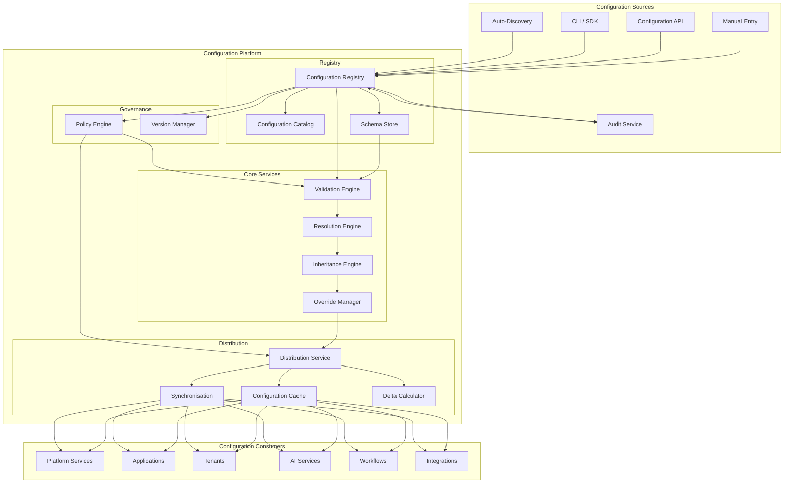
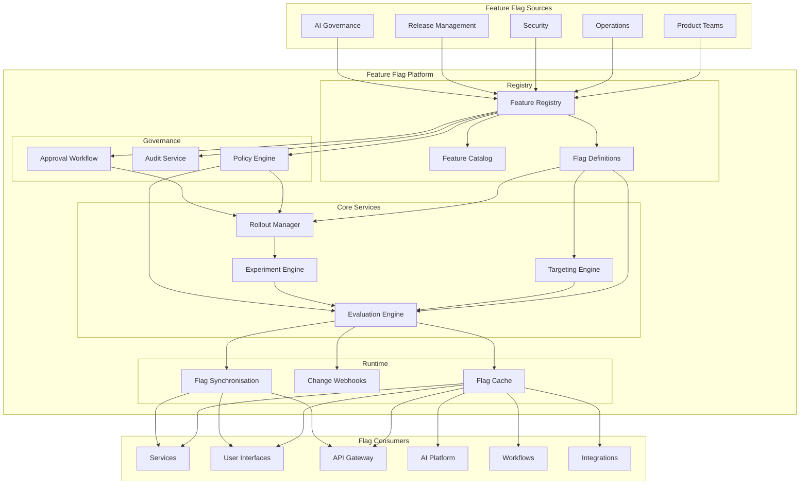
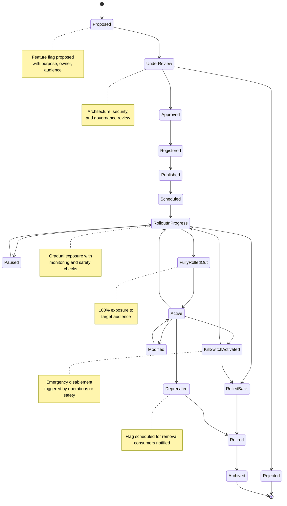
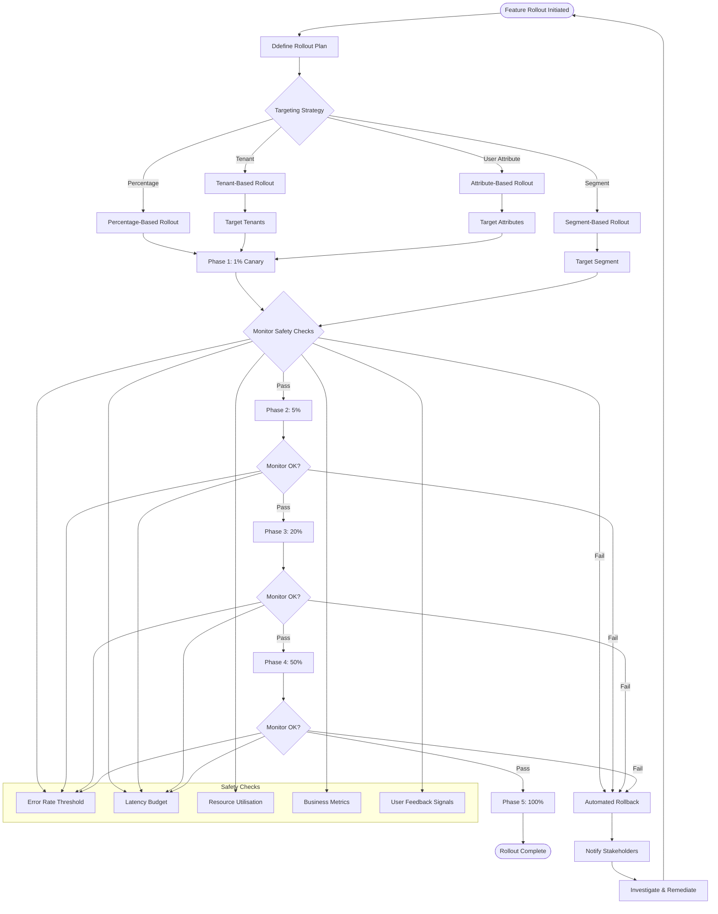
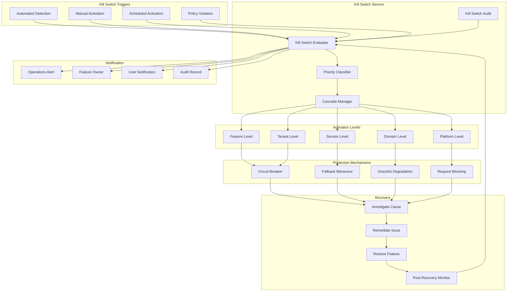
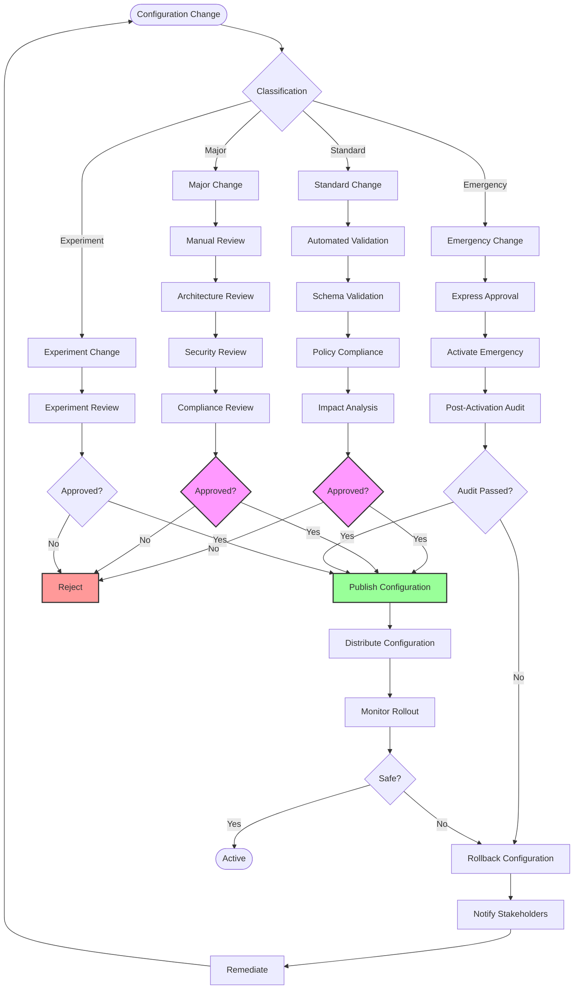
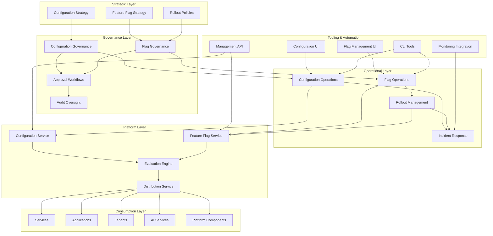
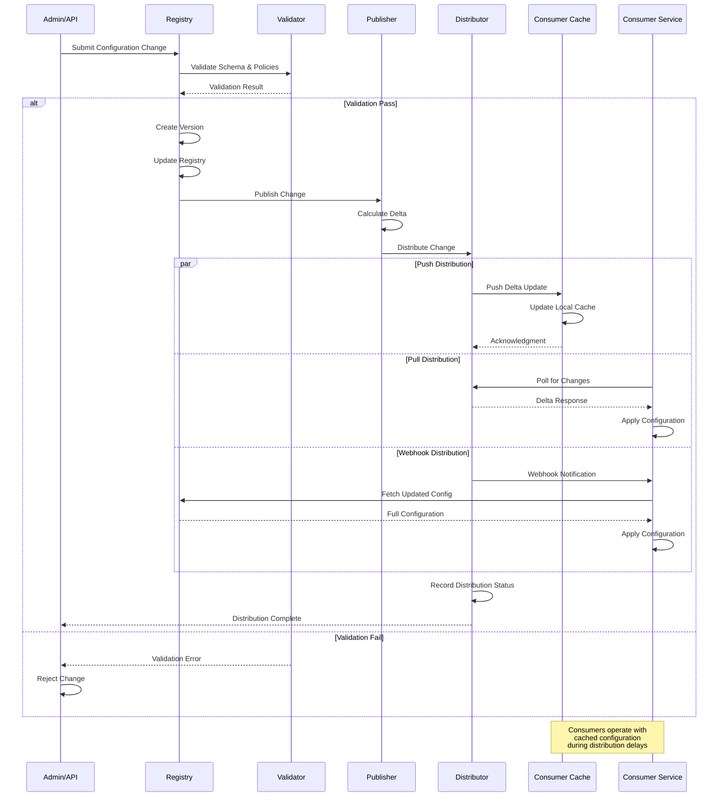

# KB-129 — Feature Flag & Configuration Architecture

**Suite:** Enterprise Platform Services  
**Version:** 1.0  
**Status:** Approved Architecture  
**Classification:** Enterprise Platform Operations Architecture  
**Last Updated:** 2026-07-12

---

## Executive Summary

This document defines the enterprise architecture governing configuration and feature management across DUKADESK. The Enterprise Feature Flag & Configuration Platform provides centralised capabilities for governing runtime behaviour without application modification, enabling controlled feature rollout, operational flexibility, tenant customisation, experimentation, emergency response, and environment-specific behaviour while maintaining enterprise governance and consistency.

Configuration is managed as an enterprise platform capability rather than an application-specific responsibility.

---

## Purpose

Define how DUKADESK centrally governs runtime configuration, feature enablement, experimentation, and operational behaviour across the platform while ensuring security, auditability, consistency, and enterprise scalability.

---

## Scope

### In Scope

- Enterprise configuration architecture
- Feature flag architecture
- Configuration registry
- Configuration catalog
- Feature registry
- Feature lifecycle
- Configuration lifecycle
- Runtime configuration
- Environment configuration
- Tenant configuration
- Application configuration
- Operational configuration
- Progressive rollout architecture
- Experimentation architecture
- Kill switch architecture
- Configuration governance
- Configuration observability
- Configuration auditing
- Configuration evolution

### Out of Scope

- Infrastructure configuration implementation
- CI/CD implementation
- Deployment implementation
- Source code management
- Environment provisioning
- Runtime implementation

*These are covered by separate Knowledge Base documents (see Cross References).*

---

## Architectural Principles

| # | Principle | Description |
|---|-----------|-------------|
| 1 | **Configuration over Code** | Runtime behaviour changes are achieved through configuration changes, not code deployments. |
| 2 | **Runtime Adaptability** | Platform behaviour adapts at runtime through governed configuration changes without service interruption. |
| 3 | **Centralised Governance** | Configuration and feature flags are governed centrally with consistent policies, audit, and lifecycle management. |
| 4 | **Progressive Delivery** | Feature rollouts follow controlled, gradual exposure with monitoring and automated rollback capabilities. |
| 5 | **Safe Experimentation** | Experiments operate within governed guardrails with statistical validity, safety monitoring, and automatic escalation. |
| 6 | **Separation of Configuration and Implementation** | Configuration is authored and managed independently of application code and deployment pipelines. |
| 7 | **Immutable Version History** | Every configuration change creates an immutable version supporting audit, rollback, and lineage tracing. |
| 8 | **Least Privilege** | Configuration access and modification rights are scoped to the minimum required domains and environments. |
| 9 | **Zero Trust** | No configuration consumer, publisher, or system is implicitly trusted. Every operation is authenticated, authorised, and audited. |
| 10 | **Multi-Tenant Isolation** | Tenant configuration and feature flags are strictly isolated. Cross-tenant visibility is prohibited. |
| 11 | **Vendor Independence** | Configuration models and feature flag contracts are provider-agnostic. |
| 12 | **Technology Neutrality** | Configuration is expressed in technology-neutral formats decoupled from specific frameworks. |
| 13 | **Observability by Default** | All configuration and feature flag operations emit structured telemetry for governance, audit, and analytics. |

---

## Canonical Definitions

| Term | Definition |
|------|------------|
| **Configuration** | A governed, versioned set of parameters that control platform, service, or runtime behaviour independently of application code. |
| **Feature Flag** | A governed, versioned toggle that controls the enablement of a specific feature or capability at runtime. |
| **Feature Toggle** | Synonym for feature flag, referring to a boolean or multivariate switch governing feature availability. |
| **Runtime Configuration** | Configuration that can be changed at runtime without service restart or deployment. |
| **Configuration Registry** | The authoritative system of record for all governed configuration items, their schemas, versions, and lifecycle state. |
| **Configuration Catalog** | A discovery interface over the registry enabling search, classification, dependency tracking, and governance reporting. |
| **Feature Registry** | The authoritative system of record for all governed feature flags, their definitions, rollout state, and lifecycle. |
| **Feature Rollout** | The controlled, gradual exposure of a feature to increasing audiences with monitoring and rollback capability. |
| **Kill Switch** | An emergency feature flag that immediately disables a capability across the platform when safety or operational thresholds are breached. |
| **Progressive Delivery** | The practice of gradually releasing features to increasing user segments while monitoring for issues. |
| **Experiment** | A controlled test comparing feature variants to measure impact on defined success metrics within governance guardrails. |
| **Variant** | An alternative configuration or feature behaviour evaluated within an experiment. |
| **Configuration Scope** | The boundary within which a configuration item applies (global, tenant, environment, service, user). |
| **Configuration Profile** | A named collection of configuration items and overrides scoped to a specific consumer or context. |
| **Configuration Baseline** | A known-good, reviewed set of configuration versions serving as a reference for audits and rollbacks. |
| **Configuration Lifecycle** | The progression of a configuration item or feature flag through defined states from proposal through retirement. |
| **Configuration Governance** | The framework of policies, reviews, and approvals governing configuration and feature flag operations. |
| **Configuration Version** | An immutable, timestamped snapshot of a configuration item supporting audit, rollback, and lineage. |
| **Configuration Drift** | The divergence between intended (registered) configuration and actual (deployed) configuration. |
| **Operational Toggle** | A feature flag used for operational purposes such as maintenance mode, traffic shifting, or capacity management. |

---

## Architecture

### 1. Enterprise Configuration Platform Architecture

The Enterprise Configuration Platform provides a centralised capability for governing, storing, versioning, distributing, and consuming configuration across all platform domains.

### 2. Enterprise Feature Flag Platform Architecture

The Enterprise Feature Flag Platform provides a centralised capability for defining, governing, rolling out, monitoring, and retiring feature flags across the enterprise.

### 3. Configuration Taxonomy

Configuration and feature flags are classified by domain, scope, criticality, and change frequency, enabling consistent governance, routing, and lifecycle management.

```mermaid
graph TD
    Root[Configuration & Feature Taxonomy]

    Root --> PLATFORM[Platform Configuration]
    PLATFORM --> PLAT_GLOBAL[Global Settings]
    PLATFORM --> PLAT_REGION[Regional Config]
    PLATFORM --> PLAT_TENANT[Tenant Defaults]
    PLATFORM --> PLAT_FEATURE[Feature Toggles]

    Root --> APP[Application Configuration]
    APP --> APP_BEHAV[Behaviour Config]
    APP --> APP_INT[Integration Config]
    APP --> APP_THROTTLE[Throttle Limits]
    APP --> APP_CACHE[Cache Config]

    Root --> ENV[Environment Configuration]
    ENV --> ENV_DEV[Development]
    ENV --> ENV_STAG[Staging]
    ENV --> ENV_PROD[Production]
    ENV --> ENV_DR[Disaster Recovery]

    Root --> TENANT[Tenant Configuration]
    TENANT --> TENANT_FEATURES[Tenant Features]
    TENANT --> TENANT_LIMITS[Tenant Limits]
    TENANT --> TENANT_WHITELABEL[Whitelabel Config]
    TENANT --> TENANT_INT[Tenant Integrations]

    Root --> OPERATIONAL[Operational Config]
    OPERATIONAL --> OP_MAINT[Maintenance Mode]
    OPERATIONAL --> OP_TRAFFIC[Traffic Shifting]
    OPERATIONAL --> OP_CAPACITY[Capacity Config]
    OPERATIONAL --> OP_RATE[Rate Limiting]

    Root --> SEC[Security Configuration]
    SEC --> SEC_AUTH[Auth Config]
    SEC --> SEC_RATE[Rate Limits]
    SEC --> SEC_SESSION[Session Config]
    SEC --> SEC_LOCKDOWN[Lockdown Mode]

    Root --> AI[AI Configuration]
    AI --> AI_MODEL[Model Selection]
    AI --> AI_ROUTING[Model Routing]
    AI --> AI_SAFETY[Safety Thresholds]
    AI --> AI_COST[Cost Controls]

    Root --> RELEASE[Release Flags]
    RELEASE --> REL_FEATURE[Feature Flags]
    RELEASE --> REL_ROLLOUT[Rollout Percentages]
    RELEASE --> REL_KILL[Kill Switches]

    Root --> EXPERIMENT[Experiment Config]
    EXPERIMENT --> EXP_VARIANTS[Variants]
    EXPERIMENT --> EXP_AUDIENCE[Audience]
    EXPERIMENT --> EXP_METRICS[Metric Config]

    Root --> MKT[Marketplace Config]
    MKT --> MKT_LIST[Listing Config]
    MKT --> MKT_PRICING[Pricing Config]

    Root --> BS[Builder Studio Config]
    BS --> BS_AUTH[Authorisation Config]
    BS --> BS_FEATURES[Feature Config]
```

### 4. Feature Lifecycle

Every feature flag progresses through a defined lifecycle from proposal through retirement, with gated transitions ensuring governance, safety, and auditability.

### 5. Progressive Rollout Architecture

Progressive rollout enables controlled, gradual feature exposure with safety monitoring, automatic rollback, and audience targeting.

### 6. Kill Switch Architecture

The Kill Switch architecture provides centralised emergency mechanisms for immediate feature disablement across the platform with audited activation and recovery paths.

### 7. Configuration Governance Structure

Configuration governance enforces oversight across configuration creation, modification, rollout, and retirement through a structured review and approval framework.

### 8. Enterprise Configuration Operating Model

The configuration operating model defines how configuration and feature flag services are delivered across the enterprise with clear ownership, workflows, tooling, and governance.

### 9. Configuration Distribution Flow

Configuration distribution ensures governed, secure, low-latency propagation of configuration changes from the registry to all consuming services and runtimes.

### 10. Enterprise Configuration Ecosystem

The enterprise configuration ecosystem encompasses all configuration and feature flag domains, their relationships, integration points, and governance boundaries.

```mermaid
graph TB
    subgraph "Configuration Ecosystem"
        subgraph "Platform Config"
            PC_GLOBAL[Global Settings]
            PC_ENV[Environment Config]
            PC_REGION[Regional Config]
            PC_SEC[Security Config]
        end

        subgraph "Feature Flags"
            FF_RELEASE[Release Flags]
            FF_OPS[Operational Flags]
            FF_EXPERIMENT[Experiment Flags]
            FF_KILL[Kill Switches]
            FF_PERMISSION[Permission Flags]
        end

        subgraph "Tenant Config"
            TC_FEATURES[Tenant Features]
            TC_LIMITS[Tenant Limits]
            TC_INT[Tenant Integrations]
            TC_LOCALE[Tenant Locale]
        end

        subgraph "Service Config"
            SC_BEHAVIOUR[Service Behaviour]
            SC_THROTTLE[Throttle Config]
            SC_CACHE[Cache Settings]
            SC_INT[Service Integrations]
        end

        subgraph "Application Config"
            APP_BEHAVIOUR[App Behaviour]
            APP_UI[UI Configuration]
            APP_INT[App Integrations]
        end
    end

    subgraph "Platform Integration"
        POLICY[Policy Engine]
        AUDIT[Audit Platform]
        AUTH[Authorization Service]
        MONITOR[Monitoring Platform]
        AI_PLAT[AI Platform]
        DEPLOY[Deployment Pipeline]
    end

    subgraph "Governance Boundaries"
        GB_CHANGE[Change Governance]
        GB_SEC[Security Governance]
        GB_TENANT[Tenant Isolation]
        GB_EXPERIMENT[Experiment Guardrails]
        GB_COMPLIANCE[Compliance Boundary]
    end

    PC_GLOBAL --> POLICY
    PC_SEC --> AUTH
    FF_RELEASE --> DEPLOY
    FF_OPS --> MONITOR
    FF_EXPERIMENT --> MONITOR
    FF_KILL --> MONITOR
    TC_FEATURES --> POLICY
    TC_LIMITS --> AUTH
    SC_BEHAVIOUR --> MONITOR
    SC_THROTTLE --> POLICY

    PC_GLOBAL -.-> GB_CHANGE
    PC_SEC -.-> GB_SEC
    FF_RELEASE -.-> GB_CHANGE
    FF_EXPERIMENT -.-> GB_EXPERIMENT
    FF_KILL -.-> GB_CHANGE
    TC_FEATURES -.-> GB_TENANT
    TC_FEATURES -.-> GB_COMPLIANCE
    TC_LIMITS -.-> GB_TENANT
```

---

## Lifecycle

| Phase | Description | Gates |
|-------|-------------|-------|
| **Proposal** | Configuration item or feature flag is proposed with purpose, scope, owner, and justification. | Proposal validation |
| **Registration** | Configuration or feature flag is registered in the registry with metadata, schema, and governance classification. | Registry entry verified |
| **Review** | Architecture, security, compliance, and impact review based on classification. | Review sign-off |
| **Approval** | Change is approved through governance workflow appropriate to its classification. | Governance approval |
| **Publication** | Configuration or feature flag is published and made available for distribution. | Publication validation |
| **Activation** | Configuration is activated or feature rollout is initiated with progressive exposure. | Activation validation |
| **Scheduled** | Rollout follows defined schedule with phased audience expansion. | Phase gates |
| **Rollout in Progress** | Gradual exposure with monitoring, safety checks, and rollback capability. | Safety monitor |
| **Fully Rolled Out** | Configuration or feature is at full exposure to target audience. | Full rollout validation |
| **Modification** | Changes follow the same lifecycle from proposal through approval and publication. | Change approval |
| **Monitoring** | Continuous monitoring of configuration impact, feature adoption, and operational safety. | Operational review |
| **Deprecation** | Configuration or feature flag is deprecated; new consumption is blocked; consumers are notified. | Deprecation notice |
| **Retirement** | Configuration or feature flag is retired; all consumer references are migrated or removed. | Retirement approval |
| **Historical Archival** | Configuration versions and feature flag history are archived for compliance and reference. | Archive completion |

---

## Governance

| Domain | Governance Mechanism | Responsible Body |
|--------|---------------------|------------------|
| **Configuration Ownership** | Every configuration item must have a registered owner with lifecycle accountability. | Enterprise Architecture |
| **Feature Ownership** | Every feature flag must have a registered owner accountable for rollout, safety, and retirement. | Product Teams / Operations |
| **Security Governance** | Configuration and feature flag changes undergo security review based on classification. | Security |
| **Compliance Governance** | Configuration in regulated domains undergoes compliance review. | Compliance |
| **AI Governance** | AI-related configuration and feature flags undergo AI governance review. | AI Governance Board |
| **Architecture Governance** | Configuration taxonomy, schema, and platform integration undergo architecture review. | Architecture Review Board |
| **Lifecycle Governance** | Lifecycle transitions for configuration and feature flags are gated and audited. | Platform Engineering |
| **Version Governance** | Configuration versions follow semantic versioning with consumer notification for breaking changes. | Platform Engineering |
| **Audit Governance** | All configuration and feature flag operations are audited with immutable records. | Audit Teams |
| **Enterprise Governance** | Cross-cutting governance framework coordinates configuration, feature, policy, and compliance governance. | Governance Board |

---

## Responsibilities

| Role | Responsibilities |
|------|-----------------|
| **Enterprise Architecture** | Define configuration and feature flag architecture, taxonomy, standards; conduct architecture reviews. |
| **Platform Engineering** | Build and maintain Configuration & Feature Flag Platform, registry, evaluation engine, distribution, and governance tooling. |
| **Operations** | Manage operational toggles, kill switches, incident response; monitor configuration health and rollout safety. |
| **Product Teams** | Define feature flags for product capabilities; manage feature lifecycle; execute experiments. |
| **Security** | Define secure configuration practices; review security-related configuration changes; monitor for violations. |
| **Compliance** | Review compliance-related configuration; ensure regulated configuration adheres to requirements. |
| **AI Governance Board** | Govern AI-related configuration and feature flags; review AI capability enablement. |
| **Release Management** | Manage progressive rollout schedules; approve release-stage feature flags; coordinate rollout phases. |
| **Tenant Administrators** | Manage tenant-specific configuration overrides and feature enablement within tenant scope. |
| **Executive Governance** | Oversee enterprise configuration strategy; approve major configuration changes and policy exceptions. |

---

## Security

| Control Area | Architecture |
|-------------|--------------|
| **Secure Configuration Management** | Configuration data is encrypted at rest and in transit. Access is governed by least privilege. |
| **Authorised Configuration Changes** | Every configuration change is authorised against identity, scope, and change classification. |
| **Tenant Isolation** | Tenant configuration and feature flags are strictly partitioned. Cross-tenant access is prohibited. |
| **Configuration Integrity** | Configuration values are checksummed. Tampering is detectable through cryptographic verification. |
| **Zero Trust** | No configuration consumer, publisher, or system is implicitly trusted. Every operation is authenticated, authorised, and audited. |
| **Least Privilege** | Configuration access and modification rights are scoped to minimum required domains, environments, and roles. |
| **Auditability** | Every configuration operation is logged with identity, item, value, and timestamp. |
| **Provenance** | Every configuration value is traceable to its author, approval chain, and change history. |
| **Policy Enforcement** | Security policies are evaluated at configuration write, publication, and distribution. |
| **Secure Rollout** | Feature rollouts include security validation gates. Kill switches provide emergency security response. |

---

## Privacy

| Domain | Architecture |
|--------|--------------|
| **Privacy-Aware Configuration** | Configuration items minimise personal data. Privacy-sensitive configuration is classified and governed. |
| **Consent-Aware Feature Enablement** | Feature flags affecting personal data processing respect consent preferences. |
| **Regional Governance** | Configuration respects regional data residency and privacy requirements. |
| **Data Minimisation** | Configuration values capture only data necessary for their purpose. |
| **Regulatory Compliance** | Configuration in regulated domains enforces compliance policies at write and distribution. |
| **Cross-Border Restrictions** | Configuration distribution respects regional boundaries. Regional configuration instances are used where required. |
| **Audit Retention** | Configuration audit logs are retained per regulatory requirements with privacy safeguards. |
| **Privacy Assurance** | Configuration does not inadvertently expose personal data or enable privacy violations. |

---

## Performance

| Consideration | Architectural Approach |
|---------------|----------------------|
| **Enterprise-Scale Configuration Distribution** | Configuration distribution scales horizontally. Consumers resolve from regional caches. |
| **Low-Latency Configuration Retrieval** | Flag evaluation and config resolution complete in sub-millisecond through local caching and pre-computation. |
| **Elastic Scalability** | Configuration platform scales with number of configuration items, flags, and consuming services. |
| **High Availability** | Configuration registry and distribution services are deployed across availability zones. |
| **Operational Resilience** | Consumers operate with cached configuration during platform disruptions. Stale configuration extends TTL during outages. |
| **Multi-Region Readiness** | Regional configuration caches provide low-latency access. Cross-region synchronisation is asynchronous. |
| **Efficient Synchronisation** | Delta-based updates minimise distribution bandwidth. Full synchronisation is used for new consumers or recovery. |
| **Global Rollout** | Configuration changes propagate to global caches within defined latency SLAs. |

---

## Observability

| Domain | Architecture |
|--------|--------------|
| **Feature Adoption Metrics** | Flag evaluation counts, audience reach, rollout percentage, and adoption rate are tracked per flag. |
| **Configuration Utilisation** | Configuration access frequency, consumer distribution, and dependency mapping are monitored. |
| **Rollout Analytics** | Rollout phase progression, safety check results, rollback frequency, and rollout duration are analysed. |
| **Experiment Analytics** | Experiment variant distribution, statistical significance, metric impact, and guardrail violations are tracked. |
| **Configuration Drift Reporting** | Drift between registered and deployed configuration is detected and reported. |
| **Governance Dashboards** | Role-specific dashboards expose configuration portfolio health, change frequency, approval cycle times, and compliance status. |
| **SLA Monitoring** | Configuration distribution latency SLAs, evaluation latency SLAs, and availability SLAs are monitored. |
| **Operational Reporting** | Kill switch activations, emergency changes, rollback events, and incident-related configuration changes are reported. |
| **Executive Reporting** | Executive dashboards summarise configuration portfolio, feature adoption, rollout velocity, and operational risk. |
| **Enterprise Platform Insights** | Cross-domain analytics reveal configuration trends, optimisation opportunities, and emerging operational patterns. |

---

## Failure Scenarios

| Scenario | Architectural Response |
|----------|-----------------------|
| **Configuration Drift** | Drift detection alerts the configuration owner. Automated remediation re-publishes the intended configuration. |
| **Failed Rollouts** | Safety check failure triggers automated rollback. Rollback restores previous configuration version. Incident is escalated. |
| **Incorrect Targeting** | Targeting misconfiguration is detected through monitoring. Feature flag is rolled back. Correction is deployed through governance workflow. |
| **Configuration Corruption** | Immutable version history prevents corruption. Corrupted configuration is restored from previous version. |
| **Unauthorised Configuration Changes** | Authorisation failure blocks the change. Violation is logged, audited, and escalated. |
| **Cross-Tenant Configuration Leakage** | Cross-tenant configuration access is blocked. Violation is logged and escalated immediately. |
| **Rollback Failures** | Rollback fails due to schema incompatibility. A new version reverting the change is created instead. |
| **Kill Switch Failures** | Kill switch activation fails. Emergency escalation triggers manual intervention. Redundant kill switch mechanisms provide backup. |
| **Experiment Conflicts** | Conflicting experiment configurations are detected at registration. Conflict resolution policy determines precedence. |
| **Governance Violations** | Policy enforcement blocks non-compliant configuration changes. Violation is logged, audited, and escalated. |
| **Recovery Failures** | Configuration state recovery fails. Redundant replica is promoted. Manual investigation is initiated. |
| **Configuration Synchronisation Failures** | Synchronisation failure alerts operations. Consumers continue with cached configuration. Incremental retry resolves divergence. |

---

## Anti-Patterns

| Anti-Pattern | Prohibited Because | Enforced By |
|--------------|-------------------|-------------|
| **Hardcoded Runtime Configuration** | Prevents runtime adaptability, creates deployment coupling, and bypasses governance. | Code review; static analysis |
| **Application-Owned Feature Flags** | Fragments flag governance, prevents enterprise visibility, and creates safety risks. | Architecture review; platform policy |
| **Environment-Specific Source Code** | Embeds environment knowledge in code, reducing portability and increasing deployment risk. | Architecture review |
| **Manual Production Configuration** | Introduces human error, inconsistency, and audit gaps. | Automated distribution |
| **Duplicate Configuration Repositories** | Fragments configuration, creates inconsistency, and increases maintenance burden. | Platform consolidation policy |
| **Hidden Operational Toggles** | Untracked operational toggles bypass governance, audit, and incident response. | Registry mandatory check |
| **Unregistered Feature Flags** | Flags outside the registry are invisible to governance, rollout management, and audit. | Registry enforcement |
| **Permanent Temporary Flags** | Temporary flags left permanently active create technical debt and governance complexity. | Lifecycle governance |
| **Configuration Without Governance** | Ungoverned configuration lacks review, approval, and audit. | Governance enforcement |
| **Direct Runtime Modification Outside Governance** | Bypasses approval, audit, and rollback capabilities. | Platform enforcement |

---

## Future Evolution

| Evolution Path | Architectural Preparation |
|---------------|--------------------------|
| **AI-Assisted Configuration Optimization** | ML models analyse configuration usage patterns and recommend optimisation, default changes, and cleanup. |
| **Autonomous Rollout Intelligence** | Rollout engine autonomously adjusts progression based on real-time safety metrics and business impact. |
| **Predictive Operational Tuning** | Configuration and flag settings are predictively adjusted based on usage patterns, load forecasts, and incident history. |
| **Federated Configuration Ecosystems** | Configuration is synchronised across enterprise boundaries with federated governance and audit. |
| **Intelligent Experimentation** | Experiment engine autonomously designs, executes, and analyses experiments within governance guardrails. |
| **Semantic Configuration Management** | Configuration items are semantically discoverable and automatically bound to consuming services. |
| **Cross-Platform Configuration Federation** | Configuration is federated across platform boundaries with governed access and synchronisation. |
| **Enterprise Operational Intelligence** | Cross-domain operational analytics provide predictive insights, anomaly detection, and optimisation recommendations. |

---

## Cross References

| Document ID | Title | Relation |
|-------------|-------|----------|
| **KB-098** | Integration Policy Architecture | Defines integration policies referenced by configuration. |
| **KB-107** | Enterprise Platform Services Overview Architecture | Defines the platform services context for configuration management. |
| **KB-116** | AI Platform Architecture | Defines AI platform configuration governed by this architecture. |
| **KB-121** | AI Safety & Governance Architecture | Defines AI safety configuration governed by this architecture. |
| **KB-123** | Enterprise Policy Framework Architecture | Defines policies governing configuration and feature flag behaviour. |
| **KB-124** | Policy Management Architecture | Defines policy enforcement for configuration governance. |
| **KB-125** | Authorization Architecture | Defines authorisation for configuration changes. |
| **KB-126** | Audit & Compliance Architecture | Defines audit framework for configuration records. |
| **KB-130** | Risk Management Architecture | Defines risk framework for configuration change management. |
| **KB-140** | Enterprise Platform Services Reference Architecture | Defines the overarching reference architecture for enterprise platform services. |

---

## Acceptance Criteria

- [x] Defines the canonical Enterprise Feature Flag & Configuration architecture.
- [x] Treats configuration and feature management as centralised enterprise capabilities.
- [x] Defines registries, lifecycle, rollout, experimentation, governance, observability, and security.
- [x] Supports enterprise-scale, multi-tenant, vendor-independent configuration management.
- [x] Includes all 10 required Mermaid diagrams.
- [x] Cross-references related Knowledge Base documents.
- [x] Contains no implementation guidance.

---

## Completion Instructions

1. **Mark KB-129 as Completed** — This document constitutes the completed architecture specification.
2. **Update the Progress Registry** — Record KB-129 as Approved Architecture in the Knowledge Base registry.
3. **Cross-Reference Related Documents** — Ensure KB-098 through KB-140 reference this document.
4. **Queue Next Assignment** — KB-130 – Risk Management Architecture is the next builder assignment.

---

## Critical DUKADESK Architectural Rule

> **All runtime configuration and feature enablement within DUKADESK shall be governed exclusively through the centralised Enterprise Feature Flag & Configuration Platform. No application, service, workflow, AI capability, integration, tenant, or runtime component shall implement independent configuration mechanisms or feature toggles outside the canonical enterprise architecture, ensuring controlled rollout, operational safety, governance, auditability, consistency, and enterprise-wide adaptability.**
