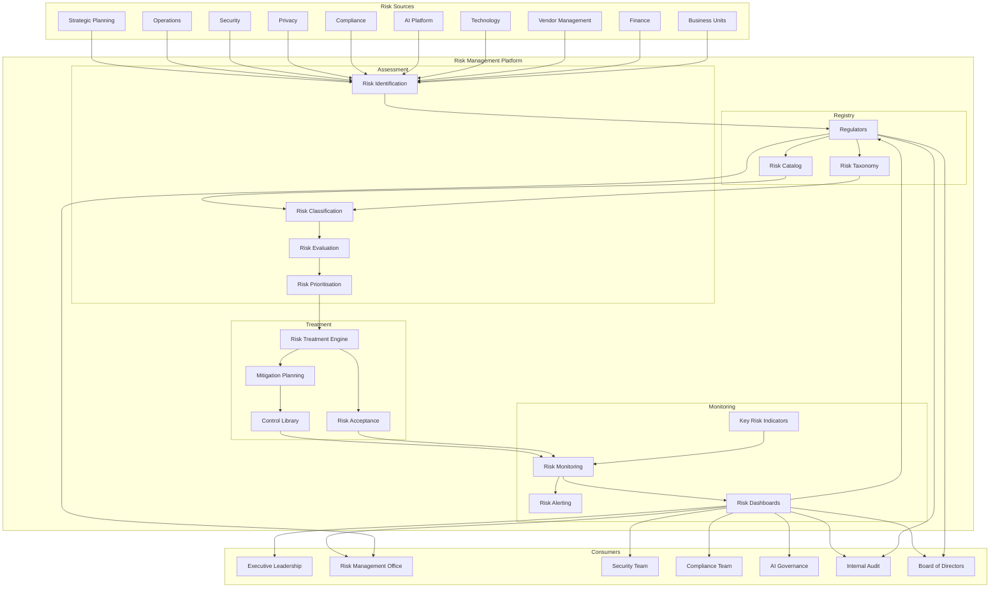
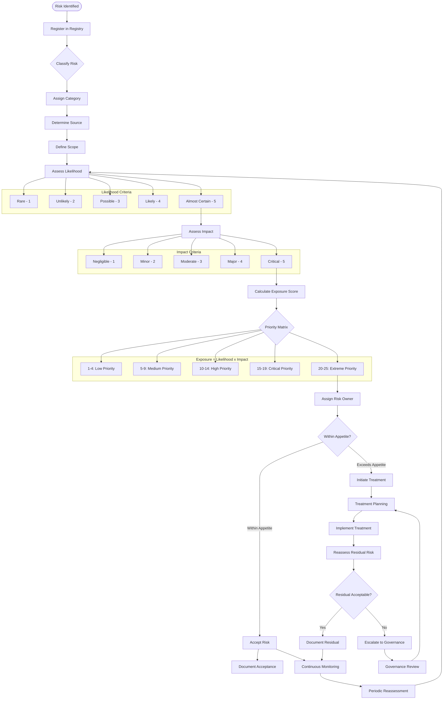
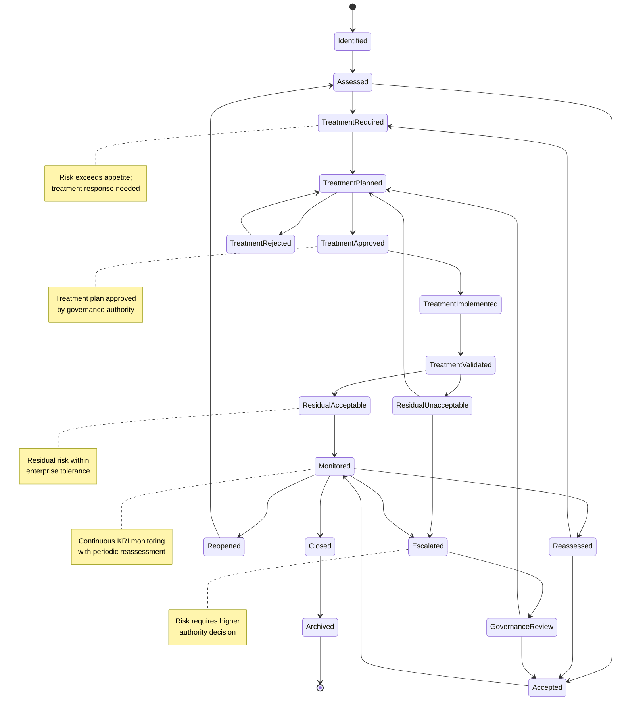
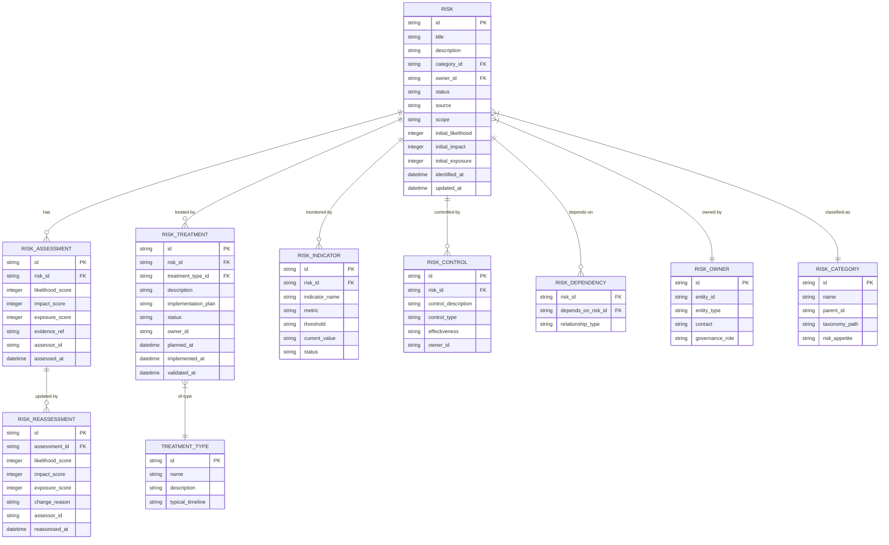
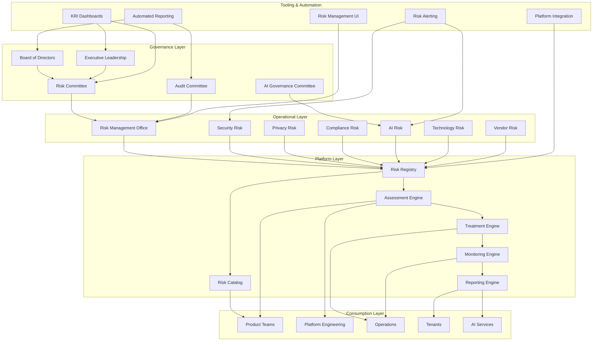
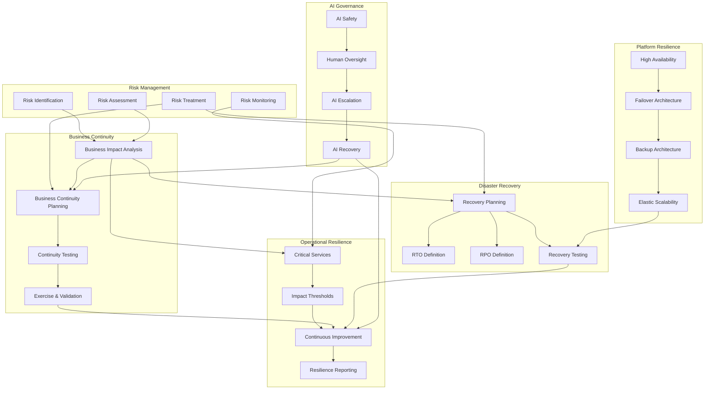
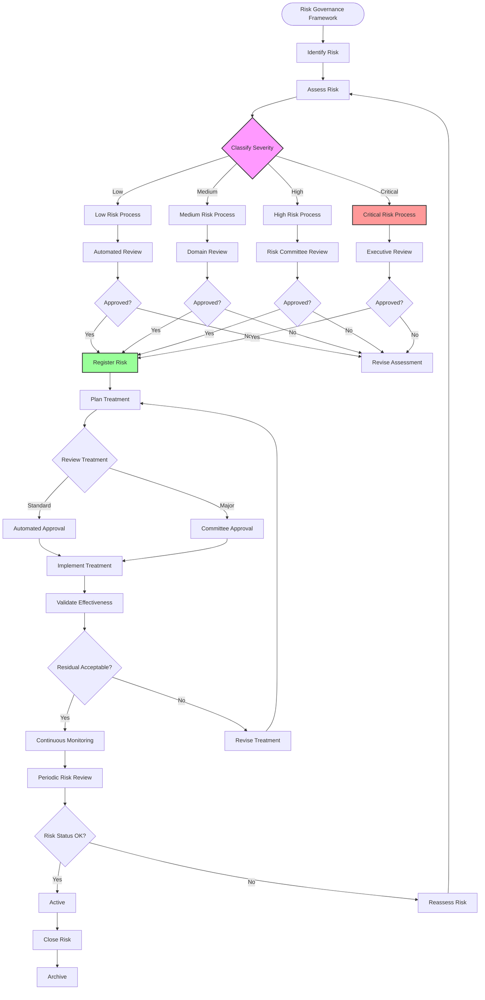

# KB-130 — Enterprise Risk Management Architecture

**Suite:** Enterprise Platform Services  
**Version:** 1.0  
**Status:** Approved Architecture  
**Classification:** Enterprise Governance Architecture  
**Last Updated:** 2026-07-12

---

## Executive Summary

This document defines the enterprise architecture governing risk management across DUKADESK. The Enterprise Risk Management Platform provides centralised capabilities for identifying, classifying, evaluating, prioritising, mitigating, monitoring, and governing enterprise risks while ensuring alignment with business objectives, security posture, compliance obligations, operational resilience, AI governance, and organisational strategy.

Risk management functions as a continuous enterprise capability integrated into every architectural domain rather than as an isolated operational process.

---

## Purpose

Define how DUKADESK consistently governs enterprise risks throughout the entire platform lifecycle while enabling informed decision-making, proactive governance, resilience, and continuous improvement.

---

## Scope

### In Scope

- Enterprise risk management architecture
- Risk taxonomy
- Risk registry
- Risk catalog
- Risk lifecycle
- Risk governance
- Risk ownership
- Risk assessment architecture
- Risk treatment architecture
- Risk monitoring
- Risk analytics
- Risk reporting
- Enterprise resilience
- AI risk governance
- Operational risk
- Strategic risk
- Vendor risk
- Technology risk
- Business continuity risk
- Risk evolution

### Out of Scope

- Incident response implementation
- Security implementation
- Compliance implementation
- Disaster recovery implementation
- Monitoring implementation
- Business continuity implementation

*These are addressed by dedicated Knowledge Base documents (see Cross References).*

---

## Architectural Principles

| # | Principle | Description |
|---|-----------|-------------|
| 1 | **Risk-Aware Architecture** | Every architectural decision considers risk as a first-class input. Risk awareness is embedded in platform design. |
| 2 | **Risk by Design** | Risk assessment is integrated into architecture, governance, and operational processes from inception, not retrofitted. |
| 3 | **Continuous Risk Governance** | Risk management is a continuous, real-time capability, not a periodic review activity. |
| 4 | **Enterprise Visibility** | All enterprise risks are visible through a single, governed risk registry. No risk exists outside enterprise visibility. |
| 5 | **Defense in Depth** | Risk controls are layered across architecture, governance, operations, and monitoring to provide depth of protection. |
| 6 | **Zero Trust Alignment** | Risk architecture aligns with Zero Trust principles. No implicit trust is granted to any component, identity, or system. |
| 7 | **Risk Ownership** | Every identified risk has a registered owner accountable for assessment, treatment, and monitoring. |
| 8 | **Evidence-Based Assessment** | Risk assessments are based on verifiable evidence, not subjective judgement alone. |
| 9 | **Vendor Independence** | Risk models and frameworks are provider-agnostic, supporting any risk management methodology. |
| 10 | **Technology Neutrality** | Risk taxonomies and assessments are expressed in technology-neutral formats. |
| 11 | **Lifecycle Governance** | Risks progress through governed lifecycles with assessment, treatment, and closure gates. |
| 12 | **Enterprise Resilience** | Risk management directly informs enterprise resilience strategy, business continuity, and disaster recovery. |
| 13 | **Continuous Improvement** | Risk posture continuously improves through monitoring, review, lessons learned, and adaptive controls. |

---

## Canonical Definitions

| Term | Definition |
|------|------------|
| **Risk** | The effect of uncertainty on enterprise objectives, measured in terms of likelihood and impact. |
| **Risk Register** | A documented inventory of identified risks, their assessments, treatments, and status. |
| **Risk Registry** | The authoritative system of record for all governed enterprise risks, their metadata, assessments, treatments, and lifecycle state. |
| **Risk Catalog** | A discovery interface over the registry enabling search, classification, aggregation, and governance reporting. |
| **Risk Owner** | The entity accountable for the assessment, treatment, monitoring, and reporting of a specific risk. |
| **Risk Assessment** | The systematic evaluation of a risk's likelihood, impact, exposure, and priority. |
| **Risk Classification** | The assignment of a risk to a defined category within the enterprise risk taxonomy. |
| **Risk Treatment** | A planned response to address a risk through avoidance, reduction, transfer, acceptance, or mitigation. |
| **Residual Risk** | The remaining risk exposure after treatment measures have been applied. |
| **Risk Appetite** | The amount of risk the enterprise is willing to accept in pursuit of its objectives. |
| **Risk Tolerance** | The acceptable variation from risk appetite for specific risk categories. |
| **Risk Indicator** | A metric or signal used to monitor changes in risk likelihood, impact, or exposure over time. |
| **Risk Event** | An occurrence that has caused or could cause a deviation from expected outcomes. |
| **Risk Exposure** | The magnitude of potential loss or harm associated with a risk, considering likelihood and impact. |
| **Risk Monitoring** | Continuous surveillance of risk indicators, treatment effectiveness, and emerging risk factors. |
| **Risk Governance** | The framework of policies, reviews, roles, and approvals governing enterprise risk management. |
| **Risk Lifecycle** | The progression of a risk from identification through assessment, treatment, monitoring, and closure. |
| **Risk Response** | An action taken to address a risk, including treatment implementation or escalation. |
| **Risk Escalation** | The process of elevating a risk to higher authority levels based on severity, exposure, or governance thresholds. |
| **Enterprise Resilience** | The enterprise's ability to anticipate, prepare for, respond to, and recover from adverse events. |

---

## Architecture

### 1. Enterprise Risk Management Architecture

The Enterprise Risk Management Platform provides a centralised capability for identifying, assessing, treating, monitoring, and governing risks across all enterprise domains.

### 2. Risk Taxonomy

Risks are classified by domain, source, impact type, and severity, enabling consistent assessment, reporting, and governance across the enterprise.

```mermaid
graph TD
    Root[Enterprise Risk Taxonomy]

    Root --> STRAT[Strategic Risk]
    STRAT --> STRAT_MKT[Market Risk]
    STRAT --> STRAT_COMP[Competitive Risk]
    STRAT --> STRAT_INV[Investment Risk]
    STRAT --> STRAT_REP[Reputational Risk]
    STRAT --> STRAT_GROWTH[Growth Risk]

    Root --> OPS[Operational Risk]
    OPS --> OPS_PROC[Process Risk]
    OPS --> OPS_PEOPLE[People Risk]
    OPS --> OPS_SYSTEM[System Risk]
    OPS --> OPS_EXTERNAL[External Event Risk]
    OPS --> OPS_CHANGE[Change Risk]

    Root --> TECH[Technology Risk]
    TECH --> TECH_ARCH[Architecture Risk]
    TECH --> TECH_INT[Integration Risk]
    TECH --> TECH_SCALE[Scalability Risk]
    TECH --> TECH_PERF[Performance Risk]
    TECH --> TECH_DEP[Deprecation Risk]
    TECH --> TECH_INFRA[Infrastructure Risk]

    Root --> SEC[Cybersecurity Risk]
    SEC --> SEC_THREAT[Threat Risk]
    SEC --> SEC_VULN[Vulnerability Risk]
    SEC --> SEC_BREACH[Breach Risk]
    SEC --> SEC_ACCESS[Access Risk]
    SEC --> SEC_SUPPLY[Supply Chain Risk]

    Root --> PRIV[Privacy Risk]
    PRIV --> PRIV_DATA[Data Risk]
    PRIV --> PRIV_CONSENT[Consent Risk]
    PRIV --> PRIV_XFER[Transfer Risk]
    PRIV --> PRIV_RIGHTS[Rights Risk]

    Root --> COMP[Compliance Risk]
    COMP --> COMP_REG[Regulatory Risk]
    COMP --> COMP_LEGAL[Legal Risk]
    COMP --> COMP_CONTRACT[Contract Risk]
    COMP --> COMP_STANDARD[Standards Risk]

    Root --> AI[AI Risk]
    AI --> AI_SAFETY[Safety Risk]
    AI --> AI_BIAS[Bias Risk]
    AI --> AI_ETHICS[Ethics Risk]
    AI --> AI_GOV[Governance Risk]
    AI --> AI_HALLUCINATION[Hallucination Risk]
    AI --> AI_ALIGNMENT[Alignment Risk]

    Root --> FIN[Financial Risk]
    FIN --> FIN_CREDIT[Credit Risk]
    FIN --> FIN_LIQUIDITY[Liquidity Risk]
    FIN --> FIN_COST[Cost Risk]
    FIN --> FIN_FRAUD[Fraud Risk]

    Root --> VENDOR[Vendor Risk]
    VENDOR --> VENDOR_DEP[Dependency Risk]
    VENDOR --> VENDOR_SLA[SLA Risk]
    VENDOR --> VENDOR_LOCK[Lock-In Risk]
    VENDOR --> VENDOR_SOLVENCY[Solvency Risk]

    Root --> DATA[Data Risk]
    DATA --> DATA_QUALITY[Quality Risk]
    DATA --> DATA_INTEGRITY[Integrity Risk]
    DATA --> DATA_LOSS[Loss Risk]
    DATA --> DATA_GOV[Governance Risk]

    Root --> BCP[Business Continuity Risk]
    BCP --> BCP_DISASTER[Disaster Risk]
    BCP --> BCP_RECOVERY[Recovery Risk]
    BCP --> BCP_AVAIL[Availability Risk]

    Root --> PLATFORM[Platform Risk]
    PLATFORM --> PLATFORM_TENANT[Tenant Risk]
    PLATFORM --> PLATFORM_MKT[Marketplace Risk]
    PLATFORM --> PLATFORM_BS[Builder Studio Risk]

    Root --> FUT[Future Risk Domains]
```

### 3. Risk Assessment Architecture

Risk assessment evaluates likelihood, impact, exposure, and priority through a structured, evidence-based methodology with defined scoring criteria.

### 4. Risk Treatment Lifecycle

Risk treatment follows a structured lifecycle from identification through treatment selection, implementation, validation, and residual risk acceptance.

### 5. Enterprise Risk Registry

The enterprise risk registry is the authoritative system of record for all governed risks, their assessments, treatments, controls, indicators, and lifecycle.

### 6. Enterprise Risk Operating Model

The risk operating model defines how risk management services are delivered across the enterprise with clear ownership, workflows, governance, and tooling.

### 7. Enterprise Resilience Architecture

Enterprise resilience integrates risk management, business continuity, disaster recovery, operational resilience, and AI governance into a cohesive framework.

### 8. Risk Governance Structure

Risk governance enforces oversight across risk identification, assessment, treatment, and monitoring through a structured framework with defined escalation paths.

### 9. Risk Reporting Architecture

Risk reporting provides role-specific views and reports across all risk domains, audiences, and governance levels.

```mermaid
graph TB
    subgraph "Report Sources"
        REG[Risk Registry]
        KRI[Key Risk Indicators]
        TREAT[Treatment Tracking]
        INCIDENT[Incident Data]
        AUDIT[Audit Findings]
        ASSESS[Risk Assessments]
    end

    subgraph "Report Types"
        RP_EXEC[Executive Risk Summary]
        RP_BOARD[Board Risk Report]
        RP_OPERATIONAL[Operational Risk Report]
        RP_SEC[Security Risk Report]
        RP_AI[AI Risk Report]
        RP_COMP[Compliance Risk Report]
        RP_VENDOR[Vendor Risk Report]
        RP_TENANT[Tenant Risk Report]
        RP_TREND[Risk Trend Analysis]
        RP_HEATMAP[Risk Heat Map]
    end

    subgraph "Distribution"
        DASH[Risk Dashboards]
        PDF[PDF Reports]
        API[Report API]
        EXPORT[Data Export]
        ALERT[Risk Alerts]
    end

    subgraph "Consumers"
        EXEC[Executive Leadership]
        BOARD[Board of Directors]
        RISK_OFF[Risk Management Office]
        SEC[Security Team]
        COMP[Compliance Team]
        AI_GOV[AI Governance]
        AUDIT[Internal Audit]
        REG[Regulators]
        TENANTS[Tenants]
    end

    REG --> RP_EXEC
    REG --> RP_BOARD
    REG --> RP_HEATMAP
    KRI --> RP_OPERATIONAL
    KRI --> RP_TREND
    TREAT --> RP_OPERATIONAL
    INCIDENT --> RP_SEC
    INCIDENT --> RP_AI
    AUDIT --> RP_COMP
    ASSESS --> RP_VENDOR
    ASSESS --> RP_TENANT

    RP_EXEC --> DASH
    RP_EXEC --> PDF
    RP_BOARD --> PDF
    RP_BOARD --> DASH
    RP_OPERATIONAL --> DASH
    RP_OPERATIONAL --> API
    RP_SEC --> DASH
    RP_SEC --> ALERT
    RP_AI --> DASH
    RP_AI --> ALERT
    RP_COMP --> PDF
    RP_COMP --> API
    RP_VENDOR --> EXPORT
    RP_TENANT --> EXPORT
    RP_TENANT --> DASH
    RP_TREND --> DASH
    RP_HEATMAP --> DASH
    RP_HEATMAP --> PDF

    DASH --> EXEC
    DASH --> RISK_OFF
    DASH --> SEC
    DASH --> AI_GOV
    PDF --> BOARD
    PDF --> REG
    API --> AUDIT
    EXPORT --> TENANTS
    ALERT --> RISK_OFF
    ALERT --> SEC
    ALERT --> AI_GOV
```

### 10. Enterprise Risk Ecosystem

The enterprise risk ecosystem encompasses all risk domains, their relationships, integration points, and governance boundaries.

```mermaid
graph TB
    subgraph "Risk Ecosystem"
        subgraph "Governance Risks"
            RG_STRAT[Strategic Risk]
            RG_COMP[Compliance Risk]
            RG_REP[Reputational Risk]
        end

        subgraph "Operational Risks"
            RO_PROC[Process Risk]
            RO_PEOPLE[People Risk]
            RO_CHANGE[Change Risk]
            RO_EXTERNAL[External Risk]
        end

        subgraph "Technology Risks"
            RT_ARCH[Architecture Risk]
            RT_INT[Integration Risk]
            RT_SCALE[Scalability Risk]
            RT_DEP[Deprecation Risk]
        end

        subgraph "Security & Privacy Risks"
            RS_SEC[Cybersecurity Risk]
            RS_PRIV[Privacy Risk]
            RS_SUPPLY[Supply Chain Risk]
        end

        subgraph "AI Risks"
            RA_SAFETY[AI Safety Risk]
            RA_BIAS[Bias Risk]
            RA_ETHICS[Ethics Risk]
            RA_GOV[Governance Risk]
        end

        subgraph "Business Risks"
            RB_FIN[Financial Risk]
            RB_VENDOR[Vendor Risk]
            RB_DATA[Data Risk]
            RB_BCP[Business Continuity]
        end
    end

    subgraph "Platform Integration"
        POLICY[Policy Engine]
        AUDIT[Audit Platform]
        COMPLIANCE[Compliance Platform]
        SECURITY[Security Platform]
        AI_GOV_PLAT[AI Governance Platform]
        OPS[Operations Platform]
    end

    subgraph "Governance Boundaries"
        GB_APPETITE[Risk Appetite]
        GB_TOLERANCE[Risk Tolerance]
        GB_ESCALATION[Escalation Thresholds]
        GB_REPORTING[Reporting Requirements]
        GB_TENANT[Tenant Risk Boundary]
    end

    RG_STRAT --> POLICY
    RG_COMP --> COMPLIANCE
    RG_COMP --> AUDIT
    RO_PROC --> OPS
    RT_ARCH --> POLICY
    RS_SEC --> SECURITY
    RS_PRIV --> COMPLIANCE
    RA_SAFETY --> AI_GOV_PLAT
    RA_BIAS --> AI_GOV_PLAT
    RB_FIN --> POLICY
    RB_VENDOR --> OPS
    RB_BCP --> OPS

    RG_STRAT -.-> GB_APPETITE
    RG_COMP -.-> GB_TOLERANCE
    RA_SAFETY -.-> GB_ESCALATION
    RO_PROC -.-> GB_REPORTING
    RB_VENDOR -.-> GB_TENANT
    RS_PRIV -.-> GB_TENANT
```

---

## Lifecycle

| Phase | Description | Gates |
|-------|-------------|-------|
| **Identification** | Risk is identified from any enterprise source and documented with initial context. | Identification validation |
| **Registration** | Risk is registered in the Risk Registry with initial metadata and scope. | Registry entry verified |
| **Assessment** | Risk is evaluated for likelihood, impact, exposure, and priority using evidence-based methodology. | Assessment sign-off |
| **Classification** | Risk is assigned to taxonomy category, risk tier, and governance classification. | Classification validation |
| **Prioritisation** | Risk is prioritised against enterprise risk appetite and tolerance thresholds. | Priority assignment |
| **Treatment** | Treatment response is planned, approved, implemented, and validated. | Treatment approval |
| **Monitoring** | Risk is continuously monitored through KRIs, control effectiveness, and emerging indicators. | Monitoring activation |
| **Review** | Periodic review of risk assessment, treatment effectiveness, and residual risk. | Review sign-off |
| **Escalation** | Risk exceeding thresholds or remaining outside appetite is escalated to appropriate governance authority. | Escalation acceptance |
| **Reassessment** | Risk is reassessed after treatment, environmental change, or trigger event. | Reassessment validation |
| **Closure** | Risk is closed when residual risk is accepted or risk is no longer relevant. | Closure approval |
| **Historical Archival** | Risk record is archived for compliance, audit, and reference. | Archive completion |

---

## Governance

| Domain | Governance Mechanism | Responsible Body |
|--------|---------------------|------------------|
| **Risk Ownership** | Every risk must have a registered owner accountable for assessment, treatment, and monitoring. | Enterprise Architecture |
| **Risk Governance Board** | Cross-enterprise risk governance body oversees risk framework, appetite, and major risk decisions. | Risk Committee |
| **Security Governance** | Security risks are governed within the security risk framework with dedicated oversight. | Security |
| **Compliance Governance** | Compliance risks are governed within the compliance risk framework with regulatory alignment. | Compliance |
| **AI Governance** | AI risks are governed within the AI risk framework with ethics, safety, and bias oversight. | AI Governance Board |
| **Architecture Governance** | Technology and architecture risks undergo architecture review for platform impact. | Architecture Review Board |
| **Lifecycle Governance** | Risk lifecycle transitions are gated and audited. | Platform Engineering |
| **Audit Governance** | Risk management processes and controls are audited for effectiveness and compliance. | Internal Audit |
| **Executive Governance** | Enterprise-level risk decisions, appetite, and tolerance are governed by executive leadership. | Executive Leadership |
| **Enterprise Governance** | Cross-cutting governance framework coordinates risk, policy, compliance, AI, and audit governance. | Governance Board |

---

## Responsibilities

| Role | Responsibilities |
|------|-----------------|
| **Executive Leadership** | Set risk appetite and tolerance; approve critical risk decisions; own enterprise risk strategy. |
| **Enterprise Architecture** | Define risk architecture, taxonomy, and framework; conduct architecture risk reviews; maintain risk registry. |
| **Risk Management Office** | Own enterprise risk management process, methodology, and tooling; coordinate risk assessments; report risk posture. |
| **Security** | Identify and assess security risks; implement security controls; monitor security risk indicators. |
| **Compliance** | Identify and assess compliance risks; ensure regulatory alignment; report compliance risk posture. |
| **AI Governance Board** | Identify and assess AI risks; govern AI safety, ethics, and bias; report AI risk posture. |
| **Platform Engineering** | Build and maintain Risk Management Platform; integrate risk capabilities into platform services. |
| **Operations** | Identify operational risks; implement operational controls; monitor operational risk indicators. |
| **Product Teams** | Identify product-domain risks; implement risk treatments; report risk status for owned domains. |
| **Internal Audit** | Audit risk management processes and controls; verify risk assessment accuracy; report audit findings. |
| **Tenant Administrators** | Identify tenant-specific risks; manage tenant risk posture within enterprise framework. |

---

## Security

| Control Area | Architecture |
|-------------|--------------|
| **Security Risk Governance** | Security risks are identified, assessed, and treated within the enterprise risk framework with dedicated security risk taxonomy. |
| **Zero Trust Alignment** | Risk assessment incorporates Zero Trust principles. Risks associated with trust assumptions are explicitly evaluated. |
| **Risk Authorisation** | Risk registry access and modification are authorised based on role, domain, and sensitivity. |
| **Secure Evidence** | Risk assessment evidence is stored with integrity protection. Evidence provenance is maintained. |
| **Tenant Isolation** | Tenant risks are strictly partitioned in the risk registry. Cross-tenant risk visibility is prohibited. |
| **Least Privilege** | Risk data access is scoped to minimum required domains and roles. |
| **Auditability** | Every risk operation is logged with identity, action, and timestamp. |
| **Provenance** | Every risk assessment and treatment decision is traceable to its source and author. |
| **Policy Enforcement** | Security policies governing risk data handling and access are enforced at every layer. |
| **Trust Verification** | Risk data integrity is verifiable through cryptographic checksums. |

---

## Privacy

| Domain | Architecture |
|--------|--------------|
| **Privacy Risk Governance** | Privacy risks are identified, assessed, and treated within the enterprise risk framework with dedicated privacy risk taxonomy. |
| **Data Minimisation** | Risk data captures only information necessary for assessment and governance. |
| **Regulatory Compliance** | Risk management processes comply with applicable privacy regulations. |
| **Consent Governance** | Privacy risks associated with consent management are explicitly assessed and treated. |
| **Cross-Border Restrictions** | Risk data residency and cross-border transfer risks are assessed within the framework. |
| **Regional Governance** | Regional privacy requirements are incorporated into risk assessment criteria. |
| **Audit Retention** | Risk records are retained per regulatory requirements with privacy safeguards. |
| **Privacy Assurance** | Risk management processes do not introduce privacy risks through their own operation. |

---

## Performance

| Consideration | Architectural Approach |
|---------------|----------------------|
| **Enterprise-Scale Risk Analysis** | Risk registry and assessment scale horizontally. Risk data is partitioned by domain and tenant. |
| **Continuous Monitoring** | KRI evaluation operates in near-real-time with configurable evaluation frequencies. |
| **High Availability** | Risk management platform is deployed across availability zones with read replicas. |
| **Elastic Scalability** | Risk registry scales with the number of risks, assessments, treatments, and indicators. |
| **Operational Resilience** | Risk monitoring continues during platform disruptions through cached KRI evaluation. |
| **Multi-Region Readiness** | Regional risk data stores support local governance requirements. Cross-region aggregation is asynchronous. |
| **Efficient Reporting** | Risk reports are pre-computed for common views. Report generation is cached and incremental. |
| **Governance Scalability** | Governance workflows scale through automated approval routing for standard risk actions. |

---

## Observability

| Domain | Architecture |
|--------|--------------|
| **Enterprise Risk Dashboards** | Role-specific dashboards expose risk posture, KRIs, treatment progress, and emerging risks. |
| **Key Risk Indicators (KRIs)** | KRIs are continuously evaluated and displayed. Threshold breaches trigger alerts. |
| **Trend Analytics** | Risk exposure trends, treatment effectiveness trends, and emerging risk patterns are analysed. |
| **Governance Reporting** | Governance reports summarise risk portfolio health, treatment progress, and compliance status. |
| **Executive Reporting** | Executive dashboards summarise enterprise risk posture, top risks, appetite alignment, and strategic risk indicators. |
| **Compliance Reporting** | Compliance risk reports demonstrate regulatory alignment and control effectiveness. |
| **AI Risk Reporting** | AI risk reports track safety, bias, ethics, and governance indicators for all AI capabilities. |
| **SLA Monitoring** | Risk assessment SLAs, treatment implementation SLAs, and review cycle SLAs are monitored. |
| **Operational Analytics** | Risk identification trends, treatment velocity, and risk closure rates are analysed for process improvement. |
| **Enterprise Resilience Metrics** | Resilience metrics including recovery readiness, continuity capability, and risk tolerance utilisation are tracked. |

---

## Failure Scenarios

| Scenario | Architectural Response |
|----------|-----------------------|
| **Risk Identification Failures** | Gap analysis identifies domains without registered risks. Automated scanning flags unassessed areas. Governance review addresses gaps. |
| **Risk Assessment Inaccuracies** | Assessment validation checks consistency. Discrepancies trigger reassessment. Audit reviews assessment quality. |
| **Unowned Risks** | Registry enforces ownership requirement. Orphaned risks are escalated to governance for assignment. |
| **Governance Failures** | Governance process failure is detected through monitoring. Manual escalation and remediation are initiated. |
| **Cross-Tenant Exposure** | Cross-tenant risk data access is blocked. Violation is logged and escalated immediately. |
| **Risk Monitoring Failures** | KRI evaluation failure alerts operations. Fallback evaluation uses last-known values. |
| **Escalation Failures** | Escalation path failure triggers administrative alert. Manual intervention is initiated. |
| **Reporting Failures** | Report generation failure alerts operations. Last known report state is served. Manual compilation is initiated. |
| **Compliance Failures** | Compliance risk threshold breach triggers alert and escalation. Remediation workflow is initiated. |
| **AI Governance Failures** | AI risk indicator breach triggers alert. AI capability may be disabled through kill switch. Governance review is initiated. |
| **Recovery Failures** | Risk registry recovery fails. Redundant replica is promoted. Manual investigation is initiated. |
| **Risk Register Corruption** | Immutable risk history prevents corruption. Corrupted records are restored from version history. |

---

## Anti-Patterns

| Anti-Pattern | Prohibited Because | Enforced By |
|--------------|-------------------|-------------|
| **Department-Owned Risk Registers** | Fragments risk visibility, prevents enterprise correlation, and creates governance gaps. | Platform enforcement |
| **Hidden Enterprise Risks** | Risks outside the enterprise registry are invisible to governance, assessment, and monitoring. | Registry mandatory check |
| **Risk Without Ownership** | Orphaned risks cannot be assessed, treated, or monitored effectively. | Registry ownership enforcement |
| **One-Time Risk Assessments** | Risk assessment must be continuous. Static assessments become obsolete. | Lifecycle governance |
| **Manual Risk Governance** | Introduces human error, inconsistency, and audit gaps. | Automated governance workflows |
| **Application-Specific Risk Models** | Fragments risk methodology, prevents aggregation, and creates inconsistency. | Taxonomy enforcement |
| **Unregistered Enterprise Risks** | Untracked risks bypass governance, assessment, and monitoring. | Registry enforcement |
| **AI Operating Outside Risk Governance** | AI capabilities without risk assessment create ungoverned exposure. | AI governance enforcement |
| **Risk Decisions Without Evidence** | Subjective risk decisions without evidence are non-verifiable. | Evidence-based assessment enforcement |
| **Governance Bypass** | Attempts to bypass risk governance are blocked, audited, and escalated. | Policy enforcement |

---

## Future Evolution

| Evolution Path | Architectural Preparation |
|---------------|--------------------------|
| **AI-Assisted Risk Analysis** | AI models assist risk identification, assessment, treatment recommendation, and monitoring within governed frameworks. |
| **Predictive Enterprise Risk Intelligence** | ML models predict emerging risks before materialisation, enabling proactive treatment. |
| **Autonomous Risk Monitoring** | Risk monitoring continuously adapts indicators, thresholds, and assessment frequency based on enterprise context. |
| **Federated Risk Ecosystems** | Risk data is shareable across enterprise boundaries with federated governance and assessment. |
| **Adaptive Risk Governance** | Governance workflows dynamically adapt approval thresholds based on risk severity and enterprise context. |
| **Semantic Risk Discovery** | Risks are semantically discoverable across the enterprise knowledge graph for impact analysis. |
| **Cross-Platform Risk Federation** | Risk postures are federated across platform boundaries with governed aggregation. |
| **Enterprise Resilience Intelligence** | Cross-domain resilience analytics provide predictive insights, scenario modelling, and strategic recommendations. |

---

## Cross References

| Document ID | Title | Relation |
|-------------|-------|----------|
| **KB-081** | Backup & Disaster Recovery Architecture | Defines recovery capabilities that mitigate business continuity risks. |
| **KB-086** | Data Privacy & Compliance Architecture | Defines privacy compliance framework for privacy risk assessment. |
| **KB-099** | Secrets & Credential Management Architecture | Defines credential management that mitigates security risks. |
| **KB-107** | Enterprise Platform Services Overview Architecture | Defines the platform services context for risk management. |
| **KB-121** | AI Safety & Governance Architecture | Defines AI governance framework for AI risk assessment. |
| **KB-123** | Enterprise Policy Framework Architecture | Defines policies that establish risk controls. |
| **KB-124** | Policy Management Architecture | Defines policy enforcement for risk governance. |
| **KB-125** | Authorization Architecture | Defines authorisation controls that mitigate access risks. |
| **KB-126** | Audit & Compliance Architecture | Defines audit framework for risk management verification. |
| **KB-129** | Feature Flag & Configuration Architecture | Defines configuration controls that mitigate operational risks. |
| **KB-140** | Enterprise Platform Services Reference Architecture | Defines the overarching reference architecture for enterprise platform services. |

---

## Acceptance Criteria

- [x] Defines the canonical Enterprise Risk Management architecture.
- [x] Treats risk management as a centralised enterprise capability.
- [x] Defines governance, taxonomy, registries, assessment, treatment, lifecycle, resilience, reporting, and observability.
- [x] Supports enterprise-scale, multi-tenant, vendor-independent governance.
- [x] Includes all 10 required Mermaid diagrams.
- [x] Cross-references related Knowledge Base documents.
- [x] Contains no implementation guidance.

---

## Completion Instructions

1. **Mark KB-130 as Completed** — This document constitutes the completed architecture specification.
2. **Update the Progress Registry** — Record KB-130 as Approved Architecture in the Knowledge Base registry.
3. **Mark the Enterprise Governance Services subsection as Completed.**
4. **Queue Next Assignment** — KB-131 – Enterprise Scheduling & Calendar Architecture is the next builder assignment.

---

## Critical DUKADESK Architectural Rule

> **All enterprise risks within DUKADESK shall be identified, governed, assessed, monitored, and managed exclusively through the centralised Enterprise Risk Management Platform. No application, service, workflow, AI capability, integration, tenant, or operational domain shall maintain independent risk governance outside the canonical enterprise architecture, ensuring enterprise-wide visibility, accountability, resilience, informed decision-making, and continuous governance.**
