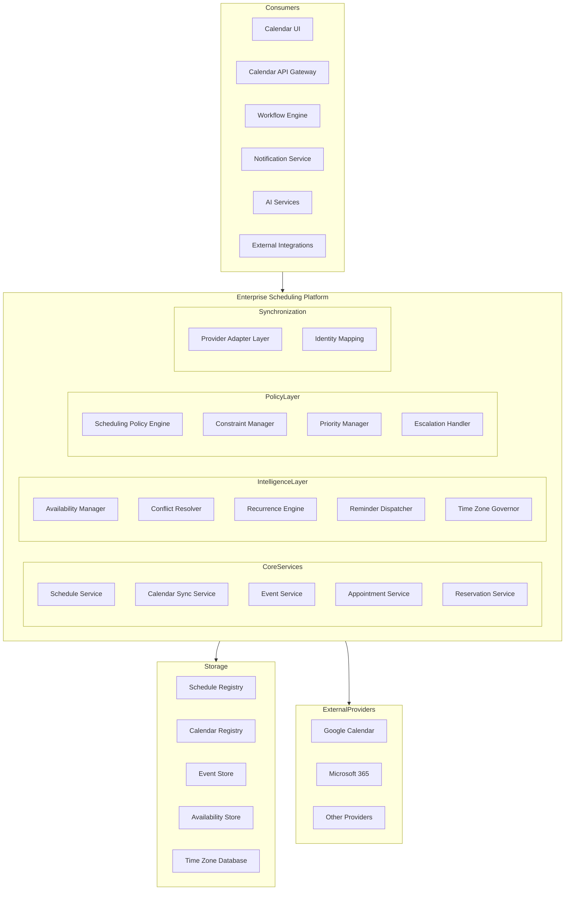
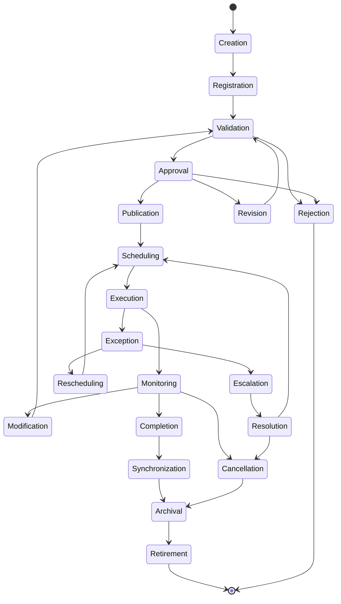
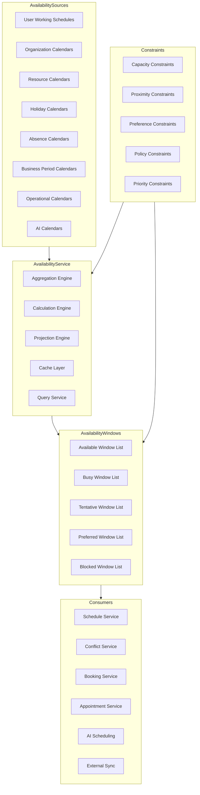
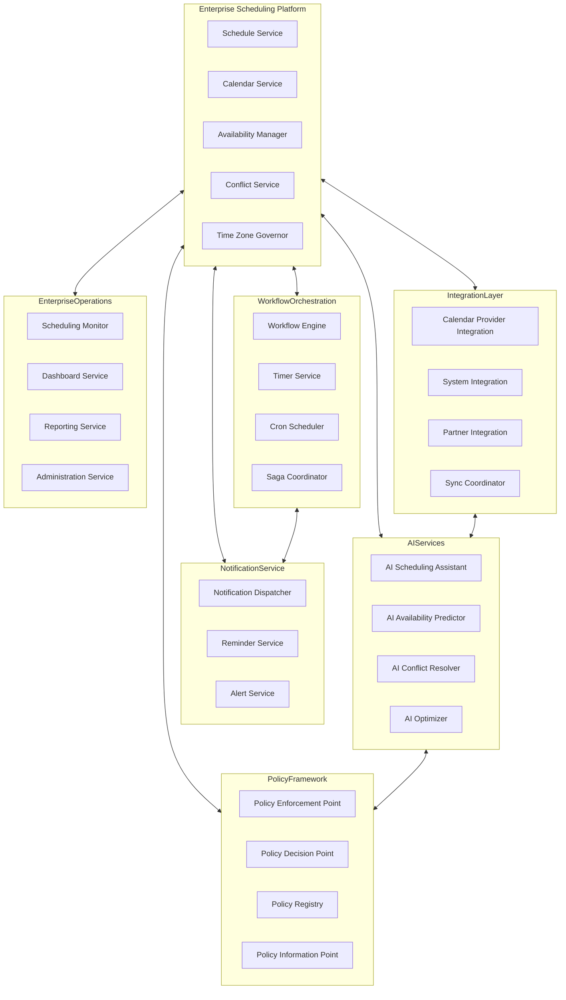

# KB-131 — Enterprise Scheduling & Calendar Architecture

---

## Metadata

- **Document ID:** KB-131
- **Title:** Enterprise Scheduling & Calendar Architecture
- **Suite:** Enterprise Platform Services
- **Version:** 1.0
- **Status:** Approved Architecture
- **Classification:** Enterprise Platform Services Architecture
- **Date:** 2026-07-12

---

## Executive Summary

The Enterprise Scheduling & Calendar Platform provides centralized capabilities for managing time-based activities, resource availability, appointments, operational schedules, recurring events, business calendars, workflow timing, and coordinated enterprise activities across the DUKADESK ecosystem.

Scheduling operates as a reusable enterprise capability independent of applications, business domains, external calendar providers, or implementation technologies. All time coordination, calendar management, availability calculation, conflict resolution, and temporal governance are governed by this canonical architecture.

---

## Purpose

Define how DUKADESK manages enterprise time coordination, scheduling intelligence, resource availability, and calendar interactions through a unified, governed architecture.

---

## Scope

### In Scope

- Enterprise scheduling architecture
- Enterprise calendar architecture
- Schedule registry
- Calendar registry
- Event architecture
- Appointment architecture
- Reservation architecture
- Resource availability
- Recurrence architecture
- Time zone handling
- Business calendars
- Holiday calendars
- Working schedules
- Scheduling policies
- Conflict management
- Reminder integration
- Scheduling lifecycle
- Calendar synchronization
- Scheduling observability
- Scheduling governance

### Out of Scope

- External calendar provider implementation
- Reminder delivery implementation
- Workflow engine implementation
- Notification implementation
- Infrastructure scheduling

These are addressed by dedicated Knowledge Base documents, including KB-113 (Workflow Orchestration), KB-127 (Notification & Communication), and KB-140 (Enterprise Platform Services Reference Architecture).

---

## Architectural Principles

| # | Principle | Description |
|---|-----------|-------------|
| 1 | Time as an Enterprise Capability | Time coordination is a centralized enterprise service, not an application concern |
| 2 | Centralized Scheduling Governance | All scheduling is governed by the Enterprise Scheduling Platform |
| 3 | Calendar Interoperability | Calendars synchronize across providers, domains, and tenants through canonical models |
| 4 | Provider Independence | No application depends on specific calendar provider implementations |
| 5 | Time Zone Correctness | All time values are stored and processed with complete time zone awareness |
| 6 | Resource-Aware Scheduling | Scheduling respects resource availability, capacity, and constraints |
| 7 | Policy-Driven Scheduling | Scheduling behavior is governed by enterprise policies, not hardcoded logic |
| 8 | Conflict Prevention | The platform prevents scheduling conflicts before they occur |
| 9 | Multi-Tenant Isolation | Scheduling data and operations are fully isolated by tenant |
| 10 | Security by Design | Calendar and schedule access enforce authorization at every layer |
| 11 | Observability by Default | All scheduling operations emit metrics, events, and audit trails |
| 12 | Lifecycle Governance | Every schedule, calendar, and event follows a governed lifecycle |

---

## Canonical Definitions

| Term | Definition |
|------|-----------|
| Schedule | A governed plan of time-based activities within the enterprise |
| Calendar | A structured container for events, availability, and time coordination |
| Event | A discrete time-bound occurrence on a calendar |
| Appointment | A scheduled interaction between participants for a specific purpose |
| Reservation | A time-based allocation of a resource for a specific activity |
| Availability | A representation of time periods during which a resource or participant is accessible |
| Resource | Any entity that can be scheduled, including people, equipment, spaces, and services |
| Participant | An entity involved in a scheduled activity |
| Recurrence | A pattern defining how an event repeats over time |
| Time Zone | A region of the globe that observes a uniform standard time |
| Business Calendar | A calendar defining working days, non-working days, and business periods for an organization |
| Working Schedule | A schedule defining regular working hours and availability patterns |
| Scheduling Policy | A rule governing how scheduling operations are performed, constrained, or resolved |
| Scheduling Conflict | A situation where two or more activities require the same resource at overlapping times |
| Scheduling Constraint | A limitation or condition that restricts scheduling options |
| Calendar Synchronization | The process of reconciling calendar data across providers, domains, or systems |
| Scheduling Lifecycle | The defined state progression of a scheduling entity from creation to retirement |
| Availability Window | A contiguous time period during which a resource is available |
| Time Allocation | The assignment of a time period to a specific purpose, activity, or reservation |

---

## Schedule Registry

The Schedule Registry is the canonical inventory of all enterprise schedules, their definitions, ownership, policies, lifecycle states, and temporal metadata. Every schedule within DUKADESK must be registered in the Schedule Registry before activation.

### Schedule Registry Structure

| Component | Description |
|-----------|-------------|
| Schedule Definition | Name, type, domain, description, and purpose of the schedule |
| Temporal Specification | Start date, end date, recurrence rules, time zone, and working period definitions |
| Ownership | Owner entity, steward, business domain, and tenant association |
| Policy Bindings | Associated scheduling policies, constraints, and rules |
| Lifecycle State | Current state in the scheduling lifecycle with timestamp |
| Dependencies | Dependent schedules, workflows, resources, and triggers |
| Compliance Classification | Regulatory requirements, audit flags, and retention rules |
| Version History | Previous versions with changelog and effective date ranges |

## Calendar Registry

The Calendar Registry is the canonical inventory of all enterprise calendars, their types, owners, synchronization configurations, and lifecycle states. Every calendar within DUKADESK must be registered in the Calendar Registry.

### Calendar Registry Structure

| Component | Description |
|-----------|-------------|
| Calendar Definition | Name, type, domain, description, and classification |
| Calendar Type | Personal, team, organization, resource, operational, system, compliance, AI agent, tenant, or external integration |
| Ownership | Owner entity, steward, and business domain |
| Provider Configuration | Native DUKADESK calendar, Google Calendar, Microsoft 365, CalDAV, or custom provider |
| Synchronization Settings | Sync direction, frequency, conflict resolution strategy, and merge rules |
| Access Control | Authorized users, roles, groups, and permissions |
| Lifecycle State | Current state with timestamp and audit trail |
| Tenant Association | Tenant ID and isolation configuration |

## Recurrence Architecture

Recurrence patterns define how schedules, events, appointments, and reservations repeat over time. The Recurrence Engine provides unified pattern definition, expansion, governance, and optimization.

### Recurrence Pattern Types

| Pattern | Description | Example |
|---------|-------------|---------|
| Daily | Repeats every N days | Every 2 days |
| Weekly | Repeats on specified days of the week | Every Monday and Wednesday |
| Monthly | Repeats on a specified day or position in the month | First Tuesday of every month |
| Yearly | Repeats on a specified date or position in the year | Every July 12 |
| Custom | Complex recurrence with multiple rules | Every weekday except holidays |

### Recurrence Governance

| Governance Rule | Description |
|----------------|-------------|
| Maximum Occurrence Limit | Hard limit on the number of generated occurrences |
| Maximum End Date | Hard limit on the recurrence end date |
| Expansion Window | Time horizon for occurrence generation |
| Exception Handling | Rules for handling modified or cancelled individual occurrences |
| Holiday Awareness | Automatic adjustment for business calendar holidays |

---

## Enterprise Scheduling Platform Architecture

---

## Enterprise Calendar Architecture

```mermaid
graph TB
    subgraph CalendarSystem[Enterprise Calendar System]
        subgraph CalendarTypes
            PER[Personal Calendar]
            TEM[Team Calendar]
            ORG[Organization Calendar]
            RES[Resource Calendar]
            OPS[Operational Calendar]
            SYS[System Calendar]
            CMP[Compliance Calendar]
            AIA[AI Agent Calendar]
            TNT[Tenant Calendar]
            INT[External Integration Calendar]
        end

        subgraph EventModel
            EV[Event Entity]
            ATT[Attendees]
            LOC[Location]
            DUR[Duration]
            REC[Recurrence Pattern]
            REM[Reminders]
            ATT2[Attachments]
        end

        subgraph AvailabilityEngine
            UAS[User Availability Service]
            RAS[Resource Availability Service]
            OAS[Organization Availability Service]
            AAS[AI Availability Service]
        end

        subgraph SyncEngine
            BID[Bidirectional Sync]
            CON[Conflict Resolution]
            MER[Merge Logic]
            DEL[Deletion Propagation]
        end
    end

    CalendarTypes --> EventModel
    EventModel --> AvailabilityEngine
    AvailabilityEngine --> SyncEngine
```

---

## Scheduling Taxonomy

```mermaid
graph TB
    ST[Enterprise Scheduling Taxonomy] --> US[User Scheduling]
    ST --> OS[Organization Scheduling]
    ST --> TS[Tenant Scheduling]
    ST --> RS[Resource Scheduling]
    ST --> WS[Workflow Scheduling]
    ST --> OPS[Operational Scheduling]
    ST --> AI[AI Scheduling]
    ST --> MS[Marketplace Scheduling]
    ST --> AS[Appointment Scheduling]
    ST --> RS2[Reservation Scheduling]
    ST --> CS[Compliance Scheduling]
    ST --> FD[Future Scheduling Domains]

    US --> UME[Meetings]
    US --> UTS[Task Scheduling]
    US --> UFS[Focus Time]
    US --> UAB[Absences]

    RS --> RSP[Space Scheduling]
    RS --> REQ[Equipment Scheduling]
    RS --> RSR[Service Resource Scheduling]

    WS --> WJO[Job Orchestration]
    WS --> WTI[Timer Integration]
    WS --> WCR[Cron Scheduling]

    AI --> AIM[AI Agent Meetings]
    AI --> AIT[AI Task Scheduling]
    AI --> AIC[AI Compute Scheduling]

    MS --> MBO[Booking Scheduling]
    MS --> MTS[Time Slot Allocation]

    CS --> CAU[Audit Scheduling]
    CS --> CRC[Regulatory Calendar]
    CS --> CRE[Reporting Schedule]
```

---

## Calendar Taxonomy

```mermaid
graph TB
    CT[Calendar Taxonomy] --> PER[Personal Calendar]
    CT --> TEM[Team Calendar]
    CT --> ORG[Organization Calendar]
    CT --> RES[Resource Calendar]
    CT --> OPS[Operational Calendar]
    CT --> SYS[System Calendar]
    CT --> CMP[Compliance Calendar]
    CT --> AIA[AI Agent Calendar]
    CT --> TNT[Tenant Calendar]
    CT --> EXT[External Integration Calendar]

    PER --> PER1[User's Private Events]
    PER --> PER2[User's Working Hours]
    PER --> PER3[User's Absences]

    TEM --> TEM1[Team Meetings]
    TEM --> TEM2[Team Availability]
    TEM --> TEM3[Team Standups]

    ORG --> ORG1[Company Events]
    ORG --> ORG2[All-Hands]
    ORG --> ORG3[Holiday Calendar]

    RES --> RES1[Room Calendars]
    RES --> RES2[Equipment Calendars]
    RES --> RES3[Service Calendars]

    OPS --> OPS1[Maintenance Windows]
    OPS --> OPS2[Deployment Calendars]
    OPS --> OPS3[On-Call Schedules]

    SYS --> SYS1[System Job Schedules]
    SYS --> SYS2[Backup Calendars]
    SYS --> SYS3[Batch Processing]

    CMP --> CMP1[Regulatory Deadlines]
    CMP --> CMP2[Audit Schedules]
    CMP --> CMP3[Reporting Cadence]

    AIA --> AIA1[AI Agent Availability]
    AIA --> AIA2[AI Training Windows]
    AIA --> AIA3[AI Maintenance]

    TNT --> TNT1[Tenant-Specific Events]
    TNT --> TNT2[Tenant Policies]
    TNT --> TNT3[Tenant Holidays]

    EXT --> EXT1[Synchronized External Calendars]
    EXT --> EXT2[Partner Calendars]
    EXT --> EXT3[Vendor Calendars]
```

---

## Scheduling Lifecycle

---

## Availability Management Architecture

---

## Conflict Resolution Architecture

```mermaid
graph TB
    subgraph ConflictSources
        DBL[Double Booking]
        OVR[Overlapping Events]
        RES[Resource Contention]
        CAP[Capacity Exceeded]
        TZC[Time Zone Collision]
        POL[Policy Violation]
        REC[Recurrence Conflict]
    end

    subgraph DetectionLayer
        RLD[Real-Time Detector]
        BAT[Batch Detector]
        PRD[Predictive Detector]
        PRV[Preventive Check]
    end

    subgraph ResolutionEngine
        PRI[Priority-Based Resolution]
        POL2[Policy-Based Resolution]
        PRE[Preference-Based Resolution]
        RUL[Rule-Based Resolution]
        AI[Ai-Assisted Resolution]
    end

    subgraph ResolutionStrategies
        REP[Reschedule Event]
        RER[Reallocate Resource]
        SPL[Split Event]
        MER[Merge Events]
        RED[Reduce Duration]
        DEL[Delegate Participant]
        CXL[Cancel Event]
    end

    subgraph Escalation
        AUTO[Automated Resolution]
        USR[User Decision]
        MGR[Manager Escalation]
        OPS[Operations Escalation]
        COM[Committee Review]
    end

    ConflictSources --> DetectionLayer
    DetectionLayer --> ResolutionEngine
    ResolutionEngine --> ResolutionStrategies
    ResolutionStrategies --> Escalation
```

---

## Time Governance Model

```mermaid
graph TB
    subgraph TimeGovernance[Enterprise Time Governance]
        subgraph TimeStandards
            UTC[Coordinated Universal Time]
            IANA[IANA Time Zone Database]
            TZB[Time Zone Boundaries]
            DST[Daylight Saving Time Rules]
            LCL[Local Time Calculation]
        end

        subgraph BusinessTemporal
            BCL[Business Calendar]
            WHR[Working Hours]
            HOL[Holiday Calendar]
            BPR[Business Periods]
            BCR[Business Calendar Rules]
        end

        subgraph TemporalPolicies
            TZA[Time Zone Assignment]
            TZC[Time Zone Conversion]
            TZD[Time Zone Display]
            TZS[Time Zone Storage Policy]
        end

        subgraph Calendars
            SRC[Source Calendar]
            TRG[Target Calendar]
            TMP[Temporal Mapping]
            MER[Timezone Merge]
        end

        subgraph Validation
            TZV[Time Zone Validation]
            CAL[Calendar Consistency]
            BTV[Business Time Validation]
            CTV[Cross-Time-Zone Validation]
        end
    end

    TimeStandards --> TemporalPolicies
    TemporalPolicies --> BusinessTemporal
    BusinessTemporal --> Calendars
    Calendars --> Validation
```

---

## Enterprise Scheduling Operating Model

---

## Scheduling Ecosystem

```mermaid
graph TB
    subgraph Ecosystem[Enterprise Scheduling Ecosystem]

        subgraph Domains
            USR[User Scheduling]
            ORG[Organization Scheduling]
            TEN[Tenant Scheduling]
            RES[Resource Scheduling]
            WKF[Workflow Scheduling]
            OPS[Operational Scheduling]
            AIS[AI Scheduling]
            MKT[Marketplace Scheduling]
            APP[Appointment Scheduling]
            RSV[Reservation Scheduling]
            CMP[Compliance Scheduling]
        end

        subgraph CoreServices
            SCS[Schedule Service]
            CLS[Calendar Service]
            AVM[Availability Manager]
            CFS[Conflict Resolver]
            TZG[Time Zone Governor]
            REC[Recurrence Engine]
        end

        subgraph Consumers
            WEB[Web Applications]
            MOB[Mobile Applications]
            API[API Consumers]
            WFL[Workflows]
            AIA[AI Agents]
            EXT[External Platforms]
        end

        subgraph Providers
            GGL[Google Calendar]
            MSF[Microsoft 365]
            ICP[ICal/CalDAV]
            NAT[Native DUKADESK]
            CUS[Custom Providers]
        end

        subgraph Governance
            POL[Policy Framework]
            AUD[Audit Service]
            SEC[Security Service]
            TEN[Tenant Isolation]
            CMP2[Compliance Engine]
        end

        subgraph Observability
            MET[Metrics]
            TRC[Traces]
            LOG[Logs]
            EVT[Events]
            DSH[Dashboards]
            ALR[Alerts]
        end
    end

    Consumers --> Domains
    Domains --> CoreServices
    CoreServices --> Providers
    Governance -.-> Domains
    Governance -.-> CoreServices
    Governance -.-> Providers
    Observability -.-> Domains
    Observability -.-> CoreServices
    Observability -.-> Providers
```

---

## Governance

The Enterprise Scheduling & Calendar Platform enforces governance across all scheduling domains to ensure consistency, compliance, security, and enterprise alignment.

### Governance Domains

| Domain | Governance Focus |
|--------|-----------------|
| Calendar Ownership | Every calendar has a designated owner responsible for its lifecycle and access |
| Schedule Ownership | Every schedule has a designated owner responsible for its definition and execution |
| Resource Ownership | Every schedulable resource has a designated owner responsible for availability management |
| Time Governance | Time zones, business calendars, working hours, and holidays are governed enterprise-wide |
| Security Governance | Calendar and schedule access is governed by the Authorization Architecture |
| Privacy Governance | Private calendar data is protected in accordance with enterprise privacy policy |
| Compliance Governance | Scheduling operations comply with regulatory requirements and audit mandates |
| Lifecycle Governance | All scheduling entities follow the governed lifecycle from creation to retirement |
| Enterprise Governance | The Enterprise Architecture board governs scheduling platform evolution and standards |

### Governance Enforcement Points

| Enforcement Point | Mechanism |
|-------------------|-----------|
| Calendar Creation | Validation against registry schema and policy compliance |
| Schedule Registration | Policy enforcement before schedule activation |
| Event Publication | Conflict detection and policy validation before publishing |
| Synchronization | Governance reconciliation during calendar sync operations |
| Modification | Change approval workflows for governed scheduling entities |
| Retirement | Deprovisioning validation and data retention verification |

---

## Responsibilities

| Role | Responsibilities |
|------|-----------------|
| Enterprise Architecture | Defines scheduling architecture, standards, and governance; approves platform evolution |
| Platform Engineering | Develops, operates, and maintains the Enterprise Scheduling & Calendar Platform |
| Operations | Monitors scheduling health, handles escalations, manages availability SLAs |
| Product Teams | Integrates with the scheduling platform; does not implement independent scheduling |
| Security | Defines calendar authorization model; audits scheduling access; enforces least privilege |
| Compliance | Defines scheduling compliance requirements; audits scheduling operations; ensures regulatory adherence |
| AI Governance Board | Governs AI scheduling capabilities; approves AI decision boundaries |
| Business Owners | Define scheduling policies for their domains; approve schedule registrations |
| Tenant Administrators | Manage tenant-specific calendars, schedules, and policies |
| End Users | Create and manage personal events within policy boundaries |

---

## Security

### Calendar Authorization

| Security Control | Description |
|------------------|-------------|
| Calendar-Level Permissions | Read, write, modify, delete, and administer permissions per calendar |
| Schedule Authorization | Schedule creation, modification, and deletion governed by role-based access |
| Resource Protection | Resource availability visible only to authorized requestors |
| Tenant Isolation | Calendar and schedule data fully isolated by tenant boundary |
| Identity-Aware Scheduling | Scheduling operations verify identity before authorization |
| Least Privilege | Users have minimum permissions required for their scheduling role |
| Zero Trust | All scheduling API calls authenticated and authorized regardless of network origin |
| Auditability | All scheduling access and operations recorded in immutable audit log |
| Secure Synchronization | Calendar sync uses authenticated channels with encrypted payloads |
| Policy Enforcement | Authorization policies enforced at API gateway and service mesh layers |

### Security Zones

| Zone | Description |
|------|-------------|
| Public | Public availability data visible without authentication |
| Authenticated | User-specific calendar access requiring authentication |
| Authorized | Resource and organization scheduling requiring explicit authorization |
| Admin | Administrative scheduling operations requiring elevated privileges |
| System | System-level scheduling requiring service-to-service authentication |

---

## Privacy

### Privacy Architecture

| Privacy Control | Description |
|-----------------|-------------|
| Private Calendars | Calendars classified as private are visible only to the owner and authorized delegates |
| Sensitive Schedule Information | Event details containing sensitive information are masked or restricted |
| Consent Management | Users explicitly consent to calendar sharing, synchronization, and AI processing |
| Data Minimization | Only required scheduling data is collected, stored, and synchronized |
| Regional Compliance | Scheduling data handling complies with GDPR, CCPA, and regional privacy regulations |
| Cross-Border Considerations | Calendar data is stored and processed in accordance with data residency requirements |
| Retention Governance | Scheduling data is retained only for the duration required by policy |
| Privacy Assurance | Regular privacy reviews and impact assessments for scheduling capabilities |

### Data Classification

| Classification | Examples | Access Restrictions |
|---------------|----------|-------------------|
| Public | Organizational holidays, working hours | No authentication required |
| Internal | Team meetings, resource availability | Authenticated users within tenant |
| Confidential | Executive schedules, project timelines | Authorized users only |
| Restricted | Personal appointments, health-related events | Owner and explicit delegates |
| Regulated | Compliance-related scheduling | Audited access with strict controls |

---

## Performance

### Architectural Considerations

| Consideration | Requirement |
|---------------|-------------|
| Enterprise Scheduling Scale | Support for millions of events, appointments, and reservations across all tenants |
| Real-Time Availability | Availability queries return results within sub-second latency |
| High-Volume Events | Support for thousands of concurrent event creations and modifications per second |
| Global Calendars | Distributed calendar serving across multiple geographic regions |
| High Availability | 99.99% uptime for core scheduling services |
| Elastic Scalability | Horizontal scaling of scheduling services based on demand |
| Multi-Region Readiness | Active-active calendar serving across paired regions |
| Efficient Conflict Resolution | Conflict detection completes within milliseconds for typical scheduling operations |

### Performance Optimization

| Optimization | Description |
|--------------|-------------|
| Availability Caching | Pre-computed availability windows cached with intelligent invalidation |
| Recurrence Expansion | On-demand occurrence expansion with configurable look-ahead window |
| Conflict Pre-Calculation | Proactive conflict detection during non-peak periods |
| Query Optimization | Indexed time-range queries for calendar and availability lookups |
| Connection Pooling | Reusable database connections for scheduling operations |
| Batch Processing | Bulk event creation and modification through batched APIs |

---

## Observability

### Observability Architecture

| Observable Dimension | Metrics | Purpose |
|---------------------|---------|---------|
| Scheduling Metrics | Events created, modified, cancelled per second | Monitoring scheduling throughput |
| Calendar Health | Calendar service availability, latency, error rates | Detecting calendar service degradation |
| Availability Analytics | Availability query volume, cache hit rates, response times | Measuring availability service performance |
| Conflict Analytics | Conflict detection rates, resolution strategies used, escalation frequency | Understanding conflict patterns |
| Usage Analytics | Active calendars, users, schedules, domains per tenant | Tracking enterprise scheduling adoption |
| Governance Dashboards | Policy violations, authorization failures, compliance status | Monitoring scheduling governance |
| SLA Monitoring | Scheduling operation latency, availability SLAs, error budgets | Ensuring service level compliance |
| Operational Reporting | Daily/weekly scheduling activity, resource utilization, domain distribution | Business reporting on scheduling operations |
| Enterprise Scheduling Insights | Cross-domain scheduling patterns, optimization opportunities, trend analysis | Strategic scheduling intelligence |

### Observability Events

| Event Type | Trigger | Consumer |
|------------|---------|----------|
| CalendarCreated | New calendar registered | Audit service, registry, governance |
| ScheduleModified | Existing schedule changed | Audit service, notification service |
| EventCreated | New event published | Availability service, conflict detector |
| ConflictDetected | Scheduling conflict identified | Resolution engine, notification service |
| ResolutionApplied | Conflict resolution executed | Audit service, notification service |
| SyncCompleted | Calendar synchronization finished | Monitoring service, health dashboard |
| PolicyViolation | Scheduling operation violated policy | Governance dashboard, alert service |

---

## Failure Scenarios

| # | Scenario | Architectural Response |
|---|----------|----------------------|
| 1 | Scheduling Conflicts | Conflict detection engine prevents double-booking; configurable resolution strategies with escalation |
| 2 | Calendar Synchronization Failures | Sync service implements retry with exponential backoff; conflict-aware merge; manual reconciliation API |
| 3 | Time Zone Errors | All times stored in UTC with IANA time zone identifier; display-time conversion occurs at presentation layer |
| 4 | Duplicate Events | Idempotency keys on event creation; deduplication engine with configurable merge window |
| 5 | Availability Inconsistencies | Availability recalculation triggered by any calendar change; cache invalidation on modification |
| 6 | Resource Conflicts | Resource-level locking during scheduling; atomic reservation with rollback on conflict |
| 7 | Reminder Failures | Reminder service with delivery confirmation; fallback channel; retry with escalation |
| 8 | Policy Violations | Policy enforcement point validates all scheduling operations; violation logged with audit trail |
| 9 | Unauthorized Calendar Access | Authorization enforced at API layer; calendar-level permissions; tenant isolation boundary |
| 10 | Data Synchronization Failures | Change tracking with cursor-based sync; conflict detection with tombstone handling |
| 11 | Recovery Failures | Journal-based recovery with replay capability; consistency verification after recovery |

---

## Anti-Patterns

| # | Anti-Pattern | Description | Prohibited Because |
|---|-------------|-------------|-------------------|
| 1 | Application-Owned Scheduling Engines | Applications implement their own scheduling logic | Bypasses centralized governance, conflicts, audit, and policies |
| 2 | Hardcoded Calendars | Calendar definitions embedded in application code | Prevents enterprise-wide time governance and maintenance |
| 3 | Manual Time Coordination | Users manually coordinate schedules without platform support | Lacks conflict prevention, audit trail, and enterprise visibility |
| 4 | Duplicate Calendar Systems | Multiple independent calendar systems across the enterprise | Fragments availability data, creates reconciliation burden |
| 5 | Ignoring Time Zones | Events stored or processed without time zone awareness | Causes scheduling errors, missed appointments, compliance violations |
| 6 | Uncontrolled Recurring Events | Recurring events created without governance or limits | Generates unbounded event volume, performance degradation |
| 7 | Scheduling Without Policies | Scheduling operations without policy enforcement | Allows unauthorized, conflicting, or non-compliant scheduling |
| 8 | Calendar Access Without Governance | Calendar data accessible without authorization controls | Exposes private schedule data, violates privacy regulations |
| 9 | Hidden Resource Availability | Resource availability not exposed to scheduling platform | Prevents enterprise resource optimization, causes conflicts |
| 10 | Provider-Specific Scheduling Logic | Scheduling logic tied to specific calendar provider | Creates vendor lock-in, prevents provider independence |

---

## Future Evolution

| # | Evolution Path | Description |
|---|---------------|-------------|
| 1 | AI Scheduling Assistants | AI agents that autonomously schedule, reschedule, and optimize enterprise calendars |
| 2 | Autonomous Calendar Optimization | Self-optimizing calendars that adjust schedules based on usage patterns and preferences |
| 3 | Predictive Availability Management | ML-driven availability prediction based on historical patterns, role, and context |
| 4 | Intelligent Resource Allocation | AI-optimized resource allocation across the enterprise based on demand and priority |
| 5 | Enterprise Temporal Intelligence | Platform-wide time intelligence providing coordinated scheduling across all domains |
| 6 | Cross-Platform Scheduling Federation | Federated scheduling across DUKADESK and external partner platforms |
| 7 | Adaptive Scheduling Policies | Policies that adapt to organizational changes, user behavior, and external events |
| 8 | Cognitive Workforce Coordination | AI-coordinated workforce scheduling balancing productivity, well-being, and business needs |

---

## Cross References

| Document ID | Title | Relationship |
|-------------|-------|-------------|
| KB-107 | Enterprise Platform Services Overview Architecture | Foundational reference for platform services architecture |
| KB-113 | Workflow Orchestration Architecture | Defines workflow scheduling integration with calendar platform |
| KB-123 | Enterprise Policy Framework Architecture | Foundational reference for policy-driven scheduling |
| KB-124 | Policy Management Architecture | Defines policy enforcement for scheduling operations |
| KB-125 | Authorization Architecture | Defines authorization model for calendar access |
| KB-127 | Notification & Communication Architecture | Defines reminder and notification integration |
| KB-128 | Localization & Internationalization Architecture | Defines regional calendar and time zone localization |
| KB-129 | Feature Flag & Configuration Architecture | Defines configuration integration for scheduling services |
| KB-130 | Enterprise Risk Management Architecture | Defines risk governance for scheduling compliance |
| KB-140 | Enterprise Platform Services Reference Architecture | Comprehensive reference for all platform services |

---

## Critical DUKADESK Architectural Rule

**All enterprise scheduling and calendar capabilities within DUKADESK shall operate through the centralized Enterprise Scheduling & Calendar Platform. No application, service, workflow, AI capability, integration, tenant, or operational domain shall maintain independent scheduling systems outside the canonical architecture, ensuring consistent time governance, resource coordination, security, interoperability, auditability, and enterprise-wide scheduling intelligence.**
