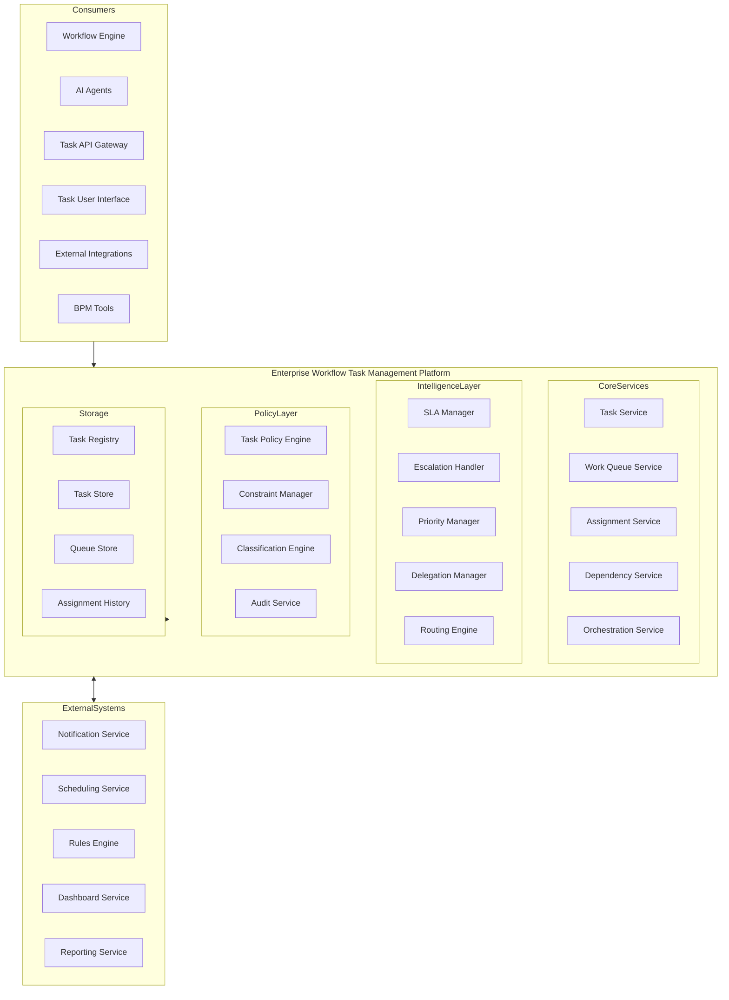
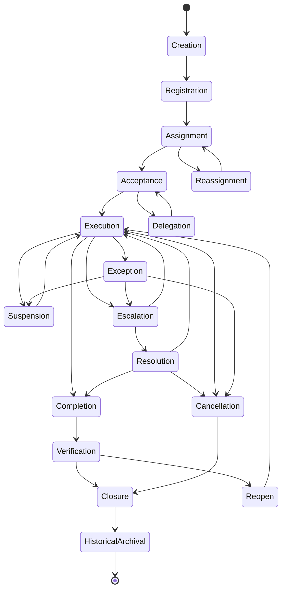
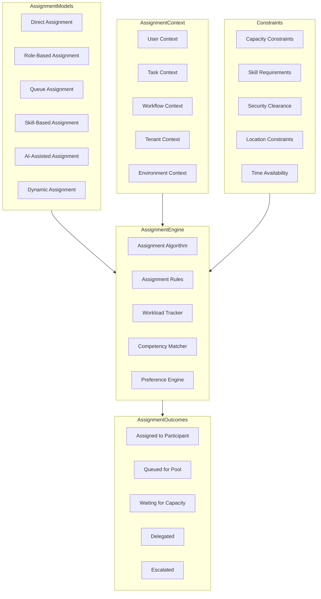
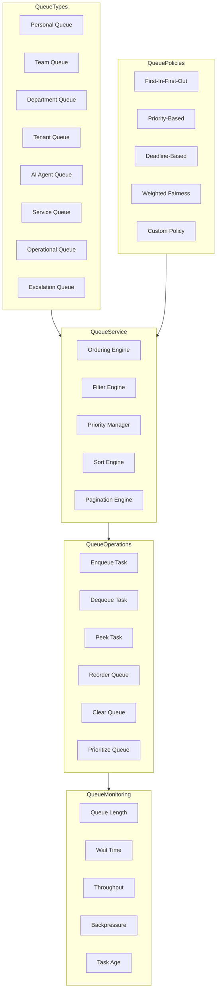
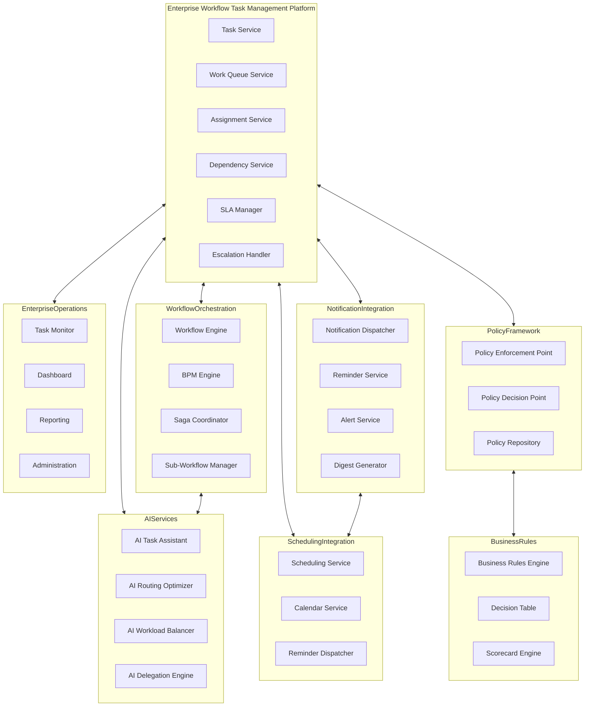
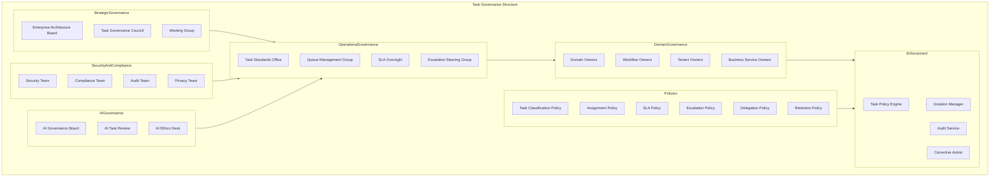

# KB-132 — Enterprise Workflow Task Management Architecture

---

## Metadata

- **Document ID:** KB-132
- **Title:** Enterprise Workflow Task Management Architecture
- **Suite:** Enterprise Platform Services
- **Version:** 1.0
- **Status:** Approved Architecture
- **Classification:** Enterprise Workflow Services Architecture
- **Date:** 2026-07-12

---

## Executive Summary

The Enterprise Workflow Task Management Platform provides centralized capabilities for creating, assigning, prioritizing, routing, monitoring, escalating, completing, and governing work items generated by business processes, workflows, AI agents, integrations, operational activities, and enterprise services across the DUKADESK ecosystem.

Tasks operate as reusable enterprise assets independent of applications, workflow engines, or implementation technologies. All work management, assignment governance, queue orchestration, SLA enforcement, escalation handling, and task lifecycle management are governed by this canonical architecture.

---

## Purpose

Define how DUKADESK standardizes enterprise work management while ensuring governance, accountability, traceability, automation, human collaboration, and operational efficiency.

---

## Scope

### In Scope

- Enterprise task architecture
- Task registry
- Task taxonomy
- Task lifecycle
- Assignment architecture
- Ownership architecture
- Work queue architecture
- Task prioritization
- Task dependencies
- Task orchestration
- Approval tasks
- Human tasks
- AI-assisted tasks
- System tasks
- SLA architecture
- Escalation architecture
- Delegation architecture
- Task governance
- Task analytics
- Enterprise work management

### Out of Scope

- Workflow engine implementation
- BPM implementation
- Project management implementation
- Notification implementation
- Calendar implementation
- User interface implementation

These are addressed by dedicated Knowledge Base documents, including KB-113 (Workflow Orchestration), KB-127 (Notification & Communication), KB-131 (Enterprise Scheduling & Calendar), and KB-140 (Enterprise Platform Services Reference Architecture).

---

## Architectural Principles

| # | Principle | Description |
|---|-----------|-------------|
| 1 | Tasks as Enterprise Assets | Tasks are governed enterprise objects, not application-specific constructs |
| 2 | Workflow Independence | Task management operates independently of any specific workflow engine or BPM tool |
| 3 | Human and AI Collaboration | Tasks support human, system, and AI participants equally |
| 4 | Assignment Transparency | Task assignment decisions are visible, auditable, and explainable |
| 5 | Policy-Driven Governance | Task behavior is governed by enterprise policies, not hardcoded logic |
| 6 | SLA Awareness | All tasks have measurable service level objectives |
| 7 | Event-Driven Orchestration | Task state changes emit events that drive downstream behavior |
| 8 | Accountability by Design | Every task has an identified owner with clear responsibility |
| 9 | Vendor Independence | No dependency on specific vendor task management implementations |
| 10 | Technology Neutrality | The architecture supports any technology stack without bias |
| 11 | Multi-Tenant Isolation | Task data and operations are fully isolated by tenant boundary |
| 12 | Observability by Default | All task operations emit metrics, events, and audit trails |
| 13 | Lifecycle Governance | Every task follows a governed lifecycle from creation to archival |

---

## Canonical Definitions

| Term | Definition |
|------|-----------|
| Task | A discrete unit of work requiring action by a human, system, or AI participant |
| Task Registry | The canonical inventory of all task definitions within the enterprise |
| Work Queue | An ordered collection of tasks assigned to a participant, team, or service |
| Assignment | The act of allocating a task to a specific participant for execution |
| Assignee | The participant responsible for executing the assigned task |
| Owner | The participant ultimately accountable for task completion and outcome |
| Delegation | The temporary or conditional transfer of task responsibility to another participant |
| Approval | A task type requiring explicit authorization before a downstream action proceeds |
| Task Dependency | A relationship where a task depends on the completion or state of another task |
| Task Priority | A relative importance ranking used for work queue ordering and resource allocation |
| SLA | A service level agreement defining expected completion time and quality criteria for a task |
| Escalation | The process of raising a task to higher authority when SLA thresholds are breached |
| Task Context | The business data, metadata, and environmental information associated with a task |
| Task State | The current position of a task within its defined lifecycle |
| Task Lifecycle | The governed state progression of a task from creation to historical archival |
| Task Orchestration | The coordination of task execution across participants, dependencies, and workflows |
| Human Task | A task requiring human judgement, action, or decision |
| System Task | An automated task executed by a system or service without human intervention |
| AI Task | A task executed or assisted by an AI capability within the enterprise |
| Work Item | A generic term for any unit of work within the enterprise, broader than a task |

---

## Task Registry

The Task Registry is the canonical inventory of all enterprise task definitions. Every task type within DUKADESK must be registered in the Task Registry before instantiation.

### Task Registry Structure

| Component | Description |
|-----------|-------------|
| Task Definition | Name, type, domain, description, and purpose |
| Schema | Input data schema, output data schema, and context schema |
| Participants | Eligible assignee roles, skill requirements, and participant types |
| SLA Configuration | Default SLA, escalation thresholds, and deadline policies |
| Policy Bindings | Associated governance policies, constraints, and compliance rules |
| Lifecycle State | Current definition state with version history |
| Dependencies | Dependent task definitions, workflows, and triggers |
| Ownership | Owner entity, steward, and business domain |
| Classification | Taxonomy classification, priority defaults, and risk level |

---

## Enterprise Workflow Task Management Platform

---

## Task Taxonomy

```mermaid
graph TB
    TT[Task Taxonomy] --> HT[Human Task]
    TT --> ST[System Task]
    TT --> AT[AI Task]
    TT --> AP[Approval Task]
    TT --> RT[Review Task]
    TT --> OT[Operational Task]
    TT --> CT[Compliance Task]
    TT --> AD[Administrative Task]
    TT --> MT[Marketplace Task]
    TT --> BS[Builder Studio Task]
    TT --> WT[Workflow Task]
    TT --> IT[Integration Task]
    TT --> FD[Future Task Domains]

    HT --> APV[Manual Approval]
    HT --> REV[Human Review]
    HT --> DEC[Decision Task]
    HT --> INP[Data Input Task]
    HT --> INV[Investigation Task]

    ST --> SVC[Service Call Task]
    ST --> SCR[Script Execution Task]
    ST --> TRN[Transformation Task]
    ST --> VAL[Validation Task]
    ST --> NOT[Notification Task]

    AT --> AID[AI Decision Task]
    AT --> AIG[AI Generation Task]
    AT --> AIC[AI Classification Task]
    AT --> AIR[AI Recommendation Task]

    AP --> SGL[Single Approval]
    AP --> MUL[Multi-Level Approval]
    AP --> PAR[Parallel Approval]
    AP --> CHN[Chain Approval]

    OT --> MNT[Maintenance Task]
    OT --> DEP[Deployment Task]
    OT --> MON[Monitoring Task]

    CT --> AUD[Audit Task]
    CT --> REG[Regulatory Task]
    CT --> RPT[Reporting Task]

    WT --> SUB[Sub-Workflow Task]
    WT --> JOB[Batch Job Task]
    WT --> TIM[Timer Task]
```

---

## Task Lifecycle

---

## Assignment Architecture

---

## Work Queue Architecture

---

## SLA & Escalation Model

```mermaid
graph TB
    subgraph SLADefinition
        RES[Response Time SLA]
        CMP[Completion Time SLA]
        PRC[Processing Duration SLA]
        QLT[Quality SLA]
        AVL[Availability SLA]
    end

    subgraph SLAMonitoring
        TRK[Time Tracking]
        CLK[Clock Management]
        WRN[Warning Generation]
        CAL[Calendar Awareness]
        HOL[Holiday Adjustment]
    end

    subgraph EscalationLevels
        L1[Level 1 - Team Lead]
        L2[Level 2 - Manager]
        L3[Level 3 - Director]
        L4[Level 4 - Executive]
        L5[Level 5 - Committee]
    end

    subgraph EscalationTriggers
        TMO[Timeout Breach]
        DED[Deadline Exceeded]
        QVI[Quality Violation]
        STL[Stalled Task]
        OVR[Overdue Reminder]
        MUL[Multiple Violations]
    end

    subgraph EscalationActions
        NTF[Notify Assignee]
        NT2[Notify Manager]
        ASR[Auto-Reassign]
        BLK[Block Related Tasks]
        PRI[Priority Boost]
        DSH[Dashboard Alert]
        INT[Intervention]
    end

    SLADefinition --> SLAMonitoring
    SLAMonitoring --> EscalationTriggers
    EscalationTriggers --> EscalationLevels
    EscalationLevels --> EscalationActions
```

---

## Task Dependency Architecture

```mermaid
graph TB
    subgraph DependencyTypes
        SEQ[Sequential - Task B after Task A]
        PAR[Parallel - Tasks run concurrently]
        CON[Conditional - Task depends on outcome]
        GAT[Gateway - Tasks merge at decision point]
        SUB[Subtask - Parent-child relationship]
        CPL[Completion - Task waits for completion]
        CNF[Confirmation - Task waits for approval]
        TIM[Temporal - Task waits for time/date]
    end

    subgraph DependencyEngine
        DSC[Dependency Scanner]
        RSL[Dependency Resolver]
        CYC[Cycle Detector]
        DAG[DAG Manager]
        NOT[Notification Trigger]
    end

    subgraph DependencyGraph
        NOD[Task Nodes]
        EDG[Edge Relationships]
        WGT[Weight/Order]
        LBL[Labels/Metadata]
        STT[State Tracker]
    end

    subgraph ResolutionStrategies
        BLO[Block Until Complete]
        SPL[Spawn Parallel]
        MER[Merge Results]
        SKI[Skip Conditional]
        FAL[Fail on Error]
        CMP[Compensate on Failure]
    end

    subgraph Monitoring
        PRG[Progress Tracking]
        CRT[Critical Path]
        BTL[Bottleneck Detection]
        FRK[Fork Tracking]
        JON[Join Verification]
    end

    DependencyTypes --> DependencyEngine
    DependencyEngine --> DependencyGraph
    DependencyGraph --> ResolutionStrategies
    ResolutionStrategies --> Monitoring
```

---

## Enterprise Work Operating Model

---

## Enterprise Task Ecosystem

```mermaid
graph TB
    subgraph TaskEcosystem[Enterprise Task Ecosystem]

        subgraph TaskSources
            WKF[Workflows]
            APP[Applications]
            AIA[AI Agents]
            INT[Integrations]
            OPS[Operations]
            TEN[Tenants]
            USR[Users]
            SCH[Schedules]
            BPM[BPM Tools]
            EXT[External Systems]
        end

        subgraph TaskEngine
            TKS[Task Service]
            WQS[Work Queue Service]
            ASN[Assignment Service]
            DEP[Dependency Service]
            SLM[SLA Manager]
            ESC[Escalation Handler]
            DLM[Delegation Manager]
            ORC[Orchestration Service]
        end

        subgraph Participants
            HUM[Human Workers]
            SYS[System Services]
            AI[AI Agents]
            TEA[Teams]
            DEP2[Departments]
            TNT[Tenants]
        end

        subgraph Outcomes
            CMP[Completed Tasks]
            APV[Approved Requests]
            DSC[Decisions Made]
            DTA[Data Collected]
            PRC[Processes Advanced]
        end

        subgraph Governance
            POL[Policy Engine]
            AUD[Audit Service]
            SEC[Security Service]
            TNI[Tenant Isolation]
            CMP2[Compliance Engine]
        end

        subgraph Observability
            MET[Metrics]
            TRC[Traces]
            LOG[Logs]
            EVT[Events]
            DSH[Dashboards]
            ALR[Alerts]
            RPT[Reports]
        end
    end

    TaskSources --> TaskEngine
    TaskEngine --> Participants
    Participants --> Outcomes
    Governance -.-> TaskEngine
    Governance -.-> TaskSources
    Governance -.-> Participants
    Observability -.-> TaskEngine
    Observability -.-> TaskSources
    Observability -.-> Outcomes
```

---

## Task Governance Structure

---

## Governance

| Domain | Governance Focus |
|--------|-----------------|
| Task Ownership | Every task has a designated owner accountable for its lifecycle and outcome |
| Assignment Governance | Assignments follow defined policies; bypasses are audited and require justification |
| SLA Governance | Service level objectives are defined, monitored, and enforced for every task type |
| Escalation Governance | Escalation paths are predefined; escalation actions are audited |
| Security Governance | Task access and operations are governed by the Authorization Architecture |
| Compliance Governance | Task execution complies with regulatory requirements and audit mandates |
| AI Governance | AI-assisted and AI-executed tasks follow AI governance board oversight |
| Lifecycle Governance | All tasks follow the governed lifecycle; state transitions require authorization |
| Audit Governance | All task operations are recorded in an immutable audit trail |
| Enterprise Governance | The Enterprise Architecture board governs task platform evolution and standards |

---

## Responsibilities

| Role | Responsibilities |
|------|-----------------|
| Enterprise Architecture | Defines task architecture, standards, and governance; approves platform evolution |
| Platform Engineering | Develops, operates, and maintains the Enterprise Workflow Task Management Platform |
| Workflow Owners | Define task requirements for their workflow domains; approve task registrations |
| Operations | Monitors task health, handles escalations, manages queue SLAs |
| Product Teams | Integrates with the task platform; does not implement independent task management |
| Security | Defines task authorization model; audits task access; enforces least privilege |
| Compliance | Defines task compliance requirements; audits task operations; ensures regulatory adherence |
| AI Governance Board | Governs AI task capabilities; approves AI task decision boundaries |
| Business Managers | Define task priorities for their domains; manage team work queues |
| Tenant Administrators | Manage tenant-specific task types, queues, and policies |
| End Users | Execute assigned tasks within policy boundaries |

---

## Security

| Security Control | Description |
|------------------|-------------|
| Task Authorization | Read, write, assign, execute, and administer permissions per task and queue |
| Queue Authorization | Queue access restricted to authorized participants and roles |
| Tenant Isolation | Task and queue data fully isolated by tenant boundary |
| Least Privilege | Participants have minimum permissions required for their role |
| Zero Trust | All task API calls authenticated and authorized regardless of network origin |
| Assignment Integrity | Task assignments are cryptographically verifiable |
| Secure Delegation | Task delegation requires explicit authorization with audit trail |
| Auditability | All task operations recorded in immutable audit log |
| Provenance | Full provenance tracking from task creation through completion to archival |
| Policy Enforcement | Authorization policies enforced at API gateway and service mesh layers |

### Security Zones

| Zone | Description |
|------|-------------|
| Public | Public task status and metadata visible without authentication |
| Authenticated | Task details requiring user authentication |
| Authorized | Task assignment and execution requiring explicit authorization |
| Admin | Administrative task operations requiring elevated privileges |
| System | System-to-system task operations requiring service authentication |

---

## Privacy

| Privacy Control | Description |
|----------------|-------------|
| Sensitive Task Handling | Tasks containing personal or sensitive information are classified and restricted |
| Personal Information Protection | Personally identifiable information in task context is masked or encrypted |
| Consent Governance | Task processing of personal data requires explicit consent |
| Data Minimization | Only required task data is collected, stored, and processed |
| Regional Compliance | Task data handling complies with GDPR, CCPA, and regional privacy regulations |
| Cross-Border Governance | Task data is stored and processed in accordance with data residency requirements |
| Retention Policies | Task data is retained only for the duration required by policy |
| Privacy Assurance | Regular privacy reviews and impact assessments for task management capabilities |

### Data Classification

| Classification | Examples | Access Restrictions |
|---------------|----------|-------------------|
| Public | Task status, queue names | No authentication required |
| Internal | Task descriptions, assignee names | Authenticated users within tenant |
| Confidential | Task context data, business details | Authorized users only |
| Restricted | Personal data, compliance tasks | Owner and explicit delegates |
| Regulated | Audit tasks, regulatory tasks | Audited access with strict controls |

---

## Performance

| Consideration | Requirement |
|---------------|-------------|
| Enterprise-Scale Task Processing | Support for millions of concurrent tasks across all tenants |
| High-Volume Work Queues | Queues handling thousands of enqueue/dequeue operations per second |
| Real-Time Assignment | Task assignment decisions returned within milliseconds |
| Elastic Scalability | Horizontal scaling of task services based on demand |
| High Availability | 99.99% uptime for core task management services |
| Operational Resilience | Graceful degradation under load with circuit breakers |
| Multi-Region Readiness | Active-active task serving across paired regions |
| Efficient Orchestration | Task orchestration completes within latency targets |

### Performance Optimization

| Optimization | Description |
|--------------|-------------|
| Queue Caching | Frequently accessed queue states cached with intelligent invalidation |
| Bulk Operations | Batch task creation, assignment, and completion through optimized APIs |
| Indexed Queries | Optimized query paths for queue retrieval, task search, and SLA monitoring |
| Async Processing | Non-blocking task operations for assignment, escalation, and notification |
| Connection Pooling | Reusable database connections for task store operations |
| Read Replicas | Read-only replicas for dashboard and reporting queries |

---

## Observability

| Observable Dimension | Metrics | Purpose |
|---------------------|---------|---------|
| Task Throughput | Tasks created, assigned, completed per second | Monitoring task processing velocity |
| Queue Health | Queue depth, wait time, throughput per queue | Detecting queue congestion and backpressure |
| SLA Compliance | Percentage of tasks meeting SLA targets, breach rate | Measuring service level adherence |
| Assignment Analytics | Assignment distribution, reassignment rate, workload balance | Understanding assignment patterns |
| Escalation Analytics | Escalation rate, escalation levels reached, resolution time | Tracking escalation effectiveness |
| Governance Dashboards | Policy violations, authorization failures, audit events | Monitoring task governance |
| Operational Reporting | Daily task activity, queue performance, domain distribution | Operational task management |
| Executive Reporting | Cross-domain task trends, productivity metrics, SLA trends | Strategic task intelligence |
| Productivity Insights | Task completion rates, cycle times, efficiency trends | Identifying optimization opportunities |
| Enterprise Workflow Metrics | Task distribution across workflows, bottlenecks, throughput | Workflow performance analysis |

### Observability Events

| Event Type | Trigger | Consumer |
|------------|---------|----------|
| TaskCreated | New task registered | Queue service, notification service |
| TaskAssigned | Task allocated to participant | Notification service, audit service |
| TaskStarted | Participant accepted task | SLA monitor, work tracker |
| TaskCompleted | Task execution finished | Dependency resolver, notification service |
| SLAWarning | SLA threshold approaching | Escalation handler, notification service |
| SLAViolation | SLA threshold breached | Escalation handler, governance dashboard |
| TaskEscalated | Task escalated to next level | Manager notification, escalation queue |
| TaskDelegated | Task responsibility transferred | Audit service, notification service |

---

## Failure Scenarios

| # | Scenario | Architectural Response |
|---|----------|----------------------|
| 1 | Unassigned Tasks | Task assignment timeout triggers automatic reassignment with escalation |
| 2 | Duplicate Assignments | Idempotency keys on assignment operations; deduplication engine with audit trail |
| 3 | SLA Violations | SLA monitoring detects breach; escalation handler triggered with corrective action |
| 4 | Escalation Failures | Escalation retry with fallback channels; manual intervention API |
| 5 | Queue Congestion | Backpressure detection triggers queue scaling; overflow queue with priority management |
| 6 | Delegation Failures | Delegation timeout reverts to original assignee; notification with escalation |
| 7 | Cross-Tenant Task Exposure | Tenant isolation boundary enforced at API and data layers; audit on access attempt |
| 8 | Dependency Deadlocks | Cycle detection in dependency graph; deadlock resolution with manual override |
| 9 | Unauthorized Task Access | Authorization enforced at every API endpoint; violation logged with immediate alert |
| 10 | Governance Violations | Policy enforcement point blocks violating operation; violation recorded with audit trail |
| 11 | Recovery Failures | Journal-based recovery with replay capability; consistency verification after recovery |
| 12 | Workflow Orphaning | Orphan detection service identifies tasks without active workflows; escalation to operations |

---

## Anti-Patterns

| # | Anti-Pattern | Description | Prohibited Because |
|---|-------------|-------------|-------------------|
| 1 | Application-Owned Task Engines | Applications implement their own task management logic | Bypasses centralized governance, SLA enforcement, and audit |
| 2 | Hardcoded Assignments | Task assignees embedded in application or workflow code | Prevents dynamic assignment, load balancing, and skill matching |
| 3 | Manual Task Routing | Tasks manually routed without platform support | Lacks traceability, SLA enforcement, and queue optimization |
| 4 | Hidden Work Queues | Queues managed outside the enterprise task platform | Fragments work visibility, creates ungoverned task pools |
| 5 | Duplicate Task Repositories | Multiple independent task stores across the enterprise | Causes reconciliation burden, inconsistent assignment, data duplication |
| 6 | Workflow-Specific Task Models | Task models tailored to specific workflow engines | Prevents cross-workflow task reuse and enterprise visibility |
| 7 | Assignment Without Governance | Tasks assigned without policy enforcement | Allows unauthorized,
 unqualified, or unbalanced assignments |
| 8 | SLA Management Outside Enterprise Governance | SLA tracking implemented in individual applications | Bypasses centralized SLA monitoring, escalation, and reporting |
| 9 | Task Lifecycle Bypass | Tasks created, completed, or archived outside governed lifecycle | Breaks audit trail, dependency resolution, and governance |
| 10 | Unregistered Enterprise Tasks | Tasks instantiated without registration in the Task Registry | Prevents discovery, governance, and enterprise work visibility |

---

## Future Evolution

| # | Evolution Path | Description |
|---|---------------|-------------|
| 1 | Autonomous Work Orchestration | Self-orchestrating tasks that adapt to changing conditions without human intervention |
| 2 | AI Workforce Coordination | AI agents that autonomously manage task allocation across human and AI workforces |
| 3 | Predictive Workload Balancing | ML-driven workload prediction and proactive queue balancing |
| 4 | Semantic Task Intelligence | Tasks understood and routed based on semantic content rather than predefined rules |
| 5 | Federated Enterprise Work Management | Cross-enterprise task management spanning DUKADESK and partner ecosystems |
| 6 | Adaptive Assignment Optimization | Assignment algorithms that learn and optimize based on historical outcomes |
| 7 | Cross-Platform Workflow Federation | Federated task execution across different workflow platforms and engines |
| 8 | Enterprise Productivity Intelligence | AI-driven insights into enterprise work patterns, bottlenecks, and optimization opportunities |

---

## Cross References

| Document ID | Title | Relationship |
|-------------|-------|-------------|
| KB-107 | Enterprise Platform Services Overview Architecture | Foundational reference for platform services architecture |
| KB-113 | Workflow Orchestration Architecture | Defines workflow generation of tasks for orchestration |
| KB-114 | Business Rules Engine Architecture | Defines rules-based task routing and decision logic |
| KB-116 | AI Platform Architecture | Defines AI task execution and AI-assisted assignment |
| KB-117 | AI Agent Framework Architecture | Defines AI agent task participation and autonomous task execution |
| KB-123 | Enterprise Policy Framework Architecture | Foundational reference for policy-driven task governance |
| KB-124 | Policy Management Architecture | Defines policy enforcement for task operations |
| KB-125 | Authorization Architecture | Defines authorization model for task and queue access |
| KB-127 | Notification & Communication Architecture | Defines task notification and reminder integration |
| KB-131 | Enterprise Scheduling & Calendar Architecture | Defines scheduling integration for task deadlines and SLA time |
| KB-140 | Enterprise Platform Services Reference Architecture | Comprehensive reference for all platform services |

---

## Critical DUKADESK Architectural Rule

**All enterprise work items within DUKADESK shall be governed through the centralized Enterprise Workflow Task Management Platform. No application, service, workflow, AI capability, integration, tenant, or operational domain shall implement independent task management mechanisms outside the canonical enterprise architecture, ensuring consistent assignment, accountability, SLA governance, auditability, interoperability, and enterprise-wide work coordination.**
