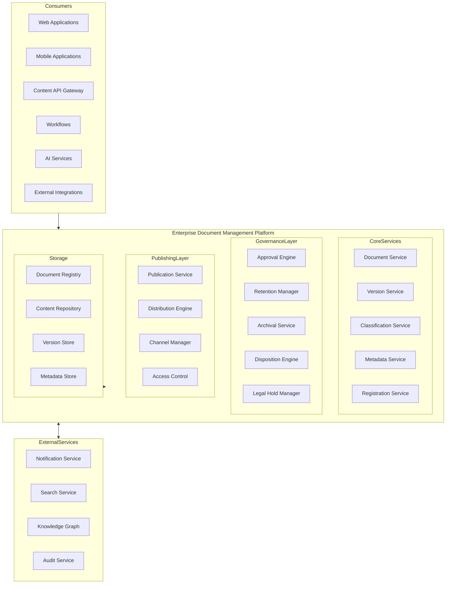
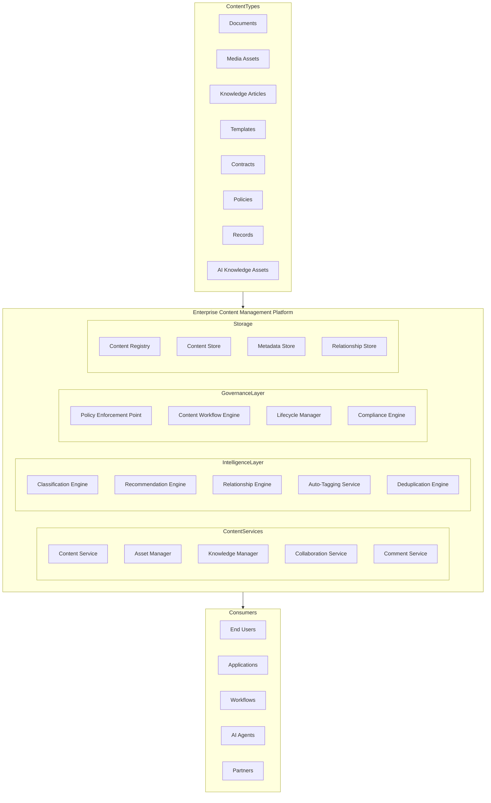
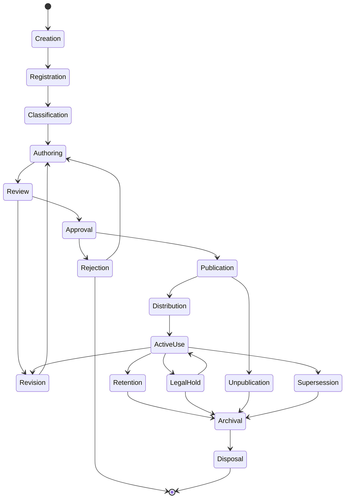
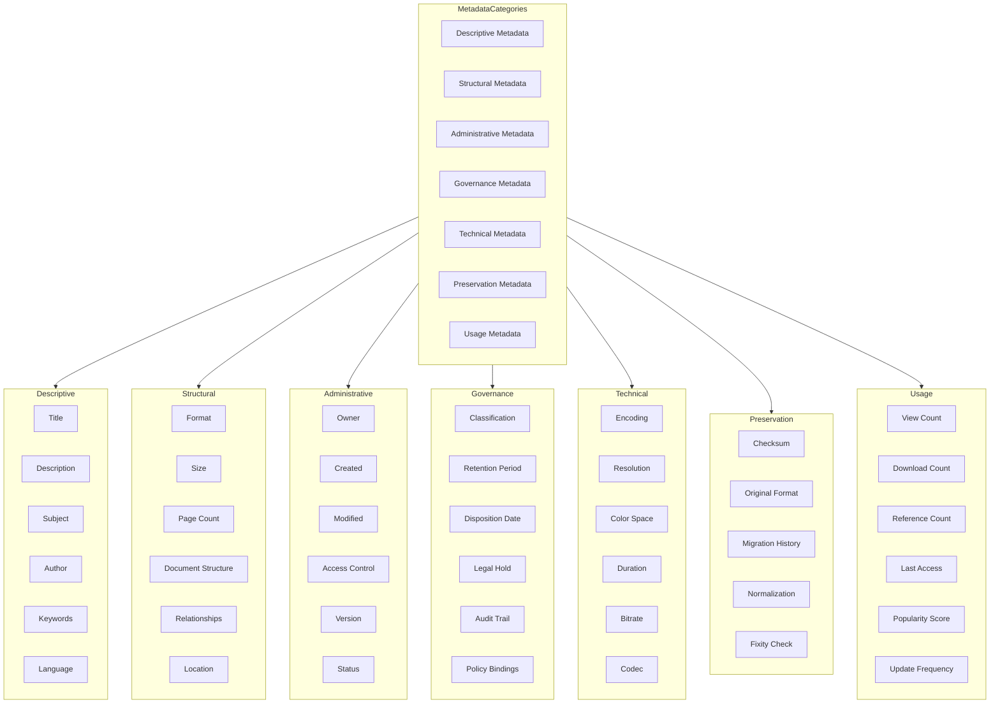
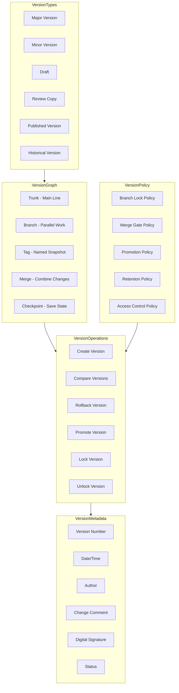
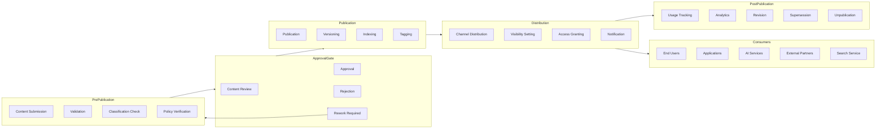
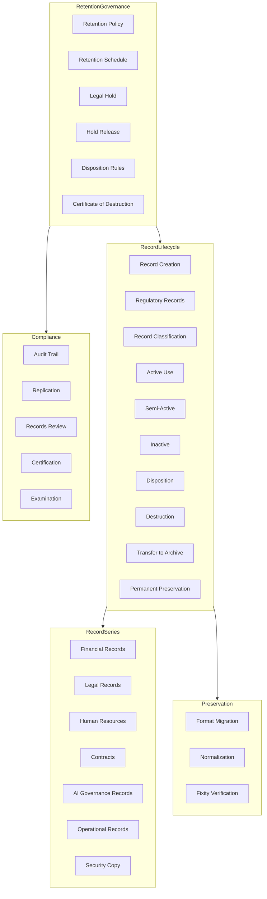
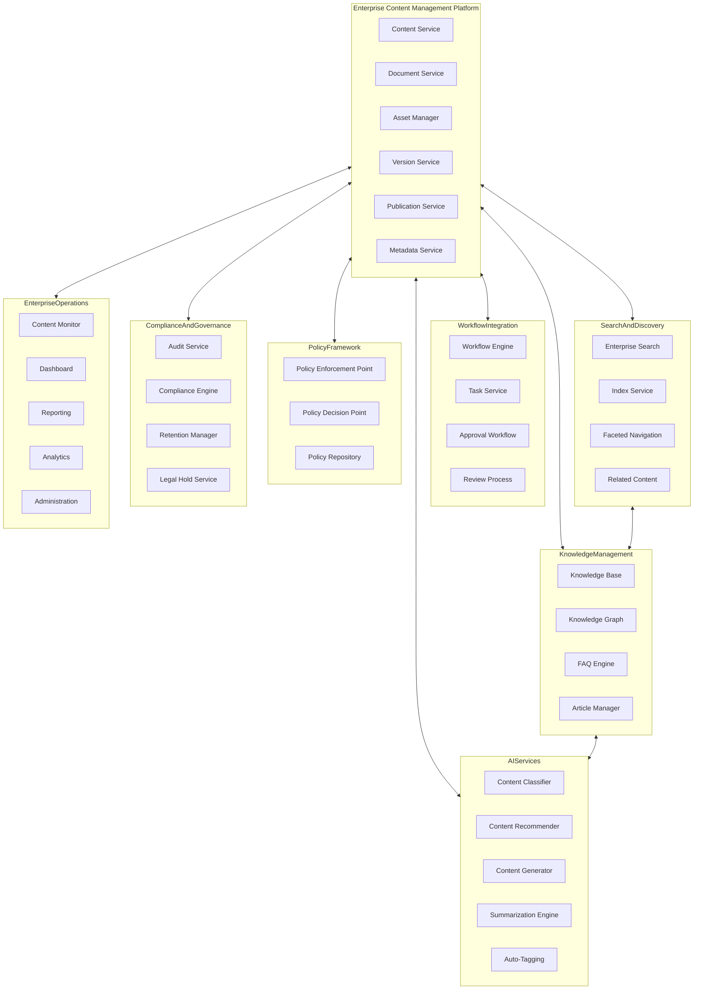

# KB-133 — Enterprise Document & Content Management Architecture

---

## Metadata

- **Document ID:** KB-133
- **Title:** Enterprise Document & Content Management Architecture
- **Suite:** Enterprise Platform Services
- **Version:** 1.0
- **Status:** Approved Architecture
- **Classification:** Enterprise Content Services Architecture
- **Date:** 2026-07-12

---

## Executive Summary

The Enterprise Document & Content Management Platform provides centralized capabilities for creating, organizing, governing, securing, classifying, versioning, approving, publishing, discovering, retaining, archiving, and retiring enterprise content across the DUKADESK ecosystem.

Content operates as a governed enterprise asset independent of applications, storage technologies, or business domains. All document management, content governance, metadata administration, version control, publication workflows, records management, and knowledge preservation are governed by this canonical architecture.

---

## Purpose

Define how DUKADESK manages enterprise content consistently while ensuring governance, collaboration, security, compliance, discoverability, reuse, and long-term knowledge preservation.

---

## Scope

### In Scope

- Enterprise document architecture
- Enterprise content architecture
- Content taxonomy
- Document taxonomy
- Content registry
- Document registry
- Version management
- Metadata architecture
- Classification architecture
- Publishing architecture
- Approval architecture
- Collaboration architecture
- Digital asset management
- Records management
- Retention architecture
- Archival governance
- Content lifecycle
- Content governance
- Enterprise knowledge assets
- Content observability

### Out of Scope

- File storage implementation
- Search implementation
- Backup implementation
- Collaboration tool implementation
- Office suite implementation
- Infrastructure implementation

These are addressed by dedicated Knowledge Base documents, including KB-080 (File & Object Storage Architecture), KB-089 (Knowledge Graph Architecture), KB-090 (Analytics & Business Intelligence Architecture), and KB-140 (Enterprise Platform Services Reference Architecture).

---

## Architectural Principles

| # | Principle | Description |
|---|-----------|-------------|
| 1 | Content as an Enterprise Asset | Content is a governed enterprise asset, not an application artifact |
| 2 | Single Source of Truth | Every content item has one authoritative source |
| 3 | Metadata-Driven Governance | Content behavior is governed by metadata, not hardcoded logic |
| 4 | Version by Default | All content changes produce versioned artifacts with history |
| 5 | Lifecycle Governance | Every content item follows a governed lifecycle from creation to disposal |
| 6 | Content Discoverability | Content is findable through metadata, classification, and enterprise search |
| 7 | Classification by Design | Content is classified at creation with governed taxonomies |
| 8 | Security by Design | Content access enforces authorization at every layer |
| 9 | Privacy by Design | Content privacy is enforced through classification and policy |
| 10 | Vendor Independence | No dependency on specific content management vendor implementations |
| 11 | Technology Neutrality | The architecture supports any technology stack without bias |
| 12 | Multi-Tenant Isolation | Content data and operations are fully isolated by tenant boundary |
| 13 | Observability by Default | All content operations emit metrics, events, and audit trails |

---

## Canonical Definitions

| Term | Definition |
|------|-----------|
| Document | A discrete container of structured or unstructured information with governance |
| Content | Any information asset within the enterprise, including documents, media, and knowledge |
| Digital Asset | A media-rich content item such as images, video, audio, or design files |
| Content Registry | The canonical inventory of all content items within the enterprise |
| Document Registry | The canonical inventory of all documents and records within the enterprise |
| Content Taxonomy | A hierarchical classification system for organizing enterprise content |
| Metadata | Structured data describing content properties, context, and governance |
| Content Classification | The assignment of a content item to a category within the taxonomy |
| Content Version | A specific state of a content item captured at a point in time |
| Record | A content item preserved as evidence of business activity or compliance |
| Record Series | A group of related records governed by common retention and disposition rules |
| Content Lifecycle | The governed state progression of content from creation to disposal |
| Publication | The act of making content available to a defined audience |
| Approval | A governed authorization step before content publication or modification |
| Archive | Long-term preservation of content for historical or compliance purposes |
| Retention | The duration for which content must be preserved before disposal |
| Knowledge Asset | A content item with recognized value for enterprise knowledge preservation |
| Content Owner | The entity accountable for a content item's lifecycle and governance |
| Content Repository | A managed storage system for enterprise content |
| Content Governance | The policies, roles, and processes governing enterprise content management |

---

## Content Registry

The Content Registry is the canonical inventory of all enterprise content assets. Every content item within DUKADESK must be registered in the Content Registry.

### Content Registry Structure

| Component | Description |
|-----------|-------------|
| Content Definition | Name, type, domain, description, and purpose |
| Classification | Taxonomy category, content type, and governance classification |
| Metadata | Structured metadata fields, tags, and custom attributes |
| Ownership | Content owner, steward, business domain, and tenant association |
| Version State | Current version, draft status, and version history reference |
| Lifecycle State | Current lifecycle position with timestamp and audit trail |
| Retention Policy | Retention period, disposition rules, and legal hold status |
| Storage Reference | Content repository, storage location, and access path |

---

## Enterprise Document Management Architecture

---

## Enterprise Content Management Architecture

---

## Content Taxonomy

```mermaid
graph TB
    CT[Content Taxonomy] --> BIZ[Business Documents]
    CT --> TEC[Technical Documentation]
    CT --> POL[Policies]
    CT --> PRC[Procedures]
    CT --> KNW[Knowledge Articles]
    CT --> TPL[Templates]
    CT --> CTR[Contracts]
    CT --> MED[Media Assets]
    CT --> MKT[Marketplace Content]
    CT --> BLD[Builder Studio Assets]
    CT --> AIK[AI Knowledge Assets]
    CT --> OPS[Operational Documents]
    CT --> CMP[Compliance Records]
    CT --> FTR[Future Content Domains]

    BIZ --> REP[Reports]
    BIZ --> PRE[Presentations]
    BIZ --> SPR[Spreadsheets]
    BIZ --> COR[Correspondence]

    TEC --> API[API Documentation]
    TEC --> ARC[Architecture Documents]
    TEC --> SPD[Specifications]
    TEC --> GUI[User Guides]

    KNW --> FAQ[FAQs]
    KNW --> BKP[Best Practices]
    KNW --> TUT[Tutorials]
    KNW --> REF[Reference Guides]

    CTR --> AGR[Agreements]
    CTR --> SOW[Statements of Work]
    CTR --> SLA[Service Level Agreements]
    CTR --> LIC[Licenses]

    MED --> IMG[Images]
    MED --> VID[Videos]
    MED --> AUD[Audio]
    MED --> GRP[Graphics]

    AIK --> TRA[Training Data]
    AIK --> MDL[Model Documentation]
    AIK --> INF[Inference Results]
    AIK --> EVL[Evaluation Reports]

    CMP --> AUD[Audit Reports]
    CMP --> REG[Regulatory Filings]
    CMP --> CER[Certifications]
    CMP --> RCM[Records of Compliance]
```

---

## Content Lifecycle

---

## Metadata Architecture

---

## Version Management Model

---

## Publishing Workflow

---

## Records Management Architecture

---

## Enterprise Content Operating Model

---

## Enterprise Content Ecosystem

```mermaid
graph TB
    subgraph ContentEcosystem[Enterprise Content Ecosystem]

        subgraph ContentSources
            USR[Users]
            APP[Applications]
            WKF[Workflows]
            AIA[AI Agents]
            INT[Integrations]
            TEN[Tenants]
            MKT[Marketplace]
            EXT[External Systems]
        end

        subgraph ContentPlatform
            CNS[Content Service]
            DMS[Document Service]
            ASM[Asset Management]
            KNW[Knowledge Management]
            VER[Version Service]
            PUB[Publication Service]
            CLS[Classification Engine]
            MTD[Metadata Service]
        end

        subgraph Repositories
            DOC[Document Repository]
            AST[Asset Repository]
            KWL[Knowledge Base]
            RCD[Records Store]
            ARC[Archive Store]
            TPL[Template Repository]
        end

        subgraph Consumers
            USR2[End Users]
            WEB[Web Applications]
            MOB[Mobile Applications]
            API[API Consumers]
            AI2[AI Agents]
            PRT[Partners]
        end

        subgraph Governance
            PLY[Policy Engine]
            AUD[Audit Service]
            SEC[Security Service]
            TEN2[Tenant Isolation]
            CMP[Compliance Engine]
            LGL[Legal Hold]
        end

        subgraph Observability
            MET[Metrics]
            TRC[Traces]
            LOG[Logs]
            EVT[Events]
            DSH[Dashboards]
            ALR[Alerts]
            RPT[Reports]
            ANL[Analytics]
        end
    end

    ContentSources --> ContentPlatform
    ContentPlatform --> Repositories
    Repositories --> Consumers
    Governance -.-> ContentPlatform
    Governance -.-> Repositories
    Governance -.-> ContentSources
    Observability -.-> ContentPlatform
    Observability -.-> Repositories
    Observability -.-> Consumers
```

---

## Governance

| Domain | Governance Focus |
|--------|-----------------|
| Content Ownership | Every content item has a designated owner accountable for its lifecycle |
| Document Ownership | Every document has a designated owner responsible for its accuracy and governance |
| Metadata Governance | Metadata schemas are defined, versioned, and enforced enterprise-wide |
| Classification Governance | Taxonomy and classification rules are governed by enterprise standards |
| Security Governance | Content access and operations are governed by the Authorization Architecture |
| Privacy Governance | Content privacy is enforced through classification, access control, and policy |
| Compliance Governance | Content management complies with regulatory requirements and audit mandates |
| Lifecycle Governance | All content follows the governed lifecycle; state transitions require authorization |
| Records Governance | Records management complies with legal, regulatory, and business requirements |
| Enterprise Governance | The Enterprise Architecture board governs content platform evolution and standards |

### Governance Enforcement Points

| Enforcement Point | Mechanism |
|-------------------|-----------|
| Content Creation | Classification and metadata validation before creation |
| Content Publication | Approval gate and policy verification before publication |
| Content Modification | Version creation and change audit before modification |
| Content Retention | Retention policy enforcement at lifecycle transitions |
| Content Disposal | Disposition authorization and certificate of destruction |
| Legal Hold | Hold application prevents disposal or modification |
| Cross-Tenant Sharing | Tenant isolation boundary with explicit authorization |

---

## Responsibilities

| Role | Responsibilities |
|------|-----------------|
| Enterprise Architecture | Defines content architecture, standards, and governance; approves platform evolution |
| Content Management Team | Manages content taxonomy, metadata standards, and content governance |
| Knowledge Management Team | Manages knowledge assets, knowledge graph integration, and content discoverability |
| Platform Engineering | Develops, operates, and maintains the Enterprise Content Management Platform |
| Product Teams | Integrates with the content platform; does not implement independent content repositories |
| Security | Defines content authorization model; audits content access; enforces least privilege |
| Compliance | Defines content compliance requirements; audits content operations; ensures regulatory adherence |
| Legal | Manages legal hold, records retention, and disposition compliance |
| AI Governance Board | Governs AI-generated content and AI access to enterprise content |
| Tenant Administrators | Manage tenant-specific content repositories, classifications, and policies |
| Content Owners | Manage specific content items throughout their lifecycle |

---

## Security

| Security Control | Description |
|------------------|-------------|
| Content Authorization | Read, write, modify, delete, publish, and administer permissions per content item |
| Document Authorization | Document-level permissions with inheritance and override |
| Tenant Isolation | Content data fully isolated by tenant boundary |
| Classification-Based Protection | Access restrictions enforced based on content classification |
| Least Privilege | Users have minimum permissions required for their content role |
| Zero Trust | All content API calls authenticated and authorized regardless of network origin |
| Secure Publication | Content distribution uses authenticated channels with encrypted payloads |
| Auditability | All content operations recorded in immutable audit log |
| Provenance | Full provenance tracking from content creation through disposal |
| Policy Enforcement | Authorization policies enforced at API gateway and service mesh layers |

### Security Zones

| Zone | Description |
|------|-------------|
| Public | Public content accessible without authentication |
| Authenticated | Content requiring user authentication |
| Internal | Internal enterprise content requiring authorized access |
| Confidential | Sensitive content with classification-based restrictions |
| Restricted | Highly sensitive content requiring explicit approval |
| Regulated | Compliance-related content with audited access |

---

## Privacy

| Privacy Control | Description |
|----------------|-------------|
| Sensitive Content Governance | Content containing personal or sensitive information is classified and restricted |
| Personal Information Protection | Personally identifiable information in content is masked, encrypted, or redacted |
| Data Minimization | Only required content data is collected, stored, and processed |
| Consent Governance | Content processing of personal data requires explicit consent |
| Regulatory Compliance | Content handling complies with GDPR, CCPA, and regional privacy regulations |
| Regional Restrictions | Content distribution respects regional access restrictions |
| Cross-Border Governance | Content is stored and processed in accordance with data residency requirements |
| Retention Policies | Content is retained only for the duration required by policy |

### Data Classification

| Classification | Examples | Access Restrictions |
|---------------|----------|-------------------|
| Public | Marketing materials, public documentation | No authentication required |
| Internal | Internal policies, procedures | Authenticated users within tenant |
| Confidential | Business plans, financial reports | Authorized users only |
| Restricted | Personal data, legal documents | Explicit approval required |
| Regulated | Audit records, compliance evidence | Audited access with strict controls |

---

## Performance

| Consideration | Requirement |
|---------------|-------------|
| Enterprise-Scale Content Repositories | Support for millions of content items across all tenants |
| High-Volume Content Operations | Thousands of content create, read, update, delete operations per second |
| Global Content Distribution | Content delivery across multiple geographic regions |
| High Availability | 99.99% uptime for core content management services |
| Elastic Scalability | Horizontal scaling of content services based on demand |
| Operational Resilience | Graceful degradation under load with circuit breakers |
| Efficient Metadata Retrieval | Metadata queries return within milliseconds |
| Multi-Region Readiness | Active-active content serving across paired regions |

### Performance Optimization

| Optimization | Description |
|--------------|-------------|
| Content Caching | Frequently accessed content cached with intelligent invalidation |
| Metadata Indexing | Optimized metadata query paths with composite indexes |
| Bulk Operations | Batch content operations through optimized APIs |
| Async Processing | Non-blocking operations for publication, distribution, and indexing |
| CDN Integration | Content delivery network for globally distributed content |
| Read Replicas | Read-only replicas for search and reporting queries |

---

## Observability

| Observable Dimension | Metrics | Purpose |
|---------------------|---------|---------|
| Repository Health | Content store availability, latency, error rates | Detecting content service degradation |
| Content Utilization | Active content items, storage growth, access frequency | Tracking content repository usage |
| Publication Analytics | Publications per period, approval times, distribution metrics | Monitoring content publishing velocity |
| Collaboration Metrics | Active collaborators, comments per period, review cycles | Understanding collaboration patterns |
| Governance Dashboards | Policy violations, classification errors, retention compliance | Monitoring content governance health |
| Compliance Reporting | Retention compliance, legal hold status, disposal rates | Ensuring regulatory adherence |
| Lifecycle Analytics | Content distribution by lifecycle stage, aging metrics | Understanding content maturity |
| Operational Reporting | Daily content activity, storage trends, domain distribution | Operational content management |
| Executive Reporting | Cross-domain content trends, knowledge asset metrics | Strategic content intelligence |
| Enterprise Knowledge Insights | Content reuse rates, knowledge gaps, popular content | Identifying content optimization opportunities |

### Observability Events

| Event Type | Trigger | Consumer |
|------------|---------|----------|
| ContentCreated | New content registered | Search service, knowledge graph, governance |
| ContentPublished | Content approved and published | Distribution service, notification service |
| ContentVersioned | New version created | Version service, audit service |
| ContentAccessed | Content read by user | Analytics service, usage tracker |
| ContentModified | Content updated | Version service, classification engine |
| ContentRetentionTriggered | Retention period reached | Archival service, disposition engine |
| ContentDisposed | Content permanently deleted | Audit service, compliance engine |
| ContentLegalHold | Legal hold applied | Retention service, governance dashboard |
| ClassificationChanged | Content reclassified | Search service, policy engine |

---

## Failure Scenarios

| # | Scenario | Architectural Response |
|---|----------|----------------------|
| 1 | Content Duplication | Deduplication engine with content hashing; registry uniqueness enforcement |
| 2 | Version Conflicts | Optimistic concurrency control; conflict resolution with merge support |
| 3 | Unauthorized Publication | Publication authorization enforced at API layer; violation logged with alert |
| 4 | Metadata Inconsistencies | Metadata validation schema; consistency checks with automated remediation |
| 5 | Classification Failures | Classification validation at creation; fallback to default classification |
| 6 | Cross-Tenant Content Exposure | Tenant isolation boundary enforced at API and data layers; audit on access attempt |
| 7 | Retention Violations | Retention policy enforcement at lifecycle transitions; violation alert to compliance |
| 8 | Repository Corruption | Checksum verification with automated repair; failover to replica |
| 9 | Collaboration Conflicts | Lock-based collaboration control; conflict detection with manual resolution |
| 10 | Governance Failures | Policy enforcement point blocks violating operation; violation recorded with audit trail |
| 11 | Recovery Failures | Journal-based recovery with replay capability; consistency verification after recovery |
| 12 | Knowledge Fragmentation | Knowledge graph periodic reconciliation; orphan detection with manual review |

---

## Anti-Patterns

| # | Anti-Pattern | Description | Prohibited Because |
|---|-------------|-------------|-------------------|
| 1 | Application-Owned Document Repositories | Applications maintain their own document storage | Bypasses content governance, lifecycle, and security |
| 2 | Duplicate Enterprise Documents | Same content stored in multiple locations | Creates inconsistency, reconciliation burden, version confusion |
| 3 | Manual Version Management | Versioning implemented in application logic | Lacks audit trail, rollback capability, and governance |
| 4 | Unclassified Content | Content created without taxonomy assignment | Prevents discovery, governance enforcement, and retention management |
| 5 | Hardcoded Document Locations | Document paths embedded in application code | Prevents content mobility, refactoring, and storage optimization |
| 6 | Content Without Metadata | Content stored without descriptive metadata | Creates orphan content, undiscoverable knowledge, governance gaps |
| 7 | Publishing Without Approval | Content published without governance gate | Allows unauthorized or non-compliant content distribution |
| 8 | Records Outside Governance | Records managed outside records management system | Violates compliance, retention, and legal requirements |
| 9 | Hidden Enterprise Knowledge | Knowledge assets not registered in enterprise knowledge base | Creates knowledge silos, reduces enterprise intelligence |
| 10 | Unregistered Content Assets | Content not registered in the Content Registry | Prevents discovery, governance, and enterprise content visibility |

---

## Future Evolution

| # | Evolution Path | Description |
|---|---------------|-------------|
| 1 | AI-Assisted Knowledge Management | AI agents that autonomously classify, tag, relate, and govern enterprise content |
| 2 | Semantic Content Discovery | ML-driven content discovery based on semantic meaning rather than keywords |
| 3 | Autonomous Content Governance | Self-governing content that applies policies based on content analysis |
| 4 | Federated Content Ecosystems | Content federation across DUKADESK and partner content repositories |
| 5 | Intelligent Document Classification | Automated classification using ML models trained on enterprise content |
| 6 | Adaptive Content Lifecycle Optimization | Lifecycle policies that adapt based on content usage patterns |
| 7 | Cross-Platform Content Federation | Federated content management across different platforms and repositories |
| 8 | Enterprise Knowledge Intelligence | AI-driven insights into knowledge gaps, content quality, and information architecture |

---

## Cross References

| Document ID | Title | Relationship |
|-------------|-------|-------------|
| KB-080 | File & Object Storage Architecture | Defines storage infrastructure for content repositories |
| KB-088 | Metadata Management Architecture | Defines metadata standards and governance for content |
| KB-089 | Knowledge Graph Architecture | Defines knowledge graph integration for content relationships |
| KB-090 | Analytics & Business Intelligence Architecture | Defines analytics integration for content usage intelligence |
| KB-107 | Enterprise Platform Services Overview Architecture | Foundational reference for platform services architecture |
| KB-115 | Template Management Architecture | Defines template content integration with platform |
| KB-116 | AI Platform Architecture | Defines AI content processing and generation capabilities |
| KB-120 | AI Context & Memory Architecture | Defines AI context storage as enterprise content |
| KB-123 | Enterprise Policy Framework Architecture | Foundational reference for policy-driven content governance |
| KB-126 | Audit & Compliance Architecture | Defines audit and compliance integration for content governance |
| KB-140 | Enterprise Platform Services Reference Architecture | Comprehensive reference for all platform services |

---

## Critical DUKADESK Architectural Rule

**All enterprise documents and content within DUKADESK shall be governed exclusively through the centralized Enterprise Document & Content Management Platform. No application, service, workflow, AI capability, integration, tenant, or operational domain shall maintain independent content repositories or lifecycle mechanisms outside the canonical enterprise architecture, ensuring consistent governance, security, discoverability, auditability, reuse, and enterprise-wide knowledge integrity.**
