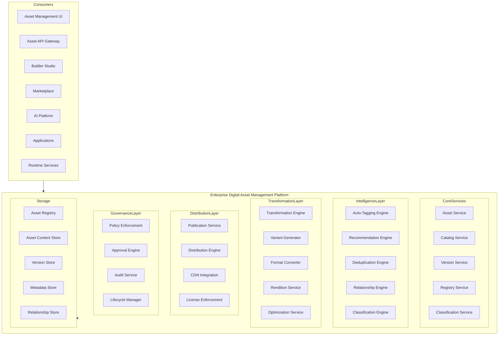
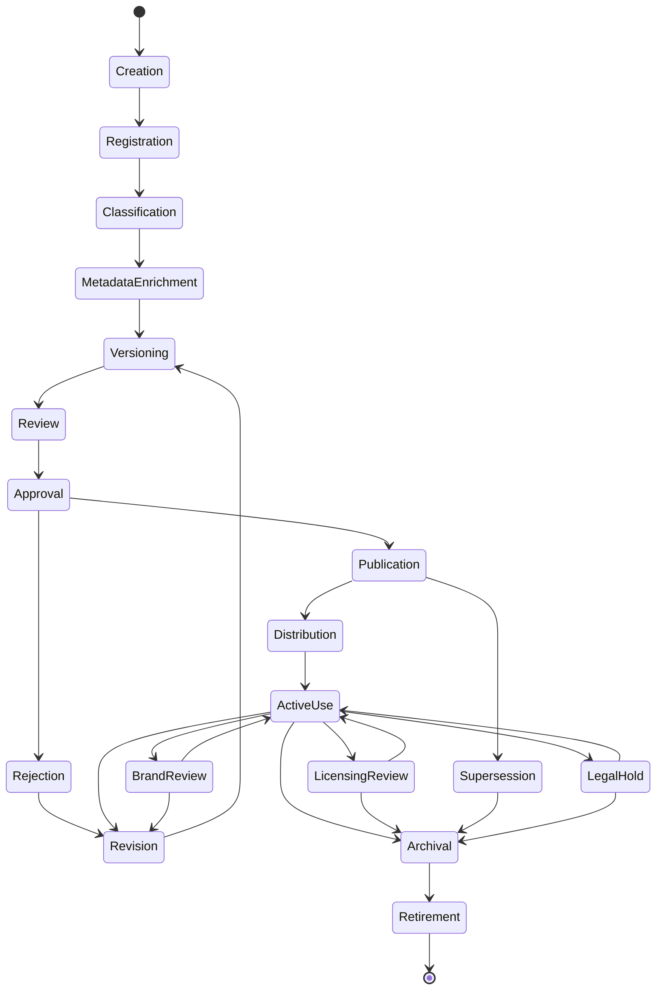
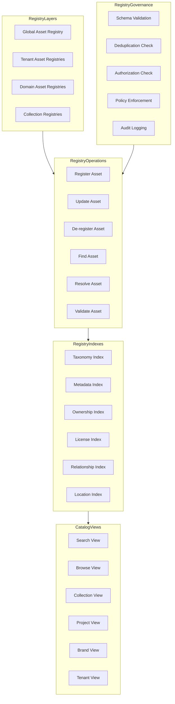
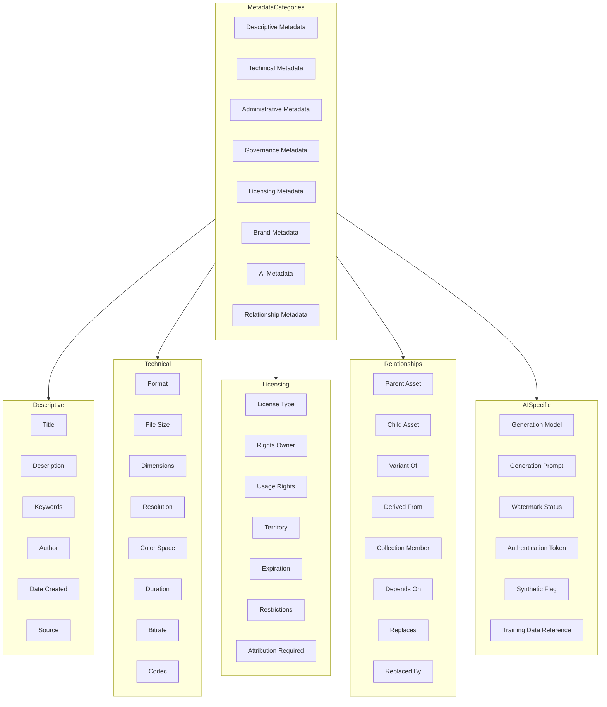
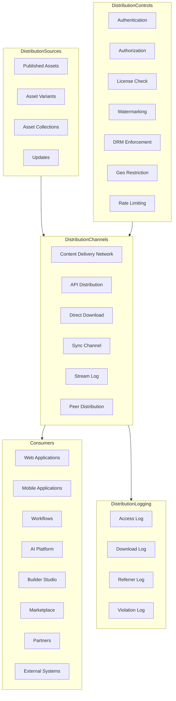
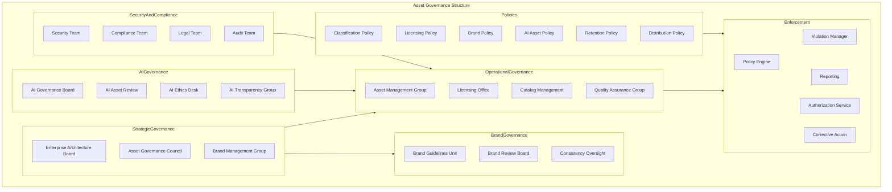
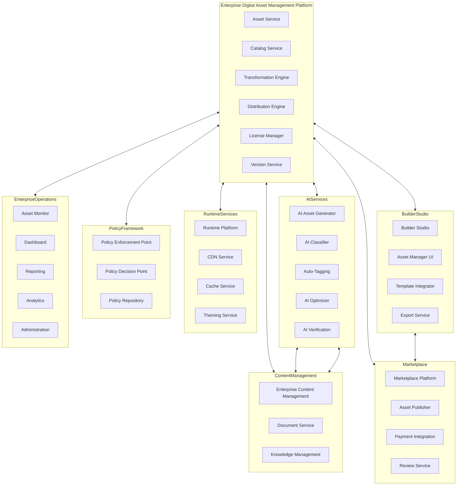

# KB-134 — Enterprise Digital Asset Management Architecture

---

## Metadata

- **Document ID:** KB-134
- **Title:** Enterprise Digital Asset Management Architecture
- **Suite:** Enterprise Platform Services
- **Version:** 1.0
- **Status:** Approved Architecture
- **Classification:** Enterprise Asset Services Architecture
- **Date:** 2026-07-12

---

## Executive Summary

The Enterprise Digital Asset Management Platform provides centralized capabilities for governing all digital assets, including media, graphics, documents, design resources, AI-generated assets, application resources, templates, brand assets, and operational artifacts across the DUKADESK ecosystem.

Digital assets operate as governed enterprise resources independent of storage technologies, applications, or business domains. All asset identification, classification, cataloging, versioning, security, transformation, distribution, licensing, retention, archival, and lifecycle management are governed by this canonical architecture.

---

## Purpose

Define how DUKADESK centrally manages enterprise digital assets while ensuring consistency, governance, compliance, reuse, brand integrity, operational efficiency, and long-term asset preservation.

---

## Scope

### In Scope

- Enterprise Digital Asset Management architecture
- Digital asset taxonomy
- Asset registry
- Asset catalog
- Asset metadata
- Asset classification
- Asset versioning
- Asset lifecycle
- Asset relationships
- Asset transformation
- Asset publishing
- Asset distribution
- Asset licensing
- Asset ownership
- Asset governance
- Brand asset governance
- AI-generated asset governance
- Asset analytics
- Enterprise asset observability

### Out of Scope

- Object storage implementation
- CDN implementation
- Image processing implementation
- Video processing implementation
- Search implementation
- Infrastructure implementation

These are addressed by dedicated Knowledge Base documents, including KB-080 (File & Object Storage Architecture), KB-088 (Metadata Management Architecture), KB-089 (Knowledge Graph Architecture), and KB-140 (Enterprise Platform Services Reference Architecture).

---

## Architectural Principles

| # | Principle | Description |
|---|-----------|-------------|
| 1 | Assets as Enterprise Resources | Digital assets are governed enterprise resources, not application artifacts |
| 2 | Metadata-First Architecture | Asset behavior and governance are driven by metadata, not hardcoded logic |
| 3 | Centralized Governance | All digital assets are governed by the Enterprise DAM Platform |
| 4 | Lifecycle by Design | Every asset follows a governed lifecycle from creation to retirement |
| 5 | Discoverability | Assets are findable through metadata, classification, and enterprise search |
| 6 | Version by Default | All asset changes produce versioned artifacts with full history |
| 7 | Reuse over Duplication | Assets are referenced, not copied, across the enterprise |
| 8 | Security by Design | Asset access enforces authorization at every layer |
| 9 | Privacy by Design | Asset privacy is enforced through classification and policy |
| 10 | Vendor Independence | No dependency on specific DAM vendor implementations |
| 11 | Technology Neutrality | The architecture supports any technology stack without bias |
| 12 | Multi-Tenant Isolation | Asset data and operations are fully isolated by tenant boundary |
| 13 | Observability by Default | All asset operations emit metrics, events, and audit trails |

---

## Canonical Definitions

| Term | Definition |
|------|-----------|
| Digital Asset | A digitally stored resource with governed metadata, lifecycle, and enterprise value |
| Asset Registry | The canonical inventory of all enterprise digital assets |
| Asset Catalog | A structured collection of assets organized for discovery and governance |
| Asset Metadata | Structured data describing asset properties, context, governance, and licensing |
| Asset Classification | The assignment of an asset to a category within the enterprise taxonomy |
| Asset Collection | A curated grouping of related assets for a specific purpose |
| Asset Version | A specific state of an asset captured at a point in time |
| Asset Owner | The entity accountable for an asset's lifecycle, governance, and licensing |
| Asset Transformation | The process of creating derived variants from a source asset |
| Asset Distribution | The controlled delivery of assets to consumers and channels |
| Asset Publication | The act of making an asset available to a defined audience |
| Asset License | A legal grant defining usage rights, restrictions, and obligations |
| Brand Asset | An asset governed by brand identity standards and guidelines |
| AI Asset | An asset generated, modified, or managed by AI capabilities |
| Asset Lifecycle | The governed state progression of an asset from creation to retirement |
| Asset Governance | The policies, roles, and processes governing enterprise asset management |
| Asset Repository | A managed storage system for digital assets and their variants |
| Asset Variant | A derived version of an asset with specific format, size, or characteristics |
| Asset Provenance | The documented history of an asset's origin, transformation, and usage |
| Asset Relationship | A defined connection between two or more assets |

---

## Asset Registry

The Asset Registry is the canonical inventory of all enterprise digital assets. Every digital asset within DUKADESK must be registered in the Asset Registry.

### Asset Registry Structure

| Component | Description |
|-----------|-------------|
| Asset Definition | Name, type, domain, description, and purpose |
| Classification | Taxonomy category, asset type, and governance classification |
| Metadata | Descriptive, technical, administrative, governance, and licensing metadata |
| Ownership | Asset owner, steward, business domain, tenant association, and brand affiliation |
| Version State | Current version, variant count, and version history reference |
| Lifecycle State | Current lifecycle position with timestamp and audit trail |
| Licensing | License type, usage rights, restrictions, expiration, and territory |
| Storage Reference | Asset repository, storage location, checksum, and access path |
| Relationships | Parent assets, child assets, variants, collections, and dependencies |

---

## Enterprise Digital Asset Management Platform

---

## Digital Asset Taxonomy

```mermaid
graph TB
    DAT[Digital Asset Taxonomy] --> IMG[Images]
    DAT --> VID[Videos]
    DAT --> AUD[Audio]
    DAT --> DOC[Documents]
    DAT --> BRD[Brand Assets]
    DAT --> LOG[Logos]
    DAT --> ICN[Icons]
    DAT --> TPL[Templates]
    DAT --> MKT[Marketing Assets]
    DAT --> MPL[Marketplace Assets]
    DAT --> BLD[Builder Assets]
    DAT --> RNT[Runtime Assets]
    DAT --> AIA[AI Generated Assets]
    DAT --> OPR[Operational Assets]
    DAT --> CMP[Compliance Assets]
    DAT --> FTR[Future Asset Domains]

    IMG --> PHO[Photographs]
    IMG --> ILL[Illustrations]
    IMG --> GRP[Graphics]
    IMG --> SCR[Screenshots]
    IMG --> INF[Infographics]

    VID --> REC[Recordings]
    VID --> ANM[Animations]
    VID --> TUT[Tutorials]
    VID --> PRM[Promotional]

    BRD --> GUD[Brand Guidelines]
    BRD --> CPK[Color Palettes]
    BRD --> TPG[Typography]
    BRD --> BRG[Brand Graphics]

    MKT --> BNR[Banners]
    MKT --> AD[Advertisements]
    MKT --> SOC[Social Media]
    MKT --> EML[Email Assets]

    AIA --> GEN[Generated Images]
    AIA --> SYN[Synthetic Data]
    AIA --> AI_VID[AI Videos]
    AIA --> AI_AUD[AI Audio]
    AIA --> MDL[Model Artifacts]

    RNT --> SPR[Sprites]
    RNT --> SKN[Skins]
    RNT --> THM[Themes]
    RNT --> FNT[Fonts]
```

---

## Asset Lifecycle

---

## Asset Registry Architecture

---

## Metadata & Relationship Model

---

## Asset Transformation Architecture

```mermaid
graph TB
    subgraph SourceAssets
        SRC[Original Source Asset]
        MST[Master Asset]
    end

    subgraph TransformationTypes
        FMT[Format Conversion]
        SIZ[Size/Resolution Variation]
        CRP[Cropping]
        WTM[Watermarking]
        OPT[Optimization]
        LOC[Localization Variant]
        AI_AUG[AI Augmentation]
        AI_GEN[AI Generation]
        CMP[Compression]
        CLR[Color Adjustment]
    end

    subgraph TransformationEngine
        NLP[Pipeline Orchestrator]
        JOB[Job Manager]
        QUE[Transformation Queue]
        CCH[Cache Layer]
        NOT[Notification Trigger]
    end

    subgraph Variants
        THM[Thumbnail]
        PRV[Preview]
        FUL[Full Resolution]
        WEB[Web Optimized]
        MOB[Mobile Variant]
        PRT[Print Variant]
        AI_VR[AI Variant]
        LCL[Localized Variant]
    end

    subgraph QualityControl
        VAL[Validation]
        CHK[Checksum Verification]
        CMP2[Comparison with Source]
        APV[Approval Gate]
        REJ[Rejection Handler]
    end

    subgraph Storage
        VRS[Version Store]
        VNT[Variant Store]
        CST[Cache Store]
    end

    SourceAssets --> TransformationTypes
    TransformationTypes --> TransformationEngine
    TransformationEngine --> Variants
    Variants --> QualityControl
    QualityControl --> Storage
```

---

## Asset Distribution Architecture

---

## Asset Governance Structure

---

## Enterprise DAM Operating Model

---

## Enterprise Digital Asset Ecosystem

```mermaid
graph TB
    subgraph AssetEcosystem[Enterprise Digital Asset Ecosystem]

        subgraph AssetSources
            USR[Users]
            APP[Applications]
            AI[AI Generators]
            BLD[Builder Studio]
            MKT[Marketplace]
            INT[Integrations]
            TEN[Tenants]
            EXT[External Partners]
        end

        subgraph AssetPlatform
            ASM[Asset Service]
            CAT[Catalog Service]
            TRF[Transformation Engine]
            DST[Distribution Engine]
            LIC[License Service]
            VER[Version Service]
            REG[Registry Service]
        end

        subgraph Repositories
            AST[Asset Repository]
            VAR[Variant Store]
            VRS[Version Store]
            MST[Master Asset Store]
            ARC[Archive Store]
            CCH[Cache Store]
        end

        subgraph Consumers
            USR2[End Users]
            WEB[Web Applications]
            MOB[Mobile Applications]
            API[API Consumers]
            AI2[AI Agents]
            WKF[Workflows]
            PRT[Partners]
            RNT[Runtime Services]
        end

        subgraph Governance
            PLY[Policy Engine]
            AUD[Audit Service]
            SEC[Security Service]
            TNI[Tenant Isolation]
            CMP[Compliance Engine]
            LGL[Legal Service]
        end

        subgraph Observability
            MET[Metrics]
            TRC[Traces]
            LOG[Logs]
            EVT[Events]
            DSH[Dashboards]
            ALR[Alerts]
            RPT[Reports]
            ANL[Analytics]
        end
    end

    AssetSources --> AssetPlatform
    AssetPlatform --> Repositories
    Repositories --> Consumers
    Governance -.-> AssetPlatform
    Governance -.-> Repositories
    Governance -.-> AssetSources
    Observability -.-> AssetPlatform
    Observability -.-> Repositories
    Observability -.-> Consumers
```

---

## Governance

| Domain | Governance Focus |
|--------|-----------------|
| Asset Ownership | Every asset has a designated owner accountable for its lifecycle and licensing |
| Metadata Governance | Metadata schemas are defined, versioned, and enforced enterprise-wide |
| Licensing Governance | Asset licensing is tracked, enforced, and audited for compliance |
| Brand Governance | Brand assets comply with enterprise brand guidelines and standards |
| AI Governance | AI-generated assets include provenance, watermarking, and ethical compliance |
| Security Governance | Asset access and operations are governed by the Authorization Architecture |
| Privacy Governance | Asset privacy is enforced through classification, access control, and policy |
| Lifecycle Governance | All assets follow the governed lifecycle; state transitions require authorization |
| Compliance Governance | Asset management complies with regulatory requirements and audit mandates |
| Enterprise Governance | The Enterprise Architecture board governs DAM platform evolution and standards |

### Governance Enforcement Points

| Enforcement Point | Mechanism |
|-------------------|-----------|
| Asset Registration | Schema validation, deduplication check, classification enforcement |
| Asset Publication | License verification, brand compliance check, approval gate |
| Asset Transformation | Provenance tracking, variant validation, quality control |
| Asset Distribution | License enforcement, geo-restriction, authorization check |
| Asset Licensing | Expiration monitoring, usage auditing, violation detection |
| AI Asset Creation | Provenance capture, watermarking, transparency metadata |

---

## Responsibilities

| Role | Responsibilities |
|------|-----------------|
| Enterprise Architecture | Defines DAM architecture, standards, and governance; approves platform evolution |
| Digital Asset Management Team | Manages asset taxonomy, metadata standards, catalog governance, and asset operations |
| Brand Management | Defines brand asset guidelines, reviews brand compliance, governs brand consistency |
| Platform Engineering | Develops, operates, and maintains the Enterprise DAM Platform |
| Product Teams | Integrates with the DAM platform; does not implement independent asset repositories |
| Security | Defines asset authorization model; audits asset access; enforces least privilege |
| Compliance | Defines asset compliance requirements; audits asset operations; ensures regulatory adherence |
| Legal | Manages asset licensing, usage rights, copyright compliance, and legal disputes |
| AI Governance Board | Governs AI-generated assets; approves AI asset provenance and transparency standards |
| Tenant Administrators | Manage tenant-specific asset classifications, catalogs, and policies |
| Asset Owners | Manage specific assets throughout their lifecycle, ensuring metadata accuracy and license compliance |

---

## Security

| Security Control | Description |
|------------------|-------------|
| Asset Authorization | Read, write, modify, delete, publish, distribute, and administer permissions per asset |
| Asset Integrity | Cryptographic checksums verify asset integrity throughout lifecycle |
| Tenant Isolation | Asset data fully isolated by tenant boundary |
| Classification-Aware Protection | Access restrictions enforced based on asset classification |
| Least Privilege | Users have minimum permissions required for their asset role |
| Zero Trust | All asset API calls authenticated and authorized regardless of network origin |
| Secure Distribution | Asset delivery uses authenticated channels with encrypted payloads |
| Auditability | All asset operations recorded in immutable audit log |
| Provenance | Full provenance tracking from asset creation through transformation to distribution |
| Policy Enforcement | Authorization policies enforced at API gateway and service mesh layers |

### Security Zones

| Zone | Description |
|------|-------------|
| Public | Public assets accessible without authentication |
| Authenticated | Asset metadata and previews requiring user authentication |
| Internal | Enterprise assets requiring authorized access |
| Confidential | Sensitive assets with classification-based restrictions |
| Restricted | Highly sensitive assets requiring explicit approval |
| Licensed | Licensed assets with usage restriction enforcement |

---

## Privacy

| Privacy Control | Description |
|----------------|-------------|
| Sensitive Media Governance | Media containing personal or sensitive information is classified and restricted |
| Personal Data Protection | Personally identifiable information in asset metadata is masked or encrypted |
| Consent-Aware Assets | Assets containing personal data require explicit consent for usage |
| Data Minimization | Only required asset data is collected, stored, and processed |
| Regulatory Compliance | Asset handling complies with GDPR, CCPA, and regional privacy regulations |
| Cross-Border Restrictions | Asset distribution respects regional access and data residency restrictions |
| Retention Governance | Assets are retained only for the duration required by policy |
| Privacy Assurance | Regular privacy reviews and impact assessments for DAM capabilities |

### Data Classification

| Classification | Examples | Access Restrictions |
|---------------|----------|-------------------|
| Public | Marketing images, public logos | No authentication required |
| Internal | Brand guidelines, internal templates | Authenticated users within tenant |
| Confidential | Product designs, campaign assets | Authorized users only |
| Restricted | Personal data images, unreleased content | Explicit approval required |
| Regulated | Compliance evidence, legal assets | Audited access with strict controls |

---

## Performance

| Consideration | Requirement |
|---------------|-------------|
| Enterprise-Scale Asset Repositories | Support for millions of digital assets across all tenants |
| High-Volume Asset Distribution | Thousands of asset requests per second globally |
| Elastic Scalability | Horizontal scaling of asset services based on demand |
| Global Delivery Readiness | Asset delivery from geographically distributed points of presence |
| High Availability | 99.99% uptime for core DAM services |
| Operational Resilience | Graceful degradation under load with circuit breakers |
| Efficient Metadata Indexing | Metadata queries and catalog searches return within milliseconds |
| Multi-Region Readiness | Active-active asset serving across paired regions |

### Performance Optimization

| Optimization | Description |
|--------------|-------------|
| Asset Caching | Frequently accessed assets cached with intelligent invalidation |
| CDN Preloading | Proactive asset distribution to edge locations |
| Lazy Transformation | On-demand variant generation with caching |
| Bulk Operations | Batch asset registration, transformation, and distribution |
| Content Negotiation | Automatic format and resolution selection based on client capabilities |
| Read Replicas | Read-only replicas for catalog browsing and analytics queries |

---

## Observability

| Observable Dimension | Metrics | Purpose |
|---------------------|---------|---------|
| Asset Utilization | Asset access frequency, download counts, distribution volume | Tracking asset usage and popularity |
| Distribution Analytics | Requests per region, bandwidth consumption, delivery latency | Monitoring distribution performance |
| Version Analytics | Version count per asset, revision frequency, variant proliferation | Understanding asset evolution patterns |
| Licensing Analytics | License usage, expiration tracking, violation events | Ensuring licensing compliance |
| Governance Dashboards | Policy violations, classification errors, brand compliance | Monitoring asset governance health |
| Compliance Reporting | Licensing compliance, retention compliance, audit status | Ensuring regulatory adherence |
| Operational Reporting | Daily asset activity, storage trends, transformation volume | Operational DAM management |
| Executive Reporting | Cross-domain asset trends, brand asset metrics, cost analysis | Strategic asset intelligence |
| Repository Health | Asset store availability, latency, error rates, capacity trends | Detecting DAM service degradation |
| Enterprise Asset Intelligence | Asset reuse rates, duplicate detection, collection growth | Identifying asset optimization opportunities |

### Observability Events

| Event Type | Trigger | Consumer |
|------------|---------|----------|
| AssetRegistered | New asset registered | Catalog service, search service |
| AssetPublished | Asset approved and published | Distribution service, notification service |
| AssetTransformed | Variant or derivative created | Version service, quality control |
| AssetDistributed | Asset delivered to consumer | Analytics service, CDN service |
| AssetLicensed | License granted or modified | Legal service, governance dashboard |
| AssetLicenseExpiring | License approaching expiration | Notification service, legal team |
| AssetViolation | Policy or license violation detected | Governance dashboard, alert service |
| AssetArchived | Asset moved to archive | Retention service, registry service |
| AssetAIProvenance | AI asset generation completed | AI governance, transparency log |

---

## Failure Scenarios

| # | Scenario | Architectural Response |
|---|----------|----------------------|
| 1 | Duplicate Assets | Deduplication engine with content hashing; registry uniqueness enforcement |
| 2 | Version Conflicts | Optimistic concurrency control; version graph with conflict resolution |
| 3 | Metadata Corruption | Metadata validation schema; integrity checks with automated remediation |
| 4 | Unauthorized Publication | Publication authorization enforced at API layer; violation logged with alert |
| 5 | Licensing Violations | License enforcement at distribution; violation alert to legal and compliance |
| 6 | Cross-Tenant Asset Exposure | Tenant isolation boundary enforced at API and data layers; audit on access attempt |
| 7 | Asset Dependency Failures | Dependency resolution with fallback; broken reference detection with notification |
| 8 | Distribution Failures | CDN failover with automatic reroute; retry with exponential backoff |
| 9 | Governance Failures | Policy enforcement point blocks violating operation; violation recorded with audit trail |
| 10 | Repository Corruption | Checksum verification with automated repair; failover to replica |
| 11 | Recovery Failures | Journal-based recovery with replay capability; consistency verification after recovery |
| 12 | Brand Inconsistency | Brand compliance check at publication; brand review with automated reporting |

---

## Anti-Patterns

| # | Anti-Pattern | Description | Prohibited Because |
|---|-------------|-------------|-------------------|
| 1 | Application-Owned Asset Repositories | Applications maintain their own digital asset storage | Bypasses asset governance, licensing, and lifecycle management |
| 2 | Duplicate Enterprise Assets | Same asset stored in multiple locations | Creates inconsistency, storage waste, version confusion |
| 3 | Manual Metadata Management | Metadata managed in spreadsheets or manual processes | Prevents discoverability, automation, and governance enforcement |
| 4 | Hardcoded Asset Locations | Asset URLs or paths embedded in application code | Prevents asset mobility, CDN optimization, and version updates |
| 5 | Unlicensed Asset Usage | Assets used without license tracking | Creates legal exposure, compliance violations, brand risk |
| 6 | Assets Without Governance | Assets stored outside enterprise governance | Creates ungoverned asset pools, security risks, compliance gaps |
| 7 | Hidden Enterprise Assets | Assets not registered in the Asset Registry | Prevents discovery, reuse, and enterprise asset visibility |
| 8 | Publishing Without Approval | Assets published without governance gate | Allows unauthorized, non-compliant, or brand-violating distribution |
| 9 | AI Assets Without Provenance | AI-generated assets without generation metadata | Prevents transparency, auditability, and ethical governance |
| 10 | Unregistered Asset Collections | Asset collections managed outside the catalog | Creates shadow collections, reduces governance effectiveness |

---

## Future Evolution

| # | Evolution Path | Description |
|---|---------------|-------------|
| 1 | AI-Assisted Asset Classification | AI agents that autonomously classify, tag, and relate enterprise assets |
| 2 | Semantic Asset Discovery | ML-driven asset discovery based on visual and semantic content analysis |
| 3 | Autonomous Asset Governance | Self-governing assets that apply policies based on content and usage analysis |
| 4 | Intelligent Media Optimization | AI-driven per-device, per-context asset optimization |
| 5 | Federated Enterprise Asset Ecosystems | Asset federation across DUKADESK and partner asset repositories |
| 6 | Adaptive Licensing Intelligence | AI-driven license recommendation, risk assessment, and compliance prediction |
| 7 | Cross-Platform Asset Federation | Federated asset management across different platforms and ecosystems |
| 8 | Enterprise Digital Asset Intelligence | AI-driven insights into asset quality, brand consistency, usage patterns, and optimization |

---

## Cross References

| Document ID | Title | Relationship |
|-------------|-------|-------------|
| KB-080 | File & Object Storage Architecture | Defines storage infrastructure for asset repositories |
| KB-088 | Metadata Management Architecture | Defines metadata standards and governance for assets |
| KB-089 | Knowledge Graph Architecture | Defines knowledge graph integration for asset relationships |
| KB-107 | Enterprise Platform Services Overview Architecture | Foundational reference for platform services architecture |
| KB-115 | Template Management Architecture | Defines template asset integration with DAM platform |
| KB-116 | AI Platform Architecture | Defines AI asset generation, classification, and optimization |
| KB-120 | AI Context & Memory Architecture | Defines AI context storage as enterprise assets |
| KB-123 | Enterprise Policy Framework Architecture | Foundational reference for policy-driven asset governance |
| KB-126 | Audit & Compliance Architecture | Defines audit and compliance integration for asset governance |
| KB-133 | Enterprise Document & Content Management Architecture | Defines content management integration with DAM platform |
| KB-140 | Enterprise Platform Services Reference Architecture | Comprehensive reference for all platform services |

---

## Critical DUKADESK Architectural Rule

**All digital assets within DUKADESK shall be governed exclusively through the centralized Enterprise Digital Asset Management Platform. No application, service, workflow, AI capability, integration, tenant, Builder Studio component, Marketplace module, or runtime service shall maintain independent digital asset lifecycle mechanisms outside the canonical enterprise architecture, ensuring consistent governance, discoverability, licensing, provenance, security, reuse, and enterprise-wide asset integrity.**
