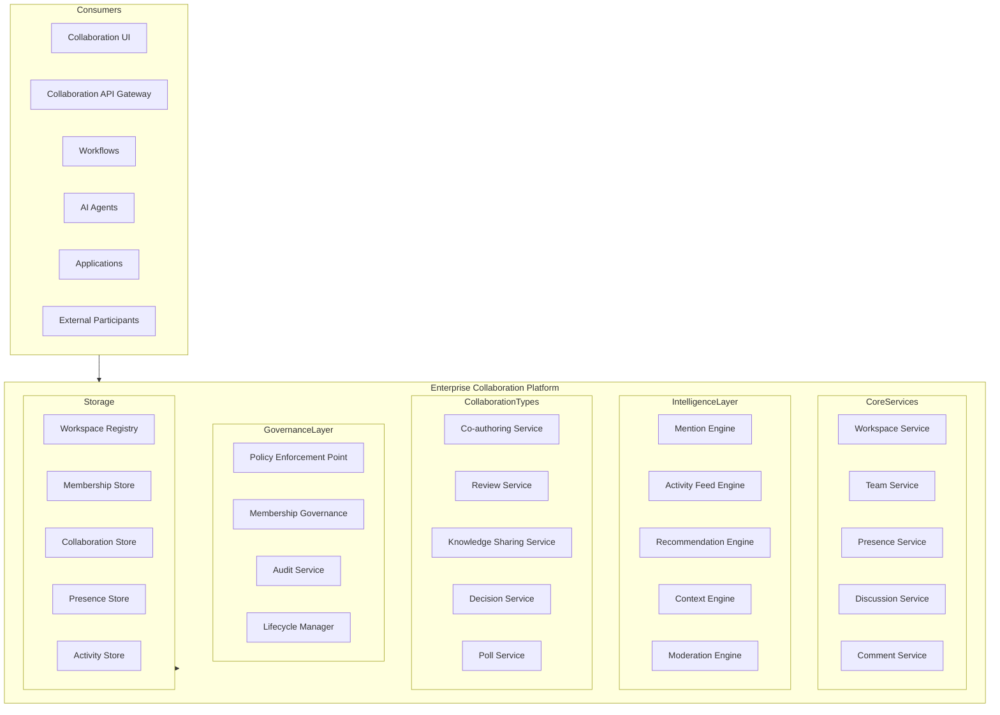
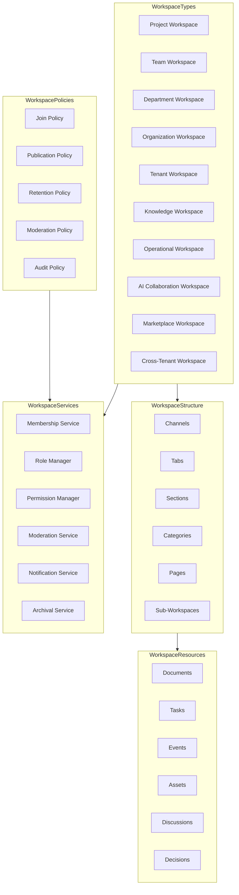
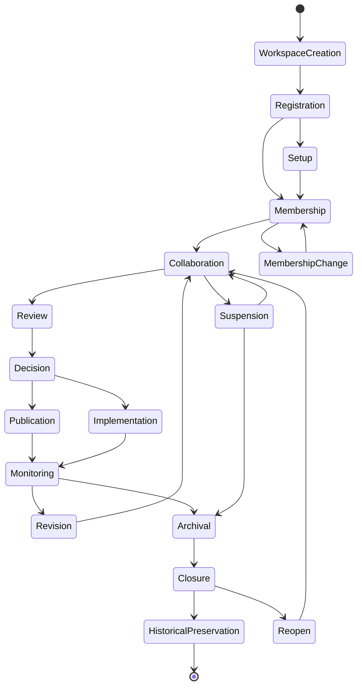
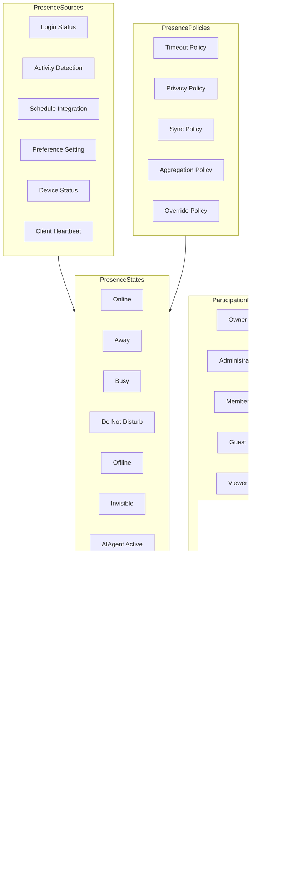
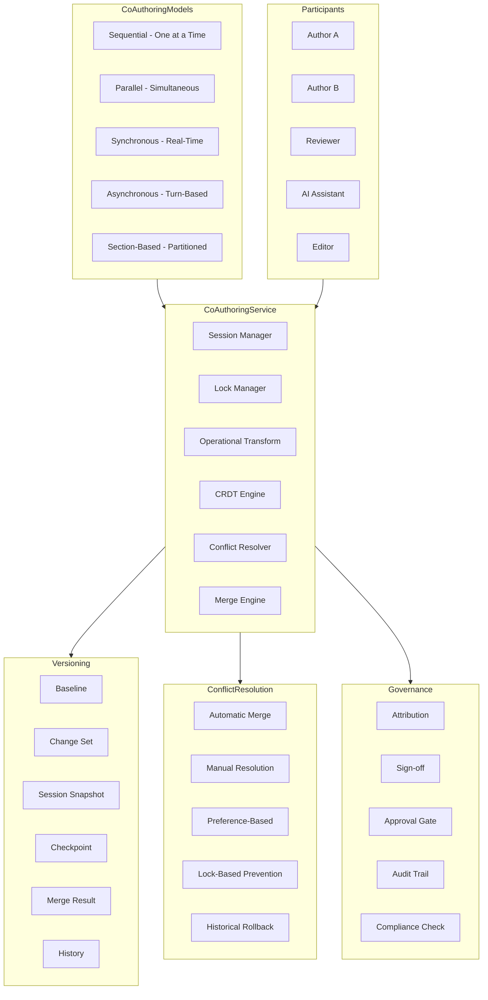
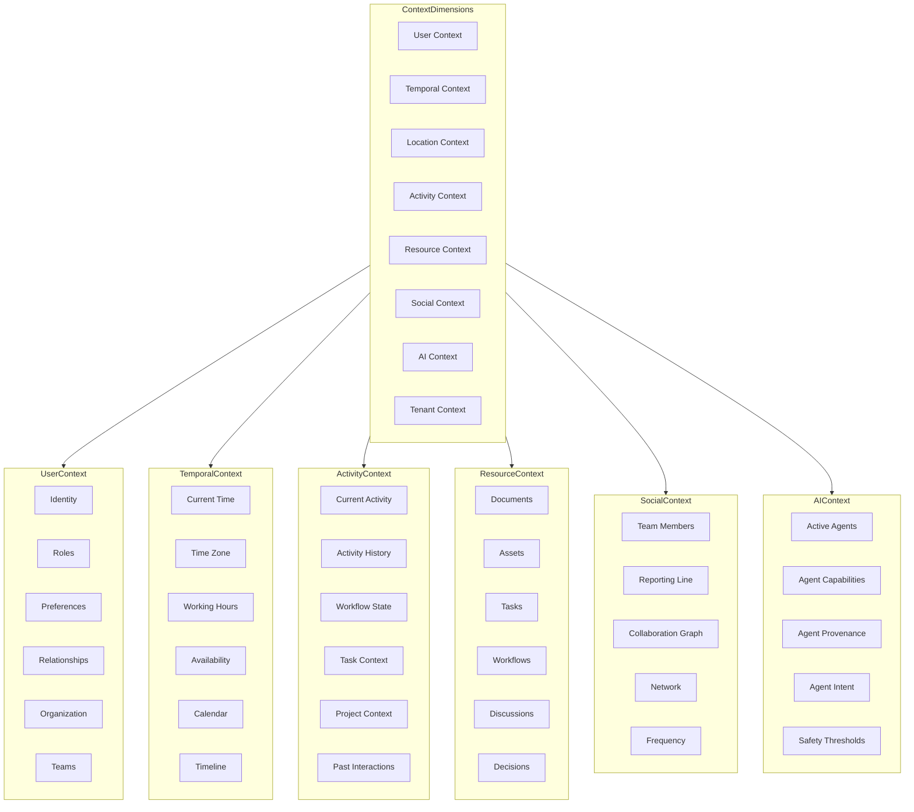
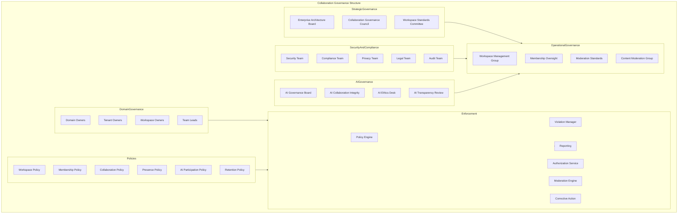
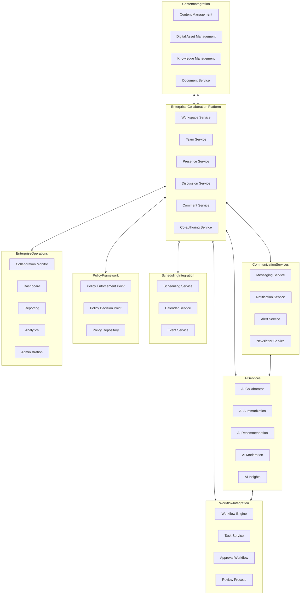

# KB-135 — Enterprise Collaboration Architecture

---

## Metadata

- **Document ID:** KB-135
- **Title:** Enterprise Collaboration Architecture
- **Suite:** Enterprise Platform Services
- **Version:** 1.0
- **Status:** Approved Architecture
- **Classification:** Enterprise Collaboration Services Architecture
- **Date:** 2026-07-12

---

## Executive Summary

The Enterprise Collaboration Platform provides centralized capabilities enabling people, teams, organizations, AI agents, and enterprise services to collaborate consistently across the DUKADESK ecosystem while maintaining governance, accountability, security, privacy, and operational transparency.

Collaboration functions as a reusable enterprise capability independent of applications, communication technologies, or collaboration tools. All workspace management, team coordination, discussions, reviews, co-authoring, presence, knowledge sharing, and collaborative decision-making are governed by this canonical architecture.

---

## Purpose

Define how DUKADESK standardizes collaboration across the enterprise while enabling secure teamwork, coordinated decision-making, knowledge sharing, and AI-assisted collaboration.

---

## Scope

### In Scope

- Enterprise collaboration architecture
- Collaboration taxonomy
- Workspace architecture
- Team architecture
- Shared workspace governance
- Presence architecture
- Comments architecture
- Discussions architecture
- Mentions architecture
- Reviews architecture
- Co-authoring architecture
- Collaboration lifecycle
- Collaboration governance
- AI-assisted collaboration
- Knowledge sharing
- Collaboration analytics
- Collaboration observability
- Enterprise coordination

### Out of Scope

- Messaging implementation
- Notification implementation
- Video conferencing implementation
- Document editing implementation
- Calendar implementation
- User interface implementation

These are addressed by dedicated Knowledge Base documents, including KB-127 (Notification & Communication Architecture), KB-131 (Enterprise Scheduling & Calendar Architecture), and KB-140 (Enterprise Platform Services Reference Architecture).

---

## Architectural Principles

| # | Principle | Description |
|---|-----------|-------------|
| 1 | Collaboration as an Enterprise Capability | Collaboration is a centralized enterprise service, not an application feature |
| 2 | Shared Knowledge | Collaboration outputs are enterprise knowledge assets by default |
| 3 | Governance by Design | All collaboration spaces have governed ownership, membership, and lifecycle |
| 4 | Human-AI Collaboration | AI agents participate as first-class collaboration entities |
| 5 | Accountability | Every collaboration action is attributed to an accountable entity |
| 6 | Transparency | Collaboration history is visible, auditable, and traceable |
| 7 | Secure Collaboration | Collaboration boundaries enforce authorization at every layer |
| 8 | Privacy by Design | Sensitive collaboration is protected through classification and policy |
| 9 | Vendor Independence | No dependency on specific collaboration tool implementations |
| 10 | Technology Neutrality | The architecture supports any technology stack without bias |
| 11 | Multi-Tenant Isolation | Collaboration data and operations are fully isolated by tenant |
| 12 | Lifecycle Governance | Every workspace and collaboration follows a governed lifecycle |
| 13 | Observability by Default | All collaboration operations emit metrics, events, and audit trails |

---

## Canonical Definitions

| Term | Definition |
|------|-----------|
| Collaboration | Coordinated activity between participants toward a shared outcome |
| Workspace | A governed container for collaboration activities, resources, and participants |
| Team | A defined group of participants organized for collaborative work |
| Participant | Any entity engaging in collaboration, including humans, AI agents, and services |
| Presence | Real-time availability status of a participant for collaboration |
| Comment | A structured annotation on a collaboration resource |
| Discussion | A threaded conversation within a collaboration context |
| Mention | A directed reference to a participant within collaboration content |
| Review | A structured evaluation activity with defined participants and outcomes |
| Co-authoring | Simultaneous or sequential collaborative creation of a shared artifact |
| Collaboration Session | A bounded period of collaborative activity |
| Shared Resource | Any enterprise asset accessible within a collaboration context |
| Collaboration Context | The environmental state linking participants, resources, and activities |
| Collaboration Lifecycle | The governed state progression of a workspace or collaboration activity |
| Collaboration Policy | A rule governing collaboration behavior, access, or governance |
| Collaboration Governance | The policies, roles, and processes governing enterprise collaboration |
| Knowledge Sharing | The deliberate distribution of knowledge within a collaboration context |
| Activity Feed | A chronological stream of collaboration events |
| Collaboration Audit | An immutable record of all collaboration actions |
| Enterprise Workspace | A workspace governed at the enterprise level |

---

## Workspace Registry

The Workspace Registry is the canonical inventory of all enterprise collaboration workspaces. Every workspace within DUKADESK must be registered in the Workspace Registry.

### Workspace Registry Structure

| Component | Description |
|-----------|-------------|
| Workspace Definition | Name, type, description, purpose, and collaboration domain |
| Classification | Collaboration taxonomy category and governance classification |
| Ownership | Workspace owner, steward, business domain, and tenant association |
| Membership | Participant list, roles, access levels, and membership lifecycle |
| Lifecycle State | Current lifecycle position with timestamp and audit trail |
| Policy Bindings | Associated collaboration policies, constraints, and rules |
| Resources | Linked enterprise assets, documents, workflows, and tasks |
| Activity History | Recent collaboration events and participation metrics |

---

## Enterprise Collaboration Platform Architecture

---

## Collaboration Taxonomy

```mermaid
graph TB
    CT[Collaboration Taxonomy] --> PER[Personal Collaboration]
    CT --> TEM[Team Collaboration]
    CT --> ORG[Organization Collaboration]
    CT --> TEN[Tenant Collaboration]
    CT --> XTN[Cross-Tenant Collaboration]
    CT --> AI[AI-Assisted Collaboration]
    CT --> OPS[Operational Collaboration]
    CT --> ADM[Administrative Collaboration]
    CT --> MKT[Marketplace Collaboration]
    CT --> BLD[Builder Studio Collaboration]
    CT --> WKF[Workflow Collaboration]
    CT --> PRJ[Project Collaboration]
    CT --> KNW[Knowledge Collaboration]
    CT --> FTR[Future Collaboration Domains]

    PER --> NTS[Personal Notes]
    PER --> FLW[Follow-ups]
    PER --> BKM[Bookmarks]

    TEM --> TMT[Team Meetings]
    TEM --> TMD[Team Discussions]
    TEM --> TMR[Team Reviews]
    TEM --> TMB[Team Brainstorming]

    ORG --> OGA[Organization Announcements]
    ORG --> OGR[Organization Reviews]
    ORG --> OGK[Organization Knowledge]

    XTN --> PCP[Partner Collaboration]
    XTN --> VDR[Vendor Collaboration]
    XTN --> CST[Customer Collaboration]

    AI --> AIA[AI Agent Collaboration]
    AI --> AIH[Human-AI Collaboration]
    AI --> AIM[AI-Mediated Collaboration]

    WKF --> WKA[Workflow Approvals]
    WKF --> WKD[Workflow Discussions]
    WKF --> WKR[Workflow Reviews]

    KNW --> KNB[Knowledge Base Collaboration]
    KNW --> KND[Document Collaboration]
    KNW --> KNR[Research Collaboration]
```

---

## Workspace Architecture

---

## Collaboration Lifecycle

---

## Presence & Participation Model

---

## Co-authoring Architecture

---

## Collaboration Context Model

---

## Collaboration Governance Structure

---

## Enterprise Collaboration Operating Model

---

## Enterprise Collaboration Ecosystem

```mermaid
graph TB
    subgraph CollaborationEcosystem[Enterprise Collaboration Ecosystem]

        subgraph CollaborationSources
            USR[Users]
            TMS[Teams]
            ORG[Organizations]
            AI[AI Agents]
            APP[Applications]
            WKF[Workflows]
            TEN[Tenants]
            PRT[External Partners]
        end

        subgraph CollaborationPlatform
            WKS[Workspace Service]
            TMS2[Team Service]
            PRS[Presence Service]
            DCS[Discussion Service]
            CMT[Comment Service]
            COA[Co-authoring Service]
            RVW[Review Service]
            ACT[Activity Engine]
        end

        subgraph CollaborationContexts
            PRJ[Projects]
            TSK[Tasks]
            DOC[Documents]
            AST[Assets]
            WKF2[Workflows]
            DEC[Decisions]
            KNW[Knowledge]
            EVT[Events]
        end

        subgraph Participants
            HUM[Human Participants]
            AI2[AI Agents]
            SYS[System Services]
            GRP[Groups]
            EXT[External Participants]
        end

        subgraph Governance
            PLY[Policy Engine]
            AUD[Audit Service]
            SEC[Security Service]
            TNI[Tenant Isolation]
            CMP[Compliance Engine]
            MOD[Moderation Service]
        end

        subgraph Observability
            MET[Metrics]
            TRC[Traces]
            LOG[Logs]
            EVT2[Events]
            DSH[Dashboards]
            ALR[Alerts]
            RPT[Reports]
            ANL[Analytics]
        end
    end

    CollaborationSources --> CollaborationPlatform
    CollaborationPlatform --> CollaborationContexts
    CollaborationContexts --> Participants
    Governance -.-> CollaborationPlatform
    Governance -.-> CollaborationContexts
    Governance -.-> CollaborationSources
    Observability -.-> CollaborationPlatform
    Observability -.-> CollaborationContexts
    Observability -.-> Participants
```

---

## Governance

| Domain | Governance Focus |
|--------|-----------------|
| Workspace Ownership | Every workspace has a designated owner accountable for its lifecycle and governance |
| Team Governance | Teams have defined structures, membership criteria, and governance policies |
| Membership Governance | Membership changes follow defined processes with audit trail |
| Collaboration Governance | Collaboration activities are governed by enterprise policies and standards |
| Security Governance | Collaboration access and operations are governed by the Authorization Architecture |
| Privacy Governance | Collaboration privacy is enforced through classification, access control, and policy |
| AI Governance | AI participants follow AI governance board oversight and ethical guidelines |
| Compliance Governance | Collaboration complies with regulatory requirements and audit mandates |
| Lifecycle Governance | All workspaces follow the governed lifecycle; state transitions require authorization |
| Enterprise Governance | The Enterprise Architecture board governs collaboration platform evolution and standards |

### Governance Enforcement Points

| Enforcement Point | Mechanism |
|-------------------|-----------|
| Workspace Creation | Classification, ownership, and policy validation before creation |
| Membership Addition | Authorization check, capacity validation, policy enforcement |
| Collaboration Activity | Policy enforcement at activity creation; real-time moderation |
| AI Participation | AI identity verification, capability scope, safety threshold check |
| Content Publication | Approval gate, moderation check, compliance verification |
| Workspace Archival | Data retention verification, knowledge preservation, owner authorization |

---

## Responsibilities

| Role | Responsibilities |
|------|-----------------|
| Enterprise Architecture | Defines collaboration architecture, standards, and governance; approves platform evolution |
| Collaboration Services Team | Manages collaboration taxonomy, workspace standards, and moderation policies |
| Platform Engineering | Develops, operates, and maintains the Enterprise Collaboration Platform |
| Product Teams | Integrates with the collaboration platform; does not implement independent collaboration |
| Security | Defines collaboration authorization model; audits collaboration access; enforces least privilege |
| Compliance | Defines collaboration compliance requirements; audits collaboration activities; ensures regulatory adherence |
| AI Governance Board | Governs AI participant capabilities; approves AI collaboration boundaries |
| Business Owners | Define collaboration policies for their domains; approve workspace registrations |
| Tenant Administrators | Manage tenant-specific workspaces, teams, and collaboration policies |
| Workspace Owners | Manage specific workspaces, membership, content, and lifecycle |
| End Users | Participate in collaboration within policy boundaries |

---

## Security

| Security Control | Description |
|------------------|-------------|
| Collaboration Authorization | Read, write, participate, moderate, and administer permissions per workspace |
| Workspace Authorization | Workspace-level permissions with inheritance and override |
| Tenant Isolation | Collaboration data fully isolated by tenant boundary |
| Least Privilege | Participants have minimum permissions required for their role |
| Zero Trust | All collaboration API calls authenticated and authorized regardless of network origin |
| Secure Participation | Collaboration channels use authenticated connections with encrypted payloads |
| Auditability | All collaboration actions recorded in immutable audit log |
| Provenance | Full provenance tracking from collaboration creation through archival |
| Policy Enforcement | Authorization policies enforced at API gateway and service mesh layers |
| Secure Collaboration Boundaries | Cross-tenant collaboration requires explicit authorization with isolation guarantees |

### Security Zones

| Zone | Description |
|------|-------------|
| Public | Public workspaces accessible without authentication |
| Authenticated | Workspaces requiring user authentication |
| Internal | Internal enterprise workspaces requiring authorized access |
| Confidential | Sensitive collaboration with classification-based restrictions |
| Restricted | Highly sensitive collaboration requiring explicit approval |
| AI | AI participant workspaces with additional safety controls |

---

## Privacy

| Privacy Control | Description |
|----------------|-------------|
| Sensitive Collaboration | Collaboration containing sensitive information is classified and restricted |
| Personal Information Protection | Personally identifiable information in collaboration content is masked or protected |
| Consent Governance | Collaboration processing of personal data requires explicit consent |
| Data Minimization | Only required collaboration data is collected, stored, and processed |
| Regional Compliance | Collaboration data handling complies with GDPR, CCPA, and regional privacy regulations |
| Cross-Border Governance | Collaboration data is stored and processed in accordance with data residency requirements |
| Retention Policies | Collaboration data is retained only for the duration required by policy |
| Privacy Assurance | Regular privacy reviews and impact assessments for collaboration capabilities |

### Data Classification

| Classification | Examples | Access Restrictions |
|---------------|----------|-------------------|
| Public | Open workspaces, public announcements | No authentication required |
| Internal | Team discussions, project workspaces | Authenticated users within tenant |
| Confidential | Strategic planning, product decisions | Authorized users only |
| Restricted | Legal discussions, personal matters | Explicit approval required |
| Regulated | Compliance reviews, audit evidence | Audited access with strict controls |

---

## Performance

| Consideration | Requirement |
|---------------|-------------|
| Enterprise-Scale Collaboration | Support for thousands of concurrent workspaces across all tenants |
| High-Volume Collaboration Sessions | Thousands of simultaneous collaboration sessions globally |
| Real-Time Coordination | Presence updates and activity feeds delivered within sub-second latency |
| Elastic Scalability | Horizontal scaling of collaboration services based on demand |
| High Availability | 99.99% uptime for core collaboration services |
| Operational Resilience | Graceful degradation under load with circuit breakers |
| Multi-Region Readiness | Active-active collaboration serving across paired regions |
| Efficient Collaboration Synchronization | State synchronization completes within latency targets |

### Performance Optimization

| Optimization | Description |
|--------------|-------------|
| Presence Caching | Participant presence cached with heartbeat-based invalidation |
| Activity Feed Pagination | Efficient cursor-based pagination for activity feeds |
| Optimistic Updates | Local state updates with server reconciliation |
| Connection Pooling | Reusable connections for collaboration store operations |
| Read Replicas | Read-only replicas for workspace browsing and analytics |
| WebSocket Multiplexing | Single connection for multiple collaboration channels |

---

## Observability

| Observable Dimension | Metrics | Purpose |
|---------------------|---------|---------|
| Collaboration Analytics | Workspace count, active participants, collaboration sessions | Tracking enterprise collaboration adoption |
| Workspace Health | Workspace availability, participation rates, activity levels | Detecting workspace stagnation or issues |
| Participation Metrics | Active users, AI participants, cross-team collaboration | Understanding collaboration patterns |
| Knowledge Sharing Analytics | Shared resources, knowledge contributions, reuse rates | Measuring knowledge sharing effectiveness |
| Governance Dashboards | Policy violations, moderation actions, membership compliance | Monitoring collaboration governance |
| SLA Monitoring | Collaboration service latency, availability, error rates | Ensuring service level compliance |
| Operational Reporting | Daily workspace activity, member growth, top collaborators | Operational collaboration management |
| Executive Reporting | Cross-domain collaboration trends, productivity indicators | Strategic collaboration intelligence |
| Collaboration Insights | Collaboration networks, bottleneck detection, optimization opportunities | Identifying collaboration improvements |
| Enterprise Productivity Metrics | Time in collaboration, decision velocity, outcome achievement | Measuring collaboration effectiveness |

### Observability Events

| Event Type | Trigger | Consumer |
|------------|---------|----------|
| WorkspaceCreated | New workspace registered | Activity feed, notification service |
| ParticipantJoined | User or AI joined workspace | Presence service, activity feed |
| CollaborationStarted | Collaboration session initiated | Activity feed, analytics service |
| CommentAdded | New comment on resource | Notification service, activity feed |
| DecisionMade | Collaboration decision recorded | Activity feed, knowledge service |
| AIParticipated | AI agent contributed to collaboration | AI governance, audit service |
| PolicyViolation | Collaboration violated policy | Governance dashboard, moderation service |
| WorkspaceArchived | Workspace moved to archival | Registry service, retention service |

---

## Failure Scenarios

| # | Scenario | Architectural Response |
|---|----------|----------------------|
| 1 | Workspace Conflicts | Workspace creation validation prevents name and scope conflicts |
| 2 | Unauthorized Collaboration | Authorization enforced at workspace and activity layers; violation logged |
| 3 | Membership Inconsistencies | Membership reconciliation service with periodic sync; audit on discrepancy |
| 4 | Collaboration Deadlocks | Deadlock detection with timeout; escalation to workspace owner |
| 5 | AI Participation Failures | AI agent health check before participation; fallback to human-only mode |
| 6 | Cross-Tenant Collaboration Violations | Tenant isolation boundary with explicit cross-tenant authorization |
| 7 | Governance Failures | Policy enforcement point blocks violating operation; violation recorded with audit |
| 8 | Synchronization Failures | State reconciliation with conflict resolution; retry with exponential backoff |
| 9 | Presence Inconsistencies | Heartbeat monitoring with timeout-based state correction |
| 10 | Recovery Failures | Journal-based recovery with replay capability; consistency verification after recovery |
| 11 | Collaboration Fragmentation | Knowledge graph periodic reconciliation; orphan workspace detection |
| 12 | Knowledge Silos | Cross-workspace knowledge discovery; recommendation engine for related workspaces |

---

## Anti-Patterns

| # | Anti-Pattern | Description | Prohibited Because |
|---|-------------|-------------|-------------------|
| 1 | Application-Owned Collaboration Systems | Applications implement their own collaboration features | Bypasses centralized governance, security, and knowledge sharing |
| 2 | Private Enterprise Knowledge Silos | Knowledge captured in private workspaces without enterprise visibility | Prevents enterprise knowledge reuse, creates information asymmetry |
| 3 | Hardcoded Collaboration Groups | Team structures embedded in application code | Prevents dynamic team formation, membership governance, and scalability |
| 4 | Duplicate Collaboration Platforms | Multiple independent collaboration tools across the enterprise | Fragments collaboration, creates reconciliation burden, reduces productivity |
| 5 | Collaboration Without Governance | Workspaces created without ownership, policies, or lifecycle | Creates ungoverned spaces, security risks, compliance gaps |
| 6 | Hidden Workspaces | Workspaces not registered in the Workspace Registry | Prevents discovery, governance, and enterprise collaboration visibility |
| 7 | Unregistered Collaboration Spaces | Collaboration occurring outside enterprise platform | Bypasses governance, security, audit, and knowledge capture |
| 8 | AI Collaboration Without Oversight | AI agents participating without governance controls | Creates accountability gaps, ethical risks, transparency issues |
| 9 | Direct Application Collaboration Logic | Collaboration logic embedded directly in application code | Prevents reuse, governance, and enterprise-wide collaboration intelligence |
| 10 | Collaboration Outside Enterprise Policies | Collaboration activities bypassing enterprise policy enforcement | Creates compliance violations, security risks, governance gaps |

---

## Future Evolution

| # | Evolution Path | Description |
|---|---------------|-------------|
| 1 | Autonomous AI Collaboration | AI agents that autonomously initiate, participate in, and drive collaboration |
| 2 | Semantic Enterprise Collaboration | ML-driven collaboration context understanding and intelligent resource surfacing |
| 3 | Intelligent Workspace Optimization | Workspaces that self-organize based on participant behavior and goals |
| 4 | Federated Collaboration Ecosystems | Cross-enterprise collaboration spanning DUKADESK and partner ecosystems |
| 5 | Cross-Platform Collaboration Federation | Federated collaboration across different platforms and tools |
| 6 | Adaptive Team Formation | AI-assisted team formation based on skills, availability, and collaboration history |
| 7 | Enterprise Collaboration Intelligence | AI-driven insights into collaboration effectiveness, bottlenecks, and optimization |
| 8 | Digital Workforce Collaboration | Seamless collaboration between human and AI workforce members |

---

## Cross References

| Document ID | Title | Relationship |
|-------------|-------|-------------|
| KB-107 | Enterprise Platform Services Overview Architecture | Foundational reference for platform services architecture |
| KB-113 | Workflow Orchestration Architecture | Defines workflow integration with collaboration activities |
| KB-116 | AI Platform Architecture | Defines AI collaboration capabilities and agent participation |
| KB-117 | AI Agent Framework Architecture | Defines AI agent identity, capabilities, and collaboration roles |
| KB-120 | AI Context & Memory Architecture | Defines AI context sharing within collaboration sessions |
| KB-123 | Enterprise Policy Framework Architecture | Foundational reference for policy-driven collaboration governance |
| KB-124 | Policy Management Architecture | Defines policy enforcement for collaboration operations |
| KB-127 | Notification & Communication Architecture | Defines notification integration for collaboration events |
| KB-132 | Enterprise Workflow Task Management Architecture | Defines task assignment and tracking within collaboration |
| KB-133 | Enterprise Document & Content Management Architecture | Defines content collaboration and shared resources |
| KB-140 | Enterprise Platform Services Reference Architecture | Comprehensive reference for all platform services |

---

## Critical DUKADESK Architectural Rule

**All collaboration within DUKADESK shall be orchestrated exclusively through the centralized Enterprise Collaboration Platform. No application, service, workflow, AI capability, integration, tenant, Builder Studio component, Marketplace module, or runtime service shall implement independent collaboration mechanisms outside the canonical enterprise architecture, ensuring consistent governance, security, privacy, accountability, interoperability, knowledge sharing, and enterprise-wide collaborative intelligence.**
