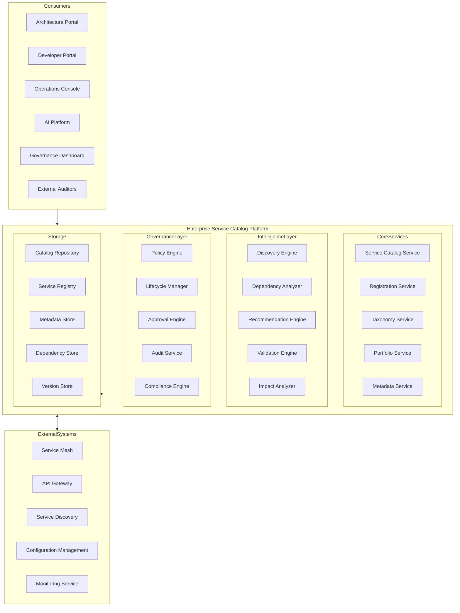
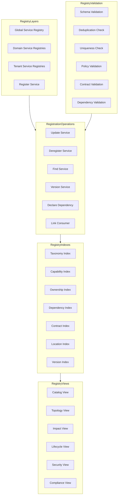
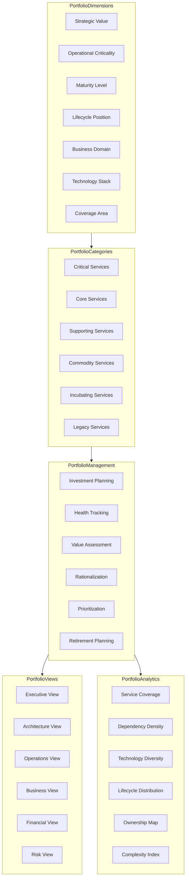
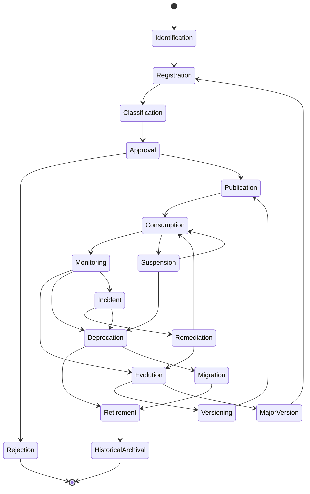
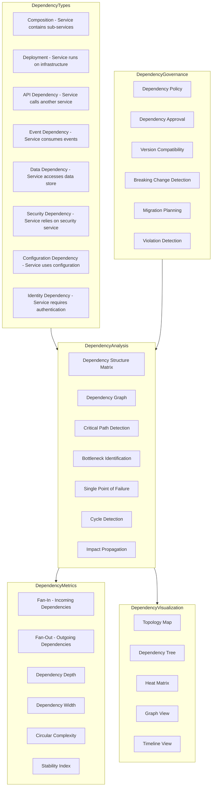
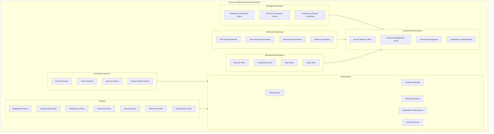
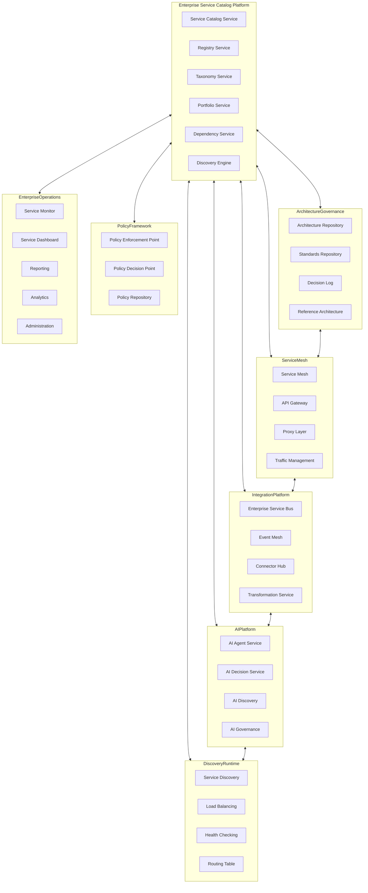
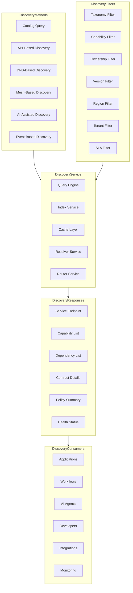

# KB-138 — Enterprise Service Catalog Architecture

---

## Metadata

- **Document ID:** KB-138
- **Title:** Enterprise Service Catalog Architecture
- **Suite:** Enterprise Platform Services
- **Version:** 1.0
- **Status:** Approved Architecture
- **Classification:** Enterprise Service Governance Architecture
- **Date:** 2026-07-12

---

## Executive Summary

The Enterprise Service Catalog Platform provides the authoritative inventory of every enterprise service across the DUKADESK ecosystem, enabling standardized discovery, governance, ownership, lifecycle management, dependency visibility, policy enforcement, observability, and controlled service evolution.

The catalog functions as the single source of truth for enterprise service definitions, capabilities, contracts, relationships, and governance across the entire platform. All enterprise services must be registered, classified, and governed through this canonical architecture.

---

## Purpose

Define how DUKADESK consistently governs enterprise services through a centralized service catalog supporting architecture governance, operational visibility, AI reasoning, reuse, interoperability, and enterprise scalability.

---

## Scope

### In Scope

- Enterprise service catalog architecture
- Service registry
- Service taxonomy
- Service portfolio
- Service ownership
- Service metadata
- Service lifecycle
- Service dependencies
- Service capabilities
- Service contracts
- Service classifications
- Service discoverability
- Service governance
- Service observability
- Service analytics
- Service retirement

### Out of Scope

- Service implementation
- API implementation
- Service mesh implementation
- Runtime implementation
- Infrastructure implementation
- Monitoring implementation

These are addressed by dedicated Knowledge Base documents, including KB-094 (Integration Platform Architecture), KB-096 (API Gateway Architecture), KB-100 (Service Discovery Architecture), and KB-140 (Enterprise Platform Services Reference Architecture).

---

## Architectural Principles

| # | Principle | Description |
|---|-----------|-------------|
| 1 | Service-First Architecture | Every enterprise capability is modeled as a governed service |
| 2 | Catalog as the Source of Truth | The service catalog is the authoritative reference for all service definitions |
| 3 | Metadata-Driven Governance | Service behavior is governed by catalog metadata, not implementation |
| 4 | Discoverability by Design | All registered services are discoverable through the catalog |
| 5 | Ownership Accountability | Every service has a designated owner accountable for its lifecycle |
| 6 | Lifecycle Governance | Every service follows a governed lifecycle from identification to retirement |
| 7 | Policy-Driven Management | Service governance is enforced through catalog policies |
| 8 | Vendor Independence | No dependency on specific service catalog implementations |
| 9 | Technology Neutrality | The architecture supports any technology stack without bias |
| 10 | Multi-Tenant Awareness | The catalog supports tenant-scoped and enterprise-wide services |
| 11 | AI Readiness | Catalog metadata supports AI reasoning and autonomous service discovery |
| 12 | Observability by Default | All catalog operations emit metrics, events, and audit trails |

---

## Canonical Definitions

| Term | Definition |
|------|-----------|
| Service | A governed enterprise capability with defined interfaces, policies, and lifecycle |
| Service Catalog | The authoritative inventory of all enterprise services and their metadata |
| Service Registry | The operational store of registered service instances and endpoints |
| Service Portfolio | A strategic grouping of services organized by business alignment and value |
| Service Definition | The canonical specification of a service's capabilities, contracts, and governance |
| Service Capability | A distinct function or feature provided by a service |
| Service Contract | The agreed interface, behavior, and quality commitments of a service |
| Service Consumer | An entity that consumes capabilities from a registered service |
| Service Provider | The entity that implements and operates a registered service |
| Service Dependency | A relationship where one service relies on another for its operation |
| Service Metadata | Structured data describing service properties, governance, and relationships |
| Service Classification | The assignment of a service to a category within the enterprise taxonomy |
| Service Lifecycle | The governed state progression of a service from identification to retirement |
| Service Owner | The entity accountable for a service's lifecycle, governance, and evolution |
| Service Policy | A rule governing service registration, consumption, evolution, or retirement |
| Service Governance | The policies, roles, and processes governing enterprise service management |
| Shared Service | A service designed for consumption by multiple domains or tenants |
| Platform Service | A foundational service providing platform-level capabilities |
| Business Service | A service aligned to a specific business domain or capability |
| Enterprise Service | Any service registered in the enterprise service catalog |

---

## Service Registry

The Service Registry is the canonical inventory of all enterprise services. Every service within DUKADESK must be registered in the Service Registry.

### Service Registry Structure

| Component | Description |
|-----------|-------------|
| Service Definition | Name, identifier, type, domain, description, and purpose |
| Classification | Taxonomy category, service type, and governance classification |
| Metadata | Descriptive, technical, administrative, governance, and operational metadata |
| Ownership | Service owner, steward, business domain, and tenant association |
| Lifecycle State | Current lifecycle position with timestamp and audit trail |
| Capabilities | List of service capabilities with descriptions and versioning |
| Contracts | Service contracts, APIs, events, and interface specifications |
| Dependencies | Dependent services, resources, and infrastructure |
| Consumers | Registered consumers with consumption terms and policies |
| Versions | Version history with semantic versioning and changelog |

---

## Enterprise Service Catalog Architecture

---

## Service Taxonomy

```mermaid
graph TB
    ST[Service Taxonomy] --> PLT[Platform Services]
    ST --> BIZ[Business Services]
    ST --> SHR[Shared Services]
    ST --> AI[AI Services]
    ST --> INT[Integration Services]
    ST --> DAT[Data Services]
    ST --> RNT[Runtime Services]
    ST --> BLD[Builder Studio Services]
    ST --> MKT[Marketplace Services]
    ST --> INF[Infrastructure Services]
    ST --> SEC[Security Services]
    ST --> OPS[Operational Services]
    ST --> TEN[Tenant Services]
    ST --> FTR[Future Service Domains]

    PLT --> IDP[Identity Platform]
    PLT --> PLY[Policy Platform]
    PLT --> AUD[Audit Platform]
    PLT --> CFG[Configuration Service]

    BIZ --> ORG[Organization Service]
    BIZ --> BIL[Billing Service]
    BIZ --> SUB[Subscription Service]

    SHR --> NTF[Notification Service]
    SHR --> SCH[Scheduling Service]
    SHR --> WKF[Workflow Service]

    AI --> AI_INF[AI Inference Service]
    AI --> AI_TRN[AI Training Service]
    AI --> AI_AGNT[AI Agent Service]

    INT --> API[API Gateway Service]
    INT --> EVT[Event Bus Service]
    INT --> TRN[Transformation Service]

    DAT --> DTL[Data Lake Service]
    DAT --> DW[Data Warehouse Service]
    DAT --> STM[Streaming Service]

    SEC --> ATH[Authentication Service]
    SEC --> AUTH[Authorization Service]
    SEC --> ENC[Encryption Service]
```

---

## Service Registry Architecture

---

## Service Portfolio Architecture

---

## Service Lifecycle

---

## Service Dependency Model

---

## Service Governance Structure

---

## Enterprise Service Operating Model

---

## Service Discovery Architecture

---

## Enterprise Service Ecosystem

```mermaid
graph TB
    subgraph ServiceEcosystem[Enterprise Service Ecosystem]

        subgraph ServiceSources
            PLT[Platform Team]
            BIZ[Business Domains]
            AI[AI Capabilities]
            INT[Integrations]
            PRT[Partners]
            TEN[Tenants]
            OPS[Operations]
            MKT[Marketplace]
        end

        subgraph CatalogPlatform
            SVC[Service Catalog]
            REG[Registry Service]
            TAX[Taxonomy Service]
            POR[Portfolio Service]
            DEP[Dependency Service]
            DISC[Discovery Engine]
            MET[Metadata Service]
        end

        subgraph ServiceTypes
            PLT2[Platform Services]
            BIZ2[Business Services]
            SHR2[Shared Services]
            AI2[AI Services]
            INT2[Integration Services]
            DAT2[Data Services]
            RNT2[Runtime Services]
            SEC2[Security Services]
            OPS2[Operational Services]
        end

        subgraph Consumers
            APP2[Applications]
            WKF2[Workflows]
            AI3[AI Agents]
            DEV2[Developers]
            BLD2[Builder Studio]
            EXT2[External Systems]
        end

        subgraph Governance
            PLY[Policy Engine]
            AUD[Audit Service]
            ARC2[Architecture Governance]
            CMP[Compliance Engine]
            TNI[Tenant Isolation]
        end

        subgraph Observability
            MET[Metrics]
            TRC[Traces]
            LOG[Logs]
            EVT[Events]
            DSH[Dashboards]
            ALR[Alerts]
            RPT[Reports]
            ANL[Analytics]
        end
    end

    ServiceSources --> CatalogPlatform
    CatalogPlatform --> ServiceTypes
    ServiceTypes --> Consumers
    Governance -.-> CatalogPlatform
    Governance -.-> ServiceTypes
    Governance -.-> ServiceSources
    Observability -.-> CatalogPlatform
    Observability -.-> ServiceTypes
    Observability -.-> Consumers
```

---

## Governance

| Domain | Governance Focus |
|--------|-----------------|
| Service Ownership | Every service has a designated owner accountable for its lifecycle and evolution |
| Portfolio Governance | Service portfolios are reviewed, rationalized, and governed for strategic alignment |
| Metadata Governance | Service metadata schemas are defined, versioned, and enforced enterprise-wide |
| Lifecycle Governance | All services follow the governed lifecycle; state transitions require authorization |
| Security Governance | Service catalog access and operations are governed by the Authorization Architecture |
| Compliance Governance | Service registration and evolution comply with regulatory and audit mandates |
| AI Governance | AI services follow AI governance board oversight for registration and cataloging |
| Policy Governance | Service catalog policies are defined, enforced, and audited |
| Architecture Governance | Service architecture compliance is enforced through catalog policies and review gates |
| Enterprise Governance | The Enterprise Architecture board governs service catalog platform evolution and standards |

### Governance Enforcement Points

| Enforcement Point | Mechanism |
|-------------------|-----------|
| Service Registration | Schema validation, deduplication check, classification enforcement, ownership verification |
| Service Publication | Policy verification, dependency validation, contract completeness check |
| Service Versioning | Semantic versioning enforcement, backward compatibility validation |
| Service Consumption | Consumer registration, policy acceptance, usage tracking |
| Service Evolution | Impact analysis, approval workflow, architectural review |
| Service Retirement | Migration plan validation, consumer notification, archival verification |

---

## Responsibilities

| Role | Responsibilities |
|------|-----------------|
| Enterprise Architecture | Defines service catalog architecture, standards, and governance; approves platform evolution |
| Platform Engineering | Develops, operates, and maintains the Enterprise Service Catalog Platform |
| Service Owners | Define service metadata, capabilities, contracts, and lifecycle; maintain service registry entries |
| Product Teams | Register services in the catalog; consume registered services; comply with catalog policies |
| Security | Defines service catalog authorization model; audits catalog access; enforces least privilege |
| Compliance | Defines service compliance requirements; audits service registrations; ensures regulatory adherence |
| AI Governance Board | Governs AI service registration; approves AI service metadata and transparency standards |
| Operations | Monitors service health, dependency integrity, and catalog consistency |
| Tenant Administrators | Manage tenant-specific service registrations and consumption policies |
| Executive Governance | Reviews service portfolio strategy, investment decisions, and retirement planning |

---

## Security

| Security Control | Description |
|------------------|-------------|
| Service Authorization | Read, register, update, deprecate, retire, and administer permissions per service |
| Catalog Protection | Service catalog access requires authentication and authorization |
| Tenant Isolation | Service registrations are isolated by tenant boundary with cross-tenant visibility controls |
| Least Privilege | Users have minimum permissions required for their service role |
| Zero Trust | All catalog API calls authenticated and authorized regardless of network origin |
| Secure Discovery | Service discovery returns only authorized services based on consumer identity |
| Auditability | All catalog operations recorded in immutable audit log |
| Provenance | Full provenance tracking for service registration, evolution, and retirement |
| Policy Enforcement | Authorization policies enforced at API gateway and catalog service layers |
| Dependency Integrity | Service dependency changes require verification and authorization |

### Security Zones

| Zone | Description |
|------|-------------|
| Public | Public service metadata accessible without authentication |
| Authenticated | Service catalog browsing requiring user authentication |
| Internal | Internal service details requiring authorized access |
| Confidential | Sensitive service metadata with classification-based restrictions |
| Restricted | Regulated service information requiring explicit approval |
| Admin | Catalog administration operations requiring elevated privileges |

---

## Privacy

| Privacy Control | Description |
|----------------|-------------|
| Sensitive Service Metadata | Service metadata containing sensitive information is classified and restricted |
| Regulatory Compliance | Service catalog data handling complies with GDPR, CCPA, and regional privacy regulations |
| Data Minimization | Only required service metadata is collected, stored, and processed |
| Regional Governance | Service registrations respect regional data residency requirements |
| Cross-Border Considerations | Service catalog data is stored and processed in accordance with data residency policies |
| Retention Governance | Service metadata is retained only for the duration required by policy |
| Privacy Assurance | Regular privacy reviews and impact assessments for service catalog capabilities |

### Data Classification

| Classification | Examples | Access Restrictions |
|---------------|----------|-------------------|
| Public | Service names, capabilities, documentation | No authentication required |
| Internal | Service metadata, ownership, dependencies | Authenticated users within tenant |
| Confidential | Service contracts, SLAs, internal endpoints | Authorized users only |
| Restricted | Security service details, compliance service metadata | Explicit approval required |
| Regulated | Audit service registrations, compliance evidence | Audited access with strict controls |

---

## Performance

| Consideration | Requirement |
|---------------|-------------|
| Enterprise-Scale Service Catalogs | Support for tens of thousands of registered services across all tenants |
| High-Volume Service Discovery | Thousands of catalog queries per second globally |
| Elastic Scalability | Horizontal scaling of catalog services based on demand |
| High Availability | 99.99% uptime for core catalog services |
| Operational Resilience | Graceful degradation under load with circuit breakers |
| Efficient Metadata Indexing | Catalog queries and service discovery return within milliseconds |
| Fast Dependency Analysis | Dependency graph analysis completes within seconds for enterprise-scale catalogs |
| Multi-Region Readiness | Active-active catalog serving across paired regions |

### Performance Optimization

| Optimization | Description |
|--------------|-------------|
| Catalog Caching | Frequently accessed service metadata cached with intelligent invalidation |
| Dependency Pre-Computation | Dependency graphs pre-computed and cached for rapid analysis |
| Optimistic Concurrency | Concurrent catalog updates with conflict detection and resolution |
| Bulk Registration | Batch service registration and update operations |
| Read Replicas | Read-only replicas for catalog browsing and discovery queries |
| Indexed Queries | Optimized query paths for taxonomy, capability, and ownership lookups |

---

## Observability

| Observable Dimension | Metrics | Purpose |
|---------------------|---------|---------|
| Service Health | Service registration count, active services, lifecycle distribution | Tracking catalog population and health |
| Service Usage | Service discovery frequency, consumer count, consumption patterns | Understanding service adoption |
| Dependency Analytics | Dependency density, fan-in/fan-out, critical path identification | Analyzing service interdependencies |
| Governance Dashboards | Policy violations, registration approvals, lifecycle compliance | Monitoring service governance health |
| Operational Reporting | Daily catalog activity, registration trends, domain distribution | Operational catalog management |
| Executive Reporting | Portfolio health, strategic alignment, investment distribution | Strategic service intelligence |
| Portfolio Analytics | Service coverage, maturity distribution, rationalization candidates | Portfolio optimization insights |
| SLA Monitoring | Catalog service latency, availability, error rates | Ensuring service level compliance |
| Enterprise Service Intelligence | Service reuse rates, dependency bottlenecks, evolution patterns | Identifying service optimization opportunities |
| Catalog Integrity Metrics | Orphan services, missing ownership, metadata completeness | Ensuring catalog data quality |

### Observability Events

| Event Type | Trigger | Consumer |
|------------|---------|----------|
| ServiceRegistered | New service registered | Architecture portal, governance dashboard |
| ServicePublished | Service approved and published | Discovery service, API gateway |
| ServiceDeprecated | Service marked for deprecation | Consumer notification, migration planning |
| ServiceRetired | Service permanently retired | Registry service, audit service |
| ServiceDependencyChanged | Service dependency modified | Impact analyzer, dependency service |
| ServiceVersioned | New service version registered | Registry service, consumer notification |
| ServicePolicyViolation | Service violated catalog policy | Governance dashboard, violation manager |
| ServiceConsumptionStarted | New consumer registered | Analytics service, monitoring service |

---

## Failure Scenarios

| # | Scenario | Architectural Response |
|---|----------|----------------------|
| 1 | Duplicate Service Registrations | Deduplication engine with name and capability hashing; registry uniqueness enforcement |
| 2 | Missing Service Ownership | Ownership validation at registration; automated escalation for unowned services |
| 3 | Dependency Inconsistencies | Dependency validation with graph consistency checks; automated remediation |
| 4 | Catalog Corruption | Checksum verification with automated repair; failover to replica |
| 5 | Unauthorized Modifications | Authorization enforced at every catalog operation; violation logged with alert |
| 6 | Service Metadata Conflicts | Metadata schema validation; conflict detection with manual resolution |
| 7 | Governance Failures | Policy enforcement point blocks violating operation; violation recorded with audit trail |
| 8 | Discovery Failures | Discovery service failover with cache fallback; retry with exponential backoff |
| 9 | Lifecycle Inconsistencies | Lifecycle state machine validation; automated state correction with audit |
| 10 | Recovery Failures | Journal-based recovery with replay capability; consistency verification after recovery |
| 11 | Cross-Tenant Visibility Violations | Tenant isolation boundary enforced; audit on unauthorized cross-tenant access attempt |
| 12 | Service Orphaning | Orphan detection service identifies services without owners or consumers; operations escalation |

---

## Anti-Patterns

| # | Anti-Pattern | Description | Prohibited Because |
|---|-------------|-------------|-------------------|
| 1 | Application-Owned Service Catalogs | Applications maintain their own service inventories | Bypasses centralized governance, creates fragmented service visibility |
| 2 | Hidden Enterprise Services | Services not registered in the enterprise catalog | Prevents discovery, governance, reuse, and enterprise visibility |
| 3 | Duplicate Service Registries | Multiple independent service registries across the enterprise | Creates reconciliation burden, inconsistent metadata, governance gaps |
| 4 | Hardcoded Service Definitions | Service endpoints and contracts embedded in application code | Prevents dynamic discovery, versioning, and lifecycle management |
| 5 | Service Discovery Outside Governance | Services discovered through non-catalog mechanisms | Bypasses authorization, policy enforcement, and usage tracking |
| 6 | Unregistered Services | Services operating without catalog registration | Creates blind spots in dependency analysis, governance, and operations |
| 7 | Metadata-Free Services | Services registered without complete metadata | Prevents discovery, governance enforcement, and AI reasoning |
| 8 | Independent Lifecycle Management | Services managed outside the governed lifecycle | Breaks portfolio governance, deprecation coordination, and retirement planning |
| 9 | Service Ownership Ambiguity | Services without clearly defined owners | Prevents accountability, evolution decisions, and incident response |
| 10 | Governance Bypass | Catalog policies circumvented through direct service access | Creates security risks, compliance violations, governance gaps |

---

## Future Evolution

| # | Evolution Path | Description |
|---|---------------|-------------|
| 1 | AI-Assisted Service Discovery | AI agents that autonomously discover, classify, and recommend enterprise services |
| 2 | Semantic Service Intelligence | ML-driven service understanding based on semantic capability analysis |
| 3 | Autonomous Service Governance | Self-governing services that apply policies based on catalog metadata |
| 4 | Federated Enterprise Service Ecosystems | Service catalog federation across DUKADESK and partner ecosystems |
| 5 | Intelligent Dependency Mapping | AI-driven dependency discovery and impact analysis across the service graph |
| 6 | Cross-Platform Service Federation | Federated service catalogs across different platforms and ecosystems |
| 7 | Adaptive Service Portfolios | Portfolios that self-organize based on usage patterns and business value |
| 8 | Enterprise Service Intelligence | AI-driven insights into service quality, optimization opportunities, and rationalization |

---

## Cross References

| Document ID | Title | Relationship |
|-------------|-------|-------------|
| KB-076 | Data Access Layer Architecture | Defines data services for catalog storage |
| KB-094 | Integration Platform Architecture | Defines integration services cataloged in the service catalog |
| KB-096 | API Gateway Architecture | Defines API services cataloged and discovered through the catalog |
| KB-100 | Service Discovery Architecture | Defines runtime service discovery integrated with the catalog |
| KB-107 | Enterprise Platform Services Overview Architecture | Foundational reference for platform services architecture |
| KB-116 | AI Platform Architecture | Defines AI services registered in the enterprise service catalog |
| KB-123 | Enterprise Policy Framework Architecture | Foundational reference for policy-driven service governance |
| KB-124 | Policy Management Architecture | Defines policy enforcement for service catalog operations |
| KB-125 | Authorization Architecture | Defines authorization model for catalog access and service governance |
| KB-137 | Enterprise Resource Management Architecture | Defines resource services cataloged in the service catalog |
| KB-140 | Enterprise Platform Services Reference Architecture | Comprehensive reference for all platform services |

---

## Critical DUKADESK Architectural Rule

**All enterprise services within DUKADESK shall be registered, governed, versioned, and discovered exclusively through the centralized Enterprise Service Catalog. No application, service, workflow, AI capability, integration, Builder Studio component, Marketplace module, runtime service, tenant, or operational domain shall maintain independent service catalogs or service governance mechanisms outside the canonical enterprise architecture, ensuring enterprise-wide discoverability, consistency, interoperability, accountability, lifecycle integrity, and architectural governance.**
