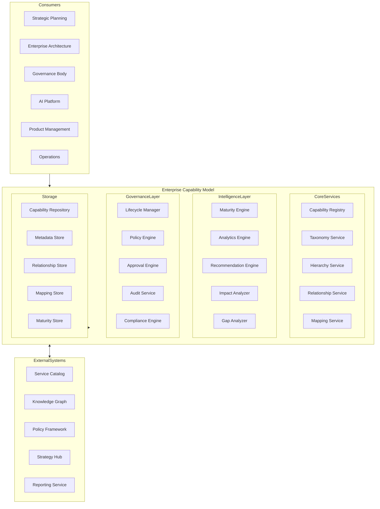
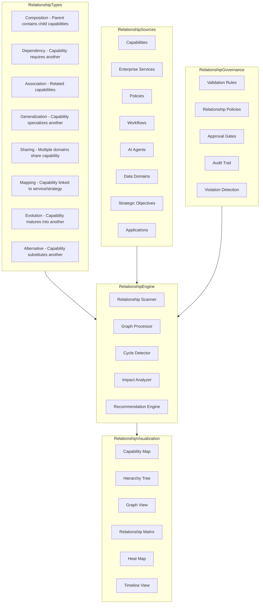
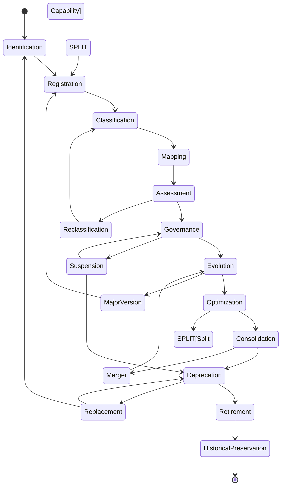
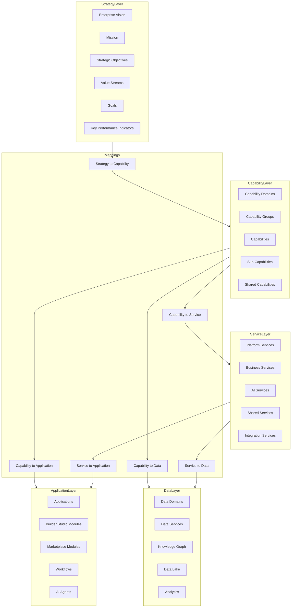
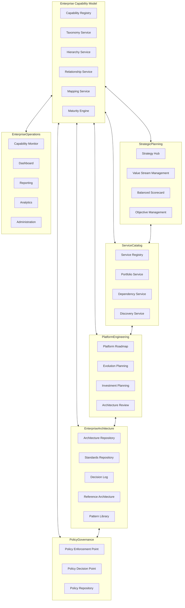

# KB-139 — Enterprise Capability Model Architecture

---

## Metadata

- **Document ID:** KB-139
- **Title:** Enterprise Capability Model Architecture
- **Suite:** Enterprise Platform Services
- **Version:** 1.0
- **Status:** Approved Architecture
- **Classification:** Enterprise Architecture Governance
- **Date:** 2026-07-12

---

## Executive Summary

The Enterprise Capability Model provides the canonical representation of what the DUKADESK ecosystem is capable of doing, independent of organizational structures, implementation technologies, applications, vendors, or operational processes.

The capability model serves as the strategic architectural foundation linking business strategy, enterprise architecture, governance, AI reasoning, service catalogs, platform evolution, and future ecosystem expansion. Every enterprise capability is identified, modeled, governed, related, and evolved through this canonical architecture.

---

## Purpose

Define how DUKADESK models, governs, evolves, and aligns enterprise capabilities across every architectural domain while ensuring consistency, traceability, reuse, strategic planning, and long-term architectural sustainability.

---

## Scope

### In Scope

- Enterprise capability architecture
- Capability taxonomy
- Capability registry
- Capability hierarchy
- Capability ownership
- Capability relationships
- Capability lifecycle
- Capability maturity
- Capability governance
- Capability mapping
- Capability dependencies
- Capability analytics
- Capability observability
- Strategic alignment
- AI capability modeling
- Enterprise evolution

### Out of Scope

- Organizational design
- Project portfolio management
- Product implementation
- Service implementation
- Infrastructure implementation
- Financial planning implementation

These are addressed by dedicated Knowledge Base documents, including KB-087 (Master Data Management Architecture), KB-094 (Integration Platform Architecture), KB-138 (Enterprise Service Catalog Architecture), and KB-140 (Enterprise Platform Services Reference Architecture).

---

## Architectural Principles

| # | Principle | Description |
|---|-----------|-------------|
| 1 | Capability-First Enterprise Architecture | Capabilities define what the enterprise does, independent of how it is implemented |
| 2 | Business and Technology Separation | Business capabilities are modeled independently of technology implementations |
| 3 | Capability Independence | Capabilities are self-contained units of enterprise function with minimal coupling |
| 4 | Single Source of Truth | The capability model is the authoritative reference for all enterprise capabilities |
| 5 | Strategic Alignment | Capabilities are mapped to business strategy, objectives, and value streams |
| 6 | Enterprise Reuse | Capabilities are designed for reuse across domains, products, and tenants |
| 7 | Lifecycle Governance | Every capability follows a governed lifecycle from identification to retirement |
| 8 | Metadata-Driven Architecture | Capability behavior is governed by metadata, not implementation |
| 9 | Vendor Independence | The capability model is independent of vendor-specific frameworks |
| 10 | Technology Neutrality | Capabilities are defined without bias toward implementation technologies |
| 11 | AI Readiness | Capability metadata supports AI reasoning and autonomous capability discovery |
| 12 | Enterprise Scalability | The capability model scales across all enterprise domains and services |
| 13 | Observability by Default | All capability model operations emit metrics, events, and audit trails |

---

## Canonical Definitions

| Term | Definition |
|------|-----------|
| Capability | A distinct ability of the enterprise to achieve a specific outcome |
| Enterprise Capability | A capability owned and governed at the enterprise level |
| Business Capability | A capability representing a business function or domain outcome |
| Platform Capability | A capability provided by the enterprise platform layer |
| Technical Capability | A capability enabled by technology, services, or infrastructure |
| AI Capability | A capability delivered through AI models, agents, or services |
| Shared Capability | A capability designed for consumption by multiple domains |
| Capability Registry | The canonical inventory of all enterprise capabilities |
| Capability Taxonomy | A hierarchical classification system for organizing enterprise capabilities |
| Capability Hierarchy | The structural organization of capabilities into domains, groups, and sub-capabilities |
| Capability Dependency | A relationship where one capability relies on another |
| Capability Ownership | The entity accountable for a capability's definition, governance, and evolution |
| Capability Lifecycle | The governed state progression of a capability from identification to retirement |
| Capability Maturity | The assessed level of capability effectiveness, governance, and optimization |
| Capability Portfolio | A strategic grouping of capabilities organized by value and business alignment |
| Capability Mapping | The traceable relationship between a capability and strategy, services, or processes |
| Capability Governance | The policies, roles, and processes governing enterprise capability management |
| Capability Evolution | The controlled progression of a capability through maturity levels and versions |
| Strategic Capability | A capability directly aligned to enterprise strategic objectives |
| Enterprise Capability Model | The complete canonical representation of all enterprise capabilities |

---

## Capability Registry

The Capability Registry is the canonical inventory of all enterprise capabilities. Every capability within DUKADESK must be registered in the Capability Registry.

### Capability Registry Structure

| Component | Description |
|-----------|-------------|
| Capability Definition | Name, identifier, domain, group, description, and strategic purpose |
| Classification | Taxonomy category, capability type, and governance classification |
| Hierarchy Position | Domain, capability group, capability, sub-capability, or composite |
| Ownership | Capability owner, steward, business domain, and tenant association |
| Lifecycle State | Current lifecycle position with timestamp and audit trail |
| Relationships | Dependencies, compositions, mappings, and associations |
| Maturity Level | Current maturity assessment with target state and evolution plan |
| Strategic Mappings | Linked business objectives, value streams, and strategic initiatives |
| Service Mappings | Associated enterprise services, applications, and platform components |
| Metrics | Capability effectiveness, coverage, reuse, and health indicators |

---

## Enterprise Capability Model

---

## Capability Taxonomy

```mermaid
graph TB
    CT[Capability Taxonomy] --> BIZ[Business Capabilities]
    CT --> PLT[Platform Capabilities]
    CT --> AI[AI Capabilities]
    CT --> DAT[Data Capabilities]
    CT --> SEC[Security Capabilities]
    CT --> INT[Integration Capabilities]
    CT --> RNT[Runtime Capabilities]
    CT --> MKT[Marketplace Capabilities]
    CT --> BLD[Builder Studio Capabilities]
    CT --> OPS[Operational Capabilities]
    CT --> GOV[Governance Capabilities]
    CT --> ENS[Enterprise Services]
    CT --> SHR[Shared Capabilities]
    CT --> FTR[Future Capability Domains]

    BIZ --> ORG[Organization Management]
    BIZ --> BIL[Billing & Invoicing]
    BIZ --> SUB[Subscription Management]
    BIZ --> CUS[Customer Management]

    PLT --> IDP[Identity & Access]
    PLT --> PLT_POL[Policy Management]
    PLT --> AUD[Audit & Compliance]
    PLT --> CFG[Configuration Management]

    AI --> AIG[AI Generation]
    AI --> AIC[AI Classification]
    AI --> AIR[AI Recommendation]
    AI --> AID[AI Decision]

    DAT --> DTL[Data Storage]
    DAT --> DW[Data Warehousing]
    DAT --> STM[Stream Processing]
    DAT --> ANL[Analytics]

    SEC --> ATH[Authentication]
    SEC --> AUTH[Authorization]
    SEC --> ENC[Encryption]
    SEC --> MON[Security Monitoring]

    INT --> API[API Management]
    INT --> EVT[Event Management]
    INT --> TRN[Transformation]
    INT --> PRT[Partner Integration]
```

---

## Capability Hierarchy

```mermaid
graph TB
    subgraph Level1[Level 1 - Capability Domains]
        DOM1[Business Domain]
        DOM2[Platform Domain]
        DOM3[AI Domain]
        DOM4[Data Domain]
        DOM5[Security Domain]
    end

    subgraph Level2[Level 2 - Capability Groups]
        GRP1[Customer Management Group]
        GRP2[Identity Services Group]
        GRP3[AI Services Group]
        GRP4[Storage Group]
        GRP5[Access Control Group]
    end

    subgraph Level3[Level 3 - Capabilities]
        CAP1[Customer Onboarding]
        CAP2[Customer Support]
        CAP3[User Authentication]
        CAP4[Role Management]
        CAP5[Text Generation]
        CAP6[Image Classification]
        CAP7[Object Storage]
        CAP8[Data Replication]
        CAP9[Permission Management]
        CAP10[Policy Enforcement]
    end

    subgraph Level4[Level 4 - Sub-Capabilities]
        SUB1[Identity Verification]
        SUB2[SSO Integration]
        SUB3[MFA Management]
        SUB4[Text Summarization]
        SUB5[Sentiment Analysis]
        SUB6[File Upload]
        SUB7[Access Review]
    end

    subgraph Level5[Level 5 - Shared Capabilities]
        SH1[Notification Capability]
        SH2[Scheduling Capability]
        SH3[Logging Capability]
        SH4[Audit Capability]
    end

    DOM1 --> GRP1
    DOM1 --> GRP2
    DOM2 --> GRP2
    DOM2 --> GRP5
    DOM3 --> GRP3
    DOM4 --> GRP4
    DOM5 --> GRP5

    GRP1 --> CAP1
    GRP1 --> CAP2
    GRP2 --> CAP3
    GRP2 --> CAP4
    GRP3 --> CAP5
    GRP3 --> CAP6
    GRP4 --> CAP7
    GRP4 --> CAP8
    GRP5 --> CAP9
    GRP5 --> CAP10

    CAP3 --> SUB1
    CAP3 --> SUB2
    CAP3 --> SUB3
    CAP5 --> SUB4
    CAP5 --> SUB5
    CAP7 --> SUB6
    CAP9 --> SUB7

    SH1 -.-> CAP1
    SH1 -.-> CAP2
    SH2 -.-> CAP1
    SH3 -.-> CAP3
    SH3 -.-> CAP4
    SH4 -.-> CAP9
    SH4 -.-> CAP10
```

---

## Capability Relationship Architecture

---

## Capability Lifecycle

---

## Capability Mapping Architecture

---

## Capability Governance Structure

```mermaid
graph TB
    subgraph GovernanceBody[Capability Governance Structure]

        subgraph StrategicGovernance
            EAB[Enterprise Architecture Board]
            SGC[Strategic Governance Council]
            CAP_C[Capability Council]
            EXE[Executive Steering]
        end

        subgraph ArchitectureGovernance
            ARO[Architecture Review Office]
            STD[Standards Committee]
            CAP_M[Capability Management]
            MAP_G[Mapping Governance]
        end

        subgraph DomainGovernance
            DOM_O[Domain Owners]
            CAP_O[Capability Owners]
            GRP_O[Group Stewards]
            SUB_O[Sub-Capability Owners]
        end

        subgraph AIGovernance
            AGB[AI Governance Board]
            AI_C[AI Capability Review]
            ETH[AI Ethics Desk]
            AI_AUD[AI Audit]
        end

        subgraph SecurityAndCompliance
            SEC[Security Team]
            CMP[Compliance Team]
            AUD[Audit Team]
            LEG[Legal Team]
        end

        subgraph Enforcement
            PLY[Policy Engine]
            REG[Registration Enforcement]
            VIO[Violation Manager]
            COR[Corrective Action]
            RPT[Reporting Engine]
        end

        subgraph Policies
            REG2[Registration Policy]
            CLS[Classification Policy]
            HIER[Hierarchy Policy]
            REL[Relationship Policy]
            MAT[Maturity Policy]
            MAP2[Mapping Policy]
            LIF[Lifecycle Policy]
            DEP[Deprecation Policy]
        end
    end

    StrategicGovernance --> ArchitectureGovernance
    ArchitectureGovernance --> DomainGovernance
    AIGovernance --> ArchitectureGovernance
    SecurityAndCompliance --> DomainGovernance
    DomainGovernance --> Enforcement
    Policies --> Enforcement
    Enforcement --> VIO
    Enforcement --> RPT
```

---

## Enterprise Capability Operating Model

---

## Capability Maturity Model

```mermaid
graph TB
    subgraph MaturityLevels
        L1[Level 1 - Initial<br/>Ad-hoc, undocumented, inconsistent]
        L2[Level 2 - Defined<br/>Registered, owned, classified]
        L3[Level 3 - Governed<br/>Policies enforced, lifecycle managed]
        L4[Level 4 - Measured<br/>Metrics tracked, maturity assessed]
        L5[Level 5 - Optimizing<br/>Continuous improvement, strategic alignment]
    end

    subgraph MaturityDimensions
        GOV[Governance Maturity]
        DEF[Definition Quality]
        OWN[Ownership Clarity]
        REL2[Relationship Completeness]
        MAP3[Mapping Traceability]
        USE[Usage & Reuse]
        INT[Integration Quality]
        ALI[Strategic Alignment]
    end

    subgraph AssessmentCriteria
        REG3[Registered in Catalog]
        DOC[Documented Definition]
        OWR[Designated Owner]
        PLV[Policy Compliance]
        LIF2[Lifecycle Enforcement]
        MTY[Metrics Tracked]
        REV[Regular Review]
        OPT[Optimization Active]
    end

    subgraph AssessmentProcess
        SA[Self-Assessment]
        PR[Peer Review]
        ARC_R[Architecture Review]
        AUD2[Audit Verification]
        EXE_R[Executive Review]
    end

    subgraph MaturityOutcomes
        EVL2[Evolution Plan]
        IMP[Improvement Initiatives]
        INV2[Investment Decisions]
        RET[Retirement Candidates]
        CON[Consolidation Opportunities]
    end

    MaturityLevels --> MaturityDimensions
    MaturityDimensions --> AssessmentCriteria
    AssessmentCriteria --> AssessmentProcess
    AssessmentProcess --> MaturityOutcomes
```

---

## Enterprise Capability Ecosystem

```mermaid
graph TB
    subgraph CapabilityEcosystem[Enterprise Capability Ecosystem]

        subgraph CapabilitySources
            STR2[Strategic Planning]
            BIZ_D[Business Domains]
            PLT_D[Platform Teams]
            AI_D[AI Capabilities]
            PRT[Partners]
            TEN[Tenants]
            MKT2[Marketplace]
            OPS2[Operations]
        end

        subgraph CapabilityModel2
            CPR2[Capability Registry]
            TAX2[Taxonomy Service]
            HIR2[Hierarchy Service]
            REL3[Relationship Service]
            MAP4[Mapping Service]
            MAT3[Maturity Engine]
            ANA2[Analytics Engine]
        end

        subgraph CapabilityTypes
            BIZ2[Business Capabilities]
            PLT2[Platform Capabilities]
            AI2[AI Capabilities]
            DAT2[Data Capabilities]
            SEC2[Security Capabilities]
            INT2[Integration Capabilities]
            OPS3[Operational Capabilities]
            SHR2[Shared Capabilities]
        end

        subgraph Consumers
            ARC3[Enterprise Architecture]
            STR3[Strategy Office]
            PRD2[Product Management]
            PLT_E[Platform Engineering]
            AI3[AI Governance]
            GOV2[Governance Bodies]
        end

        subgraph Governance
            PLY2[Policy Engine]
            AUD3[Audit Service]
            ARC4[Architecture Governance]
            CMP2[Compliance Engine]
        end

        subgraph Observability
            MET[Metrics]
            TRC[Traces]
            LOG[Logs]
            EVT[Events]
            DSH[Dashboards]
            ALR[Alerts]
            RPT2[Reports]
            ANL3[Analytics]
        end
    end

    CapabilitySources --> CapabilityModel2
    CapabilityModel2 --> CapabilityTypes
    CapabilityTypes --> Consumers
    Governance -.-> CapabilityModel2
    Governance -.-> CapabilityTypes
    Governance -.-> CapabilitySources
    Observability -.-> CapabilityModel2
    Observability -.-> CapabilityTypes
    Observability -.-> Consumers
```

---

## Governance

| Domain | Governance Focus |
|--------|-----------------|
| Capability Ownership | Every capability has a designated owner accountable for its definition, governance, and evolution |
| Strategic Governance | Capabilities are governed for strategic alignment with enterprise objectives |
| Architecture Governance | Capability definitions comply with enterprise architecture standards and patterns |
| Metadata Governance | Capability metadata schemas are defined, versioned, and enforced enterprise-wide |
| Lifecycle Governance | All capabilities follow the governed lifecycle; state transitions require authorization |
| AI Governance | AI capabilities follow AI governance board oversight for registration and evolution |
| Policy Governance | Capability model policies are defined, enforced, and audited |
| Compliance Governance | Capability modeling complies with regulatory requirements and audit mandates |
| Executive Governance | Executive leadership governs strategic capability investment and retirement decisions |
| Enterprise Governance | The Enterprise Architecture board governs capability model evolution and standards |

### Governance Enforcement Points

| Enforcement Point | Mechanism |
|-------------------|-----------|
| Capability Registration | Schema validation, deduplication check, classification enforcement, hierarchy validation |
| Capability Relationship | Relationship validation, cycle detection, dependency consistency check |
| Capability Mapping | Mapping traceability validation, strategy alignment verification |
| Capability Maturity | Maturity assessment verification, evolution planning compliance |
| Capability Deprecation | Impact analysis, consumer notification, migration plan validation |
| Capability Retirement | Archival verification, historical preservation, mapping cleanup |

---

## Responsibilities

| Role | Responsibilities |
|------|-----------------|
| Enterprise Architecture | Defines capability model architecture, standards, and governance; approves model evolution |
| Executive Leadership | Governs strategic capability investment, portfolio prioritization, and retirement decisions |
| Platform Engineering | Develops, operates, and maintains the Enterprise Capability Model Platform |
| Product Leadership | Defines product-aligned capabilities; ensures capability reuse across products |
| Security | Defines capability authorization model; audits capability model access |
| Compliance | Defines capability compliance requirements; audits capability registrations |
| AI Governance Board | Governs AI capability definitions; approves AI capability metadata and transparency |
| Business Owners | Define business capabilities for their domains; maintain capability mappings |
| Service Owners | Map services to capabilities; ensure service-capability alignment |
| Strategy Office | Manages strategic objective mapping; ensures strategy-to-capability traceability |

---

## Security

| Security Control | Description |
|------------------|-------------|
| Capability Authorization | Read, register, update, deprecate, retire, and administer permissions per capability |
| Governance Protection | Capability model access requires authentication and authorization |
| Least Privilege | Users have minimum permissions required for their capability role |
| Zero Trust | All capability model API calls authenticated and authorized regardless of network origin |
| Auditability | All capability model operations recorded in immutable audit log |
| Provenance | Full provenance tracking for capability registration, evolution, and retirement |
| Policy Enforcement | Authorization policies enforced at API gateway and capability model layers |
| Strategic Integrity | Strategic mappings are protected from unauthorized modification |
| Enterprise Traceability | All capability relationships and mappings are traceable to authorized sources |
| Governance Boundaries | Capability governance enforcement is immutable and auditable |

### Security Zones

| Zone | Description |
|------|-------------|
| Public | Public capability names and descriptions accessible without authentication |
| Authenticated | Capability details requiring user authentication |
| Internal | Internal capability metadata requiring authorized access |
| Confidential | Strategic capability mappings with classification-based restrictions |
| Restricted | Regulated capability information requiring explicit approval |
| Admin | Capability model administration requiring elevated privileges |

---

## Privacy

| Privacy Control | Description |
|----------------|-------------|
| Sensitive Capability Metadata | Capability metadata containing sensitive information is classified and restricted |
| Regulatory Compliance | Capability model data handling complies with GDPR, CCPA, and regional privacy regulations |
| Data Minimization | Only required capability metadata is collected, stored, and processed |
| Regional Compliance | Capability data respects regional data residency requirements |
| Cross-Border Governance | Capability model data is stored and processed in accordance with data residency policies |
| Retention Policies | Capability metadata is retained only for the duration required by policy |
| Privacy Assurance | Regular privacy reviews and impact assessments for capability model capabilities |

### Data Classification

| Classification | Examples | Access Restrictions |
|---------------|----------|-------------------|
| Public | Capability names, descriptions, taxonomy | No authentication required |
| Internal | Capability metadata, ownership, relationships | Authenticated users within enterprise |
| Confidential | Strategic mappings, maturity assessments | Authorized users only |
| Restricted | Security capability details, regulated mappings | Explicit approval required |
| Regulated | Compliance capability evidence, audit mappings | Audited access with strict controls |

---

## Performance

| Consideration | Requirement |
|---------------|-------------|
| Enterprise-Scale Capability Repositories | Support for thousands of capabilities across all domains |
| High-Volume Relationship Analysis | Relationship graph queries complete within milliseconds |
| Elastic Scalability | Horizontal scaling of capability model services based on demand |
| High Availability | 99.99% uptime for core capability model services |
| Operational Resilience | Graceful degradation under load with circuit breakers |
| Efficient Capability Discovery | Capability queries and discovery return within milliseconds |
| Strategic Analytics | Maturity and portfolio analytics complete within seconds |
| Multi-Region Readiness | Active-active capability model serving across paired regions |

### Performance Optimization

| Optimization | Description |
|--------------|-------------|
| Capability Caching | Frequently accessed capability metadata cached with intelligent invalidation |
| Graph Pre-Computation | Relationship graphs pre-computed and cached for rapid analysis |
| Optimistic Concurrency | Concurrent capability updates with conflict detection |
| Bulk Operations | Batch capability registration and update operations |
| Read Replicas | Read-only replicas for capability browsing and discovery queries |
| Indexed Queries | Optimized query paths for taxonomy, hierarchy, and ownership lookups |

---

## Observability

| Observable Dimension | Metrics | Purpose |
|---------------------|---------|---------|
| Capability Health | Registered capabilities, active count, lifecycle distribution | Tracking capability model population and health |
| Maturity Analytics | Maturity level distribution, improvement velocity, gaps identified | Monitoring capability maturity progression |
| Governance Dashboards | Policy violations, registration approvals, lifecycle compliance | Monitoring capability governance health |
| Strategic Reporting | Strategy-to-capability coverage, alignment gaps, investment allocation | Strategic capability intelligence |
| Executive Reporting | Portfolio health, strategic alignment, maturity trends | Executive capability oversight |
| Relationship Analytics | Relationship density, dependency cycles, orphan capabilities | Analyzing capability interconnections |
| Capability Portfolio Metrics | Coverage by domain, reuse rates, redundancy detection | Portfolio optimization insights |
| Enterprise Architecture Insights | Capability evolution trends, standardization levels, architecture compliance | Architecture governance intelligence |
| Capability Evolution Metrics | Version velocity, maturity progression, retirement rate | Understanding capability evolution patterns |
| Catalog Integrity Monitoring | Orphan capabilities, missing ownership, metadata completeness | Ensuring capability data quality |

### Observability Events

| Event Type | Trigger | Consumer |
|------------|---------|----------|
| CapabilityRegistered | New capability registered | Architecture portal, governance dashboard |
| CapabilityMapped | Capability linked to service or strategy | Mapping service, strategy hub |
| CapabilityAssessed | Maturity assessment completed | Evolution planning, reporting service |
| CapabilityDeprecated | Capability marked for deprecation | Service catalog, consumer notification |
| CapabilityRetired | Capability permanently retired | Registry service, audit service |
| CapabilityRelationshipChanged | Capability relationship modified | Impact analyzer, relationship service |
| CapabilityGovernanceViolation | Capability violated governance policy | Governance dashboard, violation manager |
| CapabilityMaturityUpdated | Capability maturity level changed | Evolution planning, executive dashboard |

---

## Failure Scenarios

| # | Scenario | Architectural Response |
|---|----------|----------------------|
| 1 | Duplicate Capabilities | Deduplication engine with name and scope hashing; registry uniqueness enforcement |
| 2 | Capability Fragmentation | Fragmentation detection with consolidation recommendations; domain reconciliation |
| 3 | Missing Ownership | Ownership validation at registration; automated escalation for unowned capabilities |
| 4 | Broken Strategic Mappings | Mapping traceability checks; automated notification on mapping inconsistencies |
| 5 | Governance Failures | Policy enforcement point blocks violating operation; violation recorded with audit trail |
| 6 | Capability Redundancy | Redundancy detection engine; overlap analysis with consolidation recommendations |
| 7 | Metadata Inconsistencies | Metadata validation schema; consistency checks with automated remediation |
| 8 | Relationship Corruption | Relationship graph integrity checks; automated repair with audit trail |
| 9 | Catalog Corruption | Checksum verification with automated repair; failover to replica |
| 10 | Recovery Failures | Journal-based recovery with replay capability; consistency verification after recovery |
| 11 | AI Capability Misclassification | AI capability classification validation; AI governance board review escalation |
| 12 | Lifecycle Inconsistencies | Lifecycle state machine validation; automated state correction with audit |

---

## Anti-Patterns

| # | Anti-Pattern | Description | Prohibited Because |
|---|-------------|-------------|-------------------|
| 1 | Application-Centric Capability Definitions | Capabilities defined based on applications rather than enterprise function | Creates technology-driven model, reduces strategic flexibility |
| 2 | Duplicate Capability Catalogs | Multiple independent capability inventories across the enterprise | Fragments strategic planning, creates governance gaps |
| 3 | Capability Ownership Ambiguity | Capabilities without clearly defined owners | Prevents accountability, evolution decisions, and governance |
| 4 | Hidden Enterprise Capabilities | Capabilities not registered in the enterprise capability model | Prevents strategic visibility, reuse, and governance |
| 5 | Hardcoded Capability Models | Capability definitions embedded in application or service code | Prevents enterprise-wide modeling, analysis, and evolution |
| 6 | Governance Bypass | Capability model policies circumvented through direct modifications | Creates strategic alignment gaps, compliance violations |
| 7 | Strategy Without Capability Mapping | Strategic objectives defined without capability traceability | Prevents strategy execution, investment alignment, gap analysis |
| 8 | Service-First Architecture Without Capability Modeling | Services defined without capability context | Reduces strategic visibility, reuse opportunities, architectural cohesion |
| 9 | Independent Capability Repositories | Domain-specific capability models outside enterprise governance | Fragments enterprise view, prevents cross-domain analysis |
| 10 | Technology-Driven Capability Definitions | Capabilities defined by technology choices rather than business function | Creates brittle model, reduces strategic flexibility, vendor lock-in risk |

---

## Future Evolution

| # | Evolution Path | Description |
|---|---------------|-------------|
| 1 | AI-Assisted Capability Discovery | AI agents that autonomously discover, classify, and recommend enterprise capabilities |
| 2 | Semantic Enterprise Capability Intelligence | ML-driven capability understanding based on semantic function analysis |
| 3 | Autonomous Capability Governance | Self-governing capabilities that apply policies based on model metadata |
| 4 | Federated Enterprise Capability Ecosystems | Capability model federation across DUKADESK and partner ecosystems |
| 5 | Adaptive Enterprise Capability Planning | Capability portfolios that self-organize based on strategic priorities |
| 6 | Intelligent Capability Optimization | AI-driven identification of capability gaps, redundancies, and optimization |
| 7 | Cross-Platform Capability Federation | Federated capability models across different platforms and ecosystems |
| 8 | Enterprise Strategy Intelligence | AI-driven insights into strategic alignment, capability coverage, and transformation planning |

---

## Cross References

| Document ID | Title | Relationship |
|-------------|-------|-------------|
| KB-087 | Master Data Management Architecture | Defines master data capabilities referenced in the capability model |
| KB-089 | Knowledge Graph Architecture | Defines knowledge graph integration for capability relationships |
| KB-094 | Integration Platform Architecture | Defines integration capabilities cataloged in the capability model |
| KB-100 | Service Discovery Architecture | Defines service discovery aligned with capability discovery |
| KB-107 | Enterprise Platform Services Overview Architecture | Foundational reference for platform services architecture |
| KB-116 | AI Platform Architecture | Defines AI capabilities registered in the enterprise capability model |
| KB-123 | Enterprise Policy Framework Architecture | Foundational reference for policy-driven capability governance |
| KB-124 | Policy Management Architecture | Defines policy enforcement for capability model operations |
| KB-138 | Enterprise Service Catalog Architecture | Defines service catalog integration with capability mappings |
| KB-140 | Enterprise Platform Services Reference Architecture | Comprehensive reference for all platform services |

---

## Critical DUKADESK Architectural Rule

**All enterprise business, platform, operational, AI, security, integration, data, and shared capabilities within DUKADESK shall be defined, governed, and evolved exclusively through the canonical Enterprise Capability Model. No application, service, workflow, AI capability, Builder Studio component, Marketplace module, runtime service, tenant, or operational domain shall establish independent capability definitions outside the enterprise model, ensuring strategic alignment, architectural consistency, governance, interoperability, traceability, and long-term platform evolution.**
