# KB-140 — Enterprise Platform Services Reference Architecture

---

## Metadata

- **Document ID:** KB-140
- **Title:** Enterprise Platform Services Reference Architecture
- **Suite:** Enterprise Platform Services
- **Version:** 1.0
- **Status:** Approved Architecture
- **Classification:** Enterprise Reference Architecture
- **Date:** 2026-07-12

---

## Executive Summary

The Enterprise Platform Services Reference Architecture consolidates every enterprise platform service (KB-107 through KB-139) into a single unified architectural model, defining how foundational enterprise capabilities cooperate to support Builder Studio, Marketplace, Runtime Platform, AI Platform, Integration Platform, Data Platform, Security Platform, Identity Platform, and all future enterprise capabilities.

This document serves as the authoritative architectural blueprint for enterprise shared services throughout the DUKADESK ecosystem, defining service boundaries, interactions, dependencies, governance, capability mappings, and strategic alignment.

---

## Purpose

Provide the single authoritative architectural reference describing enterprise platform services, their responsibilities, interactions, governance, dependencies, boundaries, and strategic role across the entire DUKADESK platform.

---

## Scope

### Core Enterprise Services (KB-107 through KB-139)

| Document | Service |
|----------|---------|
| KB-107 | Enterprise Platform Services Overview |
| KB-108 | Organization Management |
| KB-109 | User Profile Management |
| KB-110 | Subscription Management |
| KB-111 | Licensing Management |
| KB-112 | Billing & Invoicing |
| KB-113 | Workflow Orchestration |
| KB-114 | Business Rules Engine |
| KB-115 | Template Management |
| KB-116 | AI Platform |
| KB-117 | AI Agent Framework |
| KB-118 | AI Prompt Management |
| KB-119 | AI Model Management |
| KB-120 | AI Context & Memory |
| KB-121 | AI Safety & Governance |
| KB-122 | AI Usage & Cost Management |
| KB-123 | Enterprise Policy Framework |
| KB-124 | Policy Management |
| KB-125 | Authorization |
| KB-126 | Audit & Compliance |
| KB-127 | Notification & Communication |
| KB-128 | Localization & Internationalization |
| KB-129 | Feature Flag & Configuration |
| KB-130 | Enterprise Risk Management |
| KB-131 | Enterprise Scheduling & Calendar |
| KB-132 | Enterprise Workflow Task Management |
| KB-133 | Enterprise Document & Content Management |
| KB-134 | Enterprise Digital Asset Management |
| KB-135 | Enterprise Collaboration |
| KB-136 | Enterprise Tenant Management |
| KB-137 | Enterprise Resource Management |
| KB-138 | Enterprise Service Catalog |
| KB-139 | Enterprise Capability Model |

### Integration Domains

- Builder Studio
- Marketplace
- Runtime Platform
- Data Platform
- Integration Platform
- Security Platform
- Identity Platform
- AI Platform
- Observability Platform
- Future platform services

---

## Architectural Principles

| # | Principle | Description |
|---|-----------|-------------|
| 1 | Enterprise-First Architecture | All platform capabilities are designed for enterprise-wide use before domain-specific use |
| 2 | Shared Platform Capabilities | Capabilities are built once as shared services and reused across all domains |
| 3 | Capability Reuse | Services are designed for maximum reuse across applications, tenants, and workflows |
| 4 | Loose Coupling | Services interact through defined contracts with minimal direct dependencies |
| 5 | High Cohesion | Each service encapsulates a single domain capability with clear boundaries |
| 6 | Policy-Driven Governance | Service behavior is governed by enterprise policies, not hardcoded logic |
| 7 | Zero Trust | All service interactions are authenticated and authorized regardless of network origin |
| 8 | Multi-Tenant by Default | All platform services are designed for multi-tenant isolation from inception |
| 9 | AI-Ready Architecture | All services expose metadata and interfaces for AI reasoning and autonomous operation |
| 10 | Vendor Independence | No dependency on specific vendor implementations for any platform service |
| 11 | Technology Neutrality | Services are defined independently of implementation technologies |
| 12 | Event-Driven Integration | Service interactions are event-driven where loose coupling is required |
| 13 | Enterprise Scalability | All services scale horizontally to meet enterprise demand |
| 14 | Enterprise Resilience | Services degrade gracefully and recover automatically |
| 15 | Observability by Default | All services emit metrics, events, traces, and logs for full observability |

---

## Canonical Definitions

| Term | Definition |
|------|-----------|
| Enterprise Platform Service | A governed shared service providing enterprise-wide capabilities |
| Shared Service | A service designed for consumption by multiple domains, products, and tenants |
| Platform Capability | A distinct function provided by the enterprise platform |
| Platform Domain | A logical grouping of related platform capabilities |
| Enterprise Foundation | The set of fundamental platform services underpinning all capabilities |
| Reference Architecture | The authoritative architectural model for enterprise platform services |
| Platform Boundary | The defined scope and responsibility limit of a platform service |
| Platform Contract | The agreed interface, behavior, and quality commitments of a platform service |
| Capability Layer | A horizontal tier grouping related platform capabilities |
| Governance Layer | The cross-cutting layer enforcing policies, compliance, and oversight |
| Operational Layer | The layer managing platform operations, monitoring, and administration |
| Enterprise Service Mesh | The interconnection fabric enabling service-to-service communication |
| Platform Ecosystem | The complete set of platform services, capabilities, and their interactions |
| Service Dependency | A relationship where one service relies on another for its operation |
| Platform Integration | The defined interaction pattern between platform services |
| Shared Platform Resource | A resource accessible by multiple platform services |
| Enterprise Platform Portfolio | The complete collection of enterprise platform services |
| Capability Domain | A strategic area of enterprise capability |
| Cross-Cutting Service | A service that spans multiple platform domains |
| Platform Architecture | The structural design of the enterprise platform |

---

## Enterprise Platform Services Landscape

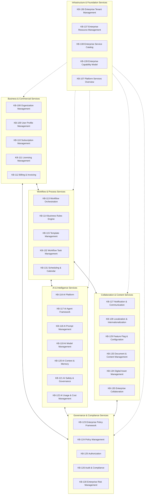

---

## Layered Reference Architecture

```mermaid
graph TB
    subgraph ConsumerLayer[Consumer Layer]
        WEB[Web Applications]
        MOB[Mobile Applications]
        API[API Consumers]
        AI_AGT[AI Agents]
        EXT[External Systems]
        BLD[Builder Studio]
        MKT[Marketplace]
    end

    subgraph ExperienceLayer[Experience Layer]
        UX[User Experience Services]
        BRD[Branding Service]
        I18N[Internationalization]
        THEME[Theming Service]
        PORT[Portal Service]
    end

    subgraph BusinessCapabilityLayer[Business Capability Layer]
        ORG[Organization Management]
        USR[User Profile]
        SUB[Subscription Management]
        LIC[Licensing Management]
        BIL[Billing & Invoicing]
    end

    subgraph PlatformServicesLayer[Enterprise Platform Services Layer]
        WKF[Workflow Orchestration]
        RUL[Business Rules Engine]
        TPL[Template Management]
        TSK[Task Management]
        SCH[Scheduling & Calendar]
        DOC[Document & Content Management]
        DAM[Digital Asset Management]
        COL[Collaboration]
        NTF[Notification & Communication]
        LOC[Localization]
        CFG[Feature Flag & Configuration]
    end

    subgraph AIServicesLayer[AI Services Layer]
        AI_PLT[AI Platform]
        AI_AGT2[AI Agent Framework]
        AI_PMT[AI Prompt Management]
        AI_MOD[AI Model Management]
        AI_CTX[AI Context & Memory]
        AI_SFT[AI Safety & Governance]
        AI_CST[AI Usage & Cost Management]
    end

    subgraph IntegrationLayer[Integration Layer]
        API_GW[API Gateway]
        EVT[Event Bus]
        MSG[Messaging Service]
        TRN[Transformation Service]
        CON[Connector Hub]
    end

    subgraph DataLayer[Data Layer]
        DTL[Data Lake]
        DW[Data Warehouse]
        STM[Stream Processing]
        MDM[Master Data Management]
        KG[Knowledge Graph]
    end

    subgraph InfrastructureLayer[Infrastructure Layer]
        TNT[Tenant Management]
        RSR[Resource Management]
        SVC_CAT[Service Catalog]
        CAP[Capability Model]
        OBS[Observability Platform]
        SEC[Security Platform]
        IDP[Identity Platform]
    end

    subgraph GovernanceLayer[Governance Layer]
        POL[Policy Framework]
        POL_MGT[Policy Management]
        AUTH[Authorization]
        AUD[Audit & Compliance]
        RSK[Risk Management]
        AI_GOV[AI Governance]
    end

    subgraph ObservabilityLayer[Observability Layer]
        MET[Metrics Service]
        TRC[Traces Service]
        LOG[Logs Service]
        EVT2[Events Service]
        ALR[Alerting Service]
        DSH[Dashboard Service]
        ANL[Analytics Service]
    end

    ConsumerLayer --> ExperienceLayer
    ExperienceLayer --> BusinessCapabilityLayer
    BusinessCapabilityLayer --> PlatformServicesLayer
    PlatformServicesLayer --> AIServicesLayer
    PlatformServicesLayer --> IntegrationLayer
    AIServicesLayer --> IntegrationLayer
    IntegrationLayer --> DataLayer
    DataLayer --> InfrastructureLayer
    GovernanceLayer -.-> PlatformServicesLayer
    GovernanceLayer -.-> AIServicesLayer
    GovernanceLayer -.-> BusinessCapabilityLayer
    ObservabilityLayer -.-> PlatformServicesLayer
    ObservabilityLayer -.-> AIServicesLayer
    ObservabilityLayer -.-> BusinessCapabilityLayer
    ObservabilityLayer -.-> IntegrationLayer
    ObservabilityLayer -.-> DataLayer
```

---

## Enterprise Service Interaction Map

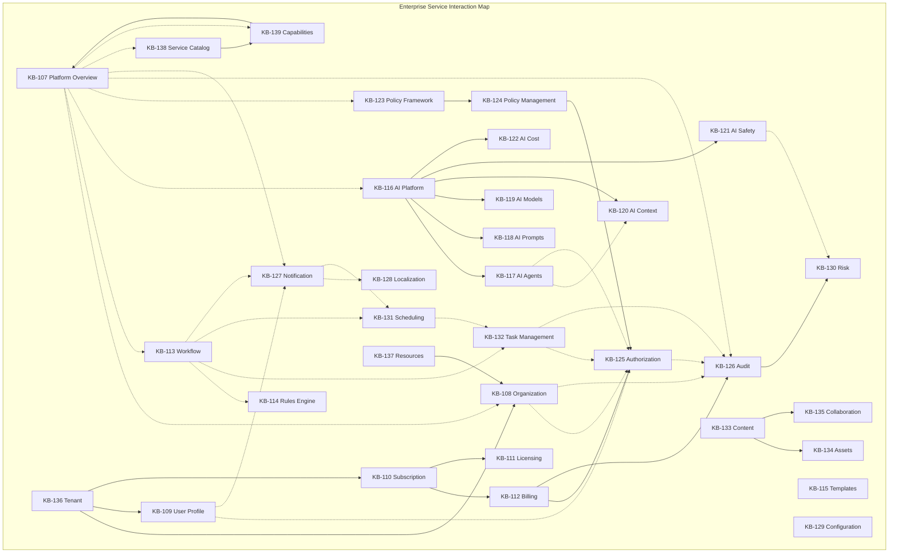

---

## Capability Mapping Matrix

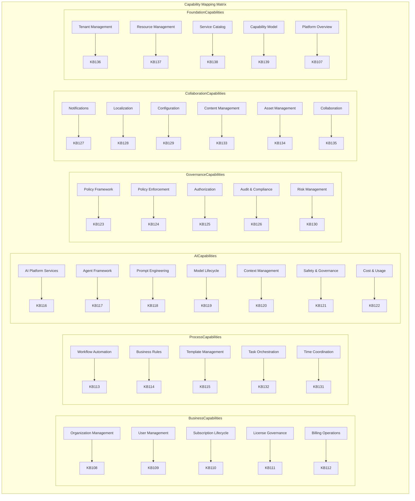

---

## Cross-Cutting Services Architecture

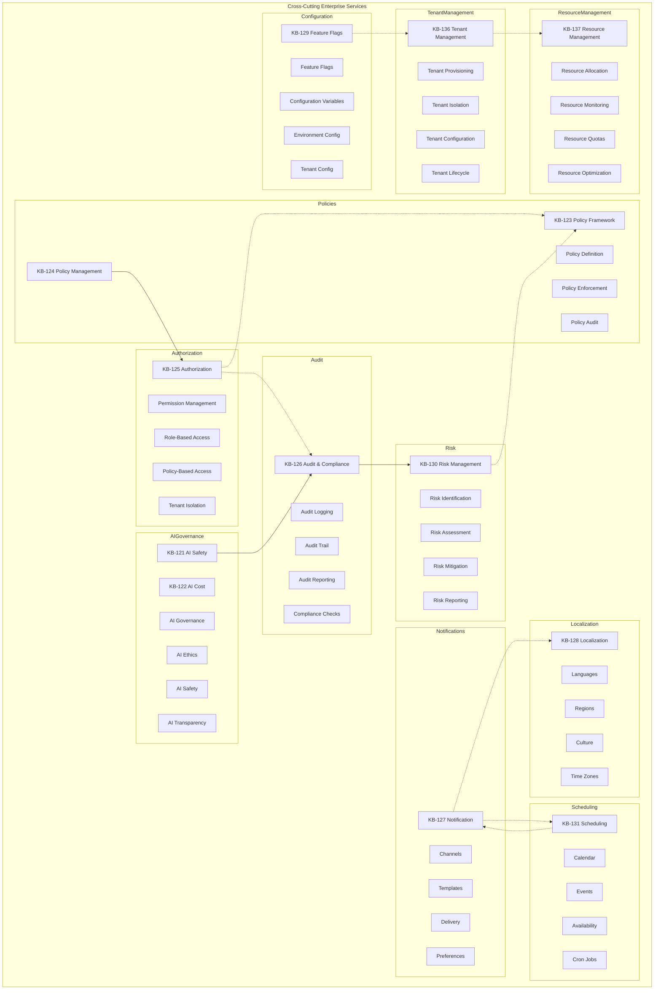

---

## Governance Architecture

```mermaid
graph TB
    subgraph GovernanceArchitecture[Enterprise Governance Architecture]

        subgraph StrategicGovernance
            EAB[Enterprise Architecture Board]
            EXE[Executive Leadership]
            STR[Strategy Office]
            PRT[Portfolio Review Team]
        end

        subgraph ArchitectureGovernance
            ARC[Architecture Review Board]
            STD[Standards Committee]
            PLT[Platform Governance]
            TEC[Technology Review]
        end

        subgraph ServiceGovernance
            SVC_C[Service Catalog Governance]
            SVC_O[Service Ownership]
            SVC_L[Service Lifecycle]
            SVC_D[Service Dependencies]
        end

        subgraph AIGovernance
            AGB[AI Governance Board]
            AI_S[AI Safety Review]
            AI_E[AI Ethics Committee]
            AI_T[AI Transparency Office]
            AI_C[AI Cost Oversight]
        end

        subgraph SecurityAndCompliance
            SEC[Security Governance]
            CMP[Compliance Governance]
            LEG[Legal Governance]
            PRI[Privacy Governance]
            AUD[Audit Governance]
        end

        subgraph OperationalGovernance
            OPS[Operations Governance]
            REL[Release Governance]
            CHG[Change Governance]
            INC[Incident Governance]
            SLA[SLA Governance]
        end

        subgraph GovernanceEnforcement
            KB123_P[Policy Framework - KB-123]
            KB124_P[Policy Management - KB-124]
            KB125_P[Authorization - KB-125]
            KB126_P[Audit & Compliance - KB-126]
            KB130_P[Risk Management - KB-130]
        end

        subgraph GovernanceReporting
            DSH[Governance Dashboards]
            RPT[Governance Reports]
            ALR[Governance Alerts]
            REV[Governance Reviews]
            AUD2[Governance Audits]
        end
    end

    StrategicGovernance --> ArchitectureGovernance
    ArchitectureGovernance --> ServiceGovernance
    ArchitectureGovernance --> AIGovernance
    ArchitectureGovernance --> SecurityAndCompliance
    ServiceGovernance --> OperationalGovernance
    AIGovernance --> OperationalGovernance
    SecurityAndCompliance --> OperationalGovernance
    ArchitectureGovernance --> GovernanceEnforcement
    GovernanceEnforcement --> GovernanceReporting
```

---

## Enterprise Operating Model

```mermaid
graph TB
    subgraph EnterpriseOperatingModel[Enterprise Platform Operating Model]

        subgraph Consumers
            USR[End Users]
            DEV[Developers]
            AI_AGT[AI Agents]
            ADM[Administrators]
            PRT[Partners]
        end

        subgraph BuilderStudio
            BLD[Studio Builder]
            BLD_APP[App Builder]
            BLD_AUT[Automation Builder]
            BLD_UI[UI Builder]
        end

        subgraph Marketplace
            MKT[Marketplace Platform]
            MKT_PUB[Publisher Portal]
            MKT_CON[Consumer Portal]
            MKT_REV[Revenue Management]
        end

        subgraph RuntimePlatform
            RNT[Runtime Engine]
            RNT_EXE[Execution Engine]
            RNT_WKF[Workflow Runtime]
            RNT_AI[AI Runtime]
        end

        subgraph EnterprisePlatform[Enterprise Platform Services]
            BIZ[Business Services<br/>KB-108 to KB-112]
            WKF[Workflow Services<br/>KB-113 to KB-115<br/>KB-131, KB-132]
            AI_S[AI Services<br/>KB-116 to KB-122]
            GOV[Governance Services<br/>KB-123 to KB-126, KB-130]
            COL[Collaboration Services<br/>KB-127 to KB-129<br/>KB-133 to KB-135]
            FDN[Foundation Services<br/>KB-136 to KB-139]
        end

        subgraph IntegrationPlatform
            INT[Integration Engine]
            INT_API[API Management]
            INT_EVT[Event Management]
            INT_CON[Connector Management]
        end

        subgraph DataPlatform
            DTA[Data Services]
            DTA_DL[Data Lake]
            DTA_DW[Data Warehouse]
            DTA_STR[Streaming]
            DTA_KG[Knowledge Graph]
        end

        subgraph SecurityPlatform
            SEC[Security Services]
            SEC_ID[Identity]
            SEC_AUTH[Authentication]
            SEC_ATHZ[Authorization]
            SEC_ENC[Encryption]
        end

        subgraph ObservabilityPlatform
            OBS[Observability Services]
            OBS_MET[Metrics]
            OBS_TRC[Traces]
            OBS_LOG[Logs]
            OBS_ALR[Alerts]
            OBS_DSH[Dashboards]
        end
    end

    Consumers --> BuilderStudio
    Consumers --> Marketplace
    Consumers --> RuntimePlatform
    BuilderStudio --> EnterprisePlatform
    Marketplace --> EnterprisePlatform
    RuntimePlatform --> EnterprisePlatform
    EnterprisePlatform --> IntegrationPlatform
    EnterprisePlatform --> DataPlatform
    EnterprisePlatform --> SecurityPlatform
    EnterprisePlatform --> ObservabilityPlatform
    IntegrationPlatform --> DataPlatform
    SecurityPlatform --> EnterprisePlatform
    ObservabilityPlatform -.-> EnterprisePlatform
    ObservabilityPlatform -.-> BuilderStudio
    ObservabilityPlatform -.-> Marketplace
    ObservabilityPlatform -.-> RuntimePlatform
    ObservabilityPlatform -.-> IntegrationPlatform
    ObservabilityPlatform -.-> DataPlatform
```

---

## Dependency Architecture

```mermaid
graph TB
    subgraph DependencyArchitecture[Enterprise Platform Service Dependencies]

        subgraph Level0[Level 0 - Foundation]
            KB136_T[Tenant Management]
            KB137_R[Resource Management]
            KB138_SC[Service Catalog]
            KB139_CM[Capability Model]
        end

        subgraph Level1[Level 1 - Core Infrastructure]
            KB123_PF[Policy Framework]
            KB125_AZ[Authorization]
            KB126_AC[Audit & Compliance]
            KB129_FC[Feature Flag & Configuration]
        end

        subgraph Level2[Level 2 - Business Foundation]
            KB108_OM[Organization Management]
            KB109_UM[User Profile Management]
            KB127_NC[Notification & Communication]
            KB128_LI[Localization & Internationalization]
        end

        subgraph Level3[Level 3 - Business Services]
            KB110_SM[Subscription Management]
            KB111_LM[Licensing Management]
            KB112_BI[Billing & Invoicing]
        end

        subgraph Level4[Level 4 - Workflow & Intelligence]
            KB113_WO[Workflow Orchestration]
            KB114_BR[Business Rules Engine]
            KB115_TM[Template Management]
            KB131_SC[Scheduling & Calendar]
            KB132_TK[Task Management]
        end

        subgraph Level5[Level 5 - AI Services]
            KB116_AP[AI Platform]
            KB117_AF[AI Agent Framework]
            KB118_PM[AI Prompt Management]
            KB119_MM[AI Model Management]
            KB120_CM[AI Context & Memory]
            KB121_SG[AI Safety & Governance]
            KB122_UC[AI Usage & Cost Management]
        end

        subgraph Level6[Level 6 - Content & Collaboration]
            KB133_DC[Document & Content Management]
            KB134_DAM[Digital Asset Management]
            KB135_EC[Enterprise Collaboration]
            KB130_ER[Enterprise Risk Management]
        end
    end

    Level1 --> Level0
    Level2 --> Level1
    Level3 --> Level2
    Level4 --> Level3
    Level4 --> Level1
    Level5 --> Level4
    Level5 --> Level1
    Level5 --> Level2
    Level6 --> Level2
    Level6 --> Level4
    Level6 --> Level1
```

---

## Platform Ecosystem

```mermaid
graph TB
    subgraph PlatformEcosystem[Enterprise Platform Ecosystem]

        subgraph ExternalConsumers
            USR[Users]
            DEV[Developers]
            AI_AGT[AI Agents]
            PRT[Partners]
            EXT[External Systems]
            REG[Regulatory Bodies]
        end

        subgraph ExperienceLayer2
            WEB[Web Apps]
            MOB[Mobile Apps]
            CLI[CLI Tools]
            SDK[SDKs]
            API[Open APIs]
        end

        subgraph PlatformServices[Enterprise Platform Services]
            BIZ[Business Services]
            WKF[Workflow Services]
            AI[AI Services]
            GOV[Governance Services]
            COL[Collaboration Services]
            FDN[Foundation Services]
        end

        subgraph PlatformInfrastructure[Platform Infrastructure]
            INT[Integration Platform]
            DTA[Data Platform]
            SEC[Security Platform]
            IDP[Identity Platform]
            OBS[Observability Platform]
        end

        subgraph RuntimeEnvironment[Runtime Environments]
            BLD2[Builder Studio Runtime]
            MKT2[Marketplace Runtime]
            RNT2[Application Runtime]
            AI_RT[AI Runtime]
            WKF_RT[Workflow Runtime]
        end

        subgraph StorageAndCompute[Storage & Compute]
            CMP[Compute Resources]
            STG[Storage Resources]
            NET[Network Resources]
            CCH[Cache Resources]
            DB[Database Resources]
        end

        subgraph GovernanceBoundary[Governance Boundary]
            POL[Enterprise Policies]
            AUTH[Authorization Rules]
            AUD[Audit Requirements]
            CMP[Compliance Mandates]
            RSK[Risk Thresholds]
            SLA[Service Level Agreements]
        end
    end

    ExternalConsumers --> ExperienceLayer2
    ExperienceLayer2 --> PlatformServices
    PlatformServices --> PlatformInfrastructure
    PlatformInfrastructure --> RuntimeEnvironment
    RuntimeEnvironment --> StorageAndCompute
    GovernanceBoundary -.-> PlatformServices
    GovernanceBoundary -.-> PlatformInfrastructure
    GovernanceBoundary -.-> RuntimeEnvironment
    GovernanceBoundary -.-> ExperienceLayer2
```

---

## Enterprise Platform Services Reference Blueprint

```mermaid
graph TB
    subgraph Blueprint[Enterprise Platform Services Reference Blueprint]

        subgraph ServiceDomains[Service Domains]
            D1[Business<br/>KB-108 to KB-112]
            D2[Workflow<br/>KB-113 to KB-115<br/>KB-131, KB-132]
            D3[AI<br/>KB-116 to KB-122]
            D4[Governance<br/>KB-123 to KB-126, KB-130]
            D5[Collaboration<br/>KB-127 to KB-129, KB-133 to KB-135]
            D6[Foundation<br/>KB-136 to KB-139]
        end

        subgraph ServiceTypes[Service Typology]
            T1[Entity Services<br/>Manage enterprise entities]
            T2[Process Services<br/>Orchestrate workflows]
            T3[Intelligence Services<br/>Provide AI capabilities]
            T4[Policy Services<br/>Enforce governance]
            T5[Experience Services<br/>Enable collaboration]
            T6[Registry Services<br/>Maintain inventories]
        end

        subgraph IntegrationPatterns[Integration Patterns]
            P1[API - RESTful Interfaces]
            P2[Event - Async Messaging]
            P3[Stream - Real-Time Data]
            P4[Graph - Relationship Queries]
            P5[File - Bulk Transfers]
            P6[Webhook - Callback Notifications]
        end

        subgraph QualityAttributes[Quality Attributes]
            Q1[Multi-Tenant Isolation]
            Q2[Horizontal Scalability]
            Q3[High Availability]
            Q4[Disaster Recovery]
            Q5[Observability]
            Q6[Security by Design]
            Q7[Privacy by Design]
            Q8[AI Readiness]
        end

        subgraph GovernanceModel[Governance Model]
            G1[Strategic Governance]
            G2[Architecture Governance]
            G3[Service Governance]
            G4[AI Governance]
            G5[Security Governance]
            G6[Operational Governance]
        end
    end

    ServiceDomains --> ServiceTypes
    ServiceTypes --> IntegrationPatterns
    IntegrationPatterns --> QualityAttributes
    QualityAttributes --> GovernanceModel
```

---

## End-to-End Platform Capability Flow

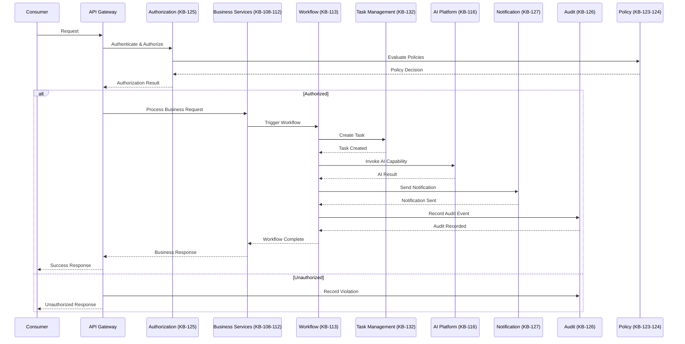

---

## Enterprise Shared Services Map

```mermaid
graph TB
    subgraph SharedServicesMap[Enterprise Shared Services Map]

        subgraph ConsumptionDomains
            STUDIO[Builder Studio]
            MARKET[Marketplace]
            RUNTIME[Runtime Platform]
            AI_PLAT[AI Platform]
            DATA_PLAT[Data Platform]
            INT_PLAT[Integration Platform]
            SEC_PLAT[Security Platform]
        end

        subgraph SharedPlatformServices
            IDP[Identity & Access<br/>KB-125]
            POL2[Policy Management<br/>KB-123, KB-124]
            AUD2[Audit & Compliance<br/>KB-126]
            NOT2[Notification<br/>KB-127]
            LOC2[Localization<br/>KB-128]
            CFG2[Configuration<br/>KB-129]
            RSK2[Risk Management<br/>KB-130]
            SCH2[Scheduling<br/>KB-131]
            TSK2[Task Management<br/>KB-132]
            DOC2[Content Management<br/>KB-133]
            DAM2[Asset Management<br/>KB-134]
            COL2[Collaboration<br/>KB-135]
            TNT2[Tenant Management<br/>KB-136]
            RSR2[Resource Management<br/>KB-137]
            SVC2[Service Catalog<br/>KB-138]
            CAP2[Capability Model<br/>KB-139]
            ORG2[Organization<br/>KB-108]
            USR2[User Profile<br/>KB-109]
            WKF2[Workflow<br/>KB-113]
            RUL2[Rules Engine<br/>KB-114]
            TPL2[Templates<br/>KB-115]
            AI2[AI Platform<br/>KB-116-122]
        end
    end

    STUDIO --> IDP
    STUDIO --> POL2
    STUDIO --> NOT2
    STUDIO --> DOC2
    STUDIO --> DAM2
    STUDIO --> COL2
    STUDIO --> TNT2
    STUDIO --> ORG2
    STUDIO --> USR2
    STUDIO --> WKF2
    STUDIO --> TPL2
    STUDIO --> AI2

    MARKET --> IDP
    MARKET --> POL2
    MARKET --> AUD2
    MARKET --> NOT2
    MARKET --> LOC2
    MARKET --> CFG2
    MARKET --> SCH2
    MARKET --> TSK2
    MARKET --> DOC2
    MARKET --> DAM2
    MARKET --> TNT2
    MARKET --> ORG2
    MARKET --> USR2
    MARKET --> WKF2
    MARKET --> BIZ2[Billing - KB-112]

    RUNTIME --> IDP
    RUNTIME --> POL2
    RUNTIME --> AUD2
    RUNTIME --> NOT2
    RUNTIME --> LOC2
    RUNTIME --> CFG2
    RUNTIME --> RSK2
    RUNTIME --> SCH2
    RUNTIME --> TSK2
    RUNTIME --> COL2
    RUNTIME --> TNT2
    RUNTIME --> RSR2
    RUNTIME --> SVC2
    RUNTIME --> CAP2
    RUNTIME --> WKF2

    AI_PLAT --> IDP
    AI_PLAT --> POL2
    AI_PLAT --> AUD2
    AI_PLAT --> NOT2
    AI_PLAT --> RSK2
    AI_PLAT --> SVC2
    AI_PLAT --> CAP2

    DATA_PLAT --> IDP
    DATA_PLAT --> POL2
    DATA_PLAT --> AUD2
    DATA_PLAT --> SVC2
    DATA_PLAT --> CAP2

    INT_PLAT --> IDP
    INT_PLAT --> POL2
    INT_PLAT --> AUD2
    INT_PLAT --> NOT2
    INT_PLAT --> SVC2
    INT_PLAT --> CAP2
    INT_PLAT --> WKF2

    SEC_PLAT --> IDP
    SEC_PLAT --> POL2
    SEC_PLAT --> AUD2
    SEC_PLAT --> RSK2
    SEC_PLAT --> NOT2
    SEC_PLAT --> SVC2
    SEC_PLAT --> CAP2
```

---

## Governance

| Domain | Governance Focus |
|--------|-----------------|
| Platform Architecture | All platform services conform to the enterprise reference architecture |
| Service Governance | Platform services follow governed registration, lifecycle, and evolution |
| Capability Governance | Capability definitions are governed by the Enterprise Capability Model |
| AI Governance | AI services follow AI governance board oversight and ethical guidelines |
| Security Governance | Platform service access and operations are governed by the Authorization Architecture |
| Compliance Governance | All platform services comply with regulatory requirements and audit mandates |
| Risk Governance | Platform risks are managed through the Enterprise Risk Management framework |
| Portfolio Governance | Service portfolio is reviewed for strategic alignment and value optimization |
| Executive Governance | Executive leadership governs strategic platform investment and evolution |
| Enterprise Governance | The Enterprise Architecture board governs overall platform architecture and standards |

---

## Responsibilities

| Role | Responsibilities |
|------|-----------------|
| Enterprise Architecture Board | Governs platform architecture, standards, and reference model; approves platform evolution |
| Executive Leadership | Governs strategic platform investment, portfolio prioritization, and cross-domain decisions |
| Platform Engineering | Develops, operates, and maintains all enterprise platform services |
| Domain Architects | Ensures domain-level alignment with enterprise platform architecture |
| Product Teams | Consumes platform services; does not duplicate or bypass platform capabilities |
| Security | Defines platform-wide security model; audits platform service access |
| Compliance | Defines platform compliance requirements; ensures regulatory adherence |
| AI Governance Board | Governs AI platform services; approves AI service boundaries and ethics |
| Operations | Monitors platform health, manages incidents, ensures service SLAs |
| Tenant Administrators | Manages tenant-specific platform service configurations and policies |

---

## Security

| Security Control | Description |
|------------------|-------------|
| Zero Trust | All service interactions authenticated and authorized regardless of origin |
| Identity-Aware Services | Every platform service integrates with enterprise identity platform |
| Authorization | Authorization is enforced by the centralized Authorization service (KB-125) |
| Least Privilege | Platform services operate with minimum required permissions |
| Tenant Isolation | All platform services enforce multi-tenant data isolation |
| Secure Service Interactions | Inter-service communication uses authenticated, encrypted channels |
| Policy Enforcement | Service access governed by enterprise policies (KB-123, KB-124) |
| Auditability | All platform service operations recorded in immutable audit log (KB-126) |
| Provenance | Full provenance tracking across all platform service interactions |
| Enterprise Trust Boundaries | Trust boundaries defined between platform domains and external systems |

### Security Zones

| Zone | Description |
|------|-------------|
| External | External consumer access through API gateway with authentication |
| Platform | Internal platform service mesh with mutual TLS |
| Governance | Governance service access with elevated authorization |
| Data | Data platform access with additional encryption and audit |
| AI | AI platform access with AI-specific safety and governance controls |
| Admin | Administrative access with privileged authorization |

---

## Privacy

| Privacy Control | Description |
|----------------|-------------|
| Data Minimization | Platform services collect and process only required data |
| Regional Compliance | Platform services comply with GDPR, CCPA, and regional privacy regulations |
| Cross-Border Governance | Data residency enforced across all platform services |
| Consent Governance | Personal data processing requires explicit consent |
| Privacy-by-Design | Privacy enforced through platform service architecture and policies |
| Retention Governance | Data retention governed by enterprise policies |
| Privacy Observability | Privacy compliance monitored and reported across all platform services |

---

## Performance

| Consideration | Requirement |
|---------------|-------------|
| Enterprise-Scale Operations | Platform services support millions of operations per day |
| Horizontal Scalability | All platform services scale horizontally on demand |
| High Availability | 99.99% uptime for critical platform services |
| Multi-Region Readiness | Platform services operate across paired active-active regions |
| Elastic Growth | Platform capacity grows automatically with demand |
| Operational Resilience | Graceful degradation under load with circuit breakers and bulkheads |
| Efficient Service Composition | Service interactions optimized for minimal latency |
| Platform Optimization | Continuous performance optimization across the service mesh |

---

## Observability

| Observable Dimension | Description |
|---------------------|-------------|
| Platform Health | Overall platform service availability, latency, and error rates |
| Service Health | Individual platform service health, throughput, and resource utilization |
| Governance Dashboards | Policy violations, authorization failures, compliance status across services |
| Enterprise Analytics | Cross-service usage patterns, adoption metrics, growth trends |
| Executive Reporting | Platform investment ROI, strategic alignment, service portfolio health |
| SLA Monitoring | Service level compliance across all platform services |
| Cross-Service Dependencies | Dependency health, latency impact, bottleneck detection |
| Platform Telemetry | Distributed tracing across service interactions |
| AI Observability | AI service usage, safety metrics, cost tracking, performance |
| Enterprise Operational Intelligence | Platform-wide insights, optimization recommendations, anomaly detection |

---

## Failure Scenarios

| # | Scenario | Architectural Response |
|---|----------|----------------------|
| 1 | Shared Service Failures | Circuit breakers isolate failing services; fallback paths maintain core operations |
| 2 | Governance Failures | Policy engine degrades to deny-all; manual override with audit |
| 3 | Cross-Service Dependency Failures | Dependency graph with impact analysis; automatic failover to healthy paths |
| 4 | Tenant Isolation Failures | Tenant boundary enforcement with immediate containment; audit and recovery |
| 5 | AI Governance Failures | AI services degrade to safe defaults; AI governance board escalation |
| 6 | Platform Degradation | Load shedding prioritizes critical platform services; degraded mode operations |
| 7 | Configuration Conflicts | Configuration validation service detects conflicts; last-known-good configuration restored |
| 8 | Policy Inconsistencies | Policy reconciliation service resolves conflicts; violation alert to governance |
| 9 | Service Discovery Failures | Service registry failover with cached service topology fallback |
| 10 | Recovery Failures | Journal-based recovery with replay capability; cross-service consistency verification |
| 11 | Cross-Domain Failures | Domain isolation prevents fault propagation; orchestrated recovery across domains |
| 12 | Platform Evolution Conflicts | Version compatibility verification; phased rollout with rollback capability |

---

## Anti-Patterns

| # | Anti-Pattern | Description | Prohibited Because |
|---|-------------|-------------|-------------------|
| 1 | Duplicate Enterprise Platform Services | Multiple services providing the same platform capability | Wastes resources, creates fragmentation, governance complexity |
| 2 | Application-Owned Shared Services | Applications implementing their own platform capabilities | Bypasses enterprise governance, security, and reuse |
| 3 | Service Silos | Platform services operating without cross-service awareness | Reduces enterprise intelligence, prevents optimization |
| 4 | Independent Governance | Domains implementing governance outside enterprise framework | Creates compliance gaps, security risks, audit failures |
| 5 | Platform Fragmentation | Platform services evolving inconsistently across domains | Breaks enterprise cohesion, increases integration cost |
| 6 | Hidden Platform Capabilities | Platform capabilities not registered in service catalog | Prevents discovery, reuse, and enterprise visibility |
| 7 | Hardcoded Dependencies | Direct service coupling without defined contracts | Prevents independent evolution, increases breaking change risk |
| 8 | Direct Service Coupling | Services bypassing integration patterns for direct calls | Reduces observability, resilience, and governance |
| 9 | Platform-Specific Business Logic | Business logic embedded in platform services | Reduces service reuse, increases domain coupling |
| 10 | Enterprise Architecture Bypass | Architects circumventing platform governance | Undermines architectural integrity, creates technical debt |

---

## Future Evolution

| # | Evolution Path | Description |
|---|---------------|-------------|
| 1 | Autonomous Enterprise Platforms | Platform services that self-govern, self-heal, and self-optimize |
| 2 | AI-Driven Platform Governance | AI agents that autonomously enforce architecture, policies, and standards |
| 3 | Semantic Enterprise Architecture | ML-driven understanding of platform capabilities and relationships |
| 4 | Federated Platform Ecosystems | Platform service federation across DUKADESK and partner ecosystems |
| 5 | Adaptive Platform Services | Services that dynamically adapt to usage patterns and demand |
| 6 | Cross-Cloud Enterprise Platforms | Platform services operating seamlessly across multi-cloud environments |
| 7 | Enterprise Digital Twins | Digital twin representations of platform services for simulation and optimization |
| 8 | Intelligent Platform Orchestration | AI-coordinated platform service composition for end-to-end capability delivery |

---

## Cross References

### Enterprise Platform Services Suite

| Document | Title | Role in Reference Architecture |
|----------|-------|-------------------------------|
| KB-107 | Enterprise Platform Services Overview Architecture | Foundational overview of all platform services |
| KB-108 | Organization Management Architecture | Business service for organizational structure |
| KB-109 | User Profile Management Architecture | Business service for user identity and profiles |
| KB-110 | Subscription Management Architecture | Business service for subscription lifecycle |
| KB-111 | Licensing Management Architecture | Business service for license governance |
| KB-112 | Billing & Invoicing Architecture | Business service for financial operations |
| KB-113 | Workflow Orchestration Architecture | Process service for workflow automation |
| KB-114 | Business Rules Engine Architecture | Process service for rules-based decisions |
| KB-115 | Template Management Architecture | Process service for template governance |
| KB-116 | AI Platform Architecture | Intelligence service for AI capabilities |
| KB-117 | AI Agent Framework Architecture | Intelligence service for AI agent management |
| KB-118 | AI Prompt Management Architecture | Intelligence service for prompt engineering |
| KB-119 | AI Model Management Architecture | Intelligence service for model lifecycle |
| KB-120 | AI Context & Memory Architecture | Intelligence service for AI context management |
| KB-121 | AI Safety & Governance Architecture | Governance service for AI safety oversight |
| KB-122 | AI Usage & Cost Management Architecture | Governance service for AI cost tracking |
| KB-123 | Enterprise Policy Framework Architecture | Governance service for policy definition |
| KB-124 | Policy Management Architecture | Governance service for policy enforcement |
| KB-125 | Authorization Architecture | Governance service for access control |
| KB-126 | Audit & Compliance Architecture | Governance service for audit and compliance |
| KB-127 | Notification & Communication Architecture | Experience service for multi-channel notification |
| KB-128 | Localization & Internationalization Architecture | Experience service for global localization |
| KB-129 | Feature Flag & Configuration Architecture | Experience service for configuration management |
| KB-130 | Enterprise Risk Management Architecture | Governance service for risk oversight |
| KB-131 | Enterprise Scheduling & Calendar Architecture | Process service for time coordination |
| KB-132 | Enterprise Workflow Task Management Architecture | Process service for work orchestration |
| KB-133 | Enterprise Document & Content Management Architecture | Experience service for content governance |
| KB-134 | Enterprise Digital Asset Management Architecture | Experience service for asset governance |
| KB-135 | Enterprise Collaboration Architecture | Experience service for collaborative work |
| KB-136 | Enterprise Tenant Management Architecture | Foundation service for tenant isolation |
| KB-137 | Enterprise Resource Management Architecture | Foundation service for resource governance |
| KB-138 | Enterprise Service Catalog Architecture | Foundation service for service governance |
| KB-139 | Enterprise Capability Model Architecture | Foundation service for capability governance |

### Foundational Architecture Suites

| Suite | Relationship |
|-------|-------------|
| Identity & Access Architecture | Defines identity platform integrated with KB-125 Authorization |
| Security Architecture | Defines security platform integrated with all governance services |
| Runtime Architecture | Defines runtime platform consuming all enterprise services |
| Data Platform Architecture | Defines data platform integrated with KB-116 AI platform |
| Platform Integration Architecture | Defines integration patterns for inter-service communication |
| Builder Studio Architecture | Defines builder studio consuming KB-115, KB-133, KB-134, KB-135 |
| Marketplace Architecture | Defines marketplace consuming KB-110, KB-111, KB-112 |
| Application Architecture | Defines application patterns consuming enterprise platform services |

---

## Critical DUKADESK Architectural Rule

**All shared enterprise capabilities within DUKADESK shall be provided exclusively through the canonical Enterprise Platform Services architecture. No application, Builder Studio module, Marketplace capability, Runtime Platform component, AI service, Integration Platform component, tenant solution, or future platform extension shall duplicate, replace, or bypass Enterprise Platform Services. Every shared capability shall be centrally governed, reusable, discoverable, policy-driven, secure, multi-tenant, AI-ready, vendor-independent, and fully aligned with the Enterprise Platform Services Reference Architecture, which serves as the authoritative architectural blueprint for the entire DUKADESK ecosystem.**
